[matrixStats]: Benchmark report

---------------------------------------


# colCumsums() and rowCumsums() benchmarks on subsetted computation

This report benchmark the performance of colCumsums() and rowCumsums() on subsetted computation.


## Data type "integer"

### Data
```r
> rmatrix <- function(nrow, ncol, mode = c("logical", "double", "integer", "index"), range = c(-100, 
+     +100), na_prob = 0) {
+     mode <- match.arg(mode)
+     n <- nrow * ncol
+     if (mode == "logical") {
+         x <- sample(c(FALSE, TRUE), size = n, replace = TRUE)
+     }     else if (mode == "index") {
+         x <- seq_len(n)
+         mode <- "integer"
+     }     else {
+         x <- runif(n, min = range[1], max = range[2])
+     }
+     storage.mode(x) <- mode
+     if (na_prob > 0) 
+         x[sample(n, size = na_prob * n)] <- NA
+     dim(x) <- c(nrow, ncol)
+     x
+ }
> rmatrices <- function(scale = 10, seed = 1, ...) {
+     set.seed(seed)
+     data <- list()
+     data[[1]] <- rmatrix(nrow = scale * 1, ncol = scale * 1, ...)
+     data[[2]] <- rmatrix(nrow = scale * 10, ncol = scale * 10, ...)
+     data[[3]] <- rmatrix(nrow = scale * 100, ncol = scale * 1, ...)
+     data[[4]] <- t(data[[3]])
+     data[[5]] <- rmatrix(nrow = scale * 10, ncol = scale * 100, ...)
+     data[[6]] <- t(data[[5]])
+     names(data) <- sapply(data, FUN = function(x) paste(dim(x), collapse = "x"))
+     data
+ }
> data <- rmatrices(mode = mode)
```

### Results

#### 10x10 integer matrix

```r
> X <- data[["10x10"]]
> rows <- sample.int(nrow(X), size = nrow(X) * 0.7)
> cols <- sample.int(ncol(X), size = ncol(X) * 0.7)
> X_S <- X[rows, cols]
> gc()
          used  (Mb) gc trigger  (Mb) max used  (Mb)
Ncells 5180371 276.7    7554717 403.5  7554717 403.5
Vcells 9404630  71.8   31793280 242.6 60508962 461.7
> colStats <- microbenchmark(colCumsums_X_S = colCumsums(X_S), `colCumsums(X, rows, cols)` = colCumsums(X, 
+     rows = rows, cols = cols), `colCummins(X[rows, cols])` = colCumsums(X[rows, cols]), unit = "ms")
> X <- t(X)
> X_S <- t(X_S)
> gc()
          used  (Mb) gc trigger  (Mb) max used  (Mb)
Ncells 5179652 276.7    7554717 403.5  7554717 403.5
Vcells 9402803  71.8   31793280 242.6 60508962 461.7
> rowStats <- microbenchmark(rowCumsums_X_S = rowCumsums(X_S), `rowCumsums(X, cols, rows)` = rowCumsums(X, 
+     rows = cols, cols = rows), `rowCumsums(X[cols, rows])` = rowCumsums(X[cols, rows]), unit = "ms")
```

_Table: Benchmarking of colCumsums_X_S(), colCumsums(X, rows, cols)() and colCummins(X[rows, cols])() on integer+10x10 data. The top panel shows times in milliseconds and the bottom panel shows relative times._


|   |expr                      |      min|       lq|      mean|    median|       uq|      max|
|:--|:-------------------------|--------:|--------:|---------:|---------:|--------:|--------:|
|1  |colCumsums_X_S            | 0.002356| 0.002507| 0.0040079| 0.0025865| 0.002674| 0.142918|
|2  |colCumsums(X, rows, cols) | 0.002612| 0.002903| 0.0030392| 0.0029825| 0.003087| 0.005309|
|3  |colCummins(X[rows, cols]) | 0.003050| 0.003576| 0.0037638| 0.0036640| 0.003789| 0.008609|


|   |expr                      |      min|       lq|      mean|   median|       uq|       max|
|:--|:-------------------------|--------:|--------:|---------:|--------:|--------:|---------:|
|1  |colCumsums_X_S            | 1.000000| 1.000000| 1.0000000| 1.000000| 1.000000| 1.0000000|
|2  |colCumsums(X, rows, cols) | 1.108659| 1.157958| 0.7583149| 1.153103| 1.154450| 0.0371472|
|3  |colCummins(X[rows, cols]) | 1.294567| 1.426406| 0.9391022| 1.416586| 1.416978| 0.0602373|

_Table: Benchmarking of rowCumsums_X_S(), rowCumsums(X, cols, rows)() and rowCumsums(X[cols, rows])() on integer+10x10 data (transposed). The top panel shows times in milliseconds and the bottom panel shows relative times._


|   |expr                      |      min|        lq|      mean|    median|        uq|      max|
|:--|:-------------------------|--------:|---------:|---------:|---------:|---------:|--------:|
|1  |rowCumsums_X_S            | 0.002350| 0.0026605| 0.0028917| 0.0027205| 0.0028165| 0.006084|
|2  |rowCumsums(X, cols, rows) | 0.002675| 0.0029190| 0.0046180| 0.0030540| 0.0031765| 0.143122|
|3  |rowCumsums(X[cols, rows]) | 0.003225| 0.0038140| 0.0042492| 0.0039275| 0.0040645| 0.014073|


|   |expr                      |      min|       lq|     mean|   median|       uq|       max|
|:--|:-------------------------|--------:|--------:|--------:|--------:|--------:|---------:|
|1  |rowCumsums_X_S            | 1.000000| 1.000000| 1.000000| 1.000000| 1.000000|  1.000000|
|2  |rowCumsums(X, cols, rows) | 1.138298| 1.097162| 1.596963| 1.122588| 1.127818| 23.524326|
|3  |rowCumsums(X[cols, rows]) | 1.372340| 1.433565| 1.469433| 1.443668| 1.443103|  2.313116|

_Figure: Benchmarking of colCumsums_X_S(), colCumsums(X, rows, cols)() and colCummins(X[rows, cols])() on integer+10x10 data  as well as rowCumsums_X_S(), rowCumsums(X, cols, rows)() and rowCumsums(X[cols, rows])() on the same data transposed.  Outliers are displayed as crosses.  Times are in milliseconds._


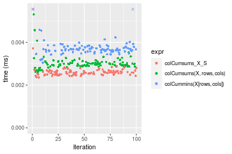

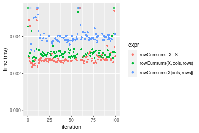
_Table: Benchmarking of colCumsums_X_S() and rowCumsums_X_S() on integer+10x10 data (original and transposed).  The top panel shows times in milliseconds and the bottom panel shows relative times._


|   |expr           |   min|     lq|    mean| median|     uq|     max|
|:--|:--------------|-----:|------:|-------:|------:|------:|-------:|
|1  |colCumsums_X_S | 2.356| 2.5070| 4.00786| 2.5865| 2.6740| 142.918|
|2  |rowCumsums_X_S | 2.350| 2.6605| 2.89172| 2.7205| 2.8165|   6.084|


|   |expr           |       min|       lq|      mean|   median|       uq|       max|
|:--|:--------------|---------:|--------:|---------:|--------:|--------:|---------:|
|1  |colCumsums_X_S | 1.0000000| 1.000000| 1.0000000| 1.000000| 1.000000| 1.0000000|
|2  |rowCumsums_X_S | 0.9974533| 1.061229| 0.7215122| 1.051808| 1.053291| 0.0425699|

_Figure: Benchmarking of colCumsums_X_S() and rowCumsums_X_S() on integer+10x10 data (original and transposed).  Outliers are displayed as crosses. Times are in milliseconds._


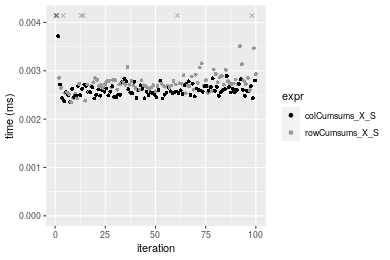

#### 100x100 integer matrix

```r
> X <- data[["100x100"]]
> rows <- sample.int(nrow(X), size = nrow(X) * 0.7)
> cols <- sample.int(ncol(X), size = ncol(X) * 0.7)
> X_S <- X[rows, cols]
> gc()
          used  (Mb) gc trigger  (Mb) max used  (Mb)
Ncells 5178345 276.6    7554717 403.5  7554717 403.5
Vcells 9072344  69.3   31793280 242.6 60508962 461.7
> colStats <- microbenchmark(colCumsums_X_S = colCumsums(X_S), `colCumsums(X, rows, cols)` = colCumsums(X, 
+     rows = rows, cols = cols), `colCummins(X[rows, cols])` = colCumsums(X[rows, cols]), unit = "ms")
> X <- t(X)
> X_S <- t(X_S)
> gc()
          used  (Mb) gc trigger  (Mb) max used  (Mb)
Ncells 5178339 276.6    7554717 403.5  7554717 403.5
Vcells 9077427  69.3   31793280 242.6 60508962 461.7
> rowStats <- microbenchmark(rowCumsums_X_S = rowCumsums(X_S), `rowCumsums(X, cols, rows)` = rowCumsums(X, 
+     rows = cols, cols = rows), `rowCumsums(X[cols, rows])` = rowCumsums(X[cols, rows]), unit = "ms")
```

_Table: Benchmarking of colCumsums_X_S(), colCumsums(X, rows, cols)() and colCummins(X[rows, cols])() on integer+100x100 data. The top panel shows times in milliseconds and the bottom panel shows relative times._


|   |expr                      |      min|        lq|      mean|   median|        uq|      max|
|:--|:-------------------------|--------:|---------:|---------:|--------:|---------:|--------:|
|1  |colCumsums_X_S            | 0.015078| 0.0152545| 0.0155275| 0.015381| 0.0155395| 0.021331|
|2  |colCumsums(X, rows, cols) | 0.023880| 0.0241985| 0.0244677| 0.024303| 0.0244660| 0.030364|
|3  |colCummins(X[rows, cols]) | 0.025986| 0.0263630| 0.0270514| 0.026565| 0.0269100| 0.051681|


|   |expr                      |      min|       lq|     mean|   median|       uq|      max|
|:--|:-------------------------|--------:|--------:|--------:|--------:|--------:|--------:|
|1  |colCumsums_X_S            | 1.000000| 1.000000| 1.000000| 1.000000| 1.000000| 1.000000|
|2  |colCumsums(X, rows, cols) | 1.583764| 1.586319| 1.575765| 1.580066| 1.574439| 1.423468|
|3  |colCummins(X[rows, cols]) | 1.723438| 1.728211| 1.742158| 1.727131| 1.731716| 2.422812|

_Table: Benchmarking of rowCumsums_X_S(), rowCumsums(X, cols, rows)() and rowCumsums(X[cols, rows])() on integer+100x100 data (transposed). The top panel shows times in milliseconds and the bottom panel shows relative times._


|   |expr                      |      min|        lq|      mean|    median|        uq|      max|
|:--|:-------------------------|--------:|---------:|---------:|---------:|---------:|--------:|
|1  |rowCumsums_X_S            | 0.020722| 0.0217515| 0.0222327| 0.0219665| 0.0221505| 0.038553|
|2  |rowCumsums(X, cols, rows) | 0.023558| 0.0244710| 0.0250260| 0.0246485| 0.0247965| 0.057406|
|3  |rowCumsums(X[cols, rows]) | 0.031433| 0.0329940| 0.0334907| 0.0332295| 0.0335910| 0.047728|


|   |expr                      |      min|       lq|     mean|   median|       uq|      max|
|:--|:-------------------------|--------:|--------:|--------:|--------:|--------:|--------:|
|1  |rowCumsums_X_S            | 1.000000| 1.000000| 1.000000| 1.000000| 1.000000| 1.000000|
|2  |rowCumsums(X, cols, rows) | 1.136859| 1.125026| 1.125641| 1.122095| 1.119455| 1.489015|
|3  |rowCumsums(X[cols, rows]) | 1.516890| 1.516861| 1.506375| 1.512735| 1.516490| 1.237984|

_Figure: Benchmarking of colCumsums_X_S(), colCumsums(X, rows, cols)() and colCummins(X[rows, cols])() on integer+100x100 data  as well as rowCumsums_X_S(), rowCumsums(X, cols, rows)() and rowCumsums(X[cols, rows])() on the same data transposed.  Outliers are displayed as crosses.  Times are in milliseconds._


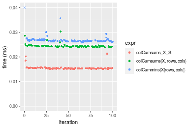

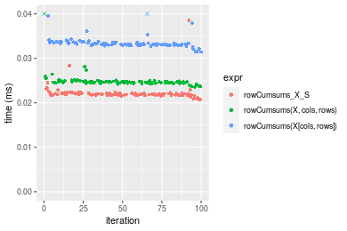
_Table: Benchmarking of colCumsums_X_S() and rowCumsums_X_S() on integer+100x100 data (original and transposed).  The top panel shows times in milliseconds and the bottom panel shows relative times._


|   |expr           |    min|      lq|     mean|  median|      uq|    max|
|:--|:--------------|------:|-------:|--------:|-------:|-------:|------:|
|1  |colCumsums_X_S | 15.078| 15.2545| 15.52751| 15.3810| 15.5395| 21.331|
|2  |rowCumsums_X_S | 20.722| 21.7515| 22.23266| 21.9665| 22.1505| 38.553|


|   |expr           |     min|       lq|     mean|   median|       uq|     max|
|:--|:--------------|-------:|--------:|--------:|--------:|--------:|-------:|
|1  |colCumsums_X_S | 1.00000| 1.000000| 1.000000| 1.000000| 1.000000| 1.00000|
|2  |rowCumsums_X_S | 1.37432| 1.425907| 1.431824| 1.428158| 1.425432| 1.80737|

_Figure: Benchmarking of colCumsums_X_S() and rowCumsums_X_S() on integer+100x100 data (original and transposed).  Outliers are displayed as crosses. Times are in milliseconds._


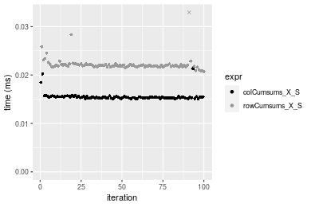

#### 1000x10 integer matrix

```r
> X <- data[["1000x10"]]
> rows <- sample.int(nrow(X), size = nrow(X) * 0.7)
> cols <- sample.int(ncol(X), size = ncol(X) * 0.7)
> X_S <- X[rows, cols]
> gc()
          used  (Mb) gc trigger  (Mb) max used  (Mb)
Ncells 5178545 276.6    7554717 403.5  7554717 403.5
Vcells 9073225  69.3   31793280 242.6 60508962 461.7
> colStats <- microbenchmark(colCumsums_X_S = colCumsums(X_S), `colCumsums(X, rows, cols)` = colCumsums(X, 
+     rows = rows, cols = cols), `colCummins(X[rows, cols])` = colCumsums(X[rows, cols]), unit = "ms")
> X <- t(X)
> X_S <- t(X_S)
> gc()
          used  (Mb) gc trigger  (Mb) max used  (Mb)
Ncells 5178539 276.6    7554717 403.5  7554717 403.5
Vcells 9078308  69.3   31793280 242.6 60508962 461.7
> rowStats <- microbenchmark(rowCumsums_X_S = rowCumsums(X_S), `rowCumsums(X, cols, rows)` = rowCumsums(X, 
+     rows = cols, cols = rows), `rowCumsums(X[cols, rows])` = rowCumsums(X[cols, rows]), unit = "ms")
```

_Table: Benchmarking of colCumsums_X_S(), colCumsums(X, rows, cols)() and colCummins(X[rows, cols])() on integer+1000x10 data. The top panel shows times in milliseconds and the bottom panel shows relative times._


|   |expr                      |      min|        lq|      mean|    median|        uq|      max|
|:--|:-------------------------|--------:|---------:|---------:|---------:|---------:|--------:|
|1  |colCumsums_X_S            | 0.014986| 0.0152135| 0.0155751| 0.0153505| 0.0155010| 0.029554|
|2  |colCumsums(X, rows, cols) | 0.024897| 0.0251685| 0.0255792| 0.0253365| 0.0256285| 0.034479|
|3  |colCummins(X[rows, cols]) | 0.026824| 0.0271010| 0.0281908| 0.0272935| 0.0275785| 0.059659|


|   |expr                      |      min|       lq|     mean|   median|       uq|      max|
|:--|:-------------------------|--------:|--------:|--------:|--------:|--------:|--------:|
|1  |colCumsums_X_S            | 1.000000| 1.000000| 1.000000| 1.000000| 1.000000| 1.000000|
|2  |colCumsums(X, rows, cols) | 1.661351| 1.654353| 1.642310| 1.650533| 1.653345| 1.166644|
|3  |colCummins(X[rows, cols]) | 1.789937| 1.781378| 1.809984| 1.778020| 1.779143| 2.018644|

_Table: Benchmarking of rowCumsums_X_S(), rowCumsums(X, cols, rows)() and rowCumsums(X[cols, rows])() on integer+1000x10 data (transposed). The top panel shows times in milliseconds and the bottom panel shows relative times._


|   |expr                      |      min|        lq|      mean|    median|        uq|      max|
|:--|:-------------------------|--------:|---------:|---------:|---------:|---------:|--------:|
|1  |rowCumsums_X_S            | 0.023028| 0.0236255| 0.0241999| 0.0237995| 0.0241170| 0.040517|
|2  |rowCumsums(X, cols, rows) | 0.027742| 0.0281910| 0.0286811| 0.0283820| 0.0286790| 0.034906|
|3  |rowCumsums(X[cols, rows]) | 0.036672| 0.0372015| 0.0380584| 0.0374740| 0.0378585| 0.072539|


|   |expr                      |      min|       lq|     mean|   median|       uq|       max|
|:--|:-------------------------|--------:|--------:|--------:|--------:|--------:|---------:|
|1  |rowCumsums_X_S            | 1.000000| 1.000000| 1.000000| 1.000000| 1.000000| 1.0000000|
|2  |rowCumsums(X, cols, rows) | 1.204707| 1.193245| 1.185172| 1.192546| 1.189161| 0.8615149|
|3  |rowCumsums(X[cols, rows]) | 1.592496| 1.574633| 1.572666| 1.574571| 1.569785| 1.7903349|

_Figure: Benchmarking of colCumsums_X_S(), colCumsums(X, rows, cols)() and colCummins(X[rows, cols])() on integer+1000x10 data  as well as rowCumsums_X_S(), rowCumsums(X, cols, rows)() and rowCumsums(X[cols, rows])() on the same data transposed.  Outliers are displayed as crosses.  Times are in milliseconds._


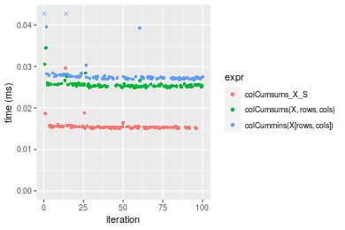

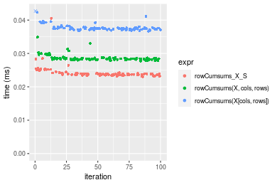
_Table: Benchmarking of colCumsums_X_S() and rowCumsums_X_S() on integer+1000x10 data (original and transposed).  The top panel shows times in milliseconds and the bottom panel shows relative times._


|   |expr           |    min|      lq|     mean|  median|     uq|    max|
|:--|:--------------|------:|-------:|--------:|-------:|------:|------:|
|1  |colCumsums_X_S | 14.986| 15.2135| 15.57514| 15.3505| 15.501| 29.554|
|2  |rowCumsums_X_S | 23.028| 23.6255| 24.19992| 23.7995| 24.117| 40.517|


|   |expr           |      min|      lq|     mean|   median|       uq|      max|
|:--|:--------------|--------:|-------:|--------:|--------:|--------:|--------:|
|1  |colCumsums_X_S | 1.000000| 1.00000| 1.000000| 1.000000| 1.000000| 1.000000|
|2  |rowCumsums_X_S | 1.536634| 1.55293| 1.553753| 1.550406| 1.555835| 1.370948|

_Figure: Benchmarking of colCumsums_X_S() and rowCumsums_X_S() on integer+1000x10 data (original and transposed).  Outliers are displayed as crosses. Times are in milliseconds._


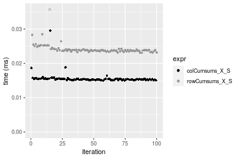

#### 10x1000 integer matrix

```r
> X <- data[["10x1000"]]
> rows <- sample.int(nrow(X), size = nrow(X) * 0.7)
> cols <- sample.int(ncol(X), size = ncol(X) * 0.7)
> X_S <- X[rows, cols]
> gc()
          used  (Mb) gc trigger  (Mb) max used  (Mb)
Ncells 5178750 276.6    7554717 403.5  7554717 403.5
Vcells 9074056  69.3   31793280 242.6 60508962 461.7
> colStats <- microbenchmark(colCumsums_X_S = colCumsums(X_S), `colCumsums(X, rows, cols)` = colCumsums(X, 
+     rows = rows, cols = cols), `colCummins(X[rows, cols])` = colCumsums(X[rows, cols]), unit = "ms")
> X <- t(X)
> X_S <- t(X_S)
> gc()
          used  (Mb) gc trigger  (Mb) max used  (Mb)
Ncells 5178744 276.6    7554717 403.5  7554717 403.5
Vcells 9079139  69.3   31793280 242.6 60508962 461.7
> rowStats <- microbenchmark(rowCumsums_X_S = rowCumsums(X_S), `rowCumsums(X, cols, rows)` = rowCumsums(X, 
+     rows = cols, cols = rows), `rowCumsums(X[cols, rows])` = rowCumsums(X[cols, rows]), unit = "ms")
```

_Table: Benchmarking of colCumsums_X_S(), colCumsums(X, rows, cols)() and colCummins(X[rows, cols])() on integer+10x1000 data. The top panel shows times in milliseconds and the bottom panel shows relative times._


|   |expr                      |      min|        lq|      mean|    median|        uq|      max|
|:--|:-------------------------|--------:|---------:|---------:|---------:|---------:|--------:|
|1  |colCumsums_X_S            | 0.016164| 0.0164885| 0.0172254| 0.0167430| 0.0175585| 0.033175|
|2  |colCumsums(X, rows, cols) | 0.027351| 0.0276935| 0.0283253| 0.0278620| 0.0281325| 0.044117|
|3  |colCummins(X[rows, cols]) | 0.029817| 0.0302075| 0.0311404| 0.0304365| 0.0320095| 0.046788|


|   |expr                      |      min|       lq|     mean|   median|       uq|      max|
|:--|:-------------------------|--------:|--------:|--------:|--------:|--------:|--------:|
|1  |colCumsums_X_S            | 1.000000| 1.000000| 1.000000| 1.000000| 1.000000| 1.000000|
|2  |colCumsums(X, rows, cols) | 1.692093| 1.679564| 1.644393| 1.664098| 1.602216| 1.329827|
|3  |colCummins(X[rows, cols]) | 1.844655| 1.832034| 1.807819| 1.817864| 1.823020| 1.410339|

_Table: Benchmarking of rowCumsums_X_S(), rowCumsums(X, cols, rows)() and rowCumsums(X[cols, rows])() on integer+10x1000 data (transposed). The top panel shows times in milliseconds and the bottom panel shows relative times._


|   |expr                      |      min|        lq|      mean|    median|        uq|      max|
|:--|:-------------------------|--------:|---------:|---------:|---------:|---------:|--------:|
|1  |rowCumsums_X_S            | 0.020043| 0.0203430| 0.0210565| 0.0207165| 0.0214790| 0.027380|
|2  |rowCumsums(X, cols, rows) | 0.023510| 0.0239335| 0.0247495| 0.0241895| 0.0251085| 0.050414|
|3  |rowCumsums(X[cols, rows]) | 0.031952| 0.0323205| 0.0333155| 0.0326070| 0.0339875| 0.048422|


|   |expr                      |      min|       lq|     mean|   median|       uq|      max|
|:--|:-------------------------|--------:|--------:|--------:|--------:|--------:|--------:|
|1  |rowCumsums_X_S            | 1.000000| 1.000000| 1.000000| 1.000000| 1.000000| 1.000000|
|2  |rowCumsums(X, cols, rows) | 1.172978| 1.176498| 1.175388| 1.167644| 1.168979| 1.841271|
|3  |rowCumsums(X[cols, rows]) | 1.594172| 1.588777| 1.582195| 1.573963| 1.582359| 1.768517|

_Figure: Benchmarking of colCumsums_X_S(), colCumsums(X, rows, cols)() and colCummins(X[rows, cols])() on integer+10x1000 data  as well as rowCumsums_X_S(), rowCumsums(X, cols, rows)() and rowCumsums(X[cols, rows])() on the same data transposed.  Outliers are displayed as crosses.  Times are in milliseconds._


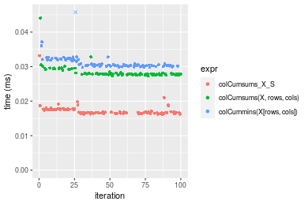

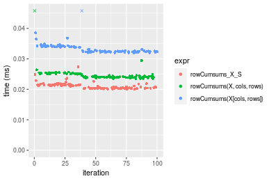
_Table: Benchmarking of colCumsums_X_S() and rowCumsums_X_S() on integer+10x1000 data (original and transposed).  The top panel shows times in milliseconds and the bottom panel shows relative times._


|   |expr           |    min|      lq|     mean|  median|      uq|    max|
|:--|:--------------|------:|-------:|--------:|-------:|-------:|------:|
|1  |colCumsums_X_S | 16.164| 16.4885| 17.22541| 16.7430| 17.5585| 33.175|
|2  |rowCumsums_X_S | 20.043| 20.3430| 21.05649| 20.7165| 21.4790| 27.380|


|   |expr           |      min|       lq|     mean|   median|       uq|       max|
|:--|:--------------|--------:|--------:|--------:|--------:|--------:|---------:|
|1  |colCumsums_X_S | 1.000000| 1.000000| 1.000000| 1.000000| 1.000000| 1.0000000|
|2  |rowCumsums_X_S | 1.239978| 1.233769| 1.222409| 1.237323| 1.223282| 0.8253203|

_Figure: Benchmarking of colCumsums_X_S() and rowCumsums_X_S() on integer+10x1000 data (original and transposed).  Outliers are displayed as crosses. Times are in milliseconds._


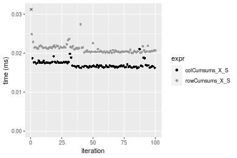

#### 100x1000 integer matrix

```r
> X <- data[["100x1000"]]
> rows <- sample.int(nrow(X), size = nrow(X) * 0.7)
> cols <- sample.int(ncol(X), size = ncol(X) * 0.7)
> X_S <- X[rows, cols]
> gc()
          used  (Mb) gc trigger  (Mb) max used  (Mb)
Ncells 5178960 276.6    7554717 403.5  7554717 403.5
Vcells 9096726  69.5   31793280 242.6 60508962 461.7
> colStats <- microbenchmark(colCumsums_X_S = colCumsums(X_S), `colCumsums(X, rows, cols)` = colCumsums(X, 
+     rows = rows, cols = cols), `colCummins(X[rows, cols])` = colCumsums(X[rows, cols]), unit = "ms")
> X <- t(X)
> X_S <- t(X_S)
> gc()
          used  (Mb) gc trigger  (Mb) max used  (Mb)
Ncells 5178954 276.6    7554717 403.5  7554717 403.5
Vcells 9146809  69.8   31793280 242.6 60508962 461.7
> rowStats <- microbenchmark(rowCumsums_X_S = rowCumsums(X_S), `rowCumsums(X, cols, rows)` = rowCumsums(X, 
+     rows = cols, cols = rows), `rowCumsums(X[cols, rows])` = rowCumsums(X[cols, rows]), unit = "ms")
```

_Table: Benchmarking of colCumsums_X_S(), colCumsums(X, rows, cols)() and colCummins(X[rows, cols])() on integer+100x1000 data. The top panel shows times in milliseconds and the bottom panel shows relative times._


|   |expr                      |      min|        lq|      mean|    median|        uq|      max|
|:--|:-------------------------|--------:|---------:|---------:|---------:|---------:|--------:|
|1  |colCumsums_X_S            | 0.090620| 0.0985225| 0.1077157| 0.1030480| 0.1160365| 0.165373|
|2  |colCumsums(X, rows, cols) | 0.151589| 0.1666765| 0.1812233| 0.1722155| 0.1989635| 0.280863|
|3  |colCummins(X[rows, cols]) | 0.166007| 0.1832420| 0.1999983| 0.1893055| 0.2188905| 0.245082|


|   |expr                      |      min|       lq|     mean|   median|       uq|      max|
|:--|:-------------------------|--------:|--------:|--------:|--------:|--------:|--------:|
|1  |colCumsums_X_S            | 1.000000| 1.000000| 1.000000| 1.000000| 1.000000| 1.000000|
|2  |colCumsums(X, rows, cols) | 1.672799| 1.691761| 1.682422| 1.671216| 1.714663| 1.698361|
|3  |colCummins(X[rows, cols]) | 1.831902| 1.859900| 1.856723| 1.837061| 1.886394| 1.481995|

_Table: Benchmarking of rowCumsums_X_S(), rowCumsums(X, cols, rows)() and rowCumsums(X[cols, rows])() on integer+100x1000 data (transposed). The top panel shows times in milliseconds and the bottom panel shows relative times._


|   |expr                      |      min|        lq|      mean|    median|       uq|      max|
|:--|:-------------------------|--------:|---------:|---------:|---------:|--------:|--------:|
|1  |rowCumsums_X_S            | 0.122374| 0.1371845| 0.1650639| 0.1510930| 0.173808| 0.361733|
|2  |rowCumsums(X, cols, rows) | 0.138146| 0.1463215| 0.1744124| 0.1601350| 0.184100| 0.338477|
|3  |rowCumsums(X[cols, rows]) | 0.189116| 0.2087185| 0.2384822| 0.2277335| 0.253692| 0.446322|


|   |expr                      |      min|       lq|     mean|   median|       uq|       max|
|:--|:-------------------------|--------:|--------:|--------:|--------:|--------:|---------:|
|1  |rowCumsums_X_S            | 1.000000| 1.000000| 1.000000| 1.000000| 1.000000| 1.0000000|
|2  |rowCumsums(X, cols, rows) | 1.128884| 1.066604| 1.056636| 1.059844| 1.059215| 0.9357095|
|3  |rowCumsums(X[cols, rows]) | 1.545394| 1.521444| 1.444788| 1.507241| 1.459611| 1.2338437|

_Figure: Benchmarking of colCumsums_X_S(), colCumsums(X, rows, cols)() and colCummins(X[rows, cols])() on integer+100x1000 data  as well as rowCumsums_X_S(), rowCumsums(X, cols, rows)() and rowCumsums(X[cols, rows])() on the same data transposed.  Outliers are displayed as crosses.  Times are in milliseconds._


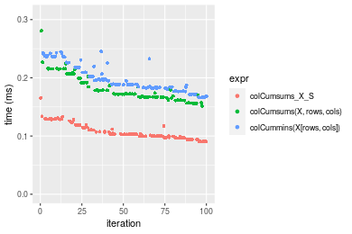

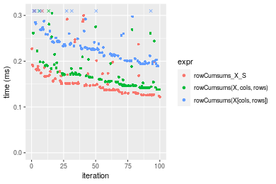
_Table: Benchmarking of colCumsums_X_S() and rowCumsums_X_S() on integer+100x1000 data (original and transposed).  The top panel shows times in milliseconds and the bottom panel shows relative times._


|   |expr           |     min|       lq|     mean|  median|       uq|     max|
|:--|:--------------|-------:|--------:|--------:|-------:|--------:|-------:|
|1  |colCumsums_X_S |  90.620|  98.5225| 107.7157| 103.048| 116.0365| 165.373|
|2  |rowCumsums_X_S | 122.374| 137.1845| 165.0639| 151.093| 173.8080| 361.733|


|   |expr           |      min|       lq|     mean|   median|       uq|      max|
|:--|:--------------|--------:|--------:|--------:|--------:|--------:|--------:|
|1  |colCumsums_X_S | 1.000000| 1.000000| 1.000000| 1.000000| 1.000000| 1.000000|
|2  |rowCumsums_X_S | 1.350408| 1.392418| 1.532402| 1.466239| 1.497874| 2.187376|

_Figure: Benchmarking of colCumsums_X_S() and rowCumsums_X_S() on integer+100x1000 data (original and transposed).  Outliers are displayed as crosses. Times are in milliseconds._


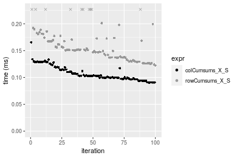

#### 1000x100 integer matrix

```r
> X <- data[["1000x100"]]
> rows <- sample.int(nrow(X), size = nrow(X) * 0.7)
> cols <- sample.int(ncol(X), size = ncol(X) * 0.7)
> X_S <- X[rows, cols]
> gc()
          used  (Mb) gc trigger  (Mb) max used  (Mb)
Ncells 5179173 276.6    7554717 403.5  7554717 403.5
Vcells 9097506  69.5   31793280 242.6 60508962 461.7
> colStats <- microbenchmark(colCumsums_X_S = colCumsums(X_S), `colCumsums(X, rows, cols)` = colCumsums(X, 
+     rows = rows, cols = cols), `colCummins(X[rows, cols])` = colCumsums(X[rows, cols]), unit = "ms")
> X <- t(X)
> X_S <- t(X_S)
> gc()
          used  (Mb) gc trigger  (Mb) max used  (Mb)
Ncells 5179167 276.6    7554717 403.5  7554717 403.5
Vcells 9147589  69.8   31793280 242.6 60508962 461.7
> rowStats <- microbenchmark(rowCumsums_X_S = rowCumsums(X_S), `rowCumsums(X, cols, rows)` = rowCumsums(X, 
+     rows = cols, cols = rows), `rowCumsums(X[cols, rows])` = rowCumsums(X[cols, rows]), unit = "ms")
```

_Table: Benchmarking of colCumsums_X_S(), colCumsums(X, rows, cols)() and colCummins(X[rows, cols])() on integer+1000x100 data. The top panel shows times in milliseconds and the bottom panel shows relative times._


|   |expr                      |      min|        lq|      mean|    median|        uq|      max|
|:--|:-------------------------|--------:|---------:|---------:|---------:|---------:|--------:|
|1  |colCumsums_X_S            | 0.093071| 0.0994620| 0.1088297| 0.1028665| 0.1187235| 0.175346|
|2  |colCumsums(X, rows, cols) | 0.155869| 0.1659045| 0.1870771| 0.1768915| 0.2042335| 0.255181|
|3  |colCummins(X[rows, cols]) | 0.168046| 0.1798535| 0.2069833| 0.1958960| 0.2318720| 0.322307|


|   |expr                      |      min|       lq|     mean|   median|       uq|     max|
|:--|:-------------------------|--------:|--------:|--------:|--------:|--------:|-------:|
|1  |colCumsums_X_S            | 1.000000| 1.000000| 1.000000| 1.000000| 1.000000| 1.00000|
|2  |colCumsums(X, rows, cols) | 1.674732| 1.668019| 1.718989| 1.719622| 1.720245| 1.45530|
|3  |colCummins(X[rows, cols]) | 1.805568| 1.808264| 1.901900| 1.904371| 1.953042| 1.83812|

_Table: Benchmarking of rowCumsums_X_S(), rowCumsums(X, cols, rows)() and rowCumsums(X[cols, rows])() on integer+1000x100 data (transposed). The top panel shows times in milliseconds and the bottom panel shows relative times._


|   |expr                      |      min|        lq|      mean|    median|        uq|      max|
|:--|:-------------------------|--------:|---------:|---------:|---------:|---------:|--------:|
|1  |rowCumsums_X_S            | 0.127101| 0.1427845| 0.1547259| 0.1477725| 0.1664225| 0.200627|
|2  |rowCumsums(X, cols, rows) | 0.149558| 0.1638010| 0.1785156| 0.1695755| 0.1896685| 0.297375|
|3  |rowCumsums(X[cols, rows]) | 0.204415| 0.2220810| 0.2423144| 0.2313880| 0.2612570| 0.310886|


|   |expr                      |      min|       lq|     mean|   median|       uq|      max|
|:--|:-------------------------|--------:|--------:|--------:|--------:|--------:|--------:|
|1  |rowCumsums_X_S            | 1.000000| 1.000000| 1.000000| 1.000000| 1.000000| 1.000000|
|2  |rowCumsums(X, cols, rows) | 1.176686| 1.147190| 1.153753| 1.147544| 1.139681| 1.482228|
|3  |rowCumsums(X[cols, rows]) | 1.608288| 1.555358| 1.566088| 1.565839| 1.569842| 1.549572|

_Figure: Benchmarking of colCumsums_X_S(), colCumsums(X, rows, cols)() and colCummins(X[rows, cols])() on integer+1000x100 data  as well as rowCumsums_X_S(), rowCumsums(X, cols, rows)() and rowCumsums(X[cols, rows])() on the same data transposed.  Outliers are displayed as crosses.  Times are in milliseconds._


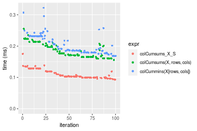

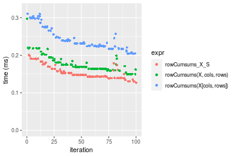
_Table: Benchmarking of colCumsums_X_S() and rowCumsums_X_S() on integer+1000x100 data (original and transposed).  The top panel shows times in milliseconds and the bottom panel shows relative times._


|   |expr           |     min|       lq|     mean|   median|       uq|     max|
|:--|:--------------|-------:|--------:|--------:|--------:|--------:|-------:|
|1  |colCumsums_X_S |  93.071|  99.4620| 108.8297| 102.8665| 118.7235| 175.346|
|2  |rowCumsums_X_S | 127.101| 142.7845| 154.7259| 147.7725| 166.4225| 200.627|


|   |expr           |      min|       lq|     mean|   median|       uq|      max|
|:--|:--------------|--------:|--------:|--------:|--------:|--------:|--------:|
|1  |colCumsums_X_S | 1.000000| 1.000000| 1.000000| 1.000000| 1.000000| 1.000000|
|2  |rowCumsums_X_S | 1.365635| 1.435568| 1.421725| 1.436546| 1.401765| 1.144178|

_Figure: Benchmarking of colCumsums_X_S() and rowCumsums_X_S() on integer+1000x100 data (original and transposed).  Outliers are displayed as crosses. Times are in milliseconds._


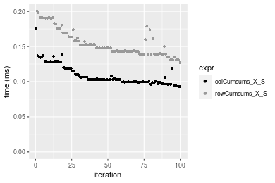


## Data type "double"

### Data
```r
> rmatrix <- function(nrow, ncol, mode = c("logical", "double", "integer", "index"), range = c(-100, 
+     +100), na_prob = 0) {
+     mode <- match.arg(mode)
+     n <- nrow * ncol
+     if (mode == "logical") {
+         x <- sample(c(FALSE, TRUE), size = n, replace = TRUE)
+     }     else if (mode == "index") {
+         x <- seq_len(n)
+         mode <- "integer"
+     }     else {
+         x <- runif(n, min = range[1], max = range[2])
+     }
+     storage.mode(x) <- mode
+     if (na_prob > 0) 
+         x[sample(n, size = na_prob * n)] <- NA
+     dim(x) <- c(nrow, ncol)
+     x
+ }
> rmatrices <- function(scale = 10, seed = 1, ...) {
+     set.seed(seed)
+     data <- list()
+     data[[1]] <- rmatrix(nrow = scale * 1, ncol = scale * 1, ...)
+     data[[2]] <- rmatrix(nrow = scale * 10, ncol = scale * 10, ...)
+     data[[3]] <- rmatrix(nrow = scale * 100, ncol = scale * 1, ...)
+     data[[4]] <- t(data[[3]])
+     data[[5]] <- rmatrix(nrow = scale * 10, ncol = scale * 100, ...)
+     data[[6]] <- t(data[[5]])
+     names(data) <- sapply(data, FUN = function(x) paste(dim(x), collapse = "x"))
+     data
+ }
> data <- rmatrices(mode = mode)
```

### Results

#### 10x10 double matrix

```r
> X <- data[["10x10"]]
> rows <- sample.int(nrow(X), size = nrow(X) * 0.7)
> cols <- sample.int(ncol(X), size = ncol(X) * 0.7)
> X_S <- X[rows, cols]
> gc()
          used  (Mb) gc trigger  (Mb) max used  (Mb)
Ncells 5179390 276.7    7554717 403.5  7554717 403.5
Vcells 9188612  70.2   31793280 242.6 60508962 461.7
> colStats <- microbenchmark(colCumsums_X_S = colCumsums(X_S), `colCumsums(X, rows, cols)` = colCumsums(X, 
+     rows = rows, cols = cols), `colCummins(X[rows, cols])` = colCumsums(X[rows, cols]), unit = "ms")
> X <- t(X)
> X_S <- t(X_S)
> gc()
          used  (Mb) gc trigger  (Mb) max used  (Mb)
Ncells 5179375 276.7    7554717 403.5  7554717 403.5
Vcells 9188780  70.2   31793280 242.6 60508962 461.7
> rowStats <- microbenchmark(rowCumsums_X_S = rowCumsums(X_S), `rowCumsums(X, cols, rows)` = rowCumsums(X, 
+     rows = cols, cols = rows), `rowCumsums(X[cols, rows])` = rowCumsums(X[cols, rows]), unit = "ms")
```

_Table: Benchmarking of colCumsums_X_S(), colCumsums(X, rows, cols)() and colCummins(X[rows, cols])() on double+10x10 data. The top panel shows times in milliseconds and the bottom panel shows relative times._


|   |expr                      |      min|        lq|      mean|    median|        uq|      max|
|:--|:-------------------------|--------:|---------:|---------:|---------:|---------:|--------:|
|1  |colCumsums_X_S            | 0.002003| 0.0021920| 0.0025323| 0.0022415| 0.0023075| 0.026683|
|2  |colCumsums(X, rows, cols) | 0.002226| 0.0024940| 0.0026220| 0.0025775| 0.0026725| 0.005402|
|3  |colCummins(X[rows, cols]) | 0.003010| 0.0032195| 0.0033985| 0.0032860| 0.0034130| 0.010404|


|   |expr                      |      min|       lq|     mean|   median|      uq|       max|
|:--|:-------------------------|--------:|--------:|--------:|--------:|-------:|---------:|
|1  |colCumsums_X_S            | 1.000000| 1.000000| 1.000000| 1.000000| 1.00000| 1.0000000|
|2  |colCumsums(X, rows, cols) | 1.111333| 1.137774| 1.035434| 1.149900| 1.15818| 0.2024510|
|3  |colCummins(X[rows, cols]) | 1.502746| 1.468750| 1.342051| 1.465983| 1.47909| 0.3899112|

_Table: Benchmarking of rowCumsums_X_S(), rowCumsums(X, cols, rows)() and rowCumsums(X[cols, rows])() on double+10x10 data (transposed). The top panel shows times in milliseconds and the bottom panel shows relative times._


|   |expr                      |      min|       lq|      mean|   median|       uq|      max|
|:--|:-------------------------|--------:|--------:|---------:|--------:|--------:|--------:|
|1  |rowCumsums_X_S            | 0.002170| 0.002449| 0.0025898| 0.002535| 0.002629| 0.004765|
|2  |rowCumsums(X, cols, rows) | 0.002678| 0.002809| 0.0030652| 0.002886| 0.002957| 0.017422|
|3  |rowCumsums(X[cols, rows]) | 0.003158| 0.003565| 0.0037174| 0.003683| 0.003807| 0.005669|


|   |expr                      |      min|       lq|     mean|   median|       uq|      max|
|:--|:-------------------------|--------:|--------:|--------:|--------:|--------:|--------:|
|1  |rowCumsums_X_S            | 1.000000| 1.000000| 1.000000| 1.000000| 1.000000| 1.000000|
|2  |rowCumsums(X, cols, rows) | 1.234101| 1.146999| 1.183529| 1.138462| 1.124762| 3.656243|
|3  |rowCumsums(X[cols, rows]) | 1.455299| 1.455696| 1.435374| 1.452860| 1.448079| 1.189717|

_Figure: Benchmarking of colCumsums_X_S(), colCumsums(X, rows, cols)() and colCummins(X[rows, cols])() on double+10x10 data  as well as rowCumsums_X_S(), rowCumsums(X, cols, rows)() and rowCumsums(X[cols, rows])() on the same data transposed.  Outliers are displayed as crosses.  Times are in milliseconds._


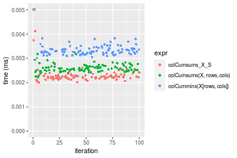

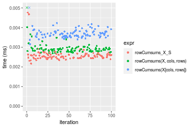
_Table: Benchmarking of colCumsums_X_S() and rowCumsums_X_S() on double+10x10 data (original and transposed).  The top panel shows times in milliseconds and the bottom panel shows relative times._


|   |expr           |   min|    lq|    mean| median|     uq|    max|
|:--|:--------------|-----:|-----:|-------:|------:|------:|------:|
|1  |colCumsums_X_S | 2.003| 2.192| 2.53231| 2.2415| 2.3075| 26.683|
|2  |rowCumsums_X_S | 2.170| 2.449| 2.58984| 2.5350| 2.6290|  4.765|


|   |expr           |      min|       lq|     mean|   median|       uq|       max|
|:--|:--------------|--------:|--------:|--------:|--------:|--------:|---------:|
|1  |colCumsums_X_S | 1.000000| 1.000000| 1.000000| 1.000000| 1.000000| 1.0000000|
|2  |rowCumsums_X_S | 1.083375| 1.117244| 1.022718| 1.130939| 1.139328| 0.1785781|

_Figure: Benchmarking of colCumsums_X_S() and rowCumsums_X_S() on double+10x10 data (original and transposed).  Outliers are displayed as crosses. Times are in milliseconds._


#### 100x100 double matrix

```r
> X <- data[["100x100"]]
> rows <- sample.int(nrow(X), size = nrow(X) * 0.7)
> cols <- sample.int(ncol(X), size = ncol(X) * 0.7)
> X_S <- X[rows, cols]
> gc()
          used  (Mb) gc trigger  (Mb) max used  (Mb)
Ncells 5179587 276.7    7554717 403.5  7554717 403.5
Vcells 9194561  70.2   31793280 242.6 60508962 461.7
> colStats <- microbenchmark(colCumsums_X_S = colCumsums(X_S), `colCumsums(X, rows, cols)` = colCumsums(X, 
+     rows = rows, cols = cols), `colCummins(X[rows, cols])` = colCumsums(X[rows, cols]), unit = "ms")
> X <- t(X)
> X_S <- t(X_S)
> gc()
          used  (Mb) gc trigger  (Mb) max used  (Mb)
Ncells 5179581 276.7    7554717 403.5  7554717 403.5
Vcells 9204644  70.3   31793280 242.6 60508962 461.7
> rowStats <- microbenchmark(rowCumsums_X_S = rowCumsums(X_S), `rowCumsums(X, cols, rows)` = rowCumsums(X, 
+     rows = cols, cols = rows), `rowCumsums(X[cols, rows])` = rowCumsums(X[cols, rows]), unit = "ms")
```

_Table: Benchmarking of colCumsums_X_S(), colCumsums(X, rows, cols)() and colCummins(X[rows, cols])() on double+100x100 data. The top panel shows times in milliseconds and the bottom panel shows relative times._


|   |expr                      |      min|        lq|      mean|    median|       uq|      max|
|:--|:-------------------------|--------:|---------:|---------:|---------:|--------:|--------:|
|1  |colCumsums_X_S            | 0.008714| 0.0091065| 0.0097830| 0.0092470| 0.009482| 0.041217|
|2  |colCumsums(X, rows, cols) | 0.013844| 0.0141300| 0.0144088| 0.0142695| 0.014420| 0.019848|
|3  |colCummins(X[rows, cols]) | 0.025082| 0.0254380| 0.0268037| 0.0256185| 0.025884| 0.081552|


|   |expr                      |      min|       lq|     mean|   median|       uq|       max|
|:--|:-------------------------|--------:|--------:|--------:|--------:|--------:|---------:|
|1  |colCumsums_X_S            | 1.000000| 1.000000| 1.000000| 1.000000| 1.000000| 1.0000000|
|2  |colCumsums(X, rows, cols) | 1.588708| 1.551639| 1.472850| 1.543149| 1.520776| 0.4815489|
|3  |colCummins(X[rows, cols]) | 2.878357| 2.793389| 2.739837| 2.770466| 2.729804| 1.9786011|

_Table: Benchmarking of rowCumsums_X_S(), rowCumsums(X, cols, rows)() and rowCumsums(X[cols, rows])() on double+100x100 data (transposed). The top panel shows times in milliseconds and the bottom panel shows relative times._


|   |expr                      |      min|       lq|      mean|    median|        uq|      max|
|:--|:-------------------------|--------:|--------:|---------:|---------:|---------:|--------:|
|1  |rowCumsums_X_S            | 0.007054| 0.007720| 0.0084850| 0.0081655| 0.0085290| 0.040387|
|2  |rowCumsums(X, cols, rows) | 0.013757| 0.014198| 0.0146477| 0.0143410| 0.0145200| 0.037871|
|3  |rowCumsums(X[cols, rows]) | 0.023566| 0.023846| 0.0245571| 0.0244920| 0.0248365| 0.031436|


|   |expr                      |      min|       lq|     mean|   median|       uq|       max|
|:--|:-------------------------|--------:|--------:|--------:|--------:|--------:|---------:|
|1  |rowCumsums_X_S            | 1.000000| 1.000000| 1.000000| 1.000000| 1.000000| 1.0000000|
|2  |rowCumsums(X, cols, rows) | 1.950241| 1.839119| 1.726304| 1.756292| 1.702427| 0.9377027|
|3  |rowCumsums(X[cols, rows]) | 3.340800| 3.088860| 2.894176| 2.999449| 2.912006| 0.7783693|

_Figure: Benchmarking of colCumsums_X_S(), colCumsums(X, rows, cols)() and colCummins(X[rows, cols])() on double+100x100 data  as well as rowCumsums_X_S(), rowCumsums(X, cols, rows)() and rowCumsums(X[cols, rows])() on the same data transposed.  Outliers are displayed as crosses.  Times are in milliseconds._


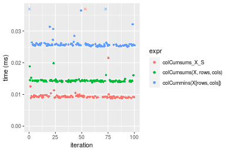

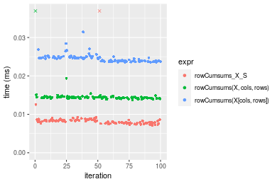
_Table: Benchmarking of colCumsums_X_S() and rowCumsums_X_S() on double+100x100 data (original and transposed).  The top panel shows times in milliseconds and the bottom panel shows relative times._


|   |expr           |   min|     lq|    mean| median|    uq|    max|
|:--|:--------------|-----:|------:|-------:|------:|-----:|------:|
|2  |rowCumsums_X_S | 7.054| 7.7200| 8.48501| 8.1655| 8.529| 40.387|
|1  |colCumsums_X_S | 8.714| 9.1065| 9.78295| 9.2470| 9.482| 41.217|


|   |expr           |      min|       lq|     mean|   median|       uq|      max|
|:--|:--------------|--------:|--------:|--------:|--------:|--------:|--------:|
|2  |rowCumsums_X_S | 1.000000| 1.000000| 1.000000| 1.000000| 1.000000| 1.000000|
|1  |colCumsums_X_S | 1.235327| 1.179598| 1.152969| 1.132448| 1.111736| 1.020551|

_Figure: Benchmarking of colCumsums_X_S() and rowCumsums_X_S() on double+100x100 data (original and transposed).  Outliers are displayed as crosses. Times are in milliseconds._


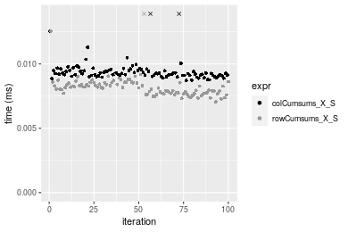

#### 1000x10 double matrix

```r
> X <- data[["1000x10"]]
> rows <- sample.int(nrow(X), size = nrow(X) * 0.7)
> cols <- sample.int(ncol(X), size = ncol(X) * 0.7)
> X_S <- X[rows, cols]
> gc()
          used  (Mb) gc trigger  (Mb) max used  (Mb)
Ncells 5179787 276.7    7554717 403.5  7554717 403.5
Vcells 9195962  70.2   31793280 242.6 60508962 461.7
> colStats <- microbenchmark(colCumsums_X_S = colCumsums(X_S), `colCumsums(X, rows, cols)` = colCumsums(X, 
+     rows = rows, cols = cols), `colCummins(X[rows, cols])` = colCumsums(X[rows, cols]), unit = "ms")
> X <- t(X)
> X_S <- t(X_S)
> gc()
          used  (Mb) gc trigger  (Mb) max used  (Mb)
Ncells 5179781 276.7    7554717 403.5  7554717 403.5
Vcells 9206045  70.3   31793280 242.6 60508962 461.7
> rowStats <- microbenchmark(rowCumsums_X_S = rowCumsums(X_S), `rowCumsums(X, cols, rows)` = rowCumsums(X, 
+     rows = cols, cols = rows), `rowCumsums(X[cols, rows])` = rowCumsums(X[cols, rows]), unit = "ms")
```

_Table: Benchmarking of colCumsums_X_S(), colCumsums(X, rows, cols)() and colCummins(X[rows, cols])() on double+1000x10 data. The top panel shows times in milliseconds and the bottom panel shows relative times._


|   |expr                      |      min|        lq|      mean|    median|       uq|      max|
|:--|:-------------------------|--------:|---------:|---------:|---------:|--------:|--------:|
|1  |colCumsums_X_S            | 0.010789| 0.0110745| 0.0112044| 0.0111740| 0.011281| 0.013561|
|2  |colCumsums(X, rows, cols) | 0.014936| 0.0152600| 0.0157408| 0.0153815| 0.015595| 0.030643|
|3  |colCummins(X[rows, cols]) | 0.027603| 0.0279590| 0.0288596| 0.0281525| 0.028374| 0.060013|


|   |expr                      |      min|       lq|     mean|   median|       uq|      max|
|:--|:-------------------------|--------:|--------:|--------:|--------:|--------:|--------:|
|1  |colCumsums_X_S            | 1.000000| 1.000000| 1.000000| 1.000000| 1.000000| 1.000000|
|2  |colCumsums(X, rows, cols) | 1.384373| 1.377940| 1.404878| 1.376544| 1.382413| 2.259642|
|3  |colCummins(X[rows, cols]) | 2.558439| 2.524629| 2.575748| 2.519465| 2.515203| 4.425411|

_Table: Benchmarking of rowCumsums_X_S(), rowCumsums(X, cols, rows)() and rowCumsums(X[cols, rows])() on double+1000x10 data (transposed). The top panel shows times in milliseconds and the bottom panel shows relative times._


|   |expr                      |      min|       lq|      mean|   median|       uq|      max|
|:--|:-------------------------|--------:|--------:|---------:|--------:|--------:|--------:|
|1  |rowCumsums_X_S            | 0.009361| 0.010291| 0.0113101| 0.010585| 0.011284| 0.041348|
|2  |rowCumsums(X, cols, rows) | 0.017095| 0.017516| 0.0179195| 0.017738| 0.018028| 0.022821|
|3  |rowCumsums(X[cols, rows]) | 0.029225| 0.030022| 0.0306717| 0.030283| 0.030626| 0.058459|


|   |expr                      |      min|       lq|     mean|   median|       uq|       max|
|:--|:-------------------------|--------:|--------:|--------:|--------:|--------:|---------:|
|1  |rowCumsums_X_S            | 1.000000| 1.000000| 1.000000| 1.000000| 1.000000| 1.0000000|
|2  |rowCumsums(X, cols, rows) | 1.826194| 1.702070| 1.584380| 1.675768| 1.597660| 0.5519251|
|3  |rowCumsums(X[cols, rows]) | 3.121996| 2.917306| 2.711886| 2.860935| 2.714109| 1.4138290|

_Figure: Benchmarking of colCumsums_X_S(), colCumsums(X, rows, cols)() and colCummins(X[rows, cols])() on double+1000x10 data  as well as rowCumsums_X_S(), rowCumsums(X, cols, rows)() and rowCumsums(X[cols, rows])() on the same data transposed.  Outliers are displayed as crosses.  Times are in milliseconds._


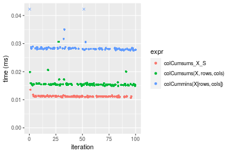

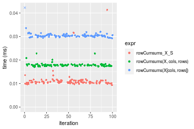
_Table: Benchmarking of colCumsums_X_S() and rowCumsums_X_S() on double+1000x10 data (original and transposed).  The top panel shows times in milliseconds and the bottom panel shows relative times._


|   |expr           |    min|      lq|     mean| median|     uq|    max|
|:--|:--------------|------:|-------:|--------:|------:|------:|------:|
|2  |rowCumsums_X_S |  9.361| 10.2910| 11.31008| 10.585| 11.284| 41.348|
|1  |colCumsums_X_S | 10.789| 11.0745| 11.20436| 11.174| 11.281| 13.561|


|   |expr           |      min|       lq|      mean|   median|        uq|       max|
|:--|:--------------|--------:|--------:|---------:|--------:|---------:|---------:|
|2  |rowCumsums_X_S | 1.000000| 1.000000| 1.0000000| 1.000000| 1.0000000| 1.0000000|
|1  |colCumsums_X_S | 1.152548| 1.076134| 0.9906526| 1.055645| 0.9997341| 0.3279723|

_Figure: Benchmarking of colCumsums_X_S() and rowCumsums_X_S() on double+1000x10 data (original and transposed).  Outliers are displayed as crosses. Times are in milliseconds._


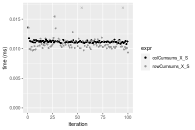

#### 10x1000 double matrix

```r
> X <- data[["10x1000"]]
> rows <- sample.int(nrow(X), size = nrow(X) * 0.7)
> cols <- sample.int(ncol(X), size = ncol(X) * 0.7)
> X_S <- X[rows, cols]
> gc()
          used  (Mb) gc trigger  (Mb) max used  (Mb)
Ncells 5179992 276.7    7554717 403.5  7554717 403.5
Vcells 9196098  70.2   31793280 242.6 60508962 461.7
> colStats <- microbenchmark(colCumsums_X_S = colCumsums(X_S), `colCumsums(X, rows, cols)` = colCumsums(X, 
+     rows = rows, cols = cols), `colCummins(X[rows, cols])` = colCumsums(X[rows, cols]), unit = "ms")
> X <- t(X)
> X_S <- t(X_S)
> gc()
          used  (Mb) gc trigger  (Mb) max used  (Mb)
Ncells 5179986 276.7    7554717 403.5  7554717 403.5
Vcells 9206181  70.3   31793280 242.6 60508962 461.7
> rowStats <- microbenchmark(rowCumsums_X_S = rowCumsums(X_S), `rowCumsums(X, cols, rows)` = rowCumsums(X, 
+     rows = cols, cols = rows), `rowCumsums(X[cols, rows])` = rowCumsums(X[cols, rows]), unit = "ms")
```

_Table: Benchmarking of colCumsums_X_S(), colCumsums(X, rows, cols)() and colCummins(X[rows, cols])() on double+10x1000 data. The top panel shows times in milliseconds and the bottom panel shows relative times._


|   |expr                      |      min|        lq|      mean|   median|        uq|      max|
|:--|:-------------------------|--------:|---------:|---------:|--------:|---------:|--------:|
|1  |colCumsums_X_S            | 0.006926| 0.0076010| 0.0083334| 0.008162| 0.0085225| 0.025163|
|2  |colCumsums(X, rows, cols) | 0.013172| 0.0138095| 0.0145494| 0.014245| 0.0149150| 0.033590|
|3  |colCummins(X[rows, cols]) | 0.023584| 0.0242525| 0.0261357| 0.025956| 0.0263435| 0.056606|


|   |expr                      |      min|       lq|     mean|   median|       uq|      max|
|:--|:-------------------------|--------:|--------:|--------:|--------:|--------:|--------:|
|1  |colCumsums_X_S            | 1.000000| 1.000000| 1.000000| 1.000000| 1.000000| 1.000000|
|2  |colCumsums(X, rows, cols) | 1.901819| 1.816800| 1.745923| 1.745283| 1.750073| 1.334896|
|3  |colCummins(X[rows, cols]) | 3.405140| 3.190699| 3.136275| 3.180103| 3.091053| 2.249573|

_Table: Benchmarking of rowCumsums_X_S(), rowCumsums(X, cols, rows)() and rowCumsums(X[cols, rows])() on double+10x1000 data (transposed). The top panel shows times in milliseconds and the bottom panel shows relative times._


|   |expr                      |      min|        lq|      mean|    median|        uq|      max|
|:--|:-------------------------|--------:|---------:|---------:|---------:|---------:|--------:|
|1  |rowCumsums_X_S            | 0.007121| 0.0078075| 0.0084029| 0.0082855| 0.0087210| 0.014663|
|2  |rowCumsums(X, cols, rows) | 0.015031| 0.0154685| 0.0164107| 0.0156735| 0.0161185| 0.047022|
|3  |rowCumsums(X[cols, rows]) | 0.023984| 0.0246390| 0.0256810| 0.0255755| 0.0262470| 0.041040|


|   |expr                      |      min|       lq|     mean|   median|       uq|      max|
|:--|:-------------------------|--------:|--------:|--------:|--------:|--------:|--------:|
|1  |rowCumsums_X_S            | 1.000000| 1.000000| 1.000000| 1.000000| 1.000000| 1.000000|
|2  |rowCumsums(X, cols, rows) | 2.110799| 1.981236| 1.952969| 1.891678| 1.848240| 3.206847|
|3  |rowCumsums(X[cols, rows]) | 3.368066| 3.155812| 3.056195| 3.086778| 3.009632| 2.798881|

_Figure: Benchmarking of colCumsums_X_S(), colCumsums(X, rows, cols)() and colCummins(X[rows, cols])() on double+10x1000 data  as well as rowCumsums_X_S(), rowCumsums(X, cols, rows)() and rowCumsums(X[cols, rows])() on the same data transposed.  Outliers are displayed as crosses.  Times are in milliseconds._


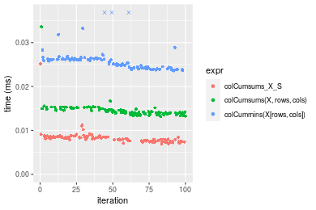

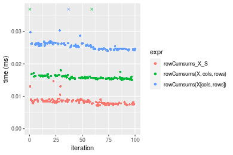
_Table: Benchmarking of colCumsums_X_S() and rowCumsums_X_S() on double+10x1000 data (original and transposed).  The top panel shows times in milliseconds and the bottom panel shows relative times._


|   |expr           |   min|     lq|    mean| median|     uq|    max|
|:--|:--------------|-----:|------:|-------:|------:|------:|------:|
|1  |colCumsums_X_S | 6.926| 7.6010| 8.33337| 8.1620| 8.5225| 25.163|
|2  |rowCumsums_X_S | 7.121| 7.8075| 8.40294| 8.2855| 8.7210| 14.663|


|   |expr           |      min|       lq|     mean|   median|       uq|       max|
|:--|:--------------|--------:|--------:|--------:|--------:|--------:|---------:|
|1  |colCumsums_X_S | 1.000000| 1.000000| 1.000000| 1.000000| 1.000000| 1.0000000|
|2  |rowCumsums_X_S | 1.028155| 1.027168| 1.008348| 1.015131| 1.023291| 0.5827207|

_Figure: Benchmarking of colCumsums_X_S() and rowCumsums_X_S() on double+10x1000 data (original and transposed).  Outliers are displayed as crosses. Times are in milliseconds._


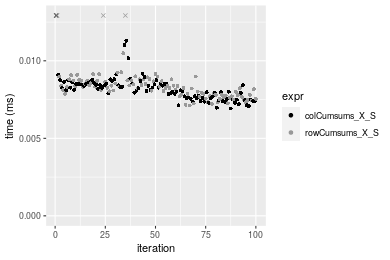

#### 100x1000 double matrix

```r
> X <- data[["100x1000"]]
> rows <- sample.int(nrow(X), size = nrow(X) * 0.7)
> cols <- sample.int(ncol(X), size = ncol(X) * 0.7)
> X_S <- X[rows, cols]
> gc()
          used  (Mb) gc trigger  (Mb) max used  (Mb)
Ncells 5180202 276.7    7554717 403.5  7554717 403.5
Vcells 9241552  70.6   31793280 242.6 60508962 461.7
> colStats <- microbenchmark(colCumsums_X_S = colCumsums(X_S), `colCumsums(X, rows, cols)` = colCumsums(X, 
+     rows = rows, cols = cols), `colCummins(X[rows, cols])` = colCumsums(X[rows, cols]), unit = "ms")
> X <- t(X)
> X_S <- t(X_S)
> gc()
          used  (Mb) gc trigger  (Mb) max used  (Mb)
Ncells 5180196 276.7    7554717 403.5  7554717 403.5
Vcells 9341635  71.3   31793280 242.6 60508962 461.7
> rowStats <- microbenchmark(rowCumsums_X_S = rowCumsums(X_S), `rowCumsums(X, cols, rows)` = rowCumsums(X, 
+     rows = cols, cols = rows), `rowCumsums(X[cols, rows])` = rowCumsums(X[cols, rows]), unit = "ms")
```

_Table: Benchmarking of colCumsums_X_S(), colCumsums(X, rows, cols)() and colCummins(X[rows, cols])() on double+100x1000 data. The top panel shows times in milliseconds and the bottom panel shows relative times._


|   |expr                      |      min|        lq|      mean|    median|        uq|      max|
|:--|:-------------------------|--------:|---------:|---------:|---------:|---------:|--------:|
|1  |colCumsums_X_S            | 0.049680| 0.0529560| 0.0587576| 0.0552390| 0.0628555| 0.103390|
|2  |colCumsums(X, rows, cols) | 0.092682| 0.0957765| 0.1054847| 0.0993675| 0.1154780| 0.215070|
|3  |colCummins(X[rows, cols]) | 0.167871| 0.1802020| 0.1972260| 0.1916365| 0.2149325| 0.270819|


|   |expr                      |      min|       lq|     mean|   median|       uq|      max|
|:--|:-------------------------|--------:|--------:|--------:|--------:|--------:|--------:|
|1  |colCumsums_X_S            | 1.000000| 1.000000| 1.000000| 1.000000| 1.000000| 1.000000|
|2  |colCumsums(X, rows, cols) | 1.865580| 1.808605| 1.795253| 1.798865| 1.837198| 2.080182|
|3  |colCummins(X[rows, cols]) | 3.379046| 3.402863| 3.356606| 3.469225| 3.419470| 2.619393|

_Table: Benchmarking of rowCumsums_X_S(), rowCumsums(X, cols, rows)() and rowCumsums(X[cols, rows])() on double+100x1000 data (transposed). The top panel shows times in milliseconds and the bottom panel shows relative times._


|   |expr                      |      min|        lq|      mean|    median|        uq|      max|
|:--|:-------------------------|--------:|---------:|---------:|---------:|---------:|--------:|
|1  |rowCumsums_X_S            | 0.041039| 0.0433530| 0.0493181| 0.0481225| 0.0524060| 0.096854|
|2  |rowCumsums(X, cols, rows) | 0.088550| 0.0914345| 0.1021283| 0.0976640| 0.1105510| 0.216169|
|3  |rowCumsums(X[cols, rows]) | 0.160818| 0.1704605| 0.1884259| 0.1851570| 0.2057895| 0.276527|


|   |expr                      |      min|       lq|     mean|   median|       uq|      max|
|:--|:-------------------------|--------:|--------:|--------:|--------:|--------:|--------:|
|1  |rowCumsums_X_S            | 1.000000| 1.000000| 1.000000| 1.000000| 1.000000| 1.000000|
|2  |rowCumsums(X, cols, rows) | 2.157704| 2.109070| 2.070809| 2.029487| 2.109510| 2.231906|
|3  |rowCumsums(X[cols, rows]) | 3.918663| 3.931919| 3.820626| 3.847618| 3.926831| 2.855091|

_Figure: Benchmarking of colCumsums_X_S(), colCumsums(X, rows, cols)() and colCummins(X[rows, cols])() on double+100x1000 data  as well as rowCumsums_X_S(), rowCumsums(X, cols, rows)() and rowCumsums(X[cols, rows])() on the same data transposed.  Outliers are displayed as crosses.  Times are in milliseconds._


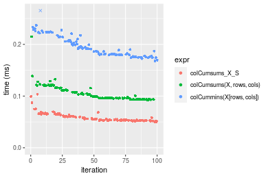

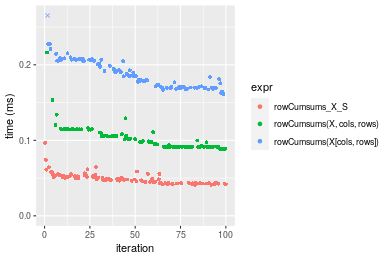
_Table: Benchmarking of colCumsums_X_S() and rowCumsums_X_S() on double+100x1000 data (original and transposed).  The top panel shows times in milliseconds and the bottom panel shows relative times._


|   |expr           |    min|     lq|     mean|  median|      uq|     max|
|:--|:--------------|------:|------:|--------:|-------:|-------:|-------:|
|2  |rowCumsums_X_S | 41.039| 43.353| 49.31807| 48.1225| 52.4060|  96.854|
|1  |colCumsums_X_S | 49.680| 52.956| 58.75757| 55.2390| 62.8555| 103.390|


|   |expr           |      min|       lq|   mean|   median|       uq|      max|
|:--|:--------------|--------:|--------:|------:|--------:|--------:|--------:|
|2  |rowCumsums_X_S | 1.000000| 1.000000| 1.0000| 1.000000| 1.000000| 1.000000|
|1  |colCumsums_X_S | 1.210556| 1.221507| 1.1914| 1.147883| 1.199395| 1.067483|

_Figure: Benchmarking of colCumsums_X_S() and rowCumsums_X_S() on double+100x1000 data (original and transposed).  Outliers are displayed as crosses. Times are in milliseconds._


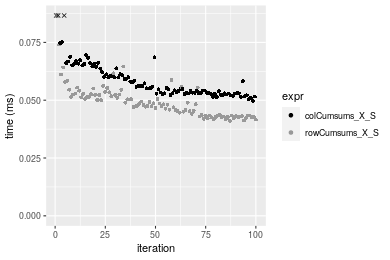

#### 1000x100 double matrix

```r
> X <- data[["1000x100"]]
> rows <- sample.int(nrow(X), size = nrow(X) * 0.7)
> cols <- sample.int(ncol(X), size = ncol(X) * 0.7)
> X_S <- X[rows, cols]
> gc()
          used  (Mb) gc trigger  (Mb) max used  (Mb)
Ncells 5180415 276.7    7554717 403.5  7554717 403.5
Vcells 9241696  70.6   31793280 242.6 60508962 461.7
> colStats <- microbenchmark(colCumsums_X_S = colCumsums(X_S), `colCumsums(X, rows, cols)` = colCumsums(X, 
+     rows = rows, cols = cols), `colCummins(X[rows, cols])` = colCumsums(X[rows, cols]), unit = "ms")
> X <- t(X)
> X_S <- t(X_S)
> gc()
          used  (Mb) gc trigger  (Mb) max used  (Mb)
Ncells 5180409 276.7    7554717 403.5  7554717 403.5
Vcells 9341779  71.3   31793280 242.6 60508962 461.7
> rowStats <- microbenchmark(rowCumsums_X_S = rowCumsums(X_S), `rowCumsums(X, cols, rows)` = rowCumsums(X, 
+     rows = cols, cols = rows), `rowCumsums(X[cols, rows])` = rowCumsums(X[cols, rows]), unit = "ms")
```

_Table: Benchmarking of colCumsums_X_S(), colCumsums(X, rows, cols)() and colCummins(X[rows, cols])() on double+1000x100 data. The top panel shows times in milliseconds and the bottom panel shows relative times._


|   |expr                      |      min|        lq|      mean|    median|        uq|      max|
|:--|:-------------------------|--------:|---------:|---------:|---------:|---------:|--------:|
|1  |colCumsums_X_S            | 0.063523| 0.0663655| 0.0731867| 0.0687945| 0.0780490| 0.116755|
|2  |colCumsums(X, rows, cols) | 0.085553| 0.0902500| 0.0993743| 0.0975505| 0.1063755| 0.173982|
|3  |colCummins(X[rows, cols]) | 0.178131| 0.1860545| 0.2102233| 0.2041575| 0.2293815| 0.357688|


|   |expr                      |      min|       lq|     mean|   median|       uq|      max|
|:--|:-------------------------|--------:|--------:|--------:|--------:|--------:|--------:|
|1  |colCumsums_X_S            | 1.000000| 1.000000| 1.000000| 1.000000| 1.000000| 1.000000|
|2  |colCumsums(X, rows, cols) | 1.346804| 1.359893| 1.357819| 1.417998| 1.362932| 1.490146|
|3  |colCummins(X[rows, cols]) | 2.804197| 2.803482| 2.872425| 2.967643| 2.938942| 3.063578|

_Table: Benchmarking of rowCumsums_X_S(), rowCumsums(X, cols, rows)() and rowCumsums(X[cols, rows])() on double+1000x100 data (transposed). The top panel shows times in milliseconds and the bottom panel shows relative times._


|   |expr                      |      min|        lq|      mean|    median|       uq|      max|
|:--|:-------------------------|--------:|---------:|---------:|---------:|--------:|--------:|
|1  |rowCumsums_X_S            | 0.042228| 0.0453995| 0.0513375| 0.0482310| 0.052909| 0.099519|
|2  |rowCumsums(X, cols, rows) | 0.094616| 0.0994170| 0.1097773| 0.1065720| 0.119569| 0.235060|
|3  |rowCumsums(X[cols, rows]) | 0.169288| 0.1758050| 0.1983652| 0.1959215| 0.212306| 0.267079|


|   |expr                      |      min|       lq|     mean|   median|       uq|      max|
|:--|:-------------------------|--------:|--------:|--------:|--------:|--------:|--------:|
|1  |rowCumsums_X_S            | 1.000000| 1.000000| 1.000000| 1.000000| 1.000000| 1.000000|
|2  |rowCumsums(X, cols, rows) | 2.240599| 2.189826| 2.138344| 2.209616| 2.259899| 2.361961|
|3  |rowCumsums(X[cols, rows]) | 4.008904| 3.872400| 3.863941| 4.062149| 4.012663| 2.683699|

_Figure: Benchmarking of colCumsums_X_S(), colCumsums(X, rows, cols)() and colCummins(X[rows, cols])() on double+1000x100 data  as well as rowCumsums_X_S(), rowCumsums(X, cols, rows)() and rowCumsums(X[cols, rows])() on the same data transposed.  Outliers are displayed as crosses.  Times are in milliseconds._


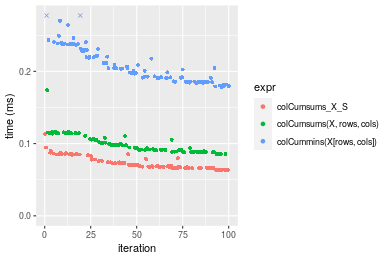

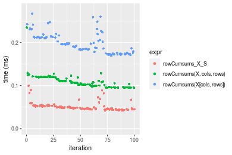
_Table: Benchmarking of colCumsums_X_S() and rowCumsums_X_S() on double+1000x100 data (original and transposed).  The top panel shows times in milliseconds and the bottom panel shows relative times._


|   |expr           |    min|      lq|     mean|  median|     uq|     max|
|:--|:--------------|------:|-------:|--------:|-------:|------:|-------:|
|2  |rowCumsums_X_S | 42.228| 45.3995| 51.33753| 48.2310| 52.909|  99.519|
|1  |colCumsums_X_S | 63.523| 66.3655| 73.18669| 68.7945| 78.049| 116.755|


|   |expr           |      min|       lq|     mean|   median|       uq|      max|
|:--|:--------------|--------:|--------:|--------:|--------:|--------:|--------:|
|2  |rowCumsums_X_S | 1.000000| 1.000000| 1.000000| 1.000000| 1.000000| 1.000000|
|1  |colCumsums_X_S | 1.504286| 1.461811| 1.425598| 1.426354| 1.475156| 1.173193|

_Figure: Benchmarking of colCumsums_X_S() and rowCumsums_X_S() on double+1000x100 data (original and transposed).  Outliers are displayed as crosses. Times are in milliseconds._


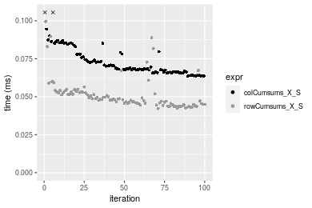


## Appendix

### Session information
```r
R version 4.1.1 Patched (2021-08-10 r80727)
Platform: x86_64-pc-linux-gnu (64-bit)
Running under: Ubuntu 18.04.5 LTS

Matrix products: default
BLAS:   /home/hb/software/R-devel/R-4-1-branch/lib/R/lib/libRblas.so
LAPACK: /home/hb/software/R-devel/R-4-1-branch/lib/R/lib/libRlapack.so

locale:
 [1] LC_CTYPE=en_US.UTF-8       LC_NUMERIC=C              
 [3] LC_TIME=en_US.UTF-8        LC_COLLATE=en_US.UTF-8    
 [5] LC_MONETARY=en_US.UTF-8    LC_MESSAGES=en_US.UTF-8   
 [7] LC_PAPER=en_US.UTF-8       LC_NAME=C                 
 [9] LC_ADDRESS=C               LC_TELEPHONE=C            
[11] LC_MEASUREMENT=en_US.UTF-8 LC_IDENTIFICATION=C       

attached base packages:
[1] stats     graphics  grDevices utils     datasets  methods   base     

other attached packages:
[1] microbenchmark_1.4-7   matrixStats_0.60.0     ggplot2_3.3.5         
[4] knitr_1.33             R.devices_2.17.0       R.utils_2.10.1        
[7] R.oo_1.24.0            R.methodsS3_1.8.1-9001

loaded via a namespace (and not attached):
 [1] Biobase_2.52.0          httr_1.4.2              splines_4.1.1          
 [4] bit64_4.0.5             network_1.17.1          assertthat_0.2.1       
 [7] highr_0.9               stats4_4.1.1            blob_1.2.2             
[10] GenomeInfoDbData_1.2.6  robustbase_0.93-8       pillar_1.6.2           
[13] RSQLite_2.2.8           lattice_0.20-44         glue_1.4.2             
[16] digest_0.6.27           XVector_0.32.0          colorspace_2.0-2       
[19] Matrix_1.3-4            XML_3.99-0.7            pkgconfig_2.0.3        
[22] zlibbioc_1.38.0         genefilter_1.74.0       purrr_0.3.4            
[25] ergm_4.1.2              xtable_1.8-4            scales_1.1.1           
[28] tibble_3.1.4            annotate_1.70.0         KEGGREST_1.32.0        
[31] farver_2.1.0            generics_0.1.0          IRanges_2.26.0         
[34] ellipsis_0.3.2          cachem_1.0.6            withr_2.4.2            
[37] BiocGenerics_0.38.0     mime_0.11               survival_3.2-13        
[40] magrittr_2.0.1          crayon_1.4.1            statnet.common_4.5.0   
[43] memoise_2.0.0           laeken_0.5.1            fansi_0.5.0            
[46] R.cache_0.15.0          MASS_7.3-54             R.rsp_0.44.0           
[49] tools_4.1.1             lifecycle_1.0.0         S4Vectors_0.30.0       
[52] trust_0.1-8             munsell_0.5.0           AnnotationDbi_1.54.1   
[55] Biostrings_2.60.2       compiler_4.1.1          GenomeInfoDb_1.28.1    
[58] rlang_0.4.11            grid_4.1.1              RCurl_1.98-1.4         
[61] cwhmisc_6.6             rappdirs_0.3.3          labeling_0.4.2         
[64] bitops_1.0-7            base64enc_0.1-3         boot_1.3-28            
[67] gtable_0.3.0            DBI_1.1.1               markdown_1.1           
[70] R6_2.5.1                lpSolveAPI_5.5.2.0-17.7 rle_0.9.2              
[73] dplyr_1.0.7             fastmap_1.1.0           bit_4.0.4              
[76] utf8_1.2.2              parallel_4.1.1          Rcpp_1.0.7             
[79] vctrs_0.3.8             png_0.1-7               DEoptimR_1.0-9         
[82] tidyselect_1.1.1        xfun_0.25               coda_0.19-4            
```
Total processing time was 23.3 secs.


### Reproducibility
To reproduce this report, do:
```r
html <- matrixStats:::benchmark('colRowCumsums_subset')
```

[RSP]: https://cran.r-project.org/package=R.rsp
[matrixStats]: https://cran.r-project.org/package=matrixStats

[StackOverflow:colMins?]: https://stackoverflow.com/questions/13676878 "Stack Overflow: fastest way to get Min from every column in a matrix?"
[StackOverflow:colSds?]: https://stackoverflow.com/questions/17549762 "Stack Overflow: Is there such 'colsd' in R?"
[StackOverflow:rowProds?]: https://stackoverflow.com/questions/20198801/ "Stack Overflow: Row product of matrix and column sum of matrix"

---------------------------------------
Copyright Dongcan Jiang. Last updated on 2021-08-25 17:39:02 (+0200 UTC). Powered by [RSP].

<script>
 var link = document.createElement('link');
 link.rel = 'icon';
 link.href = "data:image/png;base64,iVBORw0KGgoAAAANSUhEUgAAACAAAAAgCAMAAABEpIrGAAAA21BMVEUAAAAAAP8AAP8AAP8AAP8AAP8AAP8AAP8AAP8AAP8AAP8AAP8AAP8AAP8AAP8AAP8AAP8AAP8AAP8AAP8AAP8AAP8AAP8AAP8AAP8AAP8AAP8AAP8AAP8AAP8AAP8AAP8AAP8AAP8AAP8AAP8AAP8AAP8AAP8AAP8AAP8AAP8BAf4CAv0DA/wdHeIeHuEfH+AgIN8hId4lJdomJtknJ9g+PsE/P8BAQL9yco10dIt1dYp3d4h4eIeVlWqWlmmXl2iYmGeZmWabm2Tn5xjo6Bfp6Rb39wj4+Af//wA2M9hbAAAASXRSTlMAAQIJCgsMJSYnKD4/QGRlZmhpamtsbautrrCxuru8y8zN5ebn6Pn6+///////////////////////////////////////////LsUNcQAAAS9JREFUOI29k21XgkAQhVcFytdSMqMETU26UVqGmpaiFbL//xc1cAhhwVNf6n5i5z67M2dmYOyfJZUqlVLhkKucG7cgmUZTybDz6g0iDeq51PUr37Ds2cy2/C9NeES5puDjxuUk1xnToZsg8pfA3avHQ3lLIi7iWRrkv/OYtkScxBIMgDee0ALoyxHQBJ68JLCjOtQIMIANF7QG9G9fNnHvisCHBVMKgSJgiz7nE+AoBKrAPA3MgepvgR9TSCasrCKH0eB1wBGBFdCO+nAGjMVGPcQb5bd6mQRegN6+1axOs9nGfYcCtfi4NQosdtH7dB+txFIpXQqN1p9B/asRHToyS0jRgpV7nk4nwcq1BJ+x3Gl/v7S9Wmpp/aGquum7w3ZDyrADFYrl8vHBH+ev9AUASW1dmU4h4wAAAABJRU5ErkJggg=="
 document.getElementsByTagName('head')[0].appendChild(link);
</script>


