[matrixStats]: Benchmark report

---------------------------------------


# colLogSumExps() and rowLogSumExps() benchmarks

This report benchmark the performance of colLogSumExps() and rowLogSumExps() against alternative methods.

## Alternative methods

* apply() + matrixStats::logSumExp()
* apply() + logSumExp0()

where

```r
> logSumExp0 <- function(lx, ...) {
+     iMax <- which.max(lx)
+     log1p(sum(exp(lx[-iMax] - lx[iMax]))) + lx[iMax]
+ }
```


## Data
```r
> rmatrix <- function(nrow, ncol, mode = c("logical", "double", "integer", "index"), range = c(-100, 
+     +100), na_prob = 0) {
+     mode <- match.arg(mode)
+     n <- nrow * ncol
+     if (mode == "logical") {
+         x <- sample(c(FALSE, TRUE), size = n, replace = TRUE)
+     }     else if (mode == "index") {
+         x <- seq_len(n)
+         mode <- "integer"
+     }     else {
+         x <- runif(n, min = range[1], max = range[2])
+     }
+     storage.mode(x) <- mode
+     if (na_prob > 0) 
+         x[sample(n, size = na_prob * n)] <- NA
+     dim(x) <- c(nrow, ncol)
+     x
+ }
> rmatrices <- function(scale = 10, seed = 1, ...) {
+     set.seed(seed)
+     data <- list()
+     data[[1]] <- rmatrix(nrow = scale * 1, ncol = scale * 1, ...)
+     data[[2]] <- rmatrix(nrow = scale * 10, ncol = scale * 10, ...)
+     data[[3]] <- rmatrix(nrow = scale * 100, ncol = scale * 1, ...)
+     data[[4]] <- t(data[[3]])
+     data[[5]] <- rmatrix(nrow = scale * 10, ncol = scale * 100, ...)
+     data[[6]] <- t(data[[5]])
+     names(data) <- sapply(data, FUN = function(x) paste(dim(x), collapse = "x"))
+     data
+ }
> data <- rmatrices(mode = "double")
```

## Results

### 10x10 matrix


```r
> X <- data[["10x10"]]
> gc()
          used  (Mb) gc trigger  (Mb) max used  (Mb)
Ncells 5177172 276.5   10014072 534.9  8429723 450.2
Vcells 9740960  74.4   18204443 138.9 17517433 133.7
> colStats <- microbenchmark(colLogSumExps = colLogSumExps(X, na.rm = FALSE), `apply+logSumExp` = apply(X, 
+     MARGIN = 2L, FUN = logSumExp, na.rm = FALSE), `apply+logSumExp0` = apply(X, MARGIN = 2L, FUN = logSumExp0, 
+     na.rm = FALSE), unit = "ms")
> X <- t(X)
> gc()
          used  (Mb) gc trigger  (Mb) max used  (Mb)
Ncells 5161871 275.7   10014072 534.9  8429723 450.2
Vcells 9690579  74.0   18204443 138.9 17517433 133.7
> rowStats <- microbenchmark(rowLogSumExps = rowLogSumExps(X, na.rm = FALSE), `apply+logSumExp` = apply(X, 
+     MARGIN = 1L, FUN = logSumExp, na.rm = FALSE), `apply+logSumExp0` = apply(X, MARGIN = 1L, FUN = logSumExp0, 
+     na.rm = FALSE), unit = "ms")
```

_Table: Benchmarking of colLogSumExps(), apply+logSumExp() and apply+logSumExp0() on 10x10 data. The top panel shows times in milliseconds and the bottom panel shows relative times._


|   |expr             |      min|        lq|      mean|    median|       uq|      max|
|:--|:----------------|--------:|---------:|---------:|---------:|--------:|--------:|
|1  |colLogSumExps    | 0.003947| 0.0044990| 0.0053883| 0.0050300| 0.005441| 0.020105|
|2  |apply+logSumExp  | 0.043889| 0.0469055| 0.0509127| 0.0502795| 0.052233| 0.140598|
|3  |apply+logSumExp0 | 0.062299| 0.0647660| 0.0691546| 0.0682880| 0.071329| 0.171047|


|   |expr             |      min|       lq|      mean|    median|       uq|      max|
|:--|:----------------|--------:|--------:|---------:|---------:|--------:|--------:|
|1  |colLogSumExps    |  1.00000|  1.00000|  1.000000|  1.000000|  1.00000| 1.000000|
|2  |apply+logSumExp  | 11.11958| 10.42576|  9.448722|  9.995924|  9.59989| 6.993186|
|3  |apply+logSumExp0 | 15.78389| 14.39564| 12.834175| 13.576143| 13.10954| 8.507685|

_Table: Benchmarking of rowLogSumExps(), apply+logSumExp() and apply+logSumExp0() on 10x10 data (transposed). The top panel shows times in milliseconds and the bottom panel shows relative times._


|   |expr             |      min|       lq|      mean|    median|        uq|      max|
|:--|:----------------|--------:|--------:|---------:|---------:|---------:|--------:|
|1  |rowLogSumExps    | 0.003778| 0.004441| 0.0051114| 0.0050235| 0.0052935| 0.018875|
|2  |apply+logSumExp  | 0.044624| 0.046574| 0.0492895| 0.0479260| 0.0504065| 0.078266|
|3  |apply+logSumExp0 | 0.060719| 0.063385| 0.0676514| 0.0655110| 0.0692760| 0.156715|


|   |expr             |      min|       lq|      mean|   median|        uq|      max|
|:--|:----------------|--------:|--------:|---------:|--------:|---------:|--------:|
|1  |rowLogSumExps    |  1.00000|  1.00000|  1.000000|  1.00000|  1.000000| 1.000000|
|2  |apply+logSumExp  | 11.81154| 10.48728|  9.643049|  9.54036|  9.522339| 4.146543|
|3  |apply+logSumExp0 | 16.07173| 14.27269| 13.235386| 13.04091| 13.086994| 8.302782|

_Figure: Benchmarking of colLogSumExps(), apply+logSumExp() and apply+logSumExp0() on 10x10 data  as well as rowLogSumExps(), apply+logSumExp() and apply+logSumExp0() on the same data transposed.  Outliers are displayed as crosses.  Times are in milliseconds._


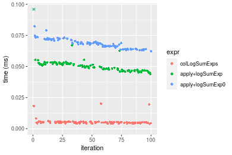

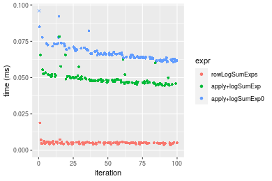
_Table: Benchmarking of colLogSumExps() and rowLogSumExps() on 10x10 data (original and transposed).  The top panel shows times in milliseconds and the bottom panel shows relative times._


|   |expr          |   min|    lq|    mean| median|     uq|    max|
|:--|:-------------|-----:|-----:|-------:|------:|------:|------:|
|2  |rowLogSumExps | 3.778| 4.441| 5.11140| 5.0235| 5.2935| 18.875|
|1  |colLogSumExps | 3.947| 4.499| 5.38832| 5.0300| 5.4410| 20.105|


|   |expr          |      min|      lq|     mean|   median|       uq|      max|
|:--|:-------------|--------:|-------:|--------:|--------:|--------:|--------:|
|2  |rowLogSumExps | 1.000000| 1.00000| 1.000000| 1.000000| 1.000000| 1.000000|
|1  |colLogSumExps | 1.044733| 1.01306| 1.054177| 1.001294| 1.027864| 1.065166|

_Figure: Benchmarking of colLogSumExps() and rowLogSumExps() on 10x10 data (original and transposed).  Outliers are displayed as crosses. Times are in milliseconds._


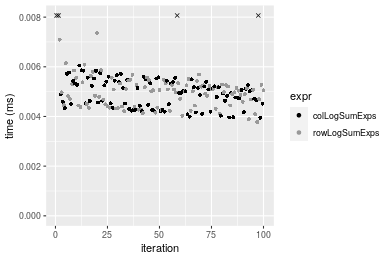

### 100x100 matrix


```r
> X <- data[["100x100"]]
> gc()
          used  (Mb) gc trigger  (Mb) max used  (Mb)
Ncells 5161076 275.7   10014072 534.9  8429723 450.2
Vcells 9307552  71.1   18204443 138.9 17517433 133.7
> colStats <- microbenchmark(colLogSumExps = colLogSumExps(X, na.rm = FALSE), `apply+logSumExp` = apply(X, 
+     MARGIN = 2L, FUN = logSumExp, na.rm = FALSE), `apply+logSumExp0` = apply(X, MARGIN = 2L, FUN = logSumExp0, 
+     na.rm = FALSE), unit = "ms")
> X <- t(X)
> gc()
          used  (Mb) gc trigger  (Mb) max used  (Mb)
Ncells 5161052 275.7   10014072 534.9  8429723 450.2
Vcells 9317565  71.1   18204443 138.9 17517433 133.7
> rowStats <- microbenchmark(rowLogSumExps = rowLogSumExps(X, na.rm = FALSE), `apply+logSumExp` = apply(X, 
+     MARGIN = 1L, FUN = logSumExp, na.rm = FALSE), `apply+logSumExp0` = apply(X, MARGIN = 1L, FUN = logSumExp0, 
+     na.rm = FALSE), unit = "ms")
```

_Table: Benchmarking of colLogSumExps(), apply+logSumExp() and apply+logSumExp0() on 100x100 data. The top panel shows times in milliseconds and the bottom panel shows relative times._


|   |expr             |      min|        lq|      mean|    median|        uq|      max|
|:--|:----------------|--------:|---------:|---------:|---------:|---------:|--------:|
|1  |colLogSumExps    | 0.143889| 0.1452145| 0.1622381| 0.1462550| 0.1772955| 0.260263|
|2  |apply+logSumExp  | 0.375447| 0.3796420| 0.4259860| 0.3894725| 0.4565545| 0.667414|
|3  |apply+logSumExp0 | 0.523910| 0.5321035| 0.6002387| 0.5448570| 0.6325715| 1.078091|


|   |expr             |      min|       lq|     mean|   median|       uq|      max|
|:--|:----------------|--------:|--------:|--------:|--------:|--------:|--------:|
|1  |colLogSumExps    | 1.000000| 1.000000| 1.000000| 1.000000| 1.000000| 1.000000|
|2  |apply+logSumExp  | 2.609282| 2.614353| 2.625684| 2.662969| 2.575105| 2.564383|
|3  |apply+logSumExp0 | 3.641071| 3.664259| 3.699740| 3.725391| 3.567894| 4.142314|

_Table: Benchmarking of rowLogSumExps(), apply+logSumExp() and apply+logSumExp0() on 100x100 data (transposed). The top panel shows times in milliseconds and the bottom panel shows relative times._


|   |expr             |      min|        lq|      mean|    median|       uq|      max|
|:--|:----------------|--------:|---------:|---------:|---------:|--------:|--------:|
|1  |rowLogSumExps    | 0.151674| 0.1530585| 0.1701265| 0.1542530| 0.183900| 0.262543|
|2  |apply+logSumExp  | 0.376025| 0.3796140| 0.4233891| 0.3842545| 0.447411| 0.671846|
|3  |apply+logSumExp0 | 0.523607| 0.5341585| 0.6010811| 0.5505110| 0.658857| 1.101675|


|   |expr             |      min|       lq|     mean|   median|       uq|      max|
|:--|:----------------|--------:|--------:|--------:|--------:|--------:|--------:|
|1  |rowLogSumExps    | 1.000000| 1.000000| 1.000000| 1.000000| 1.000000| 1.000000|
|2  |apply+logSumExp  | 2.479166| 2.480189| 2.488672| 2.491067| 2.432904| 2.558994|
|3  |apply+logSumExp0 | 3.452187| 3.489898| 3.533142| 3.568884| 3.582692| 4.196170|

_Figure: Benchmarking of colLogSumExps(), apply+logSumExp() and apply+logSumExp0() on 100x100 data  as well as rowLogSumExps(), apply+logSumExp() and apply+logSumExp0() on the same data transposed.  Outliers are displayed as crosses.  Times are in milliseconds._


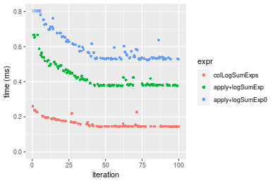

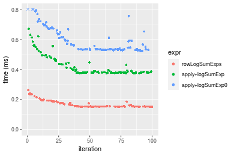
_Table: Benchmarking of colLogSumExps() and rowLogSumExps() on 100x100 data (original and transposed).  The top panel shows times in milliseconds and the bottom panel shows relative times._


|   |expr          |     min|       lq|     mean|  median|       uq|     max|
|:--|:-------------|-------:|--------:|--------:|-------:|--------:|-------:|
|1  |colLogSumExps | 143.889| 145.2145| 162.2381| 146.255| 177.2955| 260.263|
|2  |rowLogSumExps | 151.674| 153.0585| 170.1265| 154.253| 183.9000| 262.543|


|   |expr          |      min|       lq|     mean|   median|       uq|     max|
|:--|:-------------|--------:|--------:|--------:|--------:|--------:|-------:|
|1  |colLogSumExps | 1.000000| 1.000000| 1.000000| 1.000000| 1.000000| 1.00000|
|2  |rowLogSumExps | 1.054104| 1.054017| 1.048623| 1.054685| 1.037251| 1.00876|

_Figure: Benchmarking of colLogSumExps() and rowLogSumExps() on 100x100 data (original and transposed).  Outliers are displayed as crosses. Times are in milliseconds._


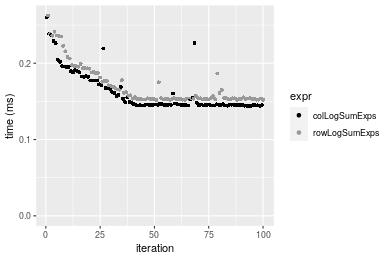

### 1000x10 matrix


```r
> X <- data[["1000x10"]]
> gc()
          used  (Mb) gc trigger  (Mb) max used  (Mb)
Ncells 5161808 275.7   10014072 534.9  8878578 474.2
Vcells 9311294  71.1   18204443 138.9 18204443 138.9
> colStats <- microbenchmark(colLogSumExps = colLogSumExps(X, na.rm = FALSE), `apply+logSumExp` = apply(X, 
+     MARGIN = 2L, FUN = logSumExp, na.rm = FALSE), `apply+logSumExp0` = apply(X, MARGIN = 2L, FUN = logSumExp0, 
+     na.rm = FALSE), unit = "ms")
> X <- t(X)
> gc()
          used  (Mb) gc trigger  (Mb) max used  (Mb)
Ncells 5161802 275.7   10014072 534.9  8878578 474.2
Vcells 9321337  71.2   18204443 138.9 18204443 138.9
> rowStats <- microbenchmark(rowLogSumExps = rowLogSumExps(X, na.rm = FALSE), `apply+logSumExp` = apply(X, 
+     MARGIN = 1L, FUN = logSumExp, na.rm = FALSE), `apply+logSumExp0` = apply(X, MARGIN = 1L, FUN = logSumExp0, 
+     na.rm = FALSE), unit = "ms")
```

_Table: Benchmarking of colLogSumExps(), apply+logSumExp() and apply+logSumExp0() on 1000x10 data. The top panel shows times in milliseconds and the bottom panel shows relative times._


|   |expr             |      min|        lq|      mean|    median|       uq|      max|
|:--|:----------------|--------:|---------:|---------:|---------:|--------:|--------:|
|1  |colLogSumExps    | 0.140295| 0.1434265| 0.1716248| 0.1710155| 0.183826| 0.247553|
|2  |apply+logSumExp  | 0.224223| 0.2315905| 0.2738347| 0.2661720| 0.295451| 0.493498|
|3  |apply+logSumExp0 | 0.263734| 0.2733430| 0.3221786| 0.3158515| 0.347561| 0.445363|


|   |expr             |      min|       lq|     mean|   median|       uq|      max|
|:--|:----------------|--------:|--------:|--------:|--------:|--------:|--------:|
|1  |colLogSumExps    | 1.000000| 1.000000| 1.000000| 1.000000| 1.000000| 1.000000|
|2  |apply+logSumExp  | 1.598225| 1.614698| 1.595542| 1.556420| 1.607232| 1.993504|
|3  |apply+logSumExp0 | 1.879853| 1.905805| 1.877225| 1.846917| 1.890706| 1.799061|

_Table: Benchmarking of rowLogSumExps(), apply+logSumExp() and apply+logSumExp0() on 1000x10 data (transposed). The top panel shows times in milliseconds and the bottom panel shows relative times._


|   |expr             |      min|        lq|      mean|   median|        uq|      max|
|:--|:----------------|--------:|---------:|---------:|--------:|---------:|--------:|
|1  |rowLogSumExps    | 0.145568| 0.1492690| 0.1785042| 0.178602| 0.1982570| 0.250941|
|2  |apply+logSumExp  | 0.224451| 0.2290525| 0.2670782| 0.253404| 0.2963425| 0.472336|
|3  |apply+logSumExp0 | 0.261819| 0.2668805| 0.3066712| 0.287636| 0.3328945| 0.451196|


|   |expr             |      min|       lq|     mean|   median|       uq|      max|
|:--|:----------------|--------:|--------:|--------:|--------:|--------:|--------:|
|1  |rowLogSumExps    | 1.000000| 1.000000| 1.000000| 1.000000| 1.000000| 1.000000|
|2  |apply+logSumExp  | 1.541898| 1.534495| 1.496201| 1.418819| 1.494739| 1.882259|
|3  |apply+logSumExp0 | 1.798603| 1.787916| 1.718006| 1.610486| 1.679106| 1.798016|

_Figure: Benchmarking of colLogSumExps(), apply+logSumExp() and apply+logSumExp0() on 1000x10 data  as well as rowLogSumExps(), apply+logSumExp() and apply+logSumExp0() on the same data transposed.  Outliers are displayed as crosses.  Times are in milliseconds._


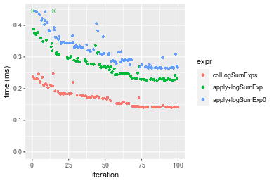

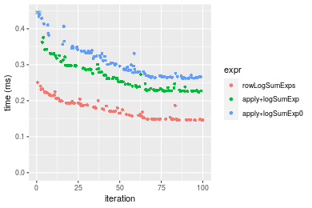
_Table: Benchmarking of colLogSumExps() and rowLogSumExps() on 1000x10 data (original and transposed).  The top panel shows times in milliseconds and the bottom panel shows relative times._


|   |expr          |     min|       lq|     mean|   median|      uq|     max|
|:--|:-------------|-------:|--------:|--------:|--------:|-------:|-------:|
|1  |colLogSumExps | 140.295| 143.4265| 171.6249| 171.0155| 183.826| 247.553|
|2  |rowLogSumExps | 145.568| 149.2690| 178.5042| 178.6020| 198.257| 250.941|


|   |expr          |      min|       lq|     mean|   median|       uq|      max|
|:--|:-------------|--------:|--------:|--------:|--------:|--------:|--------:|
|1  |colLogSumExps | 1.000000| 1.000000| 1.000000| 1.000000| 1.000000| 1.000000|
|2  |rowLogSumExps | 1.037585| 1.040735| 1.040083| 1.044361| 1.078504| 1.013686|

_Figure: Benchmarking of colLogSumExps() and rowLogSumExps() on 1000x10 data (original and transposed).  Outliers are displayed as crosses. Times are in milliseconds._


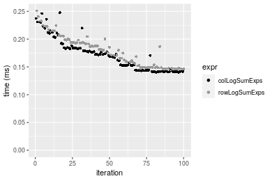

### 10x1000 matrix


```r
> X <- data[["10x1000"]]
> gc()
          used  (Mb) gc trigger  (Mb) max used  (Mb)
Ncells 5162036 275.7   10014072 534.9  8878578 474.2
Vcells 9312132  71.1   18204443 138.9 18204443 138.9
> colStats <- microbenchmark(colLogSumExps = colLogSumExps(X, na.rm = FALSE), `apply+logSumExp` = apply(X, 
+     MARGIN = 2L, FUN = logSumExp, na.rm = FALSE), `apply+logSumExp0` = apply(X, MARGIN = 2L, FUN = logSumExp0, 
+     na.rm = FALSE), unit = "ms")
> X <- t(X)
> gc()
          used  (Mb) gc trigger  (Mb) max used  (Mb)
Ncells 5162012 275.7   10014072 534.9 10014072 534.9
Vcells 9322145  71.2   18204443 138.9 18204443 138.9
> rowStats <- microbenchmark(rowLogSumExps = rowLogSumExps(X, na.rm = FALSE), `apply+logSumExp` = apply(X, 
+     MARGIN = 1L, FUN = logSumExp, na.rm = FALSE), `apply+logSumExp0` = apply(X, MARGIN = 1L, FUN = logSumExp0, 
+     na.rm = FALSE), unit = "ms")
```

_Table: Benchmarking of colLogSumExps(), apply+logSumExp() and apply+logSumExp0() on 10x1000 data. The top panel shows times in milliseconds and the bottom panel shows relative times._


|   |expr             |      min|        lq|      mean|   median|        uq|      max|
|:--|:----------------|--------:|---------:|---------:|--------:|---------:|--------:|
|1  |colLogSumExps    | 0.176056| 0.1781105| 0.1869264| 0.180046| 0.1845705| 0.264708|
|2  |apply+logSumExp  | 1.764702| 1.8164385| 1.9885468| 1.913741| 2.0797890| 2.816793|
|3  |apply+logSumExp0 | 3.031441| 3.1225105| 3.4056036| 3.277106| 3.3828405| 8.485389|


|   |expr             |      min|       lq|     mean|   median|       uq|      max|
|:--|:----------------|--------:|--------:|--------:|--------:|--------:|--------:|
|1  |colLogSumExps    |  1.00000|  1.00000|  1.00000|  1.00000|  1.00000|  1.00000|
|2  |apply+logSumExp  | 10.02353| 10.19838| 10.63813| 10.62918| 11.26826| 10.64113|
|3  |apply+logSumExp0 | 17.21862| 17.53131| 18.21896| 18.20149| 18.32818| 32.05566|

_Table: Benchmarking of rowLogSumExps(), apply+logSumExp() and apply+logSumExp0() on 10x1000 data (transposed). The top panel shows times in milliseconds and the bottom panel shows relative times._


|   |expr             |      min|       lq|      mean|    median|        uq|      max|
|:--|:----------------|--------:|--------:|---------:|---------:|---------:|--------:|
|1  |rowLogSumExps    | 0.181578| 0.184254| 0.1980622| 0.1860255| 0.1942585| 0.317733|
|2  |apply+logSumExp  | 1.747824| 1.801270| 1.9519493| 1.8946645| 1.9271320| 6.252395|
|3  |apply+logSumExp0 | 2.976593| 3.087345| 3.2349114| 3.2102070| 3.3244710| 4.111634|


|   |expr             |       min|        lq|      mean|   median|        uq|      max|
|:--|:----------------|---------:|---------:|---------:|--------:|---------:|--------:|
|1  |rowLogSumExps    |  1.000000|  1.000000|  1.000000|  1.00000|  1.000000|  1.00000|
|2  |apply+logSumExp  |  9.625748|  9.776013|  9.855234| 10.18497|  9.920451| 19.67814|
|3  |apply+logSumExp0 | 16.392916| 16.755918| 16.332806| 17.25681| 17.113645| 12.94053|

_Figure: Benchmarking of colLogSumExps(), apply+logSumExp() and apply+logSumExp0() on 10x1000 data  as well as rowLogSumExps(), apply+logSumExp() and apply+logSumExp0() on the same data transposed.  Outliers are displayed as crosses.  Times are in milliseconds._


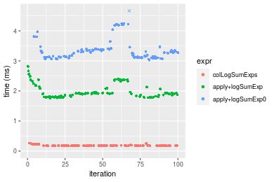

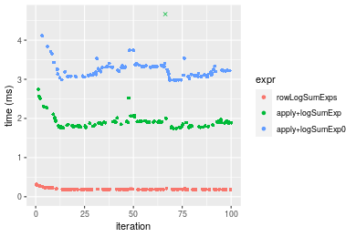
_Table: Benchmarking of colLogSumExps() and rowLogSumExps() on 10x1000 data (original and transposed).  The top panel shows times in milliseconds and the bottom panel shows relative times._


|   |expr          |     min|       lq|     mean|   median|       uq|     max|
|:--|:-------------|-------:|--------:|--------:|--------:|--------:|-------:|
|1  |colLogSumExps | 176.056| 178.1105| 186.9264| 180.0460| 184.5705| 264.708|
|2  |rowLogSumExps | 181.578| 184.2540| 198.0622| 186.0255| 194.2585| 317.733|


|   |expr          |      min|       lq|     mean|   median|       uq|      max|
|:--|:-------------|--------:|--------:|--------:|--------:|--------:|--------:|
|1  |colLogSumExps | 1.000000| 1.000000| 1.000000| 1.000000| 1.000000| 1.000000|
|2  |rowLogSumExps | 1.031365| 1.034493| 1.059573| 1.033211| 1.052489| 1.200315|

_Figure: Benchmarking of colLogSumExps() and rowLogSumExps() on 10x1000 data (original and transposed).  Outliers are displayed as crosses. Times are in milliseconds._


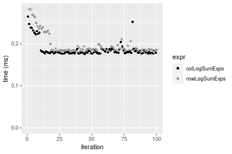

### 100x1000 matrix


```r
> X <- data[["100x1000"]]
> gc()
          used  (Mb) gc trigger  (Mb) max used  (Mb)
Ncells 5162230 275.7   10014072 534.9 10014072 534.9
Vcells 9312683  71.1   18204443 138.9 18204443 138.9
> colStats <- microbenchmark(colLogSumExps = colLogSumExps(X, na.rm = FALSE), `apply+logSumExp` = apply(X, 
+     MARGIN = 2L, FUN = logSumExp, na.rm = FALSE), `apply+logSumExp0` = apply(X, MARGIN = 2L, FUN = logSumExp0, 
+     na.rm = FALSE), unit = "ms")
> X <- t(X)
> gc()
          used  (Mb) gc trigger  (Mb) max used  (Mb)
Ncells 5162218 275.7   10014072 534.9 10014072 534.9
Vcells 9412716  71.9   18204443 138.9 18204443 138.9
> rowStats <- microbenchmark(rowLogSumExps = rowLogSumExps(X, na.rm = FALSE), `apply+logSumExp` = apply(X, 
+     MARGIN = 1L, FUN = logSumExp, na.rm = FALSE), `apply+logSumExp0` = apply(X, MARGIN = 1L, FUN = logSumExp0, 
+     na.rm = FALSE), unit = "ms")
```

_Table: Benchmarking of colLogSumExps(), apply+logSumExp() and apply+logSumExp0() on 100x1000 data. The top panel shows times in milliseconds and the bottom panel shows relative times._


|   |expr             |      min|       lq|     mean|   median|       uq|        max|
|:--|:----------------|--------:|--------:|--------:|--------:|--------:|----------:|
|1  |colLogSumExps    | 1.429705| 1.438362| 1.485668| 1.450688| 1.483238|   1.816532|
|2  |apply+logSumExp  | 3.633103| 3.676150| 3.958381| 3.713915| 3.784422|  14.761173|
|3  |apply+logSumExp0 | 5.162355| 5.222633| 9.666156| 5.280809| 5.893619| 349.403078|


|   |expr             |      min|       lq|     mean|   median|       uq|        max|
|:--|:----------------|--------:|--------:|--------:|--------:|--------:|----------:|
|1  |colLogSumExps    | 1.000000| 1.000000| 1.000000| 1.000000| 1.000000|   1.000000|
|2  |apply+logSumExp  | 2.541156| 2.555788| 2.664378| 2.560106| 2.551459|   8.126019|
|3  |apply+logSumExp0 | 3.610783| 3.630957| 6.506270| 3.640210| 3.973482| 192.346228|

_Table: Benchmarking of rowLogSumExps(), apply+logSumExp() and apply+logSumExp0() on 100x1000 data (transposed). The top panel shows times in milliseconds and the bottom panel shows relative times._


|   |expr             |      min|       lq|     mean|   median|       uq|       max|
|:--|:----------------|--------:|--------:|--------:|--------:|--------:|---------:|
|1  |rowLogSumExps    | 1.520874| 1.538600| 1.627126| 1.565017| 1.630826|  2.616128|
|2  |apply+logSumExp  | 3.654891| 3.707024| 4.444415| 3.764799| 4.005774| 15.653977|
|3  |apply+logSumExp0 | 5.196007| 5.258693| 6.011726| 5.327285| 5.756739| 17.158318|


|   |expr             |      min|       lq|     mean|   median|       uq|      max|
|:--|:----------------|--------:|--------:|--------:|--------:|--------:|--------:|
|1  |rowLogSumExps    | 1.000000| 1.000000| 1.000000| 1.000000| 1.000000| 1.000000|
|2  |apply+logSumExp  | 2.403152| 2.409349| 2.731452| 2.405596| 2.456284| 5.983643|
|3  |apply+logSumExp0 | 3.416461| 3.417842| 3.694691| 3.403979| 3.529952| 6.558669|

_Figure: Benchmarking of colLogSumExps(), apply+logSumExp() and apply+logSumExp0() on 100x1000 data  as well as rowLogSumExps(), apply+logSumExp() and apply+logSumExp0() on the same data transposed.  Outliers are displayed as crosses.  Times are in milliseconds._


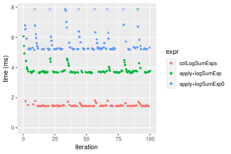


_Table: Benchmarking of colLogSumExps() and rowLogSumExps() on 100x1000 data (original and transposed).  The top panel shows times in milliseconds and the bottom panel shows relative times._


|   |expr          |      min|       lq|     mean|   median|       uq|      max|
|:--|:-------------|--------:|--------:|--------:|--------:|--------:|--------:|
|1  |colLogSumExps | 1.429705| 1.438362| 1.485668| 1.450688| 1.483238| 1.816532|
|2  |rowLogSumExps | 1.520874| 1.538600| 1.627126| 1.565017| 1.630826| 2.616128|


|   |expr          |      min|       lq|     mean|  median|       uq|      max|
|:--|:-------------|--------:|--------:|--------:|-------:|--------:|--------:|
|1  |colLogSumExps | 1.000000| 1.000000| 1.000000| 1.00000| 1.000000| 1.000000|
|2  |rowLogSumExps | 1.063768| 1.069689| 1.095215| 1.07881| 1.099504| 1.440177|

_Figure: Benchmarking of colLogSumExps() and rowLogSumExps() on 100x1000 data (original and transposed).  Outliers are displayed as crosses. Times are in milliseconds._


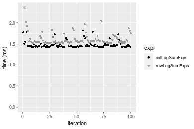

### 1000x100 matrix


```r
> X <- data[["1000x100"]]
> gc()
          used  (Mb) gc trigger  (Mb) max used  (Mb)
Ncells 5162446 275.8   10014072 534.9 10014072 534.9
Vcells 9313364  71.1   18204443 138.9 18204443 138.9
> colStats <- microbenchmark(colLogSumExps = colLogSumExps(X, na.rm = FALSE), `apply+logSumExp` = apply(X, 
+     MARGIN = 2L, FUN = logSumExp, na.rm = FALSE), `apply+logSumExp0` = apply(X, MARGIN = 2L, FUN = logSumExp0, 
+     na.rm = FALSE), unit = "ms")
> X <- t(X)
> gc()
          used  (Mb) gc trigger  (Mb) max used  (Mb)
Ncells 5162422 275.8   10014072 534.9 10014072 534.9
Vcells 9413377  71.9   18204443 138.9 18204443 138.9
> rowStats <- microbenchmark(rowLogSumExps = rowLogSumExps(X, na.rm = FALSE), `apply+logSumExp` = apply(X, 
+     MARGIN = 1L, FUN = logSumExp, na.rm = FALSE), `apply+logSumExp0` = apply(X, MARGIN = 1L, FUN = logSumExp0, 
+     na.rm = FALSE), unit = "ms")
```

_Table: Benchmarking of colLogSumExps(), apply+logSumExp() and apply+logSumExp0() on 1000x100 data. The top panel shows times in milliseconds and the bottom panel shows relative times._


|   |expr             |      min|       lq|     mean|   median|       uq|      max|
|:--|:----------------|--------:|--------:|--------:|--------:|--------:|--------:|
|1  |colLogSumExps    | 1.379630| 1.384518| 1.477507| 1.403514| 1.497534| 2.198962|
|2  |apply+logSumExp  | 2.110582| 2.130687| 2.345729| 2.158870| 2.309216| 7.898525|
|3  |apply+logSumExp0 | 2.444077| 2.513711| 2.962575| 2.565890| 2.721223| 8.477729|


|   |expr             |      min|       lq|     mean|   median|       uq|      max|
|:--|:----------------|--------:|--------:|--------:|--------:|--------:|--------:|
|1  |colLogSumExps    | 1.000000| 1.000000| 1.000000| 1.000000| 1.000000| 1.000000|
|2  |apply+logSumExp  | 1.529817| 1.538938| 1.587626| 1.538189| 1.542012| 3.591933|
|3  |apply+logSumExp0 | 1.771545| 1.815587| 2.005117| 1.828189| 1.817136| 3.855332|

_Table: Benchmarking of rowLogSumExps(), apply+logSumExp() and apply+logSumExp0() on 1000x100 data (transposed). The top panel shows times in milliseconds and the bottom panel shows relative times._


|   |expr             |      min|       lq|     mean|   median|       uq|      max|
|:--|:----------------|--------:|--------:|--------:|--------:|--------:|--------:|
|1  |rowLogSumExps    | 1.458873| 1.462925| 1.541836| 1.467489| 1.569214| 2.227659|
|2  |apply+logSumExp  | 2.134399| 2.152706| 2.395594| 2.198590| 2.358947| 8.050600|
|3  |apply+logSumExp0 | 2.487738| 2.530534| 2.989541| 2.558609| 2.734797| 8.662568|


|   |expr             |      min|       lq|     mean|   median|       uq|      max|
|:--|:----------------|--------:|--------:|--------:|--------:|--------:|--------:|
|1  |rowLogSumExps    | 1.000000| 1.000000| 1.000000| 1.000000| 1.000000| 1.000000|
|2  |apply+logSumExp  | 1.463046| 1.471509| 1.553728| 1.498199| 1.503266| 3.613928|
|3  |apply+logSumExp0 | 1.705246| 1.729777| 1.938948| 1.743529| 1.742781| 3.888642|

_Figure: Benchmarking of colLogSumExps(), apply+logSumExp() and apply+logSumExp0() on 1000x100 data  as well as rowLogSumExps(), apply+logSumExp() and apply+logSumExp0() on the same data transposed.  Outliers are displayed as crosses.  Times are in milliseconds._


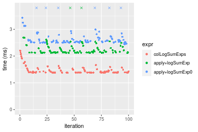

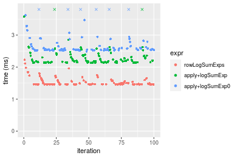
_Table: Benchmarking of colLogSumExps() and rowLogSumExps() on 1000x100 data (original and transposed).  The top panel shows times in milliseconds and the bottom panel shows relative times._


|   |expr          |      min|       lq|     mean|   median|       uq|      max|
|:--|:-------------|--------:|--------:|--------:|--------:|--------:|--------:|
|1  |colLogSumExps | 1.379630| 1.384518| 1.477507| 1.403514| 1.497534| 2.198962|
|2  |rowLogSumExps | 1.458873| 1.462925| 1.541836| 1.467489| 1.569214| 2.227659|


|   |expr          |      min|       lq|     mean|   median|       uq|     max|
|:--|:-------------|--------:|--------:|--------:|--------:|--------:|-------:|
|1  |colLogSumExps | 1.000000| 1.000000| 1.000000| 1.000000| 1.000000| 1.00000|
|2  |rowLogSumExps | 1.057438| 1.056632| 1.043539| 1.045582| 1.047865| 1.01305|

_Figure: Benchmarking of colLogSumExps() and rowLogSumExps() on 1000x100 data (original and transposed).  Outliers are displayed as crosses. Times are in milliseconds._


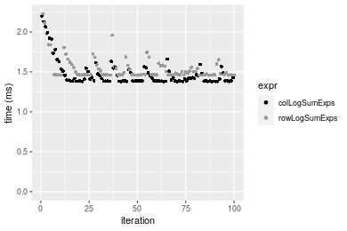


## Appendix

### Session information
```r
R version 4.1.1 Patched (2021-08-10 r80727)
Platform: x86_64-pc-linux-gnu (64-bit)
Running under: Ubuntu 18.04.5 LTS

Matrix products: default
BLAS:   /home/hb/software/R-devel/R-4-1-branch/lib/R/lib/libRblas.so
LAPACK: /home/hb/software/R-devel/R-4-1-branch/lib/R/lib/libRlapack.so

locale:
 [1] LC_CTYPE=en_US.UTF-8       LC_NUMERIC=C              
 [3] LC_TIME=en_US.UTF-8        LC_COLLATE=en_US.UTF-8    
 [5] LC_MONETARY=en_US.UTF-8    LC_MESSAGES=en_US.UTF-8   
 [7] LC_PAPER=en_US.UTF-8       LC_NAME=C                 
 [9] LC_ADDRESS=C               LC_TELEPHONE=C            
[11] LC_MEASUREMENT=en_US.UTF-8 LC_IDENTIFICATION=C       

attached base packages:
[1] stats     graphics  grDevices utils     datasets  methods   base     

other attached packages:
[1] microbenchmark_1.4-7   matrixStats_0.60.1     ggplot2_3.3.5         
[4] knitr_1.33             R.devices_2.17.0       R.utils_2.10.1        
[7] R.oo_1.24.0            R.methodsS3_1.8.1-9001 history_0.0.1-9000    

loaded via a namespace (and not attached):
 [1] Biobase_2.52.0          httr_1.4.2              splines_4.1.1          
 [4] bit64_4.0.5             network_1.17.1          assertthat_0.2.1       
 [7] highr_0.9               stats4_4.1.1            blob_1.2.2             
[10] GenomeInfoDbData_1.2.6  robustbase_0.93-8       pillar_1.6.2           
[13] RSQLite_2.2.8           lattice_0.20-44         glue_1.4.2             
[16] digest_0.6.27           XVector_0.32.0          colorspace_2.0-2       
[19] Matrix_1.3-4            XML_3.99-0.7            pkgconfig_2.0.3        
[22] zlibbioc_1.38.0         genefilter_1.74.0       purrr_0.3.4            
[25] ergm_4.1.2              xtable_1.8-4            scales_1.1.1           
[28] tibble_3.1.4            annotate_1.70.0         KEGGREST_1.32.0        
[31] farver_2.1.0            generics_0.1.0          IRanges_2.26.0         
[34] ellipsis_0.3.2          cachem_1.0.6            withr_2.4.2            
[37] BiocGenerics_0.38.0     mime_0.11               survival_3.2-13        
[40] magrittr_2.0.1          crayon_1.4.1            statnet.common_4.5.0   
[43] memoise_2.0.0           laeken_0.5.1            fansi_0.5.0            
[46] R.cache_0.15.0          MASS_7.3-54             R.rsp_0.44.0           
[49] progressr_0.8.0         tools_4.1.1             lifecycle_1.0.0        
[52] S4Vectors_0.30.0        trust_0.1-8             munsell_0.5.0          
[55] tabby_0.0.1-9001        AnnotationDbi_1.54.1    Biostrings_2.60.2      
[58] compiler_4.1.1          GenomeInfoDb_1.28.1     rlang_0.4.11           
[61] grid_4.1.1              RCurl_1.98-1.4          cwhmisc_6.6            
[64] rappdirs_0.3.3          startup_0.15.0          labeling_0.4.2         
[67] bitops_1.0-7            base64enc_0.1-3         boot_1.3-28            
[70] gtable_0.3.0            DBI_1.1.1               markdown_1.1           
[73] R6_2.5.1                lpSolveAPI_5.5.2.0-17.7 rle_0.9.2              
[76] dplyr_1.0.7             fastmap_1.1.0           bit_4.0.4              
[79] utf8_1.2.2              parallel_4.1.1          Rcpp_1.0.7             
[82] vctrs_0.3.8             png_0.1-7               DEoptimR_1.0-9         
[85] tidyselect_1.1.1        xfun_0.25               coda_0.19-4            
```
Total processing time was 16.49 secs.


### Reproducibility
To reproduce this report, do:
```r
html <- matrixStats:::benchmark('colLogSumExps')
```

[RSP]: https://cran.r-project.org/package=R.rsp
[matrixStats]: https://cran.r-project.org/package=matrixStats

[StackOverflow:colMins?]: https://stackoverflow.com/questions/13676878 "Stack Overflow: fastest way to get Min from every column in a matrix?"
[StackOverflow:colSds?]: https://stackoverflow.com/questions/17549762 "Stack Overflow: Is there such 'colsd' in R?"
[StackOverflow:rowProds?]: https://stackoverflow.com/questions/20198801/ "Stack Overflow: Row product of matrix and column sum of matrix"

---------------------------------------
Copyright Henrik Bengtsson. Last updated on 2021-08-25 18:03:37 (+0200 UTC). Powered by [RSP].

<script>
 var link = document.createElement('link');
 link.rel = 'icon';
 link.href = "data:image/png;base64,iVBORw0KGgoAAAANSUhEUgAAACAAAAAgCAMAAABEpIrGAAAA21BMVEUAAAAAAP8AAP8AAP8AAP8AAP8AAP8AAP8AAP8AAP8AAP8AAP8AAP8AAP8AAP8AAP8AAP8AAP8AAP8AAP8AAP8AAP8AAP8AAP8AAP8AAP8AAP8AAP8AAP8AAP8AAP8AAP8AAP8AAP8AAP8AAP8AAP8AAP8AAP8AAP8AAP8AAP8BAf4CAv0DA/wdHeIeHuEfH+AgIN8hId4lJdomJtknJ9g+PsE/P8BAQL9yco10dIt1dYp3d4h4eIeVlWqWlmmXl2iYmGeZmWabm2Tn5xjo6Bfp6Rb39wj4+Af//wA2M9hbAAAASXRSTlMAAQIJCgsMJSYnKD4/QGRlZmhpamtsbautrrCxuru8y8zN5ebn6Pn6+///////////////////////////////////////////LsUNcQAAAS9JREFUOI29k21XgkAQhVcFytdSMqMETU26UVqGmpaiFbL//xc1cAhhwVNf6n5i5z67M2dmYOyfJZUqlVLhkKucG7cgmUZTybDz6g0iDeq51PUr37Ds2cy2/C9NeES5puDjxuUk1xnToZsg8pfA3avHQ3lLIi7iWRrkv/OYtkScxBIMgDee0ALoyxHQBJ68JLCjOtQIMIANF7QG9G9fNnHvisCHBVMKgSJgiz7nE+AoBKrAPA3MgepvgR9TSCasrCKH0eB1wBGBFdCO+nAGjMVGPcQb5bd6mQRegN6+1axOs9nGfYcCtfi4NQosdtH7dB+txFIpXQqN1p9B/asRHToyS0jRgpV7nk4nwcq1BJ+x3Gl/v7S9Wmpp/aGquum7w3ZDyrADFYrl8vHBH+ev9AUASW1dmU4h4wAAAABJRU5ErkJggg=="
 document.getElementsByTagName('head')[0].appendChild(link);
</script>


