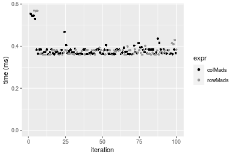

[matrixStats]: Benchmark report

---------------------------------------


# colMads() and rowMads() benchmarks

This report benchmark the performance of colMads() and rowMads() against alternative methods.

## Alternative methods

* apply() + mad()
* colMads2() and rowMads2()

where `rowMads2()` and `colMads2()` are:

```r
> rowMads2 <- function(x, const = 1.4826, na.rm = FALSE) {
+     mu <- rowMedians(x, na.rm = na.rm)
+     x <- abs(x - mu)
+     mad <- rowMedians(x, na.rm = FALSE)
+     const * mad
+ }
> colMads2 <- function(x, const = 1.4826, na.rm = FALSE) {
+     mu <- colMedians(x, na.rm = na.rm)
+     x <- abs(x - mu)
+     mad <- colMedians(x, na.rm = FALSE)
+     const * mad
+ }
```


## Data type "integer"

### Data
```r
> rmatrix <- function(nrow, ncol, mode = c("logical", "double", "integer", "index"), range = c(-100, 
+     +100), na_prob = 0) {
+     mode <- match.arg(mode)
+     n <- nrow * ncol
+     if (mode == "logical") {
+         x <- sample(c(FALSE, TRUE), size = n, replace = TRUE)
+     }     else if (mode == "index") {
+         x <- seq_len(n)
+         mode <- "integer"
+     }     else {
+         x <- runif(n, min = range[1], max = range[2])
+     }
+     storage.mode(x) <- mode
+     if (na_prob > 0) 
+         x[sample(n, size = na_prob * n)] <- NA
+     dim(x) <- c(nrow, ncol)
+     x
+ }
> rmatrices <- function(scale = 10, seed = 1, ...) {
+     set.seed(seed)
+     data <- list()
+     data[[1]] <- rmatrix(nrow = scale * 1, ncol = scale * 1, ...)
+     data[[2]] <- rmatrix(nrow = scale * 10, ncol = scale * 10, ...)
+     data[[3]] <- rmatrix(nrow = scale * 100, ncol = scale * 1, ...)
+     data[[4]] <- t(data[[3]])
+     data[[5]] <- rmatrix(nrow = scale * 10, ncol = scale * 100, ...)
+     data[[6]] <- t(data[[5]])
+     names(data) <- sapply(data, FUN = function(x) paste(dim(x), collapse = "x"))
+     data
+ }
> data <- rmatrices(mode = mode)
```

### Results

#### 10x10 integer matrix

```r
> X <- data[["10x10"]]
> gc()
          used  (Mb) gc trigger  (Mb) max used  (Mb)
Ncells 5185692 277.0   10014072 534.9 10014072 534.9
Vcells 9684563  73.9   18204443 138.9 18204443 138.9
> colStats <- microbenchmark(colMads = colMads(X, na.rm = FALSE), colMads2 = colMads2(X, na.rm = FALSE), 
+     `apply+mad` = apply(X, MARGIN = 2L, FUN = mad, na.rm = FALSE), unit = "ms")
> X <- t(X)
> gc()
          used  (Mb) gc trigger  (Mb) max used  (Mb)
Ncells 5170750 276.2   10014072 534.9 10014072 534.9
Vcells 9635017  73.6   18204443 138.9 18204443 138.9
> rowStats <- microbenchmark(rowMads = rowMads(X, na.rm = FALSE), rowMads2 = rowMads2(X, na.rm = FALSE), 
+     `apply+mad` = apply(X, MARGIN = 1L, FUN = mad, na.rm = FALSE), unit = "ms")
```

_Table: Benchmarking of colMads(), colMads2() and apply+mad() on integer+10x10 data. The top panel shows times in milliseconds and the bottom panel shows relative times._


|   |expr      |      min|        lq|      mean|    median|        uq|      max|
|:--|:---------|--------:|---------:|---------:|---------:|---------:|--------:|
|1  |colMads   | 0.003069| 0.0042430| 0.0059290| 0.0054065| 0.0068525| 0.021718|
|2  |colMads2  | 0.005922| 0.0078225| 0.0108139| 0.0094545| 0.0120115| 0.078252|
|3  |apply+mad | 0.505591| 0.5440285| 0.6222431| 0.6084085| 0.6710810| 1.233259|


|   |expr      |        min|         lq|       mean|     median|        uq|       max|
|:--|:---------|----------:|----------:|----------:|----------:|---------:|---------:|
|1  |colMads   |   1.000000|   1.000000|   1.000000|   1.000000|  1.000000|  1.000000|
|2  |colMads2  |   1.929619|   1.843625|   1.823893|   1.748728|  1.752864|  3.603094|
|3  |apply+mad | 164.741284| 128.217888| 104.949088| 112.532785| 97.932288| 56.785109|

_Table: Benchmarking of rowMads(), rowMads2() and apply+mad() on integer+10x10 data (transposed). The top panel shows times in milliseconds and the bottom panel shows relative times._


|   |expr      |      min|        lq|      mean|    median|        uq|      max|
|:--|:---------|--------:|---------:|---------:|---------:|---------:|--------:|
|1  |rowMads   | 0.003575| 0.0047605| 0.0064186| 0.0062300| 0.0076815| 0.022612|
|2  |rowMads2  | 0.006074| 0.0080325| 0.0113943| 0.0102570| 0.0125840| 0.094262|
|3  |apply+mad | 0.502493| 0.5428835| 0.6305453| 0.6120245| 0.6835990| 1.004523|


|   |expr      |        min|         lq|      mean|    median|        uq|       max|
|:--|:---------|----------:|----------:|---------:|---------:|---------:|---------:|
|1  |rowMads   |   1.000000|   1.000000|  1.000000|  1.000000|  1.000000|  1.000000|
|2  |rowMads2  |   1.699021|   1.687323|  1.775197|  1.646388|  1.638222|  4.168672|
|3  |apply+mad | 140.557482| 114.039177| 98.237206| 98.238282| 88.992905| 44.424332|

_Figure: Benchmarking of colMads(), colMads2() and apply+mad() on integer+10x10 data  as well as rowMads(), rowMads2() and apply+mad() on the same data transposed.  Outliers are displayed as crosses.  Times are in milliseconds._


_Table: Benchmarking of colMads() and rowMads() on integer+10x10 data (original and transposed).  The top panel shows times in milliseconds and the bottom panel shows relative times._


|   |expr    |   min|     lq|   mean| median|     uq|    max|
|:--|:-------|-----:|------:|------:|------:|------:|------:|
|1  |colMads | 3.069| 4.2430| 5.9290| 5.4065| 6.8525| 21.718|
|2  |rowMads | 3.575| 4.7605| 6.4186| 6.2300| 7.6815| 22.612|


|   |expr    |      min|       lq|     mean|   median|       uq|      max|
|:--|:-------|--------:|--------:|--------:|--------:|--------:|--------:|
|1  |colMads | 1.000000| 1.000000| 1.000000| 1.000000| 1.000000| 1.000000|
|2  |rowMads | 1.164875| 1.121966| 1.082577| 1.152317| 1.120978| 1.041164|

_Figure: Benchmarking of colMads() and rowMads() on integer+10x10 data (original and transposed).  Outliers are displayed as crosses. Times are in milliseconds._


#### 100x100 integer matrix

```r
> X <- data[["100x100"]]
> gc()
          used  (Mb) gc trigger  (Mb) max used  (Mb)
Ncells 5169364 276.1   10014072 534.9 10014072 534.9
Vcells 9251757  70.6   18204443 138.9 18204443 138.9
> colStats <- microbenchmark(colMads = colMads(X, na.rm = FALSE), colMads2 = colMads2(X, na.rm = FALSE), 
+     `apply+mad` = apply(X, MARGIN = 2L, FUN = mad, na.rm = FALSE), unit = "ms")
> X <- t(X)
> gc()
          used  (Mb) gc trigger  (Mb) max used  (Mb)
Ncells 5169340 276.1   10014072 534.9 10014072 534.9
Vcells 9256770  70.7   18204443 138.9 18204443 138.9
> rowStats <- microbenchmark(rowMads = rowMads(X, na.rm = FALSE), rowMads2 = rowMads2(X, na.rm = FALSE), 
+     `apply+mad` = apply(X, MARGIN = 1L, FUN = mad, na.rm = FALSE), unit = "ms")
```

_Table: Benchmarking of colMads(), colMads2() and apply+mad() on integer+100x100 data. The top panel shows times in milliseconds and the bottom panel shows relative times._


|   |expr      |      min|        lq|      mean|   median|        uq|       max|
|:--|:---------|--------:|---------:|---------:|--------:|---------:|---------:|
|1  |colMads   | 0.278644| 0.2812570| 0.2926183| 0.284359| 0.2888890|  0.482592|
|2  |colMads2  | 0.335668| 0.3379685| 0.3532907| 0.343400| 0.3500815|  0.549689|
|3  |apply+mad | 5.430002| 5.5636445| 5.9356731| 5.768599| 5.8418595| 17.373675|


|   |expr      |       min|        lq|      mean|    median|       uq|       max|
|:--|:---------|---------:|---------:|---------:|---------:|--------:|---------:|
|1  |colMads   |  1.000000|  1.000000|  1.000000|  1.000000|  1.00000|  1.000000|
|2  |colMads2  |  1.204648|  1.201636|  1.207343|  1.207628|  1.21182|  1.139035|
|3  |apply+mad | 19.487238| 19.781355| 20.284699| 20.286323| 20.22181| 36.000752|

_Table: Benchmarking of rowMads(), rowMads2() and apply+mad() on integer+100x100 data (transposed). The top panel shows times in milliseconds and the bottom panel shows relative times._


|   |expr      |      min|        lq|      mean|    median|       uq|       max|
|:--|:---------|--------:|---------:|---------:|---------:|--------:|---------:|
|1  |rowMads   | 0.286583| 0.2888645| 0.3031975| 0.2923145| 0.296436|  0.435867|
|2  |rowMads2  | 0.337025| 0.3410020| 0.3593830| 0.3484490| 0.358200|  0.518551|
|3  |apply+mad | 5.415514| 5.5300445| 5.9097087| 5.7482375| 5.842910| 17.193732|


|   |expr      |       min|        lq|     mean|    median|        uq|     max|
|:--|:---------|---------:|---------:|--------:|---------:|---------:|-------:|
|1  |rowMads   |  1.000000|  1.000000|  1.00000|  1.000000|  1.000000|  1.0000|
|2  |rowMads2  |  1.176012|  1.180491|  1.18531|  1.192035|  1.208355|  1.1897|
|3  |apply+mad | 18.896843| 19.144078| 19.49129| 19.664565| 19.710526| 39.4472|

_Figure: Benchmarking of colMads(), colMads2() and apply+mad() on integer+100x100 data  as well as rowMads(), rowMads2() and apply+mad() on the same data transposed.  Outliers are displayed as crosses.  Times are in milliseconds._


_Table: Benchmarking of colMads() and rowMads() on integer+100x100 data (original and transposed).  The top panel shows times in milliseconds and the bottom panel shows relative times._


|   |expr    |     min|       lq|     mean|   median|      uq|     max|
|:--|:-------|-------:|--------:|--------:|--------:|-------:|-------:|
|1  |colMads | 278.644| 281.2570| 292.6182| 284.3590| 288.889| 482.592|
|2  |rowMads | 286.583| 288.8645| 303.1975| 292.3145| 296.436| 435.867|


|   |expr    |      min|       lq|     mean|   median|       uq|       max|
|:--|:-------|--------:|--------:|--------:|--------:|--------:|---------:|
|1  |colMads | 1.000000| 1.000000| 1.000000| 1.000000| 1.000000| 1.0000000|
|2  |rowMads | 1.028492| 1.027048| 1.036154| 1.027977| 1.026124| 0.9031791|

_Figure: Benchmarking of colMads() and rowMads() on integer+100x100 data (original and transposed).  Outliers are displayed as crosses. Times are in milliseconds._


#### 1000x10 integer matrix

```r
> X <- data[["1000x10"]]
> gc()
          used  (Mb) gc trigger  (Mb) max used  (Mb)
Ncells 5170118 276.2   10014072 534.9 10014072 534.9
Vcells 9255537  70.7   18204443 138.9 18204443 138.9
> colStats <- microbenchmark(colMads = colMads(X, na.rm = FALSE), colMads2 = colMads2(X, na.rm = FALSE), 
+     `apply+mad` = apply(X, MARGIN = 2L, FUN = mad, na.rm = FALSE), unit = "ms")
> X <- t(X)
> gc()
          used  (Mb) gc trigger  (Mb) max used  (Mb)
Ncells 5170094 276.2   10014072 534.9 10014072 534.9
Vcells 9260550  70.7   18204443 138.9 18204443 138.9
> rowStats <- microbenchmark(rowMads = rowMads(X, na.rm = FALSE), rowMads2 = rowMads2(X, na.rm = FALSE), 
+     `apply+mad` = apply(X, MARGIN = 1L, FUN = mad, na.rm = FALSE), unit = "ms")
```

_Table: Benchmarking of colMads(), colMads2() and apply+mad() on integer+1000x10 data. The top panel shows times in milliseconds and the bottom panel shows relative times._


|   |expr      |      min|        lq|      mean|    median|        uq|      max|
|:--|:---------|--------:|---------:|---------:|---------:|---------:|--------:|
|1  |colMads   | 0.206197| 0.2081540| 0.2264809| 0.2103525| 0.2320585| 0.333567|
|2  |colMads2  | 0.302646| 0.3048330| 0.3271547| 0.3085245| 0.3128720| 0.514778|
|3  |apply+mad | 0.930316| 0.9617505| 1.0354586| 0.9723850| 1.0576395| 1.638902|


|   |expr      |      min|       lq|     mean|   median|       uq|      max|
|:--|:---------|--------:|--------:|--------:|--------:|--------:|--------:|
|1  |colMads   | 1.000000| 1.000000| 1.000000| 1.000000| 1.000000| 1.000000|
|2  |colMads2  | 1.467752| 1.464459| 1.444513| 1.466702| 1.348246| 1.543252|
|3  |apply+mad | 4.511782| 4.620380| 4.571946| 4.622645| 4.557642| 4.913262|

_Table: Benchmarking of rowMads(), rowMads2() and apply+mad() on integer+1000x10 data (transposed). The top panel shows times in milliseconds and the bottom panel shows relative times._


|   |expr      |      min|        lq|      mean|    median|        uq|      max|
|:--|:---------|--------:|---------:|---------:|---------:|---------:|--------:|
|1  |rowMads   | 0.214536| 0.2174285| 0.2384298| 0.2195640| 0.2628220| 0.362722|
|2  |rowMads2  | 0.313338| 0.3173020| 0.3415768| 0.3203825| 0.3458930| 0.565802|
|3  |apply+mad | 0.930838| 0.9568860| 1.0188739| 0.9683540| 0.9861815| 1.656518|


|   |expr      |      min|       lq|     mean|   median|       uq|      max|
|:--|:---------|--------:|--------:|--------:|--------:|--------:|--------:|
|1  |rowMads   | 1.000000| 1.000000| 1.000000| 1.000000| 1.000000| 1.000000|
|2  |rowMads2  | 1.460538| 1.459340| 1.432609| 1.459176| 1.316073| 1.559878|
|3  |apply+mad | 4.338843| 4.400923| 4.273265| 4.410350| 3.752279| 4.566908|

_Figure: Benchmarking of colMads(), colMads2() and apply+mad() on integer+1000x10 data  as well as rowMads(), rowMads2() and apply+mad() on the same data transposed.  Outliers are displayed as crosses.  Times are in milliseconds._


_Table: Benchmarking of colMads() and rowMads() on integer+1000x10 data (original and transposed).  The top panel shows times in milliseconds and the bottom panel shows relative times._


|   |expr    |     min|       lq|     mean|   median|       uq|     max|
|:--|:-------|-------:|--------:|--------:|--------:|--------:|-------:|
|1  |colMads | 206.197| 208.1540| 226.4809| 210.3525| 232.0585| 333.567|
|2  |rowMads | 214.536| 217.4285| 238.4298| 219.5640| 262.8220| 362.722|


|   |expr    |      min|       lq|     mean|   median|       uq|      max|
|:--|:-------|--------:|--------:|--------:|--------:|--------:|--------:|
|1  |colMads | 1.000000| 1.000000| 1.000000| 1.000000| 1.000000| 1.000000|
|2  |rowMads | 1.040442| 1.044556| 1.052759| 1.043791| 1.132568| 1.087404|

_Figure: Benchmarking of colMads() and rowMads() on integer+1000x10 data (original and transposed).  Outliers are displayed as crosses. Times are in milliseconds._


#### 10x1000 integer matrix

```r
> X <- data[["10x1000"]]
> gc()
          used  (Mb) gc trigger  (Mb) max used  (Mb)
Ncells 5170328 276.2   10014072 534.9 10014072 534.9
Vcells 9255979  70.7   18204443 138.9 18204443 138.9
> colStats <- microbenchmark(colMads = colMads(X, na.rm = FALSE), colMads2 = colMads2(X, na.rm = FALSE), 
+     `apply+mad` = apply(X, MARGIN = 2L, FUN = mad, na.rm = FALSE), unit = "ms")
> X <- t(X)
> gc()
          used  (Mb) gc trigger  (Mb) max used  (Mb)
Ncells 5170304 276.2   10014072 534.9 10014072 534.9
Vcells 9260992  70.7   18204443 138.9 18204443 138.9
> rowStats <- microbenchmark(rowMads = rowMads(X, na.rm = FALSE), rowMads2 = rowMads2(X, na.rm = FALSE), 
+     `apply+mad` = apply(X, MARGIN = 1L, FUN = mad, na.rm = FALSE), unit = "ms")
```

_Table: Benchmarking of colMads(), colMads2() and apply+mad() on integer+10x1000 data. The top panel shows times in milliseconds and the bottom panel shows relative times._


|   |expr      |       min|         lq|       mean|    median|         uq|       max|
|:--|:---------|---------:|----------:|----------:|---------:|----------:|---------:|
|1  |colMads   |  0.279641|  0.2874420|  0.3076256|  0.295163|  0.3116645|  0.477965|
|2  |colMads2  |  0.367207|  0.3723705|  0.4042245|  0.387982|  0.4010985|  0.653925|
|3  |apply+mad | 48.916325| 50.2979560| 52.1835486| 51.399049| 52.3353780| 80.917794|


|   |expr      |        min|         lq|       mean|     median|         uq|        max|
|:--|:---------|----------:|----------:|----------:|----------:|----------:|----------:|
|1  |colMads   |   1.000000|   1.000000|   1.000000|   1.000000|   1.000000|   1.000000|
|2  |colMads2  |   1.313137|   1.295463|   1.314015|   1.314467|   1.286956|   1.368144|
|3  |apply+mad | 174.925440| 174.984713| 169.633326| 174.137846| 167.922166| 169.296484|

_Table: Benchmarking of rowMads(), rowMads2() and apply+mad() on integer+10x1000 data (transposed). The top panel shows times in milliseconds and the bottom panel shows relative times._


|   |expr      |       min|         lq|       mean|     median|        uq|       max|
|:--|:---------|---------:|----------:|----------:|----------:|---------:|---------:|
|1  |rowMads   |  0.286960|  0.2972955|  0.3207498|  0.3094300|  0.330528|  0.497490|
|2  |rowMads2  |  0.367045|  0.3779785|  0.3981482|  0.3892755|  0.413649|  0.596373|
|3  |apply+mad | 48.956581| 50.4876425| 52.4153467| 51.9977020| 52.888438| 63.864326|


|   |expr      |        min|        lq|       mean|     median|        uq|        max|
|:--|:---------|----------:|---------:|----------:|----------:|---------:|----------:|
|1  |rowMads   |   1.000000|   1.00000|   1.000000|   1.000000|   1.00000|   1.000000|
|2  |rowMads2  |   1.279081|   1.27139|   1.241305|   1.258041|   1.25148|   1.198764|
|3  |apply+mad | 170.604199| 169.82310| 163.415041| 168.043506| 160.01197| 128.373085|

_Figure: Benchmarking of colMads(), colMads2() and apply+mad() on integer+10x1000 data  as well as rowMads(), rowMads2() and apply+mad() on the same data transposed.  Outliers are displayed as crosses.  Times are in milliseconds._


_Table: Benchmarking of colMads() and rowMads() on integer+10x1000 data (original and transposed).  The top panel shows times in milliseconds and the bottom panel shows relative times._


|   |expr    |     min|       lq|     mean|  median|       uq|     max|
|:--|:-------|-------:|--------:|--------:|-------:|--------:|-------:|
|1  |colMads | 279.641| 287.4420| 307.6256| 295.163| 311.6645| 477.965|
|2  |rowMads | 286.960| 297.2955| 320.7498| 309.430| 330.5280| 497.490|


|   |expr    |      min|      lq|     mean|   median|       uq|     max|
|:--|:-------|--------:|-------:|--------:|--------:|--------:|-------:|
|1  |colMads | 1.000000| 1.00000| 1.000000| 1.000000| 1.000000| 1.00000|
|2  |rowMads | 1.026173| 1.03428| 1.042663| 1.048336| 1.060525| 1.04085|

_Figure: Benchmarking of colMads() and rowMads() on integer+10x1000 data (original and transposed).  Outliers are displayed as crosses. Times are in milliseconds._


#### 100x1000 integer matrix

```r
> X <- data[["100x1000"]]
> gc()
          used  (Mb) gc trigger  (Mb) max used  (Mb)
Ncells 5170534 276.2   10014072 534.9 10014072 534.9
Vcells 9257040  70.7   18204443 138.9 18204443 138.9
> colStats <- microbenchmark(colMads = colMads(X, na.rm = FALSE), colMads2 = colMads2(X, na.rm = FALSE), 
+     `apply+mad` = apply(X, MARGIN = 2L, FUN = mad, na.rm = FALSE), unit = "ms")
> X <- t(X)
> gc()
          used  (Mb) gc trigger  (Mb) max used  (Mb)
Ncells 5170510 276.2   10014072 534.9 10014072 534.9
Vcells 9307053  71.1   18204443 138.9 18204443 138.9
> rowStats <- microbenchmark(rowMads = rowMads(X, na.rm = FALSE), rowMads2 = rowMads2(X, na.rm = FALSE), 
+     `apply+mad` = apply(X, MARGIN = 1L, FUN = mad, na.rm = FALSE), unit = "ms")
```

_Table: Benchmarking of colMads(), colMads2() and apply+mad() on integer+100x1000 data. The top panel shows times in milliseconds and the bottom panel shows relative times._


|   |expr      |       min|        lq|      mean|    median|        uq|       max|
|:--|:---------|---------:|---------:|---------:|---------:|---------:|---------:|
|1  |colMads   |  2.763001|  2.775223|  2.840879|  2.803110|  2.860758|  3.413899|
|2  |colMads2  |  3.298032|  3.331679|  3.493033|  3.395098|  3.446477|  5.984441|
|3  |apply+mad | 54.952914| 56.733832| 59.145557| 57.540840| 58.236206| 74.373580|


|   |expr      |       min|        lq|      mean|   median|        uq|       max|
|:--|:---------|---------:|---------:|---------:|--------:|---------:|---------:|
|1  |colMads   |  1.000000|  1.000000|  1.000000|  1.00000|  1.000000|  1.000000|
|2  |colMads2  |  1.193641|  1.200508|  1.229561|  1.21119|  1.204743|  1.752964|
|3  |apply+mad | 19.888851| 20.442981| 20.819457| 20.52750| 20.356914| 21.785524|

_Table: Benchmarking of rowMads(), rowMads2() and apply+mad() on integer+100x1000 data (transposed). The top panel shows times in milliseconds and the bottom panel shows relative times._


|   |expr      |       min|        lq|     mean|    median|        uq|       max|
|:--|:---------|---------:|---------:|--------:|---------:|---------:|---------:|
|1  |rowMads   |  2.839741|  2.858720|  2.96183|  2.929369|  2.986006|  4.549930|
|2  |rowMads2  |  3.341213|  3.398239|  3.49295|  3.452514|  3.562495|  4.151046|
|3  |apply+mad | 54.367462| 56.606137| 59.05210| 57.393707| 57.956252| 74.988569|


|   |expr      |       min|        lq|      mean|    median|        uq|        max|
|:--|:---------|---------:|---------:|---------:|---------:|---------:|----------:|
|1  |rowMads   |  1.000000|  1.000000|  1.000000|  1.000000|  1.000000|  1.0000000|
|2  |rowMads2  |  1.176591|  1.188728|  1.179321|  1.178586|  1.193064|  0.9123318|
|3  |apply+mad | 19.145218| 19.801218| 19.937707| 19.592515| 19.409285| 16.4812577|

_Figure: Benchmarking of colMads(), colMads2() and apply+mad() on integer+100x1000 data  as well as rowMads(), rowMads2() and apply+mad() on the same data transposed.  Outliers are displayed as crosses.  Times are in milliseconds._


_Table: Benchmarking of colMads() and rowMads() on integer+100x1000 data (original and transposed).  The top panel shows times in milliseconds and the bottom panel shows relative times._


|   |expr    |      min|       lq|     mean|   median|       uq|      max|
|:--|:-------|--------:|--------:|--------:|--------:|--------:|--------:|
|1  |colMads | 2.763001| 2.775223| 2.840879| 2.803110| 2.860758| 3.413899|
|2  |rowMads | 2.839741| 2.858720| 2.961830| 2.929369| 2.986006| 4.549930|


|   |expr    |      min|       lq|     mean|   median|       uq|      max|
|:--|:-------|--------:|--------:|--------:|--------:|--------:|--------:|
|1  |colMads | 1.000000| 1.000000| 1.000000| 1.000000| 1.000000| 1.000000|
|2  |rowMads | 1.027774| 1.030087| 1.042575| 1.045043| 1.043782| 1.332766|

_Figure: Benchmarking of colMads() and rowMads() on integer+100x1000 data (original and transposed).  Outliers are displayed as crosses. Times are in milliseconds._


#### 1000x100 integer matrix

```r
> X <- data[["1000x100"]]
> gc()
          used  (Mb) gc trigger  (Mb) max used  (Mb)
Ncells 5170738 276.2   10014072 534.9 10014072 534.9
Vcells 9257733  70.7   18204443 138.9 18204443 138.9
> colStats <- microbenchmark(colMads = colMads(X, na.rm = FALSE), colMads2 = colMads2(X, na.rm = FALSE), 
+     `apply+mad` = apply(X, MARGIN = 2L, FUN = mad, na.rm = FALSE), unit = "ms")
> X <- t(X)
> gc()
          used  (Mb) gc trigger  (Mb) max used  (Mb)
Ncells 5170714 276.2   10014072 534.9 10014072 534.9
Vcells 9307746  71.1   18204443 138.9 18204443 138.9
> rowStats <- microbenchmark(rowMads = rowMads(X, na.rm = FALSE), rowMads2 = rowMads2(X, na.rm = FALSE), 
+     `apply+mad` = apply(X, MARGIN = 1L, FUN = mad, na.rm = FALSE), unit = "ms")
```

_Table: Benchmarking of colMads(), colMads2() and apply+mad() on integer+1000x100 data. The top panel shows times in milliseconds and the bottom panel shows relative times._


|   |expr      |      min|       lq|     mean|   median|       uq|       max|
|:--|:---------|--------:|--------:|--------:|--------:|--------:|---------:|
|1  |colMads   | 2.194647| 2.203012| 2.294243| 2.212906| 2.253185|  3.629078|
|2  |colMads2  | 2.972020| 2.994825| 3.119572| 3.013321| 3.068930|  9.562495|
|3  |apply+mad | 9.162406| 9.265195| 9.939436| 9.360487| 9.474773| 16.699257|


|   |expr      |      min|       lq|     mean|   median|       uq|      max|
|:--|:---------|--------:|--------:|--------:|--------:|--------:|--------:|
|1  |colMads   | 1.000000| 1.000000| 1.000000| 1.000000| 1.000000| 1.000000|
|2  |colMads2  | 1.354213| 1.359423| 1.359739| 1.361703| 1.362041| 2.634965|
|3  |apply+mad | 4.174888| 4.205695| 4.332338| 4.229951| 4.205058| 4.601515|

_Table: Benchmarking of rowMads(), rowMads2() and apply+mad() on integer+1000x100 data (transposed). The top panel shows times in milliseconds and the bottom panel shows relative times._


|   |expr      |      min|       lq|     mean|   median|       uq|       max|
|:--|:---------|--------:|--------:|--------:|--------:|--------:|---------:|
|1  |rowMads   | 2.258822| 2.281293| 2.361551| 2.290991| 2.321636|  3.322173|
|2  |rowMads2  | 3.012159| 3.030356| 3.241112| 3.047761| 3.077381|  9.601156|
|3  |apply+mad | 9.094201| 9.204657| 9.781999| 9.254385| 9.378781| 16.295293|


|   |expr      |      min|       lq|     mean|   median|       uq|      max|
|:--|:---------|--------:|--------:|--------:|--------:|--------:|--------:|
|1  |rowMads   | 1.000000| 1.000000| 1.000000| 1.000000| 1.000000| 1.000000|
|2  |rowMads2  | 1.333509| 1.328350| 1.372450| 1.330324| 1.325523| 2.890023|
|3  |apply+mad | 4.026081| 4.034841| 4.142192| 4.039468| 4.039730| 4.905010|

_Figure: Benchmarking of colMads(), colMads2() and apply+mad() on integer+1000x100 data  as well as rowMads(), rowMads2() and apply+mad() on the same data transposed.  Outliers are displayed as crosses.  Times are in milliseconds._


_Table: Benchmarking of colMads() and rowMads() on integer+1000x100 data (original and transposed).  The top panel shows times in milliseconds and the bottom panel shows relative times._


|   |expr    |      min|       lq|     mean|   median|       uq|      max|
|:--|:-------|--------:|--------:|--------:|--------:|--------:|--------:|
|1  |colMads | 2.194647| 2.203012| 2.294243| 2.212906| 2.253185| 3.629078|
|2  |rowMads | 2.258822| 2.281293| 2.361551| 2.290991| 2.321636| 3.322173|


|   |expr    |      min|       lq|     mean|   median|      uq|       max|
|:--|:-------|--------:|--------:|--------:|--------:|-------:|---------:|
|1  |colMads | 1.000000| 1.000000| 1.000000| 1.000000| 1.00000| 1.0000000|
|2  |rowMads | 1.029242| 1.035534| 1.029338| 1.035286| 1.03038| 0.9154317|

_Figure: Benchmarking of colMads() and rowMads() on integer+1000x100 data (original and transposed).  Outliers are displayed as crosses. Times are in milliseconds._


## Data type "double"

### Data
```r
> rmatrix <- function(nrow, ncol, mode = c("logical", "double", "integer", "index"), range = c(-100, 
+     +100), na_prob = 0) {
+     mode <- match.arg(mode)
+     n <- nrow * ncol
+     if (mode == "logical") {
+         x <- sample(c(FALSE, TRUE), size = n, replace = TRUE)
+     }     else if (mode == "index") {
+         x <- seq_len(n)
+         mode <- "integer"
+     }     else {
+         x <- runif(n, min = range[1], max = range[2])
+     }
+     storage.mode(x) <- mode
+     if (na_prob > 0) 
+         x[sample(n, size = na_prob * n)] <- NA
+     dim(x) <- c(nrow, ncol)
+     x
+ }
> rmatrices <- function(scale = 10, seed = 1, ...) {
+     set.seed(seed)
+     data <- list()
+     data[[1]] <- rmatrix(nrow = scale * 1, ncol = scale * 1, ...)
+     data[[2]] <- rmatrix(nrow = scale * 10, ncol = scale * 10, ...)
+     data[[3]] <- rmatrix(nrow = scale * 100, ncol = scale * 1, ...)
+     data[[4]] <- t(data[[3]])
+     data[[5]] <- rmatrix(nrow = scale * 10, ncol = scale * 100, ...)
+     data[[6]] <- t(data[[5]])
+     names(data) <- sapply(data, FUN = function(x) paste(dim(x), collapse = "x"))
+     data
+ }
> data <- rmatrices(mode = mode)
```

### Results

#### 10x10 double matrix

```r
> X <- data[["10x10"]]
> gc()
          used  (Mb) gc trigger  (Mb) max used  (Mb)
Ncells 5170953 276.2   10014072 534.9 10014072 534.9
Vcells 9373590  71.6   18204443 138.9 18204443 138.9
> colStats <- microbenchmark(colMads = colMads(X, na.rm = FALSE), colMads2 = colMads2(X, na.rm = FALSE), 
+     `apply+mad` = apply(X, MARGIN = 2L, FUN = mad, na.rm = FALSE), unit = "ms")
> X <- t(X)
> gc()
          used  (Mb) gc trigger  (Mb) max used  (Mb)
Ncells 5170920 276.2   10014072 534.9 10014072 534.9
Vcells 9373688  71.6   18204443 138.9 18204443 138.9
> rowStats <- microbenchmark(rowMads = rowMads(X, na.rm = FALSE), rowMads2 = rowMads2(X, na.rm = FALSE), 
+     `apply+mad` = apply(X, MARGIN = 1L, FUN = mad, na.rm = FALSE), unit = "ms")
```

_Table: Benchmarking of colMads(), colMads2() and apply+mad() on double+10x10 data. The top panel shows times in milliseconds and the bottom panel shows relative times._


|   |expr      |      min|        lq|      mean|    median|        uq|      max|
|:--|:---------|--------:|---------:|---------:|---------:|---------:|--------:|
|1  |colMads   | 0.004329| 0.0056820| 0.0073060| 0.0069595| 0.0082155| 0.023103|
|2  |colMads2  | 0.006873| 0.0088580| 0.0111156| 0.0105015| 0.0127485| 0.026782|
|3  |apply+mad | 0.497857| 0.5414085| 0.6147063| 0.5969790| 0.6666550| 0.984693|


|   |expr      |        min|        lq|      mean|    median|        uq|       max|
|:--|:---------|----------:|---------:|---------:|---------:|---------:|---------:|
|1  |colMads   |   1.000000|  1.000000|  1.000000|  1.000000|  1.000000|  1.000000|
|2  |colMads2  |   1.587665|  1.558958|  1.521428|  1.508945|  1.551762|  1.159243|
|3  |apply+mad | 115.005082| 95.284847| 84.137079| 85.779007| 81.146005| 42.621867|

_Table: Benchmarking of rowMads(), rowMads2() and apply+mad() on double+10x10 data (transposed). The top panel shows times in milliseconds and the bottom panel shows relative times._


|   |expr      |      min|        lq|      mean|    median|        uq|      max|
|:--|:---------|--------:|---------:|---------:|---------:|---------:|--------:|
|1  |rowMads   | 0.004490| 0.0060985| 0.0077800| 0.0074455| 0.0087375| 0.021880|
|2  |rowMads2  | 0.006321| 0.0088625| 0.0111501| 0.0105710| 0.0127250| 0.026653|
|3  |apply+mad | 0.500900| 0.5181800| 0.6078709| 0.5930875| 0.6630870| 0.995310|


|   |expr      |        min|        lq|      mean|    median|        uq|       max|
|:--|:---------|----------:|---------:|---------:|---------:|---------:|---------:|
|1  |rowMads   |   1.000000|  1.000000|  1.000000|  1.000000|  1.000000|  1.000000|
|2  |rowMads2  |   1.407795|  1.453226|  1.433171|  1.419784|  1.456366|  1.218144|
|3  |apply+mad | 111.559020| 84.968435| 78.132307| 79.657175| 75.889785| 45.489488|

_Figure: Benchmarking of colMads(), colMads2() and apply+mad() on double+10x10 data  as well as rowMads(), rowMads2() and apply+mad() on the same data transposed.  Outliers are displayed as crosses.  Times are in milliseconds._


_Table: Benchmarking of colMads() and rowMads() on double+10x10 data (original and transposed).  The top panel shows times in milliseconds and the bottom panel shows relative times._


|   |expr    |   min|     lq|    mean| median|     uq|    max|
|:--|:-------|-----:|------:|-------:|------:|------:|------:|
|1  |colMads | 4.329| 5.6820| 7.30601| 6.9595| 8.2155| 23.103|
|2  |rowMads | 4.490| 6.0985| 7.78002| 7.4455| 8.7375| 21.880|


|   |expr    |      min|       lq|     mean|   median|       uq|       max|
|:--|:-------|--------:|--------:|--------:|--------:|--------:|---------:|
|1  |colMads | 1.000000| 1.000000| 1.000000| 1.000000| 1.000000| 1.0000000|
|2  |rowMads | 1.037191| 1.073302| 1.064879| 1.069833| 1.063538| 0.9470632|

_Figure: Benchmarking of colMads() and rowMads() on double+10x10 data (original and transposed).  Outliers are displayed as crosses. Times are in milliseconds._


#### 100x100 double matrix

```r
> X <- data[["100x100"]]
> gc()
          used  (Mb) gc trigger  (Mb) max used  (Mb)
Ncells 5171150 276.2   10014072 534.9 10014072 534.9
Vcells 9374501  71.6   18204443 138.9 18204443 138.9
> colStats <- microbenchmark(colMads = colMads(X, na.rm = FALSE), colMads2 = colMads2(X, na.rm = FALSE), 
+     `apply+mad` = apply(X, MARGIN = 2L, FUN = mad, na.rm = FALSE), unit = "ms")
> X <- t(X)
> gc()
          used  (Mb) gc trigger  (Mb) max used  (Mb)
Ncells 5171126 276.2   10014072 534.9 10014072 534.9
Vcells 9384514  71.6   18204443 138.9 18204443 138.9
> rowStats <- microbenchmark(rowMads = rowMads(X, na.rm = FALSE), rowMads2 = rowMads2(X, na.rm = FALSE), 
+     `apply+mad` = apply(X, MARGIN = 1L, FUN = mad, na.rm = FALSE), unit = "ms")
```

_Table: Benchmarking of colMads(), colMads2() and apply+mad() on double+100x100 data. The top panel shows times in milliseconds and the bottom panel shows relative times._


|   |expr      |      min|        lq|      mean|    median|        uq|       max|
|:--|:---------|--------:|---------:|---------:|---------:|---------:|---------:|
|1  |colMads   | 0.365402| 0.3681110| 0.3809686| 0.3706715| 0.3744480|  0.621861|
|2  |colMads2  | 0.395179| 0.3982475| 0.4147564| 0.4038820| 0.4099585|  0.615987|
|3  |apply+mad | 5.463976| 5.6027450| 5.9906918| 5.7973840| 5.9124640| 18.036057|


|   |expr      |       min|        lq|      mean|    median|        uq|        max|
|:--|:---------|---------:|---------:|---------:|---------:|---------:|----------:|
|1  |colMads   |  1.000000|  1.000000|  1.000000|  1.000000|  1.000000|  1.0000000|
|2  |colMads2  |  1.081491|  1.081868|  1.088689|  1.089595|  1.094834|  0.9905542|
|3  |apply+mad | 14.953328| 15.220260| 15.724895| 15.640220| 15.789813| 29.0033577|

_Table: Benchmarking of rowMads(), rowMads2() and apply+mad() on double+100x100 data (transposed). The top panel shows times in milliseconds and the bottom panel shows relative times._


|   |expr      |      min|        lq|      mean|   median|        uq|       max|
|:--|:---------|--------:|---------:|---------:|--------:|---------:|---------:|
|1  |rowMads   | 0.363149| 0.3652395| 0.3820867| 0.367741| 0.3728645|  0.548783|
|2  |rowMads2  | 0.390823| 0.3942580| 0.4114570| 0.400696| 0.4091490|  0.584511|
|3  |apply+mad | 5.403473| 5.5385095| 5.9316376| 5.773460| 5.8178865| 17.852427|


|   |expr      |       min|        lq|      mean|    median|        uq|       max|
|:--|:---------|---------:|---------:|---------:|---------:|---------:|---------:|
|1  |rowMads   |  1.000000|  1.000000|  1.000000|  1.000000|  1.000000|  1.000000|
|2  |rowMads2  |  1.076206|  1.079451|  1.076868|  1.089615|  1.097313|  1.065104|
|3  |apply+mad | 14.879493| 15.164048| 15.524325| 15.699798| 15.603219| 32.530940|

_Figure: Benchmarking of colMads(), colMads2() and apply+mad() on double+100x100 data  as well as rowMads(), rowMads2() and apply+mad() on the same data transposed.  Outliers are displayed as crosses.  Times are in milliseconds._


_Table: Benchmarking of colMads() and rowMads() on double+100x100 data (original and transposed).  The top panel shows times in milliseconds and the bottom panel shows relative times._


|   |expr    |     min|       lq|     mean|   median|       uq|     max|
|:--|:-------|-------:|--------:|--------:|--------:|--------:|-------:|
|2  |rowMads | 363.149| 365.2395| 382.0867| 367.7410| 372.8645| 548.783|
|1  |colMads | 365.402| 368.1110| 380.9686| 370.6715| 374.4480| 621.861|


|   |expr    |      min|       lq|      mean|   median|       uq|      max|
|:--|:-------|--------:|--------:|---------:|--------:|--------:|--------:|
|2  |rowMads | 1.000000| 1.000000| 1.0000000| 1.000000| 1.000000| 1.000000|
|1  |colMads | 1.006204| 1.007862| 0.9970739| 1.007969| 1.004247| 1.133164|

_Figure: Benchmarking of colMads() and rowMads() on double+100x100 data (original and transposed).  Outliers are displayed as crosses. Times are in milliseconds._


#### 1000x10 double matrix

```r
> X <- data[["1000x10"]]
> gc()
          used  (Mb) gc trigger  (Mb) max used  (Mb)
Ncells 5171360 276.2   10014072 534.9 10014072 534.9
Vcells 9374642  71.6   18204443 138.9 18204443 138.9
> colStats <- microbenchmark(colMads = colMads(X, na.rm = FALSE), colMads2 = colMads2(X, na.rm = FALSE), 
+     `apply+mad` = apply(X, MARGIN = 2L, FUN = mad, na.rm = FALSE), unit = "ms")
> X <- t(X)
> gc()
          used  (Mb) gc trigger  (Mb) max used  (Mb)
Ncells 5171336 276.2   10014072 534.9 10014072 534.9
Vcells 9384655  71.6   18204443 138.9 18204443 138.9
> rowStats <- microbenchmark(rowMads = rowMads(X, na.rm = FALSE), rowMads2 = rowMads2(X, na.rm = FALSE), 
+     `apply+mad` = apply(X, MARGIN = 1L, FUN = mad, na.rm = FALSE), unit = "ms")
```

_Table: Benchmarking of colMads(), colMads2() and apply+mad() on double+1000x10 data. The top panel shows times in milliseconds and the bottom panel shows relative times._


|   |expr      |      min|        lq|      mean|    median|        uq|      max|
|:--|:---------|--------:|---------:|---------:|---------:|---------:|--------:|
|1  |colMads   | 0.329224| 0.3313155| 0.3719477| 0.3336005| 0.3898955| 0.588861|
|2  |colMads2  | 0.363058| 0.3660285| 0.4011384| 0.3694725| 0.3868040| 0.641357|
|3  |apply+mad | 0.973929| 0.9965475| 1.1809846| 1.0099535| 1.1956325| 6.905752|


|   |expr      |      min|       lq|     mean|   median|       uq|       max|
|:--|:---------|--------:|--------:|--------:|--------:|--------:|---------:|
|1  |colMads   | 1.000000| 1.000000| 1.000000| 1.000000| 1.000000|  1.000000|
|2  |colMads2  | 1.102769| 1.104773| 1.078481| 1.107530| 0.992071|  1.089148|
|3  |apply+mad | 2.958256| 3.007850| 3.175137| 3.027434| 3.066546| 11.727304|

_Table: Benchmarking of rowMads(), rowMads2() and apply+mad() on double+1000x10 data (transposed). The top panel shows times in milliseconds and the bottom panel shows relative times._


|   |expr      |      min|        lq|      mean|    median|        uq|      max|
|:--|:---------|--------:|---------:|---------:|---------:|---------:|--------:|
|1  |rowMads   | 0.326317| 0.3291010| 0.3600815| 0.3321825| 0.3945740| 0.536392|
|2  |rowMads2  | 0.369591| 0.3727170| 0.3998086| 0.3759265| 0.4130425| 0.647594|
|3  |apply+mad | 0.980950| 0.9943515| 1.1248350| 1.0021640| 1.0217330| 7.794829|


|   |expr      |      min|       lq|     mean|   median|       uq|       max|
|:--|:---------|--------:|--------:|--------:|--------:|--------:|---------:|
|1  |rowMads   | 1.000000| 1.000000| 1.000000| 1.000000| 1.000000|  1.000000|
|2  |rowMads2  | 1.132613| 1.132531| 1.110328| 1.131687| 1.046806|  1.207315|
|3  |apply+mad | 3.006126| 3.021417| 3.123834| 3.016908| 2.589459| 14.531964|

_Figure: Benchmarking of colMads(), colMads2() and apply+mad() on double+1000x10 data  as well as rowMads(), rowMads2() and apply+mad() on the same data transposed.  Outliers are displayed as crosses.  Times are in milliseconds._


_Table: Benchmarking of colMads() and rowMads() on double+1000x10 data (original and transposed).  The top panel shows times in milliseconds and the bottom panel shows relative times._


|   |expr    |     min|       lq|     mean|   median|       uq|     max|
|:--|:-------|-------:|--------:|--------:|--------:|--------:|-------:|
|2  |rowMads | 326.317| 329.1010| 360.0815| 332.1825| 394.5740| 536.392|
|1  |colMads | 329.224| 331.3155| 371.9477| 333.6005| 389.8955| 588.861|


|   |expr    |      min|       lq|     mean|   median|        uq|      max|
|:--|:-------|--------:|--------:|--------:|--------:|---------:|--------:|
|2  |rowMads | 1.000000| 1.000000| 1.000000| 1.000000| 1.0000000| 1.000000|
|1  |colMads | 1.008908| 1.006729| 1.032954| 1.004269| 0.9881429| 1.097818|

_Figure: Benchmarking of colMads() and rowMads() on double+1000x10 data (original and transposed).  Outliers are displayed as crosses. Times are in milliseconds._


#### 10x1000 double matrix

```r
> X <- data[["10x1000"]]
> gc()
          used  (Mb) gc trigger  (Mb) max used  (Mb)
Ncells 5171570 276.2   10014072 534.9 10014072 534.9
Vcells 9375734  71.6   18204443 138.9 18204443 138.9
> colStats <- microbenchmark(colMads = colMads(X, na.rm = FALSE), colMads2 = colMads2(X, na.rm = FALSE), 
+     `apply+mad` = apply(X, MARGIN = 2L, FUN = mad, na.rm = FALSE), unit = "ms")
> X <- t(X)
> gc()
          used  (Mb) gc trigger  (Mb) max used  (Mb)
Ncells 5171546 276.2   10014072 534.9 10014072 534.9
Vcells 9385747  71.7   18204443 138.9 18204443 138.9
> rowStats <- microbenchmark(rowMads = rowMads(X, na.rm = FALSE), rowMads2 = rowMads2(X, na.rm = FALSE), 
+     `apply+mad` = apply(X, MARGIN = 1L, FUN = mad, na.rm = FALSE), unit = "ms")
```

_Table: Benchmarking of colMads(), colMads2() and apply+mad() on double+10x1000 data. The top panel shows times in milliseconds and the bottom panel shows relative times._


|   |expr      |       min|         lq|       mean|     median|        uq|       max|
|:--|:---------|---------:|----------:|----------:|----------:|---------:|---------:|
|1  |colMads   |  0.361276|  0.3645035|  0.3850509|  0.3713425|  0.384541|  0.576074|
|2  |colMads2  |  0.422456|  0.4258370|  0.4565138|  0.4398665|  0.452215|  0.718897|
|3  |apply+mad | 48.355511| 49.1524345| 51.2531667| 50.5684605| 51.511508| 58.651613|


|   |expr      |        min|         lq|       mean|    median|         uq|        max|
|:--|:---------|----------:|----------:|----------:|---------:|----------:|----------:|
|1  |colMads   |   1.000000|   1.000000|   1.000000|   1.00000|   1.000000|   1.000000|
|2  |colMads2  |   1.169344|   1.168266|   1.185593|   1.18453|   1.175986|   1.247925|
|3  |apply+mad | 133.846453| 134.847634| 133.107521| 136.17741| 133.955829| 101.812637|

_Table: Benchmarking of rowMads(), rowMads2() and apply+mad() on double+10x1000 data (transposed). The top panel shows times in milliseconds and the bottom panel shows relative times._


|   |expr      |       min|         lq|       mean|    median|        uq|        max|
|:--|:---------|---------:|----------:|----------:|---------:|---------:|----------:|
|1  |rowMads   |  0.359466|  0.3635365|  0.3861588|  0.374981|  0.381098|   0.624842|
|2  |rowMads2  |  0.420586|  0.4239760|  0.4475322|  0.439611|  0.450539|   0.701686|
|3  |apply+mad | 48.360093| 49.6494860| 55.3065961| 51.160977| 52.028405| 411.242270|


|   |expr      |       min|         lq|       mean|     median|         uq|        max|
|:--|:---------|---------:|----------:|----------:|----------:|----------:|----------:|
|1  |rowMads   |   1.00000|   1.000000|   1.000000|   1.000000|   1.000000|   1.000000|
|2  |rowMads2  |   1.17003|   1.166254|   1.158933|   1.172355|   1.182213|   1.122982|
|3  |apply+mad | 134.53315| 136.573593| 143.222412| 136.436185| 136.522376| 658.154013|

_Figure: Benchmarking of colMads(), colMads2() and apply+mad() on double+10x1000 data  as well as rowMads(), rowMads2() and apply+mad() on the same data transposed.  Outliers are displayed as crosses.  Times are in milliseconds._


_Table: Benchmarking of colMads() and rowMads() on double+10x1000 data (original and transposed).  The top panel shows times in milliseconds and the bottom panel shows relative times._


|   |expr    |     min|       lq|     mean|   median|      uq|     max|
|:--|:-------|-------:|--------:|--------:|--------:|-------:|-------:|
|1  |colMads | 361.276| 364.5035| 385.0509| 371.3425| 384.541| 576.074|
|2  |rowMads | 359.466| 363.5365| 386.1588| 374.9810| 381.098| 624.842|


|   |expr    |     min|        lq|     mean|   median|        uq|      max|
|:--|:-------|-------:|---------:|--------:|--------:|---------:|--------:|
|1  |colMads | 1.00000| 1.0000000| 1.000000| 1.000000| 1.0000000| 1.000000|
|2  |rowMads | 0.99499| 0.9973471| 1.002877| 1.009798| 0.9910465| 1.084656|

_Figure: Benchmarking of colMads() and rowMads() on double+10x1000 data (original and transposed).  Outliers are displayed as crosses. Times are in milliseconds._




#### 100x1000 double matrix

```r
> X <- data[["100x1000"]]
> gc()
          used  (Mb) gc trigger  (Mb) max used  (Mb)
Ncells 5171777 276.3   10014072 534.9 10014072 534.9
Vcells 9375879  71.6   18204443 138.9 18204443 138.9
> colStats <- microbenchmark(colMads = colMads(X, na.rm = FALSE), colMads2 = colMads2(X, na.rm = FALSE), 
+     `apply+mad` = apply(X, MARGIN = 2L, FUN = mad, na.rm = FALSE), unit = "ms")
> X <- t(X)
> gc()
          used  (Mb) gc trigger  (Mb) max used  (Mb)
Ncells 5171753 276.3   10014072 534.9 10014072 534.9
Vcells 9475892  72.3   18204443 138.9 18204443 138.9
> rowStats <- microbenchmark(rowMads = rowMads(X, na.rm = FALSE), rowMads2 = rowMads2(X, na.rm = FALSE), 
+     `apply+mad` = apply(X, MARGIN = 1L, FUN = mad, na.rm = FALSE), unit = "ms")
```

_Table: Benchmarking of colMads(), colMads2() and apply+mad() on double+100x1000 data. The top panel shows times in milliseconds and the bottom panel shows relative times._


|   |expr      |       min|        lq|      mean|    median|        uq|       max|
|:--|:---------|---------:|---------:|---------:|---------:|---------:|---------:|
|1  |colMads   |  3.701486|  3.718879|  3.757076|  3.730178|  3.755536|  4.341988|
|2  |colMads2  |  3.877384|  3.901781|  4.015957|  3.934478|  4.000022|  6.031047|
|3  |apply+mad | 54.278034| 55.966919| 58.692026| 56.666489| 57.385627| 77.723520|


|   |expr      |       min|        lq|      mean|   median|       uq|       max|
|:--|:---------|---------:|---------:|---------:|--------:|--------:|---------:|
|1  |colMads   |  1.000000|  1.000000|  1.000000|  1.00000|  1.00000|  1.000000|
|2  |colMads2  |  1.047521|  1.049182|  1.068905|  1.05477|  1.06510|  1.389006|
|3  |apply+mad | 14.663850| 15.049404| 15.621730| 15.19136| 15.28028| 17.900446|

_Table: Benchmarking of rowMads(), rowMads2() and apply+mad() on double+100x1000 data (transposed). The top panel shows times in milliseconds and the bottom panel shows relative times._


|   |expr      |       min|        lq|      mean|    median|        uq|       max|
|:--|:---------|---------:|---------:|---------:|---------:|---------:|---------:|
|1  |rowMads   |  3.686188|  3.706427|  3.836945|  3.763775|  3.861499|  5.914589|
|2  |rowMads2  |  3.922531|  3.939055|  4.103319|  4.040192|  4.153356|  6.804188|
|3  |apply+mad | 55.077266| 56.034265| 58.884844| 56.944792| 57.818973| 76.731726|


|   |expr      |       min|        lq|      mean|    median|        uq|       max|
|:--|:---------|---------:|---------:|---------:|---------:|---------:|---------:|
|1  |rowMads   |  1.000000|  1.000000|  1.000000|  1.000000|  1.000000|  1.000000|
|2  |rowMads2  |  1.064116|  1.062763|  1.069424|  1.073441|  1.075581|  1.150408|
|3  |apply+mad | 14.941524| 15.118135| 15.346806| 15.129702| 14.973196| 12.973298|

_Figure: Benchmarking of colMads(), colMads2() and apply+mad() on double+100x1000 data  as well as rowMads(), rowMads2() and apply+mad() on the same data transposed.  Outliers are displayed as crosses.  Times are in milliseconds._


_Table: Benchmarking of colMads() and rowMads() on double+100x1000 data (original and transposed).  The top panel shows times in milliseconds and the bottom panel shows relative times._


|   |expr    |      min|       lq|     mean|   median|       uq|      max|
|:--|:-------|--------:|--------:|--------:|--------:|--------:|--------:|
|1  |colMads | 3.701486| 3.718879| 3.757076| 3.730178| 3.755536| 4.341988|
|2  |rowMads | 3.686188| 3.706427| 3.836945| 3.763775| 3.861499| 5.914589|


|   |expr    |       min|        lq|     mean|   median|       uq|      max|
|:--|:-------|---------:|---------:|--------:|--------:|--------:|--------:|
|1  |colMads | 1.0000000| 1.0000000| 1.000000| 1.000000| 1.000000| 1.000000|
|2  |rowMads | 0.9958671| 0.9966515| 1.021258| 1.009007| 1.028215| 1.362185|

_Figure: Benchmarking of colMads() and rowMads() on double+100x1000 data (original and transposed).  Outliers are displayed as crosses. Times are in milliseconds._


#### 1000x100 double matrix

```r
> X <- data[["1000x100"]]
> gc()
          used  (Mb) gc trigger  (Mb) max used  (Mb)
Ncells 5171963 276.3   10014072 534.9 10014072 534.9
Vcells 9377120  71.6   18204443 138.9 18204443 138.9
> colStats <- microbenchmark(colMads = colMads(X, na.rm = FALSE), colMads2 = colMads2(X, na.rm = FALSE), 
+     `apply+mad` = apply(X, MARGIN = 2L, FUN = mad, na.rm = FALSE), unit = "ms")
> X <- t(X)
> gc()
          used  (Mb) gc trigger  (Mb) max used  (Mb)
Ncells 5171957 276.3   10014072 534.9 10014072 534.9
Vcells 9477163  72.4   18204443 138.9 18204443 138.9
> rowStats <- microbenchmark(rowMads = rowMads(X, na.rm = FALSE), rowMads2 = rowMads2(X, na.rm = FALSE), 
+     `apply+mad` = apply(X, MARGIN = 1L, FUN = mad, na.rm = FALSE), unit = "ms")
```

_Table: Benchmarking of colMads(), colMads2() and apply+mad() on double+1000x100 data. The top panel shows times in milliseconds and the bottom panel shows relative times._


|   |expr      |      min|       lq|      mean|   median|       uq|       max|
|:--|:---------|--------:|--------:|---------:|--------:|--------:|---------:|
|1  |colMads   | 3.402461| 3.417218|  3.533408| 3.429644| 3.448119|  5.248387|
|2  |colMads2  | 3.647544| 3.673017|  3.772137| 3.695910| 3.764436|  5.036807|
|3  |apply+mad | 9.615082| 9.699924| 10.551325| 9.771161| 9.978381| 16.814232|


|   |expr      |      min|       lq|     mean|   median|       uq|       max|
|:--|:---------|--------:|--------:|--------:|--------:|--------:|---------:|
|1  |colMads   | 1.000000| 1.000000| 1.000000| 1.000000| 1.000000| 1.0000000|
|2  |colMads2  | 1.072031| 1.074856| 1.067563| 1.077637| 1.091736| 0.9596867|
|3  |apply+mad | 2.825920| 2.838544| 2.986161| 2.849031| 2.893862| 3.2036952|

_Table: Benchmarking of rowMads(), rowMads2() and apply+mad() on double+1000x100 data (transposed). The top panel shows times in milliseconds and the bottom panel shows relative times._


|   |expr      |      min|       lq|     mean|   median|        uq|       max|
|:--|:---------|--------:|--------:|--------:|--------:|---------:|---------:|
|1  |rowMads   | 3.357079| 3.401723|  3.49450| 3.408289|  3.480487|  4.832659|
|2  |rowMads2  | 3.631232| 3.646694|  3.80513| 3.661310|  3.743584|  9.765723|
|3  |apply+mad | 9.633263| 9.734025| 10.59963| 9.813616| 10.314583| 17.193933|


|   |expr      |      min|       lq|     mean|   median|       uq|      max|
|:--|:---------|--------:|--------:|--------:|--------:|--------:|--------:|
|1  |rowMads   | 1.000000| 1.000000| 1.000000| 1.000000| 1.000000| 1.000000|
|2  |rowMads2  | 1.081664| 1.072014| 1.088891| 1.074237| 1.075592| 2.020776|
|3  |apply+mad | 2.869537| 2.861498| 3.033233| 2.879338| 2.963546| 3.557862|

_Figure: Benchmarking of colMads(), colMads2() and apply+mad() on double+1000x100 data  as well as rowMads(), rowMads2() and apply+mad() on the same data transposed.  Outliers are displayed as crosses.  Times are in milliseconds._


_Table: Benchmarking of colMads() and rowMads() on double+1000x100 data (original and transposed).  The top panel shows times in milliseconds and the bottom panel shows relative times._


|   |expr    |      min|       lq|     mean|   median|       uq|      max|
|:--|:-------|--------:|--------:|--------:|--------:|--------:|--------:|
|2  |rowMads | 3.357079| 3.401723| 3.494500| 3.408289| 3.480487| 4.832659|
|1  |colMads | 3.402461| 3.417218| 3.533408| 3.429644| 3.448119| 5.248387|


|   |expr    |      min|       lq|     mean|   median|        uq|      max|
|:--|:-------|--------:|--------:|--------:|--------:|---------:|--------:|
|2  |rowMads | 1.000000| 1.000000| 1.000000| 1.000000| 1.0000000| 1.000000|
|1  |colMads | 1.013518| 1.004555| 1.011134| 1.006265| 0.9907003| 1.086025|

_Figure: Benchmarking of colMads() and rowMads() on double+1000x100 data (original and transposed).  Outliers are displayed as crosses. Times are in milliseconds._


## Appendix

### Session information
```r
R version 4.1.1 Patched (2021-08-10 r80727)
Platform: x86_64-pc-linux-gnu (64-bit)
Running under: Ubuntu 18.04.5 LTS

Matrix products: default
BLAS:   /home/hb/software/R-devel/R-4-1-branch/lib/R/lib/libRblas.so
LAPACK: /home/hb/software/R-devel/R-4-1-branch/lib/R/lib/libRlapack.so

locale:
 [1] LC_CTYPE=en_US.UTF-8       LC_NUMERIC=C              
 [3] LC_TIME=en_US.UTF-8        LC_COLLATE=en_US.UTF-8    
 [5] LC_MONETARY=en_US.UTF-8    LC_MESSAGES=en_US.UTF-8   
 [7] LC_PAPER=en_US.UTF-8       LC_NAME=C                 
 [9] LC_ADDRESS=C               LC_TELEPHONE=C            
[11] LC_MEASUREMENT=en_US.UTF-8 LC_IDENTIFICATION=C       

attached base packages:
[1] stats     graphics  grDevices utils     datasets  methods   base     

other attached packages:
[1] microbenchmark_1.4-7   matrixStats_0.60.1     ggplot2_3.3.5         
[4] knitr_1.33             R.devices_2.17.0       R.utils_2.10.1        
[7] R.oo_1.24.0            R.methodsS3_1.8.1-9001 history_0.0.1-9000    

loaded via a namespace (and not attached):
 [1] Biobase_2.52.0          httr_1.4.2              splines_4.1.1          
 [4] bit64_4.0.5             network_1.17.1          assertthat_0.2.1       
 [7] highr_0.9               stats4_4.1.1            blob_1.2.2             
[10] GenomeInfoDbData_1.2.6  robustbase_0.93-8       pillar_1.6.2           
[13] RSQLite_2.2.8           lattice_0.20-44         glue_1.4.2             
[16] digest_0.6.27           XVector_0.32.0          colorspace_2.0-2       
[19] Matrix_1.3-4            XML_3.99-0.7            pkgconfig_2.0.3        
[22] zlibbioc_1.38.0         genefilter_1.74.0       purrr_0.3.4            
[25] ergm_4.1.2              xtable_1.8-4            scales_1.1.1           
[28] tibble_3.1.4            annotate_1.70.0         KEGGREST_1.32.0        
[31] farver_2.1.0            generics_0.1.0          IRanges_2.26.0         
[34] ellipsis_0.3.2          cachem_1.0.6            withr_2.4.2            
[37] BiocGenerics_0.38.0     mime_0.11               survival_3.2-13        
[40] magrittr_2.0.1          crayon_1.4.1            statnet.common_4.5.0   
[43] memoise_2.0.0           laeken_0.5.1            fansi_0.5.0            
[46] R.cache_0.15.0          MASS_7.3-54             R.rsp_0.44.0           
[49] progressr_0.8.0         tools_4.1.1             lifecycle_1.0.0        
[52] S4Vectors_0.30.0        trust_0.1-8             munsell_0.5.0          
[55] tabby_0.0.1-9001        AnnotationDbi_1.54.1    Biostrings_2.60.2      
[58] compiler_4.1.1          GenomeInfoDb_1.28.1     rlang_0.4.11           
[61] grid_4.1.1              RCurl_1.98-1.4          cwhmisc_6.6            
[64] rappdirs_0.3.3          startup_0.15.0          labeling_0.4.2         
[67] bitops_1.0-7            base64enc_0.1-3         boot_1.3-28            
[70] gtable_0.3.0            DBI_1.1.1               markdown_1.1           
[73] R6_2.5.1                lpSolveAPI_5.5.2.0-17.7 rle_0.9.2              
[76] dplyr_1.0.7             fastmap_1.1.0           bit_4.0.4              
[79] utf8_1.2.2              parallel_4.1.1          Rcpp_1.0.7             
[82] vctrs_0.3.8             png_0.1-7               DEoptimR_1.0-9         
[85] tidyselect_1.1.1        xfun_0.25               coda_0.19-4            
```
Total processing time was 1.33 mins.


### Reproducibility
To reproduce this report, do:
```r
html <- matrixStats:::benchmark('colMads')
```

[RSP]: https://cran.r-project.org/package=R.rsp
[matrixStats]: https://cran.r-project.org/package=matrixStats

[StackOverflow:colMins?]: https://stackoverflow.com/questions/13676878 "Stack Overflow: fastest way to get Min from every column in a matrix?"
[StackOverflow:colSds?]: https://stackoverflow.com/questions/17549762 "Stack Overflow: Is there such 'colsd' in R?"
[StackOverflow:rowProds?]: https://stackoverflow.com/questions/20198801/ "Stack Overflow: Row product of matrix and column sum of matrix"

---------------------------------------
Copyright Henrik Bengtsson. Last updated on 2021-08-25 18:05:25 (+0200 UTC). Powered by [RSP].

<script>
 var link = document.createElement('link');
 link.rel = 'icon';
 link.href = "data:image/png;base64,iVBORw0KGgoAAAANSUhEUgAAACAAAAAgCAMAAABEpIrGAAAA21BMVEUAAAAAAP8AAP8AAP8AAP8AAP8AAP8AAP8AAP8AAP8AAP8AAP8AAP8AAP8AAP8AAP8AAP8AAP8AAP8AAP8AAP8AAP8AAP8AAP8AAP8AAP8AAP8AAP8AAP8AAP8AAP8AAP8AAP8AAP8AAP8AAP8AAP8AAP8AAP8AAP8AAP8AAP8BAf4CAv0DA/wdHeIeHuEfH+AgIN8hId4lJdomJtknJ9g+PsE/P8BAQL9yco10dIt1dYp3d4h4eIeVlWqWlmmXl2iYmGeZmWabm2Tn5xjo6Bfp6Rb39wj4+Af//wA2M9hbAAAASXRSTlMAAQIJCgsMJSYnKD4/QGRlZmhpamtsbautrrCxuru8y8zN5ebn6Pn6+///////////////////////////////////////////LsUNcQAAAS9JREFUOI29k21XgkAQhVcFytdSMqMETU26UVqGmpaiFbL//xc1cAhhwVNf6n5i5z67M2dmYOyfJZUqlVLhkKucG7cgmUZTybDz6g0iDeq51PUr37Ds2cy2/C9NeES5puDjxuUk1xnToZsg8pfA3avHQ3lLIi7iWRrkv/OYtkScxBIMgDee0ALoyxHQBJ68JLCjOtQIMIANF7QG9G9fNnHvisCHBVMKgSJgiz7nE+AoBKrAPA3MgepvgR9TSCasrCKH0eB1wBGBFdCO+nAGjMVGPcQb5bd6mQRegN6+1axOs9nGfYcCtfi4NQosdtH7dB+txFIpXQqN1p9B/asRHToyS0jRgpV7nk4nwcq1BJ+x3Gl/v7S9Wmpp/aGquum7w3ZDyrADFYrl8vHBH+ev9AUASW1dmU4h4wAAAABJRU5ErkJggg=="
 document.getElementsByTagName('head')[0].appendChild(link);
</script>


