[matrixStats]: Benchmark report

---------------------------------------


# colMeans2() and rowMeans2() benchmarks  on subsetted computation

This report benchmark the performance of colMeans2() and rowMeans2() on subsetted computation.


## Data type "integer"

### Data
```r
> rmatrix <- function(nrow, ncol, mode = c("logical", "double", "integer", "index"), range = c(-100, 
+     +100), na_prob = 0) {
+     mode <- match.arg(mode)
+     n <- nrow * ncol
+     if (mode == "logical") {
+         x <- sample(c(FALSE, TRUE), size = n, replace = TRUE)
+     }     else if (mode == "index") {
+         x <- seq_len(n)
+         mode <- "integer"
+     }     else {
+         x <- runif(n, min = range[1], max = range[2])
+     }
+     storage.mode(x) <- mode
+     if (na_prob > 0) 
+         x[sample(n, size = na_prob * n)] <- NA
+     dim(x) <- c(nrow, ncol)
+     x
+ }
> rmatrices <- function(scale = 10, seed = 1, ...) {
+     set.seed(seed)
+     data <- list()
+     data[[1]] <- rmatrix(nrow = scale * 1, ncol = scale * 1, ...)
+     data[[2]] <- rmatrix(nrow = scale * 10, ncol = scale * 10, ...)
+     data[[3]] <- rmatrix(nrow = scale * 100, ncol = scale * 1, ...)
+     data[[4]] <- t(data[[3]])
+     data[[5]] <- rmatrix(nrow = scale * 10, ncol = scale * 100, ...)
+     data[[6]] <- t(data[[5]])
+     names(data) <- sapply(data, FUN = function(x) paste(dim(x), collapse = "x"))
+     data
+ }
> data <- rmatrices(mode = mode)
```

### Results

#### 10x10 integer matrix

```r
> X <- data[["10x10"]]
> rows <- sample.int(nrow(X), size = nrow(X) * 0.7)
> cols <- sample.int(ncol(X), size = ncol(X) * 0.7)
> X_S <- X[rows, cols]
> gc()
          used  (Mb) gc trigger  (Mb) max used  (Mb)
Ncells 5188758 277.2   10014072 534.9 10014072 534.9
Vcells 9660262  73.8   18204443 138.9 18204443 138.9
> colStats <- microbenchmark(colMeans2_X_S = colMeans2(X_S, na.rm = FALSE), `colMeans2(X, rows, cols)` = colMeans2(X, 
+     rows = rows, cols = cols, na.rm = FALSE), `colMeans2(X[rows, cols])` = colMeans2(X[rows, cols], 
+     na.rm = FALSE), unit = "ms")
> X <- t(X)
> X_S <- t(X_S)
> gc()
          used  (Mb) gc trigger  (Mb) max used  (Mb)
Ncells 5174688 276.4   10014072 534.9 10014072 534.9
Vcells 9613954  73.4   18204443 138.9 18204443 138.9
> rowStats <- microbenchmark(rowMeans2_X_S = rowMeans2(X_S, na.rm = FALSE), `rowMeans2(X, cols, rows)` = rowMeans2(X, 
+     rows = cols, cols = rows, na.rm = FALSE), `rowMeans2(X[cols, rows])` = rowMeans2(X[cols, rows], 
+     na.rm = FALSE), unit = "ms")
```

_Table: Benchmarking of colMeans2_X_S(), colMeans2(X, rows, cols)() and colMeans2(X[rows, cols])() on integer+10x10 data. The top panel shows times in milliseconds and the bottom panel shows relative times._


|   |expr                     |      min|        lq|      mean|    median|        uq|      max|
|:--|:------------------------|--------:|---------:|---------:|---------:|---------:|--------:|
|1  |colMeans2_X_S            | 0.001832| 0.0019090| 0.0030004| 0.0019370| 0.0020155| 0.103005|
|2  |colMeans2(X, rows, cols) | 0.002239| 0.0023035| 0.0023990| 0.0023430| 0.0024170| 0.004464|
|3  |colMeans2(X[rows, cols]) | 0.002659| 0.0028980| 0.0030904| 0.0029985| 0.0030960| 0.009288|


|   |expr                     |      min|       lq|      mean|   median|       uq|       max|
|:--|:------------------------|--------:|--------:|---------:|--------:|--------:|---------:|
|1  |colMeans2_X_S            | 1.000000| 1.000000| 1.0000000| 1.000000| 1.000000| 1.0000000|
|2  |colMeans2(X, rows, cols) | 1.222162| 1.206653| 0.7995361| 1.209602| 1.199206| 0.0433377|
|3  |colMeans2(X[rows, cols]) | 1.451419| 1.518072| 1.0299789| 1.548012| 1.536095| 0.0901704|

_Table: Benchmarking of rowMeans2_X_S(), rowMeans2(X, cols, rows)() and rowMeans2(X[cols, rows])() on integer+10x10 data (transposed). The top panel shows times in milliseconds and the bottom panel shows relative times._


|   |expr                     |      min|        lq|      mean|    median|        uq|      max|
|:--|:------------------------|--------:|---------:|---------:|---------:|---------:|--------:|
|1  |rowMeans2_X_S            | 0.001810| 0.0018955| 0.0019870| 0.0019235| 0.0020240| 0.004345|
|2  |rowMeans2(X, cols, rows) | 0.002210| 0.0022795| 0.0032115| 0.0023480| 0.0024200| 0.085746|
|3  |rowMeans2(X[cols, rows]) | 0.002637| 0.0028665| 0.0030302| 0.0029840| 0.0030875| 0.005389|


|   |expr                     |      min|       lq|     mean|   median|       uq|       max|
|:--|:------------------------|--------:|--------:|--------:|--------:|--------:|---------:|
|1  |rowMeans2_X_S            | 1.000000| 1.000000| 1.000000| 1.000000| 1.000000|  1.000000|
|2  |rowMeans2(X, cols, rows) | 1.220994| 1.202585| 1.616233| 1.220691| 1.195652| 19.734407|
|3  |rowMeans2(X[cols, rows]) | 1.456906| 1.512266| 1.524987| 1.551339| 1.525445|  1.240276|

_Figure: Benchmarking of colMeans2_X_S(), colMeans2(X, rows, cols)() and colMeans2(X[rows, cols])() on integer+10x10 data  as well as rowMeans2_X_S(), rowMeans2(X, cols, rows)() and rowMeans2(X[cols, rows])() on the same data transposed.  Outliers are displayed as crosses.  Times are in milliseconds._


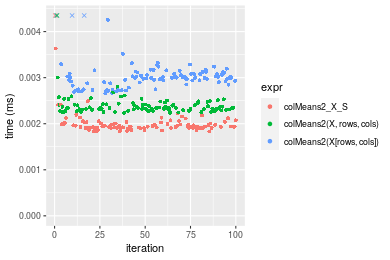

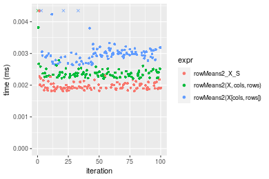
_Table: Benchmarking of colMeans2_X_S() and rowMeans2_X_S() on integer+10x10 data (original and transposed).  The top panel shows times in milliseconds and the bottom panel shows relative times._


|   |expr          |   min|     lq|    mean| median|     uq|     max|
|:--|:-------------|-----:|------:|-------:|------:|------:|-------:|
|2  |rowMeans2_X_S | 1.810| 1.8955| 1.98704| 1.9235| 2.0240|   4.345|
|1  |colMeans2_X_S | 1.832| 1.9090| 3.00044| 1.9370| 2.0155| 103.005|


|   |expr          |      min|       lq|     mean|   median|        uq|      max|
|:--|:-------------|--------:|--------:|--------:|--------:|---------:|--------:|
|2  |rowMeans2_X_S | 1.000000| 1.000000| 1.000000| 1.000000| 1.0000000|  1.00000|
|1  |colMeans2_X_S | 1.012155| 1.007122| 1.510005| 1.007019| 0.9958004| 23.70656|

_Figure: Benchmarking of colMeans2_X_S() and rowMeans2_X_S() on integer+10x10 data (original and transposed).  Outliers are displayed as crosses. Times are in milliseconds._


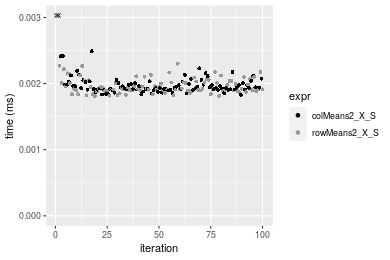

#### 100x100 integer matrix

```r
> X <- data[["100x100"]]
> rows <- sample.int(nrow(X), size = nrow(X) * 0.7)
> cols <- sample.int(ncol(X), size = ncol(X) * 0.7)
> X_S <- X[rows, cols]
> gc()
          used  (Mb) gc trigger  (Mb) max used  (Mb)
Ncells 5173090 276.3   10014072 534.9 10014072 534.9
Vcells 9281401  70.9   18204443 138.9 18204443 138.9
> colStats <- microbenchmark(colMeans2_X_S = colMeans2(X_S, na.rm = FALSE), `colMeans2(X, rows, cols)` = colMeans2(X, 
+     rows = rows, cols = cols, na.rm = FALSE), `colMeans2(X[rows, cols])` = colMeans2(X[rows, cols], 
+     na.rm = FALSE), unit = "ms")
> X <- t(X)
> X_S <- t(X_S)
> gc()
          used  (Mb) gc trigger  (Mb) max used  (Mb)
Ncells 5173066 276.3   10014072 534.9 10014072 534.9
Vcells 9286454  70.9   18204443 138.9 18204443 138.9
> rowStats <- microbenchmark(rowMeans2_X_S = rowMeans2(X_S, na.rm = FALSE), `rowMeans2(X, cols, rows)` = rowMeans2(X, 
+     rows = cols, cols = rows, na.rm = FALSE), `rowMeans2(X[cols, rows])` = rowMeans2(X[cols, rows], 
+     na.rm = FALSE), unit = "ms")
```

_Table: Benchmarking of colMeans2_X_S(), colMeans2(X, rows, cols)() and colMeans2(X[rows, cols])() on integer+100x100 data. The top panel shows times in milliseconds and the bottom panel shows relative times._


|   |expr                     |      min|        lq|      mean|    median|        uq|      max|
|:--|:------------------------|--------:|---------:|---------:|---------:|---------:|--------:|
|1  |colMeans2_X_S            | 0.011170| 0.0116695| 0.0118009| 0.0117845| 0.0119135| 0.013676|
|2  |colMeans2(X, rows, cols) | 0.012577| 0.0134565| 0.0137178| 0.0136470| 0.0138600| 0.019829|
|3  |colMeans2(X[rows, cols]) | 0.021960| 0.0229145| 0.0238504| 0.0232545| 0.0236780| 0.060903|


|   |expr                     |      min|       lq|     mean|   median|       uq|      max|
|:--|:------------------------|--------:|--------:|--------:|--------:|--------:|--------:|
|1  |colMeans2_X_S            | 1.000000| 1.000000| 1.000000| 1.000000| 1.000000| 1.000000|
|2  |colMeans2(X, rows, cols) | 1.125962| 1.153134| 1.162433| 1.158047| 1.163386| 1.449912|
|3  |colMeans2(X[rows, cols]) | 1.965980| 1.963623| 2.021069| 1.973312| 1.987493| 4.453276|

_Table: Benchmarking of rowMeans2_X_S(), rowMeans2(X, cols, rows)() and rowMeans2(X[cols, rows])() on integer+100x100 data (transposed). The top panel shows times in milliseconds and the bottom panel shows relative times._


|   |expr                     |      min|        lq|      mean|    median|        uq|      max|
|:--|:------------------------|--------:|---------:|---------:|---------:|---------:|--------:|
|2  |rowMeans2(X, cols, rows) | 0.011908| 0.0126645| 0.0130940| 0.0128920| 0.0131455| 0.034250|
|1  |rowMeans2_X_S            | 0.012108| 0.0129255| 0.0135465| 0.0132530| 0.0135380| 0.028368|
|3  |rowMeans2(X[cols, rows]) | 0.022372| 0.0237745| 0.0247952| 0.0246075| 0.0250985| 0.039203|


|   |expr                     |      min|       lq|     mean|   median|       uq|       max|
|:--|:------------------------|--------:|--------:|--------:|--------:|--------:|---------:|
|2  |rowMeans2(X, cols, rows) | 1.000000| 1.000000| 1.000000| 1.000000| 1.000000| 1.0000000|
|1  |rowMeans2_X_S            | 1.016795| 1.020609| 1.034562| 1.028002| 1.029858| 0.8282628|
|3  |rowMeans2(X[cols, rows]) | 1.878737| 1.877255| 1.893634| 1.908742| 1.909285| 1.1446131|

_Figure: Benchmarking of colMeans2_X_S(), colMeans2(X, rows, cols)() and colMeans2(X[rows, cols])() on integer+100x100 data  as well as rowMeans2_X_S(), rowMeans2(X, cols, rows)() and rowMeans2(X[cols, rows])() on the same data transposed.  Outliers are displayed as crosses.  Times are in milliseconds._


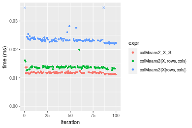

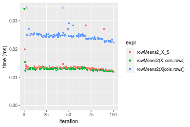
_Table: Benchmarking of colMeans2_X_S() and rowMeans2_X_S() on integer+100x100 data (original and transposed).  The top panel shows times in milliseconds and the bottom panel shows relative times._


|   |expr          |    min|      lq|     mean|  median|      uq|    max|
|:--|:-------------|------:|-------:|--------:|-------:|-------:|------:|
|1  |colMeans2_X_S | 11.170| 11.6695| 11.80089| 11.7845| 11.9135| 13.676|
|2  |rowMeans2_X_S | 12.108| 12.9255| 13.54654| 13.2530| 13.5380| 28.368|


|   |expr          |      min|       lq|     mean|   median|       uq|      max|
|:--|:-------------|--------:|--------:|--------:|--------:|--------:|--------:|
|1  |colMeans2_X_S | 1.000000| 1.000000| 1.000000| 1.000000| 1.000000| 1.000000|
|2  |rowMeans2_X_S | 1.083975| 1.107631| 1.147925| 1.124613| 1.136358| 2.074291|

_Figure: Benchmarking of colMeans2_X_S() and rowMeans2_X_S() on integer+100x100 data (original and transposed).  Outliers are displayed as crosses. Times are in milliseconds._


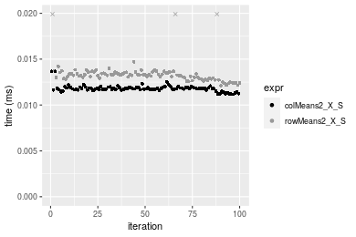

#### 1000x10 integer matrix

```r
> X <- data[["1000x10"]]
> rows <- sample.int(nrow(X), size = nrow(X) * 0.7)
> cols <- sample.int(ncol(X), size = ncol(X) * 0.7)
> X_S <- X[rows, cols]
> gc()
          used  (Mb) gc trigger  (Mb) max used  (Mb)
Ncells 5173833 276.4   10014072 534.9 10014072 534.9
Vcells 9285439  70.9   18204443 138.9 18204443 138.9
> colStats <- microbenchmark(colMeans2_X_S = colMeans2(X_S, na.rm = FALSE), `colMeans2(X, rows, cols)` = colMeans2(X, 
+     rows = rows, cols = cols, na.rm = FALSE), `colMeans2(X[rows, cols])` = colMeans2(X[rows, cols], 
+     na.rm = FALSE), unit = "ms")
> X <- t(X)
> X_S <- t(X_S)
> gc()
          used  (Mb) gc trigger  (Mb) max used  (Mb)
Ncells 5173809 276.4   10014072 534.9 10014072 534.9
Vcells 9290492  70.9   18204443 138.9 18204443 138.9
> rowStats <- microbenchmark(rowMeans2_X_S = rowMeans2(X_S, na.rm = FALSE), `rowMeans2(X, cols, rows)` = rowMeans2(X, 
+     rows = cols, cols = rows, na.rm = FALSE), `rowMeans2(X[cols, rows])` = rowMeans2(X[cols, rows], 
+     na.rm = FALSE), unit = "ms")
```

_Table: Benchmarking of colMeans2_X_S(), colMeans2(X, rows, cols)() and colMeans2(X[rows, cols])() on integer+1000x10 data. The top panel shows times in milliseconds and the bottom panel shows relative times._


|   |expr                     |      min|        lq|      mean|    median|        uq|      max|
|:--|:------------------------|--------:|---------:|---------:|---------:|---------:|--------:|
|1  |colMeans2_X_S            | 0.009799| 0.0102325| 0.0104011| 0.0103555| 0.0104845| 0.014097|
|2  |colMeans2(X, rows, cols) | 0.013841| 0.0146190| 0.0151129| 0.0148665| 0.0153960| 0.019648|
|3  |colMeans2(X[rows, cols]) | 0.021103| 0.0216975| 0.0229399| 0.0222940| 0.0228595| 0.062844|


|   |expr                     |      min|       lq|     mean|   median|       uq|      max|
|:--|:------------------------|--------:|--------:|--------:|--------:|--------:|--------:|
|1  |colMeans2_X_S            | 1.000000| 1.000000| 1.000000| 1.000000| 1.000000| 1.000000|
|2  |colMeans2(X, rows, cols) | 1.412491| 1.428683| 1.453003| 1.435614| 1.468453| 1.393772|
|3  |colMeans2(X[rows, cols]) | 2.153587| 2.120449| 2.205517| 2.152866| 2.180314| 4.457970|

_Table: Benchmarking of rowMeans2_X_S(), rowMeans2(X, cols, rows)() and rowMeans2(X[cols, rows])() on integer+1000x10 data (transposed). The top panel shows times in milliseconds and the bottom panel shows relative times._


|   |expr                     |      min|        lq|      mean|    median|        uq|      max|
|:--|:------------------------|--------:|---------:|---------:|---------:|---------:|--------:|
|1  |rowMeans2_X_S            | 0.011750| 0.0119330| 0.0123859| 0.0121365| 0.0125075| 0.026888|
|2  |rowMeans2(X, cols, rows) | 0.014295| 0.0148420| 0.0153714| 0.0151490| 0.0155195| 0.019874|
|3  |rowMeans2(X[cols, rows]) | 0.024669| 0.0253075| 0.0265007| 0.0260105| 0.0269010| 0.062997|


|   |expr                     |      min|       lq|     mean|   median|       uq|       max|
|:--|:------------------------|--------:|--------:|--------:|--------:|--------:|---------:|
|1  |rowMeans2_X_S            | 1.000000| 1.000000| 1.000000| 1.000000| 1.000000| 1.0000000|
|2  |rowMeans2(X, cols, rows) | 1.216596| 1.243778| 1.241041| 1.248218| 1.240816| 0.7391401|
|3  |rowMeans2(X[cols, rows]) | 2.099489| 2.120799| 2.139579| 2.143163| 2.150790| 2.3429411|

_Figure: Benchmarking of colMeans2_X_S(), colMeans2(X, rows, cols)() and colMeans2(X[rows, cols])() on integer+1000x10 data  as well as rowMeans2_X_S(), rowMeans2(X, cols, rows)() and rowMeans2(X[cols, rows])() on the same data transposed.  Outliers are displayed as crosses.  Times are in milliseconds._


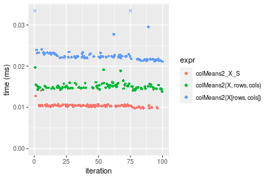

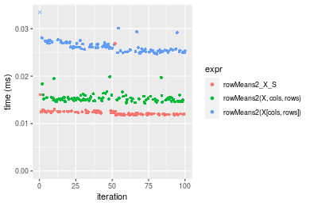
_Table: Benchmarking of colMeans2_X_S() and rowMeans2_X_S() on integer+1000x10 data (original and transposed).  The top panel shows times in milliseconds and the bottom panel shows relative times._


|   |expr          |    min|      lq|     mean|  median|      uq|    max|
|:--|:-------------|------:|-------:|--------:|-------:|-------:|------:|
|1  |colMeans2_X_S |  9.799| 10.2325| 10.40112| 10.3555| 10.4845| 14.097|
|2  |rowMeans2_X_S | 11.750| 11.9330| 12.38592| 12.1365| 12.5075| 26.888|


|   |expr          |      min|       lq|     mean|   median|       uq|      max|
|:--|:-------------|--------:|--------:|--------:|--------:|--------:|--------:|
|1  |colMeans2_X_S | 1.000000| 1.000000| 1.000000| 1.000000| 1.000000| 1.000000|
|2  |rowMeans2_X_S | 1.199102| 1.166186| 1.190826| 1.171986| 1.192951| 1.907356|

_Figure: Benchmarking of colMeans2_X_S() and rowMeans2_X_S() on integer+1000x10 data (original and transposed).  Outliers are displayed as crosses. Times are in milliseconds._


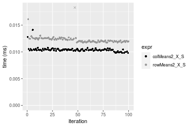

#### 10x1000 integer matrix

```r
> X <- data[["10x1000"]]
> rows <- sample.int(nrow(X), size = nrow(X) * 0.7)
> cols <- sample.int(ncol(X), size = ncol(X) * 0.7)
> X_S <- X[rows, cols]
> gc()
          used  (Mb) gc trigger  (Mb) max used  (Mb)
Ncells 5174038 276.4   10014072 534.9 10014072 534.9
Vcells 9286313  70.9   18204443 138.9 18204443 138.9
> colStats <- microbenchmark(colMeans2_X_S = colMeans2(X_S, na.rm = FALSE), `colMeans2(X, rows, cols)` = colMeans2(X, 
+     rows = rows, cols = cols, na.rm = FALSE), `colMeans2(X[rows, cols])` = colMeans2(X[rows, cols], 
+     na.rm = FALSE), unit = "ms")
> X <- t(X)
> X_S <- t(X_S)
> gc()
          used  (Mb) gc trigger  (Mb) max used  (Mb)
Ncells 5174014 276.4   10014072 534.9 10014072 534.9
Vcells 9291366  70.9   18204443 138.9 18204443 138.9
> rowStats <- microbenchmark(rowMeans2_X_S = rowMeans2(X_S, na.rm = FALSE), `rowMeans2(X, cols, rows)` = rowMeans2(X, 
+     rows = cols, cols = rows, na.rm = FALSE), `rowMeans2(X[cols, rows])` = rowMeans2(X[cols, rows], 
+     na.rm = FALSE), unit = "ms")
```

_Table: Benchmarking of colMeans2_X_S(), colMeans2(X, rows, cols)() and colMeans2(X[rows, cols])() on integer+10x1000 data. The top panel shows times in milliseconds and the bottom panel shows relative times._


|   |expr                     |      min|        lq|      mean|    median|        uq|      max|
|:--|:------------------------|--------:|---------:|---------:|---------:|---------:|--------:|
|1  |colMeans2_X_S            | 0.014668| 0.0153500| 0.0158921| 0.0158445| 0.0161710| 0.030883|
|2  |colMeans2(X, rows, cols) | 0.016450| 0.0172650| 0.0180545| 0.0177160| 0.0183510| 0.032028|
|3  |colMeans2(X[rows, cols]) | 0.027460| 0.0286605| 0.0299836| 0.0297910| 0.0304695| 0.045021|


|   |expr                     |      min|       lq|     mean|   median|       uq|      max|
|:--|:------------------------|--------:|--------:|--------:|--------:|--------:|--------:|
|1  |colMeans2_X_S            | 1.000000| 1.000000| 1.000000| 1.000000| 1.000000| 1.000000|
|2  |colMeans2(X, rows, cols) | 1.121489| 1.124756| 1.136067| 1.118117| 1.134809| 1.037075|
|3  |colMeans2(X[rows, cols]) | 1.872103| 1.867134| 1.886695| 1.880211| 1.884206| 1.457792|

_Table: Benchmarking of rowMeans2_X_S(), rowMeans2(X, cols, rows)() and rowMeans2(X[cols, rows])() on integer+10x1000 data (transposed). The top panel shows times in milliseconds and the bottom panel shows relative times._


|   |expr                     |      min|        lq|      mean|    median|        uq|      max|
|:--|:------------------------|--------:|---------:|---------:|---------:|---------:|--------:|
|1  |rowMeans2_X_S            | 0.013616| 0.0141925| 0.0146227| 0.0146125| 0.0149295| 0.020838|
|2  |rowMeans2(X, cols, rows) | 0.015836| 0.0168395| 0.0178138| 0.0173255| 0.0178220| 0.040215|
|3  |rowMeans2(X[cols, rows]) | 0.024485| 0.0257565| 0.0268634| 0.0266445| 0.0274915| 0.043086|


|   |expr                     |      min|       lq|     mean|   median|       uq|      max|
|:--|:------------------------|--------:|--------:|--------:|--------:|--------:|--------:|
|1  |rowMeans2_X_S            | 1.000000| 1.000000| 1.000000| 1.000000| 1.000000| 1.000000|
|2  |rowMeans2(X, cols, rows) | 1.163043| 1.186507| 1.218228| 1.185663| 1.193744| 1.929888|
|3  |rowMeans2(X[cols, rows]) | 1.798252| 1.814796| 1.837100| 1.823405| 1.841421| 2.067665|

_Figure: Benchmarking of colMeans2_X_S(), colMeans2(X, rows, cols)() and colMeans2(X[rows, cols])() on integer+10x1000 data  as well as rowMeans2_X_S(), rowMeans2(X, cols, rows)() and rowMeans2(X[cols, rows])() on the same data transposed.  Outliers are displayed as crosses.  Times are in milliseconds._


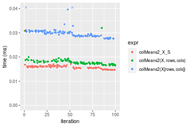

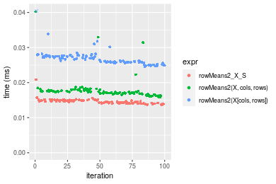
_Table: Benchmarking of colMeans2_X_S() and rowMeans2_X_S() on integer+10x1000 data (original and transposed).  The top panel shows times in milliseconds and the bottom panel shows relative times._


|   |expr          |    min|      lq|     mean|  median|      uq|    max|
|:--|:-------------|------:|-------:|--------:|-------:|-------:|------:|
|2  |rowMeans2_X_S | 13.616| 14.1925| 14.62269| 14.6125| 14.9295| 20.838|
|1  |colMeans2_X_S | 14.668| 15.3500| 15.89213| 15.8445| 16.1710| 30.883|


|   |expr          |      min|       lq|     mean|   median|       uq|      max|
|:--|:-------------|--------:|--------:|--------:|--------:|--------:|--------:|
|2  |rowMeans2_X_S | 1.000000| 1.000000| 1.000000| 1.000000| 1.000000| 1.000000|
|1  |colMeans2_X_S | 1.077262| 1.081557| 1.086813| 1.084311| 1.083157| 1.482052|

_Figure: Benchmarking of colMeans2_X_S() and rowMeans2_X_S() on integer+10x1000 data (original and transposed).  Outliers are displayed as crosses. Times are in milliseconds._


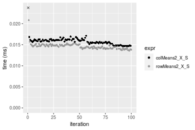

#### 100x1000 integer matrix

```r
> X <- data[["100x1000"]]
> rows <- sample.int(nrow(X), size = nrow(X) * 0.7)
> cols <- sample.int(ncol(X), size = ncol(X) * 0.7)
> X_S <- X[rows, cols]
> gc()
          used  (Mb) gc trigger  (Mb) max used  (Mb)
Ncells 5174248 276.4   10014072 534.9 10014072 534.9
Vcells 9308990  71.1   18204443 138.9 18204443 138.9
> colStats <- microbenchmark(colMeans2_X_S = colMeans2(X_S, na.rm = FALSE), `colMeans2(X, rows, cols)` = colMeans2(X, 
+     rows = rows, cols = cols, na.rm = FALSE), `colMeans2(X[rows, cols])` = colMeans2(X[rows, cols], 
+     na.rm = FALSE), unit = "ms")
> X <- t(X)
> X_S <- t(X_S)
> gc()
          used  (Mb) gc trigger  (Mb) max used  (Mb)
Ncells 5174224 276.4   10014072 534.9 10014072 534.9
Vcells 9359043  71.5   18204443 138.9 18204443 138.9
> rowStats <- microbenchmark(rowMeans2_X_S = rowMeans2(X_S, na.rm = FALSE), `rowMeans2(X, cols, rows)` = rowMeans2(X, 
+     rows = cols, cols = rows, na.rm = FALSE), `rowMeans2(X[cols, rows])` = rowMeans2(X[cols, rows], 
+     na.rm = FALSE), unit = "ms")
```

_Table: Benchmarking of colMeans2_X_S(), colMeans2(X, rows, cols)() and colMeans2(X[rows, cols])() on integer+100x1000 data. The top panel shows times in milliseconds and the bottom panel shows relative times._


|   |expr                     |      min|        lq|      mean|    median|       uq|      max|
|:--|:------------------------|--------:|---------:|---------:|---------:|--------:|--------:|
|1  |colMeans2_X_S            | 0.070838| 0.0759325| 0.0821723| 0.0784770| 0.087463| 0.118438|
|2  |colMeans2(X, rows, cols) | 0.080430| 0.0859685| 0.0937463| 0.0894300| 0.099185| 0.171850|
|3  |colMeans2(X[rows, cols]) | 0.148411| 0.1597790| 0.1767532| 0.1699885| 0.193296| 0.234121|


|   |expr                     |      min|       lq|     mean|   median|       uq|      max|
|:--|:------------------------|--------:|--------:|--------:|--------:|--------:|--------:|
|1  |colMeans2_X_S            | 1.000000| 1.000000| 1.000000| 1.000000| 1.000000| 1.000000|
|2  |colMeans2(X, rows, cols) | 1.135407| 1.132170| 1.140850| 1.139570| 1.134022| 1.450970|
|3  |colMeans2(X[rows, cols]) | 2.095076| 2.104224| 2.151008| 2.166093| 2.210032| 1.976739|

_Table: Benchmarking of rowMeans2_X_S(), rowMeans2(X, cols, rows)() and rowMeans2(X[cols, rows])() on integer+100x1000 data (transposed). The top panel shows times in milliseconds and the bottom panel shows relative times._


|   |expr                     |      min|        lq|      mean|    median|        uq|      max|
|:--|:------------------------|--------:|---------:|---------:|---------:|---------:|--------:|
|1  |rowMeans2_X_S            | 0.082254| 0.0898250| 0.0975989| 0.0939735| 0.1021550| 0.165513|
|2  |rowMeans2(X, cols, rows) | 0.102458| 0.1087605| 0.1175351| 0.1135720| 0.1235660| 0.197020|
|3  |rowMeans2(X[cols, rows]) | 0.152331| 0.1640765| 0.1812765| 0.1749240| 0.1966915| 0.247341|


|   |expr                     |      min|       lq|     mean|   median|       uq|     max|
|:--|:------------------------|--------:|--------:|--------:|--------:|--------:|-------:|
|1  |rowMeans2_X_S            | 1.000000| 1.000000| 1.000000| 1.000000| 1.000000| 1.00000|
|2  |rowMeans2(X, cols, rows) | 1.245629| 1.210804| 1.204267| 1.208554| 1.209593| 1.19036|
|3  |rowMeans2(X[cols, rows]) | 1.851959| 1.826624| 1.857363| 1.861418| 1.925422| 1.49439|

_Figure: Benchmarking of colMeans2_X_S(), colMeans2(X, rows, cols)() and colMeans2(X[rows, cols])() on integer+100x1000 data  as well as rowMeans2_X_S(), rowMeans2(X, cols, rows)() and rowMeans2(X[cols, rows])() on the same data transposed.  Outliers are displayed as crosses.  Times are in milliseconds._


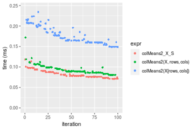

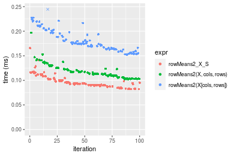
_Table: Benchmarking of colMeans2_X_S() and rowMeans2_X_S() on integer+100x1000 data (original and transposed).  The top panel shows times in milliseconds and the bottom panel shows relative times._


|   |expr          |    min|      lq|     mean|  median|      uq|     max|
|:--|:-------------|------:|-------:|--------:|-------:|-------:|-------:|
|1  |colMeans2_X_S | 70.838| 75.9325| 82.17226| 78.4770|  87.463| 118.438|
|2  |rowMeans2_X_S | 82.254| 89.8250| 97.59887| 93.9735| 102.155| 165.513|


|   |expr          |      min|       lq|     mean|   median|      uq|      max|
|:--|:-------------|--------:|--------:|--------:|--------:|-------:|--------:|
|1  |colMeans2_X_S | 1.000000| 1.000000| 1.000000| 1.000000| 1.00000| 1.000000|
|2  |rowMeans2_X_S | 1.161156| 1.182959| 1.187735| 1.197466| 1.16798| 1.397465|

_Figure: Benchmarking of colMeans2_X_S() and rowMeans2_X_S() on integer+100x1000 data (original and transposed).  Outliers are displayed as crosses. Times are in milliseconds._


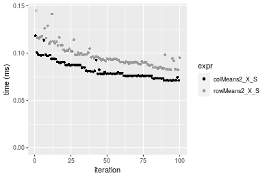

#### 1000x100 integer matrix

```r
> X <- data[["1000x100"]]
> rows <- sample.int(nrow(X), size = nrow(X) * 0.7)
> cols <- sample.int(ncol(X), size = ncol(X) * 0.7)
> X_S <- X[rows, cols]
> gc()
          used  (Mb) gc trigger  (Mb) max used  (Mb)
Ncells 5174461 276.4   10014072 534.9 10014072 534.9
Vcells 9309778  71.1   18204443 138.9 18204443 138.9
> colStats <- microbenchmark(colMeans2_X_S = colMeans2(X_S, na.rm = FALSE), `colMeans2(X, rows, cols)` = colMeans2(X, 
+     rows = rows, cols = cols, na.rm = FALSE), `colMeans2(X[rows, cols])` = colMeans2(X[rows, cols], 
+     na.rm = FALSE), unit = "ms")
> X <- t(X)
> X_S <- t(X_S)
> gc()
          used  (Mb) gc trigger  (Mb) max used  (Mb)
Ncells 5174437 276.4   10014072 534.9 10014072 534.9
Vcells 9359831  71.5   18204443 138.9 18204443 138.9
> rowStats <- microbenchmark(rowMeans2_X_S = rowMeans2(X_S, na.rm = FALSE), `rowMeans2(X, cols, rows)` = rowMeans2(X, 
+     rows = cols, cols = rows, na.rm = FALSE), `rowMeans2(X[cols, rows])` = rowMeans2(X[cols, rows], 
+     na.rm = FALSE), unit = "ms")
```

_Table: Benchmarking of colMeans2_X_S(), colMeans2(X, rows, cols)() and colMeans2(X[rows, cols])() on integer+1000x100 data. The top panel shows times in milliseconds and the bottom panel shows relative times._


|   |expr                     |      min|        lq|      mean|    median|        uq|      max|
|:--|:------------------------|--------:|---------:|---------:|---------:|---------:|--------:|
|1  |colMeans2_X_S            | 0.063170| 0.0674395| 0.0733614| 0.0697050| 0.0772330| 0.108299|
|2  |colMeans2(X, rows, cols) | 0.074026| 0.0779135| 0.0851398| 0.0819720| 0.0914160| 0.130047|
|3  |colMeans2(X[rows, cols]) | 0.137963| 0.1474460| 0.1657067| 0.1590465| 0.1792945| 0.248533|


|   |expr                     |      min|       lq|     mean|   median|       uq|      max|
|:--|:------------------------|--------:|--------:|--------:|--------:|--------:|--------:|
|1  |colMeans2_X_S            | 1.000000| 1.000000| 1.000000| 1.000000| 1.000000| 1.000000|
|2  |colMeans2(X, rows, cols) | 1.171854| 1.155310| 1.160553| 1.175984| 1.183639| 1.200814|
|3  |colMeans2(X[rows, cols]) | 2.183996| 2.186345| 2.258772| 2.281709| 2.321475| 2.294878|

_Table: Benchmarking of rowMeans2_X_S(), rowMeans2(X, cols, rows)() and rowMeans2(X[cols, rows])() on integer+1000x100 data (transposed). The top panel shows times in milliseconds and the bottom panel shows relative times._


|   |expr                     |      min|        lq|      mean|    median|        uq|      max|
|:--|:------------------------|--------:|---------:|---------:|---------:|---------:|--------:|
|1  |rowMeans2_X_S            | 0.077609| 0.0837945| 0.0920105| 0.0895710| 0.0995980| 0.123194|
|2  |rowMeans2(X, cols, rows) | 0.101746| 0.1117885| 0.1206264| 0.1162540| 0.1287865| 0.213236|
|3  |rowMeans2(X[cols, rows]) | 0.153176| 0.1688515| 0.1857057| 0.1801625| 0.2008475| 0.241849|


|   |expr                     |      min|       lq|     mean|   median|       uq|      max|
|:--|:------------------------|--------:|--------:|--------:|--------:|--------:|--------:|
|1  |rowMeans2_X_S            | 1.000000| 1.000000| 1.000000| 1.000000| 1.000000| 1.000000|
|2  |rowMeans2(X, cols, rows) | 1.311008| 1.334079| 1.311006| 1.297898| 1.293063| 1.730896|
|3  |rowMeans2(X[cols, rows]) | 1.973689| 2.015067| 2.018309| 2.011393| 2.016582| 1.963156|

_Figure: Benchmarking of colMeans2_X_S(), colMeans2(X, rows, cols)() and colMeans2(X[rows, cols])() on integer+1000x100 data  as well as rowMeans2_X_S(), rowMeans2(X, cols, rows)() and rowMeans2(X[cols, rows])() on the same data transposed.  Outliers are displayed as crosses.  Times are in milliseconds._


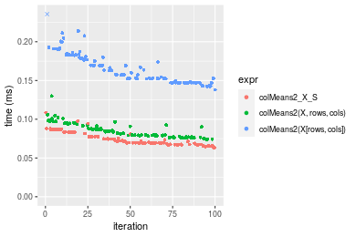

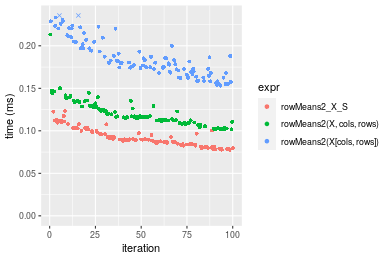
_Table: Benchmarking of colMeans2_X_S() and rowMeans2_X_S() on integer+1000x100 data (original and transposed).  The top panel shows times in milliseconds and the bottom panel shows relative times._


|   |expr          |    min|      lq|     mean| median|     uq|     max|
|:--|:-------------|------:|-------:|--------:|------:|------:|-------:|
|1  |colMeans2_X_S | 63.170| 67.4395| 73.36143| 69.705| 77.233| 108.299|
|2  |rowMeans2_X_S | 77.609| 83.7945| 92.01054| 89.571| 99.598| 123.194|


|   |expr          |      min|       lq|     mean|   median|       uq|      max|
|:--|:-------------|--------:|--------:|--------:|--------:|--------:|--------:|
|1  |colMeans2_X_S | 1.000000| 1.000000| 1.000000| 1.000000| 1.000000| 1.000000|
|2  |rowMeans2_X_S | 1.228574| 1.242514| 1.254209| 1.285001| 1.289578| 1.137536|

_Figure: Benchmarking of colMeans2_X_S() and rowMeans2_X_S() on integer+1000x100 data (original and transposed).  Outliers are displayed as crosses. Times are in milliseconds._


## Data type "double"

### Data
```r
> rmatrix <- function(nrow, ncol, mode = c("logical", "double", "integer", "index"), range = c(-100, 
+     +100), na_prob = 0) {
+     mode <- match.arg(mode)
+     n <- nrow * ncol
+     if (mode == "logical") {
+         x <- sample(c(FALSE, TRUE), size = n, replace = TRUE)
+     }     else if (mode == "index") {
+         x <- seq_len(n)
+         mode <- "integer"
+     }     else {
+         x <- runif(n, min = range[1], max = range[2])
+     }
+     storage.mode(x) <- mode
+     if (na_prob > 0) 
+         x[sample(n, size = na_prob * n)] <- NA
+     dim(x) <- c(nrow, ncol)
+     x
+ }
> rmatrices <- function(scale = 10, seed = 1, ...) {
+     set.seed(seed)
+     data <- list()
+     data[[1]] <- rmatrix(nrow = scale * 1, ncol = scale * 1, ...)
+     data[[2]] <- rmatrix(nrow = scale * 10, ncol = scale * 10, ...)
+     data[[3]] <- rmatrix(nrow = scale * 100, ncol = scale * 1, ...)
+     data[[4]] <- t(data[[3]])
+     data[[5]] <- rmatrix(nrow = scale * 10, ncol = scale * 100, ...)
+     data[[6]] <- t(data[[5]])
+     names(data) <- sapply(data, FUN = function(x) paste(dim(x), collapse = "x"))
+     data
+ }
> data <- rmatrices(mode = mode)
```

### Results

#### 10x10 double matrix

```r
> X <- data[["10x10"]]
> rows <- sample.int(nrow(X), size = nrow(X) * 0.7)
> cols <- sample.int(ncol(X), size = ncol(X) * 0.7)
> X_S <- X[rows, cols]
> gc()
          used  (Mb) gc trigger  (Mb) max used  (Mb)
Ncells 5174678 276.4   10014072 534.9 10014072 534.9
Vcells 9400886  71.8   18204443 138.9 18204443 138.9
> colStats <- microbenchmark(colMeans2_X_S = colMeans2(X_S, na.rm = FALSE), `colMeans2(X, rows, cols)` = colMeans2(X, 
+     rows = rows, cols = cols, na.rm = FALSE), `colMeans2(X[rows, cols])` = colMeans2(X[rows, cols], 
+     na.rm = FALSE), unit = "ms")
> X <- t(X)
> X_S <- t(X_S)
> gc()
          used  (Mb) gc trigger  (Mb) max used  (Mb)
Ncells 5174645 276.4   10014072 534.9 10014072 534.9
Vcells 9401024  71.8   18204443 138.9 18204443 138.9
> rowStats <- microbenchmark(rowMeans2_X_S = rowMeans2(X_S, na.rm = FALSE), `rowMeans2(X, cols, rows)` = rowMeans2(X, 
+     rows = cols, cols = rows, na.rm = FALSE), `rowMeans2(X[cols, rows])` = rowMeans2(X[cols, rows], 
+     na.rm = FALSE), unit = "ms")
```

_Table: Benchmarking of colMeans2_X_S(), colMeans2(X, rows, cols)() and colMeans2(X[rows, cols])() on double+10x10 data. The top panel shows times in milliseconds and the bottom panel shows relative times._


|   |expr                     |      min|        lq|      mean|    median|        uq|      max|
|:--|:------------------------|--------:|---------:|---------:|---------:|---------:|--------:|
|1  |colMeans2_X_S            | 0.001928| 0.0020105| 0.0022717| 0.0020635| 0.0021580| 0.018745|
|2  |colMeans2(X, rows, cols) | 0.002288| 0.0023490| 0.0024630| 0.0024055| 0.0025045| 0.004879|
|3  |colMeans2(X[rows, cols]) | 0.002798| 0.0029830| 0.0032564| 0.0031350| 0.0033040| 0.008684|


|   |expr                     |      min|       lq|     mean|   median|       uq|       max|
|:--|:------------------------|--------:|--------:|--------:|--------:|--------:|---------:|
|1  |colMeans2_X_S            | 1.000000| 1.000000| 1.000000| 1.000000| 1.000000| 1.0000000|
|2  |colMeans2(X, rows, cols) | 1.186722| 1.168366| 1.084207| 1.165738| 1.160565| 0.2602827|
|3  |colMeans2(X[rows, cols]) | 1.451245| 1.483710| 1.433492| 1.519263| 1.531047| 0.4632702|

_Table: Benchmarking of rowMeans2_X_S(), rowMeans2(X, cols, rows)() and rowMeans2(X[cols, rows])() on double+10x10 data (transposed). The top panel shows times in milliseconds and the bottom panel shows relative times._


|   |expr                     |      min|        lq|      mean|    median|        uq|      max|
|:--|:------------------------|--------:|---------:|---------:|---------:|---------:|--------:|
|1  |rowMeans2_X_S            | 0.001888| 0.0019685| 0.0020690| 0.0020020| 0.0021105| 0.004404|
|2  |rowMeans2(X, cols, rows) | 0.002284| 0.0023710| 0.0026304| 0.0024195| 0.0024990| 0.019204|
|3  |rowMeans2(X[cols, rows]) | 0.002767| 0.0028955| 0.0031613| 0.0030515| 0.0032120| 0.006227|


|   |expr                     |      min|       lq|     mean|   median|       uq|      max|
|:--|:------------------------|--------:|--------:|--------:|--------:|--------:|--------:|
|1  |rowMeans2_X_S            | 1.000000| 1.000000| 1.000000| 1.000000| 1.000000| 1.000000|
|2  |rowMeans2(X, cols, rows) | 1.209746| 1.204470| 1.271356| 1.208541| 1.184080| 4.360581|
|3  |rowMeans2(X[cols, rows]) | 1.465572| 1.470917| 1.527966| 1.524226| 1.521914| 1.413942|

_Figure: Benchmarking of colMeans2_X_S(), colMeans2(X, rows, cols)() and colMeans2(X[rows, cols])() on double+10x10 data  as well as rowMeans2_X_S(), rowMeans2(X, cols, rows)() and rowMeans2(X[cols, rows])() on the same data transposed.  Outliers are displayed as crosses.  Times are in milliseconds._


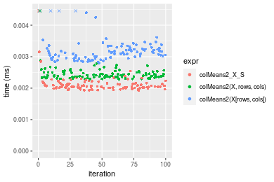

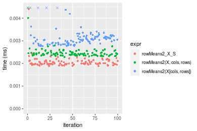
_Table: Benchmarking of colMeans2_X_S() and rowMeans2_X_S() on double+10x10 data (original and transposed).  The top panel shows times in milliseconds and the bottom panel shows relative times._


|   |expr          |   min|     lq|    mean| median|     uq|    max|
|:--|:-------------|-----:|------:|-------:|------:|------:|------:|
|2  |rowMeans2_X_S | 1.888| 1.9685| 2.06898| 2.0020| 2.1105|  4.404|
|1  |colMeans2_X_S | 1.928| 2.0105| 2.27167| 2.0635| 2.1580| 18.745|


|   |expr          |      min|       lq|     mean|   median|       uq|      max|
|:--|:-------------|--------:|--------:|--------:|--------:|--------:|--------:|
|2  |rowMeans2_X_S | 1.000000| 1.000000| 1.000000| 1.000000| 1.000000| 1.000000|
|1  |colMeans2_X_S | 1.021186| 1.021336| 1.097966| 1.030719| 1.022506| 4.256358|

_Figure: Benchmarking of colMeans2_X_S() and rowMeans2_X_S() on double+10x10 data (original and transposed).  Outliers are displayed as crosses. Times are in milliseconds._


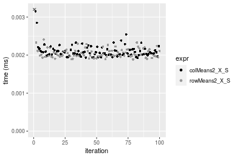

#### 100x100 double matrix

```r
> X <- data[["100x100"]]
> rows <- sample.int(nrow(X), size = nrow(X) * 0.7)
> cols <- sample.int(ncol(X), size = ncol(X) * 0.7)
> X_S <- X[rows, cols]
> gc()
          used  (Mb) gc trigger  (Mb) max used  (Mb)
Ncells 5174875 276.4   10014072 534.9 10014072 534.9
Vcells 9406839  71.8   18204443 138.9 18204443 138.9
> colStats <- microbenchmark(colMeans2_X_S = colMeans2(X_S, na.rm = FALSE), `colMeans2(X, rows, cols)` = colMeans2(X, 
+     rows = rows, cols = cols, na.rm = FALSE), `colMeans2(X[rows, cols])` = colMeans2(X[rows, cols], 
+     na.rm = FALSE), unit = "ms")
> X <- t(X)
> X_S <- t(X_S)
> gc()
          used  (Mb) gc trigger  (Mb) max used  (Mb)
Ncells 5174851 276.4   10014072 534.9 10014072 534.9
Vcells 9416892  71.9   18204443 138.9 18204443 138.9
> rowStats <- microbenchmark(rowMeans2_X_S = rowMeans2(X_S, na.rm = FALSE), `rowMeans2(X, cols, rows)` = rowMeans2(X, 
+     rows = cols, cols = rows, na.rm = FALSE), `rowMeans2(X[cols, rows])` = rowMeans2(X[cols, rows], 
+     na.rm = FALSE), unit = "ms")
```

_Table: Benchmarking of colMeans2_X_S(), colMeans2(X, rows, cols)() and colMeans2(X[rows, cols])() on double+100x100 data. The top panel shows times in milliseconds and the bottom panel shows relative times._


|   |expr                     |      min|        lq|      mean|    median|        uq|      max|
|:--|:------------------------|--------:|---------:|---------:|---------:|---------:|--------:|
|2  |colMeans2(X, rows, cols) | 0.016696| 0.0173685| 0.0179723| 0.0179795| 0.0182560| 0.024375|
|1  |colMeans2_X_S            | 0.020669| 0.0217225| 0.0226269| 0.0225530| 0.0227845| 0.039881|
|3  |colMeans2(X[rows, cols]) | 0.035986| 0.0375190| 0.0386600| 0.0390375| 0.0393065| 0.065720|


|   |expr                     |      min|       lq|     mean|   median|       uq|      max|
|:--|:------------------------|--------:|--------:|--------:|--------:|--------:|--------:|
|2  |colMeans2(X, rows, cols) | 1.000000| 1.000000| 1.000000| 1.000000| 1.000000| 1.000000|
|1  |colMeans2_X_S            | 1.237961| 1.250684| 1.258984| 1.254373| 1.248055| 1.636144|
|3  |colMeans2(X[rows, cols]) | 2.155367| 2.160175| 2.151087| 2.171223| 2.153073| 2.696205|

_Table: Benchmarking of rowMeans2_X_S(), rowMeans2(X, cols, rows)() and rowMeans2(X[cols, rows])() on double+100x100 data (transposed). The top panel shows times in milliseconds and the bottom panel shows relative times._


|   |expr                     |      min|        lq|      mean|   median|        uq|      max|
|:--|:------------------------|--------:|---------:|---------:|--------:|---------:|--------:|
|2  |rowMeans2(X, cols, rows) | 0.016297| 0.0168550| 0.0178743| 0.017494| 0.0179645| 0.042930|
|1  |rowMeans2_X_S            | 0.016800| 0.0171115| 0.0180526| 0.017771| 0.0183910| 0.032231|
|3  |rowMeans2(X[cols, rows]) | 0.032032| 0.0323265| 0.0337257| 0.033489| 0.0348320| 0.039956|


|   |expr                     |      min|       lq|     mean|   median|       uq|       max|
|:--|:------------------------|--------:|--------:|--------:|--------:|--------:|---------:|
|2  |rowMeans2(X, cols, rows) | 1.000000| 1.000000| 1.000000| 1.000000| 1.000000| 1.0000000|
|1  |rowMeans2_X_S            | 1.030865| 1.015218| 1.009977| 1.015834| 1.023741| 0.7507803|
|3  |rowMeans2(X[cols, rows]) | 1.965515| 1.917917| 1.886827| 1.914314| 1.938935| 0.9307244|

_Figure: Benchmarking of colMeans2_X_S(), colMeans2(X, rows, cols)() and colMeans2(X[rows, cols])() on double+100x100 data  as well as rowMeans2_X_S(), rowMeans2(X, cols, rows)() and rowMeans2(X[cols, rows])() on the same data transposed.  Outliers are displayed as crosses.  Times are in milliseconds._


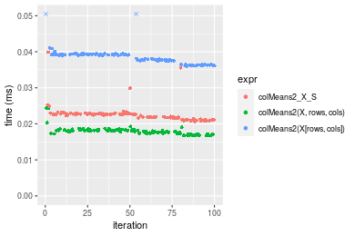

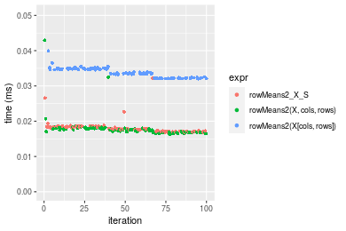
_Table: Benchmarking of colMeans2_X_S() and rowMeans2_X_S() on double+100x100 data (original and transposed).  The top panel shows times in milliseconds and the bottom panel shows relative times._


|   |expr          |    min|      lq|     mean| median|      uq|    max|
|:--|:-------------|------:|-------:|--------:|------:|-------:|------:|
|2  |rowMeans2_X_S | 16.800| 17.1115| 18.05262| 17.771| 18.3910| 32.231|
|1  |colMeans2_X_S | 20.669| 21.7225| 22.62688| 22.553| 22.7845| 39.881|


|   |expr          |      min|       lq|     mean|  median|       uq|      max|
|:--|:-------------|--------:|--------:|--------:|-------:|--------:|--------:|
|2  |rowMeans2_X_S | 1.000000| 1.000000| 1.000000| 1.00000| 1.000000| 1.000000|
|1  |colMeans2_X_S | 1.230298| 1.269468| 1.253385| 1.26909| 1.238894| 1.237349|

_Figure: Benchmarking of colMeans2_X_S() and rowMeans2_X_S() on double+100x100 data (original and transposed).  Outliers are displayed as crosses. Times are in milliseconds._


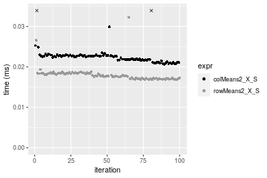

#### 1000x10 double matrix

```r
> X <- data[["1000x10"]]
> rows <- sample.int(nrow(X), size = nrow(X) * 0.7)
> cols <- sample.int(ncol(X), size = ncol(X) * 0.7)
> X_S <- X[rows, cols]
> gc()
          used  (Mb) gc trigger  (Mb) max used  (Mb)
Ncells 5175075 276.4   10014072 534.9 10014072 534.9
Vcells 9408261  71.8   18204443 138.9 18204443 138.9
> colStats <- microbenchmark(colMeans2_X_S = colMeans2(X_S, na.rm = FALSE), `colMeans2(X, rows, cols)` = colMeans2(X, 
+     rows = rows, cols = cols, na.rm = FALSE), `colMeans2(X[rows, cols])` = colMeans2(X[rows, cols], 
+     na.rm = FALSE), unit = "ms")
> X <- t(X)
> X_S <- t(X_S)
> gc()
          used  (Mb) gc trigger  (Mb) max used  (Mb)
Ncells 5175051 276.4   10014072 534.9 10014072 534.9
Vcells 9418314  71.9   18204443 138.9 18204443 138.9
> rowStats <- microbenchmark(rowMeans2_X_S = rowMeans2(X_S, na.rm = FALSE), `rowMeans2(X, cols, rows)` = rowMeans2(X, 
+     rows = cols, cols = rows, na.rm = FALSE), `rowMeans2(X[cols, rows])` = rowMeans2(X[cols, rows], 
+     na.rm = FALSE), unit = "ms")
```

_Table: Benchmarking of colMeans2_X_S(), colMeans2(X, rows, cols)() and colMeans2(X[rows, cols])() on double+1000x10 data. The top panel shows times in milliseconds and the bottom panel shows relative times._


|   |expr                     |      min|        lq|      mean|   median|        uq|      max|
|:--|:------------------------|--------:|---------:|---------:|--------:|---------:|--------:|
|2  |colMeans2(X, rows, cols) | 0.017278| 0.0182610| 0.0187639| 0.018659| 0.0189365| 0.032943|
|1  |colMeans2_X_S            | 0.019115| 0.0201790| 0.0206084| 0.020776| 0.0209755| 0.023593|
|3  |colMeans2(X[rows, cols]) | 0.034970| 0.0364355| 0.0376237| 0.037872| 0.0381030| 0.068531|


|   |expr                     |      min|       lq|     mean|   median|       uq|       max|
|:--|:------------------------|--------:|--------:|--------:|--------:|--------:|---------:|
|2  |colMeans2(X, rows, cols) | 1.000000| 1.000000| 1.000000| 1.000000| 1.000000| 1.0000000|
|1  |colMeans2_X_S            | 1.106320| 1.105033| 1.098302| 1.113457| 1.107676| 0.7161764|
|3  |colMeans2(X[rows, cols]) | 2.023961| 1.995263| 2.005113| 2.029691| 2.012146| 2.0802902|

_Table: Benchmarking of rowMeans2_X_S(), rowMeans2(X, cols, rows)() and rowMeans2(X[cols, rows])() on double+1000x10 data (transposed). The top panel shows times in milliseconds and the bottom panel shows relative times._


|   |expr                     |      min|        lq|      mean|    median|        uq|      max|
|:--|:------------------------|--------:|---------:|---------:|---------:|---------:|--------:|
|1  |rowMeans2_X_S            | 0.015214| 0.0157330| 0.0161047| 0.0159865| 0.0163465| 0.021090|
|2  |rowMeans2(X, cols, rows) | 0.017438| 0.0181015| 0.0187128| 0.0185100| 0.0189665| 0.032675|
|3  |rowMeans2(X[cols, rows]) | 0.033612| 0.0339475| 0.0355786| 0.0351465| 0.0362445| 0.068801|


|   |expr                     |      min|       lq|     mean|   median|       uq|      max|
|:--|:------------------------|--------:|--------:|--------:|--------:|--------:|--------:|
|1  |rowMeans2_X_S            | 1.000000| 1.000000| 1.000000| 1.000000| 1.000000| 1.000000|
|2  |rowMeans2(X, cols, rows) | 1.146181| 1.150543| 1.161946| 1.157852| 1.160279| 1.549313|
|3  |rowMeans2(X[cols, rows]) | 2.209281| 2.157726| 2.209206| 2.198511| 2.217264| 3.262257|

_Figure: Benchmarking of colMeans2_X_S(), colMeans2(X, rows, cols)() and colMeans2(X[rows, cols])() on double+1000x10 data  as well as rowMeans2_X_S(), rowMeans2(X, cols, rows)() and rowMeans2(X[cols, rows])() on the same data transposed.  Outliers are displayed as crosses.  Times are in milliseconds._


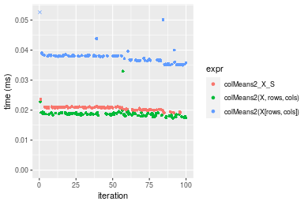

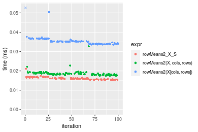
_Table: Benchmarking of colMeans2_X_S() and rowMeans2_X_S() on double+1000x10 data (original and transposed).  The top panel shows times in milliseconds and the bottom panel shows relative times._


|   |expr          |    min|     lq|     mean|  median|      uq|    max|
|:--|:-------------|------:|------:|--------:|-------:|-------:|------:|
|2  |rowMeans2_X_S | 15.214| 15.733| 16.10472| 15.9865| 16.3465| 21.090|
|1  |colMeans2_X_S | 19.115| 20.179| 20.60841| 20.7760| 20.9755| 23.593|


|   |expr          |      min|       lq|    mean|   median|      uq|      max|
|:--|:-------------|--------:|--------:|-------:|--------:|-------:|--------:|
|2  |rowMeans2_X_S | 1.000000| 1.000000| 1.00000| 1.000000| 1.00000| 1.000000|
|1  |colMeans2_X_S | 1.256409| 1.282591| 1.27965| 1.299597| 1.28318| 1.118682|

_Figure: Benchmarking of colMeans2_X_S() and rowMeans2_X_S() on double+1000x10 data (original and transposed).  Outliers are displayed as crosses. Times are in milliseconds._


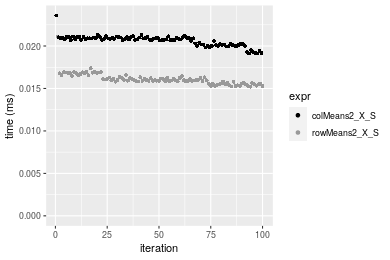

#### 10x1000 double matrix

```r
> X <- data[["10x1000"]]
> rows <- sample.int(nrow(X), size = nrow(X) * 0.7)
> cols <- sample.int(ncol(X), size = ncol(X) * 0.7)
> X_S <- X[rows, cols]
> gc()
          used  (Mb) gc trigger  (Mb) max used  (Mb)
Ncells 5175280 276.4   10014072 534.9 10014072 534.9
Vcells 9408397  71.8   18204443 138.9 18204443 138.9
> colStats <- microbenchmark(colMeans2_X_S = colMeans2(X_S, na.rm = FALSE), `colMeans2(X, rows, cols)` = colMeans2(X, 
+     rows = rows, cols = cols, na.rm = FALSE), `colMeans2(X[rows, cols])` = colMeans2(X[rows, cols], 
+     na.rm = FALSE), unit = "ms")
> X <- t(X)
> X_S <- t(X_S)
> gc()
          used  (Mb) gc trigger  (Mb) max used  (Mb)
Ncells 5175256 276.4   10014072 534.9 10014072 534.9
Vcells 9418450  71.9   18204443 138.9 18204443 138.9
> rowStats <- microbenchmark(rowMeans2_X_S = rowMeans2(X_S, na.rm = FALSE), `rowMeans2(X, cols, rows)` = rowMeans2(X, 
+     rows = cols, cols = rows, na.rm = FALSE), `rowMeans2(X[cols, rows])` = rowMeans2(X[cols, rows], 
+     na.rm = FALSE), unit = "ms")
```

_Table: Benchmarking of colMeans2_X_S(), colMeans2(X, rows, cols)() and colMeans2(X[rows, cols])() on double+10x1000 data. The top panel shows times in milliseconds and the bottom panel shows relative times._


|   |expr                     |      min|        lq|      mean|    median|        uq|      max|
|:--|:------------------------|--------:|---------:|---------:|---------:|---------:|--------:|
|2  |colMeans2(X, rows, cols) | 0.022669| 0.0235475| 0.0247728| 0.0243460| 0.0254305| 0.046193|
|1  |colMeans2_X_S            | 0.023328| 0.0249675| 0.0260868| 0.0259170| 0.0266135| 0.041922|
|3  |colMeans2(X[rows, cols]) | 0.041080| 0.0434905| 0.0451401| 0.0450155| 0.0466320| 0.060431|


|   |expr                     |      min|       lq|     mean|   median|       uq|       max|
|:--|:------------------------|--------:|--------:|--------:|--------:|--------:|---------:|
|2  |colMeans2(X, rows, cols) | 1.000000| 1.000000| 1.000000| 1.000000| 1.000000| 1.0000000|
|1  |colMeans2_X_S            | 1.029070| 1.060304| 1.053040| 1.064528| 1.046519| 0.9075401|
|3  |colMeans2(X[rows, cols]) | 1.812166| 1.846926| 1.822162| 1.848990| 1.833704| 1.3082285|

_Table: Benchmarking of rowMeans2_X_S(), rowMeans2(X, cols, rows)() and rowMeans2(X[cols, rows])() on double+10x1000 data (transposed). The top panel shows times in milliseconds and the bottom panel shows relative times._


|   |expr                     |      min|        lq|      mean|   median|        uq|      max|
|:--|:------------------------|--------:|---------:|---------:|--------:|---------:|--------:|
|1  |rowMeans2_X_S            | 0.019583| 0.0205360| 0.0219069| 0.021414| 0.0222250| 0.037716|
|2  |rowMeans2(X, cols, rows) | 0.021829| 0.0229460| 0.0239719| 0.023360| 0.0247060| 0.050126|
|3  |rowMeans2(X[cols, rows]) | 0.034720| 0.0363605| 0.0377595| 0.037777| 0.0392835| 0.044207|


|   |expr                     |      min|       lq|     mean|   median|       uq|      max|
|:--|:------------------------|--------:|--------:|--------:|--------:|--------:|--------:|
|1  |rowMeans2_X_S            | 1.000000| 1.000000| 1.000000| 1.000000| 1.000000| 1.000000|
|2  |rowMeans2(X, cols, rows) | 1.114691| 1.117355| 1.094264| 1.090875| 1.111631| 1.329038|
|3  |rowMeans2(X[cols, rows]) | 1.772966| 1.770574| 1.723633| 1.764126| 1.767537| 1.172102|

_Figure: Benchmarking of colMeans2_X_S(), colMeans2(X, rows, cols)() and colMeans2(X[rows, cols])() on double+10x1000 data  as well as rowMeans2_X_S(), rowMeans2(X, cols, rows)() and rowMeans2(X[cols, rows])() on the same data transposed.  Outliers are displayed as crosses.  Times are in milliseconds._


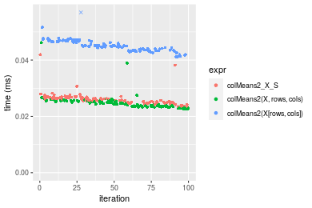

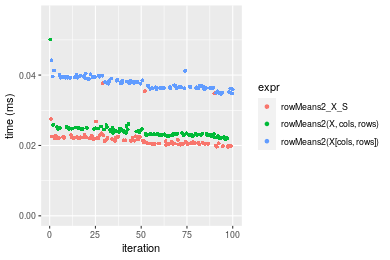
_Table: Benchmarking of colMeans2_X_S() and rowMeans2_X_S() on double+10x1000 data (original and transposed).  The top panel shows times in milliseconds and the bottom panel shows relative times._


|   |expr          |    min|      lq|     mean| median|      uq|    max|
|:--|:-------------|------:|-------:|--------:|------:|-------:|------:|
|2  |rowMeans2_X_S | 19.583| 20.5360| 21.90691| 21.414| 22.2250| 37.716|
|1  |colMeans2_X_S | 23.328| 24.9675| 26.08676| 25.917| 26.6135| 41.922|


|   |expr          |      min|       lq|   mean|   median|       uq|      max|
|:--|:-------------|--------:|--------:|------:|--------:|--------:|--------:|
|2  |rowMeans2_X_S | 1.000000| 1.000000| 1.0000| 1.000000| 1.000000| 1.000000|
|1  |colMeans2_X_S | 1.191237| 1.215792| 1.1908| 1.210283| 1.197458| 1.111518|

_Figure: Benchmarking of colMeans2_X_S() and rowMeans2_X_S() on double+10x1000 data (original and transposed).  Outliers are displayed as crosses. Times are in milliseconds._


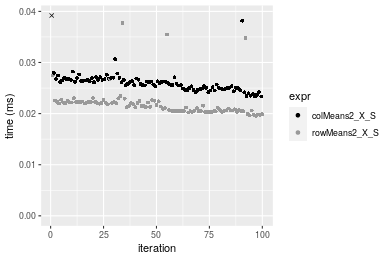

#### 100x1000 double matrix

```r
> X <- data[["100x1000"]]
> rows <- sample.int(nrow(X), size = nrow(X) * 0.7)
> cols <- sample.int(ncol(X), size = ncol(X) * 0.7)
> X_S <- X[rows, cols]
> gc()
          used  (Mb) gc trigger  (Mb) max used  (Mb)
Ncells 5175490 276.5   10014072 534.9 10014072 534.9
Vcells 9453866  72.2   18204443 138.9 18204443 138.9
> colStats <- microbenchmark(colMeans2_X_S = colMeans2(X_S, na.rm = FALSE), `colMeans2(X, rows, cols)` = colMeans2(X, 
+     rows = rows, cols = cols, na.rm = FALSE), `colMeans2(X[rows, cols])` = colMeans2(X[rows, cols], 
+     na.rm = FALSE), unit = "ms")
> X <- t(X)
> X_S <- t(X_S)
> gc()
          used  (Mb) gc trigger  (Mb) max used  (Mb)
Ncells 5175466 276.4   10014072 534.9 10014072 534.9
Vcells 9553919  72.9   18204443 138.9 18204443 138.9
> rowStats <- microbenchmark(rowMeans2_X_S = rowMeans2(X_S, na.rm = FALSE), `rowMeans2(X, cols, rows)` = rowMeans2(X, 
+     rows = cols, cols = rows, na.rm = FALSE), `rowMeans2(X[cols, rows])` = rowMeans2(X[cols, rows], 
+     na.rm = FALSE), unit = "ms")
```

_Table: Benchmarking of colMeans2_X_S(), colMeans2(X, rows, cols)() and colMeans2(X[rows, cols])() on double+100x1000 data. The top panel shows times in milliseconds and the bottom panel shows relative times._


|   |expr                     |      min|        lq|      mean|    median|        uq|      max|
|:--|:------------------------|--------:|---------:|---------:|---------:|---------:|--------:|
|2  |colMeans2(X, rows, cols) | 0.091072| 0.0989970| 0.1149834| 0.1110585| 0.1264070| 0.239879|
|1  |colMeans2_X_S            | 0.125030| 0.1355665| 0.1557497| 0.1528765| 0.1661530| 0.226609|
|3  |colMeans2(X[rows, cols]) | 0.219938| 0.2469690| 0.2787972| 0.2769915| 0.2951575| 0.377851|


|   |expr                     |     min|       lq|     mean|   median|       uq|       max|
|:--|:------------------------|-------:|--------:|--------:|--------:|--------:|---------:|
|2  |colMeans2(X, rows, cols) | 1.00000| 1.000000| 1.000000| 1.000000| 1.000000| 1.0000000|
|1  |colMeans2_X_S            | 1.37287| 1.369400| 1.354541| 1.376540| 1.314429| 0.9446804|
|3  |colMeans2(X[rows, cols]) | 2.41499| 2.494712| 2.424675| 2.494105| 2.334977| 1.5751733|

_Table: Benchmarking of rowMeans2_X_S(), rowMeans2(X, cols, rows)() and rowMeans2(X[cols, rows])() on double+100x1000 data (transposed). The top panel shows times in milliseconds and the bottom panel shows relative times._


|   |expr                     |      min|        lq|      mean|    median|        uq|      max|
|:--|:------------------------|--------:|---------:|---------:|---------:|---------:|--------:|
|1  |rowMeans2_X_S            | 0.107702| 0.1209975| 0.1361779| 0.1293235| 0.1434270| 0.320193|
|2  |rowMeans2(X, cols, rows) | 0.114283| 0.1246335| 0.1364847| 0.1328840| 0.1425110| 0.278059|
|3  |rowMeans2(X[cols, rows]) | 0.213975| 0.2423150| 0.2654654| 0.2589075| 0.2845695| 0.364413|


|   |expr                     |      min|       lq|     mean|   median|        uq|       max|
|:--|:------------------------|--------:|--------:|--------:|--------:|---------:|---------:|
|1  |rowMeans2_X_S            | 1.000000| 1.000000| 1.000000| 1.000000| 1.0000000| 1.0000000|
|2  |rowMeans2(X, cols, rows) | 1.061104| 1.030050| 1.002253| 1.027532| 0.9936135| 0.8684106|
|3  |rowMeans2(X[cols, rows]) | 1.986732| 2.002645| 1.949402| 2.002014| 1.9840720| 1.1381042|

_Figure: Benchmarking of colMeans2_X_S(), colMeans2(X, rows, cols)() and colMeans2(X[rows, cols])() on double+100x1000 data  as well as rowMeans2_X_S(), rowMeans2(X, cols, rows)() and rowMeans2(X[cols, rows])() on the same data transposed.  Outliers are displayed as crosses.  Times are in milliseconds._


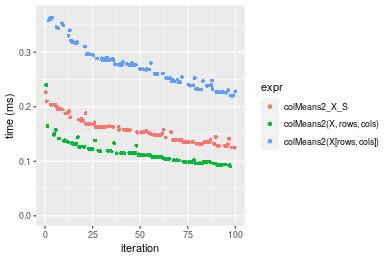

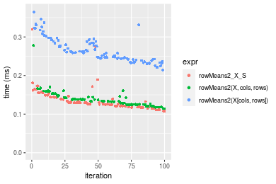
_Table: Benchmarking of colMeans2_X_S() and rowMeans2_X_S() on double+100x1000 data (original and transposed).  The top panel shows times in milliseconds and the bottom panel shows relative times._


|   |expr          |     min|       lq|     mean|   median|      uq|     max|
|:--|:-------------|-------:|--------:|--------:|--------:|-------:|-------:|
|2  |rowMeans2_X_S | 107.702| 120.9975| 136.1779| 129.3235| 143.427| 320.193|
|1  |colMeans2_X_S | 125.030| 135.5665| 155.7497| 152.8765| 166.153| 226.609|


|   |expr          |      min|       lq|     mean|   median|      uq|       max|
|:--|:-------------|--------:|--------:|--------:|--------:|-------:|---------:|
|2  |rowMeans2_X_S | 1.000000| 1.000000| 1.000000| 1.000000| 1.00000| 1.0000000|
|1  |colMeans2_X_S | 1.160888| 1.120407| 1.143723| 1.182125| 1.15845| 0.7077263|

_Figure: Benchmarking of colMeans2_X_S() and rowMeans2_X_S() on double+100x1000 data (original and transposed).  Outliers are displayed as crosses. Times are in milliseconds._


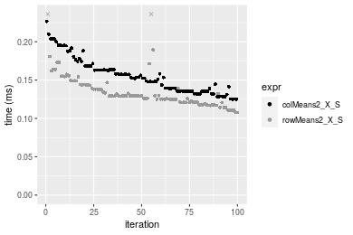

#### 1000x100 double matrix

```r
> X <- data[["1000x100"]]
> rows <- sample.int(nrow(X), size = nrow(X) * 0.7)
> cols <- sample.int(ncol(X), size = ncol(X) * 0.7)
> X_S <- X[rows, cols]
> gc()
          used  (Mb) gc trigger  (Mb) max used  (Mb)
Ncells 5175703 276.5   10014072 534.9 10014072 534.9
Vcells 9454010  72.2   18204443 138.9 18204443 138.9
> colStats <- microbenchmark(colMeans2_X_S = colMeans2(X_S, na.rm = FALSE), `colMeans2(X, rows, cols)` = colMeans2(X, 
+     rows = rows, cols = cols, na.rm = FALSE), `colMeans2(X[rows, cols])` = colMeans2(X[rows, cols], 
+     na.rm = FALSE), unit = "ms")
> X <- t(X)
> X_S <- t(X_S)
> gc()
          used  (Mb) gc trigger  (Mb) max used  (Mb)
Ncells 5175679 276.5   10014072 534.9 10014072 534.9
Vcells 9554063  72.9   18204443 138.9 18204443 138.9
> rowStats <- microbenchmark(rowMeans2_X_S = rowMeans2(X_S, na.rm = FALSE), `rowMeans2(X, cols, rows)` = rowMeans2(X, 
+     rows = cols, cols = rows, na.rm = FALSE), `rowMeans2(X[cols, rows])` = rowMeans2(X[cols, rows], 
+     na.rm = FALSE), unit = "ms")
```

_Table: Benchmarking of colMeans2_X_S(), colMeans2(X, rows, cols)() and colMeans2(X[rows, cols])() on double+1000x100 data. The top panel shows times in milliseconds and the bottom panel shows relative times._


|   |expr                     |      min|        lq|      mean|    median|        uq|      max|
|:--|:------------------------|--------:|---------:|---------:|---------:|---------:|--------:|
|2  |colMeans2(X, rows, cols) | 0.086454| 0.0950290| 0.1078859| 0.1053510| 0.1110480| 0.167587|
|1  |colMeans2_X_S            | 0.119520| 0.1304035| 0.1464067| 0.1428580| 0.1514875| 0.212404|
|3  |colMeans2(X[rows, cols]) | 0.214857| 0.2376100| 0.2690311| 0.2657325| 0.2917710| 0.440396|


|   |expr                     |      min|       lq|     mean|   median|       uq|      max|
|:--|:------------------------|--------:|--------:|--------:|--------:|--------:|--------:|
|2  |colMeans2(X, rows, cols) | 1.000000| 1.000000| 1.000000| 1.000000| 1.000000| 1.000000|
|1  |colMeans2_X_S            | 1.382469| 1.372249| 1.357051| 1.356019| 1.364162| 1.267425|
|3  |colMeans2(X[rows, cols]) | 2.485218| 2.500395| 2.493662| 2.522354| 2.627431| 2.627865|

_Table: Benchmarking of rowMeans2_X_S(), rowMeans2(X, cols, rows)() and rowMeans2(X[cols, rows])() on double+1000x100 data (transposed). The top panel shows times in milliseconds and the bottom panel shows relative times._


|   |expr                     |      min|        lq|      mean|    median|       uq|      max|
|:--|:------------------------|--------:|---------:|---------:|---------:|--------:|--------:|
|1  |rowMeans2_X_S            | 0.096716| 0.1071105| 0.1198079| 0.1169385| 0.128540| 0.197457|
|2  |rowMeans2(X, cols, rows) | 0.107001| 0.1203000| 0.1335835| 0.1289325| 0.139905| 0.302263|
|3  |rowMeans2(X[cols, rows]) | 0.201693| 0.2213985| 0.2461912| 0.2401520| 0.264086| 0.328338|


|   |expr                     |      min|       lq|     mean|   median|       uq|      max|
|:--|:------------------------|--------:|--------:|--------:|--------:|--------:|--------:|
|1  |rowMeans2_X_S            | 1.000000| 1.000000| 1.000000| 1.000000| 1.000000| 1.000000|
|2  |rowMeans2(X, cols, rows) | 1.106342| 1.123139| 1.114981| 1.102567| 1.088416| 1.530779|
|3  |rowMeans2(X[cols, rows]) | 2.085415| 2.067010| 2.054883| 2.053661| 2.054504| 1.662833|

_Figure: Benchmarking of colMeans2_X_S(), colMeans2(X, rows, cols)() and colMeans2(X[rows, cols])() on double+1000x100 data  as well as rowMeans2_X_S(), rowMeans2(X, cols, rows)() and rowMeans2(X[cols, rows])() on the same data transposed.  Outliers are displayed as crosses.  Times are in milliseconds._


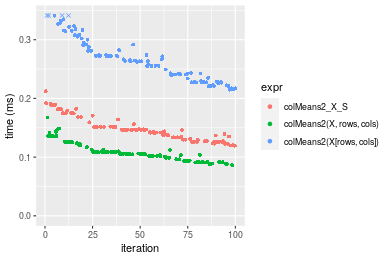

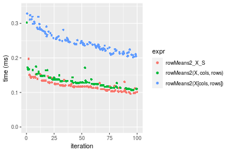
_Table: Benchmarking of colMeans2_X_S() and rowMeans2_X_S() on double+1000x100 data (original and transposed).  The top panel shows times in milliseconds and the bottom panel shows relative times._


|   |expr          |     min|       lq|     mean|   median|       uq|     max|
|:--|:-------------|-------:|--------:|--------:|--------:|--------:|-------:|
|2  |rowMeans2_X_S |  96.716| 107.1105| 119.8079| 116.9385| 128.5400| 197.457|
|1  |colMeans2_X_S | 119.520| 130.4035| 146.4067| 142.8580| 151.4875| 212.404|


|   |expr          |      min|       lq|     mean|   median|       uq|      max|
|:--|:-------------|--------:|--------:|--------:|--------:|--------:|--------:|
|2  |rowMeans2_X_S | 1.000000| 1.000000| 1.000000| 1.000000| 1.000000| 1.000000|
|1  |colMeans2_X_S | 1.235783| 1.217467| 1.222012| 1.221651| 1.178524| 1.075697|

_Figure: Benchmarking of colMeans2_X_S() and rowMeans2_X_S() on double+1000x100 data (original and transposed).  Outliers are displayed as crosses. Times are in milliseconds._


## Appendix

### Session information
```r
R version 4.1.1 Patched (2021-08-10 r80727)
Platform: x86_64-pc-linux-gnu (64-bit)
Running under: Ubuntu 18.04.5 LTS

Matrix products: default
BLAS:   /home/hb/software/R-devel/R-4-1-branch/lib/R/lib/libRblas.so
LAPACK: /home/hb/software/R-devel/R-4-1-branch/lib/R/lib/libRlapack.so

locale:
 [1] LC_CTYPE=en_US.UTF-8       LC_NUMERIC=C              
 [3] LC_TIME=en_US.UTF-8        LC_COLLATE=en_US.UTF-8    
 [5] LC_MONETARY=en_US.UTF-8    LC_MESSAGES=en_US.UTF-8   
 [7] LC_PAPER=en_US.UTF-8       LC_NAME=C                 
 [9] LC_ADDRESS=C               LC_TELEPHONE=C            
[11] LC_MEASUREMENT=en_US.UTF-8 LC_IDENTIFICATION=C       

attached base packages:
[1] stats     graphics  grDevices utils     datasets  methods   base     

other attached packages:
[1] microbenchmark_1.4-7   matrixStats_0.60.1     ggplot2_3.3.5         
[4] knitr_1.33             R.devices_2.17.0       R.utils_2.10.1        
[7] R.oo_1.24.0            R.methodsS3_1.8.1-9001 history_0.0.1-9000    

loaded via a namespace (and not attached):
 [1] Biobase_2.52.0          httr_1.4.2              splines_4.1.1          
 [4] bit64_4.0.5             network_1.17.1          assertthat_0.2.1       
 [7] highr_0.9               stats4_4.1.1            blob_1.2.2             
[10] GenomeInfoDbData_1.2.6  robustbase_0.93-8       pillar_1.6.2           
[13] RSQLite_2.2.8           lattice_0.20-44         glue_1.4.2             
[16] digest_0.6.27           XVector_0.32.0          colorspace_2.0-2       
[19] Matrix_1.3-4            XML_3.99-0.7            pkgconfig_2.0.3        
[22] zlibbioc_1.38.0         genefilter_1.74.0       purrr_0.3.4            
[25] ergm_4.1.2              xtable_1.8-4            scales_1.1.1           
[28] tibble_3.1.4            annotate_1.70.0         KEGGREST_1.32.0        
[31] farver_2.1.0            generics_0.1.0          IRanges_2.26.0         
[34] ellipsis_0.3.2          cachem_1.0.6            withr_2.4.2            
[37] BiocGenerics_0.38.0     mime_0.11               survival_3.2-13        
[40] magrittr_2.0.1          crayon_1.4.1            statnet.common_4.5.0   
[43] memoise_2.0.0           laeken_0.5.1            fansi_0.5.0            
[46] R.cache_0.15.0          MASS_7.3-54             R.rsp_0.44.0           
[49] progressr_0.8.0         tools_4.1.1             lifecycle_1.0.0        
[52] S4Vectors_0.30.0        trust_0.1-8             munsell_0.5.0          
[55] tabby_0.0.1-9001        AnnotationDbi_1.54.1    Biostrings_2.60.2      
[58] compiler_4.1.1          GenomeInfoDb_1.28.1     rlang_0.4.11           
[61] grid_4.1.1              RCurl_1.98-1.4          cwhmisc_6.6            
[64] rappdirs_0.3.3          startup_0.15.0          labeling_0.4.2         
[67] bitops_1.0-7            base64enc_0.1-3         boot_1.3-28            
[70] gtable_0.3.0            DBI_1.1.1               markdown_1.1           
[73] R6_2.5.1                lpSolveAPI_5.5.2.0-17.7 rle_0.9.2              
[76] dplyr_1.0.7             fastmap_1.1.0           bit_4.0.4              
[79] utf8_1.2.2              parallel_4.1.1          Rcpp_1.0.7             
[82] vctrs_0.3.8             png_0.1-7               DEoptimR_1.0-9         
[85] tidyselect_1.1.1        xfun_0.25               coda_0.19-4            
```
Total processing time was 22.19 secs.


### Reproducibility
To reproduce this report, do:
```r
html <- matrixStats:::benchmark('colRowMeans2_subset')
```

[RSP]: https://cran.r-project.org/package=R.rsp
[matrixStats]: https://cran.r-project.org/package=matrixStats

[StackOverflow:colMins?]: https://stackoverflow.com/questions/13676878 "Stack Overflow: fastest way to get Min from every column in a matrix?"
[StackOverflow:colSds?]: https://stackoverflow.com/questions/17549762 "Stack Overflow: Is there such 'colsd' in R?"
[StackOverflow:rowProds?]: https://stackoverflow.com/questions/20198801/ "Stack Overflow: Row product of matrix and column sum of matrix"

---------------------------------------
Copyright Henrik Bengtsson. Last updated on 2021-08-25 18:05:49 (+0200 UTC). Powered by [RSP].

<script>
 var link = document.createElement('link');
 link.rel = 'icon';
 link.href = "data:image/png;base64,iVBORw0KGgoAAAANSUhEUgAAACAAAAAgCAMAAABEpIrGAAAA21BMVEUAAAAAAP8AAP8AAP8AAP8AAP8AAP8AAP8AAP8AAP8AAP8AAP8AAP8AAP8AAP8AAP8AAP8AAP8AAP8AAP8AAP8AAP8AAP8AAP8AAP8AAP8AAP8AAP8AAP8AAP8AAP8AAP8AAP8AAP8AAP8AAP8AAP8AAP8AAP8AAP8AAP8AAP8BAf4CAv0DA/wdHeIeHuEfH+AgIN8hId4lJdomJtknJ9g+PsE/P8BAQL9yco10dIt1dYp3d4h4eIeVlWqWlmmXl2iYmGeZmWabm2Tn5xjo6Bfp6Rb39wj4+Af//wA2M9hbAAAASXRSTlMAAQIJCgsMJSYnKD4/QGRlZmhpamtsbautrrCxuru8y8zN5ebn6Pn6+///////////////////////////////////////////LsUNcQAAAS9JREFUOI29k21XgkAQhVcFytdSMqMETU26UVqGmpaiFbL//xc1cAhhwVNf6n5i5z67M2dmYOyfJZUqlVLhkKucG7cgmUZTybDz6g0iDeq51PUr37Ds2cy2/C9NeES5puDjxuUk1xnToZsg8pfA3avHQ3lLIi7iWRrkv/OYtkScxBIMgDee0ALoyxHQBJ68JLCjOtQIMIANF7QG9G9fNnHvisCHBVMKgSJgiz7nE+AoBKrAPA3MgepvgR9TSCasrCKH0eB1wBGBFdCO+nAGjMVGPcQb5bd6mQRegN6+1axOs9nGfYcCtfi4NQosdtH7dB+txFIpXQqN1p9B/asRHToyS0jRgpV7nk4nwcq1BJ+x3Gl/v7S9Wmpp/aGquum7w3ZDyrADFYrl8vHBH+ev9AUASW1dmU4h4wAAAABJRU5ErkJggg=="
 document.getElementsByTagName('head')[0].appendChild(link);
</script>

