[matrixStats]: Benchmark report

---------------------------------------


# colMedians() and rowMedians() benchmarks

This report benchmark the performance of colMedians() and rowMedians() against alternative methods.

## Alternative methods

* apply() + median()


## Data type "integer"

### Data
```r
> rmatrix <- function(nrow, ncol, mode = c("logical", "double", "integer", "index"), range = c(-100, 
+     +100), na_prob = 0) {
+     mode <- match.arg(mode)
+     n <- nrow * ncol
+     if (mode == "logical") {
+         x <- sample(c(FALSE, TRUE), size = n, replace = TRUE)
+     }     else if (mode == "index") {
+         x <- seq_len(n)
+         mode <- "integer"
+     }     else {
+         x <- runif(n, min = range[1], max = range[2])
+     }
+     storage.mode(x) <- mode
+     if (na_prob > 0) 
+         x[sample(n, size = na_prob * n)] <- NA
+     dim(x) <- c(nrow, ncol)
+     x
+ }
> rmatrices <- function(scale = 10, seed = 1, ...) {
+     set.seed(seed)
+     data <- list()
+     data[[1]] <- rmatrix(nrow = scale * 1, ncol = scale * 1, ...)
+     data[[2]] <- rmatrix(nrow = scale * 10, ncol = scale * 10, ...)
+     data[[3]] <- rmatrix(nrow = scale * 100, ncol = scale * 1, ...)
+     data[[4]] <- t(data[[3]])
+     data[[5]] <- rmatrix(nrow = scale * 10, ncol = scale * 100, ...)
+     data[[6]] <- t(data[[5]])
+     names(data) <- sapply(data, FUN = function(x) paste(dim(x), collapse = "x"))
+     data
+ }
> data <- rmatrices(mode = mode)
```

### Results

#### 10x10 integer matrix


```r
> X <- data[["10x10"]]
> gc()
          used  (Mb) gc trigger  (Mb) max used  (Mb)
Ncells 5201588 277.8   10014072 534.9 10014072 534.9
Vcells 9793576  74.8   18204443 138.9 18204443 138.9
> colStats <- microbenchmark(colMedians = colMedians(X, na.rm = FALSE), `apply+median` = apply(X, MARGIN = 2L, 
+     FUN = median, na.rm = FALSE), unit = "ms")
> X <- t(X)
> gc()
          used  (Mb) gc trigger  (Mb) max used  (Mb)
Ncells 5186262 277.0   10014072 534.9 10014072 534.9
Vcells 9742943  74.4   18204443 138.9 18204443 138.9
> rowStats <- microbenchmark(rowMedians = rowMedians(X, na.rm = FALSE), `apply+median` = apply(X, MARGIN = 1L, 
+     FUN = median, na.rm = FALSE), unit = "ms")
```

_Table: Benchmarking of colMedians() and apply+median() on integer+10x10 data. The top panel shows times in milliseconds and the bottom panel shows relative times._


|   |expr         |      min|       lq|      mean|    median|       uq|      max|
|:--|:------------|--------:|--------:|---------:|---------:|--------:|--------:|
|1  |colMedians   | 0.001993| 0.002411| 0.0038534| 0.0034125| 0.004353| 0.016716|
|2  |apply+median | 0.313461| 0.327870| 0.3636147| 0.3449655| 0.382672| 0.587087|


|   |expr         |     min|       lq|    mean|   median|       uq|      max|
|:--|:------------|-------:|--------:|-------:|--------:|--------:|--------:|
|1  |colMedians   |   1.000|   1.0000|  1.0000|   1.0000|  1.00000|  1.00000|
|2  |apply+median | 157.281| 135.9892| 94.3618| 101.0888| 87.90995| 35.12126|

_Table: Benchmarking of rowMedians() and apply+median() on integer+10x10 data (transposed). The top panel shows times in milliseconds and the bottom panel shows relative times._


|   |expr         |      min|       lq|      mean|    median|        uq|      max|
|:--|:------------|--------:|--------:|---------:|---------:|---------:|--------:|
|1  |rowMedians   | 0.002138| 0.002749| 0.0039048| 0.0038455| 0.0043935| 0.016988|
|2  |apply+median | 0.303621| 0.326922| 0.3560580| 0.3385395| 0.3736760| 0.588024|


|   |expr         |      min|      lq|     mean|   median|       uq|      max|
|:--|:------------|--------:|-------:|--------:|--------:|--------:|--------:|
|1  |rowMedians   |   1.0000|   1.000|  1.00000|  1.00000|  1.00000|  1.00000|
|2  |apply+median | 142.0117| 118.924| 91.18377| 88.03524| 85.05201| 34.61408|

_Figure: Benchmarking of colMedians() and apply+median() on integer+10x10 data  as well as rowMedians() and apply+median() on the same data transposed.  Outliers are displayed as crosses.  Times are in milliseconds._


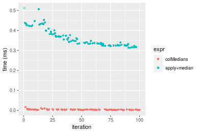

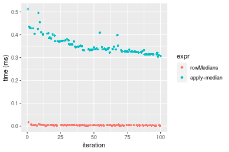
_Table: Benchmarking of colMedians() and rowMedians() on integer+10x10 data (original and transposed).  The top panel shows times in milliseconds and the bottom panel shows relative times._


|   |expr       |   min|    lq|    mean| median|     uq|    max|
|:--|:----------|-----:|-----:|-------:|------:|------:|------:|
|1  |colMedians | 1.993| 2.411| 3.85341| 3.4125| 4.3530| 16.716|
|2  |rowMedians | 2.138| 2.749| 3.90484| 3.8455| 4.3935| 16.988|


|   |expr       |      min|       lq|     mean|   median|       uq|      max|
|:--|:----------|--------:|--------:|--------:|--------:|--------:|--------:|
|1  |colMedians | 1.000000| 1.000000| 1.000000| 1.000000| 1.000000| 1.000000|
|2  |rowMedians | 1.072755| 1.140191| 1.013347| 1.126886| 1.009304| 1.016272|

_Figure: Benchmarking of colMedians() and rowMedians() on integer+10x10 data (original and transposed).  Outliers are displayed as crosses. Times are in milliseconds._


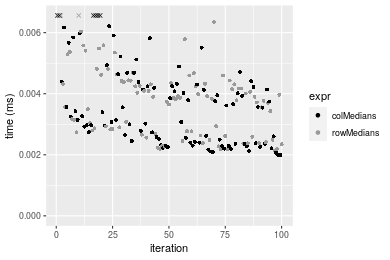

#### 100x100 integer matrix


```r
> X <- data[["100x100"]]
> gc()
          used  (Mb) gc trigger  (Mb) max used  (Mb)
Ncells 5184840 277.0   10014072 534.9 10014072 534.9
Vcells 9359463  71.5   18204443 138.9 18204443 138.9
> colStats <- microbenchmark(colMedians = colMedians(X, na.rm = FALSE), `apply+median` = apply(X, MARGIN = 2L, 
+     FUN = median, na.rm = FALSE), unit = "ms")
> X <- t(X)
> gc()
          used  (Mb) gc trigger  (Mb) max used  (Mb)
Ncells 5184816 276.9   10014072 534.9 10014072 534.9
Vcells 9364476  71.5   18204443 138.9 18204443 138.9
> rowStats <- microbenchmark(rowMedians = rowMedians(X, na.rm = FALSE), `apply+median` = apply(X, MARGIN = 1L, 
+     FUN = median, na.rm = FALSE), unit = "ms")
```

_Table: Benchmarking of colMedians() and apply+median() on integer+100x100 data. The top panel shows times in milliseconds and the bottom panel shows relative times._


|   |expr         |      min|        lq|      mean|   median|        uq|      max|
|:--|:------------|--------:|---------:|---------:|--------:|---------:|--------:|
|1  |colMedians   | 0.126893| 0.1296145| 0.1357446| 0.132778| 0.1341605| 0.229526|
|2  |apply+median | 2.644436| 2.7182630| 2.8986602| 2.809262| 2.8746650| 4.675803|


|   |expr         |      min|       lq|     mean|   median|       uq|      max|
|:--|:------------|--------:|--------:|--------:|--------:|--------:|--------:|
|1  |colMedians   |  1.00000|  1.00000|  1.00000|  1.00000|  1.00000|  1.00000|
|2  |apply+median | 20.83989| 20.97191| 21.35378| 21.15759| 21.42706| 20.37156|

_Table: Benchmarking of rowMedians() and apply+median() on integer+100x100 data (transposed). The top panel shows times in milliseconds and the bottom panel shows relative times._


|   |expr         |      min|        lq|      mean|   median|        uq|      max|
|:--|:------------|--------:|---------:|---------:|--------:|---------:|--------:|
|1  |rowMedians   | 0.129563| 0.1323505| 0.1388221| 0.135726| 0.1377925| 0.184522|
|2  |apply+median | 2.659912| 2.7080075| 2.8757477| 2.798156| 2.8722325| 4.645093|


|   |expr         |      min|       lq|     mean|   median|       uq|      max|
|:--|:------------|--------:|--------:|--------:|--------:|--------:|--------:|
|1  |rowMedians   |  1.00000|  1.00000|  1.00000|  1.00000|  1.00000|  1.00000|
|2  |apply+median | 20.52987| 20.46088| 20.71535| 20.61621| 20.84462| 25.17365|

_Figure: Benchmarking of colMedians() and apply+median() on integer+100x100 data  as well as rowMedians() and apply+median() on the same data transposed.  Outliers are displayed as crosses.  Times are in milliseconds._


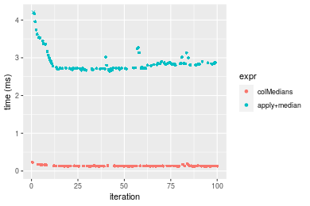

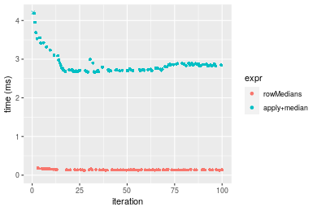
_Table: Benchmarking of colMedians() and rowMedians() on integer+100x100 data (original and transposed).  The top panel shows times in milliseconds and the bottom panel shows relative times._


|   |expr       |     min|       lq|     mean|  median|       uq|     max|
|:--|:----------|-------:|--------:|--------:|-------:|--------:|-------:|
|1  |colMedians | 126.893| 129.6145| 135.7446| 132.778| 134.1605| 229.526|
|2  |rowMedians | 129.563| 132.3505| 138.8221| 135.726| 137.7925| 184.522|


|   |expr       |      min|       lq|     mean|   median|       uq|       max|
|:--|:----------|--------:|--------:|--------:|--------:|--------:|---------:|
|1  |colMedians | 1.000000| 1.000000| 1.000000| 1.000000| 1.000000| 1.0000000|
|2  |rowMedians | 1.021041| 1.021109| 1.022671| 1.022202| 1.027072| 0.8039264|

_Figure: Benchmarking of colMedians() and rowMedians() on integer+100x100 data (original and transposed).  Outliers are displayed as crosses. Times are in milliseconds._


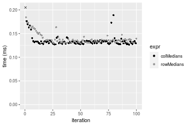

#### 1000x10 integer matrix


```r
> X <- data[["1000x10"]]
> gc()
          used  (Mb) gc trigger  (Mb) max used  (Mb)
Ncells 5185558 277.0   10014072 534.9 10014072 534.9
Vcells 9362957  71.5   18204443 138.9 18204443 138.9
> colStats <- microbenchmark(colMedians = colMedians(X, na.rm = FALSE), `apply+median` = apply(X, MARGIN = 2L, 
+     FUN = median, na.rm = FALSE), unit = "ms")
> X <- t(X)
> gc()
          used  (Mb) gc trigger  (Mb) max used  (Mb)
Ncells 5185546 277.0   10014072 534.9 10014072 534.9
Vcells 9367990  71.5   18204443 138.9 18204443 138.9
> rowStats <- microbenchmark(rowMedians = rowMedians(X, na.rm = FALSE), `apply+median` = apply(X, MARGIN = 1L, 
+     FUN = median, na.rm = FALSE), unit = "ms")
```

_Table: Benchmarking of colMedians() and apply+median() on integer+1000x10 data. The top panel shows times in milliseconds and the bottom panel shows relative times._


|   |expr         |      min|        lq|      mean|    median|        uq|      max|
|:--|:------------|--------:|---------:|---------:|---------:|---------:|--------:|
|1  |colMedians   | 0.113092| 0.1197680| 0.1393807| 0.1355145| 0.1502315| 0.209911|
|2  |apply+median | 0.465486| 0.4964745| 0.5722068| 0.5553405| 0.6262995| 0.912830|


|   |expr         |      min|       lq|     mean|   median|       uq|      max|
|:--|:------------|--------:|--------:|--------:|--------:|--------:|--------:|
|1  |colMedians   | 1.000000| 1.000000| 1.000000| 1.000000| 1.000000| 1.000000|
|2  |apply+median | 4.115994| 4.145302| 4.105353| 4.098015| 4.168896| 4.348653|

_Table: Benchmarking of rowMedians() and apply+median() on integer+1000x10 data (transposed). The top panel shows times in milliseconds and the bottom panel shows relative times._


|   |expr         |      min|        lq|      mean|   median|        uq|      max|
|:--|:------------|--------:|---------:|---------:|--------:|---------:|--------:|
|1  |rowMedians   | 0.116761| 0.1223805| 0.1447360| 0.137666| 0.1591530| 0.215860|
|2  |apply+median | 0.468574| 0.4971580| 0.5798153| 0.561030| 0.6381685| 0.933542|


|   |expr         |      min|       lq|     mean|   median|      uq|      max|
|:--|:------------|--------:|--------:|--------:|--------:|-------:|--------:|
|1  |rowMedians   | 1.000000| 1.000000| 1.000000| 1.000000| 1.00000| 1.000000|
|2  |apply+median | 4.013104| 4.062396| 4.006021| 4.075298| 4.00978| 4.324757|

_Figure: Benchmarking of colMedians() and apply+median() on integer+1000x10 data  as well as rowMedians() and apply+median() on the same data transposed.  Outliers are displayed as crosses.  Times are in milliseconds._


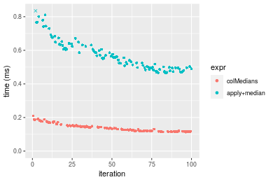

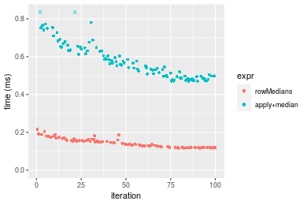
_Table: Benchmarking of colMedians() and rowMedians() on integer+1000x10 data (original and transposed).  The top panel shows times in milliseconds and the bottom panel shows relative times._


|   |expr       |     min|       lq|     mean|   median|       uq|     max|
|:--|:----------|-------:|--------:|--------:|--------:|--------:|-------:|
|1  |colMedians | 113.092| 119.7680| 139.3807| 135.5145| 150.2315| 209.911|
|2  |rowMedians | 116.761| 122.3805| 144.7360| 137.6660| 159.1530| 215.860|


|   |expr       |      min|       lq|     mean|   median|       uq|      max|
|:--|:----------|--------:|--------:|--------:|--------:|--------:|--------:|
|1  |colMedians | 1.000000| 1.000000| 1.000000| 1.000000| 1.000000| 1.000000|
|2  |rowMedians | 1.032443| 1.021813| 1.038422| 1.015877| 1.059385| 1.028341|

_Figure: Benchmarking of colMedians() and rowMedians() on integer+1000x10 data (original and transposed).  Outliers are displayed as crosses. Times are in milliseconds._


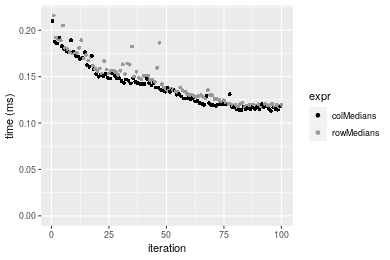

#### 10x1000 integer matrix


```r
> X <- data[["10x1000"]]
> gc()
          used  (Mb) gc trigger  (Mb) max used  (Mb)
Ncells 5185758 277.0   10014072 534.9 10014072 534.9
Vcells 9363658  71.5   18204443 138.9 18204443 138.9
> colStats <- microbenchmark(colMedians = colMedians(X, na.rm = FALSE), `apply+median` = apply(X, MARGIN = 2L, 
+     FUN = median, na.rm = FALSE), unit = "ms")
> X <- t(X)
> gc()
          used  (Mb) gc trigger  (Mb) max used  (Mb)
Ncells 5185734 277.0   10014072 534.9 10014072 534.9
Vcells 9368671  71.5   18204443 138.9 18204443 138.9
> rowStats <- microbenchmark(rowMedians = rowMedians(X, na.rm = FALSE), `apply+median` = apply(X, MARGIN = 1L, 
+     FUN = median, na.rm = FALSE), unit = "ms")
```

_Table: Benchmarking of colMedians() and apply+median() on integer+10x1000 data. The top panel shows times in milliseconds and the bottom panel shows relative times._


|   |expr         |      min|        lq|       mean|     median|         uq|       max|
|:--|:------------|--------:|---------:|----------:|----------:|----------:|---------:|
|1  |colMedians   |  0.13544|  0.140847|  0.1545316|  0.1592605|  0.1623945|  0.222323|
|2  |apply+median | 23.98188| 24.557184| 25.6895665| 25.3072055| 25.6672050| 33.475905|


|   |expr         |      min|       lq|     mean|   median|       uq|      max|
|:--|:------------|--------:|--------:|--------:|--------:|--------:|--------:|
|1  |colMedians   |   1.0000|   1.0000|   1.0000|   1.0000|   1.0000|   1.0000|
|2  |apply+median | 177.0664| 174.3536| 166.2415| 158.9045| 158.0546| 150.5733|

_Table: Benchmarking of rowMedians() and apply+median() on integer+10x1000 data (transposed). The top panel shows times in milliseconds and the bottom panel shows relative times._


|   |expr         |       min|        lq|       mean|    median|         uq|       max|
|:--|:------------|---------:|---------:|----------:|---------:|----------:|---------:|
|1  |rowMedians   |  0.137803|  0.143195|  0.1567898|  0.163152|  0.1680925|  0.213333|
|2  |apply+median | 24.022604| 24.797569| 25.7837241| 25.537281| 25.9659565| 32.910532|


|   |expr         |      min|       lq|     mean|   median|       uq|      max|
|:--|:------------|--------:|--------:|--------:|--------:|--------:|--------:|
|1  |rowMedians   |   1.0000|   1.0000|   1.0000|   1.0000|   1.0000|   1.0000|
|2  |apply+median | 174.3257| 173.1734| 164.4477| 156.5245| 154.4742| 154.2684|

_Figure: Benchmarking of colMedians() and apply+median() on integer+10x1000 data  as well as rowMedians() and apply+median() on the same data transposed.  Outliers are displayed as crosses.  Times are in milliseconds._


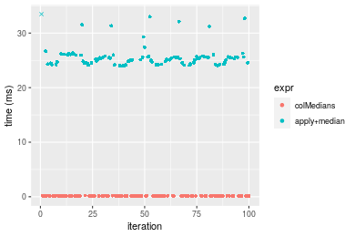

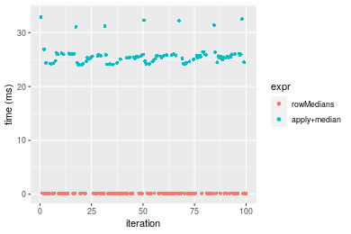
_Table: Benchmarking of colMedians() and rowMedians() on integer+10x1000 data (original and transposed).  The top panel shows times in milliseconds and the bottom panel shows relative times._


|   |expr       |     min|      lq|     mean|   median|       uq|     max|
|:--|:----------|-------:|-------:|--------:|--------:|--------:|-------:|
|1  |colMedians | 135.440| 140.847| 154.5316| 159.2605| 162.3945| 222.323|
|2  |rowMedians | 137.803| 143.195| 156.7898| 163.1520| 168.0925| 213.333|


|   |expr       |      min|       lq|     mean|   median|       uq|       max|
|:--|:----------|--------:|--------:|--------:|--------:|--------:|---------:|
|1  |colMedians | 1.000000| 1.000000| 1.000000| 1.000000| 1.000000| 1.0000000|
|2  |rowMedians | 1.017447| 1.016671| 1.014613| 1.024435| 1.035087| 0.9595633|

_Figure: Benchmarking of colMedians() and rowMedians() on integer+10x1000 data (original and transposed).  Outliers are displayed as crosses. Times are in milliseconds._


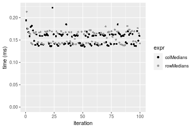

#### 100x1000 integer matrix


```r
> X <- data[["100x1000"]]
> gc()
          used  (Mb) gc trigger  (Mb) max used  (Mb)
Ncells 5185942 277.0   10014072 534.9 10014072 534.9
Vcells 9364141  71.5   18204443 138.9 18204443 138.9
> colStats <- microbenchmark(colMedians = colMedians(X, na.rm = FALSE), `apply+median` = apply(X, MARGIN = 2L, 
+     FUN = median, na.rm = FALSE), unit = "ms")
> X <- t(X)
> gc()
          used  (Mb) gc trigger  (Mb) max used  (Mb)
Ncells 5185918 277.0   10014072 534.9 10014072 534.9
Vcells 9414154  71.9   18204443 138.9 18204443 138.9
> rowStats <- microbenchmark(rowMedians = rowMedians(X, na.rm = FALSE), `apply+median` = apply(X, MARGIN = 1L, 
+     FUN = median, na.rm = FALSE), unit = "ms")
```

_Table: Benchmarking of colMedians() and apply+median() on integer+100x1000 data. The top panel shows times in milliseconds and the bottom panel shows relative times._


|   |expr         |       min|        lq|     mean|    median|        uq|       max|
|:--|:------------|---------:|---------:|--------:|---------:|---------:|---------:|
|1  |colMedians   |  1.260237|  1.279662|  1.30779|  1.294788|  1.318596|  1.525654|
|2  |apply+median | 26.668927| 27.594593| 29.31348| 28.283298| 28.578446| 65.289722|


|   |expr         |      min|       lq|     mean|   median|       uq|      max|
|:--|:------------|--------:|--------:|--------:|--------:|--------:|--------:|
|1  |colMedians   |  1.00000|  1.00000|  1.00000|  1.00000|  1.00000|  1.00000|
|2  |apply+median | 21.16183| 21.56397| 22.41451| 21.84395| 21.67338| 42.79458|

_Table: Benchmarking of rowMedians() and apply+median() on integer+100x1000 data (transposed). The top panel shows times in milliseconds and the bottom panel shows relative times._


|   |expr         |      min|        lq|      mean|    median|        uq|      max|
|:--|:------------|--------:|---------:|---------:|---------:|---------:|--------:|
|1  |rowMedians   |  1.28975|  1.326105|  1.390994|  1.385426|  1.437549|  1.89411|
|2  |apply+median | 26.73186| 27.893129| 29.324105| 28.330206| 28.662370| 44.39853|


|   |expr         |      min|       lq|    mean|   median|       uq|      max|
|:--|:------------|--------:|--------:|-------:|--------:|--------:|--------:|
|1  |rowMedians   |  1.00000|  1.00000|  1.0000|  1.00000|  1.00000|  1.00000|
|2  |apply+median | 20.72639| 21.03387| 21.0814| 20.44872| 19.93836| 23.44031|

_Figure: Benchmarking of colMedians() and apply+median() on integer+100x1000 data  as well as rowMedians() and apply+median() on the same data transposed.  Outliers are displayed as crosses.  Times are in milliseconds._


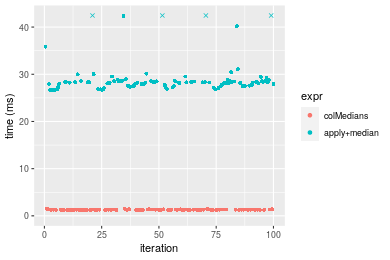

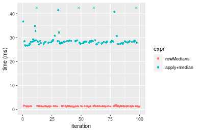
_Table: Benchmarking of colMedians() and rowMedians() on integer+100x1000 data (original and transposed).  The top panel shows times in milliseconds and the bottom panel shows relative times._


|   |expr       |      min|       lq|     mean|   median|       uq|      max|
|:--|:----------|--------:|--------:|--------:|--------:|--------:|--------:|
|1  |colMedians | 1.260237| 1.279662| 1.307790| 1.294788| 1.318596| 1.525654|
|2  |rowMedians | 1.289750| 1.326105| 1.390994| 1.385426| 1.437549| 1.894110|


|   |expr       |      min|       lq|     mean|   median|       uq|      max|
|:--|:----------|--------:|--------:|--------:|--------:|--------:|--------:|
|1  |colMedians | 1.000000| 1.000000| 1.000000| 1.000000| 1.000000| 1.000000|
|2  |rowMedians | 1.023419| 1.036294| 1.063622| 1.070002| 1.090211| 1.241507|

_Figure: Benchmarking of colMedians() and rowMedians() on integer+100x1000 data (original and transposed).  Outliers are displayed as crosses. Times are in milliseconds._


#### 1000x100 integer matrix


```r
> X <- data[["1000x100"]]
> gc()
          used  (Mb) gc trigger  (Mb) max used  (Mb)
Ncells 5186134 277.0   10014072 534.9 10014072 534.9
Vcells 9364708  71.5   18204443 138.9 18204443 138.9
> colStats <- microbenchmark(colMedians = colMedians(X, na.rm = FALSE), `apply+median` = apply(X, MARGIN = 2L, 
+     FUN = median, na.rm = FALSE), unit = "ms")
> X <- t(X)
> gc()
          used  (Mb) gc trigger  (Mb) max used  (Mb)
Ncells 5186110 277.0   10014072 534.9 10014072 534.9
Vcells 9414721  71.9   18204443 138.9 18204443 138.9
> rowStats <- microbenchmark(rowMedians = rowMedians(X, na.rm = FALSE), `apply+median` = apply(X, MARGIN = 1L, 
+     FUN = median, na.rm = FALSE), unit = "ms")
```

_Table: Benchmarking of colMedians() and apply+median() on integer+1000x100 data. The top panel shows times in milliseconds and the bottom panel shows relative times._


|   |expr         |      min|       lq|     mean|   median|       uq|       max|
|:--|:------------|--------:|--------:|--------:|--------:|--------:|---------:|
|1  |colMedians   | 1.108071| 1.114153| 1.155601| 1.118462| 1.137892|  1.840519|
|2  |apply+median | 4.356402| 4.435632| 4.837963| 4.475304| 4.568508| 12.100308|


|   |expr         |      min|       lq|     mean|   median|       uq|    max|
|:--|:------------|--------:|--------:|--------:|--------:|--------:|------:|
|1  |colMedians   | 1.000000| 1.000000| 1.000000| 1.000000| 1.000000| 1.0000|
|2  |apply+median | 3.931519| 3.981169| 4.186534| 4.001302| 4.014885| 6.5744|

_Table: Benchmarking of rowMedians() and apply+median() on integer+1000x100 data (transposed). The top panel shows times in milliseconds and the bottom panel shows relative times._


|   |expr         |      min|       lq|     mean|   median|       uq|       max|
|:--|:------------|--------:|--------:|--------:|--------:|--------:|---------:|
|1  |rowMedians   | 1.146123| 1.151107| 1.198804| 1.155639| 1.189505|  1.560612|
|2  |apply+median | 4.358285| 4.438369| 4.832522| 4.473597| 4.613796| 12.351100|


|   |expr         |      min|       lq|    mean|   median|       uq|      max|
|:--|:------------|--------:|--------:|-------:|--------:|--------:|--------:|
|1  |rowMedians   | 1.000000| 1.000000| 1.00000| 1.000000| 1.000000| 1.000000|
|2  |apply+median | 3.802633| 3.855738| 4.03112| 3.871104| 3.878753| 7.914267|

_Figure: Benchmarking of colMedians() and apply+median() on integer+1000x100 data  as well as rowMedians() and apply+median() on the same data transposed.  Outliers are displayed as crosses.  Times are in milliseconds._


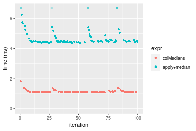

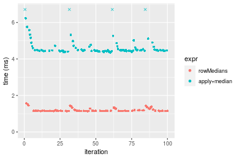
_Table: Benchmarking of colMedians() and rowMedians() on integer+1000x100 data (original and transposed).  The top panel shows times in milliseconds and the bottom panel shows relative times._


|   |expr       |      min|       lq|     mean|   median|       uq|      max|
|:--|:----------|--------:|--------:|--------:|--------:|--------:|--------:|
|1  |colMedians | 1.108071| 1.114153| 1.155601| 1.118462| 1.137892| 1.840519|
|2  |rowMedians | 1.146123| 1.151107| 1.198804| 1.155639| 1.189505| 1.560612|


|   |expr       |      min|       lq|     mean|   median|       uq|       max|
|:--|:----------|--------:|--------:|--------:|--------:|--------:|---------:|
|1  |colMedians | 1.000000| 1.000000| 1.000000| 1.000000| 1.000000| 1.0000000|
|2  |rowMedians | 1.034341| 1.033168| 1.037385| 1.033239| 1.045358| 0.8479195|

_Figure: Benchmarking of colMedians() and rowMedians() on integer+1000x100 data (original and transposed).  Outliers are displayed as crosses. Times are in milliseconds._


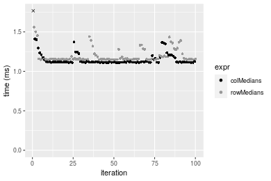


## Data type "double"

### Data
```r
> rmatrix <- function(nrow, ncol, mode = c("logical", "double", "integer", "index"), range = c(-100, 
+     +100), na_prob = 0) {
+     mode <- match.arg(mode)
+     n <- nrow * ncol
+     if (mode == "logical") {
+         x <- sample(c(FALSE, TRUE), size = n, replace = TRUE)
+     }     else if (mode == "index") {
+         x <- seq_len(n)
+         mode <- "integer"
+     }     else {
+         x <- runif(n, min = range[1], max = range[2])
+     }
+     storage.mode(x) <- mode
+     if (na_prob > 0) 
+         x[sample(n, size = na_prob * n)] <- NA
+     dim(x) <- c(nrow, ncol)
+     x
+ }
> rmatrices <- function(scale = 10, seed = 1, ...) {
+     set.seed(seed)
+     data <- list()
+     data[[1]] <- rmatrix(nrow = scale * 1, ncol = scale * 1, ...)
+     data[[2]] <- rmatrix(nrow = scale * 10, ncol = scale * 10, ...)
+     data[[3]] <- rmatrix(nrow = scale * 100, ncol = scale * 1, ...)
+     data[[4]] <- t(data[[3]])
+     data[[5]] <- rmatrix(nrow = scale * 10, ncol = scale * 100, ...)
+     data[[6]] <- t(data[[5]])
+     names(data) <- sapply(data, FUN = function(x) paste(dim(x), collapse = "x"))
+     data
+ }
> data <- rmatrices(mode = mode)
```

### Results

#### 10x10 double matrix


```r
> X <- data[["10x10"]]
> gc()
          used  (Mb) gc trigger  (Mb) max used  (Mb)
Ncells 5186334 277.0   10014072 534.9 10014072 534.9
Vcells 9481108  72.4   18204443 138.9 18204443 138.9
> colStats <- microbenchmark(colMedians = colMedians(X, na.rm = FALSE), `apply+median` = apply(X, MARGIN = 2L, 
+     FUN = median, na.rm = FALSE), unit = "ms")
> X <- t(X)
> gc()
          used  (Mb) gc trigger  (Mb) max used  (Mb)
Ncells 5186301 277.0   10014072 534.9 10014072 534.9
Vcells 9481206  72.4   18204443 138.9 18204443 138.9
> rowStats <- microbenchmark(rowMedians = rowMedians(X, na.rm = FALSE), `apply+median` = apply(X, MARGIN = 1L, 
+     FUN = median, na.rm = FALSE), unit = "ms")
```

_Table: Benchmarking of colMedians() and apply+median() on double+10x10 data. The top panel shows times in milliseconds and the bottom panel shows relative times._


|   |expr         |      min|        lq|      mean|    median|        uq|      max|
|:--|:------------|--------:|---------:|---------:|---------:|---------:|--------:|
|1  |colMedians   | 0.002685| 0.0032840| 0.0045752| 0.0042475| 0.0053480| 0.017317|
|2  |apply+median | 0.305490| 0.3262395| 0.3553569| 0.3379700| 0.3776905| 0.581630|


|   |expr         |      min|       lq|     mean|   median|       uq|      max|
|:--|:------------|--------:|--------:|--------:|--------:|--------:|--------:|
|1  |colMedians   |   1.0000|  1.00000|  1.00000|  1.00000|  1.00000|  1.00000|
|2  |apply+median | 113.7765| 99.34211| 77.66973| 79.56916| 70.62276| 33.58723|

_Table: Benchmarking of rowMedians() and apply+median() on double+10x10 data (transposed). The top panel shows times in milliseconds and the bottom panel shows relative times._


|   |expr         |      min|        lq|      mean|    median|       uq|      max|
|:--|:------------|--------:|---------:|---------:|---------:|--------:|--------:|
|1  |rowMedians   | 0.002795| 0.0034140| 0.0047649| 0.0048880| 0.005363| 0.017126|
|2  |apply+median | 0.306906| 0.3277855| 0.3542959| 0.3387875| 0.373077| 0.579256|


|   |expr         |      min|       lq|    mean|   median|       uq|      max|
|:--|:------------|--------:|--------:|-------:|--------:|--------:|--------:|
|1  |rowMedians   |   1.0000|  1.00000|  1.0000|  1.00000|  1.00000|  1.00000|
|2  |apply+median | 109.8054| 96.01216| 74.3549| 69.31005| 69.56498| 33.82319|

_Figure: Benchmarking of colMedians() and apply+median() on double+10x10 data  as well as rowMedians() and apply+median() on the same data transposed.  Outliers are displayed as crosses.  Times are in milliseconds._


_Table: Benchmarking of colMedians() and rowMedians() on double+10x10 data (original and transposed).  The top panel shows times in milliseconds and the bottom panel shows relative times._


|   |expr       |   min|    lq|    mean| median|    uq|    max|
|:--|:----------|-----:|-----:|-------:|------:|-----:|------:|
|1  |colMedians | 2.685| 3.284| 4.57523| 4.2475| 5.348| 17.317|
|2  |rowMedians | 2.795| 3.414| 4.76493| 4.8880| 5.363| 17.126|


|   |expr       |      min|       lq|     mean|   median|       uq|       max|
|:--|:----------|--------:|--------:|--------:|--------:|--------:|---------:|
|1  |colMedians | 1.000000| 1.000000| 1.000000| 1.000000| 1.000000| 1.0000000|
|2  |rowMedians | 1.040968| 1.039586| 1.041462| 1.150795| 1.002805| 0.9889704|

_Figure: Benchmarking of colMedians() and rowMedians() on double+10x10 data (original and transposed).  Outliers are displayed as crosses. Times are in milliseconds._


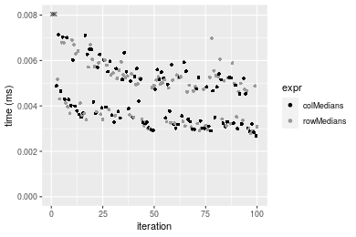

#### 100x100 double matrix


```r
> X <- data[["100x100"]]
> gc()
          used  (Mb) gc trigger  (Mb) max used  (Mb)
Ncells 5186514 277.0   10014072 534.9 10014072 534.9
Vcells 9481220  72.4   18204443 138.9 18204443 138.9
> colStats <- microbenchmark(colMedians = colMedians(X, na.rm = FALSE), `apply+median` = apply(X, MARGIN = 2L, 
+     FUN = median, na.rm = FALSE), unit = "ms")
> X <- t(X)
> gc()
          used  (Mb) gc trigger  (Mb) max used  (Mb)
Ncells 5186490 277.0   10014072 534.9 10014072 534.9
Vcells 9491233  72.5   18204443 138.9 18204443 138.9
> rowStats <- microbenchmark(rowMedians = rowMedians(X, na.rm = FALSE), `apply+median` = apply(X, MARGIN = 1L, 
+     FUN = median, na.rm = FALSE), unit = "ms")
```

_Table: Benchmarking of colMedians() and apply+median() on double+100x100 data. The top panel shows times in milliseconds and the bottom panel shows relative times._


|   |expr         |      min|       lq|      mean|    median|        uq|      max|
|:--|:------------|--------:|--------:|---------:|---------:|---------:|--------:|
|1  |colMedians   | 0.189027| 0.191088| 0.1964146| 0.1926835| 0.1943915| 0.329410|
|2  |apply+median | 2.741979| 2.763945| 2.9306366| 2.8284200| 2.9282480| 4.698033|


|   |expr         |      min|       lq|     mean|  median|       uq|      max|
|:--|:------------|--------:|--------:|--------:|-------:|--------:|--------:|
|1  |colMedians   |  1.00000|  1.00000|  1.00000|  1.0000|  1.00000|  1.00000|
|2  |apply+median | 14.50575| 14.46425| 14.92066| 14.6791| 15.06366| 14.26196|

_Table: Benchmarking of rowMedians() and apply+median() on double+100x100 data (transposed). The top panel shows times in milliseconds and the bottom panel shows relative times._


|   |expr         |      min|        lq|      mean|    median|       uq|      max|
|:--|:------------|--------:|---------:|---------:|---------:|--------:|--------:|
|1  |rowMedians   | 0.188932| 0.1911435| 0.1989542| 0.1931225| 0.195458| 0.263713|
|2  |apply+median | 2.722486| 2.7666135| 2.9332256| 2.8336845| 2.921792| 4.796815|


|   |expr         |      min|       lq|     mean|   median|       uq|      max|
|:--|:------------|--------:|--------:|--------:|--------:|--------:|--------:|
|1  |rowMedians   |  1.00000|  1.00000|  1.00000|  1.00000|  1.00000|  1.00000|
|2  |apply+median | 14.40987| 14.47401| 14.74322| 14.67299| 14.94844| 18.18953|

_Figure: Benchmarking of colMedians() and apply+median() on double+100x100 data  as well as rowMedians() and apply+median() on the same data transposed.  Outliers are displayed as crosses.  Times are in milliseconds._


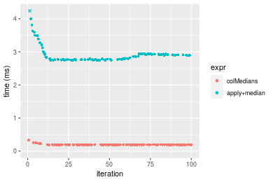

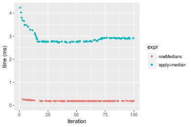
_Table: Benchmarking of colMedians() and rowMedians() on double+100x100 data (original and transposed).  The top panel shows times in milliseconds and the bottom panel shows relative times._


|   |expr       |     min|       lq|     mean|   median|       uq|     max|
|:--|:----------|-------:|--------:|--------:|--------:|--------:|-------:|
|1  |colMedians | 189.027| 191.0880| 196.4146| 192.6835| 194.3915| 329.410|
|2  |rowMedians | 188.932| 191.1435| 198.9543| 193.1225| 195.4580| 263.713|


|   |expr       |       min|      lq|    mean|   median|       uq|       max|
|:--|:----------|---------:|-------:|-------:|--------:|--------:|---------:|
|1  |colMedians | 1.0000000| 1.00000| 1.00000| 1.000000| 1.000000| 1.0000000|
|2  |rowMedians | 0.9994974| 1.00029| 1.01293| 1.002278| 1.005486| 0.8005616|

_Figure: Benchmarking of colMedians() and rowMedians() on double+100x100 data (original and transposed).  Outliers are displayed as crosses. Times are in milliseconds._


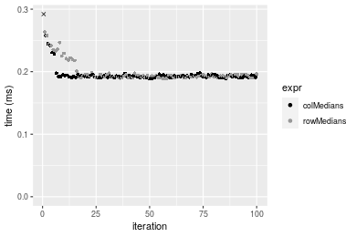

#### 1000x10 double matrix


```r
> X <- data[["1000x10"]]
> gc()
          used  (Mb) gc trigger  (Mb) max used  (Mb)
Ncells 5186692 277.0   10014072 534.9 10014072 534.9
Vcells 9482095  72.4   18204443 138.9 18204443 138.9
> colStats <- microbenchmark(colMedians = colMedians(X, na.rm = FALSE), `apply+median` = apply(X, MARGIN = 2L, 
+     FUN = median, na.rm = FALSE), unit = "ms")
> X <- t(X)
> gc()
          used  (Mb) gc trigger  (Mb) max used  (Mb)
Ncells 5186680 277.0   10014072 534.9 10014072 534.9
Vcells 9492128  72.5   18204443 138.9 18204443 138.9
> rowStats <- microbenchmark(rowMedians = rowMedians(X, na.rm = FALSE), `apply+median` = apply(X, MARGIN = 1L, 
+     FUN = median, na.rm = FALSE), unit = "ms")
```

_Table: Benchmarking of colMedians() and apply+median() on double+1000x10 data. The top panel shows times in milliseconds and the bottom panel shows relative times._


|   |expr         |      min|        lq|      mean|    median|        uq|      max|
|:--|:------------|--------:|---------:|---------:|---------:|---------:|--------:|
|1  |colMedians   | 0.175682| 0.1789790| 0.2070121| 0.1958975| 0.2235210| 0.307535|
|2  |apply+median | 0.530499| 0.5421335| 0.6230068| 0.5903445| 0.6798685| 1.025031|


|   |expr         |      min|       lq|     mean|   median|       uq|      max|
|:--|:------------|--------:|--------:|--------:|--------:|--------:|--------:|
|1  |colMedians   | 1.000000| 1.000000| 1.000000| 1.000000| 1.000000| 1.000000|
|2  |apply+median | 3.019655| 3.029034| 3.009519| 3.013538| 3.041631| 3.333055|

_Table: Benchmarking of rowMedians() and apply+median() on double+1000x10 data (transposed). The top panel shows times in milliseconds and the bottom panel shows relative times._


|   |expr         |      min|        lq|      mean|    median|        uq|      max|
|:--|:------------|--------:|---------:|---------:|---------:|---------:|--------:|
|1  |rowMedians   | 0.175938| 0.1788335| 0.2070925| 0.1924395| 0.2290880| 0.312963|
|2  |apply+median | 0.530068| 0.5389835| 0.6160035| 0.5757235| 0.6751125| 1.042887|


|   |expr         |      min|       lq|     mean|   median|       uq|      max|
|:--|:------------|--------:|--------:|--------:|--------:|--------:|--------:|
|1  |rowMedians   | 1.000000| 1.000000| 1.000000| 1.000000| 1.000000| 1.000000|
|2  |apply+median | 3.012811| 3.013884| 2.974533| 2.991712| 2.946957| 3.332301|

_Figure: Benchmarking of colMedians() and apply+median() on double+1000x10 data  as well as rowMedians() and apply+median() on the same data transposed.  Outliers are displayed as crosses.  Times are in milliseconds._


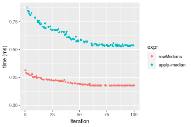
_Table: Benchmarking of colMedians() and rowMedians() on double+1000x10 data (original and transposed).  The top panel shows times in milliseconds and the bottom panel shows relative times._


|   |expr       |     min|       lq|     mean|   median|      uq|     max|
|:--|:----------|-------:|--------:|--------:|--------:|-------:|-------:|
|2  |rowMedians | 175.938| 178.8335| 207.0925| 192.4395| 229.088| 312.963|
|1  |colMedians | 175.682| 178.9790| 207.0121| 195.8975| 223.521| 307.535|


|   |expr       |       min|       lq|      mean|   median|        uq|       max|
|:--|:----------|---------:|--------:|---------:|--------:|---------:|---------:|
|2  |rowMedians | 1.0000000| 1.000000| 1.0000000| 1.000000| 1.0000000| 1.0000000|
|1  |colMedians | 0.9985449| 1.000814| 0.9996117| 1.017969| 0.9756993| 0.9826561|

_Figure: Benchmarking of colMedians() and rowMedians() on double+1000x10 data (original and transposed).  Outliers are displayed as crosses. Times are in milliseconds._


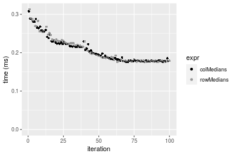

#### 10x1000 double matrix


```r
> X <- data[["10x1000"]]
> gc()
          used  (Mb) gc trigger  (Mb) max used  (Mb)
Ncells 5186892 277.1   10014072 534.9 10014072 534.9
Vcells 9483154  72.4   18204443 138.9 18204443 138.9
> colStats <- microbenchmark(colMedians = colMedians(X, na.rm = FALSE), `apply+median` = apply(X, MARGIN = 2L, 
+     FUN = median, na.rm = FALSE), unit = "ms")
> X <- t(X)
> gc()
          used  (Mb) gc trigger  (Mb) max used  (Mb)
Ncells 5186868 277.1   10014072 534.9 10014072 534.9
Vcells 9493167  72.5   18204443 138.9 18204443 138.9
> rowStats <- microbenchmark(rowMedians = rowMedians(X, na.rm = FALSE), `apply+median` = apply(X, MARGIN = 1L, 
+     FUN = median, na.rm = FALSE), unit = "ms")
```

_Table: Benchmarking of colMedians() and apply+median() on double+10x1000 data. The top panel shows times in milliseconds and the bottom panel shows relative times._


|   |expr         |       min|         lq|       mean|    median|         uq|       max|
|:--|:------------|---------:|----------:|----------:|---------:|----------:|---------:|
|1  |colMedians   |  0.200245|  0.2035035|  0.2153484|  0.216469|  0.2204595|  0.283141|
|2  |apply+median | 24.131255| 24.7272645| 25.8207731| 25.367424| 25.8784080| 33.467139|


|   |expr         |      min|       lq|     mean|   median|      uq|      max|
|:--|:------------|--------:|--------:|--------:|--------:|-------:|--------:|
|1  |colMedians   |   1.0000|   1.0000|   1.0000|   1.0000|   1.000|   1.0000|
|2  |apply+median | 120.5087| 121.5078| 119.9023| 117.1873| 117.384| 118.1996|

_Table: Benchmarking of rowMedians() and apply+median() on double+10x1000 data (transposed). The top panel shows times in milliseconds and the bottom panel shows relative times._


|   |expr         |       min|        lq|      mean|     median|         uq|       max|
|:--|:------------|---------:|---------:|---------:|----------:|----------:|---------:|
|1  |rowMedians   |  0.200004|  0.202229|  0.212861|  0.2153085|  0.2196425|  0.255873|
|2  |apply+median | 24.217108| 24.836295| 25.843088| 25.5194370| 26.0248205| 32.993706|


|   |expr         |      min|       lq|     mean|  median|       uq|      max|
|:--|:------------|--------:|--------:|--------:|-------:|--------:|--------:|
|1  |rowMedians   |   1.0000|   1.0000|   1.0000|   1.000|   1.0000|   1.0000|
|2  |apply+median | 121.0831| 122.8127| 121.4083| 118.525| 118.4872| 128.9456|

_Figure: Benchmarking of colMedians() and apply+median() on double+10x1000 data  as well as rowMedians() and apply+median() on the same data transposed.  Outliers are displayed as crosses.  Times are in milliseconds._


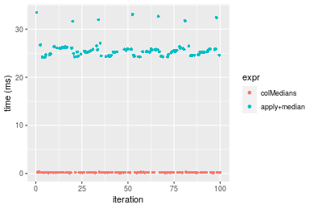

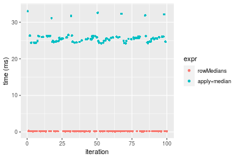
_Table: Benchmarking of colMedians() and rowMedians() on double+10x1000 data (original and transposed).  The top panel shows times in milliseconds and the bottom panel shows relative times._


|   |expr       |     min|       lq|     mean|   median|       uq|     max|
|:--|:----------|-------:|--------:|--------:|--------:|--------:|-------:|
|2  |rowMedians | 200.004| 202.2290| 212.8610| 215.3085| 219.6425| 255.873|
|1  |colMedians | 200.245| 203.5035| 215.3484| 216.4690| 220.4595| 283.141|


|   |expr       |      min|       lq|     mean|  median|      uq|      max|
|:--|:----------|--------:|--------:|--------:|-------:|-------:|--------:|
|2  |rowMedians | 1.000000| 1.000000| 1.000000| 1.00000| 1.00000| 1.000000|
|1  |colMedians | 1.001205| 1.006302| 1.011686| 1.00539| 1.00372| 1.106569|

_Figure: Benchmarking of colMedians() and rowMedians() on double+10x1000 data (original and transposed).  Outliers are displayed as crosses. Times are in milliseconds._


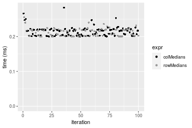

#### 100x1000 double matrix


```r
> X <- data[["100x1000"]]
> gc()
          used  (Mb) gc trigger  (Mb) max used  (Mb)
Ncells 5187076 277.1   10014072 534.9 10014072 534.9
Vcells 9483275  72.4   18204443 138.9 18204443 138.9
> colStats <- microbenchmark(colMedians = colMedians(X, na.rm = FALSE), `apply+median` = apply(X, MARGIN = 2L, 
+     FUN = median, na.rm = FALSE), unit = "ms")
> X <- t(X)
> gc()
          used  (Mb) gc trigger  (Mb) max used  (Mb)
Ncells 5187052 277.1   10014072 534.9 10014072 534.9
Vcells 9583288  73.2   18204443 138.9 18204443 138.9
> rowStats <- microbenchmark(rowMedians = rowMedians(X, na.rm = FALSE), `apply+median` = apply(X, MARGIN = 1L, 
+     FUN = median, na.rm = FALSE), unit = "ms")
```

_Table: Benchmarking of colMedians() and apply+median() on double+100x1000 data. The top panel shows times in milliseconds and the bottom panel shows relative times._


|   |expr         |       min|        lq|      mean|   median|        uq|       max|
|:--|:------------|---------:|---------:|---------:|--------:|---------:|---------:|
|1  |colMedians   |  1.856387|  1.876752|  1.926488|  1.89807|  1.922637|  2.490905|
|2  |apply+median | 27.454784| 28.258786| 29.818424| 28.78670| 28.983559| 48.905478|


|   |expr         |      min|       lq|     mean|   median|      uq|      max|
|:--|:------------|--------:|--------:|--------:|--------:|-------:|--------:|
|1  |colMedians   |  1.00000|  1.00000|  1.00000|  1.00000|  1.0000|  1.00000|
|2  |apply+median | 14.78936| 15.05728| 15.47812| 15.16629| 15.0749| 19.63362|

_Table: Benchmarking of rowMedians() and apply+median() on double+100x1000 data (transposed). The top panel shows times in milliseconds and the bottom panel shows relative times._


|   |expr         |       min|        lq|      mean|    median|        uq|        max|
|:--|:------------|---------:|---------:|---------:|---------:|---------:|----------:|
|1  |rowMedians   |  1.861438|  1.932327|  2.012651|  2.012253|  2.043001|   2.752982|
|2  |apply+median | 27.346175| 28.585482| 33.588642| 29.017971| 29.293124| 405.191541|


|   |expr         |      min|       lq|     mean|   median|       uq|      max|
|:--|:------------|--------:|--------:|--------:|--------:|--------:|--------:|
|1  |rowMedians   |  1.00000|  1.00000|  1.00000|  1.00000|  1.00000|   1.0000|
|2  |apply+median | 14.69089| 14.79329| 16.68876| 14.42063| 14.33829| 147.1828|

_Figure: Benchmarking of colMedians() and apply+median() on double+100x1000 data  as well as rowMedians() and apply+median() on the same data transposed.  Outliers are displayed as crosses.  Times are in milliseconds._


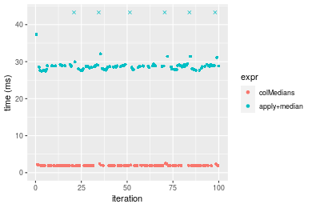

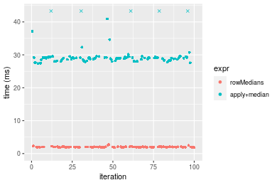
_Table: Benchmarking of colMedians() and rowMedians() on double+100x1000 data (original and transposed).  The top panel shows times in milliseconds and the bottom panel shows relative times._


|   |expr       |      min|       lq|     mean|   median|       uq|      max|
|:--|:----------|--------:|--------:|--------:|--------:|--------:|--------:|
|1  |colMedians | 1.856387| 1.876752| 1.926488| 1.898070| 1.922637| 2.490905|
|2  |rowMedians | 1.861438| 1.932327| 2.012651| 2.012253| 2.043001| 2.752982|


|   |expr       |      min|       lq|     mean|   median|       uq|      max|
|:--|:----------|--------:|--------:|--------:|--------:|--------:|--------:|
|1  |colMedians | 1.000000| 1.000000| 1.000000| 1.000000| 1.000000| 1.000000|
|2  |rowMedians | 1.002721| 1.029612| 1.044725| 1.060157| 1.062603| 1.105214|

_Figure: Benchmarking of colMedians() and rowMedians() on double+100x1000 data (original and transposed).  Outliers are displayed as crosses. Times are in milliseconds._


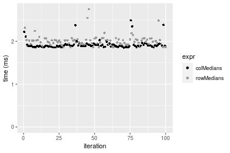

#### 1000x100 double matrix


```r
> X <- data[["1000x100"]]
> gc()
          used  (Mb) gc trigger  (Mb) max used  (Mb)
Ncells 5187268 277.1   10014072 534.9 10014072 534.9
Vcells 9484507  72.4   18204443 138.9 18204443 138.9
> colStats <- microbenchmark(colMedians = colMedians(X, na.rm = FALSE), `apply+median` = apply(X, MARGIN = 2L, 
+     FUN = median, na.rm = FALSE), unit = "ms")
> X <- t(X)
> gc()
          used  (Mb) gc trigger  (Mb) max used  (Mb)
Ncells 5187244 277.1   10014072 534.9 10014072 534.9
Vcells 9584520  73.2   18204443 138.9 18204443 138.9
> rowStats <- microbenchmark(rowMedians = rowMedians(X, na.rm = FALSE), `apply+median` = apply(X, MARGIN = 1L, 
+     FUN = median, na.rm = FALSE), unit = "ms")
```

_Table: Benchmarking of colMedians() and apply+median() on double+1000x100 data. The top panel shows times in milliseconds and the bottom panel shows relative times._


|   |expr         |      min|       lq|     mean|   median|       uq|       max|
|:--|:------------|--------:|--------:|--------:|--------:|--------:|---------:|
|1  |colMedians   | 1.735665| 1.746651| 1.799343| 1.760833| 1.772113|  2.827172|
|2  |apply+median | 5.043703| 5.097640| 5.638116| 5.128604| 5.367880| 12.117293|


|   |expr         |     min|       lq|     mean| median|       uq|      max|
|:--|:------------|-------:|--------:|--------:|------:|--------:|--------:|
|1  |colMedians   | 1.00000| 1.000000| 1.000000| 1.0000| 1.000000| 1.000000|
|2  |apply+median | 2.90592| 2.918523| 3.133431| 2.9126| 3.029084| 4.286012|

_Table: Benchmarking of rowMedians() and apply+median() on double+1000x100 data (transposed). The top panel shows times in milliseconds and the bottom panel shows relative times._


|   |expr         |      min|       lq|     mean|   median|       uq|       max|
|:--|:------------|--------:|--------:|--------:|--------:|--------:|---------:|
|1  |rowMedians   | 1.743363| 1.768420| 1.965514| 1.849544| 2.124474|  2.963528|
|2  |apply+median | 5.032690| 5.157266| 5.999950| 5.247737| 6.358632| 13.814522|


|   |expr         |      min|       lq|     mean|   median|       uq|      max|
|:--|:------------|--------:|--------:|--------:|--------:|--------:|--------:|
|1  |rowMedians   | 1.000000| 1.000000| 1.000000| 1.000000| 1.000000| 1.000000|
|2  |apply+median | 2.886771| 2.916312| 3.052612| 2.837313| 2.993038| 4.661512|

_Figure: Benchmarking of colMedians() and apply+median() on double+1000x100 data  as well as rowMedians() and apply+median() on the same data transposed.  Outliers are displayed as crosses.  Times are in milliseconds._


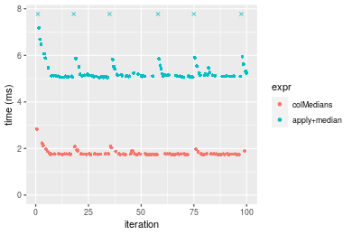

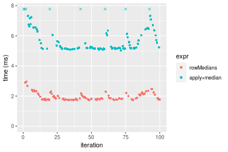
_Table: Benchmarking of colMedians() and rowMedians() on double+1000x100 data (original and transposed).  The top panel shows times in milliseconds and the bottom panel shows relative times._


|   |expr       |      min|       lq|     mean|   median|       uq|      max|
|:--|:----------|--------:|--------:|--------:|--------:|--------:|--------:|
|1  |colMedians | 1.735665| 1.746651| 1.799343| 1.760833| 1.772113| 2.827172|
|2  |rowMedians | 1.743363| 1.768420| 1.965514| 1.849544| 2.124474| 2.963528|


|   |expr       |      min|       lq|     mean|  median|       uq|      max|
|:--|:----------|--------:|--------:|--------:|-------:|--------:|--------:|
|1  |colMedians | 1.000000| 1.000000| 1.000000| 1.00000| 1.000000| 1.000000|
|2  |rowMedians | 1.004435| 1.012464| 1.092351| 1.05038| 1.198837| 1.048231|

_Figure: Benchmarking of colMedians() and rowMedians() on double+1000x100 data (original and transposed).  Outliers are displayed as crosses. Times are in milliseconds._


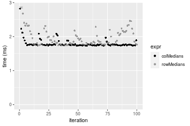


## Appendix

### Session information
```r
R version 4.1.1 Patched (2021-08-10 r80727)
Platform: x86_64-pc-linux-gnu (64-bit)
Running under: Ubuntu 18.04.5 LTS

Matrix products: default
BLAS:   /home/hb/software/R-devel/R-4-1-branch/lib/R/lib/libRblas.so
LAPACK: /home/hb/software/R-devel/R-4-1-branch/lib/R/lib/libRlapack.so

locale:
 [1] LC_CTYPE=en_US.UTF-8       LC_NUMERIC=C              
 [3] LC_TIME=en_US.UTF-8        LC_COLLATE=en_US.UTF-8    
 [5] LC_MONETARY=en_US.UTF-8    LC_MESSAGES=en_US.UTF-8   
 [7] LC_PAPER=en_US.UTF-8       LC_NAME=C                 
 [9] LC_ADDRESS=C               LC_TELEPHONE=C            
[11] LC_MEASUREMENT=en_US.UTF-8 LC_IDENTIFICATION=C       

attached base packages:
[1] stats     graphics  grDevices utils     datasets  methods   base     

other attached packages:
[1] microbenchmark_1.4-7   matrixStats_0.60.1     ggplot2_3.3.5         
[4] knitr_1.33             R.devices_2.17.0       R.utils_2.10.1        
[7] R.oo_1.24.0            R.methodsS3_1.8.1-9001 history_0.0.1-9000    

loaded via a namespace (and not attached):
 [1] Biobase_2.52.0          httr_1.4.2              splines_4.1.1          
 [4] bit64_4.0.5             network_1.17.1          assertthat_0.2.1       
 [7] highr_0.9               stats4_4.1.1            blob_1.2.2             
[10] GenomeInfoDbData_1.2.6  robustbase_0.93-8       pillar_1.6.2           
[13] RSQLite_2.2.8           lattice_0.20-44         glue_1.4.2             
[16] digest_0.6.27           XVector_0.32.0          colorspace_2.0-2       
[19] Matrix_1.3-4            XML_3.99-0.7            pkgconfig_2.0.3        
[22] zlibbioc_1.38.0         genefilter_1.74.0       purrr_0.3.4            
[25] ergm_4.1.2              xtable_1.8-4            scales_1.1.1           
[28] tibble_3.1.4            annotate_1.70.0         KEGGREST_1.32.0        
[31] farver_2.1.0            generics_0.1.0          IRanges_2.26.0         
[34] ellipsis_0.3.2          cachem_1.0.6            withr_2.4.2            
[37] BiocGenerics_0.38.0     mime_0.11               survival_3.2-13        
[40] magrittr_2.0.1          crayon_1.4.1            statnet.common_4.5.0   
[43] memoise_2.0.0           laeken_0.5.1            fansi_0.5.0            
[46] R.cache_0.15.0          MASS_7.3-54             R.rsp_0.44.0           
[49] progressr_0.8.0         tools_4.1.1             lifecycle_1.0.0        
[52] S4Vectors_0.30.0        trust_0.1-8             munsell_0.5.0          
[55] tabby_0.0.1-9001        AnnotationDbi_1.54.1    Biostrings_2.60.2      
[58] compiler_4.1.1          GenomeInfoDb_1.28.1     rlang_0.4.11           
[61] grid_4.1.1              RCurl_1.98-1.4          cwhmisc_6.6            
[64] rappdirs_0.3.3          startup_0.15.0          labeling_0.4.2         
[67] bitops_1.0-7            base64enc_0.1-3         boot_1.3-28            
[70] gtable_0.3.0            DBI_1.1.1               markdown_1.1           
[73] R6_2.5.1                lpSolveAPI_5.5.2.0-17.7 rle_0.9.2              
[76] dplyr_1.0.7             fastmap_1.1.0           bit_4.0.4              
[79] utf8_1.2.2              parallel_4.1.1          Rcpp_1.0.7             
[82] vctrs_0.3.8             png_0.1-7               DEoptimR_1.0-9         
[85] tidyselect_1.1.1        xfun_0.25               coda_0.19-4            
```
Total processing time was 49.41 secs.


### Reproducibility
To reproduce this report, do:
```r
html <- matrixStats:::benchmark('colMedians')
```

[RSP]: https://cran.r-project.org/package=R.rsp
[matrixStats]: https://cran.r-project.org/package=matrixStats

[StackOverflow:colMins?]: https://stackoverflow.com/questions/13676878 "Stack Overflow: fastest way to get Min from every column in a matrix?"
[StackOverflow:colSds?]: https://stackoverflow.com/questions/17549762 "Stack Overflow: Is there such 'colsd' in R?"
[StackOverflow:rowProds?]: https://stackoverflow.com/questions/20198801/ "Stack Overflow: Row product of matrix and column sum of matrix"

---------------------------------------
Copyright Henrik Bengtsson. Last updated on 2021-08-25 18:07:32 (+0200 UTC). Powered by [RSP].

<script>
 var link = document.createElement('link');
 link.rel = 'icon';
 link.href = "data:image/png;base64,iVBORw0KGgoAAAANSUhEUgAAACAAAAAgCAMAAABEpIrGAAAA21BMVEUAAAAAAP8AAP8AAP8AAP8AAP8AAP8AAP8AAP8AAP8AAP8AAP8AAP8AAP8AAP8AAP8AAP8AAP8AAP8AAP8AAP8AAP8AAP8AAP8AAP8AAP8AAP8AAP8AAP8AAP8AAP8AAP8AAP8AAP8AAP8AAP8AAP8AAP8AAP8AAP8AAP8AAP8BAf4CAv0DA/wdHeIeHuEfH+AgIN8hId4lJdomJtknJ9g+PsE/P8BAQL9yco10dIt1dYp3d4h4eIeVlWqWlmmXl2iYmGeZmWabm2Tn5xjo6Bfp6Rb39wj4+Af//wA2M9hbAAAASXRSTlMAAQIJCgsMJSYnKD4/QGRlZmhpamtsbautrrCxuru8y8zN5ebn6Pn6+///////////////////////////////////////////LsUNcQAAAS9JREFUOI29k21XgkAQhVcFytdSMqMETU26UVqGmpaiFbL//xc1cAhhwVNf6n5i5z67M2dmYOyfJZUqlVLhkKucG7cgmUZTybDz6g0iDeq51PUr37Ds2cy2/C9NeES5puDjxuUk1xnToZsg8pfA3avHQ3lLIi7iWRrkv/OYtkScxBIMgDee0ALoyxHQBJ68JLCjOtQIMIANF7QG9G9fNnHvisCHBVMKgSJgiz7nE+AoBKrAPA3MgepvgR9TSCasrCKH0eB1wBGBFdCO+nAGjMVGPcQb5bd6mQRegN6+1axOs9nGfYcCtfi4NQosdtH7dB+txFIpXQqN1p9B/asRHToyS0jRgpV7nk4nwcq1BJ+x3Gl/v7S9Wmpp/aGquum7w3ZDyrADFYrl8vHBH+ev9AUASW1dmU4h4wAAAABJRU5ErkJggg=="
 document.getElementsByTagName('head')[0].appendChild(link);
</script>


