[matrixStats]: Benchmark report

---------------------------------------


# colMins() and rowMins() benchmarks

This report benchmark the performance of colMins() and rowMins() against alternative methods.

## Alternative methods

* apply() + min()
* lapply() + pmin()
* lapply() + pmin.int()

See also [StackOverflow:colMins?].


## Data type "integer"

### Data
```r
> rmatrix <- function(nrow, ncol, mode = c("logical", "double", "integer", "index"), range = c(-100, 
+     +100), na_prob = 0) {
+     mode <- match.arg(mode)
+     n <- nrow * ncol
+     if (mode == "logical") {
+         x <- sample(c(FALSE, TRUE), size = n, replace = TRUE)
+     }     else if (mode == "index") {
+         x <- seq_len(n)
+         mode <- "integer"
+     }     else {
+         x <- runif(n, min = range[1], max = range[2])
+     }
+     storage.mode(x) <- mode
+     if (na_prob > 0) 
+         x[sample(n, size = na_prob * n)] <- NA
+     dim(x) <- c(nrow, ncol)
+     x
+ }
> rmatrices <- function(scale = 10, seed = 1, ...) {
+     set.seed(seed)
+     data <- list()
+     data[[1]] <- rmatrix(nrow = scale * 1, ncol = scale * 1, ...)
+     data[[2]] <- rmatrix(nrow = scale * 10, ncol = scale * 10, ...)
+     data[[3]] <- rmatrix(nrow = scale * 100, ncol = scale * 1, ...)
+     data[[4]] <- t(data[[3]])
+     data[[5]] <- rmatrix(nrow = scale * 10, ncol = scale * 100, ...)
+     data[[6]] <- t(data[[5]])
+     names(data) <- sapply(data, FUN = function(x) paste(dim(x), collapse = "x"))
+     data
+ }
> data <- rmatrices(mode = mode)
```

### Results

#### 10x10 integer matrix


```r
> X <- data[["10x10"]]
> gc()
          used  (Mb) gc trigger  (Mb) max used  (Mb)
Ncells 5209533 278.3   10014072 534.9 10014072 534.9
Vcells 9850412  75.2   18204443 138.9 18204443 138.9
> colStats <- microbenchmark(colMins = colMins(X, na.rm = FALSE), `apply+min` = apply(X, MARGIN = 2L, 
+     FUN = min, na.rm = FALSE), `lapply+pmin` = do.call(pmin, lapply(seq_len(nrow(X)), function(i) X[i, 
+     ])), `lapply+pmin.int` = do.call(pmin.int, lapply(seq_len(nrow(X)), function(i) X[i, ])), unit = "ms")
> X <- t(X)
> gc()
          used  (Mb) gc trigger  (Mb) max used  (Mb)
Ncells 5194209 277.5   10014072 534.9 10014072 534.9
Vcells 9800145  74.8   18204443 138.9 18204443 138.9
> rowStats <- microbenchmark(rowMins = rowMins(X, na.rm = FALSE), `apply+min` = apply(X, MARGIN = 1L, 
+     FUN = min, na.rm = FALSE), `lapply+pmin` = do.call(pmin, lapply(seq_len(ncol(X)), function(i) X[, 
+     i])), `lapply+pmin.int` = do.call(pmin.int, lapply(seq_len(ncol(X)), function(i) X[, i])), unit = "ms")
```

_Table: Benchmarking of colMins(), apply+min(), lapply+pmin() and lapply+pmin.int() on integer+10x10 data. The top panel shows times in milliseconds and the bottom panel shows relative times._


|   |expr            |      min|       lq|      mean|    median|        uq|      max|
|:--|:---------------|--------:|--------:|---------:|---------:|---------:|--------:|
|1  |colMins         | 0.001881| 0.002376| 0.0030287| 0.0029770| 0.0034060| 0.013751|
|4  |lapply+pmin.int | 0.018720| 0.020065| 0.0217312| 0.0207935| 0.0218595| 0.062726|
|3  |lapply+pmin     | 0.030235| 0.032323| 0.0338838| 0.0334275| 0.0344485| 0.053214|
|2  |apply+min       | 0.032415| 0.034538| 0.0373384| 0.0362915| 0.0377775| 0.091371|


|   |expr            |       min|        lq|      mean|    median|        uq|      max|
|:--|:---------------|---------:|---------:|---------:|---------:|---------:|--------:|
|1  |colMins         |  1.000000|  1.000000|  1.000000|  1.000000|  1.000000| 1.000000|
|4  |lapply+pmin.int |  9.952153|  8.444865|  7.175092|  6.984716|  6.417939| 4.561559|
|3  |lapply+pmin     | 16.073897| 13.603956| 11.187572| 11.228586| 10.114063| 3.869828|
|2  |apply+min       | 17.232855| 14.536195| 12.328180| 12.190628| 11.091456| 6.644680|

_Table: Benchmarking of rowMins(), apply+min(), lapply+pmin() and lapply+pmin.int() on integer+10x10 data (transposed). The top panel shows times in milliseconds and the bottom panel shows relative times._


|   |expr            |      min|        lq|      mean|    median|        uq|      max|
|:--|:---------------|--------:|---------:|---------:|---------:|---------:|--------:|
|1  |rowMins         | 0.001987| 0.0024280| 0.0031253| 0.0030635| 0.0034290| 0.014140|
|4  |lapply+pmin.int | 0.017871| 0.0195150| 0.0206159| 0.0202090| 0.0214705| 0.028348|
|3  |lapply+pmin     | 0.029545| 0.0317250| 0.0342889| 0.0335890| 0.0348280| 0.079076|
|2  |apply+min       | 0.032704| 0.0358625| 0.0379725| 0.0367685| 0.0382950| 0.089467|


|   |expr            |       min|        lq|     mean|    median|        uq|      max|
|:--|:---------------|---------:|---------:|--------:|---------:|---------:|--------:|
|1  |rowMins         |  1.000000|  1.000000|  1.00000|  1.000000|  1.000000| 1.000000|
|4  |lapply+pmin.int |  8.993961|  8.037479|  6.59651|  6.596703|  6.261446| 2.004809|
|3  |lapply+pmin     | 14.869150| 13.066310| 10.97146| 10.964257| 10.156897| 5.592362|
|2  |apply+min       | 16.458983| 14.770387| 12.15010| 12.002122| 11.167979| 6.327228|

_Figure: Benchmarking of colMins(), apply+min(), lapply+pmin() and lapply+pmin.int() on integer+10x10 data  as well as rowMins(), apply+min(), lapply+pmin() and lapply+pmin.int() on the same data transposed.  Outliers are displayed as crosses.  Times are in milliseconds._


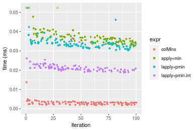


_Table: Benchmarking of colMins() and rowMins() on integer+10x10 data (original and transposed).  The top panel shows times in milliseconds and the bottom panel shows relative times._


|   |expr    |   min|    lq|    mean| median|    uq|    max|
|:--|:-------|-----:|-----:|-------:|------:|-----:|------:|
|1  |colMins | 1.881| 2.376| 3.02870| 2.9770| 3.406| 13.751|
|2  |rowMins | 1.987| 2.428| 3.12528| 3.0635| 3.429| 14.140|


|   |expr    |      min|       lq|     mean|   median|       uq|      max|
|:--|:-------|--------:|--------:|--------:|--------:|--------:|--------:|
|1  |colMins | 1.000000| 1.000000| 1.000000| 1.000000| 1.000000| 1.000000|
|2  |rowMins | 1.056353| 1.021886| 1.031888| 1.029056| 1.006753| 1.028289|

_Figure: Benchmarking of colMins() and rowMins() on integer+10x10 data (original and transposed).  Outliers are displayed as crosses. Times are in milliseconds._


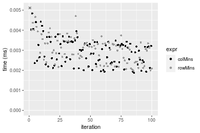

#### 100x100 integer matrix


```r
> X <- data[["100x100"]]
> gc()
          used  (Mb) gc trigger  (Mb) max used  (Mb)
Ncells 5192807 277.4   10014072 534.9 10014072 534.9
Vcells 9416923  71.9   18204443 138.9 18204443 138.9
> colStats <- microbenchmark(colMins = colMins(X, na.rm = FALSE), `apply+min` = apply(X, MARGIN = 2L, 
+     FUN = min, na.rm = FALSE), `lapply+pmin` = do.call(pmin, lapply(seq_len(nrow(X)), function(i) X[i, 
+     ])), `lapply+pmin.int` = do.call(pmin.int, lapply(seq_len(nrow(X)), function(i) X[i, ])), unit = "ms")
> X <- t(X)
> gc()
          used  (Mb) gc trigger  (Mb) max used  (Mb)
Ncells 5192783 277.4   10014072 534.9 10014072 534.9
Vcells 9422000  71.9   18204443 138.9 18204443 138.9
> rowStats <- microbenchmark(rowMins = rowMins(X, na.rm = FALSE), `apply+min` = apply(X, MARGIN = 1L, 
+     FUN = min, na.rm = FALSE), `lapply+pmin` = do.call(pmin, lapply(seq_len(ncol(X)), function(i) X[, 
+     i])), `lapply+pmin.int` = do.call(pmin.int, lapply(seq_len(ncol(X)), function(i) X[, i])), unit = "ms")
```

_Table: Benchmarking of colMins(), apply+min(), lapply+pmin() and lapply+pmin.int() on integer+100x100 data. The top panel shows times in milliseconds and the bottom panel shows relative times._


|   |expr            |      min|        lq|      mean|    median|        uq|      max|
|:--|:---------------|--------:|---------:|---------:|---------:|---------:|--------:|
|1  |colMins         | 0.019654| 0.0213150| 0.0244019| 0.0241465| 0.0261000| 0.044995|
|4  |lapply+pmin.int | 0.160198| 0.1686320| 0.1941036| 0.1882640| 0.2073890| 0.345667|
|2  |apply+min       | 0.160665| 0.1721650| 0.1991356| 0.1940465| 0.2127985| 0.353598|
|3  |lapply+pmin     | 0.214467| 0.2253825| 0.2606918| 0.2539615| 0.2786745| 0.405193|


|   |expr            |       min|        lq|      mean|    median|        uq|      max|
|:--|:---------------|---------:|---------:|---------:|---------:|---------:|--------:|
|1  |colMins         |  1.000000|  1.000000|  1.000000|  1.000000|  1.000000| 1.000000|
|4  |lapply+pmin.int |  8.150911|  7.911424|  7.954447|  7.796741|  7.945939| 7.682342|
|2  |apply+min       |  8.174672|  8.077176|  8.160661|  8.036216|  8.153199| 7.858606|
|3  |lapply+pmin     | 10.912130| 10.573892| 10.683258| 10.517528| 10.677184| 9.005289|

_Table: Benchmarking of rowMins(), apply+min(), lapply+pmin() and lapply+pmin.int() on integer+100x100 data (transposed). The top panel shows times in milliseconds and the bottom panel shows relative times._


|   |expr            |      min|        lq|      mean|    median|        uq|      max|
|:--|:---------------|--------:|---------:|---------:|---------:|---------:|--------:|
|1  |rowMins         | 0.029522| 0.0320245| 0.0373793| 0.0370020| 0.0408360| 0.058732|
|4  |lapply+pmin.int | 0.136627| 0.1539585| 0.1723869| 0.1694105| 0.1807860| 0.276264|
|2  |apply+min       | 0.166463| 0.1806225| 0.2067034| 0.1950085| 0.2231190| 0.383651|
|3  |lapply+pmin     | 0.189154| 0.2099230| 0.2383021| 0.2341770| 0.2491975| 0.341817|


|   |expr            |      min|       lq|     mean|   median|       uq|      max|
|:--|:---------------|--------:|--------:|--------:|--------:|--------:|--------:|
|1  |rowMins         | 1.000000| 1.000000| 1.000000| 1.000000| 1.000000| 1.000000|
|4  |lapply+pmin.int | 4.627972| 4.807522| 4.611830| 4.578415| 4.427123| 4.703807|
|2  |apply+min       | 5.638609| 5.640135| 5.529892| 5.270215| 5.463782| 6.532231|
|3  |lapply+pmin     | 6.407222| 6.555075| 6.375244| 6.328766| 6.102397| 5.819945|

_Figure: Benchmarking of colMins(), apply+min(), lapply+pmin() and lapply+pmin.int() on integer+100x100 data  as well as rowMins(), apply+min(), lapply+pmin() and lapply+pmin.int() on the same data transposed.  Outliers are displayed as crosses.  Times are in milliseconds._


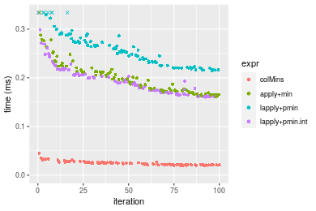

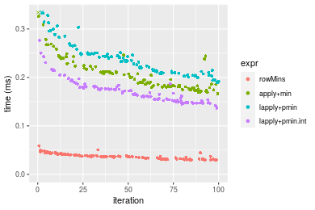
_Table: Benchmarking of colMins() and rowMins() on integer+100x100 data (original and transposed).  The top panel shows times in milliseconds and the bottom panel shows relative times._


|   |expr    |    min|      lq|     mean|  median|     uq|    max|
|:--|:-------|------:|-------:|--------:|-------:|------:|------:|
|1  |colMins | 19.654| 21.3150| 24.40190| 24.1465| 26.100| 44.995|
|2  |rowMins | 29.522| 32.0245| 37.37929| 37.0020| 40.836| 58.732|


|   |expr    |      min|      lq|     mean|   median|       uq|      max|
|:--|:-------|--------:|-------:|--------:|--------:|--------:|--------:|
|1  |colMins | 1.000000| 1.00000| 1.000000| 1.000000| 1.000000| 1.000000|
|2  |rowMins | 1.502086| 1.50244| 1.531819| 1.532396| 1.564598| 1.305301|

_Figure: Benchmarking of colMins() and rowMins() on integer+100x100 data (original and transposed).  Outliers are displayed as crosses. Times are in milliseconds._


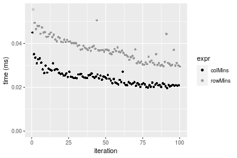

#### 1000x10 integer matrix


```r
> X <- data[["1000x10"]]
> gc()
          used  (Mb) gc trigger  (Mb) max used  (Mb)
Ncells 5193570 277.4   10014072 534.9 10014072 534.9
Vcells 9420701  71.9   18204443 138.9 18204443 138.9
> colStats <- microbenchmark(colMins = colMins(X, na.rm = FALSE), `apply+min` = apply(X, MARGIN = 2L, 
+     FUN = min, na.rm = FALSE), `lapply+pmin` = do.call(pmin, lapply(seq_len(nrow(X)), function(i) X[i, 
+     ])), `lapply+pmin.int` = do.call(pmin.int, lapply(seq_len(nrow(X)), function(i) X[i, ])), unit = "ms")
> X <- t(X)
> gc()
          used  (Mb) gc trigger  (Mb) max used  (Mb)
Ncells 5193546 277.4   10014072 534.9 10014072 534.9
Vcells 9425778  72.0   18204443 138.9 18204443 138.9
> rowStats <- microbenchmark(rowMins = rowMins(X, na.rm = FALSE), `apply+min` = apply(X, MARGIN = 1L, 
+     FUN = min, na.rm = FALSE), `lapply+pmin` = do.call(pmin, lapply(seq_len(ncol(X)), function(i) X[, 
+     i])), `lapply+pmin.int` = do.call(pmin.int, lapply(seq_len(ncol(X)), function(i) X[, i])), unit = "ms")
```

_Table: Benchmarking of colMins(), apply+min(), lapply+pmin() and lapply+pmin.int() on integer+1000x10 data. The top panel shows times in milliseconds and the bottom panel shows relative times._


|   |expr            |      min|       lq|      mean|    median|        uq|      max|
|:--|:---------------|--------:|--------:|---------:|---------:|---------:|--------:|
|1  |colMins         | 0.014656| 0.016717| 0.0186912| 0.0180540| 0.0194970| 0.033956|
|2  |apply+min       | 0.080647| 0.089326| 0.1003167| 0.0948125| 0.1037845| 0.221604|
|4  |lapply+pmin.int | 1.007980| 1.073615| 1.1685306| 1.0814435| 1.1163505| 6.285236|
|3  |lapply+pmin     | 1.486760| 1.612399| 1.6603517| 1.6262675| 1.6622275| 2.358115|


|   |expr            |        min|        lq|      mean|    median|        uq|       max|
|:--|:---------------|----------:|---------:|---------:|---------:|---------:|---------:|
|1  |colMins         |   1.000000|  1.000000|  1.000000|  1.000000|  1.000000|   1.00000|
|2  |apply+min       |   5.502661|  5.343423|  5.367065|  5.251606|  5.323101|   6.52621|
|4  |lapply+pmin.int |  68.775928| 64.222947| 62.517790| 59.900493| 57.257552| 185.09942|
|3  |lapply+pmin     | 101.443777| 96.452683| 88.830808| 90.077961| 85.255552|  69.44620|

_Table: Benchmarking of rowMins(), apply+min(), lapply+pmin() and lapply+pmin.int() on integer+1000x10 data (transposed). The top panel shows times in milliseconds and the bottom panel shows relative times._


|   |expr            |      min|        lq|      mean|    median|        uq|      max|
|:--|:---------------|--------:|---------:|---------:|---------:|---------:|--------:|
|1  |rowMins         | 0.026993| 0.0280775| 0.0311703| 0.0296535| 0.0312930| 0.057810|
|2  |apply+min       | 0.080805| 0.0887310| 0.1000355| 0.0928875| 0.1087165| 0.188381|
|4  |lapply+pmin.int | 0.954939| 1.0364580| 1.0826420| 1.0596370| 1.0814220| 1.640138|
|3  |lapply+pmin     | 1.437896| 1.5858070| 1.6852460| 1.6037405| 1.6321740| 6.649599|


|   |expr            |       min|        lq|      mean|   median|        uq|        max|
|:--|:---------------|---------:|---------:|---------:|--------:|---------:|----------:|
|1  |rowMins         |  1.000000|  1.000000|  1.000000|  1.00000|  1.000000|   1.000000|
|2  |apply+min       |  2.993554|  3.160217|  3.209322|  3.13243|  3.474148|   3.258623|
|4  |lapply+pmin.int | 35.377283| 36.914184| 34.733150| 35.73396| 34.557952|  28.371181|
|3  |lapply+pmin     | 53.269218| 56.479637| 54.065797| 54.08267| 52.157799| 115.025065|

_Figure: Benchmarking of colMins(), apply+min(), lapply+pmin() and lapply+pmin.int() on integer+1000x10 data  as well as rowMins(), apply+min(), lapply+pmin() and lapply+pmin.int() on the same data transposed.  Outliers are displayed as crosses.  Times are in milliseconds._


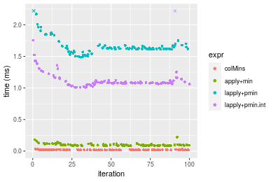

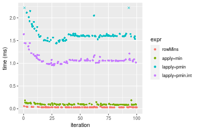
_Table: Benchmarking of colMins() and rowMins() on integer+1000x10 data (original and transposed).  The top panel shows times in milliseconds and the bottom panel shows relative times._


|   |expr    |    min|      lq|     mean|  median|     uq|    max|
|:--|:-------|------:|-------:|--------:|-------:|------:|------:|
|1  |colMins | 14.656| 16.7170| 18.69117| 18.0540| 19.497| 33.956|
|2  |rowMins | 26.993| 28.0775| 31.17028| 29.6535| 31.293| 57.810|


|   |expr    |      min|       lq|     mean|   median|       uq|      max|
|:--|:-------|--------:|--------:|--------:|--------:|--------:|--------:|
|1  |colMins | 1.000000| 1.000000| 1.000000| 1.000000| 1.000000| 1.000000|
|2  |rowMins | 1.841771| 1.679578| 1.667647| 1.642489| 1.605016| 1.702497|

_Figure: Benchmarking of colMins() and rowMins() on integer+1000x10 data (original and transposed).  Outliers are displayed as crosses. Times are in milliseconds._


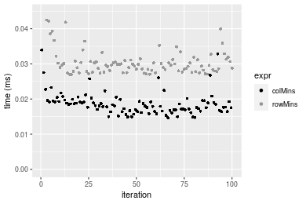

#### 10x1000 integer matrix


```r
> X <- data[["10x1000"]]
> gc()
          used  (Mb) gc trigger  (Mb) max used  (Mb)
Ncells 5193793 277.4   10014072 534.9 10014072 534.9
Vcells 9421602  71.9   18204443 138.9 18204443 138.9
> colStats <- microbenchmark(colMins = colMins(X, na.rm = FALSE), `apply+min` = apply(X, MARGIN = 2L, 
+     FUN = min, na.rm = FALSE), `lapply+pmin` = do.call(pmin, lapply(seq_len(nrow(X)), function(i) X[i, 
+     ])), `lapply+pmin.int` = do.call(pmin.int, lapply(seq_len(nrow(X)), function(i) X[i, ])), unit = "ms")
> X <- t(X)
> gc()
          used  (Mb) gc trigger  (Mb) max used  (Mb)
Ncells 5193769 277.4   10014072 534.9 10014072 534.9
Vcells 9426679  72.0   18204443 138.9 18204443 138.9
> rowStats <- microbenchmark(rowMins = rowMins(X, na.rm = FALSE), `apply+min` = apply(X, MARGIN = 1L, 
+     FUN = min, na.rm = FALSE), `lapply+pmin` = do.call(pmin, lapply(seq_len(ncol(X)), function(i) X[, 
+     i])), `lapply+pmin.int` = do.call(pmin.int, lapply(seq_len(ncol(X)), function(i) X[, i])), unit = "ms")
```

_Table: Benchmarking of colMins(), apply+min(), lapply+pmin() and lapply+pmin.int() on integer+10x1000 data. The top panel shows times in milliseconds and the bottom panel shows relative times._


|   |expr            |      min|        lq|      mean|    median|        uq|      max|
|:--|:---------------|--------:|---------:|---------:|---------:|---------:|--------:|
|1  |colMins         | 0.039141| 0.0412585| 0.0468416| 0.0427380| 0.0504755| 0.079078|
|4  |lapply+pmin.int | 0.084736| 0.0864785| 0.0969350| 0.0895600| 0.1056655| 0.145896|
|3  |lapply+pmin     | 0.093023| 0.0962140| 0.1107725| 0.0988795| 0.1206440| 0.204010|
|2  |apply+min       | 0.921527| 0.9439050| 1.0365971| 0.9677025| 1.1035095| 1.524205|


|   |expr            |       min|        lq|      mean|    median|        uq|       max|
|:--|:---------------|---------:|---------:|---------:|---------:|---------:|---------:|
|1  |colMins         |  1.000000|  1.000000|  1.000000|  1.000000|  1.000000|  1.000000|
|4  |lapply+pmin.int |  2.164891|  2.096017|  2.069421|  2.095559|  2.093402|  1.844963|
|3  |lapply+pmin     |  2.376613|  2.331980|  2.364831|  2.313620|  2.390150|  2.579858|
|2  |apply+min       | 23.543778| 22.877831| 22.129836| 22.642672| 21.862280| 19.274704|

_Table: Benchmarking of rowMins(), apply+min(), lapply+pmin() and lapply+pmin.int() on integer+10x1000 data (transposed). The top panel shows times in milliseconds and the bottom panel shows relative times._


|   |expr            |      min|        lq|      mean|    median|       uq|      max|
|:--|:---------------|--------:|---------:|---------:|---------:|--------:|--------:|
|1  |rowMins         | 0.039345| 0.0409905| 0.0460683| 0.0422380| 0.050630| 0.087668|
|4  |lapply+pmin.int | 0.063032| 0.0658240| 0.0776262| 0.0705685| 0.085594| 0.124922|
|3  |lapply+pmin     | 0.071323| 0.0747700| 0.0847385| 0.0775885| 0.094293| 0.133248|
|2  |apply+min       | 0.915830| 0.9341465| 1.0379776| 0.9758850| 1.120011| 1.545451|


|   |expr            |       min|        lq|      mean|    median|        uq|       max|
|:--|:---------------|---------:|---------:|---------:|---------:|---------:|---------:|
|1  |rowMins         |  1.000000|  1.000000|  1.000000|  1.000000|  1.000000|  1.000000|
|4  |lapply+pmin.int |  1.602033|  1.605835|  1.685026|  1.670735|  1.690579|  1.424944|
|3  |lapply+pmin     |  1.812759|  1.824081|  1.839411|  1.836936|  1.862394|  1.519916|
|2  |apply+min       | 23.276909| 22.789341| 22.531295| 23.104432| 22.121499| 17.628450|

_Figure: Benchmarking of colMins(), apply+min(), lapply+pmin() and lapply+pmin.int() on integer+10x1000 data  as well as rowMins(), apply+min(), lapply+pmin() and lapply+pmin.int() on the same data transposed.  Outliers are displayed as crosses.  Times are in milliseconds._


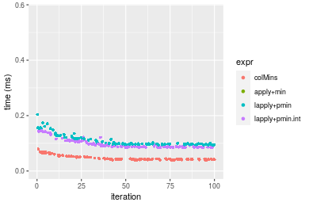

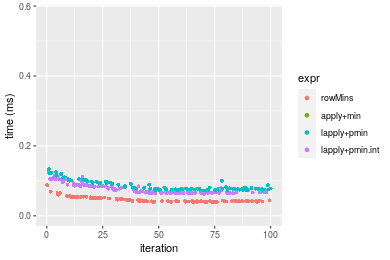
_Table: Benchmarking of colMins() and rowMins() on integer+10x1000 data (original and transposed).  The top panel shows times in milliseconds and the bottom panel shows relative times._


|   |expr    |    min|      lq|     mean| median|      uq|    max|
|:--|:-------|------:|-------:|--------:|------:|-------:|------:|
|2  |rowMins | 39.345| 40.9905| 46.06826| 42.238| 50.6300| 87.668|
|1  |colMins | 39.141| 41.2585| 46.84161| 42.738| 50.4755| 79.078|


|   |expr    |       min|       lq|     mean|   median|        uq|       max|
|:--|:-------|---------:|--------:|--------:|--------:|---------:|---------:|
|2  |rowMins | 1.0000000| 1.000000| 1.000000| 1.000000| 1.0000000| 1.0000000|
|1  |colMins | 0.9948151| 1.006538| 1.016787| 1.011838| 0.9969484| 0.9020167|

_Figure: Benchmarking of colMins() and rowMins() on integer+10x1000 data (original and transposed).  Outliers are displayed as crosses. Times are in milliseconds._


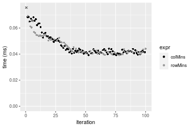

#### 100x1000 integer matrix


```r
> X <- data[["100x1000"]]
> gc()
          used  (Mb) gc trigger  (Mb) max used  (Mb)
Ncells 5194024 277.4   10014072 534.9 10014072 534.9
Vcells 9422222  71.9   18204443 138.9 18204443 138.9
> colStats <- microbenchmark(colMins = colMins(X, na.rm = FALSE), `apply+min` = apply(X, MARGIN = 2L, 
+     FUN = min, na.rm = FALSE), `lapply+pmin` = do.call(pmin, lapply(seq_len(nrow(X)), function(i) X[i, 
+     ])), `lapply+pmin.int` = do.call(pmin.int, lapply(seq_len(nrow(X)), function(i) X[i, ])), unit = "ms")
> X <- t(X)
> gc()
          used  (Mb) gc trigger  (Mb) max used  (Mb)
Ncells 5194000 277.4   10014072 534.9 10014072 534.9
Vcells 9472299  72.3   18204443 138.9 18204443 138.9
> rowStats <- microbenchmark(rowMins = rowMins(X, na.rm = FALSE), `apply+min` = apply(X, MARGIN = 1L, 
+     FUN = min, na.rm = FALSE), `lapply+pmin` = do.call(pmin, lapply(seq_len(ncol(X)), function(i) X[, 
+     i])), `lapply+pmin.int` = do.call(pmin.int, lapply(seq_len(ncol(X)), function(i) X[, i])), unit = "ms")
```

_Table: Benchmarking of colMins(), apply+min(), lapply+pmin() and lapply+pmin.int() on integer+100x1000 data. The top panel shows times in milliseconds and the bottom panel shows relative times._


|   |expr            |      min|        lq|      mean|    median|        uq|       max|
|:--|:---------------|--------:|---------:|---------:|---------:|---------:|---------:|
|1  |colMins         | 0.185650| 0.1873925| 0.2062883| 0.1918805| 0.2280150|  0.292182|
|4  |lapply+pmin.int | 0.707543| 0.7212035| 0.9021374| 0.7505005| 0.9005805|  9.363286|
|3  |lapply+pmin     | 0.767026| 0.7760820| 1.0520783| 0.8397920| 0.9600860| 10.295336|
|2  |apply+min       | 1.482912| 1.5299940| 1.7995073| 1.6025090| 1.8335920| 11.404230|


|   |expr            |      min|       lq|     mean|   median|       uq|      max|
|:--|:---------------|--------:|--------:|--------:|--------:|--------:|--------:|
|1  |colMins         | 1.000000| 1.000000| 1.000000| 1.000000| 1.000000|  1.00000|
|4  |lapply+pmin.int | 3.811166| 3.848625| 4.373187| 3.911291| 3.949655| 32.04607|
|3  |lapply+pmin     | 4.131570| 4.141478| 5.100038| 4.376641| 4.210627| 35.23604|
|2  |apply+min       | 7.987676| 8.164649| 8.723263| 8.351599| 8.041541| 39.03125|

_Table: Benchmarking of rowMins(), apply+min(), lapply+pmin() and lapply+pmin.int() on integer+100x1000 data (transposed). The top panel shows times in milliseconds and the bottom panel shows relative times._


|   |expr            |      min|        lq|      mean|   median|        uq|       max|
|:--|:---------------|--------:|---------:|---------:|--------:|---------:|---------:|
|1  |rowMins         | 0.263564| 0.2657680| 0.2927690| 0.277732| 0.3143050|  0.409585|
|4  |lapply+pmin.int | 0.481661| 0.4914205| 0.9171273| 0.532312| 0.6132140| 10.064030|
|3  |lapply+pmin     | 0.536747| 0.5455670| 0.6033615| 0.578350| 0.6529155|  0.792068|
|2  |apply+min       | 1.488752| 1.5312710| 1.7151721| 1.616256| 1.8550240|  2.860291|


|   |expr            |      min|       lq|     mean|   median|       uq|       max|
|:--|:---------------|--------:|--------:|--------:|--------:|--------:|---------:|
|1  |rowMins         | 1.000000| 1.000000| 1.000000| 1.000000| 1.000000|  1.000000|
|4  |lapply+pmin.int | 1.827492| 1.849058| 3.132598| 1.916639| 1.951016| 24.571286|
|3  |lapply+pmin     | 2.036496| 2.052794| 2.060879| 2.082403| 2.077331|  1.933831|
|2  |apply+min       | 5.648541| 5.761683| 5.858449| 5.819483| 5.901987|  6.983388|

_Figure: Benchmarking of colMins(), apply+min(), lapply+pmin() and lapply+pmin.int() on integer+100x1000 data  as well as rowMins(), apply+min(), lapply+pmin() and lapply+pmin.int() on the same data transposed.  Outliers are displayed as crosses.  Times are in milliseconds._


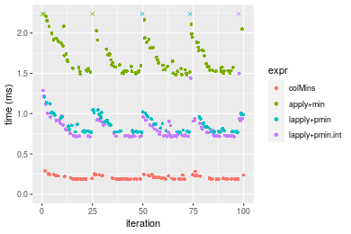

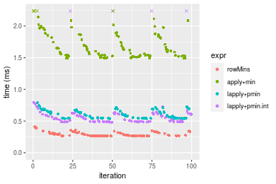
_Table: Benchmarking of colMins() and rowMins() on integer+100x1000 data (original and transposed).  The top panel shows times in milliseconds and the bottom panel shows relative times._


|   |expr    |     min|       lq|     mean|   median|      uq|     max|
|:--|:-------|-------:|--------:|--------:|--------:|-------:|-------:|
|1  |colMins | 185.650| 187.3925| 206.2883| 191.8805| 228.015| 292.182|
|2  |rowMins | 263.564| 265.7680| 292.7690| 277.7320| 314.305| 409.585|


|   |expr    |      min|       lq|     mean|   median|      uq|      max|
|:--|:-------|--------:|--------:|--------:|--------:|-------:|--------:|
|1  |colMins | 1.000000| 1.000000| 1.000000| 1.000000| 1.00000| 1.000000|
|2  |rowMins | 1.419682| 1.418243| 1.419222| 1.447422| 1.37844| 1.401815|

_Figure: Benchmarking of colMins() and rowMins() on integer+100x1000 data (original and transposed).  Outliers are displayed as crosses. Times are in milliseconds._


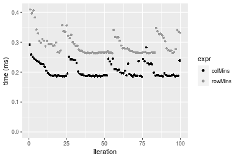

#### 1000x100 integer matrix


```r
> X <- data[["1000x100"]]
> gc()
          used  (Mb) gc trigger  (Mb) max used  (Mb)
Ncells 5194248 277.5   10014072 534.9 10014072 534.9
Vcells 9423018  71.9   18204443 138.9 18204443 138.9
> colStats <- microbenchmark(colMins = colMins(X, na.rm = FALSE), `apply+min` = apply(X, MARGIN = 2L, 
+     FUN = min, na.rm = FALSE), `lapply+pmin` = do.call(pmin, lapply(seq_len(nrow(X)), function(i) X[i, 
+     ])), `lapply+pmin.int` = do.call(pmin.int, lapply(seq_len(nrow(X)), function(i) X[i, ])), unit = "ms")
> X <- t(X)
> gc()
          used  (Mb) gc trigger  (Mb) max used  (Mb)
Ncells 5194224 277.5   10014072 534.9 10014072 534.9
Vcells 9473095  72.3   18204443 138.9 18204443 138.9
> rowStats <- microbenchmark(rowMins = rowMins(X, na.rm = FALSE), `apply+min` = apply(X, MARGIN = 1L, 
+     FUN = min, na.rm = FALSE), `lapply+pmin` = do.call(pmin, lapply(seq_len(ncol(X)), function(i) X[, 
+     i])), `lapply+pmin.int` = do.call(pmin.int, lapply(seq_len(ncol(X)), function(i) X[, i])), unit = "ms")
```

_Table: Benchmarking of colMins(), apply+min(), lapply+pmin() and lapply+pmin.int() on integer+1000x100 data. The top panel shows times in milliseconds and the bottom panel shows relative times._


|   |expr            |      min|        lq|      mean|    median|        uq|       max|
|:--|:---------------|--------:|---------:|---------:|---------:|---------:|---------:|
|1  |colMins         | 0.136439| 0.1387000| 0.1489298| 0.1427870| 0.1546490|  0.219964|
|2  |apply+min       | 0.665717| 0.6828785| 1.0802009| 0.7069695| 0.7949895| 12.847117|
|4  |lapply+pmin.int | 1.562724| 1.6053340| 1.8494242| 1.6353430| 1.7941170| 14.122631|
|3  |lapply+pmin     | 2.050852| 2.0983300| 2.2399921| 2.1551850| 2.3355755|  3.088615|


|   |expr            |       min|        lq|      mean|    median|        uq|      max|
|:--|:---------------|---------:|---------:|---------:|---------:|---------:|--------:|
|1  |colMins         |  1.000000|  1.000000|  1.000000|  1.000000|  1.000000|  1.00000|
|2  |apply+min       |  4.879228|  4.923421|  7.253088|  4.951218|  5.140606| 58.40554|
|4  |lapply+pmin.int | 11.453646| 11.574146| 12.418094| 11.453024| 11.601219| 64.20428|
|3  |lapply+pmin     | 15.031274| 15.128551| 15.040590| 15.093706| 15.102429| 14.04146|

_Table: Benchmarking of rowMins(), apply+min(), lapply+pmin() and lapply+pmin.int() on integer+1000x100 data (transposed). The top panel shows times in milliseconds and the bottom panel shows relative times._


|   |expr            |      min|        lq|      mean|    median|       uq|       max|
|:--|:---------------|--------:|---------:|---------:|---------:|--------:|---------:|
|1  |rowMins         | 0.245008| 0.2489565| 0.2642917| 0.2536455| 0.261823|  0.412794|
|2  |apply+min       | 0.669306| 0.6820480| 0.8559032| 0.6960275| 0.760583| 11.695480|
|4  |lapply+pmin.int | 1.341535| 1.3775335| 1.6948325| 1.4075390| 1.557908| 12.310588|
|3  |lapply+pmin     | 1.828385| 1.8854725| 2.1552735| 1.9417325| 2.130387| 14.160358|


|   |expr            |      min|       lq|     mean|   median|       uq|      max|
|:--|:---------------|--------:|--------:|--------:|--------:|--------:|--------:|
|1  |rowMins         | 1.000000| 1.000000| 1.000000| 1.000000| 1.000000|  1.00000|
|2  |apply+min       | 2.731772| 2.739627| 3.238479| 2.744096| 2.904951| 28.33249|
|4  |lapply+pmin.int | 5.475474| 5.533230| 6.412735| 5.549237| 5.950232| 29.82259|
|3  |lapply+pmin     | 7.462552| 7.573502| 8.154905| 7.655300| 8.136747| 34.30369|

_Figure: Benchmarking of colMins(), apply+min(), lapply+pmin() and lapply+pmin.int() on integer+1000x100 data  as well as rowMins(), apply+min(), lapply+pmin() and lapply+pmin.int() on the same data transposed.  Outliers are displayed as crosses.  Times are in milliseconds._


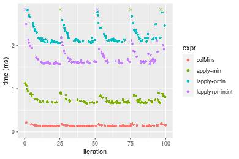

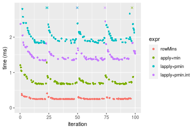
_Table: Benchmarking of colMins() and rowMins() on integer+1000x100 data (original and transposed).  The top panel shows times in milliseconds and the bottom panel shows relative times._


|   |expr    |     min|       lq|     mean|   median|      uq|     max|
|:--|:-------|-------:|--------:|--------:|--------:|-------:|-------:|
|1  |colMins | 136.439| 138.7000| 148.9298| 142.7870| 154.649| 219.964|
|2  |rowMins | 245.008| 248.9565| 264.2917| 253.6455| 261.823| 412.794|


|   |expr    |      min|       lq|     mean|   median|       uq|      max|
|:--|:-------|--------:|--------:|--------:|--------:|--------:|--------:|
|1  |colMins | 1.000000| 1.000000| 1.000000| 1.000000| 1.000000| 1.000000|
|2  |rowMins | 1.795733| 1.794928| 1.774606| 1.776391| 1.693015| 1.876643|

_Figure: Benchmarking of colMins() and rowMins() on integer+1000x100 data (original and transposed).  Outliers are displayed as crosses. Times are in milliseconds._


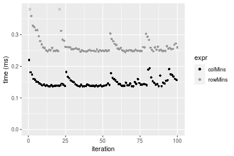


## Data type "double"

### Data
```r
> rmatrix <- function(nrow, ncol, mode = c("logical", "double", "integer", "index"), range = c(-100, 
+     +100), na_prob = 0) {
+     mode <- match.arg(mode)
+     n <- nrow * ncol
+     if (mode == "logical") {
+         x <- sample(c(FALSE, TRUE), size = n, replace = TRUE)
+     }     else if (mode == "index") {
+         x <- seq_len(n)
+         mode <- "integer"
+     }     else {
+         x <- runif(n, min = range[1], max = range[2])
+     }
+     storage.mode(x) <- mode
+     if (na_prob > 0) 
+         x[sample(n, size = na_prob * n)] <- NA
+     dim(x) <- c(nrow, ncol)
+     x
+ }
> rmatrices <- function(scale = 10, seed = 1, ...) {
+     set.seed(seed)
+     data <- list()
+     data[[1]] <- rmatrix(nrow = scale * 1, ncol = scale * 1, ...)
+     data[[2]] <- rmatrix(nrow = scale * 10, ncol = scale * 10, ...)
+     data[[3]] <- rmatrix(nrow = scale * 100, ncol = scale * 1, ...)
+     data[[4]] <- t(data[[3]])
+     data[[5]] <- rmatrix(nrow = scale * 10, ncol = scale * 100, ...)
+     data[[6]] <- t(data[[5]])
+     names(data) <- sapply(data, FUN = function(x) paste(dim(x), collapse = "x"))
+     data
+ }
> data <- rmatrices(mode = mode)
```

### Results

#### 10x10 double matrix


```r
> X <- data[["10x10"]]
> gc()
          used  (Mb) gc trigger  (Mb) max used  (Mb)
Ncells 5194479 277.5   10014072 534.9 10014072 534.9
Vcells 9538965  72.8   18204443 138.9 18204443 138.9
> colStats <- microbenchmark(colMins = colMins(X, na.rm = FALSE), `apply+min` = apply(X, MARGIN = 2L, 
+     FUN = min, na.rm = FALSE), `lapply+pmin` = do.call(pmin, lapply(seq_len(nrow(X)), function(i) X[i, 
+     ])), `lapply+pmin.int` = do.call(pmin.int, lapply(seq_len(nrow(X)), function(i) X[i, ])), unit = "ms")
> X <- t(X)
> gc()
          used  (Mb) gc trigger  (Mb) max used  (Mb)
Ncells 5194446 277.5   10014072 534.9 10014072 534.9
Vcells 9539127  72.8   18204443 138.9 18204443 138.9
> rowStats <- microbenchmark(rowMins = rowMins(X, na.rm = FALSE), `apply+min` = apply(X, MARGIN = 1L, 
+     FUN = min, na.rm = FALSE), `lapply+pmin` = do.call(pmin, lapply(seq_len(ncol(X)), function(i) X[, 
+     i])), `lapply+pmin.int` = do.call(pmin.int, lapply(seq_len(ncol(X)), function(i) X[, i])), unit = "ms")
```

_Table: Benchmarking of colMins(), apply+min(), lapply+pmin() and lapply+pmin.int() on double+10x10 data. The top panel shows times in milliseconds and the bottom panel shows relative times._


|   |expr            |      min|        lq|      mean|   median|       uq|      max|
|:--|:---------------|--------:|---------:|---------:|--------:|--------:|--------:|
|1  |colMins         | 0.001941| 0.0023205| 0.0030226| 0.003026| 0.003344| 0.014979|
|4  |lapply+pmin.int | 0.018728| 0.0203975| 0.0216808| 0.021137| 0.021913| 0.052418|
|3  |lapply+pmin     | 0.030071| 0.0329755| 0.0341832| 0.033674| 0.035039| 0.051007|
|2  |apply+min       | 0.032809| 0.0348035| 0.0377282| 0.036649| 0.038729| 0.092331|


|   |expr            |       min|        lq|      mean|    median|        uq|      max|
|:--|:---------------|---------:|---------:|---------:|---------:|---------:|--------:|
|1  |colMins         |  1.000000|  1.000000|  1.000000|  1.000000|  1.000000| 1.000000|
|4  |lapply+pmin.int |  9.648635|  8.790131|  7.172853|  6.985129|  6.552931| 3.499433|
|3  |lapply+pmin     | 15.492530| 14.210515| 11.309123| 11.128222| 10.478170| 3.405234|
|2  |apply+min       | 16.903143| 14.998276| 12.481946| 12.111368| 11.581639| 6.164030|

_Table: Benchmarking of rowMins(), apply+min(), lapply+pmin() and lapply+pmin.int() on double+10x10 data (transposed). The top panel shows times in milliseconds and the bottom panel shows relative times._


|   |expr            |      min|        lq|      mean|    median|        uq|      max|
|:--|:---------------|--------:|---------:|---------:|---------:|---------:|--------:|
|1  |rowMins         | 0.001975| 0.0023340| 0.0030720| 0.0029430| 0.0034570| 0.014762|
|4  |lapply+pmin.int | 0.017677| 0.0193330| 0.0205682| 0.0203865| 0.0212110| 0.033105|
|3  |lapply+pmin     | 0.029689| 0.0316615| 0.0336809| 0.0333110| 0.0345165| 0.075716|
|2  |apply+min       | 0.032152| 0.0355090| 0.0379456| 0.0369045| 0.0383575| 0.085965|


|   |expr            |      min|        lq|     mean|    median|        uq|      max|
|:--|:---------------|--------:|---------:|--------:|---------:|---------:|--------:|
|1  |rowMins         |  1.00000|  1.000000|  1.00000|  1.000000|  1.000000| 1.000000|
|4  |lapply+pmin.int |  8.95038|  8.283205|  6.69547|  6.927115|  6.135667| 2.242582|
|3  |lapply+pmin     | 15.03241| 13.565338| 10.96403| 11.318722|  9.984524| 5.129115|
|2  |apply+min       | 16.27949| 15.213796| 12.35230| 12.539755| 11.095603| 5.823398|

_Figure: Benchmarking of colMins(), apply+min(), lapply+pmin() and lapply+pmin.int() on double+10x10 data  as well as rowMins(), apply+min(), lapply+pmin() and lapply+pmin.int() on the same data transposed.  Outliers are displayed as crosses.  Times are in milliseconds._


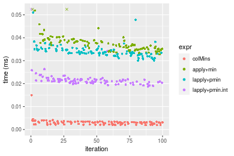

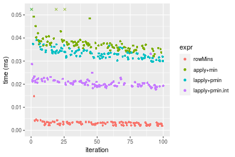
_Table: Benchmarking of colMins() and rowMins() on double+10x10 data (original and transposed).  The top panel shows times in milliseconds and the bottom panel shows relative times._


|   |expr    |   min|     lq|    mean| median|    uq|    max|
|:--|:-------|-----:|------:|-------:|------:|-----:|------:|
|2  |rowMins | 1.975| 2.3340| 3.07195|  2.943| 3.457| 14.762|
|1  |colMins | 1.941| 2.3205| 3.02262|  3.026| 3.344| 14.979|


|   |expr    |       min|        lq|      mean|   median|        uq|    max|
|:--|:-------|---------:|---------:|---------:|--------:|---------:|------:|
|2  |rowMins | 1.0000000| 1.0000000| 1.0000000| 1.000000| 1.0000000| 1.0000|
|1  |colMins | 0.9827848| 0.9942159| 0.9839418| 1.028202| 0.9673127| 1.0147|

_Figure: Benchmarking of colMins() and rowMins() on double+10x10 data (original and transposed).  Outliers are displayed as crosses. Times are in milliseconds._


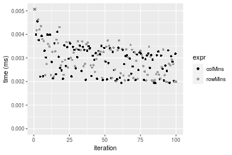

#### 100x100 double matrix


```r
> X <- data[["100x100"]]
> gc()
          used  (Mb) gc trigger  (Mb) max used  (Mb)
Ncells 5194698 277.5   10014072 534.9 10014072 534.9
Vcells 9540027  72.8   18204443 138.9 18204443 138.9
> colStats <- microbenchmark(colMins = colMins(X, na.rm = FALSE), `apply+min` = apply(X, MARGIN = 2L, 
+     FUN = min, na.rm = FALSE), `lapply+pmin` = do.call(pmin, lapply(seq_len(nrow(X)), function(i) X[i, 
+     ])), `lapply+pmin.int` = do.call(pmin.int, lapply(seq_len(nrow(X)), function(i) X[i, ])), unit = "ms")
> X <- t(X)
> gc()
          used  (Mb) gc trigger  (Mb) max used  (Mb)
Ncells 5194674 277.5   10014072 534.9 10014072 534.9
Vcells 9550104  72.9   18204443 138.9 18204443 138.9
> rowStats <- microbenchmark(rowMins = rowMins(X, na.rm = FALSE), `apply+min` = apply(X, MARGIN = 1L, 
+     FUN = min, na.rm = FALSE), `lapply+pmin` = do.call(pmin, lapply(seq_len(ncol(X)), function(i) X[, 
+     i])), `lapply+pmin.int` = do.call(pmin.int, lapply(seq_len(ncol(X)), function(i) X[, i])), unit = "ms")
```

_Table: Benchmarking of colMins(), apply+min(), lapply+pmin() and lapply+pmin.int() on double+100x100 data. The top panel shows times in milliseconds and the bottom panel shows relative times._


|   |expr            |      min|        lq|      mean|    median|        uq|      max|
|:--|:---------------|--------:|---------:|---------:|---------:|---------:|--------:|
|1  |colMins         | 0.023997| 0.0254045| 0.0297178| 0.0292165| 0.0316305| 0.065340|
|2  |apply+min       | 0.163506| 0.1740540| 0.2071458| 0.1940415| 0.2178715| 0.479581|
|4  |lapply+pmin.int | 0.173400| 0.1839185| 0.2155655| 0.2024915| 0.2292430| 0.436052|
|3  |lapply+pmin     | 0.227173| 0.2465195| 0.2822874| 0.2703045| 0.2989900| 0.534192|


|   |expr            |      min|       lq|     mean|   median|       uq|      max|
|:--|:---------------|--------:|--------:|--------:|--------:|--------:|--------:|
|1  |colMins         | 1.000000| 1.000000| 1.000000| 1.000000| 1.000000| 1.000000|
|2  |apply+min       | 6.813602| 6.851306| 6.970434| 6.641504| 6.888020| 7.339777|
|4  |lapply+pmin.int | 7.225903| 7.239603| 7.253758| 6.930724| 7.247530| 6.673584|
|3  |lapply+pmin     | 9.466725| 9.703773| 9.498945| 9.251776| 9.452585| 8.175574|

_Table: Benchmarking of rowMins(), apply+min(), lapply+pmin() and lapply+pmin.int() on double+100x100 data (transposed). The top panel shows times in milliseconds and the bottom panel shows relative times._


|   |expr            |      min|        lq|      mean|    median|        uq|      max|
|:--|:---------------|--------:|---------:|---------:|---------:|---------:|--------:|
|1  |rowMins         | 0.025617| 0.0288300| 0.0340365| 0.0335870| 0.0368610| 0.069859|
|4  |lapply+pmin.int | 0.142816| 0.1571095| 0.1780591| 0.1739455| 0.1882275| 0.304745|
|2  |apply+min       | 0.163109| 0.1757570| 0.2029982| 0.1959870| 0.2180095| 0.385182|
|3  |lapply+pmin     | 0.196610| 0.2168615| 0.2431410| 0.2388160| 0.2571075| 0.383113|


|   |expr            |      min|       lq|     mean|   median|       uq|      max|
|:--|:---------------|--------:|--------:|--------:|--------:|--------:|--------:|
|1  |rowMins         | 1.000000| 1.000000| 1.000000| 1.000000| 1.000000| 1.000000|
|4  |lapply+pmin.int | 5.575048| 5.449514| 5.231423| 5.178953| 5.106413| 4.362287|
|2  |apply+min       | 6.367217| 6.096323| 5.964140| 5.835204| 5.914367| 5.513706|
|3  |lapply+pmin     | 7.674982| 7.522078| 7.143547| 7.110370| 6.975055| 5.484089|

_Figure: Benchmarking of colMins(), apply+min(), lapply+pmin() and lapply+pmin.int() on double+100x100 data  as well as rowMins(), apply+min(), lapply+pmin() and lapply+pmin.int() on the same data transposed.  Outliers are displayed as crosses.  Times are in milliseconds._


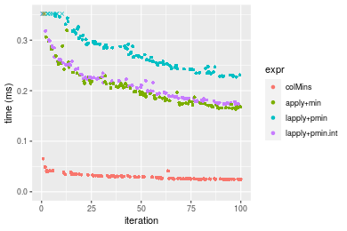

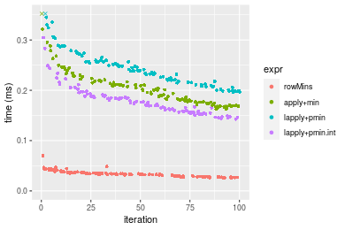
_Table: Benchmarking of colMins() and rowMins() on double+100x100 data (original and transposed).  The top panel shows times in milliseconds and the bottom panel shows relative times._


|   |expr    |    min|      lq|     mean|  median|      uq|    max|
|:--|:-------|------:|-------:|--------:|-------:|-------:|------:|
|1  |colMins | 23.997| 25.4045| 29.71777| 29.2165| 31.6305| 65.340|
|2  |rowMins | 25.617| 28.8300| 34.03645| 33.5870| 36.8610| 69.859|


|   |expr    |      min|       lq|     mean|  median|       uq|      max|
|:--|:-------|--------:|--------:|--------:|-------:|--------:|--------:|
|1  |colMins | 1.000000| 1.000000| 1.000000| 1.00000| 1.000000| 1.000000|
|2  |rowMins | 1.067508| 1.134838| 1.145323| 1.14959| 1.165363| 1.069161|

_Figure: Benchmarking of colMins() and rowMins() on double+100x100 data (original and transposed).  Outliers are displayed as crosses. Times are in milliseconds._


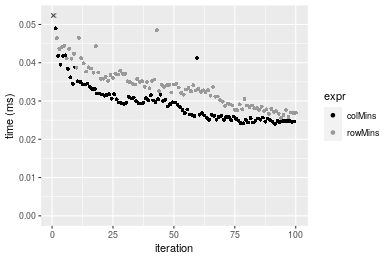

#### 1000x10 double matrix


```r
> X <- data[["1000x10"]]
> gc()
          used  (Mb) gc trigger  (Mb) max used  (Mb)
Ncells 5194921 277.5   10014072 534.9 10014072 534.9
Vcells 9541185  72.8   18204443 138.9 18204443 138.9
> colStats <- microbenchmark(colMins = colMins(X, na.rm = FALSE), `apply+min` = apply(X, MARGIN = 2L, 
+     FUN = min, na.rm = FALSE), `lapply+pmin` = do.call(pmin, lapply(seq_len(nrow(X)), function(i) X[i, 
+     ])), `lapply+pmin.int` = do.call(pmin.int, lapply(seq_len(nrow(X)), function(i) X[i, ])), unit = "ms")
> X <- t(X)
> gc()
          used  (Mb) gc trigger  (Mb) max used  (Mb)
Ncells 5194897 277.5   10014072 534.9 10014072 534.9
Vcells 9551262  72.9   18204443 138.9 18204443 138.9
> rowStats <- microbenchmark(rowMins = rowMins(X, na.rm = FALSE), `apply+min` = apply(X, MARGIN = 1L, 
+     FUN = min, na.rm = FALSE), `lapply+pmin` = do.call(pmin, lapply(seq_len(ncol(X)), function(i) X[, 
+     i])), `lapply+pmin.int` = do.call(pmin.int, lapply(seq_len(ncol(X)), function(i) X[, i])), unit = "ms")
```

_Table: Benchmarking of colMins(), apply+min(), lapply+pmin() and lapply+pmin.int() on double+1000x10 data. The top panel shows times in milliseconds and the bottom panel shows relative times._


|   |expr            |      min|       lq|      mean|    median|        uq|      max|
|:--|:---------------|--------:|--------:|---------:|---------:|---------:|--------:|
|1  |colMins         | 0.019803| 0.021811| 0.0241363| 0.0232035| 0.0253465| 0.046191|
|2  |apply+min       | 0.088953| 0.096245| 0.1062116| 0.1019915| 0.1089010| 0.215317|
|4  |lapply+pmin.int | 0.997703| 1.073109| 1.1755316| 1.0894850| 1.1238500| 6.207576|
|3  |lapply+pmin     | 1.491034| 1.575323| 1.6589366| 1.6340395| 1.6695725| 2.362267|


|   |expr            |       min|        lq|      mean|    median|        uq|        max|
|:--|:---------------|---------:|---------:|---------:|---------:|---------:|----------:|
|1  |colMins         |  1.000000|  1.000000|  1.000000|  1.000000|  1.000000|   1.000000|
|2  |apply+min       |  4.491895|  4.412682|  4.400499|  4.395522|  4.296491|   4.661449|
|4  |lapply+pmin.int | 50.381407| 49.200381| 48.703966| 46.953477| 44.339455| 134.389297|
|3  |lapply+pmin     | 75.293339| 72.226079| 68.732133| 70.422113| 65.869943|  51.141283|

_Table: Benchmarking of rowMins(), apply+min(), lapply+pmin() and lapply+pmin.int() on double+1000x10 data (transposed). The top panel shows times in milliseconds and the bottom panel shows relative times._


|   |expr            |      min|        lq|      mean|    median|        uq|      max|
|:--|:---------------|--------:|---------:|---------:|---------:|---------:|--------:|
|1  |rowMins         | 0.022804| 0.0240515| 0.0264306| 0.0251105| 0.0268875| 0.052788|
|2  |apply+min       | 0.089977| 0.0972130| 0.1076238| 0.1020380| 0.1146620| 0.200171|
|4  |lapply+pmin.int | 0.972641| 1.0506575| 1.0883464| 1.0630360| 1.0926250| 1.557046|
|3  |lapply+pmin     | 1.454058| 1.5922215| 1.6921900| 1.6078870| 1.6493530| 6.739222|


|   |expr            |       min|        lq|      mean|    median|        uq|        max|
|:--|:---------------|---------:|---------:|---------:|---------:|---------:|----------:|
|1  |rowMins         |  1.000000|  1.000000|  1.000000|  1.000000|  1.000000|   1.000000|
|2  |apply+min       |  3.945667|  4.041868|  4.071948|  4.063559|  4.264509|   3.791979|
|4  |lapply+pmin.int | 42.652210| 43.683658| 41.177593| 42.334322| 40.636913|  29.496211|
|3  |lapply+pmin     | 63.763287| 66.200507| 64.024016| 64.032456| 61.342743| 127.665795|

_Figure: Benchmarking of colMins(), apply+min(), lapply+pmin() and lapply+pmin.int() on double+1000x10 data  as well as rowMins(), apply+min(), lapply+pmin() and lapply+pmin.int() on the same data transposed.  Outliers are displayed as crosses.  Times are in milliseconds._


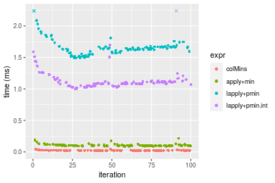

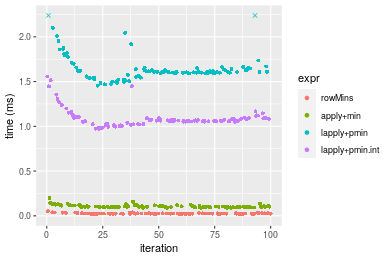
_Table: Benchmarking of colMins() and rowMins() on double+1000x10 data (original and transposed).  The top panel shows times in milliseconds and the bottom panel shows relative times._


|   |expr    |    min|      lq|     mean|  median|      uq|    max|
|:--|:-------|------:|-------:|--------:|-------:|-------:|------:|
|1  |colMins | 19.803| 21.8110| 24.13626| 23.2035| 25.3465| 46.191|
|2  |rowMins | 22.804| 24.0515| 26.43055| 25.1105| 26.8875| 52.788|


|   |expr    |      min|       lq|     mean|   median|       uq|     max|
|:--|:-------|--------:|--------:|--------:|--------:|--------:|-------:|
|1  |colMins | 1.000000| 1.000000| 1.000000| 1.000000| 1.000000| 1.00000|
|2  |rowMins | 1.151543| 1.102723| 1.095056| 1.082186| 1.060797| 1.14282|

_Figure: Benchmarking of colMins() and rowMins() on double+1000x10 data (original and transposed).  Outliers are displayed as crosses. Times are in milliseconds._


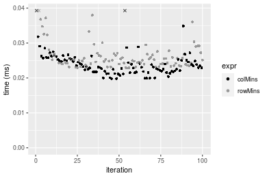

#### 10x1000 double matrix


```r
> X <- data[["10x1000"]]
> gc()
          used  (Mb) gc trigger  (Mb) max used  (Mb)
Ncells 5195144 277.5   10014072 534.9 10014072 534.9
Vcells 9541333  72.8   18204443 138.9 18204443 138.9
> colStats <- microbenchmark(colMins = colMins(X, na.rm = FALSE), `apply+min` = apply(X, MARGIN = 2L, 
+     FUN = min, na.rm = FALSE), `lapply+pmin` = do.call(pmin, lapply(seq_len(nrow(X)), function(i) X[i, 
+     ])), `lapply+pmin.int` = do.call(pmin.int, lapply(seq_len(nrow(X)), function(i) X[i, ])), unit = "ms")
> X <- t(X)
> gc()
          used  (Mb) gc trigger  (Mb) max used  (Mb)
Ncells 5195120 277.5   10014072 534.9 10014072 534.9
Vcells 9551410  72.9   18204443 138.9 18204443 138.9
> rowStats <- microbenchmark(rowMins = rowMins(X, na.rm = FALSE), `apply+min` = apply(X, MARGIN = 1L, 
+     FUN = min, na.rm = FALSE), `lapply+pmin` = do.call(pmin, lapply(seq_len(ncol(X)), function(i) X[, 
+     i])), `lapply+pmin.int` = do.call(pmin.int, lapply(seq_len(ncol(X)), function(i) X[, i])), unit = "ms")
```

_Table: Benchmarking of colMins(), apply+min(), lapply+pmin() and lapply+pmin.int() on double+10x1000 data. The top panel shows times in milliseconds and the bottom panel shows relative times._


|   |expr            |      min|       lq|      mean|    median|        uq|      max|
|:--|:---------------|--------:|--------:|---------:|---------:|---------:|--------:|
|1  |colMins         | 0.037940| 0.040218| 0.0458790| 0.0417270| 0.0501030| 0.079275|
|4  |lapply+pmin.int | 0.097170| 0.101146| 0.1123034| 0.1048290| 0.1209285| 0.165418|
|3  |lapply+pmin     | 0.106457| 0.112108| 0.1269494| 0.1153350| 0.1383850| 0.231450|
|2  |apply+min       | 0.912216| 0.949040| 1.0253373| 0.9652285| 1.0961445| 1.465240|


|   |expr            |       min|        lq|      mean|    median|        uq|       max|
|:--|:---------------|---------:|---------:|---------:|---------:|---------:|---------:|
|1  |colMins         |  1.000000|  1.000000|  1.000000|  1.000000|  1.000000|  1.000000|
|4  |lapply+pmin.int |  2.561149|  2.514944|  2.447814|  2.512258|  2.413598|  2.086635|
|3  |lapply+pmin     |  2.805930|  2.787508|  2.767047|  2.764038|  2.762010|  2.919584|
|2  |apply+min       | 24.043648| 23.597394| 22.348714| 23.131989| 21.877822| 18.483002|

_Table: Benchmarking of rowMins(), apply+min(), lapply+pmin() and lapply+pmin.int() on double+10x1000 data (transposed). The top panel shows times in milliseconds and the bottom panel shows relative times._


|   |expr            |      min|        lq|      mean|    median|        uq|      max|
|:--|:---------------|--------:|---------:|---------:|---------:|---------:|--------:|
|1  |rowMins         | 0.039373| 0.0414920| 0.0467041| 0.0429240| 0.0510205| 0.091506|
|4  |lapply+pmin.int | 0.070965| 0.0741815| 0.0862658| 0.0811150| 0.0958180| 0.139718|
|3  |lapply+pmin     | 0.079607| 0.0831475| 0.0938409| 0.0867795| 0.1034865| 0.156071|
|2  |apply+min       | 0.908763| 0.9455495| 1.0223476| 0.9628855| 1.0741175| 1.486067|


|   |expr            |       min|        lq|      mean|    median|        uq|       max|
|:--|:---------------|---------:|---------:|---------:|---------:|---------:|---------:|
|1  |rowMins         |  1.000000|  1.000000|  1.000000|  1.000000|  1.000000|  1.000000|
|4  |lapply+pmin.int |  1.802377|  1.787851|  1.847071|  1.889735|  1.878029|  1.526873|
|3  |lapply+pmin     |  2.021868|  2.003941|  2.009264|  2.021701|  2.028332|  1.705582|
|2  |apply+min       | 23.080868| 22.788718| 21.889881| 22.432334| 21.052665| 16.240105|

_Figure: Benchmarking of colMins(), apply+min(), lapply+pmin() and lapply+pmin.int() on double+10x1000 data  as well as rowMins(), apply+min(), lapply+pmin() and lapply+pmin.int() on the same data transposed.  Outliers are displayed as crosses.  Times are in milliseconds._


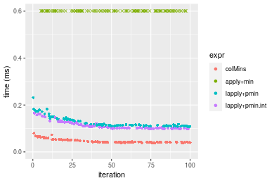

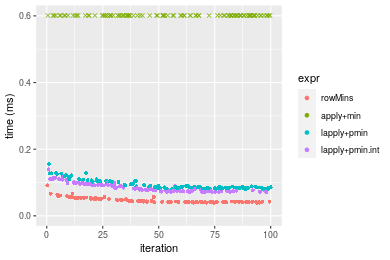
_Table: Benchmarking of colMins() and rowMins() on double+10x1000 data (original and transposed).  The top panel shows times in milliseconds and the bottom panel shows relative times._


|   |expr    |    min|     lq|     mean| median|      uq|    max|
|:--|:-------|------:|------:|--------:|------:|-------:|------:|
|1  |colMins | 37.940| 40.218| 45.87903| 41.727| 50.1030| 79.275|
|2  |rowMins | 39.373| 41.492| 46.70412| 42.924| 51.0205| 91.506|


|   |expr    |     min|       lq|     mean|   median|       uq|      max|
|:--|:-------|-------:|--------:|--------:|--------:|--------:|--------:|
|1  |colMins | 1.00000| 1.000000| 1.000000| 1.000000| 1.000000| 1.000000|
|2  |rowMins | 1.03777| 1.031677| 1.017984| 1.028687| 1.018312| 1.154286|

_Figure: Benchmarking of colMins() and rowMins() on double+10x1000 data (original and transposed).  Outliers are displayed as crosses. Times are in milliseconds._


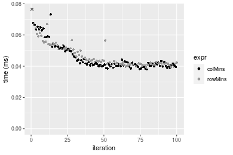

#### 100x1000 double matrix


```r
> X <- data[["100x1000"]]
> gc()
          used  (Mb) gc trigger  (Mb) max used  (Mb)
Ncells 5195356 277.5   10014072 534.9 10014072 534.9
Vcells 9542661  72.9   18204443 138.9 18204443 138.9
> colStats <- microbenchmark(colMins = colMins(X, na.rm = FALSE), `apply+min` = apply(X, MARGIN = 2L, 
+     FUN = min, na.rm = FALSE), `lapply+pmin` = do.call(pmin, lapply(seq_len(nrow(X)), function(i) X[i, 
+     ])), `lapply+pmin.int` = do.call(pmin.int, lapply(seq_len(nrow(X)), function(i) X[i, ])), unit = "ms")
> X <- t(X)
> gc()
          used  (Mb) gc trigger  (Mb) max used  (Mb)
Ncells 5195350 277.5   10014072 534.9 10014072 534.9
Vcells 9642768  73.6   18204443 138.9 18204443 138.9
> rowStats <- microbenchmark(rowMins = rowMins(X, na.rm = FALSE), `apply+min` = apply(X, MARGIN = 1L, 
+     FUN = min, na.rm = FALSE), `lapply+pmin` = do.call(pmin, lapply(seq_len(ncol(X)), function(i) X[, 
+     i])), `lapply+pmin.int` = do.call(pmin.int, lapply(seq_len(ncol(X)), function(i) X[, i])), unit = "ms")
```

_Table: Benchmarking of colMins(), apply+min(), lapply+pmin() and lapply+pmin.int() on double+100x1000 data. The top panel shows times in milliseconds and the bottom panel shows relative times._


|   |expr            |      min|        lq|      mean|    median|       uq|      max|
|:--|:---------------|--------:|---------:|---------:|---------:|--------:|--------:|
|1  |colMins         | 0.225739| 0.2409125| 0.2652028| 0.2612985| 0.285123| 0.462902|
|4  |lapply+pmin.int | 0.844309| 0.8799385| 1.1549501| 0.9669870| 1.093247| 9.316687|
|3  |lapply+pmin     | 0.907501| 0.9669805| 1.3802056| 1.0500040| 1.147496| 9.510244|
|2  |apply+min       | 1.493028| 1.6313010| 1.8025197| 1.7537030| 1.934371| 2.795187|


|   |expr            |      min|       lq|     mean|   median|       uq|       max|
|:--|:---------------|--------:|--------:|--------:|--------:|--------:|---------:|
|1  |colMins         | 1.000000| 1.000000| 1.000000| 1.000000| 1.000000|  1.000000|
|4  |lapply+pmin.int | 3.740200| 3.652523| 4.354970| 3.700699| 3.834300| 20.126694|
|3  |lapply+pmin     | 4.020134| 4.013825| 5.204341| 4.018408| 4.024563| 20.544832|
|2  |apply+min       | 6.613957| 6.771342| 6.796761| 6.711493| 6.784340|  6.038399|

_Table: Benchmarking of rowMins(), apply+min(), lapply+pmin() and lapply+pmin.int() on double+100x1000 data (transposed). The top panel shows times in milliseconds and the bottom panel shows relative times._


|   |expr            |      min|        lq|      mean|    median|        uq|      max|
|:--|:---------------|--------:|---------:|---------:|---------:|---------:|--------:|
|1  |rowMins         | 0.243805| 0.2564685| 0.2835827| 0.2767365| 0.3078045| 0.383616|
|4  |lapply+pmin.int | 0.564836| 0.6043825| 0.9877538| 0.6671435| 0.7330215| 8.840772|
|3  |lapply+pmin     | 0.619611| 0.6489470| 0.7981680| 0.7194865| 0.7844850| 8.506798|
|2  |apply+min       | 1.488144| 1.6051875| 1.8734475| 1.7732730| 1.9342685| 9.594621|


|   |expr            |      min|       lq|     mean|   median|       uq|      max|
|:--|:---------------|--------:|--------:|--------:|--------:|--------:|--------:|
|1  |rowMins         | 1.000000| 1.000000| 1.000000| 1.000000| 1.000000|  1.00000|
|4  |lapply+pmin.int | 2.316753| 2.356556| 3.483124| 2.410754| 2.381451| 23.04589|
|3  |lapply+pmin     | 2.541420| 2.530318| 2.814586| 2.599897| 2.548647| 22.17530|
|2  |apply+min       | 6.103829| 6.258810| 6.606353| 6.407803| 6.284081| 25.01100|

_Figure: Benchmarking of colMins(), apply+min(), lapply+pmin() and lapply+pmin.int() on double+100x1000 data  as well as rowMins(), apply+min(), lapply+pmin() and lapply+pmin.int() on the same data transposed.  Outliers are displayed as crosses.  Times are in milliseconds._


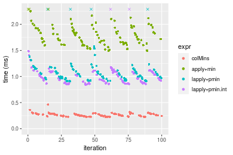

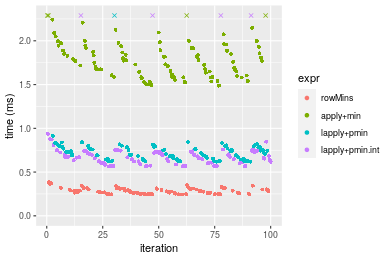
_Table: Benchmarking of colMins() and rowMins() on double+100x1000 data (original and transposed).  The top panel shows times in milliseconds and the bottom panel shows relative times._


|   |expr    |     min|       lq|     mean|   median|       uq|     max|
|:--|:-------|-------:|--------:|--------:|--------:|--------:|-------:|
|1  |colMins | 225.739| 240.9125| 265.2028| 261.2985| 285.1230| 462.902|
|2  |rowMins | 243.805| 256.4685| 283.5827| 276.7365| 307.8045| 383.616|


|   |expr    |     min|       lq|     mean|   median|      uq|       max|
|:--|:-------|-------:|--------:|--------:|--------:|-------:|---------:|
|1  |colMins | 1.00000| 1.000000| 1.000000| 1.000000| 1.00000| 1.0000000|
|2  |rowMins | 1.08003| 1.064571| 1.069305| 1.059082| 1.07955| 0.8287197|

_Figure: Benchmarking of colMins() and rowMins() on double+100x1000 data (original and transposed).  Outliers are displayed as crosses. Times are in milliseconds._


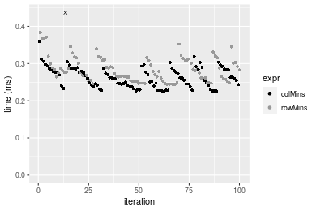

#### 1000x100 double matrix


```r
> X <- data[["1000x100"]]
> gc()
          used  (Mb) gc trigger  (Mb) max used  (Mb)
Ncells 5195598 277.5   10014072 534.9 10014072 534.9
Vcells 9542840  72.9   18204443 138.9 18204443 138.9
> colStats <- microbenchmark(colMins = colMins(X, na.rm = FALSE), `apply+min` = apply(X, MARGIN = 2L, 
+     FUN = min, na.rm = FALSE), `lapply+pmin` = do.call(pmin, lapply(seq_len(nrow(X)), function(i) X[i, 
+     ])), `lapply+pmin.int` = do.call(pmin.int, lapply(seq_len(nrow(X)), function(i) X[i, ])), unit = "ms")
> X <- t(X)
> gc()
          used  (Mb) gc trigger  (Mb) max used  (Mb)
Ncells 5195574 277.5   10014072 534.9 10014072 534.9
Vcells 9642917  73.6   18204443 138.9 18204443 138.9
> rowStats <- microbenchmark(rowMins = rowMins(X, na.rm = FALSE), `apply+min` = apply(X, MARGIN = 1L, 
+     FUN = min, na.rm = FALSE), `lapply+pmin` = do.call(pmin, lapply(seq_len(ncol(X)), function(i) X[, 
+     i])), `lapply+pmin.int` = do.call(pmin.int, lapply(seq_len(ncol(X)), function(i) X[, i])), unit = "ms")
```

_Table: Benchmarking of colMins(), apply+min(), lapply+pmin() and lapply+pmin.int() on double+1000x100 data. The top panel shows times in milliseconds and the bottom panel shows relative times._


|   |expr            |      min|        lq|      mean|    median|        uq|       max|
|:--|:---------------|--------:|---------:|---------:|---------:|---------:|---------:|
|1  |colMins         | 0.187947| 0.1932940| 0.2123861| 0.2068900| 0.2248155|  0.297939|
|2  |apply+min       | 0.716051| 0.7589135| 1.2264444| 0.8096255| 0.9186405| 11.580309|
|4  |lapply+pmin.int | 1.713756| 1.7857605| 2.1904247| 1.9151705| 2.1621410| 12.971441|
|3  |lapply+pmin     | 2.199394| 2.2532570| 2.4826710| 2.3648560| 2.6740170|  3.608744|


|   |expr            |       min|        lq|      mean|    median|        uq|      max|
|:--|:---------------|---------:|---------:|---------:|---------:|---------:|--------:|
|1  |colMins         |  1.000000|  1.000000|  1.000000|  1.000000|  1.000000|  1.00000|
|2  |apply+min       |  3.809856|  3.926213|  5.774598|  3.913314|  4.086197| 38.86805|
|4  |lapply+pmin.int |  9.118294|  9.238572| 10.313409|  9.256951|  9.617402| 43.53724|
|3  |lapply+pmin     | 11.702203| 11.657149| 11.689423| 11.430499| 11.894273| 12.11236|

_Table: Benchmarking of rowMins(), apply+min(), lapply+pmin() and lapply+pmin.int() on double+1000x100 data (transposed). The top panel shows times in milliseconds and the bottom panel shows relative times._


|   |expr            |      min|        lq|     mean|    median|       uq|       max|
|:--|:---------------|--------:|---------:|--------:|---------:|--------:|---------:|
|1  |rowMins         | 0.220214| 0.2253025| 0.250440| 0.2412045| 0.267699|  0.351817|
|2  |apply+min       | 0.747691| 0.7593650| 1.345688| 0.8184220| 0.963121| 11.008761|
|4  |lapply+pmin.int | 1.408108| 1.4366195| 1.693412| 1.5631120| 1.742975|  9.901776|
|3  |lapply+pmin     | 1.889202| 1.9571210| 2.167913| 2.1199920| 2.338904|  2.937060|


|   |expr            |      min|       lq|     mean|   median|       uq|       max|
|:--|:---------------|--------:|--------:|--------:|--------:|--------:|---------:|
|1  |rowMins         | 1.000000| 1.000000| 1.000000| 1.000000| 1.000000|  1.000000|
|2  |apply+min       | 3.395293| 3.370424| 5.373294| 3.393063| 3.597776| 31.291157|
|4  |lapply+pmin.int | 6.394271| 6.376403| 6.761744| 6.480443| 6.510949| 28.144678|
|3  |lapply+pmin     | 8.578937| 8.686637| 8.656416| 8.789189| 8.737067|  8.348261|

_Figure: Benchmarking of colMins(), apply+min(), lapply+pmin() and lapply+pmin.int() on double+1000x100 data  as well as rowMins(), apply+min(), lapply+pmin() and lapply+pmin.int() on the same data transposed.  Outliers are displayed as crosses.  Times are in milliseconds._


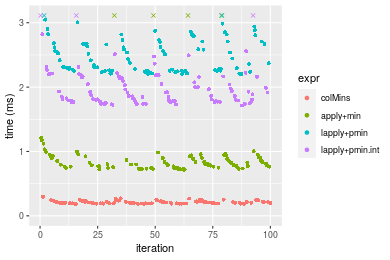

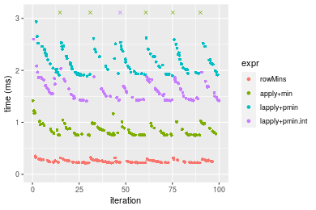
_Table: Benchmarking of colMins() and rowMins() on double+1000x100 data (original and transposed).  The top panel shows times in milliseconds and the bottom panel shows relative times._


|   |expr    |     min|       lq|     mean|   median|       uq|     max|
|:--|:-------|-------:|--------:|--------:|--------:|--------:|-------:|
|1  |colMins | 187.947| 193.2940| 212.3861| 206.8900| 224.8155| 297.939|
|2  |rowMins | 220.214| 225.3025| 250.4400| 241.2045| 267.6990| 351.817|


|   |expr    |      min|       lq|     mean|   median|      uq|      max|
|:--|:-------|--------:|--------:|--------:|--------:|-------:|--------:|
|1  |colMins | 1.000000| 1.000000| 1.000000| 1.000000| 1.00000| 1.000000|
|2  |rowMins | 1.171681| 1.165595| 1.179173| 1.165859| 1.19075| 1.180836|

_Figure: Benchmarking of colMins() and rowMins() on double+1000x100 data (original and transposed).  Outliers are displayed as crosses. Times are in milliseconds._


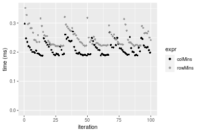


## Appendix

### Session information
```r
R version 4.1.1 Patched (2021-08-10 r80727)
Platform: x86_64-pc-linux-gnu (64-bit)
Running under: Ubuntu 18.04.5 LTS

Matrix products: default
BLAS:   /home/hb/software/R-devel/R-4-1-branch/lib/R/lib/libRblas.so
LAPACK: /home/hb/software/R-devel/R-4-1-branch/lib/R/lib/libRlapack.so

locale:
 [1] LC_CTYPE=en_US.UTF-8       LC_NUMERIC=C              
 [3] LC_TIME=en_US.UTF-8        LC_COLLATE=en_US.UTF-8    
 [5] LC_MONETARY=en_US.UTF-8    LC_MESSAGES=en_US.UTF-8   
 [7] LC_PAPER=en_US.UTF-8       LC_NAME=C                 
 [9] LC_ADDRESS=C               LC_TELEPHONE=C            
[11] LC_MEASUREMENT=en_US.UTF-8 LC_IDENTIFICATION=C       

attached base packages:
[1] stats     graphics  grDevices utils     datasets  methods   base     

other attached packages:
[1] microbenchmark_1.4-7   matrixStats_0.60.1     ggplot2_3.3.5         
[4] knitr_1.33             R.devices_2.17.0       R.utils_2.10.1        
[7] R.oo_1.24.0            R.methodsS3_1.8.1-9001 history_0.0.1-9000    

loaded via a namespace (and not attached):
 [1] Biobase_2.52.0          httr_1.4.2              splines_4.1.1          
 [4] bit64_4.0.5             network_1.17.1          assertthat_0.2.1       
 [7] highr_0.9               stats4_4.1.1            blob_1.2.2             
[10] GenomeInfoDbData_1.2.6  robustbase_0.93-8       pillar_1.6.2           
[13] RSQLite_2.2.8           lattice_0.20-44         glue_1.4.2             
[16] digest_0.6.27           XVector_0.32.0          colorspace_2.0-2       
[19] Matrix_1.3-4            XML_3.99-0.7            pkgconfig_2.0.3        
[22] zlibbioc_1.38.0         genefilter_1.74.0       purrr_0.3.4            
[25] ergm_4.1.2              xtable_1.8-4            scales_1.1.1           
[28] tibble_3.1.4            annotate_1.70.0         KEGGREST_1.32.0        
[31] farver_2.1.0            generics_0.1.0          IRanges_2.26.0         
[34] ellipsis_0.3.2          cachem_1.0.6            withr_2.4.2            
[37] BiocGenerics_0.38.0     mime_0.11               survival_3.2-13        
[40] magrittr_2.0.1          crayon_1.4.1            statnet.common_4.5.0   
[43] memoise_2.0.0           laeken_0.5.1            fansi_0.5.0            
[46] R.cache_0.15.0          MASS_7.3-54             R.rsp_0.44.0           
[49] progressr_0.8.0         tools_4.1.1             lifecycle_1.0.0        
[52] S4Vectors_0.30.0        trust_0.1-8             munsell_0.5.0          
[55] tabby_0.0.1-9001        AnnotationDbi_1.54.1    Biostrings_2.60.2      
[58] compiler_4.1.1          GenomeInfoDb_1.28.1     rlang_0.4.11           
[61] grid_4.1.1              RCurl_1.98-1.4          cwhmisc_6.6            
[64] rappdirs_0.3.3          startup_0.15.0          labeling_0.4.2         
[67] bitops_1.0-7            base64enc_0.1-3         boot_1.3-28            
[70] gtable_0.3.0            DBI_1.1.1               markdown_1.1           
[73] R6_2.5.1                lpSolveAPI_5.5.2.0-17.7 rle_0.9.2              
[76] dplyr_1.0.7             fastmap_1.1.0           bit_4.0.4              
[79] utf8_1.2.2              parallel_4.1.1          Rcpp_1.0.7             
[82] vctrs_0.3.8             png_0.1-7               DEoptimR_1.0-9         
[85] tidyselect_1.1.1        xfun_0.25               coda_0.19-4            
```
Total processing time was 28.01 secs.


### Reproducibility
To reproduce this report, do:
```r
html <- matrixStats:::benchmark('colMins')
```

[RSP]: https://cran.r-project.org/package=R.rsp
[matrixStats]: https://cran.r-project.org/package=matrixStats

[StackOverflow:colMins?]: https://stackoverflow.com/questions/13676878 "Stack Overflow: fastest way to get Min from every column in a matrix?"
[StackOverflow:colSds?]: https://stackoverflow.com/questions/17549762 "Stack Overflow: Is there such 'colsd' in R?"
[StackOverflow:rowProds?]: https://stackoverflow.com/questions/20198801/ "Stack Overflow: Row product of matrix and column sum of matrix"

---------------------------------------
Copyright Henrik Bengtsson. Last updated on 2021-08-25 18:08:25 (+0200 UTC). Powered by [RSP].

<script>
 var link = document.createElement('link');
 link.rel = 'icon';
 link.href = "data:image/png;base64,iVBORw0KGgoAAAANSUhEUgAAACAAAAAgCAMAAABEpIrGAAAA21BMVEUAAAAAAP8AAP8AAP8AAP8AAP8AAP8AAP8AAP8AAP8AAP8AAP8AAP8AAP8AAP8AAP8AAP8AAP8AAP8AAP8AAP8AAP8AAP8AAP8AAP8AAP8AAP8AAP8AAP8AAP8AAP8AAP8AAP8AAP8AAP8AAP8AAP8AAP8AAP8AAP8AAP8AAP8BAf4CAv0DA/wdHeIeHuEfH+AgIN8hId4lJdomJtknJ9g+PsE/P8BAQL9yco10dIt1dYp3d4h4eIeVlWqWlmmXl2iYmGeZmWabm2Tn5xjo6Bfp6Rb39wj4+Af//wA2M9hbAAAASXRSTlMAAQIJCgsMJSYnKD4/QGRlZmhpamtsbautrrCxuru8y8zN5ebn6Pn6+///////////////////////////////////////////LsUNcQAAAS9JREFUOI29k21XgkAQhVcFytdSMqMETU26UVqGmpaiFbL//xc1cAhhwVNf6n5i5z67M2dmYOyfJZUqlVLhkKucG7cgmUZTybDz6g0iDeq51PUr37Ds2cy2/C9NeES5puDjxuUk1xnToZsg8pfA3avHQ3lLIi7iWRrkv/OYtkScxBIMgDee0ALoyxHQBJ68JLCjOtQIMIANF7QG9G9fNnHvisCHBVMKgSJgiz7nE+AoBKrAPA3MgepvgR9TSCasrCKH0eB1wBGBFdCO+nAGjMVGPcQb5bd6mQRegN6+1axOs9nGfYcCtfi4NQosdtH7dB+txFIpXQqN1p9B/asRHToyS0jRgpV7nk4nwcq1BJ+x3Gl/v7S9Wmpp/aGquum7w3ZDyrADFYrl8vHBH+ev9AUASW1dmU4h4wAAAABJRU5ErkJggg=="
 document.getElementsByTagName('head')[0].appendChild(link);
</script>


