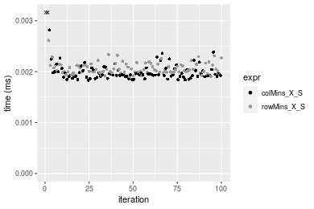
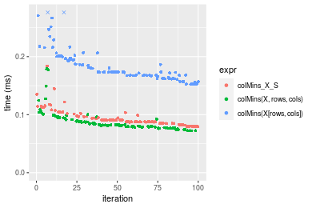
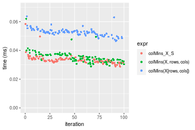

[matrixStats]: Benchmark report

---------------------------------------


# colMins() and rowMins() benchmarks on subsetted computation

This report benchmark the performance of colMins() and rowMins() on subsetted computation.


## Data type "integer"

### Data
```r
> rmatrix <- function(nrow, ncol, mode = c("logical", "double", "integer", "index"), range = c(-100, 
+     +100), na_prob = 0) {
+     mode <- match.arg(mode)
+     n <- nrow * ncol
+     if (mode == "logical") {
+         x <- sample(c(FALSE, TRUE), size = n, replace = TRUE)
+     }     else if (mode == "index") {
+         x <- seq_len(n)
+         mode <- "integer"
+     }     else {
+         x <- runif(n, min = range[1], max = range[2])
+     }
+     storage.mode(x) <- mode
+     if (na_prob > 0) 
+         x[sample(n, size = na_prob * n)] <- NA
+     dim(x) <- c(nrow, ncol)
+     x
+ }
> rmatrices <- function(scale = 10, seed = 1, ...) {
+     set.seed(seed)
+     data <- list()
+     data[[1]] <- rmatrix(nrow = scale * 1, ncol = scale * 1, ...)
+     data[[2]] <- rmatrix(nrow = scale * 10, ncol = scale * 10, ...)
+     data[[3]] <- rmatrix(nrow = scale * 100, ncol = scale * 1, ...)
+     data[[4]] <- t(data[[3]])
+     data[[5]] <- rmatrix(nrow = scale * 10, ncol = scale * 100, ...)
+     data[[6]] <- t(data[[5]])
+     names(data) <- sapply(data, FUN = function(x) paste(dim(x), collapse = "x"))
+     data
+ }
> data <- rmatrices(mode = mode)
```

### Results

#### 10x10 integer matrix


```r
> X <- data[["10x10"]]
> rows <- sample.int(nrow(X), size = nrow(X) * 0.7)
> cols <- sample.int(ncol(X), size = ncol(X) * 0.7)
> X_S <- X[rows, cols]
> gc()
          used  (Mb) gc trigger  (Mb) max used  (Mb)
Ncells 5204289 278.0   10014072 534.9 10014072 534.9
Vcells 9768572  74.6   18204443 138.9 18204443 138.9
> colStats <- microbenchmark(colMins_X_S = colMins(X_S, na.rm = FALSE), `colMins(X, rows, cols)` = colMins(X, 
+     rows = rows, cols = cols, na.rm = FALSE), `colMins(X[rows, cols])` = colMins(X[rows, cols], na.rm = FALSE), 
+     unit = "ms")
> X <- t(X)
> X_S <- t(X_S)
> gc()
          used  (Mb) gc trigger  (Mb) max used  (Mb)
Ncells 5190215 277.2   10014072 534.9 10014072 534.9
Vcells 9722260  74.2   18204443 138.9 18204443 138.9
> rowStats <- microbenchmark(rowMins_X_S = rowMins(X_S, na.rm = FALSE), `rowMins(X, cols, rows)` = rowMins(X, 
+     rows = cols, cols = rows, na.rm = FALSE), `rowMins(X[cols, rows])` = rowMins(X[cols, rows], na.rm = FALSE), 
+     unit = "ms")
```

_Table: Benchmarking of colMins_X_S(), colMins(X, rows, cols)() and colMins(X[rows, cols])() on integer+10x10 data. The top panel shows times in milliseconds and the bottom panel shows relative times._


|   |expr                   |      min|       lq|      mean|   median|        uq|      max|
|:--|:----------------------|--------:|--------:|---------:|--------:|---------:|--------:|
|1  |colMins_X_S            | 0.001830| 0.001908| 0.0028022| 0.001939| 0.0020395| 0.081831|
|2  |colMins(X, rows, cols) | 0.002215| 0.002279| 0.0024125| 0.002346| 0.0024590| 0.004877|
|3  |colMins(X[rows, cols]) | 0.002639| 0.002888| 0.0030882| 0.002990| 0.0031095| 0.007504|


|   |expr                   |      min|       lq|      mean|   median|       uq|       max|
|:--|:----------------------|--------:|--------:|---------:|--------:|--------:|---------:|
|1  |colMins_X_S            | 1.000000| 1.000000| 1.0000000| 1.000000| 1.000000| 1.0000000|
|2  |colMins(X, rows, cols) | 1.210382| 1.194444| 0.8609164| 1.209902| 1.205688| 0.0595984|
|3  |colMins(X[rows, cols]) | 1.442076| 1.513627| 1.1020734| 1.542032| 1.524638| 0.0917012|

_Table: Benchmarking of rowMins_X_S(), rowMins(X, cols, rows)() and rowMins(X[cols, rows])() on integer+10x10 data (transposed). The top panel shows times in milliseconds and the bottom panel shows relative times._


|   |expr                   |      min|        lq|      mean|    median|        uq|      max|
|:--|:----------------------|--------:|---------:|---------:|---------:|---------:|--------:|
|1  |rowMins_X_S            | 0.001900| 0.0019905| 0.0021008| 0.0020400| 0.0021360| 0.005400|
|2  |rowMins(X, cols, rows) | 0.002269| 0.0023235| 0.0032510| 0.0023765| 0.0024970| 0.084353|
|3  |rowMins(X[cols, rows]) | 0.002746| 0.0029415| 0.0031487| 0.0030590| 0.0031905| 0.005775|


|   |expr                   |      min|       lq|     mean|   median|       uq|       max|
|:--|:----------------------|--------:|--------:|--------:|--------:|--------:|---------:|
|1  |rowMins_X_S            | 1.000000| 1.000000| 1.000000| 1.000000| 1.000000|  1.000000|
|2  |rowMins(X, cols, rows) | 1.194211| 1.167295| 1.547506| 1.164951| 1.169007| 15.620926|
|3  |rowMins(X[cols, rows]) | 1.445263| 1.477769| 1.498819| 1.499510| 1.493680|  1.069444|

_Figure: Benchmarking of colMins_X_S(), colMins(X, rows, cols)() and colMins(X[rows, cols])() on integer+10x10 data  as well as rowMins_X_S(), rowMins(X, cols, rows)() and rowMins(X[cols, rows])() on the same data transposed.  Outliers are displayed as crosses.  Times are in milliseconds._


_Table: Benchmarking of colMins_X_S() and rowMins_X_S() on integer+10x10 data (original and transposed).  The top panel shows times in milliseconds and the bottom panel shows relative times._


|   |expr        |  min|     lq|   mean| median|     uq|    max|
|:--|:-----------|----:|------:|------:|------:|------:|------:|
|1  |colMins_X_S | 1.83| 1.9080| 2.8022|  1.939| 2.0395| 81.831|
|2  |rowMins_X_S | 1.90| 1.9905| 2.1008|  2.040| 2.1360|  5.400|


|   |expr        |      min|       lq|      mean|   median|       uq|       max|
|:--|:-----------|--------:|--------:|---------:|--------:|--------:|---------:|
|1  |colMins_X_S | 1.000000| 1.000000| 1.0000000| 1.000000| 1.000000| 1.0000000|
|2  |rowMins_X_S | 1.038251| 1.043239| 0.7496967| 1.052089| 1.047316| 0.0659897|

_Figure: Benchmarking of colMins_X_S() and rowMins_X_S() on integer+10x10 data (original and transposed).  Outliers are displayed as crosses. Times are in milliseconds._




#### 100x100 integer matrix


```r
> X <- data[["100x100"]]
> rows <- sample.int(nrow(X), size = nrow(X) * 0.7)
> cols <- sample.int(ncol(X), size = ncol(X) * 0.7)
> X_S <- X[rows, cols]
> gc()
          used  (Mb) gc trigger  (Mb) max used  (Mb)
Ncells 5188834 277.2   10014072 534.9 10014072 534.9
Vcells 9391135  71.7   18204443 138.9 18204443 138.9
> colStats <- microbenchmark(colMins_X_S = colMins(X_S, na.rm = FALSE), `colMins(X, rows, cols)` = colMins(X, 
+     rows = rows, cols = cols, na.rm = FALSE), `colMins(X[rows, cols])` = colMins(X[rows, cols], na.rm = FALSE), 
+     unit = "ms")
> X <- t(X)
> X_S <- t(X_S)
> gc()
          used  (Mb) gc trigger  (Mb) max used  (Mb)
Ncells 5188810 277.2   10014072 534.9 10014072 534.9
Vcells 9396188  71.7   18204443 138.9 18204443 138.9
> rowStats <- microbenchmark(rowMins_X_S = rowMins(X_S, na.rm = FALSE), `rowMins(X, cols, rows)` = rowMins(X, 
+     rows = cols, cols = rows, na.rm = FALSE), `rowMins(X[cols, rows])` = rowMins(X[cols, rows], na.rm = FALSE), 
+     unit = "ms")
```

_Table: Benchmarking of colMins_X_S(), colMins(X, rows, cols)() and colMins(X[rows, cols])() on integer+100x100 data. The top panel shows times in milliseconds and the bottom panel shows relative times._


|   |expr                   |      min|       lq|      mean|   median|       uq|      max|
|:--|:----------------------|--------:|--------:|---------:|--------:|--------:|--------:|
|2  |colMins(X, rows, cols) | 0.016332| 0.017081| 0.0176031| 0.017570| 0.017902| 0.021942|
|1  |colMins_X_S            | 0.017260| 0.017876| 0.0185035| 0.018472| 0.018671| 0.031360|
|3  |colMins(X[rows, cols]) | 0.027555| 0.028861| 0.0307975| 0.029877| 0.030480| 0.075418|


|   |expr                   |      min|       lq|     mean|   median|       uq|      max|
|:--|:----------------------|--------:|--------:|--------:|--------:|--------:|--------:|
|2  |colMins(X, rows, cols) | 1.000000| 1.000000| 1.000000| 1.000000| 1.000000| 1.000000|
|1  |colMins_X_S            | 1.056821| 1.046543| 1.051152| 1.051338| 1.042956| 1.429223|
|3  |colMins(X[rows, cols]) | 1.687178| 1.689655| 1.749554| 1.700455| 1.702603| 3.437152|

_Table: Benchmarking of rowMins_X_S(), rowMins(X, cols, rows)() and rowMins(X[cols, rows])() on integer+100x100 data (transposed). The top panel shows times in milliseconds and the bottom panel shows relative times._


|   |expr                   |      min|        lq|      mean|   median|        uq|      max|
|:--|:----------------------|--------:|---------:|---------:|--------:|---------:|--------:|
|2  |rowMins(X, cols, rows) | 0.019577| 0.0207705| 0.0219081| 0.021562| 0.0221175| 0.046921|
|1  |rowMins_X_S            | 0.021471| 0.0225585| 0.0237081| 0.023701| 0.0244670| 0.038912|
|3  |rowMins(X[cols, rows]) | 0.031927| 0.0333005| 0.0351775| 0.034815| 0.0357885| 0.061243|


|   |expr                   |      min|       lq|     mean|   median|       uq|       max|
|:--|:----------------------|--------:|--------:|--------:|--------:|--------:|---------:|
|2  |rowMins(X, cols, rows) | 1.000000| 1.000000| 1.000000| 1.000000| 1.000000| 1.0000000|
|1  |rowMins_X_S            | 1.096746| 1.086084| 1.082160| 1.099202| 1.106228| 0.8293088|
|3  |rowMins(X[cols, rows]) | 1.630842| 1.603259| 1.605685| 1.614646| 1.618108| 1.3052365|

_Figure: Benchmarking of colMins_X_S(), colMins(X, rows, cols)() and colMins(X[rows, cols])() on integer+100x100 data  as well as rowMins_X_S(), rowMins(X, cols, rows)() and rowMins(X[cols, rows])() on the same data transposed.  Outliers are displayed as crosses.  Times are in milliseconds._


_Table: Benchmarking of colMins_X_S() and rowMins_X_S() on integer+100x100 data (original and transposed).  The top panel shows times in milliseconds and the bottom panel shows relative times._


|   |expr        |    min|      lq|     mean| median|     uq|    max|
|:--|:-----------|------:|-------:|--------:|------:|------:|------:|
|1  |colMins_X_S | 17.260| 17.8760| 18.50351| 18.472| 18.671| 31.360|
|2  |rowMins_X_S | 21.471| 22.5585| 23.70809| 23.701| 24.467| 38.912|


|   |expr        |      min|       lq|     mean|   median|       uq|      max|
|:--|:-----------|--------:|--------:|--------:|--------:|--------:|--------:|
|1  |colMins_X_S | 1.000000| 1.000000| 1.000000| 1.000000| 1.000000| 1.000000|
|2  |rowMins_X_S | 1.243974| 1.261943| 1.281275| 1.283077| 1.310428| 1.240816|

_Figure: Benchmarking of colMins_X_S() and rowMins_X_S() on integer+100x100 data (original and transposed).  Outliers are displayed as crosses. Times are in milliseconds._


#### 1000x10 integer matrix


```r
> X <- data[["1000x10"]]
> rows <- sample.int(nrow(X), size = nrow(X) * 0.7)
> cols <- sample.int(ncol(X), size = ncol(X) * 0.7)
> X_S <- X[rows, cols]
> gc()
          used  (Mb) gc trigger  (Mb) max used  (Mb)
Ncells 5189577 277.2   10014072 534.9 10014072 534.9
Vcells 9395187  71.7   18204443 138.9 18204443 138.9
> colStats <- microbenchmark(colMins_X_S = colMins(X_S, na.rm = FALSE), `colMins(X, rows, cols)` = colMins(X, 
+     rows = rows, cols = cols, na.rm = FALSE), `colMins(X[rows, cols])` = colMins(X[rows, cols], na.rm = FALSE), 
+     unit = "ms")
> X <- t(X)
> X_S <- t(X_S)
> gc()
          used  (Mb) gc trigger  (Mb) max used  (Mb)
Ncells 5189553 277.2   10014072 534.9 10014072 534.9
Vcells 9400240  71.8   18204443 138.9 18204443 138.9
> rowStats <- microbenchmark(rowMins_X_S = rowMins(X_S, na.rm = FALSE), `rowMins(X, cols, rows)` = rowMins(X, 
+     rows = cols, cols = rows, na.rm = FALSE), `rowMins(X[cols, rows])` = rowMins(X[cols, rows], na.rm = FALSE), 
+     unit = "ms")
```

_Table: Benchmarking of colMins_X_S(), colMins(X, rows, cols)() and colMins(X[rows, cols])() on integer+1000x10 data. The top panel shows times in milliseconds and the bottom panel shows relative times._


|   |expr                   |      min|        lq|      mean|    median|        uq|      max|
|:--|:----------------------|--------:|---------:|---------:|---------:|---------:|--------:|
|1  |colMins_X_S            | 0.012384| 0.0128300| 0.0132503| 0.0129045| 0.0130260| 0.027406|
|2  |colMins(X, rows, cols) | 0.013289| 0.0140095| 0.0144102| 0.0142930| 0.0146295| 0.018716|
|3  |colMins(X[rows, cols]) | 0.023313| 0.0246105| 0.0255596| 0.0249030| 0.0254565| 0.066736|


|   |expr                   |      min|       lq|     mean|   median|       uq|       max|
|:--|:----------------------|--------:|--------:|--------:|--------:|--------:|---------:|
|1  |colMins_X_S            | 1.000000| 1.000000| 1.000000| 1.000000| 1.000000| 1.0000000|
|2  |colMins(X, rows, cols) | 1.073078| 1.091933| 1.087545| 1.107598| 1.123100| 0.6829161|
|3  |colMins(X[rows, cols]) | 1.882510| 1.918200| 1.928992| 1.929792| 1.954284| 2.4350872|

_Table: Benchmarking of rowMins_X_S(), rowMins(X, cols, rows)() and rowMins(X[cols, rows])() on integer+1000x10 data (transposed). The top panel shows times in milliseconds and the bottom panel shows relative times._


|   |expr                   |      min|        lq|      mean|    median|        uq|      max|
|:--|:----------------------|--------:|---------:|---------:|---------:|---------:|--------:|
|2  |rowMins(X, cols, rows) | 0.020130| 0.0217185| 0.0225195| 0.0226660| 0.0230020| 0.035974|
|1  |rowMins_X_S            | 0.020944| 0.0224760| 0.0229194| 0.0226820| 0.0235370| 0.037205|
|3  |rowMins(X[cols, rows]) | 0.032700| 0.0347810| 0.0366767| 0.0359545| 0.0375675| 0.082521|


|   |expr                   |      min|       lq|     mean|   median|       uq|      max|
|:--|:----------------------|--------:|--------:|--------:|--------:|--------:|--------:|
|2  |rowMins(X, cols, rows) | 1.000000| 1.000000| 1.000000| 1.000000| 1.000000| 1.000000|
|1  |rowMins_X_S            | 1.040437| 1.034878| 1.017757| 1.000706| 1.023259| 1.034219|
|3  |rowMins(X[cols, rows]) | 1.624441| 1.601446| 1.628664| 1.586275| 1.633228| 2.293907|

_Figure: Benchmarking of colMins_X_S(), colMins(X, rows, cols)() and colMins(X[rows, cols])() on integer+1000x10 data  as well as rowMins_X_S(), rowMins(X, cols, rows)() and rowMins(X[cols, rows])() on the same data transposed.  Outliers are displayed as crosses.  Times are in milliseconds._


_Table: Benchmarking of colMins_X_S() and rowMins_X_S() on integer+1000x10 data (original and transposed).  The top panel shows times in milliseconds and the bottom panel shows relative times._


|   |expr        |    min|     lq|     mean|  median|     uq|    max|
|:--|:-----------|------:|------:|--------:|-------:|------:|------:|
|1  |colMins_X_S | 12.384| 12.830| 13.25026| 12.9045| 13.026| 27.406|
|2  |rowMins_X_S | 20.944| 22.476| 22.91937| 22.6820| 23.537| 37.205|


|   |expr        |      min|       lq|    mean|   median|       uq|      max|
|:--|:-----------|--------:|--------:|-------:|--------:|--------:|--------:|
|1  |colMins_X_S | 1.000000| 1.000000| 1.00000| 1.000000| 1.000000| 1.000000|
|2  |rowMins_X_S | 1.691215| 1.751832| 1.72973| 1.757681| 1.806925| 1.357549|

_Figure: Benchmarking of colMins_X_S() and rowMins_X_S() on integer+1000x10 data (original and transposed).  Outliers are displayed as crosses. Times are in milliseconds._


#### 10x1000 integer matrix


```r
> X <- data[["10x1000"]]
> rows <- sample.int(nrow(X), size = nrow(X) * 0.7)
> cols <- sample.int(ncol(X), size = ncol(X) * 0.7)
> X_S <- X[rows, cols]
> gc()
          used  (Mb) gc trigger  (Mb) max used  (Mb)
Ncells 5189782 277.2   10014072 534.9 10014072 534.9
Vcells 9395990  71.7   18204443 138.9 18204443 138.9
> colStats <- microbenchmark(colMins_X_S = colMins(X_S, na.rm = FALSE), `colMins(X, rows, cols)` = colMins(X, 
+     rows = rows, cols = cols, na.rm = FALSE), `colMins(X[rows, cols])` = colMins(X[rows, cols], na.rm = FALSE), 
+     unit = "ms")
> X <- t(X)
> X_S <- t(X_S)
> gc()
          used  (Mb) gc trigger  (Mb) max used  (Mb)
Ncells 5189758 277.2   10014072 534.9 10014072 534.9
Vcells 9401043  71.8   18204443 138.9 18204443 138.9
> rowStats <- microbenchmark(rowMins_X_S = rowMins(X_S, na.rm = FALSE), `rowMins(X, cols, rows)` = rowMins(X, 
+     rows = cols, cols = rows, na.rm = FALSE), `rowMins(X[cols, rows])` = rowMins(X[cols, rows], na.rm = FALSE), 
+     unit = "ms")
```

_Table: Benchmarking of colMins_X_S(), colMins(X, rows, cols)() and colMins(X[rows, cols])() on integer+10x1000 data. The top panel shows times in milliseconds and the bottom panel shows relative times._


|   |expr                   |      min|        lq|      mean|    median|        uq|      max|
|:--|:----------------------|--------:|---------:|---------:|---------:|---------:|--------:|
|1  |colMins_X_S            | 0.027544| 0.0290105| 0.0306838| 0.0308700| 0.0316385| 0.051761|
|2  |colMins(X, rows, cols) | 0.031059| 0.0330165| 0.0353864| 0.0342855| 0.0370655| 0.054072|
|3  |colMins(X[rows, cols]) | 0.039653| 0.0420050| 0.0440786| 0.0433630| 0.0457730| 0.065475|


|   |expr                   |      min|       lq|     mean|   median|       uq|      max|
|:--|:----------------------|--------:|--------:|--------:|--------:|--------:|--------:|
|1  |colMins_X_S            | 1.000000| 1.000000| 1.000000| 1.000000| 1.000000| 1.000000|
|2  |colMins(X, rows, cols) | 1.127614| 1.138088| 1.153261| 1.110641| 1.171531| 1.044647|
|3  |colMins(X[rows, cols]) | 1.439624| 1.447924| 1.436542| 1.404697| 1.446750| 1.264949|

_Table: Benchmarking of rowMins_X_S(), rowMins(X, cols, rows)() and rowMins(X[cols, rows])() on integer+10x1000 data (transposed). The top panel shows times in milliseconds and the bottom panel shows relative times._


|   |expr                   |      min|        lq|      mean|    median|        uq|      max|
|:--|:----------------------|--------:|---------:|---------:|---------:|---------:|--------:|
|1  |rowMins_X_S            | 0.028408| 0.0313305| 0.0330639| 0.0325525| 0.0341885| 0.047934|
|2  |rowMins(X, cols, rows) | 0.028072| 0.0320880| 0.0340311| 0.0334350| 0.0351935| 0.059934|
|3  |rowMins(X[cols, rows]) | 0.039270| 0.0420560| 0.0445880| 0.0434605| 0.0468690| 0.067528|


|   |expr                   |       min|       lq|     mean|  median|       uq|      max|
|:--|:----------------------|---------:|--------:|--------:|-------:|--------:|--------:|
|1  |rowMins_X_S            | 1.0000000| 1.000000| 1.000000| 1.00000| 1.000000| 1.000000|
|2  |rowMins(X, cols, rows) | 0.9881723| 1.024178| 1.029254| 1.02711| 1.029396| 1.250344|
|3  |rowMins(X[cols, rows]) | 1.3823571| 1.342334| 1.348540| 1.33509| 1.370900| 1.408770|

_Figure: Benchmarking of colMins_X_S(), colMins(X, rows, cols)() and colMins(X[rows, cols])() on integer+10x1000 data  as well as rowMins_X_S(), rowMins(X, cols, rows)() and rowMins(X[cols, rows])() on the same data transposed.  Outliers are displayed as crosses.  Times are in milliseconds._


_Table: Benchmarking of colMins_X_S() and rowMins_X_S() on integer+10x1000 data (original and transposed).  The top panel shows times in milliseconds and the bottom panel shows relative times._


|   |expr        |    min|      lq|     mean|  median|      uq|    max|
|:--|:-----------|------:|-------:|--------:|-------:|-------:|------:|
|1  |colMins_X_S | 27.544| 29.0105| 30.68381| 30.8700| 31.6385| 51.761|
|2  |rowMins_X_S | 28.408| 31.3305| 33.06387| 32.5525| 34.1885| 47.934|


|   |expr        |      min|       lq|     mean|   median|       uq|      max|
|:--|:-----------|--------:|--------:|--------:|--------:|--------:|--------:|
|1  |colMins_X_S | 1.000000| 1.000000| 1.000000| 1.000000| 1.000000| 1.000000|
|2  |rowMins_X_S | 1.031368| 1.079971| 1.077567| 1.054503| 1.080598| 0.926064|

_Figure: Benchmarking of colMins_X_S() and rowMins_X_S() on integer+10x1000 data (original and transposed).  Outliers are displayed as crosses. Times are in milliseconds._


#### 100x1000 integer matrix


```r
> X <- data[["100x1000"]]
> rows <- sample.int(nrow(X), size = nrow(X) * 0.7)
> cols <- sample.int(ncol(X), size = ncol(X) * 0.7)
> X_S <- X[rows, cols]
> gc()
          used  (Mb) gc trigger  (Mb) max used  (Mb)
Ncells 5189992 277.2   10014072 534.9 10014072 534.9
Vcells 9418655  71.9   18204443 138.9 18204443 138.9
> colStats <- microbenchmark(colMins_X_S = colMins(X_S, na.rm = FALSE), `colMins(X, rows, cols)` = colMins(X, 
+     rows = rows, cols = cols, na.rm = FALSE), `colMins(X[rows, cols])` = colMins(X[rows, cols], na.rm = FALSE), 
+     unit = "ms")
> X <- t(X)
> X_S <- t(X_S)
> gc()
          used  (Mb) gc trigger  (Mb) max used  (Mb)
Ncells 5189968 277.2   10014072 534.9 10014072 534.9
Vcells 9468708  72.3   18204443 138.9 18204443 138.9
> rowStats <- microbenchmark(rowMins_X_S = rowMins(X_S, na.rm = FALSE), `rowMins(X, cols, rows)` = rowMins(X, 
+     rows = cols, cols = rows, na.rm = FALSE), `rowMins(X[cols, rows])` = rowMins(X[cols, rows], na.rm = FALSE), 
+     unit = "ms")
```

_Table: Benchmarking of colMins_X_S(), colMins(X, rows, cols)() and colMins(X[rows, cols])() on integer+100x1000 data. The top panel shows times in milliseconds and the bottom panel shows relative times._


|   |expr                   |      min|        lq|      mean|    median|        uq|      max|
|:--|:----------------------|--------:|---------:|---------:|---------:|---------:|--------:|
|2  |colMins(X, rows, cols) | 0.101663| 0.1087325| 0.1218293| 0.1189125| 0.1318735| 0.208446|
|1  |colMins_X_S            | 0.107416| 0.1171915| 0.1321079| 0.1287260| 0.1433810| 0.195684|
|3  |colMins(X[rows, cols]) | 0.177586| 0.2005090| 0.2199375| 0.2149325| 0.2433415| 0.321887|


|   |expr                   |      min|       lq|     mean|   median|       uq|       max|
|:--|:----------------------|--------:|--------:|--------:|--------:|--------:|---------:|
|2  |colMins(X, rows, cols) | 1.000000| 1.000000| 1.000000| 1.000000| 1.000000| 1.0000000|
|1  |colMins_X_S            | 1.056589| 1.077796| 1.084369| 1.082527| 1.087262| 0.9387755|
|3  |colMins(X[rows, cols]) | 1.746811| 1.844058| 1.805293| 1.807484| 1.845265| 1.5442225|

_Table: Benchmarking of rowMins_X_S(), rowMins(X, cols, rows)() and rowMins(X[cols, rows])() on integer+100x1000 data (transposed). The top panel shows times in milliseconds and the bottom panel shows relative times._


|   |expr                   |      min|        lq|      mean|    median|        uq|      max|
|:--|:----------------------|--------:|---------:|---------:|---------:|---------:|--------:|
|2  |rowMins(X, cols, rows) | 0.119510| 0.1221120| 0.1400406| 0.1332615| 0.1542120| 0.235757|
|1  |rowMins_X_S            | 0.134807| 0.1462325| 0.1656323| 0.1663425| 0.1774640| 0.231846|
|3  |rowMins(X[cols, rows]) | 0.198719| 0.2097395| 0.2391095| 0.2360640| 0.2617545| 0.325248|


|   |expr                   |      min|       lq|     mean|   median|       uq|       max|
|:--|:----------------------|--------:|--------:|--------:|--------:|--------:|---------:|
|2  |rowMins(X, cols, rows) | 1.000000| 1.000000| 1.000000| 1.000000| 1.000000| 1.0000000|
|1  |rowMins_X_S            | 1.127998| 1.197528| 1.182745| 1.248241| 1.150779| 0.9834109|
|3  |rowMins(X[cols, rows]) | 1.662781| 1.717599| 1.707430| 1.771434| 1.697368| 1.3795900|

_Figure: Benchmarking of colMins_X_S(), colMins(X, rows, cols)() and colMins(X[rows, cols])() on integer+100x1000 data  as well as rowMins_X_S(), rowMins(X, cols, rows)() and rowMins(X[cols, rows])() on the same data transposed.  Outliers are displayed as crosses.  Times are in milliseconds._


_Table: Benchmarking of colMins_X_S() and rowMins_X_S() on integer+100x1000 data (original and transposed).  The top panel shows times in milliseconds and the bottom panel shows relative times._


|   |expr        |     min|       lq|     mean|   median|      uq|     max|
|:--|:-----------|-------:|--------:|--------:|--------:|-------:|-------:|
|1  |colMins_X_S | 107.416| 117.1915| 132.1079| 128.7260| 143.381| 195.684|
|2  |rowMins_X_S | 134.807| 146.2325| 165.6323| 166.3425| 177.464| 231.846|


|   |expr        |      min|       lq|     mean|   median|       uq|      max|
|:--|:-----------|--------:|--------:|--------:|--------:|--------:|--------:|
|1  |colMins_X_S | 1.000000| 1.000000| 1.000000| 1.000000| 1.000000| 1.000000|
|2  |rowMins_X_S | 1.254999| 1.247808| 1.253765| 1.292221| 1.237709| 1.184798|

_Figure: Benchmarking of colMins_X_S() and rowMins_X_S() on integer+100x1000 data (original and transposed).  Outliers are displayed as crosses. Times are in milliseconds._


#### 1000x100 integer matrix


```r
> X <- data[["1000x100"]]
> rows <- sample.int(nrow(X), size = nrow(X) * 0.7)
> cols <- sample.int(ncol(X), size = ncol(X) * 0.7)
> X_S <- X[rows, cols]
> gc()
          used  (Mb) gc trigger  (Mb) max used  (Mb)
Ncells 5190205 277.2   10014072 534.9 10014072 534.9
Vcells 9419427  71.9   18204443 138.9 18204443 138.9
> colStats <- microbenchmark(colMins_X_S = colMins(X_S, na.rm = FALSE), `colMins(X, rows, cols)` = colMins(X, 
+     rows = rows, cols = cols, na.rm = FALSE), `colMins(X[rows, cols])` = colMins(X[rows, cols], na.rm = FALSE), 
+     unit = "ms")
> X <- t(X)
> X_S <- t(X_S)
> gc()
          used  (Mb) gc trigger  (Mb) max used  (Mb)
Ncells 5190181 277.2   10014072 534.9 10014072 534.9
Vcells 9469480  72.3   18204443 138.9 18204443 138.9
> rowStats <- microbenchmark(rowMins_X_S = rowMins(X_S, na.rm = FALSE), `rowMins(X, cols, rows)` = rowMins(X, 
+     rows = cols, cols = rows, na.rm = FALSE), `rowMins(X[cols, rows])` = rowMins(X[cols, rows], na.rm = FALSE), 
+     unit = "ms")
```

_Table: Benchmarking of colMins_X_S(), colMins(X, rows, cols)() and colMins(X[rows, cols])() on integer+1000x100 data. The top panel shows times in milliseconds and the bottom panel shows relative times._


|   |expr                   |      min|        lq|      mean|    median|        uq|      max|
|:--|:----------------------|--------:|---------:|---------:|---------:|---------:|--------:|
|2  |colMins(X, rows, cols) | 0.072293| 0.0784020| 0.0874247| 0.0820185| 0.0904160| 0.179020|
|1  |colMins_X_S            | 0.079421| 0.0852705| 0.0934997| 0.0879505| 0.0968925| 0.183976|
|3  |colMins(X[rows, cols]) | 0.152297| 0.1674410| 0.1849861| 0.1735440| 0.1952135| 0.371492|


|   |expr                   |      min|       lq|     mean|   median|       uq|      max|
|:--|:----------------------|--------:|--------:|--------:|--------:|--------:|--------:|
|2  |colMins(X, rows, cols) | 1.000000| 1.000000| 1.000000| 1.000000| 1.000000| 1.000000|
|1  |colMins_X_S            | 1.098599| 1.087606| 1.069489| 1.072325| 1.071630| 1.027684|
|3  |colMins(X[rows, cols]) | 2.106663| 2.135673| 2.115949| 2.115913| 2.159059| 2.075142|

_Table: Benchmarking of rowMins_X_S(), rowMins(X, cols, rows)() and rowMins(X[cols, rows])() on integer+1000x100 data (transposed). The top panel shows times in milliseconds and the bottom panel shows relative times._


|   |expr                   |      min|        lq|      mean|    median|        uq|      max|
|:--|:----------------------|--------:|---------:|---------:|---------:|---------:|--------:|
|2  |rowMins(X, cols, rows) | 0.105557| 0.1180310| 0.1305356| 0.1291385| 0.1383500| 0.237864|
|1  |rowMins_X_S            | 0.125160| 0.1343165| 0.1519070| 0.1525130| 0.1634395| 0.201152|
|3  |rowMins(X[cols, rows]) | 0.191750| 0.2079890| 0.2350732| 0.2279570| 0.2561680| 0.358307|


|   |expr                   |      min|       lq|     mean|   median|       uq|       max|
|:--|:----------------------|--------:|--------:|--------:|--------:|--------:|---------:|
|2  |rowMins(X, cols, rows) | 1.000000| 1.000000| 1.000000| 1.000000| 1.000000| 1.0000000|
|1  |rowMins_X_S            | 1.185710| 1.137976| 1.163721| 1.181003| 1.181348| 0.8456597|
|3  |rowMins(X[cols, rows]) | 1.816554| 1.762156| 1.800836| 1.765213| 1.851594| 1.5063524|

_Figure: Benchmarking of colMins_X_S(), colMins(X, rows, cols)() and colMins(X[rows, cols])() on integer+1000x100 data  as well as rowMins_X_S(), rowMins(X, cols, rows)() and rowMins(X[cols, rows])() on the same data transposed.  Outliers are displayed as crosses.  Times are in milliseconds._





_Table: Benchmarking of colMins_X_S() and rowMins_X_S() on integer+1000x100 data (original and transposed).  The top panel shows times in milliseconds and the bottom panel shows relative times._


|   |expr        |     min|       lq|      mean|   median|       uq|     max|
|:--|:-----------|-------:|--------:|---------:|--------:|--------:|-------:|
|1  |colMins_X_S |  79.421|  85.2705|  93.49974|  87.9505|  96.8925| 183.976|
|2  |rowMins_X_S | 125.160| 134.3165| 151.90703| 152.5130| 163.4395| 201.152|


|   |expr        |      min|       lq|     mean|   median|       uq|     max|
|:--|:-----------|--------:|--------:|--------:|--------:|--------:|-------:|
|1  |colMins_X_S | 1.000000| 1.000000| 1.000000| 1.000000| 1.000000| 1.00000|
|2  |rowMins_X_S | 1.575906| 1.575181| 1.624679| 1.734078| 1.686813| 1.09336|

_Figure: Benchmarking of colMins_X_S() and rowMins_X_S() on integer+1000x100 data (original and transposed).  Outliers are displayed as crosses. Times are in milliseconds._


## Data type "double"

### Data
```r
> rmatrix <- function(nrow, ncol, mode = c("logical", "double", "integer", "index"), range = c(-100, 
+     +100), na_prob = 0) {
+     mode <- match.arg(mode)
+     n <- nrow * ncol
+     if (mode == "logical") {
+         x <- sample(c(FALSE, TRUE), size = n, replace = TRUE)
+     }     else if (mode == "index") {
+         x <- seq_len(n)
+         mode <- "integer"
+     }     else {
+         x <- runif(n, min = range[1], max = range[2])
+     }
+     storage.mode(x) <- mode
+     if (na_prob > 0) 
+         x[sample(n, size = na_prob * n)] <- NA
+     dim(x) <- c(nrow, ncol)
+     x
+ }
> rmatrices <- function(scale = 10, seed = 1, ...) {
+     set.seed(seed)
+     data <- list()
+     data[[1]] <- rmatrix(nrow = scale * 1, ncol = scale * 1, ...)
+     data[[2]] <- rmatrix(nrow = scale * 10, ncol = scale * 10, ...)
+     data[[3]] <- rmatrix(nrow = scale * 100, ncol = scale * 1, ...)
+     data[[4]] <- t(data[[3]])
+     data[[5]] <- rmatrix(nrow = scale * 10, ncol = scale * 100, ...)
+     data[[6]] <- t(data[[5]])
+     names(data) <- sapply(data, FUN = function(x) paste(dim(x), collapse = "x"))
+     data
+ }
> data <- rmatrices(mode = mode)
```

### Results

#### 10x10 double matrix


```r
> X <- data[["10x10"]]
> rows <- sample.int(nrow(X), size = nrow(X) * 0.7)
> cols <- sample.int(ncol(X), size = ncol(X) * 0.7)
> X_S <- X[rows, cols]
> gc()
          used  (Mb) gc trigger  (Mb) max used  (Mb)
Ncells 5190422 277.2   10014072 534.9 10014072 534.9
Vcells 9510523  72.6   18204443 138.9 18204443 138.9
> colStats <- microbenchmark(colMins_X_S = colMins(X_S, na.rm = FALSE), `colMins(X, rows, cols)` = colMins(X, 
+     rows = rows, cols = cols, na.rm = FALSE), `colMins(X[rows, cols])` = colMins(X[rows, cols], na.rm = FALSE), 
+     unit = "ms")
> X <- t(X)
> X_S <- t(X_S)
> gc()
          used  (Mb) gc trigger  (Mb) max used  (Mb)
Ncells 5190389 277.2   10014072 534.9 10014072 534.9
Vcells 9510661  72.6   18204443 138.9 18204443 138.9
> rowStats <- microbenchmark(rowMins_X_S = rowMins(X_S, na.rm = FALSE), `rowMins(X, cols, rows)` = rowMins(X, 
+     rows = cols, cols = rows, na.rm = FALSE), `rowMins(X[cols, rows])` = rowMins(X[cols, rows], na.rm = FALSE), 
+     unit = "ms")
```

_Table: Benchmarking of colMins_X_S(), colMins(X, rows, cols)() and colMins(X[rows, cols])() on double+10x10 data. The top panel shows times in milliseconds and the bottom panel shows relative times._


|   |expr                   |      min|        lq|      mean|    median|        uq|      max|
|:--|:----------------------|--------:|---------:|---------:|---------:|---------:|--------:|
|1  |colMins_X_S            | 0.001844| 0.0019225| 0.0021642| 0.0019605| 0.0020800| 0.015444|
|2  |colMins(X, rows, cols) | 0.002189| 0.0022655| 0.0023932| 0.0023095| 0.0024215| 0.004733|
|3  |colMins(X[rows, cols]) | 0.002724| 0.0029020| 0.0031614| 0.0030510| 0.0031840| 0.007321|


|   |expr                   |      min|       lq|     mean|   median|       uq|       max|
|:--|:----------------------|--------:|--------:|--------:|--------:|--------:|---------:|
|1  |colMins_X_S            | 1.000000| 1.000000| 1.000000| 1.000000| 1.000000| 1.0000000|
|2  |colMins(X, rows, cols) | 1.187093| 1.178414| 1.105789| 1.178016| 1.164183| 0.3064621|
|3  |colMins(X[rows, cols]) | 1.477223| 1.509493| 1.460773| 1.556236| 1.530769| 0.4740352|

_Table: Benchmarking of rowMins_X_S(), rowMins(X, cols, rows)() and rowMins(X[cols, rows])() on double+10x10 data (transposed). The top panel shows times in milliseconds and the bottom panel shows relative times._


|   |expr                   |      min|        lq|      mean|   median|        uq|      max|
|:--|:----------------------|--------:|---------:|---------:|--------:|---------:|--------:|
|1  |rowMins_X_S            | 0.001819| 0.0019570| 0.0022222| 0.002036| 0.0021190| 0.016642|
|2  |rowMins(X, cols, rows) | 0.002164| 0.0023065| 0.0025833| 0.002364| 0.0024755| 0.018440|
|3  |rowMins(X[cols, rows]) | 0.002742| 0.0029845| 0.0031600| 0.003055| 0.0031965| 0.005694|


|   |expr                   |      min|       lq|     mean|   median|       uq|       max|
|:--|:----------------------|--------:|--------:|--------:|--------:|--------:|---------:|
|1  |rowMins_X_S            | 1.000000| 1.000000| 1.000000| 1.000000| 1.000000| 1.0000000|
|2  |rowMins(X, cols, rows) | 1.189665| 1.178590| 1.162511| 1.161100| 1.168240| 1.1080399|
|3  |rowMins(X[cols, rows]) | 1.507422| 1.525038| 1.422034| 1.500491| 1.508495| 0.3421464|

_Figure: Benchmarking of colMins_X_S(), colMins(X, rows, cols)() and colMins(X[rows, cols])() on double+10x10 data  as well as rowMins_X_S(), rowMins(X, cols, rows)() and rowMins(X[cols, rows])() on the same data transposed.  Outliers are displayed as crosses.  Times are in milliseconds._


_Table: Benchmarking of colMins_X_S() and rowMins_X_S() on double+10x10 data (original and transposed).  The top panel shows times in milliseconds and the bottom panel shows relative times._


|   |expr        |   min|     lq|    mean| median|    uq|    max|
|:--|:-----------|-----:|------:|-------:|------:|-----:|------:|
|1  |colMins_X_S | 1.844| 1.9225| 2.16421| 1.9605| 2.080| 15.444|
|2  |rowMins_X_S | 1.819| 1.9570| 2.22219| 2.0360| 2.119| 16.642|


|   |expr        |       min|       lq|    mean|   median|      uq|      max|
|:--|:-----------|---------:|--------:|-------:|--------:|-------:|--------:|
|1  |colMins_X_S | 1.0000000| 1.000000| 1.00000| 1.000000| 1.00000| 1.000000|
|2  |rowMins_X_S | 0.9864425| 1.017945| 1.02679| 1.038511| 1.01875| 1.077571|

_Figure: Benchmarking of colMins_X_S() and rowMins_X_S() on double+10x10 data (original and transposed).  Outliers are displayed as crosses. Times are in milliseconds._


#### 100x100 double matrix


```r
> X <- data[["100x100"]]
> rows <- sample.int(nrow(X), size = nrow(X) * 0.7)
> cols <- sample.int(ncol(X), size = ncol(X) * 0.7)
> X_S <- X[rows, cols]
> gc()
          used  (Mb) gc trigger  (Mb) max used  (Mb)
Ncells 5190619 277.3   10014072 534.9 10014072 534.9
Vcells 9516462  72.7   18204443 138.9 18204443 138.9
> colStats <- microbenchmark(colMins_X_S = colMins(X_S, na.rm = FALSE), `colMins(X, rows, cols)` = colMins(X, 
+     rows = rows, cols = cols, na.rm = FALSE), `colMins(X[rows, cols])` = colMins(X[rows, cols], na.rm = FALSE), 
+     unit = "ms")
> X <- t(X)
> X_S <- t(X_S)
> gc()
          used  (Mb) gc trigger  (Mb) max used  (Mb)
Ncells 5190595 277.3   10014072 534.9 10014072 534.9
Vcells 9526515  72.7   18204443 138.9 18204443 138.9
> rowStats <- microbenchmark(rowMins_X_S = rowMins(X_S, na.rm = FALSE), `rowMins(X, cols, rows)` = rowMins(X, 
+     rows = cols, cols = rows, na.rm = FALSE), `rowMins(X[cols, rows])` = rowMins(X[cols, rows], na.rm = FALSE), 
+     unit = "ms")
```

_Table: Benchmarking of colMins_X_S(), colMins(X, rows, cols)() and colMins(X[rows, cols])() on double+100x100 data. The top panel shows times in milliseconds and the bottom panel shows relative times._


|   |expr                   |      min|        lq|      mean|    median|        uq|      max|
|:--|:----------------------|--------:|---------:|---------:|---------:|---------:|--------:|
|2  |colMins(X, rows, cols) | 0.016281| 0.0178765| 0.0185722| 0.0183395| 0.0188190| 0.032898|
|1  |colMins_X_S            | 0.018140| 0.0192975| 0.0198862| 0.0197385| 0.0202755| 0.033503|
|3  |colMins(X[rows, cols]) | 0.032978| 0.0346125| 0.0357291| 0.0350590| 0.0360960| 0.078461|


|   |expr                   |      min|       lq|     mean|   median|       uq|      max|
|:--|:----------------------|--------:|--------:|--------:|--------:|--------:|--------:|
|2  |colMins(X, rows, cols) | 1.000000| 1.000000| 1.000000| 1.000000| 1.000000| 1.000000|
|1  |colMins_X_S            | 1.114182| 1.079490| 1.070748| 1.076283| 1.077395| 1.018390|
|3  |colMins(X[rows, cols]) | 2.025551| 1.936201| 1.923791| 1.911666| 1.918062| 2.384978|

_Table: Benchmarking of rowMins_X_S(), rowMins(X, cols, rows)() and rowMins(X[cols, rows])() on double+100x100 data (transposed). The top panel shows times in milliseconds and the bottom panel shows relative times._


|   |expr                   |      min|        lq|      mean|    median|        uq|      max|
|:--|:----------------------|--------:|---------:|---------:|---------:|---------:|--------:|
|1  |rowMins_X_S            | 0.018976| 0.0202115| 0.0208719| 0.0206715| 0.0215415| 0.028233|
|2  |rowMins(X, cols, rows) | 0.019683| 0.0208060| 0.0219977| 0.0213150| 0.0219740| 0.052195|
|3  |rowMins(X[cols, rows]) | 0.033639| 0.0354565| 0.0368863| 0.0360230| 0.0373245| 0.052024|


|   |expr                   |      min|       lq|     mean|   median|       uq|      max|
|:--|:----------------------|--------:|--------:|--------:|--------:|--------:|--------:|
|1  |rowMins_X_S            | 1.000000| 1.000000| 1.000000| 1.000000| 1.000000| 1.000000|
|2  |rowMins(X, cols, rows) | 1.037258| 1.029414| 1.053939| 1.031130| 1.020077| 1.848723|
|3  |rowMins(X[cols, rows]) | 1.772713| 1.754274| 1.767274| 1.742641| 1.732679| 1.842666|

_Figure: Benchmarking of colMins_X_S(), colMins(X, rows, cols)() and colMins(X[rows, cols])() on double+100x100 data  as well as rowMins_X_S(), rowMins(X, cols, rows)() and rowMins(X[cols, rows])() on the same data transposed.  Outliers are displayed as crosses.  Times are in milliseconds._


_Table: Benchmarking of colMins_X_S() and rowMins_X_S() on double+100x100 data (original and transposed).  The top panel shows times in milliseconds and the bottom panel shows relative times._


|   |expr        |    min|      lq|     mean|  median|      uq|    max|
|:--|:-----------|------:|-------:|--------:|-------:|-------:|------:|
|1  |colMins_X_S | 18.140| 19.2975| 19.88617| 19.7385| 20.2755| 33.503|
|2  |rowMins_X_S | 18.976| 20.2115| 20.87187| 20.6715| 21.5415| 28.233|


|   |expr        |      min|       lq|     mean|   median|      uq|       max|
|:--|:-----------|--------:|--------:|--------:|--------:|-------:|---------:|
|1  |colMins_X_S | 1.000000| 1.000000| 1.000000| 1.000000| 1.00000| 1.0000000|
|2  |rowMins_X_S | 1.046086| 1.047364| 1.049567| 1.047268| 1.06244| 0.8427007|

_Figure: Benchmarking of colMins_X_S() and rowMins_X_S() on double+100x100 data (original and transposed).  Outliers are displayed as crosses. Times are in milliseconds._


#### 1000x10 double matrix


```r
> X <- data[["1000x10"]]
> rows <- sample.int(nrow(X), size = nrow(X) * 0.7)
> cols <- sample.int(ncol(X), size = ncol(X) * 0.7)
> X_S <- X[rows, cols]
> gc()
          used  (Mb) gc trigger  (Mb) max used  (Mb)
Ncells 5190819 277.3   10014072 534.9 10014072 534.9
Vcells 9517859  72.7   18204443 138.9 18204443 138.9
> colStats <- microbenchmark(colMins_X_S = colMins(X_S, na.rm = FALSE), `colMins(X, rows, cols)` = colMins(X, 
+     rows = rows, cols = cols, na.rm = FALSE), `colMins(X[rows, cols])` = colMins(X[rows, cols], na.rm = FALSE), 
+     unit = "ms")
> X <- t(X)
> X_S <- t(X_S)
> gc()
          used  (Mb) gc trigger  (Mb) max used  (Mb)
Ncells 5190795 277.3   10014072 534.9 10014072 534.9
Vcells 9527912  72.7   18204443 138.9 18204443 138.9
> rowStats <- microbenchmark(rowMins_X_S = rowMins(X_S, na.rm = FALSE), `rowMins(X, cols, rows)` = rowMins(X, 
+     rows = cols, cols = rows, na.rm = FALSE), `rowMins(X[cols, rows])` = rowMins(X[cols, rows], na.rm = FALSE), 
+     unit = "ms")
```

_Table: Benchmarking of colMins_X_S(), colMins(X, rows, cols)() and colMins(X[rows, cols])() on double+1000x10 data. The top panel shows times in milliseconds and the bottom panel shows relative times._


|   |expr                   |      min|        lq|      mean|    median|        uq|      max|
|:--|:----------------------|--------:|---------:|---------:|---------:|---------:|--------:|
|1  |colMins_X_S            | 0.015711| 0.0166185| 0.0171319| 0.0170200| 0.0171645| 0.030923|
|2  |colMins(X, rows, cols) | 0.016298| 0.0174285| 0.0179274| 0.0180175| 0.0183135| 0.023516|
|3  |colMins(X[rows, cols]) | 0.031324| 0.0329085| 0.0340443| 0.0341530| 0.0343920| 0.063655|


|   |expr                   |      min|       lq|     mean|   median|       uq|       max|
|:--|:----------------------|--------:|--------:|--------:|--------:|--------:|---------:|
|1  |colMins_X_S            | 1.000000| 1.000000| 1.000000| 1.000000| 1.000000| 1.0000000|
|2  |colMins(X, rows, cols) | 1.037362| 1.048741| 1.046434| 1.058607| 1.066941| 0.7604696|
|3  |colMins(X[rows, cols]) | 1.993762| 1.980233| 1.987190| 2.006639| 2.003670| 2.0585001|

_Table: Benchmarking of rowMins_X_S(), rowMins(X, cols, rows)() and rowMins(X[cols, rows])() on double+1000x10 data (transposed). The top panel shows times in milliseconds and the bottom panel shows relative times._


|   |expr                   |      min|        lq|      mean|    median|        uq|      max|
|:--|:----------------------|--------:|---------:|---------:|---------:|---------:|--------:|
|1  |rowMins_X_S            | 0.017525| 0.0181960| 0.0188340| 0.0185040| 0.0193035| 0.023910|
|2  |rowMins(X, cols, rows) | 0.020605| 0.0216315| 0.0224859| 0.0225210| 0.0233450| 0.027791|
|3  |rowMins(X[cols, rows]) | 0.035251| 0.0368230| 0.0387100| 0.0381535| 0.0397410| 0.072776|


|   |expr                   |      min|       lq|     mean|   median|       uq|      max|
|:--|:----------------------|--------:|--------:|--------:|--------:|--------:|--------:|
|1  |rowMins_X_S            | 1.000000| 1.000000| 1.000000| 1.000000| 1.000000| 1.000000|
|2  |rowMins(X, cols, rows) | 1.175749| 1.188805| 1.193900| 1.217088| 1.209366| 1.162317|
|3  |rowMins(X[cols, rows]) | 2.011469| 2.023687| 2.055327| 2.061905| 2.058746| 3.043747|

_Figure: Benchmarking of colMins_X_S(), colMins(X, rows, cols)() and colMins(X[rows, cols])() on double+1000x10 data  as well as rowMins_X_S(), rowMins(X, cols, rows)() and rowMins(X[cols, rows])() on the same data transposed.  Outliers are displayed as crosses.  Times are in milliseconds._


_Table: Benchmarking of colMins_X_S() and rowMins_X_S() on double+1000x10 data (original and transposed).  The top panel shows times in milliseconds and the bottom panel shows relative times._


|   |expr        |    min|      lq|     mean| median|      uq|    max|
|:--|:-----------|------:|-------:|--------:|------:|-------:|------:|
|1  |colMins_X_S | 15.711| 16.6185| 17.13186| 17.020| 17.1645| 30.923|
|2  |rowMins_X_S | 17.525| 18.1960| 18.83401| 18.504| 19.3035| 23.910|


|   |expr        |     min|       lq|     mean|   median|       uq|       max|
|:--|:-----------|-------:|--------:|--------:|--------:|--------:|---------:|
|1  |colMins_X_S | 1.00000| 1.000000| 1.000000| 1.000000| 1.000000| 1.0000000|
|2  |rowMins_X_S | 1.11546| 1.094924| 1.099356| 1.087192| 1.124618| 0.7732109|

_Figure: Benchmarking of colMins_X_S() and rowMins_X_S() on double+1000x10 data (original and transposed).  Outliers are displayed as crosses. Times are in milliseconds._


#### 10x1000 double matrix


```r
> X <- data[["10x1000"]]
> rows <- sample.int(nrow(X), size = nrow(X) * 0.7)
> cols <- sample.int(ncol(X), size = ncol(X) * 0.7)
> X_S <- X[rows, cols]
> gc()
          used  (Mb) gc trigger  (Mb) max used  (Mb)
Ncells 5191024 277.3   10014072 534.9 10014072 534.9
Vcells 9517995  72.7   18204443 138.9 18204443 138.9
> colStats <- microbenchmark(colMins_X_S = colMins(X_S, na.rm = FALSE), `colMins(X, rows, cols)` = colMins(X, 
+     rows = rows, cols = cols, na.rm = FALSE), `colMins(X[rows, cols])` = colMins(X[rows, cols], na.rm = FALSE), 
+     unit = "ms")
> X <- t(X)
> X_S <- t(X_S)
> gc()
          used  (Mb) gc trigger  (Mb) max used  (Mb)
Ncells 5191000 277.3   10014072 534.9 10014072 534.9
Vcells 9528048  72.7   18204443 138.9 18204443 138.9
> rowStats <- microbenchmark(rowMins_X_S = rowMins(X_S, na.rm = FALSE), `rowMins(X, cols, rows)` = rowMins(X, 
+     rows = cols, cols = rows, na.rm = FALSE), `rowMins(X[cols, rows])` = rowMins(X[cols, rows], na.rm = FALSE), 
+     unit = "ms")
```

_Table: Benchmarking of colMins_X_S(), colMins(X, rows, cols)() and colMins(X[rows, cols])() on double+10x1000 data. The top panel shows times in milliseconds and the bottom panel shows relative times._


|   |expr                   |      min|        lq|      mean|    median|       uq|      max|
|:--|:----------------------|--------:|---------:|---------:|---------:|--------:|--------:|
|1  |colMins_X_S            | 0.028764| 0.0321210| 0.0335615| 0.0330240| 0.034403| 0.058477|
|2  |colMins(X, rows, cols) | 0.028908| 0.0323875| 0.0350499| 0.0341400| 0.036907| 0.062014|
|3  |colMins(X[rows, cols]) | 0.046436| 0.0511915| 0.0526328| 0.0526325| 0.053791| 0.063737|


|   |expr                   |      min|       lq|     mean|   median|       uq|      max|
|:--|:----------------------|--------:|--------:|--------:|--------:|--------:|--------:|
|1  |colMins_X_S            | 1.000000| 1.000000| 1.000000| 1.000000| 1.000000| 1.000000|
|2  |colMins(X, rows, cols) | 1.005006| 1.008297| 1.044348| 1.033794| 1.072784| 1.060485|
|3  |colMins(X[rows, cols]) | 1.614379| 1.593708| 1.568248| 1.593765| 1.563556| 1.089950|

_Table: Benchmarking of rowMins_X_S(), rowMins(X, cols, rows)() and rowMins(X[cols, rows])() on double+10x1000 data (transposed). The top panel shows times in milliseconds and the bottom panel shows relative times._


|   |expr                   |      min|       lq|      mean|    median|        uq|      max|
|:--|:----------------------|--------:|--------:|---------:|---------:|---------:|--------:|
|1  |rowMins_X_S            | 0.028863| 0.030868| 0.0323302| 0.0320590| 0.0332720| 0.044233|
|2  |rowMins(X, cols, rows) | 0.026590| 0.033242| 0.0351456| 0.0346700| 0.0368645| 0.069713|
|3  |rowMins(X[cols, rows]) | 0.043006| 0.046872| 0.0493316| 0.0482805| 0.0512735| 0.067083|


|   |expr                   |       min|       lq|     mean|   median|       uq|      max|
|:--|:----------------------|---------:|--------:|--------:|--------:|--------:|--------:|
|1  |rowMins_X_S            | 1.0000000| 1.000000| 1.000000| 1.000000| 1.000000| 1.000000|
|2  |rowMins(X, cols, rows) | 0.9212487| 1.076908| 1.087082| 1.081444| 1.107974| 1.576040|
|3  |rowMins(X[cols, rows]) | 1.4900045| 1.518466| 1.525867| 1.505989| 1.541041| 1.516583|

_Figure: Benchmarking of colMins_X_S(), colMins(X, rows, cols)() and colMins(X[rows, cols])() on double+10x1000 data  as well as rowMins_X_S(), rowMins(X, cols, rows)() and rowMins(X[cols, rows])() on the same data transposed.  Outliers are displayed as crosses.  Times are in milliseconds._





_Table: Benchmarking of colMins_X_S() and rowMins_X_S() on double+10x1000 data (original and transposed).  The top panel shows times in milliseconds and the bottom panel shows relative times._


|   |expr        |    min|     lq|     mean| median|     uq|    max|
|:--|:-----------|------:|------:|--------:|------:|------:|------:|
|2  |rowMins_X_S | 28.863| 30.868| 32.33020| 32.059| 33.272| 44.233|
|1  |colMins_X_S | 28.764| 32.121| 33.56154| 33.024| 34.403| 58.477|


|   |expr        |     min|       lq|     mean|   median|       uq|      max|
|:--|:-----------|-------:|--------:|--------:|--------:|--------:|--------:|
|2  |rowMins_X_S | 1.00000| 1.000000| 1.000000| 1.000000| 1.000000| 1.000000|
|1  |colMins_X_S | 0.99657| 1.040592| 1.038086| 1.030101| 1.033993| 1.322022|

_Figure: Benchmarking of colMins_X_S() and rowMins_X_S() on double+10x1000 data (original and transposed).  Outliers are displayed as crosses. Times are in milliseconds._


#### 100x1000 double matrix


```r
> X <- data[["100x1000"]]
> rows <- sample.int(nrow(X), size = nrow(X) * 0.7)
> cols <- sample.int(ncol(X), size = ncol(X) * 0.7)
> X_S <- X[rows, cols]
> gc()
          used  (Mb) gc trigger  (Mb) max used  (Mb)
Ncells 5191234 277.3   10014072 534.9 10014072 534.9
Vcells 9563437  73.0   18204443 138.9 18204443 138.9
> colStats <- microbenchmark(colMins_X_S = colMins(X_S, na.rm = FALSE), `colMins(X, rows, cols)` = colMins(X, 
+     rows = rows, cols = cols, na.rm = FALSE), `colMins(X[rows, cols])` = colMins(X[rows, cols], na.rm = FALSE), 
+     unit = "ms")
> X <- t(X)
> X_S <- t(X_S)
> gc()
          used  (Mb) gc trigger  (Mb) max used  (Mb)
Ncells 5191210 277.3   10014072 534.9 10014072 534.9
Vcells 9663490  73.8   18204443 138.9 18204443 138.9
> rowStats <- microbenchmark(rowMins_X_S = rowMins(X_S, na.rm = FALSE), `rowMins(X, cols, rows)` = rowMins(X, 
+     rows = cols, cols = rows, na.rm = FALSE), `rowMins(X[cols, rows])` = rowMins(X[cols, rows], na.rm = FALSE), 
+     unit = "ms")
```

_Table: Benchmarking of colMins_X_S(), colMins(X, rows, cols)() and colMins(X[rows, cols])() on double+100x1000 data. The top panel shows times in milliseconds and the bottom panel shows relative times._


|   |expr                   |      min|        lq|      mean|    median|       uq|      max|
|:--|:----------------------|--------:|---------:|---------:|---------:|--------:|--------:|
|1  |colMins_X_S            | 0.118507| 0.1285075| 0.1468529| 0.1420980| 0.157022| 0.217369|
|2  |colMins(X, rows, cols) | 0.119812| 0.1307160| 0.1498699| 0.1464595| 0.161508| 0.285793|
|3  |colMins(X[rows, cols]) | 0.231028| 0.2691560| 0.2989104| 0.2896975| 0.336697| 0.364852|


|   |expr                   |      min|       lq|     mean|   median|       uq|      max|
|:--|:----------------------|--------:|--------:|--------:|--------:|--------:|--------:|
|1  |colMins_X_S            | 1.000000| 1.000000| 1.000000| 1.000000| 1.000000| 1.000000|
|2  |colMins(X, rows, cols) | 1.011012| 1.017186| 1.020544| 1.030694| 1.028569| 1.314783|
|3  |colMins(X[rows, cols]) | 1.949488| 2.094477| 2.035441| 2.038716| 2.144266| 1.678491|

_Table: Benchmarking of rowMins_X_S(), rowMins(X, cols, rows)() and rowMins(X[cols, rows])() on double+100x1000 data (transposed). The top panel shows times in milliseconds and the bottom panel shows relative times._


|   |expr                   |      min|        lq|      mean|   median|        uq|      max|
|:--|:----------------------|--------:|---------:|---------:|--------:|---------:|--------:|
|2  |rowMins(X, cols, rows) | 0.132354| 0.1405555| 0.1597091| 0.154149| 0.1727505| 0.314978|
|1  |rowMins_X_S            | 0.126660| 0.1404265| 0.1591474| 0.159154| 0.1669910| 0.233055|
|3  |rowMins(X[cols, rows]) | 0.219725| 0.2370420| 0.2718049| 0.268273| 0.2918920| 0.391564|


|   |expr                   |      min|        lq|      mean|   median|       uq|       max|
|:--|:----------------------|--------:|---------:|---------:|--------:|--------:|---------:|
|2  |rowMins(X, cols, rows) | 1.000000| 1.0000000| 1.0000000| 1.000000| 1.000000| 1.0000000|
|1  |rowMins_X_S            | 0.956979| 0.9990822| 0.9964831| 1.032469| 0.966660| 0.7399088|
|3  |rowMins(X[cols, rows]) | 1.660131| 1.6864655| 1.7018752| 1.740349| 1.689674| 1.2431471|

_Figure: Benchmarking of colMins_X_S(), colMins(X, rows, cols)() and colMins(X[rows, cols])() on double+100x1000 data  as well as rowMins_X_S(), rowMins(X, cols, rows)() and rowMins(X[cols, rows])() on the same data transposed.  Outliers are displayed as crosses.  Times are in milliseconds._


_Table: Benchmarking of colMins_X_S() and rowMins_X_S() on double+100x1000 data (original and transposed).  The top panel shows times in milliseconds and the bottom panel shows relative times._


|   |expr        |     min|       lq|     mean|  median|      uq|     max|
|:--|:-----------|-------:|--------:|--------:|-------:|-------:|-------:|
|1  |colMins_X_S | 118.507| 128.5075| 146.8529| 142.098| 157.022| 217.369|
|2  |rowMins_X_S | 126.660| 140.4265| 159.1474| 159.154| 166.991| 233.055|


|   |expr        |      min|      lq|    mean|  median|       uq|      max|
|:--|:-----------|--------:|-------:|-------:|-------:|--------:|--------:|
|1  |colMins_X_S | 1.000000| 1.00000| 1.00000| 1.00000| 1.000000| 1.000000|
|2  |rowMins_X_S | 1.068798| 1.09275| 1.08372| 1.12003| 1.063488| 1.072163|

_Figure: Benchmarking of colMins_X_S() and rowMins_X_S() on double+100x1000 data (original and transposed).  Outliers are displayed as crosses. Times are in milliseconds._


#### 1000x100 double matrix


```r
> X <- data[["1000x100"]]
> rows <- sample.int(nrow(X), size = nrow(X) * 0.7)
> cols <- sample.int(ncol(X), size = ncol(X) * 0.7)
> X_S <- X[rows, cols]
> gc()
          used  (Mb) gc trigger  (Mb) max used  (Mb)
Ncells 5191447 277.3   10014072 534.9 10014072 534.9
Vcells 9563581  73.0   18204443 138.9 18204443 138.9
> colStats <- microbenchmark(colMins_X_S = colMins(X_S, na.rm = FALSE), `colMins(X, rows, cols)` = colMins(X, 
+     rows = rows, cols = cols, na.rm = FALSE), `colMins(X[rows, cols])` = colMins(X[rows, cols], na.rm = FALSE), 
+     unit = "ms")
> X <- t(X)
> X_S <- t(X_S)
> gc()
          used  (Mb) gc trigger  (Mb) max used  (Mb)
Ncells 5191423 277.3   10014072 534.9 10014072 534.9
Vcells 9663634  73.8   18204443 138.9 18204443 138.9
> rowStats <- microbenchmark(rowMins_X_S = rowMins(X_S, na.rm = FALSE), `rowMins(X, cols, rows)` = rowMins(X, 
+     rows = cols, cols = rows, na.rm = FALSE), `rowMins(X[cols, rows])` = rowMins(X[cols, rows], na.rm = FALSE), 
+     unit = "ms")
```

_Table: Benchmarking of colMins_X_S(), colMins(X, rows, cols)() and colMins(X[rows, cols])() on double+1000x100 data. The top panel shows times in milliseconds and the bottom panel shows relative times._


|   |expr                   |      min|        lq|      mean|    median|       uq|      max|
|:--|:----------------------|--------:|---------:|---------:|---------:|--------:|--------:|
|2  |colMins(X, rows, cols) | 0.095270| 0.1047175| 0.1163789| 0.1137980| 0.121999| 0.180411|
|1  |colMins_X_S            | 0.100185| 0.1119915| 0.1230585| 0.1196815| 0.127677| 0.194276|
|3  |colMins(X[rows, cols]) | 0.199467| 0.2217360| 0.2504445| 0.2438535| 0.278953| 0.405597|


|   |expr                   |      min|       lq|     mean|   median|       uq|      max|
|:--|:----------------------|--------:|--------:|--------:|--------:|--------:|--------:|
|2  |colMins(X, rows, cols) | 1.000000| 1.000000| 1.000000| 1.000000| 1.000000| 1.000000|
|1  |colMins_X_S            | 1.051590| 1.069463| 1.057395| 1.051701| 1.046541| 1.076852|
|3  |colMins(X[rows, cols]) | 2.093702| 2.117468| 2.151976| 2.142863| 2.286519| 2.248183|

_Table: Benchmarking of rowMins_X_S(), rowMins(X, cols, rows)() and rowMins(X[cols, rows])() on double+1000x100 data (transposed). The top panel shows times in milliseconds and the bottom panel shows relative times._


|   |expr                   |      min|        lq|      mean|    median|        uq|      max|
|:--|:----------------------|--------:|---------:|---------:|---------:|---------:|--------:|
|1  |rowMins_X_S            | 0.112197| 0.1251735| 0.1405395| 0.1375860| 0.1466780| 0.194194|
|2  |rowMins(X, cols, rows) | 0.112111| 0.1263460| 0.1430687| 0.1418125| 0.1517665| 0.311518|
|3  |rowMins(X[cols, rows]) | 0.206808| 0.2307385| 0.2620359| 0.2561440| 0.2858125| 0.362568|


|   |expr                   |       min|       lq|     mean|   median|       uq|      max|
|:--|:----------------------|---------:|--------:|--------:|--------:|--------:|--------:|
|1  |rowMins_X_S            | 1.0000000| 1.000000| 1.000000| 1.000000| 1.000000| 1.000000|
|2  |rowMins(X, cols, rows) | 0.9992335| 1.009367| 1.017996| 1.030719| 1.034692| 1.604159|
|3  |rowMins(X[cols, rows]) | 1.8432578| 1.843349| 1.864499| 1.861701| 1.948571| 1.867040|

_Figure: Benchmarking of colMins_X_S(), colMins(X, rows, cols)() and colMins(X[rows, cols])() on double+1000x100 data  as well as rowMins_X_S(), rowMins(X, cols, rows)() and rowMins(X[cols, rows])() on the same data transposed.  Outliers are displayed as crosses.  Times are in milliseconds._


_Table: Benchmarking of colMins_X_S() and rowMins_X_S() on double+1000x100 data (original and transposed).  The top panel shows times in milliseconds and the bottom panel shows relative times._


|   |expr        |     min|       lq|     mean|   median|      uq|     max|
|:--|:-----------|-------:|--------:|--------:|--------:|-------:|-------:|
|1  |colMins_X_S | 100.185| 111.9915| 123.0585| 119.6815| 127.677| 194.276|
|2  |rowMins_X_S | 112.197| 125.1735| 140.5395| 137.5860| 146.678| 194.194|


|   |expr        |      min|       lq|     mean|   median|       uq|       max|
|:--|:-----------|--------:|--------:|--------:|--------:|--------:|---------:|
|1  |colMins_X_S | 1.000000| 1.000000| 1.000000| 1.000000| 1.000000| 1.0000000|
|2  |rowMins_X_S | 1.119898| 1.117705| 1.142054| 1.149601| 1.148821| 0.9995779|

_Figure: Benchmarking of colMins_X_S() and rowMins_X_S() on double+1000x100 data (original and transposed).  Outliers are displayed as crosses. Times are in milliseconds._


## Appendix

### Session information
```r
R version 4.1.1 Patched (2021-08-10 r80727)
Platform: x86_64-pc-linux-gnu (64-bit)
Running under: Ubuntu 18.04.5 LTS

Matrix products: default
BLAS:   /home/hb/software/R-devel/R-4-1-branch/lib/R/lib/libRblas.so
LAPACK: /home/hb/software/R-devel/R-4-1-branch/lib/R/lib/libRlapack.so

locale:
 [1] LC_CTYPE=en_US.UTF-8       LC_NUMERIC=C              
 [3] LC_TIME=en_US.UTF-8        LC_COLLATE=en_US.UTF-8    
 [5] LC_MONETARY=en_US.UTF-8    LC_MESSAGES=en_US.UTF-8   
 [7] LC_PAPER=en_US.UTF-8       LC_NAME=C                 
 [9] LC_ADDRESS=C               LC_TELEPHONE=C            
[11] LC_MEASUREMENT=en_US.UTF-8 LC_IDENTIFICATION=C       

attached base packages:
[1] stats     graphics  grDevices utils     datasets  methods   base     

other attached packages:
[1] microbenchmark_1.4-7   matrixStats_0.60.1     ggplot2_3.3.5         
[4] knitr_1.33             R.devices_2.17.0       R.utils_2.10.1        
[7] R.oo_1.24.0            R.methodsS3_1.8.1-9001 history_0.0.1-9000    

loaded via a namespace (and not attached):
 [1] Biobase_2.52.0          httr_1.4.2              splines_4.1.1          
 [4] bit64_4.0.5             network_1.17.1          assertthat_0.2.1       
 [7] highr_0.9               stats4_4.1.1            blob_1.2.2             
[10] GenomeInfoDbData_1.2.6  robustbase_0.93-8       pillar_1.6.2           
[13] RSQLite_2.2.8           lattice_0.20-44         glue_1.4.2             
[16] digest_0.6.27           XVector_0.32.0          colorspace_2.0-2       
[19] Matrix_1.3-4            XML_3.99-0.7            pkgconfig_2.0.3        
[22] zlibbioc_1.38.0         genefilter_1.74.0       purrr_0.3.4            
[25] ergm_4.1.2              xtable_1.8-4            scales_1.1.1           
[28] tibble_3.1.4            annotate_1.70.0         KEGGREST_1.32.0        
[31] farver_2.1.0            generics_0.1.0          IRanges_2.26.0         
[34] ellipsis_0.3.2          cachem_1.0.6            withr_2.4.2            
[37] BiocGenerics_0.38.0     mime_0.11               survival_3.2-13        
[40] magrittr_2.0.1          crayon_1.4.1            statnet.common_4.5.0   
[43] memoise_2.0.0           laeken_0.5.1            fansi_0.5.0            
[46] R.cache_0.15.0          MASS_7.3-54             R.rsp_0.44.0           
[49] progressr_0.8.0         tools_4.1.1             lifecycle_1.0.0        
[52] S4Vectors_0.30.0        trust_0.1-8             munsell_0.5.0          
[55] tabby_0.0.1-9001        AnnotationDbi_1.54.1    Biostrings_2.60.2      
[58] compiler_4.1.1          GenomeInfoDb_1.28.1     rlang_0.4.11           
[61] grid_4.1.1              RCurl_1.98-1.4          cwhmisc_6.6            
[64] rappdirs_0.3.3          startup_0.15.0          labeling_0.4.2         
[67] bitops_1.0-7            base64enc_0.1-3         boot_1.3-28            
[70] gtable_0.3.0            DBI_1.1.1               markdown_1.1           
[73] R6_2.5.1                lpSolveAPI_5.5.2.0-17.7 rle_0.9.2              
[76] dplyr_1.0.7             fastmap_1.1.0           bit_4.0.4              
[79] utf8_1.2.2              parallel_4.1.1          Rcpp_1.0.7             
[82] vctrs_0.3.8             png_0.1-7               DEoptimR_1.0-9         
[85] tidyselect_1.1.1        xfun_0.25               coda_0.19-4            
```
Total processing time was 22.39 secs.


### Reproducibility
To reproduce this report, do:
```r
html <- matrixStats:::benchmark('colRowMins_subset')
```

[RSP]: https://cran.r-project.org/package=R.rsp
[matrixStats]: https://cran.r-project.org/package=matrixStats

[StackOverflow:colMins?]: https://stackoverflow.com/questions/13676878 "Stack Overflow: fastest way to get Min from every column in a matrix?"
[StackOverflow:colSds?]: https://stackoverflow.com/questions/17549762 "Stack Overflow: Is there such 'colsd' in R?"
[StackOverflow:rowProds?]: https://stackoverflow.com/questions/20198801/ "Stack Overflow: Row product of matrix and column sum of matrix"

---------------------------------------
Copyright Dongcan Jiang. Last updated on 2021-08-25 18:07:56 (+0200 UTC). Powered by [RSP].

<script>
 var link = document.createElement('link');
 link.rel = 'icon';
 link.href = "data:image/png;base64,iVBORw0KGgoAAAANSUhEUgAAACAAAAAgCAMAAABEpIrGAAAA21BMVEUAAAAAAP8AAP8AAP8AAP8AAP8AAP8AAP8AAP8AAP8AAP8AAP8AAP8AAP8AAP8AAP8AAP8AAP8AAP8AAP8AAP8AAP8AAP8AAP8AAP8AAP8AAP8AAP8AAP8AAP8AAP8AAP8AAP8AAP8AAP8AAP8AAP8AAP8AAP8AAP8AAP8AAP8BAf4CAv0DA/wdHeIeHuEfH+AgIN8hId4lJdomJtknJ9g+PsE/P8BAQL9yco10dIt1dYp3d4h4eIeVlWqWlmmXl2iYmGeZmWabm2Tn5xjo6Bfp6Rb39wj4+Af//wA2M9hbAAAASXRSTlMAAQIJCgsMJSYnKD4/QGRlZmhpamtsbautrrCxuru8y8zN5ebn6Pn6+///////////////////////////////////////////LsUNcQAAAS9JREFUOI29k21XgkAQhVcFytdSMqMETU26UVqGmpaiFbL//xc1cAhhwVNf6n5i5z67M2dmYOyfJZUqlVLhkKucG7cgmUZTybDz6g0iDeq51PUr37Ds2cy2/C9NeES5puDjxuUk1xnToZsg8pfA3avHQ3lLIi7iWRrkv/OYtkScxBIMgDee0ALoyxHQBJ68JLCjOtQIMIANF7QG9G9fNnHvisCHBVMKgSJgiz7nE+AoBKrAPA3MgepvgR9TSCasrCKH0eB1wBGBFdCO+nAGjMVGPcQb5bd6mQRegN6+1axOs9nGfYcCtfi4NQosdtH7dB+txFIpXQqN1p9B/asRHToyS0jRgpV7nk4nwcq1BJ+x3Gl/v7S9Wmpp/aGquum7w3ZDyrADFYrl8vHBH+ev9AUASW1dmU4h4wAAAABJRU5ErkJggg=="
 document.getElementsByTagName('head')[0].appendChild(link);
</script>


