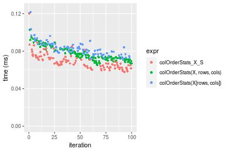

[matrixStats]: Benchmark report

---------------------------------------


# colOrderStats() and rowOrderStats() benchmarks on subsetted computation

This report benchmark the performance of colOrderStats() and rowOrderStats() on subsetted computation.


## Data type "integer"

### Data
```r
> rmatrix <- function(nrow, ncol, mode = c("logical", "double", "integer", "index"), range = c(-100, 
+     +100), na_prob = 0) {
+     mode <- match.arg(mode)
+     n <- nrow * ncol
+     if (mode == "logical") {
+         x <- sample(c(FALSE, TRUE), size = n, replace = TRUE)
+     }     else if (mode == "index") {
+         x <- seq_len(n)
+         mode <- "integer"
+     }     else {
+         x <- runif(n, min = range[1], max = range[2])
+     }
+     storage.mode(x) <- mode
+     if (na_prob > 0) 
+         x[sample(n, size = na_prob * n)] <- NA
+     dim(x) <- c(nrow, ncol)
+     x
+ }
> rmatrices <- function(scale = 10, seed = 1, ...) {
+     set.seed(seed)
+     data <- list()
+     data[[1]] <- rmatrix(nrow = scale * 1, ncol = scale * 1, ...)
+     data[[2]] <- rmatrix(nrow = scale * 10, ncol = scale * 10, ...)
+     data[[3]] <- rmatrix(nrow = scale * 100, ncol = scale * 1, ...)
+     data[[4]] <- t(data[[3]])
+     data[[5]] <- rmatrix(nrow = scale * 10, ncol = scale * 100, ...)
+     data[[6]] <- t(data[[5]])
+     names(data) <- sapply(data, FUN = function(x) paste(dim(x), collapse = "x"))
+     data
+ }
> data <- rmatrices(mode = mode)
```

### Results

#### 10x10 integer matrix


```r
> X <- data[["10x10"]]
> rows <- sample.int(nrow(X), size = nrow(X) * 0.7)
> cols <- sample.int(ncol(X), size = ncol(X) * 0.7)
> X_S <- X[rows, cols]
> gc()
          used  (Mb) gc trigger  (Mb) max used  (Mb)
Ncells 5212467 278.4   10014072 534.9 10014072 534.9
Vcells 9825683  75.0   18204443 138.9 18204443 138.9
> probs <- 0.3
> which <- round(probs * nrow(X))
> colStats <- microbenchmark(colOrderStats_X_S = colOrderStats(X_S, which = which, na.rm = FALSE), 
+     `colOrderStats(X, rows, cols)` = colOrderStats(X, rows = rows, cols = cols, which = which, na.rm = FALSE), 
+     `colOrderStats(X[rows, cols])` = colOrderStats(X[rows, cols], which = which, na.rm = FALSE), 
+     unit = "ms")
> X <- t(X)
> X_S <- t(X_S)
> gc()
          used  (Mb) gc trigger  (Mb) max used  (Mb)
Ncells 5198472 277.7   10014072 534.9 10014072 534.9
Vcells 9779557  74.7   18204443 138.9 18204443 138.9
> rowStats <- microbenchmark(rowOrderStats_X_S = rowOrderStats(X_S, which = which, na.rm = FALSE), 
+     `rowOrderStats(X, cols, rows)` = rowOrderStats(X, rows = cols, cols = rows, which = which, na.rm = FALSE), 
+     `rowOrderStats(X[cols, rows])` = rowOrderStats(X[cols, rows], which = which, na.rm = FALSE), 
+     unit = "ms")
```


_Table: Benchmarking of colOrderStats_X_S(), colOrderStats(X, rows, cols)() and colOrderStats(X[rows, cols])() on integer+10x10 data. The top panel shows times in milliseconds and the bottom panel shows relative times._


|   |expr                         |      min|        lq|      mean|    median|        uq|      max|
|:--|:----------------------------|--------:|---------:|---------:|---------:|---------:|--------:|
|1  |colOrderStats_X_S            | 0.003092| 0.0031575| 0.0047968| 0.0032120| 0.0033665| 0.153496|
|2  |colOrderStats(X, rows, cols) | 0.003540| 0.0036550| 0.0037704| 0.0037180| 0.0037875| 0.006566|
|3  |colOrderStats(X[rows, cols]) | 0.004045| 0.0042200| 0.0044514| 0.0043745| 0.0044875| 0.008954|


|   |expr                         |      min|       lq|      mean|   median|       uq|       max|
|:--|:----------------------------|--------:|--------:|---------:|--------:|--------:|---------:|
|1  |colOrderStats_X_S            | 1.000000| 1.000000| 1.0000000| 1.000000| 1.000000| 1.0000000|
|2  |colOrderStats(X, rows, cols) | 1.144890| 1.157561| 0.7860222| 1.157534| 1.125056| 0.0427764|
|3  |colOrderStats(X[rows, cols]) | 1.308215| 1.336500| 0.9279972| 1.361924| 1.332987| 0.0583338|

_Table: Benchmarking of rowOrderStats_X_S(), rowOrderStats(X, cols, rows)() and rowOrderStats(X[cols, rows])() on integer+10x10 data (transposed). The top panel shows times in milliseconds and the bottom panel shows relative times._


|   |expr                         |      min|        lq|      mean|    median|        uq|      max|
|:--|:----------------------------|--------:|---------:|---------:|---------:|---------:|--------:|
|1  |rowOrderStats_X_S            | 0.003121| 0.0032365| 0.0033724| 0.0033180| 0.0034190| 0.006534|
|2  |rowOrderStats(X, cols, rows) | 0.003596| 0.0037065| 0.0049320| 0.0038030| 0.0038935| 0.112573|
|3  |rowOrderStats(X[cols, rows]) | 0.004074| 0.0043490| 0.0045166| 0.0044505| 0.0045855| 0.006858|


|   |expr                         |      min|       lq|     mean|   median|       uq|       max|
|:--|:----------------------------|--------:|--------:|--------:|--------:|--------:|---------:|
|1  |rowOrderStats_X_S            | 1.000000| 1.000000| 1.000000| 1.000000| 1.000000|  1.000000|
|2  |rowOrderStats(X, cols, rows) | 1.152195| 1.145219| 1.462455| 1.146172| 1.138783| 17.228803|
|3  |rowOrderStats(X[cols, rows]) | 1.305351| 1.343735| 1.339296| 1.341320| 1.341182|  1.049587|

_Figure: Benchmarking of colOrderStats_X_S(), colOrderStats(X, rows, cols)() and colOrderStats(X[rows, cols])() on integer+10x10 data  as well as rowOrderStats_X_S(), rowOrderStats(X, cols, rows)() and rowOrderStats(X[cols, rows])() on the same data transposed.  Outliers are displayed as crosses.  Times are in milliseconds._


_Table: Benchmarking of colOrderStats_X_S() and rowOrderStats_X_S() on integer+10x10 data (original and transposed).  The top panel shows times in milliseconds and the bottom panel shows relative times._


|   |expr              |   min|     lq|    mean| median|     uq|     max|
|:--|:-----------------|-----:|------:|-------:|------:|------:|-------:|
|1  |colOrderStats_X_S | 3.092| 3.1575| 4.79676|  3.212| 3.3665| 153.496|
|2  |rowOrderStats_X_S | 3.121| 3.2365| 3.37239|  3.318| 3.4190|   6.534|


|   |expr              |      min|      lq|      mean|   median|       uq|       max|
|:--|:-----------------|--------:|-------:|---------:|--------:|--------:|---------:|
|1  |colOrderStats_X_S | 1.000000| 1.00000| 1.0000000| 1.000000| 1.000000| 1.0000000|
|2  |rowOrderStats_X_S | 1.009379| 1.02502| 0.7030558| 1.033001| 1.015595| 0.0425679|

_Figure: Benchmarking of colOrderStats_X_S() and rowOrderStats_X_S() on integer+10x10 data (original and transposed).  Outliers are displayed as crosses. Times are in milliseconds._


#### 100x100 integer matrix


```r
> X <- data[["100x100"]]
> rows <- sample.int(nrow(X), size = nrow(X) * 0.7)
> cols <- sample.int(ncol(X), size = ncol(X) * 0.7)
> X_S <- X[rows, cols]
> gc()
          used  (Mb) gc trigger  (Mb) max used  (Mb)
Ncells 5197133 277.6   10014072 534.9 10014072 534.9
Vcells 9447921  72.1   18204443 138.9 18204443 138.9
> probs <- 0.3
> which <- round(probs * nrow(X))
> colStats <- microbenchmark(colOrderStats_X_S = colOrderStats(X_S, which = which, na.rm = FALSE), 
+     `colOrderStats(X, rows, cols)` = colOrderStats(X, rows = rows, cols = cols, which = which, na.rm = FALSE), 
+     `colOrderStats(X[rows, cols])` = colOrderStats(X[rows, cols], which = which, na.rm = FALSE), 
+     unit = "ms")
> X <- t(X)
> X_S <- t(X_S)
> gc()
          used  (Mb) gc trigger  (Mb) max used  (Mb)
Ncells 5197108 277.6   10014072 534.9 10014072 534.9
Vcells 9452973  72.2   18204443 138.9 18204443 138.9
> rowStats <- microbenchmark(rowOrderStats_X_S = rowOrderStats(X_S, which = which, na.rm = FALSE), 
+     `rowOrderStats(X, cols, rows)` = rowOrderStats(X, rows = cols, cols = rows, which = which, na.rm = FALSE), 
+     `rowOrderStats(X[cols, rows])` = rowOrderStats(X[cols, rows], which = which, na.rm = FALSE), 
+     unit = "ms")
```


_Table: Benchmarking of colOrderStats_X_S(), colOrderStats(X, rows, cols)() and colOrderStats(X[rows, cols])() on integer+100x100 data. The top panel shows times in milliseconds and the bottom panel shows relative times._


|   |expr                         |      min|        lq|      mean|    median|       uq|      max|
|:--|:----------------------------|--------:|---------:|---------:|---------:|--------:|--------:|
|1  |colOrderStats_X_S            | 0.066121| 0.0701535| 0.0763158| 0.0736110| 0.081549| 0.096176|
|2  |colOrderStats(X, rows, cols) | 0.074681| 0.0777270| 0.0846892| 0.0825505| 0.090664| 0.111215|
|3  |colOrderStats(X[rows, cols]) | 0.075603| 0.0806075| 0.0884121| 0.0840410| 0.094604| 0.154044|


|   |expr                         |      min|       lq|     mean|   median|       uq|      max|
|:--|:----------------------------|--------:|--------:|--------:|--------:|--------:|--------:|
|1  |colOrderStats_X_S            | 1.000000| 1.000000| 1.000000| 1.000000| 1.000000| 1.000000|
|2  |colOrderStats(X, rows, cols) | 1.129460| 1.107956| 1.109722| 1.121442| 1.111773| 1.156370|
|3  |colOrderStats(X[rows, cols]) | 1.143404| 1.149016| 1.158503| 1.141691| 1.160088| 1.601689|

_Table: Benchmarking of rowOrderStats_X_S(), rowOrderStats(X, cols, rows)() and rowOrderStats(X[cols, rows])() on integer+100x100 data (transposed). The top panel shows times in milliseconds and the bottom panel shows relative times._


|   |expr                         |      min|        lq|      mean|    median|        uq|      max|
|:--|:----------------------------|--------:|---------:|---------:|---------:|---------:|--------:|
|1  |rowOrderStats_X_S            | 0.064941| 0.0686720| 0.0763861| 0.0748610| 0.0821900| 0.111635|
|3  |rowOrderStats(X[cols, rows]) | 0.073948| 0.0790535| 0.0871865| 0.0834780| 0.0929885| 0.132365|
|2  |rowOrderStats(X, cols, rows) | 0.073948| 0.0770265| 0.0857227| 0.0834885| 0.0905450| 0.132150|


|   |expr                         |      min|       lq|     mean|   median|       uq|      max|
|:--|:----------------------------|--------:|--------:|--------:|--------:|--------:|--------:|
|1  |rowOrderStats_X_S            | 1.000000| 1.000000| 1.000000| 1.000000| 1.000000| 1.000000|
|3  |rowOrderStats(X[cols, rows]) | 1.138695| 1.151175| 1.141391| 1.115107| 1.131385| 1.185695|
|2  |rowOrderStats(X, cols, rows) | 1.138695| 1.121658| 1.122228| 1.115247| 1.101655| 1.183769|

_Figure: Benchmarking of colOrderStats_X_S(), colOrderStats(X, rows, cols)() and colOrderStats(X[rows, cols])() on integer+100x100 data  as well as rowOrderStats_X_S(), rowOrderStats(X, cols, rows)() and rowOrderStats(X[cols, rows])() on the same data transposed.  Outliers are displayed as crosses.  Times are in milliseconds._


_Table: Benchmarking of colOrderStats_X_S() and rowOrderStats_X_S() on integer+100x100 data (original and transposed).  The top panel shows times in milliseconds and the bottom panel shows relative times._


|   |expr              |    min|      lq|     mean| median|     uq|     max|
|:--|:-----------------|------:|-------:|--------:|------:|------:|-------:|
|1  |colOrderStats_X_S | 66.121| 70.1535| 76.31577| 73.611| 81.549|  96.176|
|2  |rowOrderStats_X_S | 64.941| 68.6720| 76.38612| 74.861| 82.190| 111.635|


|   |expr              |       min|       lq|     mean|   median|      uq|      max|
|:--|:-----------------|---------:|--------:|--------:|--------:|-------:|--------:|
|1  |colOrderStats_X_S | 1.0000000| 1.000000| 1.000000| 1.000000| 1.00000| 1.000000|
|2  |rowOrderStats_X_S | 0.9821539| 0.978882| 1.000922| 1.016981| 1.00786| 1.160737|

_Figure: Benchmarking of colOrderStats_X_S() and rowOrderStats_X_S() on integer+100x100 data (original and transposed).  Outliers are displayed as crosses. Times are in milliseconds._


#### 1000x10 integer matrix


```r
> X <- data[["1000x10"]]
> rows <- sample.int(nrow(X), size = nrow(X) * 0.7)
> cols <- sample.int(ncol(X), size = ncol(X) * 0.7)
> X_S <- X[rows, cols]
> gc()
          used  (Mb) gc trigger  (Mb) max used  (Mb)
Ncells 5197878 277.6   10014072 534.9 10014072 534.9
Vcells 9452287  72.2   18204443 138.9 18204443 138.9
> probs <- 0.3
> which <- round(probs * nrow(X))
> colStats <- microbenchmark(colOrderStats_X_S = colOrderStats(X_S, which = which, na.rm = FALSE), 
+     `colOrderStats(X, rows, cols)` = colOrderStats(X, rows = rows, cols = cols, which = which, na.rm = FALSE), 
+     `colOrderStats(X[rows, cols])` = colOrderStats(X[rows, cols], which = which, na.rm = FALSE), 
+     unit = "ms")
> X <- t(X)
> X_S <- t(X_S)
> gc()
          used  (Mb) gc trigger  (Mb) max used  (Mb)
Ncells 5197853 277.6   10014072 534.9 10014072 534.9
Vcells 9457339  72.2   18204443 138.9 18204443 138.9
> rowStats <- microbenchmark(rowOrderStats_X_S = rowOrderStats(X_S, which = which, na.rm = FALSE), 
+     `rowOrderStats(X, cols, rows)` = rowOrderStats(X, rows = cols, cols = rows, which = which, na.rm = FALSE), 
+     `rowOrderStats(X[cols, rows])` = rowOrderStats(X[cols, rows], which = which, na.rm = FALSE), 
+     unit = "ms")
```


_Table: Benchmarking of colOrderStats_X_S(), colOrderStats(X, rows, cols)() and colOrderStats(X[rows, cols])() on integer+1000x10 data. The top panel shows times in milliseconds and the bottom panel shows relative times._


|   |expr                         |      min|        lq|      mean|    median|        uq|      max|
|:--|:----------------------------|--------:|---------:|---------:|---------:|---------:|--------:|
|1  |colOrderStats_X_S            | 0.062886| 0.0652435| 0.0709348| 0.0699890| 0.0759330| 0.090796|
|2  |colOrderStats(X, rows, cols) | 0.071847| 0.0734325| 0.0794837| 0.0759810| 0.0837360| 0.106693|
|3  |colOrderStats(X[rows, cols]) | 0.073353| 0.0751080| 0.0825314| 0.0792495| 0.0890295| 0.153002|


|   |expr                         |      min|       lq|     mean|   median|       uq|      max|
|:--|:----------------------------|--------:|--------:|--------:|--------:|--------:|--------:|
|1  |colOrderStats_X_S            | 1.000000| 1.000000| 1.000000| 1.000000| 1.000000| 1.000000|
|2  |colOrderStats(X, rows, cols) | 1.142496| 1.125514| 1.120518| 1.085614| 1.102762| 1.175085|
|3  |colOrderStats(X[rows, cols]) | 1.166444| 1.151195| 1.163482| 1.132314| 1.172474| 1.685118|

_Table: Benchmarking of rowOrderStats_X_S(), rowOrderStats(X, cols, rows)() and rowOrderStats(X[cols, rows])() on integer+1000x10 data (transposed). The top panel shows times in milliseconds and the bottom panel shows relative times._


|   |expr                         |      min|        lq|      mean|    median|        uq|      max|
|:--|:----------------------------|--------:|---------:|---------:|---------:|---------:|--------:|
|1  |rowOrderStats_X_S            | 0.060391| 0.0628315| 0.0684642| 0.0657145| 0.0725985| 0.094617|
|2  |rowOrderStats(X, cols, rows) | 0.070487| 0.0738625| 0.0807072| 0.0804800| 0.0869205| 0.104111|
|3  |rowOrderStats(X[cols, rows]) | 0.071471| 0.0743415| 0.0825607| 0.0811315| 0.0869400| 0.157974|


|   |expr                         |      min|       lq|     mean|   median|       uq|      max|
|:--|:----------------------------|--------:|--------:|--------:|--------:|--------:|--------:|
|1  |rowOrderStats_X_S            | 1.000000| 1.000000| 1.000000| 1.000000| 1.000000| 1.000000|
|2  |rowOrderStats(X, cols, rows) | 1.167177| 1.175565| 1.178824| 1.224692| 1.197277| 1.100341|
|3  |rowOrderStats(X[cols, rows]) | 1.183471| 1.183188| 1.205897| 1.234606| 1.197545| 1.669615|

_Figure: Benchmarking of colOrderStats_X_S(), colOrderStats(X, rows, cols)() and colOrderStats(X[rows, cols])() on integer+1000x10 data  as well as rowOrderStats_X_S(), rowOrderStats(X, cols, rows)() and rowOrderStats(X[cols, rows])() on the same data transposed.  Outliers are displayed as crosses.  Times are in milliseconds._


_Table: Benchmarking of colOrderStats_X_S() and rowOrderStats_X_S() on integer+1000x10 data (original and transposed).  The top panel shows times in milliseconds and the bottom panel shows relative times._


|   |expr              |    min|      lq|     mean|  median|      uq|    max|
|:--|:-----------------|------:|-------:|--------:|-------:|-------:|------:|
|2  |rowOrderStats_X_S | 60.391| 62.8315| 68.46416| 65.7145| 72.5985| 94.617|
|1  |colOrderStats_X_S | 62.886| 65.2435| 70.93485| 69.9890| 75.9330| 90.796|


|   |expr              |      min|       lq|     mean|   median|       uq|       max|
|:--|:-----------------|--------:|--------:|--------:|--------:|--------:|---------:|
|2  |rowOrderStats_X_S | 1.000000| 1.000000| 1.000000| 1.000000| 1.000000| 1.0000000|
|1  |colOrderStats_X_S | 1.041314| 1.038388| 1.036087| 1.065047| 1.045931| 0.9596161|

_Figure: Benchmarking of colOrderStats_X_S() and rowOrderStats_X_S() on integer+1000x10 data (original and transposed).  Outliers are displayed as crosses. Times are in milliseconds._


#### 10x1000 integer matrix


```r
> X <- data[["10x1000"]]
> rows <- sample.int(nrow(X), size = nrow(X) * 0.7)
> cols <- sample.int(ncol(X), size = ncol(X) * 0.7)
> X_S <- X[rows, cols]
> gc()
          used  (Mb) gc trigger  (Mb) max used  (Mb)
Ncells 5198083 277.7   10014072 534.9 10014072 534.9
Vcells 9452795  72.2   18204443 138.9 18204443 138.9
> probs <- 0.3
> which <- round(probs * nrow(X))
> colStats <- microbenchmark(colOrderStats_X_S = colOrderStats(X_S, which = which, na.rm = FALSE), 
+     `colOrderStats(X, rows, cols)` = colOrderStats(X, rows = rows, cols = cols, which = which, na.rm = FALSE), 
+     `colOrderStats(X[rows, cols])` = colOrderStats(X[rows, cols], which = which, na.rm = FALSE), 
+     unit = "ms")
> X <- t(X)
> X_S <- t(X_S)
> gc()
          used  (Mb) gc trigger  (Mb) max used  (Mb)
Ncells 5198058 277.7   10014072 534.9 10014072 534.9
Vcells 9457847  72.2   18204443 138.9 18204443 138.9
> rowStats <- microbenchmark(rowOrderStats_X_S = rowOrderStats(X_S, which = which, na.rm = FALSE), 
+     `rowOrderStats(X, cols, rows)` = rowOrderStats(X, rows = cols, cols = rows, which = which, na.rm = FALSE), 
+     `rowOrderStats(X[cols, rows])` = rowOrderStats(X[cols, rows], which = which, na.rm = FALSE), 
+     unit = "ms")
```


_Table: Benchmarking of colOrderStats_X_S(), colOrderStats(X, rows, cols)() and colOrderStats(X[rows, cols])() on integer+10x1000 data. The top panel shows times in milliseconds and the bottom panel shows relative times._


|   |expr                         |      min|        lq|      mean|    median|        uq|      max|
|:--|:----------------------------|--------:|---------:|---------:|---------:|---------:|--------:|
|1  |colOrderStats_X_S            | 0.057710| 0.0636450| 0.0693872| 0.0669580| 0.0729830| 0.120374|
|2  |colOrderStats(X, rows, cols) | 0.065321| 0.0709185| 0.0763267| 0.0738645| 0.0812185| 0.102937|
|3  |colOrderStats(X[rows, cols]) | 0.070859| 0.0765635| 0.0819316| 0.0808205| 0.0867895| 0.121626|


|   |expr                         |      min|       lq|     mean|   median|       uq|       max|
|:--|:----------------------------|--------:|--------:|--------:|--------:|--------:|---------:|
|1  |colOrderStats_X_S            | 1.000000| 1.000000| 1.000000| 1.000000| 1.000000| 1.0000000|
|2  |colOrderStats(X, rows, cols) | 1.131884| 1.114282| 1.100011| 1.103147| 1.112841| 0.8551431|
|3  |colOrderStats(X[rows, cols]) | 1.227846| 1.202978| 1.180789| 1.207033| 1.189174| 1.0104009|

_Table: Benchmarking of rowOrderStats_X_S(), rowOrderStats(X, cols, rows)() and rowOrderStats(X[cols, rows])() on integer+10x1000 data (transposed). The top panel shows times in milliseconds and the bottom panel shows relative times._


|   |expr                         |      min|       lq|      mean|    median|        uq|      max|
|:--|:----------------------------|--------:|--------:|---------:|---------:|---------:|--------:|
|1  |rowOrderStats_X_S            | 0.059385| 0.065886| 0.0718370| 0.0704865| 0.0753845| 0.111362|
|2  |rowOrderStats(X, cols, rows) | 0.063459| 0.072757| 0.0796516| 0.0780600| 0.0858455| 0.125417|
|3  |rowOrderStats(X[cols, rows]) | 0.068055| 0.077494| 0.0842068| 0.0829680| 0.0899785| 0.120011|


|   |expr                         |      min|       lq|     mean|   median|       uq|      max|
|:--|:----------------------------|--------:|--------:|--------:|--------:|--------:|--------:|
|1  |rowOrderStats_X_S            | 1.000000| 1.000000| 1.000000| 1.000000| 1.000000| 1.000000|
|2  |rowOrderStats(X, cols, rows) | 1.068603| 1.104286| 1.108782| 1.107446| 1.138769| 1.126210|
|3  |rowOrderStats(X[cols, rows]) | 1.145997| 1.176183| 1.172192| 1.177077| 1.193594| 1.077666|

_Figure: Benchmarking of colOrderStats_X_S(), colOrderStats(X, rows, cols)() and colOrderStats(X[rows, cols])() on integer+10x1000 data  as well as rowOrderStats_X_S(), rowOrderStats(X, cols, rows)() and rowOrderStats(X[cols, rows])() on the same data transposed.  Outliers are displayed as crosses.  Times are in milliseconds._





_Table: Benchmarking of colOrderStats_X_S() and rowOrderStats_X_S() on integer+10x1000 data (original and transposed).  The top panel shows times in milliseconds and the bottom panel shows relative times._


|   |expr              |    min|     lq|     mean|  median|      uq|     max|
|:--|:-----------------|------:|------:|--------:|-------:|-------:|-------:|
|1  |colOrderStats_X_S | 57.710| 63.645| 69.38718| 66.9580| 72.9830| 120.374|
|2  |rowOrderStats_X_S | 59.385| 65.886| 71.83700| 70.4865| 75.3845| 111.362|


|   |expr              |      min|       lq|     mean|   median|       uq|       max|
|:--|:-----------------|--------:|--------:|--------:|--------:|--------:|---------:|
|1  |colOrderStats_X_S | 1.000000| 1.000000| 1.000000| 1.000000| 1.000000| 1.0000000|
|2  |rowOrderStats_X_S | 1.029024| 1.035211| 1.035306| 1.052697| 1.032905| 0.9251333|

_Figure: Benchmarking of colOrderStats_X_S() and rowOrderStats_X_S() on integer+10x1000 data (original and transposed).  Outliers are displayed as crosses. Times are in milliseconds._


#### 100x1000 integer matrix


```r
> X <- data[["100x1000"]]
> rows <- sample.int(nrow(X), size = nrow(X) * 0.7)
> cols <- sample.int(ncol(X), size = ncol(X) * 0.7)
> X_S <- X[rows, cols]
> gc()
          used  (Mb) gc trigger  (Mb) max used  (Mb)
Ncells 5198293 277.7   10014072 534.9 10014072 534.9
Vcells 9476191  72.3   18204443 138.9 18204443 138.9
> probs <- 0.3
> which <- round(probs * nrow(X))
> colStats <- microbenchmark(colOrderStats_X_S = colOrderStats(X_S, which = which, na.rm = FALSE), 
+     `colOrderStats(X, rows, cols)` = colOrderStats(X, rows = rows, cols = cols, which = which, na.rm = FALSE), 
+     `colOrderStats(X[rows, cols])` = colOrderStats(X[rows, cols], which = which, na.rm = FALSE), 
+     unit = "ms")
> X <- t(X)
> X_S <- t(X_S)
> gc()
          used  (Mb) gc trigger  (Mb) max used  (Mb)
Ncells 5198268 277.7   10014072 534.9 10014072 534.9
Vcells 9526243  72.7   18204443 138.9 18204443 138.9
> rowStats <- microbenchmark(rowOrderStats_X_S = rowOrderStats(X_S, which = which, na.rm = FALSE), 
+     `rowOrderStats(X, cols, rows)` = rowOrderStats(X, rows = cols, cols = rows, which = which, na.rm = FALSE), 
+     `rowOrderStats(X[cols, rows])` = rowOrderStats(X[cols, rows], which = which, na.rm = FALSE), 
+     unit = "ms")
```


_Table: Benchmarking of colOrderStats_X_S(), colOrderStats(X, rows, cols)() and colOrderStats(X[rows, cols])() on integer+100x1000 data. The top panel shows times in milliseconds and the bottom panel shows relative times._


|   |expr                         |      min|        lq|      mean|    median|        uq|      max|
|:--|:----------------------------|--------:|---------:|---------:|---------:|---------:|--------:|
|1  |colOrderStats_X_S            | 0.608732| 0.6112345| 0.6370238| 0.6120960| 0.6143760| 0.950604|
|2  |colOrderStats(X, rows, cols) | 0.651967| 0.6538470| 0.6777269| 0.6550790| 0.6576795| 0.996473|
|3  |colOrderStats(X[rows, cols]) | 0.676908| 0.6795170| 0.7138400| 0.6820035| 0.6915930| 0.997395|


|   |expr                         |      min|       lq|     mean|   median|       uq|      max|
|:--|:----------------------------|--------:|--------:|--------:|--------:|--------:|--------:|
|1  |colOrderStats_X_S            | 1.000000| 1.000000| 1.000000| 1.000000| 1.000000| 1.000000|
|2  |colOrderStats(X, rows, cols) | 1.071025| 1.069716| 1.063896| 1.070223| 1.070484| 1.048253|
|3  |colOrderStats(X[rows, cols]) | 1.111997| 1.111712| 1.120586| 1.114210| 1.125684| 1.049222|

_Table: Benchmarking of rowOrderStats_X_S(), rowOrderStats(X, cols, rows)() and rowOrderStats(X[cols, rows])() on integer+100x1000 data (transposed). The top panel shows times in milliseconds and the bottom panel shows relative times._


|   |expr                         |      min|        lq|      mean|    median|        uq|      max|
|:--|:----------------------------|--------:|---------:|---------:|---------:|---------:|--------:|
|1  |rowOrderStats_X_S            | 0.599751| 0.6024315| 0.6427238| 0.6035945| 0.6379360| 1.014646|
|2  |rowOrderStats(X, cols, rows) | 0.656303| 0.6585645| 0.6806321| 0.6596300| 0.6623520| 1.044015|
|3  |rowOrderStats(X[cols, rows]) | 0.664208| 0.6666655| 0.7049036| 0.6685970| 0.6878085| 1.010483|


|   |expr                         |      min|       lq|     mean|   median|       uq|       max|
|:--|:----------------------------|--------:|--------:|--------:|--------:|--------:|---------:|
|1  |rowOrderStats_X_S            | 1.000000| 1.000000| 1.000000| 1.000000| 1.000000| 1.0000000|
|2  |rowOrderStats(X, cols, rows) | 1.094292| 1.093177| 1.058981| 1.092836| 1.038273| 1.0289451|
|3  |rowOrderStats(X[cols, rows]) | 1.107473| 1.106625| 1.096744| 1.107692| 1.078178| 0.9958971|

_Figure: Benchmarking of colOrderStats_X_S(), colOrderStats(X, rows, cols)() and colOrderStats(X[rows, cols])() on integer+100x1000 data  as well as rowOrderStats_X_S(), rowOrderStats(X, cols, rows)() and rowOrderStats(X[cols, rows])() on the same data transposed.  Outliers are displayed as crosses.  Times are in milliseconds._


_Table: Benchmarking of colOrderStats_X_S() and rowOrderStats_X_S() on integer+100x1000 data (original and transposed).  The top panel shows times in milliseconds and the bottom panel shows relative times._


|   |expr              |     min|       lq|     mean|   median|      uq|      max|
|:--|:-----------------|-------:|--------:|--------:|--------:|-------:|--------:|
|2  |rowOrderStats_X_S | 599.751| 602.4315| 642.7238| 603.5945| 637.936| 1014.646|
|1  |colOrderStats_X_S | 608.732| 611.2345| 637.0238| 612.0960| 614.376|  950.604|


|   |expr              |      min|       lq|      mean|   median|        uq|       max|
|:--|:-----------------|--------:|--------:|---------:|--------:|---------:|---------:|
|2  |rowOrderStats_X_S | 1.000000| 1.000000| 1.0000000| 1.000000| 1.0000000| 1.0000000|
|1  |colOrderStats_X_S | 1.014974| 1.014612| 0.9911314| 1.014085| 0.9630684| 0.9368824|

_Figure: Benchmarking of colOrderStats_X_S() and rowOrderStats_X_S() on integer+100x1000 data (original and transposed).  Outliers are displayed as crosses. Times are in milliseconds._


#### 1000x100 integer matrix


```r
> X <- data[["1000x100"]]
> rows <- sample.int(nrow(X), size = nrow(X) * 0.7)
> cols <- sample.int(ncol(X), size = ncol(X) * 0.7)
> X_S <- X[rows, cols]
> gc()
          used  (Mb) gc trigger  (Mb) max used  (Mb)
Ncells 5198506 277.7   10014072 534.9 10014072 534.9
Vcells 9477011  72.4   18204443 138.9 18204443 138.9
> probs <- 0.3
> which <- round(probs * nrow(X))
> colStats <- microbenchmark(colOrderStats_X_S = colOrderStats(X_S, which = which, na.rm = FALSE), 
+     `colOrderStats(X, rows, cols)` = colOrderStats(X, rows = rows, cols = cols, which = which, na.rm = FALSE), 
+     `colOrderStats(X[rows, cols])` = colOrderStats(X[rows, cols], which = which, na.rm = FALSE), 
+     unit = "ms")
> X <- t(X)
> X_S <- t(X_S)
> gc()
          used  (Mb) gc trigger  (Mb) max used  (Mb)
Ncells 5198481 277.7   10014072 534.9 10014072 534.9
Vcells 9527063  72.7   18204443 138.9 18204443 138.9
> rowStats <- microbenchmark(rowOrderStats_X_S = rowOrderStats(X_S, which = which, na.rm = FALSE), 
+     `rowOrderStats(X, cols, rows)` = rowOrderStats(X, rows = cols, cols = rows, which = which, na.rm = FALSE), 
+     `rowOrderStats(X[cols, rows])` = rowOrderStats(X[cols, rows], which = which, na.rm = FALSE), 
+     unit = "ms")
```


_Table: Benchmarking of colOrderStats_X_S(), colOrderStats(X, rows, cols)() and colOrderStats(X[rows, cols])() on integer+1000x100 data. The top panel shows times in milliseconds and the bottom panel shows relative times._


|   |expr                         |      min|        lq|      mean|    median|        uq|      max|
|:--|:----------------------------|--------:|---------:|---------:|---------:|---------:|--------:|
|1  |colOrderStats_X_S            | 0.551867| 0.5535185| 0.5896946| 0.5544580| 0.5641970| 0.933865|
|2  |colOrderStats(X, rows, cols) | 0.594572| 0.5971850| 0.6423620| 0.5981645| 0.6113505| 0.976888|
|3  |colOrderStats(X[rows, cols]) | 0.615953| 0.6188390| 0.6634310| 0.6208175| 0.6740485| 1.061921|


|   |expr                         |      min|       lq|     mean|   median|       uq|      max|
|:--|:----------------------------|--------:|--------:|--------:|--------:|--------:|--------:|
|1  |colOrderStats_X_S            | 1.000000| 1.000000| 1.000000| 1.000000| 1.000000| 1.000000|
|2  |colOrderStats(X, rows, cols) | 1.077383| 1.078889| 1.089313| 1.078827| 1.083576| 1.046070|
|3  |colOrderStats(X[rows, cols]) | 1.116126| 1.118010| 1.125042| 1.119684| 1.194704| 1.137125|

_Table: Benchmarking of rowOrderStats_X_S(), rowOrderStats(X, cols, rows)() and rowOrderStats(X[cols, rows])() on integer+1000x100 data (transposed). The top panel shows times in milliseconds and the bottom panel shows relative times._


|   |expr                         |      min|        lq|      mean|    median|        uq|      max|
|:--|:----------------------------|--------:|---------:|---------:|---------:|---------:|--------:|
|1  |rowOrderStats_X_S            | 0.546533| 0.5488420| 0.5921733| 0.5504910| 0.6055025| 0.833032|
|2  |rowOrderStats(X, cols, rows) | 0.604677| 0.6066830| 0.6505353| 0.6085400| 0.6325075| 1.028505|
|3  |rowOrderStats(X[cols, rows]) | 0.613385| 0.6175315| 0.6691044| 0.6231325| 0.6742495| 1.008029|


|   |expr                         |      min|       lq|     mean|   median|       uq|      max|
|:--|:----------------------------|--------:|--------:|--------:|--------:|--------:|--------:|
|1  |rowOrderStats_X_S            | 1.000000| 1.000000| 1.000000| 1.000000| 1.000000| 1.000000|
|2  |rowOrderStats(X, cols, rows) | 1.106387| 1.105387| 1.098556| 1.105449| 1.044599| 1.234652|
|3  |rowOrderStats(X[cols, rows]) | 1.122320| 1.125153| 1.129913| 1.131958| 1.113537| 1.210072|

_Figure: Benchmarking of colOrderStats_X_S(), colOrderStats(X, rows, cols)() and colOrderStats(X[rows, cols])() on integer+1000x100 data  as well as rowOrderStats_X_S(), rowOrderStats(X, cols, rows)() and rowOrderStats(X[cols, rows])() on the same data transposed.  Outliers are displayed as crosses.  Times are in milliseconds._


_Table: Benchmarking of colOrderStats_X_S() and rowOrderStats_X_S() on integer+1000x100 data (original and transposed).  The top panel shows times in milliseconds and the bottom panel shows relative times._


|   |expr              |     min|       lq|     mean|  median|       uq|     max|
|:--|:-----------------|-------:|--------:|--------:|-------:|--------:|-------:|
|2  |rowOrderStats_X_S | 546.533| 548.8420| 592.1733| 550.491| 605.5025| 833.032|
|1  |colOrderStats_X_S | 551.867| 553.5185| 589.6946| 554.458| 564.1970| 933.865|


|   |expr              |     min|       lq|      mean|   median|        uq|      max|
|:--|:-----------------|-------:|--------:|---------:|--------:|---------:|--------:|
|2  |rowOrderStats_X_S | 1.00000| 1.000000| 1.0000000| 1.000000| 1.0000000| 1.000000|
|1  |colOrderStats_X_S | 1.00976| 1.008521| 0.9958143| 1.007206| 0.9317831| 1.121043|

_Figure: Benchmarking of colOrderStats_X_S() and rowOrderStats_X_S() on integer+1000x100 data (original and transposed).  Outliers are displayed as crosses. Times are in milliseconds._


## Data type "double"

### Data
```r
> rmatrix <- function(nrow, ncol, mode = c("logical", "double", "integer", "index"), range = c(-100, 
+     +100), na_prob = 0) {
+     mode <- match.arg(mode)
+     n <- nrow * ncol
+     if (mode == "logical") {
+         x <- sample(c(FALSE, TRUE), size = n, replace = TRUE)
+     }     else if (mode == "index") {
+         x <- seq_len(n)
+         mode <- "integer"
+     }     else {
+         x <- runif(n, min = range[1], max = range[2])
+     }
+     storage.mode(x) <- mode
+     if (na_prob > 0) 
+         x[sample(n, size = na_prob * n)] <- NA
+     dim(x) <- c(nrow, ncol)
+     x
+ }
> rmatrices <- function(scale = 10, seed = 1, ...) {
+     set.seed(seed)
+     data <- list()
+     data[[1]] <- rmatrix(nrow = scale * 1, ncol = scale * 1, ...)
+     data[[2]] <- rmatrix(nrow = scale * 10, ncol = scale * 10, ...)
+     data[[3]] <- rmatrix(nrow = scale * 100, ncol = scale * 1, ...)
+     data[[4]] <- t(data[[3]])
+     data[[5]] <- rmatrix(nrow = scale * 10, ncol = scale * 100, ...)
+     data[[6]] <- t(data[[5]])
+     names(data) <- sapply(data, FUN = function(x) paste(dim(x), collapse = "x"))
+     data
+ }
> data <- rmatrices(mode = mode)
```

### Results

#### 10x10 double matrix


```r
> X <- data[["10x10"]]
> rows <- sample.int(nrow(X), size = nrow(X) * 0.7)
> cols <- sample.int(ncol(X), size = ncol(X) * 0.7)
> X_S <- X[rows, cols]
> gc()
          used  (Mb) gc trigger  (Mb) max used  (Mb)
Ncells 5198723 277.7   10014072 534.9 10014072 534.9
Vcells 9568206  73.0   18204443 138.9 18204443 138.9
> probs <- 0.3
> which <- round(probs * nrow(X))
> colStats <- microbenchmark(colOrderStats_X_S = colOrderStats(X_S, which = which, na.rm = FALSE), 
+     `colOrderStats(X, rows, cols)` = colOrderStats(X, rows = rows, cols = cols, which = which, na.rm = FALSE), 
+     `colOrderStats(X[rows, cols])` = colOrderStats(X[rows, cols], which = which, na.rm = FALSE), 
+     unit = "ms")
> X <- t(X)
> X_S <- t(X_S)
> gc()
          used  (Mb) gc trigger  (Mb) max used  (Mb)
Ncells 5198689 277.7   10014072 534.9 10014072 534.9
Vcells 9568343  73.1   18204443 138.9 18204443 138.9
> rowStats <- microbenchmark(rowOrderStats_X_S = rowOrderStats(X_S, which = which, na.rm = FALSE), 
+     `rowOrderStats(X, cols, rows)` = rowOrderStats(X, rows = cols, cols = rows, which = which, na.rm = FALSE), 
+     `rowOrderStats(X[cols, rows])` = rowOrderStats(X[cols, rows], which = which, na.rm = FALSE), 
+     unit = "ms")
```


_Table: Benchmarking of colOrderStats_X_S(), colOrderStats(X, rows, cols)() and colOrderStats(X[rows, cols])() on double+10x10 data. The top panel shows times in milliseconds and the bottom panel shows relative times._


|   |expr                         |      min|        lq|      mean|   median|       uq|      max|
|:--|:----------------------------|--------:|---------:|---------:|--------:|--------:|--------:|
|1  |colOrderStats_X_S            | 0.002561| 0.0026805| 0.0030032| 0.002750| 0.002862| 0.022866|
|2  |colOrderStats(X, rows, cols) | 0.002873| 0.0030415| 0.0033411| 0.003149| 0.003297| 0.017001|
|3  |colOrderStats(X[rows, cols]) | 0.003292| 0.0034520| 0.0037691| 0.003621| 0.003793| 0.009135|


|   |expr                         |      min|       lq|     mean|   median|       uq|       max|
|:--|:----------------------------|--------:|--------:|--------:|--------:|--------:|---------:|
|1  |colOrderStats_X_S            | 1.000000| 1.000000| 1.000000| 1.000000| 1.000000| 1.0000000|
|2  |colOrderStats(X, rows, cols) | 1.121827| 1.134676| 1.112496| 1.145091| 1.151992| 0.7435056|
|3  |colOrderStats(X[rows, cols]) | 1.285435| 1.287819| 1.255020| 1.316727| 1.325297| 0.3995014|

_Table: Benchmarking of rowOrderStats_X_S(), rowOrderStats(X, cols, rows)() and rowOrderStats(X[cols, rows])() on double+10x10 data (transposed). The top panel shows times in milliseconds and the bottom panel shows relative times._


|   |expr                         |      min|        lq|      mean|   median|        uq|      max|
|:--|:----------------------------|--------:|---------:|---------:|--------:|---------:|--------:|
|1  |rowOrderStats_X_S            | 0.002821| 0.0029270| 0.0032028| 0.003023| 0.0030955| 0.017798|
|2  |rowOrderStats(X, cols, rows) | 0.003234| 0.0033715| 0.0037753| 0.003473| 0.0036130| 0.028864|
|3  |rowOrderStats(X[cols, rows]) | 0.003654| 0.0038350| 0.0041168| 0.003998| 0.0041595| 0.007839|


|   |expr                         |      min|       lq|     mean|   median|       uq|       max|
|:--|:----------------------------|--------:|--------:|--------:|--------:|--------:|---------:|
|1  |rowOrderStats_X_S            | 1.000000| 1.000000| 1.000000| 1.000000| 1.000000| 1.0000000|
|2  |rowOrderStats(X, cols, rows) | 1.146402| 1.151862| 1.178730| 1.148859| 1.167178| 1.6217553|
|3  |rowOrderStats(X[cols, rows]) | 1.295285| 1.310215| 1.285355| 1.322527| 1.343725| 0.4404427|

_Figure: Benchmarking of colOrderStats_X_S(), colOrderStats(X, rows, cols)() and colOrderStats(X[rows, cols])() on double+10x10 data  as well as rowOrderStats_X_S(), rowOrderStats(X, cols, rows)() and rowOrderStats(X[cols, rows])() on the same data transposed.  Outliers are displayed as crosses.  Times are in milliseconds._


_Table: Benchmarking of colOrderStats_X_S() and rowOrderStats_X_S() on double+10x10 data (original and transposed).  The top panel shows times in milliseconds and the bottom panel shows relative times._


|   |expr              |   min|     lq|    mean| median|     uq|    max|
|:--|:-----------------|-----:|------:|-------:|------:|------:|------:|
|1  |colOrderStats_X_S | 2.561| 2.6805| 3.00322|  2.750| 2.8620| 22.866|
|2  |rowOrderStats_X_S | 2.821| 2.9270| 3.20282|  3.023| 3.0955| 17.798|


|   |expr              |      min|      lq|     mean|   median|       uq|       max|
|:--|:-----------------|--------:|-------:|--------:|--------:|--------:|---------:|
|1  |colOrderStats_X_S | 1.000000| 1.00000| 1.000000| 1.000000| 1.000000| 1.0000000|
|2  |rowOrderStats_X_S | 1.101523| 1.09196| 1.066462| 1.099273| 1.081586| 0.7783609|

_Figure: Benchmarking of colOrderStats_X_S() and rowOrderStats_X_S() on double+10x10 data (original and transposed).  Outliers are displayed as crosses. Times are in milliseconds._


#### 100x100 double matrix


```r
> X <- data[["100x100"]]
> rows <- sample.int(nrow(X), size = nrow(X) * 0.7)
> cols <- sample.int(ncol(X), size = ncol(X) * 0.7)
> X_S <- X[rows, cols]
> gc()
          used  (Mb) gc trigger  (Mb) max used  (Mb)
Ncells 5198920 277.7   10014072 534.9 10014072 534.9
Vcells 9574217  73.1   18204443 138.9 18204443 138.9
> probs <- 0.3
> which <- round(probs * nrow(X))
> colStats <- microbenchmark(colOrderStats_X_S = colOrderStats(X_S, which = which, na.rm = FALSE), 
+     `colOrderStats(X, rows, cols)` = colOrderStats(X, rows = rows, cols = cols, which = which, na.rm = FALSE), 
+     `colOrderStats(X[rows, cols])` = colOrderStats(X[rows, cols], which = which, na.rm = FALSE), 
+     unit = "ms")
> X <- t(X)
> X_S <- t(X_S)
> gc()
          used  (Mb) gc trigger  (Mb) max used  (Mb)
Ncells 5198895 277.7   10014072 534.9 10014072 534.9
Vcells 9584269  73.2   18204443 138.9 18204443 138.9
> rowStats <- microbenchmark(rowOrderStats_X_S = rowOrderStats(X_S, which = which, na.rm = FALSE), 
+     `rowOrderStats(X, cols, rows)` = rowOrderStats(X, rows = cols, cols = rows, which = which, na.rm = FALSE), 
+     `rowOrderStats(X[cols, rows])` = rowOrderStats(X[cols, rows], which = which, na.rm = FALSE), 
+     unit = "ms")
```


_Table: Benchmarking of colOrderStats_X_S(), colOrderStats(X, rows, cols)() and colOrderStats(X[rows, cols])() on double+100x100 data. The top panel shows times in milliseconds and the bottom panel shows relative times._


|   |expr                         |      min|        lq|      mean|    median|        uq|      max|
|:--|:----------------------------|--------:|---------:|---------:|---------:|---------:|--------:|
|1  |colOrderStats_X_S            | 0.091265| 0.0956455| 0.1025853| 0.1012235| 0.1051165| 0.128138|
|2  |colOrderStats(X, rows, cols) | 0.096760| 0.1010865| 0.1086970| 0.1067725| 0.1114930| 0.140056|
|3  |colOrderStats(X[rows, cols]) | 0.102401| 0.1076110| 0.1167172| 0.1155225| 0.1181365| 0.174417|


|   |expr                         |      min|       lq|     mean|   median|       uq|      max|
|:--|:----------------------------|--------:|--------:|--------:|--------:|--------:|--------:|
|1  |colOrderStats_X_S            | 1.000000| 1.000000| 1.000000| 1.000000| 1.000000| 1.000000|
|2  |colOrderStats(X, rows, cols) | 1.060209| 1.056887| 1.059577| 1.054819| 1.060661| 1.093009|
|3  |colOrderStats(X[rows, cols]) | 1.122018| 1.125103| 1.137757| 1.141262| 1.123863| 1.361165|

_Table: Benchmarking of rowOrderStats_X_S(), rowOrderStats(X, cols, rows)() and rowOrderStats(X[cols, rows])() on double+100x100 data (transposed). The top panel shows times in milliseconds and the bottom panel shows relative times._


|   |expr                         |      min|        lq|      mean|    median|        uq|      max|
|:--|:----------------------------|--------:|---------:|---------:|---------:|---------:|--------:|
|1  |rowOrderStats_X_S            | 0.091651| 0.0995725| 0.1060669| 0.1073190| 0.1111340| 0.128517|
|2  |rowOrderStats(X, cols, rows) | 0.097775| 0.1074840| 0.1129653| 0.1132505| 0.1157200| 0.154870|
|3  |rowOrderStats(X[cols, rows]) | 0.103045| 0.1135085| 0.1188228| 0.1188755| 0.1222145| 0.141749|


|   |expr                         |      min|       lq|     mean|   median|       uq|      max|
|:--|:----------------------------|--------:|--------:|--------:|--------:|--------:|--------:|
|1  |rowOrderStats_X_S            | 1.000000| 1.000000| 1.000000| 1.000000| 1.000000| 1.000000|
|2  |rowOrderStats(X, cols, rows) | 1.066819| 1.079455| 1.065038| 1.055270| 1.041265| 1.205055|
|3  |rowOrderStats(X[cols, rows]) | 1.124319| 1.139958| 1.120262| 1.107684| 1.099704| 1.102959|

_Figure: Benchmarking of colOrderStats_X_S(), colOrderStats(X, rows, cols)() and colOrderStats(X[rows, cols])() on double+100x100 data  as well as rowOrderStats_X_S(), rowOrderStats(X, cols, rows)() and rowOrderStats(X[cols, rows])() on the same data transposed.  Outliers are displayed as crosses.  Times are in milliseconds._


_Table: Benchmarking of colOrderStats_X_S() and rowOrderStats_X_S() on double+100x100 data (original and transposed).  The top panel shows times in milliseconds and the bottom panel shows relative times._


|   |expr              |    min|      lq|     mean|   median|       uq|     max|
|:--|:-----------------|------:|-------:|--------:|--------:|--------:|-------:|
|1  |colOrderStats_X_S | 91.265| 95.6455| 102.5853| 101.2235| 105.1165| 128.138|
|2  |rowOrderStats_X_S | 91.651| 99.5725| 106.0669| 107.3190| 111.1340| 128.517|


|   |expr              |      min|       lq|     mean|   median|       uq|      max|
|:--|:-----------------|--------:|--------:|--------:|--------:|--------:|--------:|
|1  |colOrderStats_X_S | 1.000000| 1.000000| 1.000000| 1.000000| 1.000000| 1.000000|
|2  |rowOrderStats_X_S | 1.004229| 1.041058| 1.033939| 1.060218| 1.057246| 1.002958|

_Figure: Benchmarking of colOrderStats_X_S() and rowOrderStats_X_S() on double+100x100 data (original and transposed).  Outliers are displayed as crosses. Times are in milliseconds._


#### 1000x10 double matrix


```r
> X <- data[["1000x10"]]
> rows <- sample.int(nrow(X), size = nrow(X) * 0.7)
> cols <- sample.int(ncol(X), size = ncol(X) * 0.7)
> X_S <- X[rows, cols]
> gc()
          used  (Mb) gc trigger  (Mb) max used  (Mb)
Ncells 5199120 277.7   10014072 534.9 10014072 534.9
Vcells 9574632  73.1   18204443 138.9 18204443 138.9
> probs <- 0.3
> which <- round(probs * nrow(X))
> colStats <- microbenchmark(colOrderStats_X_S = colOrderStats(X_S, which = which, na.rm = FALSE), 
+     `colOrderStats(X, rows, cols)` = colOrderStats(X, rows = rows, cols = cols, which = which, na.rm = FALSE), 
+     `colOrderStats(X[rows, cols])` = colOrderStats(X[rows, cols], which = which, na.rm = FALSE), 
+     unit = "ms")
> X <- t(X)
> X_S <- t(X_S)
> gc()
          used  (Mb) gc trigger  (Mb) max used  (Mb)
Ncells 5199095 277.7   10014072 534.9 10014072 534.9
Vcells 9584684  73.2   18204443 138.9 18204443 138.9
> rowStats <- microbenchmark(rowOrderStats_X_S = rowOrderStats(X_S, which = which, na.rm = FALSE), 
+     `rowOrderStats(X, cols, rows)` = rowOrderStats(X, rows = cols, cols = rows, which = which, na.rm = FALSE), 
+     `rowOrderStats(X[cols, rows])` = rowOrderStats(X[cols, rows], which = which, na.rm = FALSE), 
+     unit = "ms")
```


_Table: Benchmarking of colOrderStats_X_S(), colOrderStats(X, rows, cols)() and colOrderStats(X[rows, cols])() on double+1000x10 data. The top panel shows times in milliseconds and the bottom panel shows relative times._


|   |expr                         |      min|        lq|      mean|    median|        uq|      max|
|:--|:----------------------------|--------:|---------:|---------:|---------:|---------:|--------:|
|1  |colOrderStats_X_S            | 0.104923| 0.1130770| 0.1224890| 0.1192585| 0.1299445| 0.157246|
|2  |colOrderStats(X, rows, cols) | 0.111768| 0.1199680| 0.1293068| 0.1240710| 0.1376485| 0.177893|
|3  |colOrderStats(X[rows, cols]) | 0.116851| 0.1246775| 0.1355212| 0.1296485| 0.1466060| 0.198549|


|   |expr                         |      min|       lq|     mean|   median|       uq|      max|
|:--|:----------------------------|--------:|--------:|--------:|--------:|--------:|--------:|
|1  |colOrderStats_X_S            | 1.000000| 1.000000| 1.000000| 1.000000| 1.000000| 1.000000|
|2  |colOrderStats(X, rows, cols) | 1.065238| 1.060941| 1.055661| 1.040353| 1.059287| 1.131304|
|3  |colOrderStats(X[rows, cols]) | 1.113683| 1.102589| 1.106395| 1.087122| 1.128220| 1.262665|

_Table: Benchmarking of rowOrderStats_X_S(), rowOrderStats(X, cols, rows)() and rowOrderStats(X[cols, rows])() on double+1000x10 data (transposed). The top panel shows times in milliseconds and the bottom panel shows relative times._


|   |expr                         |      min|        lq|      mean|    median|        uq|      max|
|:--|:----------------------------|--------:|---------:|---------:|---------:|---------:|--------:|
|1  |rowOrderStats_X_S            | 0.099570| 0.1118610| 0.1186172| 0.1132710| 0.1252095| 0.150520|
|2  |rowOrderStats(X, cols, rows) | 0.107130| 0.1179735| 0.1289093| 0.1260255| 0.1390605| 0.166052|
|3  |rowOrderStats(X[cols, rows]) | 0.113551| 0.1248365| 0.1358597| 0.1327130| 0.1450135| 0.213023|


|   |expr                         |      min|       lq|     mean|   median|       uq|      max|
|:--|:----------------------------|--------:|--------:|--------:|--------:|--------:|--------:|
|1  |rowOrderStats_X_S            | 1.000000| 1.000000| 1.000000| 1.000000| 1.000000| 1.000000|
|2  |rowOrderStats(X, cols, rows) | 1.075927| 1.054644| 1.086767| 1.112602| 1.110623| 1.103189|
|3  |rowOrderStats(X[cols, rows]) | 1.140414| 1.115997| 1.145362| 1.171642| 1.158167| 1.415247|

_Figure: Benchmarking of colOrderStats_X_S(), colOrderStats(X, rows, cols)() and colOrderStats(X[rows, cols])() on double+1000x10 data  as well as rowOrderStats_X_S(), rowOrderStats(X, cols, rows)() and rowOrderStats(X[cols, rows])() on the same data transposed.  Outliers are displayed as crosses.  Times are in milliseconds._


_Table: Benchmarking of colOrderStats_X_S() and rowOrderStats_X_S() on double+1000x10 data (original and transposed).  The top panel shows times in milliseconds and the bottom panel shows relative times._


|   |expr              |     min|      lq|     mean|   median|       uq|     max|
|:--|:-----------------|-------:|-------:|--------:|--------:|--------:|-------:|
|2  |rowOrderStats_X_S |  99.570| 111.861| 118.6172| 113.2710| 125.2095| 150.520|
|1  |colOrderStats_X_S | 104.923| 113.077| 122.4890| 119.2585| 129.9445| 157.246|


|   |expr              |      min|       lq|     mean|  median|       uq|      max|
|:--|:-----------------|--------:|--------:|--------:|-------:|--------:|--------:|
|2  |rowOrderStats_X_S | 1.000000| 1.000000| 1.000000| 1.00000| 1.000000| 1.000000|
|1  |colOrderStats_X_S | 1.053761| 1.010871| 1.032641| 1.05286| 1.037817| 1.044685|

_Figure: Benchmarking of colOrderStats_X_S() and rowOrderStats_X_S() on double+1000x10 data (original and transposed).  Outliers are displayed as crosses. Times are in milliseconds._


#### 10x1000 double matrix


```r
> X <- data[["10x1000"]]
> rows <- sample.int(nrow(X), size = nrow(X) * 0.7)
> cols <- sample.int(ncol(X), size = ncol(X) * 0.7)
> X_S <- X[rows, cols]
> gc()
          used  (Mb) gc trigger  (Mb) max used  (Mb)
Ncells 5199325 277.7   10014072 534.9 10014072 534.9
Vcells 9575935  73.1   18204443 138.9 18204443 138.9
> probs <- 0.3
> which <- round(probs * nrow(X))
> colStats <- microbenchmark(colOrderStats_X_S = colOrderStats(X_S, which = which, na.rm = FALSE), 
+     `colOrderStats(X, rows, cols)` = colOrderStats(X, rows = rows, cols = cols, which = which, na.rm = FALSE), 
+     `colOrderStats(X[rows, cols])` = colOrderStats(X[rows, cols], which = which, na.rm = FALSE), 
+     unit = "ms")
> X <- t(X)
> X_S <- t(X_S)
> gc()
          used  (Mb) gc trigger  (Mb) max used  (Mb)
Ncells 5199300 277.7   10014072 534.9 10014072 534.9
Vcells 9585987  73.2   18204443 138.9 18204443 138.9
> rowStats <- microbenchmark(rowOrderStats_X_S = rowOrderStats(X_S, which = which, na.rm = FALSE), 
+     `rowOrderStats(X, cols, rows)` = rowOrderStats(X, rows = cols, cols = rows, which = which, na.rm = FALSE), 
+     `rowOrderStats(X[cols, rows])` = rowOrderStats(X[cols, rows], which = which, na.rm = FALSE), 
+     unit = "ms")
```


_Table: Benchmarking of colOrderStats_X_S(), colOrderStats(X, rows, cols)() and colOrderStats(X[rows, cols])() on double+10x1000 data. The top panel shows times in milliseconds and the bottom panel shows relative times._


|   |expr                         |      min|        lq|      mean|    median|        uq|      max|
|:--|:----------------------------|--------:|---------:|---------:|---------:|---------:|--------:|
|1  |colOrderStats_X_S            | 0.086080| 0.0908400| 0.1008102| 0.0987805| 0.1091185| 0.153968|
|2  |colOrderStats(X, rows, cols) | 0.091968| 0.0991990| 0.1069583| 0.1027480| 0.1111295| 0.172633|
|3  |colOrderStats(X[rows, cols]) | 0.100816| 0.1075035| 0.1160769| 0.1124930| 0.1232330| 0.168563|


|   |expr                         |      min|       lq|     mean|   median|      uq|      max|
|:--|:----------------------------|--------:|--------:|--------:|--------:|-------:|--------:|
|1  |colOrderStats_X_S            | 1.000000| 1.000000| 1.000000| 1.000000| 1.00000| 1.000000|
|2  |colOrderStats(X, rows, cols) | 1.068402| 1.092019| 1.060987| 1.040165| 1.01843| 1.121226|
|3  |colOrderStats(X[rows, cols]) | 1.171190| 1.183438| 1.151441| 1.138818| 1.12935| 1.094792|

_Table: Benchmarking of rowOrderStats_X_S(), rowOrderStats(X, cols, rows)() and rowOrderStats(X[cols, rows])() on double+10x1000 data (transposed). The top panel shows times in milliseconds and the bottom panel shows relative times._


|   |expr                         |      min|        lq|      mean|    median|        uq|      max|
|:--|:----------------------------|--------:|---------:|---------:|---------:|---------:|--------:|
|1  |rowOrderStats_X_S            | 0.085243| 0.0899800| 0.0973618| 0.0939735| 0.1028690| 0.128042|
|2  |rowOrderStats(X, cols, rows) | 0.094101| 0.0995700| 0.1067435| 0.1034955| 0.1111345| 0.159754|
|3  |rowOrderStats(X[cols, rows]) | 0.098668| 0.1039475| 0.1123120| 0.1083725| 0.1194425| 0.143867|


|   |expr                         |      min|       lq|     mean|   median|       uq|      max|
|:--|:----------------------------|--------:|--------:|--------:|--------:|--------:|--------:|
|1  |rowOrderStats_X_S            | 1.000000| 1.000000| 1.000000| 1.000000| 1.000000| 1.000000|
|2  |rowOrderStats(X, cols, rows) | 1.103915| 1.106579| 1.096359| 1.101326| 1.080350| 1.247669|
|3  |rowOrderStats(X[cols, rows]) | 1.157491| 1.155229| 1.153553| 1.153224| 1.161113| 1.123592|

_Figure: Benchmarking of colOrderStats_X_S(), colOrderStats(X, rows, cols)() and colOrderStats(X[rows, cols])() on double+10x1000 data  as well as rowOrderStats_X_S(), rowOrderStats(X, cols, rows)() and rowOrderStats(X[cols, rows])() on the same data transposed.  Outliers are displayed as crosses.  Times are in milliseconds._


_Table: Benchmarking of colOrderStats_X_S() and rowOrderStats_X_S() on double+10x1000 data (original and transposed).  The top panel shows times in milliseconds and the bottom panel shows relative times._


|   |expr              |    min|    lq|      mean|  median|       uq|     max|
|:--|:-----------------|------:|-----:|---------:|-------:|--------:|-------:|
|2  |rowOrderStats_X_S | 85.243| 89.98|  97.36182| 93.9735| 102.8690| 128.042|
|1  |colOrderStats_X_S | 86.080| 90.84| 100.81015| 98.7805| 109.1185| 153.968|


|   |expr              |      min|       lq|     mean|   median|       uq|     max|
|:--|:-----------------|--------:|--------:|--------:|--------:|--------:|-------:|
|2  |rowOrderStats_X_S | 1.000000| 1.000000| 1.000000| 1.000000| 1.000000| 1.00000|
|1  |colOrderStats_X_S | 1.009819| 1.009558| 1.035418| 1.051153| 1.060752| 1.20248|

_Figure: Benchmarking of colOrderStats_X_S() and rowOrderStats_X_S() on double+10x1000 data (original and transposed).  Outliers are displayed as crosses. Times are in milliseconds._


#### 100x1000 double matrix


```r
> X <- data[["100x1000"]]
> rows <- sample.int(nrow(X), size = nrow(X) * 0.7)
> cols <- sample.int(ncol(X), size = ncol(X) * 0.7)
> X_S <- X[rows, cols]
> gc()
          used  (Mb) gc trigger  (Mb) max used  (Mb)
Ncells 5199535 277.7   10014072 534.9 10014072 534.9
Vcells 9620207  73.4   18204443 138.9 18204443 138.9
> probs <- 0.3
> which <- round(probs * nrow(X))
> colStats <- microbenchmark(colOrderStats_X_S = colOrderStats(X_S, which = which, na.rm = FALSE), 
+     `colOrderStats(X, rows, cols)` = colOrderStats(X, rows = rows, cols = cols, which = which, na.rm = FALSE), 
+     `colOrderStats(X[rows, cols])` = colOrderStats(X[rows, cols], which = which, na.rm = FALSE), 
+     unit = "ms")
> X <- t(X)
> X_S <- t(X_S)
> gc()
          used  (Mb) gc trigger  (Mb) max used  (Mb)
Ncells 5199510 277.7   10014072 534.9 10014072 534.9
Vcells 9720259  74.2   18204443 138.9 18204443 138.9
> rowStats <- microbenchmark(rowOrderStats_X_S = rowOrderStats(X_S, which = which, na.rm = FALSE), 
+     `rowOrderStats(X, cols, rows)` = rowOrderStats(X, rows = cols, cols = rows, which = which, na.rm = FALSE), 
+     `rowOrderStats(X[cols, rows])` = rowOrderStats(X[cols, rows], which = which, na.rm = FALSE), 
+     unit = "ms")
```


_Table: Benchmarking of colOrderStats_X_S(), colOrderStats(X, rows, cols)() and colOrderStats(X[rows, cols])() on double+100x1000 data. The top panel shows times in milliseconds and the bottom panel shows relative times._


|   |expr                         |      min|        lq|      mean|    median|        uq|      max|
|:--|:----------------------------|--------:|---------:|---------:|---------:|---------:|--------:|
|1  |colOrderStats_X_S            | 0.834093| 0.8389755| 0.8800887| 0.8457800| 0.8594115| 1.410256|
|2  |colOrderStats(X, rows, cols) | 0.884729| 0.8891845| 0.9214362| 0.8905165| 0.8962120| 1.482446|
|3  |colOrderStats(X[rows, cols]) | 0.931271| 0.9429420| 1.0252994| 1.0013845| 1.0577465| 1.423672|


|   |expr                         |      min|       lq|     mean|   median|       uq|      max|
|:--|:----------------------------|--------:|--------:|--------:|--------:|--------:|--------:|
|1  |colOrderStats_X_S            | 1.000000| 1.000000| 1.000000| 1.000000| 1.000000| 1.000000|
|2  |colOrderStats(X, rows, cols) | 1.060708| 1.059846| 1.046981| 1.052894| 1.042821| 1.051189|
|3  |colOrderStats(X[rows, cols]) | 1.116507| 1.123921| 1.164996| 1.183977| 1.230780| 1.009513|

_Table: Benchmarking of rowOrderStats_X_S(), rowOrderStats(X, cols, rows)() and rowOrderStats(X[cols, rows])() on double+100x1000 data (transposed). The top panel shows times in milliseconds and the bottom panel shows relative times._


|   |expr                         |      min|        lq|      mean|    median|        uq|      max|
|:--|:----------------------------|--------:|---------:|---------:|---------:|---------:|--------:|
|1  |rowOrderStats_X_S            | 0.845316| 0.8490905| 0.8994846| 0.8510905| 0.8608505| 1.495244|
|2  |rowOrderStats(X, cols, rows) | 0.899083| 0.9036665| 0.9310003| 0.9051690| 0.9165845| 1.502649|
|3  |rowOrderStats(X[cols, rows]) | 0.939139| 0.9435340| 0.9875150| 0.9460880| 0.9516830| 1.428784|


|   |expr                         |      min|       lq|     mean|   median|       uq|       max|
|:--|:----------------------------|--------:|--------:|--------:|--------:|--------:|---------:|
|1  |rowOrderStats_X_S            | 1.000000| 1.000000| 1.000000| 1.000000| 1.000000| 1.0000000|
|2  |rowOrderStats(X, cols, rows) | 1.063606| 1.064276| 1.035038| 1.063540| 1.064743| 1.0049524|
|3  |rowOrderStats(X[cols, rows]) | 1.110992| 1.111229| 1.097867| 1.111619| 1.105515| 0.9555524|

_Figure: Benchmarking of colOrderStats_X_S(), colOrderStats(X, rows, cols)() and colOrderStats(X[rows, cols])() on double+100x1000 data  as well as rowOrderStats_X_S(), rowOrderStats(X, cols, rows)() and rowOrderStats(X[cols, rows])() on the same data transposed.  Outliers are displayed as crosses.  Times are in milliseconds._


_Table: Benchmarking of colOrderStats_X_S() and rowOrderStats_X_S() on double+100x1000 data (original and transposed).  The top panel shows times in milliseconds and the bottom panel shows relative times._


|   |expr              |     min|       lq|     mean|   median|       uq|      max|
|:--|:-----------------|-------:|--------:|--------:|--------:|--------:|--------:|
|1  |colOrderStats_X_S | 834.093| 838.9755| 880.0887| 845.7800| 859.4115| 1410.256|
|2  |rowOrderStats_X_S | 845.316| 849.0905| 899.4846| 851.0905| 860.8505| 1495.244|


|   |expr              |      min|       lq|     mean|   median|       uq|      max|
|:--|:-----------------|--------:|--------:|--------:|--------:|--------:|--------:|
|1  |colOrderStats_X_S | 1.000000| 1.000000| 1.000000| 1.000000| 1.000000| 1.000000|
|2  |rowOrderStats_X_S | 1.013455| 1.012056| 1.022039| 1.006279| 1.001674| 1.060264|

_Figure: Benchmarking of colOrderStats_X_S() and rowOrderStats_X_S() on double+100x1000 data (original and transposed).  Outliers are displayed as crosses. Times are in milliseconds._


#### 1000x100 double matrix


```r
> X <- data[["1000x100"]]
> rows <- sample.int(nrow(X), size = nrow(X) * 0.7)
> cols <- sample.int(ncol(X), size = ncol(X) * 0.7)
> X_S <- X[rows, cols]
> gc()
          used  (Mb) gc trigger  (Mb) max used  (Mb)
Ncells 5199748 277.7   10014072 534.9 10014072 534.9
Vcells 9621885  73.5   18204443 138.9 18204443 138.9
> probs <- 0.3
> which <- round(probs * nrow(X))
> colStats <- microbenchmark(colOrderStats_X_S = colOrderStats(X_S, which = which, na.rm = FALSE), 
+     `colOrderStats(X, rows, cols)` = colOrderStats(X, rows = rows, cols = cols, which = which, na.rm = FALSE), 
+     `colOrderStats(X[rows, cols])` = colOrderStats(X[rows, cols], which = which, na.rm = FALSE), 
+     unit = "ms")
> X <- t(X)
> X_S <- t(X_S)
> gc()
          used  (Mb) gc trigger  (Mb) max used  (Mb)
Ncells 5199723 277.7   10014072 534.9 10014072 534.9
Vcells 9721937  74.2   18204443 138.9 18204443 138.9
> rowStats <- microbenchmark(rowOrderStats_X_S = rowOrderStats(X_S, which = which, na.rm = FALSE), 
+     `rowOrderStats(X, cols, rows)` = rowOrderStats(X, rows = cols, cols = rows, which = which, na.rm = FALSE), 
+     `rowOrderStats(X[cols, rows])` = rowOrderStats(X[cols, rows], which = which, na.rm = FALSE), 
+     unit = "ms")
```


_Table: Benchmarking of colOrderStats_X_S(), colOrderStats(X, rows, cols)() and colOrderStats(X[rows, cols])() on double+1000x100 data. The top panel shows times in milliseconds and the bottom panel shows relative times._


|   |expr                         |      min|        lq|      mean|    median|        uq|      max|
|:--|:----------------------------|--------:|---------:|---------:|---------:|---------:|--------:|
|1  |colOrderStats_X_S            | 0.782340| 0.7873005| 0.8221110| 0.7897385| 0.8004685| 1.322900|
|2  |colOrderStats(X, rows, cols) | 0.831377| 0.8364705| 0.8770625| 0.8384025| 0.8415480| 1.285131|
|3  |colOrderStats(X[rows, cols]) | 0.877745| 0.8826890| 0.9187456| 0.8890510| 0.8993260| 1.479940|


|   |expr                         |      min|       lq|     mean|   median|       uq|       max|
|:--|:----------------------------|--------:|--------:|--------:|--------:|--------:|---------:|
|1  |colOrderStats_X_S            | 1.000000| 1.000000| 1.000000| 1.000000| 1.000000| 1.0000000|
|2  |colOrderStats(X, rows, cols) | 1.062680| 1.062454| 1.066842| 1.061620| 1.051319| 0.9714498|
|3  |colOrderStats(X[rows, cols]) | 1.121948| 1.121159| 1.117544| 1.125754| 1.123500| 1.1187089|

_Table: Benchmarking of rowOrderStats_X_S(), rowOrderStats(X, cols, rows)() and rowOrderStats(X[cols, rows])() on double+1000x100 data (transposed). The top panel shows times in milliseconds and the bottom panel shows relative times._


|   |expr                         |      min|        lq|      mean|    median|        uq|      max|
|:--|:----------------------------|--------:|---------:|---------:|---------:|---------:|--------:|
|1  |rowOrderStats_X_S            | 0.794867| 0.7996785| 0.8332131| 0.8013585| 0.8044240| 1.176601|
|2  |rowOrderStats(X, cols, rows) | 0.856656| 0.8606185| 0.9050906| 0.8621280| 0.8675660| 1.581749|
|3  |rowOrderStats(X[cols, rows]) | 0.891058| 0.8971265| 0.9430956| 0.9001365| 0.9094145| 1.636230|


|   |expr                         |      min|       lq|     mean|   median|       uq|      max|
|:--|:----------------------------|--------:|--------:|--------:|--------:|--------:|--------:|
|1  |rowOrderStats_X_S            | 1.000000| 1.000000| 1.000000| 1.000000| 1.000000| 1.000000|
|2  |rowOrderStats(X, cols, rows) | 1.077735| 1.076206| 1.086266| 1.075833| 1.078493| 1.344338|
|3  |rowOrderStats(X[cols, rows]) | 1.121015| 1.121859| 1.131878| 1.123263| 1.130516| 1.390641|

_Figure: Benchmarking of colOrderStats_X_S(), colOrderStats(X, rows, cols)() and colOrderStats(X[rows, cols])() on double+1000x100 data  as well as rowOrderStats_X_S(), rowOrderStats(X, cols, rows)() and rowOrderStats(X[cols, rows])() on the same data transposed.  Outliers are displayed as crosses.  Times are in milliseconds._


_Table: Benchmarking of colOrderStats_X_S() and rowOrderStats_X_S() on double+1000x100 data (original and transposed).  The top panel shows times in milliseconds and the bottom panel shows relative times._


|   |expr              |     min|       lq|     mean|   median|       uq|      max|
|:--|:-----------------|-------:|--------:|--------:|--------:|--------:|--------:|
|1  |colOrderStats_X_S | 782.340| 787.3005| 822.1110| 789.7385| 800.4685| 1322.900|
|2  |rowOrderStats_X_S | 794.867| 799.6785| 833.2131| 801.3585| 804.4240| 1176.601|


|   |expr              |      min|       lq|     mean|   median|       uq|       max|
|:--|:-----------------|--------:|--------:|--------:|--------:|--------:|---------:|
|1  |colOrderStats_X_S | 1.000000| 1.000000| 1.000000| 1.000000| 1.000000| 1.0000000|
|2  |rowOrderStats_X_S | 1.016012| 1.015722| 1.013504| 1.014714| 1.004941| 0.8894104|

_Figure: Benchmarking of colOrderStats_X_S() and rowOrderStats_X_S() on double+1000x100 data (original and transposed).  Outliers are displayed as crosses. Times are in milliseconds._


## Appendix

### Session information
```r
R version 4.1.1 Patched (2021-08-10 r80727)
Platform: x86_64-pc-linux-gnu (64-bit)
Running under: Ubuntu 18.04.5 LTS

Matrix products: default
BLAS:   /home/hb/software/R-devel/R-4-1-branch/lib/R/lib/libRblas.so
LAPACK: /home/hb/software/R-devel/R-4-1-branch/lib/R/lib/libRlapack.so

locale:
 [1] LC_CTYPE=en_US.UTF-8       LC_NUMERIC=C              
 [3] LC_TIME=en_US.UTF-8        LC_COLLATE=en_US.UTF-8    
 [5] LC_MONETARY=en_US.UTF-8    LC_MESSAGES=en_US.UTF-8   
 [7] LC_PAPER=en_US.UTF-8       LC_NAME=C                 
 [9] LC_ADDRESS=C               LC_TELEPHONE=C            
[11] LC_MEASUREMENT=en_US.UTF-8 LC_IDENTIFICATION=C       

attached base packages:
[1] stats     graphics  grDevices utils     datasets  methods   base     

other attached packages:
[1] microbenchmark_1.4-7   matrixStats_0.60.1     ggplot2_3.3.5         
[4] knitr_1.33             R.devices_2.17.0       R.utils_2.10.1        
[7] R.oo_1.24.0            R.methodsS3_1.8.1-9001 history_0.0.1-9000    

loaded via a namespace (and not attached):
 [1] Biobase_2.52.0          httr_1.4.2              splines_4.1.1          
 [4] bit64_4.0.5             network_1.17.1          assertthat_0.2.1       
 [7] highr_0.9               stats4_4.1.1            blob_1.2.2             
[10] GenomeInfoDbData_1.2.6  robustbase_0.93-8       pillar_1.6.2           
[13] RSQLite_2.2.8           lattice_0.20-44         glue_1.4.2             
[16] digest_0.6.27           XVector_0.32.0          colorspace_2.0-2       
[19] Matrix_1.3-4            XML_3.99-0.7            pkgconfig_2.0.3        
[22] zlibbioc_1.38.0         genefilter_1.74.0       purrr_0.3.4            
[25] ergm_4.1.2              xtable_1.8-4            scales_1.1.1           
[28] tibble_3.1.4            annotate_1.70.0         KEGGREST_1.32.0        
[31] farver_2.1.0            generics_0.1.0          IRanges_2.26.0         
[34] ellipsis_0.3.2          cachem_1.0.6            withr_2.4.2            
[37] BiocGenerics_0.38.0     mime_0.11               survival_3.2-13        
[40] magrittr_2.0.1          crayon_1.4.1            statnet.common_4.5.0   
[43] memoise_2.0.0           laeken_0.5.1            fansi_0.5.0            
[46] R.cache_0.15.0          MASS_7.3-54             R.rsp_0.44.0           
[49] progressr_0.8.0         tools_4.1.1             lifecycle_1.0.0        
[52] S4Vectors_0.30.0        trust_0.1-8             munsell_0.5.0          
[55] tabby_0.0.1-9001        AnnotationDbi_1.54.1    Biostrings_2.60.2      
[58] compiler_4.1.1          GenomeInfoDb_1.28.1     rlang_0.4.11           
[61] grid_4.1.1              RCurl_1.98-1.4          cwhmisc_6.6            
[64] rappdirs_0.3.3          startup_0.15.0          labeling_0.4.2         
[67] bitops_1.0-7            base64enc_0.1-3         boot_1.3-28            
[70] gtable_0.3.0            DBI_1.1.1               markdown_1.1           
[73] R6_2.5.1                lpSolveAPI_5.5.2.0-17.7 rle_0.9.2              
[76] dplyr_1.0.7             fastmap_1.1.0           bit_4.0.4              
[79] utf8_1.2.2              parallel_4.1.1          Rcpp_1.0.7             
[82] vctrs_0.3.8             png_0.1-7               DEoptimR_1.0-9         
[85] tidyselect_1.1.1        xfun_0.25               coda_0.19-4            
```
Total processing time was 23.95 secs.


### Reproducibility
To reproduce this report, do:
```r
html <- matrixStats:::benchmark('colRowOrderStats_subset')
```

[RSP]: https://cran.r-project.org/package=R.rsp
[matrixStats]: https://cran.r-project.org/package=matrixStats

[StackOverflow:colMins?]: https://stackoverflow.com/questions/13676878 "Stack Overflow: fastest way to get Min from every column in a matrix?"
[StackOverflow:colSds?]: https://stackoverflow.com/questions/17549762 "Stack Overflow: Is there such 'colsd' in R?"
[StackOverflow:rowProds?]: https://stackoverflow.com/questions/20198801/ "Stack Overflow: Row product of matrix and column sum of matrix"

---------------------------------------
Copyright Dongcan Jiang. Last updated on 2021-08-25 18:08:50 (+0200 UTC). Powered by [RSP].

<script>
 var link = document.createElement('link');
 link.rel = 'icon';
 link.href = "data:image/png;base64,iVBORw0KGgoAAAANSUhEUgAAACAAAAAgCAMAAABEpIrGAAAA21BMVEUAAAAAAP8AAP8AAP8AAP8AAP8AAP8AAP8AAP8AAP8AAP8AAP8AAP8AAP8AAP8AAP8AAP8AAP8AAP8AAP8AAP8AAP8AAP8AAP8AAP8AAP8AAP8AAP8AAP8AAP8AAP8AAP8AAP8AAP8AAP8AAP8AAP8AAP8AAP8AAP8AAP8AAP8BAf4CAv0DA/wdHeIeHuEfH+AgIN8hId4lJdomJtknJ9g+PsE/P8BAQL9yco10dIt1dYp3d4h4eIeVlWqWlmmXl2iYmGeZmWabm2Tn5xjo6Bfp6Rb39wj4+Af//wA2M9hbAAAASXRSTlMAAQIJCgsMJSYnKD4/QGRlZmhpamtsbautrrCxuru8y8zN5ebn6Pn6+///////////////////////////////////////////LsUNcQAAAS9JREFUOI29k21XgkAQhVcFytdSMqMETU26UVqGmpaiFbL//xc1cAhhwVNf6n5i5z67M2dmYOyfJZUqlVLhkKucG7cgmUZTybDz6g0iDeq51PUr37Ds2cy2/C9NeES5puDjxuUk1xnToZsg8pfA3avHQ3lLIi7iWRrkv/OYtkScxBIMgDee0ALoyxHQBJ68JLCjOtQIMIANF7QG9G9fNnHvisCHBVMKgSJgiz7nE+AoBKrAPA3MgepvgR9TSCasrCKH0eB1wBGBFdCO+nAGjMVGPcQb5bd6mQRegN6+1axOs9nGfYcCtfi4NQosdtH7dB+txFIpXQqN1p9B/asRHToyS0jRgpV7nk4nwcq1BJ+x3Gl/v7S9Wmpp/aGquum7w3ZDyrADFYrl8vHBH+ev9AUASW1dmU4h4wAAAABJRU5ErkJggg=="
 document.getElementsByTagName('head')[0].appendChild(link);
</script>


