[matrixStats]: Benchmark report

---------------------------------------


# colQuantiles() and rowQuantiles() benchmarks

This report benchmark the performance of colQuantiles() and rowQuantiles() against alternative methods.

## Alternative methods

* apply() + quantile()


## Data
```r
> rmatrix <- function(nrow, ncol, mode = c("logical", "double", "integer", "index"), range = c(-100, 
+     +100), na_prob = 0) {
+     mode <- match.arg(mode)
+     n <- nrow * ncol
+     if (mode == "logical") {
+         x <- sample(c(FALSE, TRUE), size = n, replace = TRUE)
+     }     else if (mode == "index") {
+         x <- seq_len(n)
+         mode <- "integer"
+     }     else {
+         x <- runif(n, min = range[1], max = range[2])
+     }
+     storage.mode(x) <- mode
+     if (na_prob > 0) 
+         x[sample(n, size = na_prob * n)] <- NA
+     dim(x) <- c(nrow, ncol)
+     x
+ }
> rmatrices <- function(scale = 10, seed = 1, ...) {
+     set.seed(seed)
+     data <- list()
+     data[[1]] <- rmatrix(nrow = scale * 1, ncol = scale * 1, ...)
+     data[[2]] <- rmatrix(nrow = scale * 10, ncol = scale * 10, ...)
+     data[[3]] <- rmatrix(nrow = scale * 100, ncol = scale * 1, ...)
+     data[[4]] <- t(data[[3]])
+     data[[5]] <- rmatrix(nrow = scale * 10, ncol = scale * 100, ...)
+     data[[6]] <- t(data[[5]])
+     names(data) <- sapply(data, FUN = function(x) paste(dim(x), collapse = "x"))
+     data
+ }
> data <- rmatrices(mode = "double")
```

## Results

### 10x10 matrix


```r
> X <- data[["10x10"]]
> gc()
           used  (Mb) gc trigger  (Mb) max used  (Mb)
Ncells  5233497 279.5   10014072 534.9 10014072 534.9
Vcells 10137258  77.4   18204443 138.9 18204443 138.9
> probs <- seq(from = 0, to = 1, by = 0.25)
> colStats <- microbenchmark(colQuantiles = colQuantiles(X, probs = probs, na.rm = FALSE), `apply+quantile` = apply(X, 
+     MARGIN = 2L, FUN = quantile, probs = probs, na.rm = FALSE), unit = "ms")
> X <- t(X)
> gc()
           used  (Mb) gc trigger  (Mb) max used  (Mb)
Ncells  5218172 278.7   10014072 534.9 10014072 534.9
Vcells 10086683  77.0   18204443 138.9 18204443 138.9
> rowStats <- microbenchmark(rowQuantiles = rowQuantiles(X, probs = probs, na.rm = FALSE), `apply+quantile` = apply(X, 
+     MARGIN = 1L, FUN = quantile, probs = probs, na.rm = FALSE), unit = "ms")
```

_Table: Benchmarking of colQuantiles() and apply+quantile() on 10x10 data. The top panel shows times in milliseconds and the bottom panel shows relative times._


|   |expr           |      min|       lq|      mean|    median|        uq|      max|
|:--|:--------------|--------:|--------:|---------:|---------:|---------:|--------:|
|1  |colQuantiles   | 0.235011| 0.243972| 0.2705035| 0.2572425| 0.2713325| 0.450874|
|2  |apply+quantile | 1.045416| 1.061300| 1.1659735| 1.0966575| 1.1636905| 2.034407|


|   |expr           |      min|       lq|     mean|   median|       uq|      max|
|:--|:--------------|--------:|--------:|--------:|--------:|--------:|--------:|
|1  |colQuantiles   | 1.000000| 1.000000| 1.000000| 1.000000| 1.000000| 1.000000|
|2  |apply+quantile | 4.448371| 4.350087| 4.310382| 4.263127| 4.288799| 4.512141|

_Table: Benchmarking of rowQuantiles() and apply+quantile() on 10x10 data (transposed). The top panel shows times in milliseconds and the bottom panel shows relative times._


|   |expr           |      min|       lq|      mean|   median|        uq|      max|
|:--|:--------------|--------:|--------:|---------:|--------:|---------:|--------:|
|1  |rowQuantiles   | 0.236524| 0.250839| 0.2767805| 0.260777| 0.2968065| 0.453060|
|2  |apply+quantile | 1.047364| 1.086054| 1.1815457| 1.099861| 1.2349810| 2.003473|


|   |expr           |      min|       lq|     mean|  median|       uq|      max|
|:--|:--------------|--------:|--------:|--------:|-------:|--------:|--------:|
|1  |rowQuantiles   | 1.000000| 1.000000| 1.000000| 1.00000| 1.000000| 1.000000|
|2  |apply+quantile | 4.428151| 4.329688| 4.268891| 4.21763| 4.160896| 4.422092|

_Figure: Benchmarking of colQuantiles() and apply+quantile() on 10x10 data  as well as rowQuantiles() and apply+quantile() on the same data transposed.  Outliers are displayed as crosses.  Times are in milliseconds._


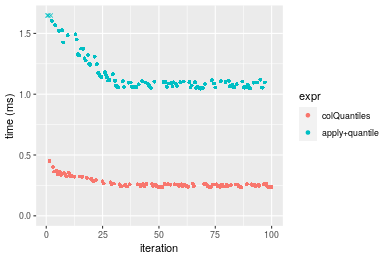

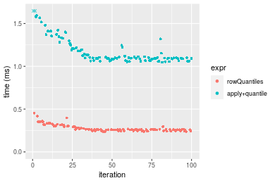
_Table: Benchmarking of colQuantiles() and rowQuantiles() on 10x10 data (original and transposed).  The top panel shows times in milliseconds and the bottom panel shows relative times._


|   |expr         |     min|      lq|     mean|   median|       uq|     max|
|:--|:------------|-------:|-------:|--------:|--------:|--------:|-------:|
|1  |colQuantiles | 235.011| 243.972| 270.5035| 257.2425| 271.3325| 450.874|
|2  |rowQuantiles | 236.524| 250.839| 276.7805| 260.7770| 296.8065| 453.060|


|   |expr         |      min|       lq|     mean|  median|       uq|      max|
|:--|:------------|--------:|--------:|--------:|-------:|--------:|--------:|
|1  |colQuantiles | 1.000000| 1.000000| 1.000000| 1.00000| 1.000000| 1.000000|
|2  |rowQuantiles | 1.006438| 1.028147| 1.023205| 1.01374| 1.093885| 1.004848|

_Figure: Benchmarking of colQuantiles() and rowQuantiles() on 10x10 data (original and transposed).  Outliers are displayed as crosses. Times are in milliseconds._


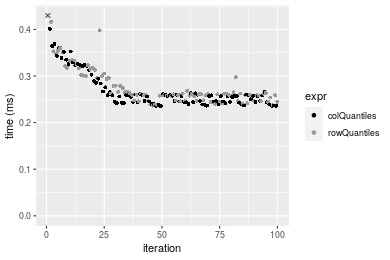

### 100x100 matrix


```r
> X <- data[["100x100"]]
> gc()
          used  (Mb) gc trigger  (Mb) max used  (Mb)
Ncells 5216750 278.7   10014072 534.9 10014072 534.9
Vcells 9703146  74.1   18204443 138.9 18204443 138.9
> probs <- seq(from = 0, to = 1, by = 0.25)
> colStats <- microbenchmark(colQuantiles = colQuantiles(X, probs = probs, na.rm = FALSE), `apply+quantile` = apply(X, 
+     MARGIN = 2L, FUN = quantile, probs = probs, na.rm = FALSE), unit = "ms")
> X <- t(X)
> gc()
          used  (Mb) gc trigger  (Mb) max used  (Mb)
Ncells 5216726 278.7   10014072 534.9 10014072 534.9
Vcells 9713159  74.2   18204443 138.9 18204443 138.9
> rowStats <- microbenchmark(rowQuantiles = rowQuantiles(X, probs = probs, na.rm = FALSE), `apply+quantile` = apply(X, 
+     MARGIN = 1L, FUN = quantile, probs = probs, na.rm = FALSE), unit = "ms")
```

_Table: Benchmarking of colQuantiles() and apply+quantile() on 100x100 data. The top panel shows times in milliseconds and the bottom panel shows relative times._


|   |expr           |       min|        lq|      mean|    median|        uq|      max|
|:--|:--------------|---------:|---------:|---------:|---------:|---------:|--------:|
|1  |colQuantiles   |  1.856466|  1.932403|  2.082062|  1.965316|  2.007684| 10.83551|
|2  |apply+quantile | 10.556472| 10.734910| 11.249992| 11.039005| 11.289259| 21.72881|


|   |expr           |      min|       lq|     mean|   median|       uq|      max|
|:--|:--------------|--------:|--------:|--------:|--------:|--------:|--------:|
|1  |colQuantiles   | 1.000000| 1.000000| 1.000000| 1.000000| 1.000000| 1.000000|
|2  |apply+quantile | 5.686327| 5.555214| 5.403294| 5.616911| 5.623026| 2.005334|

_Table: Benchmarking of rowQuantiles() and apply+quantile() on 100x100 data (transposed). The top panel shows times in milliseconds and the bottom panel shows relative times._


|   |expr           |       min|        lq|      mean|    median|       uq|      max|
|:--|:--------------|---------:|---------:|---------:|---------:|--------:|--------:|
|1  |rowQuantiles   |  1.888307|  1.959839|  2.017365|  1.996792|  2.03719|  2.49140|
|2  |apply+quantile | 10.584961| 10.740134| 11.345505| 11.028856| 11.28171| 22.07398|


|   |expr           |     min|       lq|     mean|   median|       uq|      max|
|:--|:--------------|-------:|--------:|--------:|--------:|--------:|--------:|
|1  |rowQuantiles   | 1.00000| 1.000000| 1.000000| 1.000000| 1.000000| 1.000000|
|2  |apply+quantile | 5.60553| 5.480109| 5.623924| 5.523289| 5.537877| 8.860071|

_Figure: Benchmarking of colQuantiles() and apply+quantile() on 100x100 data  as well as rowQuantiles() and apply+quantile() on the same data transposed.  Outliers are displayed as crosses.  Times are in milliseconds._


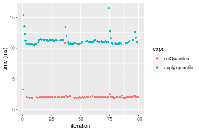

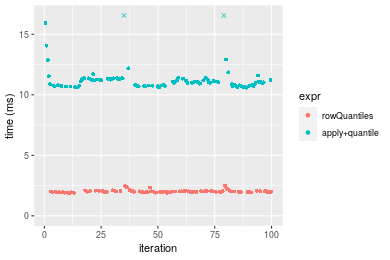
_Table: Benchmarking of colQuantiles() and rowQuantiles() on 100x100 data (original and transposed).  The top panel shows times in milliseconds and the bottom panel shows relative times._


|   |expr         |      min|       lq|     mean|   median|       uq|      max|
|:--|:------------|--------:|--------:|--------:|--------:|--------:|--------:|
|1  |colQuantiles | 1.856466| 1.932403| 2.082062| 1.965316| 2.007684| 10.83551|
|2  |rowQuantiles | 1.888307| 1.959839| 2.017365| 1.996792| 2.037190|  2.49140|


|   |expr         |      min|       lq|      mean|   median|       uq|       max|
|:--|:------------|--------:|--------:|---------:|--------:|--------:|---------:|
|1  |colQuantiles | 1.000000| 1.000000| 1.0000000| 1.000000| 1.000000| 1.0000000|
|2  |rowQuantiles | 1.017151| 1.014198| 0.9689265| 1.016015| 1.014697| 0.2299293|

_Figure: Benchmarking of colQuantiles() and rowQuantiles() on 100x100 data (original and transposed).  Outliers are displayed as crosses. Times are in milliseconds._


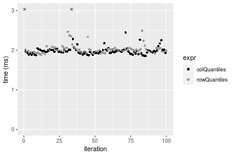

### 1000x10 matrix


```r
> X <- data[["1000x10"]]
> gc()
          used  (Mb) gc trigger  (Mb) max used  (Mb)
Ncells 5217468 278.7   10014072 534.9 10014072 534.9
Vcells 9706633  74.1   18204443 138.9 18204443 138.9
> probs <- seq(from = 0, to = 1, by = 0.25)
> colStats <- microbenchmark(colQuantiles = colQuantiles(X, probs = probs, na.rm = FALSE), `apply+quantile` = apply(X, 
+     MARGIN = 2L, FUN = quantile, probs = probs, na.rm = FALSE), unit = "ms")
> X <- t(X)
> gc()
          used  (Mb) gc trigger  (Mb) max used  (Mb)
Ncells 5217456 278.7   10014072 534.9 10014072 534.9
Vcells 9716666  74.2   18204443 138.9 18204443 138.9
> rowStats <- microbenchmark(rowQuantiles = rowQuantiles(X, probs = probs, na.rm = FALSE), `apply+quantile` = apply(X, 
+     MARGIN = 1L, FUN = quantile, probs = probs, na.rm = FALSE), unit = "ms")
```

_Table: Benchmarking of colQuantiles() and apply+quantile() on 1000x10 data. The top panel shows times in milliseconds and the bottom panel shows relative times._


|   |expr           |      min|        lq|      mean|    median|        uq|      max|
|:--|:--------------|--------:|---------:|---------:|---------:|---------:|--------:|
|1  |colQuantiles   | 0.598514| 0.6086515| 0.6540858| 0.6191075| 0.6305255| 1.158301|
|2  |apply+quantile | 1.466518| 1.5004585| 1.5918397| 1.5272875| 1.5450740| 2.486419|


|   |expr           |      min|       lq|     mean|   median|       uq|      max|
|:--|:--------------|--------:|--------:|--------:|--------:|--------:|--------:|
|1  |colQuantiles   | 1.000000| 1.000000| 1.000000| 1.000000| 1.000000| 1.000000|
|2  |apply+quantile | 2.450265| 2.465218| 2.433686| 2.466918| 2.450454| 2.146609|

_Table: Benchmarking of rowQuantiles() and apply+quantile() on 1000x10 data (transposed). The top panel shows times in milliseconds and the bottom panel shows relative times._


|   |expr           |      min|       lq|      mean|   median|        uq|      max|
|:--|:--------------|--------:|--------:|---------:|--------:|---------:|--------:|
|1  |rowQuantiles   | 0.635982| 0.647790| 0.6953628| 0.659199| 0.6659045| 1.215768|
|2  |apply+quantile | 1.482629| 1.495168| 1.5792075| 1.518762| 1.5320515| 2.475576|


|   |expr           |      min|       lq|     mean|  median|       uq|      max|
|:--|:--------------|--------:|--------:|--------:|-------:|--------:|--------:|
|1  |rowQuantiles   | 1.000000| 1.000000| 1.000000| 1.00000| 1.000000| 1.000000|
|2  |apply+quantile | 2.331244| 2.308107| 2.271056| 2.30395| 2.300708| 2.036224|

_Figure: Benchmarking of colQuantiles() and apply+quantile() on 1000x10 data  as well as rowQuantiles() and apply+quantile() on the same data transposed.  Outliers are displayed as crosses.  Times are in milliseconds._


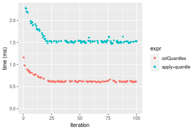

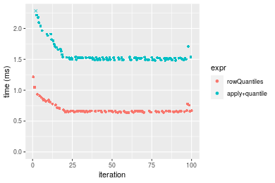
_Table: Benchmarking of colQuantiles() and rowQuantiles() on 1000x10 data (original and transposed).  The top panel shows times in milliseconds and the bottom panel shows relative times._


|   |expr         |     min|       lq|     mean|   median|       uq|      max|
|:--|:------------|-------:|--------:|--------:|--------:|--------:|--------:|
|1  |colQuantiles | 598.514| 608.6515| 654.0858| 619.1075| 630.5255| 1158.301|
|2  |rowQuantiles | 635.982| 647.7900| 695.3628| 659.1990| 665.9045| 1215.768|


|   |expr         |      min|       lq|     mean|   median|      uq|      max|
|:--|:------------|--------:|--------:|--------:|--------:|-------:|--------:|
|1  |colQuantiles | 1.000000| 1.000000| 1.000000| 1.000000| 1.00000| 1.000000|
|2  |rowQuantiles | 1.062602| 1.064304| 1.063106| 1.064757| 1.05611| 1.049613|

_Figure: Benchmarking of colQuantiles() and rowQuantiles() on 1000x10 data (original and transposed).  Outliers are displayed as crosses. Times are in milliseconds._


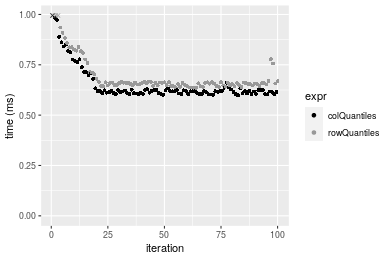

### 10x1000 matrix


```r
> X <- data[["10x1000"]]
> gc()
          used  (Mb) gc trigger  (Mb) max used  (Mb)
Ncells 5217668 278.7   10014072 534.9 10014072 534.9
Vcells 9707369  74.1   18204443 138.9 18204443 138.9
> probs <- seq(from = 0, to = 1, by = 0.25)
> colStats <- microbenchmark(colQuantiles = colQuantiles(X, probs = probs, na.rm = FALSE), `apply+quantile` = apply(X, 
+     MARGIN = 2L, FUN = quantile, probs = probs, na.rm = FALSE), unit = "ms")
> X <- t(X)
> gc()
          used  (Mb) gc trigger  (Mb) max used  (Mb)
Ncells 5217644 278.7   10014072 534.9 10014072 534.9
Vcells 9717382  74.2   18204443 138.9 18204443 138.9
> rowStats <- microbenchmark(rowQuantiles = rowQuantiles(X, probs = probs, na.rm = FALSE), `apply+quantile` = apply(X, 
+     MARGIN = 1L, FUN = quantile, probs = probs, na.rm = FALSE), unit = "ms")
```

_Table: Benchmarking of colQuantiles() and apply+quantile() on 10x1000 data. The top panel shows times in milliseconds and the bottom panel shows relative times._


|   |expr           |      min|        lq|      mean|    median|        uq|       max|
|:--|:--------------|--------:|---------:|---------:|---------:|---------:|---------:|
|1  |colQuantiles   | 13.40000|  13.98864|  14.91348|  14.55517|  14.77672|  23.69914|
|2  |apply+quantile | 98.45294| 102.50379| 106.93628| 104.80460| 110.05954| 151.79808|


|   |expr           |      min|       lq|     mean|   median|      uq|      max|
|:--|:--------------|--------:|--------:|--------:|--------:|-------:|--------:|
|1  |colQuantiles   | 1.000000| 1.000000| 1.000000| 1.000000| 1.00000| 1.000000|
|2  |apply+quantile | 7.347233| 7.327647| 7.170447| 7.200505| 7.44817| 6.405214|

_Table: Benchmarking of rowQuantiles() and apply+quantile() on 10x1000 data (transposed). The top panel shows times in milliseconds and the bottom panel shows relative times._


|   |expr           |       min|        lq|      mean|    median|        uq|       max|
|:--|:--------------|---------:|---------:|---------:|---------:|---------:|---------:|
|1  |rowQuantiles   |  13.45953|  14.14825|  14.90411|  14.69969|  14.97423|  23.65479|
|2  |apply+quantile | 100.17815| 104.39214| 107.41405| 105.37346| 109.58866| 123.17597|


|   |expr           |      min|       lq|     mean|   median|       uq|      max|
|:--|:--------------|--------:|--------:|--------:|--------:|--------:|--------:|
|1  |rowQuantiles   | 1.000000| 1.000000| 1.000000| 1.000000| 1.000000| 1.000000|
|2  |apply+quantile | 7.442914| 7.378449| 7.207009| 7.168413| 7.318485| 5.207231|

_Figure: Benchmarking of colQuantiles() and apply+quantile() on 10x1000 data  as well as rowQuantiles() and apply+quantile() on the same data transposed.  Outliers are displayed as crosses.  Times are in milliseconds._


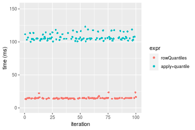
_Table: Benchmarking of colQuantiles() and rowQuantiles() on 10x1000 data (original and transposed).  The top panel shows times in milliseconds and the bottom panel shows relative times._


|   |expr         |      min|       lq|     mean|   median|       uq|      max|
|:--|:------------|--------:|--------:|--------:|--------:|--------:|--------:|
|1  |colQuantiles | 13.40000| 13.98864| 14.91348| 14.55517| 14.77672| 23.69914|
|2  |rowQuantiles | 13.45953| 14.14825| 14.90411| 14.69969| 14.97423| 23.65479|


|   |expr         |      min|      lq|      mean|   median|       uq|       max|
|:--|:------------|--------:|-------:|---------:|--------:|--------:|---------:|
|1  |colQuantiles | 1.000000| 1.00000| 1.0000000| 1.000000| 1.000000| 1.0000000|
|2  |rowQuantiles | 1.004443| 1.01141| 0.9993719| 1.009929| 1.013366| 0.9981286|

_Figure: Benchmarking of colQuantiles() and rowQuantiles() on 10x1000 data (original and transposed).  Outliers are displayed as crosses. Times are in milliseconds._


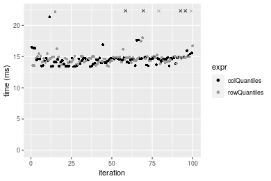

### 100x1000 matrix


```r
> X <- data[["100x1000"]]
> gc()
          used  (Mb) gc trigger  (Mb) max used  (Mb)
Ncells 5217852 278.7   10014072 534.9 10014072 534.9
Vcells 9707861  74.1   18204443 138.9 18204443 138.9
> probs <- seq(from = 0, to = 1, by = 0.25)
> colStats <- microbenchmark(colQuantiles = colQuantiles(X, probs = probs, na.rm = FALSE), `apply+quantile` = apply(X, 
+     MARGIN = 2L, FUN = quantile, probs = probs, na.rm = FALSE), unit = "ms")
> X <- t(X)
> gc()
          used  (Mb) gc trigger  (Mb) max used  (Mb)
Ncells 5217828 278.7   10014072 534.9 10014072 534.9
Vcells 9807874  74.9   18204443 138.9 18204443 138.9
> rowStats <- microbenchmark(rowQuantiles = rowQuantiles(X, probs = probs, na.rm = FALSE), `apply+quantile` = apply(X, 
+     MARGIN = 1L, FUN = quantile, probs = probs, na.rm = FALSE), unit = "ms")
```

_Table: Benchmarking of colQuantiles() and apply+quantile() on 100x1000 data. The top panel shows times in milliseconds and the bottom panel shows relative times._


|   |expr           |      min|        lq|      mean|    median|        uq|      max|
|:--|:--------------|--------:|---------:|---------:|---------:|---------:|--------:|
|1  |colQuantiles   |  17.6615|  18.79532|  19.52393|  18.95124|  19.07009|  30.9984|
|2  |apply+quantile | 107.8165| 110.84418| 114.86423| 112.27207| 116.05640| 148.2703|


|   |expr           |      min|       lq|     mean|   median|       uq|      max|
|:--|:--------------|--------:|--------:|--------:|--------:|--------:|--------:|
|1  |colQuantiles   | 1.000000| 1.000000| 1.000000| 1.000000| 1.000000| 1.000000|
|2  |apply+quantile | 6.104604| 5.897436| 5.883253| 5.924261| 6.085783| 4.783161|

_Table: Benchmarking of rowQuantiles() and apply+quantile() on 100x1000 data (transposed). The top panel shows times in milliseconds and the bottom panel shows relative times._


|   |expr           |       min|        lq|      mean|    median|        uq|       max|
|:--|:--------------|---------:|---------:|---------:|---------:|---------:|---------:|
|1  |rowQuantiles   |  18.35829|  19.45709|  20.14033|  19.69106|  19.92343|  30.28515|
|2  |apply+quantile | 107.84708| 112.09609| 119.74698| 113.62989| 117.06441| 501.10813|


|   |expr           |     min|       lq|     mean|   median|       uq|      max|
|:--|:--------------|-------:|--------:|--------:|--------:|--------:|--------:|
|1  |rowQuantiles   | 1.00000| 1.000000| 1.000000| 1.000000| 1.000000|  1.00000|
|2  |apply+quantile | 5.87457| 5.761196| 5.945632| 5.770632| 5.875716| 16.54633|

_Figure: Benchmarking of colQuantiles() and apply+quantile() on 100x1000 data  as well as rowQuantiles() and apply+quantile() on the same data transposed.  Outliers are displayed as crosses.  Times are in milliseconds._


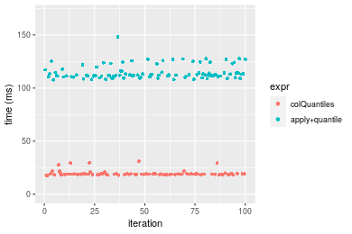

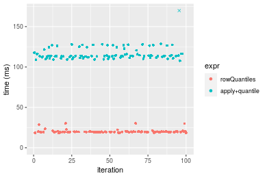
_Table: Benchmarking of colQuantiles() and rowQuantiles() on 100x1000 data (original and transposed).  The top panel shows times in milliseconds and the bottom panel shows relative times._


|   |expr         |      min|       lq|     mean|   median|       uq|      max|
|:--|:------------|--------:|--------:|--------:|--------:|--------:|--------:|
|1  |colQuantiles | 17.66150| 18.79532| 19.52393| 18.95124| 19.07009| 30.99840|
|2  |rowQuantiles | 18.35829| 19.45709| 20.14033| 19.69106| 19.92343| 30.28515|


|   |expr         |      min|       lq|     mean|   median|       uq|       max|
|:--|:------------|--------:|--------:|--------:|--------:|--------:|---------:|
|1  |colQuantiles | 1.000000| 1.000000| 1.000000| 1.000000| 1.000000| 1.0000000|
|2  |rowQuantiles | 1.039453| 1.035209| 1.031571| 1.039038| 1.044748| 0.9769908|

_Figure: Benchmarking of colQuantiles() and rowQuantiles() on 100x1000 data (original and transposed).  Outliers are displayed as crosses. Times are in milliseconds._


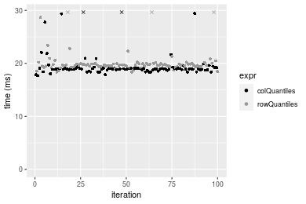

### 1000x100 matrix


```r
> X <- data[["1000x100"]]
> gc()
          used  (Mb) gc trigger  (Mb) max used  (Mb)
Ncells 5218044 278.7   10014072 534.9 10014072 534.9
Vcells 9708490  74.1   18204443 138.9 18204443 138.9
> probs <- seq(from = 0, to = 1, by = 0.25)
> colStats <- microbenchmark(colQuantiles = colQuantiles(X, probs = probs, na.rm = FALSE), `apply+quantile` = apply(X, 
+     MARGIN = 2L, FUN = quantile, probs = probs, na.rm = FALSE), unit = "ms")
> X <- t(X)
> gc()
          used  (Mb) gc trigger  (Mb) max used  (Mb)
Ncells 5218020 278.7   10014072 534.9 10014072 534.9
Vcells 9808503  74.9   18204443 138.9 18204443 138.9
> rowStats <- microbenchmark(rowQuantiles = rowQuantiles(X, probs = probs, na.rm = FALSE), `apply+quantile` = apply(X, 
+     MARGIN = 1L, FUN = quantile, probs = probs, na.rm = FALSE), unit = "ms")
```

_Table: Benchmarking of colQuantiles() and apply+quantile() on 1000x100 data. The top panel shows times in milliseconds and the bottom panel shows relative times._


|   |expr           |       min|        lq|      mean|    median|        uq|      max|
|:--|:--------------|---------:|---------:|---------:|---------:|---------:|--------:|
|1  |colQuantiles   |  5.114426|  5.294918|  5.672677|  5.359469|  5.461073| 13.20833|
|2  |apply+quantile | 14.505437| 14.774855| 15.556358| 15.031018| 15.296732| 24.44630|


|   |expr           |      min|       lq|     mean|   median|       uq|      max|
|:--|:--------------|--------:|--------:|--------:|--------:|--------:|--------:|
|1  |colQuantiles   | 1.000000| 1.000000| 1.000000| 1.000000| 1.000000| 1.000000|
|2  |apply+quantile | 2.836181| 2.790384| 2.742331| 2.804572| 2.801049| 1.850824|

_Table: Benchmarking of rowQuantiles() and apply+quantile() on 1000x100 data (transposed). The top panel shows times in milliseconds and the bottom panel shows relative times._


|   |expr           |       min|        lq|      mean|    median|        uq|      max|
|:--|:--------------|---------:|---------:|---------:|---------:|---------:|--------:|
|1  |rowQuantiles   |  5.503982|  5.671159|  6.114189|  5.768693|  5.846956| 14.02068|
|2  |apply+quantile | 14.554202| 14.753737| 15.676278| 15.111287| 15.382245| 27.11133|


|   |expr           |      min|       lq|     mean|   median|       uq|      max|
|:--|:--------------|--------:|--------:|--------:|--------:|--------:|--------:|
|1  |rowQuantiles   | 1.000000| 1.000000| 1.000000| 1.000000| 1.000000| 1.000000|
|2  |apply+quantile | 2.644304| 2.601538| 2.563918| 2.619534| 2.630813| 1.933668|

_Figure: Benchmarking of colQuantiles() and apply+quantile() on 1000x100 data  as well as rowQuantiles() and apply+quantile() on the same data transposed.  Outliers are displayed as crosses.  Times are in milliseconds._


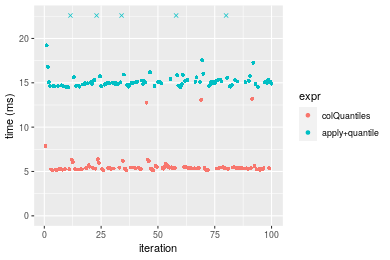

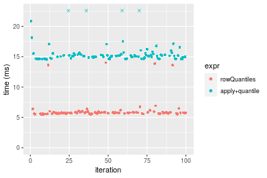
_Table: Benchmarking of colQuantiles() and rowQuantiles() on 1000x100 data (original and transposed).  The top panel shows times in milliseconds and the bottom panel shows relative times._


|   |expr         |      min|       lq|     mean|   median|       uq|      max|
|:--|:------------|--------:|--------:|--------:|--------:|--------:|--------:|
|1  |colQuantiles | 5.114426| 5.294918| 5.672677| 5.359469| 5.461073| 13.20833|
|2  |rowQuantiles | 5.503982| 5.671159| 6.114189| 5.768693| 5.846956| 14.02068|


|   |expr         |      min|       lq|     mean|   median|       uq|      max|
|:--|:------------|--------:|--------:|--------:|--------:|--------:|--------:|
|1  |colQuantiles | 1.000000| 1.000000| 1.000000| 1.000000| 1.000000| 1.000000|
|2  |rowQuantiles | 1.076168| 1.071057| 1.077831| 1.076355| 1.070661| 1.061502|

_Figure: Benchmarking of colQuantiles() and rowQuantiles() on 1000x100 data (original and transposed).  Outliers are displayed as crosses. Times are in milliseconds._


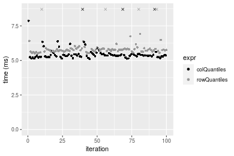


## Appendix

### Session information
```r
R version 4.1.1 Patched (2021-08-10 r80727)
Platform: x86_64-pc-linux-gnu (64-bit)
Running under: Ubuntu 18.04.5 LTS

Matrix products: default
BLAS:   /home/hb/software/R-devel/R-4-1-branch/lib/R/lib/libRblas.so
LAPACK: /home/hb/software/R-devel/R-4-1-branch/lib/R/lib/libRlapack.so

locale:
 [1] LC_CTYPE=en_US.UTF-8       LC_NUMERIC=C              
 [3] LC_TIME=en_US.UTF-8        LC_COLLATE=en_US.UTF-8    
 [5] LC_MONETARY=en_US.UTF-8    LC_MESSAGES=en_US.UTF-8   
 [7] LC_PAPER=en_US.UTF-8       LC_NAME=C                 
 [9] LC_ADDRESS=C               LC_TELEPHONE=C            
[11] LC_MEASUREMENT=en_US.UTF-8 LC_IDENTIFICATION=C       

attached base packages:
[1] stats     graphics  grDevices utils     datasets  methods   base     

other attached packages:
[1] microbenchmark_1.4-7   matrixStats_0.60.1     ggplot2_3.3.5         
[4] knitr_1.33             R.devices_2.17.0       R.utils_2.10.1        
[7] R.oo_1.24.0            R.methodsS3_1.8.1-9001 history_0.0.1-9000    

loaded via a namespace (and not attached):
 [1] Biobase_2.52.0          httr_1.4.2              splines_4.1.1          
 [4] bit64_4.0.5             network_1.17.1          assertthat_0.2.1       
 [7] highr_0.9               stats4_4.1.1            blob_1.2.2             
[10] GenomeInfoDbData_1.2.6  robustbase_0.93-8       pillar_1.6.2           
[13] RSQLite_2.2.8           lattice_0.20-44         glue_1.4.2             
[16] digest_0.6.27           XVector_0.32.0          colorspace_2.0-2       
[19] Matrix_1.3-4            XML_3.99-0.7            pkgconfig_2.0.3        
[22] zlibbioc_1.38.0         genefilter_1.74.0       purrr_0.3.4            
[25] ergm_4.1.2              xtable_1.8-4            scales_1.1.1           
[28] tibble_3.1.4            annotate_1.70.0         KEGGREST_1.32.0        
[31] farver_2.1.0            generics_0.1.0          IRanges_2.26.0         
[34] ellipsis_0.3.2          cachem_1.0.6            withr_2.4.2            
[37] BiocGenerics_0.38.0     mime_0.11               survival_3.2-13        
[40] magrittr_2.0.1          crayon_1.4.1            statnet.common_4.5.0   
[43] memoise_2.0.0           laeken_0.5.1            fansi_0.5.0            
[46] R.cache_0.15.0          MASS_7.3-54             R.rsp_0.44.0           
[49] progressr_0.8.0         tools_4.1.1             lifecycle_1.0.0        
[52] S4Vectors_0.30.0        trust_0.1-8             munsell_0.5.0          
[55] tabby_0.0.1-9001        AnnotationDbi_1.54.1    Biostrings_2.60.2      
[58] compiler_4.1.1          GenomeInfoDb_1.28.1     rlang_0.4.11           
[61] grid_4.1.1              RCurl_1.98-1.4          cwhmisc_6.6            
[64] rappdirs_0.3.3          startup_0.15.0          labeling_0.4.2         
[67] bitops_1.0-7            base64enc_0.1-3         boot_1.3-28            
[70] gtable_0.3.0            DBI_1.1.1               markdown_1.1           
[73] R6_2.5.1                lpSolveAPI_5.5.2.0-17.7 rle_0.9.2              
[76] dplyr_1.0.7             fastmap_1.1.0           bit_4.0.4              
[79] utf8_1.2.2              parallel_4.1.1          Rcpp_1.0.7             
[82] vctrs_0.3.8             png_0.1-7               DEoptimR_1.0-9         
[85] tidyselect_1.1.1        xfun_0.25               coda_0.19-4            
```
Total processing time was 1.18 mins.


### Reproducibility
To reproduce this report, do:
```r
html <- matrixStats:::benchmark('colQuantiles')
```

[RSP]: https://cran.r-project.org/package=R.rsp
[matrixStats]: https://cran.r-project.org/package=matrixStats

[StackOverflow:colMins?]: https://stackoverflow.com/questions/13676878 "Stack Overflow: fastest way to get Min from every column in a matrix?"
[StackOverflow:colSds?]: https://stackoverflow.com/questions/17549762 "Stack Overflow: Is there such 'colsd' in R?"
[StackOverflow:rowProds?]: https://stackoverflow.com/questions/20198801/ "Stack Overflow: Row product of matrix and column sum of matrix"

---------------------------------------
Copyright Henrik Bengtsson. Last updated on 2021-08-25 18:13:11 (+0200 UTC). Powered by [RSP].

<script>
 var link = document.createElement('link');
 link.rel = 'icon';
 link.href = "data:image/png;base64,iVBORw0KGgoAAAANSUhEUgAAACAAAAAgCAMAAABEpIrGAAAA21BMVEUAAAAAAP8AAP8AAP8AAP8AAP8AAP8AAP8AAP8AAP8AAP8AAP8AAP8AAP8AAP8AAP8AAP8AAP8AAP8AAP8AAP8AAP8AAP8AAP8AAP8AAP8AAP8AAP8AAP8AAP8AAP8AAP8AAP8AAP8AAP8AAP8AAP8AAP8AAP8AAP8AAP8AAP8BAf4CAv0DA/wdHeIeHuEfH+AgIN8hId4lJdomJtknJ9g+PsE/P8BAQL9yco10dIt1dYp3d4h4eIeVlWqWlmmXl2iYmGeZmWabm2Tn5xjo6Bfp6Rb39wj4+Af//wA2M9hbAAAASXRSTlMAAQIJCgsMJSYnKD4/QGRlZmhpamtsbautrrCxuru8y8zN5ebn6Pn6+///////////////////////////////////////////LsUNcQAAAS9JREFUOI29k21XgkAQhVcFytdSMqMETU26UVqGmpaiFbL//xc1cAhhwVNf6n5i5z67M2dmYOyfJZUqlVLhkKucG7cgmUZTybDz6g0iDeq51PUr37Ds2cy2/C9NeES5puDjxuUk1xnToZsg8pfA3avHQ3lLIi7iWRrkv/OYtkScxBIMgDee0ALoyxHQBJ68JLCjOtQIMIANF7QG9G9fNnHvisCHBVMKgSJgiz7nE+AoBKrAPA3MgepvgR9TSCasrCKH0eB1wBGBFdCO+nAGjMVGPcQb5bd6mQRegN6+1axOs9nGfYcCtfi4NQosdtH7dB+txFIpXQqN1p9B/asRHToyS0jRgpV7nk4nwcq1BJ+x3Gl/v7S9Wmpp/aGquum7w3ZDyrADFYrl8vHBH+ev9AUASW1dmU4h4wAAAABJRU5ErkJggg=="
 document.getElementsByTagName('head')[0].appendChild(link);
</script>


