[matrixStats]: Benchmark report

---------------------------------------


# colQuantiles() and rowQuantiles() benchmarks on subsetted computation

This report benchmark the performance of colQuantiles() and rowQuantiles() on subsetted computation.


## Data
```r
> rmatrix <- function(nrow, ncol, mode = c("logical", "double", "integer", "index"), range = c(-100, 
+     +100), na_prob = 0) {
+     mode <- match.arg(mode)
+     n <- nrow * ncol
+     if (mode == "logical") {
+         x <- sample(c(FALSE, TRUE), size = n, replace = TRUE)
+     }     else if (mode == "index") {
+         x <- seq_len(n)
+         mode <- "integer"
+     }     else {
+         x <- runif(n, min = range[1], max = range[2])
+     }
+     storage.mode(x) <- mode
+     if (na_prob > 0) 
+         x[sample(n, size = na_prob * n)] <- NA
+     dim(x) <- c(nrow, ncol)
+     x
+ }
> rmatrices <- function(scale = 10, seed = 1, ...) {
+     set.seed(seed)
+     data <- list()
+     data[[1]] <- rmatrix(nrow = scale * 1, ncol = scale * 1, ...)
+     data[[2]] <- rmatrix(nrow = scale * 10, ncol = scale * 10, ...)
+     data[[3]] <- rmatrix(nrow = scale * 100, ncol = scale * 1, ...)
+     data[[4]] <- t(data[[3]])
+     data[[5]] <- rmatrix(nrow = scale * 10, ncol = scale * 100, ...)
+     data[[6]] <- t(data[[5]])
+     names(data) <- sapply(data, FUN = function(x) paste(dim(x), collapse = "x"))
+     data
+ }
> data <- rmatrices(mode = "double")
```

## Results

### 10x10 matrix


```r
> X <- data[["10x10"]]
> rows <- sample.int(nrow(X), size = nrow(X) * 0.7)
> cols <- sample.int(ncol(X), size = ncol(X) * 0.7)
> X_S <- X[rows, cols]
> gc()
           used  (Mb) gc trigger  (Mb) max used  (Mb)
Ncells  5226772 279.2   10014072 534.9 10014072 534.9
Vcells 10052392  76.7   18204443 138.9 18204443 138.9
> probs <- seq(from = 0, to = 1, by = 0.25)
> colStats <- microbenchmark(colQuantiles_X_S = colQuantiles(X_S, probs = probs, na.rm = FALSE), `colQuantiles(X, rows, cols)` = colQuantiles(X, 
+     rows = rows, cols = cols, probs = probs, na.rm = FALSE), `colQuantiles(X[rows, cols])` = colQuantiles(X[rows, 
+     cols], probs = probs, na.rm = FALSE), unit = "ms")
> X <- t(X)
> X_S <- t(X_S)
> gc()
           used  (Mb) gc trigger  (Mb) max used  (Mb)
Ncells  5214201 278.5   10014072 534.9 10014072 534.9
Vcells 10009639  76.4   18204443 138.9 18204443 138.9
> rowStats <- microbenchmark(rowQuantiles_X_S = rowQuantiles(X_S, probs = probs, na.rm = FALSE), `rowQuantiles(X, cols, rows)` = rowQuantiles(X, 
+     rows = cols, cols = rows, probs = probs, na.rm = FALSE), `rowQuantiles(X[cols, rows])` = rowQuantiles(X[cols, 
+     rows], probs = probs, na.rm = FALSE), unit = "ms")
```

_Table: Benchmarking of colQuantiles_X_S(), colQuantiles(X, rows, cols)() and colQuantiles(X[rows, cols])() on 10x10 data. The top panel shows times in milliseconds and the bottom panel shows relative times._


|   |expr                        |      min|        lq|      mean|    median|        uq|      max|
|:--|:---------------------------|--------:|---------:|---------:|---------:|---------:|--------:|
|3  |colQuantiles(X[rows, cols]) | 0.190432| 0.2032135| 0.2289610| 0.2211515| 0.2430880| 0.338446|
|2  |colQuantiles(X, rows, cols) | 0.191137| 0.2081005| 0.2361339| 0.2276490| 0.2559010| 0.331187|
|1  |colQuantiles_X_S            | 0.188727| 0.2057300| 0.2418340| 0.2327510| 0.2495995| 1.193896|


|   |expr                        |       min|       lq|     mean|  median|       uq|      max|
|:--|:---------------------------|---------:|--------:|--------:|-------:|--------:|--------:|
|3  |colQuantiles(X[rows, cols]) | 1.0000000| 1.000000| 1.000000| 1.00000| 1.000000| 1.000000|
|2  |colQuantiles(X, rows, cols) | 1.0037021| 1.024049| 1.031328| 1.02938| 1.052709| 0.978552|
|1  |colQuantiles_X_S            | 0.9910467| 1.012384| 1.056224| 1.05245| 1.026787| 3.527582|

_Table: Benchmarking of rowQuantiles_X_S(), rowQuantiles(X, cols, rows)() and rowQuantiles(X[cols, rows])() on 10x10 data (transposed). The top panel shows times in milliseconds and the bottom panel shows relative times._


|   |expr                        |      min|        lq|      mean|    median|       uq|      max|
|:--|:---------------------------|--------:|---------:|---------:|---------:|--------:|--------:|
|3  |rowQuantiles(X[cols, rows]) | 0.190213| 0.1990710| 0.2259649| 0.2182205| 0.244098| 0.326394|
|2  |rowQuantiles(X, cols, rows) | 0.191249| 0.2052870| 0.2419512| 0.2280705| 0.251123| 1.245627|
|1  |rowQuantiles_X_S            | 0.189250| 0.1971535| 0.2326689| 0.2345485| 0.253316| 0.323816|


|   |expr                        |       min|        lq|     mean|   median|       uq|       max|
|:--|:---------------------------|---------:|---------:|--------:|--------:|--------:|---------:|
|3  |rowQuantiles(X[cols, rows]) | 1.0000000| 1.0000000| 1.000000| 1.000000| 1.000000| 1.0000000|
|2  |rowQuantiles(X, cols, rows) | 1.0054465| 1.0312250| 1.070747| 1.045138| 1.028779| 3.8163293|
|1  |rowQuantiles_X_S            | 0.9949373| 0.9903678| 1.029669| 1.074823| 1.037764| 0.9921016|

_Figure: Benchmarking of colQuantiles_X_S(), colQuantiles(X, rows, cols)() and colQuantiles(X[rows, cols])() on 10x10 data  as well as rowQuantiles_X_S(), rowQuantiles(X, cols, rows)() and rowQuantiles(X[cols, rows])() on the same data transposed.  Outliers are displayed as crosses.  Times are in milliseconds._


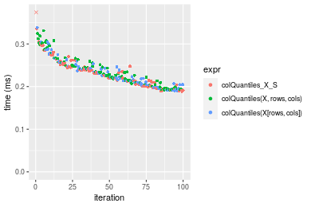

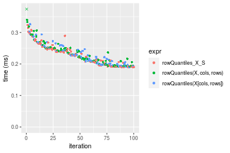
_Table: Benchmarking of colQuantiles_X_S() and rowQuantiles_X_S() on 10x10 data (original and transposed).  The top panel shows times in milliseconds and the bottom panel shows relative times._


|   |expr             |     min|       lq|     mean|   median|       uq|      max|
|:--|:----------------|-------:|--------:|--------:|--------:|--------:|--------:|
|1  |colQuantiles_X_S | 188.727| 205.7300| 241.8340| 232.7510| 249.5995| 1193.896|
|2  |rowQuantiles_X_S | 189.250| 197.1535| 232.6689| 234.5485| 253.3160|  323.816|


|   |expr             |      min|        lq|      mean|   median|      uq|       max|
|:--|:----------------|--------:|---------:|---------:|--------:|-------:|---------:|
|1  |colQuantiles_X_S | 1.000000| 1.0000000| 1.0000000| 1.000000| 1.00000| 1.0000000|
|2  |rowQuantiles_X_S | 1.002771| 0.9583119| 0.9621017| 1.007723| 1.01489| 0.2712263|

_Figure: Benchmarking of colQuantiles_X_S() and rowQuantiles_X_S() on 10x10 data (original and transposed).  Outliers are displayed as crosses. Times are in milliseconds._


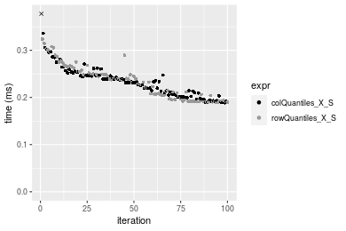

### 100x100 matrix


```r
> X <- data[["100x100"]]
> rows <- sample.int(nrow(X), size = nrow(X) * 0.7)
> cols <- sample.int(ncol(X), size = ncol(X) * 0.7)
> X_S <- X[rows, cols]
> gc()
          used  (Mb) gc trigger  (Mb) max used  (Mb)
Ncells 5214337 278.5   10014072 534.9 10014072 534.9
Vcells 9683816  73.9   18204443 138.9 18204443 138.9
> probs <- seq(from = 0, to = 1, by = 0.25)
> colStats <- microbenchmark(colQuantiles_X_S = colQuantiles(X_S, probs = probs, na.rm = FALSE), `colQuantiles(X, rows, cols)` = colQuantiles(X, 
+     rows = rows, cols = cols, probs = probs, na.rm = FALSE), `colQuantiles(X[rows, cols])` = colQuantiles(X[rows, 
+     cols], probs = probs, na.rm = FALSE), unit = "ms")
> X <- t(X)
> X_S <- t(X_S)
> gc()
          used  (Mb) gc trigger  (Mb) max used  (Mb)
Ncells 5214313 278.5   10014072 534.9 10014072 534.9
Vcells 9693869  74.0   18204443 138.9 18204443 138.9
> rowStats <- microbenchmark(rowQuantiles_X_S = rowQuantiles(X_S, probs = probs, na.rm = FALSE), `rowQuantiles(X, cols, rows)` = rowQuantiles(X, 
+     rows = cols, cols = rows, probs = probs, na.rm = FALSE), `rowQuantiles(X[cols, rows])` = rowQuantiles(X[cols, 
+     rows], probs = probs, na.rm = FALSE), unit = "ms")
```

_Table: Benchmarking of colQuantiles_X_S(), colQuantiles(X, rows, cols)() and colQuantiles(X[rows, cols])() on 100x100 data. The top panel shows times in milliseconds and the bottom panel shows relative times._


|   |expr                        |      min|       lq|     mean|   median|       uq|      max|
|:--|:---------------------------|--------:|--------:|--------:|--------:|--------:|--------:|
|1  |colQuantiles_X_S            | 1.249022| 1.267192| 1.346014| 1.331899| 1.361857| 1.912236|
|2  |colQuantiles(X, rows, cols) | 1.255847| 1.281951| 1.366651| 1.357030| 1.384718| 2.083873|
|3  |colQuantiles(X[rows, cols]) | 1.252468| 1.287030| 1.374596| 1.360541| 1.385894| 2.292240|


|   |expr                        |      min|       lq|     mean|   median|       uq|      max|
|:--|:---------------------------|--------:|--------:|--------:|--------:|--------:|--------:|
|1  |colQuantiles_X_S            | 1.000000| 1.000000| 1.000000| 1.000000| 1.000000| 1.000000|
|2  |colQuantiles(X, rows, cols) | 1.005464| 1.011647| 1.015332| 1.018869| 1.016787| 1.089757|
|3  |colQuantiles(X[rows, cols]) | 1.002759| 1.015654| 1.021235| 1.021505| 1.017650| 1.198722|

_Table: Benchmarking of rowQuantiles_X_S(), rowQuantiles(X, cols, rows)() and rowQuantiles(X[cols, rows])() on 100x100 data (transposed). The top panel shows times in milliseconds and the bottom panel shows relative times._


|   |expr                        |      min|       lq|     mean|   median|       uq|      max|
|:--|:---------------------------|--------:|--------:|--------:|--------:|--------:|--------:|
|1  |rowQuantiles_X_S            | 1.269598| 1.287672| 1.379589| 1.360305| 1.390566| 2.073297|
|2  |rowQuantiles(X, cols, rows) | 1.273722| 1.302155| 1.385245| 1.365501| 1.399504| 2.283744|
|3  |rowQuantiles(X[cols, rows]) | 1.271347| 1.298601| 1.373155| 1.369161| 1.405866| 1.770742|


|   |expr                        |      min|       lq|      mean|   median|       uq|       max|
|:--|:---------------------------|--------:|--------:|---------:|--------:|--------:|---------:|
|1  |rowQuantiles_X_S            | 1.000000| 1.000000| 1.0000000| 1.000000| 1.000000| 1.0000000|
|2  |rowQuantiles(X, cols, rows) | 1.003248| 1.011247| 1.0040994| 1.003819| 1.006427| 1.1015035|
|3  |rowQuantiles(X[cols, rows]) | 1.001378| 1.008487| 0.9953358| 1.006510| 1.011003| 0.8540706|

_Figure: Benchmarking of colQuantiles_X_S(), colQuantiles(X, rows, cols)() and colQuantiles(X[rows, cols])() on 100x100 data  as well as rowQuantiles_X_S(), rowQuantiles(X, cols, rows)() and rowQuantiles(X[cols, rows])() on the same data transposed.  Outliers are displayed as crosses.  Times are in milliseconds._


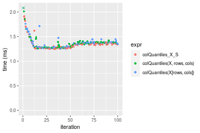

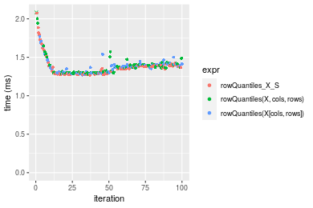
_Table: Benchmarking of colQuantiles_X_S() and rowQuantiles_X_S() on 100x100 data (original and transposed).  The top panel shows times in milliseconds and the bottom panel shows relative times._


|   |expr             |      min|       lq|     mean|   median|       uq|      max|
|:--|:----------------|--------:|--------:|--------:|--------:|--------:|--------:|
|1  |colQuantiles_X_S | 1.249022| 1.267192| 1.346014| 1.331899| 1.361857| 1.912236|
|2  |rowQuantiles_X_S | 1.269598| 1.287672| 1.379589| 1.360305| 1.390566| 2.073297|


|   |expr             |      min|       lq|     mean|   median|      uq|      max|
|:--|:----------------|--------:|--------:|--------:|--------:|-------:|--------:|
|1  |colQuantiles_X_S | 1.000000| 1.000000| 1.000000| 1.000000| 1.00000| 1.000000|
|2  |rowQuantiles_X_S | 1.016474| 1.016162| 1.024944| 1.021328| 1.02108| 1.084226|

_Figure: Benchmarking of colQuantiles_X_S() and rowQuantiles_X_S() on 100x100 data (original and transposed).  Outliers are displayed as crosses. Times are in milliseconds._


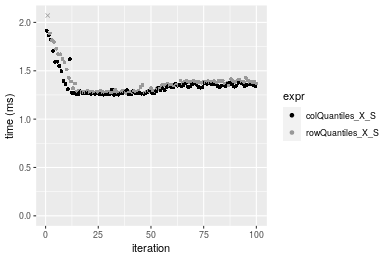

### 1000x10 matrix


```r
> X <- data[["1000x10"]]
> rows <- sample.int(nrow(X), size = nrow(X) * 0.7)
> cols <- sample.int(ncol(X), size = ncol(X) * 0.7)
> X_S <- X[rows, cols]
> gc()
          used  (Mb) gc trigger  (Mb) max used  (Mb)
Ncells 5215074 278.6   10014072 534.9 10014072 534.9
Vcells 9687855  74.0   18204443 138.9 18204443 138.9
> probs <- seq(from = 0, to = 1, by = 0.25)
> colStats <- microbenchmark(colQuantiles_X_S = colQuantiles(X_S, probs = probs, na.rm = FALSE), `colQuantiles(X, rows, cols)` = colQuantiles(X, 
+     rows = rows, cols = cols, probs = probs, na.rm = FALSE), `colQuantiles(X[rows, cols])` = colQuantiles(X[rows, 
+     cols], probs = probs, na.rm = FALSE), unit = "ms")
> X <- t(X)
> X_S <- t(X_S)
> gc()
          used  (Mb) gc trigger  (Mb) max used  (Mb)
Ncells 5215056 278.6   10014072 534.9 10014072 534.9
Vcells 9697918  74.0   18204443 138.9 18204443 138.9
> rowStats <- microbenchmark(rowQuantiles_X_S = rowQuantiles(X_S, probs = probs, na.rm = FALSE), `rowQuantiles(X, cols, rows)` = rowQuantiles(X, 
+     rows = cols, cols = rows, probs = probs, na.rm = FALSE), `rowQuantiles(X[cols, rows])` = rowQuantiles(X[cols, 
+     rows], probs = probs, na.rm = FALSE), unit = "ms")
```

_Table: Benchmarking of colQuantiles_X_S(), colQuantiles(X, rows, cols)() and colQuantiles(X[rows, cols])() on 1000x10 data. The top panel shows times in milliseconds and the bottom panel shows relative times._


|   |expr                        |      min|        lq|      mean|    median|        uq|      max|
|:--|:---------------------------|--------:|---------:|---------:|---------:|---------:|--------:|
|1  |colQuantiles_X_S            | 0.375989| 0.3805685| 0.4026107| 0.3833380| 0.4073855| 0.510831|
|3  |colQuantiles(X[rows, cols]) | 0.390359| 0.3944015| 0.4193217| 0.3964955| 0.4262345| 0.757910|
|2  |colQuantiles(X, rows, cols) | 0.390501| 0.3941610| 0.4144468| 0.3976580| 0.4131780| 0.545765|


|   |expr                        |      min|       lq|     mean|   median|       uq|      max|
|:--|:---------------------------|--------:|--------:|--------:|--------:|--------:|--------:|
|1  |colQuantiles_X_S            | 1.000000| 1.000000| 1.000000| 1.000000| 1.000000| 1.000000|
|3  |colQuantiles(X[rows, cols]) | 1.038219| 1.036348| 1.041507| 1.034323| 1.046268| 1.483680|
|2  |colQuantiles(X, rows, cols) | 1.038597| 1.035716| 1.029398| 1.037356| 1.014219| 1.068387|

_Table: Benchmarking of rowQuantiles_X_S(), rowQuantiles(X, cols, rows)() and rowQuantiles(X[cols, rows])() on 1000x10 data (transposed). The top panel shows times in milliseconds and the bottom panel shows relative times._


|   |expr                        |      min|        lq|      mean|    median|        uq|      max|
|:--|:---------------------------|--------:|---------:|---------:|---------:|---------:|--------:|
|1  |rowQuantiles_X_S            | 0.394932| 0.3993735| 0.4370545| 0.4027780| 0.4446725| 0.670070|
|3  |rowQuantiles(X[cols, rows]) | 0.410448| 0.4149965| 0.4542796| 0.4192950| 0.4651265| 0.866095|
|2  |rowQuantiles(X, cols, rows) | 0.411024| 0.4157065| 0.4589725| 0.4210805| 0.4933775| 0.660366|


|   |expr                        |      min|       lq|     mean|   median|       uq|       max|
|:--|:---------------------------|--------:|--------:|--------:|--------:|--------:|---------:|
|1  |rowQuantiles_X_S            | 1.000000| 1.000000| 1.000000| 1.000000| 1.000000| 1.0000000|
|3  |rowQuantiles(X[cols, rows]) | 1.039288| 1.039119| 1.039412| 1.041008| 1.045998| 1.2925441|
|2  |rowQuantiles(X, cols, rows) | 1.040746| 1.040897| 1.050149| 1.045441| 1.109530| 0.9855179|

_Figure: Benchmarking of colQuantiles_X_S(), colQuantiles(X, rows, cols)() and colQuantiles(X[rows, cols])() on 1000x10 data  as well as rowQuantiles_X_S(), rowQuantiles(X, cols, rows)() and rowQuantiles(X[cols, rows])() on the same data transposed.  Outliers are displayed as crosses.  Times are in milliseconds._


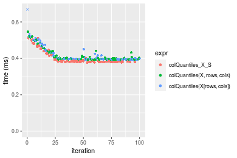

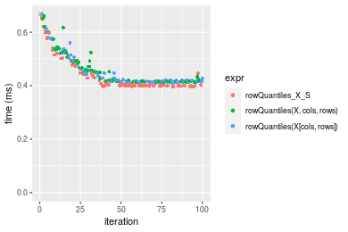
_Table: Benchmarking of colQuantiles_X_S() and rowQuantiles_X_S() on 1000x10 data (original and transposed).  The top panel shows times in milliseconds and the bottom panel shows relative times._


|   |expr             |     min|       lq|     mean|  median|       uq|     max|
|:--|:----------------|-------:|--------:|--------:|-------:|--------:|-------:|
|1  |colQuantiles_X_S | 375.989| 380.5685| 402.6107| 383.338| 407.3855| 510.831|
|2  |rowQuantiles_X_S | 394.932| 399.3735| 437.0545| 402.778| 444.6725| 670.070|


|   |expr             |      min|       lq|     mean|   median|       uq|      max|
|:--|:----------------|--------:|--------:|--------:|--------:|--------:|--------:|
|1  |colQuantiles_X_S | 1.000000| 1.000000| 1.000000| 1.000000| 1.000000| 1.000000|
|2  |rowQuantiles_X_S | 1.050382| 1.049413| 1.085551| 1.050712| 1.091528| 1.311725|

_Figure: Benchmarking of colQuantiles_X_S() and rowQuantiles_X_S() on 1000x10 data (original and transposed).  Outliers are displayed as crosses. Times are in milliseconds._


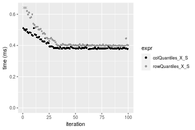

### 10x1000 matrix


```r
> X <- data[["10x1000"]]
> rows <- sample.int(nrow(X), size = nrow(X) * 0.7)
> cols <- sample.int(ncol(X), size = ncol(X) * 0.7)
> X_S <- X[rows, cols]
> gc()
          used  (Mb) gc trigger  (Mb) max used  (Mb)
Ncells 5215285 278.6   10014072 534.9 10014072 534.9
Vcells 9688852  74.0   18204443 138.9 18204443 138.9
> probs <- seq(from = 0, to = 1, by = 0.25)
> colStats <- microbenchmark(colQuantiles_X_S = colQuantiles(X_S, probs = probs, na.rm = FALSE), `colQuantiles(X, rows, cols)` = colQuantiles(X, 
+     rows = rows, cols = cols, probs = probs, na.rm = FALSE), `colQuantiles(X[rows, cols])` = colQuantiles(X[rows, 
+     cols], probs = probs, na.rm = FALSE), unit = "ms")
> X <- t(X)
> X_S <- t(X_S)
> gc()
          used  (Mb) gc trigger  (Mb) max used  (Mb)
Ncells 5215261 278.6   10014072 534.9 10014072 534.9
Vcells 9698905  74.0   18204443 138.9 18204443 138.9
> rowStats <- microbenchmark(rowQuantiles_X_S = rowQuantiles(X_S, probs = probs, na.rm = FALSE), `rowQuantiles(X, cols, rows)` = rowQuantiles(X, 
+     rows = cols, cols = rows, probs = probs, na.rm = FALSE), `rowQuantiles(X[cols, rows])` = rowQuantiles(X[cols, 
+     rows], probs = probs, na.rm = FALSE), unit = "ms")
```

_Table: Benchmarking of colQuantiles_X_S(), colQuantiles(X, rows, cols)() and colQuantiles(X[rows, cols])() on 10x1000 data. The top panel shows times in milliseconds and the bottom panel shows relative times._


|   |expr                        |      min|       lq|     mean|   median|       uq|      max|
|:--|:---------------------------|--------:|--------:|--------:|--------:|--------:|--------:|
|3  |colQuantiles(X[rows, cols]) | 9.317287| 9.790489| 10.51300| 10.12694| 10.34947| 37.91541|
|1  |colQuantiles_X_S            | 9.231204| 9.891109| 10.28075| 10.14072| 10.37340| 17.01047|
|2  |colQuantiles(X, rows, cols) | 9.331308| 9.859971| 10.27412| 10.14293| 10.38059| 16.53900|


|   |expr                        |       min|       lq|      mean|   median|       uq|       max|
|:--|:---------------------------|---------:|--------:|---------:|--------:|--------:|---------:|
|3  |colQuantiles(X[rows, cols]) | 1.0000000| 1.000000| 1.0000000| 1.000000| 1.000000| 1.0000000|
|1  |colQuantiles_X_S            | 0.9907609| 1.010277| 0.9779091| 1.001361| 1.002312| 0.4486426|
|2  |colQuantiles(X, rows, cols) | 1.0015048| 1.007097| 0.9772781| 1.001579| 1.003007| 0.4362078|

_Table: Benchmarking of rowQuantiles_X_S(), rowQuantiles(X, cols, rows)() and rowQuantiles(X[cols, rows])() on 10x1000 data (transposed). The top panel shows times in milliseconds and the bottom panel shows relative times._


|   |expr                        |      min|       lq|     mean|   median|       uq|      max|
|:--|:---------------------------|--------:|--------:|--------:|--------:|--------:|--------:|
|1  |rowQuantiles_X_S            | 9.206798| 9.750217| 10.16028| 10.05077| 10.21234| 17.20205|
|3  |rowQuantiles(X[cols, rows]) | 9.247034| 9.827293| 10.02149| 10.05652| 10.21750| 12.06658|
|2  |rowQuantiles(X, cols, rows) | 9.237690| 9.758914| 10.37212| 10.06559| 10.24826| 17.66513|


|   |expr                        |      min|       lq|    mean|   median|       uq|       max|
|:--|:---------------------------|--------:|--------:|-------:|--------:|--------:|---------:|
|1  |rowQuantiles_X_S            | 1.000000| 1.000000| 1.00000| 1.000000| 1.000000| 1.0000000|
|3  |rowQuantiles(X[cols, rows]) | 1.004370| 1.007905| 0.98634| 1.000572| 1.000505| 0.7014618|
|2  |rowQuantiles(X, cols, rows) | 1.003355| 1.000892| 1.02085| 1.001474| 1.003517| 1.0269199|

_Figure: Benchmarking of colQuantiles_X_S(), colQuantiles(X, rows, cols)() and colQuantiles(X[rows, cols])() on 10x1000 data  as well as rowQuantiles_X_S(), rowQuantiles(X, cols, rows)() and rowQuantiles(X[cols, rows])() on the same data transposed.  Outliers are displayed as crosses.  Times are in milliseconds._


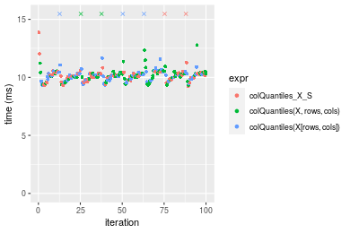

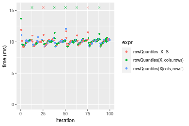
_Table: Benchmarking of colQuantiles_X_S() and rowQuantiles_X_S() on 10x1000 data (original and transposed).  The top panel shows times in milliseconds and the bottom panel shows relative times._


|   |expr             |      min|       lq|     mean|   median|       uq|      max|
|:--|:----------------|--------:|--------:|--------:|--------:|--------:|--------:|
|2  |rowQuantiles_X_S | 9.206798| 9.750217| 10.16028| 10.05077| 10.21234| 17.20205|
|1  |colQuantiles_X_S | 9.231204| 9.891109| 10.28075| 10.14072| 10.37340| 17.01047|


|   |expr             |      min|      lq|     mean|   median|       uq|       max|
|:--|:----------------|--------:|-------:|--------:|--------:|--------:|---------:|
|2  |rowQuantiles_X_S | 1.000000| 1.00000| 1.000000| 1.000000| 1.000000| 1.0000000|
|1  |colQuantiles_X_S | 1.002651| 1.01445| 1.011857| 1.008949| 1.015771| 0.9888631|

_Figure: Benchmarking of colQuantiles_X_S() and rowQuantiles_X_S() on 10x1000 data (original and transposed).  Outliers are displayed as crosses. Times are in milliseconds._


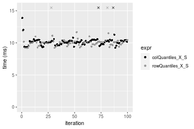

### 100x1000 matrix


```r
> X <- data[["100x1000"]]
> rows <- sample.int(nrow(X), size = nrow(X) * 0.7)
> cols <- sample.int(ncol(X), size = ncol(X) * 0.7)
> X_S <- X[rows, cols]
> gc()
          used  (Mb) gc trigger  (Mb) max used  (Mb)
Ncells 5215495 278.6   10014072 534.9 10014072 534.9
Vcells 9733594  74.3   18204443 138.9 18204443 138.9
> probs <- seq(from = 0, to = 1, by = 0.25)
> colStats <- microbenchmark(colQuantiles_X_S = colQuantiles(X_S, probs = probs, na.rm = FALSE), `colQuantiles(X, rows, cols)` = colQuantiles(X, 
+     rows = rows, cols = cols, probs = probs, na.rm = FALSE), `colQuantiles(X[rows, cols])` = colQuantiles(X[rows, 
+     cols], probs = probs, na.rm = FALSE), unit = "ms")
> X <- t(X)
> X_S <- t(X_S)
> gc()
          used  (Mb) gc trigger  (Mb) max used  (Mb)
Ncells 5215471 278.6   10014072 534.9 10014072 534.9
Vcells 9833647  75.1   18204443 138.9 18204443 138.9
> rowStats <- microbenchmark(rowQuantiles_X_S = rowQuantiles(X_S, probs = probs, na.rm = FALSE), `rowQuantiles(X, cols, rows)` = rowQuantiles(X, 
+     rows = cols, cols = rows, probs = probs, na.rm = FALSE), `rowQuantiles(X[cols, rows])` = rowQuantiles(X[cols, 
+     rows], probs = probs, na.rm = FALSE), unit = "ms")
```

_Table: Benchmarking of colQuantiles_X_S(), colQuantiles(X, rows, cols)() and colQuantiles(X[rows, cols])() on 100x1000 data. The top panel shows times in milliseconds and the bottom panel shows relative times._


|   |expr                        |      min|       lq|     mean|   median|       uq|      max|
|:--|:---------------------------|--------:|--------:|--------:|--------:|--------:|--------:|
|1  |colQuantiles_X_S            | 11.45716| 12.04976| 12.37388| 12.30654| 12.43842| 16.91990|
|2  |colQuantiles(X, rows, cols) | 11.62531| 12.17549| 13.19297| 12.40794| 12.65393| 27.69096|
|3  |colQuantiles(X[rows, cols]) | 11.60030| 12.17583| 12.85266| 12.49008| 12.62438| 26.84416|


|   |expr                        |      min|       lq|     mean|   median|       uq|      max|
|:--|:---------------------------|--------:|--------:|--------:|--------:|--------:|--------:|
|1  |colQuantiles_X_S            | 1.000000| 1.000000| 1.000000| 1.000000| 1.000000| 1.000000|
|2  |colQuantiles(X, rows, cols) | 1.014677| 1.010434| 1.066195| 1.008239| 1.017326| 1.636591|
|3  |colQuantiles(X[rows, cols]) | 1.012494| 1.010463| 1.038693| 1.014914| 1.014950| 1.586543|

_Table: Benchmarking of rowQuantiles_X_S(), rowQuantiles(X, cols, rows)() and rowQuantiles(X[cols, rows])() on 100x1000 data (transposed). The top panel shows times in milliseconds and the bottom panel shows relative times._


|   |expr                        |      min|       lq|     mean|   median|       uq|       max|
|:--|:---------------------------|--------:|--------:|--------:|--------:|--------:|---------:|
|1  |rowQuantiles_X_S            | 11.69105| 12.13952| 16.78643| 12.32374| 12.75491| 378.14455|
|2  |rowQuantiles(X, cols, rows) | 11.89504| 12.34828| 12.61307| 12.45894| 12.67941|  16.25250|
|3  |rowQuantiles(X[cols, rows]) | 11.90784| 12.32793| 12.97853| 12.46130| 12.73701|  27.25401|


|   |expr                        |      min|       lq|      mean|   median|        uq|       max|
|:--|:---------------------------|--------:|--------:|---------:|--------:|---------:|---------:|
|1  |rowQuantiles_X_S            | 1.000000| 1.000000| 1.0000000| 1.000000| 1.0000000| 1.0000000|
|2  |rowQuantiles(X, cols, rows) | 1.017448| 1.017196| 0.7513851| 1.010971| 0.9940807| 0.0429796|
|3  |rowQuantiles(X[cols, rows]) | 1.018543| 1.015521| 0.7731563| 1.011162| 0.9985963| 0.0720730|

_Figure: Benchmarking of colQuantiles_X_S(), colQuantiles(X, rows, cols)() and colQuantiles(X[rows, cols])() on 100x1000 data  as well as rowQuantiles_X_S(), rowQuantiles(X, cols, rows)() and rowQuantiles(X[cols, rows])() on the same data transposed.  Outliers are displayed as crosses.  Times are in milliseconds._


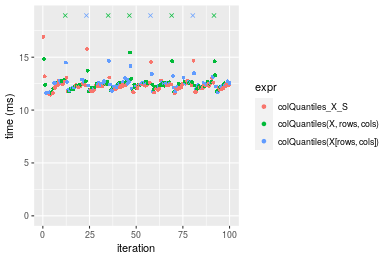

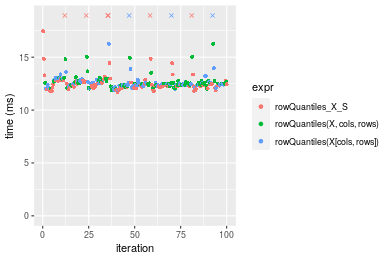
_Table: Benchmarking of colQuantiles_X_S() and rowQuantiles_X_S() on 100x1000 data (original and transposed).  The top panel shows times in milliseconds and the bottom panel shows relative times._


|   |expr             |      min|       lq|     mean|   median|       uq|      max|
|:--|:----------------|--------:|--------:|--------:|--------:|--------:|--------:|
|1  |colQuantiles_X_S | 11.45716| 12.04976| 12.37388| 12.30654| 12.43842|  16.9199|
|2  |rowQuantiles_X_S | 11.69105| 12.13952| 16.78643| 12.32374| 12.75491| 378.1445|


|   |expr             |      min|       lq|     mean|   median|       uq|     max|
|:--|:----------------|--------:|--------:|--------:|--------:|--------:|-------:|
|1  |colQuantiles_X_S | 1.000000| 1.000000| 1.000000| 1.000000| 1.000000|  1.0000|
|2  |rowQuantiles_X_S | 1.020415| 1.007449| 1.356602| 1.001398| 1.025445| 22.3491|

_Figure: Benchmarking of colQuantiles_X_S() and rowQuantiles_X_S() on 100x1000 data (original and transposed).  Outliers are displayed as crosses. Times are in milliseconds._


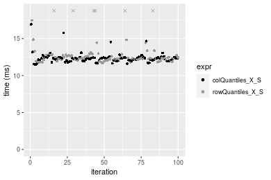

### 1000x100 matrix


```r
> X <- data[["1000x100"]]
> rows <- sample.int(nrow(X), size = nrow(X) * 0.7)
> cols <- sample.int(ncol(X), size = ncol(X) * 0.7)
> X_S <- X[rows, cols]
> gc()
          used  (Mb) gc trigger  (Mb) max used  (Mb)
Ncells 5215696 278.6   10014072 534.9 10014072 534.9
Vcells 9734398  74.3   18204443 138.9 18204443 138.9
> probs <- seq(from = 0, to = 1, by = 0.25)
> colStats <- microbenchmark(colQuantiles_X_S = colQuantiles(X_S, probs = probs, na.rm = FALSE), `colQuantiles(X, rows, cols)` = colQuantiles(X, 
+     rows = rows, cols = cols, probs = probs, na.rm = FALSE), `colQuantiles(X[rows, cols])` = colQuantiles(X[rows, 
+     cols], probs = probs, na.rm = FALSE), unit = "ms")
> X <- t(X)
> X_S <- t(X_S)
> gc()
          used  (Mb) gc trigger  (Mb) max used  (Mb)
Ncells 5215684 278.6   10014072 534.9 10014072 534.9
Vcells 9834471  75.1   18204443 138.9 18204443 138.9
> rowStats <- microbenchmark(rowQuantiles_X_S = rowQuantiles(X_S, probs = probs, na.rm = FALSE), `rowQuantiles(X, cols, rows)` = rowQuantiles(X, 
+     rows = cols, cols = rows, probs = probs, na.rm = FALSE), `rowQuantiles(X[cols, rows])` = rowQuantiles(X[cols, 
+     rows], probs = probs, na.rm = FALSE), unit = "ms")
```

_Table: Benchmarking of colQuantiles_X_S(), colQuantiles(X, rows, cols)() and colQuantiles(X[rows, cols])() on 1000x100 data. The top panel shows times in milliseconds and the bottom panel shows relative times._


|   |expr                        |      min|       lq|     mean|   median|       uq|      max|
|:--|:---------------------------|--------:|--------:|--------:|--------:|--------:|--------:|
|1  |colQuantiles_X_S            | 2.857934| 2.884063| 3.081315| 2.919230| 2.967042| 10.36538|
|3  |colQuantiles(X[rows, cols]) | 2.961238| 2.990208| 3.279434| 3.035365| 3.100494| 11.05323|
|2  |colQuantiles(X, rows, cols) | 2.960488| 2.990762| 3.365676| 3.045037| 3.311514| 11.88253|


|   |expr                        |      min|       lq|     mean|   median|       uq|      max|
|:--|:---------------------------|--------:|--------:|--------:|--------:|--------:|--------:|
|1  |colQuantiles_X_S            | 1.000000| 1.000000| 1.000000| 1.000000| 1.000000| 1.000000|
|3  |colQuantiles(X[rows, cols]) | 1.036146| 1.036804| 1.064297| 1.039783| 1.044979| 1.066360|
|2  |colQuantiles(X, rows, cols) | 1.035884| 1.036996| 1.092285| 1.043096| 1.116100| 1.146367|

_Table: Benchmarking of rowQuantiles_X_S(), rowQuantiles(X, cols, rows)() and rowQuantiles(X[cols, rows])() on 1000x100 data (transposed). The top panel shows times in milliseconds and the bottom panel shows relative times._


|   |expr                        |      min|       lq|     mean|   median|       uq|      max|
|:--|:---------------------------|--------:|--------:|--------:|--------:|--------:|--------:|
|1  |rowQuantiles_X_S            | 3.057926| 3.083514| 3.356193| 3.112058| 3.177643| 11.19794|
|3  |rowQuantiles(X[cols, rows]) | 3.186839| 3.217227| 3.508942| 3.256681| 3.325397| 11.59624|
|2  |rowQuantiles(X, cols, rows) | 3.184455| 3.217997| 3.447133| 3.263454| 3.307615| 11.81097|


|   |expr                        |      min|       lq|     mean|   median|       uq|      max|
|:--|:---------------------------|--------:|--------:|--------:|--------:|--------:|--------:|
|1  |rowQuantiles_X_S            | 1.000000| 1.000000| 1.000000| 1.000000| 1.000000| 1.000000|
|3  |rowQuantiles(X[cols, rows]) | 1.042157| 1.043364| 1.045513| 1.046472| 1.046498| 1.035569|
|2  |rowQuantiles(X, cols, rows) | 1.041377| 1.043614| 1.027096| 1.048648| 1.040902| 1.054745|

_Figure: Benchmarking of colQuantiles_X_S(), colQuantiles(X, rows, cols)() and colQuantiles(X[rows, cols])() on 1000x100 data  as well as rowQuantiles_X_S(), rowQuantiles(X, cols, rows)() and rowQuantiles(X[cols, rows])() on the same data transposed.  Outliers are displayed as crosses.  Times are in milliseconds._


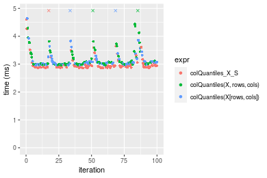

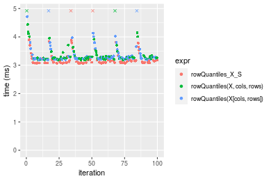
_Table: Benchmarking of colQuantiles_X_S() and rowQuantiles_X_S() on 1000x100 data (original and transposed).  The top panel shows times in milliseconds and the bottom panel shows relative times._


|   |expr             |      min|       lq|     mean|   median|       uq|      max|
|:--|:----------------|--------:|--------:|--------:|--------:|--------:|--------:|
|1  |colQuantiles_X_S | 2.857934| 2.884063| 3.081315| 2.919230| 2.967042| 10.36538|
|2  |rowQuantiles_X_S | 3.057926| 3.083514| 3.356193| 3.112058| 3.177643| 11.19794|


|   |expr             |      min|       lq|     mean|   median|      uq|      max|
|:--|:----------------|--------:|--------:|--------:|--------:|-------:|--------:|
|1  |colQuantiles_X_S | 1.000000| 1.000000| 1.000000| 1.000000| 1.00000| 1.000000|
|2  |rowQuantiles_X_S | 1.069978| 1.069156| 1.089208| 1.066054| 1.07098| 1.080321|

_Figure: Benchmarking of colQuantiles_X_S() and rowQuantiles_X_S() on 1000x100 data (original and transposed).  Outliers are displayed as crosses. Times are in milliseconds._


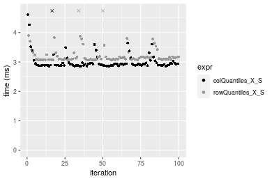


## Appendix

### Session information
```r
R version 4.1.1 Patched (2021-08-10 r80727)
Platform: x86_64-pc-linux-gnu (64-bit)
Running under: Ubuntu 18.04.5 LTS

Matrix products: default
BLAS:   /home/hb/software/R-devel/R-4-1-branch/lib/R/lib/libRblas.so
LAPACK: /home/hb/software/R-devel/R-4-1-branch/lib/R/lib/libRlapack.so

locale:
 [1] LC_CTYPE=en_US.UTF-8       LC_NUMERIC=C              
 [3] LC_TIME=en_US.UTF-8        LC_COLLATE=en_US.UTF-8    
 [5] LC_MONETARY=en_US.UTF-8    LC_MESSAGES=en_US.UTF-8   
 [7] LC_PAPER=en_US.UTF-8       LC_NAME=C                 
 [9] LC_ADDRESS=C               LC_TELEPHONE=C            
[11] LC_MEASUREMENT=en_US.UTF-8 LC_IDENTIFICATION=C       

attached base packages:
[1] stats     graphics  grDevices utils     datasets  methods   base     

other attached packages:
[1] microbenchmark_1.4-7   matrixStats_0.60.1     ggplot2_3.3.5         
[4] knitr_1.33             R.devices_2.17.0       R.utils_2.10.1        
[7] R.oo_1.24.0            R.methodsS3_1.8.1-9001 history_0.0.1-9000    

loaded via a namespace (and not attached):
 [1] Biobase_2.52.0          httr_1.4.2              splines_4.1.1          
 [4] bit64_4.0.5             network_1.17.1          assertthat_0.2.1       
 [7] highr_0.9               stats4_4.1.1            blob_1.2.2             
[10] GenomeInfoDbData_1.2.6  robustbase_0.93-8       pillar_1.6.2           
[13] RSQLite_2.2.8           lattice_0.20-44         glue_1.4.2             
[16] digest_0.6.27           XVector_0.32.0          colorspace_2.0-2       
[19] Matrix_1.3-4            XML_3.99-0.7            pkgconfig_2.0.3        
[22] zlibbioc_1.38.0         genefilter_1.74.0       purrr_0.3.4            
[25] ergm_4.1.2              xtable_1.8-4            scales_1.1.1           
[28] tibble_3.1.4            annotate_1.70.0         KEGGREST_1.32.0        
[31] farver_2.1.0            generics_0.1.0          IRanges_2.26.0         
[34] ellipsis_0.3.2          cachem_1.0.6            withr_2.4.2            
[37] BiocGenerics_0.38.0     mime_0.11               survival_3.2-13        
[40] magrittr_2.0.1          crayon_1.4.1            statnet.common_4.5.0   
[43] memoise_2.0.0           laeken_0.5.1            fansi_0.5.0            
[46] R.cache_0.15.0          MASS_7.3-54             R.rsp_0.44.0           
[49] progressr_0.8.0         tools_4.1.1             lifecycle_1.0.0        
[52] S4Vectors_0.30.0        trust_0.1-8             munsell_0.5.0          
[55] tabby_0.0.1-9001        AnnotationDbi_1.54.1    Biostrings_2.60.2      
[58] compiler_4.1.1          GenomeInfoDb_1.28.1     rlang_0.4.11           
[61] grid_4.1.1              RCurl_1.98-1.4          cwhmisc_6.6            
[64] rappdirs_0.3.3          startup_0.15.0          labeling_0.4.2         
[67] bitops_1.0-7            base64enc_0.1-3         boot_1.3-28            
[70] gtable_0.3.0            DBI_1.1.1               markdown_1.1           
[73] R6_2.5.1                lpSolveAPI_5.5.2.0-17.7 rle_0.9.2              
[76] dplyr_1.0.7             fastmap_1.1.0           bit_4.0.4              
[79] utf8_1.2.2              parallel_4.1.1          Rcpp_1.0.7             
[82] vctrs_0.3.8             png_0.1-7               DEoptimR_1.0-9         
[85] tidyselect_1.1.1        xfun_0.25               coda_0.19-4            
```
Total processing time was 28.63 secs.


### Reproducibility
To reproduce this report, do:
```r
html <- matrixStats:::benchmark('colRowQuantiles_subset')
```

[RSP]: https://cran.r-project.org/package=R.rsp
[matrixStats]: https://cran.r-project.org/package=matrixStats

[StackOverflow:colMins?]: https://stackoverflow.com/questions/13676878 "Stack Overflow: fastest way to get Min from every column in a matrix?"
[StackOverflow:colSds?]: https://stackoverflow.com/questions/17549762 "Stack Overflow: Is there such 'colsd' in R?"
[StackOverflow:rowProds?]: https://stackoverflow.com/questions/20198801/ "Stack Overflow: Row product of matrix and column sum of matrix"

---------------------------------------
Copyright Dongcan Jiang. Last updated on 2021-08-25 18:12:00 (+0200 UTC). Powered by [RSP].

<script>
 var link = document.createElement('link');
 link.rel = 'icon';
 link.href = "data:image/png;base64,iVBORw0KGgoAAAANSUhEUgAAACAAAAAgCAMAAABEpIrGAAAA21BMVEUAAAAAAP8AAP8AAP8AAP8AAP8AAP8AAP8AAP8AAP8AAP8AAP8AAP8AAP8AAP8AAP8AAP8AAP8AAP8AAP8AAP8AAP8AAP8AAP8AAP8AAP8AAP8AAP8AAP8AAP8AAP8AAP8AAP8AAP8AAP8AAP8AAP8AAP8AAP8AAP8AAP8AAP8BAf4CAv0DA/wdHeIeHuEfH+AgIN8hId4lJdomJtknJ9g+PsE/P8BAQL9yco10dIt1dYp3d4h4eIeVlWqWlmmXl2iYmGeZmWabm2Tn5xjo6Bfp6Rb39wj4+Af//wA2M9hbAAAASXRSTlMAAQIJCgsMJSYnKD4/QGRlZmhpamtsbautrrCxuru8y8zN5ebn6Pn6+///////////////////////////////////////////LsUNcQAAAS9JREFUOI29k21XgkAQhVcFytdSMqMETU26UVqGmpaiFbL//xc1cAhhwVNf6n5i5z67M2dmYOyfJZUqlVLhkKucG7cgmUZTybDz6g0iDeq51PUr37Ds2cy2/C9NeES5puDjxuUk1xnToZsg8pfA3avHQ3lLIi7iWRrkv/OYtkScxBIMgDee0ALoyxHQBJ68JLCjOtQIMIANF7QG9G9fNnHvisCHBVMKgSJgiz7nE+AoBKrAPA3MgepvgR9TSCasrCKH0eB1wBGBFdCO+nAGjMVGPcQb5bd6mQRegN6+1axOs9nGfYcCtfi4NQosdtH7dB+txFIpXQqN1p9B/asRHToyS0jRgpV7nk4nwcq1BJ+x3Gl/v7S9Wmpp/aGquum7w3ZDyrADFYrl8vHBH+ev9AUASW1dmU4h4wAAAABJRU5ErkJggg=="
 document.getElementsByTagName('head')[0].appendChild(link);
</script>


