[matrixStats]: Benchmark report

---------------------------------------


# colRanges() and rowRanges() benchmarks

This report benchmark the performance of colRanges() and rowRanges() against alternative methods.

## Alternative methods

* apply() + range()


## Data type "integer"

### Data
```r
> rmatrix <- function(nrow, ncol, mode = c("logical", "double", "integer", "index"), range = c(-100, 
+     +100), na_prob = 0) {
+     mode <- match.arg(mode)
+     n <- nrow * ncol
+     if (mode == "logical") {
+         x <- sample(c(FALSE, TRUE), size = n, replace = TRUE)
+     }     else if (mode == "index") {
+         x <- seq_len(n)
+         mode <- "integer"
+     }     else {
+         x <- runif(n, min = range[1], max = range[2])
+     }
+     storage.mode(x) <- mode
+     if (na_prob > 0) 
+         x[sample(n, size = na_prob * n)] <- NA
+     dim(x) <- c(nrow, ncol)
+     x
+ }
> rmatrices <- function(scale = 10, seed = 1, ...) {
+     set.seed(seed)
+     data <- list()
+     data[[1]] <- rmatrix(nrow = scale * 1, ncol = scale * 1, ...)
+     data[[2]] <- rmatrix(nrow = scale * 10, ncol = scale * 10, ...)
+     data[[3]] <- rmatrix(nrow = scale * 100, ncol = scale * 1, ...)
+     data[[4]] <- t(data[[3]])
+     data[[5]] <- rmatrix(nrow = scale * 10, ncol = scale * 100, ...)
+     data[[6]] <- t(data[[5]])
+     names(data) <- sapply(data, FUN = function(x) paste(dim(x), collapse = "x"))
+     data
+ }
> data <- rmatrices(mode = mode)
```

### Results

#### 10x10 integer matrix

```r
> X <- data[["10x10"]]
> gc()
           used  (Mb) gc trigger  (Mb) max used  (Mb)
Ncells  5240090 279.9   10014072 534.9 10014072 534.9
Vcells 10075494  76.9   18204443 138.9 18204443 138.9
> colStats <- microbenchmark(colRanges = colRanges(X, na.rm = FALSE), `apply+range` = apply(X, MARGIN = 2L, 
+     FUN = range, na.rm = FALSE), unit = "ms")
> X <- t(X)
> gc()
           used  (Mb) gc trigger  (Mb) max used  (Mb)
Ncells  5224764 279.1   10014072 534.9 10014072 534.9
Vcells 10024861  76.5   18204443 138.9 18204443 138.9
> rowStats <- microbenchmark(rowRanges = rowRanges(X, na.rm = FALSE), `apply+range` = apply(X, MARGIN = 1L, 
+     FUN = range, na.rm = FALSE), unit = "ms")
```

_Table: Benchmarking of colRanges() and apply+range() on integer+10x10 data. The top panel shows times in milliseconds and the bottom panel shows relative times._


|   |expr        |      min|       lq|      mean|   median|       uq|      max|
|:--|:-----------|--------:|--------:|---------:|--------:|--------:|--------:|
|1  |colRanges   | 0.002057| 0.002326| 0.0031182| 0.002639| 0.003730| 0.014247|
|2  |apply+range | 0.063789| 0.065496| 0.0685767| 0.067369| 0.068502| 0.159636|


|   |expr        |     min|       lq|     mean|   median|       uq|      max|
|:--|:-----------|-------:|--------:|--------:|--------:|--------:|--------:|
|1  |colRanges   |  1.0000|  1.00000|  1.00000|  1.00000|  1.00000|  1.00000|
|2  |apply+range | 31.0107| 28.15821| 21.99255| 25.52823| 18.36515| 11.20489|

_Table: Benchmarking of rowRanges() and apply+range() on integer+10x10 data (transposed). The top panel shows times in milliseconds and the bottom panel shows relative times._


|   |expr        |      min|        lq|      mean|   median|        uq|      max|
|:--|:-----------|--------:|---------:|---------:|--------:|---------:|--------:|
|1  |rowRanges   | 0.002093| 0.0025090| 0.0035860| 0.003513| 0.0037805| 0.017638|
|2  |apply+range | 0.061729| 0.0656545| 0.0682573| 0.067529| 0.0685940| 0.151717|


|   |expr        |      min|      lq|     mean|  median|       uq|      max|
|:--|:-----------|--------:|-------:|--------:|-------:|--------:|--------:|
|1  |rowRanges   |  1.00000|  1.0000|  1.00000|  1.0000|  1.00000| 1.000000|
|2  |apply+range | 29.49307| 26.1676| 19.03434| 19.2226| 18.14416| 8.601712|

_Figure: Benchmarking of colRanges() and apply+range() on integer+10x10 data  as well as rowRanges() and apply+range() on the same data transposed.  Outliers are displayed as crosses.  Times are in milliseconds._


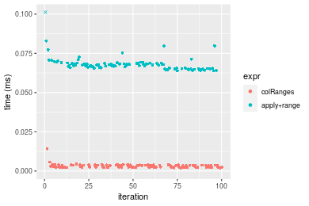

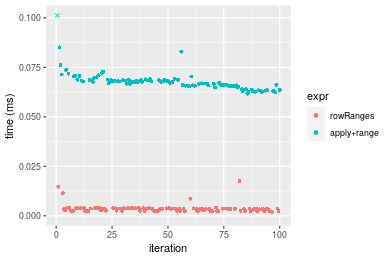
_Table: Benchmarking of colRanges() and rowRanges() on integer+10x10 data (original and transposed).  The top panel shows times in milliseconds and the bottom panel shows relative times._


|   |expr      |   min|    lq|    mean| median|     uq|    max|
|:--|:---------|-----:|-----:|-------:|------:|------:|------:|
|1  |colRanges | 2.057| 2.326| 3.11818|  2.639| 3.7300| 14.247|
|2  |rowRanges | 2.093| 2.509| 3.58601|  3.513| 3.7805| 17.638|


|   |expr      |      min|       lq|     mean|   median|       uq|      max|
|:--|:---------|--------:|--------:|--------:|--------:|--------:|--------:|
|1  |colRanges | 1.000000| 1.000000| 1.000000| 1.000000| 1.000000| 1.000000|
|2  |rowRanges | 1.017501| 1.078676| 1.150033| 1.331186| 1.013539| 1.238015|

_Figure: Benchmarking of colRanges() and rowRanges() on integer+10x10 data (original and transposed).  Outliers are displayed as crosses. Times are in milliseconds._


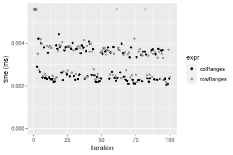

#### 100x100 integer matrix

```r
> X <- data[["100x100"]]
> gc()
          used  (Mb) gc trigger  (Mb) max used  (Mb)
Ncells 5223342 279.0   10014072 534.9 10014072 534.9
Vcells 9641393  73.6   18204443 138.9 18204443 138.9
> colStats <- microbenchmark(colRanges = colRanges(X, na.rm = FALSE), `apply+range` = apply(X, MARGIN = 2L, 
+     FUN = range, na.rm = FALSE), unit = "ms")
> X <- t(X)
> gc()
          used  (Mb) gc trigger  (Mb) max used  (Mb)
Ncells 5223318 279.0   10014072 534.9 10014072 534.9
Vcells 9646406  73.6   18204443 138.9 18204443 138.9
> rowStats <- microbenchmark(rowRanges = rowRanges(X, na.rm = FALSE), `apply+range` = apply(X, MARGIN = 1L, 
+     FUN = range, na.rm = FALSE), unit = "ms")
```

_Table: Benchmarking of colRanges() and apply+range() on integer+100x100 data. The top panel shows times in milliseconds and the bottom panel shows relative times._


|   |expr        |      min|       lq|      mean|    median|       uq|      max|
|:--|:-----------|--------:|--------:|---------:|---------:|--------:|--------:|
|1  |colRanges   | 0.027009| 0.030268| 0.0330110| 0.0320405| 0.034590| 0.057917|
|2  |apply+range | 0.351210| 0.387800| 0.4274622| 0.4090590| 0.449414| 0.669321|


|   |expr        |      min|       lq|    mean|   median|      uq|      max|
|:--|:-----------|--------:|--------:|-------:|--------:|-------:|--------:|
|1  |colRanges   |  1.00000|  1.00000|  1.0000|  1.00000|  1.0000|  1.00000|
|2  |apply+range | 13.00344| 12.81221| 12.9491| 12.76694| 12.9926| 11.55656|

_Table: Benchmarking of rowRanges() and apply+range() on integer+100x100 data (transposed). The top panel shows times in milliseconds and the bottom panel shows relative times._


|   |expr        |      min|        lq|      mean|    median|       uq|      max|
|:--|:-----------|--------:|---------:|---------:|---------:|--------:|--------:|
|1  |rowRanges   | 0.026756| 0.0310710| 0.0337663| 0.0326970| 0.035686| 0.053549|
|2  |apply+range | 0.350329| 0.3860135| 0.4263543| 0.4113785| 0.450911| 0.678199|


|   |expr        |      min|       lq|     mean|   median|       uq|      max|
|:--|:-----------|--------:|--------:|--------:|--------:|--------:|--------:|
|1  |rowRanges   |  1.00000|  1.00000|  1.00000|  1.00000|  1.00000|  1.00000|
|2  |apply+range | 13.09347| 12.42359| 12.62663| 12.58154| 12.63552| 12.66502|

_Figure: Benchmarking of colRanges() and apply+range() on integer+100x100 data  as well as rowRanges() and apply+range() on the same data transposed.  Outliers are displayed as crosses.  Times are in milliseconds._


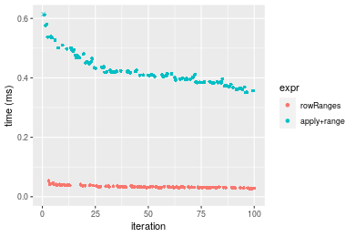
_Table: Benchmarking of colRanges() and rowRanges() on integer+100x100 data (original and transposed).  The top panel shows times in milliseconds and the bottom panel shows relative times._


|   |expr      |    min|     lq|     mean|  median|     uq|    max|
|:--|:---------|------:|------:|--------:|-------:|------:|------:|
|1  |colRanges | 27.009| 30.268| 33.01097| 32.0405| 34.590| 57.917|
|2  |rowRanges | 26.756| 31.071| 33.76628| 32.6970| 35.686| 53.549|


|   |expr      |       min|      lq|     mean|  median|       uq|       max|
|:--|:---------|---------:|-------:|--------:|-------:|--------:|---------:|
|1  |colRanges | 1.0000000| 1.00000| 1.000000| 1.00000| 1.000000| 1.0000000|
|2  |rowRanges | 0.9906328| 1.02653| 1.022881| 1.02049| 1.031686| 0.9245817|

_Figure: Benchmarking of colRanges() and rowRanges() on integer+100x100 data (original and transposed).  Outliers are displayed as crosses. Times are in milliseconds._


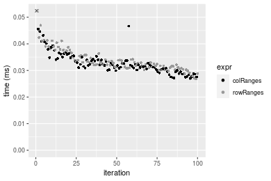

#### 1000x10 integer matrix

```r
> X <- data[["1000x10"]]
> gc()
          used  (Mb) gc trigger  (Mb) max used  (Mb)
Ncells 5224072 279.0   10014072 534.9 10014072 534.9
Vcells 9644900  73.6   18204443 138.9 18204443 138.9
> colStats <- microbenchmark(colRanges = colRanges(X, na.rm = FALSE), `apply+range` = apply(X, MARGIN = 2L, 
+     FUN = range, na.rm = FALSE), unit = "ms")
> X <- t(X)
> gc()
          used  (Mb) gc trigger  (Mb) max used  (Mb)
Ncells 5224048 279.0   10014072 534.9 10014072 534.9
Vcells 9649913  73.7   18204443 138.9 18204443 138.9
> rowStats <- microbenchmark(rowRanges = rowRanges(X, na.rm = FALSE), `apply+range` = apply(X, MARGIN = 1L, 
+     FUN = range, na.rm = FALSE), unit = "ms")
```

_Table: Benchmarking of colRanges() and apply+range() on integer+1000x10 data. The top panel shows times in milliseconds and the bottom panel shows relative times._


|   |expr        |      min|        lq|      mean|    median|       uq|      max|
|:--|:-----------|--------:|---------:|---------:|---------:|--------:|--------:|
|1  |colRanges   | 0.022660| 0.0241705| 0.0271618| 0.0263270| 0.028964| 0.044593|
|2  |apply+range | 0.161451| 0.1638615| 0.1794838| 0.1761165| 0.188744| 0.292214|


|   |expr        |      min|       lq|     mean|   median|       uq|      max|
|:--|:-----------|--------:|--------:|--------:|--------:|--------:|--------:|
|1  |colRanges   | 1.000000| 1.000000| 1.000000| 1.000000| 1.000000| 1.000000|
|2  |apply+range | 7.124934| 6.779401| 6.607953| 6.689577| 6.516503| 6.552912|

_Table: Benchmarking of rowRanges() and apply+range() on integer+1000x10 data (transposed). The top panel shows times in milliseconds and the bottom panel shows relative times._


|   |expr        |      min|        lq|      mean|    median|        uq|      max|
|:--|:-----------|--------:|---------:|---------:|---------:|---------:|--------:|
|1  |rowRanges   | 0.028936| 0.0314625| 0.0368090| 0.0343450| 0.0366270| 0.062338|
|2  |apply+range | 0.157462| 0.1706390| 0.2018153| 0.1797335| 0.1988875| 0.372108|


|   |expr        |      min|       lq|     mean|   median|       uq|    max|
|:--|:-----------|--------:|--------:|--------:|--------:|--------:|------:|
|1  |rowRanges   | 1.000000| 1.000000| 1.000000| 1.000000| 1.000000| 1.0000|
|2  |apply+range | 5.441733| 5.423568| 5.482773| 5.233178| 5.430079| 5.9692|

_Figure: Benchmarking of colRanges() and apply+range() on integer+1000x10 data  as well as rowRanges() and apply+range() on the same data transposed.  Outliers are displayed as crosses.  Times are in milliseconds._


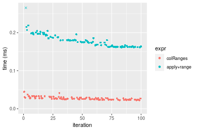

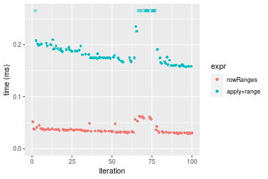
_Table: Benchmarking of colRanges() and rowRanges() on integer+1000x10 data (original and transposed).  The top panel shows times in milliseconds and the bottom panel shows relative times._


|   |expr      |    min|      lq|     mean| median|     uq|    max|
|:--|:---------|------:|-------:|--------:|------:|------:|------:|
|1  |colRanges | 22.660| 24.1705| 27.16178| 26.327| 28.964| 44.593|
|2  |rowRanges | 28.936| 31.4625| 36.80898| 34.345| 36.627| 62.338|


|   |expr      |      min|      lq|     mean|   median|      uq|      max|
|:--|:---------|--------:|-------:|--------:|--------:|-------:|--------:|
|1  |colRanges | 1.000000| 1.00000| 1.000000| 1.000000| 1.00000| 1.000000|
|2  |rowRanges | 1.276964| 1.30169| 1.355176| 1.304554| 1.26457| 1.397932|

_Figure: Benchmarking of colRanges() and rowRanges() on integer+1000x10 data (original and transposed).  Outliers are displayed as crosses. Times are in milliseconds._


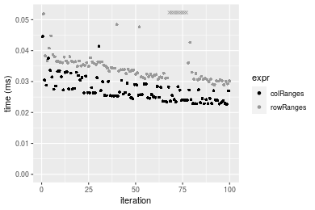

#### 10x1000 integer matrix

```r
> X <- data[["10x1000"]]
> gc()
          used  (Mb) gc trigger  (Mb) max used  (Mb)
Ncells 5224260 279.1   10014072 534.9 10014072 534.9
Vcells 9645580  73.6   18204443 138.9 18204443 138.9
> colStats <- microbenchmark(colRanges = colRanges(X, na.rm = FALSE), `apply+range` = apply(X, MARGIN = 2L, 
+     FUN = range, na.rm = FALSE), unit = "ms")
> X <- t(X)
> gc()
          used  (Mb) gc trigger  (Mb) max used  (Mb)
Ncells 5224236 279.1   10014072 534.9 10014072 534.9
Vcells 9650593  73.7   18204443 138.9 18204443 138.9
> rowStats <- microbenchmark(rowRanges = rowRanges(X, na.rm = FALSE), `apply+range` = apply(X, MARGIN = 1L, 
+     FUN = range, na.rm = FALSE), unit = "ms")
```

_Table: Benchmarking of colRanges() and apply+range() on integer+10x1000 data. The top panel shows times in milliseconds and the bottom panel shows relative times._


|   |expr        |     min|       lq|      mean|   median|        uq|      max|
|:--|:-----------|-------:|--------:|---------:|--------:|---------:|--------:|
|1  |colRanges   | 0.05286| 0.054329| 0.0593475| 0.056141| 0.0598065| 0.095758|
|2  |apply+range | 2.25581| 2.384006| 2.5118099| 2.494061| 2.5521825| 3.561955|


|   |expr        |      min|       lq|    mean|   median|     uq|      max|
|:--|:-----------|--------:|--------:|-------:|--------:|------:|--------:|
|1  |colRanges   |  1.00000|  1.00000|  1.0000|  1.00000|  1.000|  1.00000|
|2  |apply+range | 42.67518| 43.88091| 42.3238| 44.42495| 42.674| 37.19747|

_Table: Benchmarking of rowRanges() and apply+range() on integer+10x1000 data (transposed). The top panel shows times in milliseconds and the bottom panel shows relative times._


|   |expr        |      min|       lq|      mean|   median|       uq|      max|
|:--|:-----------|--------:|--------:|---------:|--------:|--------:|--------:|
|1  |rowRanges   | 0.044177| 0.046085| 0.0500648| 0.047817| 0.049926| 0.082737|
|2  |apply+range | 2.209073| 2.361173| 2.5029451| 2.479004| 2.534382| 3.459649|


|   |expr        |      min|       lq|     mean|   median|       uq|      max|
|:--|:-----------|--------:|--------:|--------:|--------:|--------:|--------:|
|1  |rowRanges   |  1.00000|  1.00000|  1.00000|  1.00000|  1.00000|  1.00000|
|2  |apply+range | 50.00505| 51.23517| 49.99415| 51.84356| 50.76278| 41.81502|

_Figure: Benchmarking of colRanges() and apply+range() on integer+10x1000 data  as well as rowRanges() and apply+range() on the same data transposed.  Outliers are displayed as crosses.  Times are in milliseconds._


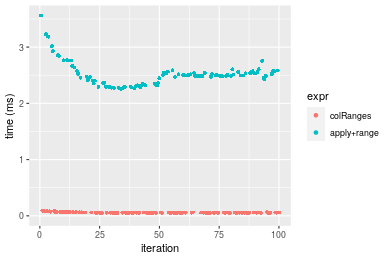


_Table: Benchmarking of colRanges() and rowRanges() on integer+10x1000 data (original and transposed).  The top panel shows times in milliseconds and the bottom panel shows relative times._


|   |expr      |    min|     lq|     mean| median|      uq|    max|
|:--|:---------|------:|------:|--------:|------:|-------:|------:|
|2  |rowRanges | 44.177| 46.085| 50.06476| 47.817| 49.9260| 82.737|
|1  |colRanges | 52.860| 54.329| 59.34745| 56.141| 59.8065| 95.758|


|   |expr      |     min|       lq|     mean|  median|       uq|      max|
|:--|:---------|-------:|--------:|--------:|-------:|--------:|--------:|
|2  |rowRanges | 1.00000| 1.000000| 1.000000| 1.00000| 1.000000| 1.000000|
|1  |colRanges | 1.19655| 1.178887| 1.185414| 1.17408| 1.197903| 1.157378|

_Figure: Benchmarking of colRanges() and rowRanges() on integer+10x1000 data (original and transposed).  Outliers are displayed as crosses. Times are in milliseconds._


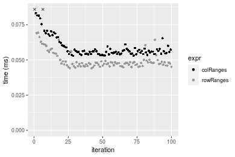

#### 100x1000 integer matrix

```r
> X <- data[["100x1000"]]
> gc()
          used  (Mb) gc trigger  (Mb) max used  (Mb)
Ncells 5224438 279.1   10014072 534.9 10014072 534.9
Vcells 9646049  73.6   18204443 138.9 18204443 138.9
> colStats <- microbenchmark(colRanges = colRanges(X, na.rm = FALSE), `apply+range` = apply(X, MARGIN = 2L, 
+     FUN = range, na.rm = FALSE), unit = "ms")
> X <- t(X)
> gc()
          used  (Mb) gc trigger  (Mb) max used  (Mb)
Ncells 5224420 279.1   10014072 534.9 10014072 534.9
Vcells 9696072  74.0   18204443 138.9 18204443 138.9
> rowStats <- microbenchmark(rowRanges = rowRanges(X, na.rm = FALSE), `apply+range` = apply(X, MARGIN = 1L, 
+     FUN = range, na.rm = FALSE), unit = "ms")
```

_Table: Benchmarking of colRanges() and apply+range() on integer+100x1000 data. The top panel shows times in milliseconds and the bottom panel shows relative times._


|   |expr        |      min|       lq|      mean|   median|       uq|       max|
|:--|:-----------|--------:|--------:|---------:|--------:|--------:|---------:|
|1  |colRanges   | 0.237228| 0.251467| 0.2681171| 0.256303| 0.272192|  0.402164|
|2  |apply+range | 3.041097| 3.100046| 3.5469595| 3.153003| 3.339666| 16.496577|


|   |expr        |     min|       lq|     mean|   median|       uq|      max|
|:--|:-----------|-------:|--------:|--------:|--------:|--------:|--------:|
|1  |colRanges   |  1.0000|  1.00000|  1.00000|  1.00000|  1.00000|  1.00000|
|2  |apply+range | 12.8193| 12.32785| 13.22914| 12.30186| 12.26952| 41.01953|

_Table: Benchmarking of rowRanges() and apply+range() on integer+100x1000 data (transposed). The top panel shows times in milliseconds and the bottom panel shows relative times._


|   |expr        |      min|        lq|      mean|   median|        uq|       max|
|:--|:-----------|--------:|---------:|---------:|--------:|---------:|---------:|
|1  |rowRanges   | 0.237055| 0.2407715| 0.2559443| 0.245285| 0.2602725|  0.377456|
|2  |apply+range | 3.061818| 3.1102670| 3.5776471| 3.169609| 3.4011560| 16.749653|


|   |expr        |      min|       lq|     mean|   median|       uq|      max|
|:--|:-----------|--------:|--------:|--------:|--------:|--------:|--------:|
|1  |rowRanges   |  1.00000|  1.00000|  1.00000|  1.00000|  1.00000|  1.00000|
|2  |apply+range | 12.91607| 12.91792| 13.97822| 12.92215| 13.06767| 44.37511|

_Figure: Benchmarking of colRanges() and apply+range() on integer+100x1000 data  as well as rowRanges() and apply+range() on the same data transposed.  Outliers are displayed as crosses.  Times are in milliseconds._


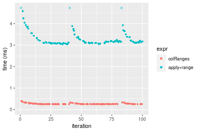

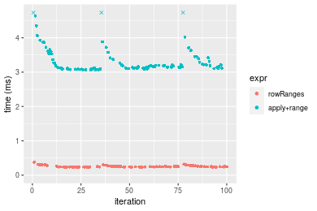
_Table: Benchmarking of colRanges() and rowRanges() on integer+100x1000 data (original and transposed).  The top panel shows times in milliseconds and the bottom panel shows relative times._


|   |expr      |     min|       lq|     mean|  median|       uq|     max|
|:--|:---------|-------:|--------:|--------:|-------:|--------:|-------:|
|2  |rowRanges | 237.055| 240.7715| 255.9443| 245.285| 260.2725| 377.456|
|1  |colRanges | 237.228| 251.4670| 268.1171| 256.303| 272.1920| 402.164|


|   |expr      |     min|       lq|    mean|   median|       uq|      max|
|:--|:---------|-------:|--------:|-------:|--------:|--------:|--------:|
|2  |rowRanges | 1.00000| 1.000000| 1.00000| 1.000000| 1.000000| 1.000000|
|1  |colRanges | 1.00073| 1.044422| 1.04756| 1.044919| 1.045796| 1.065459|

_Figure: Benchmarking of colRanges() and rowRanges() on integer+100x1000 data (original and transposed).  Outliers are displayed as crosses. Times are in milliseconds._


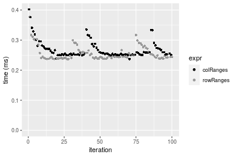

#### 1000x100 integer matrix

```r
> X <- data[["1000x100"]]
> gc()
          used  (Mb) gc trigger  (Mb) max used  (Mb)
Ncells 5224636 279.1   10014072 534.9 10014072 534.9
Vcells 9646617  73.6   18204443 138.9 18204443 138.9
> colStats <- microbenchmark(colRanges = colRanges(X, na.rm = FALSE), `apply+range` = apply(X, MARGIN = 2L, 
+     FUN = range, na.rm = FALSE), unit = "ms")
> X <- t(X)
> gc()
          used  (Mb) gc trigger  (Mb) max used  (Mb)
Ncells 5224612 279.1   10014072 534.9 10014072 534.9
Vcells 9696630  74.0   18204443 138.9 18204443 138.9
> rowStats <- microbenchmark(rowRanges = rowRanges(X, na.rm = FALSE), `apply+range` = apply(X, MARGIN = 1L, 
+     FUN = range, na.rm = FALSE), unit = "ms")
```

_Table: Benchmarking of colRanges() and apply+range() on integer+1000x100 data. The top panel shows times in milliseconds and the bottom panel shows relative times._


|   |expr        |      min|       lq|     mean|    median|        uq|      max|
|:--|:-----------|--------:|--------:|--------:|---------:|---------:|--------:|
|1  |colRanges   | 0.180562| 0.193472| 0.217037| 0.2172445| 0.2345055| 0.322629|
|2  |apply+range | 1.032728| 1.063320| 1.359840| 1.2078705| 1.3209405| 8.332265|


|   |expr        |     min|       lq|     mean|   median|       uq|      max|
|:--|:-----------|-------:|--------:|--------:|--------:|--------:|--------:|
|1  |colRanges   | 1.00000| 1.000000| 1.000000| 1.000000| 1.000000|  1.00000|
|2  |apply+range | 5.71952| 5.495992| 6.265477| 5.559959| 5.632876| 25.82615|

_Table: Benchmarking of rowRanges() and apply+range() on integer+1000x100 data (transposed). The top panel shows times in milliseconds and the bottom panel shows relative times._


|   |expr        |      min|        lq|      mean|    median|       uq|      max|
|:--|:-----------|--------:|---------:|---------:|---------:|--------:|--------:|
|1  |rowRanges   | 0.200344| 0.2097735| 0.2367739| 0.2322595| 0.252521| 0.531338|
|2  |apply+range | 1.034344| 1.0918660| 1.3885301| 1.2098755| 1.337280| 8.526294|


|   |expr        |     min|       lq|     mean|   median|       uq|      max|
|:--|:-----------|-------:|--------:|--------:|--------:|--------:|--------:|
|1  |rowRanges   | 1.00000| 1.000000| 1.000000| 1.000000| 1.000000|  1.00000|
|2  |apply+range | 5.16284| 5.204976| 5.864371| 5.209154| 5.295718| 16.04684|

_Figure: Benchmarking of colRanges() and apply+range() on integer+1000x100 data  as well as rowRanges() and apply+range() on the same data transposed.  Outliers are displayed as crosses.  Times are in milliseconds._


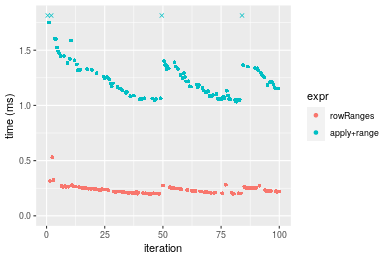
_Table: Benchmarking of colRanges() and rowRanges() on integer+1000x100 data (original and transposed).  The top panel shows times in milliseconds and the bottom panel shows relative times._


|   |expr      |     min|       lq|     mean|   median|       uq|     max|
|:--|:---------|-------:|--------:|--------:|--------:|--------:|-------:|
|1  |colRanges | 180.562| 193.4720| 217.0370| 217.2445| 234.5055| 322.629|
|2  |rowRanges | 200.344| 209.7735| 236.7739| 232.2595| 252.5210| 531.338|


|   |expr      |      min|       lq|     mean|   median|       uq|      max|
|:--|:---------|--------:|--------:|--------:|--------:|--------:|--------:|
|1  |colRanges | 1.000000| 1.000000| 1.000000| 1.000000| 1.000000| 1.000000|
|2  |rowRanges | 1.109558| 1.084258| 1.090938| 1.069116| 1.076823| 1.646901|

_Figure: Benchmarking of colRanges() and rowRanges() on integer+1000x100 data (original and transposed).  Outliers are displayed as crosses. Times are in milliseconds._


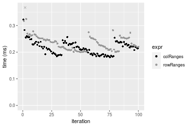


## Data type "double"

### Data
```r
> rmatrix <- function(nrow, ncol, mode = c("logical", "double", "integer", "index"), range = c(-100, 
+     +100), na_prob = 0) {
+     mode <- match.arg(mode)
+     n <- nrow * ncol
+     if (mode == "logical") {
+         x <- sample(c(FALSE, TRUE), size = n, replace = TRUE)
+     }     else if (mode == "index") {
+         x <- seq_len(n)
+         mode <- "integer"
+     }     else {
+         x <- runif(n, min = range[1], max = range[2])
+     }
+     storage.mode(x) <- mode
+     if (na_prob > 0) 
+         x[sample(n, size = na_prob * n)] <- NA
+     dim(x) <- c(nrow, ncol)
+     x
+ }
> rmatrices <- function(scale = 10, seed = 1, ...) {
+     set.seed(seed)
+     data <- list()
+     data[[1]] <- rmatrix(nrow = scale * 1, ncol = scale * 1, ...)
+     data[[2]] <- rmatrix(nrow = scale * 10, ncol = scale * 10, ...)
+     data[[3]] <- rmatrix(nrow = scale * 100, ncol = scale * 1, ...)
+     data[[4]] <- t(data[[3]])
+     data[[5]] <- rmatrix(nrow = scale * 10, ncol = scale * 100, ...)
+     data[[6]] <- t(data[[5]])
+     names(data) <- sapply(data, FUN = function(x) paste(dim(x), collapse = "x"))
+     data
+ }
> data <- rmatrices(mode = mode)
```

### Results

#### 10x10 double matrix

```r
> X <- data[["10x10"]]
> gc()
          used  (Mb) gc trigger  (Mb) max used  (Mb)
Ncells 5224836 279.1   10014072 534.9 10014072 534.9
Vcells 9762962  74.5   18204443 138.9 18204443 138.9
> colStats <- microbenchmark(colRanges = colRanges(X, na.rm = FALSE), `apply+range` = apply(X, MARGIN = 2L, 
+     FUN = range, na.rm = FALSE), unit = "ms")
> X <- t(X)
> gc()
          used  (Mb) gc trigger  (Mb) max used  (Mb)
Ncells 5224803 279.1   10014072 534.9 10014072 534.9
Vcells 9763060  74.5   18204443 138.9 18204443 138.9
> rowStats <- microbenchmark(rowRanges = rowRanges(X, na.rm = FALSE), `apply+range` = apply(X, MARGIN = 1L, 
+     FUN = range, na.rm = FALSE), unit = "ms")
```

_Table: Benchmarking of colRanges() and apply+range() on double+10x10 data. The top panel shows times in milliseconds and the bottom panel shows relative times._


|   |expr        |      min|        lq|      mean|    median|        uq|      max|
|:--|:-----------|--------:|---------:|---------:|---------:|---------:|--------:|
|1  |colRanges   | 0.002148| 0.0024705| 0.0032412| 0.0028635| 0.0037525| 0.014975|
|2  |apply+range | 0.061845| 0.0635120| 0.0666467| 0.0654470| 0.0668620| 0.145694|


|   |expr        |     min|       lq|     mean|  median|       uq|      max|
|:--|:-----------|-------:|--------:|--------:|-------:|--------:|--------:|
|1  |colRanges   |  1.0000|  1.00000|  1.00000|  1.0000|  1.00000| 1.000000|
|2  |apply+range | 28.7919| 25.70816| 20.56209| 22.8556| 17.81799| 9.729149|

_Table: Benchmarking of rowRanges() and apply+range() on double+10x10 data (transposed). The top panel shows times in milliseconds and the bottom panel shows relative times._


|   |expr        |      min|        lq|      mean|    median|        uq|      max|
|:--|:-----------|--------:|---------:|---------:|---------:|---------:|--------:|
|1  |rowRanges   | 0.002233| 0.0026710| 0.0037109| 0.0037610| 0.0039235| 0.019247|
|2  |apply+range | 0.061256| 0.0639925| 0.0673388| 0.0662325| 0.0675150| 0.150304|


|   |expr        |      min|       lq|     mean|   median|       uq|      max|
|:--|:-----------|--------:|--------:|--------:|--------:|--------:|--------:|
|1  |rowRanges   |  1.00000|  1.00000|  1.00000|  1.00000|  1.00000| 1.000000|
|2  |apply+range | 27.43215| 23.95826| 18.14641| 17.61034| 17.20785| 7.809217|

_Figure: Benchmarking of colRanges() and apply+range() on double+10x10 data  as well as rowRanges() and apply+range() on the same data transposed.  Outliers are displayed as crosses.  Times are in milliseconds._


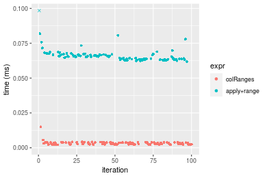

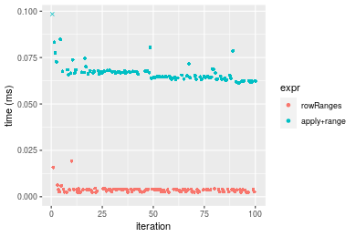
_Table: Benchmarking of colRanges() and rowRanges() on double+10x10 data (original and transposed).  The top panel shows times in milliseconds and the bottom panel shows relative times._


|   |expr      |   min|     lq|    mean| median|     uq|    max|
|:--|:---------|-----:|------:|-------:|------:|------:|------:|
|1  |colRanges | 2.148| 2.4705| 3.24124| 2.8635| 3.7525| 14.975|
|2  |rowRanges | 2.233| 2.6710| 3.71086| 3.7610| 3.9235| 19.247|


|   |expr      |      min|       lq|     mean|   median|      uq|      max|
|:--|:---------|--------:|--------:|--------:|--------:|-------:|--------:|
|1  |colRanges | 1.000000| 1.000000| 1.000000| 1.000000| 1.00000| 1.000000|
|2  |rowRanges | 1.039572| 1.081158| 1.144889| 1.313428| 1.04557| 1.285276|

_Figure: Benchmarking of colRanges() and rowRanges() on double+10x10 data (original and transposed).  Outliers are displayed as crosses. Times are in milliseconds._


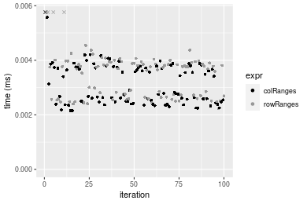

#### 100x100 double matrix

```r
> X <- data[["100x100"]]
> gc()
          used  (Mb) gc trigger  (Mb) max used  (Mb)
Ncells 5225016 279.1   10014072 534.9 10014072 534.9
Vcells 9763074  74.5   18204443 138.9 18204443 138.9
> colStats <- microbenchmark(colRanges = colRanges(X, na.rm = FALSE), `apply+range` = apply(X, MARGIN = 2L, 
+     FUN = range, na.rm = FALSE), unit = "ms")
> X <- t(X)
> gc()
          used  (Mb) gc trigger  (Mb) max used  (Mb)
Ncells 5224992 279.1   10014072 534.9 10014072 534.9
Vcells 9773087  74.6   18204443 138.9 18204443 138.9
> rowStats <- microbenchmark(rowRanges = rowRanges(X, na.rm = FALSE), `apply+range` = apply(X, MARGIN = 1L, 
+     FUN = range, na.rm = FALSE), unit = "ms")
```

_Table: Benchmarking of colRanges() and apply+range() on double+100x100 data. The top panel shows times in milliseconds and the bottom panel shows relative times._


|   |expr        |      min|        lq|      mean|    median|       uq|      max|
|:--|:-----------|--------:|---------:|---------:|---------:|--------:|--------:|
|1  |colRanges   | 0.030615| 0.0335635| 0.0365519| 0.0355765| 0.038170| 0.064798|
|2  |apply+range | 0.356077| 0.3972040| 0.4359822| 0.4252905| 0.463955| 0.675913|


|   |expr        |     min|      lq|     mean|   median|       uq|      max|
|:--|:-----------|-------:|-------:|--------:|--------:|--------:|--------:|
|1  |colRanges   |  1.0000|  1.0000|  1.00000|  1.00000|  1.00000|  1.00000|
|2  |apply+range | 11.6308| 11.8344| 11.92777| 11.95425| 12.15496| 10.43108|

_Table: Benchmarking of rowRanges() and apply+range() on double+100x100 data (transposed). The top panel shows times in milliseconds and the bottom panel shows relative times._


|   |expr        |     min|        lq|      mean|    median|        uq|      max|
|:--|:-----------|-------:|---------:|---------:|---------:|---------:|--------:|
|1  |rowRanges   | 0.03731| 0.0426655| 0.0459618| 0.0445075| 0.0475475| 0.070014|
|2  |apply+range | 0.36502| 0.3934255| 0.4331965| 0.4180275| 0.4583515| 0.691302|


|   |expr        |      min|       lq|     mean|   median|       uq|      max|
|:--|:-----------|--------:|--------:|--------:|--------:|--------:|--------:|
|1  |rowRanges   | 1.000000| 1.000000| 1.000000| 1.000000| 1.000000| 1.000000|
|2  |apply+range | 9.783436| 9.221162| 9.425152| 9.392293| 9.639865| 9.873768|

_Figure: Benchmarking of colRanges() and apply+range() on double+100x100 data  as well as rowRanges() and apply+range() on the same data transposed.  Outliers are displayed as crosses.  Times are in milliseconds._


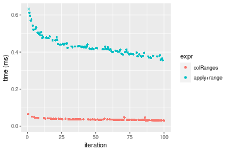

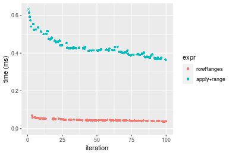
_Table: Benchmarking of colRanges() and rowRanges() on double+100x100 data (original and transposed).  The top panel shows times in milliseconds and the bottom panel shows relative times._


|   |expr      |    min|      lq|     mean|  median|      uq|    max|
|:--|:---------|------:|-------:|--------:|-------:|-------:|------:|
|1  |colRanges | 30.615| 33.5635| 36.55186| 35.5765| 38.1700| 64.798|
|2  |rowRanges | 37.310| 42.6655| 45.96175| 44.5075| 47.5475| 70.014|


|   |expr      |      min|       lq|     mean|   median|       uq|      max|
|:--|:---------|--------:|--------:|--------:|--------:|--------:|--------:|
|1  |colRanges | 1.000000| 1.000000| 1.000000| 1.000000| 1.000000| 1.000000|
|2  |rowRanges | 1.218684| 1.271187| 1.257439| 1.251037| 1.245677| 1.080496|

_Figure: Benchmarking of colRanges() and rowRanges() on double+100x100 data (original and transposed).  Outliers are displayed as crosses. Times are in milliseconds._


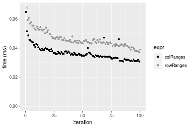

#### 1000x10 double matrix

```r
> X <- data[["1000x10"]]
> gc()
          used  (Mb) gc trigger  (Mb) max used  (Mb)
Ncells 5225206 279.1   10014072 534.9 10014072 534.9
Vcells 9763947  74.5   18204443 138.9 18204443 138.9
> colStats <- microbenchmark(colRanges = colRanges(X, na.rm = FALSE), `apply+range` = apply(X, MARGIN = 2L, 
+     FUN = range, na.rm = FALSE), unit = "ms")
> X <- t(X)
> gc()
          used  (Mb) gc trigger  (Mb) max used  (Mb)
Ncells 5225182 279.1   10014072 534.9 10014072 534.9
Vcells 9773960  74.6   18204443 138.9 18204443 138.9
> rowStats <- microbenchmark(rowRanges = rowRanges(X, na.rm = FALSE), `apply+range` = apply(X, MARGIN = 1L, 
+     FUN = range, na.rm = FALSE), unit = "ms")
```

_Table: Benchmarking of colRanges() and apply+range() on double+1000x10 data. The top panel shows times in milliseconds and the bottom panel shows relative times._


|   |expr        |      min|        lq|      mean|    median|        uq|      max|
|:--|:-----------|--------:|---------:|---------:|---------:|---------:|--------:|
|1  |colRanges   | 0.028738| 0.0307825| 0.0330278| 0.0324120| 0.0343035| 0.052027|
|2  |apply+range | 0.170261| 0.1795800| 0.1928061| 0.1893405| 0.2035945| 0.304501|


|   |expr        |      min|       lq|     mean|   median|       uq|      max|
|:--|:-----------|--------:|--------:|--------:|--------:|--------:|--------:|
|1  |colRanges   | 1.000000| 1.000000| 1.000000| 1.000000| 1.000000| 1.000000|
|2  |apply+range | 5.924595| 5.833834| 5.837684| 5.841679| 5.935094| 5.852749|

_Table: Benchmarking of rowRanges() and apply+range() on double+1000x10 data (transposed). The top panel shows times in milliseconds and the bottom panel shows relative times._


|   |expr        |      min|        lq|      mean|    median|       uq|      max|
|:--|:-----------|--------:|---------:|---------:|---------:|--------:|--------:|
|1  |rowRanges   | 0.040771| 0.0433165| 0.0465609| 0.0451735| 0.048985| 0.069011|
|2  |apply+range | 0.167759| 0.1801440| 0.1963123| 0.1925015| 0.209153| 0.315251|


|   |expr        |      min|       lq|     mean|   median|       uq|      max|
|:--|:-----------|--------:|--------:|--------:|--------:|--------:|--------:|
|1  |rowRanges   | 1.000000| 1.000000| 1.000000| 1.000000| 1.000000| 1.000000|
|2  |apply+range | 4.114665| 4.158785| 4.216251| 4.261381| 4.269736| 4.568127|

_Figure: Benchmarking of colRanges() and apply+range() on double+1000x10 data  as well as rowRanges() and apply+range() on the same data transposed.  Outliers are displayed as crosses.  Times are in milliseconds._


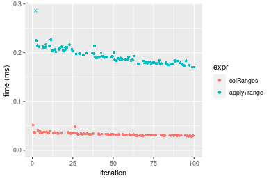

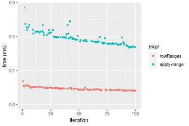
_Table: Benchmarking of colRanges() and rowRanges() on double+1000x10 data (original and transposed).  The top panel shows times in milliseconds and the bottom panel shows relative times._


|   |expr      |    min|      lq|     mean|  median|      uq|    max|
|:--|:---------|------:|-------:|--------:|-------:|-------:|------:|
|1  |colRanges | 28.738| 30.7825| 33.02784| 32.4120| 34.3035| 52.027|
|2  |rowRanges | 40.771| 43.3165| 46.56088| 45.1735| 48.9850| 69.011|


|   |expr      |      min|       lq|     mean|   median|       uq|      max|
|:--|:---------|--------:|--------:|--------:|--------:|--------:|--------:|
|1  |colRanges | 1.000000| 1.000000| 1.000000| 1.000000| 1.000000| 1.000000|
|2  |rowRanges | 1.418714| 1.407179| 1.409746| 1.393728| 1.427988| 1.326446|

_Figure: Benchmarking of colRanges() and rowRanges() on double+1000x10 data (original and transposed).  Outliers are displayed as crosses. Times are in milliseconds._


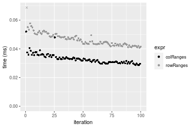

#### 10x1000 double matrix

```r
> X <- data[["10x1000"]]
> gc()
          used  (Mb) gc trigger  (Mb) max used  (Mb)
Ncells 5225394 279.1   10014072 534.9 10014072 534.9
Vcells 9764977  74.6   18204443 138.9 18204443 138.9
> colStats <- microbenchmark(colRanges = colRanges(X, na.rm = FALSE), `apply+range` = apply(X, MARGIN = 2L, 
+     FUN = range, na.rm = FALSE), unit = "ms")
> X <- t(X)
> gc()
          used  (Mb) gc trigger  (Mb) max used  (Mb)
Ncells 5225370 279.1   10014072 534.9 10014072 534.9
Vcells 9774990  74.6   18204443 138.9 18204443 138.9
> rowStats <- microbenchmark(rowRanges = rowRanges(X, na.rm = FALSE), `apply+range` = apply(X, MARGIN = 1L, 
+     FUN = range, na.rm = FALSE), unit = "ms")
```

_Table: Benchmarking of colRanges() and apply+range() on double+10x1000 data. The top panel shows times in milliseconds and the bottom panel shows relative times._


|   |expr        |      min|        lq|      mean|   median|       uq|      max|
|:--|:-----------|--------:|---------:|---------:|--------:|--------:|--------:|
|1  |colRanges   | 0.056251| 0.0590555| 0.0647614| 0.061067| 0.065092| 0.108365|
|2  |apply+range | 2.215488| 2.3442075| 2.5060031| 2.488068| 2.550717| 3.607952|


|   |expr        |      min|       lq|     mean|   median|       uq|      max|
|:--|:-----------|--------:|--------:|--------:|--------:|--------:|--------:|
|1  |colRanges   |  1.00000|  1.00000|  1.00000|  1.00000|  1.00000|  1.00000|
|2  |apply+range | 39.38575| 39.69499| 38.69591| 40.74325| 39.18634| 33.29444|

_Table: Benchmarking of rowRanges() and apply+range() on double+10x1000 data (transposed). The top panel shows times in milliseconds and the bottom panel shows relative times._


|   |expr        |      min|       lq|      mean|    median|       uq|      max|
|:--|:-----------|--------:|--------:|---------:|---------:|--------:|--------:|
|1  |rowRanges   | 0.056228| 0.058068| 0.0635845| 0.0603355| 0.064690| 0.107334|
|2  |apply+range | 2.228791| 2.369447| 2.5265842| 2.5062175| 2.605555| 3.511559|


|   |expr        |      min|       lq|     mean|   median|       uq|      max|
|:--|:-----------|--------:|--------:|--------:|--------:|--------:|--------:|
|1  |rowRanges   |  1.00000|  1.00000|  1.00000|  1.00000|  1.00000|  1.00000|
|2  |apply+range | 39.63845| 40.80469| 39.73583| 41.53802| 40.27755| 32.71619|

_Figure: Benchmarking of colRanges() and apply+range() on double+10x1000 data  as well as rowRanges() and apply+range() on the same data transposed.  Outliers are displayed as crosses.  Times are in milliseconds._


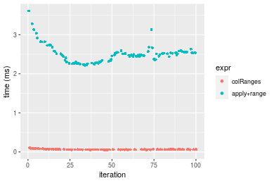


_Table: Benchmarking of colRanges() and rowRanges() on double+10x1000 data (original and transposed).  The top panel shows times in milliseconds and the bottom panel shows relative times._


|   |expr      |    min|      lq|     mean|  median|     uq|     max|
|:--|:---------|------:|-------:|--------:|-------:|------:|-------:|
|2  |rowRanges | 56.228| 58.0680| 63.58453| 60.3355| 64.690| 107.334|
|1  |colRanges | 56.251| 59.0555| 64.76144| 61.0670| 65.092| 108.365|


|   |expr      |      min|       lq|     mean|   median|       uq|      max|
|:--|:---------|--------:|--------:|--------:|--------:|--------:|--------:|
|2  |rowRanges | 1.000000| 1.000000| 1.000000| 1.000000| 1.000000| 1.000000|
|1  |colRanges | 1.000409| 1.017006| 1.018509| 1.012124| 1.006214| 1.009605|

_Figure: Benchmarking of colRanges() and rowRanges() on double+10x1000 data (original and transposed).  Outliers are displayed as crosses. Times are in milliseconds._


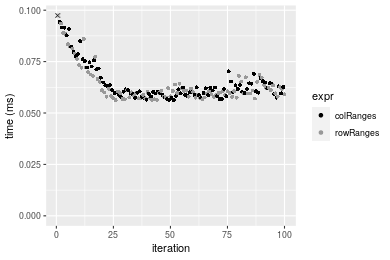

#### 100x1000 double matrix

```r
> X <- data[["100x1000"]]
> gc()
          used  (Mb) gc trigger  (Mb) max used  (Mb)
Ncells 5225572 279.1   10014072 534.9 10014072 534.9
Vcells 9765088  74.6   18204443 138.9 18204443 138.9
> colStats <- microbenchmark(colRanges = colRanges(X, na.rm = FALSE), `apply+range` = apply(X, MARGIN = 2L, 
+     FUN = range, na.rm = FALSE), unit = "ms")
> X <- t(X)
> gc()
          used  (Mb) gc trigger  (Mb) max used  (Mb)
Ncells 5225554 279.1   10014072 534.9 10014072 534.9
Vcells 9865111  75.3   18204443 138.9 18204443 138.9
> rowStats <- microbenchmark(rowRanges = rowRanges(X, na.rm = FALSE), `apply+range` = apply(X, MARGIN = 1L, 
+     FUN = range, na.rm = FALSE), unit = "ms")
```

_Table: Benchmarking of colRanges() and apply+range() on double+100x1000 data. The top panel shows times in milliseconds and the bottom panel shows relative times._


|   |expr        |      min|       lq|      mean|   median|       uq|       max|
|:--|:-----------|--------:|--------:|---------:|--------:|--------:|---------:|
|1  |colRanges   | 0.277684| 0.281549| 0.3081119| 0.289915| 0.329131|  0.451144|
|2  |apply+range | 3.088158| 3.142177| 3.9142857| 3.290719| 3.719542| 15.680763|


|   |expr        |      min|       lq|    mean|   median|      uq|      max|
|:--|:-----------|--------:|--------:|-------:|--------:|-------:|--------:|
|1  |colRanges   |  1.00000|  1.00000|  1.0000|  1.00000|  1.0000|  1.00000|
|2  |apply+range | 11.12112| 11.16032| 12.7041| 11.35063| 11.3011| 34.75778|

_Table: Benchmarking of rowRanges() and apply+range() on double+100x1000 data (transposed). The top panel shows times in milliseconds and the bottom panel shows relative times._


|   |expr        |      min|       lq|      mean|   median|        uq|       max|
|:--|:-----------|--------:|--------:|---------:|--------:|---------:|---------:|
|1  |rowRanges   | 0.347134| 0.355874| 0.3984116| 0.383756| 0.4408345|  0.556816|
|2  |apply+range | 3.127102| 3.187652| 3.9534566| 3.368743| 3.7822905| 15.288974|


|   |expr        |      min|       lq|     mean|   median|       uq|      max|
|:--|:-----------|--------:|--------:|--------:|--------:|--------:|--------:|
|1  |rowRanges   | 1.000000| 1.000000| 1.000000| 1.000000| 1.000000|  1.00000|
|2  |apply+range | 9.008343| 8.957249| 9.923046| 8.778345| 8.579842| 27.45786|

_Figure: Benchmarking of colRanges() and apply+range() on double+100x1000 data  as well as rowRanges() and apply+range() on the same data transposed.  Outliers are displayed as crosses.  Times are in milliseconds._


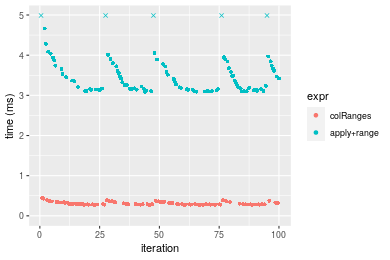

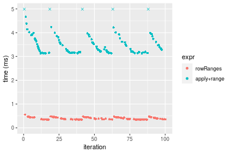
_Table: Benchmarking of colRanges() and rowRanges() on double+100x1000 data (original and transposed).  The top panel shows times in milliseconds and the bottom panel shows relative times._


|   |expr      |     min|      lq|     mean|  median|       uq|     max|
|:--|:---------|-------:|-------:|--------:|-------:|--------:|-------:|
|1  |colRanges | 277.684| 281.549| 308.1119| 289.915| 329.1310| 451.144|
|2  |rowRanges | 347.134| 355.874| 398.4116| 383.756| 440.8345| 556.816|


|   |expr      |      min|       lq|     mean|   median|       uq|      max|
|:--|:---------|--------:|--------:|--------:|--------:|--------:|--------:|
|1  |colRanges | 1.000000| 1.000000| 1.000000| 1.000000| 1.000000| 1.000000|
|2  |rowRanges | 1.250104| 1.263986| 1.293074| 1.323684| 1.339389| 1.234231|

_Figure: Benchmarking of colRanges() and rowRanges() on double+100x1000 data (original and transposed).  Outliers are displayed as crosses. Times are in milliseconds._


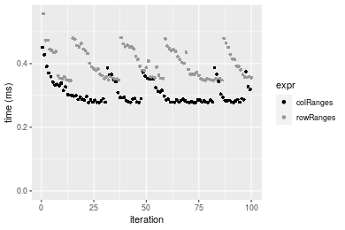

#### 1000x100 double matrix

```r
> X <- data[["1000x100"]]
> gc()
          used  (Mb) gc trigger  (Mb) max used  (Mb)
Ncells 5225770 279.1   10014072 534.9 10014072 534.9
Vcells 9766312  74.6   18204443 138.9 18204443 138.9
> colStats <- microbenchmark(colRanges = colRanges(X, na.rm = FALSE), `apply+range` = apply(X, MARGIN = 2L, 
+     FUN = range, na.rm = FALSE), unit = "ms")
> X <- t(X)
> gc()
          used  (Mb) gc trigger  (Mb) max used  (Mb)
Ncells 5225746 279.1   10014072 534.9 10014072 534.9
Vcells 9866325  75.3   18204443 138.9 18204443 138.9
> rowStats <- microbenchmark(rowRanges = rowRanges(X, na.rm = FALSE), `apply+range` = apply(X, MARGIN = 1L, 
+     FUN = range, na.rm = FALSE), unit = "ms")
```

_Table: Benchmarking of colRanges() and apply+range() on double+1000x100 data. The top panel shows times in milliseconds and the bottom panel shows relative times._


|   |expr        |      min|       lq|     mean|    median|        uq|      max|
|:--|:-----------|--------:|--------:|--------:|---------:|---------:|--------:|
|1  |colRanges   | 0.218089| 0.238748| 0.264533| 0.2584865| 0.2810465| 0.389060|
|2  |apply+range | 1.170397| 1.284070| 1.651580| 1.4314490| 1.4886885| 7.681046|


|   |expr        |      min|       lq|     mean|   median|       uq|      max|
|:--|:-----------|--------:|--------:|--------:|--------:|--------:|--------:|
|1  |colRanges   | 1.000000| 1.000000| 1.000000| 1.000000| 1.000000|  1.00000|
|2  |apply+range | 5.366603| 5.378351| 6.243381| 5.537809| 5.296947| 19.74257|

_Table: Benchmarking of rowRanges() and apply+range() on double+1000x100 data (transposed). The top panel shows times in milliseconds and the bottom panel shows relative times._


|   |expr        |      min|        lq|      mean|   median|       uq|      max|
|:--|:-----------|--------:|---------:|---------:|--------:|--------:|--------:|
|1  |rowRanges   | 0.302704| 0.3304845| 0.3578241| 0.357886| 0.382028| 0.489149|
|2  |apply+range | 1.162293| 1.2584545| 1.6268363| 1.417270| 1.483949| 7.213822|


|   |expr        |      min|       lq|    mean|   median|       uq|     max|
|:--|:-----------|--------:|--------:|-------:|--------:|--------:|-------:|
|1  |rowRanges   | 1.000000| 1.000000| 1.00000| 1.000000| 1.000000|  1.0000|
|2  |apply+range | 3.839701| 3.807908| 4.54647| 3.960116| 3.884399| 14.7477|

_Figure: Benchmarking of colRanges() and apply+range() on double+1000x100 data  as well as rowRanges() and apply+range() on the same data transposed.  Outliers are displayed as crosses.  Times are in milliseconds._


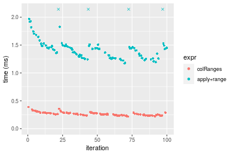

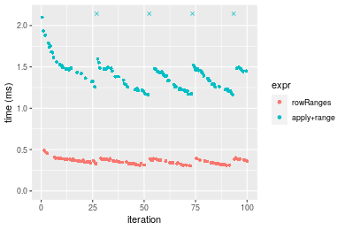
_Table: Benchmarking of colRanges() and rowRanges() on double+1000x100 data (original and transposed).  The top panel shows times in milliseconds and the bottom panel shows relative times._


|   |expr      |     min|       lq|     mean|   median|       uq|     max|
|:--|:---------|-------:|--------:|--------:|--------:|--------:|-------:|
|1  |colRanges | 218.089| 238.7480| 264.5330| 258.4865| 281.0465| 389.060|
|2  |rowRanges | 302.704| 330.4845| 357.8241| 357.8860| 382.0280| 489.149|


|   |expr      |      min|      lq|     mean|   median|       uq|      max|
|:--|:---------|--------:|-------:|--------:|--------:|--------:|--------:|
|1  |colRanges | 1.000000| 1.00000| 1.000000| 1.000000| 1.000000| 1.000000|
|2  |rowRanges | 1.387984| 1.38424| 1.352663| 1.384544| 1.359305| 1.257259|

_Figure: Benchmarking of colRanges() and rowRanges() on double+1000x100 data (original and transposed).  Outliers are displayed as crosses. Times are in milliseconds._


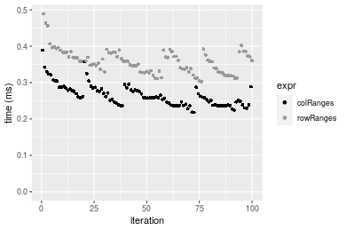


## Appendix

### Session information
```r
R version 4.1.1 Patched (2021-08-10 r80727)
Platform: x86_64-pc-linux-gnu (64-bit)
Running under: Ubuntu 18.04.5 LTS

Matrix products: default
BLAS:   /home/hb/software/R-devel/R-4-1-branch/lib/R/lib/libRblas.so
LAPACK: /home/hb/software/R-devel/R-4-1-branch/lib/R/lib/libRlapack.so

locale:
 [1] LC_CTYPE=en_US.UTF-8       LC_NUMERIC=C              
 [3] LC_TIME=en_US.UTF-8        LC_COLLATE=en_US.UTF-8    
 [5] LC_MONETARY=en_US.UTF-8    LC_MESSAGES=en_US.UTF-8   
 [7] LC_PAPER=en_US.UTF-8       LC_NAME=C                 
 [9] LC_ADDRESS=C               LC_TELEPHONE=C            
[11] LC_MEASUREMENT=en_US.UTF-8 LC_IDENTIFICATION=C       

attached base packages:
[1] stats     graphics  grDevices utils     datasets  methods   base     

other attached packages:
[1] microbenchmark_1.4-7   matrixStats_0.60.1     ggplot2_3.3.5         
[4] knitr_1.33             R.devices_2.17.0       R.utils_2.10.1        
[7] R.oo_1.24.0            R.methodsS3_1.8.1-9001 history_0.0.1-9000    

loaded via a namespace (and not attached):
 [1] Biobase_2.52.0          httr_1.4.2              splines_4.1.1          
 [4] bit64_4.0.5             network_1.17.1          assertthat_0.2.1       
 [7] highr_0.9               stats4_4.1.1            blob_1.2.2             
[10] GenomeInfoDbData_1.2.6  robustbase_0.93-8       pillar_1.6.2           
[13] RSQLite_2.2.8           lattice_0.20-44         glue_1.4.2             
[16] digest_0.6.27           XVector_0.32.0          colorspace_2.0-2       
[19] Matrix_1.3-4            XML_3.99-0.7            pkgconfig_2.0.3        
[22] zlibbioc_1.38.0         genefilter_1.74.0       purrr_0.3.4            
[25] ergm_4.1.2              xtable_1.8-4            scales_1.1.1           
[28] tibble_3.1.4            annotate_1.70.0         KEGGREST_1.32.0        
[31] farver_2.1.0            generics_0.1.0          IRanges_2.26.0         
[34] ellipsis_0.3.2          cachem_1.0.6            withr_2.4.2            
[37] BiocGenerics_0.38.0     mime_0.11               survival_3.2-13        
[40] magrittr_2.0.1          crayon_1.4.1            statnet.common_4.5.0   
[43] memoise_2.0.0           laeken_0.5.1            fansi_0.5.0            
[46] R.cache_0.15.0          MASS_7.3-54             R.rsp_0.44.0           
[49] progressr_0.8.0         tools_4.1.1             lifecycle_1.0.0        
[52] S4Vectors_0.30.0        trust_0.1-8             munsell_0.5.0          
[55] tabby_0.0.1-9001        AnnotationDbi_1.54.1    Biostrings_2.60.2      
[58] compiler_4.1.1          GenomeInfoDb_1.28.1     rlang_0.4.11           
[61] grid_4.1.1              RCurl_1.98-1.4          cwhmisc_6.6            
[64] rappdirs_0.3.3          startup_0.15.0          labeling_0.4.2         
[67] bitops_1.0-7            base64enc_0.1-3         boot_1.3-28            
[70] gtable_0.3.0            DBI_1.1.1               markdown_1.1           
[73] R6_2.5.1                lpSolveAPI_5.5.2.0-17.7 rle_0.9.2              
[76] dplyr_1.0.7             fastmap_1.1.0           bit_4.0.4              
[79] utf8_1.2.2              parallel_4.1.1          Rcpp_1.0.7             
[82] vctrs_0.3.8             png_0.1-7               DEoptimR_1.0-9         
[85] tidyselect_1.1.1        xfun_0.25               coda_0.19-4            
```
Total processing time was 25.44 secs.


### Reproducibility
To reproduce this report, do:
```r
html <- matrixStats:::benchmark('colRanges')
```

[RSP]: https://cran.r-project.org/package=R.rsp
[matrixStats]: https://cran.r-project.org/package=matrixStats

[StackOverflow:colMins?]: https://stackoverflow.com/questions/13676878 "Stack Overflow: fastest way to get Min from every column in a matrix?"
[StackOverflow:colSds?]: https://stackoverflow.com/questions/17549762 "Stack Overflow: Is there such 'colsd' in R?"
[StackOverflow:rowProds?]: https://stackoverflow.com/questions/20198801/ "Stack Overflow: Row product of matrix and column sum of matrix"

---------------------------------------
Copyright Henrik Bengtsson. Last updated on 2021-08-25 18:14:02 (+0200 UTC). Powered by [RSP].

<script>
 var link = document.createElement('link');
 link.rel = 'icon';
 link.href = "data:image/png;base64,iVBORw0KGgoAAAANSUhEUgAAACAAAAAgCAMAAABEpIrGAAAA21BMVEUAAAAAAP8AAP8AAP8AAP8AAP8AAP8AAP8AAP8AAP8AAP8AAP8AAP8AAP8AAP8AAP8AAP8AAP8AAP8AAP8AAP8AAP8AAP8AAP8AAP8AAP8AAP8AAP8AAP8AAP8AAP8AAP8AAP8AAP8AAP8AAP8AAP8AAP8AAP8AAP8AAP8AAP8BAf4CAv0DA/wdHeIeHuEfH+AgIN8hId4lJdomJtknJ9g+PsE/P8BAQL9yco10dIt1dYp3d4h4eIeVlWqWlmmXl2iYmGeZmWabm2Tn5xjo6Bfp6Rb39wj4+Af//wA2M9hbAAAASXRSTlMAAQIJCgsMJSYnKD4/QGRlZmhpamtsbautrrCxuru8y8zN5ebn6Pn6+///////////////////////////////////////////LsUNcQAAAS9JREFUOI29k21XgkAQhVcFytdSMqMETU26UVqGmpaiFbL//xc1cAhhwVNf6n5i5z67M2dmYOyfJZUqlVLhkKucG7cgmUZTybDz6g0iDeq51PUr37Ds2cy2/C9NeES5puDjxuUk1xnToZsg8pfA3avHQ3lLIi7iWRrkv/OYtkScxBIMgDee0ALoyxHQBJ68JLCjOtQIMIANF7QG9G9fNnHvisCHBVMKgSJgiz7nE+AoBKrAPA3MgepvgR9TSCasrCKH0eB1wBGBFdCO+nAGjMVGPcQb5bd6mQRegN6+1axOs9nGfYcCtfi4NQosdtH7dB+txFIpXQqN1p9B/asRHToyS0jRgpV7nk4nwcq1BJ+x3Gl/v7S9Wmpp/aGquum7w3ZDyrADFYrl8vHBH+ev9AUASW1dmU4h4wAAAABJRU5ErkJggg=="
 document.getElementsByTagName('head')[0].appendChild(link);
</script>


