[matrixStats]: Benchmark report

---------------------------------------


# colRanks() and rowRanks() benchmarks on subsetted computation

This report benchmark the performance of colRanks() and rowRanks() on subsetted computation.


## Data type "integer"

### Data
```r
> rmatrix <- function(nrow, ncol, mode = c("logical", "double", "integer", "index"), range = c(-100, 
+     +100), na_prob = 0) {
+     mode <- match.arg(mode)
+     n <- nrow * ncol
+     if (mode == "logical") {
+         x <- sample(c(FALSE, TRUE), size = n, replace = TRUE)
+     }     else if (mode == "index") {
+         x <- seq_len(n)
+         mode <- "integer"
+     }     else {
+         x <- runif(n, min = range[1], max = range[2])
+     }
+     storage.mode(x) <- mode
+     if (na_prob > 0) 
+         x[sample(n, size = na_prob * n)] <- NA
+     dim(x) <- c(nrow, ncol)
+     x
+ }
> rmatrices <- function(scale = 10, seed = 1, ...) {
+     set.seed(seed)
+     data <- list()
+     data[[1]] <- rmatrix(nrow = scale * 1, ncol = scale * 1, ...)
+     data[[2]] <- rmatrix(nrow = scale * 10, ncol = scale * 10, ...)
+     data[[3]] <- rmatrix(nrow = scale * 100, ncol = scale * 1, ...)
+     data[[4]] <- t(data[[3]])
+     data[[5]] <- rmatrix(nrow = scale * 10, ncol = scale * 100, ...)
+     data[[6]] <- t(data[[5]])
+     names(data) <- sapply(data, FUN = function(x) paste(dim(x), collapse = "x"))
+     data
+ }
> data <- rmatrices(mode = mode)
```

### Results

#### 10x10 integer matrix

```r
> X <- data[["10x10"]]
> rows <- sample.int(nrow(X), size = nrow(X) * 0.7)
> cols <- sample.int(ncol(X), size = ncol(X) * 0.7)
> X_S <- X[rows, cols]
> gc()
           used  (Mb) gc trigger  (Mb) max used  (Mb)
Ncells  5242791 280.0   10014072 534.9 10014072 534.9
Vcells 10050255  76.7   18204443 138.9 18204443 138.9
> colStats <- microbenchmark(colRanks_X_S = colRanks(X_S, na.rm = FALSE), `colRanks(X, rows, cols)` = colRanks(X, 
+     rows = rows, cols = cols, na.rm = FALSE), `colRanks(X[rows, cols])` = colRanks(X[rows, cols], 
+     na.rm = FALSE), unit = "ms")
> X <- t(X)
> X_S <- t(X_S)
> gc()
           used  (Mb) gc trigger  (Mb) max used  (Mb)
Ncells  5228866 279.3   10014072 534.9 10014072 534.9
Vcells 10004249  76.4   18204443 138.9 18204443 138.9
> rowStats <- microbenchmark(rowRanks_X_S = rowRanks(X_S, na.rm = FALSE), `rowRanks(X, cols, rows)` = rowRanks(X, 
+     rows = cols, cols = rows, na.rm = FALSE), `rowRanks(X[cols, rows])` = rowRanks(X[cols, rows], 
+     na.rm = FALSE), unit = "ms")
```

_Table: Benchmarking of colRanks_X_S(), colRanks(X, rows, cols)() and colRanks(X[rows, cols])() on integer+10x10 data. The top panel shows times in milliseconds and the bottom panel shows relative times._


|   |expr                    |      min|       lq|      mean|    median|        uq|      max|
|:--|:-----------------------|--------:|--------:|---------:|---------:|---------:|--------:|
|1  |colRanks_X_S            | 0.009821| 0.010262| 0.0126004| 0.0104920| 0.0108115| 0.209501|
|2  |colRanks(X, rows, cols) | 0.010384| 0.010715| 0.0109976| 0.0108775| 0.0111935| 0.015224|
|3  |colRanks(X[rows, cols]) | 0.011026| 0.011384| 0.0119837| 0.0116280| 0.0119680| 0.027208|


|   |expr                    |      min|       lq|      mean|   median|       uq|       max|
|:--|:-----------------------|--------:|--------:|---------:|--------:|--------:|---------:|
|1  |colRanks_X_S            | 1.000000| 1.000000| 1.0000000| 1.000000| 1.000000| 1.0000000|
|2  |colRanks(X, rows, cols) | 1.057326| 1.044143| 0.8727971| 1.036742| 1.035333| 0.0726679|
|3  |colRanks(X[rows, cols]) | 1.122696| 1.109335| 0.9510564| 1.108273| 1.106969| 0.1298705|

_Table: Benchmarking of rowRanks_X_S(), rowRanks(X, cols, rows)() and rowRanks(X[cols, rows])() on integer+10x10 data (transposed). The top panel shows times in milliseconds and the bottom panel shows relative times._


|   |expr                    |      min|        lq|      mean|    median|        uq|      max|
|:--|:-----------------------|--------:|---------:|---------:|---------:|---------:|--------:|
|1  |rowRanks_X_S            | 0.005134| 0.0054310| 0.0056442| 0.0055825| 0.0057540| 0.008680|
|2  |rowRanks(X, cols, rows) | 0.005576| 0.0058640| 0.0075071| 0.0060585| 0.0062420| 0.144157|
|3  |rowRanks(X[cols, rows]) | 0.006283| 0.0065485| 0.0069488| 0.0067200| 0.0069345| 0.021639|


|   |expr                    |      min|       lq|     mean|   median|       uq|       max|
|:--|:-----------------------|--------:|--------:|--------:|--------:|--------:|---------:|
|1  |rowRanks_X_S            | 1.000000| 1.000000| 1.000000| 1.000000| 1.000000|  1.000000|
|2  |rowRanks(X, cols, rows) | 1.086093| 1.079727| 1.330057| 1.085266| 1.084811| 16.607949|
|3  |rowRanks(X[cols, rows]) | 1.223802| 1.205763| 1.231154| 1.203762| 1.205162|  2.492972|

_Figure: Benchmarking of colRanks_X_S(), colRanks(X, rows, cols)() and colRanks(X[rows, cols])() on integer+10x10 data  as well as rowRanks_X_S(), rowRanks(X, cols, rows)() and rowRanks(X[cols, rows])() on the same data transposed.  Outliers are displayed as crosses.  Times are in milliseconds._


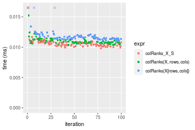

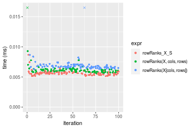
_Table: Benchmarking of colRanks_X_S() and rowRanks_X_S() on integer+10x10 data (original and transposed).  The top panel shows times in milliseconds and the bottom panel shows relative times._


|   |expr         |   min|     lq|     mean|  median|      uq|     max|
|:--|:------------|-----:|------:|--------:|-------:|-------:|-------:|
|2  |rowRanks_X_S | 5.134|  5.431|  5.64417|  5.5825|  5.7540|   8.680|
|1  |colRanks_X_S | 9.821| 10.262| 12.60042| 10.4920| 10.8115| 209.501|


|   |expr         |      min|       lq|     mean|   median|       uq|      max|
|:--|:------------|--------:|--------:|--------:|--------:|--------:|--------:|
|2  |rowRanks_X_S | 1.000000| 1.000000| 1.000000| 1.000000| 1.000000|  1.00000|
|1  |colRanks_X_S | 1.912933| 1.889523| 2.232466| 1.879445| 1.878954| 24.13606|

_Figure: Benchmarking of colRanks_X_S() and rowRanks_X_S() on integer+10x10 data (original and transposed).  Outliers are displayed as crosses. Times are in milliseconds._


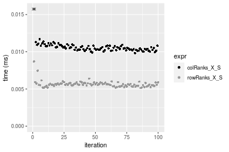

#### 100x100 integer matrix

```r
> X <- data[["100x100"]]
> rows <- sample.int(nrow(X), size = nrow(X) * 0.7)
> cols <- sample.int(ncol(X), size = ncol(X) * 0.7)
> X_S <- X[rows, cols]
> gc()
          used  (Mb) gc trigger  (Mb) max used  (Mb)
Ncells 5227577 279.2   10014072 534.9 10014072 534.9
Vcells 9673291  73.9   18204443 138.9 18204443 138.9
> colStats <- microbenchmark(colRanks_X_S = colRanks(X_S, na.rm = FALSE), `colRanks(X, rows, cols)` = colRanks(X, 
+     rows = rows, cols = cols, na.rm = FALSE), `colRanks(X[rows, cols])` = colRanks(X[rows, cols], 
+     na.rm = FALSE), unit = "ms")
> X <- t(X)
> X_S <- t(X_S)
> gc()
          used  (Mb) gc trigger  (Mb) max used  (Mb)
Ncells 5227553 279.2   10014072 534.9 10014072 534.9
Vcells 9678344  73.9   18204443 138.9 18204443 138.9
> rowStats <- microbenchmark(rowRanks_X_S = rowRanks(X_S, na.rm = FALSE), `rowRanks(X, cols, rows)` = rowRanks(X, 
+     rows = cols, cols = rows, na.rm = FALSE), `rowRanks(X[cols, rows])` = rowRanks(X[cols, rows], 
+     na.rm = FALSE), unit = "ms")
```

_Table: Benchmarking of colRanks_X_S(), colRanks(X, rows, cols)() and colRanks(X[rows, cols])() on integer+100x100 data. The top panel shows times in milliseconds and the bottom panel shows relative times._


|   |expr                    |      min|       lq|      mean|    median|        uq|      max|
|:--|:-----------------------|--------:|--------:|---------:|---------:|---------:|--------:|
|2  |colRanks(X, rows, cols) | 0.152349| 0.159716| 0.1844254| 0.1821930| 0.1999845| 0.251044|
|1  |colRanks_X_S            | 0.150959| 0.157406| 0.1843852| 0.1843585| 0.2001950| 0.251409|
|3  |colRanks(X[rows, cols]) | 0.159840| 0.169235| 0.1937894| 0.1889720| 0.2087330| 0.325084|


|   |expr                    |       min|        lq|      mean|   median|       uq|      max|
|:--|:-----------------------|---------:|---------:|---------:|--------:|--------:|--------:|
|2  |colRanks(X, rows, cols) | 1.0000000| 1.0000000| 1.0000000| 1.000000| 1.000000| 1.000000|
|1  |colRanks_X_S            | 0.9908762| 0.9855368| 0.9997821| 1.011886| 1.001053| 1.001454|
|3  |colRanks(X[rows, cols]) | 1.0491700| 1.0595995| 1.0507739| 1.037208| 1.043746| 1.294928|

_Table: Benchmarking of rowRanks_X_S(), rowRanks(X, cols, rows)() and rowRanks(X[cols, rows])() on integer+100x100 data (transposed). The top panel shows times in milliseconds and the bottom panel shows relative times._


|   |expr                    |      min|        lq|      mean|    median|        uq|      max|
|:--|:-----------------------|--------:|---------:|---------:|---------:|---------:|--------:|
|1  |rowRanks_X_S            | 0.141948| 0.1603460| 0.1814845| 0.1788405| 0.2007515| 0.247326|
|2  |rowRanks(X, cols, rows) | 0.143249| 0.1669940| 0.1826753| 0.1814225| 0.1937280| 0.292602|
|3  |rowRanks(X[cols, rows]) | 0.151124| 0.1699035| 0.1889690| 0.1894195| 0.2016380| 0.243541|


|   |expr                    |      min|       lq|     mean|   median|       uq|       max|
|:--|:-----------------------|--------:|--------:|--------:|--------:|--------:|---------:|
|1  |rowRanks_X_S            | 1.000000| 1.000000| 1.000000| 1.000000| 1.000000| 1.0000000|
|2  |rowRanks(X, cols, rows) | 1.009165| 1.041460| 1.006562| 1.014437| 0.965014| 1.1830620|
|3  |rowRanks(X[cols, rows]) | 1.064643| 1.059605| 1.041240| 1.059153| 1.004416| 0.9846963|

_Figure: Benchmarking of colRanks_X_S(), colRanks(X, rows, cols)() and colRanks(X[rows, cols])() on integer+100x100 data  as well as rowRanks_X_S(), rowRanks(X, cols, rows)() and rowRanks(X[cols, rows])() on the same data transposed.  Outliers are displayed as crosses.  Times are in milliseconds._


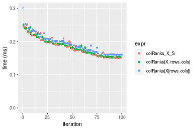


_Table: Benchmarking of colRanks_X_S() and rowRanks_X_S() on integer+100x100 data (original and transposed).  The top panel shows times in milliseconds and the bottom panel shows relative times._


|   |expr         |     min|      lq|     mean|   median|       uq|     max|
|:--|:------------|-------:|-------:|--------:|--------:|--------:|-------:|
|2  |rowRanks_X_S | 141.948| 160.346| 181.4845| 178.8405| 200.7515| 247.326|
|1  |colRanks_X_S | 150.959| 157.406| 184.3852| 184.3585| 200.1950| 251.409|


|   |expr         |      min|        lq|     mean|   median|        uq|      max|
|:--|:------------|--------:|---------:|--------:|--------:|---------:|--------:|
|2  |rowRanks_X_S | 1.000000| 1.0000000| 1.000000| 1.000000| 1.0000000| 1.000000|
|1  |colRanks_X_S | 1.063481| 0.9816647| 1.015983| 1.030854| 0.9972279| 1.016509|

_Figure: Benchmarking of colRanks_X_S() and rowRanks_X_S() on integer+100x100 data (original and transposed).  Outliers are displayed as crosses. Times are in milliseconds._


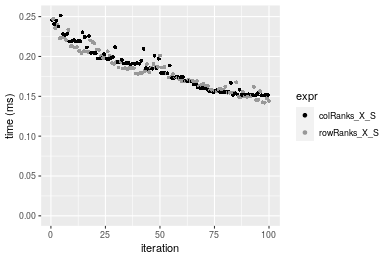

#### 1000x10 integer matrix

```r
> X <- data[["1000x10"]]
> rows <- sample.int(nrow(X), size = nrow(X) * 0.7)
> cols <- sample.int(ncol(X), size = ncol(X) * 0.7)
> X_S <- X[rows, cols]
> gc()
          used  (Mb) gc trigger  (Mb) max used  (Mb)
Ncells 5226991 279.2   10014072 534.9 10014072 534.9
Vcells 9652552  73.7   18204443 138.9 18204443 138.9
> colStats <- microbenchmark(colRanks_X_S = colRanks(X_S, na.rm = FALSE), `colRanks(X, rows, cols)` = colRanks(X, 
+     rows = rows, cols = cols, na.rm = FALSE), `colRanks(X[rows, cols])` = colRanks(X[rows, cols], 
+     na.rm = FALSE), unit = "ms")
> X <- t(X)
> X_S <- t(X_S)
> gc()
          used  (Mb) gc trigger  (Mb) max used  (Mb)
Ncells 5226967 279.2   10014072 534.9 10014072 534.9
Vcells 9657605  73.7   18204443 138.9 18204443 138.9
> rowStats <- microbenchmark(rowRanks_X_S = rowRanks(X_S, na.rm = FALSE), `rowRanks(X, cols, rows)` = rowRanks(X, 
+     rows = cols, cols = rows, na.rm = FALSE), `rowRanks(X[cols, rows])` = rowRanks(X[cols, rows], 
+     na.rm = FALSE), unit = "ms")
```

_Table: Benchmarking of colRanks_X_S(), colRanks(X, rows, cols)() and colRanks(X[rows, cols])() on integer+1000x10 data. The top panel shows times in milliseconds and the bottom panel shows relative times._


|   |expr                    |      min|        lq|      mean|    median|        uq|      max|
|:--|:-----------------------|--------:|---------:|---------:|---------:|---------:|--------:|
|2  |colRanks(X, rows, cols) | 0.200953| 0.2029525| 0.2359558| 0.2253925| 0.2570625| 0.336865|
|3  |colRanks(X[rows, cols]) | 0.206978| 0.2089585| 0.2435014| 0.2263000| 0.2656900| 0.440451|
|1  |colRanks_X_S            | 0.198346| 0.2038725| 0.2393282| 0.2309360| 0.2587115| 0.339284|


|   |expr                    |       min|       lq|     mean|   median|       uq|      max|
|:--|:-----------------------|---------:|--------:|--------:|--------:|--------:|--------:|
|2  |colRanks(X, rows, cols) | 1.0000000| 1.000000| 1.000000| 1.000000| 1.000000| 1.000000|
|3  |colRanks(X[rows, cols]) | 1.0299821| 1.029593| 1.031979| 1.004026| 1.033562| 1.307500|
|1  |colRanks_X_S            | 0.9870268| 1.004533| 1.014293| 1.024595| 1.006415| 1.007181|

_Table: Benchmarking of rowRanks_X_S(), rowRanks(X, cols, rows)() and rowRanks(X[cols, rows])() on integer+1000x10 data (transposed). The top panel shows times in milliseconds and the bottom panel shows relative times._


|   |expr                    |      min|        lq|      mean|    median|        uq|      max|
|:--|:-----------------------|--------:|---------:|---------:|---------:|---------:|--------:|
|1  |rowRanks_X_S            | 0.188116| 0.1904775| 0.2214310| 0.2060140| 0.2385215| 0.317690|
|3  |rowRanks(X[cols, rows]) | 0.198539| 0.2003240| 0.2332928| 0.2233810| 0.2518500| 0.384313|
|2  |rowRanks(X, cols, rows) | 0.190698| 0.1931980| 0.2277259| 0.2267865| 0.2488460| 0.322000|


|   |expr                    |      min|       lq|     mean|   median|       uq|      max|
|:--|:-----------------------|--------:|--------:|--------:|--------:|--------:|--------:|
|1  |rowRanks_X_S            | 1.000000| 1.000000| 1.000000| 1.000000| 1.000000| 1.000000|
|3  |rowRanks(X[cols, rows]) | 1.055407| 1.051694| 1.053569| 1.084300| 1.055880| 1.209711|
|2  |rowRanks(X, cols, rows) | 1.013726| 1.014282| 1.028428| 1.100831| 1.043285| 1.013567|

_Figure: Benchmarking of colRanks_X_S(), colRanks(X, rows, cols)() and colRanks(X[rows, cols])() on integer+1000x10 data  as well as rowRanks_X_S(), rowRanks(X, cols, rows)() and rowRanks(X[cols, rows])() on the same data transposed.  Outliers are displayed as crosses.  Times are in milliseconds._


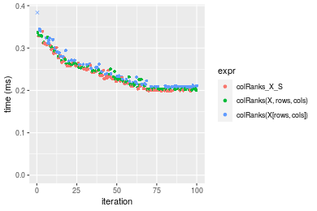


_Table: Benchmarking of colRanks_X_S() and rowRanks_X_S() on integer+1000x10 data (original and transposed).  The top panel shows times in milliseconds and the bottom panel shows relative times._


|   |expr         |     min|       lq|     mean|  median|       uq|     max|
|:--|:------------|-------:|--------:|--------:|-------:|--------:|-------:|
|2  |rowRanks_X_S | 188.116| 190.4775| 221.4310| 206.014| 238.5215| 317.690|
|1  |colRanks_X_S | 198.346| 203.8725| 239.3282| 230.936| 258.7115| 339.284|


|   |expr         |      min|       lq|     mean|   median|       uq|      max|
|:--|:------------|--------:|--------:|--------:|--------:|--------:|--------:|
|2  |rowRanks_X_S | 1.000000| 1.000000| 1.000000| 1.000000| 1.000000| 1.000000|
|1  |colRanks_X_S | 1.054381| 1.070323| 1.080825| 1.120972| 1.084647| 1.067972|

_Figure: Benchmarking of colRanks_X_S() and rowRanks_X_S() on integer+1000x10 data (original and transposed).  Outliers are displayed as crosses. Times are in milliseconds._


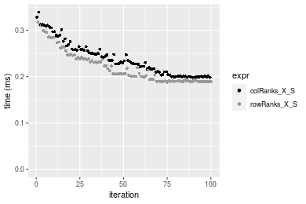

#### 10x1000 integer matrix

```r
> X <- data[["10x1000"]]
> rows <- sample.int(nrow(X), size = nrow(X) * 0.7)
> cols <- sample.int(ncol(X), size = ncol(X) * 0.7)
> X_S <- X[rows, cols]
> gc()
          used  (Mb) gc trigger  (Mb) max used  (Mb)
Ncells 5227196 279.2   10014072 534.9 10014072 534.9
Vcells 9653406  73.7   18204443 138.9 18204443 138.9
> colStats <- microbenchmark(colRanks_X_S = colRanks(X_S, na.rm = FALSE), `colRanks(X, rows, cols)` = colRanks(X, 
+     rows = rows, cols = cols, na.rm = FALSE), `colRanks(X[rows, cols])` = colRanks(X[rows, cols], 
+     na.rm = FALSE), unit = "ms")
> X <- t(X)
> X_S <- t(X_S)
> gc()
          used  (Mb) gc trigger  (Mb) max used  (Mb)
Ncells 5227172 279.2   10014072 534.9 10014072 534.9
Vcells 9658459  73.7   18204443 138.9 18204443 138.9
> rowStats <- microbenchmark(rowRanks_X_S = rowRanks(X_S, na.rm = FALSE), `rowRanks(X, cols, rows)` = rowRanks(X, 
+     rows = cols, cols = rows, na.rm = FALSE), `rowRanks(X[cols, rows])` = rowRanks(X[cols, rows], 
+     na.rm = FALSE), unit = "ms")
```

_Table: Benchmarking of colRanks_X_S(), colRanks(X, rows, cols)() and colRanks(X[rows, cols])() on integer+10x1000 data. The top panel shows times in milliseconds and the bottom panel shows relative times._


|   |expr                    |      min|        lq|      mean|    median|        uq|      max|
|:--|:-----------------------|--------:|---------:|---------:|---------:|---------:|--------:|
|2  |colRanks(X, rows, cols) | 0.104070| 0.1109600| 0.1195293| 0.1147945| 0.1274790| 0.164761|
|1  |colRanks_X_S            | 0.100193| 0.1075755| 0.1196476| 0.1172985| 0.1278765| 0.213361|
|3  |colRanks(X[rows, cols]) | 0.112968| 0.1208010| 0.1302674| 0.1280695| 0.1367280| 0.163583|


|   |expr                    |       min|       lq|     mean|   median|       uq|       max|
|:--|:-----------------------|---------:|--------:|--------:|--------:|--------:|---------:|
|2  |colRanks(X, rows, cols) | 1.0000000| 1.000000| 1.000000| 1.000000| 1.000000| 1.0000000|
|1  |colRanks_X_S            | 0.9627462| 0.969498| 1.000990| 1.021813| 1.003118| 1.2949727|
|3  |colRanks(X[rows, cols]) | 1.0855001| 1.088690| 1.089837| 1.115641| 1.072553| 0.9928502|

_Table: Benchmarking of rowRanks_X_S(), rowRanks(X, cols, rows)() and rowRanks(X[cols, rows])() on integer+10x1000 data (transposed). The top panel shows times in milliseconds and the bottom panel shows relative times._


|   |expr                    |      min|        lq|      mean|    median|        uq|      max|
|:--|:-----------------------|--------:|---------:|---------:|---------:|---------:|--------:|
|1  |rowRanks_X_S            | 0.091603| 0.0972155| 0.1056301| 0.1018475| 0.1126995| 0.152855|
|2  |rowRanks(X, cols, rows) | 0.094203| 0.0998665| 0.1089388| 0.1035785| 0.1145565| 0.225744|
|3  |rowRanks(X[cols, rows]) | 0.101284| 0.1069700| 0.1174652| 0.1117520| 0.1261405| 0.162746|


|   |expr                    |      min|       lq|     mean|   median|       uq|      max|
|:--|:-----------------------|--------:|--------:|--------:|--------:|--------:|--------:|
|1  |rowRanks_X_S            | 1.000000| 1.000000| 1.000000| 1.000000| 1.000000| 1.000000|
|2  |rowRanks(X, cols, rows) | 1.028383| 1.027269| 1.031323| 1.016996| 1.016477| 1.476851|
|3  |rowRanks(X[cols, rows]) | 1.105684| 1.100339| 1.112043| 1.097248| 1.119264| 1.064708|

_Figure: Benchmarking of colRanks_X_S(), colRanks(X, rows, cols)() and colRanks(X[rows, cols])() on integer+10x1000 data  as well as rowRanks_X_S(), rowRanks(X, cols, rows)() and rowRanks(X[cols, rows])() on the same data transposed.  Outliers are displayed as crosses.  Times are in milliseconds._


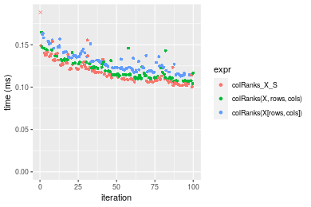

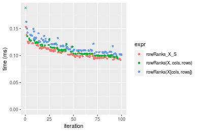
_Table: Benchmarking of colRanks_X_S() and rowRanks_X_S() on integer+10x1000 data (original and transposed).  The top panel shows times in milliseconds and the bottom panel shows relative times._


|   |expr         |     min|       lq|     mean|   median|       uq|     max|
|:--|:------------|-------:|--------:|--------:|--------:|--------:|-------:|
|2  |rowRanks_X_S |  91.603|  97.2155| 105.6301| 101.8475| 112.6995| 152.855|
|1  |colRanks_X_S | 100.193| 107.5755| 119.6476| 117.2985| 127.8765| 213.361|


|   |expr         |      min|       lq|     mean|   median|       uq|      max|
|:--|:------------|--------:|--------:|--------:|--------:|--------:|--------:|
|2  |rowRanks_X_S | 1.000000| 1.000000| 1.000000| 1.000000| 1.000000| 1.000000|
|1  |colRanks_X_S | 1.093774| 1.106567| 1.132703| 1.151707| 1.134668| 1.395839|

_Figure: Benchmarking of colRanks_X_S() and rowRanks_X_S() on integer+10x1000 data (original and transposed).  Outliers are displayed as crosses. Times are in milliseconds._


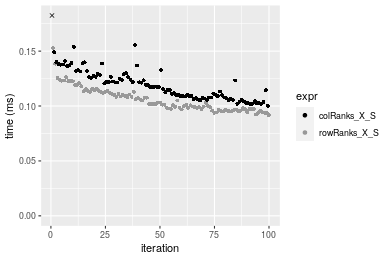

#### 100x1000 integer matrix

```r
> X <- data[["100x1000"]]
> rows <- sample.int(nrow(X), size = nrow(X) * 0.7)
> cols <- sample.int(ncol(X), size = ncol(X) * 0.7)
> X_S <- X[rows, cols]
> gc()
          used  (Mb) gc trigger  (Mb) max used  (Mb)
Ncells 5227406 279.2   10014072 534.9 10014072 534.9
Vcells 9676079  73.9   18204443 138.9 18204443 138.9
> colStats <- microbenchmark(colRanks_X_S = colRanks(X_S, na.rm = FALSE), `colRanks(X, rows, cols)` = colRanks(X, 
+     rows = rows, cols = cols, na.rm = FALSE), `colRanks(X[rows, cols])` = colRanks(X[rows, cols], 
+     na.rm = FALSE), unit = "ms")
> X <- t(X)
> X_S <- t(X_S)
> gc()
          used  (Mb) gc trigger  (Mb) max used  (Mb)
Ncells 5227382 279.2   10014072 534.9 10014072 534.9
Vcells 9726132  74.3   18204443 138.9 18204443 138.9
> rowStats <- microbenchmark(rowRanks_X_S = rowRanks(X_S, na.rm = FALSE), `rowRanks(X, cols, rows)` = rowRanks(X, 
+     rows = cols, cols = rows, na.rm = FALSE), `rowRanks(X[cols, rows])` = rowRanks(X[cols, rows], 
+     na.rm = FALSE), unit = "ms")
```

_Table: Benchmarking of colRanks_X_S(), colRanks(X, rows, cols)() and colRanks(X[rows, cols])() on integer+100x1000 data. The top panel shows times in milliseconds and the bottom panel shows relative times._


|   |expr                    |      min|       lq|     mean|   median|       uq|      max|
|:--|:-----------------------|--------:|--------:|--------:|--------:|--------:|--------:|
|2  |colRanks(X, rows, cols) | 1.462593| 1.469108| 1.566768| 1.476521| 1.608513| 2.451581|
|1  |colRanks_X_S            | 1.454473| 1.460762| 1.663853| 1.479961| 1.599579| 6.911268|
|3  |colRanks(X[rows, cols]) | 1.523576| 1.529249| 1.665068| 1.613781| 1.738954| 2.222094|


|   |expr                    |       min|        lq|     mean|   median|        uq|       max|
|:--|:-----------------------|---------:|---------:|--------:|--------:|---------:|---------:|
|2  |colRanks(X, rows, cols) | 1.0000000| 1.0000000| 1.000000| 1.000000| 1.0000000| 1.0000000|
|1  |colRanks_X_S            | 0.9944482| 0.9943183| 1.061965| 1.002330| 0.9944458| 2.8191065|
|3  |colRanks(X[rows, cols]) | 1.0416951| 1.0409364| 1.062741| 1.092962| 1.0810945| 0.9063922|

_Table: Benchmarking of rowRanks_X_S(), rowRanks(X, cols, rows)() and rowRanks(X[cols, rows])() on integer+100x1000 data (transposed). The top panel shows times in milliseconds and the bottom panel shows relative times._


|   |expr                    |      min|       lq|     mean|   median|       uq|      max|
|:--|:-----------------------|--------:|--------:|--------:|--------:|--------:|--------:|
|1  |rowRanks_X_S            | 1.415657| 1.421874| 1.578132| 1.474726| 1.486973| 8.408534|
|2  |rowRanks(X, cols, rows) | 1.426705| 1.433461| 1.503220| 1.487982| 1.493604| 2.222188|
|3  |rowRanks(X[cols, rows]) | 1.491207| 1.506116| 1.595130| 1.602948| 1.612930| 2.187084|


|   |expr                    |      min|       lq|      mean|   median|       uq|       max|
|:--|:-----------------------|--------:|--------:|---------:|--------:|--------:|---------:|
|1  |rowRanks_X_S            | 1.000000| 1.000000| 1.0000000| 1.000000| 1.000000| 1.0000000|
|2  |rowRanks(X, cols, rows) | 1.007804| 1.008150| 0.9525315| 1.008989| 1.004459| 0.2642777|
|3  |rowRanks(X[cols, rows]) | 1.053367| 1.059247| 1.0107711| 1.086946| 1.084707| 0.2601029|

_Figure: Benchmarking of colRanks_X_S(), colRanks(X, rows, cols)() and colRanks(X[rows, cols])() on integer+100x1000 data  as well as rowRanks_X_S(), rowRanks(X, cols, rows)() and rowRanks(X[cols, rows])() on the same data transposed.  Outliers are displayed as crosses.  Times are in milliseconds._


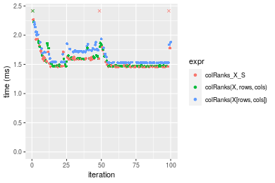

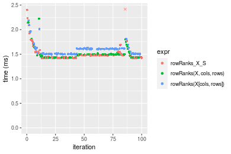
_Table: Benchmarking of colRanks_X_S() and rowRanks_X_S() on integer+100x1000 data (original and transposed).  The top panel shows times in milliseconds and the bottom panel shows relative times._


|   |expr         |      min|       lq|     mean|   median|       uq|      max|
|:--|:------------|--------:|--------:|--------:|--------:|--------:|--------:|
|2  |rowRanks_X_S | 1.415657| 1.421874| 1.578132| 1.474726| 1.486973| 8.408534|
|1  |colRanks_X_S | 1.454473| 1.460762| 1.663853| 1.479961| 1.599579| 6.911268|


|   |expr         |      min|       lq|     mean|  median|       uq|      max|
|:--|:------------|--------:|--------:|--------:|-------:|--------:|--------:|
|2  |rowRanks_X_S | 1.000000| 1.000000| 1.000000| 1.00000| 1.000000| 1.000000|
|1  |colRanks_X_S | 1.027419| 1.027349| 1.054318| 1.00355| 1.075728| 0.821935|

_Figure: Benchmarking of colRanks_X_S() and rowRanks_X_S() on integer+100x1000 data (original and transposed).  Outliers are displayed as crosses. Times are in milliseconds._


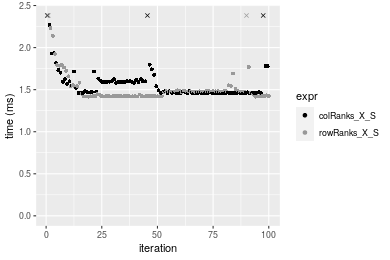

#### 1000x100 integer matrix

```r
> X <- data[["1000x100"]]
> rows <- sample.int(nrow(X), size = nrow(X) * 0.7)
> cols <- sample.int(ncol(X), size = ncol(X) * 0.7)
> X_S <- X[rows, cols]
> gc()
          used  (Mb) gc trigger  (Mb) max used  (Mb)
Ncells 5227619 279.2   10014072 534.9 10014072 534.9
Vcells 9676862  73.9   18204443 138.9 18204443 138.9
> colStats <- microbenchmark(colRanks_X_S = colRanks(X_S, na.rm = FALSE), `colRanks(X, rows, cols)` = colRanks(X, 
+     rows = rows, cols = cols, na.rm = FALSE), `colRanks(X[rows, cols])` = colRanks(X[rows, cols], 
+     na.rm = FALSE), unit = "ms")
> X <- t(X)
> X_S <- t(X_S)
> gc()
          used  (Mb) gc trigger  (Mb) max used  (Mb)
Ncells 5227595 279.2   10014072 534.9 10014072 534.9
Vcells 9726915  74.3   18204443 138.9 18204443 138.9
> rowStats <- microbenchmark(rowRanks_X_S = rowRanks(X_S, na.rm = FALSE), `rowRanks(X, cols, rows)` = rowRanks(X, 
+     rows = cols, cols = rows, na.rm = FALSE), `rowRanks(X[cols, rows])` = rowRanks(X[cols, rows], 
+     na.rm = FALSE), unit = "ms")
```

_Table: Benchmarking of colRanks_X_S(), colRanks(X, rows, cols)() and colRanks(X[rows, cols])() on integer+1000x100 data. The top panel shows times in milliseconds and the bottom panel shows relative times._


|   |expr                    |      min|       lq|     mean|   median|       uq|      max|
|:--|:-----------------------|--------:|--------:|--------:|--------:|--------:|--------:|
|1  |colRanks_X_S            | 1.893957| 1.901601| 2.046415| 1.910059| 2.024019| 7.250901|
|2  |colRanks(X, rows, cols) | 1.895921| 1.906438| 2.009395| 1.922896| 2.029772| 2.751349|
|3  |colRanks(X[rows, cols]) | 1.954312| 1.962411| 2.102213| 1.965952| 2.144626| 7.417147|


|   |expr                    |      min|       lq|      mean|   median|       uq|       max|
|:--|:-----------------------|--------:|--------:|---------:|--------:|--------:|---------:|
|1  |colRanks_X_S            | 1.000000| 1.000000| 1.0000000| 1.000000| 1.000000| 1.0000000|
|2  |colRanks(X, rows, cols) | 1.001037| 1.002544| 0.9819101| 1.006721| 1.002843| 0.3794493|
|3  |colRanks(X[rows, cols]) | 1.031867| 1.031978| 1.0272664| 1.029262| 1.059588| 1.0229276|

_Table: Benchmarking of rowRanks_X_S(), rowRanks(X, cols, rows)() and rowRanks(X[cols, rows])() on integer+1000x100 data (transposed). The top panel shows times in milliseconds and the bottom panel shows relative times._


|   |expr                    |      min|       lq|     mean|   median|       uq|      max|
|:--|:-----------------------|--------:|--------:|--------:|--------:|--------:|--------:|
|1  |rowRanks_X_S            | 1.864009| 1.875547| 1.956103| 1.905483| 1.933476| 2.444948|
|2  |rowRanks(X, cols, rows) | 1.867837| 1.878310| 2.036915| 1.922621| 1.932877| 8.975646|
|3  |rowRanks(X[cols, rows]) | 1.933746| 1.949648| 2.048235| 1.980886| 2.058504| 3.053772|


|   |expr                    |      min|       lq|     mean|   median|        uq|      max|
|:--|:-----------------------|--------:|--------:|--------:|--------:|---------:|--------:|
|1  |rowRanks_X_S            | 1.000000| 1.000000| 1.000000| 1.000000| 1.0000000| 1.000000|
|2  |rowRanks(X, cols, rows) | 1.002054| 1.001473| 1.041313| 1.008994| 0.9996899| 3.671099|
|3  |rowRanks(X[cols, rows]) | 1.037412| 1.039509| 1.047100| 1.039571| 1.0646649| 1.249013|

_Figure: Benchmarking of colRanks_X_S(), colRanks(X, rows, cols)() and colRanks(X[rows, cols])() on integer+1000x100 data  as well as rowRanks_X_S(), rowRanks(X, cols, rows)() and rowRanks(X[cols, rows])() on the same data transposed.  Outliers are displayed as crosses.  Times are in milliseconds._


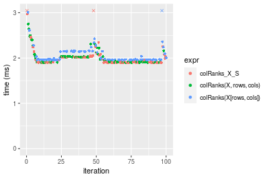

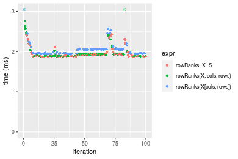
_Table: Benchmarking of colRanks_X_S() and rowRanks_X_S() on integer+1000x100 data (original and transposed).  The top panel shows times in milliseconds and the bottom panel shows relative times._


|   |expr         |      min|       lq|     mean|   median|       uq|      max|
|:--|:------------|--------:|--------:|--------:|--------:|--------:|--------:|
|2  |rowRanks_X_S | 1.864009| 1.875547| 1.956103| 1.905483| 1.933476| 2.444948|
|1  |colRanks_X_S | 1.893957| 1.901601| 2.046415| 1.910059| 2.024019| 7.250901|


|   |expr         |      min|       lq|     mean|   median|       uq|      max|
|:--|:------------|--------:|--------:|--------:|--------:|--------:|--------:|
|2  |rowRanks_X_S | 1.000000| 1.000000| 1.000000| 1.000000| 1.000000| 1.000000|
|1  |colRanks_X_S | 1.016066| 1.013891| 1.046169| 1.002401| 1.046829| 2.965667|

_Figure: Benchmarking of colRanks_X_S() and rowRanks_X_S() on integer+1000x100 data (original and transposed).  Outliers are displayed as crosses. Times are in milliseconds._


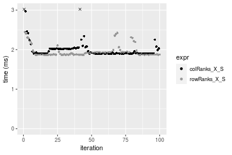


## Data type "double"

### Data
```r
> rmatrix <- function(nrow, ncol, mode = c("logical", "double", "integer", "index"), range = c(-100, 
+     +100), na_prob = 0) {
+     mode <- match.arg(mode)
+     n <- nrow * ncol
+     if (mode == "logical") {
+         x <- sample(c(FALSE, TRUE), size = n, replace = TRUE)
+     }     else if (mode == "index") {
+         x <- seq_len(n)
+         mode <- "integer"
+     }     else {
+         x <- runif(n, min = range[1], max = range[2])
+     }
+     storage.mode(x) <- mode
+     if (na_prob > 0) 
+         x[sample(n, size = na_prob * n)] <- NA
+     dim(x) <- c(nrow, ncol)
+     x
+ }
> rmatrices <- function(scale = 10, seed = 1, ...) {
+     set.seed(seed)
+     data <- list()
+     data[[1]] <- rmatrix(nrow = scale * 1, ncol = scale * 1, ...)
+     data[[2]] <- rmatrix(nrow = scale * 10, ncol = scale * 10, ...)
+     data[[3]] <- rmatrix(nrow = scale * 100, ncol = scale * 1, ...)
+     data[[4]] <- t(data[[3]])
+     data[[5]] <- rmatrix(nrow = scale * 10, ncol = scale * 100, ...)
+     data[[6]] <- t(data[[5]])
+     names(data) <- sapply(data, FUN = function(x) paste(dim(x), collapse = "x"))
+     data
+ }
> data <- rmatrices(mode = mode)
```

### Results

#### 10x10 double matrix

```r
> X <- data[["10x10"]]
> rows <- sample.int(nrow(X), size = nrow(X) * 0.7)
> cols <- sample.int(ncol(X), size = ncol(X) * 0.7)
> X_S <- X[rows, cols]
> gc()
          used  (Mb) gc trigger  (Mb) max used  (Mb)
Ncells 5227836 279.2   10014072 534.9 10014072 534.9
Vcells 9767965  74.6   18204443 138.9 18204443 138.9
> colStats <- microbenchmark(colRanks_X_S = colRanks(X_S, na.rm = FALSE), `colRanks(X, rows, cols)` = colRanks(X, 
+     rows = rows, cols = cols, na.rm = FALSE), `colRanks(X[rows, cols])` = colRanks(X[rows, cols], 
+     na.rm = FALSE), unit = "ms")
> X <- t(X)
> X_S <- t(X_S)
> gc()
          used  (Mb) gc trigger  (Mb) max used  (Mb)
Ncells 5227803 279.2   10014072 534.9 10014072 534.9
Vcells 9768103  74.6   18204443 138.9 18204443 138.9
> rowStats <- microbenchmark(rowRanks_X_S = rowRanks(X_S, na.rm = FALSE), `rowRanks(X, cols, rows)` = rowRanks(X, 
+     rows = cols, cols = rows, na.rm = FALSE), `rowRanks(X[cols, rows])` = rowRanks(X[cols, rows], 
+     na.rm = FALSE), unit = "ms")
```

_Table: Benchmarking of colRanks_X_S(), colRanks(X, rows, cols)() and colRanks(X[rows, cols])() on double+10x10 data. The top panel shows times in milliseconds and the bottom panel shows relative times._


|   |expr                    |      min|        lq|      mean|    median|        uq|      max|
|:--|:-----------------------|--------:|---------:|---------:|---------:|---------:|--------:|
|1  |colRanks_X_S            | 0.010189| 0.0105075| 0.0113098| 0.0107430| 0.0109500| 0.057924|
|2  |colRanks(X, rows, cols) | 0.010587| 0.0109440| 0.0112871| 0.0111675| 0.0114685| 0.016318|
|3  |colRanks(X[rows, cols]) | 0.011352| 0.0117120| 0.0122188| 0.0119315| 0.0121960| 0.026659|


|   |expr                    |      min|       lq|      mean|   median|       uq|      max|
|:--|:-----------------------|--------:|--------:|---------:|--------:|--------:|--------:|
|1  |colRanks_X_S            | 1.000000| 1.000000| 1.0000000| 1.000000| 1.000000| 1.000000|
|2  |colRanks(X, rows, cols) | 1.039062| 1.041542| 0.9979867| 1.039514| 1.047352| 0.281714|
|3  |colRanks(X[rows, cols]) | 1.114143| 1.114632| 1.0803645| 1.110630| 1.113790| 0.460241|

_Table: Benchmarking of rowRanks_X_S(), rowRanks(X, cols, rows)() and rowRanks(X[cols, rows])() on double+10x10 data (transposed). The top panel shows times in milliseconds and the bottom panel shows relative times._


|   |expr                    |      min|        lq|      mean|    median|        uq|      max|
|:--|:-----------------------|--------:|---------:|---------:|---------:|---------:|--------:|
|1  |rowRanks_X_S            | 0.005156| 0.0054795| 0.0058597| 0.0056310| 0.0057910| 0.020085|
|2  |rowRanks(X, cols, rows) | 0.005522| 0.0058180| 0.0063412| 0.0059705| 0.0061760| 0.033406|
|3  |rowRanks(X[cols, rows]) | 0.006036| 0.0064325| 0.0066790| 0.0065605| 0.0067335| 0.008587|


|   |expr                    |      min|       lq|     mean|   median|       uq|      max|
|:--|:-----------------------|--------:|--------:|--------:|--------:|--------:|--------:|
|1  |rowRanks_X_S            | 1.000000| 1.000000| 1.000000| 1.000000| 1.000000| 1.000000|
|2  |rowRanks(X, cols, rows) | 1.070985| 1.061776| 1.082166| 1.060291| 1.066482| 1.663231|
|3  |rowRanks(X[cols, rows]) | 1.170675| 1.173921| 1.139828| 1.165068| 1.162753| 0.427533|

_Figure: Benchmarking of colRanks_X_S(), colRanks(X, rows, cols)() and colRanks(X[rows, cols])() on double+10x10 data  as well as rowRanks_X_S(), rowRanks(X, cols, rows)() and rowRanks(X[cols, rows])() on the same data transposed.  Outliers are displayed as crosses.  Times are in milliseconds._


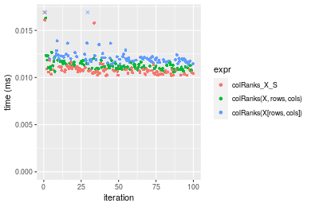

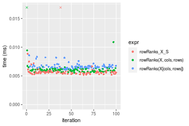
_Table: Benchmarking of colRanks_X_S() and rowRanks_X_S() on double+10x10 data (original and transposed).  The top panel shows times in milliseconds and the bottom panel shows relative times._


|   |expr         |    min|      lq|     mean| median|     uq|    max|
|:--|:------------|------:|-------:|--------:|------:|------:|------:|
|2  |rowRanks_X_S |  5.156|  5.4795|  5.85970|  5.631|  5.791| 20.085|
|1  |colRanks_X_S | 10.189| 10.5075| 11.30984| 10.743| 10.950| 57.924|


|   |expr         |      min|       lq|     mean|   median|       uq|      max|
|:--|:------------|--------:|--------:|--------:|--------:|--------:|--------:|
|2  |rowRanks_X_S | 1.000000| 1.000000| 1.000000| 1.000000| 1.000000| 1.000000|
|1  |colRanks_X_S | 1.976144| 1.917602| 1.930106| 1.907832| 1.890865| 2.883943|

_Figure: Benchmarking of colRanks_X_S() and rowRanks_X_S() on double+10x10 data (original and transposed).  Outliers are displayed as crosses. Times are in milliseconds._


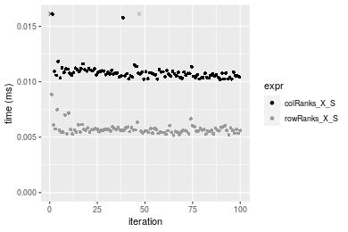

#### 100x100 double matrix

```r
> X <- data[["100x100"]]
> rows <- sample.int(nrow(X), size = nrow(X) * 0.7)
> cols <- sample.int(ncol(X), size = ncol(X) * 0.7)
> X_S <- X[rows, cols]
> gc()
          used  (Mb) gc trigger  (Mb) max used  (Mb)
Ncells 5228033 279.3   10014072 534.9 10014072 534.9
Vcells 9773911  74.6   18204443 138.9 18204443 138.9
> colStats <- microbenchmark(colRanks_X_S = colRanks(X_S, na.rm = FALSE), `colRanks(X, rows, cols)` = colRanks(X, 
+     rows = rows, cols = cols, na.rm = FALSE), `colRanks(X[rows, cols])` = colRanks(X[rows, cols], 
+     na.rm = FALSE), unit = "ms")
> X <- t(X)
> X_S <- t(X_S)
> gc()
          used  (Mb) gc trigger  (Mb) max used  (Mb)
Ncells 5228009 279.3   10014072 534.9 10014072 534.9
Vcells 9783964  74.7   18204443 138.9 18204443 138.9
> rowStats <- microbenchmark(rowRanks_X_S = rowRanks(X_S, na.rm = FALSE), `rowRanks(X, cols, rows)` = rowRanks(X, 
+     rows = cols, cols = rows, na.rm = FALSE), `rowRanks(X[cols, rows])` = rowRanks(X[cols, rows], 
+     na.rm = FALSE), unit = "ms")
```

_Table: Benchmarking of colRanks_X_S(), colRanks(X, rows, cols)() and colRanks(X[rows, cols])() on double+100x100 data. The top panel shows times in milliseconds and the bottom panel shows relative times._


|   |expr                    |      min|        lq|      mean|    median|        uq|      max|
|:--|:-----------------------|--------:|---------:|---------:|---------:|---------:|--------:|
|1  |colRanks_X_S            | 0.155651| 0.1616045| 0.1904314| 0.1855195| 0.2052235| 0.276679|
|2  |colRanks(X, rows, cols) | 0.157643| 0.1635885| 0.1901653| 0.1864325| 0.2071120| 0.281621|
|3  |colRanks(X[rows, cols]) | 0.168125| 0.1758765| 0.2047820| 0.1990770| 0.2248660| 0.365715|


|   |expr                    |      min|       lq|      mean|   median|       uq|      max|
|:--|:-----------------------|--------:|--------:|---------:|--------:|--------:|--------:|
|1  |colRanks_X_S            | 1.000000| 1.000000| 1.0000000| 1.000000| 1.000000| 1.000000|
|2  |colRanks(X, rows, cols) | 1.012798| 1.012277| 0.9986029| 1.004921| 1.009202| 1.017862|
|3  |colRanks(X[rows, cols]) | 1.080141| 1.088314| 1.0753586| 1.073079| 1.095713| 1.321802|

_Table: Benchmarking of rowRanks_X_S(), rowRanks(X, cols, rows)() and rowRanks(X[cols, rows])() on double+100x100 data (transposed). The top panel shows times in milliseconds and the bottom panel shows relative times._


|   |expr                    |      min|        lq|      mean|   median|        uq|      max|
|:--|:-----------------------|--------:|---------:|---------:|--------:|---------:|--------:|
|1  |rowRanks_X_S            | 0.144917| 0.1580215| 0.1797368| 0.181389| 0.1963375| 0.259964|
|2  |rowRanks(X, cols, rows) | 0.146525| 0.1635105| 0.1821619| 0.183311| 0.1909085| 0.309175|
|3  |rowRanks(X[cols, rows]) | 0.155317| 0.1707920| 0.1927466| 0.193399| 0.2058530| 0.270839|


|   |expr                    |      min|       lq|     mean|   median|        uq|      max|
|:--|:-----------------------|--------:|--------:|--------:|--------:|---------:|--------:|
|1  |rowRanks_X_S            | 1.000000| 1.000000| 1.000000| 1.000000| 1.0000000| 1.000000|
|2  |rowRanks(X, cols, rows) | 1.011096| 1.034736| 1.013493| 1.010596| 0.9723486| 1.189299|
|3  |rowRanks(X[cols, rows]) | 1.071765| 1.080815| 1.072383| 1.066211| 1.0484650| 1.041833|

_Figure: Benchmarking of colRanks_X_S(), colRanks(X, rows, cols)() and colRanks(X[rows, cols])() on double+100x100 data  as well as rowRanks_X_S(), rowRanks(X, cols, rows)() and rowRanks(X[cols, rows])() on the same data transposed.  Outliers are displayed as crosses.  Times are in milliseconds._


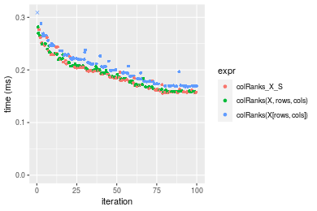

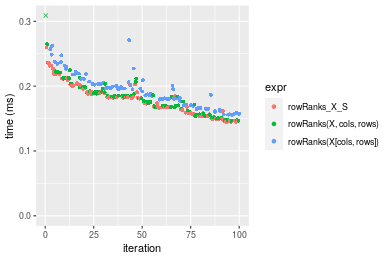
_Table: Benchmarking of colRanks_X_S() and rowRanks_X_S() on double+100x100 data (original and transposed).  The top panel shows times in milliseconds and the bottom panel shows relative times._


|   |expr         |     min|       lq|     mean|   median|       uq|     max|
|:--|:------------|-------:|--------:|--------:|--------:|--------:|-------:|
|2  |rowRanks_X_S | 144.917| 158.0215| 179.7368| 181.3890| 196.3375| 259.964|
|1  |colRanks_X_S | 155.651| 161.6045| 190.4314| 185.5195| 205.2235| 276.679|


|   |expr         |     min|       lq|     mean|   median|       uq|      max|
|:--|:------------|-------:|--------:|--------:|--------:|--------:|--------:|
|2  |rowRanks_X_S | 1.00000| 1.000000| 1.000000| 1.000000| 1.000000| 1.000000|
|1  |colRanks_X_S | 1.07407| 1.022674| 1.059502| 1.022771| 1.045259| 1.064297|

_Figure: Benchmarking of colRanks_X_S() and rowRanks_X_S() on double+100x100 data (original and transposed).  Outliers are displayed as crosses. Times are in milliseconds._


#### 1000x10 double matrix

```r
> X <- data[["1000x10"]]
> rows <- sample.int(nrow(X), size = nrow(X) * 0.7)
> cols <- sample.int(ncol(X), size = ncol(X) * 0.7)
> X_S <- X[rows, cols]
> gc()
          used  (Mb) gc trigger  (Mb) max used  (Mb)
Ncells 5228233 279.3   10014072 534.9 10014072 534.9
Vcells 9775322  74.6   18204443 138.9 18204443 138.9
> colStats <- microbenchmark(colRanks_X_S = colRanks(X_S, na.rm = FALSE), `colRanks(X, rows, cols)` = colRanks(X, 
+     rows = rows, cols = cols, na.rm = FALSE), `colRanks(X[rows, cols])` = colRanks(X[rows, cols], 
+     na.rm = FALSE), unit = "ms")
> X <- t(X)
> X_S <- t(X_S)
> gc()
          used  (Mb) gc trigger  (Mb) max used  (Mb)
Ncells 5228209 279.3   10014072 534.9 10014072 534.9
Vcells 9785375  74.7   18204443 138.9 18204443 138.9
> rowStats <- microbenchmark(rowRanks_X_S = rowRanks(X_S, na.rm = FALSE), `rowRanks(X, cols, rows)` = rowRanks(X, 
+     rows = cols, cols = rows, na.rm = FALSE), `rowRanks(X[cols, rows])` = rowRanks(X[cols, rows], 
+     na.rm = FALSE), unit = "ms")
```

_Table: Benchmarking of colRanks_X_S(), colRanks(X, rows, cols)() and colRanks(X[rows, cols])() on double+1000x10 data. The top panel shows times in milliseconds and the bottom panel shows relative times._


|   |expr                    |      min|        lq|      mean|    median|        uq|      max|
|:--|:-----------------------|--------:|---------:|---------:|---------:|---------:|--------:|
|2  |colRanks(X, rows, cols) | 0.219367| 0.2220235| 0.2519329| 0.2349740| 0.2770220| 0.378007|
|3  |colRanks(X[rows, cols]) | 0.229301| 0.2314075| 0.2624214| 0.2401695| 0.2898750| 0.461047|
|1  |colRanks_X_S            | 0.216636| 0.2205795| 0.2540517| 0.2437845| 0.2753255| 0.379385|


|   |expr                    |       min|        lq|     mean|   median|        uq|      max|
|:--|:-----------------------|---------:|---------:|--------:|--------:|---------:|--------:|
|2  |colRanks(X, rows, cols) | 1.0000000| 1.0000000| 1.000000| 1.000000| 1.0000000| 1.000000|
|3  |colRanks(X[rows, cols]) | 1.0452848| 1.0422658| 1.041632| 1.022111| 1.0463970| 1.219679|
|1  |colRanks_X_S            | 0.9875505| 0.9934962| 1.008411| 1.037496| 0.9938759| 1.003645|

_Table: Benchmarking of rowRanks_X_S(), rowRanks(X, cols, rows)() and rowRanks(X[cols, rows])() on double+1000x10 data (transposed). The top panel shows times in milliseconds and the bottom panel shows relative times._


|   |expr                    |      min|        lq|      mean|    median|       uq|      max|
|:--|:-----------------------|--------:|---------:|---------:|---------:|--------:|--------:|
|1  |rowRanks_X_S            | 0.205738| 0.2079940| 0.2364665| 0.2183045| 0.256759| 0.342523|
|2  |rowRanks(X, cols, rows) | 0.207829| 0.2105965| 0.2423875| 0.2319725| 0.269494| 0.343034|
|3  |rowRanks(X[cols, rows]) | 0.218955| 0.2210945| 0.2521619| 0.2385715| 0.276159| 0.419494|


|   |expr                    |      min|       lq|     mean|   median|       uq|      max|
|:--|:-----------------------|--------:|--------:|--------:|--------:|--------:|--------:|
|1  |rowRanks_X_S            | 1.000000| 1.000000| 1.000000| 1.000000| 1.000000| 1.000000|
|2  |rowRanks(X, cols, rows) | 1.010163| 1.012512| 1.025040| 1.062610| 1.049599| 1.001492|
|3  |rowRanks(X[cols, rows]) | 1.064242| 1.062985| 1.066375| 1.092838| 1.075557| 1.224718|

_Figure: Benchmarking of colRanks_X_S(), colRanks(X, rows, cols)() and colRanks(X[rows, cols])() on double+1000x10 data  as well as rowRanks_X_S(), rowRanks(X, cols, rows)() and rowRanks(X[cols, rows])() on the same data transposed.  Outliers are displayed as crosses.  Times are in milliseconds._


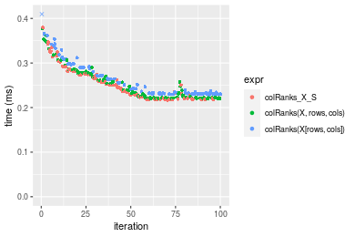

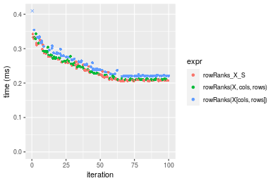
_Table: Benchmarking of colRanks_X_S() and rowRanks_X_S() on double+1000x10 data (original and transposed).  The top panel shows times in milliseconds and the bottom panel shows relative times._


|   |expr         |     min|       lq|     mean|   median|       uq|     max|
|:--|:------------|-------:|--------:|--------:|--------:|--------:|-------:|
|2  |rowRanks_X_S | 205.738| 207.9940| 236.4665| 218.3045| 256.7590| 342.523|
|1  |colRanks_X_S | 216.636| 220.5795| 254.0517| 243.7845| 275.3255| 379.385|


|   |expr         |     min|       lq|     mean|   median|       uq|      max|
|:--|:------------|-------:|--------:|--------:|--------:|--------:|--------:|
|2  |rowRanks_X_S | 1.00000| 1.000000| 1.000000| 1.000000| 1.000000| 1.000000|
|1  |colRanks_X_S | 1.05297| 1.060509| 1.074367| 1.116718| 1.072311| 1.107619|

_Figure: Benchmarking of colRanks_X_S() and rowRanks_X_S() on double+1000x10 data (original and transposed).  Outliers are displayed as crosses. Times are in milliseconds._


#### 10x1000 double matrix

```r
> X <- data[["10x1000"]]
> rows <- sample.int(nrow(X), size = nrow(X) * 0.7)
> cols <- sample.int(ncol(X), size = ncol(X) * 0.7)
> X_S <- X[rows, cols]
> gc()
          used  (Mb) gc trigger  (Mb) max used  (Mb)
Ncells 5228438 279.3   10014072 534.9 10014072 534.9
Vcells 9775458  74.6   18204443 138.9 18204443 138.9
> colStats <- microbenchmark(colRanks_X_S = colRanks(X_S, na.rm = FALSE), `colRanks(X, rows, cols)` = colRanks(X, 
+     rows = rows, cols = cols, na.rm = FALSE), `colRanks(X[rows, cols])` = colRanks(X[rows, cols], 
+     na.rm = FALSE), unit = "ms")
> X <- t(X)
> X_S <- t(X_S)
> gc()
          used  (Mb) gc trigger  (Mb) max used  (Mb)
Ncells 5228414 279.3   10014072 534.9 10014072 534.9
Vcells 9785511  74.7   18204443 138.9 18204443 138.9
> rowStats <- microbenchmark(rowRanks_X_S = rowRanks(X_S, na.rm = FALSE), `rowRanks(X, cols, rows)` = rowRanks(X, 
+     rows = cols, cols = rows, na.rm = FALSE), `rowRanks(X[cols, rows])` = rowRanks(X[cols, rows], 
+     na.rm = FALSE), unit = "ms")
```

_Table: Benchmarking of colRanks_X_S(), colRanks(X, rows, cols)() and colRanks(X[rows, cols])() on double+10x1000 data. The top panel shows times in milliseconds and the bottom panel shows relative times._


|   |expr                    |      min|        lq|      mean|    median|        uq|      max|
|:--|:-----------------------|--------:|---------:|---------:|---------:|---------:|--------:|
|2  |colRanks(X, rows, cols) | 0.105070| 0.1149145| 0.1236990| 0.1219910| 0.1269405| 0.182481|
|1  |colRanks_X_S            | 0.103563| 0.1114300| 0.1233918| 0.1220335| 0.1312205| 0.214506|
|3  |colRanks(X[rows, cols]) | 0.118610| 0.1319710| 0.1400104| 0.1377070| 0.1486145| 0.178885|


|   |expr                    |       min|        lq|      mean|   median|       uq|       max|
|:--|:-----------------------|---------:|---------:|---------:|--------:|--------:|---------:|
|2  |colRanks(X, rows, cols) | 1.0000000| 1.0000000| 1.0000000| 1.000000| 1.000000| 1.0000000|
|1  |colRanks_X_S            | 0.9856572| 0.9696775| 0.9975165| 1.000348| 1.033717| 1.1754977|
|3  |colRanks(X[rows, cols]) | 1.1288665| 1.1484277| 1.1318630| 1.128829| 1.170741| 0.9802938|

_Table: Benchmarking of rowRanks_X_S(), rowRanks(X, cols, rows)() and rowRanks(X[cols, rows])() on double+10x1000 data (transposed). The top panel shows times in milliseconds and the bottom panel shows relative times._


|   |expr                    |      min|        lq|      mean|    median|       uq|      max|
|:--|:-----------------------|--------:|---------:|---------:|---------:|--------:|--------:|
|1  |rowRanks_X_S            | 0.088484| 0.0988500| 0.1046109| 0.1039095| 0.108599| 0.137396|
|2  |rowRanks(X, cols, rows) | 0.089701| 0.1011350| 0.1077024| 0.1068375| 0.110845| 0.187304|
|3  |rowRanks(X[cols, rows]) | 0.099710| 0.1113255| 0.1192001| 0.1180495| 0.125356| 0.164434|


|   |expr                    |      min|       lq|     mean|   median|       uq|      max|
|:--|:-----------------------|--------:|--------:|--------:|--------:|--------:|--------:|
|1  |rowRanks_X_S            | 1.000000| 1.000000| 1.000000| 1.000000| 1.000000| 1.000000|
|2  |rowRanks(X, cols, rows) | 1.013754| 1.023116| 1.029552| 1.028178| 1.020682| 1.363242|
|3  |rowRanks(X[cols, rows]) | 1.126870| 1.126206| 1.139461| 1.136080| 1.154302| 1.196789|

_Figure: Benchmarking of colRanks_X_S(), colRanks(X, rows, cols)() and colRanks(X[rows, cols])() on double+10x1000 data  as well as rowRanks_X_S(), rowRanks(X, cols, rows)() and rowRanks(X[cols, rows])() on the same data transposed.  Outliers are displayed as crosses.  Times are in milliseconds._


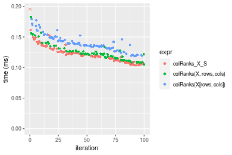

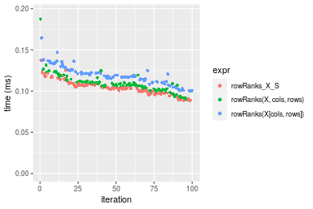
_Table: Benchmarking of colRanks_X_S() and rowRanks_X_S() on double+10x1000 data (original and transposed).  The top panel shows times in milliseconds and the bottom panel shows relative times._


|   |expr         |     min|     lq|     mean|   median|       uq|     max|
|:--|:------------|-------:|------:|--------:|--------:|--------:|-------:|
|2  |rowRanks_X_S |  88.484|  98.85| 104.6109| 103.9095| 108.5990| 137.396|
|1  |colRanks_X_S | 103.563| 111.43| 123.3918| 122.0335| 131.2205| 214.506|


|   |expr         |      min|       lq|     mean|   median|       uq|      max|
|:--|:------------|--------:|--------:|--------:|--------:|--------:|--------:|
|2  |rowRanks_X_S | 1.000000| 1.000000| 1.000000| 1.000000| 1.000000| 1.000000|
|1  |colRanks_X_S | 1.170415| 1.127263| 1.179531| 1.174421| 1.208303| 1.561225|

_Figure: Benchmarking of colRanks_X_S() and rowRanks_X_S() on double+10x1000 data (original and transposed).  Outliers are displayed as crosses. Times are in milliseconds._


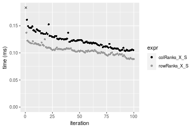

#### 100x1000 double matrix

```r
> X <- data[["100x1000"]]
> rows <- sample.int(nrow(X), size = nrow(X) * 0.7)
> cols <- sample.int(ncol(X), size = ncol(X) * 0.7)
> X_S <- X[rows, cols]
> gc()
          used  (Mb) gc trigger  (Mb) max used  (Mb)
Ncells 5228648 279.3   10014072 534.9 10014072 534.9
Vcells 9820922  75.0   18204443 138.9 18204443 138.9
> colStats <- microbenchmark(colRanks_X_S = colRanks(X_S, na.rm = FALSE), `colRanks(X, rows, cols)` = colRanks(X, 
+     rows = rows, cols = cols, na.rm = FALSE), `colRanks(X[rows, cols])` = colRanks(X[rows, cols], 
+     na.rm = FALSE), unit = "ms")
> X <- t(X)
> X_S <- t(X_S)
> gc()
          used  (Mb) gc trigger  (Mb) max used  (Mb)
Ncells 5228624 279.3   10014072 534.9 10014072 534.9
Vcells 9920975  75.7   18204443 138.9 18204443 138.9
> rowStats <- microbenchmark(rowRanks_X_S = rowRanks(X_S, na.rm = FALSE), `rowRanks(X, cols, rows)` = rowRanks(X, 
+     rows = cols, cols = rows, na.rm = FALSE), `rowRanks(X[cols, rows])` = rowRanks(X[cols, rows], 
+     na.rm = FALSE), unit = "ms")
```

_Table: Benchmarking of colRanks_X_S(), colRanks(X, rows, cols)() and colRanks(X[rows, cols])() on double+100x1000 data. The top panel shows times in milliseconds and the bottom panel shows relative times._


|   |expr                    |      min|       lq|     mean|   median|       uq|      max|
|:--|:-----------------------|--------:|--------:|--------:|--------:|--------:|--------:|
|2  |colRanks(X, rows, cols) | 1.516817| 1.562361| 1.618916| 1.566528| 1.654154| 2.444436|
|1  |colRanks_X_S            | 1.513150| 1.559795| 1.684312| 1.567908| 1.691382| 6.808317|
|3  |colRanks(X[rows, cols]) | 1.615370| 1.658243| 1.827513| 1.671256| 1.903858| 7.284038|


|   |expr                    |       min|        lq|     mean|   median|       uq|      max|
|:--|:-----------------------|---------:|---------:|--------:|--------:|--------:|--------:|
|2  |colRanks(X, rows, cols) | 1.0000000| 1.0000000| 1.000000| 1.000000| 1.000000| 1.000000|
|1  |colRanks_X_S            | 0.9975824| 0.9983576| 1.040395| 1.000881| 1.022506| 2.785230|
|3  |colRanks(X[rows, cols]) | 1.0649736| 1.0613693| 1.128850| 1.066854| 1.150956| 2.979844|

_Table: Benchmarking of rowRanks_X_S(), rowRanks(X, cols, rows)() and rowRanks(X[cols, rows])() on double+100x1000 data (transposed). The top panel shows times in milliseconds and the bottom panel shows relative times._


|   |expr                    |      min|       lq|     mean|   median|       uq|      max|
|:--|:-----------------------|--------:|--------:|--------:|--------:|--------:|--------:|
|2  |rowRanks(X, cols, rows) | 1.493804| 1.504092| 1.622171| 1.511578| 1.564171| 8.666129|
|1  |rowRanks_X_S            | 1.486024| 1.498105| 1.580957| 1.543940| 1.564704| 2.424509|
|3  |rowRanks(X[cols, rows]) | 1.619143| 1.632604| 1.725072| 1.668141| 1.776071| 2.262535|


|   |expr                    |       min|        lq|      mean|   median|       uq|       max|
|:--|:-----------------------|---------:|---------:|---------:|--------:|--------:|---------:|
|2  |rowRanks(X, cols, rows) | 1.0000000| 1.0000000| 1.0000000| 1.000000| 1.000000| 1.0000000|
|1  |rowRanks_X_S            | 0.9947918| 0.9960195| 0.9745936| 1.021409| 1.000341| 0.2797684|
|3  |rowRanks(X[cols, rows]) | 1.0839059| 1.0854412| 1.0634344| 1.103576| 1.135471| 0.2610779|

_Figure: Benchmarking of colRanks_X_S(), colRanks(X, rows, cols)() and colRanks(X[rows, cols])() on double+100x1000 data  as well as rowRanks_X_S(), rowRanks(X, cols, rows)() and rowRanks(X[cols, rows])() on the same data transposed.  Outliers are displayed as crosses.  Times are in milliseconds._


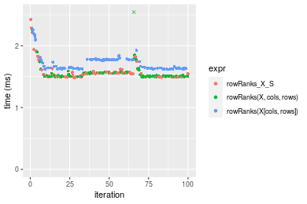
_Table: Benchmarking of colRanks_X_S() and rowRanks_X_S() on double+100x1000 data (original and transposed).  The top panel shows times in milliseconds and the bottom panel shows relative times._


|   |expr         |      min|       lq|     mean|   median|       uq|      max|
|:--|:------------|--------:|--------:|--------:|--------:|--------:|--------:|
|2  |rowRanks_X_S | 1.486024| 1.498105| 1.580957| 1.543940| 1.564704| 2.424509|
|1  |colRanks_X_S | 1.513150| 1.559795| 1.684312| 1.567908| 1.691382| 6.808317|


|   |expr         |      min|       lq|     mean|   median|      uq|      max|
|:--|:------------|--------:|--------:|--------:|--------:|-------:|--------:|
|2  |rowRanks_X_S | 1.000000| 1.000000| 1.000000| 1.000000| 1.00000| 1.000000|
|1  |colRanks_X_S | 1.018254| 1.041179| 1.065374| 1.015524| 1.08096| 2.808122|

_Figure: Benchmarking of colRanks_X_S() and rowRanks_X_S() on double+100x1000 data (original and transposed).  Outliers are displayed as crosses. Times are in milliseconds._


#### 1000x100 double matrix

```r
> X <- data[["1000x100"]]
> rows <- sample.int(nrow(X), size = nrow(X) * 0.7)
> cols <- sample.int(ncol(X), size = ncol(X) * 0.7)
> X_S <- X[rows, cols]
> gc()
          used  (Mb) gc trigger  (Mb) max used  (Mb)
Ncells 5228861 279.3   10014072 534.9 10014072 534.9
Vcells 9821066  75.0   18204443 138.9 18204443 138.9
> colStats <- microbenchmark(colRanks_X_S = colRanks(X_S, na.rm = FALSE), `colRanks(X, rows, cols)` = colRanks(X, 
+     rows = rows, cols = cols, na.rm = FALSE), `colRanks(X[rows, cols])` = colRanks(X[rows, cols], 
+     na.rm = FALSE), unit = "ms")
> X <- t(X)
> X_S <- t(X_S)
> gc()
          used  (Mb) gc trigger  (Mb) max used  (Mb)
Ncells 5228837 279.3   10014072 534.9 10014072 534.9
Vcells 9921119  75.7   18204443 138.9 18204443 138.9
> rowStats <- microbenchmark(rowRanks_X_S = rowRanks(X_S, na.rm = FALSE), `rowRanks(X, cols, rows)` = rowRanks(X, 
+     rows = cols, cols = rows, na.rm = FALSE), `rowRanks(X[cols, rows])` = rowRanks(X[cols, rows], 
+     na.rm = FALSE), unit = "ms")
```

_Table: Benchmarking of colRanks_X_S(), colRanks(X, rows, cols)() and colRanks(X[rows, cols])() on double+1000x100 data. The top panel shows times in milliseconds and the bottom panel shows relative times._


|   |expr                    |      min|       lq|     mean|   median|       uq|      max|
|:--|:-----------------------|--------:|--------:|--------:|--------:|--------:|--------:|
|1  |colRanks_X_S            | 2.130894| 2.138357| 2.264212| 2.142449| 2.241703| 7.489690|
|2  |colRanks(X, rows, cols) | 2.132105| 2.142273| 2.282938| 2.148332| 2.259694| 7.352256|
|3  |colRanks(X[rows, cols]) | 2.222375| 2.230061| 2.319799| 2.236913| 2.463054| 3.415791|


|   |expr                    |      min|       lq|     mean|   median|       uq|       max|
|:--|:-----------------------|--------:|--------:|--------:|--------:|--------:|---------:|
|1  |colRanks_X_S            | 1.000000| 1.000000| 1.000000| 1.000000| 1.000000| 1.0000000|
|2  |colRanks(X, rows, cols) | 1.000568| 1.001831| 1.008271| 1.002746| 1.008025| 0.9816502|
|3  |colRanks(X[rows, cols]) | 1.042931| 1.042885| 1.024551| 1.044092| 1.098742| 0.4560657|

_Table: Benchmarking of rowRanks_X_S(), rowRanks(X, cols, rows)() and rowRanks(X[cols, rows])() on double+1000x100 data (transposed). The top panel shows times in milliseconds and the bottom panel shows relative times._


|   |expr                    |      min|       lq|     mean|   median|       uq|       max|
|:--|:-----------------------|--------:|--------:|--------:|--------:|--------:|---------:|
|2  |rowRanks(X, cols, rows) | 2.083490| 2.132675| 2.357410| 2.143369| 2.334093|  3.899468|
|1  |rowRanks_X_S            | 2.074501| 2.126654| 2.314691| 2.145650| 2.342897|  3.409164|
|3  |rowRanks(X[cols, rows]) | 2.187364| 2.304594| 2.653090| 2.356991| 2.704323| 14.673750|


|   |expr                    |       min|        lq|     mean|   median|       uq|       max|
|:--|:-----------------------|---------:|---------:|--------:|--------:|--------:|---------:|
|2  |rowRanks(X, cols, rows) | 1.0000000| 1.0000000| 1.000000| 1.000000| 1.000000| 1.0000000|
|1  |rowRanks_X_S            | 0.9956856| 0.9971768| 0.981879| 1.001064| 1.003772| 0.8742639|
|3  |rowRanks(X[cols, rows]) | 1.0498558| 1.0806117| 1.125426| 1.099666| 1.158618| 3.7630133|

_Figure: Benchmarking of colRanks_X_S(), colRanks(X, rows, cols)() and colRanks(X[rows, cols])() on double+1000x100 data  as well as rowRanks_X_S(), rowRanks(X, cols, rows)() and rowRanks(X[cols, rows])() on the same data transposed.  Outliers are displayed as crosses.  Times are in milliseconds._


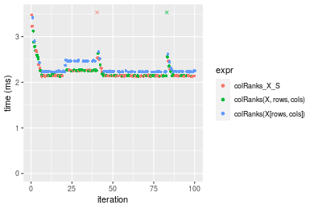

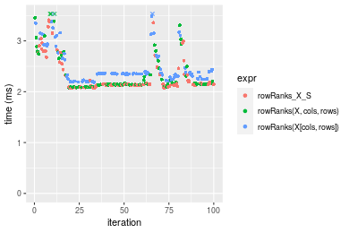
_Table: Benchmarking of colRanks_X_S() and rowRanks_X_S() on double+1000x100 data (original and transposed).  The top panel shows times in milliseconds and the bottom panel shows relative times._


|   |expr         |      min|       lq|     mean|   median|       uq|      max|
|:--|:------------|--------:|--------:|--------:|--------:|--------:|--------:|
|1  |colRanks_X_S | 2.130894| 2.138357| 2.264212| 2.142449| 2.241703| 7.489690|
|2  |rowRanks_X_S | 2.074501| 2.126654| 2.314691| 2.145650| 2.342897| 3.409164|


|   |expr         |       min|        lq|     mean|   median|       uq|       max|
|:--|:------------|---------:|---------:|--------:|--------:|--------:|---------:|
|1  |colRanks_X_S | 1.0000000| 1.0000000| 1.000000| 1.000000| 1.000000| 1.0000000|
|2  |rowRanks_X_S | 0.9735355| 0.9945271| 1.022294| 1.001494| 1.045141| 0.4551809|

_Figure: Benchmarking of colRanks_X_S() and rowRanks_X_S() on double+1000x100 data (original and transposed).  Outliers are displayed as crosses. Times are in milliseconds._


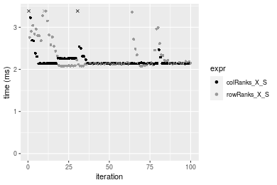


## Appendix

### Session information
```r
R version 4.1.1 Patched (2021-08-10 r80727)
Platform: x86_64-pc-linux-gnu (64-bit)
Running under: Ubuntu 18.04.5 LTS

Matrix products: default
BLAS:   /home/hb/software/R-devel/R-4-1-branch/lib/R/lib/libRblas.so
LAPACK: /home/hb/software/R-devel/R-4-1-branch/lib/R/lib/libRlapack.so

locale:
 [1] LC_CTYPE=en_US.UTF-8       LC_NUMERIC=C              
 [3] LC_TIME=en_US.UTF-8        LC_COLLATE=en_US.UTF-8    
 [5] LC_MONETARY=en_US.UTF-8    LC_MESSAGES=en_US.UTF-8   
 [7] LC_PAPER=en_US.UTF-8       LC_NAME=C                 
 [9] LC_ADDRESS=C               LC_TELEPHONE=C            
[11] LC_MEASUREMENT=en_US.UTF-8 LC_IDENTIFICATION=C       

attached base packages:
[1] stats     graphics  grDevices utils     datasets  methods   base     

other attached packages:
[1] microbenchmark_1.4-7   matrixStats_0.60.1     ggplot2_3.3.5         
[4] knitr_1.33             R.devices_2.17.0       R.utils_2.10.1        
[7] R.oo_1.24.0            R.methodsS3_1.8.1-9001 history_0.0.1-9000    

loaded via a namespace (and not attached):
 [1] Biobase_2.52.0          httr_1.4.2              splines_4.1.1          
 [4] bit64_4.0.5             network_1.17.1          assertthat_0.2.1       
 [7] highr_0.9               stats4_4.1.1            blob_1.2.2             
[10] GenomeInfoDbData_1.2.6  robustbase_0.93-8       pillar_1.6.2           
[13] RSQLite_2.2.8           lattice_0.20-44         glue_1.4.2             
[16] digest_0.6.27           XVector_0.32.0          colorspace_2.0-2       
[19] Matrix_1.3-4            XML_3.99-0.7            pkgconfig_2.0.3        
[22] zlibbioc_1.38.0         genefilter_1.74.0       purrr_0.3.4            
[25] ergm_4.1.2              xtable_1.8-4            scales_1.1.1           
[28] tibble_3.1.4            annotate_1.70.0         KEGGREST_1.32.0        
[31] farver_2.1.0            generics_0.1.0          IRanges_2.26.0         
[34] ellipsis_0.3.2          cachem_1.0.6            withr_2.4.2            
[37] BiocGenerics_0.38.0     mime_0.11               survival_3.2-13        
[40] magrittr_2.0.1          crayon_1.4.1            statnet.common_4.5.0   
[43] memoise_2.0.0           laeken_0.5.1            fansi_0.5.0            
[46] R.cache_0.15.0          MASS_7.3-54             R.rsp_0.44.0           
[49] progressr_0.8.0         tools_4.1.1             lifecycle_1.0.0        
[52] S4Vectors_0.30.0        trust_0.1-8             munsell_0.5.0          
[55] tabby_0.0.1-9001        AnnotationDbi_1.54.1    Biostrings_2.60.2      
[58] compiler_4.1.1          GenomeInfoDb_1.28.1     rlang_0.4.11           
[61] grid_4.1.1              RCurl_1.98-1.4          cwhmisc_6.6            
[64] rappdirs_0.3.3          startup_0.15.0          labeling_0.4.2         
[67] bitops_1.0-7            base64enc_0.1-3         boot_1.3-28            
[70] gtable_0.3.0            DBI_1.1.1               markdown_1.1           
[73] R6_2.5.1                lpSolveAPI_5.5.2.0-17.7 rle_0.9.2              
[76] dplyr_1.0.7             fastmap_1.1.0           bit_4.0.4              
[79] utf8_1.2.2              parallel_4.1.1          Rcpp_1.0.7             
[82] vctrs_0.3.8             png_0.1-7               DEoptimR_1.0-9         
[85] tidyselect_1.1.1        xfun_0.25               coda_0.19-4            
```
Total processing time was 27.19 secs.


### Reproducibility
To reproduce this report, do:
```r
html <- matrixStats:::benchmark('colRowRanks_subset')
```

[RSP]: https://cran.r-project.org/package=R.rsp
[matrixStats]: https://cran.r-project.org/package=matrixStats

[StackOverflow:colMins?]: https://stackoverflow.com/questions/13676878 "Stack Overflow: fastest way to get Min from every column in a matrix?"
[StackOverflow:colSds?]: https://stackoverflow.com/questions/17549762 "Stack Overflow: Is there such 'colsd' in R?"
[StackOverflow:rowProds?]: https://stackoverflow.com/questions/20198801/ "Stack Overflow: Row product of matrix and column sum of matrix"

---------------------------------------
Copyright Dongcan Jiang. Last updated on 2021-08-25 18:14:30 (+0200 UTC). Powered by [RSP].

<script>
 var link = document.createElement('link');
 link.rel = 'icon';
 link.href = "data:image/png;base64,iVBORw0KGgoAAAANSUhEUgAAACAAAAAgCAMAAABEpIrGAAAA21BMVEUAAAAAAP8AAP8AAP8AAP8AAP8AAP8AAP8AAP8AAP8AAP8AAP8AAP8AAP8AAP8AAP8AAP8AAP8AAP8AAP8AAP8AAP8AAP8AAP8AAP8AAP8AAP8AAP8AAP8AAP8AAP8AAP8AAP8AAP8AAP8AAP8AAP8AAP8AAP8AAP8AAP8AAP8BAf4CAv0DA/wdHeIeHuEfH+AgIN8hId4lJdomJtknJ9g+PsE/P8BAQL9yco10dIt1dYp3d4h4eIeVlWqWlmmXl2iYmGeZmWabm2Tn5xjo6Bfp6Rb39wj4+Af//wA2M9hbAAAASXRSTlMAAQIJCgsMJSYnKD4/QGRlZmhpamtsbautrrCxuru8y8zN5ebn6Pn6+///////////////////////////////////////////LsUNcQAAAS9JREFUOI29k21XgkAQhVcFytdSMqMETU26UVqGmpaiFbL//xc1cAhhwVNf6n5i5z67M2dmYOyfJZUqlVLhkKucG7cgmUZTybDz6g0iDeq51PUr37Ds2cy2/C9NeES5puDjxuUk1xnToZsg8pfA3avHQ3lLIi7iWRrkv/OYtkScxBIMgDee0ALoyxHQBJ68JLCjOtQIMIANF7QG9G9fNnHvisCHBVMKgSJgiz7nE+AoBKrAPA3MgepvgR9TSCasrCKH0eB1wBGBFdCO+nAGjMVGPcQb5bd6mQRegN6+1axOs9nGfYcCtfi4NQosdtH7dB+txFIpXQqN1p9B/asRHToyS0jRgpV7nk4nwcq1BJ+x3Gl/v7S9Wmpp/aGquum7w3ZDyrADFYrl8vHBH+ev9AUASW1dmU4h4wAAAABJRU5ErkJggg=="
 document.getElementsByTagName('head')[0].appendChild(link);
</script>


