[matrixStats]: Benchmark report

---------------------------------------


# colTabulates() and rowTabulates() benchmarks on subsetted computation

This report benchmark the performance of colTabulates() and rowTabulates() on subsetted computation.


## Data
```r
> rmatrix <- function(nrow, ncol, mode = c("logical", "double", "integer", "index"), range = c(-100, 
+     +100), na_prob = 0) {
+     mode <- match.arg(mode)
+     n <- nrow * ncol
+     if (mode == "logical") {
+         x <- sample(c(FALSE, TRUE), size = n, replace = TRUE)
+     }     else if (mode == "index") {
+         x <- seq_len(n)
+         mode <- "integer"
+     }     else {
+         x <- runif(n, min = range[1], max = range[2])
+     }
+     storage.mode(x) <- mode
+     if (na_prob > 0) 
+         x[sample(n, size = na_prob * n)] <- NA
+     dim(x) <- c(nrow, ncol)
+     x
+ }
> rmatrices <- function(scale = 10, seed = 1, ...) {
+     set.seed(seed)
+     data <- list()
+     data[[1]] <- rmatrix(nrow = scale * 1, ncol = scale * 1, ...)
+     data[[2]] <- rmatrix(nrow = scale * 10, ncol = scale * 10, ...)
+     data[[3]] <- rmatrix(nrow = scale * 100, ncol = scale * 1, ...)
+     data[[4]] <- t(data[[3]])
+     data[[5]] <- rmatrix(nrow = scale * 10, ncol = scale * 100, ...)
+     data[[6]] <- t(data[[5]])
+     names(data) <- sapply(data, FUN = function(x) paste(dim(x), collapse = "x"))
+     data
+ }
> data <- rmatrices(mode = "integer", range = c(-10, 10))
```

## Results

### 10x10 matrix


```r
> X <- data[["10x10"]]
> rows <- sample.int(nrow(X), size = nrow(X) * 0.7)
> cols <- sample.int(ncol(X), size = ncol(X) * 0.7)
> X_S <- X[rows, cols]
> gc()
           used  (Mb) gc trigger  (Mb) max used  (Mb)
Ncells  5256044 280.8   10014072 534.9 10014072 534.9
Vcells 10110398  77.2   18204443 138.9 18204443 138.9
> colStats <- microbenchmark(colTabulates_X_S = colTabulates(X_S, na.rm = FALSE), `colTabulates(X, rows, cols)` = colTabulates(X, 
+     rows = rows, cols = cols, na.rm = FALSE), `colTabulates(X[rows, cols])` = colTabulates(X[rows, 
+     cols], na.rm = FALSE), unit = "ms")
> X <- t(X)
> X_S <- t(X_S)
> gc()
           used  (Mb) gc trigger  (Mb) max used  (Mb)
Ncells  5242916 280.1   10014072 534.9 10014072 534.9
Vcells 10066348  76.9   18204443 138.9 18204443 138.9
> rowStats <- microbenchmark(rowTabulates_X_S = rowTabulates(X_S, na.rm = FALSE), `rowTabulates(X, cols, rows)` = rowTabulates(X, 
+     rows = cols, cols = rows, na.rm = FALSE), `rowTabulates(X[cols, rows])` = rowTabulates(X[cols, 
+     rows], na.rm = FALSE), unit = "ms")
```

_Table: Benchmarking of colTabulates_X_S(), colTabulates(X, rows, cols)() and colTabulates(X[rows, cols])() on 10x10 data. The top panel shows times in milliseconds and the bottom panel shows relative times._


|   |expr                        |      min|        lq|      mean|    median|        uq|      max|
|:--|:---------------------------|--------:|---------:|---------:|---------:|---------:|--------:|
|3  |colTabulates(X[rows, cols]) | 0.151009| 0.1610185| 0.1809626| 0.1766225| 0.1931910| 0.252638|
|2  |colTabulates(X, rows, cols) | 0.151165| 0.1640640| 0.1847375| 0.1790240| 0.1981055| 0.244262|
|1  |colTabulates_X_S            | 0.149719| 0.1643230| 0.1900001| 0.1792095| 0.1987365| 0.887026|


|   |expr                        |       min|       lq|     mean|   median|       uq|       max|
|:--|:---------------------------|---------:|--------:|--------:|--------:|--------:|---------:|
|3  |colTabulates(X[rows, cols]) | 1.0000000| 1.000000| 1.000000| 1.000000| 1.000000| 1.0000000|
|2  |colTabulates(X, rows, cols) | 1.0010331| 1.018914| 1.020860| 1.013597| 1.025439| 0.9668458|
|1  |colTabulates_X_S            | 0.9914575| 1.020522| 1.049941| 1.014647| 1.028705| 3.5110553|

_Table: Benchmarking of rowTabulates_X_S(), rowTabulates(X, cols, rows)() and rowTabulates(X[cols, rows])() on 10x10 data (transposed). The top panel shows times in milliseconds and the bottom panel shows relative times._


|   |expr                        |      min|        lq|      mean|    median|        uq|      max|
|:--|:---------------------------|--------:|---------:|---------:|---------:|---------:|--------:|
|3  |rowTabulates(X[cols, rows]) | 0.139393| 0.1533665| 0.1676920| 0.1633115| 0.1748370| 0.215074|
|1  |rowTabulates_X_S            | 0.138685| 0.1521220| 0.1723728| 0.1668255| 0.1891935| 0.222001|
|2  |rowTabulates(X, cols, rows) | 0.139782| 0.1534110| 0.1783054| 0.1672140| 0.1836175| 0.854712|


|   |expr                        |       min|        lq|     mean|   median|       uq|      max|
|:--|:---------------------------|---------:|---------:|--------:|--------:|--------:|--------:|
|3  |rowTabulates(X[cols, rows]) | 1.0000000| 1.0000000| 1.000000| 1.000000| 1.000000| 1.000000|
|1  |rowTabulates_X_S            | 0.9949208| 0.9918855| 1.027913| 1.021517| 1.082114| 1.032207|
|2  |rowTabulates(X, cols, rows) | 1.0027907| 1.0002902| 1.063291| 1.023896| 1.050221| 3.974037|

_Figure: Benchmarking of colTabulates_X_S(), colTabulates(X, rows, cols)() and colTabulates(X[rows, cols])() on 10x10 data  as well as rowTabulates_X_S(), rowTabulates(X, cols, rows)() and rowTabulates(X[cols, rows])() on the same data transposed.  Outliers are displayed as crosses.  Times are in milliseconds._


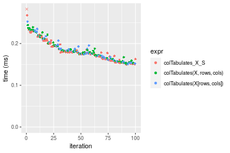

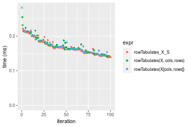
_Table: Benchmarking of colTabulates_X_S() and rowTabulates_X_S() on 10x10 data (original and transposed).  The top panel shows times in milliseconds and the bottom panel shows relative times._


|   |expr             |     min|      lq|     mean|   median|       uq|     max|
|:--|:----------------|-------:|-------:|--------:|--------:|--------:|-------:|
|2  |rowTabulates_X_S | 138.685| 152.122| 172.3728| 166.8255| 189.1935| 222.001|
|1  |colTabulates_X_S | 149.719| 164.323| 190.0001| 179.2095| 198.7365| 887.026|


|   |expr             |      min|       lq|     mean|   median|      uq|      max|
|:--|:----------------|--------:|--------:|--------:|--------:|-------:|--------:|
|2  |rowTabulates_X_S | 1.000000| 1.000000| 1.000000| 1.000000| 1.00000| 1.000000|
|1  |colTabulates_X_S | 1.079562| 1.080205| 1.102263| 1.074233| 1.05044| 3.995595|

_Figure: Benchmarking of colTabulates_X_S() and rowTabulates_X_S() on 10x10 data (original and transposed).  Outliers are displayed as crosses. Times are in milliseconds._


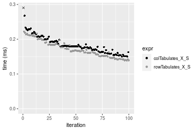

### 100x100 matrix


```r
> X <- data[["100x100"]]
> rows <- sample.int(nrow(X), size = nrow(X) * 0.7)
> cols <- sample.int(ncol(X), size = ncol(X) * 0.7)
> X_S <- X[rows, cols]
> gc()
          used  (Mb) gc trigger  (Mb) max used  (Mb)
Ncells 5242483 280.0   10014072 534.9 10014072 534.9
Vcells 9736847  74.3   18204443 138.9 18204443 138.9
> colStats <- microbenchmark(colTabulates_X_S = colTabulates(X_S, na.rm = FALSE), `colTabulates(X, rows, cols)` = colTabulates(X, 
+     rows = rows, cols = cols, na.rm = FALSE), `colTabulates(X[rows, cols])` = colTabulates(X[rows, 
+     cols], na.rm = FALSE), unit = "ms")
> X <- t(X)
> X_S <- t(X_S)
> gc()
          used  (Mb) gc trigger  (Mb) max used  (Mb)
Ncells 5242459 280.0   10014072 534.9 10014072 534.9
Vcells 9741900  74.4   18204443 138.9 18204443 138.9
> rowStats <- microbenchmark(rowTabulates_X_S = rowTabulates(X_S, na.rm = FALSE), `rowTabulates(X, cols, rows)` = rowTabulates(X, 
+     rows = cols, cols = rows, na.rm = FALSE), `rowTabulates(X[cols, rows])` = rowTabulates(X[cols, 
+     rows], na.rm = FALSE), unit = "ms")
```

_Table: Benchmarking of colTabulates_X_S(), colTabulates(X, rows, cols)() and colTabulates(X[rows, cols])() on 100x100 data. The top panel shows times in milliseconds and the bottom panel shows relative times._


|   |expr                        |      min|        lq|      mean|    median|        uq|      max|
|:--|:---------------------------|--------:|---------:|---------:|---------:|---------:|--------:|
|1  |colTabulates_X_S            | 0.522317| 0.5275005| 0.5729339| 0.5312860| 0.5716865| 0.861498|
|2  |colTabulates(X, rows, cols) | 0.530816| 0.5371605| 0.5809852| 0.5400515| 0.5773740| 0.911449|
|3  |colTabulates(X[rows, cols]) | 0.531373| 0.5374220| 0.5875828| 0.5417020| 0.5973690| 1.058547|


|   |expr                        |      min|       lq|     mean|   median|       uq|      max|
|:--|:---------------------------|--------:|--------:|--------:|--------:|--------:|--------:|
|1  |colTabulates_X_S            | 1.000000| 1.000000| 1.000000| 1.000000| 1.000000| 1.000000|
|2  |colTabulates(X, rows, cols) | 1.016272| 1.018313| 1.014053| 1.016499| 1.009949| 1.057982|
|3  |colTabulates(X[rows, cols]) | 1.017338| 1.018809| 1.025568| 1.019605| 1.044924| 1.228728|

_Table: Benchmarking of rowTabulates_X_S(), rowTabulates(X, cols, rows)() and rowTabulates(X[cols, rows])() on 100x100 data (transposed). The top panel shows times in milliseconds and the bottom panel shows relative times._


|   |expr                        |      min|        lq|      mean|    median|        uq|      max|
|:--|:---------------------------|--------:|---------:|---------:|---------:|---------:|--------:|
|1  |rowTabulates_X_S            | 0.446488| 0.4499495| 0.5033332| 0.4552435| 0.5295020| 0.760410|
|3  |rowTabulates(X[cols, rows]) | 0.453621| 0.4575675| 0.4970904| 0.4600420| 0.5046835| 0.758181|
|2  |rowTabulates(X, cols, rows) | 0.452757| 0.4578215| 0.5032538| 0.4616400| 0.5106520| 0.923905|


|   |expr                        |      min|       lq|      mean|   median|        uq|       max|
|:--|:---------------------------|--------:|--------:|---------:|--------:|---------:|---------:|
|1  |rowTabulates_X_S            | 1.000000| 1.000000| 1.0000000| 1.000000| 1.0000000| 1.0000000|
|3  |rowTabulates(X[cols, rows]) | 1.015976| 1.016931| 0.9875970| 1.010541| 0.9531286| 0.9970687|
|2  |rowTabulates(X, cols, rows) | 1.014041| 1.017495| 0.9998421| 1.014051| 0.9644005| 1.2150090|

_Figure: Benchmarking of colTabulates_X_S(), colTabulates(X, rows, cols)() and colTabulates(X[rows, cols])() on 100x100 data  as well as rowTabulates_X_S(), rowTabulates(X, cols, rows)() and rowTabulates(X[cols, rows])() on the same data transposed.  Outliers are displayed as crosses.  Times are in milliseconds._


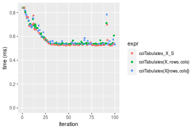

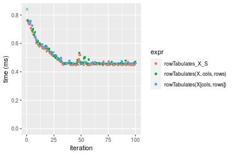
_Table: Benchmarking of colTabulates_X_S() and rowTabulates_X_S() on 100x100 data (original and transposed).  The top panel shows times in milliseconds and the bottom panel shows relative times._


|   |expr             |     min|       lq|     mean|   median|       uq|     max|
|:--|:----------------|-------:|--------:|--------:|--------:|--------:|-------:|
|2  |rowTabulates_X_S | 446.488| 449.9495| 503.3332| 455.2435| 529.5020| 760.410|
|1  |colTabulates_X_S | 522.317| 527.5005| 572.9339| 531.2860| 571.6865| 861.498|


|   |expr             |      min|       lq|    mean|   median|       uq|      max|
|:--|:----------------|--------:|--------:|-------:|--------:|--------:|--------:|
|2  |rowTabulates_X_S | 1.000000| 1.000000| 1.00000| 1.000000| 1.000000| 1.000000|
|1  |colTabulates_X_S | 1.169834| 1.172355| 1.13828| 1.167037| 1.079668| 1.132939|

_Figure: Benchmarking of colTabulates_X_S() and rowTabulates_X_S() on 100x100 data (original and transposed).  Outliers are displayed as crosses. Times are in milliseconds._


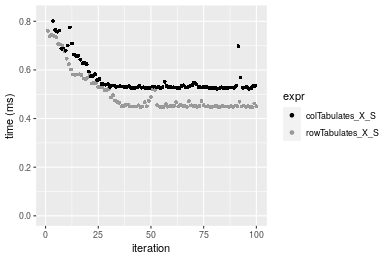

### 1000x10 matrix


```r
> X <- data[["1000x10"]]
> rows <- sample.int(nrow(X), size = nrow(X) * 0.7)
> cols <- sample.int(ncol(X), size = ncol(X) * 0.7)
> X_S <- X[rows, cols]
> gc()
          used  (Mb) gc trigger  (Mb) max used  (Mb)
Ncells 5243225 280.1   10014072 534.9 10014072 534.9
Vcells 9740893  74.4   18204443 138.9 18204443 138.9
> colStats <- microbenchmark(colTabulates_X_S = colTabulates(X_S, na.rm = FALSE), `colTabulates(X, rows, cols)` = colTabulates(X, 
+     rows = rows, cols = cols, na.rm = FALSE), `colTabulates(X[rows, cols])` = colTabulates(X[rows, 
+     cols], na.rm = FALSE), unit = "ms")
> X <- t(X)
> X_S <- t(X_S)
> gc()
          used  (Mb) gc trigger  (Mb) max used  (Mb)
Ncells 5243201 280.1   10014072 534.9 10014072 534.9
Vcells 9745946  74.4   18204443 138.9 18204443 138.9
> rowStats <- microbenchmark(rowTabulates_X_S = rowTabulates(X_S, na.rm = FALSE), `rowTabulates(X, cols, rows)` = rowTabulates(X, 
+     rows = cols, cols = rows, na.rm = FALSE), `rowTabulates(X[cols, rows])` = rowTabulates(X[cols, 
+     rows], na.rm = FALSE), unit = "ms")
```

_Table: Benchmarking of colTabulates_X_S(), colTabulates(X, rows, cols)() and colTabulates(X[rows, cols])() on 1000x10 data. The top panel shows times in milliseconds and the bottom panel shows relative times._


|   |expr                        |      min|        lq|      mean|    median|        uq|      max|
|:--|:---------------------------|--------:|---------:|---------:|---------:|---------:|--------:|
|1  |colTabulates_X_S            | 0.499478| 0.5029295| 0.5436228| 0.5055335| 0.5492720| 0.838090|
|2  |colTabulates(X, rows, cols) | 0.508259| 0.5124580| 0.5486142| 0.5147820| 0.5320350| 0.863078|
|3  |colTabulates(X[rows, cols]) | 0.509271| 0.5122330| 0.5532272| 0.5148910| 0.5553895| 1.001522|


|   |expr                        |      min|       lq|     mean|   median|        uq|      max|
|:--|:---------------------------|--------:|--------:|--------:|--------:|---------:|--------:|
|1  |colTabulates_X_S            | 1.000000| 1.000000| 1.000000| 1.000000| 1.0000000| 1.000000|
|2  |colTabulates(X, rows, cols) | 1.017580| 1.018946| 1.009182| 1.018295| 0.9686185| 1.029815|
|3  |colTabulates(X[rows, cols]) | 1.019607| 1.018499| 1.017667| 1.018510| 1.0111375| 1.195005|

_Table: Benchmarking of rowTabulates_X_S(), rowTabulates(X, cols, rows)() and rowTabulates(X[cols, rows])() on 1000x10 data (transposed). The top panel shows times in milliseconds and the bottom panel shows relative times._


|   |expr                        |      min|        lq|      mean|    median|        uq|      max|
|:--|:---------------------------|--------:|---------:|---------:|---------:|---------:|--------:|
|1  |rowTabulates_X_S            | 0.455789| 0.4587940| 0.4922219| 0.4609715| 0.4773135| 0.749875|
|3  |rowTabulates(X[cols, rows]) | 0.464902| 0.4692515| 0.5015481| 0.4714010| 0.5081000| 0.936767|
|2  |rowTabulates(X, cols, rows) | 0.465717| 0.4693890| 0.5020811| 0.4723345| 0.5120115| 0.687687|


|   |expr                        |      min|       lq|     mean|   median|       uq|       max|
|:--|:---------------------------|--------:|--------:|--------:|--------:|--------:|---------:|
|1  |rowTabulates_X_S            | 1.000000| 1.000000| 1.000000| 1.000000| 1.000000| 1.0000000|
|3  |rowTabulates(X[cols, rows]) | 1.019994| 1.022793| 1.018947| 1.022625| 1.064499| 1.2492309|
|2  |rowTabulates(X, cols, rows) | 1.021782| 1.023093| 1.020030| 1.024650| 1.072694| 0.9170688|

_Figure: Benchmarking of colTabulates_X_S(), colTabulates(X, rows, cols)() and colTabulates(X[rows, cols])() on 1000x10 data  as well as rowTabulates_X_S(), rowTabulates(X, cols, rows)() and rowTabulates(X[cols, rows])() on the same data transposed.  Outliers are displayed as crosses.  Times are in milliseconds._


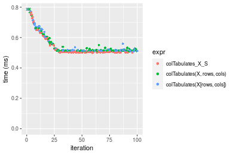

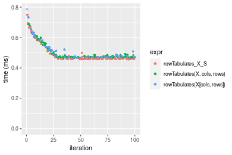
_Table: Benchmarking of colTabulates_X_S() and rowTabulates_X_S() on 1000x10 data (original and transposed).  The top panel shows times in milliseconds and the bottom panel shows relative times._


|   |expr             |     min|       lq|     mean|   median|       uq|     max|
|:--|:----------------|-------:|--------:|--------:|--------:|--------:|-------:|
|2  |rowTabulates_X_S | 455.789| 458.7940| 492.2219| 460.9715| 477.3135| 749.875|
|1  |colTabulates_X_S | 499.478| 502.9295| 543.6228| 505.5335| 549.2720| 838.090|


|   |expr             |      min|       lq|     mean|  median|       uq|     max|
|:--|:----------------|--------:|--------:|--------:|-------:|--------:|-------:|
|2  |rowTabulates_X_S | 1.000000| 1.000000| 1.000000| 1.00000| 1.000000| 1.00000|
|1  |colTabulates_X_S | 1.095854| 1.096199| 1.104426| 1.09667| 1.150757| 1.11764|

_Figure: Benchmarking of colTabulates_X_S() and rowTabulates_X_S() on 1000x10 data (original and transposed).  Outliers are displayed as crosses. Times are in milliseconds._


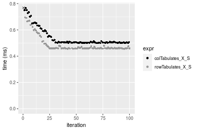

### 10x1000 matrix


```r
> X <- data[["10x1000"]]
> rows <- sample.int(nrow(X), size = nrow(X) * 0.7)
> cols <- sample.int(ncol(X), size = ncol(X) * 0.7)
> X_S <- X[rows, cols]
> gc()
          used  (Mb) gc trigger  (Mb) max used  (Mb)
Ncells 5243430 280.1   10014072 534.9 10014072 534.9
Vcells 9741815  74.4   18204443 138.9 18204443 138.9
> colStats <- microbenchmark(colTabulates_X_S = colTabulates(X_S, na.rm = FALSE), `colTabulates(X, rows, cols)` = colTabulates(X, 
+     rows = rows, cols = cols, na.rm = FALSE), `colTabulates(X[rows, cols])` = colTabulates(X[rows, 
+     cols], na.rm = FALSE), unit = "ms")
> X <- t(X)
> X_S <- t(X_S)
> gc()
          used  (Mb) gc trigger  (Mb) max used  (Mb)
Ncells 5243406 280.1   10014072 534.9 10014072 534.9
Vcells 9746868  74.4   18204443 138.9 18204443 138.9
> rowStats <- microbenchmark(rowTabulates_X_S = rowTabulates(X_S, na.rm = FALSE), `rowTabulates(X, cols, rows)` = rowTabulates(X, 
+     rows = cols, cols = rows, na.rm = FALSE), `rowTabulates(X[cols, rows])` = rowTabulates(X[cols, 
+     rows], na.rm = FALSE), unit = "ms")
```

_Table: Benchmarking of colTabulates_X_S(), colTabulates(X, rows, cols)() and colTabulates(X[rows, cols])() on 10x1000 data. The top panel shows times in milliseconds and the bottom panel shows relative times._


|   |expr                        |      min|        lq|      mean|   median|        uq|      max|
|:--|:---------------------------|--------:|---------:|---------:|--------:|---------:|--------:|
|1  |colTabulates_X_S            | 0.614965| 0.6211175| 0.6903914| 0.629071| 0.7397655| 1.182354|
|3  |colTabulates(X[rows, cols]) | 0.622942| 0.6296670| 0.6949086| 0.635966| 0.7583885| 1.028045|
|2  |colTabulates(X, rows, cols) | 0.624179| 0.6299115| 0.7658446| 0.636375| 0.7580595| 8.022479|


|   |expr                        |      min|       lq|     mean|   median|       uq|      max|
|:--|:---------------------------|--------:|--------:|--------:|--------:|--------:|--------:|
|1  |colTabulates_X_S            | 1.000000| 1.000000| 1.000000| 1.000000| 1.000000| 1.000000|
|3  |colTabulates(X[rows, cols]) | 1.012971| 1.013765| 1.006543| 1.010961| 1.025174| 0.869490|
|2  |colTabulates(X, rows, cols) | 1.014983| 1.014158| 1.109290| 1.011611| 1.024730| 6.785175|

_Table: Benchmarking of rowTabulates_X_S(), rowTabulates(X, cols, rows)() and rowTabulates(X[cols, rows])() on 10x1000 data (transposed). The top panel shows times in milliseconds and the bottom panel shows relative times._


|   |expr                        |      min|        lq|      mean|    median|        uq|      max|
|:--|:---------------------------|--------:|---------:|---------:|---------:|---------:|--------:|
|1  |rowTabulates_X_S            | 0.474173| 0.4805480| 0.5327155| 0.4909510| 0.5676800| 0.810492|
|2  |rowTabulates(X, cols, rows) | 0.485647| 0.4899650| 0.6115058| 0.4974925| 0.5903175| 7.559936|
|3  |rowTabulates(X[cols, rows]) | 0.486574| 0.4903195| 0.5489115| 0.5053585| 0.6058915| 0.819504|


|   |expr                        |      min|       lq|     mean|   median|       uq|      max|
|:--|:---------------------------|--------:|--------:|--------:|--------:|--------:|--------:|
|1  |rowTabulates_X_S            | 1.000000| 1.000000| 1.000000| 1.000000| 1.000000| 1.000000|
|2  |rowTabulates(X, cols, rows) | 1.024198| 1.019596| 1.147903| 1.013324| 1.039877| 9.327589|
|3  |rowTabulates(X[cols, rows]) | 1.026153| 1.020334| 1.030403| 1.029346| 1.067312| 1.011119|

_Figure: Benchmarking of colTabulates_X_S(), colTabulates(X, rows, cols)() and colTabulates(X[rows, cols])() on 10x1000 data  as well as rowTabulates_X_S(), rowTabulates(X, cols, rows)() and rowTabulates(X[cols, rows])() on the same data transposed.  Outliers are displayed as crosses.  Times are in milliseconds._


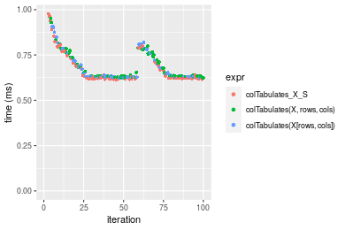

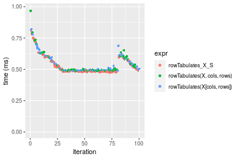
_Table: Benchmarking of colTabulates_X_S() and rowTabulates_X_S() on 10x1000 data (original and transposed).  The top panel shows times in milliseconds and the bottom panel shows relative times._


|   |expr             |     min|       lq|     mean|  median|       uq|      max|
|:--|:----------------|-------:|--------:|--------:|-------:|--------:|--------:|
|2  |rowTabulates_X_S | 474.173| 480.5480| 532.7155| 490.951| 567.6800|  810.492|
|1  |colTabulates_X_S | 614.965| 621.1175| 690.3914| 629.071| 739.7655| 1182.354|


|   |expr             |      min|       lq|     mean|   median|       uq|     max|
|:--|:----------------|--------:|--------:|--------:|--------:|--------:|-------:|
|2  |rowTabulates_X_S | 1.000000| 1.000000| 1.000000| 1.000000| 1.000000| 1.00000|
|1  |colTabulates_X_S | 1.296921| 1.292519| 1.295985| 1.281332| 1.303138| 1.45881|

_Figure: Benchmarking of colTabulates_X_S() and rowTabulates_X_S() on 10x1000 data (original and transposed).  Outliers are displayed as crosses. Times are in milliseconds._


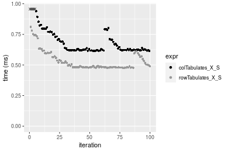

### 100x1000 matrix


```r
> X <- data[["100x1000"]]
> rows <- sample.int(nrow(X), size = nrow(X) * 0.7)
> cols <- sample.int(ncol(X), size = ncol(X) * 0.7)
> X_S <- X[rows, cols]
> gc()
          used  (Mb) gc trigger  (Mb) max used  (Mb)
Ncells 5243642 280.1   10014072 534.9 10014072 534.9
Vcells 9764520  74.5   18204443 138.9 18204443 138.9
> colStats <- microbenchmark(colTabulates_X_S = colTabulates(X_S, na.rm = FALSE), `colTabulates(X, rows, cols)` = colTabulates(X, 
+     rows = rows, cols = cols, na.rm = FALSE), `colTabulates(X[rows, cols])` = colTabulates(X[rows, 
+     cols], na.rm = FALSE), unit = "ms")
> X <- t(X)
> X_S <- t(X_S)
> gc()
          used  (Mb) gc trigger  (Mb) max used  (Mb)
Ncells 5243618 280.1   10014072 534.9 10014072 534.9
Vcells 9814573  74.9   18204443 138.9 18204443 138.9
> rowStats <- microbenchmark(rowTabulates_X_S = rowTabulates(X_S, na.rm = FALSE), `rowTabulates(X, cols, rows)` = rowTabulates(X, 
+     rows = cols, cols = rows, na.rm = FALSE), `rowTabulates(X[cols, rows])` = rowTabulates(X[cols, 
+     rows], na.rm = FALSE), unit = "ms")
```

_Table: Benchmarking of colTabulates_X_S(), colTabulates(X, rows, cols)() and colTabulates(X[rows, cols])() on 100x1000 data. The top panel shows times in milliseconds and the bottom panel shows relative times._


|   |expr                        |      min|       lq|     mean|   median|       uq|       max|
|:--|:---------------------------|--------:|--------:|--------:|--------:|--------:|---------:|
|1  |colTabulates_X_S            | 3.759400| 3.780391| 4.035043| 3.800411| 3.841439| 10.823046|
|3  |colTabulates(X[rows, cols]) | 3.836896| 3.852677| 4.027414| 3.873057| 3.947249|  9.741157|
|2  |colTabulates(X, rows, cols) | 3.835721| 3.856041| 4.139364| 3.880559| 3.969575| 10.716803|


|   |expr                        |      min|       lq|      mean|   median|       uq|       max|
|:--|:---------------------------|--------:|--------:|---------:|--------:|--------:|---------:|
|1  |colTabulates_X_S            | 1.000000| 1.000000| 1.0000000| 1.000000| 1.000000| 1.0000000|
|3  |colTabulates(X[rows, cols]) | 1.020614| 1.019121| 0.9981092| 1.019115| 1.027544| 0.9000384|
|2  |colTabulates(X, rows, cols) | 1.020301| 1.020011| 1.0258537| 1.021089| 1.033356| 0.9901836|

_Table: Benchmarking of rowTabulates_X_S(), rowTabulates(X, cols, rows)() and rowTabulates(X[cols, rows])() on 100x1000 data (transposed). The top panel shows times in milliseconds and the bottom panel shows relative times._


|   |expr                        |      min|       lq|     mean|   median|       uq|       max|
|:--|:---------------------------|--------:|--------:|--------:|--------:|--------:|---------:|
|1  |rowTabulates_X_S            | 3.014200| 3.066573| 3.469396| 3.152881| 3.272551| 15.835145|
|2  |rowTabulates(X, cols, rows) | 3.087744| 3.167903| 3.392660| 3.244073| 3.379069|  9.809676|
|3  |rowTabulates(X[cols, rows]) | 3.082890| 3.166672| 3.537586| 3.248928| 3.391440|  9.527255|


|   |expr                        |      min|       lq|      mean|   median|       uq|       max|
|:--|:---------------------------|--------:|--------:|---------:|--------:|--------:|---------:|
|1  |rowTabulates_X_S            | 1.000000| 1.000000| 1.0000000| 1.000000| 1.000000| 1.0000000|
|2  |rowTabulates(X, cols, rows) | 1.024399| 1.033043| 0.9778822| 1.028924| 1.032549| 0.6194876|
|3  |rowTabulates(X[cols, rows]) | 1.022789| 1.032642| 1.0196547| 1.030463| 1.036329| 0.6016525|

_Figure: Benchmarking of colTabulates_X_S(), colTabulates(X, rows, cols)() and colTabulates(X[rows, cols])() on 100x1000 data  as well as rowTabulates_X_S(), rowTabulates(X, cols, rows)() and rowTabulates(X[cols, rows])() on the same data transposed.  Outliers are displayed as crosses.  Times are in milliseconds._


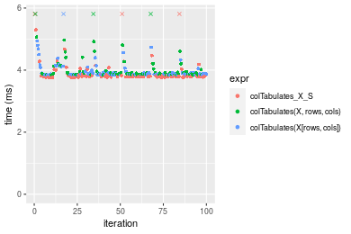

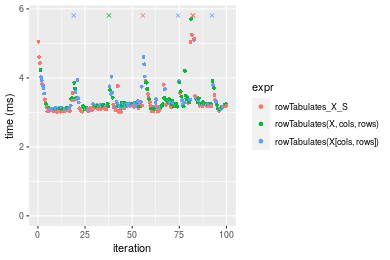
_Table: Benchmarking of colTabulates_X_S() and rowTabulates_X_S() on 100x1000 data (original and transposed).  The top panel shows times in milliseconds and the bottom panel shows relative times._


|   |expr             |    min|       lq|     mean|   median|       uq|      max|
|:--|:----------------|------:|--------:|--------:|--------:|--------:|--------:|
|2  |rowTabulates_X_S | 3.0142| 3.066573| 3.469396| 3.152881| 3.272551| 15.83515|
|1  |colTabulates_X_S | 3.7594| 3.780391| 4.035043| 3.800411| 3.841439| 10.82305|


|   |expr             |     min|       lq|     mean|   median|       uq|       max|
|:--|:----------------|-------:|--------:|--------:|--------:|--------:|---------:|
|2  |rowTabulates_X_S | 1.00000| 1.000000| 1.000000| 1.000000| 1.000000| 1.0000000|
|1  |colTabulates_X_S | 1.24723| 1.232774| 1.163039| 1.205377| 1.173836| 0.6834826|

_Figure: Benchmarking of colTabulates_X_S() and rowTabulates_X_S() on 100x1000 data (original and transposed).  Outliers are displayed as crosses. Times are in milliseconds._


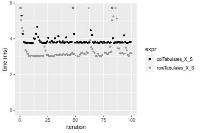

### 1000x100 matrix


```r
> X <- data[["1000x100"]]
> rows <- sample.int(nrow(X), size = nrow(X) * 0.7)
> cols <- sample.int(ncol(X), size = ncol(X) * 0.7)
> X_S <- X[rows, cols]
> gc()
          used  (Mb) gc trigger  (Mb) max used  (Mb)
Ncells 5243855 280.1   10014072 534.9 10014072 534.9
Vcells 9765323  74.6   18204443 138.9 18204443 138.9
> colStats <- microbenchmark(colTabulates_X_S = colTabulates(X_S, na.rm = FALSE), `colTabulates(X, rows, cols)` = colTabulates(X, 
+     rows = rows, cols = cols, na.rm = FALSE), `colTabulates(X[rows, cols])` = colTabulates(X[rows, 
+     cols], na.rm = FALSE), unit = "ms")
> X <- t(X)
> X_S <- t(X_S)
> gc()
          used  (Mb) gc trigger  (Mb) max used  (Mb)
Ncells 5243831 280.1   10014072 534.9 10014072 534.9
Vcells 9815376  74.9   18204443 138.9 18204443 138.9
> rowStats <- microbenchmark(rowTabulates_X_S = rowTabulates(X_S, na.rm = FALSE), `rowTabulates(X, cols, rows)` = rowTabulates(X, 
+     rows = cols, cols = rows, na.rm = FALSE), `rowTabulates(X[cols, rows])` = rowTabulates(X[cols, 
+     rows], na.rm = FALSE), unit = "ms")
```

_Table: Benchmarking of colTabulates_X_S(), colTabulates(X, rows, cols)() and colTabulates(X[rows, cols])() on 1000x100 data. The top panel shows times in milliseconds and the bottom panel shows relative times._


|   |expr                        |      min|       lq|     mean|   median|       uq|      max|
|:--|:---------------------------|--------:|--------:|--------:|--------:|--------:|--------:|
|1  |colTabulates_X_S            | 3.588208| 3.612041| 3.864418| 3.655861| 3.798428| 10.54866|
|2  |colTabulates(X, rows, cols) | 3.666814| 3.680913| 3.924507| 3.723051| 3.889658| 10.51650|
|3  |colTabulates(X[rows, cols]) | 3.664411| 3.682879| 4.003330| 3.727177| 3.998614| 10.32995|


|   |expr                        |      min|       lq|     mean|   median|       uq|       max|
|:--|:---------------------------|--------:|--------:|--------:|--------:|--------:|---------:|
|1  |colTabulates_X_S            | 1.000000| 1.000000| 1.000000| 1.000000| 1.000000| 1.0000000|
|2  |colTabulates(X, rows, cols) | 1.021907| 1.019068| 1.015549| 1.018379| 1.024018| 0.9969512|
|3  |colTabulates(X[rows, cols]) | 1.021237| 1.019612| 1.035946| 1.019507| 1.052702| 0.9792672|

_Table: Benchmarking of rowTabulates_X_S(), rowTabulates(X, cols, rows)() and rowTabulates(X[cols, rows])() on 1000x100 data (transposed). The top panel shows times in milliseconds and the bottom panel shows relative times._


|   |expr                        |      min|       lq|     mean|   median|       uq|      max|
|:--|:---------------------------|--------:|--------:|--------:|--------:|--------:|--------:|
|1  |rowTabulates_X_S            | 3.050377| 3.214294| 3.647955| 3.239802| 3.438365| 9.529411|
|3  |rowTabulates(X[cols, rows]) | 3.128312| 3.239903| 3.479604| 3.309030| 3.409248| 5.946195|
|2  |rowTabulates(X, cols, rows) | 3.133778| 3.301239| 3.570663| 3.327745| 3.515243| 9.570654|


|   |expr                        |      min|       lq|      mean|   median|        uq|       max|
|:--|:---------------------------|--------:|--------:|---------:|--------:|---------:|---------:|
|1  |rowTabulates_X_S            | 1.000000| 1.000000| 1.0000000| 1.000000| 1.0000000| 1.0000000|
|3  |rowTabulates(X[cols, rows]) | 1.025549| 1.007967| 0.9538507| 1.021368| 0.9915319| 0.6239835|
|2  |rowTabulates(X, cols, rows) | 1.027341| 1.027049| 0.9788123| 1.027144| 1.0223590| 1.0043280|

_Figure: Benchmarking of colTabulates_X_S(), colTabulates(X, rows, cols)() and colTabulates(X[rows, cols])() on 1000x100 data  as well as rowTabulates_X_S(), rowTabulates(X, cols, rows)() and rowTabulates(X[cols, rows])() on the same data transposed.  Outliers are displayed as crosses.  Times are in milliseconds._


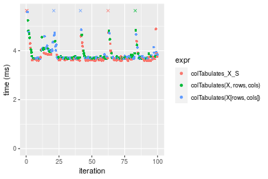

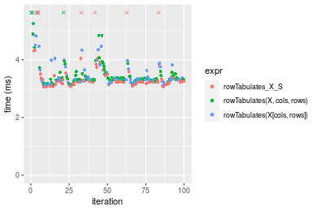
_Table: Benchmarking of colTabulates_X_S() and rowTabulates_X_S() on 1000x100 data (original and transposed).  The top panel shows times in milliseconds and the bottom panel shows relative times._


|   |expr             |      min|       lq|     mean|   median|       uq|       max|
|:--|:----------------|--------:|--------:|--------:|--------:|--------:|---------:|
|2  |rowTabulates_X_S | 3.050377| 3.214294| 3.647955| 3.239802| 3.438365|  9.529411|
|1  |colTabulates_X_S | 3.588208| 3.612041| 3.864418| 3.655861| 3.798428| 10.548658|


|   |expr             |      min|       lq|     mean|   median|       uq|      max|
|:--|:----------------|--------:|--------:|--------:|--------:|--------:|--------:|
|2  |rowTabulates_X_S | 1.000000| 1.000000| 1.000000| 1.000000| 1.000000| 1.000000|
|1  |colTabulates_X_S | 1.176316| 1.123743| 1.059338| 1.128421| 1.104719| 1.106958|

_Figure: Benchmarking of colTabulates_X_S() and rowTabulates_X_S() on 1000x100 data (original and transposed).  Outliers are displayed as crosses. Times are in milliseconds._


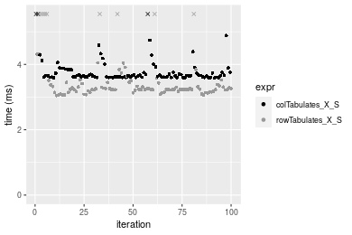


## Appendix

### Session information
```r
R version 4.1.1 Patched (2021-08-10 r80727)
Platform: x86_64-pc-linux-gnu (64-bit)
Running under: Ubuntu 18.04.5 LTS

Matrix products: default
BLAS:   /home/hb/software/R-devel/R-4-1-branch/lib/R/lib/libRblas.so
LAPACK: /home/hb/software/R-devel/R-4-1-branch/lib/R/lib/libRlapack.so

locale:
 [1] LC_CTYPE=en_US.UTF-8       LC_NUMERIC=C              
 [3] LC_TIME=en_US.UTF-8        LC_COLLATE=en_US.UTF-8    
 [5] LC_MONETARY=en_US.UTF-8    LC_MESSAGES=en_US.UTF-8   
 [7] LC_PAPER=en_US.UTF-8       LC_NAME=C                 
 [9] LC_ADDRESS=C               LC_TELEPHONE=C            
[11] LC_MEASUREMENT=en_US.UTF-8 LC_IDENTIFICATION=C       

attached base packages:
[1] stats     graphics  grDevices utils     datasets  methods   base     

other attached packages:
[1] microbenchmark_1.4-7   matrixStats_0.60.1     ggplot2_3.3.5         
[4] knitr_1.33             R.devices_2.17.0       R.utils_2.10.1        
[7] R.oo_1.24.0            R.methodsS3_1.8.1-9001 history_0.0.1-9000    

loaded via a namespace (and not attached):
 [1] Biobase_2.52.0          httr_1.4.2              splines_4.1.1          
 [4] bit64_4.0.5             network_1.17.1          assertthat_0.2.1       
 [7] highr_0.9               stats4_4.1.1            blob_1.2.2             
[10] GenomeInfoDbData_1.2.6  robustbase_0.93-8       pillar_1.6.2           
[13] RSQLite_2.2.8           lattice_0.20-44         glue_1.4.2             
[16] digest_0.6.27           XVector_0.32.0          colorspace_2.0-2       
[19] Matrix_1.3-4            XML_3.99-0.7            pkgconfig_2.0.3        
[22] zlibbioc_1.38.0         genefilter_1.74.0       purrr_0.3.4            
[25] ergm_4.1.2              xtable_1.8-4            scales_1.1.1           
[28] tibble_3.1.4            annotate_1.70.0         KEGGREST_1.32.0        
[31] farver_2.1.0            generics_0.1.0          IRanges_2.26.0         
[34] ellipsis_0.3.2          cachem_1.0.6            withr_2.4.2            
[37] BiocGenerics_0.38.0     mime_0.11               survival_3.2-13        
[40] magrittr_2.0.1          crayon_1.4.1            statnet.common_4.5.0   
[43] memoise_2.0.0           laeken_0.5.1            fansi_0.5.0            
[46] R.cache_0.15.0          MASS_7.3-54             R.rsp_0.44.0           
[49] progressr_0.8.0         tools_4.1.1             lifecycle_1.0.0        
[52] S4Vectors_0.30.0        trust_0.1-8             munsell_0.5.0          
[55] tabby_0.0.1-9001        AnnotationDbi_1.54.1    Biostrings_2.60.2      
[58] compiler_4.1.1          GenomeInfoDb_1.28.1     rlang_0.4.11           
[61] grid_4.1.1              RCurl_1.98-1.4          cwhmisc_6.6            
[64] rappdirs_0.3.3          startup_0.15.0          labeling_0.4.2         
[67] bitops_1.0-7            base64enc_0.1-3         boot_1.3-28            
[70] gtable_0.3.0            DBI_1.1.1               markdown_1.1           
[73] R6_2.5.1                lpSolveAPI_5.5.2.0-17.7 rle_0.9.2              
[76] dplyr_1.0.7             fastmap_1.1.0           bit_4.0.4              
[79] utf8_1.2.2              parallel_4.1.1          Rcpp_1.0.7             
[82] vctrs_0.3.8             png_0.1-7               DEoptimR_1.0-9         
[85] tidyselect_1.1.1        xfun_0.25               coda_0.19-4            
```
Total processing time was 17.36 secs.


### Reproducibility
To reproduce this report, do:
```r
html <- matrixStats:::benchmark('colRowTabulates_subset')
```

[RSP]: https://cran.r-project.org/package=R.rsp
[matrixStats]: https://cran.r-project.org/package=matrixStats

[StackOverflow:colMins?]: https://stackoverflow.com/questions/13676878 "Stack Overflow: fastest way to get Min from every column in a matrix?"
[StackOverflow:colSds?]: https://stackoverflow.com/questions/17549762 "Stack Overflow: Is there such 'colsd' in R?"
[StackOverflow:rowProds?]: https://stackoverflow.com/questions/20198801/ "Stack Overflow: Row product of matrix and column sum of matrix"

---------------------------------------
Copyright Dongcan Jiang. Last updated on 2021-08-25 18:16:28 (+0200 UTC). Powered by [RSP].

<script>
 var link = document.createElement('link');
 link.rel = 'icon';
 link.href = "data:image/png;base64,iVBORw0KGgoAAAANSUhEUgAAACAAAAAgCAMAAABEpIrGAAAA21BMVEUAAAAAAP8AAP8AAP8AAP8AAP8AAP8AAP8AAP8AAP8AAP8AAP8AAP8AAP8AAP8AAP8AAP8AAP8AAP8AAP8AAP8AAP8AAP8AAP8AAP8AAP8AAP8AAP8AAP8AAP8AAP8AAP8AAP8AAP8AAP8AAP8AAP8AAP8AAP8AAP8AAP8AAP8BAf4CAv0DA/wdHeIeHuEfH+AgIN8hId4lJdomJtknJ9g+PsE/P8BAQL9yco10dIt1dYp3d4h4eIeVlWqWlmmXl2iYmGeZmWabm2Tn5xjo6Bfp6Rb39wj4+Af//wA2M9hbAAAASXRSTlMAAQIJCgsMJSYnKD4/QGRlZmhpamtsbautrrCxuru8y8zN5ebn6Pn6+///////////////////////////////////////////LsUNcQAAAS9JREFUOI29k21XgkAQhVcFytdSMqMETU26UVqGmpaiFbL//xc1cAhhwVNf6n5i5z67M2dmYOyfJZUqlVLhkKucG7cgmUZTybDz6g0iDeq51PUr37Ds2cy2/C9NeES5puDjxuUk1xnToZsg8pfA3avHQ3lLIi7iWRrkv/OYtkScxBIMgDee0ALoyxHQBJ68JLCjOtQIMIANF7QG9G9fNnHvisCHBVMKgSJgiz7nE+AoBKrAPA3MgepvgR9TSCasrCKH0eB1wBGBFdCO+nAGjMVGPcQb5bd6mQRegN6+1axOs9nGfYcCtfi4NQosdtH7dB+txFIpXQqN1p9B/asRHToyS0jRgpV7nk4nwcq1BJ+x3Gl/v7S9Wmpp/aGquum7w3ZDyrADFYrl8vHBH+ev9AUASW1dmU4h4wAAAABJRU5ErkJggg=="
 document.getElementsByTagName('head')[0].appendChild(link);
</script>


