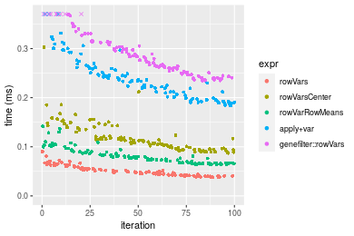

[matrixStats]: Benchmark report

---------------------------------------


# colVars() and rowVars() benchmarks

This report benchmark the performance of colVars() and rowVars() against alternative methods.

## Alternative methods

* apply() + var()
* colVarColMeans() and rowVarColMeans()
* genefilter::rowVars(t(.)) and genefilter::rowVars()

where

```r
> colVarColMeans <- function(x, na.rm = TRUE) {
+     if (na.rm) {
+         n <- colSums(!is.na(x))
+     }     else {
+         n <- nrow(x)
+     }
+     var <- colMeans(x * x, na.rm = na.rm) - (colMeans(x, na.rm = na.rm))^2
+     var * n/(n - 1)
+ }
```

and

```r
> rowVarRowMeans <- function(x, na.rm = TRUE) {
+     if (na.rm) {
+         n <- rowSums(!is.na(x))
+     }     else {
+         n <- ncol(x)
+     }
+     mu <- rowMeans(x, na.rm = na.rm)
+     var <- rowMeans(x * x, na.rm = na.rm) - mu^2
+     var * (n/(n - 1))
+ }
```


## Data type "integer"

### Data
```r
> rmatrix <- function(nrow, ncol, mode = c("logical", "double", "integer", "index"), range = c(-100, 
+     +100), na_prob = 0) {
+     mode <- match.arg(mode)
+     n <- nrow * ncol
+     if (mode == "logical") {
+         x <- sample(c(FALSE, TRUE), size = n, replace = TRUE)
+     }     else if (mode == "index") {
+         x <- seq_len(n)
+         mode <- "integer"
+     }     else {
+         x <- runif(n, min = range[1], max = range[2])
+     }
+     storage.mode(x) <- mode
+     if (na_prob > 0) 
+         x[sample(n, size = na_prob * n)] <- NA
+     dim(x) <- c(nrow, ncol)
+     x
+ }
> rmatrices <- function(scale = 10, seed = 1, ...) {
+     set.seed(seed)
+     data <- list()
+     data[[1]] <- rmatrix(nrow = scale * 1, ncol = scale * 1, ...)
+     data[[2]] <- rmatrix(nrow = scale * 10, ncol = scale * 10, ...)
+     data[[3]] <- rmatrix(nrow = scale * 100, ncol = scale * 1, ...)
+     data[[4]] <- t(data[[3]])
+     data[[5]] <- rmatrix(nrow = scale * 10, ncol = scale * 100, ...)
+     data[[6]] <- t(data[[5]])
+     names(data) <- sapply(data, FUN = function(x) paste(dim(x), collapse = "x"))
+     data
+ }
> data <- rmatrices(mode = mode)
```

### Results

#### 10x10 integer matrix

```r
> X <- data[["10x10"]]
> gc()
           used  (Mb) gc trigger  (Mb) max used  (Mb)
Ncells  5272047 281.6   10014072 534.9 10014072 534.9
Vcells 10260254  78.3   18204443 138.9 18204443 138.9
> colStats <- microbenchmark(colVars = colVars(X, na.rm = FALSE), colVarsCenter = colVars(X, center = colMeans(X, 
+     na.rm = FALSE), na.rm = FALSE), colVarColMeans = colVarColMeans(X, na.rm = FALSE), `apply+var` = apply(X, 
+     MARGIN = 2L, FUN = var, na.rm = FALSE), `genefilter::rowVars(t(.))` = genefilter_colVars(X, na.rm = FALSE), 
+     unit = "ms")
> X <- t(X)
> gc()
           used  (Mb) gc trigger  (Mb) max used  (Mb)
Ncells  5256606 280.8   10014072 534.9 10014072 534.9
Vcells 10208794  77.9   18204443 138.9 18204443 138.9
> rowStats <- microbenchmark(rowVars = rowVars(X, na.rm = FALSE), rowVarsCenter = rowVars(X, center = rowMeans(X, 
+     na.rm = FALSE), na.rm = FALSE), rowVarRowMeans = rowVarRowMeans(X, na.rm = FALSE), `apply+var` = apply(X, 
+     MARGIN = 1L, FUN = var, na.rm = FALSE), `genefilter::rowVars` = genefilter_rowVars(X, na.rm = FALSE), 
+     unit = "ms")
```

_Table: Benchmarking of colVars(), colVarsCenter(), colVarColMeans(), apply+var() and genefilter::rowVars(t(.))() on integer+10x10 data. The top panel shows times in milliseconds and the bottom panel shows relative times._


|   |expr                      |      min|        lq|      mean|    median|        uq|      max|
|:--|:-------------------------|--------:|---------:|---------:|---------:|---------:|--------:|
|1  |colVars                   | 0.002325| 0.0033860| 0.0045692| 0.0046240| 0.0054105| 0.010608|
|3  |colVarColMeans            | 0.014841| 0.0171330| 0.0203650| 0.0191450| 0.0221730| 0.068126|
|5  |genefilter::rowVars(t(.)) | 0.037954| 0.0446285| 0.0586561| 0.0492165| 0.0547940| 0.917881|
|2  |colVarsCenter             | 0.037084| 0.0470000| 0.0590080| 0.0506960| 0.0561255| 0.744107|
|4  |apply+var                 | 0.122309| 0.1395410| 0.1516296| 0.1479265| 0.1567235| 0.298007|


|   |expr                      |       min|        lq|      mean|    median|        uq|       max|
|:--|:-------------------------|---------:|---------:|---------:|---------:|---------:|---------:|
|1  |colVars                   |  1.000000|  1.000000|  1.000000|  1.000000|  1.000000|  1.000000|
|3  |colVarColMeans            |  6.383226|  5.059953|  4.456967|  4.140355|  4.098142|  6.422134|
|5  |genefilter::rowVars(t(.)) | 16.324301| 13.180301| 12.837168| 10.643707| 10.127345| 86.527244|
|2  |colVarsCenter             | 15.950107| 13.880685| 12.914191| 10.963668| 10.373440| 70.145833|
|4  |apply+var                 | 52.606021| 41.211164| 33.184862| 31.991025| 28.966546| 28.092666|

_Table: Benchmarking of rowVars(), rowVarsCenter(), rowVarRowMeans(), apply+var() and genefilter::rowVars() on integer+10x10 data (transposed). The top panel shows times in milliseconds and the bottom panel shows relative times._


|   |expr                |      min|        lq|      mean|    median|        uq|      max|
|:--|:-------------------|--------:|---------:|---------:|---------:|---------:|--------:|
|1  |rowVars             | 0.002661| 0.0039550| 0.0046965| 0.0046450| 0.0054325| 0.012444|
|3  |rowVarRowMeans      | 0.015916| 0.0187210| 0.0207601| 0.0205755| 0.0219130| 0.033226|
|2  |rowVarsCenter       | 0.025657| 0.0299050| 0.0352568| 0.0321560| 0.0360395| 0.170984|
|5  |genefilter::rowVars | 0.033861| 0.0387885| 0.0433907| 0.0410955| 0.0456590| 0.079038|
|4  |apply+var           | 0.128554| 0.1374320| 0.1498896| 0.1483710| 0.1566705| 0.241666|


|   |expr                |       min|        lq|      mean|    median|        uq|       max|
|:--|:-------------------|---------:|---------:|---------:|---------:|---------:|---------:|
|1  |rowVars             |  1.000000|  1.000000|  1.000000|  1.000000|  1.000000|  1.000000|
|3  |rowVarRowMeans      |  5.981210|  4.733502|  4.420323|  4.429602|  4.033686|  2.670042|
|2  |rowVarsCenter       |  9.641864|  7.561315|  7.507015|  6.922713|  6.634054| 13.740276|
|5  |genefilter::rowVars | 12.724915|  9.807459|  9.238933|  8.847255|  8.404786|  6.351495|
|4  |apply+var           | 48.310410| 34.748925| 31.915103| 31.942088| 28.839485| 19.420283|

_Figure: Benchmarking of colVars(), colVarsCenter(), colVarColMeans(), apply+var() and genefilter::rowVars(t(.))() on integer+10x10 data  as well as rowVars(), rowVarsCenter(), rowVarRowMeans(), apply+var() and genefilter::rowVars() on the same data transposed.  Outliers are displayed as crosses.  Times are in milliseconds._


_Table: Benchmarking of colVars() and rowVars() on integer+10x10 data (original and transposed).  The top panel shows times in milliseconds and the bottom panel shows relative times._


|   |expr    |   min|    lq|    mean| median|     uq|    max|
|:--|:-------|-----:|-----:|-------:|------:|------:|------:|
|1  |colVars | 2.325| 3.386| 4.56924|  4.624| 5.4105| 10.608|
|2  |rowVars | 2.661| 3.955| 4.69651|  4.645| 5.4325| 12.444|


|   |expr    |      min|       lq|     mean|   median|       uq|      max|
|:--|:-------|--------:|--------:|--------:|--------:|--------:|--------:|
|1  |colVars | 1.000000| 1.000000| 1.000000| 1.000000| 1.000000| 1.000000|
|2  |rowVars | 1.144516| 1.168045| 1.027854| 1.004541| 1.004066| 1.173077|

_Figure: Benchmarking of colVars() and rowVars() on integer+10x10 data (original and transposed).  Outliers are displayed as crosses. Times are in milliseconds._


#### 100x100 integer matrix

```r
> X <- data[["100x100"]]
> gc()
          used  (Mb) gc trigger  (Mb) max used  (Mb)
Ncells 5255214 280.7   10014072 534.9 10014072 534.9
Vcells 9825481  75.0   18204443 138.9 18204443 138.9
> colStats <- microbenchmark(colVars = colVars(X, na.rm = FALSE), colVarsCenter = colVars(X, center = colMeans(X, 
+     na.rm = FALSE), na.rm = FALSE), colVarColMeans = colVarColMeans(X, na.rm = FALSE), `apply+var` = apply(X, 
+     MARGIN = 2L, FUN = var, na.rm = FALSE), `genefilter::rowVars(t(.))` = genefilter_colVars(X, na.rm = FALSE), 
+     unit = "ms")
> X <- t(X)
> gc()
          used  (Mb) gc trigger  (Mb) max used  (Mb)
Ncells 5255190 280.7   10014072 534.9 10014072 534.9
Vcells 9830558  75.1   18204443 138.9 18204443 138.9
> rowStats <- microbenchmark(rowVars = rowVars(X, na.rm = FALSE), rowVarsCenter = rowVars(X, center = rowMeans(X, 
+     na.rm = FALSE), na.rm = FALSE), rowVarRowMeans = rowVarRowMeans(X, na.rm = FALSE), `apply+var` = apply(X, 
+     MARGIN = 1L, FUN = var, na.rm = FALSE), `genefilter::rowVars` = genefilter_rowVars(X, na.rm = FALSE), 
+     unit = "ms")
```

_Table: Benchmarking of colVars(), colVarsCenter(), colVarColMeans(), apply+var() and genefilter::rowVars(t(.))() on integer+100x100 data. The top panel shows times in milliseconds and the bottom panel shows relative times._


|   |expr                      |      min|        lq|      mean|   median|       uq|       max|
|:--|:-------------------------|--------:|---------:|---------:|--------:|--------:|---------:|
|1  |colVars                   | 0.038033| 0.0407735| 0.0484455| 0.047364| 0.052136|  0.081479|
|3  |colVarColMeans            | 0.060864| 0.0650335| 0.0733903| 0.070032| 0.077653|  0.115842|
|5  |genefilter::rowVars(t(.)) | 0.163798| 0.1737225| 0.2031152| 0.194231| 0.219289|  0.370312|
|2  |colVarsCenter             | 0.210808| 0.2199515| 0.2612198| 0.242794| 0.281556|  0.641937|
|4  |apply+var                 | 0.893840| 0.9116520| 1.1552947| 1.014081| 1.142486| 11.111820|


|   |expr                      |       min|        lq|      mean|    median|        uq|        max|
|:--|:-------------------------|---------:|---------:|---------:|---------:|---------:|----------:|
|1  |colVars                   |  1.000000|  1.000000|  1.000000|  1.000000|  1.000000|   1.000000|
|3  |colVarColMeans            |  1.600294|  1.594994|  1.514904|  1.478591|  1.489432|   1.421741|
|5  |genefilter::rowVars(t(.)) |  4.306734|  4.260672|  4.192655|  4.100815|  4.206096|   4.544877|
|2  |colVarsCenter             |  5.542765|  5.394472|  5.392035|  5.126130|  5.400414|   7.878558|
|4  |apply+var                 | 23.501696| 22.358934| 23.847312| 21.410375| 21.913572| 136.376490|

_Table: Benchmarking of rowVars(), rowVarsCenter(), rowVarRowMeans(), apply+var() and genefilter::rowVars() on integer+100x100 data (transposed). The top panel shows times in milliseconds and the bottom panel shows relative times._


|   |expr                |      min|        lq|      mean|    median|        uq|      max|
|:--|:-------------------|--------:|---------:|---------:|---------:|---------:|--------:|
|1  |rowVars             | 0.043009| 0.0444985| 0.0501467| 0.0460480| 0.0540915| 0.091134|
|2  |rowVarsCenter       | 0.099664| 0.1039205| 0.1204199| 0.1105990| 0.1249725| 0.392550|
|3  |rowVarRowMeans      | 0.105865| 0.1082910| 0.1212379| 0.1114175| 0.1284025| 0.205261|
|5  |genefilter::rowVars | 0.143220| 0.1537885| 0.1669040| 0.1568765| 0.1743085| 0.294823|
|4  |apply+var           | 0.893738| 0.9056530| 1.0144731| 0.9200400| 1.0774660| 1.606388|


|   |expr                |       min|        lq|      mean|    median|        uq|       max|
|:--|:-------------------|---------:|---------:|---------:|---------:|---------:|---------:|
|1  |rowVars             |  1.000000|  1.000000|  1.000000|  1.000000|  1.000000|  1.000000|
|2  |rowVarsCenter       |  2.317282|  2.335371|  2.401353|  2.401820|  2.310391|  4.307393|
|3  |rowVarRowMeans      |  2.461462|  2.433588|  2.417665|  2.419595|  2.373802|  2.252299|
|5  |genefilter::rowVars |  3.330001|  3.456038|  3.328316|  3.406804|  3.222475|  3.235050|
|4  |apply+var           | 20.780255| 20.352439| 20.230120| 19.980021| 19.919322| 17.626660|

_Figure: Benchmarking of colVars(), colVarsCenter(), colVarColMeans(), apply+var() and genefilter::rowVars(t(.))() on integer+100x100 data  as well as rowVars(), rowVarsCenter(), rowVarRowMeans(), apply+var() and genefilter::rowVars() on the same data transposed.  Outliers are displayed as crosses.  Times are in milliseconds._


_Table: Benchmarking of colVars() and rowVars() on integer+100x100 data (original and transposed).  The top panel shows times in milliseconds and the bottom panel shows relative times._


|   |expr    |    min|      lq|     mean| median|      uq|    max|
|:--|:-------|------:|-------:|--------:|------:|-------:|------:|
|2  |rowVars | 43.009| 44.4985| 50.14667| 46.048| 54.0915| 91.134|
|1  |colVars | 38.033| 40.7735| 48.44549| 47.364| 52.1360| 81.479|


|   |expr    |       min|        lq|      mean|   median|        uq|       max|
|:--|:-------|---------:|---------:|---------:|--------:|---------:|---------:|
|2  |rowVars | 1.0000000| 1.0000000| 1.0000000| 1.000000| 1.0000000| 1.0000000|
|1  |colVars | 0.8843033| 0.9162893| 0.9660759| 1.028579| 0.9638483| 0.8940571|

_Figure: Benchmarking of colVars() and rowVars() on integer+100x100 data (original and transposed).  Outliers are displayed as crosses. Times are in milliseconds._


#### 1000x10 integer matrix

```r
> X <- data[["1000x10"]]
> gc()
          used  (Mb) gc trigger  (Mb) max used  (Mb)
Ncells 5256004 280.8   10014072 534.9 10014072 534.9
Vcells 9829727  75.0   18204443 138.9 18204443 138.9
> colStats <- microbenchmark(colVars = colVars(X, na.rm = FALSE), colVarsCenter = colVars(X, center = colMeans(X, 
+     na.rm = FALSE), na.rm = FALSE), colVarColMeans = colVarColMeans(X, na.rm = FALSE), `apply+var` = apply(X, 
+     MARGIN = 2L, FUN = var, na.rm = FALSE), `genefilter::rowVars(t(.))` = genefilter_colVars(X, na.rm = FALSE), 
+     unit = "ms")
> X <- t(X)
> gc()
          used  (Mb) gc trigger  (Mb) max used  (Mb)
Ncells 5255986 280.7   10014072 534.9 10014072 534.9
Vcells 9834814  75.1   18204443 138.9 18204443 138.9
> rowStats <- microbenchmark(rowVars = rowVars(X, na.rm = FALSE), rowVarsCenter = rowVars(X, center = rowMeans(X, 
+     na.rm = FALSE), na.rm = FALSE), rowVarRowMeans = rowVarRowMeans(X, na.rm = FALSE), `apply+var` = apply(X, 
+     MARGIN = 1L, FUN = var, na.rm = FALSE), `genefilter::rowVars` = genefilter_rowVars(X, na.rm = FALSE), 
+     unit = "ms")
```

_Table: Benchmarking of colVars(), colVarsCenter(), colVarColMeans(), apply+var() and genefilter::rowVars(t(.))() on integer+1000x10 data. The top panel shows times in milliseconds and the bottom panel shows relative times._


|   |expr                      |      min|        lq|      mean|    median|        uq|      max|
|:--|:-------------------------|--------:|---------:|---------:|---------:|---------:|--------:|
|1  |colVars                   | 0.038257| 0.0410840| 0.0477822| 0.0479655| 0.0511940| 0.070155|
|3  |colVarColMeans            | 0.058216| 0.0672235| 0.0754838| 0.0737570| 0.0798255| 0.136423|
|2  |colVarsCenter             | 0.139371| 0.1542650| 0.1852270| 0.1738035| 0.1917535| 0.717253|
|4  |apply+var                 | 0.192258| 0.2068810| 0.2383708| 0.2295575| 0.2560180| 0.371756|
|5  |genefilter::rowVars(t(.)) | 0.359996| 0.3801620| 0.4921069| 0.4358795| 0.4687220| 6.197301|


|   |expr                      |      min|       lq|      mean|   median|       uq|       max|
|:--|:-------------------------|--------:|--------:|---------:|--------:|--------:|---------:|
|1  |colVars                   | 1.000000| 1.000000|  1.000000| 1.000000| 1.000000|  1.000000|
|3  |colVarColMeans            | 1.521708| 1.636245|  1.579748| 1.537709| 1.559274|  1.944594|
|2  |colVarsCenter             | 3.643020| 3.754868|  3.876487| 3.623511| 3.745624| 10.223833|
|4  |apply+var                 | 5.025433| 5.035561|  4.988697| 4.785888| 5.000938|  5.299066|
|5  |genefilter::rowVars(t(.)) | 9.409938| 9.253286| 10.298963| 9.087355| 9.155800| 88.337267|

_Table: Benchmarking of rowVars(), rowVarsCenter(), rowVarRowMeans(), apply+var() and genefilter::rowVars() on integer+1000x10 data (transposed). The top panel shows times in milliseconds and the bottom panel shows relative times._


|   |expr                |      min|        lq|      mean|    median|        uq|      max|
|:--|:-------------------|--------:|---------:|---------:|---------:|---------:|--------:|
|1  |rowVars             | 0.043254| 0.0443245| 0.0515830| 0.0454560| 0.0572135| 0.089757|
|2  |rowVarsCenter       | 0.196326| 0.2019515| 0.2327238| 0.2058885| 0.2392905| 0.696966|
|4  |apply+var           | 0.190903| 0.2002275| 0.2261949| 0.2081945| 0.2373215| 0.380073|
|3  |rowVarRowMeans      | 0.301179| 0.3038245| 0.3436832| 0.3096545| 0.3780350| 0.531109|
|5  |genefilter::rowVars | 0.342780| 0.3475800| 0.3827974| 0.3513290| 0.4052190| 0.597764|


|   |expr                |      min|       lq|     mean|   median|       uq|      max|
|:--|:-------------------|--------:|--------:|--------:|--------:|--------:|--------:|
|1  |rowVars             | 1.000000| 1.000000| 1.000000| 1.000000| 1.000000| 1.000000|
|2  |rowVarsCenter       | 4.538910| 4.556205| 4.511640| 4.529402| 4.182413| 7.765032|
|4  |apply+var           | 4.413534| 4.517310| 4.385070| 4.580132| 4.147998| 4.234466|
|3  |rowVarRowMeans      | 6.963032| 6.854550| 6.662727| 6.812181| 6.607444| 5.917187|
|5  |genefilter::rowVars | 7.924816| 7.841713| 7.421005| 7.728991| 7.082577| 6.659804|

_Figure: Benchmarking of colVars(), colVarsCenter(), colVarColMeans(), apply+var() and genefilter::rowVars(t(.))() on integer+1000x10 data  as well as rowVars(), rowVarsCenter(), rowVarRowMeans(), apply+var() and genefilter::rowVars() on the same data transposed.  Outliers are displayed as crosses.  Times are in milliseconds._


_Table: Benchmarking of colVars() and rowVars() on integer+1000x10 data (original and transposed).  The top panel shows times in milliseconds and the bottom panel shows relative times._


|   |expr    |    min|      lq|     mean|  median|      uq|    max|
|:--|:-------|------:|-------:|--------:|-------:|-------:|------:|
|2  |rowVars | 43.254| 44.3245| 51.58296| 45.4560| 57.2135| 89.757|
|1  |colVars | 38.257| 41.0840| 47.78218| 47.9655| 51.1940| 70.155|


|   |expr    |       min|        lq|      mean|   median|        uq|       max|
|:--|:-------|---------:|---------:|---------:|--------:|---------:|---------:|
|2  |rowVars | 1.0000000| 1.0000000| 1.0000000| 1.000000| 1.0000000| 1.0000000|
|1  |colVars | 0.8844731| 0.9268914| 0.9263171| 1.055207| 0.8947888| 0.7816103|

_Figure: Benchmarking of colVars() and rowVars() on integer+1000x10 data (original and transposed).  Outliers are displayed as crosses. Times are in milliseconds._


#### 10x1000 integer matrix

```r
> X <- data[["10x1000"]]
> gc()
          used  (Mb) gc trigger  (Mb) max used  (Mb)
Ncells 5256232 280.8   10014072 534.9 10014072 534.9
Vcells 9830723  75.1   18204443 138.9 18204443 138.9
> colStats <- microbenchmark(colVars = colVars(X, na.rm = FALSE), colVarsCenter = colVars(X, center = colMeans(X, 
+     na.rm = FALSE), na.rm = FALSE), colVarColMeans = colVarColMeans(X, na.rm = FALSE), `apply+var` = apply(X, 
+     MARGIN = 2L, FUN = var, na.rm = FALSE), `genefilter::rowVars(t(.))` = genefilter_colVars(X, na.rm = FALSE), 
+     unit = "ms")
> X <- t(X)
> gc()
          used  (Mb) gc trigger  (Mb) max used  (Mb)
Ncells 5256226 280.8   10014072 534.9 10014072 534.9
Vcells 9835830  75.1   18204443 138.9 18204443 138.9
> rowStats <- microbenchmark(rowVars = rowVars(X, na.rm = FALSE), rowVarsCenter = rowVars(X, center = rowMeans(X, 
+     na.rm = FALSE), na.rm = FALSE), rowVarRowMeans = rowVarRowMeans(X, na.rm = FALSE), `apply+var` = apply(X, 
+     MARGIN = 1L, FUN = var, na.rm = FALSE), `genefilter::rowVars` = genefilter_rowVars(X, na.rm = FALSE), 
+     unit = "ms")
```

_Table: Benchmarking of colVars(), colVarsCenter(), colVarColMeans(), apply+var() and genefilter::rowVars(t(.))() on integer+10x1000 data. The top panel shows times in milliseconds and the bottom panel shows relative times._


|   |expr                      |      min|        lq|      mean|    median|        uq|       max|
|:--|:-------------------------|--------:|---------:|---------:|---------:|---------:|---------:|
|1  |colVars                   | 0.040065| 0.0424205| 0.0461001| 0.0452590| 0.0482560|  0.087115|
|3  |colVarColMeans            | 0.067128| 0.0747450| 0.0818424| 0.0791840| 0.0856240|  0.183177|
|5  |genefilter::rowVars(t(.)) | 0.150115| 0.1688635| 0.1866951| 0.1786855| 0.1962715|  0.300521|
|2  |colVarsCenter             | 0.819699| 0.9031785| 0.9500219| 0.9527830| 0.9892480|  1.188104|
|4  |apply+var                 | 7.672204| 8.2417175| 8.8152563| 8.7418460| 8.8737940| 14.886418|


|   |expr                      |        min|         lq|       mean|     median|         uq|        max|
|:--|:-------------------------|----------:|----------:|----------:|----------:|----------:|----------:|
|1  |colVars                   |   1.000000|   1.000000|   1.000000|   1.000000|   1.000000|   1.000000|
|3  |colVarColMeans            |   1.675477|   1.762002|   1.775321|   1.749575|   1.774370|   2.102703|
|5  |genefilter::rowVars(t(.)) |   3.746786|   3.980705|   4.049782|   3.948066|   4.067297|   3.449704|
|2  |colVarsCenter             |  20.459229|  21.291086|  20.607828|  21.051791|  20.500000|  13.638340|
|4  |apply+var                 | 191.493922| 194.286194| 191.220102| 193.151550| 183.889962| 170.882374|

_Table: Benchmarking of rowVars(), rowVarsCenter(), rowVarRowMeans(), apply+var() and genefilter::rowVars() on integer+10x1000 data (transposed). The top panel shows times in milliseconds and the bottom panel shows relative times._


|   |expr                |      min|        lq|      mean|    median|        uq|       max|
|:--|:-------------------|--------:|---------:|---------:|---------:|---------:|---------:|
|1  |rowVars             | 0.040643| 0.0438065| 0.0478265| 0.0460440| 0.0500960|  0.076065|
|3  |rowVarRowMeans      | 0.094122| 0.1015060| 0.1074377| 0.1047625| 0.1104650|  0.134858|
|2  |rowVarsCenter       | 0.099220| 0.1068905| 0.1251283| 0.1147400| 0.1278310|  0.294937|
|5  |genefilter::rowVars | 0.137136| 0.1468540| 0.1634997| 0.1586060| 0.1727045|  0.353378|
|4  |apply+var           | 7.688413| 8.2789540| 8.9266091| 8.7381260| 9.0282040| 15.865650|


|   |expr                |        min|         lq|       mean|     median|         uq|        max|
|:--|:-------------------|----------:|----------:|----------:|----------:|----------:|----------:|
|1  |rowVars             |   1.000000|   1.000000|   1.000000|   1.000000|   1.000000|   1.000000|
|3  |rowVarRowMeans      |   2.315823|   2.317145|   2.246405|   2.275269|   2.205066|   1.772931|
|2  |rowVarsCenter       |   2.441257|   2.440060|   2.616298|   2.491964|   2.551721|   3.877434|
|5  |genefilter::rowVars |   3.374160|   3.352334|   3.418603|   3.444662|   3.447471|   4.645737|
|4  |apply+var           | 189.169426| 188.989168| 186.645747| 189.777734| 180.218061| 208.580162|

_Figure: Benchmarking of colVars(), colVarsCenter(), colVarColMeans(), apply+var() and genefilter::rowVars(t(.))() on integer+10x1000 data  as well as rowVars(), rowVarsCenter(), rowVarRowMeans(), apply+var() and genefilter::rowVars() on the same data transposed.  Outliers are displayed as crosses.  Times are in milliseconds._


_Table: Benchmarking of colVars() and rowVars() on integer+10x1000 data (original and transposed).  The top panel shows times in milliseconds and the bottom panel shows relative times._


|   |expr    |    min|      lq|     mean| median|     uq|    max|
|:--|:-------|------:|-------:|--------:|------:|------:|------:|
|1  |colVars | 40.065| 42.4205| 46.10005| 45.259| 48.256| 87.115|
|2  |rowVars | 40.643| 43.8065| 47.82648| 46.044| 50.096| 76.065|


|   |expr    |      min|       lq|    mean|   median|      uq|       max|
|:--|:-------|--------:|--------:|-------:|--------:|-------:|---------:|
|1  |colVars | 1.000000| 1.000000| 1.00000| 1.000000| 1.00000| 1.0000000|
|2  |rowVars | 1.014427| 1.032673| 1.03745| 1.017345| 1.03813| 0.8731562|

_Figure: Benchmarking of colVars() and rowVars() on integer+10x1000 data (original and transposed).  Outliers are displayed as crosses. Times are in milliseconds._


#### 100x1000 integer matrix

```r
> X <- data[["100x1000"]]
> gc()
          used  (Mb) gc trigger  (Mb) max used  (Mb)
Ncells 5256492 280.8   10014072 534.9 10014072 534.9
Vcells 9831478  75.1   18204443 138.9 18204443 138.9
> colStats <- microbenchmark(colVars = colVars(X, na.rm = FALSE), colVarsCenter = colVars(X, center = colMeans(X, 
+     na.rm = FALSE), na.rm = FALSE), colVarColMeans = colVarColMeans(X, na.rm = FALSE), `apply+var` = apply(X, 
+     MARGIN = 2L, FUN = var, na.rm = FALSE), `genefilter::rowVars(t(.))` = genefilter_colVars(X, na.rm = FALSE), 
+     unit = "ms")
> X <- t(X)
> gc()
          used  (Mb) gc trigger  (Mb) max used  (Mb)
Ncells 5256468 280.8   10014072 534.9 10014072 534.9
Vcells 9881555  75.4   18204443 138.9 18204443 138.9
> rowStats <- microbenchmark(rowVars = rowVars(X, na.rm = FALSE), rowVarsCenter = rowVars(X, center = rowMeans(X, 
+     na.rm = FALSE), na.rm = FALSE), rowVarRowMeans = rowVarRowMeans(X, na.rm = FALSE), `apply+var` = apply(X, 
+     MARGIN = 1L, FUN = var, na.rm = FALSE), `genefilter::rowVars` = genefilter_rowVars(X, na.rm = FALSE), 
+     unit = "ms")
```

_Table: Benchmarking of colVars(), colVarsCenter(), colVarColMeans(), apply+var() and genefilter::rowVars(t(.))() on integer+100x1000 data. The top panel shows times in milliseconds and the bottom panel shows relative times._


|   |expr                      |      min|        lq|       mean|    median|         uq|       max|
|:--|:-------------------------|--------:|---------:|----------:|---------:|----------:|---------:|
|1  |colVars                   | 0.369711| 0.3867875|  0.4226302| 0.4063270|  0.4551930|  0.576960|
|3  |colVarColMeans            | 0.502167| 0.5382755|  0.5927442| 0.5718595|  0.6423575|  0.846405|
|5  |genefilter::rowVars(t(.)) | 1.193916| 1.3313990|  2.1324285| 1.4059245|  1.5785920| 12.457913|
|2  |colVarsCenter             | 1.891828| 2.0360605|  2.4182025| 2.1237165|  2.3357960| 13.003801|
|4  |apply+var                 | 8.811831| 9.1824030| 10.2381186| 9.5218460| 10.5304650| 22.228450|


|   |expr                      |       min|        lq|      mean|    median|        uq|       max|
|:--|:-------------------------|---------:|---------:|---------:|---------:|---------:|---------:|
|1  |colVars                   |  1.000000|  1.000000|  1.000000|  1.000000|  1.000000|  1.000000|
|3  |colVarColMeans            |  1.358269|  1.391657|  1.402513|  1.407387|  1.411176|  1.467008|
|5  |genefilter::rowVars(t(.)) |  3.229322|  3.442198|  5.045613|  3.460081|  3.467962| 21.592334|
|2  |colVarsCenter             |  5.117045|  5.264029|  5.721793|  5.226619|  5.131441| 22.538479|
|4  |apply+var                 | 23.834376| 23.740175| 24.224769| 23.433948| 23.134066| 38.526848|

_Table: Benchmarking of rowVars(), rowVarsCenter(), rowVarRowMeans(), apply+var() and genefilter::rowVars() on integer+100x1000 data (transposed). The top panel shows times in milliseconds and the bottom panel shows relative times._


|   |expr                |      min|        lq|       mean|    median|         uq|       max|
|:--|:-------------------|--------:|---------:|----------:|---------:|----------:|---------:|
|1  |rowVars             | 0.412684| 0.4451675|  0.4764913| 0.4603480|  0.4940735|  0.679796|
|2  |rowVarsCenter       | 0.737802| 0.8109585|  1.1554359| 0.8302230|  0.9678395| 10.604629|
|3  |rowVarRowMeans      | 0.765590| 0.8280675|  0.8838516| 0.8519355|  0.9133850|  1.326916|
|5  |genefilter::rowVars | 1.127690| 1.1852085|  1.6538738| 1.2393570|  1.3673145| 10.220789|
|4  |apply+var           | 8.826140| 9.1960435| 10.0856447| 9.6044640| 10.4175300| 20.449120|


|   |expr                |       min|        lq|      mean|    median|        uq|       max|
|:--|:-------------------|---------:|---------:|---------:|---------:|---------:|---------:|
|1  |rowVars             |  1.000000|  1.000000|  1.000000|  1.000000|  1.000000|  1.000000|
|2  |rowVarsCenter       |  1.787813|  1.821693|  2.424883|  1.803468|  1.958898| 15.599723|
|3  |rowVarRowMeans      |  1.855148|  1.860126|  1.854916|  1.850634|  1.848682|  1.951933|
|5  |genefilter::rowVars |  2.732575|  2.662388|  3.470942|  2.692218|  2.767431| 15.035083|
|4  |apply+var           | 21.387163| 20.657491| 21.166480| 20.863486| 21.084980| 30.081260|

_Figure: Benchmarking of colVars(), colVarsCenter(), colVarColMeans(), apply+var() and genefilter::rowVars(t(.))() on integer+100x1000 data  as well as rowVars(), rowVarsCenter(), rowVarRowMeans(), apply+var() and genefilter::rowVars() on the same data transposed.  Outliers are displayed as crosses.  Times are in milliseconds._


_Table: Benchmarking of colVars() and rowVars() on integer+100x1000 data (original and transposed).  The top panel shows times in milliseconds and the bottom panel shows relative times._


|   |expr    |     min|       lq|     mean|  median|       uq|     max|
|:--|:-------|-------:|--------:|--------:|-------:|--------:|-------:|
|1  |colVars | 369.711| 386.7875| 422.6302| 406.327| 455.1930| 576.960|
|2  |rowVars | 412.684| 445.1675| 476.4914| 460.348| 494.0735| 679.796|


|   |expr    |      min|       lq|     mean|  median|       uq|      max|
|:--|:-------|--------:|--------:|--------:|-------:|--------:|--------:|
|1  |colVars | 1.000000| 1.000000| 1.000000| 1.00000| 1.000000| 1.000000|
|2  |rowVars | 1.116234| 1.150936| 1.127443| 1.13295| 1.085415| 1.178238|

_Figure: Benchmarking of colVars() and rowVars() on integer+100x1000 data (original and transposed).  Outliers are displayed as crosses. Times are in milliseconds._


#### 1000x100 integer matrix

```r
> X <- data[["1000x100"]]
> gc()
          used  (Mb) gc trigger  (Mb) max used  (Mb)
Ncells 5256735 280.8   10014072 534.9 10014072 534.9
Vcells 9832320  75.1   18204443 138.9 18204443 138.9
> colStats <- microbenchmark(colVars = colVars(X, na.rm = FALSE), colVarsCenter = colVars(X, center = colMeans(X, 
+     na.rm = FALSE), na.rm = FALSE), colVarColMeans = colVarColMeans(X, na.rm = FALSE), `apply+var` = apply(X, 
+     MARGIN = 2L, FUN = var, na.rm = FALSE), `genefilter::rowVars(t(.))` = genefilter_colVars(X, na.rm = FALSE), 
+     unit = "ms")
> X <- t(X)
> gc()
          used  (Mb) gc trigger  (Mb) max used  (Mb)
Ncells 5256711 280.8   10014072 534.9 10014072 534.9
Vcells 9882397  75.4   18204443 138.9 18204443 138.9
> rowStats <- microbenchmark(rowVars = rowVars(X, na.rm = FALSE), rowVarsCenter = rowVars(X, center = rowMeans(X, 
+     na.rm = FALSE), na.rm = FALSE), rowVarRowMeans = rowVarRowMeans(X, na.rm = FALSE), `apply+var` = apply(X, 
+     MARGIN = 1L, FUN = var, na.rm = FALSE), `genefilter::rowVars` = genefilter_rowVars(X, na.rm = FALSE), 
+     unit = "ms")
```

_Table: Benchmarking of colVars(), colVarsCenter(), colVarColMeans(), apply+var() and genefilter::rowVars(t(.))() on integer+1000x100 data. The top panel shows times in milliseconds and the bottom panel shows relative times._


|   |expr                      |      min|       lq|      mean|    median|        uq|        max|
|:--|:-------------------------|--------:|--------:|---------:|---------:|---------:|----------:|
|1  |colVars                   | 0.363082| 0.398377| 0.4432424| 0.4345980| 0.4705705|   0.746254|
|3  |colVarColMeans            | 0.481019| 0.526565| 0.5844388| 0.5742275| 0.6187810|   1.026974|
|2  |colVarsCenter             | 1.181968| 1.298902| 1.5689793| 1.4020555| 1.5157605|   7.577348|
|5  |genefilter::rowVars(t(.)) | 1.364118| 1.495157| 5.8320128| 1.6819270| 1.7720900| 392.280833|
|4  |apply+var                 | 1.763668| 1.925832| 2.3814734| 2.1272300| 2.2660785|   8.580517|


|   |expr                      |      min|       lq|      mean|   median|       uq|        max|
|:--|:-------------------------|--------:|--------:|---------:|--------:|--------:|----------:|
|1  |colVars                   | 1.000000| 1.000000|  1.000000| 1.000000| 1.000000|   1.000000|
|3  |colVarColMeans            | 1.324822| 1.321776|  1.318553| 1.321284| 1.314959|   1.376172|
|2  |colVarsCenter             | 3.255375| 3.260484|  3.539777| 3.226097| 3.221112|  10.153846|
|5  |genefilter::rowVars(t(.)) | 3.757052| 3.753121| 13.157615| 3.870075| 3.765833| 525.666640|
|4  |apply+var                 | 4.857492| 4.834195|  5.372846| 4.894707| 4.815598|  11.498119|

_Table: Benchmarking of rowVars(), rowVarsCenter(), rowVarRowMeans(), apply+var() and genefilter::rowVars() on integer+1000x100 data (transposed). The top panel shows times in milliseconds and the bottom panel shows relative times._


|   |expr                |      min|        lq|      mean|   median|       uq|      max|
|:--|:-------------------|--------:|---------:|---------:|--------:|--------:|--------:|
|1  |rowVars             | 0.414357| 0.4202910| 0.4627986| 0.443100| 0.505844| 0.716497|
|2  |rowVarsCenter       | 0.832611| 0.8719015| 1.0411079| 0.931318| 1.050504| 7.101309|
|3  |rowVarRowMeans      | 0.961835| 0.9897035| 1.0934400| 1.065693| 1.176824| 1.542708|
|5  |genefilter::rowVars | 1.236093| 1.3437080| 1.5502454| 1.422224| 1.557481| 7.549922|
|4  |apply+var           | 1.769789| 1.8574720| 2.4049577| 2.024275| 2.224187| 8.311560|


|   |expr                |      min|       lq|     mean|   median|       uq|       max|
|:--|:-------------------|--------:|--------:|--------:|--------:|--------:|---------:|
|1  |rowVars             | 1.000000| 1.000000| 1.000000| 1.000000| 1.000000|  1.000000|
|2  |rowVarsCenter       | 2.009405| 2.074519| 2.249591| 2.101824| 2.076734|  9.911150|
|3  |rowVarRowMeans      | 2.321271| 2.354805| 2.362669| 2.405085| 2.326455|  2.153126|
|5  |genefilter::rowVars | 2.983159| 3.197090| 3.349719| 3.209712| 3.078974| 10.537270|
|4  |apply+var           | 4.271170| 4.419490| 5.196553| 4.568437| 4.396981| 11.600272|

_Figure: Benchmarking of colVars(), colVarsCenter(), colVarColMeans(), apply+var() and genefilter::rowVars(t(.))() on integer+1000x100 data  as well as rowVars(), rowVarsCenter(), rowVarRowMeans(), apply+var() and genefilter::rowVars() on the same data transposed.  Outliers are displayed as crosses.  Times are in milliseconds._


_Table: Benchmarking of colVars() and rowVars() on integer+1000x100 data (original and transposed).  The top panel shows times in milliseconds and the bottom panel shows relative times._


|   |expr    |     min|      lq|     mean|  median|       uq|     max|
|:--|:-------|-------:|-------:|--------:|-------:|--------:|-------:|
|1  |colVars | 363.082| 398.377| 443.2424| 434.598| 470.5705| 746.254|
|2  |rowVars | 414.357| 420.291| 462.7987| 443.100| 505.8440| 716.497|


|   |expr    |      min|       lq|     mean|   median|       uq|       max|
|:--|:-------|--------:|--------:|--------:|--------:|--------:|---------:|
|1  |colVars | 1.000000| 1.000000| 1.000000| 1.000000| 1.000000| 1.0000000|
|2  |rowVars | 1.141222| 1.055008| 1.044121| 1.019563| 1.074959| 0.9601248|

_Figure: Benchmarking of colVars() and rowVars() on integer+1000x100 data (original and transposed).  Outliers are displayed as crosses. Times are in milliseconds._


## Data type "double"

### Data
```r
> rmatrix <- function(nrow, ncol, mode = c("logical", "double", "integer", "index"), range = c(-100, 
+     +100), na_prob = 0) {
+     mode <- match.arg(mode)
+     n <- nrow * ncol
+     if (mode == "logical") {
+         x <- sample(c(FALSE, TRUE), size = n, replace = TRUE)
+     }     else if (mode == "index") {
+         x <- seq_len(n)
+         mode <- "integer"
+     }     else {
+         x <- runif(n, min = range[1], max = range[2])
+     }
+     storage.mode(x) <- mode
+     if (na_prob > 0) 
+         x[sample(n, size = na_prob * n)] <- NA
+     dim(x) <- c(nrow, ncol)
+     x
+ }
> rmatrices <- function(scale = 10, seed = 1, ...) {
+     set.seed(seed)
+     data <- list()
+     data[[1]] <- rmatrix(nrow = scale * 1, ncol = scale * 1, ...)
+     data[[2]] <- rmatrix(nrow = scale * 10, ncol = scale * 10, ...)
+     data[[3]] <- rmatrix(nrow = scale * 100, ncol = scale * 1, ...)
+     data[[4]] <- t(data[[3]])
+     data[[5]] <- rmatrix(nrow = scale * 10, ncol = scale * 100, ...)
+     data[[6]] <- t(data[[5]])
+     names(data) <- sapply(data, FUN = function(x) paste(dim(x), collapse = "x"))
+     data
+ }
> data <- rmatrices(mode = mode)
```

### Results

#### 10x10 double matrix

```r
> X <- data[["10x10"]]
> gc()
          used  (Mb) gc trigger  (Mb) max used  (Mb)
Ncells 5256992 280.8   10014072 534.9 10014072 534.9
Vcells 9948367  76.0   18204443 138.9 18204443 138.9
> colStats <- microbenchmark(colVars = colVars(X, na.rm = FALSE), colVarsCenter = colVars(X, center = colMeans(X, 
+     na.rm = FALSE), na.rm = FALSE), colVarColMeans = colVarColMeans(X, na.rm = FALSE), `apply+var` = apply(X, 
+     MARGIN = 2L, FUN = var, na.rm = FALSE), `genefilter::rowVars(t(.))` = genefilter_colVars(X, na.rm = FALSE), 
+     unit = "ms")
> X <- t(X)
> gc()
          used  (Mb) gc trigger  (Mb) max used  (Mb)
Ncells 5256959 280.8   10014072 534.9 10014072 534.9
Vcells 9948529  76.0   18204443 138.9 18204443 138.9
> rowStats <- microbenchmark(rowVars = rowVars(X, na.rm = FALSE), rowVarsCenter = rowVars(X, center = rowMeans(X, 
+     na.rm = FALSE), na.rm = FALSE), rowVarRowMeans = rowVarRowMeans(X, na.rm = FALSE), `apply+var` = apply(X, 
+     MARGIN = 1L, FUN = var, na.rm = FALSE), `genefilter::rowVars` = genefilter_rowVars(X, na.rm = FALSE), 
+     unit = "ms")
```

_Table: Benchmarking of colVars(), colVarsCenter(), colVarColMeans(), apply+var() and genefilter::rowVars(t(.))() on double+10x10 data. The top panel shows times in milliseconds and the bottom panel shows relative times._


|   |expr                      |      min|        lq|      mean|    median|       uq|      max|
|:--|:-------------------------|--------:|---------:|---------:|---------:|--------:|--------:|
|1  |colVars                   | 0.002347| 0.0032425| 0.0045039| 0.0043640| 0.005231| 0.018810|
|3  |colVarColMeans            | 0.013529| 0.0163065| 0.0188925| 0.0181780| 0.020199| 0.061557|
|5  |genefilter::rowVars(t(.)) | 0.035249| 0.0408380| 0.0465304| 0.0451825| 0.050372| 0.107995|
|2  |colVarsCenter             | 0.036142| 0.0441380| 0.0506308| 0.0481560| 0.053882| 0.177209|
|4  |apply+var                 | 0.122495| 0.1346295| 0.1452755| 0.1432440| 0.155753| 0.213923|


|   |expr                      |      min|       lq|      mean|    median|        uq|       max|
|:--|:-------------------------|--------:|--------:|---------:|---------:|---------:|---------:|
|1  |colVars                   |  1.00000|  1.00000|  1.000000|  1.000000|  1.000000|  1.000000|
|3  |colVarColMeans            |  5.76438|  5.02899|  4.194691|  4.165445|  3.861403|  3.272568|
|5  |genefilter::rowVars(t(.)) | 15.01875| 12.59460| 10.331124| 10.353460|  9.629516|  5.741361|
|2  |colVarsCenter             | 15.39923| 13.61234| 11.241551| 11.034830| 10.300516|  9.421000|
|4  |apply+var                 | 52.19216| 41.52028| 32.255499| 32.824015| 29.774995| 11.372834|

_Table: Benchmarking of rowVars(), rowVarsCenter(), rowVarRowMeans(), apply+var() and genefilter::rowVars() on double+10x10 data (transposed). The top panel shows times in milliseconds and the bottom panel shows relative times._


|   |expr                |      min|        lq|      mean|    median|        uq|      max|
|:--|:-------------------|--------:|---------:|---------:|---------:|---------:|--------:|
|1  |rowVars             | 0.002364| 0.0037135| 0.0045560| 0.0043825| 0.0049470| 0.018575|
|3  |rowVarRowMeans      | 0.012321| 0.0141975| 0.0161611| 0.0158315| 0.0172785| 0.028599|
|2  |rowVarsCenter       | 0.022945| 0.0271240| 0.0324648| 0.0293085| 0.0329390| 0.167072|
|5  |genefilter::rowVars | 0.030488| 0.0357640| 0.0393561| 0.0380405| 0.0410720| 0.079100|
|4  |apply+var           | 0.122168| 0.1335075| 0.1459060| 0.1447020| 0.1548565| 0.246081|


|   |expr                |       min|        lq|      mean|    median|        uq|       max|
|:--|:-------------------|---------:|---------:|---------:|---------:|---------:|---------:|
|1  |rowVars             |  1.000000|  1.000000|  1.000000|  1.000000|  1.000000|  1.000000|
|3  |rowVarRowMeans      |  5.211929|  3.823213|  3.547192|  3.612436|  3.492723|  1.539650|
|2  |rowVarsCenter       |  9.706007|  7.304161|  7.125671|  6.687621|  6.658379|  8.994455|
|5  |genefilter::rowVars | 12.896785|  9.630807|  8.638214|  8.680091|  8.302406|  4.258412|
|4  |apply+var           | 51.678511| 35.951932| 32.024743| 33.018140| 31.303113| 13.247968|

_Figure: Benchmarking of colVars(), colVarsCenter(), colVarColMeans(), apply+var() and genefilter::rowVars(t(.))() on double+10x10 data  as well as rowVars(), rowVarsCenter(), rowVarRowMeans(), apply+var() and genefilter::rowVars() on the same data transposed.  Outliers are displayed as crosses.  Times are in milliseconds._


_Table: Benchmarking of colVars() and rowVars() on double+10x10 data (original and transposed).  The top panel shows times in milliseconds and the bottom panel shows relative times._


|   |expr    |   min|     lq|    mean| median|    uq|    max|
|:--|:-------|-----:|------:|-------:|------:|-----:|------:|
|1  |colVars | 2.347| 3.2425| 4.50390| 4.3640| 5.231| 18.810|
|2  |rowVars | 2.364| 3.7135| 4.55604| 4.3825| 4.947| 18.575|


|   |expr    |      min|       lq|     mean|   median|        uq|       max|
|:--|:-------|--------:|--------:|--------:|--------:|---------:|---------:|
|1  |colVars | 1.000000| 1.000000| 1.000000| 1.000000| 1.0000000| 1.0000000|
|2  |rowVars | 1.007243| 1.145258| 1.011577| 1.004239| 0.9457083| 0.9875066|

_Figure: Benchmarking of colVars() and rowVars() on double+10x10 data (original and transposed).  Outliers are displayed as crosses. Times are in milliseconds._


#### 100x100 double matrix

```r
> X <- data[["100x100"]]
> gc()
          used  (Mb) gc trigger  (Mb) max used  (Mb)
Ncells 5257217 280.8   10014072 534.9 10014072 534.9
Vcells 9949490  76.0   18204443 138.9 18204443 138.9
> colStats <- microbenchmark(colVars = colVars(X, na.rm = FALSE), colVarsCenter = colVars(X, center = colMeans(X, 
+     na.rm = FALSE), na.rm = FALSE), colVarColMeans = colVarColMeans(X, na.rm = FALSE), `apply+var` = apply(X, 
+     MARGIN = 2L, FUN = var, na.rm = FALSE), `genefilter::rowVars(t(.))` = genefilter_colVars(X, na.rm = FALSE), 
+     unit = "ms")
> X <- t(X)
> gc()
          used  (Mb) gc trigger  (Mb) max used  (Mb)
Ncells 5257193 280.8   10014072 534.9 10014072 534.9
Vcells 9959567  76.0   18204443 138.9 18204443 138.9
> rowStats <- microbenchmark(rowVars = rowVars(X, na.rm = FALSE), rowVarsCenter = rowVars(X, center = rowMeans(X, 
+     na.rm = FALSE), na.rm = FALSE), rowVarRowMeans = rowVarRowMeans(X, na.rm = FALSE), `apply+var` = apply(X, 
+     MARGIN = 1L, FUN = var, na.rm = FALSE), `genefilter::rowVars` = genefilter_rowVars(X, na.rm = FALSE), 
+     unit = "ms")
```

_Table: Benchmarking of colVars(), colVarsCenter(), colVarColMeans(), apply+var() and genefilter::rowVars(t(.))() on double+100x100 data. The top panel shows times in milliseconds and the bottom panel shows relative times._


|   |expr                      |      min|        lq|      mean|    median|        uq|      max|
|:--|:-------------------------|--------:|---------:|---------:|---------:|---------:|--------:|
|3  |colVarColMeans            | 0.031529| 0.0365315| 0.0421818| 0.0405265| 0.0458585| 0.072451|
|1  |colVars                   | 0.038136| 0.0413110| 0.0475932| 0.0462305| 0.0517455| 0.081093|
|5  |genefilter::rowVars(t(.)) | 0.150110| 0.1629225| 0.2860121| 0.1778805| 0.2114950| 9.201443|
|2  |colVarsCenter             | 0.180172| 0.1944630| 0.2288579| 0.2061740| 0.2504645| 0.539832|
|4  |apply+var                 | 0.881673| 0.9219790| 1.0384062| 1.0074955| 1.1271945| 1.514070|


|   |expr                      |       min|        lq|      mean|    median|        uq|        max|
|:--|:-------------------------|---------:|---------:|---------:|---------:|---------:|----------:|
|3  |colVarColMeans            |  1.000000|  1.000000|  1.000000|  1.000000|  1.000000|   1.000000|
|1  |colVars                   |  1.209553|  1.130832|  1.128288|  1.140747|  1.128373|   1.119281|
|5  |genefilter::rowVars(t(.)) |  4.761014|  4.459781|  6.780468|  4.389239|  4.611904| 127.002291|
|2  |colVarsCenter             |  5.714485|  5.323160|  5.425518|  5.087387|  5.461681|   7.450995|
|4  |apply+var                 | 27.963874| 25.237918| 24.617423| 24.860166| 24.579838|  20.897848|

_Table: Benchmarking of rowVars(), rowVarsCenter(), rowVarRowMeans(), apply+var() and genefilter::rowVars() on double+100x100 data (transposed). The top panel shows times in milliseconds and the bottom panel shows relative times._


|   |expr                |      min|        lq|      mean|    median|        uq|      max|
|:--|:-------------------|--------:|---------:|---------:|---------:|---------:|--------:|
|1  |rowVars             | 0.038278| 0.0399610| 0.0453094| 0.0411775| 0.0500100| 0.071300|
|3  |rowVarRowMeans      | 0.063457| 0.0654235| 0.0744306| 0.0687035| 0.0800950| 0.124191|
|2  |rowVarsCenter       | 0.087591| 0.0905875| 0.1047031| 0.0950725| 0.1133965| 0.310442|
|5  |genefilter::rowVars | 0.136573| 0.1411400| 0.1546638| 0.1451440| 0.1606170| 0.248639|
|4  |apply+var           | 0.881199| 0.8918720| 1.0028195| 0.9063540| 1.0694470| 1.614584|


|   |expr                |       min|        lq|      mean|    median|        uq|       max|
|:--|:-------------------|---------:|---------:|---------:|---------:|---------:|---------:|
|1  |rowVars             |  1.000000|  1.000000|  1.000000|  1.000000|  1.000000|  1.000000|
|3  |rowVarRowMeans      |  1.657793|  1.637184|  1.642719|  1.668472|  1.601580|  1.741809|
|2  |rowVarsCenter       |  2.288286|  2.266898|  2.310848|  2.308846|  2.267476|  4.354025|
|5  |genefilter::rowVars |  3.567924|  3.531944|  3.413503|  3.524838|  3.211698|  3.487223|
|4  |apply+var           | 23.021030| 22.318561| 22.132703| 22.010904| 21.384663| 22.644937|

_Figure: Benchmarking of colVars(), colVarsCenter(), colVarColMeans(), apply+var() and genefilter::rowVars(t(.))() on double+100x100 data  as well as rowVars(), rowVarsCenter(), rowVarRowMeans(), apply+var() and genefilter::rowVars() on the same data transposed.  Outliers are displayed as crosses.  Times are in milliseconds._


_Table: Benchmarking of colVars() and rowVars() on double+100x100 data (original and transposed).  The top panel shows times in milliseconds and the bottom panel shows relative times._


|   |expr    |    min|     lq|     mean|  median|      uq|    max|
|:--|:-------|------:|------:|--------:|-------:|-------:|------:|
|2  |rowVars | 38.278| 39.961| 45.30940| 41.1775| 50.0100| 71.300|
|1  |colVars | 38.136| 41.311| 47.59318| 46.2305| 51.7455| 81.093|


|   |expr    |       min|       lq|     mean|   median|       uq|      max|
|:--|:-------|---------:|--------:|--------:|--------:|--------:|--------:|
|2  |rowVars | 1.0000000| 1.000000| 1.000000| 1.000000| 1.000000| 1.000000|
|1  |colVars | 0.9962903| 1.033783| 1.050404| 1.122713| 1.034703| 1.137349|

_Figure: Benchmarking of colVars() and rowVars() on double+100x100 data (original and transposed).  Outliers are displayed as crosses. Times are in milliseconds._


#### 1000x10 double matrix

```r
> X <- data[["1000x10"]]
> gc()
          used  (Mb) gc trigger  (Mb) max used  (Mb)
Ncells 5257468 280.8   10014072 534.9 10014072 534.9
Vcells 9950842  76.0   18204443 138.9 18204443 138.9
> colStats <- microbenchmark(colVars = colVars(X, na.rm = FALSE), colVarsCenter = colVars(X, center = colMeans(X, 
+     na.rm = FALSE), na.rm = FALSE), colVarColMeans = colVarColMeans(X, na.rm = FALSE), `apply+var` = apply(X, 
+     MARGIN = 2L, FUN = var, na.rm = FALSE), `genefilter::rowVars(t(.))` = genefilter_colVars(X, na.rm = FALSE), 
+     unit = "ms")
> X <- t(X)
> gc()
          used  (Mb) gc trigger  (Mb) max used  (Mb)
Ncells 5257444 280.8   10014072 534.9 10014072 534.9
Vcells 9960919  76.0   18204443 138.9 18204443 138.9
> rowStats <- microbenchmark(rowVars = rowVars(X, na.rm = FALSE), rowVarsCenter = rowVars(X, center = rowMeans(X, 
+     na.rm = FALSE), na.rm = FALSE), rowVarRowMeans = rowVarRowMeans(X, na.rm = FALSE), `apply+var` = apply(X, 
+     MARGIN = 1L, FUN = var, na.rm = FALSE), `genefilter::rowVars` = genefilter_rowVars(X, na.rm = FALSE), 
+     unit = "ms")
```

_Table: Benchmarking of colVars(), colVarsCenter(), colVarColMeans(), apply+var() and genefilter::rowVars(t(.))() on double+1000x10 data. The top panel shows times in milliseconds and the bottom panel shows relative times._


|   |expr                      |      min|        lq|      mean|    median|       uq|      max|
|:--|:-------------------------|--------:|---------:|---------:|---------:|--------:|--------:|
|3  |colVarColMeans            | 0.038039| 0.0443615| 0.0485097| 0.0476580| 0.051455| 0.070929|
|1  |colVars                   | 0.040557| 0.0467270| 0.0515774| 0.0503790| 0.055287| 0.071660|
|2  |colVarsCenter             | 0.118471| 0.1388380| 0.2192416| 0.1483065| 0.163832| 6.548537|
|4  |apply+var                 | 0.191303| 0.2205615| 0.2437301| 0.2415735| 0.255514| 0.353512|
|5  |genefilter::rowVars(t(.)) | 0.263332| 0.3007575| 0.3319565| 0.3279745| 0.356739| 0.458627|


|   |expr                      |      min|       lq|     mean|   median|       uq|       max|
|:--|:-------------------------|--------:|--------:|--------:|--------:|--------:|---------:|
|3  |colVarColMeans            | 1.000000| 1.000000| 1.000000| 1.000000| 1.000000|  1.000000|
|1  |colVars                   | 1.066195| 1.053323| 1.063239| 1.057094| 1.074473|  1.010306|
|2  |colVarsCenter             | 3.114461| 3.129696| 4.519542| 3.111891| 3.183986| 92.325241|
|4  |apply+var                 | 5.029128| 4.971913| 5.024358| 5.068897| 4.965776|  4.984026|
|5  |genefilter::rowVars(t(.)) | 6.922685| 6.779696| 6.843097| 6.881835| 6.933029|  6.466001|

_Table: Benchmarking of rowVars(), rowVarsCenter(), rowVarRowMeans(), apply+var() and genefilter::rowVars() on double+1000x10 data (transposed). The top panel shows times in milliseconds and the bottom panel shows relative times._


|   |expr                |      min|        lq|      mean|    median|        uq|      max|
|:--|:-------------------|--------:|---------:|---------:|---------:|---------:|--------:|
|1  |rowVars             | 0.038168| 0.0416915| 0.0507018| 0.0486450| 0.0557900| 0.090185|
|3  |rowVarRowMeans      | 0.063845| 0.0674565| 0.0819369| 0.0789065| 0.0898055| 0.141886|
|2  |rowVarsCenter       | 0.087244| 0.0967900| 0.1192710| 0.1133775| 0.1367960| 0.302744|
|4  |apply+var           | 0.183978| 0.2013455| 0.2403574| 0.2338245| 0.2617410| 0.399388|
|5  |genefilter::rowVars | 0.233899| 0.2512090| 0.2919347| 0.2777400| 0.3137910| 0.521765|


|   |expr                |      min|       lq|     mean|   median|       uq|      max|
|:--|:-------------------|--------:|--------:|--------:|--------:|--------:|--------:|
|1  |rowVars             | 1.000000| 1.000000| 1.000000| 1.000000| 1.000000| 1.000000|
|3  |rowVarRowMeans      | 1.672736| 1.617992| 1.616057| 1.622089| 1.609706| 1.573277|
|2  |rowVarsCenter       | 2.285789| 2.321576| 2.352404| 2.330712| 2.451981| 3.356922|
|4  |apply+var           | 4.820216| 4.829414| 4.740615| 4.806753| 4.691540| 4.428541|
|5  |genefilter::rowVars | 6.128144| 6.025425| 5.757881| 5.709528| 5.624503| 5.785496|

_Figure: Benchmarking of colVars(), colVarsCenter(), colVarColMeans(), apply+var() and genefilter::rowVars(t(.))() on double+1000x10 data  as well as rowVars(), rowVarsCenter(), rowVarRowMeans(), apply+var() and genefilter::rowVars() on the same data transposed.  Outliers are displayed as crosses.  Times are in milliseconds._



_Table: Benchmarking of colVars() and rowVars() on double+1000x10 data (original and transposed).  The top panel shows times in milliseconds and the bottom panel shows relative times._


|   |expr    |    min|      lq|     mean| median|     uq|    max|
|:--|:-------|------:|-------:|--------:|------:|------:|------:|
|2  |rowVars | 38.168| 41.6915| 50.70175| 48.645| 55.790| 90.185|
|1  |colVars | 40.557| 46.7270| 51.57738| 50.379| 55.287| 71.660|


|   |expr    |      min|      lq|    mean|   median|       uq|       max|
|:--|:-------|--------:|-------:|-------:|--------:|--------:|---------:|
|2  |rowVars | 1.000000| 1.00000| 1.00000| 1.000000| 1.000000| 1.0000000|
|1  |colVars | 1.062592| 1.12078| 1.01727| 1.035646| 0.990984| 0.7945889|

_Figure: Benchmarking of colVars() and rowVars() on double+1000x10 data (original and transposed).  Outliers are displayed as crosses. Times are in milliseconds._


#### 10x1000 double matrix

```r
> X <- data[["10x1000"]]
> gc()
          used  (Mb) gc trigger  (Mb) max used  (Mb)
Ncells 5257702 280.8   10014072 534.9 10014072 534.9
Vcells 9950991  76.0   18204443 138.9 18204443 138.9
> colStats <- microbenchmark(colVars = colVars(X, na.rm = FALSE), colVarsCenter = colVars(X, center = colMeans(X, 
+     na.rm = FALSE), na.rm = FALSE), colVarColMeans = colVarColMeans(X, na.rm = FALSE), `apply+var` = apply(X, 
+     MARGIN = 2L, FUN = var, na.rm = FALSE), `genefilter::rowVars(t(.))` = genefilter_colVars(X, na.rm = FALSE), 
+     unit = "ms")
> X <- t(X)
> gc()
          used  (Mb) gc trigger  (Mb) max used  (Mb)
Ncells 5257684 280.8   10014072 534.9 10014072 534.9
Vcells 9961078  76.0   18204443 138.9 18204443 138.9
> rowStats <- microbenchmark(rowVars = rowVars(X, na.rm = FALSE), rowVarsCenter = rowVars(X, center = rowMeans(X, 
+     na.rm = FALSE), na.rm = FALSE), rowVarRowMeans = rowVarRowMeans(X, na.rm = FALSE), `apply+var` = apply(X, 
+     MARGIN = 1L, FUN = var, na.rm = FALSE), `genefilter::rowVars` = genefilter_rowVars(X, na.rm = FALSE), 
+     unit = "ms")
```

_Table: Benchmarking of colVars(), colVarsCenter(), colVarColMeans(), apply+var() and genefilter::rowVars(t(.))() on double+10x1000 data. The top panel shows times in milliseconds and the bottom panel shows relative times._


|   |expr                      |      min|       lq|      mean|   median|        uq|       max|
|:--|:-------------------------|--------:|--------:|---------:|--------:|---------:|---------:|
|1  |colVars                   | 0.038343| 0.041778| 0.0474513| 0.045020| 0.0494575|  0.097797|
|3  |colVarColMeans            | 0.038180| 0.045568| 0.0539005| 0.048833| 0.0570675|  0.159575|
|5  |genefilter::rowVars(t(.)) | 0.153785| 0.172311| 0.1940500| 0.184072| 0.2057270|  0.322878|
|2  |colVarsCenter             | 0.809076| 0.870694| 1.0006493| 0.915961| 0.9821260|  6.859419|
|4  |apply+var                 | 7.685916| 8.468153| 9.1031366| 8.954406| 9.3097660| 14.624110|


|   |expr                      |         min|         lq|       mean|     median|         uq|        max|
|:--|:-------------------------|-----------:|----------:|----------:|----------:|----------:|----------:|
|1  |colVars                   |   1.0000000|   1.000000|   1.000000|   1.000000|   1.000000|   1.000000|
|3  |colVarColMeans            |   0.9957489|   1.090718|   1.135911|   1.084696|   1.153870|   1.631696|
|5  |genefilter::rowVars(t(.)) |   4.0107712|   4.124443|   4.089454|   4.088672|   4.159672|   3.301512|
|2  |colVarsCenter             |  21.1010093|  20.840969|  21.087909|  20.345646|  19.857979|  70.139360|
|4  |apply+var                 | 200.4516079| 202.694073| 191.841549| 198.898412| 188.237699| 149.535364|

_Table: Benchmarking of rowVars(), rowVarsCenter(), rowVarRowMeans(), apply+var() and genefilter::rowVars() on double+10x1000 data (transposed). The top panel shows times in milliseconds and the bottom panel shows relative times._


|   |expr                |      min|        lq|      mean|    median|        uq|       max|
|:--|:-------------------|--------:|---------:|---------:|---------:|---------:|---------:|
|1  |rowVars             | 0.038697| 0.0419440| 0.0454794| 0.0436310| 0.0473620|  0.070710|
|3  |rowVarRowMeans      | 0.071140| 0.0763465| 0.0823038| 0.0791890| 0.0848915|  0.162140|
|2  |rowVarsCenter       | 0.097967| 0.1055335| 0.1220448| 0.1135205| 0.1274060|  0.282219|
|5  |genefilter::rowVars | 0.136255| 0.1482145| 0.1678903| 0.1581120| 0.1725110|  0.370129|
|4  |apply+var           | 7.678926| 8.3897560| 9.0832093| 8.9188930| 9.1451425| 17.529455|


|   |expr                |        min|         lq|       mean|     median|         uq|        max|
|:--|:-------------------|----------:|----------:|----------:|----------:|----------:|----------:|
|1  |rowVars             |   1.000000|   1.000000|   1.000000|   1.000000|   1.000000|   1.000000|
|3  |rowVarRowMeans      |   1.838385|   1.820201|   1.809694|   1.814971|   1.792397|   2.293028|
|2  |rowVarsCenter       |   2.531643|   2.516057|   2.683516|   2.601831|   2.690047|   3.991218|
|5  |genefilter::rowVars |   3.521074|   3.533628|   3.691565|   3.623845|   3.642393|   5.234465|
|4  |apply+var           | 198.437243| 200.022792| 199.721264| 204.416424| 193.090294| 247.906307|

_Figure: Benchmarking of colVars(), colVarsCenter(), colVarColMeans(), apply+var() and genefilter::rowVars(t(.))() on double+10x1000 data  as well as rowVars(), rowVarsCenter(), rowVarRowMeans(), apply+var() and genefilter::rowVars() on the same data transposed.  Outliers are displayed as crosses.  Times are in milliseconds._


_Table: Benchmarking of colVars() and rowVars() on double+10x1000 data (original and transposed).  The top panel shows times in milliseconds and the bottom panel shows relative times._


|   |expr    |    min|     lq|     mean| median|      uq|    max|
|:--|:-------|------:|------:|--------:|------:|-------:|------:|
|2  |rowVars | 38.697| 41.944| 45.47943| 43.631| 47.3620| 70.710|
|1  |colVars | 38.343| 41.778| 47.45133| 45.020| 49.4575| 97.797|


|   |expr    |      min|        lq|     mean|   median|       uq|      max|
|:--|:-------|--------:|---------:|--------:|--------:|--------:|--------:|
|2  |rowVars | 1.000000| 1.0000000| 1.000000| 1.000000| 1.000000| 1.000000|
|1  |colVars | 0.990852| 0.9960423| 1.043358| 1.031835| 1.044244| 1.383072|

_Figure: Benchmarking of colVars() and rowVars() on double+10x1000 data (original and transposed).  Outliers are displayed as crosses. Times are in milliseconds._


#### 100x1000 double matrix

```r
> X <- data[["100x1000"]]
> gc()
          used  (Mb) gc trigger  (Mb) max used  (Mb)
Ncells 5257950 280.9   10014072 534.9 10014072 534.9
Vcells 9952570  76.0   18204443 138.9 18204443 138.9
> colStats <- microbenchmark(colVars = colVars(X, na.rm = FALSE), colVarsCenter = colVars(X, center = colMeans(X, 
+     na.rm = FALSE), na.rm = FALSE), colVarColMeans = colVarColMeans(X, na.rm = FALSE), `apply+var` = apply(X, 
+     MARGIN = 2L, FUN = var, na.rm = FALSE), `genefilter::rowVars(t(.))` = genefilter_colVars(X, na.rm = FALSE), 
+     unit = "ms")
> X <- t(X)
> gc()
           used  (Mb) gc trigger  (Mb) max used  (Mb)
Ncells  5257926 280.9   10014072 534.9 10014072 534.9
Vcells 10052647  76.7   18296619 139.6 18296619 139.6
> rowStats <- microbenchmark(rowVars = rowVars(X, na.rm = FALSE), rowVarsCenter = rowVars(X, center = rowMeans(X, 
+     na.rm = FALSE), na.rm = FALSE), rowVarRowMeans = rowVarRowMeans(X, na.rm = FALSE), `apply+var` = apply(X, 
+     MARGIN = 1L, FUN = var, na.rm = FALSE), `genefilter::rowVars` = genefilter_rowVars(X, na.rm = FALSE), 
+     unit = "ms")
```

_Table: Benchmarking of colVars(), colVarsCenter(), colVarColMeans(), apply+var() and genefilter::rowVars(t(.))() on double+100x1000 data. The top panel shows times in milliseconds and the bottom panel shows relative times._


|   |expr                      |      min|        lq|       mean|    median|         uq|        max|
|:--|:-------------------------|--------:|---------:|----------:|---------:|----------:|----------:|
|3  |colVarColMeans            | 0.211229| 0.2526935|  0.5505667| 0.2786995|  0.3162100|   9.508699|
|1  |colVars                   | 0.363715| 0.3821380|  0.4231155| 0.4000945|  0.4618335|   0.761016|
|5  |genefilter::rowVars(t(.)) | 1.181235| 1.3190340|  2.0346206| 1.4696470|  1.5936615|  11.618002|
|2  |colVarsCenter             | 1.594984| 1.7331930|  5.9351122| 1.8650625|  2.0617685| 401.442310|
|4  |apply+var                 | 8.685842| 9.1309660| 10.2970844| 9.6881910| 10.9376530|  20.939151|


|   |expr                      |       min|        lq|      mean|    median|        uq|        max|
|:--|:-------------------------|---------:|---------:|---------:|---------:|---------:|----------:|
|3  |colVarColMeans            |  1.000000|  1.000000|  1.000000|  1.000000|  1.000000|  1.0000000|
|1  |colVars                   |  1.721899|  1.512259|  0.768509|  1.435577|  1.460528|  0.0800337|
|5  |genefilter::rowVars(t(.)) |  5.592201|  5.219897|  3.695502|  5.273232|  5.039883|  1.2218288|
|2  |colVarsCenter             |  7.550971|  6.858874| 10.780005|  6.692019|  6.520251| 42.2184265|
|4  |apply+var                 | 41.120500| 36.134550| 18.702700| 34.762140| 34.589839|  2.2021047|

_Table: Benchmarking of rowVars(), rowVarsCenter(), rowVarRowMeans(), apply+var() and genefilter::rowVars() on double+100x1000 data (transposed). The top panel shows times in milliseconds and the bottom panel shows relative times._


|   |expr                |      min|        lq|       mean|    median|         uq|       max|
|:--|:-------------------|--------:|---------:|----------:|---------:|----------:|---------:|
|1  |rowVars             | 0.371628| 0.4017835|  0.4487706| 0.4328605|  0.4882665|  0.628261|
|3  |rowVarRowMeans      | 0.535543| 0.5689665|  0.6803525| 0.5934555|  0.6342165|  7.964563|
|2  |rowVarsCenter       | 0.725725| 0.7758445|  0.9492788| 0.8207270|  0.9268205|  9.286471|
|5  |genefilter::rowVars | 1.070027| 1.1637515|  1.6059225| 1.2044285|  1.3189620|  8.991151|
|4  |apply+var           | 8.819289| 9.3184605| 10.0785081| 9.5535025| 10.5795150| 18.283523|


|   |expr                |       min|        lq|      mean|    median|        uq|      max|
|:--|:-------------------|---------:|---------:|---------:|---------:|---------:|--------:|
|1  |rowVars             |  1.000000|  1.000000|  1.000000|  1.000000|  1.000000|  1.00000|
|3  |rowVarRowMeans      |  1.441073|  1.416102|  1.516036|  1.371009|  1.298915| 12.67716|
|2  |rowVarsCenter       |  1.952827|  1.931001|  2.115287|  1.896054|  1.898186| 14.78123|
|5  |genefilter::rowVars |  2.879296|  2.896464|  3.578493|  2.782487|  2.701316| 14.31117|
|4  |apply+var           | 23.731498| 23.192741| 22.458039| 22.070627| 21.667501| 29.10180|

_Figure: Benchmarking of colVars(), colVarsCenter(), colVarColMeans(), apply+var() and genefilter::rowVars(t(.))() on double+100x1000 data  as well as rowVars(), rowVarsCenter(), rowVarRowMeans(), apply+var() and genefilter::rowVars() on the same data transposed.  Outliers are displayed as crosses.  Times are in milliseconds._


_Table: Benchmarking of colVars() and rowVars() on double+100x1000 data (original and transposed).  The top panel shows times in milliseconds and the bottom panel shows relative times._


|   |expr    |     min|       lq|     mean|   median|       uq|     max|
|:--|:-------|-------:|--------:|--------:|--------:|--------:|-------:|
|1  |colVars | 363.715| 382.1380| 423.1155| 400.0945| 461.8335| 761.016|
|2  |rowVars | 371.628| 401.7835| 448.7706| 432.8605| 488.2665| 628.261|


|   |expr    |      min|       lq|     mean|   median|       uq|       max|
|:--|:-------|--------:|--------:|--------:|--------:|--------:|---------:|
|1  |colVars | 1.000000| 1.000000| 1.000000| 1.000000| 1.000000| 1.0000000|
|2  |rowVars | 1.021756| 1.051409| 1.060634| 1.081896| 1.057235| 0.8255556|

_Figure: Benchmarking of colVars() and rowVars() on double+100x1000 data (original and transposed).  Outliers are displayed as crosses. Times are in milliseconds._


#### 1000x100 double matrix

```r
> X <- data[["1000x100"]]
> gc()
          used  (Mb) gc trigger  (Mb) max used  (Mb)
Ncells 5258193 280.9   10014072 534.9 10014072 534.9
Vcells 9952732  76.0   18296619 139.6 18296619 139.6
> colStats <- microbenchmark(colVars = colVars(X, na.rm = FALSE), colVarsCenter = colVars(X, center = colMeans(X, 
+     na.rm = FALSE), na.rm = FALSE), colVarColMeans = colVarColMeans(X, na.rm = FALSE), `apply+var` = apply(X, 
+     MARGIN = 2L, FUN = var, na.rm = FALSE), `genefilter::rowVars(t(.))` = genefilter_colVars(X, na.rm = FALSE), 
+     unit = "ms")
> X <- t(X)
> gc()
           used  (Mb) gc trigger  (Mb) max used  (Mb)
Ncells  5258169 280.9   10014072 534.9 10014072 534.9
Vcells 10052809  76.7   18422267 140.6 18422267 140.6
> rowStats <- microbenchmark(rowVars = rowVars(X, na.rm = FALSE), rowVarsCenter = rowVars(X, center = rowMeans(X, 
+     na.rm = FALSE), na.rm = FALSE), rowVarRowMeans = rowVarRowMeans(X, na.rm = FALSE), `apply+var` = apply(X, 
+     MARGIN = 1L, FUN = var, na.rm = FALSE), `genefilter::rowVars` = genefilter_rowVars(X, na.rm = FALSE), 
+     unit = "ms")
```

_Table: Benchmarking of colVars(), colVarsCenter(), colVarColMeans(), apply+var() and genefilter::rowVars(t(.))() on double+1000x100 data. The top panel shows times in milliseconds and the bottom panel shows relative times._


|   |expr                      |      min|        lq|      mean|    median|        uq|        max|
|:--|:-------------------------|--------:|---------:|---------:|---------:|---------:|----------:|
|3  |colVarColMeans            | 0.254617| 0.2793305| 0.3708464| 0.3040585| 0.3422875|   5.923614|
|1  |colVars                   | 0.386291| 0.4168765| 0.4602931| 0.4487465| 0.4813600|   0.701918|
|2  |colVarsCenter             | 0.980254| 1.0882435| 9.0128365| 1.1461035| 1.2182135| 387.448445|
|5  |genefilter::rowVars(t(.)) | 1.397644| 1.5583295| 1.8288720| 1.6340230| 1.7704105|   8.158054|
|4  |apply+var                 | 1.789445| 1.9925540| 2.4347647| 2.1543850| 2.3345320|   8.766883|


|   |expr                      |      min|       lq|      mean|   median|       uq|        max|
|:--|:-------------------------|--------:|--------:|---------:|--------:|--------:|----------:|
|3  |colVarColMeans            | 1.000000| 1.000000|  1.000000| 1.000000| 1.000000|  1.0000000|
|1  |colVars                   | 1.517145| 1.492413|  1.241196| 1.475856| 1.406303|  0.1184949|
|2  |colVarsCenter             | 3.849916| 3.895899| 24.303424| 3.769352| 3.559036| 65.4074430|
|5  |genefilter::rowVars(t(.)) | 5.489201| 5.578802|  4.931616| 5.374041| 5.172291|  1.3772089|
|4  |apply+var                 | 7.027987| 7.133321|  6.565427| 7.085429| 6.820383|  1.4799889|

_Table: Benchmarking of rowVars(), rowVarsCenter(), rowVarRowMeans(), apply+var() and genefilter::rowVars() on double+1000x100 data (transposed). The top panel shows times in milliseconds and the bottom panel shows relative times._


|   |expr                |      min|        lq|      mean|    median|       uq|       max|
|:--|:-------------------|--------:|---------:|---------:|---------:|--------:|---------:|
|1  |rowVars             | 0.368242| 0.4027315| 0.4533519| 0.4412600| 0.476944|  0.727227|
|3  |rowVarRowMeans      | 0.512061| 0.5808290| 0.6734280| 0.6136205| 0.650716|  5.988835|
|2  |rowVarsCenter       | 0.722092| 0.7800905| 1.0146104| 0.8852465| 0.960592|  6.836838|
|5  |genefilter::rowVars | 1.151373| 1.2764735| 1.5744892| 1.3736495| 1.468303|  7.411529|
|4  |apply+var           | 1.689446| 1.8973390| 2.3623950| 2.0646630| 2.215863| 14.629541|


|   |expr                |      min|       lq|     mean|   median|       uq|       max|
|:--|:-------------------|--------:|--------:|--------:|--------:|--------:|---------:|
|1  |rowVars             | 1.000000| 1.000000| 1.000000| 1.000000| 1.000000|  1.000000|
|3  |rowVarRowMeans      | 1.390556| 1.442224| 1.485442| 1.390610| 1.364345|  8.235166|
|2  |rowVarsCenter       | 1.960917| 1.936999| 2.238020| 2.006179| 2.014056|  9.401243|
|5  |genefilter::rowVars | 3.126675| 3.169540| 3.472996| 3.113016| 3.078566| 10.191493|
|4  |apply+var           | 4.587869| 4.711176| 5.210952| 4.679017| 4.645961| 20.116884|

_Figure: Benchmarking of colVars(), colVarsCenter(), colVarColMeans(), apply+var() and genefilter::rowVars(t(.))() on double+1000x100 data  as well as rowVars(), rowVarsCenter(), rowVarRowMeans(), apply+var() and genefilter::rowVars() on the same data transposed.  Outliers are displayed as crosses.  Times are in milliseconds._


_Table: Benchmarking of colVars() and rowVars() on double+1000x100 data (original and transposed).  The top panel shows times in milliseconds and the bottom panel shows relative times._


|   |expr    |     min|       lq|     mean|   median|      uq|     max|
|:--|:-------|-------:|--------:|--------:|--------:|-------:|-------:|
|2  |rowVars | 368.242| 402.7315| 453.3519| 441.2600| 476.944| 727.227|
|1  |colVars | 386.291| 416.8765| 460.2931| 448.7465| 481.360| 701.918|


|   |expr    |      min|       lq|     mean|   median|       uq|       max|
|:--|:-------|--------:|--------:|--------:|--------:|--------:|---------:|
|2  |rowVars | 1.000000| 1.000000| 1.000000| 1.000000| 1.000000| 1.0000000|
|1  |colVars | 1.049014| 1.035123| 1.015311| 1.016966| 1.009259| 0.9651979|

_Figure: Benchmarking of colVars() and rowVars() on double+1000x100 data (original and transposed).  Outliers are displayed as crosses. Times are in milliseconds._


## Appendix

### Session information
```r
R version 4.1.1 Patched (2021-08-10 r80727)
Platform: x86_64-pc-linux-gnu (64-bit)
Running under: Ubuntu 18.04.5 LTS

Matrix products: default
BLAS:   /home/hb/software/R-devel/R-4-1-branch/lib/R/lib/libRblas.so
LAPACK: /home/hb/software/R-devel/R-4-1-branch/lib/R/lib/libRlapack.so

locale:
 [1] LC_CTYPE=en_US.UTF-8       LC_NUMERIC=C              
 [3] LC_TIME=en_US.UTF-8        LC_COLLATE=en_US.UTF-8    
 [5] LC_MONETARY=en_US.UTF-8    LC_MESSAGES=en_US.UTF-8   
 [7] LC_PAPER=en_US.UTF-8       LC_NAME=C                 
 [9] LC_ADDRESS=C               LC_TELEPHONE=C            
[11] LC_MEASUREMENT=en_US.UTF-8 LC_IDENTIFICATION=C       

attached base packages:
[1] stats     graphics  grDevices utils     datasets  methods   base     

other attached packages:
[1] microbenchmark_1.4-7   matrixStats_0.60.1     ggplot2_3.3.5         
[4] knitr_1.33             R.devices_2.17.0       R.utils_2.10.1        
[7] R.oo_1.24.0            R.methodsS3_1.8.1-9001 history_0.0.1-9000    

loaded via a namespace (and not attached):
 [1] Biobase_2.52.0          httr_1.4.2              splines_4.1.1          
 [4] bit64_4.0.5             network_1.17.1          assertthat_0.2.1       
 [7] highr_0.9               stats4_4.1.1            blob_1.2.2             
[10] GenomeInfoDbData_1.2.6  robustbase_0.93-8       pillar_1.6.2           
[13] RSQLite_2.2.8           lattice_0.20-44         glue_1.4.2             
[16] digest_0.6.27           XVector_0.32.0          colorspace_2.0-2       
[19] Matrix_1.3-4            XML_3.99-0.7            pkgconfig_2.0.3        
[22] zlibbioc_1.38.0         genefilter_1.74.0       purrr_0.3.4            
[25] ergm_4.1.2              xtable_1.8-4            scales_1.1.1           
[28] tibble_3.1.4            annotate_1.70.0         KEGGREST_1.32.0        
[31] farver_2.1.0            generics_0.1.0          IRanges_2.26.0         
[34] ellipsis_0.3.2          cachem_1.0.6            withr_2.4.2            
[37] BiocGenerics_0.38.0     mime_0.11               survival_3.2-13        
[40] magrittr_2.0.1          crayon_1.4.1            statnet.common_4.5.0   
[43] memoise_2.0.0           laeken_0.5.1            fansi_0.5.0            
[46] R.cache_0.15.0          MASS_7.3-54             R.rsp_0.44.0           
[49] progressr_0.8.0         tools_4.1.1             lifecycle_1.0.0        
[52] S4Vectors_0.30.0        trust_0.1-8             munsell_0.5.0          
[55] tabby_0.0.1-9001        AnnotationDbi_1.54.1    Biostrings_2.60.2      
[58] compiler_4.1.1          GenomeInfoDb_1.28.1     rlang_0.4.11           
[61] grid_4.1.1              RCurl_1.98-1.4          cwhmisc_6.6            
[64] rappdirs_0.3.3          startup_0.15.0          labeling_0.4.2         
[67] bitops_1.0-7            base64enc_0.1-3         boot_1.3-28            
[70] gtable_0.3.0            DBI_1.1.1               markdown_1.1           
[73] R6_2.5.1                lpSolveAPI_5.5.2.0-17.7 rle_0.9.2              
[76] dplyr_1.0.7             fastmap_1.1.0           bit_4.0.4              
[79] utf8_1.2.2              parallel_4.1.1          Rcpp_1.0.7             
[82] vctrs_0.3.8             png_0.1-7               DEoptimR_1.0-9         
[85] tidyselect_1.1.1        xfun_0.25               coda_0.19-4            
```
Total processing time was 39.4 secs.


### Reproducibility
To reproduce this report, do:
```r
html <- matrixStats:::benchmark('colVars')
```

[RSP]: https://cran.r-project.org/package=R.rsp
[matrixStats]: https://cran.r-project.org/package=matrixStats

[StackOverflow:colMins?]: https://stackoverflow.com/questions/13676878 "Stack Overflow: fastest way to get Min from every column in a matrix?"
[StackOverflow:colSds?]: https://stackoverflow.com/questions/17549762 "Stack Overflow: Is there such 'colsd' in R?"
[StackOverflow:rowProds?]: https://stackoverflow.com/questions/20198801/ "Stack Overflow: Row product of matrix and column sum of matrix"

---------------------------------------
Copyright Henrik Bengtsson. Last updated on 2021-08-25 18:17:51 (+0200 UTC). Powered by [RSP].

<script>
 var link = document.createElement('link');
 link.rel = 'icon';
 link.href = "data:image/png;base64,iVBORw0KGgoAAAANSUhEUgAAACAAAAAgCAMAAABEpIrGAAAA21BMVEUAAAAAAP8AAP8AAP8AAP8AAP8AAP8AAP8AAP8AAP8AAP8AAP8AAP8AAP8AAP8AAP8AAP8AAP8AAP8AAP8AAP8AAP8AAP8AAP8AAP8AAP8AAP8AAP8AAP8AAP8AAP8AAP8AAP8AAP8AAP8AAP8AAP8AAP8AAP8AAP8AAP8AAP8BAf4CAv0DA/wdHeIeHuEfH+AgIN8hId4lJdomJtknJ9g+PsE/P8BAQL9yco10dIt1dYp3d4h4eIeVlWqWlmmXl2iYmGeZmWabm2Tn5xjo6Bfp6Rb39wj4+Af//wA2M9hbAAAASXRSTlMAAQIJCgsMJSYnKD4/QGRlZmhpamtsbautrrCxuru8y8zN5ebn6Pn6+///////////////////////////////////////////LsUNcQAAAS9JREFUOI29k21XgkAQhVcFytdSMqMETU26UVqGmpaiFbL//xc1cAhhwVNf6n5i5z67M2dmYOyfJZUqlVLhkKucG7cgmUZTybDz6g0iDeq51PUr37Ds2cy2/C9NeES5puDjxuUk1xnToZsg8pfA3avHQ3lLIi7iWRrkv/OYtkScxBIMgDee0ALoyxHQBJ68JLCjOtQIMIANF7QG9G9fNnHvisCHBVMKgSJgiz7nE+AoBKrAPA3MgepvgR9TSCasrCKH0eB1wBGBFdCO+nAGjMVGPcQb5bd6mQRegN6+1axOs9nGfYcCtfi4NQosdtH7dB+txFIpXQqN1p9B/asRHToyS0jRgpV7nk4nwcq1BJ+x3Gl/v7S9Wmpp/aGquum7w3ZDyrADFYrl8vHBH+ev9AUASW1dmU4h4wAAAABJRU5ErkJggg=="
 document.getElementsByTagName('head')[0].appendChild(link);
</script>


