[matrixStats]: Benchmark report

---------------------------------------


# colWeightedMeans() and rowWeightedMeans() benchmarks on subsetted computation

This report benchmark the performance of colWeightedMeans() and rowWeightedMeans() on subsetted computation.


## Data
```r
> rmatrix <- function(nrow, ncol, mode = c("logical", "double", "integer", "index"), range = c(-100, 
+     +100), na_prob = 0) {
+     mode <- match.arg(mode)
+     n <- nrow * ncol
+     if (mode == "logical") {
+         x <- sample(c(FALSE, TRUE), size = n, replace = TRUE)
+     }     else if (mode == "index") {
+         x <- seq_len(n)
+         mode <- "integer"
+     }     else {
+         x <- runif(n, min = range[1], max = range[2])
+     }
+     storage.mode(x) <- mode
+     if (na_prob > 0) 
+         x[sample(n, size = na_prob * n)] <- NA
+     dim(x) <- c(nrow, ncol)
+     x
+ }
> rmatrices <- function(scale = 10, seed = 1, ...) {
+     set.seed(seed)
+     data <- list()
+     data[[1]] <- rmatrix(nrow = scale * 1, ncol = scale * 1, ...)
+     data[[2]] <- rmatrix(nrow = scale * 10, ncol = scale * 10, ...)
+     data[[3]] <- rmatrix(nrow = scale * 100, ncol = scale * 1, ...)
+     data[[4]] <- t(data[[3]])
+     data[[5]] <- rmatrix(nrow = scale * 10, ncol = scale * 100, ...)
+     data[[6]] <- t(data[[5]])
+     names(data) <- sapply(data, FUN = function(x) paste(dim(x), collapse = "x"))
+     data
+ }
> data <- rmatrices(mode = "double")
```

## Results

### 10x10 matrix


```r
> X <- data[["10x10"]]
> rows <- sample.int(nrow(X), size = nrow(X) * 0.7)
> cols <- sample.int(ncol(X), size = ncol(X) * 0.7)
> X_S <- X[rows, cols]
> w <- runif(nrow(X))
> w_S <- w[rows]
> gc()
           used  (Mb) gc trigger  (Mb) max used  (Mb)
Ncells  5274742 281.8   10014072 534.9 10014072 534.9
Vcells 10348866  79.0   18422267 140.6 18422267 140.6
> colStats <- microbenchmark(colWeightedMeans_X_w_S = colWeightedMeans(X_S, w = w_S, na.rm = FALSE), 
+     `colWeightedMeans(X, w, rows, cols)` = colWeightedMeans(X, w = w, rows = rows, cols = cols, na.rm = FALSE), 
+     `colWeightedMeans(X[rows, cols], w[rows])` = colWeightedMeans(X[rows, cols], w = w[rows], na.rm = FALSE), 
+     unit = "ms")
> X <- t(X)
> X_S <- t(X_S)
> gc()
           used  (Mb) gc trigger  (Mb) max used  (Mb)
Ncells  5261360 281.0   10014072 534.9 10014072 534.9
Vcells 10304292  78.7   18422267 140.6 18422267 140.6
> rowStats <- microbenchmark(rowWeightedMeans_X_w_S = rowWeightedMeans(X_S, w = w_S, na.rm = FALSE), 
+     `rowWeightedMeans(X, w, cols, rows)` = rowWeightedMeans(X, w = w, rows = cols, cols = rows, na.rm = FALSE), 
+     `rowWeightedMeans(X[cols, rows], w[rows])` = rowWeightedMeans(X[cols, rows], w = w[rows], na.rm = FALSE), 
+     unit = "ms")
```

_Table: Benchmarking of colWeightedMeans_X_w_S(), colWeightedMeans(X, w, rows, cols)() and colWeightedMeans(X[rows, cols], w[rows])() on 10x10 data. The top panel shows times in milliseconds and the bottom panel shows relative times._


|   |expr                                     |      min|        lq|      mean|    median|        uq|      max|
|:--|:----------------------------------------|--------:|---------:|---------:|---------:|---------:|--------:|
|1  |colWeightedMeans_X_w_S                   | 0.015957| 0.0318590| 0.0322446| 0.0341110| 0.0355370| 0.046945|
|3  |colWeightedMeans(X[rows, cols], w[rows]) | 0.017785| 0.0367530| 0.0366179| 0.0385900| 0.0395945| 0.051303|
|2  |colWeightedMeans(X, w, rows, cols)       | 0.018596| 0.0370785| 0.0415971| 0.0401765| 0.0422840| 0.449835|


|   |expr                                     |      min|       lq|     mean|   median|       uq|      max|
|:--|:----------------------------------------|--------:|--------:|--------:|--------:|--------:|--------:|
|1  |colWeightedMeans_X_w_S                   | 1.000000| 1.000000| 1.000000| 1.000000| 1.000000| 1.000000|
|3  |colWeightedMeans(X[rows, cols], w[rows]) | 1.114558| 1.153614| 1.135627| 1.131307| 1.114177| 1.092832|
|2  |colWeightedMeans(X, w, rows, cols)       | 1.165382| 1.163831| 1.290049| 1.177817| 1.189858| 9.582171|

_Table: Benchmarking of rowWeightedMeans_X_w_S(), rowWeightedMeans(X, w, cols, rows)() and rowWeightedMeans(X[cols, rows], w[rows])() on 10x10 data (transposed). The top panel shows times in milliseconds and the bottom panel shows relative times._


|   |expr                                     |      min|        lq|      mean|    median|       uq|      max|
|:--|:----------------------------------------|--------:|---------:|---------:|---------:|--------:|--------:|
|1  |rowWeightedMeans_X_w_S                   | 0.019352| 0.0203930| 0.0208199| 0.0206130| 0.020863| 0.034929|
|3  |rowWeightedMeans(X[cols, rows], w[rows]) | 0.021552| 0.0225255| 0.0227830| 0.0228415| 0.023099| 0.025558|
|2  |rowWeightedMeans(X, w, cols, rows)       | 0.023214| 0.0242265| 0.0305357| 0.0244515| 0.024843| 0.558903|


|   |expr                                     |      min|       lq|     mean|   median|       uq|        max|
|:--|:----------------------------------------|--------:|--------:|--------:|--------:|--------:|----------:|
|1  |rowWeightedMeans_X_w_S                   | 1.000000| 1.000000| 1.000000| 1.000000| 1.000000|  1.0000000|
|3  |rowWeightedMeans(X[cols, rows], w[rows]) | 1.113683| 1.104570| 1.094288| 1.108111| 1.107175|  0.7317129|
|2  |rowWeightedMeans(X, w, cols, rows)       | 1.199566| 1.187981| 1.466654| 1.186217| 1.190768| 16.0011166|

_Figure: Benchmarking of colWeightedMeans_X_w_S(), colWeightedMeans(X, w, rows, cols)() and colWeightedMeans(X[rows, cols], w[rows])() on 10x10 data  as well as rowWeightedMeans_X_w_S(), rowWeightedMeans(X, w, cols, rows)() and rowWeightedMeans(X[cols, rows], w[rows])() on the same data transposed.  Outliers are displayed as crosses.  Times are in milliseconds._


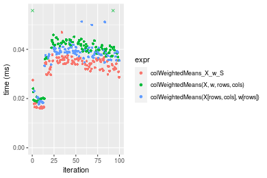


_Table: Benchmarking of colWeightedMeans_X_w_S() and rowWeightedMeans_X_w_S() on 10x10 data (original and transposed).  The top panel shows times in milliseconds and the bottom panel shows relative times._


|   |expr                   |    min|     lq|     mean| median|     uq|    max|
|:--|:----------------------|------:|------:|--------:|------:|------:|------:|
|2  |rowWeightedMeans_X_w_S | 19.352| 20.393| 20.81994| 20.613| 20.863| 34.929|
|1  |colWeightedMeans_X_w_S | 15.957| 31.859| 32.24461| 34.111| 35.537| 46.945|


|   |expr                   |       min|       lq|     mean|   median|      uq|      max|
|:--|:----------------------|---------:|--------:|--------:|--------:|-------:|--------:|
|2  |rowWeightedMeans_X_w_S | 1.0000000| 1.000000| 1.000000| 1.000000| 1.00000| 1.000000|
|1  |colWeightedMeans_X_w_S | 0.8245659| 1.562252| 1.548737| 1.654829| 1.70335| 1.344012|

_Figure: Benchmarking of colWeightedMeans_X_w_S() and rowWeightedMeans_X_w_S() on 10x10 data (original and transposed).  Outliers are displayed as crosses. Times are in milliseconds._


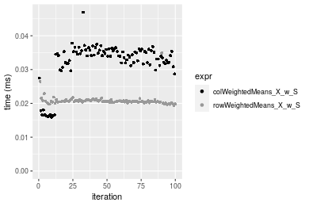

### 100x100 matrix


```r
> X <- data[["100x100"]]
> rows <- sample.int(nrow(X), size = nrow(X) * 0.7)
> cols <- sample.int(ncol(X), size = ncol(X) * 0.7)
> X_S <- X[rows, cols]
> w <- runif(nrow(X))
> w_S <- w[rows]
> gc()
          used  (Mb) gc trigger  (Mb) max used  (Mb)
Ncells 5260547 281.0   10014072 534.9 10014072 534.9
Vcells 9975097  76.2   18422267 140.6 18422267 140.6
> colStats <- microbenchmark(colWeightedMeans_X_w_S = colWeightedMeans(X_S, w = w_S, na.rm = FALSE), 
+     `colWeightedMeans(X, w, rows, cols)` = colWeightedMeans(X, w = w, rows = rows, cols = cols, na.rm = FALSE), 
+     `colWeightedMeans(X[rows, cols], w[rows])` = colWeightedMeans(X[rows, cols], w = w[rows], na.rm = FALSE), 
+     unit = "ms")
> X <- t(X)
> X_S <- t(X_S)
> gc()
          used  (Mb) gc trigger  (Mb) max used  (Mb)
Ncells 5260523 281.0   10014072 534.9 10014072 534.9
Vcells 9985150  76.2   18422267 140.6 18422267 140.6
> rowStats <- microbenchmark(rowWeightedMeans_X_w_S = rowWeightedMeans(X_S, w = w_S, na.rm = FALSE), 
+     `rowWeightedMeans(X, w, cols, rows)` = rowWeightedMeans(X, w = w, rows = cols, cols = rows, na.rm = FALSE), 
+     `rowWeightedMeans(X[cols, rows], w[rows])` = rowWeightedMeans(X[cols, rows], w = w[rows], na.rm = FALSE), 
+     unit = "ms")
```

_Table: Benchmarking of colWeightedMeans_X_w_S(), colWeightedMeans(X, w, rows, cols)() and colWeightedMeans(X[rows, cols], w[rows])() on 100x100 data. The top panel shows times in milliseconds and the bottom panel shows relative times._


|   |expr                                     |      min|        lq|      mean|   median|       uq|      max|
|:--|:----------------------------------------|--------:|---------:|---------:|--------:|--------:|--------:|
|1  |colWeightedMeans_X_w_S                   | 0.032479| 0.0334490| 0.0431363| 0.034622| 0.051995| 0.081943|
|3  |colWeightedMeans(X[rows, cols], w[rows]) | 0.050730| 0.0522870| 0.0687246| 0.053598| 0.090575| 0.146667|
|2  |colWeightedMeans(X, w, rows, cols)       | 0.068522| 0.0699635| 0.0909169| 0.071903| 0.117427| 0.184431|


|   |expr                                     |      min|       lq|     mean|   median|       uq|      max|
|:--|:----------------------------------------|--------:|--------:|--------:|--------:|--------:|--------:|
|1  |colWeightedMeans_X_w_S                   | 1.000000| 1.000000| 1.000000| 1.000000| 1.000000| 1.000000|
|3  |colWeightedMeans(X[rows, cols], w[rows]) | 1.561932| 1.563186| 1.593197| 1.548091| 1.741994| 1.789866|
|2  |colWeightedMeans(X, w, rows, cols)       | 2.109732| 2.091647| 2.107666| 2.076801| 2.258429| 2.250723|

_Table: Benchmarking of rowWeightedMeans_X_w_S(), rowWeightedMeans(X, w, cols, rows)() and rowWeightedMeans(X[cols, rows], w[rows])() on 100x100 data (transposed). The top panel shows times in milliseconds and the bottom panel shows relative times._


|   |expr                                     |      min|        lq|      mean|    median|        uq|      max|
|:--|:----------------------------------------|--------:|---------:|---------:|---------:|---------:|--------:|
|1  |rowWeightedMeans_X_w_S                   | 0.082797| 0.0862310| 0.0952645| 0.0903500| 0.1047245| 0.126246|
|3  |rowWeightedMeans(X[cols, rows], w[rows]) | 0.096580| 0.1010875| 0.1098769| 0.1046445| 0.1169485| 0.210871|
|2  |rowWeightedMeans(X, w, cols, rows)       | 0.110964| 0.1136445| 0.1235173| 0.1194525| 0.1314260| 0.165042|


|   |expr                                     |      min|       lq|     mean|   median|       uq|      max|
|:--|:----------------------------------------|--------:|--------:|--------:|--------:|--------:|--------:|
|1  |rowWeightedMeans_X_w_S                   | 1.000000| 1.000000| 1.000000| 1.000000| 1.000000| 1.000000|
|3  |rowWeightedMeans(X[cols, rows], w[rows]) | 1.166467| 1.172287| 1.153387| 1.158213| 1.116725| 1.670318|
|2  |rowWeightedMeans(X, w, cols, rows)       | 1.340194| 1.317908| 1.296572| 1.322108| 1.254969| 1.307305|

_Figure: Benchmarking of colWeightedMeans_X_w_S(), colWeightedMeans(X, w, rows, cols)() and colWeightedMeans(X[rows, cols], w[rows])() on 100x100 data  as well as rowWeightedMeans_X_w_S(), rowWeightedMeans(X, w, cols, rows)() and rowWeightedMeans(X[cols, rows], w[rows])() on the same data transposed.  Outliers are displayed as crosses.  Times are in milliseconds._


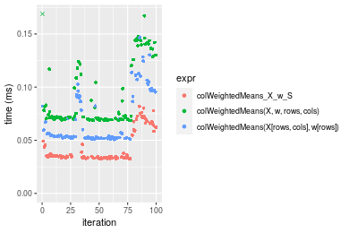

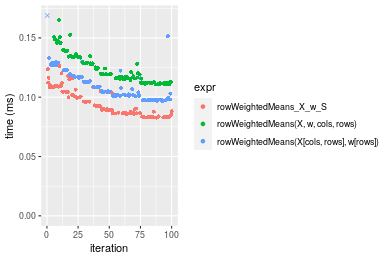
_Table: Benchmarking of colWeightedMeans_X_w_S() and rowWeightedMeans_X_w_S() on 100x100 data (original and transposed).  The top panel shows times in milliseconds and the bottom panel shows relative times._


|   |expr                   |    min|     lq|     mean| median|       uq|     max|
|:--|:----------------------|------:|------:|--------:|------:|--------:|-------:|
|1  |colWeightedMeans_X_w_S | 32.479| 33.449| 43.13628| 34.622|  51.9950|  81.943|
|2  |rowWeightedMeans_X_w_S | 82.797| 86.231| 95.26450| 90.350| 104.7245| 126.246|


|   |expr                   |      min|       lq|     mean|   median|       uq|      max|
|:--|:----------------------|--------:|--------:|--------:|--------:|--------:|--------:|
|1  |colWeightedMeans_X_w_S | 1.000000| 1.000000| 1.000000| 1.000000| 1.000000| 1.000000|
|2  |rowWeightedMeans_X_w_S | 2.549247| 2.577984| 2.208454| 2.609612| 2.014126| 1.540656|

_Figure: Benchmarking of colWeightedMeans_X_w_S() and rowWeightedMeans_X_w_S() on 100x100 data (original and transposed).  Outliers are displayed as crosses. Times are in milliseconds._


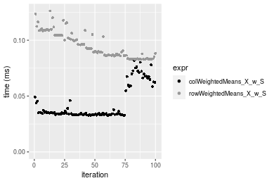

### 1000x10 matrix


```r
> X <- data[["1000x10"]]
> rows <- sample.int(nrow(X), size = nrow(X) * 0.7)
> cols <- sample.int(ncol(X), size = ncol(X) * 0.7)
> X_S <- X[rows, cols]
> w <- runif(nrow(X))
> w_S <- w[rows]
> gc()
          used  (Mb) gc trigger  (Mb) max used  (Mb)
Ncells 5261297 281.0   10014072 534.9 10014072 534.9
Vcells 9981010  76.2   18422267 140.6 18422267 140.6
> colStats <- microbenchmark(colWeightedMeans_X_w_S = colWeightedMeans(X_S, w = w_S, na.rm = FALSE), 
+     `colWeightedMeans(X, w, rows, cols)` = colWeightedMeans(X, w = w, rows = rows, cols = cols, na.rm = FALSE), 
+     `colWeightedMeans(X[rows, cols], w[rows])` = colWeightedMeans(X[rows, cols], w = w[rows], na.rm = FALSE), 
+     unit = "ms")
> X <- t(X)
> X_S <- t(X_S)
> gc()
          used  (Mb) gc trigger  (Mb) max used  (Mb)
Ncells 5261273 281.0   10014072 534.9 10014072 534.9
Vcells 9991063  76.3   18422267 140.6 18422267 140.6
> rowStats <- microbenchmark(rowWeightedMeans_X_w_S = rowWeightedMeans(X_S, w = w_S, na.rm = FALSE), 
+     `rowWeightedMeans(X, w, cols, rows)` = rowWeightedMeans(X, w = w, rows = cols, cols = rows, na.rm = FALSE), 
+     `rowWeightedMeans(X[cols, rows], w[rows])` = rowWeightedMeans(X[cols, rows], w = w[rows], na.rm = FALSE), 
+     unit = "ms")
```

_Table: Benchmarking of colWeightedMeans_X_w_S(), colWeightedMeans(X, w, rows, cols)() and colWeightedMeans(X[rows, cols], w[rows])() on 1000x10 data. The top panel shows times in milliseconds and the bottom panel shows relative times._


|   |expr                                     |      min|        lq|      mean|    median|        uq|      max|
|:--|:----------------------------------------|--------:|---------:|---------:|---------:|---------:|--------:|
|1  |colWeightedMeans_X_w_S                   | 0.038473| 0.0404465| 0.0437001| 0.0432115| 0.0463135| 0.060369|
|3  |colWeightedMeans(X[rows, cols], w[rows]) | 0.055063| 0.0580070| 0.0622311| 0.0611680| 0.0661220| 0.083333|
|2  |colWeightedMeans(X, w, rows, cols)       | 0.071601| 0.0775650| 0.0836877| 0.0827635| 0.0887100| 0.165262|


|   |expr                                     |      min|       lq|     mean|   median|       uq|      max|
|:--|:----------------------------------------|--------:|--------:|--------:|--------:|--------:|--------:|
|1  |colWeightedMeans_X_w_S                   | 1.000000| 1.000000| 1.000000| 1.000000| 1.000000| 1.000000|
|3  |colWeightedMeans(X[rows, cols], w[rows]) | 1.431212| 1.434166| 1.424048| 1.415549| 1.427705| 1.380394|
|2  |colWeightedMeans(X, w, rows, cols)       | 1.861071| 1.917719| 1.915046| 1.915312| 1.915424| 2.737531|

_Table: Benchmarking of rowWeightedMeans_X_w_S(), rowWeightedMeans(X, w, cols, rows)() and rowWeightedMeans(X[cols, rows], w[rows])() on 1000x10 data (transposed). The top panel shows times in milliseconds and the bottom panel shows relative times._


|   |expr                                     |      min|        lq|      mean|   median|        uq|      max|
|:--|:----------------------------------------|--------:|---------:|---------:|--------:|---------:|--------:|
|1  |rowWeightedMeans_X_w_S                   | 0.086948| 0.0955700| 0.1084610| 0.100187| 0.1165440| 0.168813|
|3  |rowWeightedMeans(X[cols, rows], w[rows]) | 0.104146| 0.1127065| 0.1250684| 0.119638| 0.1335940| 0.226073|
|2  |rowWeightedMeans(X, w, cols, rows)       | 0.121671| 0.1340950| 0.1503904| 0.142997| 0.1578525| 0.273920|


|   |expr                                     |      min|       lq|     mean|   median|       uq|      max|
|:--|:----------------------------------------|--------:|--------:|--------:|--------:|--------:|--------:|
|1  |rowWeightedMeans_X_w_S                   | 1.000000| 1.000000| 1.000000| 1.000000| 1.000000| 1.000000|
|3  |rowWeightedMeans(X[cols, rows], w[rows]) | 1.197796| 1.179308| 1.153118| 1.194147| 1.146297| 1.339192|
|2  |rowWeightedMeans(X, w, cols, rows)       | 1.399354| 1.403108| 1.386585| 1.427301| 1.354445| 1.622624|

_Figure: Benchmarking of colWeightedMeans_X_w_S(), colWeightedMeans(X, w, rows, cols)() and colWeightedMeans(X[rows, cols], w[rows])() on 1000x10 data  as well as rowWeightedMeans_X_w_S(), rowWeightedMeans(X, w, cols, rows)() and rowWeightedMeans(X[cols, rows], w[rows])() on the same data transposed.  Outliers are displayed as crosses.  Times are in milliseconds._


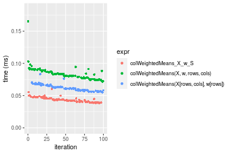

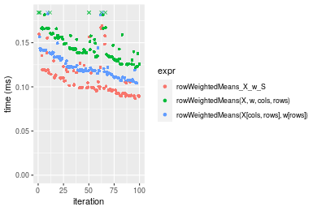
_Table: Benchmarking of colWeightedMeans_X_w_S() and rowWeightedMeans_X_w_S() on 1000x10 data (original and transposed).  The top panel shows times in milliseconds and the bottom panel shows relative times._


|   |expr                   |    min|      lq|      mean|   median|       uq|     max|
|:--|:----------------------|------:|-------:|---------:|--------:|--------:|-------:|
|1  |colWeightedMeans_X_w_S | 38.473| 40.4465|  43.70011|  43.2115|  46.3135|  60.369|
|2  |rowWeightedMeans_X_w_S | 86.948| 95.5700| 108.46102| 100.1870| 116.5440| 168.813|


|   |expr                   |      min|       lq|     mean|   median|       uq|      max|
|:--|:----------------------|--------:|--------:|--------:|--------:|--------:|--------:|
|1  |colWeightedMeans_X_w_S | 1.000000| 1.000000| 1.000000| 1.000000| 1.000000| 1.000000|
|2  |rowWeightedMeans_X_w_S | 2.259975| 2.362874| 2.481939| 2.318526| 2.516415| 2.796352|

_Figure: Benchmarking of colWeightedMeans_X_w_S() and rowWeightedMeans_X_w_S() on 1000x10 data (original and transposed).  Outliers are displayed as crosses. Times are in milliseconds._


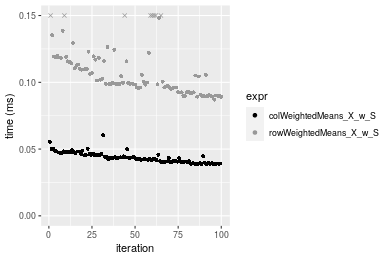

### 10x1000 matrix


```r
> X <- data[["10x1000"]]
> rows <- sample.int(nrow(X), size = nrow(X) * 0.7)
> cols <- sample.int(ncol(X), size = ncol(X) * 0.7)
> X_S <- X[rows, cols]
> w <- runif(nrow(X))
> w_S <- w[rows]
> gc()
          used  (Mb) gc trigger  (Mb) max used  (Mb)
Ncells 5261509 281.0   10014072 534.9 10014072 534.9
Vcells 9980299  76.2   18422267 140.6 18422267 140.6
> colStats <- microbenchmark(colWeightedMeans_X_w_S = colWeightedMeans(X_S, w = w_S, na.rm = FALSE), 
+     `colWeightedMeans(X, w, rows, cols)` = colWeightedMeans(X, w = w, rows = rows, cols = cols, na.rm = FALSE), 
+     `colWeightedMeans(X[rows, cols], w[rows])` = colWeightedMeans(X[rows, cols], w = w[rows], na.rm = FALSE), 
+     unit = "ms")
> X <- t(X)
> X_S <- t(X_S)
> gc()
          used  (Mb) gc trigger  (Mb) max used  (Mb)
Ncells 5261485 281.0   10014072 534.9 10014072 534.9
Vcells 9990352  76.3   18422267 140.6 18422267 140.6
> rowStats <- microbenchmark(rowWeightedMeans_X_w_S = rowWeightedMeans(X_S, w = w_S, na.rm = FALSE), 
+     `rowWeightedMeans(X, w, cols, rows)` = rowWeightedMeans(X, w = w, rows = cols, cols = rows, na.rm = FALSE), 
+     `rowWeightedMeans(X[cols, rows], w[rows])` = rowWeightedMeans(X[cols, rows], w = w[rows], na.rm = FALSE), 
+     unit = "ms")
```

_Table: Benchmarking of colWeightedMeans_X_w_S(), colWeightedMeans(X, w, rows, cols)() and colWeightedMeans(X[rows, cols], w[rows])() on 10x1000 data. The top panel shows times in milliseconds and the bottom panel shows relative times._


|   |expr                                     |      min|        lq|      mean|    median|        uq|      max|
|:--|:----------------------------------------|--------:|---------:|---------:|---------:|---------:|--------:|
|1  |colWeightedMeans_X_w_S                   | 0.025515| 0.0284955| 0.0314786| 0.0295950| 0.0311775| 0.099825|
|3  |colWeightedMeans(X[rows, cols], w[rows]) | 0.043035| 0.0472160| 0.0503524| 0.0490785| 0.0512820| 0.094912|
|2  |colWeightedMeans(X, w, rows, cols)       | 0.059232| 0.0653740| 0.0692077| 0.0676330| 0.0708605| 0.097304|


|   |expr                                     |      min|       lq|     mean|   median|       uq|       max|
|:--|:----------------------------------------|--------:|--------:|--------:|--------:|--------:|---------:|
|1  |colWeightedMeans_X_w_S                   | 1.000000| 1.000000| 1.000000| 1.000000| 1.000000| 1.0000000|
|3  |colWeightedMeans(X[rows, cols], w[rows]) | 1.686655| 1.656963| 1.599575| 1.658338| 1.644840| 0.9507839|
|2  |colWeightedMeans(X, w, rows, cols)       | 2.321458| 2.294187| 2.198563| 2.285285| 2.272809| 0.9747458|

_Table: Benchmarking of rowWeightedMeans_X_w_S(), rowWeightedMeans(X, w, cols, rows)() and rowWeightedMeans(X[cols, rows], w[rows])() on 10x1000 data (transposed). The top panel shows times in milliseconds and the bottom panel shows relative times._


|   |expr                                     |      min|        lq|      mean|    median|        uq|      max|
|:--|:----------------------------------------|--------:|---------:|---------:|---------:|---------:|--------:|
|1  |rowWeightedMeans_X_w_S                   | 0.078007| 0.0825810| 0.0885918| 0.0870310| 0.0933340| 0.127954|
|3  |rowWeightedMeans(X[cols, rows], w[rows]) | 0.091814| 0.0956900| 0.1024784| 0.0996225| 0.1059565| 0.141111|
|2  |rowWeightedMeans(X, w, cols, rows)       | 0.105068| 0.1097145| 0.1189645| 0.1145670| 0.1213025| 0.228617|


|   |expr                                     |      min|       lq|     mean|   median|      uq|      max|
|:--|:----------------------------------------|--------:|--------:|--------:|--------:|-------:|--------:|
|1  |rowWeightedMeans_X_w_S                   | 1.000000| 1.000000| 1.000000| 1.000000| 1.00000| 1.000000|
|3  |rowWeightedMeans(X[cols, rows], w[rows]) | 1.176997| 1.158741| 1.156748| 1.144678| 1.13524| 1.102826|
|2  |rowWeightedMeans(X, w, cols, rows)       | 1.346905| 1.328568| 1.342838| 1.316393| 1.29966| 1.786712|

_Figure: Benchmarking of colWeightedMeans_X_w_S(), colWeightedMeans(X, w, rows, cols)() and colWeightedMeans(X[rows, cols], w[rows])() on 10x1000 data  as well as rowWeightedMeans_X_w_S(), rowWeightedMeans(X, w, cols, rows)() and rowWeightedMeans(X[cols, rows], w[rows])() on the same data transposed.  Outliers are displayed as crosses.  Times are in milliseconds._


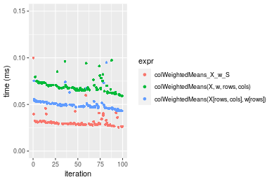

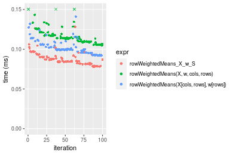
_Table: Benchmarking of colWeightedMeans_X_w_S() and rowWeightedMeans_X_w_S() on 10x1000 data (original and transposed).  The top panel shows times in milliseconds and the bottom panel shows relative times._


|   |expr                   |    min|      lq|     mean| median|      uq|     max|
|:--|:----------------------|------:|-------:|--------:|------:|-------:|-------:|
|1  |colWeightedMeans_X_w_S | 25.515| 28.4955| 31.47861| 29.595| 31.1775|  99.825|
|2  |rowWeightedMeans_X_w_S | 78.007| 82.5810| 88.59185| 87.031| 93.3340| 127.954|


|   |expr                   |    min|       lq|     mean|   median|       uq|      max|
|:--|:----------------------|------:|--------:|--------:|--------:|--------:|--------:|
|1  |colWeightedMeans_X_w_S | 1.0000| 1.000000| 1.000000| 1.000000| 1.000000| 1.000000|
|2  |rowWeightedMeans_X_w_S | 3.0573| 2.898036| 2.814351| 2.940733| 2.993633| 1.281783|

_Figure: Benchmarking of colWeightedMeans_X_w_S() and rowWeightedMeans_X_w_S() on 10x1000 data (original and transposed).  Outliers are displayed as crosses. Times are in milliseconds._


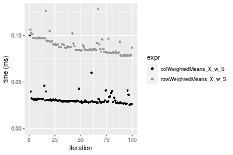

### 100x1000 matrix


```r
> X <- data[["100x1000"]]
> rows <- sample.int(nrow(X), size = nrow(X) * 0.7)
> cols <- sample.int(ncol(X), size = ncol(X) * 0.7)
> X_S <- X[rows, cols]
> w <- runif(nrow(X))
> w_S <- w[rows]
> gc()
           used  (Mb) gc trigger  (Mb) max used  (Mb)
Ncells  5261717 281.1   10014072 534.9 10014072 534.9
Vcells 10025251  76.5   18422267 140.6 18422267 140.6
> colStats <- microbenchmark(colWeightedMeans_X_w_S = colWeightedMeans(X_S, w = w_S, na.rm = FALSE), 
+     `colWeightedMeans(X, w, rows, cols)` = colWeightedMeans(X, w = w, rows = rows, cols = cols, na.rm = FALSE), 
+     `colWeightedMeans(X[rows, cols], w[rows])` = colWeightedMeans(X[rows, cols], w = w[rows], na.rm = FALSE), 
+     unit = "ms")
> X <- t(X)
> X_S <- t(X_S)
> gc()
           used  (Mb) gc trigger  (Mb) max used  (Mb)
Ncells  5261693 281.1   10014072 534.9 10014072 534.9
Vcells 10125304  77.3   18422267 140.6 18422267 140.6
> rowStats <- microbenchmark(rowWeightedMeans_X_w_S = rowWeightedMeans(X_S, w = w_S, na.rm = FALSE), 
+     `rowWeightedMeans(X, w, cols, rows)` = rowWeightedMeans(X, w = w, rows = cols, cols = rows, na.rm = FALSE), 
+     `rowWeightedMeans(X[cols, rows], w[rows])` = rowWeightedMeans(X[cols, rows], w = w[rows], na.rm = FALSE), 
+     unit = "ms")
```

_Table: Benchmarking of colWeightedMeans_X_w_S(), colWeightedMeans(X, w, rows, cols)() and colWeightedMeans(X[rows, cols], w[rows])() on 100x1000 data. The top panel shows times in milliseconds and the bottom panel shows relative times._


|   |expr                                     |      min|        lq|      mean|    median|        uq|      max|
|:--|:----------------------------------------|--------:|---------:|---------:|---------:|---------:|--------:|
|1  |colWeightedMeans_X_w_S                   | 0.122202| 0.1371040| 0.2646144| 0.1940115| 0.2445140| 6.557863|
|3  |colWeightedMeans(X[rows, cols], w[rows]) | 0.244762| 0.2893800| 0.5294539| 0.4307335| 0.5599855| 8.267516|
|2  |colWeightedMeans(X, w, rows, cols)       | 0.377611| 0.4342515| 0.6743830| 0.5704685| 0.7448905| 8.620801|


|   |expr                                     |      min|       lq|     mean|   median|       uq|      max|
|:--|:----------------------------------------|--------:|--------:|--------:|--------:|--------:|--------:|
|1  |colWeightedMeans_X_w_S                   | 1.000000| 1.000000| 1.000000| 1.000000| 1.000000| 1.000000|
|3  |colWeightedMeans(X[rows, cols], w[rows]) | 2.002930| 2.110660| 2.000851| 2.220144| 2.290198| 1.260703|
|2  |colWeightedMeans(X, w, rows, cols)       | 3.090056| 3.167315| 2.548550| 2.940385| 3.046413| 1.314575|

_Table: Benchmarking of rowWeightedMeans_X_w_S(), rowWeightedMeans(X, w, cols, rows)() and rowWeightedMeans(X[cols, rows], w[rows])() on 100x1000 data (transposed). The top panel shows times in milliseconds and the bottom panel shows relative times._


|   |expr                                     |      min|        lq|      mean|    median|        uq|      max|
|:--|:----------------------------------------|--------:|---------:|---------:|---------:|---------:|--------:|
|1  |rowWeightedMeans_X_w_S                   | 0.519570| 0.5420915| 0.6848259| 0.6350015| 0.6882105| 6.014272|
|3  |rowWeightedMeans(X[cols, rows], w[rows]) | 0.614878| 0.6390580| 0.7887904| 0.7306405| 0.8062035| 6.280336|
|2  |rowWeightedMeans(X, w, cols, rows)       | 0.708479| 0.7563675| 0.9689387| 0.8902355| 1.0187755| 6.972068|


|   |expr                                     |      min|       lq|     mean|   median|       uq|      max|
|:--|:----------------------------------------|--------:|--------:|--------:|--------:|--------:|--------:|
|1  |rowWeightedMeans_X_w_S                   | 1.000000| 1.000000| 1.000000| 1.000000| 1.000000| 1.000000|
|3  |rowWeightedMeans(X[cols, rows], w[rows]) | 1.183436| 1.178875| 1.151811| 1.150612| 1.171449| 1.044239|
|2  |rowWeightedMeans(X, w, cols, rows)       | 1.363587| 1.395276| 1.414869| 1.401942| 1.480325| 1.159254|

_Figure: Benchmarking of colWeightedMeans_X_w_S(), colWeightedMeans(X, w, rows, cols)() and colWeightedMeans(X[rows, cols], w[rows])() on 100x1000 data  as well as rowWeightedMeans_X_w_S(), rowWeightedMeans(X, w, cols, rows)() and rowWeightedMeans(X[cols, rows], w[rows])() on the same data transposed.  Outliers are displayed as crosses.  Times are in milliseconds._


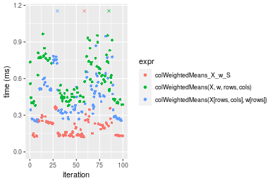


_Table: Benchmarking of colWeightedMeans_X_w_S() and rowWeightedMeans_X_w_S() on 100x1000 data (original and transposed).  The top panel shows times in milliseconds and the bottom panel shows relative times._


|   |expr                   |     min|       lq|     mean|   median|       uq|      max|
|:--|:----------------------|-------:|--------:|--------:|--------:|--------:|--------:|
|1  |colWeightedMeans_X_w_S | 122.202| 137.1040| 264.6144| 194.0115| 244.5140| 6557.863|
|2  |rowWeightedMeans_X_w_S | 519.570| 542.0915| 684.8259| 635.0015| 688.2105| 6014.272|


|   |expr                   |      min|       lq|     mean|  median|       uq|       max|
|:--|:----------------------|--------:|--------:|--------:|-------:|--------:|---------:|
|1  |colWeightedMeans_X_w_S | 1.000000| 1.000000| 1.000000| 1.00000| 1.000000| 1.0000000|
|2  |rowWeightedMeans_X_w_S | 4.251731| 3.953871| 2.588015| 3.27301| 2.814606| 0.9171085|

_Figure: Benchmarking of colWeightedMeans_X_w_S() and rowWeightedMeans_X_w_S() on 100x1000 data (original and transposed).  Outliers are displayed as crosses. Times are in milliseconds._


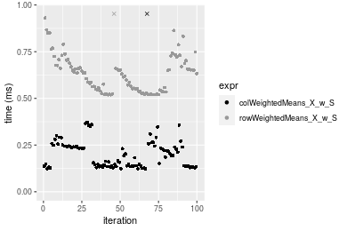

### 1000x100 matrix


```r
> X <- data[["1000x100"]]
> rows <- sample.int(nrow(X), size = nrow(X) * 0.7)
> cols <- sample.int(ncol(X), size = ncol(X) * 0.7)
> X_S <- X[rows, cols]
> w <- runif(nrow(X))
> w_S <- w[rows]
> gc()
           used  (Mb) gc trigger  (Mb) max used  (Mb)
Ncells  5261923 281.1   10014072 534.9 10014072 534.9
Vcells 10027562  76.6   18422267 140.6 18422267 140.6
> colStats <- microbenchmark(colWeightedMeans_X_w_S = colWeightedMeans(X_S, w = w_S, na.rm = FALSE), 
+     `colWeightedMeans(X, w, rows, cols)` = colWeightedMeans(X, w = w, rows = rows, cols = cols, na.rm = FALSE), 
+     `colWeightedMeans(X[rows, cols], w[rows])` = colWeightedMeans(X[rows, cols], w = w[rows], na.rm = FALSE), 
+     unit = "ms")
> X <- t(X)
> X_S <- t(X_S)
> gc()
           used  (Mb) gc trigger  (Mb) max used  (Mb)
Ncells  5261899 281.1   10014072 534.9 10014072 534.9
Vcells 10127615  77.3   18422267 140.6 18422267 140.6
> rowStats <- microbenchmark(rowWeightedMeans_X_w_S = rowWeightedMeans(X_S, w = w_S, na.rm = FALSE), 
+     `rowWeightedMeans(X, w, cols, rows)` = rowWeightedMeans(X, w = w, rows = cols, cols = rows, na.rm = FALSE), 
+     `rowWeightedMeans(X[cols, rows], w[rows])` = rowWeightedMeans(X[cols, rows], w = w[rows], na.rm = FALSE), 
+     unit = "ms")
```

_Table: Benchmarking of colWeightedMeans_X_w_S(), colWeightedMeans(X, w, rows, cols)() and colWeightedMeans(X[rows, cols], w[rows])() on 1000x100 data. The top panel shows times in milliseconds and the bottom panel shows relative times._


|   |expr                                     |      min|        lq|      mean|   median|        uq|      max|
|:--|:----------------------------------------|--------:|---------:|---------:|--------:|---------:|--------:|
|1  |colWeightedMeans_X_w_S                   | 0.130101| 0.1385335| 0.1629052| 0.145321| 0.1661625| 0.303046|
|3  |colWeightedMeans(X[rows, cols], w[rows]) | 0.250249| 0.2598945| 0.3623382| 0.277358| 0.2928390| 6.676818|
|2  |colWeightedMeans(X, w, rows, cols)       | 0.369641| 0.3825280| 0.5704830| 0.412696| 0.4559060| 6.145631|


|   |expr                                     |      min|       lq|     mean|   median|       uq|      max|
|:--|:----------------------------------------|--------:|--------:|--------:|--------:|--------:|--------:|
|1  |colWeightedMeans_X_w_S                   | 1.000000| 1.000000| 1.000000| 1.000000| 1.000000|  1.00000|
|3  |colWeightedMeans(X[rows, cols], w[rows]) | 1.923498| 1.876041| 2.224227| 1.908589| 1.762365| 22.03236|
|2  |colWeightedMeans(X, w, rows, cols)       | 2.841185| 2.761267| 3.501933| 2.839892| 2.743736| 20.27953|

_Table: Benchmarking of rowWeightedMeans_X_w_S(), rowWeightedMeans(X, w, cols, rows)() and rowWeightedMeans(X[cols, rows], w[rows])() on 1000x100 data (transposed). The top panel shows times in milliseconds and the bottom panel shows relative times._


|   |expr                                     |      min|        lq|      mean|   median|        uq|       max|
|:--|:----------------------------------------|--------:|---------:|---------:|--------:|---------:|---------:|
|1  |rowWeightedMeans_X_w_S                   | 0.582869| 0.7111495| 0.8065668| 0.758132| 0.9091485|  1.092867|
|3  |rowWeightedMeans(X[cols, rows], w[rows]) | 0.697924| 0.8402410| 1.1065823| 1.007362| 1.2535320|  6.890299|
|2  |rowWeightedMeans(X, w, cols, rows)       | 0.818349| 1.0759615| 1.4996495| 1.221821| 1.5182925| 12.985814|


|   |expr                                     |      min|       lq|     mean|   median|       uq|       max|
|:--|:----------------------------------------|--------:|--------:|--------:|--------:|--------:|---------:|
|1  |rowWeightedMeans_X_w_S                   | 1.000000| 1.000000| 1.000000| 1.000000| 1.000000|  1.000000|
|3  |rowWeightedMeans(X[cols, rows], w[rows]) | 1.197394| 1.181525| 1.371966| 1.328742| 1.378798|  6.304792|
|2  |rowWeightedMeans(X, w, cols, rows)       | 1.404002| 1.512989| 1.859300| 1.611621| 1.670016| 11.882337|

_Figure: Benchmarking of colWeightedMeans_X_w_S(), colWeightedMeans(X, w, rows, cols)() and colWeightedMeans(X[rows, cols], w[rows])() on 1000x100 data  as well as rowWeightedMeans_X_w_S(), rowWeightedMeans(X, w, cols, rows)() and rowWeightedMeans(X[cols, rows], w[rows])() on the same data transposed.  Outliers are displayed as crosses.  Times are in milliseconds._


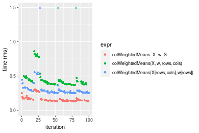

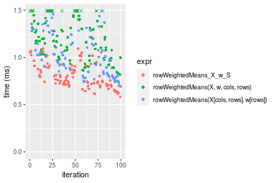
_Table: Benchmarking of colWeightedMeans_X_w_S() and rowWeightedMeans_X_w_S() on 1000x100 data (original and transposed).  The top panel shows times in milliseconds and the bottom panel shows relative times._


|   |expr                   |     min|       lq|     mean|  median|       uq|      max|
|:--|:----------------------|-------:|--------:|--------:|-------:|--------:|--------:|
|1  |colWeightedMeans_X_w_S | 130.101| 138.5335| 162.9052| 145.321| 166.1625|  303.046|
|2  |rowWeightedMeans_X_w_S | 582.869| 711.1495| 806.5668| 758.132| 909.1485| 1092.867|


|   |expr                   |      min|       lq|     mean|   median|       uq|      max|
|:--|:----------------------|--------:|--------:|--------:|--------:|--------:|--------:|
|1  |colWeightedMeans_X_w_S | 1.000000| 1.000000| 1.000000| 1.000000| 1.000000| 1.000000|
|2  |rowWeightedMeans_X_w_S | 4.480127| 5.133412| 4.951143| 5.216947| 5.471442| 3.606274|

_Figure: Benchmarking of colWeightedMeans_X_w_S() and rowWeightedMeans_X_w_S() on 1000x100 data (original and transposed).  Outliers are displayed as crosses. Times are in milliseconds._


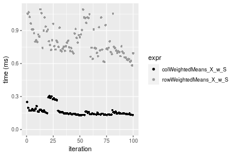


## Appendix

### Session information
```r
R version 4.1.1 Patched (2021-08-10 r80727)
Platform: x86_64-pc-linux-gnu (64-bit)
Running under: Ubuntu 18.04.5 LTS

Matrix products: default
BLAS:   /home/hb/software/R-devel/R-4-1-branch/lib/R/lib/libRblas.so
LAPACK: /home/hb/software/R-devel/R-4-1-branch/lib/R/lib/libRlapack.so

locale:
 [1] LC_CTYPE=en_US.UTF-8       LC_NUMERIC=C              
 [3] LC_TIME=en_US.UTF-8        LC_COLLATE=en_US.UTF-8    
 [5] LC_MONETARY=en_US.UTF-8    LC_MESSAGES=en_US.UTF-8   
 [7] LC_PAPER=en_US.UTF-8       LC_NAME=C                 
 [9] LC_ADDRESS=C               LC_TELEPHONE=C            
[11] LC_MEASUREMENT=en_US.UTF-8 LC_IDENTIFICATION=C       

attached base packages:
[1] stats     graphics  grDevices utils     datasets  methods   base     

other attached packages:
[1] microbenchmark_1.4-7   matrixStats_0.60.1     ggplot2_3.3.5         
[4] knitr_1.33             R.devices_2.17.0       R.utils_2.10.1        
[7] R.oo_1.24.0            R.methodsS3_1.8.1-9001 history_0.0.1-9000    

loaded via a namespace (and not attached):
 [1] Biobase_2.52.0          httr_1.4.2              splines_4.1.1          
 [4] bit64_4.0.5             network_1.17.1          assertthat_0.2.1       
 [7] highr_0.9               stats4_4.1.1            blob_1.2.2             
[10] GenomeInfoDbData_1.2.6  robustbase_0.93-8       pillar_1.6.2           
[13] RSQLite_2.2.8           lattice_0.20-44         glue_1.4.2             
[16] digest_0.6.27           XVector_0.32.0          colorspace_2.0-2       
[19] Matrix_1.3-4            XML_3.99-0.7            pkgconfig_2.0.3        
[22] zlibbioc_1.38.0         genefilter_1.74.0       purrr_0.3.4            
[25] ergm_4.1.2              xtable_1.8-4            scales_1.1.1           
[28] tibble_3.1.4            annotate_1.70.0         KEGGREST_1.32.0        
[31] farver_2.1.0            generics_0.1.0          IRanges_2.26.0         
[34] ellipsis_0.3.2          cachem_1.0.6            withr_2.4.2            
[37] BiocGenerics_0.38.0     mime_0.11               survival_3.2-13        
[40] magrittr_2.0.1          crayon_1.4.1            statnet.common_4.5.0   
[43] memoise_2.0.0           laeken_0.5.1            fansi_0.5.0            
[46] R.cache_0.15.0          MASS_7.3-54             R.rsp_0.44.0           
[49] progressr_0.8.0         tools_4.1.1             lifecycle_1.0.0        
[52] S4Vectors_0.30.0        trust_0.1-8             munsell_0.5.0          
[55] tabby_0.0.1-9001        AnnotationDbi_1.54.1    Biostrings_2.60.2      
[58] compiler_4.1.1          GenomeInfoDb_1.28.1     rlang_0.4.11           
[61] grid_4.1.1              RCurl_1.98-1.4          cwhmisc_6.6            
[64] rappdirs_0.3.3          startup_0.15.0          labeling_0.4.2         
[67] bitops_1.0-7            base64enc_0.1-3         boot_1.3-28            
[70] gtable_0.3.0            DBI_1.1.1               markdown_1.1           
[73] R6_2.5.1                lpSolveAPI_5.5.2.0-17.7 rle_0.9.2              
[76] dplyr_1.0.7             fastmap_1.1.0           bit_4.0.4              
[79] utf8_1.2.2              parallel_4.1.1          Rcpp_1.0.7             
[82] vctrs_0.3.8             png_0.1-7               DEoptimR_1.0-9         
[85] tidyselect_1.1.1        xfun_0.25               coda_0.19-4            
```
Total processing time was 13.2 secs.


### Reproducibility
To reproduce this report, do:
```r
html <- matrixStats:::benchmark('colRowWeightedMeans_subset')
```

[RSP]: https://cran.r-project.org/package=R.rsp
[matrixStats]: https://cran.r-project.org/package=matrixStats

[StackOverflow:colMins?]: https://stackoverflow.com/questions/13676878 "Stack Overflow: fastest way to get Min from every column in a matrix?"
[StackOverflow:colSds?]: https://stackoverflow.com/questions/17549762 "Stack Overflow: Is there such 'colsd' in R?"
[StackOverflow:rowProds?]: https://stackoverflow.com/questions/20198801/ "Stack Overflow: Row product of matrix and column sum of matrix"

---------------------------------------
Copyright Dongcan Jiang. Last updated on 2021-08-25 18:18:05 (+0200 UTC). Powered by [RSP].

<script>
 var link = document.createElement('link');
 link.rel = 'icon';
 link.href = "data:image/png;base64,iVBORw0KGgoAAAANSUhEUgAAACAAAAAgCAMAAABEpIrGAAAA21BMVEUAAAAAAP8AAP8AAP8AAP8AAP8AAP8AAP8AAP8AAP8AAP8AAP8AAP8AAP8AAP8AAP8AAP8AAP8AAP8AAP8AAP8AAP8AAP8AAP8AAP8AAP8AAP8AAP8AAP8AAP8AAP8AAP8AAP8AAP8AAP8AAP8AAP8AAP8AAP8AAP8AAP8AAP8BAf4CAv0DA/wdHeIeHuEfH+AgIN8hId4lJdomJtknJ9g+PsE/P8BAQL9yco10dIt1dYp3d4h4eIeVlWqWlmmXl2iYmGeZmWabm2Tn5xjo6Bfp6Rb39wj4+Af//wA2M9hbAAAASXRSTlMAAQIJCgsMJSYnKD4/QGRlZmhpamtsbautrrCxuru8y8zN5ebn6Pn6+///////////////////////////////////////////LsUNcQAAAS9JREFUOI29k21XgkAQhVcFytdSMqMETU26UVqGmpaiFbL//xc1cAhhwVNf6n5i5z67M2dmYOyfJZUqlVLhkKucG7cgmUZTybDz6g0iDeq51PUr37Ds2cy2/C9NeES5puDjxuUk1xnToZsg8pfA3avHQ3lLIi7iWRrkv/OYtkScxBIMgDee0ALoyxHQBJ68JLCjOtQIMIANF7QG9G9fNnHvisCHBVMKgSJgiz7nE+AoBKrAPA3MgepvgR9TSCasrCKH0eB1wBGBFdCO+nAGjMVGPcQb5bd6mQRegN6+1axOs9nGfYcCtfi4NQosdtH7dB+txFIpXQqN1p9B/asRHToyS0jRgpV7nk4nwcq1BJ+x3Gl/v7S9Wmpp/aGquum7w3ZDyrADFYrl8vHBH+ev9AUASW1dmU4h4wAAAABJRU5ErkJggg=="
 document.getElementsByTagName('head')[0].appendChild(link);
</script>


