[matrixStats]: Benchmark report

---------------------------------------


# colWeightedMedians() and rowWeightedMedians() benchmarks

This report benchmark the performance of colWeightedMedians() and rowWeightedMedians() against alternative methods.

## Alternative methods

* apply() + weightedMedian()


## Data
```r
> rmatrix <- function(nrow, ncol, mode = c("logical", "double", "integer", "index"), range = c(-100, 
+     +100), na_prob = 0) {
+     mode <- match.arg(mode)
+     n <- nrow * ncol
+     if (mode == "logical") {
+         x <- sample(c(FALSE, TRUE), size = n, replace = TRUE)
+     }     else if (mode == "index") {
+         x <- seq_len(n)
+         mode <- "integer"
+     }     else {
+         x <- runif(n, min = range[1], max = range[2])
+     }
+     storage.mode(x) <- mode
+     if (na_prob > 0) 
+         x[sample(n, size = na_prob * n)] <- NA
+     dim(x) <- c(nrow, ncol)
+     x
+ }
> rmatrices <- function(scale = 10, seed = 1, ...) {
+     set.seed(seed)
+     data <- list()
+     data[[1]] <- rmatrix(nrow = scale * 1, ncol = scale * 1, ...)
+     data[[2]] <- rmatrix(nrow = scale * 10, ncol = scale * 10, ...)
+     data[[3]] <- rmatrix(nrow = scale * 100, ncol = scale * 1, ...)
+     data[[4]] <- t(data[[3]])
+     data[[5]] <- rmatrix(nrow = scale * 10, ncol = scale * 100, ...)
+     data[[6]] <- t(data[[5]])
+     names(data) <- sapply(data, FUN = function(x) paste(dim(x), collapse = "x"))
+     data
+ }
> data <- rmatrices(mode = "double")
```

## Results

### 10x10 matrix


```r
> X <- data[["10x10"]]
> w <- runif(nrow(X))
> gc()
           used  (Mb) gc trigger  (Mb) max used  (Mb)
Ncells  5286019 282.4   10014072 534.9 10014072 534.9
Vcells 10484981  80.0   18422267 140.6 18422267 140.6
> colStats <- microbenchmark(colWeightedMedians = colWeightedMedians(X, w = w, na.rm = FALSE), `apply+weigthedMedian` = apply(X, 
+     MARGIN = 2L, FUN = weightedMedian, w = w, na.rm = FALSE), unit = "ms")
> X <- t(X)
> gc()
           used  (Mb) gc trigger  (Mb) max used  (Mb)
Ncells  5270693 281.5   10014072 534.9 10014072 534.9
Vcells 10434398  79.7   18422267 140.6 18422267 140.6
> rowStats <- microbenchmark(rowWeightedMedians = rowWeightedMedians(X, w = w, na.rm = FALSE), `apply+weigthedMedian` = apply(X, 
+     MARGIN = 1L, FUN = weightedMedian, w = w, na.rm = FALSE), unit = "ms")
```

_Table: Benchmarking of colWeightedMedians() and apply+weigthedMedian() on 10x10 data. The top panel shows times in milliseconds and the bottom panel shows relative times._


|   |expr                 |      min|        lq|      mean|    median|       uq|      max|
|:--|:--------------------|--------:|---------:|---------:|---------:|--------:|--------:|
|2  |apply+weigthedMedian | 0.057639| 0.0622555| 0.0650374| 0.0645765| 0.066134| 0.152472|
|1  |colWeightedMedians   | 0.071337| 0.0748675| 0.0787931| 0.0789760| 0.081388| 0.110602|


|   |expr                 |      min|       lq|     mean|   median|       uq|       max|
|:--|:--------------------|--------:|--------:|--------:|--------:|--------:|---------:|
|2  |apply+weigthedMedian | 1.000000| 1.000000| 1.000000| 1.000000| 1.000000| 1.0000000|
|1  |colWeightedMedians   | 1.237652| 1.202584| 1.211505| 1.222984| 1.230653| 0.7253922|

_Table: Benchmarking of rowWeightedMedians() and apply+weigthedMedian() on 10x10 data (transposed). The top panel shows times in milliseconds and the bottom panel shows relative times._


|   |expr                 |      min|        lq|      mean|    median|        uq|      max|
|:--|:--------------------|--------:|---------:|---------:|---------:|---------:|--------:|
|2  |apply+weigthedMedian | 0.055737| 0.0586375| 0.0635522| 0.0631345| 0.0657955| 0.153311|
|1  |rowWeightedMedians   | 0.068608| 0.0738495| 0.0780068| 0.0780075| 0.0813250| 0.111283|


|   |expr                 |      min|       lq|     mean|   median|       uq|       max|
|:--|:--------------------|--------:|--------:|--------:|--------:|--------:|---------:|
|2  |apply+weigthedMedian | 1.000000| 1.000000| 1.000000| 1.000000| 1.000000| 1.0000000|
|1  |rowWeightedMedians   | 1.230924| 1.259424| 1.227444| 1.235576| 1.236027| 0.7258644|

_Figure: Benchmarking of colWeightedMedians() and apply+weigthedMedian() on 10x10 data  as well as rowWeightedMedians() and apply+weigthedMedian() on the same data transposed.  Outliers are displayed as crosses.  Times are in milliseconds._


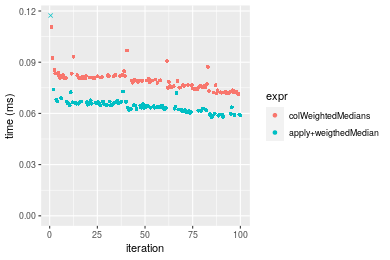

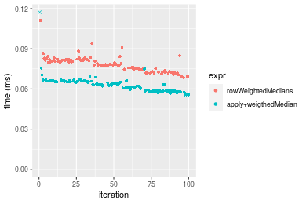
_Table: Benchmarking of colWeightedMedians() and rowWeightedMedians() on 10x10 data (original and transposed).  The top panel shows times in milliseconds and the bottom panel shows relative times._


|   |expr               |    min|      lq|     mean|  median|     uq|     max|
|:--|:------------------|------:|-------:|--------:|-------:|------:|-------:|
|2  |rowWeightedMedians | 68.608| 73.8495| 78.00677| 78.0075| 81.325| 111.283|
|1  |colWeightedMedians | 71.337| 74.8675| 78.79313| 78.9760| 81.388| 110.602|


|   |expr               |      min|       lq|     mean|   median|       uq|       max|
|:--|:------------------|--------:|--------:|--------:|--------:|--------:|---------:|
|2  |rowWeightedMedians | 1.000000| 1.000000| 1.000000| 1.000000| 1.000000| 1.0000000|
|1  |colWeightedMedians | 1.039777| 1.013785| 1.010081| 1.012415| 1.000775| 0.9938805|

_Figure: Benchmarking of colWeightedMedians() and rowWeightedMedians() on 10x10 data (original and transposed).  Outliers are displayed as crosses. Times are in milliseconds._


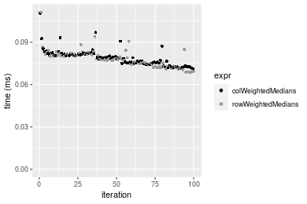

### 100x100 matrix


```r
> X <- data[["100x100"]]
> w <- runif(nrow(X))
> gc()
           used  (Mb) gc trigger  (Mb) max used  (Mb)
Ncells  5269272 281.5   10014072 534.9 10014072 534.9
Vcells 10049260  76.7   18422267 140.6 18422267 140.6
> colStats <- microbenchmark(colWeightedMedians = colWeightedMedians(X, w = w, na.rm = FALSE), `apply+weigthedMedian` = apply(X, 
+     MARGIN = 2L, FUN = weightedMedian, w = w, na.rm = FALSE), unit = "ms")
> X <- t(X)
> gc()
           used  (Mb) gc trigger  (Mb) max used  (Mb)
Ncells  5269248 281.5   10014072 534.9 10014072 534.9
Vcells 10059273  76.8   18422267 140.6 18422267 140.6
> rowStats <- microbenchmark(rowWeightedMedians = rowWeightedMedians(X, w = w, na.rm = FALSE), `apply+weigthedMedian` = apply(X, 
+     MARGIN = 1L, FUN = weightedMedian, w = w, na.rm = FALSE), unit = "ms")
```

_Table: Benchmarking of colWeightedMedians() and apply+weigthedMedian() on 100x100 data. The top panel shows times in milliseconds and the bottom panel shows relative times._


|   |expr                 |      min|        lq|      mean|    median|        uq|      max|
|:--|:--------------------|--------:|---------:|---------:|---------:|---------:|--------:|
|2  |apply+weigthedMedian | 0.698840| 0.7161985| 0.7806898| 0.7561195| 0.7943715| 1.232193|
|1  |colWeightedMedians   | 0.764409| 0.7760570| 0.8748850| 0.8274435| 0.9036455| 1.320745|


|   |expr                 |      min|       lq|     mean|   median|      uq|      max|
|:--|:--------------------|--------:|--------:|--------:|--------:|-------:|--------:|
|2  |apply+weigthedMedian | 1.000000| 1.000000| 1.000000| 1.000000| 1.00000| 1.000000|
|1  |colWeightedMedians   | 1.093825| 1.083578| 1.120656| 1.094329| 1.13756| 1.071865|

_Table: Benchmarking of rowWeightedMedians() and apply+weigthedMedian() on 100x100 data (transposed). The top panel shows times in milliseconds and the bottom panel shows relative times._


|   |expr                 |      min|        lq|      mean|    median|        uq|      max|
|:--|:--------------------|--------:|---------:|---------:|---------:|---------:|--------:|
|2  |apply+weigthedMedian | 0.702053| 0.7103335| 0.7689827| 0.7379585| 0.7770855| 1.251451|
|1  |rowWeightedMedians   | 0.765173| 0.7803670| 0.8668610| 0.8110030| 0.8994915| 1.273378|


|   |expr                 |      min|       lq|     mean|   median|       uq|      max|
|:--|:--------------------|--------:|--------:|--------:|--------:|--------:|--------:|
|2  |apply+weigthedMedian | 1.000000| 1.000000| 1.000000| 1.000000| 1.000000| 1.000000|
|1  |rowWeightedMedians   | 1.089908| 1.098592| 1.127283| 1.098982| 1.157519| 1.017521|

_Figure: Benchmarking of colWeightedMedians() and apply+weigthedMedian() on 100x100 data  as well as rowWeightedMedians() and apply+weigthedMedian() on the same data transposed.  Outliers are displayed as crosses.  Times are in milliseconds._


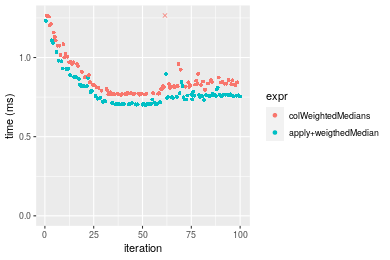

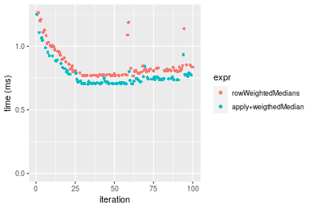
_Table: Benchmarking of colWeightedMedians() and rowWeightedMedians() on 100x100 data (original and transposed).  The top panel shows times in milliseconds and the bottom panel shows relative times._


|   |expr               |     min|      lq|    mean|   median|       uq|      max|
|:--|:------------------|-------:|-------:|-------:|--------:|--------:|--------:|
|2  |rowWeightedMedians | 765.173| 780.367| 866.861| 811.0030| 899.4915| 1273.378|
|1  |colWeightedMedians | 764.409| 776.057| 874.885| 827.4435| 903.6455| 1320.745|


|   |expr               |       min|       lq|     mean|   median|       uq|      max|
|:--|:------------------|---------:|--------:|--------:|--------:|--------:|--------:|
|2  |rowWeightedMedians | 1.0000000| 1.000000| 1.000000| 1.000000| 1.000000| 1.000000|
|1  |colWeightedMedians | 0.9990015| 0.994477| 1.009256| 1.020272| 1.004618| 1.037198|

_Figure: Benchmarking of colWeightedMedians() and rowWeightedMedians() on 100x100 data (original and transposed).  Outliers are displayed as crosses. Times are in milliseconds._


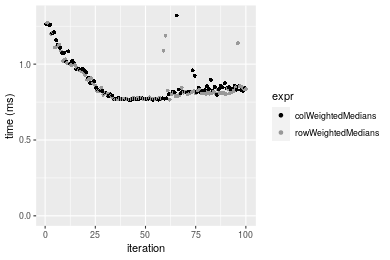

### 1000x10 matrix


```r
> X <- data[["1000x10"]]
> w <- runif(nrow(X))
> gc()
           used  (Mb) gc trigger  (Mb) max used  (Mb)
Ncells  5269991 281.5   10014072 534.9 10014072 534.9
Vcells 10053654  76.8   18422267 140.6 18422267 140.6
> colStats <- microbenchmark(colWeightedMedians = colWeightedMedians(X, w = w, na.rm = FALSE), `apply+weigthedMedian` = apply(X, 
+     MARGIN = 2L, FUN = weightedMedian, w = w, na.rm = FALSE), unit = "ms")
> X <- t(X)
> gc()
           used  (Mb) gc trigger  (Mb) max used  (Mb)
Ncells  5269967 281.5   10014072 534.9 10014072 534.9
Vcells 10063667  76.8   18422267 140.6 18422267 140.6
> rowStats <- microbenchmark(rowWeightedMedians = rowWeightedMedians(X, w = w, na.rm = FALSE), `apply+weigthedMedian` = apply(X, 
+     MARGIN = 1L, FUN = weightedMedian, w = w, na.rm = FALSE), unit = "ms")
```

_Table: Benchmarking of colWeightedMedians() and apply+weigthedMedian() on 1000x10 data. The top panel shows times in milliseconds and the bottom panel shows relative times._


|   |expr                 |      min|        lq|      mean|    median|        uq|      max|
|:--|:--------------------|--------:|---------:|---------:|---------:|---------:|--------:|
|2  |apply+weigthedMedian | 0.569506| 0.5747060| 0.6250577| 0.5806385| 0.6368795| 0.944111|
|1  |colWeightedMedians   | 0.587136| 0.5937265| 0.6634568| 0.6079550| 0.7072815| 1.089221|


|   |expr                 |      min|       lq|     mean|   median|       uq|    max|
|:--|:--------------------|--------:|--------:|--------:|--------:|--------:|------:|
|2  |apply+weigthedMedian | 1.000000| 1.000000| 1.000000| 1.000000| 1.000000| 1.0000|
|1  |colWeightedMedians   | 1.030957| 1.033096| 1.061433| 1.047046| 1.110542| 1.1537|

_Table: Benchmarking of rowWeightedMedians() and apply+weigthedMedian() on 1000x10 data (transposed). The top panel shows times in milliseconds and the bottom panel shows relative times._


|   |expr                 |      min|        lq|      mean|    median|       uq|      max|
|:--|:--------------------|--------:|---------:|---------:|---------:|--------:|--------:|
|2  |apply+weigthedMedian | 0.566812| 0.5732235| 0.6284861| 0.5811250| 0.638481| 0.935032|
|1  |rowWeightedMedians   | 0.587147| 0.5927040| 0.6526032| 0.6069205| 0.694767| 1.082369|


|   |expr                 |      min|       lq|     mean|   median|       uq|      max|
|:--|:--------------------|--------:|--------:|--------:|--------:|--------:|--------:|
|2  |apply+weigthedMedian | 1.000000| 1.000000| 1.000000| 1.000000| 1.000000| 1.000000|
|1  |rowWeightedMedians   | 1.035876| 1.033984| 1.038373| 1.044389| 1.088156| 1.157574|

_Figure: Benchmarking of colWeightedMedians() and apply+weigthedMedian() on 1000x10 data  as well as rowWeightedMedians() and apply+weigthedMedian() on the same data transposed.  Outliers are displayed as crosses.  Times are in milliseconds._


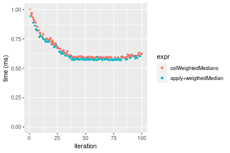

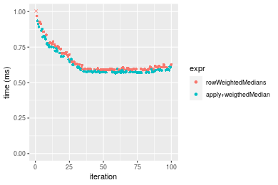
_Table: Benchmarking of colWeightedMedians() and rowWeightedMedians() on 1000x10 data (original and transposed).  The top panel shows times in milliseconds and the bottom panel shows relative times._


|   |expr               |     min|       lq|     mean|   median|       uq|      max|
|:--|:------------------|-------:|--------:|--------:|--------:|--------:|--------:|
|2  |rowWeightedMedians | 587.147| 592.7040| 652.6032| 606.9205| 694.7670| 1082.369|
|1  |colWeightedMedians | 587.136| 593.7265| 663.4568| 607.9550| 707.2815| 1089.221|


|   |expr               |       min|       lq|     mean|   median|       uq|      max|
|:--|:------------------|---------:|--------:|--------:|--------:|--------:|--------:|
|2  |rowWeightedMedians | 1.0000000| 1.000000| 1.000000| 1.000000| 1.000000| 1.000000|
|1  |colWeightedMedians | 0.9999813| 1.001725| 1.016631| 1.001704| 1.018012| 1.006331|

_Figure: Benchmarking of colWeightedMedians() and rowWeightedMedians() on 1000x10 data (original and transposed).  Outliers are displayed as crosses. Times are in milliseconds._


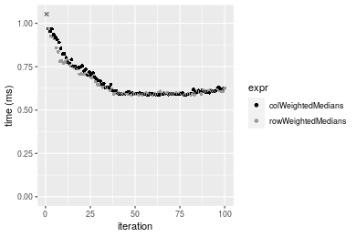

### 10x1000 matrix


```r
> X <- data[["10x1000"]]
> w <- runif(nrow(X))
> gc()
           used  (Mb) gc trigger  (Mb) max used  (Mb)
Ncells  5270189 281.5   10014072 534.9 10014072 534.9
Vcells 10053492  76.8   18422267 140.6 18422267 140.6
> colStats <- microbenchmark(colWeightedMedians = colWeightedMedians(X, w = w, na.rm = FALSE), `apply+weigthedMedian` = apply(X, 
+     MARGIN = 2L, FUN = weightedMedian, w = w, na.rm = FALSE), unit = "ms")
> X <- t(X)
> gc()
           used  (Mb) gc trigger  (Mb) max used  (Mb)
Ncells  5270165 281.5   10014072 534.9 10014072 534.9
Vcells 10063505  76.8   18422267 140.6 18422267 140.6
> rowStats <- microbenchmark(rowWeightedMedians = rowWeightedMedians(X, w = w, na.rm = FALSE), `apply+weigthedMedian` = apply(X, 
+     MARGIN = 1L, FUN = weightedMedian, w = w, na.rm = FALSE), unit = "ms")
```

_Table: Benchmarking of colWeightedMedians() and apply+weigthedMedian() on 10x1000 data. The top panel shows times in milliseconds and the bottom panel shows relative times._


|   |expr                 |      min|       lq|     mean|   median|       uq|      max|
|:--|:--------------------|--------:|--------:|--------:|--------:|--------:|--------:|
|2  |apply+weigthedMedian | 2.748928| 3.001939| 3.131605| 3.110988| 3.280845| 4.106247|
|1  |colWeightedMedians   | 3.255109| 3.683769| 3.909741| 3.849003| 3.991687| 9.673696|


|   |expr                 |      min|      lq|     mean|   median|       uq|      max|
|:--|:--------------------|--------:|-------:|--------:|--------:|--------:|--------:|
|2  |apply+weigthedMedian | 1.000000| 1.00000| 1.000000| 1.000000| 1.000000| 1.000000|
|1  |colWeightedMedians   | 1.184138| 1.22713| 1.248478| 1.237229| 1.216664| 2.355849|

_Table: Benchmarking of rowWeightedMedians() and apply+weigthedMedian() on 10x1000 data (transposed). The top panel shows times in milliseconds and the bottom panel shows relative times._


|   |expr                 |      min|       lq|     mean|   median|       uq|      max|
|:--|:--------------------|--------:|--------:|--------:|--------:|--------:|--------:|
|2  |apply+weigthedMedian | 2.749929| 3.085417| 3.259329| 3.207176| 3.326961| 9.096376|
|1  |rowWeightedMedians   | 3.267148| 3.661744| 3.819594| 3.785273| 3.993229| 5.124429|


|   |expr                 |      min|       lq|     mean|   median|       uq|       max|
|:--|:--------------------|--------:|--------:|--------:|--------:|--------:|---------:|
|2  |apply+weigthedMedian | 1.000000| 1.000000| 1.000000| 1.000000| 1.000000| 1.0000000|
|1  |rowWeightedMedians   | 1.188084| 1.186791| 1.171896| 1.180251| 1.200263| 0.5633484|

_Figure: Benchmarking of colWeightedMedians() and apply+weigthedMedian() on 10x1000 data  as well as rowWeightedMedians() and apply+weigthedMedian() on the same data transposed.  Outliers are displayed as crosses.  Times are in milliseconds._


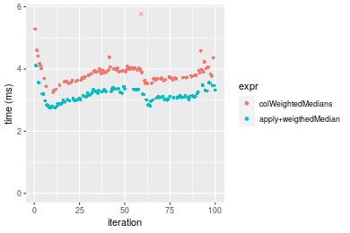

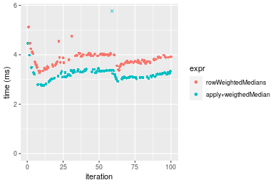
_Table: Benchmarking of colWeightedMedians() and rowWeightedMedians() on 10x1000 data (original and transposed).  The top panel shows times in milliseconds and the bottom panel shows relative times._


|   |expr               |      min|       lq|     mean|   median|       uq|      max|
|:--|:------------------|--------:|--------:|--------:|--------:|--------:|--------:|
|2  |rowWeightedMedians | 3.267148| 3.661744| 3.819594| 3.785273| 3.993229| 5.124429|
|1  |colWeightedMedians | 3.255109| 3.683769| 3.909741| 3.849003| 3.991687| 9.673696|


|   |expr               |       min|       lq|     mean|   median|        uq|      max|
|:--|:------------------|---------:|--------:|--------:|--------:|---------:|--------:|
|2  |rowWeightedMedians | 1.0000000| 1.000000| 1.000000| 1.000000| 1.0000000| 1.000000|
|1  |colWeightedMedians | 0.9963151| 1.006015| 1.023601| 1.016836| 0.9996137| 1.887761|

_Figure: Benchmarking of colWeightedMedians() and rowWeightedMedians() on 10x1000 data (original and transposed).  Outliers are displayed as crosses. Times are in milliseconds._


### 100x1000 matrix


```r
> X <- data[["100x1000"]]
> w <- runif(nrow(X))
> gc()
           used  (Mb) gc trigger  (Mb) max used  (Mb)
Ncells  5270367 281.5   10014072 534.9 10014072 534.9
Vcells 10054075  76.8   18422267 140.6 18422267 140.6
> colStats <- microbenchmark(colWeightedMedians = colWeightedMedians(X, w = w, na.rm = FALSE), `apply+weigthedMedian` = apply(X, 
+     MARGIN = 2L, FUN = weightedMedian, w = w, na.rm = FALSE), unit = "ms")
> X <- t(X)
> gc()
           used  (Mb) gc trigger  (Mb) max used  (Mb)
Ncells  5270355 281.5   10014072 534.9 10014072 534.9
Vcells 10154108  77.5   18422267 140.6 18422267 140.6
> rowStats <- microbenchmark(rowWeightedMedians = rowWeightedMedians(X, w = w, na.rm = FALSE), `apply+weigthedMedian` = apply(X, 
+     MARGIN = 1L, FUN = weightedMedian, w = w, na.rm = FALSE), unit = "ms")
```

_Table: Benchmarking of colWeightedMedians() and apply+weigthedMedian() on 100x1000 data. The top panel shows times in milliseconds and the bottom panel shows relative times._


|   |expr                 |      min|       lq|     mean|   median|       uq|      max|
|:--|:--------------------|--------:|--------:|--------:|--------:|--------:|--------:|
|2  |apply+weigthedMedian | 6.834102| 7.371779| 8.104910| 7.543488| 7.634838| 20.82018|
|1  |colWeightedMedians   | 7.432837| 7.993935| 8.517759| 8.169898| 8.245855| 31.16415|


|   |expr                 |     min|       lq|     mean|  median|      uq|      max|
|:--|:--------------------|-------:|--------:|--------:|-------:|-------:|--------:|
|2  |apply+weigthedMedian | 1.00000| 1.000000| 1.000000| 1.00000| 1.00000| 1.000000|
|1  |colWeightedMedians   | 1.08761| 1.084397| 1.050938| 1.08304| 1.08003| 1.496825|

_Table: Benchmarking of rowWeightedMedians() and apply+weigthedMedian() on 100x1000 data (transposed). The top panel shows times in milliseconds and the bottom panel shows relative times._


|   |expr                 |      min|       lq|     mean|   median|       uq|      max|
|:--|:--------------------|--------:|--------:|--------:|--------:|--------:|--------:|
|2  |apply+weigthedMedian | 6.847122| 7.381424| 7.875145| 7.504978| 7.607240| 20.43966|
|1  |rowWeightedMedians   | 7.426635| 8.023877| 8.662630| 8.183469| 8.378982| 21.00141|


|   |expr                 |      min|       lq|     mean|   median|       uq|      max|
|:--|:--------------------|--------:|--------:|--------:|--------:|--------:|--------:|
|2  |apply+weigthedMedian | 1.000000| 1.000000| 1.000000| 1.000000| 1.000000| 1.000000|
|1  |rowWeightedMedians   | 1.084636| 1.087036| 1.099996| 1.090405| 1.101449| 1.027483|

_Figure: Benchmarking of colWeightedMedians() and apply+weigthedMedian() on 100x1000 data  as well as rowWeightedMedians() and apply+weigthedMedian() on the same data transposed.  Outliers are displayed as crosses.  Times are in milliseconds._


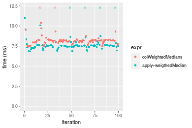

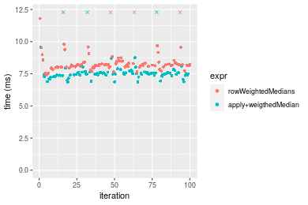
_Table: Benchmarking of colWeightedMedians() and rowWeightedMedians() on 100x1000 data (original and transposed).  The top panel shows times in milliseconds and the bottom panel shows relative times._


|   |expr               |      min|       lq|     mean|   median|       uq|      max|
|:--|:------------------|--------:|--------:|--------:|--------:|--------:|--------:|
|1  |colWeightedMedians | 7.432837| 7.993935| 8.517759| 8.169898| 8.245855| 31.16415|
|2  |rowWeightedMedians | 7.426635| 8.023877| 8.662630| 8.183469| 8.378982| 21.00141|


|   |expr               |       min|       lq|     mean|   median|       uq|       max|
|:--|:------------------|---------:|--------:|--------:|--------:|--------:|---------:|
|1  |colWeightedMedians | 1.0000000| 1.000000| 1.000000| 1.000000| 1.000000| 1.0000000|
|2  |rowWeightedMedians | 0.9991656| 1.003746| 1.017008| 1.001661| 1.016145| 0.6738964|

_Figure: Benchmarking of colWeightedMedians() and rowWeightedMedians() on 100x1000 data (original and transposed).  Outliers are displayed as crosses. Times are in milliseconds._


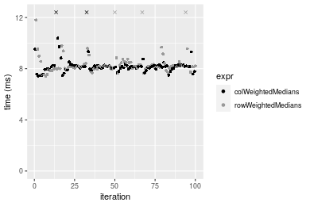

### 1000x100 matrix


```r
> X <- data[["1000x100"]]
> w <- runif(nrow(X))
> gc()
           used  (Mb) gc trigger  (Mb) max used  (Mb)
Ncells  5270566 281.5   10014072 534.9 10014072 534.9
Vcells 10055646  76.8   18422267 140.6 18422267 140.6
> colStats <- microbenchmark(colWeightedMedians = colWeightedMedians(X, w = w, na.rm = FALSE), `apply+weigthedMedian` = apply(X, 
+     MARGIN = 2L, FUN = weightedMedian, w = w, na.rm = FALSE), unit = "ms")
> X <- t(X)
> gc()
           used  (Mb) gc trigger  (Mb) max used  (Mb)
Ncells  5270542 281.5   10014072 534.9 10014072 534.9
Vcells 10155659  77.5   18422267 140.6 18422267 140.6
> rowStats <- microbenchmark(rowWeightedMedians = rowWeightedMedians(X, w = w, na.rm = FALSE), `apply+weigthedMedian` = apply(X, 
+     MARGIN = 1L, FUN = weightedMedian, w = w, na.rm = FALSE), unit = "ms")
```

_Table: Benchmarking of colWeightedMedians() and apply+weigthedMedian() on 1000x100 data. The top panel shows times in milliseconds and the bottom panel shows relative times._


|   |expr                 |      min|       lq|     mean|   median|       uq|      max|
|:--|:--------------------|--------:|--------:|--------:|--------:|--------:|--------:|
|2  |apply+weigthedMedian | 5.534752| 5.953481| 6.329715| 5.979749| 6.063295| 14.47651|
|1  |colWeightedMedians   | 5.651083| 6.035430| 6.289830| 6.054934| 6.119440| 13.51105|


|   |expr                 |      min|       lq|      mean|   median|      uq|       max|
|:--|:--------------------|--------:|--------:|---------:|--------:|-------:|---------:|
|2  |apply+weigthedMedian | 1.000000| 1.000000| 1.0000000| 1.000000| 1.00000| 1.0000000|
|1  |colWeightedMedians   | 1.021018| 1.013765| 0.9936986| 1.012573| 1.00926| 0.9333085|

_Table: Benchmarking of rowWeightedMedians() and apply+weigthedMedian() on 1000x100 data (transposed). The top panel shows times in milliseconds and the bottom panel shows relative times._


|   |expr                 |      min|       lq|     mean|   median|       uq|      max|
|:--|:--------------------|--------:|--------:|--------:|--------:|--------:|--------:|
|2  |apply+weigthedMedian | 5.540392| 5.970542| 6.287337| 6.004641| 6.076558| 13.98020|
|1  |rowWeightedMedians   | 5.608721| 5.920593| 6.365841| 6.069017| 6.119520| 14.08039|


|   |expr                 |      min|        lq|     mean|   median|      uq|      max|
|:--|:--------------------|--------:|---------:|--------:|--------:|-------:|--------:|
|2  |apply+weigthedMedian | 1.000000| 1.0000000| 1.000000| 1.000000| 1.00000| 1.000000|
|1  |rowWeightedMedians   | 1.012333| 0.9916342| 1.012486| 1.010721| 1.00707| 1.007167|

_Figure: Benchmarking of colWeightedMedians() and apply+weigthedMedian() on 1000x100 data  as well as rowWeightedMedians() and apply+weigthedMedian() on the same data transposed.  Outliers are displayed as crosses.  Times are in milliseconds._


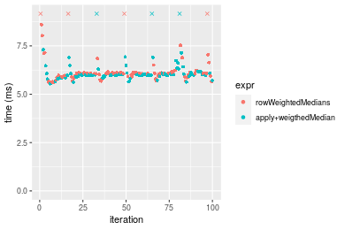
_Table: Benchmarking of colWeightedMedians() and rowWeightedMedians() on 1000x100 data (original and transposed).  The top panel shows times in milliseconds and the bottom panel shows relative times._


|   |expr               |      min|       lq|     mean|   median|      uq|      max|
|:--|:------------------|--------:|--------:|--------:|--------:|-------:|--------:|
|1  |colWeightedMedians | 5.651083| 6.035430| 6.289830| 6.054934| 6.11944| 13.51105|
|2  |rowWeightedMedians | 5.608721| 5.920593| 6.365841| 6.069017| 6.11952| 14.08039|


|   |expr               |       min|        lq|     mean|   median|       uq|      max|
|:--|:------------------|---------:|---------:|--------:|--------:|--------:|--------:|
|1  |colWeightedMedians | 1.0000000| 1.0000000| 1.000000| 1.000000| 1.000000| 1.000000|
|2  |rowWeightedMedians | 0.9925037| 0.9809729| 1.012085| 1.002326| 1.000013| 1.042139|

_Figure: Benchmarking of colWeightedMedians() and rowWeightedMedians() on 1000x100 data (original and transposed).  Outliers are displayed as crosses. Times are in milliseconds._


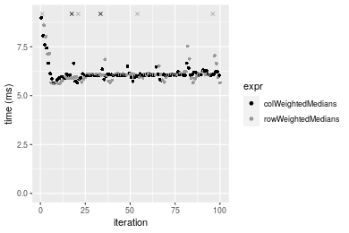


## Appendix

### Session information
```r
R version 4.1.1 Patched (2021-08-10 r80727)
Platform: x86_64-pc-linux-gnu (64-bit)
Running under: Ubuntu 18.04.5 LTS

Matrix products: default
BLAS:   /home/hb/software/R-devel/R-4-1-branch/lib/R/lib/libRblas.so
LAPACK: /home/hb/software/R-devel/R-4-1-branch/lib/R/lib/libRlapack.so

locale:
 [1] LC_CTYPE=en_US.UTF-8       LC_NUMERIC=C              
 [3] LC_TIME=en_US.UTF-8        LC_COLLATE=en_US.UTF-8    
 [5] LC_MONETARY=en_US.UTF-8    LC_MESSAGES=en_US.UTF-8   
 [7] LC_PAPER=en_US.UTF-8       LC_NAME=C                 
 [9] LC_ADDRESS=C               LC_TELEPHONE=C            
[11] LC_MEASUREMENT=en_US.UTF-8 LC_IDENTIFICATION=C       

attached base packages:
[1] stats     graphics  grDevices utils     datasets  methods   base     

other attached packages:
[1] microbenchmark_1.4-7   matrixStats_0.60.1     ggplot2_3.3.5         
[4] knitr_1.33             R.devices_2.17.0       R.utils_2.10.1        
[7] R.oo_1.24.0            R.methodsS3_1.8.1-9001 history_0.0.1-9000    

loaded via a namespace (and not attached):
 [1] Biobase_2.52.0          httr_1.4.2              splines_4.1.1          
 [4] bit64_4.0.5             network_1.17.1          assertthat_0.2.1       
 [7] highr_0.9               stats4_4.1.1            blob_1.2.2             
[10] GenomeInfoDbData_1.2.6  robustbase_0.93-8       pillar_1.6.2           
[13] RSQLite_2.2.8           lattice_0.20-44         glue_1.4.2             
[16] digest_0.6.27           XVector_0.32.0          colorspace_2.0-2       
[19] Matrix_1.3-4            XML_3.99-0.7            pkgconfig_2.0.3        
[22] zlibbioc_1.38.0         genefilter_1.74.0       purrr_0.3.4            
[25] ergm_4.1.2              xtable_1.8-4            scales_1.1.1           
[28] tibble_3.1.4            annotate_1.70.0         KEGGREST_1.32.0        
[31] farver_2.1.0            generics_0.1.0          IRanges_2.26.0         
[34] ellipsis_0.3.2          cachem_1.0.6            withr_2.4.2            
[37] BiocGenerics_0.38.0     mime_0.11               survival_3.2-13        
[40] magrittr_2.0.1          crayon_1.4.1            statnet.common_4.5.0   
[43] memoise_2.0.0           laeken_0.5.1            fansi_0.5.0            
[46] R.cache_0.15.0          MASS_7.3-54             R.rsp_0.44.0           
[49] progressr_0.8.0         tools_4.1.1             lifecycle_1.0.0        
[52] S4Vectors_0.30.0        trust_0.1-8             munsell_0.5.0          
[55] tabby_0.0.1-9001        AnnotationDbi_1.54.1    Biostrings_2.60.2      
[58] compiler_4.1.1          GenomeInfoDb_1.28.1     rlang_0.4.11           
[61] grid_4.1.1              RCurl_1.98-1.4          cwhmisc_6.6            
[64] rappdirs_0.3.3          startup_0.15.0          labeling_0.4.2         
[67] bitops_1.0-7            base64enc_0.1-3         boot_1.3-28            
[70] gtable_0.3.0            DBI_1.1.1               markdown_1.1           
[73] R6_2.5.1                lpSolveAPI_5.5.2.0-17.7 rle_0.9.2              
[76] dplyr_1.0.7             fastmap_1.1.0           bit_4.0.4              
[79] utf8_1.2.2              parallel_4.1.1          Rcpp_1.0.7             
[82] vctrs_0.3.8             png_0.1-7               DEoptimR_1.0-9         
[85] tidyselect_1.1.1        xfun_0.25               coda_0.19-4            
```
Total processing time was 19.6 secs.


### Reproducibility
To reproduce this report, do:
```r
html <- matrixStats:::benchmark('colWeightedMedians')
```

[RSP]: https://cran.r-project.org/package=R.rsp
[matrixStats]: https://cran.r-project.org/package=matrixStats

[StackOverflow:colMins?]: https://stackoverflow.com/questions/13676878 "Stack Overflow: fastest way to get Min from every column in a matrix?"
[StackOverflow:colSds?]: https://stackoverflow.com/questions/17549762 "Stack Overflow: Is there such 'colsd' in R?"
[StackOverflow:rowProds?]: https://stackoverflow.com/questions/20198801/ "Stack Overflow: Row product of matrix and column sum of matrix"

---------------------------------------
Copyright Henrik Bengtsson. Last updated on 2021-08-25 18:19:04 (+0200 UTC). Powered by [RSP].

<script>
 var link = document.createElement('link');
 link.rel = 'icon';
 link.href = "data:image/png;base64,iVBORw0KGgoAAAANSUhEUgAAACAAAAAgCAMAAABEpIrGAAAA21BMVEUAAAAAAP8AAP8AAP8AAP8AAP8AAP8AAP8AAP8AAP8AAP8AAP8AAP8AAP8AAP8AAP8AAP8AAP8AAP8AAP8AAP8AAP8AAP8AAP8AAP8AAP8AAP8AAP8AAP8AAP8AAP8AAP8AAP8AAP8AAP8AAP8AAP8AAP8AAP8AAP8AAP8AAP8BAf4CAv0DA/wdHeIeHuEfH+AgIN8hId4lJdomJtknJ9g+PsE/P8BAQL9yco10dIt1dYp3d4h4eIeVlWqWlmmXl2iYmGeZmWabm2Tn5xjo6Bfp6Rb39wj4+Af//wA2M9hbAAAASXRSTlMAAQIJCgsMJSYnKD4/QGRlZmhpamtsbautrrCxuru8y8zN5ebn6Pn6+///////////////////////////////////////////LsUNcQAAAS9JREFUOI29k21XgkAQhVcFytdSMqMETU26UVqGmpaiFbL//xc1cAhhwVNf6n5i5z67M2dmYOyfJZUqlVLhkKucG7cgmUZTybDz6g0iDeq51PUr37Ds2cy2/C9NeES5puDjxuUk1xnToZsg8pfA3avHQ3lLIi7iWRrkv/OYtkScxBIMgDee0ALoyxHQBJ68JLCjOtQIMIANF7QG9G9fNnHvisCHBVMKgSJgiz7nE+AoBKrAPA3MgepvgR9TSCasrCKH0eB1wBGBFdCO+nAGjMVGPcQb5bd6mQRegN6+1axOs9nGfYcCtfi4NQosdtH7dB+txFIpXQqN1p9B/asRHToyS0jRgpV7nk4nwcq1BJ+x3Gl/v7S9Wmpp/aGquum7w3ZDyrADFYrl8vHBH+ev9AUASW1dmU4h4wAAAABJRU5ErkJggg=="
 document.getElementsByTagName('head')[0].appendChild(link);
</script>


