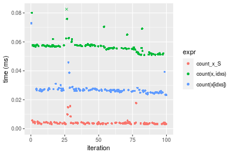
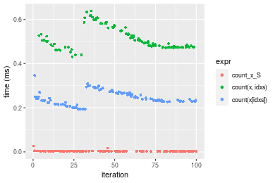
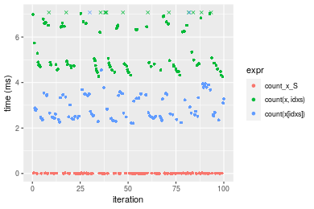
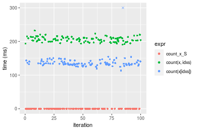
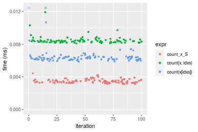
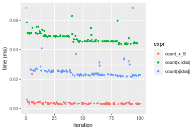
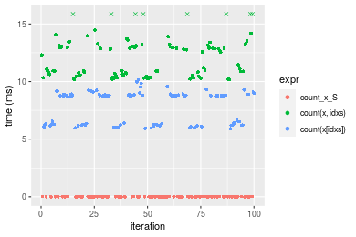
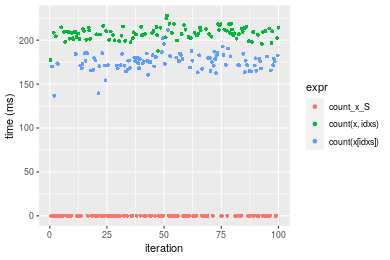

[matrixStats]: Benchmark report

---------------------------------------


# count() benchmarks on subsetted computation

This report benchmark the performance of count() on subsetted computation.


## Data type "integer"
### Data
```r
> rvector <- function(n, mode = c("logical", "double", "integer"), range = c(-100, +100), na_prob = 0) {
+     mode <- match.arg(mode)
+     if (mode == "logical") {
+         x <- sample(c(FALSE, TRUE), size = n, replace = TRUE)
+     }     else {
+         x <- runif(n, min = range[1], max = range[2])
+     }
+     storage.mode(x) <- mode
+     if (na_prob > 0) 
+         x[sample(n, size = na_prob * n)] <- NA
+     x
+ }
> rvectors <- function(scale = 10, seed = 1, ...) {
+     set.seed(seed)
+     data <- list()
+     data[[1]] <- rvector(n = scale * 100, ...)
+     data[[2]] <- rvector(n = scale * 1000, ...)
+     data[[3]] <- rvector(n = scale * 10000, ...)
+     data[[4]] <- rvector(n = scale * 1e+05, ...)
+     data[[5]] <- rvector(n = scale * 1e+06, ...)
+     names(data) <- sprintf("n = %d", sapply(data, FUN = length))
+     data
+ }
> data <- rvectors(mode = mode)
```

### Results

### n = 1000 vector

```r
> x <- data[["n = 1000"]]
> idxs <- sample.int(length(x), size = length(x) * 0.7)
> x_S <- x[idxs]
> gc()
           used  (Mb) gc trigger  (Mb) max used  (Mb)
Ncells  5273101 281.7   10014072 534.9 10014072 534.9
Vcells 15733326 120.1   26979768 205.9 25786192 196.8
> stats <- microbenchmark(count_x_S = count(x_S, value), `count(x, idxs)` = count(x, idxs = idxs, value), 
+     `count(x[idxs])` = count(x[idxs], value), unit = "ms")
```

_Table: Benchmarking of count_x_S(), count(x, idxs)() and count(x[idxs])() on integer+n = 1000 data. The top panel shows times in milliseconds and the bottom panel shows relative times._


|   |expr           |      min|        lq|      mean|   median|        uq|      max|
|:--|:--------------|--------:|---------:|---------:|--------:|---------:|--------:|
|1  |count_x_S      | 0.003073| 0.0031665| 0.0033816| 0.003283| 0.0034190| 0.010195|
|3  |count(x[idxs]) | 0.005970| 0.0062125| 0.0082785| 0.006300| 0.0064750| 0.197032|
|2  |count(x, idxs) | 0.008648| 0.0089840| 0.0091411| 0.009089| 0.0092265| 0.012081|


|   |expr           |      min|       lq|     mean|   median|       uq|       max|
|:--|:--------------|--------:|--------:|--------:|--------:|--------:|---------:|
|1  |count_x_S      | 1.000000| 1.000000| 1.000000| 1.000000| 1.000000|  1.000000|
|3  |count(x[idxs]) | 1.942727| 1.961945| 2.448141| 1.918977| 1.893829| 19.326336|
|2  |count(x, idxs) | 2.814188| 2.837202| 2.703225| 2.768504| 2.698596|  1.184993|

_Figure: Benchmarking of count_x_S(), count(x, idxs)() and count(x[idxs])() on integer+n = 1000 data.  Outliers are displayed as crosses.  Times are in milliseconds._


### n = 10000 vector

```r
> x <- data[["n = 10000"]]
> idxs <- sample.int(length(x), size = length(x) * 0.7)
> x_S <- x[idxs]
> gc()
           used  (Mb) gc trigger  (Mb) max used  (Mb)
Ncells  5271301 281.6   10014072 534.9 10014072 534.9
Vcells 15404220 117.6   26979768 205.9 25786192 196.8
> stats <- microbenchmark(count_x_S = count(x_S, value), `count(x, idxs)` = count(x, idxs = idxs, value), 
+     `count(x[idxs])` = count(x[idxs], value), unit = "ms")
```

_Table: Benchmarking of count_x_S(), count(x, idxs)() and count(x[idxs])() on integer+n = 10000 data. The top panel shows times in milliseconds and the bottom panel shows relative times._


|   |expr           |      min|       lq|      mean|    median|        uq|      max|
|:--|:--------------|--------:|--------:|---------:|---------:|---------:|--------:|
|1  |count_x_S      | 0.003061| 0.003453| 0.0042640| 0.0037465| 0.0041615| 0.017686|
|3  |count(x[idxs]) | 0.023290| 0.025833| 0.0273470| 0.0266000| 0.0272135| 0.072844|
|2  |count(x, idxs) | 0.050966| 0.054956| 0.0570703| 0.0569305| 0.0576480| 0.094084|


|   |expr           |       min|        lq|      mean|   median|        uq|      max|
|:--|:--------------|---------:|---------:|---------:|--------:|---------:|--------:|
|1  |count_x_S      |  1.000000|  1.000000|  1.000000|  1.00000|  1.000000| 1.000000|
|3  |count(x[idxs]) |  7.608625|  7.481321|  6.413496|  7.09996|  6.539349| 4.118738|
|2  |count(x, idxs) | 16.650114| 15.915436| 13.384277| 15.19565| 13.852697| 5.319688|

_Figure: Benchmarking of count_x_S(), count(x, idxs)() and count(x[idxs])() on integer+n = 10000 data.  Outliers are displayed as crosses.  Times are in milliseconds._



### n = 100000 vector

```r
> x <- data[["n = 100000"]]
> idxs <- sample.int(length(x), size = length(x) * 0.7)
> x_S <- x[idxs]
> gc()
           used  (Mb) gc trigger  (Mb) max used  (Mb)
Ncells  5271373 281.6   10014072 534.9 10014072 534.9
Vcells 15467780 118.1   26979768 205.9 25786192 196.8
> stats <- microbenchmark(count_x_S = count(x_S, value), `count(x, idxs)` = count(x, idxs = idxs, value), 
+     `count(x[idxs])` = count(x[idxs], value), unit = "ms")
```

_Table: Benchmarking of count_x_S(), count(x, idxs)() and count(x[idxs])() on integer+n = 100000 data. The top panel shows times in milliseconds and the bottom panel shows relative times._


|   |expr           |      min|       lq|      mean|    median|        uq|      max|
|:--|:--------------|--------:|--------:|---------:|---------:|---------:|--------:|
|1  |count_x_S      | 0.001966| 0.002613| 0.0034692| 0.0030805| 0.0035280| 0.026484|
|3  |count(x[idxs]) | 0.193053| 0.224128| 0.2431235| 0.2361090| 0.2655925| 0.345922|
|2  |count(x, idxs) | 0.431152| 0.475062| 0.5127143| 0.4933780| 0.5405675| 0.638740|


|   |expr           |       min|        lq|      mean|    median|        uq|      max|
|:--|:--------------|---------:|---------:|---------:|---------:|---------:|--------:|
|1  |count_x_S      |   1.00000|   1.00000|   1.00000|   1.00000|   1.00000|  1.00000|
|3  |count(x[idxs]) |  98.19583|  85.77421|  70.08116|  76.64632|  75.28132| 13.06155|
|2  |count(x, idxs) | 219.30417| 181.80712| 147.79163| 160.16166| 153.22208| 24.11796|

_Figure: Benchmarking of count_x_S(), count(x, idxs)() and count(x[idxs])() on integer+n = 100000 data.  Outliers are displayed as crosses.  Times are in milliseconds._



### n = 1000000 vector

```r
> x <- data[["n = 1000000"]]
> idxs <- sample.int(length(x), size = length(x) * 0.7)
> x_S <- x[idxs]
> gc()
           used  (Mb) gc trigger  (Mb) max used  (Mb)
Ncells  5271445 281.6   10014072 534.9 10014072 534.9
Vcells 16097829 122.9   26979768 205.9 26746604 204.1
> stats <- microbenchmark(count_x_S = count(x_S, value), `count(x, idxs)` = count(x, idxs = idxs, value), 
+     `count(x[idxs])` = count(x[idxs], value), unit = "ms")
```

_Table: Benchmarking of count_x_S(), count(x, idxs)() and count(x[idxs])() on integer+n = 1000000 data. The top panel shows times in milliseconds and the bottom panel shows relative times._


|   |expr           |      min|        lq|      mean|    median|        uq|       max|
|:--|:--------------|--------:|---------:|---------:|---------:|---------:|---------:|
|1  |count_x_S      | 0.002293| 0.0028955| 0.0073869| 0.0047215| 0.0117255|  0.025372|
|3  |count(x[idxs]) | 2.205608| 2.4509940| 3.0451511| 2.6593380| 3.4591090| 10.583003|
|2  |count(x, idxs) | 4.263256| 4.7065055| 5.9483263| 4.9615260| 6.5981130| 12.529710|


|   |expr           |       min|        lq|     mean|    median|       uq|      max|
|:--|:--------------|---------:|---------:|--------:|---------:|--------:|--------:|
|1  |count_x_S      |    1.0000|    1.0000|   1.0000|    1.0000|   1.0000|   1.0000|
|3  |count(x[idxs]) |  961.8875|  846.4839| 412.2344|  563.2401| 295.0074| 417.1135|
|2  |count(x, idxs) | 1859.2481| 1625.4552| 805.2490| 1050.8368| 562.7149| 493.8401|

_Figure: Benchmarking of count_x_S(), count(x, idxs)() and count(x[idxs])() on integer+n = 1000000 data.  Outliers are displayed as crosses.  Times are in milliseconds._



### n = 10000000 vector

```r
> x <- data[["n = 10000000"]]
> idxs <- sample.int(length(x), size = length(x) * 0.7)
> x_S <- x[idxs]
> gc()
           used  (Mb) gc trigger  (Mb) max used  (Mb)
Ncells  5271517 281.6   10014072 534.9 10014072 534.9
Vcells 22397877 170.9   32455721 247.7 26950058 205.7
> stats <- microbenchmark(count_x_S = count(x_S, value), `count(x, idxs)` = count(x, idxs = idxs, value), 
+     `count(x[idxs])` = count(x[idxs], value), unit = "ms")
```

_Table: Benchmarking of count_x_S(), count(x, idxs)() and count(x[idxs])() on integer+n = 10000000 data. The top panel shows times in milliseconds and the bottom panel shows relative times._


|   |expr           |        min|          lq|        mean|     median|         uq|        max|
|:--|:--------------|----------:|-----------:|-----------:|----------:|----------:|----------:|
|1  |count_x_S      |   0.005044|   0.0093405|   0.0252163|   0.013378|   0.044561|   0.065312|
|3  |count(x[idxs]) | 113.463597| 131.0820160| 139.2751717| 134.121174| 140.858639| 497.779088|
|2  |count(x, idxs) | 190.650896| 199.8797000| 206.1982812| 205.854622| 211.439166| 232.560777|


|   |expr           |      min|       lq|     mean|   median|       uq|      max|
|:--|:--------------|--------:|--------:|--------:|--------:|--------:|--------:|
|1  |count_x_S      |     1.00|     1.00|    1.000|     1.00|    1.000|    1.000|
|3  |count(x[idxs]) | 22494.77| 14033.73| 5523.220| 10025.50| 3161.030| 7621.556|
|2  |count(x, idxs) | 37797.56| 21399.25| 8177.182| 15387.55| 4744.938| 3560.766|

_Figure: Benchmarking of count_x_S(), count(x, idxs)() and count(x[idxs])() on integer+n = 10000000 data.  Outliers are displayed as crosses.  Times are in milliseconds._




## Data type "double"
### Data
```r
> rvector <- function(n, mode = c("logical", "double", "integer"), range = c(-100, +100), na_prob = 0) {
+     mode <- match.arg(mode)
+     if (mode == "logical") {
+         x <- sample(c(FALSE, TRUE), size = n, replace = TRUE)
+     }     else {
+         x <- runif(n, min = range[1], max = range[2])
+     }
+     storage.mode(x) <- mode
+     if (na_prob > 0) 
+         x[sample(n, size = na_prob * n)] <- NA
+     x
+ }
> rvectors <- function(scale = 10, seed = 1, ...) {
+     set.seed(seed)
+     data <- list()
+     data[[1]] <- rvector(n = scale * 100, ...)
+     data[[2]] <- rvector(n = scale * 1000, ...)
+     data[[3]] <- rvector(n = scale * 10000, ...)
+     data[[4]] <- rvector(n = scale * 1e+05, ...)
+     data[[5]] <- rvector(n = scale * 1e+06, ...)
+     names(data) <- sprintf("n = %d", sapply(data, FUN = length))
+     data
+ }
> data <- rvectors(mode = mode)
```

### Results

### n = 1000 vector

```r
> x <- data[["n = 1000"]]
> idxs <- sample.int(length(x), size = length(x) * 0.7)
> x_S <- x[idxs]
> gc()
           used  (Mb) gc trigger  (Mb) max used  (Mb)
Ncells  5271592 281.6   10014072 534.9 10014072 534.9
Vcells 20955081 159.9   46912238 358.0 46899090 357.9
> stats <- microbenchmark(count_x_S = count(x_S, value), `count(x, idxs)` = count(x, idxs = idxs, value), 
+     `count(x[idxs])` = count(x[idxs], value), unit = "ms")
```

_Table: Benchmarking of count_x_S(), count(x, idxs)() and count(x[idxs])() on double+n = 1000 data. The top panel shows times in milliseconds and the bottom panel shows relative times._


|   |expr           |      min|       lq|      mean|    median|        uq|      max|
|:--|:--------------|--------:|--------:|---------:|---------:|---------:|--------:|
|1  |count_x_S      | 0.003107| 0.003296| 0.0034837| 0.0034435| 0.0035985| 0.004429|
|3  |count(x[idxs]) | 0.005871| 0.006139| 0.0066565| 0.0062915| 0.0064785| 0.033252|
|2  |count(x, idxs) | 0.008086| 0.008284| 0.0085307| 0.0083935| 0.0085310| 0.012681|


|   |expr           |      min|       lq|     mean|   median|       uq|      max|
|:--|:--------------|--------:|--------:|--------:|--------:|--------:|--------:|
|1  |count_x_S      | 1.000000| 1.000000| 1.000000| 1.000000| 1.000000| 1.000000|
|3  |count(x[idxs]) | 1.889604| 1.862561| 1.910731| 1.827066| 1.800334| 7.507790|
|2  |count(x, idxs) | 2.602511| 2.513349| 2.448744| 2.437491| 2.370710| 2.863174|

_Figure: Benchmarking of count_x_S(), count(x, idxs)() and count(x[idxs])() on double+n = 1000 data.  Outliers are displayed as crosses.  Times are in milliseconds._



### n = 10000 vector

```r
> x <- data[["n = 10000"]]
> idxs <- sample.int(length(x), size = length(x) * 0.7)
> x_S <- x[idxs]
> gc()
           used  (Mb) gc trigger  (Mb) max used  (Mb)
Ncells  5271661 281.6   10014072 534.9 10014072 534.9
Vcells 20964573 160.0   46912238 358.0 46899090 357.9
> stats <- microbenchmark(count_x_S = count(x_S, value), `count(x, idxs)` = count(x, idxs = idxs, value), 
+     `count(x[idxs])` = count(x[idxs], value), unit = "ms")
```

_Table: Benchmarking of count_x_S(), count(x, idxs)() and count(x[idxs])() on double+n = 10000 data. The top panel shows times in milliseconds and the bottom panel shows relative times._


|   |expr           |      min|        lq|      mean|    median|       uq|      max|
|:--|:--------------|--------:|---------:|---------:|---------:|--------:|--------:|
|1  |count_x_S      | 0.002898| 0.0032225| 0.0038029| 0.0034685| 0.003961| 0.023523|
|3  |count(x[idxs]) | 0.021548| 0.0228445| 0.0254240| 0.0235715| 0.025780| 0.091572|
|2  |count(x, idxs) | 0.043524| 0.0455955| 0.0484815| 0.0468940| 0.049947| 0.083934|


|   |expr           |       min|        lq|      mean|    median|        uq|      max|
|:--|:--------------|---------:|---------:|---------:|---------:|---------:|--------:|
|1  |count_x_S      |  1.000000|  1.000000|  1.000000|  1.000000|  1.000000| 1.000000|
|3  |count(x[idxs]) |  7.435473|  7.089061|  6.685339|  6.795877|  6.508457| 3.892871|
|2  |count(x, idxs) | 15.018633| 14.149108| 12.748390| 13.519965| 12.609694| 3.568167|

_Figure: Benchmarking of count_x_S(), count(x, idxs)() and count(x[idxs])() on double+n = 10000 data.  Outliers are displayed as crosses.  Times are in milliseconds._



### n = 100000 vector

```r
> x <- data[["n = 100000"]]
> idxs <- sample.int(length(x), size = length(x) * 0.7)
> x_S <- x[idxs]
> gc()
           used  (Mb) gc trigger  (Mb) max used  (Mb)
Ncells  5271733 281.6   10014072 534.9 10014072 534.9
Vcells 21059451 160.7   46912238 358.0 46899090 357.9
> stats <- microbenchmark(count_x_S = count(x_S, value), `count(x, idxs)` = count(x, idxs = idxs, value), 
+     `count(x[idxs])` = count(x[idxs], value), unit = "ms")
```

_Table: Benchmarking of count_x_S(), count(x, idxs)() and count(x[idxs])() on double+n = 100000 data. The top panel shows times in milliseconds and the bottom panel shows relative times._


|   |expr           |      min|       lq|      mean|    median|        uq|      max|
|:--|:--------------|--------:|--------:|---------:|---------:|---------:|--------:|
|1  |count_x_S      | 0.001962| 0.002668| 0.0036028| 0.0031065| 0.0037325| 0.026264|
|3  |count(x[idxs]) | 0.192841| 0.218590| 0.2650484| 0.2541555| 0.3090540| 0.467606|
|2  |count(x, idxs) | 0.361153| 0.413546| 0.4647663| 0.4699950| 0.5014150| 0.736157|


|   |expr           |       min|        lq|      mean|   median|       uq|      max|
|:--|:--------------|---------:|---------:|---------:|--------:|--------:|--------:|
|1  |count_x_S      |   1.00000|   1.00000|   1.00000|   1.0000|   1.0000|  1.00000|
|3  |count(x[idxs]) |  98.28797|  81.93028|  73.56713|  81.8141|  82.8008| 17.80407|
|2  |count(x, idxs) | 184.07390| 155.00225| 129.00105| 151.2941| 134.3376| 28.02913|

_Figure: Benchmarking of count_x_S(), count(x, idxs)() and count(x[idxs])() on double+n = 100000 data.  Outliers are displayed as crosses.  Times are in milliseconds._


### n = 1000000 vector

```r
> x <- data[["n = 1000000"]]
> idxs <- sample.int(length(x), size = length(x) * 0.7)
> x_S <- x[idxs]
> gc()
           used  (Mb) gc trigger  (Mb) max used  (Mb)
Ncells  5271805 281.6   10014072 534.9 10014072 534.9
Vcells 22004893 167.9   46912238 358.0 46899090 357.9
> stats <- microbenchmark(count_x_S = count(x_S, value), `count(x, idxs)` = count(x, idxs = idxs, value), 
+     `count(x[idxs])` = count(x[idxs], value), unit = "ms")
```

_Table: Benchmarking of count_x_S(), count(x, idxs)() and count(x[idxs])() on double+n = 1000000 data. The top panel shows times in milliseconds and the bottom panel shows relative times._


|   |expr           |       min|        lq|       mean|     median|         uq|      max|
|:--|:--------------|---------:|---------:|----------:|----------:|----------:|--------:|
|1  |count_x_S      |  0.003339|  0.003943|  0.0103158|  0.0066275|  0.0187495|  0.02975|
|3  |count(x[idxs]) |  5.902106|  6.253539|  7.8809195|  8.7674475|  8.8459570| 10.15192|
|2  |count(x, idxs) | 10.169488| 10.581906| 12.3740918| 11.8717945| 13.1152000| 21.26902|


|   |expr           |      min|       lq|      mean|   median|      uq|      max|
|:--|:--------------|--------:|--------:|---------:|--------:|-------:|--------:|
|1  |count_x_S      |    1.000|    1.000|    1.0000|    1.000|   1.000|   1.0000|
|3  |count(x[idxs]) | 1767.627| 1585.985|  763.9652| 1322.889| 471.797| 341.2409|
|2  |count(x, idxs) | 3045.669| 2683.720| 1199.5269| 1791.293| 699.496| 714.9252|

_Figure: Benchmarking of count_x_S(), count(x, idxs)() and count(x[idxs])() on double+n = 1000000 data.  Outliers are displayed as crosses.  Times are in milliseconds._



### n = 10000000 vector

```r
> x <- data[["n = 10000000"]]
> idxs <- sample.int(length(x), size = length(x) * 0.7)
> x_S <- x[idxs]
> gc()
           used  (Mb) gc trigger  (Mb) max used  (Mb)
Ncells  5271877 281.6   10014072 534.9 10014072 534.9
Vcells 31454941 240.0   56374685 430.2 46899090 357.9
> stats <- microbenchmark(count_x_S = count(x_S, value), `count(x, idxs)` = count(x, idxs = idxs, value), 
+     `count(x[idxs])` = count(x[idxs], value), unit = "ms")
```

_Table: Benchmarking of count_x_S(), count(x, idxs)() and count(x[idxs])() on double+n = 10000000 data. The top panel shows times in milliseconds and the bottom panel shows relative times._


|   |expr           |      min|          lq|        mean|      median|          uq|        max|
|:--|:--------------|--------:|-----------:|-----------:|-----------:|-----------:|----------:|
|1  |count_x_S      |   0.0059|   0.0094465|   0.0248483|   0.0177655|   0.0427385|   0.055075|
|3  |count(x[idxs]) | 136.6413| 170.1397175| 175.2896384| 175.8852105| 181.4416970| 211.675733|
|2  |count(x, idxs) | 177.3310| 203.5489875| 207.9774607| 208.3212475| 212.3906635| 228.060823|


|   |expr           |      min|       lq|     mean|    median|       uq|      max|
|:--|:--------------|--------:|--------:|--------:|---------:|--------:|--------:|
|1  |count_x_S      |     1.00|     1.00|    1.000|     1.000|    1.000|    1.000|
|3  |count(x[idxs]) | 23159.55| 18010.87| 7054.403|  9900.381| 4245.392| 3843.409|
|2  |count(x, idxs) | 30056.10| 21547.56| 8369.900| 11726.169| 4969.539| 4140.914|

_Figure: Benchmarking of count_x_S(), count(x, idxs)() and count(x[idxs])() on double+n = 10000000 data.  Outliers are displayed as crosses.  Times are in milliseconds._




## Appendix

### Session information
```r
R version 4.1.1 Patched (2021-08-10 r80727)
Platform: x86_64-pc-linux-gnu (64-bit)
Running under: Ubuntu 18.04.5 LTS

Matrix products: default
BLAS:   /home/hb/software/R-devel/R-4-1-branch/lib/R/lib/libRblas.so
LAPACK: /home/hb/software/R-devel/R-4-1-branch/lib/R/lib/libRlapack.so

locale:
 [1] LC_CTYPE=en_US.UTF-8       LC_NUMERIC=C              
 [3] LC_TIME=en_US.UTF-8        LC_COLLATE=en_US.UTF-8    
 [5] LC_MONETARY=en_US.UTF-8    LC_MESSAGES=en_US.UTF-8   
 [7] LC_PAPER=en_US.UTF-8       LC_NAME=C                 
 [9] LC_ADDRESS=C               LC_TELEPHONE=C            
[11] LC_MEASUREMENT=en_US.UTF-8 LC_IDENTIFICATION=C       

attached base packages:
[1] stats     graphics  grDevices utils     datasets  methods   base     

other attached packages:
[1] microbenchmark_1.4-7   matrixStats_0.60.1     ggplot2_3.3.5         
[4] knitr_1.33             R.devices_2.17.0       R.utils_2.10.1        
[7] R.oo_1.24.0            R.methodsS3_1.8.1-9001 history_0.0.1-9000    

loaded via a namespace (and not attached):
 [1] Biobase_2.52.0          httr_1.4.2              splines_4.1.1          
 [4] bit64_4.0.5             network_1.17.1          assertthat_0.2.1       
 [7] highr_0.9               stats4_4.1.1            blob_1.2.2             
[10] GenomeInfoDbData_1.2.6  robustbase_0.93-8       pillar_1.6.2           
[13] RSQLite_2.2.8           lattice_0.20-44         glue_1.4.2             
[16] digest_0.6.27           XVector_0.32.0          colorspace_2.0-2       
[19] Matrix_1.3-4            XML_3.99-0.7            pkgconfig_2.0.3        
[22] zlibbioc_1.38.0         genefilter_1.74.0       purrr_0.3.4            
[25] ergm_4.1.2              xtable_1.8-4            scales_1.1.1           
[28] tibble_3.1.4            annotate_1.70.0         KEGGREST_1.32.0        
[31] farver_2.1.0            generics_0.1.0          IRanges_2.26.0         
[34] ellipsis_0.3.2          cachem_1.0.6            withr_2.4.2            
[37] BiocGenerics_0.38.0     mime_0.11               survival_3.2-13        
[40] magrittr_2.0.1          crayon_1.4.1            statnet.common_4.5.0   
[43] memoise_2.0.0           laeken_0.5.1            fansi_0.5.0            
[46] R.cache_0.15.0          MASS_7.3-54             R.rsp_0.44.0           
[49] progressr_0.8.0         tools_4.1.1             lifecycle_1.0.0        
[52] S4Vectors_0.30.0        trust_0.1-8             munsell_0.5.0          
[55] tabby_0.0.1-9001        AnnotationDbi_1.54.1    Biostrings_2.60.2      
[58] compiler_4.1.1          GenomeInfoDb_1.28.1     rlang_0.4.11           
[61] grid_4.1.1              RCurl_1.98-1.4          cwhmisc_6.6            
[64] rappdirs_0.3.3          startup_0.15.0          labeling_0.4.2         
[67] bitops_1.0-7            base64enc_0.1-3         boot_1.3-28            
[70] gtable_0.3.0            DBI_1.1.1               markdown_1.1           
[73] R6_2.5.1                lpSolveAPI_5.5.2.0-17.7 rle_0.9.2              
[76] dplyr_1.0.7             fastmap_1.1.0           bit_4.0.4              
[79] utf8_1.2.2              parallel_4.1.1          Rcpp_1.0.7             
[82] vctrs_0.3.8             png_0.1-7               DEoptimR_1.0-9         
[85] tidyselect_1.1.1        xfun_0.25               coda_0.19-4            
```
Total processing time was 1.48 mins.


### Reproducibility
To reproduce this report, do:
```r
html <- matrixStats:::benchmark('count_subset')
```

[RSP]: https://cran.r-project.org/package=R.rsp
[matrixStats]: https://cran.r-project.org/package=matrixStats

[StackOverflow:colMins?]: https://stackoverflow.com/questions/13676878 "Stack Overflow: fastest way to get Min from every column in a matrix?"
[StackOverflow:colSds?]: https://stackoverflow.com/questions/17549762 "Stack Overflow: Is there such 'colsd' in R?"
[StackOverflow:rowProds?]: https://stackoverflow.com/questions/20198801/ "Stack Overflow: Row product of matrix and column sum of matrix"

---------------------------------------
Copyright Dongcan Jiang. Last updated on 2021-08-25 18:20:34 (+0200 UTC). Powered by [RSP].

<script>
 var link = document.createElement('link');
 link.rel = 'icon';
 link.href = "data:image/png;base64,iVBORw0KGgoAAAANSUhEUgAAACAAAAAgCAMAAABEpIrGAAAA21BMVEUAAAAAAP8AAP8AAP8AAP8AAP8AAP8AAP8AAP8AAP8AAP8AAP8AAP8AAP8AAP8AAP8AAP8AAP8AAP8AAP8AAP8AAP8AAP8AAP8AAP8AAP8AAP8AAP8AAP8AAP8AAP8AAP8AAP8AAP8AAP8AAP8AAP8AAP8AAP8AAP8AAP8AAP8BAf4CAv0DA/wdHeIeHuEfH+AgIN8hId4lJdomJtknJ9g+PsE/P8BAQL9yco10dIt1dYp3d4h4eIeVlWqWlmmXl2iYmGeZmWabm2Tn5xjo6Bfp6Rb39wj4+Af//wA2M9hbAAAASXRSTlMAAQIJCgsMJSYnKD4/QGRlZmhpamtsbautrrCxuru8y8zN5ebn6Pn6+///////////////////////////////////////////LsUNcQAAAS9JREFUOI29k21XgkAQhVcFytdSMqMETU26UVqGmpaiFbL//xc1cAhhwVNf6n5i5z67M2dmYOyfJZUqlVLhkKucG7cgmUZTybDz6g0iDeq51PUr37Ds2cy2/C9NeES5puDjxuUk1xnToZsg8pfA3avHQ3lLIi7iWRrkv/OYtkScxBIMgDee0ALoyxHQBJ68JLCjOtQIMIANF7QG9G9fNnHvisCHBVMKgSJgiz7nE+AoBKrAPA3MgepvgR9TSCasrCKH0eB1wBGBFdCO+nAGjMVGPcQb5bd6mQRegN6+1axOs9nGfYcCtfi4NQosdtH7dB+txFIpXQqN1p9B/asRHToyS0jRgpV7nk4nwcq1BJ+x3Gl/v7S9Wmpp/aGquum7w3ZDyrADFYrl8vHBH+ev9AUASW1dmU4h4wAAAABJRU5ErkJggg=="
 document.getElementsByTagName('head')[0].appendChild(link);
</script>


