[matrixStats]: Benchmark report

---------------------------------------


# indexByRow() benchmarks

This report benchmark the performance of `indexByRow()` against alternative methods:

* `indexByRow_R1()` based in `matrix(..., byrow = TRUE)`
* `indexByRow_R2()` is a modified version of `indexByRow_R1()`

where `indexByRow_R1()` and `indexByRow_R2()` are defined as in the Appendix.


## Data

```r
> data <- rmatrices(mode = "index")
```
where `rmatrices()` is defined in the Appendix.


## Results

### 10x10 matrix


```r
> X <- data[["10x10"]]
> dim <- dim(X)
> idxsList <- list(`all-by-NULL` = NULL, all = seq_len(prod(dim)), odd = seq(from = 1, to = prod(dim), 
+     by = 2L))
> str(idxsList)
List of 3
 $ all-by-NULL: NULL
 $ all        : int [1:100] 1 2 3 4 5 6 7 8 9 10 ...
 $ odd        : num [1:50] 1 3 5 7 9 11 13 15 17 19 ...
```


#### Index set 'all-by-NULL'

```r
> stats <- microbenchmark(indexByRow = indexByRow(dim, idxs = idxs), indexByRow_R1 = indexByRow_R1(dim, 
+     idxs = idxs), indexByRow_R2 = indexByRow_R2(dim, idxs = idxs), unit = "ms")
```

_Table: Benchmarking of indexByRow(), indexByRow_R1() and indexByRow_R2() on 10x10+all-by-NULL data. The top panel shows times in milliseconds and the bottom panel shows relative times._


|   |expr          |      min|       lq|      mean|    median|       uq|      max|
|:--|:-------------|--------:|--------:|---------:|---------:|--------:|--------:|
|1  |indexByRow    | 0.001254| 0.001664| 0.0018556| 0.0017940| 0.001902| 0.008272|
|3  |indexByRow_R2 | 0.006035| 0.006744| 0.0069587| 0.0068885| 0.007070| 0.011332|
|2  |indexByRow_R1 | 0.006056| 0.006781| 0.0071791| 0.0069220| 0.007076| 0.030591|


|   |expr          |      min|       lq|     mean|   median|       uq|      max|
|:--|:-------------|--------:|--------:|--------:|--------:|--------:|--------:|
|1  |indexByRow    | 1.000000| 1.000000| 1.000000| 1.000000| 1.000000| 1.000000|
|3  |indexByRow_R2 | 4.812600| 4.052885| 3.750179| 3.839744| 3.717140| 1.369923|
|2  |indexByRow_R1 | 4.829346| 4.075120| 3.868930| 3.858417| 3.720294| 3.698138|

_Figure: Benchmarking of indexByRow(), indexByRow_R1() and indexByRow_R2() on 10x10+all-by-NULL data.  Outliers are displayed as crosses.  Times are in milliseconds._

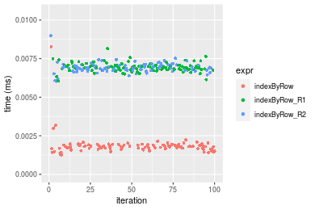


#### Index set 'all'

```r
> stats <- microbenchmark(indexByRow = indexByRow(dim, idxs = idxs), indexByRow_R1 = indexByRow_R1(dim, 
+     idxs = idxs), indexByRow_R2 = indexByRow_R2(dim, idxs = idxs), unit = "ms")
```

_Table: Benchmarking of indexByRow(), indexByRow_R1() and indexByRow_R2() on 10x10+all data. The top panel shows times in milliseconds and the bottom panel shows relative times._


|   |expr          |      min|        lq|      mean|    median|        uq|      max|
|:--|:-------------|--------:|---------:|---------:|---------:|---------:|--------:|
|1  |indexByRow    | 0.002597| 0.0028965| 0.0031202| 0.0030160| 0.0031940| 0.009982|
|2  |indexByRow_R1 | 0.007014| 0.0076220| 0.0080386| 0.0078225| 0.0080620| 0.022062|
|3  |indexByRow_R2 | 0.008408| 0.0092420| 0.0096910| 0.0094385| 0.0096495| 0.030284|


|   |expr          |      min|       lq|     mean|   median|       uq|      max|
|:--|:-------------|--------:|--------:|--------:|--------:|--------:|--------:|
|1  |indexByRow    | 1.000000| 1.000000| 1.000000| 1.000000| 1.000000| 1.000000|
|2  |indexByRow_R1 | 2.700809| 2.631452| 2.576327| 2.593667| 2.524108| 2.210178|
|3  |indexByRow_R2 | 3.237582| 3.190748| 3.105917| 3.129476| 3.021133| 3.033861|

_Figure: Benchmarking of indexByRow(), indexByRow_R1() and indexByRow_R2() on 10x10+all data.  Outliers are displayed as crosses.  Times are in milliseconds._

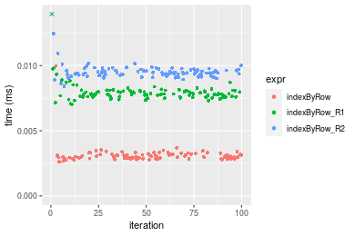


#### Index set 'odd'

```r
> stats <- microbenchmark(indexByRow = indexByRow(dim, idxs = idxs), indexByRow_R1 = indexByRow_R1(dim, 
+     idxs = idxs), indexByRow_R2 = indexByRow_R2(dim, idxs = idxs), unit = "ms")
```

_Table: Benchmarking of indexByRow(), indexByRow_R1() and indexByRow_R2() on 10x10+odd data. The top panel shows times in milliseconds and the bottom panel shows relative times._


|   |expr          |      min|        lq|      mean|    median|        uq|      max|
|:--|:-------------|--------:|---------:|---------:|---------:|---------:|--------:|
|1  |indexByRow    | 0.002129| 0.0026235| 0.0028911| 0.0027650| 0.0029430| 0.014277|
|3  |indexByRow_R2 | 0.006101| 0.0068175| 0.0071568| 0.0070460| 0.0072730| 0.017081|
|2  |indexByRow_R1 | 0.006769| 0.0077380| 0.0082243| 0.0079815| 0.0082065| 0.027612|


|   |expr          |      min|       lq|     mean|   median|       uq|     max|
|:--|:-------------|--------:|--------:|--------:|--------:|--------:|-------:|
|1  |indexByRow    | 1.000000| 1.000000| 1.000000| 1.000000| 1.000000| 1.00000|
|3  |indexByRow_R2 | 2.865665| 2.598628| 2.475464| 2.548282| 2.471288| 1.19640|
|2  |indexByRow_R1 | 3.179427| 2.949495| 2.844689| 2.886618| 2.788481| 1.93402|

_Figure: Benchmarking of indexByRow(), indexByRow_R1() and indexByRow_R2() on 10x10+odd data.  Outliers are displayed as crosses.  Times are in milliseconds._

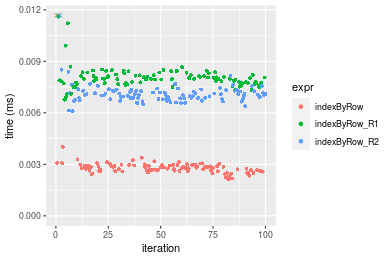


### 100x100 matrix


```r
> X <- data[["100x100"]]
> dim <- dim(X)
> idxsList <- list(`all-by-NULL` = NULL, all = seq_len(prod(dim)), odd = seq(from = 1, to = prod(dim), 
+     by = 2L))
> str(idxsList)
List of 3
 $ all-by-NULL: NULL
 $ all        : int [1:10000] 1 2 3 4 5 6 7 8 9 10 ...
 $ odd        : num [1:5000] 1 3 5 7 9 11 13 15 17 19 ...
```


#### Index set 'all-by-NULL'

```r
> stats <- microbenchmark(indexByRow = indexByRow(dim, idxs = idxs), indexByRow_R1 = indexByRow_R1(dim, 
+     idxs = idxs), indexByRow_R2 = indexByRow_R2(dim, idxs = idxs), unit = "ms")
```

_Table: Benchmarking of indexByRow(), indexByRow_R1() and indexByRow_R2() on 100x100+all-by-NULL data. The top panel shows times in milliseconds and the bottom panel shows relative times._


|   |expr          |      min|        lq|      mean|    median|       uq|      max|
|:--|:-------------|--------:|---------:|---------:|---------:|--------:|--------:|
|1  |indexByRow    | 0.014648| 0.0158535| 0.0170871| 0.0171565| 0.017860| 0.025582|
|3  |indexByRow_R2 | 0.072911| 0.0764590| 0.0821808| 0.0822640| 0.086528| 0.113707|
|2  |indexByRow_R1 | 0.072457| 0.0785330| 0.0828232| 0.0833075| 0.086523| 0.103238|


|   |expr          |      min|       lq|    mean|   median|       uq|      max|
|:--|:-------------|--------:|--------:|-------:|--------:|--------:|--------:|
|1  |indexByRow    | 1.000000| 1.000000| 1.00000| 1.000000| 1.000000| 1.000000|
|3  |indexByRow_R2 | 4.977540| 4.822847| 4.80952| 4.794917| 4.844793| 4.444805|
|2  |indexByRow_R1 | 4.946546| 4.953670| 4.84712| 4.855740| 4.844513| 4.035572|

_Figure: Benchmarking of indexByRow(), indexByRow_R1() and indexByRow_R2() on 100x100+all-by-NULL data.  Outliers are displayed as crosses.  Times are in milliseconds._

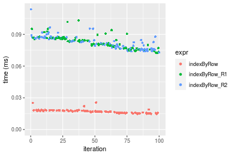


#### Index set 'all'

```r
> stats <- microbenchmark(indexByRow = indexByRow(dim, idxs = idxs), indexByRow_R1 = indexByRow_R1(dim, 
+     idxs = idxs), indexByRow_R2 = indexByRow_R2(dim, idxs = idxs), unit = "ms")
```

_Table: Benchmarking of indexByRow(), indexByRow_R1() and indexByRow_R2() on 100x100+all data. The top panel shows times in milliseconds and the bottom panel shows relative times._


|   |expr          |      min|        lq|      mean|    median|        uq|      max|
|:--|:-------------|--------:|---------:|---------:|---------:|---------:|--------:|
|2  |indexByRow_R1 | 0.073139| 0.0829905| 0.0934142| 0.0906985| 0.1029795| 0.143181|
|1  |indexByRow    | 0.079376| 0.0886345| 0.1015866| 0.0997895| 0.1128060| 0.136602|
|3  |indexByRow_R2 | 0.299086| 0.3252640| 0.3765274| 0.3677485| 0.4149570| 0.498572|


|   |expr          |      min|       lq|     mean|   median|       uq|       max|
|:--|:-------------|--------:|--------:|--------:|--------:|--------:|---------:|
|2  |indexByRow_R1 | 1.000000| 1.000000| 1.000000| 1.000000| 1.000000| 1.0000000|
|1  |indexByRow    | 1.085276| 1.068008| 1.087486| 1.100233| 1.095422| 0.9540512|
|3  |indexByRow_R2 | 4.089282| 3.919292| 4.030728| 4.054626| 4.029511| 3.4821101|

_Figure: Benchmarking of indexByRow(), indexByRow_R1() and indexByRow_R2() on 100x100+all data.  Outliers are displayed as crosses.  Times are in milliseconds._

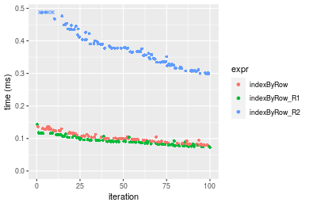


#### Index set 'odd'

```r
> stats <- microbenchmark(indexByRow = indexByRow(dim, idxs = idxs), indexByRow_R1 = indexByRow_R1(dim, 
+     idxs = idxs), indexByRow_R2 = indexByRow_R2(dim, idxs = idxs), unit = "ms")
```

_Table: Benchmarking of indexByRow(), indexByRow_R1() and indexByRow_R2() on 100x100+odd data. The top panel shows times in milliseconds and the bottom panel shows relative times._


|   |expr          |      min|        lq|      mean|    median|        uq|      max|
|:--|:-------------|--------:|---------:|---------:|---------:|---------:|--------:|
|1  |indexByRow    | 0.054291| 0.0600405| 0.0652963| 0.0623065| 0.0706640| 0.084691|
|2  |indexByRow_R1 | 0.086140| 0.0946855| 0.1040139| 0.1007100| 0.1115095| 0.153390|
|3  |indexByRow_R2 | 0.172392| 0.1883985| 0.2045486| 0.1958290| 0.2168005| 0.268349|


|   |expr          |      min|       lq|     mean|   median|       uq|      max|
|:--|:-------------|--------:|--------:|--------:|--------:|--------:|--------:|
|1  |indexByRow    | 1.000000| 1.000000| 1.000000| 1.000000| 1.000000| 1.000000|
|2  |indexByRow_R1 | 1.586635| 1.577027| 1.592953| 1.616364| 1.578024| 1.811172|
|3  |indexByRow_R2 | 3.175333| 3.137857| 3.132623| 3.142995| 3.068047| 3.168566|

_Figure: Benchmarking of indexByRow(), indexByRow_R1() and indexByRow_R2() on 100x100+odd data.  Outliers are displayed as crosses.  Times are in milliseconds._

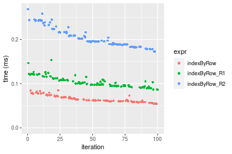


### 1000x10 matrix


```r
> X <- data[["1000x10"]]
> dim <- dim(X)
> idxsList <- list(`all-by-NULL` = NULL, all = seq_len(prod(dim)), odd = seq(from = 1, to = prod(dim), 
+     by = 2L))
> str(idxsList)
List of 3
 $ all-by-NULL: NULL
 $ all        : int [1:10000] 1 2 3 4 5 6 7 8 9 10 ...
 $ odd        : num [1:5000] 1 3 5 7 9 11 13 15 17 19 ...
```


#### Index set 'all-by-NULL'

```r
> stats <- microbenchmark(indexByRow = indexByRow(dim, idxs = idxs), indexByRow_R1 = indexByRow_R1(dim, 
+     idxs = idxs), indexByRow_R2 = indexByRow_R2(dim, idxs = idxs), unit = "ms")
```

_Table: Benchmarking of indexByRow(), indexByRow_R1() and indexByRow_R2() on 1000x10+all-by-NULL data. The top panel shows times in milliseconds and the bottom panel shows relative times._


|   |expr          |      min|        lq|      mean|    median|        uq|      max|
|:--|:-------------|--------:|---------:|---------:|---------:|---------:|--------:|
|1  |indexByRow    | 0.014370| 0.0156595| 0.0170803| 0.0167940| 0.0172085| 0.033776|
|3  |indexByRow_R2 | 0.072323| 0.0782240| 0.0826735| 0.0828185| 0.0855075| 0.103994|
|2  |indexByRow_R1 | 0.072930| 0.0781570| 0.0823705| 0.0833015| 0.0852585| 0.114475|


|   |expr          |      min|       lq|     mean|   median|       uq|      max|
|:--|:-------------|--------:|--------:|--------:|--------:|--------:|--------:|
|1  |indexByRow    | 1.000000| 1.000000| 1.000000| 1.000000| 1.000000| 1.000000|
|3  |indexByRow_R2 | 5.032916| 4.995306| 4.840274| 4.931434| 4.968911| 3.078932|
|2  |indexByRow_R1 | 5.075157| 4.991028| 4.822535| 4.960194| 4.954441| 3.389241|

_Figure: Benchmarking of indexByRow(), indexByRow_R1() and indexByRow_R2() on 1000x10+all-by-NULL data.  Outliers are displayed as crosses.  Times are in milliseconds._

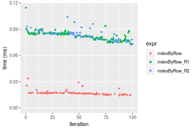


#### Index set 'all'

```r
> stats <- microbenchmark(indexByRow = indexByRow(dim, idxs = idxs), indexByRow_R1 = indexByRow_R1(dim, 
+     idxs = idxs), indexByRow_R2 = indexByRow_R2(dim, idxs = idxs), unit = "ms")
```

_Table: Benchmarking of indexByRow(), indexByRow_R1() and indexByRow_R2() on 1000x10+all data. The top panel shows times in milliseconds and the bottom panel shows relative times._


|   |expr          |      min|        lq|      mean|    median|        uq|      max|
|:--|:-------------|--------:|---------:|---------:|---------:|---------:|--------:|
|2  |indexByRow_R1 | 0.073073| 0.0787840| 0.0905500| 0.0888050| 0.0992355| 0.141554|
|1  |indexByRow    | 0.079488| 0.0862585| 0.1014922| 0.1000345| 0.1133740| 0.144243|
|3  |indexByRow_R2 | 0.299457| 0.3263195| 0.3771176| 0.3730035| 0.4155360| 0.508412|


|   |expr          |      min|       lq|     mean|   median|       uq|      max|
|:--|:-------------|--------:|--------:|--------:|--------:|--------:|--------:|
|2  |indexByRow_R1 | 1.000000| 1.000000| 1.000000| 1.000000| 1.000000| 1.000000|
|1  |indexByRow    | 1.087789| 1.094873| 1.120841| 1.126451| 1.142474| 1.018996|
|3  |indexByRow_R2 | 4.098053| 4.141951| 4.164742| 4.200253| 4.187373| 3.591647|

_Figure: Benchmarking of indexByRow(), indexByRow_R1() and indexByRow_R2() on 1000x10+all data.  Outliers are displayed as crosses.  Times are in milliseconds._

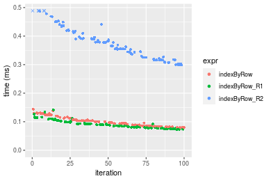


#### Index set 'odd'

```r
> stats <- microbenchmark(indexByRow = indexByRow(dim, idxs = idxs), indexByRow_R1 = indexByRow_R1(dim, 
+     idxs = idxs), indexByRow_R2 = indexByRow_R2(dim, idxs = idxs), unit = "ms")
```

_Table: Benchmarking of indexByRow(), indexByRow_R1() and indexByRow_R2() on 1000x10+odd data. The top panel shows times in milliseconds and the bottom panel shows relative times._


|   |expr          |      min|        lq|      mean|    median|        uq|      max|
|:--|:-------------|--------:|---------:|---------:|---------:|---------:|--------:|
|1  |indexByRow    | 0.056217| 0.0596785| 0.0642890| 0.0618185| 0.0686320| 0.084469|
|2  |indexByRow_R1 | 0.086026| 0.0931040| 0.1019171| 0.0968150| 0.1070695| 0.159767|
|3  |indexByRow_R2 | 0.176351| 0.1888825| 0.2050249| 0.1991240| 0.2162400| 0.253264|


|   |expr          |      min|       lq|     mean|   median|       uq|      max|
|:--|:-------------|--------:|--------:|--------:|--------:|--------:|--------:|
|1  |indexByRow    | 1.000000| 1.000000| 1.000000| 1.000000| 1.000000| 1.000000|
|2  |indexByRow_R1 | 1.530249| 1.560093| 1.585295| 1.566117| 1.560052| 1.891428|
|3  |indexByRow_R2 | 3.136969| 3.165001| 3.189112| 3.221107| 3.150717| 2.998307|

_Figure: Benchmarking of indexByRow(), indexByRow_R1() and indexByRow_R2() on 1000x10+odd data.  Outliers are displayed as crosses.  Times are in milliseconds._

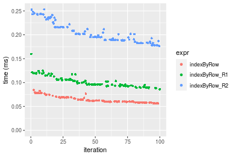


### 10x1000 matrix


```r
> X <- data[["10x1000"]]
> dim <- dim(X)
> idxsList <- list(`all-by-NULL` = NULL, all = seq_len(prod(dim)), odd = seq(from = 1, to = prod(dim), 
+     by = 2L))
> str(idxsList)
List of 3
 $ all-by-NULL: NULL
 $ all        : int [1:10000] 1 2 3 4 5 6 7 8 9 10 ...
 $ odd        : num [1:5000] 1 3 5 7 9 11 13 15 17 19 ...
```


#### Index set 'all-by-NULL'

```r
> stats <- microbenchmark(indexByRow = indexByRow(dim, idxs = idxs), indexByRow_R1 = indexByRow_R1(dim, 
+     idxs = idxs), indexByRow_R2 = indexByRow_R2(dim, idxs = idxs), unit = "ms")
```

_Table: Benchmarking of indexByRow(), indexByRow_R1() and indexByRow_R2() on 10x1000+all-by-NULL data. The top panel shows times in milliseconds and the bottom panel shows relative times._


|   |expr          |      min|        lq|      mean|    median|       uq|      max|
|:--|:-------------|--------:|---------:|---------:|---------:|--------:|--------:|
|1  |indexByRow    | 0.014239| 0.0157445| 0.0172616| 0.0168955| 0.017482| 0.048658|
|2  |indexByRow_R1 | 0.072737| 0.0791580| 0.0841529| 0.0844590| 0.085807| 0.114271|
|3  |indexByRow_R2 | 0.074989| 0.0807495| 0.0848846| 0.0847935| 0.087464| 0.121400|


|   |expr          |      min|       lq|     mean|   median|       uq|      max|
|:--|:-------------|--------:|--------:|--------:|--------:|--------:|--------:|
|1  |indexByRow    | 1.000000| 1.000000| 1.000000| 1.000000| 1.000000| 1.000000|
|2  |indexByRow_R1 | 5.108294| 5.027660| 4.875143| 4.998905| 4.908306| 2.348453|
|3  |indexByRow_R2 | 5.266451| 5.128743| 4.917530| 5.018703| 5.003089| 2.494965|

_Figure: Benchmarking of indexByRow(), indexByRow_R1() and indexByRow_R2() on 10x1000+all-by-NULL data.  Outliers are displayed as crosses.  Times are in milliseconds._


#### Index set 'all'

```r
> stats <- microbenchmark(indexByRow = indexByRow(dim, idxs = idxs), indexByRow_R1 = indexByRow_R1(dim, 
+     idxs = idxs), indexByRow_R2 = indexByRow_R2(dim, idxs = idxs), unit = "ms")
```

_Table: Benchmarking of indexByRow(), indexByRow_R1() and indexByRow_R2() on 10x1000+all data. The top panel shows times in milliseconds and the bottom panel shows relative times._


|   |expr          |      min|        lq|      mean|    median|        uq|      max|
|:--|:-------------|--------:|---------:|---------:|---------:|---------:|--------:|
|2  |indexByRow_R1 | 0.075965| 0.0845215| 0.0959730| 0.0921945| 0.1061435| 0.146041|
|1  |indexByRow    | 0.083836| 0.0939165| 0.1060638| 0.1031975| 0.1163105| 0.162429|
|3  |indexByRow_R2 | 0.308488| 0.3424260| 0.3808184| 0.3697095| 0.4140125| 0.498119|


|   |expr          |      min|       lq|     mean|   median|       uq|      max|
|:--|:-------------|--------:|--------:|--------:|--------:|--------:|--------:|
|2  |indexByRow_R1 | 1.000000| 1.000000| 1.000000| 1.000000| 1.000000| 1.000000|
|1  |indexByRow    | 1.103614| 1.111155| 1.105141| 1.119346| 1.095785| 1.112215|
|3  |indexByRow_R2 | 4.060923| 4.051348| 3.967973| 4.010104| 3.900498| 3.410816|

_Figure: Benchmarking of indexByRow(), indexByRow_R1() and indexByRow_R2() on 10x1000+all data.  Outliers are displayed as crosses.  Times are in milliseconds._

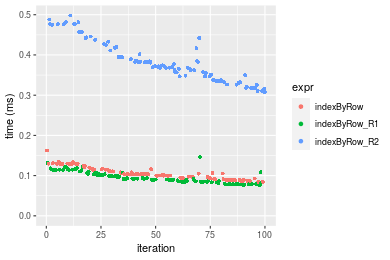


#### Index set 'odd'

```r
> stats <- microbenchmark(indexByRow = indexByRow(dim, idxs = idxs), indexByRow_R1 = indexByRow_R1(dim, 
+     idxs = idxs), indexByRow_R2 = indexByRow_R2(dim, idxs = idxs), unit = "ms")
```

_Table: Benchmarking of indexByRow(), indexByRow_R1() and indexByRow_R2() on 10x1000+odd data. The top panel shows times in milliseconds and the bottom panel shows relative times._


|   |expr          |      min|       lq|      mean|    median|        uq|      max|
|:--|:-------------|--------:|--------:|---------:|---------:|---------:|--------:|
|1  |indexByRow    | 0.056567| 0.060402| 0.0661350| 0.0624605| 0.0708945| 0.083937|
|2  |indexByRow_R1 | 0.087551| 0.093531| 0.1042903| 0.1013455| 0.1148625| 0.159972|
|3  |indexByRow_R2 | 0.173521| 0.184843| 0.2007008| 0.1921170| 0.2145280| 0.250107|


|   |expr          |      min|       lq|     mean|   median|       uq|      max|
|:--|:-------------|--------:|--------:|--------:|--------:|--------:|--------:|
|1  |indexByRow    | 1.000000| 1.000000| 1.000000| 1.000000| 1.000000| 1.000000|
|2  |indexByRow_R1 | 1.547740| 1.548475| 1.576931| 1.622553| 1.620189| 1.905858|
|3  |indexByRow_R2 | 3.067531| 3.060213| 3.034714| 3.075816| 3.026018| 2.979699|

_Figure: Benchmarking of indexByRow(), indexByRow_R1() and indexByRow_R2() on 10x1000+odd data.  Outliers are displayed as crosses.  Times are in milliseconds._

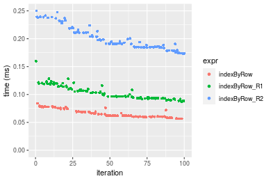


### 100x1000 matrix


```r
> X <- data[["100x1000"]]
> dim <- dim(X)
> idxsList <- list(`all-by-NULL` = NULL, all = seq_len(prod(dim)), odd = seq(from = 1, to = prod(dim), 
+     by = 2L))
> str(idxsList)
List of 3
 $ all-by-NULL: NULL
 $ all        : int [1:100000] 1 2 3 4 5 6 7 8 9 10 ...
 $ odd        : num [1:50000] 1 3 5 7 9 11 13 15 17 19 ...
```


#### Index set 'all-by-NULL'

```r
> stats <- microbenchmark(indexByRow = indexByRow(dim, idxs = idxs), indexByRow_R1 = indexByRow_R1(dim, 
+     idxs = idxs), indexByRow_R2 = indexByRow_R2(dim, idxs = idxs), unit = "ms")
```

_Table: Benchmarking of indexByRow(), indexByRow_R1() and indexByRow_R2() on 100x1000+all-by-NULL data. The top panel shows times in milliseconds and the bottom panel shows relative times._


|   |expr          |      min|        lq|      mean|    median|        uq|       max|
|:--|:-------------|--------:|---------:|---------:|---------:|---------:|---------:|
|1  |indexByRow    | 0.115464| 0.1995900| 0.3385397| 0.2088155| 0.2413295| 13.511501|
|2  |indexByRow_R1 | 0.628546| 0.8130840| 0.8532068| 0.8333380| 0.8943900|  1.110523|
|3  |indexByRow_R2 | 0.614639| 0.8130005| 0.8539385| 0.8341795| 0.8989580|  1.095333|


|   |expr          |      min|       lq|     mean|   median|       uq|       max|
|:--|:-------------|--------:|--------:|--------:|--------:|--------:|---------:|
|1  |indexByRow    | 1.000000| 1.000000| 1.000000| 1.000000| 1.000000| 1.0000000|
|2  |indexByRow_R1 | 5.443653| 4.073771| 2.520256| 3.990786| 3.706095| 0.0821909|
|3  |indexByRow_R2 | 5.323209| 4.073353| 2.522418| 3.994816| 3.725023| 0.0810667|

_Figure: Benchmarking of indexByRow(), indexByRow_R1() and indexByRow_R2() on 100x1000+all-by-NULL data.  Outliers are displayed as crosses.  Times are in milliseconds._

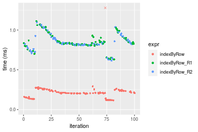


#### Index set 'all'

```r
> stats <- microbenchmark(indexByRow = indexByRow(dim, idxs = idxs), indexByRow_R1 = indexByRow_R1(dim, 
+     idxs = idxs), indexByRow_R2 = indexByRow_R2(dim, idxs = idxs), unit = "ms")
```

_Table: Benchmarking of indexByRow(), indexByRow_R1() and indexByRow_R2() on 100x1000+all data. The top panel shows times in milliseconds and the bottom panel shows relative times._


|   |expr          |      min|        lq|     mean|    median|        uq|      max|
|:--|:-------------|--------:|---------:|--------:|---------:|---------:|--------:|
|2  |indexByRow_R1 | 0.675165| 0.7106850| 0.795781| 0.7174010| 0.9120655| 1.208324|
|1  |indexByRow    | 0.779511| 0.8219465| 0.926629| 0.8452335| 0.9086725| 6.466082|
|3  |indexByRow_R2 | 3.020327| 3.1763715| 3.534190| 3.2894220| 3.8989875| 9.519398|


|   |expr          |      min|       lq|     mean|   median|        uq|      max|
|:--|:-------------|--------:|--------:|--------:|--------:|---------:|--------:|
|2  |indexByRow_R1 | 1.000000| 1.000000| 1.000000| 1.000000| 1.0000000| 1.000000|
|1  |indexByRow    | 1.154549| 1.156555| 1.164427| 1.178188| 0.9962799| 5.351282|
|3  |indexByRow_R2 | 4.473465| 4.469451| 4.441160| 4.585193| 4.2748986| 7.878183|

_Figure: Benchmarking of indexByRow(), indexByRow_R1() and indexByRow_R2() on 100x1000+all data.  Outliers are displayed as crosses.  Times are in milliseconds._

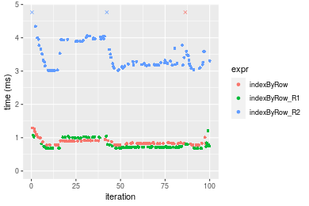


#### Index set 'odd'

```r
> stats <- microbenchmark(indexByRow = indexByRow(dim, idxs = idxs), indexByRow_R1 = indexByRow_R1(dim, 
+     idxs = idxs), indexByRow_R2 = indexByRow_R2(dim, idxs = idxs), unit = "ms")
```

_Table: Benchmarking of indexByRow(), indexByRow_R1() and indexByRow_R2() on 100x1000+odd data. The top panel shows times in milliseconds and the bottom panel shows relative times._


|   |expr          |      min|        lq|      mean|    median|       uq|      max|
|:--|:-------------|--------:|---------:|---------:|---------:|--------:|--------:|
|1  |indexByRow    | 0.459503| 0.4975865| 0.5470081| 0.5344835| 0.597411| 0.814059|
|2  |indexByRow_R1 | 0.687885| 0.7663820| 0.9068504| 0.8990150| 1.050164| 1.325027|
|3  |indexByRow_R2 | 1.486684| 1.5908470| 1.8527314| 1.8022330| 1.989478| 7.573445|


|   |expr          |      min|       lq|     mean|   median|       uq|      max|
|:--|:-------------|--------:|--------:|--------:|--------:|--------:|--------:|
|1  |indexByRow    | 1.000000| 1.000000| 1.000000| 1.000000| 1.000000| 1.000000|
|2  |indexByRow_R1 | 1.497020| 1.540199| 1.657837| 1.682026| 1.757858| 1.627679|
|3  |indexByRow_R2 | 3.235417| 3.197126| 3.387027| 3.371915| 3.330166| 9.303312|

_Figure: Benchmarking of indexByRow(), indexByRow_R1() and indexByRow_R2() on 100x1000+odd data.  Outliers are displayed as crosses.  Times are in milliseconds._

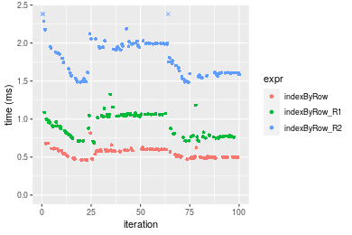


### 1000x100 matrix


```r
> X <- data[["1000x100"]]
> dim <- dim(X)
> idxsList <- list(`all-by-NULL` = NULL, all = seq_len(prod(dim)), odd = seq(from = 1, to = prod(dim), 
+     by = 2L))
> str(idxsList)
List of 3
 $ all-by-NULL: NULL
 $ all        : int [1:100000] 1 2 3 4 5 6 7 8 9 10 ...
 $ odd        : num [1:50000] 1 3 5 7 9 11 13 15 17 19 ...
```


#### Index set 'all-by-NULL'

```r
> stats <- microbenchmark(indexByRow = indexByRow(dim, idxs = idxs), indexByRow_R1 = indexByRow_R1(dim, 
+     idxs = idxs), indexByRow_R2 = indexByRow_R2(dim, idxs = idxs), unit = "ms")
```

_Table: Benchmarking of indexByRow(), indexByRow_R1() and indexByRow_R2() on 1000x100+all-by-NULL data. The top panel shows times in milliseconds and the bottom panel shows relative times._


|   |expr          |      min|       lq|      mean|    median|        uq|      max|
|:--|:-------------|--------:|--------:|---------:|---------:|---------:|--------:|
|1  |indexByRow    | 0.094991| 0.112862| 0.1474459| 0.1297995| 0.2043365| 0.225727|
|2  |indexByRow_R1 | 0.493691| 0.573372| 0.7634830| 0.6438725| 0.7992820| 9.982878|
|3  |indexByRow_R2 | 0.493267| 0.585467| 0.6932224| 0.6891255| 0.8056790| 0.832819|


|   |expr          |      min|       lq|     mean|   median|       uq|       max|
|:--|:-------------|--------:|--------:|--------:|--------:|--------:|---------:|
|1  |indexByRow    | 1.000000| 1.000000| 1.000000| 1.000000| 1.000000|  1.000000|
|2  |indexByRow_R1 | 5.197240| 5.080293| 5.178054| 4.960516| 3.911597| 44.225449|
|3  |indexByRow_R2 | 5.192776| 5.187459| 4.701536| 5.309154| 3.942903|  3.689497|

_Figure: Benchmarking of indexByRow(), indexByRow_R1() and indexByRow_R2() on 1000x100+all-by-NULL data.  Outliers are displayed as crosses.  Times are in milliseconds._


#### Index set 'all'

```r
> stats <- microbenchmark(indexByRow = indexByRow(dim, idxs = idxs), indexByRow_R1 = indexByRow_R1(dim, 
+     idxs = idxs), indexByRow_R2 = indexByRow_R2(dim, idxs = idxs), unit = "ms")
```

_Table: Benchmarking of indexByRow(), indexByRow_R1() and indexByRow_R2() on 1000x100+all data. The top panel shows times in milliseconds and the bottom panel shows relative times._


|   |expr          |      min|        lq|      mean|    median|       uq|      max|
|:--|:-------------|--------:|---------:|---------:|---------:|--------:|--------:|
|2  |indexByRow_R1 | 0.678529| 0.7118475| 0.8039870| 0.7327110| 0.979022| 1.094823|
|1  |indexByRow    | 0.779450| 0.8220610| 0.8719802| 0.8449625| 0.913456| 1.291226|
|3  |indexByRow_R2 | 3.020563| 3.1374585| 3.5553889| 3.2469850| 3.848040| 9.759774|


|   |expr          |      min|       lq|     mean|   median|        uq|      max|
|:--|:-------------|--------:|--------:|--------:|--------:|---------:|--------:|
|2  |indexByRow_R1 | 1.000000| 1.000000| 1.000000| 1.000000| 1.0000000| 1.000000|
|1  |indexByRow    | 1.148735| 1.154827| 1.084570| 1.153200| 0.9330291| 1.179393|
|3  |indexByRow_R2 | 4.451634| 4.407487| 4.422197| 4.431468| 3.9304934| 8.914477|

_Figure: Benchmarking of indexByRow(), indexByRow_R1() and indexByRow_R2() on 1000x100+all data.  Outliers are displayed as crosses.  Times are in milliseconds._

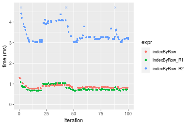


#### Index set 'odd'

```r
> stats <- microbenchmark(indexByRow = indexByRow(dim, idxs = idxs), indexByRow_R1 = indexByRow_R1(dim, 
+     idxs = idxs), indexByRow_R2 = indexByRow_R2(dim, idxs = idxs), unit = "ms")
```

_Table: Benchmarking of indexByRow(), indexByRow_R1() and indexByRow_R2() on 1000x100+odd data. The top panel shows times in milliseconds and the bottom panel shows relative times._


|   |expr          |      min|       lq|      mean|   median|       uq|      max|
|:--|:-------------|--------:|--------:|---------:|--------:|--------:|--------:|
|1  |indexByRow    | 0.459215| 0.476651| 0.6407709| 0.569294| 0.598198| 9.605461|
|2  |indexByRow_R1 | 0.687202| 0.745444| 0.8669642| 0.809086| 1.034142| 1.164917|
|3  |indexByRow_R2 | 1.462061| 1.527778| 1.7432410| 1.662646| 1.963524| 2.401244|


|   |expr          |      min|       lq|     mean|   median|       uq|       max|
|:--|:-------------|--------:|--------:|--------:|--------:|--------:|---------:|
|1  |indexByRow    | 1.000000| 1.000000| 1.000000| 1.000000| 1.000000| 1.0000000|
|2  |indexByRow_R1 | 1.496471| 1.563920| 1.353002| 1.421209| 1.728762| 0.1212765|
|3  |indexByRow_R2 | 3.183827| 3.205234| 2.720537| 2.920541| 3.282399| 0.2499874|

_Figure: Benchmarking of indexByRow(), indexByRow_R1() and indexByRow_R2() on 1000x100+odd data.  Outliers are displayed as crosses.  Times are in milliseconds._

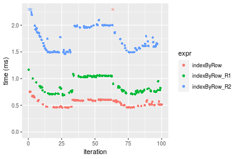


## Appendix

### Session information
```r
R version 4.1.1 Patched (2021-08-10 r80727)
Platform: x86_64-pc-linux-gnu (64-bit)
Running under: Ubuntu 18.04.5 LTS

Matrix products: default
BLAS:   /home/hb/software/R-devel/R-4-1-branch/lib/R/lib/libRblas.so
LAPACK: /home/hb/software/R-devel/R-4-1-branch/lib/R/lib/libRlapack.so

locale:
 [1] LC_CTYPE=en_US.UTF-8       LC_NUMERIC=C              
 [3] LC_TIME=en_US.UTF-8        LC_COLLATE=en_US.UTF-8    
 [5] LC_MONETARY=en_US.UTF-8    LC_MESSAGES=en_US.UTF-8   
 [7] LC_PAPER=en_US.UTF-8       LC_NAME=C                 
 [9] LC_ADDRESS=C               LC_TELEPHONE=C            
[11] LC_MEASUREMENT=en_US.UTF-8 LC_IDENTIFICATION=C       

attached base packages:
[1] stats     graphics  grDevices utils     datasets  methods   base     

other attached packages:
[1] microbenchmark_1.4-7   matrixStats_0.60.1     ggplot2_3.3.5         
[4] knitr_1.33             R.devices_2.17.0       R.utils_2.10.1        
[7] R.oo_1.24.0            R.methodsS3_1.8.1-9001 history_0.0.1-9000    

loaded via a namespace (and not attached):
 [1] Biobase_2.52.0          httr_1.4.2              splines_4.1.1          
 [4] bit64_4.0.5             network_1.17.1          assertthat_0.2.1       
 [7] highr_0.9               stats4_4.1.1            blob_1.2.2             
[10] GenomeInfoDbData_1.2.6  robustbase_0.93-8       pillar_1.6.2           
[13] RSQLite_2.2.8           lattice_0.20-44         glue_1.4.2             
[16] digest_0.6.27           XVector_0.32.0          colorspace_2.0-2       
[19] Matrix_1.3-4            XML_3.99-0.7            pkgconfig_2.0.3        
[22] zlibbioc_1.38.0         genefilter_1.74.0       purrr_0.3.4            
[25] ergm_4.1.2              xtable_1.8-4            scales_1.1.1           
[28] tibble_3.1.4            annotate_1.70.0         KEGGREST_1.32.0        
[31] farver_2.1.0            generics_0.1.0          IRanges_2.26.0         
[34] ellipsis_0.3.2          cachem_1.0.6            withr_2.4.2            
[37] BiocGenerics_0.38.0     mime_0.11               survival_3.2-13        
[40] magrittr_2.0.1          crayon_1.4.1            statnet.common_4.5.0   
[43] memoise_2.0.0           laeken_0.5.1            fansi_0.5.0            
[46] R.cache_0.15.0          MASS_7.3-54             R.rsp_0.44.0           
[49] progressr_0.8.0         tools_4.1.1             lifecycle_1.0.0        
[52] S4Vectors_0.30.0        trust_0.1-8             munsell_0.5.0          
[55] tabby_0.0.1-9001        AnnotationDbi_1.54.1    Biostrings_2.60.2      
[58] compiler_4.1.1          GenomeInfoDb_1.28.1     rlang_0.4.11           
[61] grid_4.1.1              RCurl_1.98-1.4          cwhmisc_6.6            
[64] rappdirs_0.3.3          startup_0.15.0          labeling_0.4.2         
[67] bitops_1.0-7            base64enc_0.1-3         boot_1.3-28            
[70] gtable_0.3.0            DBI_1.1.1               markdown_1.1           
[73] R6_2.5.1                lpSolveAPI_5.5.2.0-17.7 rle_0.9.2              
[76] dplyr_1.0.7             fastmap_1.1.0           bit_4.0.4              
[79] utf8_1.2.2              parallel_4.1.1          Rcpp_1.0.7             
[82] vctrs_0.3.8             png_0.1-7               DEoptimR_1.0-9         
[85] tidyselect_1.1.1        xfun_0.25               coda_0.19-4            
```
Total processing time was 18.96 secs.


### Reproducibility
To reproduce this report, do:
```r
html <- matrixStats:::benchmark('indexByRow')
```

[RSP]: https://cran.r-project.org/package=R.rsp
[matrixStats]: https://cran.r-project.org/package=matrixStats

[StackOverflow:colMins?]: https://stackoverflow.com/questions/13676878 "Stack Overflow: fastest way to get Min from every column in a matrix?"
[StackOverflow:colSds?]: https://stackoverflow.com/questions/17549762 "Stack Overflow: Is there such 'colsd' in R?"
[StackOverflow:rowProds?]: https://stackoverflow.com/questions/20198801/ "Stack Overflow: Row product of matrix and column sum of matrix"

---------------------------------------
Copyright Henrik Bengtsson. Last updated on 2021-08-25 18:21:17 (+0200 UTC). Powered by [RSP].

<script>
 var link = document.createElement('link');
 link.rel = 'icon';
 link.href = "data:image/png;base64,iVBORw0KGgoAAAANSUhEUgAAACAAAAAgCAMAAABEpIrGAAAA21BMVEUAAAAAAP8AAP8AAP8AAP8AAP8AAP8AAP8AAP8AAP8AAP8AAP8AAP8AAP8AAP8AAP8AAP8AAP8AAP8AAP8AAP8AAP8AAP8AAP8AAP8AAP8AAP8AAP8AAP8AAP8AAP8AAP8AAP8AAP8AAP8AAP8AAP8AAP8AAP8AAP8AAP8AAP8BAf4CAv0DA/wdHeIeHuEfH+AgIN8hId4lJdomJtknJ9g+PsE/P8BAQL9yco10dIt1dYp3d4h4eIeVlWqWlmmXl2iYmGeZmWabm2Tn5xjo6Bfp6Rb39wj4+Af//wA2M9hbAAAASXRSTlMAAQIJCgsMJSYnKD4/QGRlZmhpamtsbautrrCxuru8y8zN5ebn6Pn6+///////////////////////////////////////////LsUNcQAAAS9JREFUOI29k21XgkAQhVcFytdSMqMETU26UVqGmpaiFbL//xc1cAhhwVNf6n5i5z67M2dmYOyfJZUqlVLhkKucG7cgmUZTybDz6g0iDeq51PUr37Ds2cy2/C9NeES5puDjxuUk1xnToZsg8pfA3avHQ3lLIi7iWRrkv/OYtkScxBIMgDee0ALoyxHQBJ68JLCjOtQIMIANF7QG9G9fNnHvisCHBVMKgSJgiz7nE+AoBKrAPA3MgepvgR9TSCasrCKH0eB1wBGBFdCO+nAGjMVGPcQb5bd6mQRegN6+1axOs9nGfYcCtfi4NQosdtH7dB+txFIpXQqN1p9B/asRHToyS0jRgpV7nk4nwcq1BJ+x3Gl/v7S9Wmpp/aGquum7w3ZDyrADFYrl8vHBH+ev9AUASW1dmU4h4wAAAABJRU5ErkJggg=="
 document.getElementsByTagName('head')[0].appendChild(link);
</script>


### Local functions
```r
> indexByRow_R1 <- function(dim, idxs = NULL, ...) {
+     n <- prod(dim)
+     x <- matrix(seq_len(n), nrow = dim[2L], ncol = dim[1L], byrow = TRUE)
+     if (!is.null(idxs)) 
+         x <- x[idxs]
+     as.vector(x)
+ }
```
```r
> indexByRow_R2 <- function(dim, idxs = NULL, ...) {
+     n <- prod(dim)
+     if (is.null(idxs)) {
+         x <- matrix(seq_len(n), nrow = dim[2L], ncol = dim[1L], byrow = TRUE)
+         as.vector(x)
+     }     else {
+         idxs <- idxs - 1
+         cols <- idxs%/%dim[2L]
+         rows <- idxs%%dim[2L]
+         cols + dim[1L] * rows + 1L
+     }
+ }
```
```r
> rmatrix <- function(nrow, ncol, mode = c("logical", "double", "integer", "index"), range = c(-100, 
+     +100), na_prob = 0) {
+     mode <- match.arg(mode)
+     n <- nrow * ncol
+     if (mode == "logical") {
+         x <- sample(c(FALSE, TRUE), size = n, replace = TRUE)
+     }     else if (mode == "index") {
+         x <- seq_len(n)
+         mode <- "integer"
+     }     else {
+         x <- runif(n, min = range[1], max = range[2])
+     }
+     storage.mode(x) <- mode
+     if (na_prob > 0) 
+         x[sample(n, size = na_prob * n)] <- NA
+     dim(x) <- c(nrow, ncol)
+     x
+ }
> rmatrices <- function(scale = 10, seed = 1, ...) {
+     set.seed(seed)
+     data <- list()
+     data[[1]] <- rmatrix(nrow = scale * 1, ncol = scale * 1, ...)
+     data[[2]] <- rmatrix(nrow = scale * 10, ncol = scale * 10, ...)
+     data[[3]] <- rmatrix(nrow = scale * 100, ncol = scale * 1, ...)
+     data[[4]] <- t(data[[3]])
+     data[[5]] <- rmatrix(nrow = scale * 10, ncol = scale * 100, ...)
+     data[[6]] <- t(data[[5]])
+     names(data) <- sapply(data, FUN = function(x) paste(dim(x), collapse = "x"))
+     data
+ }
```


