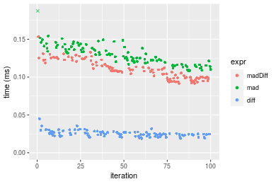
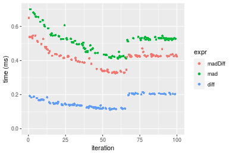
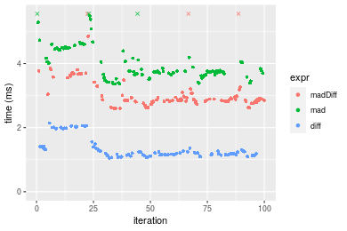
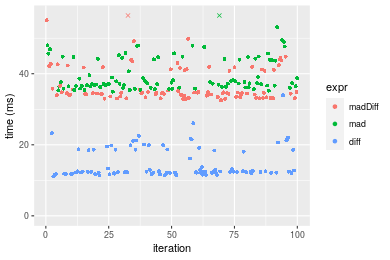
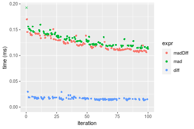
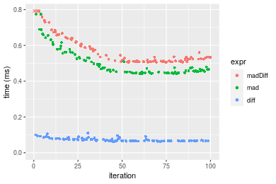
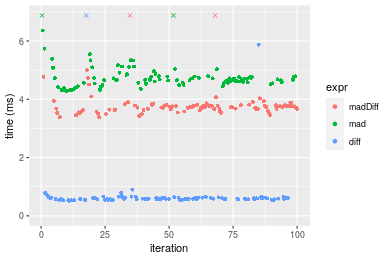
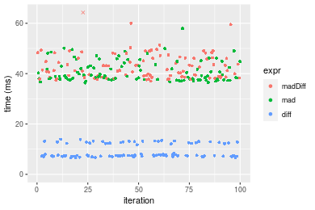

[matrixStats]: Benchmark report

---------------------------------------


# madDiff() benchmarks

This report benchmark the performance of madDiff() against alternative methods.

## Alternative methods

* N/A


## Data type "integer"
### Data
```r
> rvector <- function(n, mode = c("logical", "double", "integer"), range = c(-100, +100), na_prob = 0) {
+     mode <- match.arg(mode)
+     if (mode == "logical") {
+         x <- sample(c(FALSE, TRUE), size = n, replace = TRUE)
+     }     else {
+         x <- runif(n, min = range[1], max = range[2])
+     }
+     storage.mode(x) <- mode
+     if (na_prob > 0) 
+         x[sample(n, size = na_prob * n)] <- NA
+     x
+ }
> rvectors <- function(scale = 10, seed = 1, ...) {
+     set.seed(seed)
+     data <- list()
+     data[[1]] <- rvector(n = scale * 100, ...)
+     data[[2]] <- rvector(n = scale * 1000, ...)
+     data[[3]] <- rvector(n = scale * 10000, ...)
+     data[[4]] <- rvector(n = scale * 1e+05, ...)
+     data[[5]] <- rvector(n = scale * 1e+06, ...)
+     names(data) <- sprintf("n = %d", sapply(data, FUN = length))
+     data
+ }
> data <- rvectors(mode = mode)
> data <- data[1:4]
```

### Results

### n = 1000 vector

#### All elements
```r
> x <- data[["n = 1000"]]
> stats <- microbenchmark(madDiff = madDiff(x), mad = mad(x), diff = diff(x), unit = "ms")
```

_Table: Benchmarking of madDiff(), mad() and diff() on integer+n = 1000 data. The top panel shows times in milliseconds and the bottom panel shows relative times._


|   |expr    |      min|        lq|      mean|    median|        uq|      max|
|:--|:-------|--------:|---------:|---------:|---------:|---------:|--------:|
|3  |diff    | 0.018761| 0.0221820| 0.0251059| 0.0245275| 0.0270925| 0.045014|
|1  |madDiff | 0.091576| 0.0988770| 0.1098684| 0.1083715| 0.1212185| 0.153583|
|2  |mad     | 0.108376| 0.1193605| 0.1305218| 0.1295285| 0.1389215| 0.267346|


|   |expr    |      min|       lq|     mean|   median|       uq|      max|
|:--|:-------|--------:|--------:|--------:|--------:|--------:|--------:|
|3  |diff    | 1.000000| 1.000000| 1.000000| 1.000000| 1.000000| 1.000000|
|1  |madDiff | 4.881190| 4.457533| 4.376205| 4.418367| 4.474246| 3.411894|
|2  |mad     | 5.776664| 5.380962| 5.198860| 5.280950| 5.127674| 5.939175|

_Figure: Benchmarking of madDiff(), mad() and diff() on integer+n = 1000 data.  Outliers are displayed as crosses.  Times are in milliseconds._



### n = 10000 vector

#### All elements
```r
> x <- data[["n = 10000"]]
> stats <- microbenchmark(madDiff = madDiff(x), mad = mad(x), diff = diff(x), unit = "ms")
```

_Table: Benchmarking of madDiff(), mad() and diff() on integer+n = 10000 data. The top panel shows times in milliseconds and the bottom panel shows relative times._


|   |expr    |      min|        lq|      mean|    median|        uq|      max|
|:--|:-------|--------:|---------:|---------:|---------:|---------:|--------:|
|3  |diff    | 0.112024| 0.1243435| 0.1566694| 0.1439385| 0.2014465| 0.214881|
|1  |madDiff | 0.325314| 0.3924370| 0.4212657| 0.4258700| 0.4353755| 0.650185|
|2  |mad     | 0.411645| 0.4640355| 0.5149662| 0.5239930| 0.5347600| 0.700905|


|   |expr    |      min|       lq|     mean|   median|       uq|      max|
|:--|:-------|--------:|--------:|--------:|--------:|--------:|--------:|
|3  |diff    | 1.000000| 1.000000| 1.000000| 1.000000| 1.000000| 1.000000|
|1  |madDiff | 2.903967| 3.156072| 2.688884| 2.958694| 2.161246| 3.025791|
|2  |mad     | 3.674614| 3.731884| 3.286961| 3.640395| 2.654601| 3.261829|

_Figure: Benchmarking of madDiff(), mad() and diff() on integer+n = 10000 data.  Outliers are displayed as crosses.  Times are in milliseconds._



### n = 100000 vector

#### All elements
```r
> x <- data[["n = 100000"]]
> stats <- microbenchmark(madDiff = madDiff(x), mad = mad(x), diff = diff(x), unit = "ms")
```

_Table: Benchmarking of madDiff(), mad() and diff() on integer+n = 100000 data. The top panel shows times in milliseconds and the bottom panel shows relative times._


|   |expr    |      min|       lq|     mean|   median|       uq|        max|
|:--|:-------|--------:|--------:|--------:|--------:|--------:|----------:|
|3  |diff    | 1.050685| 1.150491| 1.348517| 1.207955| 1.391512|   2.145510|
|1  |madDiff | 2.594155| 2.821535| 6.880512| 2.871058| 3.141754| 377.068354|
|2  |mad     | 3.363854| 3.654946| 4.054046| 3.762370| 4.442860|   9.817677|


|   |expr    |      min|       lq|     mean|   median|       uq|        max|
|:--|:-------|--------:|--------:|--------:|--------:|--------:|----------:|
|3  |diff    | 1.000000| 1.000000| 1.000000| 1.000000| 1.000000|   1.000000|
|1  |madDiff | 2.469013| 2.452462| 5.102282| 2.376792| 2.257798| 175.747656|
|2  |mad     | 3.201582| 3.176858| 3.006300| 3.114661| 3.192828|   4.575918|

_Figure: Benchmarking of madDiff(), mad() and diff() on integer+n = 100000 data.  Outliers are displayed as crosses.  Times are in milliseconds._



### n = 1000000 vector

#### All elements
```r
> x <- data[["n = 1000000"]]
> stats <- microbenchmark(madDiff = madDiff(x), mad = mad(x), diff = diff(x), unit = "ms")
```

_Table: Benchmarking of madDiff(), mad() and diff() on integer+n = 1000000 data. The top panel shows times in milliseconds and the bottom panel shows relative times._


|   |expr    |      min|       lq|     mean|   median|       uq|      max|
|:--|:-------|--------:|--------:|--------:|--------:|--------:|--------:|
|3  |diff    | 11.08058| 12.02639| 14.60791| 12.35891| 18.54508| 33.91772|
|1  |madDiff | 32.52100| 33.87995| 36.92594| 34.57785| 41.17256| 57.99381|
|2  |mad     | 34.95991| 36.39986| 39.80172| 37.33035| 44.15566| 57.07767|


|   |expr    |      min|       lq|     mean|   median|       uq|      max|
|:--|:-------|--------:|--------:|--------:|--------:|--------:|--------:|
|3  |diff    | 1.000000| 1.000000| 1.000000| 1.000000| 1.000000| 1.000000|
|1  |madDiff | 2.934953| 2.817133| 2.527804| 2.797807| 2.220134| 1.709838|
|2  |mad     | 3.155060| 3.026664| 2.724668| 3.020522| 2.380990| 1.682828|

_Figure: Benchmarking of madDiff(), mad() and diff() on integer+n = 1000000 data.  Outliers are displayed as crosses.  Times are in milliseconds._




## Data type "double"
### Data
```r
> rvector <- function(n, mode = c("logical", "double", "integer"), range = c(-100, +100), na_prob = 0) {
+     mode <- match.arg(mode)
+     if (mode == "logical") {
+         x <- sample(c(FALSE, TRUE), size = n, replace = TRUE)
+     }     else {
+         x <- runif(n, min = range[1], max = range[2])
+     }
+     storage.mode(x) <- mode
+     if (na_prob > 0) 
+         x[sample(n, size = na_prob * n)] <- NA
+     x
+ }
> rvectors <- function(scale = 10, seed = 1, ...) {
+     set.seed(seed)
+     data <- list()
+     data[[1]] <- rvector(n = scale * 100, ...)
+     data[[2]] <- rvector(n = scale * 1000, ...)
+     data[[3]] <- rvector(n = scale * 10000, ...)
+     data[[4]] <- rvector(n = scale * 1e+05, ...)
+     data[[5]] <- rvector(n = scale * 1e+06, ...)
+     names(data) <- sprintf("n = %d", sapply(data, FUN = length))
+     data
+ }
> data <- rvectors(mode = mode)
> data <- data[1:4]
```

### Results

### n = 1000 vector

#### All elements
```r
> x <- data[["n = 1000"]]
> stats <- microbenchmark(madDiff = madDiff(x), mad = mad(x), diff = diff(x), unit = "ms")
```

_Table: Benchmarking of madDiff(), mad() and diff() on double+n = 1000 data. The top panel shows times in milliseconds and the bottom panel shows relative times._


|   |expr    |      min|        lq|      mean|    median|        uq|      max|
|:--|:-------|--------:|---------:|---------:|---------:|---------:|--------:|
|3  |diff    | 0.012932| 0.0149235| 0.0165752| 0.0159970| 0.0177465| 0.029822|
|1  |madDiff | 0.106141| 0.1111175| 0.1210872| 0.1177435| 0.1290035| 0.170156|
|2  |mad     | 0.112987| 0.1198205| 0.1316305| 0.1283255| 0.1410860| 0.273269|


|   |expr    |      min|       lq|     mean|   median|       uq|      max|
|:--|:-------|--------:|--------:|--------:|--------:|--------:|--------:|
|3  |diff    | 1.000000| 1.000000| 1.000000| 1.000000| 1.000000| 1.000000|
|1  |madDiff | 8.207624| 7.445807| 7.305327| 7.360349| 7.269236| 5.705721|
|2  |mad     | 8.737009| 8.028981| 7.941418| 8.021848| 7.950075| 9.163336|

_Figure: Benchmarking of madDiff(), mad() and diff() on double+n = 1000 data.  Outliers are displayed as crosses.  Times are in milliseconds._



### n = 10000 vector

#### All elements
```r
> x <- data[["n = 10000"]]
> stats <- microbenchmark(madDiff = madDiff(x), mad = mad(x), diff = diff(x), unit = "ms")
```

_Table: Benchmarking of madDiff(), mad() and diff() on double+n = 10000 data. The top panel shows times in milliseconds and the bottom panel shows relative times._


|   |expr    |      min|        lq|      mean|    median|        uq|      max|
|:--|:-------|--------:|---------:|---------:|---------:|---------:|--------:|
|3  |diff    | 0.062617| 0.0665120| 0.0737555| 0.0696615| 0.0790335| 0.109946|
|2  |mad     | 0.442439| 0.4493575| 0.4997865| 0.4649165| 0.5285220| 0.774432|
|1  |madDiff | 0.506006| 0.5105090| 0.5744247| 0.5273420| 0.6183990| 0.939205|


|   |expr    |      min|       lq|     mean|   median|       uq|      max|
|:--|:-------|--------:|--------:|--------:|--------:|--------:|--------:|
|3  |diff    | 1.000000| 1.000000| 1.000000| 1.000000| 1.000000| 1.000000|
|2  |mad     | 7.065797| 6.756036| 6.776259| 6.673938| 6.687316| 7.043749|
|1  |madDiff | 8.080968| 7.675442| 7.788227| 7.570064| 7.824517| 8.542421|

_Figure: Benchmarking of madDiff(), mad() and diff() on double+n = 10000 data.  Outliers are displayed as crosses.  Times are in milliseconds._



### n = 100000 vector

#### All elements
```r
> x <- data[["n = 100000"]]
> stats <- microbenchmark(madDiff = madDiff(x), mad = mad(x), diff = diff(x), unit = "ms")
```

_Table: Benchmarking of madDiff(), mad() and diff() on double+n = 100000 data. The top panel shows times in milliseconds and the bottom panel shows relative times._


|   |expr    |      min|        lq|      mean|   median|       uq|       max|
|:--|:-------|--------:|---------:|---------:|--------:|--------:|---------:|
|3  |diff    | 0.515559| 0.5630855| 0.7700987| 0.586815| 0.622159| 12.505038|
|1  |madDiff | 3.381827| 3.6367195| 3.8576575| 3.730856| 3.798064|  9.062059|
|2  |mad     | 4.274526| 4.5456950| 4.7963063| 4.669953| 4.784174| 10.269303|


|   |expr    |      min|       lq|     mean|   median|       uq|       max|
|:--|:-------|--------:|--------:|--------:|--------:|--------:|---------:|
|3  |diff    | 1.000000| 1.000000| 1.000000| 1.000000| 1.000000| 1.0000000|
|1  |madDiff | 6.559534| 6.458557| 5.009303| 6.357805| 6.104651| 0.7246726|
|2  |mad     | 8.291051| 8.072833| 6.228171| 7.958135| 7.689633| 0.8212133|

_Figure: Benchmarking of madDiff(), mad() and diff() on double+n = 100000 data.  Outliers are displayed as crosses.  Times are in milliseconds._



### n = 1000000 vector

#### All elements
```r
> x <- data[["n = 1000000"]]
> stats <- microbenchmark(madDiff = madDiff(x), mad = mad(x), diff = diff(x), unit = "ms")
```

_Table: Benchmarking of madDiff(), mad() and diff() on double+n = 1000000 data. The top panel shows times in milliseconds and the bottom panel shows relative times._


|   |expr    |       min|        lq|      mean|    median|       uq|       max|
|:--|:-------|---------:|---------:|---------:|---------:|--------:|---------:|
|3  |diff    |  6.565177|  7.203583|  9.081143|  7.517017| 12.34082|  13.92735|
|2  |mad     | 36.332053| 37.718627| 40.990392| 39.096370| 43.37263|  57.91581|
|1  |madDiff | 37.011077| 38.947812| 46.607254| 41.357090| 46.24642| 414.86457|


|   |expr    |      min|       lq|     mean|   median|       uq|       max|
|:--|:-------|--------:|--------:|--------:|--------:|--------:|---------:|
|3  |diff    | 1.000000| 1.000000| 1.000000| 1.000000| 1.000000|  1.000000|
|2  |mad     | 5.534055| 5.236092| 4.513792| 5.201048| 3.514567|  4.158423|
|1  |madDiff | 5.637484| 5.406727| 5.132312| 5.501795| 3.747436| 29.787758|

_Figure: Benchmarking of madDiff(), mad() and diff() on double+n = 1000000 data.  Outliers are displayed as crosses.  Times are in milliseconds._




## Appendix

### Session information
```r
R version 4.1.1 Patched (2021-08-10 r80727)
Platform: x86_64-pc-linux-gnu (64-bit)
Running under: Ubuntu 18.04.5 LTS

Matrix products: default
BLAS:   /home/hb/software/R-devel/R-4-1-branch/lib/R/lib/libRblas.so
LAPACK: /home/hb/software/R-devel/R-4-1-branch/lib/R/lib/libRlapack.so

locale:
 [1] LC_CTYPE=en_US.UTF-8       LC_NUMERIC=C              
 [3] LC_TIME=en_US.UTF-8        LC_COLLATE=en_US.UTF-8    
 [5] LC_MONETARY=en_US.UTF-8    LC_MESSAGES=en_US.UTF-8   
 [7] LC_PAPER=en_US.UTF-8       LC_NAME=C                 
 [9] LC_ADDRESS=C               LC_TELEPHONE=C            
[11] LC_MEASUREMENT=en_US.UTF-8 LC_IDENTIFICATION=C       

attached base packages:
[1] stats     graphics  grDevices utils     datasets  methods   base     

other attached packages:
[1] microbenchmark_1.4-7   matrixStats_0.60.1     ggplot2_3.3.5         
[4] knitr_1.33             R.devices_2.17.0       R.utils_2.10.1        
[7] R.oo_1.24.0            R.methodsS3_1.8.1-9001 history_0.0.1-9000    

loaded via a namespace (and not attached):
 [1] Biobase_2.52.0          httr_1.4.2              splines_4.1.1          
 [4] bit64_4.0.5             network_1.17.1          assertthat_0.2.1       
 [7] highr_0.9               stats4_4.1.1            blob_1.2.2             
[10] GenomeInfoDbData_1.2.6  robustbase_0.93-8       pillar_1.6.2           
[13] RSQLite_2.2.8           lattice_0.20-44         glue_1.4.2             
[16] digest_0.6.27           XVector_0.32.0          colorspace_2.0-2       
[19] Matrix_1.3-4            XML_3.99-0.7            pkgconfig_2.0.3        
[22] zlibbioc_1.38.0         genefilter_1.74.0       purrr_0.3.4            
[25] ergm_4.1.2              xtable_1.8-4            scales_1.1.1           
[28] tibble_3.1.4            annotate_1.70.0         KEGGREST_1.32.0        
[31] farver_2.1.0            generics_0.1.0          IRanges_2.26.0         
[34] ellipsis_0.3.2          cachem_1.0.6            withr_2.4.2            
[37] BiocGenerics_0.38.0     mime_0.11               survival_3.2-13        
[40] magrittr_2.0.1          crayon_1.4.1            statnet.common_4.5.0   
[43] memoise_2.0.0           laeken_0.5.1            fansi_0.5.0            
[46] R.cache_0.15.0          MASS_7.3-54             R.rsp_0.44.0           
[49] progressr_0.8.0         tools_4.1.1             lifecycle_1.0.0        
[52] S4Vectors_0.30.0        trust_0.1-8             munsell_0.5.0          
[55] tabby_0.0.1-9001        AnnotationDbi_1.54.1    Biostrings_2.60.2      
[58] compiler_4.1.1          GenomeInfoDb_1.28.1     rlang_0.4.11           
[61] grid_4.1.1              RCurl_1.98-1.4          cwhmisc_6.6            
[64] rappdirs_0.3.3          startup_0.15.0          labeling_0.4.2         
[67] bitops_1.0-7            base64enc_0.1-3         boot_1.3-28            
[70] gtable_0.3.0            DBI_1.1.1               markdown_1.1           
[73] R6_2.5.1                lpSolveAPI_5.5.2.0-17.7 rle_0.9.2              
[76] dplyr_1.0.7             fastmap_1.1.0           bit_4.0.4              
[79] utf8_1.2.2              parallel_4.1.1          Rcpp_1.0.7             
[82] vctrs_0.3.8             png_0.1-7               DEoptimR_1.0-9         
[85] tidyselect_1.1.1        xfun_0.25               coda_0.19-4            
```
Total processing time was 29.27 secs.


### Reproducibility
To reproduce this report, do:
```r
html <- matrixStats:::benchmark('madDiff')
```

[RSP]: https://cran.r-project.org/package=R.rsp
[matrixStats]: https://cran.r-project.org/package=matrixStats

[StackOverflow:colMins?]: https://stackoverflow.com/questions/13676878 "Stack Overflow: fastest way to get Min from every column in a matrix?"
[StackOverflow:colSds?]: https://stackoverflow.com/questions/17549762 "Stack Overflow: Is there such 'colsd' in R?"
[StackOverflow:rowProds?]: https://stackoverflow.com/questions/20198801/ "Stack Overflow: Row product of matrix and column sum of matrix"

---------------------------------------
Copyright Henrik Bengtsson. Last updated on 2021-08-25 18:27:16 (+0200 UTC). Powered by [RSP].

<script>
 var link = document.createElement('link');
 link.rel = 'icon';
 link.href = "data:image/png;base64,iVBORw0KGgoAAAANSUhEUgAAACAAAAAgCAMAAABEpIrGAAAA21BMVEUAAAAAAP8AAP8AAP8AAP8AAP8AAP8AAP8AAP8AAP8AAP8AAP8AAP8AAP8AAP8AAP8AAP8AAP8AAP8AAP8AAP8AAP8AAP8AAP8AAP8AAP8AAP8AAP8AAP8AAP8AAP8AAP8AAP8AAP8AAP8AAP8AAP8AAP8AAP8AAP8AAP8AAP8BAf4CAv0DA/wdHeIeHuEfH+AgIN8hId4lJdomJtknJ9g+PsE/P8BAQL9yco10dIt1dYp3d4h4eIeVlWqWlmmXl2iYmGeZmWabm2Tn5xjo6Bfp6Rb39wj4+Af//wA2M9hbAAAASXRSTlMAAQIJCgsMJSYnKD4/QGRlZmhpamtsbautrrCxuru8y8zN5ebn6Pn6+///////////////////////////////////////////LsUNcQAAAS9JREFUOI29k21XgkAQhVcFytdSMqMETU26UVqGmpaiFbL//xc1cAhhwVNf6n5i5z67M2dmYOyfJZUqlVLhkKucG7cgmUZTybDz6g0iDeq51PUr37Ds2cy2/C9NeES5puDjxuUk1xnToZsg8pfA3avHQ3lLIi7iWRrkv/OYtkScxBIMgDee0ALoyxHQBJ68JLCjOtQIMIANF7QG9G9fNnHvisCHBVMKgSJgiz7nE+AoBKrAPA3MgepvgR9TSCasrCKH0eB1wBGBFdCO+nAGjMVGPcQb5bd6mQRegN6+1axOs9nGfYcCtfi4NQosdtH7dB+txFIpXQqN1p9B/asRHToyS0jRgpV7nk4nwcq1BJ+x3Gl/v7S9Wmpp/aGquum7w3ZDyrADFYrl8vHBH+ev9AUASW1dmU4h4wAAAABJRU5ErkJggg=="
 document.getElementsByTagName('head')[0].appendChild(link);
</script>


