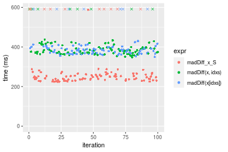
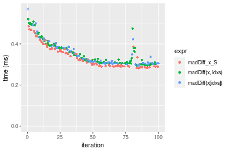
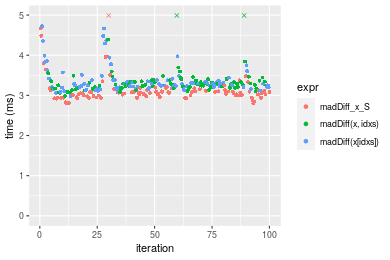
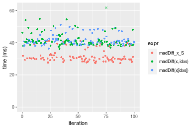
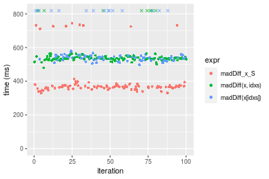

[matrixStats]: Benchmark report

---------------------------------------


# madDiff() benchmarks on subsetted computation

This report benchmark the performance of madDiff() on subsetted computation.


## Data type "integer"
### Data
```r
> rvector <- function(n, mode = c("logical", "double", "integer"), range = c(-100, +100), na_prob = 0) {
+     mode <- match.arg(mode)
+     if (mode == "logical") {
+         x <- sample(c(FALSE, TRUE), size = n, replace = TRUE)
+     }     else {
+         x <- runif(n, min = range[1], max = range[2])
+     }
+     storage.mode(x) <- mode
+     if (na_prob > 0) 
+         x[sample(n, size = na_prob * n)] <- NA
+     x
+ }
> rvectors <- function(scale = 10, seed = 1, ...) {
+     set.seed(seed)
+     data <- list()
+     data[[1]] <- rvector(n = scale * 100, ...)
+     data[[2]] <- rvector(n = scale * 1000, ...)
+     data[[3]] <- rvector(n = scale * 10000, ...)
+     data[[4]] <- rvector(n = scale * 1e+05, ...)
+     data[[5]] <- rvector(n = scale * 1e+06, ...)
+     names(data) <- sprintf("n = %d", sapply(data, FUN = length))
+     data
+ }
> data <- rvectors(mode = mode)
```

### Results

### n = 1000 vector


```r
> x <- data[["n = 1000"]]
> idxs <- sample.int(length(x), size = length(x) * 0.7)
> x_S <- x[idxs]
> gc()
           used  (Mb) gc trigger  (Mb) max used  (Mb)
Ncells  5277901 281.9   10014072 534.9 10014072 534.9
Vcells 16537638 126.2   36079799 275.3 55956209 427.0
> stats <- microbenchmark(madDiff_x_S = madDiff(x_S), `madDiff(x, idxs)` = madDiff(x, idxs = idxs), 
+     `madDiff(x[idxs])` = madDiff(x[idxs]), unit = "ms")
```

_Table: Benchmarking of madDiff_x_S(), madDiff(x, idxs)() and madDiff(x[idxs])() on integer+n = 1000 data. The top panel shows times in milliseconds and the bottom panel shows relative times._


|   |expr             |      min|        lq|      mean|    median|        uq|      max|
|:--|:----------------|--------:|---------:|---------:|---------:|---------:|--------:|
|1  |madDiff_x_S      | 0.074200| 0.0766875| 0.0821665| 0.0787145| 0.0832920| 0.145213|
|2  |madDiff(x, idxs) | 0.077912| 0.0803035| 0.0872416| 0.0827220| 0.0931810| 0.131446|
|3  |madDiff(x[idxs]) | 0.077116| 0.0806825| 0.0912271| 0.0832735| 0.0947665| 0.495955|


|   |expr             |      min|       lq|     mean|   median|       uq|       max|
|:--|:----------------|--------:|--------:|--------:|--------:|--------:|---------:|
|1  |madDiff_x_S      | 1.000000| 1.000000| 1.000000| 1.000000| 1.000000| 1.0000000|
|2  |madDiff(x, idxs) | 1.050027| 1.047152| 1.061766| 1.050912| 1.118727| 0.9051944|
|3  |madDiff(x[idxs]) | 1.039299| 1.052094| 1.110271| 1.057918| 1.137762| 3.4153623|

_Figure: Benchmarking of madDiff_x_S(), madDiff(x, idxs)() and madDiff(x[idxs])() on integer+n = 1000 data.  Outliers are displayed as crosses.  Times are in milliseconds._


### n = 10000 vector


```r
> x <- data[["n = 10000"]]
> idxs <- sample.int(length(x), size = length(x) * 0.7)
> x_S <- x[idxs]
> gc()
           used  (Mb) gc trigger  (Mb) max used  (Mb)
Ncells  5275350 281.8   10014072 534.9 10014072 534.9
Vcells 15407852 117.6   36079799 275.3 55956209 427.0
> stats <- microbenchmark(madDiff_x_S = madDiff(x_S), `madDiff(x, idxs)` = madDiff(x, idxs = idxs), 
+     `madDiff(x[idxs])` = madDiff(x[idxs]), unit = "ms")
```

_Table: Benchmarking of madDiff_x_S(), madDiff(x, idxs)() and madDiff(x[idxs])() on integer+n = 10000 data. The top panel shows times in milliseconds and the bottom panel shows relative times._


|   |expr             |      min|        lq|      mean|    median|       uq|      max|
|:--|:----------------|--------:|---------:|---------:|---------:|--------:|--------:|
|1  |madDiff_x_S      | 0.239450| 0.2461230| 0.2986800| 0.2787400| 0.325083| 0.645232|
|3  |madDiff(x[idxs]) | 0.253703| 0.2614290| 0.3037200| 0.2849175| 0.331286| 0.546287|
|2  |madDiff(x, idxs) | 0.254294| 0.2606455| 0.3120573| 0.2948515| 0.342488| 0.678427|


|   |expr             |      min|       lq|     mean|   median|       uq|       max|
|:--|:----------------|--------:|--------:|--------:|--------:|--------:|---------:|
|1  |madDiff_x_S      | 1.000000| 1.000000| 1.000000| 1.000000| 1.000000| 1.0000000|
|3  |madDiff(x[idxs]) | 1.059524| 1.062188| 1.016874| 1.022162| 1.019081| 0.8466521|
|2  |madDiff(x, idxs) | 1.061992| 1.059005| 1.044788| 1.057801| 1.053540| 1.0514466|

_Figure: Benchmarking of madDiff_x_S(), madDiff(x, idxs)() and madDiff(x[idxs])() on integer+n = 10000 data.  Outliers are displayed as crosses.  Times are in milliseconds._


### n = 100000 vector


```r
> x <- data[["n = 100000"]]
> idxs <- sample.int(length(x), size = length(x) * 0.7)
> x_S <- x[idxs]
> gc()
           used  (Mb) gc trigger  (Mb) max used  (Mb)
Ncells  5275422 281.8   10014072 534.9 10014072 534.9
Vcells 15471412 118.1   36079799 275.3 55956209 427.0
> stats <- microbenchmark(madDiff_x_S = madDiff(x_S), `madDiff(x, idxs)` = madDiff(x, idxs = idxs), 
+     `madDiff(x[idxs])` = madDiff(x[idxs]), unit = "ms")
```

_Table: Benchmarking of madDiff_x_S(), madDiff(x, idxs)() and madDiff(x[idxs])() on integer+n = 100000 data. The top panel shows times in milliseconds and the bottom panel shows relative times._


|   |expr             |      min|       lq|     mean|   median|       uq|       max|
|:--|:----------------|--------:|--------:|--------:|--------:|--------:|---------:|
|1  |madDiff_x_S      | 2.162317| 2.277525| 2.521476| 2.339349| 2.750243|  7.744738|
|2  |madDiff(x, idxs) | 2.293631| 2.420543| 2.710823| 2.483136| 2.685769| 10.263861|
|3  |madDiff(x[idxs]) | 2.299653| 2.427745| 2.671832| 2.486301| 2.831400|  8.562172|


|   |expr             |      min|       lq|     mean|   median|       uq|      max|
|:--|:----------------|--------:|--------:|--------:|--------:|--------:|--------:|
|1  |madDiff_x_S      | 1.000000| 1.000000| 1.000000| 1.000000| 1.000000| 1.000000|
|2  |madDiff(x, idxs) | 1.060728| 1.062795| 1.075094| 1.061465| 0.976557| 1.325269|
|3  |madDiff(x[idxs]) | 1.063513| 1.065957| 1.059630| 1.062817| 1.029509| 1.105547|

_Figure: Benchmarking of madDiff_x_S(), madDiff(x, idxs)() and madDiff(x[idxs])() on integer+n = 100000 data.  Outliers are displayed as crosses.  Times are in milliseconds._


### n = 1000000 vector


```r
> x <- data[["n = 1000000"]]
> idxs <- sample.int(length(x), size = length(x) * 0.7)
> x_S <- x[idxs]
> gc()
           used  (Mb) gc trigger  (Mb) max used  (Mb)
Ncells  5275494 281.8   10014072 534.9 10014072 534.9
Vcells 16101461 122.9   36079799 275.3 55956209 427.0
> stats <- microbenchmark(madDiff_x_S = madDiff(x_S), `madDiff(x, idxs)` = madDiff(x, idxs = idxs), 
+     `madDiff(x[idxs])` = madDiff(x[idxs]), unit = "ms")
```

_Table: Benchmarking of madDiff_x_S(), madDiff(x, idxs)() and madDiff(x[idxs])() on integer+n = 1000000 data. The top panel shows times in milliseconds and the bottom panel shows relative times._


|   |expr             |      min|       lq|     mean|   median|       uq|      max|
|:--|:----------------|--------:|--------:|--------:|--------:|--------:|--------:|
|1  |madDiff_x_S      | 19.23154| 19.77846| 21.71188| 20.40218| 21.39168| 36.81052|
|3  |madDiff(x[idxs]) | 22.33738| 22.87957| 25.00160| 23.38951| 25.79242| 32.25493|
|2  |madDiff(x, idxs) | 22.12245| 22.83673| 25.48146| 23.44144| 29.54516| 41.74122|


|   |expr             |      min|       lq|     mean|   median|       uq|       max|
|:--|:----------------|--------:|--------:|--------:|--------:|--------:|---------:|
|1  |madDiff_x_S      | 1.000000| 1.000000| 1.000000| 1.000000| 1.000000| 1.0000000|
|3  |madDiff(x[idxs]) | 1.161497| 1.156792| 1.151517| 1.146422| 1.205722| 0.8762421|
|2  |madDiff(x, idxs) | 1.150321| 1.154626| 1.173618| 1.148967| 1.381152| 1.1339479|

_Figure: Benchmarking of madDiff_x_S(), madDiff(x, idxs)() and madDiff(x[idxs])() on integer+n = 1000000 data.  Outliers are displayed as crosses.  Times are in milliseconds._


### n = 10000000 vector


```r
> x <- data[["n = 10000000"]]
> idxs <- sample.int(length(x), size = length(x) * 0.7)
> x_S <- x[idxs]
> gc()
           used  (Mb) gc trigger  (Mb) max used  (Mb)
Ncells  5275560 281.8   10014072 534.9 10014072 534.9
Vcells 22401499 171.0   36079799 275.3 55956209 427.0
> stats <- microbenchmark(madDiff_x_S = madDiff(x_S), `madDiff(x, idxs)` = madDiff(x, idxs = idxs), 
+     `madDiff(x[idxs])` = madDiff(x[idxs]), unit = "ms")
```

_Table: Benchmarking of madDiff_x_S(), madDiff(x, idxs)() and madDiff(x[idxs])() on integer+n = 10000000 data. The top panel shows times in milliseconds and the bottom panel shows relative times._


|   |expr             |      min|       lq|     mean|   median|       uq|      max|
|:--|:----------------|--------:|--------:|--------:|--------:|--------:|--------:|
|1  |madDiff_x_S      | 224.4964| 236.4825| 288.7532| 250.0882| 265.9779| 632.5643|
|2  |madDiff(x, idxs) | 348.2577| 369.3984| 416.7935| 383.6402| 414.0022| 799.9990|
|3  |madDiff(x[idxs]) | 349.5720| 368.8546| 410.4814| 384.4574| 398.9289| 823.4109|


|   |expr             |      min|       lq|     mean|   median|       uq|      max|
|:--|:----------------|--------:|--------:|--------:|--------:|--------:|--------:|
|1  |madDiff_x_S      | 1.000000| 1.000000| 1.000000| 1.000000| 1.000000| 1.000000|
|2  |madDiff(x, idxs) | 1.551284| 1.562054| 1.443425| 1.534020| 1.556528| 1.264692|
|3  |madDiff(x[idxs]) | 1.557138| 1.559754| 1.421565| 1.537287| 1.499857| 1.301703|

_Figure: Benchmarking of madDiff_x_S(), madDiff(x, idxs)() and madDiff(x[idxs])() on integer+n = 10000000 data.  Outliers are displayed as crosses.  Times are in milliseconds._




## Data type "double"
### Data
```r
> rvector <- function(n, mode = c("logical", "double", "integer"), range = c(-100, +100), na_prob = 0) {
+     mode <- match.arg(mode)
+     if (mode == "logical") {
+         x <- sample(c(FALSE, TRUE), size = n, replace = TRUE)
+     }     else {
+         x <- runif(n, min = range[1], max = range[2])
+     }
+     storage.mode(x) <- mode
+     if (na_prob > 0) 
+         x[sample(n, size = na_prob * n)] <- NA
+     x
+ }
> rvectors <- function(scale = 10, seed = 1, ...) {
+     set.seed(seed)
+     data <- list()
+     data[[1]] <- rvector(n = scale * 100, ...)
+     data[[2]] <- rvector(n = scale * 1000, ...)
+     data[[3]] <- rvector(n = scale * 10000, ...)
+     data[[4]] <- rvector(n = scale * 1e+05, ...)
+     data[[5]] <- rvector(n = scale * 1e+06, ...)
+     names(data) <- sprintf("n = %d", sapply(data, FUN = length))
+     data
+ }
> data <- rvectors(mode = mode)
```

### Results

### n = 1000 vector


```r
> x <- data[["n = 1000"]]
> idxs <- sample.int(length(x), size = length(x) * 0.7)
> x_S <- x[idxs]
> gc()
           used  (Mb) gc trigger  (Mb) max used  (Mb)
Ncells  5275641 281.8   10014072 534.9 10014072 534.9
Vcells 20958711 160.0   62637090 477.9 60902792 464.7
> stats <- microbenchmark(madDiff_x_S = madDiff(x_S), `madDiff(x, idxs)` = madDiff(x, idxs = idxs), 
+     `madDiff(x[idxs])` = madDiff(x[idxs]), unit = "ms")
```

_Table: Benchmarking of madDiff_x_S(), madDiff(x, idxs)() and madDiff(x[idxs])() on double+n = 1000 data. The top panel shows times in milliseconds and the bottom panel shows relative times._


|   |expr             |      min|        lq|      mean|    median|        uq|      max|
|:--|:----------------|--------:|---------:|---------:|---------:|---------:|--------:|
|1  |madDiff_x_S      | 0.090402| 0.0939285| 0.1006674| 0.0972590| 0.1079240| 0.119610|
|3  |madDiff(x[idxs]) | 0.093273| 0.0974265| 0.1080761| 0.1045865| 0.1167620| 0.240312|
|2  |madDiff(x, idxs) | 0.093514| 0.0975960| 0.1077100| 0.1058380| 0.1168455| 0.135649|


|   |expr             |      min|       lq|     mean|   median|       uq|      max|
|:--|:----------------|--------:|--------:|--------:|--------:|--------:|--------:|
|1  |madDiff_x_S      | 1.000000| 1.000000| 1.000000| 1.000000| 1.000000| 1.000000|
|3  |madDiff(x[idxs]) | 1.031758| 1.037241| 1.073596| 1.075340| 1.081891| 2.009130|
|2  |madDiff(x, idxs) | 1.034424| 1.039046| 1.069959| 1.088208| 1.082665| 1.134094|

_Figure: Benchmarking of madDiff_x_S(), madDiff(x, idxs)() and madDiff(x[idxs])() on double+n = 1000 data.  Outliers are displayed as crosses.  Times are in milliseconds._


### n = 10000 vector


```r
> x <- data[["n = 10000"]]
> idxs <- sample.int(length(x), size = length(x) * 0.7)
> x_S <- x[idxs]
> gc()
           used  (Mb) gc trigger  (Mb) max used  (Mb)
Ncells  5275710 281.8   10014072 534.9 10014072 534.9
Vcells 20968203 160.0   62637090 477.9 60902792 464.7
> stats <- microbenchmark(madDiff_x_S = madDiff(x_S), `madDiff(x, idxs)` = madDiff(x, idxs = idxs), 
+     `madDiff(x[idxs])` = madDiff(x[idxs]), unit = "ms")
```

_Table: Benchmarking of madDiff_x_S(), madDiff(x, idxs)() and madDiff(x[idxs])() on double+n = 10000 data. The top panel shows times in milliseconds and the bottom panel shows relative times._


|   |expr             |      min|        lq|      mean|    median|        uq|      max|
|:--|:----------------|--------:|---------:|---------:|---------:|---------:|--------:|
|3  |madDiff(x[idxs]) | 0.294591| 0.3054040| 0.3455965| 0.3164625| 0.3792580| 0.656277|
|1  |madDiff_x_S      | 0.281877| 0.2913015| 0.3373472| 0.3180180| 0.3736790| 0.485415|
|2  |madDiff(x, idxs) | 0.295706| 0.3061530| 0.3559535| 0.3285045| 0.3914415| 0.520530|


|   |expr             |       min|        lq|      mean|   median|        uq|       max|
|:--|:----------------|---------:|---------:|---------:|--------:|---------:|---------:|
|3  |madDiff(x[idxs]) | 1.0000000| 1.0000000| 1.0000000| 1.000000| 1.0000000| 1.0000000|
|1  |madDiff_x_S      | 0.9568419| 0.9538235| 0.9761303| 1.004915| 0.9852897| 0.7396496|
|2  |madDiff(x, idxs) | 1.0037849| 1.0024525| 1.0299685| 1.038052| 1.0321246| 0.7931559|

_Figure: Benchmarking of madDiff_x_S(), madDiff(x, idxs)() and madDiff(x[idxs])() on double+n = 10000 data.  Outliers are displayed as crosses.  Times are in milliseconds._



### n = 100000 vector


```r
> x <- data[["n = 100000"]]
> idxs <- sample.int(length(x), size = length(x) * 0.7)
> x_S <- x[idxs]
> gc()
           used  (Mb) gc trigger  (Mb) max used  (Mb)
Ncells  5275782 281.8   10014072 534.9 10014072 534.9
Vcells 21063084 160.7   62637090 477.9 60902792 464.7
> stats <- microbenchmark(madDiff_x_S = madDiff(x_S), `madDiff(x, idxs)` = madDiff(x, idxs = idxs), 
+     `madDiff(x[idxs])` = madDiff(x[idxs]), unit = "ms")
```

_Table: Benchmarking of madDiff_x_S(), madDiff(x, idxs)() and madDiff(x[idxs])() on double+n = 100000 data. The top panel shows times in milliseconds and the bottom panel shows relative times._


|   |expr             |      min|       lq|     mean|   median|       uq|      max|
|:--|:----------------|--------:|--------:|--------:|--------:|--------:|--------:|
|1  |madDiff_x_S      | 2.805528| 2.980672| 3.181715| 3.063123| 3.122529| 9.790596|
|2  |madDiff(x, idxs) | 2.981700| 3.190015| 3.400242| 3.264165| 3.346545| 8.966223|
|3  |madDiff(x[idxs]) | 2.986559| 3.200321| 3.375237| 3.275526| 3.375567| 4.719400|


|   |expr             |      min|       lq|     mean|   median|       uq|       max|
|:--|:----------------|--------:|--------:|--------:|--------:|--------:|---------:|
|1  |madDiff_x_S      | 1.000000| 1.000000| 1.000000| 1.000000| 1.000000| 1.0000000|
|2  |madDiff(x, idxs) | 1.062795| 1.070234| 1.068682| 1.065633| 1.071742| 0.9157995|
|3  |madDiff(x[idxs]) | 1.064526| 1.073691| 1.060823| 1.069342| 1.081037| 0.4820340|

_Figure: Benchmarking of madDiff_x_S(), madDiff(x, idxs)() and madDiff(x[idxs])() on double+n = 100000 data.  Outliers are displayed as crosses.  Times are in milliseconds._



### n = 1000000 vector


```r
> x <- data[["n = 1000000"]]
> idxs <- sample.int(length(x), size = length(x) * 0.7)
> x_S <- x[idxs]
> gc()
           used  (Mb) gc trigger  (Mb) max used  (Mb)
Ncells  5275854 281.8   10014072 534.9 10014072 534.9
Vcells 22008531 168.0   62637090 477.9 62618780 477.8
> stats <- microbenchmark(madDiff_x_S = madDiff(x_S), `madDiff(x, idxs)` = madDiff(x, idxs = idxs), 
+     `madDiff(x[idxs])` = madDiff(x[idxs]), unit = "ms")
```

_Table: Benchmarking of madDiff_x_S(), madDiff(x, idxs)() and madDiff(x[idxs])() on double+n = 1000000 data. The top panel shows times in milliseconds and the bottom panel shows relative times._


|   |expr             |      min|       lq|     mean|   median|       uq|       max|
|:--|:----------------|--------:|--------:|--------:|--------:|--------:|---------:|
|1  |madDiff_x_S      | 27.31705| 29.20585| 31.47976| 30.14585| 31.84868|  41.15535|
|2  |madDiff(x, idxs) | 36.07666| 38.96312| 45.43416| 40.52054| 42.14556| 421.90075|
|3  |madDiff(x[idxs]) | 36.23514| 39.60981| 41.69321| 40.82552| 42.28437|  51.12196|


|   |expr             |      min|       lq|     mean|   median|       uq|      max|
|:--|:----------------|--------:|--------:|--------:|--------:|--------:|--------:|
|1  |madDiff_x_S      | 1.000000| 1.000000| 1.000000| 1.000000| 1.000000|  1.00000|
|2  |madDiff(x, idxs) | 1.320665| 1.334086| 1.443281| 1.344150| 1.323306| 10.25142|
|3  |madDiff(x[idxs]) | 1.326466| 1.356229| 1.324445| 1.354267| 1.327665|  1.24217|

_Figure: Benchmarking of madDiff_x_S(), madDiff(x, idxs)() and madDiff(x[idxs])() on double+n = 1000000 data.  Outliers are displayed as crosses.  Times are in milliseconds._



### n = 10000000 vector


```r
> x <- data[["n = 10000000"]]
> idxs <- sample.int(length(x), size = length(x) * 0.7)
> x_S <- x[idxs]
> gc()
           used  (Mb) gc trigger  (Mb) max used  (Mb)
Ncells  5275926 281.8   10014072 534.9 10014072 534.9
Vcells 31458579 240.1   62637090 477.9 62618780 477.8
> stats <- microbenchmark(madDiff_x_S = madDiff(x_S), `madDiff(x, idxs)` = madDiff(x, idxs = idxs), 
+     `madDiff(x[idxs])` = madDiff(x[idxs]), unit = "ms")
```

_Table: Benchmarking of madDiff_x_S(), madDiff(x, idxs)() and madDiff(x[idxs])() on double+n = 10000000 data. The top panel shows times in milliseconds and the bottom panel shows relative times._


|   |expr             |      min|       lq|     mean|   median|       uq|       max|
|:--|:----------------|--------:|--------:|--------:|--------:|--------:|---------:|
|1  |madDiff_x_S      | 329.6369| 359.1778| 398.4743| 368.1303| 374.7447|  744.3348|
|2  |madDiff(x, idxs) | 479.9477| 529.9871| 564.4913| 534.2490| 547.0622|  907.6681|
|3  |madDiff(x[idxs]) | 497.7338| 531.6360| 596.6168| 540.8308| 556.0309| 1331.3023|


|   |expr             |      min|       lq|     mean|   median|       uq|      max|
|:--|:----------------|--------:|--------:|--------:|--------:|--------:|--------:|
|1  |madDiff_x_S      | 1.000000| 1.000000| 1.000000| 1.000000| 1.000000| 1.000000|
|2  |madDiff(x, idxs) | 1.455989| 1.475556| 1.416632| 1.451250| 1.459826| 1.219435|
|3  |madDiff(x[idxs]) | 1.509945| 1.480147| 1.497253| 1.469129| 1.483759| 1.788580|

_Figure: Benchmarking of madDiff_x_S(), madDiff(x, idxs)() and madDiff(x[idxs])() on double+n = 10000000 data.  Outliers are displayed as crosses.  Times are in milliseconds._




## Appendix

### Session information
```r
R version 4.1.1 Patched (2021-08-10 r80727)
Platform: x86_64-pc-linux-gnu (64-bit)
Running under: Ubuntu 18.04.5 LTS

Matrix products: default
BLAS:   /home/hb/software/R-devel/R-4-1-branch/lib/R/lib/libRblas.so
LAPACK: /home/hb/software/R-devel/R-4-1-branch/lib/R/lib/libRlapack.so

locale:
 [1] LC_CTYPE=en_US.UTF-8       LC_NUMERIC=C              
 [3] LC_TIME=en_US.UTF-8        LC_COLLATE=en_US.UTF-8    
 [5] LC_MONETARY=en_US.UTF-8    LC_MESSAGES=en_US.UTF-8   
 [7] LC_PAPER=en_US.UTF-8       LC_NAME=C                 
 [9] LC_ADDRESS=C               LC_TELEPHONE=C            
[11] LC_MEASUREMENT=en_US.UTF-8 LC_IDENTIFICATION=C       

attached base packages:
[1] stats     graphics  grDevices utils     datasets  methods   base     

other attached packages:
[1] microbenchmark_1.4-7   matrixStats_0.60.1     ggplot2_3.3.5         
[4] knitr_1.33             R.devices_2.17.0       R.utils_2.10.1        
[7] R.oo_1.24.0            R.methodsS3_1.8.1-9001 history_0.0.1-9000    

loaded via a namespace (and not attached):
 [1] Biobase_2.52.0          httr_1.4.2              splines_4.1.1          
 [4] bit64_4.0.5             network_1.17.1          assertthat_0.2.1       
 [7] highr_0.9               stats4_4.1.1            blob_1.2.2             
[10] GenomeInfoDbData_1.2.6  robustbase_0.93-8       pillar_1.6.2           
[13] RSQLite_2.2.8           lattice_0.20-44         glue_1.4.2             
[16] digest_0.6.27           XVector_0.32.0          colorspace_2.0-2       
[19] Matrix_1.3-4            XML_3.99-0.7            pkgconfig_2.0.3        
[22] zlibbioc_1.38.0         genefilter_1.74.0       purrr_0.3.4            
[25] ergm_4.1.2              xtable_1.8-4            scales_1.1.1           
[28] tibble_3.1.4            annotate_1.70.0         KEGGREST_1.32.0        
[31] farver_2.1.0            generics_0.1.0          IRanges_2.26.0         
[34] ellipsis_0.3.2          cachem_1.0.6            withr_2.4.2            
[37] BiocGenerics_0.38.0     mime_0.11               survival_3.2-13        
[40] magrittr_2.0.1          crayon_1.4.1            statnet.common_4.5.0   
[43] memoise_2.0.0           laeken_0.5.1            fansi_0.5.0            
[46] R.cache_0.15.0          MASS_7.3-54             R.rsp_0.44.0           
[49] progressr_0.8.0         tools_4.1.1             lifecycle_1.0.0        
[52] S4Vectors_0.30.0        trust_0.1-8             munsell_0.5.0          
[55] tabby_0.0.1-9001        AnnotationDbi_1.54.1    Biostrings_2.60.2      
[58] compiler_4.1.1          GenomeInfoDb_1.28.1     rlang_0.4.11           
[61] grid_4.1.1              RCurl_1.98-1.4          cwhmisc_6.6            
[64] rappdirs_0.3.3          startup_0.15.0          labeling_0.4.2         
[67] bitops_1.0-7            base64enc_0.1-3         boot_1.3-28            
[70] gtable_0.3.0            DBI_1.1.1               markdown_1.1           
[73] R6_2.5.1                lpSolveAPI_5.5.2.0-17.7 rle_0.9.2              
[76] dplyr_1.0.7             fastmap_1.1.0           bit_4.0.4              
[79] utf8_1.2.2              parallel_4.1.1          Rcpp_1.0.7             
[82] vctrs_0.3.8             png_0.1-7               DEoptimR_1.0-9         
[85] tidyselect_1.1.1        xfun_0.25               coda_0.19-4            
```
Total processing time was 5.02 mins.


### Reproducibility
To reproduce this report, do:
```r
html <- matrixStats:::benchmark('madDiff_subset')
```

[RSP]: https://cran.r-project.org/package=R.rsp
[matrixStats]: https://cran.r-project.org/package=matrixStats

[StackOverflow:colMins?]: https://stackoverflow.com/questions/13676878 "Stack Overflow: fastest way to get Min from every column in a matrix?"
[StackOverflow:colSds?]: https://stackoverflow.com/questions/17549762 "Stack Overflow: Is there such 'colsd' in R?"
[StackOverflow:rowProds?]: https://stackoverflow.com/questions/20198801/ "Stack Overflow: Row product of matrix and column sum of matrix"

---------------------------------------
Copyright Dongcan Jiang. Last updated on 2021-08-25 18:26:45 (+0200 UTC). Powered by [RSP].

<script>
 var link = document.createElement('link');
 link.rel = 'icon';
 link.href = ""
 document.getElementsByTagName('head')[0].appendChild(link);
</script>


