[matrixStats]: Benchmark report

---------------------------------------


# mean2() benchmarks

This report benchmark the performance of mean2() against alternative methods.

## Alternative methods

* mean() + [()
* mean.default() + [() - avoids method dispatching

as below

```r
> mean2_R_v1 <- function(x, na.rm = FALSE, idxs) {
+     mean(x[idxs], na.rm = na.rm)
+ }
```
and
```r
> mean2_R_v2 <- function(x, na.rm = FALSE, idxs) {
+     mean.default(x[idxs], na.rm = na.rm)
+ }
```


## Data type "integer"
### Data
```r
> rvector <- function(n, mode = c("logical", "double", "integer"), range = c(-100, +100), na_prob = 0) {
+     mode <- match.arg(mode)
+     if (mode == "logical") {
+         x <- sample(c(FALSE, TRUE), size = n, replace = TRUE)
+     }     else {
+         x <- runif(n, min = range[1], max = range[2])
+     }
+     storage.mode(x) <- mode
+     if (na_prob > 0) 
+         x[sample(n, size = na_prob * n)] <- NA
+     x
+ }
> rvectors <- function(scale = 10, seed = 1, ...) {
+     set.seed(seed)
+     data <- list()
+     data[[1]] <- rvector(n = scale * 100, ...)
+     data[[2]] <- rvector(n = scale * 1000, ...)
+     data[[3]] <- rvector(n = scale * 10000, ...)
+     data[[4]] <- rvector(n = scale * 1e+05, ...)
+     data[[5]] <- rvector(n = scale * 1e+06, ...)
+     names(data) <- sprintf("n = %d", sapply(data, FUN = length))
+     data
+ }
> data <- rvectors(mode = mode)
```

### Results

### n = 1000 vector


#### All elements
```r
> x <- data[["n = 1000"]]
> gc()
           used  (Mb) gc trigger  (Mb) max used  (Mb)
Ncells  5280767 282.1   10014072 534.9 10014072 534.9
Vcells 37042820 282.7   66295274 505.8 90959857 694.0
> stats <- microbenchmark(mean2 = mean2(x, refine = TRUE), mean2_no_refine = mean2(x, refine = FALSE), 
+     mean = mean(x), mean.default = mean.default(x), unit = "ms")
```

_Table: Benchmarking of mean2(), mean2_no_refine(), mean() and mean.default() on n = 1000+all data. The top panel shows times in milliseconds and the bottom panel shows relative times._


|   |expr            |      min|        lq|      mean|    median|        uq|      max|
|:--|:---------------|--------:|---------:|---------:|---------:|---------:|--------:|
|4  |mean.default    | 0.002758| 0.0028425| 0.0030582| 0.0029000| 0.0030035| 0.015546|
|2  |mean2_no_refine | 0.003057| 0.0031240| 0.0032438| 0.0032380| 0.0033215| 0.003624|
|1  |mean2           | 0.003063| 0.0031630| 0.0034853| 0.0032575| 0.0033260| 0.020538|
|3  |mean            | 0.004390| 0.0045440| 0.0050161| 0.0046740| 0.0048520| 0.021467|


|   |expr            |      min|       lq|     mean|   median|       uq|       max|
|:--|:---------------|--------:|--------:|--------:|--------:|--------:|---------:|
|4  |mean.default    | 1.000000| 1.000000| 1.000000| 1.000000| 1.000000| 1.0000000|
|2  |mean2_no_refine | 1.108412| 1.099033| 1.060694| 1.116552| 1.105876| 0.2331146|
|1  |mean2           | 1.110587| 1.112753| 1.139679| 1.123276| 1.107375| 1.3211115|
|3  |mean            | 1.591733| 1.598593| 1.640230| 1.611724| 1.615449| 1.3808697|

_Figure: Benchmarking of mean2(), mean2_no_refine(), mean() and mean.default() on n = 1000+all data.  Outliers are displayed as crosses.  Times are in milliseconds._

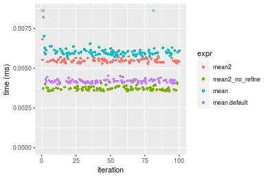


#### A 20% subset
```r
> x <- data[["n = 1000"]]
> subset
[1] 0.2
> idxs <- sort(sample(length(x), size = subset * length(x), replace = FALSE))
> gc()
           used  (Mb) gc trigger  (Mb) max used  (Mb)
Ncells  5278622 282.0   10014072 534.9 10014072 534.9
Vcells 15407344 117.6   53036220 404.7 90959857 694.0
> stats <- microbenchmark(mean2 = mean2(x, idxs = idxs, refine = TRUE), mean2_no_refine = mean2(x, 
+     idxs = idxs, refine = FALSE), `mean+[()` = mean2_R_v1(x, idxs = idxs), `mean.default+[()` = mean2_R_v2(x, 
+     idxs = idxs), unit = "ms")
```

_Table: Benchmarking of mean2(), mean2_no_refine(), mean+[()() and mean.default+[()() on integer+n = 1000+0.2 data. The top panel shows times in milliseconds and the bottom panel shows relative times._


|   |expr             |      min|        lq|      mean|    median|        uq|      max|
|:--|:----------------|--------:|---------:|---------:|---------:|---------:|--------:|
|1  |mean2            | 0.002831| 0.0030170| 0.0031729| 0.0031215| 0.0033025| 0.003870|
|2  |mean2_no_refine  | 0.002814| 0.0030155| 0.0032884| 0.0031265| 0.0032980| 0.015381|
|4  |mean.default+[() | 0.003813| 0.0040230| 0.0042559| 0.0041260| 0.0042140| 0.014500|
|3  |mean+[()         | 0.005959| 0.0063400| 0.0067129| 0.0065315| 0.0066630| 0.024168|


|   |expr             |       min|        lq|     mean|   median|        uq|      max|
|:--|:----------------|---------:|---------:|--------:|--------:|---------:|--------:|
|1  |mean2            | 1.0000000| 1.0000000| 1.000000| 1.000000| 1.0000000| 1.000000|
|2  |mean2_no_refine  | 0.9939951| 0.9995028| 1.036373| 1.001602| 0.9986374| 3.974419|
|4  |mean.default+[() | 1.3468739| 1.3334438| 1.341316| 1.321800| 1.2760030| 3.746770|
|3  |mean+[()         | 2.1049099| 2.1014253| 2.115675| 2.092424| 2.0175625| 6.244961|

_Figure: Benchmarking of mean2(), mean2_no_refine(), mean+[()() and mean.default+[()() on integer+n = 1000+0.2 data.  Outliers are displayed as crosses.  Times are in milliseconds._

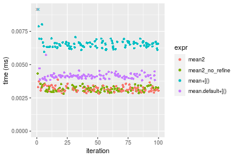

#### A 40% subset
```r
> x <- data[["n = 1000"]]
> subset
[1] 0.4
> idxs <- sort(sample(length(x), size = subset * length(x), replace = FALSE))
> gc()
           used  (Mb) gc trigger  (Mb) max used  (Mb)
Ncells  5278706 282.0   10014072 534.9 10014072 534.9
Vcells 15408020 117.6   53036220 404.7 90959857 694.0
> stats <- microbenchmark(mean2 = mean2(x, idxs = idxs, refine = TRUE), mean2_no_refine = mean2(x, 
+     idxs = idxs, refine = FALSE), `mean+[()` = mean2_R_v1(x, idxs = idxs), `mean.default+[()` = mean2_R_v2(x, 
+     idxs = idxs), unit = "ms")
```

_Table: Benchmarking of mean2(), mean2_no_refine(), mean+[()() and mean.default+[()() on integer+n = 1000+0.4 data. The top panel shows times in milliseconds and the bottom panel shows relative times._


|   |expr             |      min|        lq|      mean|    median|        uq|      max|
|:--|:----------------|--------:|---------:|---------:|---------:|---------:|--------:|
|1  |mean2            | 0.003917| 0.0041150| 0.0042596| 0.0042240| 0.0043560| 0.005024|
|2  |mean2_no_refine  | 0.003903| 0.0041500| 0.0043901| 0.0042880| 0.0044485| 0.014189|
|4  |mean.default+[() | 0.004592| 0.0048995| 0.0051936| 0.0050605| 0.0051910| 0.017923|
|3  |mean+[()         | 0.006998| 0.0073585| 0.0076793| 0.0074935| 0.0076690| 0.024463|


|   |expr             |       min|       lq|     mean|   median|       uq|      max|
|:--|:----------------|---------:|--------:|--------:|--------:|--------:|--------:|
|1  |mean2            | 1.0000000| 1.000000| 1.000000| 1.000000| 1.000000| 1.000000|
|2  |mean2_no_refine  | 0.9964258| 1.008506| 1.030622| 1.015151| 1.021235| 2.824244|
|4  |mean.default+[() | 1.1723258| 1.190644| 1.219263| 1.198035| 1.191690| 3.567476|
|3  |mean+[()         | 1.7865714| 1.788214| 1.802805| 1.774029| 1.760560| 4.869228|

_Figure: Benchmarking of mean2(), mean2_no_refine(), mean+[()() and mean.default+[()() on integer+n = 1000+0.4 data.  Outliers are displayed as crosses.  Times are in milliseconds._

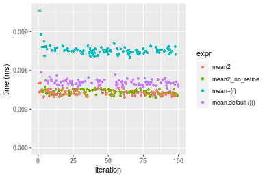

#### A 80% subset
```r
> x <- data[["n = 1000"]]
> subset
[1] 0.8
> idxs <- sort(sample(length(x), size = subset * length(x), replace = FALSE))
> gc()
           used  (Mb) gc trigger  (Mb) max used  (Mb)
Ncells  5278787 282.0   10014072 534.9 10014072 534.9
Vcells 15408274 117.6   53036220 404.7 90959857 694.0
> stats <- microbenchmark(mean2 = mean2(x, idxs = idxs, refine = TRUE), mean2_no_refine = mean2(x, 
+     idxs = idxs, refine = FALSE), `mean+[()` = mean2_R_v1(x, idxs = idxs), `mean.default+[()` = mean2_R_v2(x, 
+     idxs = idxs), unit = "ms")
```

_Table: Benchmarking of mean2(), mean2_no_refine(), mean+[()() and mean.default+[()() on integer+n = 1000+0.8 data. The top panel shows times in milliseconds and the bottom panel shows relative times._


|   |expr             |      min|        lq|      mean|    median|        uq|      max|
|:--|:----------------|--------:|---------:|---------:|---------:|---------:|--------:|
|2  |mean2_no_refine  | 0.005956| 0.0061325| 0.0063228| 0.0062665| 0.0064565| 0.008481|
|1  |mean2            | 0.005918| 0.0061635| 0.0065282| 0.0063125| 0.0064740| 0.026157|
|4  |mean.default+[() | 0.006330| 0.0067655| 0.0069610| 0.0069180| 0.0070830| 0.009202|
|3  |mean+[()         | 0.008815| 0.0091880| 0.0096544| 0.0093500| 0.0096230| 0.033979|


|   |expr             |       min|       lq|     mean|   median|       uq|      max|
|:--|:----------------|---------:|--------:|--------:|--------:|--------:|--------:|
|2  |mean2_no_refine  | 1.0000000| 1.000000| 1.000000| 1.000000| 1.000000| 1.000000|
|1  |mean2            | 0.9936199| 1.005055| 1.032484| 1.007341| 1.002710| 3.084188|
|4  |mean.default+[() | 1.0627938| 1.103220| 1.100929| 1.103965| 1.097034| 1.085014|
|3  |mean+[()         | 1.4800201| 1.498247| 1.526906| 1.492061| 1.490436| 4.006485|

_Figure: Benchmarking of mean2(), mean2_no_refine(), mean+[()() and mean.default+[()() on integer+n = 1000+0.8 data.  Outliers are displayed as crosses.  Times are in milliseconds._

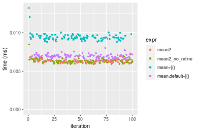


### n = 10000 vector


#### All elements
```r
> x <- data[["n = 10000"]]
> gc()
           used  (Mb) gc trigger  (Mb) max used  (Mb)
Ncells  5278797 282.0   10014072 534.9 10014072 534.9
Vcells 15408055 117.6   53036220 404.7 90959857 694.0
> stats <- microbenchmark(mean2 = mean2(x, refine = TRUE), mean2_no_refine = mean2(x, refine = FALSE), 
+     mean = mean(x), mean.default = mean.default(x), unit = "ms")
```

_Table: Benchmarking of mean2(), mean2_no_refine(), mean() and mean.default() on n = 10000+all data. The top panel shows times in milliseconds and the bottom panel shows relative times._


|   |expr            |      min|        lq|      mean|    median|        uq|      max|
|:--|:---------------|--------:|---------:|---------:|---------:|---------:|--------:|
|4  |mean.default    | 0.013187| 0.0138040| 0.0144829| 0.0143595| 0.0145205| 0.028818|
|3  |mean            | 0.014887| 0.0157530| 0.0166023| 0.0162585| 0.0166045| 0.039499|
|2  |mean2_no_refine | 0.017103| 0.0177355| 0.0181906| 0.0180395| 0.0186700| 0.023332|
|1  |mean2           | 0.016941| 0.0177660| 0.0184917| 0.0185370| 0.0187010| 0.045017|


|   |expr            |      min|       lq|     mean|   median|       uq|       max|
|:--|:---------------|--------:|--------:|--------:|--------:|--------:|---------:|
|4  |mean.default    | 1.000000| 1.000000| 1.000000| 1.000000| 1.000000| 1.0000000|
|3  |mean            | 1.128915| 1.141191| 1.146334| 1.132247| 1.143521| 1.3706364|
|2  |mean2_no_refine | 1.296959| 1.284809| 1.256003| 1.256276| 1.285768| 0.8096329|
|1  |mean2           | 1.284674| 1.287018| 1.276791| 1.290922| 1.287903| 1.5621140|

_Figure: Benchmarking of mean2(), mean2_no_refine(), mean() and mean.default() on n = 10000+all data.  Outliers are displayed as crosses.  Times are in milliseconds._

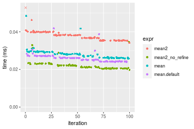


#### A 20% subset
```r
> x <- data[["n = 10000"]]
> subset
[1] 0.2
> idxs <- sort(sample(length(x), size = subset * length(x), replace = FALSE))
> gc()
           used  (Mb) gc trigger  (Mb) max used  (Mb)
Ncells  5278949 282.0   10014072 534.9 10014072 534.9
Vcells 15409446 117.6   53036220 404.7 90959857 694.0
> stats <- microbenchmark(mean2 = mean2(x, idxs = idxs, refine = TRUE), mean2_no_refine = mean2(x, 
+     idxs = idxs, refine = FALSE), `mean+[()` = mean2_R_v1(x, idxs = idxs), `mean.default+[()` = mean2_R_v2(x, 
+     idxs = idxs), unit = "ms")
```

_Table: Benchmarking of mean2(), mean2_no_refine(), mean+[()() and mean.default+[()() on integer+n = 10000+0.2 data. The top panel shows times in milliseconds and the bottom panel shows relative times._


|   |expr             |      min|       lq|      mean|    median|        uq|      max|
|:--|:----------------|--------:|--------:|---------:|---------:|---------:|--------:|
|4  |mean.default+[() | 0.011960| 0.012295| 0.0126566| 0.0124575| 0.0128180| 0.018021|
|2  |mean2_no_refine  | 0.012163| 0.012476| 0.0132119| 0.0126940| 0.0130515| 0.039069|
|1  |mean2            | 0.012249| 0.012536| 0.0130590| 0.0127480| 0.0132065| 0.017465|
|3  |mean+[()         | 0.014191| 0.014772| 0.0156374| 0.0152335| 0.0155810| 0.049528|


|   |expr             |      min|       lq|     mean|   median|       uq|       max|
|:--|:----------------|--------:|--------:|--------:|--------:|--------:|---------:|
|4  |mean.default+[() | 1.000000| 1.000000| 1.000000| 1.000000| 1.000000| 1.0000000|
|2  |mean2_no_refine  | 1.016973| 1.014721| 1.043870| 1.018984| 1.018217| 2.1679707|
|1  |mean2            | 1.024164| 1.019602| 1.031791| 1.023319| 1.030309| 0.9691471|
|3  |mean+[()         | 1.186538| 1.201464| 1.235513| 1.222838| 1.215556| 2.7483491|

_Figure: Benchmarking of mean2(), mean2_no_refine(), mean+[()() and mean.default+[()() on integer+n = 10000+0.2 data.  Outliers are displayed as crosses.  Times are in milliseconds._

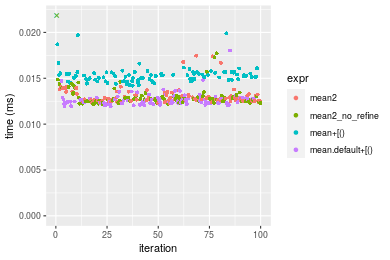

#### A 40% subset
```r
> x <- data[["n = 10000"]]
> subset
[1] 0.4
> idxs <- sort(sample(length(x), size = subset * length(x), replace = FALSE))
> gc()
           used  (Mb) gc trigger  (Mb) max used  (Mb)
Ncells  5279030 282.0   10014072 534.9 10014072 534.9
Vcells 15410803 117.6   53036220 404.7 90959857 694.0
> stats <- microbenchmark(mean2 = mean2(x, idxs = idxs, refine = TRUE), mean2_no_refine = mean2(x, 
+     idxs = idxs, refine = FALSE), `mean+[()` = mean2_R_v1(x, idxs = idxs), `mean.default+[()` = mean2_R_v2(x, 
+     idxs = idxs), unit = "ms")
```

_Table: Benchmarking of mean2(), mean2_no_refine(), mean+[()() and mean.default+[()() on integer+n = 10000+0.4 data. The top panel shows times in milliseconds and the bottom panel shows relative times._


|   |expr             |      min|        lq|      mean|    median|        uq|      max|
|:--|:----------------|--------:|---------:|---------:|---------:|---------:|--------:|
|4  |mean.default+[() | 0.018601| 0.0201190| 0.0211061| 0.0207635| 0.0214625| 0.035058|
|1  |mean2            | 0.020294| 0.0214040| 0.0223853| 0.0222500| 0.0230660| 0.029506|
|2  |mean2_no_refine  | 0.020346| 0.0214015| 0.0231674| 0.0223760| 0.0232640| 0.047846|
|3  |mean+[()         | 0.021271| 0.0228585| 0.0243894| 0.0236850| 0.0249740| 0.068617|


|   |expr             |      min|       lq|     mean|   median|       uq|       max|
|:--|:----------------|--------:|--------:|--------:|--------:|--------:|---------:|
|4  |mean.default+[() | 1.000000| 1.000000| 1.000000| 1.000000| 1.000000| 1.0000000|
|1  |mean2            | 1.091017| 1.063870| 1.060612| 1.071592| 1.074712| 0.8416339|
|2  |mean2_no_refine  | 1.093812| 1.063746| 1.097666| 1.077660| 1.083937| 1.3647670|
|3  |mean+[()         | 1.143541| 1.136165| 1.155565| 1.140704| 1.163611| 1.9572423|

_Figure: Benchmarking of mean2(), mean2_no_refine(), mean+[()() and mean.default+[()() on integer+n = 10000+0.4 data.  Outliers are displayed as crosses.  Times are in milliseconds._

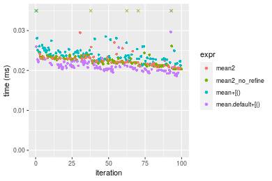

#### A 80% subset
```r
> x <- data[["n = 10000"]]
> subset
[1] 0.8
> idxs <- sort(sample(length(x), size = subset * length(x), replace = FALSE))
> gc()
           used  (Mb) gc trigger  (Mb) max used  (Mb)
Ncells  5279111 282.0   10014072 534.9 10014072 534.9
Vcells 15413221 117.6   53036220 404.7 90959857 694.0
> stats <- microbenchmark(mean2 = mean2(x, idxs = idxs, refine = TRUE), mean2_no_refine = mean2(x, 
+     idxs = idxs, refine = FALSE), `mean+[()` = mean2_R_v1(x, idxs = idxs), `mean.default+[()` = mean2_R_v2(x, 
+     idxs = idxs), unit = "ms")
```

_Table: Benchmarking of mean2(), mean2_no_refine(), mean+[()() and mean.default+[()() on integer+n = 10000+0.8 data. The top panel shows times in milliseconds and the bottom panel shows relative times._


|   |expr             |      min|        lq|      mean|    median|        uq|      max|
|:--|:----------------|--------:|---------:|---------:|---------:|---------:|--------:|
|4  |mean.default+[() | 0.032214| 0.0348530| 0.0370732| 0.0370210| 0.0392650| 0.052353|
|3  |mean+[()         | 0.034423| 0.0374775| 0.0399975| 0.0392325| 0.0422285| 0.071481|
|2  |mean2_no_refine  | 0.036085| 0.0385455| 0.0412972| 0.0403035| 0.0431625| 0.081541|
|1  |mean2            | 0.035757| 0.0388075| 0.0416871| 0.0417990| 0.0434735| 0.054698|


|   |expr             |      min|       lq|     mean|   median|       uq|      max|
|:--|:----------------|--------:|--------:|--------:|--------:|--------:|--------:|
|4  |mean.default+[() | 1.000000| 1.000000| 1.000000| 1.000000| 1.000000| 1.000000|
|3  |mean+[()         | 1.068573| 1.075302| 1.078879| 1.059736| 1.075474| 1.365366|
|2  |mean2_no_refine  | 1.120165| 1.105945| 1.113939| 1.088666| 1.099261| 1.557523|
|1  |mean2            | 1.109983| 1.113462| 1.124453| 1.129062| 1.107182| 1.044792|

_Figure: Benchmarking of mean2(), mean2_no_refine(), mean+[()() and mean.default+[()() on integer+n = 10000+0.8 data.  Outliers are displayed as crosses.  Times are in milliseconds._

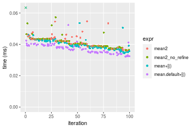


### n = 100000 vector


#### All elements
```r
> x <- data[["n = 100000"]]
> gc()
           used  (Mb) gc trigger  (Mb) max used  (Mb)
Ncells  5279121 282.0   10014072 534.9 10014072 534.9
Vcells 15413225 117.6   53036220 404.7 90959857 694.0
> stats <- microbenchmark(mean2 = mean2(x, refine = TRUE), mean2_no_refine = mean2(x, refine = FALSE), 
+     mean = mean(x), mean.default = mean.default(x), unit = "ms")
```

_Table: Benchmarking of mean2(), mean2_no_refine(), mean() and mean.default() on n = 100000+all data. The top panel shows times in milliseconds and the bottom panel shows relative times._


|   |expr            |      min|        lq|      mean|    median|        uq|      max|
|:--|:---------------|--------:|---------:|---------:|---------:|---------:|--------:|
|4  |mean.default    | 0.081707| 0.0887415| 0.1005547| 0.1002020| 0.1072195| 0.133832|
|3  |mean            | 0.083123| 0.0904745| 0.1014609| 0.1006405| 0.1093990| 0.141353|
|2  |mean2_no_refine | 0.107093| 0.1164015| 0.1325644| 0.1313495| 0.1415270| 0.221172|
|1  |mean2           | 0.107187| 0.1199575| 0.1342078| 0.1315425| 0.1431325| 0.195552|


|   |expr            |      min|       lq|     mean|   median|       uq|      max|
|:--|:---------------|--------:|--------:|--------:|--------:|--------:|--------:|
|4  |mean.default    | 1.000000| 1.000000| 1.000000| 1.000000| 1.000000| 1.000000|
|3  |mean            | 1.017330| 1.019529| 1.009012| 1.004376| 1.020328| 1.056197|
|2  |mean2_no_refine | 1.310696| 1.311692| 1.318331| 1.310847| 1.319974| 1.652609|
|1  |mean2           | 1.311846| 1.351763| 1.334674| 1.312773| 1.334948| 1.461175|

_Figure: Benchmarking of mean2(), mean2_no_refine(), mean() and mean.default() on n = 100000+all data.  Outliers are displayed as crosses.  Times are in milliseconds._

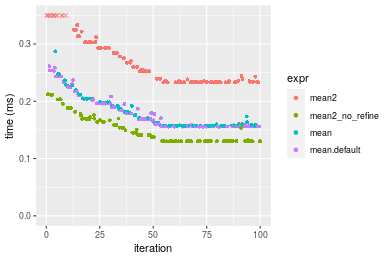


#### A 20% subset
```r
> x <- data[["n = 100000"]]
> subset
[1] 0.2
> idxs <- sort(sample(length(x), size = subset * length(x), replace = FALSE))
> gc()
           used  (Mb) gc trigger  (Mb) max used  (Mb)
Ncells  5279273 282.0   10014072 534.9 10014072 534.9
Vcells 15419764 117.7   53036220 404.7 90959857 694.0
> stats <- microbenchmark(mean2 = mean2(x, idxs = idxs, refine = TRUE), mean2_no_refine = mean2(x, 
+     idxs = idxs, refine = FALSE), `mean+[()` = mean2_R_v1(x, idxs = idxs), `mean.default+[()` = mean2_R_v2(x, 
+     idxs = idxs), unit = "ms")
```

_Table: Benchmarking of mean2(), mean2_no_refine(), mean+[()() and mean.default+[()() on integer+n = 100000+0.2 data. The top panel shows times in milliseconds and the bottom panel shows relative times._


|   |expr             |      min|        lq|      mean|    median|        uq|      max|
|:--|:----------------|--------:|---------:|---------:|---------:|---------:|--------:|
|4  |mean.default+[() | 0.069361| 0.0721455| 0.0813398| 0.0770330| 0.0890455| 0.134589|
|3  |mean+[()         | 0.071360| 0.0759555| 0.0854867| 0.0832745| 0.0924070| 0.120865|
|2  |mean2_no_refine  | 0.079196| 0.0839455| 0.0939692| 0.0876235| 0.1006260| 0.139268|
|1  |mean2            | 0.079094| 0.0841205| 0.0955287| 0.0887790| 0.1023185| 0.150442|


|   |expr             |      min|       lq|     mean|   median|       uq|       max|
|:--|:----------------|--------:|--------:|--------:|--------:|--------:|---------:|
|4  |mean.default+[() | 1.000000| 1.000000| 1.000000| 1.000000| 1.000000| 1.0000000|
|3  |mean+[()         | 1.028820| 1.052810| 1.050982| 1.081024| 1.037750| 0.8980303|
|2  |mean2_no_refine  | 1.141794| 1.163558| 1.155267| 1.137480| 1.130051| 1.0347651|
|1  |mean2            | 1.140324| 1.165984| 1.174439| 1.152480| 1.149059| 1.1177882|

_Figure: Benchmarking of mean2(), mean2_no_refine(), mean+[()() and mean.default+[()() on integer+n = 100000+0.2 data.  Outliers are displayed as crosses.  Times are in milliseconds._

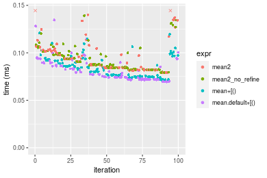

#### A 40% subset
```r
> x <- data[["n = 100000"]]
> subset
[1] 0.4
> idxs <- sort(sample(length(x), size = subset * length(x), replace = FALSE))
> gc()
           used  (Mb) gc trigger  (Mb) max used  (Mb)
Ncells  5279354 282.0   10014072 534.9 10014072 534.9
Vcells 15430342 117.8   53036220 404.7 90959857 694.0
> stats <- microbenchmark(mean2 = mean2(x, idxs = idxs, refine = TRUE), mean2_no_refine = mean2(x, 
+     idxs = idxs, refine = FALSE), `mean+[()` = mean2_R_v1(x, idxs = idxs), `mean.default+[()` = mean2_R_v2(x, 
+     idxs = idxs), unit = "ms")
```

_Table: Benchmarking of mean2(), mean2_no_refine(), mean+[()() and mean.default+[()() on integer+n = 100000+0.4 data. The top panel shows times in milliseconds and the bottom panel shows relative times._


|   |expr             |      min|        lq|      mean|    median|        uq|      max|
|:--|:----------------|--------:|---------:|---------:|---------:|---------:|--------:|
|3  |mean+[()         | 0.146310| 0.1590035| 0.1746542| 0.1724045| 0.1866520| 0.229728|
|4  |mean.default+[() | 0.144592| 0.1620655| 0.1780172| 0.1745180| 0.1887715| 0.272599|
|2  |mean2_no_refine  | 0.164831| 0.1935945| 0.2276296| 0.2286415| 0.2570855| 0.351301|
|1  |mean2            | 0.164746| 0.1923095| 0.2265031| 0.2289000| 0.2601410| 0.337803|


|   |expr             |       min|       lq|     mean|   median|       uq|      max|
|:--|:----------------|---------:|--------:|--------:|--------:|--------:|--------:|
|3  |mean+[()         | 1.0000000| 1.000000| 1.000000| 1.000000| 1.000000| 1.000000|
|4  |mean.default+[() | 0.9882578| 1.019257| 1.019255| 1.012259| 1.011355| 1.186616|
|2  |mean2_no_refine  | 1.1265874| 1.217549| 1.303316| 1.326192| 1.377352| 1.529204|
|1  |mean2            | 1.1260064| 1.209467| 1.296866| 1.327692| 1.393722| 1.470448|

_Figure: Benchmarking of mean2(), mean2_no_refine(), mean+[()() and mean.default+[()() on integer+n = 100000+0.4 data.  Outliers are displayed as crosses.  Times are in milliseconds._

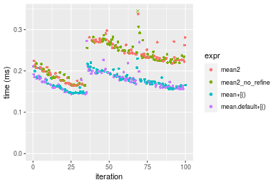

#### A 80% subset
```r
> x <- data[["n = 100000"]]
> subset
[1] 0.8
> idxs <- sort(sample(length(x), size = subset * length(x), replace = FALSE))
> gc()
           used  (Mb) gc trigger  (Mb) max used  (Mb)
Ncells  5279435 282.0   10014072 534.9 10014072 534.9
Vcells 15450396 117.9   53036220 404.7 90959857 694.0
> stats <- microbenchmark(mean2 = mean2(x, idxs = idxs, refine = TRUE), mean2_no_refine = mean2(x, 
+     idxs = idxs, refine = FALSE), `mean+[()` = mean2_R_v1(x, idxs = idxs), `mean.default+[()` = mean2_R_v2(x, 
+     idxs = idxs), unit = "ms")
```

_Table: Benchmarking of mean2(), mean2_no_refine(), mean+[()() and mean.default+[()() on integer+n = 100000+0.8 data. The top panel shows times in milliseconds and the bottom panel shows relative times._


|   |expr             |      min|        lq|      mean|    median|        uq|      max|
|:--|:----------------|--------:|---------:|---------:|---------:|---------:|--------:|
|4  |mean.default+[() | 0.230322| 0.3016160| 0.3057096| 0.3142325| 0.3199560| 0.447956|
|3  |mean+[()         | 0.232881| 0.2799760| 0.3081854| 0.3158780| 0.3219700| 0.468392|
|1  |mean2            | 0.268220| 0.3210100| 0.3855868| 0.4131970| 0.4432995| 0.522956|
|2  |mean2_no_refine  | 0.261010| 0.3213195| 0.3930905| 0.4376660| 0.4460250| 0.524511|


|   |expr             |      min|        lq|     mean|   median|       uq|      max|
|:--|:----------------|--------:|---------:|--------:|--------:|--------:|--------:|
|4  |mean.default+[() | 1.000000| 1.0000000| 1.000000| 1.000000| 1.000000| 1.000000|
|3  |mean+[()         | 1.011111| 0.9282531| 1.008099| 1.005237| 1.006295| 1.045621|
|1  |mean2            | 1.164544| 1.0643003| 1.261284| 1.314940| 1.385501| 1.167427|
|2  |mean2_no_refine  | 1.133240| 1.0653264| 1.285830| 1.392810| 1.394020| 1.170899|

_Figure: Benchmarking of mean2(), mean2_no_refine(), mean+[()() and mean.default+[()() on integer+n = 100000+0.8 data.  Outliers are displayed as crosses.  Times are in milliseconds._

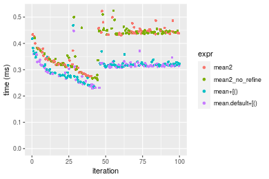


### n = 1000000 vector


#### All elements
```r
> x <- data[["n = 1000000"]]
> gc()
           used  (Mb) gc trigger  (Mb) max used  (Mb)
Ncells  5279445 282.0   10014072 534.9 10014072 534.9
Vcells 15450593 117.9   53036220 404.7 90959857 694.0
> stats <- microbenchmark(mean2 = mean2(x, refine = TRUE), mean2_no_refine = mean2(x, refine = FALSE), 
+     mean = mean(x), mean.default = mean.default(x), unit = "ms")
```

_Table: Benchmarking of mean2(), mean2_no_refine(), mean() and mean.default() on n = 1000000+all data. The top panel shows times in milliseconds and the bottom panel shows relative times._


|   |expr            |      min|        lq|      mean|   median|        uq|      max|
|:--|:---------------|--------:|---------:|---------:|--------:|---------:|--------:|
|4  |mean.default    | 0.783290| 0.8264520| 0.8623633| 0.848625| 0.8604730| 1.194879|
|3  |mean            | 0.784347| 0.8279605| 0.8559819| 0.850640| 0.8571305| 1.151330|
|2  |mean2_no_refine | 1.030054| 1.0846545| 1.1262430| 1.116113| 1.1235115| 1.773225|
|1  |mean2           | 1.031226| 1.0904270| 1.1358032| 1.116673| 1.1286830| 1.790264|


|   |expr            |      min|       lq|      mean|   median|        uq|       max|
|:--|:---------------|--------:|--------:|---------:|--------:|---------:|---------:|
|4  |mean.default    | 1.000000| 1.000000| 1.0000000| 1.000000| 1.0000000| 1.0000000|
|3  |mean            | 1.001349| 1.001825| 0.9926002| 1.002374| 0.9961155| 0.9635536|
|2  |mean2_no_refine | 1.315035| 1.312423| 1.3059961| 1.315201| 1.3056906| 1.4840206|
|1  |mean2           | 1.316532| 1.319408| 1.3170821| 1.315862| 1.3117007| 1.4982806|

_Figure: Benchmarking of mean2(), mean2_no_refine(), mean() and mean.default() on n = 1000000+all data.  Outliers are displayed as crosses.  Times are in milliseconds._

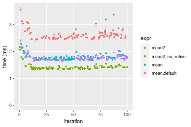


#### A 20% subset
```r
> x <- data[["n = 1000000"]]
> subset
[1] 0.2
> idxs <- sort(sample(length(x), size = subset * length(x), replace = FALSE))
> gc()
           used  (Mb) gc trigger  (Mb) max used  (Mb)
Ncells  5279597 282.0   10014072 534.9 10014072 534.9
Vcells 15511131 118.4   53036220 404.7 90959857 694.0
> stats <- microbenchmark(mean2 = mean2(x, idxs = idxs, refine = TRUE), mean2_no_refine = mean2(x, 
+     idxs = idxs, refine = FALSE), `mean+[()` = mean2_R_v1(x, idxs = idxs), `mean.default+[()` = mean2_R_v2(x, 
+     idxs = idxs), unit = "ms")
```

_Table: Benchmarking of mean2(), mean2_no_refine(), mean+[()() and mean.default+[()() on integer+n = 1000000+0.2 data. The top panel shows times in milliseconds and the bottom panel shows relative times._


|   |expr             |      min|       lq|      mean|    median|        uq|       max|
|:--|:----------------|--------:|--------:|---------:|---------:|---------:|---------:|
|4  |mean.default+[() | 0.689541| 0.851787| 0.9135281| 0.8913105| 0.9534815|  1.224331|
|3  |mean+[()         | 0.727379| 0.870562| 1.1002776| 0.9106015| 0.9732010| 18.217772|
|2  |mean2_no_refine  | 1.024179| 1.185242| 1.2629636| 1.2264935| 1.3230015|  1.594680|
|1  |mean2            | 1.063669| 1.178685| 1.2651085| 1.2273980| 1.3206065|  1.634995|


|   |expr             |      min|       lq|     mean|   median|       uq|       max|
|:--|:----------------|--------:|--------:|--------:|--------:|--------:|---------:|
|4  |mean.default+[() | 1.000000| 1.000000| 1.000000| 1.000000| 1.000000|  1.000000|
|3  |mean+[()         | 1.054874| 1.022042| 1.204427| 1.021643| 1.020682| 14.879777|
|2  |mean2_no_refine  | 1.485305| 1.391476| 1.382512| 1.376056| 1.387548|  1.302491|
|1  |mean2            | 1.542575| 1.383779| 1.384860| 1.377071| 1.385036|  1.335419|

_Figure: Benchmarking of mean2(), mean2_no_refine(), mean+[()() and mean.default+[()() on integer+n = 1000000+0.2 data.  Outliers are displayed as crosses.  Times are in milliseconds._

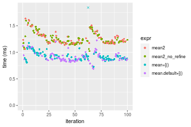

#### A 40% subset
```r
> x <- data[["n = 1000000"]]
> subset
[1] 0.4
> idxs <- sort(sample(length(x), size = subset * length(x), replace = FALSE))
> gc()
           used  (Mb) gc trigger  (Mb) max used  (Mb)
Ncells  5279678 282.0   10014072 534.9 10014072 534.9
Vcells 15611187 119.2   53036220 404.7 90959857 694.0
> stats <- microbenchmark(mean2 = mean2(x, idxs = idxs, refine = TRUE), mean2_no_refine = mean2(x, 
+     idxs = idxs, refine = FALSE), `mean+[()` = mean2_R_v1(x, idxs = idxs), `mean.default+[()` = mean2_R_v2(x, 
+     idxs = idxs), unit = "ms")
```

_Table: Benchmarking of mean2(), mean2_no_refine(), mean+[()() and mean.default+[()() on integer+n = 1000000+0.4 data. The top panel shows times in milliseconds and the bottom panel shows relative times._


|   |expr             |      min|       lq|     mean|   median|       uq|       max|
|:--|:----------------|--------:|--------:|--------:|--------:|--------:|---------:|
|3  |mean+[()         | 1.153482| 1.249616| 1.455513| 1.360916| 1.662017|  2.175288|
|4  |mean.default+[() | 1.145264| 1.265994| 1.511557| 1.480268| 1.717293|  2.092882|
|2  |mean2_no_refine  | 1.352762| 1.509181| 2.058768| 1.726849| 2.342722| 11.225945|
|1  |mean2            | 1.358476| 1.495268| 2.044873| 1.764633| 2.357852| 13.202316|


|   |expr             |       min|       lq|     mean|   median|       uq|       max|
|:--|:----------------|---------:|--------:|--------:|--------:|--------:|---------:|
|3  |mean+[()         | 1.0000000| 1.000000| 1.000000| 1.000000| 1.000000| 1.0000000|
|4  |mean.default+[() | 0.9928755| 1.013106| 1.038504| 1.087700| 1.033258| 0.9621172|
|2  |mean2_no_refine  | 1.1727639| 1.207715| 1.414462| 1.268887| 1.409566| 5.1606707|
|1  |mean2            | 1.1777176| 1.196581| 1.404916| 1.296651| 1.418669| 6.0692267|

_Figure: Benchmarking of mean2(), mean2_no_refine(), mean+[()() and mean.default+[()() on integer+n = 1000000+0.4 data.  Outliers are displayed as crosses.  Times are in milliseconds._

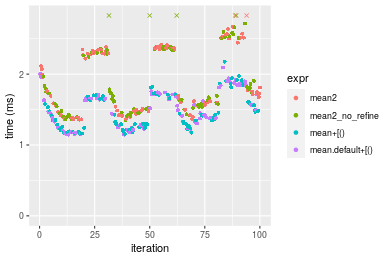

#### A 80% subset
```r
> x <- data[["n = 1000000"]]
> subset
[1] 0.8
> idxs <- sort(sample(length(x), size = subset * length(x), replace = FALSE))
> gc()
           used  (Mb) gc trigger  (Mb) max used  (Mb)
Ncells  5279759 282.0   10014072 534.9 10014072 534.9
Vcells 15811989 120.7   53036220 404.7 90959857 694.0
> stats <- microbenchmark(mean2 = mean2(x, idxs = idxs, refine = TRUE), mean2_no_refine = mean2(x, 
+     idxs = idxs, refine = FALSE), `mean+[()` = mean2_R_v1(x, idxs = idxs), `mean.default+[()` = mean2_R_v2(x, 
+     idxs = idxs), unit = "ms")
```

_Table: Benchmarking of mean2(), mean2_no_refine(), mean+[()() and mean.default+[()() on integer+n = 1000000+0.8 data. The top panel shows times in milliseconds and the bottom panel shows relative times._


|   |expr             |      min|       lq|     mean|   median|       uq|       max|
|:--|:----------------|--------:|--------:|--------:|--------:|--------:|---------:|
|3  |mean+[()         | 2.393753| 2.960075| 3.208398| 3.354001| 3.435426|  3.823669|
|4  |mean.default+[() | 2.432895| 3.200233| 3.536612| 3.365134| 3.434707| 17.537705|
|1  |mean2            | 2.879841| 4.534982| 4.908610| 4.652363| 4.751532| 18.153314|
|2  |mean2_no_refine  | 2.858662| 4.554047| 4.461069| 4.673583| 4.747547|  5.589189|


|   |expr             |      min|       lq|     mean|   median|        uq|      max|
|:--|:----------------|--------:|--------:|--------:|--------:|---------:|--------:|
|3  |mean+[()         | 1.000000| 1.000000| 1.000000| 1.000000| 1.0000000| 1.000000|
|4  |mean.default+[() | 1.016352| 1.081132| 1.102299| 1.003319| 0.9997909| 4.586617|
|1  |mean2            | 1.203065| 1.532050| 1.529926| 1.387109| 1.3830985| 4.747617|
|2  |mean2_no_refine  | 1.194218| 1.538490| 1.390435| 1.393435| 1.3819384| 1.461734|

_Figure: Benchmarking of mean2(), mean2_no_refine(), mean+[()() and mean.default+[()() on integer+n = 1000000+0.8 data.  Outliers are displayed as crosses.  Times are in milliseconds._

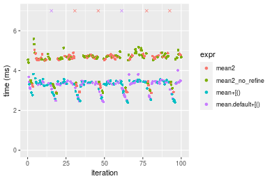


### n = 10000000 vector


#### All elements
```r
> x <- data[["n = 10000000"]]
> gc()
           used  (Mb) gc trigger  (Mb) max used  (Mb)
Ncells  5279769 282.0   10014072 534.9 10014072 534.9
Vcells 15811557 120.7   53036220 404.7 90959857 694.0
> stats <- microbenchmark(mean2 = mean2(x, refine = TRUE), mean2_no_refine = mean2(x, refine = FALSE), 
+     mean = mean(x), mean.default = mean.default(x), unit = "ms")
```

_Table: Benchmarking of mean2(), mean2_no_refine(), mean() and mean.default() on n = 10000000+all data. The top panel shows times in milliseconds and the bottom panel shows relative times._


|   |expr            |       min|        lq|      mean|    median|       uq|      max|
|:--|:---------------|---------:|---------:|---------:|---------:|--------:|--------:|
|3  |mean            |  8.686653|  9.486593|  9.630223|  9.569199|  9.74259| 11.82934|
|4  |mean.default    |  8.776241|  9.474866|  9.670273|  9.648587|  9.77531| 13.31203|
|1  |mean2           | 11.530640| 11.885162| 12.093207| 12.066184| 12.21223| 14.09749|
|2  |mean2_no_refine | 11.498124| 11.890019| 12.092681| 12.109381| 12.22906| 13.55592|


|   |expr            |      min|        lq|     mean|   median|       uq|      max|
|:--|:---------------|--------:|---------:|--------:|--------:|--------:|--------:|
|3  |mean            | 1.000000| 1.0000000| 1.000000| 1.000000| 1.000000| 1.000000|
|4  |mean.default    | 1.010313| 0.9987639| 1.004159| 1.008296| 1.003358| 1.125341|
|1  |mean2           | 1.327397| 1.2528378| 1.255756| 1.260940| 1.253489| 1.191740|
|2  |mean2_no_refine | 1.323654| 1.2533498| 1.255701| 1.265454| 1.255217| 1.145958|

_Figure: Benchmarking of mean2(), mean2_no_refine(), mean() and mean.default() on n = 10000000+all data.  Outliers are displayed as crosses.  Times are in milliseconds._

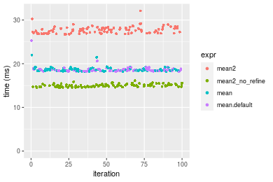


#### A 20% subset
```r
> x <- data[["n = 10000000"]]
> subset
[1] 0.2
> idxs <- sort(sample(length(x), size = subset * length(x), replace = FALSE))
> gc()
           used  (Mb) gc trigger  (Mb) max used  (Mb)
Ncells  5279921 282.0   10014072 534.9 10014072 534.9
Vcells 16412095 125.3   53036220 404.7 90959857 694.0
> stats <- microbenchmark(mean2 = mean2(x, idxs = idxs, refine = TRUE), mean2_no_refine = mean2(x, 
+     idxs = idxs, refine = FALSE), `mean+[()` = mean2_R_v1(x, idxs = idxs), `mean.default+[()` = mean2_R_v2(x, 
+     idxs = idxs), unit = "ms")
```

_Table: Benchmarking of mean2(), mean2_no_refine(), mean+[()() and mean.default+[()() on integer+n = 10000000+0.2 data. The top panel shows times in milliseconds and the bottom panel shows relative times._


|   |expr             |      min|        lq|     mean|   median|       uq|      max|
|:--|:----------------|--------:|---------:|--------:|--------:|--------:|--------:|
|4  |mean.default+[() | 8.260925|  9.891349| 10.17598| 10.10838| 10.52897| 23.97094|
|3  |mean+[()         | 8.431051|  9.921369| 10.33985| 10.15875| 10.49857| 24.00571|
|1  |mean2            | 9.396762| 12.961958| 13.97797| 13.33078| 14.01309| 25.73677|
|2  |mean2_no_refine  | 9.544734| 12.939815| 13.83581| 13.37008| 13.96996| 24.90903|


|   |expr             |      min|       lq|     mean|   median|        uq|      max|
|:--|:----------------|--------:|--------:|--------:|--------:|---------:|--------:|
|4  |mean.default+[() | 1.000000| 1.000000| 1.000000| 1.000000| 1.0000000| 1.000000|
|3  |mean+[()         | 1.020594| 1.003035| 1.016103| 1.004983| 0.9971122| 1.001451|
|1  |mean2            | 1.137495| 1.310434| 1.373624| 1.318785| 1.3309073| 1.073666|
|2  |mean2_no_refine  | 1.155407| 1.308195| 1.359654| 1.322672| 1.3268116| 1.039135|

_Figure: Benchmarking of mean2(), mean2_no_refine(), mean+[()() and mean.default+[()() on integer+n = 10000000+0.2 data.  Outliers are displayed as crosses.  Times are in milliseconds._

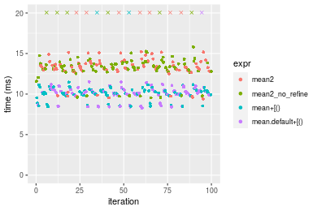

#### A 40% subset
```r
> x <- data[["n = 10000000"]]
> subset
[1] 0.4
> idxs <- sort(sample(length(x), size = subset * length(x), replace = FALSE))
> gc()
           used  (Mb) gc trigger  (Mb) max used  (Mb)
Ncells  5280002 282.0   10014072 534.9 10014072 534.9
Vcells 17413057 132.9   53036220 404.7 90959857 694.0
> stats <- microbenchmark(mean2 = mean2(x, idxs = idxs, refine = TRUE), mean2_no_refine = mean2(x, 
+     idxs = idxs, refine = FALSE), `mean+[()` = mean2_R_v1(x, idxs = idxs), `mean.default+[()` = mean2_R_v2(x, 
+     idxs = idxs), unit = "ms")
```

_Table: Benchmarking of mean2(), mean2_no_refine(), mean+[()() and mean.default+[()() on integer+n = 10000000+0.4 data. The top panel shows times in milliseconds and the bottom panel shows relative times._


|   |expr             |      min|       lq|     mean|   median|       uq|       max|
|:--|:----------------|--------:|--------:|--------:|--------:|--------:|---------:|
|4  |mean.default+[() | 13.74165| 18.05542| 22.68161| 18.39763| 19.00316| 395.78072|
|3  |mean+[()         | 13.93919| 18.12739| 18.86993| 18.55586| 19.08655|  29.63041|
|1  |mean2            | 16.26627| 24.31509| 24.94324| 24.93942| 25.80227|  33.98408|
|2  |mean2_no_refine  | 16.15126| 24.18994| 24.72367| 25.06932| 26.02929|  34.01830|


|   |expr             |      min|       lq|      mean|   median|       uq|       max|
|:--|:----------------|--------:|--------:|---------:|--------:|--------:|---------:|
|4  |mean.default+[() | 1.000000| 1.000000| 1.0000000| 1.000000| 1.000000| 1.0000000|
|3  |mean+[()         | 1.014376| 1.003986| 0.8319486| 1.008601| 1.004388| 0.0748657|
|1  |mean2            | 1.183720| 1.346692| 1.0997124| 1.355578| 1.357788| 0.0858659|
|2  |mean2_no_refine  | 1.175350| 1.339761| 1.0900315| 1.362639| 1.369735| 0.0859524|

_Figure: Benchmarking of mean2(), mean2_no_refine(), mean+[()() and mean.default+[()() on integer+n = 10000000+0.4 data.  Outliers are displayed as crosses.  Times are in milliseconds._

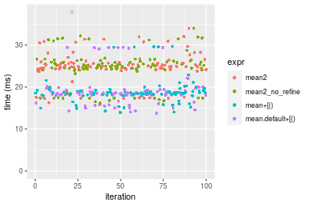

#### A 80% subset
```r
> x <- data[["n = 10000000"]]
> subset
[1] 0.8
> idxs <- sort(sample(length(x), size = subset * length(x), replace = FALSE))
> gc()
           used  (Mb) gc trigger  (Mb) max used  (Mb)
Ncells  5280083 282.0   10014072 534.9 10014072 534.9
Vcells 19413111 148.2   53036220 404.7 90959857 694.0
> stats <- microbenchmark(mean2 = mean2(x, idxs = idxs, refine = TRUE), mean2_no_refine = mean2(x, 
+     idxs = idxs, refine = FALSE), `mean+[()` = mean2_R_v1(x, idxs = idxs), `mean.default+[()` = mean2_R_v2(x, 
+     idxs = idxs), unit = "ms")
```

_Table: Benchmarking of mean2(), mean2_no_refine(), mean+[()() and mean.default+[()() on integer+n = 10000000+0.8 data. The top panel shows times in milliseconds and the bottom panel shows relative times._


|   |expr             |      min|       lq|     mean|   median|       uq|      max|
|:--|:----------------|--------:|--------:|--------:|--------:|--------:|--------:|
|3  |mean+[()         | 26.16139| 27.14081| 31.28091| 28.12642| 36.22985| 50.89359|
|4  |mean.default+[() | 25.86802| 27.95764| 33.97147| 35.94970| 37.37513| 42.63459|
|1  |mean2            | 30.85517| 44.92635| 46.92364| 48.63370| 49.71593| 53.11687|
|2  |mean2_no_refine  | 30.84379| 45.51777| 47.57254| 49.28293| 50.24886| 53.74737|


|   |expr             |       min|       lq|     mean|   median|       uq|       max|
|:--|:----------------|---------:|--------:|--------:|--------:|--------:|---------:|
|3  |mean+[()         | 1.0000000| 1.000000| 1.000000| 1.000000| 1.000000| 1.0000000|
|4  |mean.default+[() | 0.9887862| 1.030096| 1.086013| 1.278147| 1.031612| 0.8377202|
|1  |mean2            | 1.1794163| 1.655306| 1.500073| 1.729111| 1.372237| 1.0436848|
|2  |mean2_no_refine  | 1.1789812| 1.677097| 1.520817| 1.752193| 1.386946| 1.0560733|

_Figure: Benchmarking of mean2(), mean2_no_refine(), mean+[()() and mean.default+[()() on integer+n = 10000000+0.8 data.  Outliers are displayed as crosses.  Times are in milliseconds._

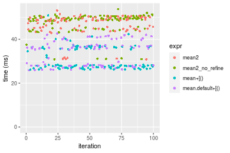


## Data type "double"
### Data
```r
> rvector <- function(n, mode = c("logical", "double", "integer"), range = c(-100, +100), na_prob = 0) {
+     mode <- match.arg(mode)
+     if (mode == "logical") {
+         x <- sample(c(FALSE, TRUE), size = n, replace = TRUE)
+     }     else {
+         x <- runif(n, min = range[1], max = range[2])
+     }
+     storage.mode(x) <- mode
+     if (na_prob > 0) 
+         x[sample(n, size = na_prob * n)] <- NA
+     x
+ }
> rvectors <- function(scale = 10, seed = 1, ...) {
+     set.seed(seed)
+     data <- list()
+     data[[1]] <- rvector(n = scale * 100, ...)
+     data[[2]] <- rvector(n = scale * 1000, ...)
+     data[[3]] <- rvector(n = scale * 10000, ...)
+     data[[4]] <- rvector(n = scale * 1e+05, ...)
+     data[[5]] <- rvector(n = scale * 1e+06, ...)
+     names(data) <- sprintf("n = %d", sapply(data, FUN = length))
+     data
+ }
> data <- rvectors(mode = mode)
```

### Results

### n = 1000 vector


#### All elements
```r
> x <- data[["n = 1000"]]
> gc()
           used  (Mb) gc trigger  (Mb) max used  (Mb)
Ncells  5280093 282.0   10014072 534.9 10014072 534.9
Vcells 24968179 190.5   53036220 404.7 90959857 694.0
> stats <- microbenchmark(mean2 = mean2(x, refine = TRUE), mean2_no_refine = mean2(x, refine = FALSE), 
+     mean = mean(x), mean.default = mean.default(x), unit = "ms")
```

_Table: Benchmarking of mean2(), mean2_no_refine(), mean() and mean.default() on n = 1000+all data. The top panel shows times in milliseconds and the bottom panel shows relative times._


|   |expr            |      min|        lq|      mean|    median|        uq|      max|
|:--|:---------------|--------:|---------:|---------:|---------:|---------:|--------:|
|2  |mean2_no_refine | 0.003558| 0.0036155| 0.0037150| 0.0036930| 0.0037725| 0.004252|
|4  |mean.default    | 0.004002| 0.0041190| 0.0042262| 0.0041845| 0.0042310| 0.008206|
|1  |mean2           | 0.005287| 0.0054000| 0.0056240| 0.0054665| 0.0055620| 0.018313|
|3  |mean            | 0.005712| 0.0058905| 0.0062154| 0.0059770| 0.0061010| 0.021409|


|   |expr            |      min|       lq|     mean|   median|       uq|      max|
|:--|:---------------|--------:|--------:|--------:|--------:|--------:|--------:|
|2  |mean2_no_refine | 1.000000| 1.000000| 1.000000| 1.000000| 1.000000| 1.000000|
|4  |mean.default    | 1.124789| 1.139261| 1.137603| 1.133090| 1.121537| 1.929915|
|1  |mean2           | 1.485947| 1.493569| 1.513844| 1.480233| 1.474354| 4.306914|
|3  |mean            | 1.605396| 1.629235| 1.673048| 1.618467| 1.617230| 5.035042|

_Figure: Benchmarking of mean2(), mean2_no_refine(), mean() and mean.default() on n = 1000+all data.  Outliers are displayed as crosses.  Times are in milliseconds._


#### A 20% subset
```r
> x <- data[["n = 1000"]]
> subset
[1] 0.2
> idxs <- sort(sample(length(x), size = subset * length(x), replace = FALSE))
> gc()
           used (Mb) gc trigger  (Mb) max used  (Mb)
Ncells  5280242  282   10014072 534.9 10014072 534.9
Vcells 20969893  160   53036220 404.7 90959857 694.0
> stats <- microbenchmark(mean2 = mean2(x, idxs = idxs, refine = TRUE), mean2_no_refine = mean2(x, 
+     idxs = idxs, refine = FALSE), `mean+[()` = mean2_R_v1(x, idxs = idxs), `mean.default+[()` = mean2_R_v2(x, 
+     idxs = idxs), unit = "ms")
```

_Table: Benchmarking of mean2(), mean2_no_refine(), mean+[()() and mean.default+[()() on double+n = 1000+0.2 data. The top panel shows times in milliseconds and the bottom panel shows relative times._


|   |expr             |      min|        lq|      mean|    median|        uq|      max|
|:--|:----------------|--------:|---------:|---------:|---------:|---------:|--------:|
|2  |mean2_no_refine  | 0.002932| 0.0031195| 0.0034516| 0.0032445| 0.0034025| 0.015826|
|1  |mean2            | 0.003322| 0.0035380| 0.0037038| 0.0036690| 0.0038025| 0.005758|
|4  |mean.default+[() | 0.004022| 0.0042235| 0.0045884| 0.0043690| 0.0045080| 0.013577|
|3  |mean+[()         | 0.006352| 0.0066055| 0.0071177| 0.0067550| 0.0070075| 0.024519|


|   |expr             |      min|       lq|     mean|   median|       uq|       max|
|:--|:----------------|--------:|--------:|--------:|--------:|--------:|---------:|
|2  |mean2_no_refine  | 1.000000| 1.000000| 1.000000| 1.000000| 1.000000| 1.0000000|
|1  |mean2            | 1.133015| 1.134156| 1.073061| 1.130837| 1.117561| 0.3638317|
|4  |mean.default+[() | 1.371760| 1.353903| 1.329339| 1.346586| 1.324908| 0.8578921|
|3  |mean+[()         | 2.166439| 2.117487| 2.062118| 2.081985| 2.059515| 1.5492860|

_Figure: Benchmarking of mean2(), mean2_no_refine(), mean+[()() and mean.default+[()() on double+n = 1000+0.2 data.  Outliers are displayed as crosses.  Times are in milliseconds._

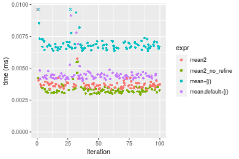

#### A 40% subset
```r
> x <- data[["n = 1000"]]
> subset
[1] 0.4
> idxs <- sort(sample(length(x), size = subset * length(x), replace = FALSE))
> gc()
           used (Mb) gc trigger  (Mb) max used  (Mb)
Ncells  5280326  282   10014072 534.9 10014072 534.9
Vcells 20970054  160   53036220 404.7 90959857 694.0
> stats <- microbenchmark(mean2 = mean2(x, idxs = idxs, refine = TRUE), mean2_no_refine = mean2(x, 
+     idxs = idxs, refine = FALSE), `mean+[()` = mean2_R_v1(x, idxs = idxs), `mean.default+[()` = mean2_R_v2(x, 
+     idxs = idxs), unit = "ms")
```

_Table: Benchmarking of mean2(), mean2_no_refine(), mean+[()() and mean.default+[()() on double+n = 1000+0.4 data. The top panel shows times in milliseconds and the bottom panel shows relative times._


|   |expr             |      min|        lq|      mean|    median|        uq|      max|
|:--|:----------------|--------:|---------:|---------:|---------:|---------:|--------:|
|2  |mean2_no_refine  | 0.004037| 0.0042675| 0.0045745| 0.0044785| 0.0046045| 0.014053|
|1  |mean2            | 0.004828| 0.0050425| 0.0052254| 0.0051740| 0.0053620| 0.006274|
|4  |mean.default+[() | 0.004898| 0.0052825| 0.0056831| 0.0054330| 0.0056110| 0.022457|
|3  |mean+[()         | 0.007337| 0.0076610| 0.0081366| 0.0079000| 0.0081635| 0.026110|


|   |expr             |      min|       lq|     mean|   median|       uq|       max|
|:--|:----------------|--------:|--------:|--------:|--------:|--------:|---------:|
|2  |mean2_no_refine  | 1.000000| 1.000000| 1.000000| 1.000000| 1.000000| 1.0000000|
|1  |mean2            | 1.195938| 1.181605| 1.142288| 1.155298| 1.164513| 0.4464527|
|4  |mean.default+[() | 1.213277| 1.237844| 1.242329| 1.213129| 1.218590| 1.5980218|
|3  |mean+[()         | 1.817439| 1.795196| 1.778674| 1.763983| 1.772939| 1.8579663|

_Figure: Benchmarking of mean2(), mean2_no_refine(), mean+[()() and mean.default+[()() on double+n = 1000+0.4 data.  Outliers are displayed as crosses.  Times are in milliseconds._

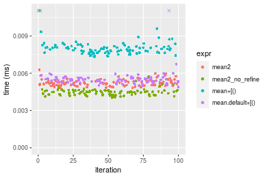

#### A 80% subset
```r
> x <- data[["n = 1000"]]
> subset
[1] 0.8
> idxs <- sort(sample(length(x), size = subset * length(x), replace = FALSE))
> gc()
           used  (Mb) gc trigger  (Mb) max used  (Mb)
Ncells  5280407 282.1   10014072 534.9 10014072 534.9
Vcells 20970308 160.0   53036220 404.7 90959857 694.0
> stats <- microbenchmark(mean2 = mean2(x, idxs = idxs, refine = TRUE), mean2_no_refine = mean2(x, 
+     idxs = idxs, refine = FALSE), `mean+[()` = mean2_R_v1(x, idxs = idxs), `mean.default+[()` = mean2_R_v2(x, 
+     idxs = idxs), unit = "ms")
```

_Table: Benchmarking of mean2(), mean2_no_refine(), mean+[()() and mean.default+[()() on double+n = 1000+0.8 data. The top panel shows times in milliseconds and the bottom panel shows relative times._


|   |expr             |      min|        lq|      mean|    median|       uq|      max|
|:--|:----------------|--------:|---------:|---------:|---------:|--------:|--------:|
|2  |mean2_no_refine  | 0.006156| 0.0064975| 0.0066752| 0.0066375| 0.006796| 0.008587|
|4  |mean.default+[() | 0.006837| 0.0072650| 0.0075128| 0.0074280| 0.007641| 0.012171|
|1  |mean2            | 0.007557| 0.0079020| 0.0084735| 0.0080560| 0.008310| 0.028596|
|3  |mean+[()         | 0.009438| 0.0098485| 0.0103274| 0.0100190| 0.010294| 0.035511|


|   |expr             |      min|       lq|     mean|   median|       uq|      max|
|:--|:----------------|--------:|--------:|--------:|--------:|--------:|--------:|
|2  |mean2_no_refine  | 1.000000| 1.000000| 1.000000| 1.000000| 1.000000| 1.000000|
|4  |mean.default+[() | 1.110624| 1.118122| 1.125470| 1.119096| 1.124338| 1.417375|
|1  |mean2            | 1.227583| 1.216160| 1.269394| 1.213710| 1.222778| 3.330150|
|3  |mean+[()         | 1.533138| 1.515737| 1.547126| 1.509454| 1.514714| 4.135437|

_Figure: Benchmarking of mean2(), mean2_no_refine(), mean+[()() and mean.default+[()() on double+n = 1000+0.8 data.  Outliers are displayed as crosses.  Times are in milliseconds._

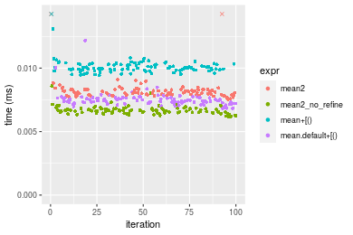


### n = 10000 vector


#### All elements
```r
> x <- data[["n = 10000"]]
> gc()
           used  (Mb) gc trigger  (Mb) max used  (Mb)
Ncells  5280417 282.1   10014072 534.9 10014072 534.9
Vcells 20969876 160.0   53036220 404.7 90959857 694.0
> stats <- microbenchmark(mean2 = mean2(x, refine = TRUE), mean2_no_refine = mean2(x, refine = FALSE), 
+     mean = mean(x), mean.default = mean.default(x), unit = "ms")
```

_Table: Benchmarking of mean2(), mean2_no_refine(), mean() and mean.default() on n = 10000+all data. The top panel shows times in milliseconds and the bottom panel shows relative times._


|   |expr            |      min|        lq|      mean|    median|        uq|      max|
|:--|:---------------|--------:|---------:|---------:|---------:|---------:|--------:|
|2  |mean2_no_refine | 0.019759| 0.0206405| 0.0220305| 0.0215060| 0.0228070| 0.034587|
|4  |mean.default    | 0.023813| 0.0243435| 0.0260357| 0.0260070| 0.0270960| 0.041807|
|3  |mean            | 0.025704| 0.0262820| 0.0281747| 0.0280325| 0.0291710| 0.048436|
|1  |mean2           | 0.034081| 0.0356140| 0.0378429| 0.0380655| 0.0396385| 0.054395|


|   |expr            |      min|       lq|     mean|   median|       uq|      max|
|:--|:---------------|--------:|--------:|--------:|--------:|--------:|--------:|
|2  |mean2_no_refine | 1.000000| 1.000000| 1.000000| 1.000000| 1.000000| 1.000000|
|4  |mean.default    | 1.205172| 1.179405| 1.181804| 1.209290| 1.188056| 1.208749|
|3  |mean            | 1.300876| 1.273322| 1.278895| 1.303473| 1.279037| 1.400411|
|1  |mean2           | 1.724834| 1.725443| 1.717750| 1.769994| 1.737997| 1.572701|

_Figure: Benchmarking of mean2(), mean2_no_refine(), mean() and mean.default() on n = 10000+all data.  Outliers are displayed as crosses.  Times are in milliseconds._


#### A 20% subset
```r
> x <- data[["n = 10000"]]
> subset
[1] 0.2
> idxs <- sort(sample(length(x), size = subset * length(x), replace = FALSE))
> gc()
           used  (Mb) gc trigger  (Mb) max used  (Mb)
Ncells  5280566 282.1   10014072 534.9 10014072 534.9
Vcells 20972304 160.1   53036220 404.7 90959857 694.0
> stats <- microbenchmark(mean2 = mean2(x, idxs = idxs, refine = TRUE), mean2_no_refine = mean2(x, 
+     idxs = idxs, refine = FALSE), `mean+[()` = mean2_R_v1(x, idxs = idxs), `mean.default+[()` = mean2_R_v2(x, 
+     idxs = idxs), unit = "ms")
```

_Table: Benchmarking of mean2(), mean2_no_refine(), mean+[()() and mean.default+[()() on double+n = 10000+0.2 data. The top panel shows times in milliseconds and the bottom panel shows relative times._


|   |expr             |      min|        lq|      mean|    median|        uq|      max|
|:--|:----------------|--------:|---------:|---------:|---------:|---------:|--------:|
|2  |mean2_no_refine  | 0.012317| 0.0128140| 0.0134729| 0.0132985| 0.0137875| 0.024824|
|4  |mean.default+[() | 0.013311| 0.0139420| 0.0146411| 0.0142540| 0.0148365| 0.028876|
|1  |mean2            | 0.015835| 0.0165555| 0.0172639| 0.0168575| 0.0174890| 0.031083|
|3  |mean+[()         | 0.015420| 0.0167425| 0.0179983| 0.0171325| 0.0176835| 0.069307|


|   |expr             |      min|       lq|     mean|   median|       uq|      max|
|:--|:----------------|--------:|--------:|--------:|--------:|--------:|--------:|
|2  |mean2_no_refine  | 1.000000| 1.000000| 1.000000| 1.000000| 1.000000| 1.000000|
|4  |mean.default+[() | 1.080701| 1.088029| 1.086703| 1.071850| 1.076083| 1.163229|
|1  |mean2            | 1.285621| 1.291985| 1.281376| 1.267624| 1.268468| 1.252135|
|3  |mean+[()         | 1.251928| 1.306579| 1.335883| 1.288303| 1.282575| 2.791935|

_Figure: Benchmarking of mean2(), mean2_no_refine(), mean+[()() and mean.default+[()() on double+n = 10000+0.2 data.  Outliers are displayed as crosses.  Times are in milliseconds._

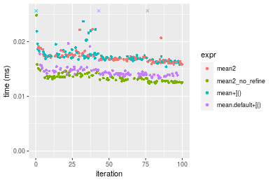

#### A 40% subset
```r
> x <- data[["n = 10000"]]
> subset
[1] 0.4
> idxs <- sort(sample(length(x), size = subset * length(x), replace = FALSE))
> gc()
           used  (Mb) gc trigger  (Mb) max used  (Mb)
Ncells  5280650 282.1   10014072 534.9 10014072 534.9
Vcells 20973365 160.1   53036220 404.7 90959857 694.0
> stats <- microbenchmark(mean2 = mean2(x, idxs = idxs, refine = TRUE), mean2_no_refine = mean2(x, 
+     idxs = idxs, refine = FALSE), `mean+[()` = mean2_R_v1(x, idxs = idxs), `mean.default+[()` = mean2_R_v2(x, 
+     idxs = idxs), unit = "ms")
```

_Table: Benchmarking of mean2(), mean2_no_refine(), mean+[()() and mean.default+[()() on double+n = 10000+0.4 data. The top panel shows times in milliseconds and the bottom panel shows relative times._


|   |expr             |      min|        lq|      mean|    median|        uq|      max|
|:--|:----------------|--------:|---------:|---------:|---------:|---------:|--------:|
|2  |mean2_no_refine  | 0.021659| 0.0222035| 0.0239246| 0.0230320| 0.0248240| 0.038968|
|4  |mean.default+[() | 0.021816| 0.0226175| 0.0239043| 0.0237315| 0.0244935| 0.037360|
|3  |mean+[()         | 0.024423| 0.0255440| 0.0270778| 0.0266040| 0.0274630| 0.067899|
|1  |mean2            | 0.028107| 0.0285930| 0.0300119| 0.0297360| 0.0309740| 0.035502|


|   |expr             |      min|       lq|      mean|   median|        uq|       max|
|:--|:----------------|--------:|--------:|---------:|--------:|---------:|---------:|
|2  |mean2_no_refine  | 1.000000| 1.000000| 1.0000000| 1.000000| 1.0000000| 1.0000000|
|4  |mean.default+[() | 1.007249| 1.018646| 0.9991511| 1.030371| 0.9866863| 0.9587354|
|3  |mean+[()         | 1.127614| 1.150449| 1.1317956| 1.155089| 1.1063084| 1.7424297|
|1  |mean2            | 1.297705| 1.287770| 1.2544371| 1.291073| 1.2477441| 0.9110552|

_Figure: Benchmarking of mean2(), mean2_no_refine(), mean+[()() and mean.default+[()() on double+n = 10000+0.4 data.  Outliers are displayed as crosses.  Times are in milliseconds._

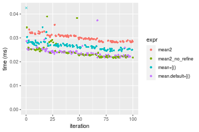

#### A 80% subset
```r
> x <- data[["n = 10000"]]
> subset
[1] 0.8
> idxs <- sort(sample(length(x), size = subset * length(x), replace = FALSE))
> gc()
           used  (Mb) gc trigger  (Mb) max used  (Mb)
Ncells  5280731 282.1   10014072 534.9 10014072 534.9
Vcells 20975419 160.1   53036220 404.7 90959857 694.0
> stats <- microbenchmark(mean2 = mean2(x, idxs = idxs, refine = TRUE), mean2_no_refine = mean2(x, 
+     idxs = idxs, refine = FALSE), `mean+[()` = mean2_R_v1(x, idxs = idxs), `mean.default+[()` = mean2_R_v2(x, 
+     idxs = idxs), unit = "ms")
```

_Table: Benchmarking of mean2(), mean2_no_refine(), mean+[()() and mean.default+[()() on double+n = 10000+0.8 data. The top panel shows times in milliseconds and the bottom panel shows relative times._


|   |expr             |      min|        lq|      mean|    median|        uq|      max|
|:--|:----------------|--------:|---------:|---------:|---------:|---------:|--------:|
|4  |mean.default+[() | 0.036775| 0.0387465| 0.0416835| 0.0416020| 0.0433145| 0.058907|
|2  |mean2_no_refine  | 0.037060| 0.0385475| 0.0428555| 0.0417750| 0.0446930| 0.083217|
|3  |mean+[()         | 0.039085| 0.0412815| 0.0442405| 0.0438225| 0.0462190| 0.075123|
|1  |mean2            | 0.047740| 0.0508640| 0.0547119| 0.0540460| 0.0577440| 0.073769|


|   |expr             |      min|        lq|     mean|   median|       uq|      max|
|:--|:----------------|--------:|---------:|--------:|--------:|--------:|--------:|
|4  |mean.default+[() | 1.000000| 1.0000000| 1.000000| 1.000000| 1.000000| 1.000000|
|2  |mean2_no_refine  | 1.007750| 0.9948641| 1.028116| 1.004158| 1.031825| 1.412684|
|3  |mean+[()         | 1.062814| 1.0654253| 1.061344| 1.053375| 1.067056| 1.275281|
|1  |mean2            | 1.298164| 1.3127379| 1.312556| 1.299120| 1.333133| 1.252296|

_Figure: Benchmarking of mean2(), mean2_no_refine(), mean+[()() and mean.default+[()() on double+n = 10000+0.8 data.  Outliers are displayed as crosses.  Times are in milliseconds._

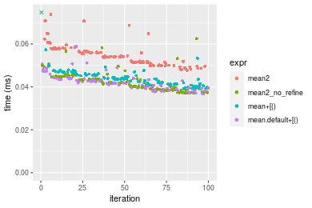


### n = 100000 vector


#### All elements
```r
> x <- data[["n = 100000"]]
> gc()
           used  (Mb) gc trigger  (Mb) max used  (Mb)
Ncells  5280741 282.1   10014072 534.9 10014072 534.9
Vcells 20974987 160.1   53036220 404.7 90959857 694.0
> stats <- microbenchmark(mean2 = mean2(x, refine = TRUE), mean2_no_refine = mean2(x, refine = FALSE), 
+     mean = mean(x), mean.default = mean.default(x), unit = "ms")
```

_Table: Benchmarking of mean2(), mean2_no_refine(), mean() and mean.default() on n = 100000+all data. The top panel shows times in milliseconds and the bottom panel shows relative times._


|   |expr            |      min|       lq|      mean|    median|        uq|      max|
|:--|:---------------|--------:|--------:|---------:|---------:|---------:|--------:|
|2  |mean2_no_refine | 0.130022| 0.130166| 0.1500754| 0.1372045| 0.1679555| 0.212282|
|3  |mean            | 0.157165| 0.157429| 0.1782115| 0.1600830| 0.1979275| 0.286994|
|4  |mean.default    | 0.155639| 0.155948| 0.1806385| 0.1687355| 0.1960925| 0.261212|
|1  |mean2           | 0.232932| 0.233211| 0.2739258| 0.2524975| 0.3030065| 0.427336|


|   |expr            |      min|       lq|     mean|   median|       uq|      max|
|:--|:---------------|--------:|--------:|--------:|--------:|--------:|--------:|
|2  |mean2_no_refine | 1.000000| 1.000000| 1.000000| 1.000000| 1.000000| 1.000000|
|3  |mean            | 1.208757| 1.209448| 1.187479| 1.166747| 1.178452| 1.351947|
|4  |mean.default    | 1.197021| 1.198070| 1.203651| 1.229810| 1.167526| 1.230495|
|1  |mean2           | 1.791481| 1.791643| 1.825254| 1.840300| 1.804088| 2.013058|

_Figure: Benchmarking of mean2(), mean2_no_refine(), mean() and mean.default() on n = 100000+all data.  Outliers are displayed as crosses.  Times are in milliseconds._


#### A 20% subset
```r
> x <- data[["n = 100000"]]
> subset
[1] 0.2
> idxs <- sort(sample(length(x), size = subset * length(x), replace = FALSE))
> gc()
           used  (Mb) gc trigger  (Mb) max used  (Mb)
Ncells  5280890 282.1   10014072 534.9 10014072 534.9
Vcells 20981521 160.1   53036220 404.7 90959857 694.0
> stats <- microbenchmark(mean2 = mean2(x, idxs = idxs, refine = TRUE), mean2_no_refine = mean2(x, 
+     idxs = idxs, refine = FALSE), `mean+[()` = mean2_R_v1(x, idxs = idxs), `mean.default+[()` = mean2_R_v2(x, 
+     idxs = idxs), unit = "ms")
```

_Table: Benchmarking of mean2(), mean2_no_refine(), mean+[()() and mean.default+[()() on double+n = 100000+0.2 data. The top panel shows times in milliseconds and the bottom panel shows relative times._


|   |expr             |      min|        lq|      mean|    median|        uq|      max|
|:--|:----------------|--------:|---------:|---------:|---------:|---------:|--------:|
|2  |mean2_no_refine  | 0.077168| 0.0855565| 0.0960555| 0.0903220| 0.1003610| 0.166682|
|4  |mean.default+[() | 0.081128| 0.0864930| 0.0989311| 0.0924795| 0.1036720| 0.224489|
|3  |mean+[()         | 0.083505| 0.0913860| 0.1006308| 0.0977050| 0.1065605| 0.140680|
|1  |mean2            | 0.105995| 0.1158885| 0.1307049| 0.1236845| 0.1373260| 0.271267|


|   |expr             |      min|       lq|     mean|   median|       uq|       max|
|:--|:----------------|--------:|--------:|--------:|--------:|--------:|---------:|
|2  |mean2_no_refine  | 1.000000| 1.000000| 1.000000| 1.000000| 1.000000| 1.0000000|
|4  |mean.default+[() | 1.051317| 1.010946| 1.029937| 1.023887| 1.032991| 1.3468101|
|3  |mean+[()         | 1.082119| 1.068136| 1.047632| 1.081741| 1.061772| 0.8440024|
|1  |mean2            | 1.373562| 1.354526| 1.360723| 1.369373| 1.368320| 1.6274523|

_Figure: Benchmarking of mean2(), mean2_no_refine(), mean+[()() and mean.default+[()() on double+n = 100000+0.2 data.  Outliers are displayed as crosses.  Times are in milliseconds._

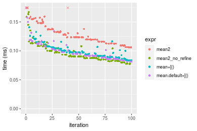

#### A 40% subset
```r
> x <- data[["n = 100000"]]
> subset
[1] 0.4
> idxs <- sort(sample(length(x), size = subset * length(x), replace = FALSE))
> gc()
           used  (Mb) gc trigger  (Mb) max used  (Mb)
Ncells  5280974 282.1   10014072 534.9 10014072 534.9
Vcells 20993138 160.2   53036220 404.7 90959857 694.0
> stats <- microbenchmark(mean2 = mean2(x, idxs = idxs, refine = TRUE), mean2_no_refine = mean2(x, 
+     idxs = idxs, refine = FALSE), `mean+[()` = mean2_R_v1(x, idxs = idxs), `mean.default+[()` = mean2_R_v2(x, 
+     idxs = idxs), unit = "ms")
```

_Table: Benchmarking of mean2(), mean2_no_refine(), mean+[()() and mean.default+[()() on double+n = 100000+0.4 data. The top panel shows times in milliseconds and the bottom panel shows relative times._


|   |expr             |      min|        lq|      mean|    median|        uq|      max|
|:--|:----------------|--------:|---------:|---------:|---------:|---------:|--------:|
|4  |mean.default+[() | 0.135034| 0.1397100| 0.1661674| 0.1586295| 0.1822940| 0.298532|
|2  |mean2_no_refine  | 0.136130| 0.1370125| 0.1636829| 0.1613075| 0.1777720| 0.247605|
|3  |mean+[()         | 0.136304| 0.1393485| 0.1643645| 0.1631590| 0.1797735| 0.254195|
|1  |mean2            | 0.181912| 0.1829325| 0.2183757| 0.2163875| 0.2369200| 0.317377|


|   |expr             |      min|        lq|     mean|   median|        uq|       max|
|:--|:----------------|--------:|---------:|--------:|--------:|---------:|---------:|
|4  |mean.default+[() | 1.000000| 1.0000000| 1.000000| 1.000000| 1.0000000| 1.0000000|
|2  |mean2_no_refine  | 1.008117| 0.9806921| 0.985048| 1.016882| 0.9751939| 0.8294086|
|3  |mean+[()         | 1.009405| 0.9974125| 0.989150| 1.028554| 0.9861734| 0.8514833|
|1  |mean2            | 1.347157| 1.3093730| 1.314191| 1.364106| 1.2996588| 1.0631256|

_Figure: Benchmarking of mean2(), mean2_no_refine(), mean+[()() and mean.default+[()() on double+n = 100000+0.4 data.  Outliers are displayed as crosses.  Times are in milliseconds._

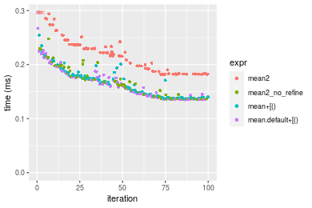

#### A 80% subset
```r
> x <- data[["n = 100000"]]
> subset
[1] 0.8
> idxs <- sort(sample(length(x), size = subset * length(x), replace = FALSE))
> gc()
           used  (Mb) gc trigger  (Mb) max used  (Mb)
Ncells  5281055 282.1   10014072 534.9 10014072 534.9
Vcells 21013192 160.4   53036220 404.7 90959857 694.0
> stats <- microbenchmark(mean2 = mean2(x, idxs = idxs, refine = TRUE), mean2_no_refine = mean2(x, 
+     idxs = idxs, refine = FALSE), `mean+[()` = mean2_R_v1(x, idxs = idxs), `mean.default+[()` = mean2_R_v2(x, 
+     idxs = idxs), unit = "ms")
```

_Table: Benchmarking of mean2(), mean2_no_refine(), mean+[()() and mean.default+[()() on double+n = 100000+0.8 data. The top panel shows times in milliseconds and the bottom panel shows relative times._


|   |expr             |      min|        lq|      mean|    median|        uq|      max|
|:--|:----------------|--------:|---------:|---------:|---------:|---------:|--------:|
|4  |mean.default+[() | 0.260972| 0.2680880| 0.3448101| 0.3095025| 0.4405720| 0.532025|
|2  |mean2_no_refine  | 0.272950| 0.2791980| 0.3522284| 0.3165850| 0.4557005| 0.515568|
|3  |mean+[()         | 0.264920| 0.2754685| 0.3468186| 0.3195720| 0.4402740| 0.529905|
|1  |mean2            | 0.358838| 0.3734355| 0.4449811| 0.4348845| 0.5265620| 0.616074|


|   |expr             |      min|       lq|     mean|   median|        uq|       max|
|:--|:----------------|--------:|--------:|--------:|--------:|---------:|---------:|
|4  |mean.default+[() | 1.000000| 1.000000| 1.000000| 1.000000| 1.0000000| 1.0000000|
|2  |mean2_no_refine  | 1.045898| 1.041442| 1.021514| 1.022884| 1.0343383| 0.9690672|
|3  |mean+[()         | 1.015128| 1.027530| 1.005825| 1.032534| 0.9993236| 0.9960152|
|1  |mean2            | 1.375006| 1.392959| 1.290510| 1.405108| 1.1951781| 1.1579794|

_Figure: Benchmarking of mean2(), mean2_no_refine(), mean+[()() and mean.default+[()() on double+n = 100000+0.8 data.  Outliers are displayed as crosses.  Times are in milliseconds._

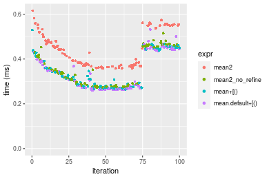


### n = 1000000 vector


#### All elements
```r
> x <- data[["n = 1000000"]]
> gc()
           used  (Mb) gc trigger  (Mb) max used  (Mb)
Ncells  5281065 282.1   10014072 534.9 10014072 534.9
Vcells 21012760 160.4   53036220 404.7 90959857 694.0
> stats <- microbenchmark(mean2 = mean2(x, refine = TRUE), mean2_no_refine = mean2(x, refine = FALSE), 
+     mean = mean(x), mean.default = mean.default(x), unit = "ms")
```

_Table: Benchmarking of mean2(), mean2_no_refine(), mean() and mean.default() on n = 1000000+all data. The top panel shows times in milliseconds and the bottom panel shows relative times._


|   |expr            |      min|       lq|     mean|   median|       uq|      max|
|:--|:---------------|--------:|--------:|--------:|--------:|--------:|--------:|
|2  |mean2_no_refine | 1.346411| 1.362054| 1.428370| 1.403750| 1.436638| 2.165996|
|4  |mean.default    | 1.656412| 1.696331| 1.773937| 1.738830| 1.807335| 2.410589|
|3  |mean            | 1.671665| 1.704481| 1.780142| 1.762617| 1.805319| 2.283955|
|1  |mean2           | 2.447121| 2.514978| 2.653915| 2.589642| 2.680712| 4.140713|


|   |expr            |      min|       lq|     mean|   median|       uq|      max|
|:--|:---------------|--------:|--------:|--------:|--------:|--------:|--------:|
|2  |mean2_no_refine | 1.000000| 1.000000| 1.000000| 1.000000| 1.000000| 1.000000|
|4  |mean.default    | 1.230242| 1.245421| 1.241931| 1.238703| 1.258031| 1.112924|
|3  |mean            | 1.241571| 1.251405| 1.246275| 1.255648| 1.256628| 1.054460|
|1  |mean2           | 1.817514| 1.846459| 1.858002| 1.844802| 1.865962| 1.911690|

_Figure: Benchmarking of mean2(), mean2_no_refine(), mean() and mean.default() on n = 1000000+all data.  Outliers are displayed as crosses.  Times are in milliseconds._


#### A 20% subset
```r
> x <- data[["n = 1000000"]]
> subset
[1] 0.2
> idxs <- sort(sample(length(x), size = subset * length(x), replace = FALSE))
> gc()
           used  (Mb) gc trigger  (Mb) max used  (Mb)
Ncells  5281214 282.1   10014072 534.9 10014072 534.9
Vcells 21073293 160.8   53036220 404.7 90959857 694.0
> stats <- microbenchmark(mean2 = mean2(x, idxs = idxs, refine = TRUE), mean2_no_refine = mean2(x, 
+     idxs = idxs, refine = FALSE), `mean+[()` = mean2_R_v1(x, idxs = idxs), `mean.default+[()` = mean2_R_v2(x, 
+     idxs = idxs), unit = "ms")
```

_Table: Benchmarking of mean2(), mean2_no_refine(), mean+[()() and mean.default+[()() on double+n = 1000000+0.2 data. The top panel shows times in milliseconds and the bottom panel shows relative times._


|   |expr             |      min|       lq|     mean|   median|       uq|       max|
|:--|:----------------|--------:|--------:|--------:|--------:|--------:|---------:|
|2  |mean2_no_refine  | 1.061295| 1.125338| 1.451160| 1.214461| 1.614645| 11.606061|
|3  |mean+[()         | 1.153782| 1.194789| 1.361742| 1.227717| 1.639544|  1.798251|
|4  |mean.default+[() | 1.139647| 1.207410| 1.436418| 1.326254| 1.676128|  2.033101|
|1  |mean2            | 1.627323| 1.677687| 2.008867| 1.770733| 2.196706| 12.802705|


|   |expr             |      min|       lq|      mean|   median|       uq|       max|
|:--|:----------------|--------:|--------:|---------:|--------:|--------:|---------:|
|2  |mean2_no_refine  | 1.000000| 1.000000| 1.0000000| 1.000000| 1.000000| 1.0000000|
|3  |mean+[()         | 1.087145| 1.061717| 0.9383819| 1.010915| 1.015420| 0.1549407|
|4  |mean.default+[() | 1.073827| 1.072931| 0.9898416| 1.092051| 1.038078| 0.1751758|
|1  |mean2            | 1.533337| 1.490830| 1.3843183| 1.458040| 1.360488| 1.1031051|

_Figure: Benchmarking of mean2(), mean2_no_refine(), mean+[()() and mean.default+[()() on double+n = 1000000+0.2 data.  Outliers are displayed as crosses.  Times are in milliseconds._

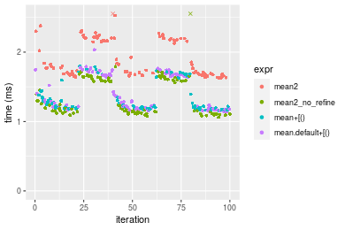

#### A 40% subset
```r
> x <- data[["n = 1000000"]]
> subset
[1] 0.4
> idxs <- sort(sample(length(x), size = subset * length(x), replace = FALSE))
> gc()
           used  (Mb) gc trigger  (Mb) max used  (Mb)
Ncells  5281298 282.1   10014072 534.9 10014072 534.9
Vcells 21173354 161.6   53036220 404.7 90959857 694.0
> stats <- microbenchmark(mean2 = mean2(x, idxs = idxs, refine = TRUE), mean2_no_refine = mean2(x, 
+     idxs = idxs, refine = FALSE), `mean+[()` = mean2_R_v1(x, idxs = idxs), `mean.default+[()` = mean2_R_v2(x, 
+     idxs = idxs), unit = "ms")
```

_Table: Benchmarking of mean2(), mean2_no_refine(), mean+[()() and mean.default+[()() on double+n = 1000000+0.4 data. The top panel shows times in milliseconds and the bottom panel shows relative times._


|   |expr             |      min|       lq|     mean|   median|       uq|       max|
|:--|:----------------|--------:|--------:|--------:|--------:|--------:|---------:|
|3  |mean+[()         | 1.912879| 2.013489| 2.480976| 2.244226| 2.744437| 12.358608|
|2  |mean2_no_refine  | 1.801486| 1.923780| 2.601348| 2.559546| 2.685085| 12.258149|
|4  |mean.default+[() | 1.915323| 2.020817| 2.418611| 2.620453| 2.780768|  3.179627|
|1  |mean2            | 2.572049| 2.713394| 3.135676| 2.883117| 3.398519| 13.005398|


|   |expr             |       min|       lq|      mean|   median|        uq|       max|
|:--|:----------------|---------:|--------:|---------:|--------:|---------:|---------:|
|3  |mean+[()         | 1.0000000| 1.000000| 1.0000000| 1.000000| 1.0000000| 1.0000000|
|2  |mean2_no_refine  | 0.9417668| 0.955446| 1.0485179| 1.140503| 0.9783737| 0.9918713|
|4  |mean.default+[() | 1.0012777| 1.003639| 0.9748627| 1.167643| 1.0132381| 0.2572804|
|1  |mean2            | 1.3445958| 1.347608| 1.2638882| 1.284682| 1.2383303| 1.0523352|

_Figure: Benchmarking of mean2(), mean2_no_refine(), mean+[()() and mean.default+[()() on double+n = 1000000+0.4 data.  Outliers are displayed as crosses.  Times are in milliseconds._

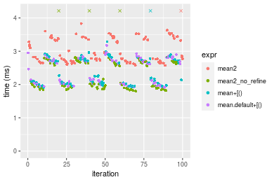

#### A 80% subset
```r
> x <- data[["n = 1000000"]]
> subset
[1] 0.8
> idxs <- sort(sample(length(x), size = subset * length(x), replace = FALSE))
> gc()
           used  (Mb) gc trigger  (Mb) max used  (Mb)
Ncells  5281379 282.1   10014072 534.9 10014072 534.9
Vcells 21373408 163.1   53036220 404.7 90959857 694.0
> stats <- microbenchmark(mean2 = mean2(x, idxs = idxs, refine = TRUE), mean2_no_refine = mean2(x, 
+     idxs = idxs, refine = FALSE), `mean+[()` = mean2_R_v1(x, idxs = idxs), `mean.default+[()` = mean2_R_v2(x, 
+     idxs = idxs), unit = "ms")
```

_Table: Benchmarking of mean2(), mean2_no_refine(), mean+[()() and mean.default+[()() on double+n = 1000000+0.8 data. The top panel shows times in milliseconds and the bottom panel shows relative times._


|   |expr             |      min|       lq|     mean|   median|       uq|      max|
|:--|:----------------|--------:|--------:|--------:|--------:|--------:|--------:|
|3  |mean+[()         | 3.330982| 3.501025| 4.509066| 3.884176| 4.970332| 14.25155|
|4  |mean.default+[() | 3.264061| 3.469571| 4.378401| 3.933695| 4.917440| 13.74869|
|2  |mean2_no_refine  | 3.159077| 3.400727| 4.538938| 4.520746| 4.905326| 13.81642|
|1  |mean2            | 4.305209| 4.761479| 5.591129| 5.972666| 6.135000| 15.07903|


|   |expr             |       min|        lq|      mean|   median|        uq|       max|
|:--|:----------------|---------:|---------:|---------:|--------:|---------:|---------:|
|3  |mean+[()         | 1.0000000| 1.0000000| 1.0000000| 1.000000| 1.0000000| 1.0000000|
|4  |mean.default+[() | 0.9799095| 0.9910158| 0.9710217| 1.012749| 0.9893584| 0.9647153|
|2  |mean2_no_refine  | 0.9483921| 0.9713515| 1.0066248| 1.163888| 0.9869211| 0.9694678|
|1  |mean2            | 1.2924744| 1.3600241| 1.2399750| 1.537692| 1.2343238| 1.0580624|

_Figure: Benchmarking of mean2(), mean2_no_refine(), mean+[()() and mean.default+[()() on double+n = 1000000+0.8 data.  Outliers are displayed as crosses.  Times are in milliseconds._

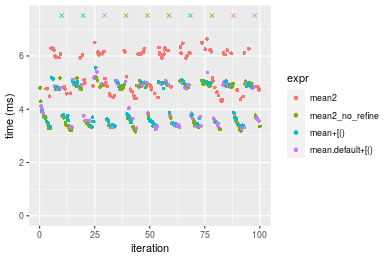


### n = 10000000 vector


#### All elements
```r
> x <- data[["n = 10000000"]]
> gc()
           used  (Mb) gc trigger  (Mb) max used  (Mb)
Ncells  5281389 282.1   10014072 534.9 10014072 534.9
Vcells 21372976 163.1   53036220 404.7 90959857 694.0
> stats <- microbenchmark(mean2 = mean2(x, refine = TRUE), mean2_no_refine = mean2(x, refine = FALSE), 
+     mean = mean(x), mean.default = mean.default(x), unit = "ms")
```

_Table: Benchmarking of mean2(), mean2_no_refine(), mean() and mean.default() on n = 10000000+all data. The top panel shows times in milliseconds and the bottom panel shows relative times._


|   |expr            |      min|       lq|     mean|   median|       uq|      max|
|:--|:---------------|--------:|--------:|--------:|--------:|--------:|--------:|
|2  |mean2_no_refine | 14.47340| 14.74180| 15.03330| 15.01162| 15.22882| 16.12223|
|4  |mean.default    | 18.16061| 18.35007| 18.64336| 18.48243| 18.76429| 25.28189|
|3  |mean            | 18.17089| 18.40721| 18.69503| 18.57032| 18.85832| 21.98831|
|1  |mean2           | 26.68983| 27.06202| 27.73454| 27.74432| 28.17017| 32.09928|


|   |expr            |      min|       lq|     mean|   median|       uq|      max|
|:--|:---------------|--------:|--------:|--------:|--------:|--------:|--------:|
|2  |mean2_no_refine | 1.000000| 1.000000| 1.000000| 1.000000| 1.000000| 1.000000|
|4  |mean.default    | 1.254758| 1.244765| 1.240138| 1.231208| 1.232157| 1.568139|
|3  |mean            | 1.255468| 1.248641| 1.243575| 1.237063| 1.238332| 1.363850|
|1  |mean2           | 1.844062| 1.835734| 1.844874| 1.848189| 1.849794| 1.990995|

_Figure: Benchmarking of mean2(), mean2_no_refine(), mean() and mean.default() on n = 10000000+all data.  Outliers are displayed as crosses.  Times are in milliseconds._


#### A 20% subset
```r
> x <- data[["n = 10000000"]]
> subset
[1] 0.2
> idxs <- sort(sample(length(x), size = subset * length(x), replace = FALSE))
> gc()
           used  (Mb) gc trigger  (Mb) max used  (Mb)
Ncells  5281538 282.1   10014072 534.9 10014072 534.9
Vcells 21975396 167.7   53036220 404.7 90959857 694.0
> stats <- microbenchmark(mean2 = mean2(x, idxs = idxs, refine = TRUE), mean2_no_refine = mean2(x, 
+     idxs = idxs, refine = FALSE), `mean+[()` = mean2_R_v1(x, idxs = idxs), `mean.default+[()` = mean2_R_v2(x, 
+     idxs = idxs), unit = "ms")
```

_Table: Benchmarking of mean2(), mean2_no_refine(), mean+[()() and mean.default+[()() on double+n = 10000000+0.2 data. The top panel shows times in milliseconds and the bottom panel shows relative times._


|   |expr             |      min|       lq|     mean|   median|       uq|       max|
|:--|:----------------|--------:|--------:|--------:|--------:|--------:|---------:|
|2  |mean2_no_refine  | 11.85542| 12.23638| 15.75851| 16.85141| 17.65682|  23.38199|
|4  |mean.default+[() | 13.48259| 13.83604| 16.88140| 17.99077| 18.60807|  25.55836|
|3  |mean+[()         | 13.50818| 13.86260| 16.70207| 17.99615| 18.52860|  26.15245|
|1  |mean2            | 18.10397| 18.44860| 26.08428| 23.26530| 24.05192| 391.24782|


|   |expr             |      min|       lq|     mean|   median|       uq|       max|
|:--|:----------------|--------:|--------:|--------:|--------:|--------:|---------:|
|2  |mean2_no_refine  | 1.000000| 1.000000| 1.000000| 1.000000| 1.000000|  1.000000|
|4  |mean.default+[() | 1.137252| 1.130730| 1.071256| 1.067612| 1.053875|  1.093079|
|3  |mean+[()         | 1.139410| 1.132901| 1.059877| 1.067931| 1.049374|  1.118487|
|1  |mean2            | 1.527063| 1.507684| 1.655250| 1.380614| 1.362189| 16.732869|

_Figure: Benchmarking of mean2(), mean2_no_refine(), mean+[()() and mean.default+[()() on double+n = 10000000+0.2 data.  Outliers are displayed as crosses.  Times are in milliseconds._


#### A 40% subset
```r
> x <- data[["n = 10000000"]]
> subset
[1] 0.4
> idxs <- sort(sample(length(x), size = subset * length(x), replace = FALSE))
> gc()
           used  (Mb) gc trigger  (Mb) max used  (Mb)
Ncells  5281622 282.1   10014072 534.9 10014072 534.9
Vcells 22975457 175.3   53036220 404.7 90959857 694.0
> stats <- microbenchmark(mean2 = mean2(x, idxs = idxs, refine = TRUE), mean2_no_refine = mean2(x, 
+     idxs = idxs, refine = FALSE), `mean+[()` = mean2_R_v1(x, idxs = idxs), `mean.default+[()` = mean2_R_v2(x, 
+     idxs = idxs), unit = "ms")
```

_Table: Benchmarking of mean2(), mean2_no_refine(), mean+[()() and mean.default+[()() on double+n = 10000000+0.4 data. The top panel shows times in milliseconds and the bottom panel shows relative times._


|   |expr             |      min|       lq|     mean|   median|       uq|      max|
|:--|:----------------|--------:|--------:|--------:|--------:|--------:|--------:|
|2  |mean2_no_refine  | 18.63191| 19.55531| 24.55044| 26.74474| 29.21279| 38.24257|
|3  |mean+[()         | 21.43531| 22.17509| 27.32979| 29.59216| 31.05856| 33.02940|
|4  |mean.default+[() | 21.69103| 22.28126| 27.32045| 29.65788| 31.10143| 34.94976|
|1  |mean2            | 26.48331| 28.16728| 33.40729| 35.43941| 37.54317| 42.04879|


|   |expr             |      min|       lq|     mean|   median|       uq|       max|
|:--|:----------------|--------:|--------:|--------:|--------:|--------:|---------:|
|2  |mean2_no_refine  | 1.000000| 1.000000| 1.000000| 1.000000| 1.000000| 1.0000000|
|3  |mean+[()         | 1.150462| 1.133967| 1.113209| 1.106467| 1.063184| 0.8636814|
|4  |mean.default+[() | 1.164187| 1.139397| 1.112829| 1.108924| 1.064651| 0.9138967|
|1  |mean2            | 1.421395| 1.440390| 1.360761| 1.325099| 1.285162| 1.0995284|

_Figure: Benchmarking of mean2(), mean2_no_refine(), mean+[()() and mean.default+[()() on double+n = 10000000+0.4 data.  Outliers are displayed as crosses.  Times are in milliseconds._

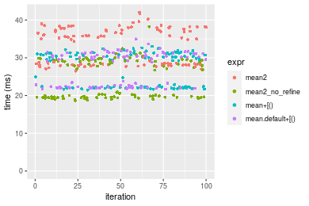

#### A 80% subset
```r
> x <- data[["n = 10000000"]]
> subset
[1] 0.8
> idxs <- sort(sample(length(x), size = subset * length(x), replace = FALSE))
> gc()
           used  (Mb) gc trigger  (Mb) max used  (Mb)
Ncells  5281703 282.1   10014072 534.9 10014072 534.9
Vcells 24975511 190.6   53036220 404.7 90959857 694.0
> stats <- microbenchmark(mean2 = mean2(x, idxs = idxs, refine = TRUE), mean2_no_refine = mean2(x, 
+     idxs = idxs, refine = FALSE), `mean+[()` = mean2_R_v1(x, idxs = idxs), `mean.default+[()` = mean2_R_v2(x, 
+     idxs = idxs), unit = "ms")
```

_Table: Benchmarking of mean2(), mean2_no_refine(), mean+[()() and mean.default+[()() on double+n = 10000000+0.8 data. The top panel shows times in milliseconds and the bottom panel shows relative times._


|   |expr             |      min|       lq|     mean|   median|       uq|       max|
|:--|:----------------|--------:|--------:|--------:|--------:|--------:|---------:|
|2  |mean2_no_refine  | 33.52032| 34.39416| 45.65965| 43.58471| 50.17898| 400.58465|
|4  |mean.default+[() | 37.32485| 38.20856| 45.35825| 45.81930| 51.20065|  54.59520|
|3  |mean+[()         | 37.27402| 38.02604| 45.26219| 45.89517| 51.25990|  55.88406|
|1  |mean2            | 45.84732| 47.82751| 56.82484| 56.97135| 63.19479|  67.23565|


|   |expr             |      min|       lq|      mean|   median|       uq|       max|
|:--|:----------------|--------:|--------:|---------:|--------:|--------:|---------:|
|2  |mean2_no_refine  | 1.000000| 1.000000| 1.0000000| 1.000000| 1.000000| 1.0000000|
|4  |mean.default+[() | 1.113499| 1.110902| 0.9933990| 1.051270| 1.020361| 0.1362888|
|3  |mean+[()         | 1.111983| 1.105596| 0.9912951| 1.053011| 1.021541| 0.1395062|
|1  |mean2            | 1.367747| 1.390570| 1.2445308| 1.307141| 1.259388| 0.1678438|

_Figure: Benchmarking of mean2(), mean2_no_refine(), mean+[()() and mean.default+[()() on double+n = 10000000+0.8 data.  Outliers are displayed as crosses.  Times are in milliseconds._

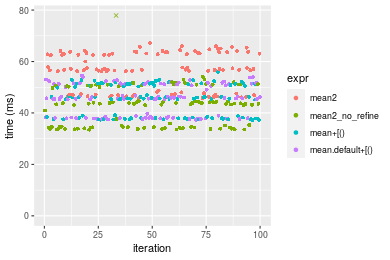


## Appendix

### Session information
```r
R version 4.1.1 Patched (2021-08-10 r80727)
Platform: x86_64-pc-linux-gnu (64-bit)
Running under: Ubuntu 18.04.5 LTS

Matrix products: default
BLAS:   /home/hb/software/R-devel/R-4-1-branch/lib/R/lib/libRblas.so
LAPACK: /home/hb/software/R-devel/R-4-1-branch/lib/R/lib/libRlapack.so

locale:
 [1] LC_CTYPE=en_US.UTF-8       LC_NUMERIC=C              
 [3] LC_TIME=en_US.UTF-8        LC_COLLATE=en_US.UTF-8    
 [5] LC_MONETARY=en_US.UTF-8    LC_MESSAGES=en_US.UTF-8   
 [7] LC_PAPER=en_US.UTF-8       LC_NAME=C                 
 [9] LC_ADDRESS=C               LC_TELEPHONE=C            
[11] LC_MEASUREMENT=en_US.UTF-8 LC_IDENTIFICATION=C       

attached base packages:
[1] stats     graphics  grDevices utils     datasets  methods   base     

other attached packages:
[1] microbenchmark_1.4-7   matrixStats_0.60.1     ggplot2_3.3.5         
[4] knitr_1.33             R.devices_2.17.0       R.utils_2.10.1        
[7] R.oo_1.24.0            R.methodsS3_1.8.1-9001 history_0.0.1-9000    

loaded via a namespace (and not attached):
 [1] Biobase_2.52.0          httr_1.4.2              splines_4.1.1          
 [4] bit64_4.0.5             network_1.17.1          assertthat_0.2.1       
 [7] highr_0.9               stats4_4.1.1            blob_1.2.2             
[10] GenomeInfoDbData_1.2.6  robustbase_0.93-8       pillar_1.6.2           
[13] RSQLite_2.2.8           lattice_0.20-44         glue_1.4.2             
[16] digest_0.6.27           XVector_0.32.0          colorspace_2.0-2       
[19] Matrix_1.3-4            XML_3.99-0.7            pkgconfig_2.0.3        
[22] zlibbioc_1.38.0         genefilter_1.74.0       purrr_0.3.4            
[25] ergm_4.1.2              xtable_1.8-4            scales_1.1.1           
[28] tibble_3.1.4            annotate_1.70.0         KEGGREST_1.32.0        
[31] farver_2.1.0            generics_0.1.0          IRanges_2.26.0         
[34] ellipsis_0.3.2          cachem_1.0.6            withr_2.4.2            
[37] BiocGenerics_0.38.0     mime_0.11               survival_3.2-13        
[40] magrittr_2.0.1          crayon_1.4.1            statnet.common_4.5.0   
[43] memoise_2.0.0           laeken_0.5.1            fansi_0.5.0            
[46] R.cache_0.15.0          MASS_7.3-54             R.rsp_0.44.0           
[49] progressr_0.8.0         tools_4.1.1             lifecycle_1.0.0        
[52] S4Vectors_0.30.0        trust_0.1-8             munsell_0.5.0          
[55] tabby_0.0.1-9001        AnnotationDbi_1.54.1    Biostrings_2.60.2      
[58] compiler_4.1.1          GenomeInfoDb_1.28.1     rlang_0.4.11           
[61] grid_4.1.1              RCurl_1.98-1.4          cwhmisc_6.6            
[64] rappdirs_0.3.3          startup_0.15.0          labeling_0.4.2         
[67] bitops_1.0-7            base64enc_0.1-3         boot_1.3-28            
[70] gtable_0.3.0            DBI_1.1.1               markdown_1.1           
[73] R6_2.5.1                lpSolveAPI_5.5.2.0-17.7 rle_0.9.2              
[76] dplyr_1.0.7             fastmap_1.1.0           bit_4.0.4              
[79] utf8_1.2.2              parallel_4.1.1          Rcpp_1.0.7             
[82] vctrs_0.3.8             png_0.1-7               DEoptimR_1.0-9         
[85] tidyselect_1.1.1        xfun_0.25               coda_0.19-4            
```
Total processing time was 2.28 mins.


### Reproducibility
To reproduce this report, do:
```r
html <- matrixStats:::benchmark('mean2')
```

[RSP]: https://cran.r-project.org/package=R.rsp
[matrixStats]: https://cran.r-project.org/package=matrixStats

[StackOverflow:colMins?]: https://stackoverflow.com/questions/13676878 "Stack Overflow: fastest way to get Min from every column in a matrix?"
[StackOverflow:colSds?]: https://stackoverflow.com/questions/17549762 "Stack Overflow: Is there such 'colsd' in R?"
[StackOverflow:rowProds?]: https://stackoverflow.com/questions/20198801/ "Stack Overflow: Row product of matrix and column sum of matrix"

---------------------------------------
Copyright Henrik Bengtsson. Last updated on 2021-08-25 18:32:30 (+0200 UTC). Powered by [RSP].

<script>
 var link = document.createElement('link');
 link.rel = 'icon';
 link.href = "data:image/png;base64,iVBORw0KGgoAAAANSUhEUgAAACAAAAAgCAMAAABEpIrGAAAA21BMVEUAAAAAAP8AAP8AAP8AAP8AAP8AAP8AAP8AAP8AAP8AAP8AAP8AAP8AAP8AAP8AAP8AAP8AAP8AAP8AAP8AAP8AAP8AAP8AAP8AAP8AAP8AAP8AAP8AAP8AAP8AAP8AAP8AAP8AAP8AAP8AAP8AAP8AAP8AAP8AAP8AAP8AAP8BAf4CAv0DA/wdHeIeHuEfH+AgIN8hId4lJdomJtknJ9g+PsE/P8BAQL9yco10dIt1dYp3d4h4eIeVlWqWlmmXl2iYmGeZmWabm2Tn5xjo6Bfp6Rb39wj4+Af//wA2M9hbAAAASXRSTlMAAQIJCgsMJSYnKD4/QGRlZmhpamtsbautrrCxuru8y8zN5ebn6Pn6+///////////////////////////////////////////LsUNcQAAAS9JREFUOI29k21XgkAQhVcFytdSMqMETU26UVqGmpaiFbL//xc1cAhhwVNf6n5i5z67M2dmYOyfJZUqlVLhkKucG7cgmUZTybDz6g0iDeq51PUr37Ds2cy2/C9NeES5puDjxuUk1xnToZsg8pfA3avHQ3lLIi7iWRrkv/OYtkScxBIMgDee0ALoyxHQBJ68JLCjOtQIMIANF7QG9G9fNnHvisCHBVMKgSJgiz7nE+AoBKrAPA3MgepvgR9TSCasrCKH0eB1wBGBFdCO+nAGjMVGPcQb5bd6mQRegN6+1axOs9nGfYcCtfi4NQosdtH7dB+txFIpXQqN1p9B/asRHToyS0jRgpV7nk4nwcq1BJ+x3Gl/v7S9Wmpp/aGquum7w3ZDyrADFYrl8vHBH+ev9AUASW1dmU4h4wAAAABJRU5ErkJggg=="
 document.getElementsByTagName('head')[0].appendChild(link);
</script>


