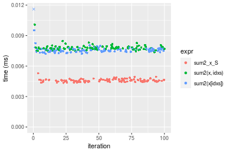
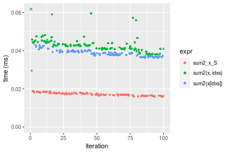
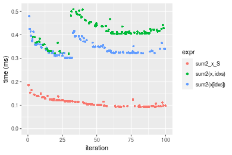
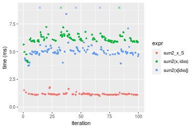
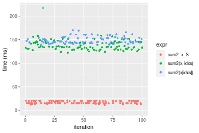
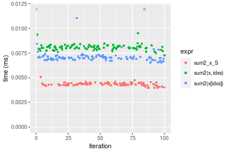
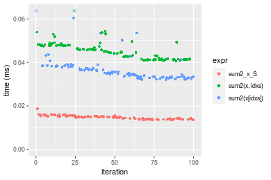
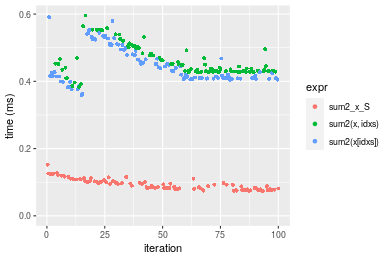
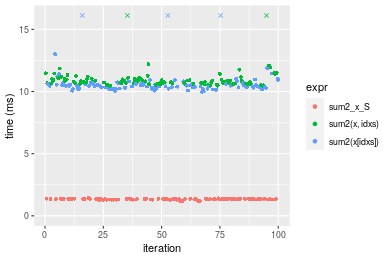
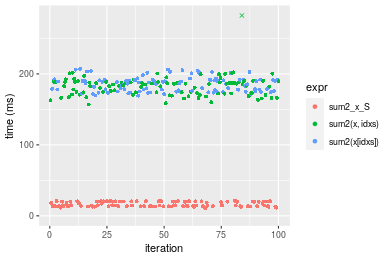

[matrixStats]: Benchmark report

---------------------------------------


# sum2() benchmarks on subsetted computation

This report benchmark the performance of sum2() on subsetted computation.


## Data type "integer"
### Data
```r
> rvector <- function(n, mode = c("logical", "double", "integer"), range = c(-100, +100), na_prob = 0) {
+     mode <- match.arg(mode)
+     if (mode == "logical") {
+         x <- sample(c(FALSE, TRUE), size = n, replace = TRUE)
+     }     else {
+         x <- runif(n, min = range[1], max = range[2])
+     }
+     storage.mode(x) <- mode
+     if (na_prob > 0) 
+         x[sample(n, size = na_prob * n)] <- NA
+     x
+ }
> rvectors <- function(scale = 10, seed = 1, ...) {
+     set.seed(seed)
+     data <- list()
+     data[[1]] <- rvector(n = scale * 100, ...)
+     data[[2]] <- rvector(n = scale * 1000, ...)
+     data[[3]] <- rvector(n = scale * 10000, ...)
+     data[[4]] <- rvector(n = scale * 1e+05, ...)
+     data[[5]] <- rvector(n = scale * 1e+06, ...)
+     names(data) <- sprintf("n = %d", sapply(data, FUN = length))
+     data
+ }
> data <- rvectors(mode = mode)
```

### Results

### n = 1000 vector


```r
> x <- data[["n = 1000"]]
> idxs <- sample.int(length(x), size = length(x) * 0.7)
> x_S <- x[idxs]
> gc()
           used  (Mb) gc trigger  (Mb) max used  (Mb)
Ncells  5284603 282.3   10014072 534.9 10014072 534.9
Vcells 16544534 126.3   33943181 259.0 90959857 694.0
> stats <- microbenchmark(sum2_x_S = sum2(x_S), `sum2(x, idxs)` = sum2(x, idxs = idxs), `sum2(x[idxs])` = sum2(x[idxs]), 
+     unit = "ms")
```


_Table: Benchmarking of sum2_x_S(), sum2(x, idxs)() and sum2(x[idxs])() on integer+n = 1000 data. The top panel shows times in milliseconds and the bottom panel shows relative times._


|   |expr          |      min|        lq|      mean|    median|        uq|      max|
|:--|:-------------|--------:|---------:|---------:|---------:|---------:|--------:|
|1  |sum2_x_S      | 0.004357| 0.0044850| 0.0045904| 0.0045765| 0.0046565| 0.005293|
|3  |sum2(x[idxs]) | 0.007207| 0.0074405| 0.0094009| 0.0075525| 0.0076695| 0.189494|
|2  |sum2(x, idxs) | 0.007365| 0.0076675| 0.0078085| 0.0077655| 0.0078905| 0.010078|


|   |expr          |      min|       lq|     mean|   median|       uq|       max|
|:--|:-------------|--------:|--------:|--------:|--------:|--------:|---------:|
|1  |sum2_x_S      | 1.000000| 1.000000| 1.000000| 1.000000| 1.000000|  1.000000|
|3  |sum2(x[idxs]) | 1.654120| 1.658974| 2.047954| 1.650279| 1.647053| 35.800869|
|2  |sum2(x, idxs) | 1.690383| 1.709588| 1.701052| 1.696821| 1.694513|  1.904024|

_Figure: Benchmarking of sum2_x_S(), sum2(x, idxs)() and sum2(x[idxs])() on integer+n = 1000 data.  Outliers are displayed as crosses.  Times are in milliseconds._



### n = 10000 vector


```r
> x <- data[["n = 10000"]]
> idxs <- sample.int(length(x), size = length(x) * 0.7)
> x_S <- x[idxs]
> gc()
           used  (Mb) gc trigger  (Mb) max used  (Mb)
Ncells  5282574 282.2   10014072 534.9 10014072 534.9
Vcells 15415226 117.7   33943181 259.0 90959857 694.0
> stats <- microbenchmark(sum2_x_S = sum2(x_S), `sum2(x, idxs)` = sum2(x, idxs = idxs), `sum2(x[idxs])` = sum2(x[idxs]), 
+     unit = "ms")
```


_Table: Benchmarking of sum2_x_S(), sum2(x, idxs)() and sum2(x[idxs])() on integer+n = 10000 data. The top panel shows times in milliseconds and the bottom panel shows relative times._


|   |expr          |      min|        lq|      mean|    median|        uq|      max|
|:--|:-------------|--------:|---------:|---------:|---------:|---------:|--------:|
|1  |sum2_x_S      | 0.015944| 0.0166900| 0.0173500| 0.0171535| 0.0178325| 0.029575|
|3  |sum2(x[idxs]) | 0.036364| 0.0376760| 0.0393518| 0.0387500| 0.0399500| 0.078819|
|2  |sum2(x, idxs) | 0.038012| 0.0409545| 0.0431839| 0.0426915| 0.0442265| 0.066287|


|   |expr          |      min|       lq|     mean|   median|       uq|      max|
|:--|:-------------|--------:|--------:|--------:|--------:|--------:|--------:|
|1  |sum2_x_S      | 1.000000| 1.000000| 1.000000| 1.000000| 1.000000| 1.000000|
|3  |sum2(x[idxs]) | 2.280733| 2.257400| 2.268108| 2.259014| 2.240292| 2.665055|
|2  |sum2(x, idxs) | 2.384094| 2.453835| 2.488980| 2.488792| 2.480107| 2.241319|

_Figure: Benchmarking of sum2_x_S(), sum2(x, idxs)() and sum2(x[idxs])() on integer+n = 10000 data.  Outliers are displayed as crosses.  Times are in milliseconds._



### n = 100000 vector


```r
> x <- data[["n = 100000"]]
> idxs <- sample.int(length(x), size = length(x) * 0.7)
> x_S <- x[idxs]
> gc()
           used  (Mb) gc trigger  (Mb) max used  (Mb)
Ncells  5282646 282.2   10014072 534.9 10014072 534.9
Vcells 15478786 118.1   33943181 259.0 90959857 694.0
> stats <- microbenchmark(sum2_x_S = sum2(x_S), `sum2(x, idxs)` = sum2(x, idxs = idxs), `sum2(x[idxs])` = sum2(x[idxs]), 
+     unit = "ms")
```


_Table: Benchmarking of sum2_x_S(), sum2(x, idxs)() and sum2(x[idxs])() on integer+n = 100000 data. The top panel shows times in milliseconds and the bottom panel shows relative times._


|   |expr          |      min|        lq|      mean|    median|        uq|      max|
|:--|:-------------|--------:|---------:|---------:|---------:|---------:|--------:|
|1  |sum2_x_S      | 0.092533| 0.0956185| 0.1114947| 0.1033575| 0.1210105| 0.185634|
|3  |sum2(x[idxs]) | 0.300985| 0.3228920| 0.3436331| 0.3314935| 0.3583545| 0.479744|
|2  |sum2(x, idxs) | 0.319603| 0.4050390| 0.4137386| 0.4103775| 0.4369495| 0.509308|


|   |expr          |      min|       lq|     mean|   median|      uq|      max|
|:--|:-------------|--------:|--------:|--------:|--------:|-------:|--------:|
|1  |sum2_x_S      | 1.000000| 1.000000| 1.000000| 1.000000| 1.00000| 1.000000|
|3  |sum2(x[idxs]) | 3.252731| 3.376878| 3.082057| 3.207251| 2.96135| 2.584354|
|2  |sum2(x, idxs) | 3.453935| 4.235990| 3.710835| 3.970467| 3.61084| 2.743614|

_Figure: Benchmarking of sum2_x_S(), sum2(x, idxs)() and sum2(x[idxs])() on integer+n = 100000 data.  Outliers are displayed as crosses.  Times are in milliseconds._



### n = 1000000 vector


```r
> x <- data[["n = 1000000"]]
> idxs <- sample.int(length(x), size = length(x) * 0.7)
> x_S <- x[idxs]
> gc()
           used  (Mb) gc trigger  (Mb) max used  (Mb)
Ncells  5282718 282.2   10014072 534.9 10014072 534.9
Vcells 16108835 123.0   33943181 259.0 90959857 694.0
> stats <- microbenchmark(sum2_x_S = sum2(x_S), `sum2(x, idxs)` = sum2(x, idxs = idxs), `sum2(x[idxs])` = sum2(x[idxs]), 
+     unit = "ms")
```


_Table: Benchmarking of sum2_x_S(), sum2(x, idxs)() and sum2(x[idxs])() on integer+n = 1000000 data. The top panel shows times in milliseconds and the bottom panel shows relative times._


|   |expr          |      min|       lq|     mean|   median|       uq|       max|
|:--|:-------------|--------:|--------:|--------:|--------:|--------:|---------:|
|1  |sum2_x_S      | 1.009431| 1.125511| 1.176055| 1.156724| 1.188759|  1.786032|
|3  |sum2(x[idxs]) | 3.732115| 4.809477| 5.393590| 4.978079| 5.177445| 18.410833|
|2  |sum2(x, idxs) | 4.038926| 5.960546| 6.356549| 6.100533| 6.394874| 19.483707|


|   |expr          |      min|       lq|     mean|   median|       uq|      max|
|:--|:-------------|--------:|--------:|--------:|--------:|--------:|--------:|
|1  |sum2_x_S      | 1.000000| 1.000000| 1.000000| 1.000000| 1.000000|  1.00000|
|3  |sum2(x[idxs]) | 3.697246| 4.273152| 4.586171| 4.303600| 4.355338| 10.30823|
|2  |sum2(x, idxs) | 4.001191| 5.295859| 5.404975| 5.273972| 5.379456| 10.90893|

_Figure: Benchmarking of sum2_x_S(), sum2(x, idxs)() and sum2(x[idxs])() on integer+n = 1000000 data.  Outliers are displayed as crosses.  Times are in milliseconds._



### n = 10000000 vector


```r
> x <- data[["n = 10000000"]]
> idxs <- sample.int(length(x), size = length(x) * 0.7)
> x_S <- x[idxs]
> gc()
           used  (Mb) gc trigger  (Mb) max used  (Mb)
Ncells  5282790 282.2   10014072 534.9 10014072 534.9
Vcells 22408883 171.0   40811817 311.4 90959857 694.0
> stats <- microbenchmark(sum2_x_S = sum2(x_S), `sum2(x, idxs)` = sum2(x, idxs = idxs), `sum2(x[idxs])` = sum2(x[idxs]), 
+     unit = "ms")
```


_Table: Benchmarking of sum2_x_S(), sum2(x, idxs)() and sum2(x[idxs])() on integer+n = 10000000 data. The top panel shows times in milliseconds and the bottom panel shows relative times._


|   |expr          |       min|        lq|      mean|    median|        uq|       max|
|:--|:-------------|---------:|---------:|---------:|---------:|---------:|---------:|
|1  |sum2_x_S      |  11.71687|  15.36387|  17.19847|  15.58855|  20.23473|  21.12249|
|2  |sum2(x, idxs) | 122.57142| 131.14199| 141.65838| 135.10050| 144.73762| 500.57285|
|3  |sum2(x[idxs]) | 135.74341| 143.60160| 148.46654| 145.35155| 153.08974| 169.88864|


|   |expr          |      min|       lq|     mean|   median|       uq|       max|
|:--|:-------------|--------:|--------:|--------:|--------:|--------:|---------:|
|1  |sum2_x_S      |  1.00000| 1.000000| 1.000000| 1.000000| 1.000000|  1.000000|
|2  |sum2(x, idxs) | 10.46111| 8.535738| 8.236683| 8.666650| 7.152929| 23.698575|
|3  |sum2(x[idxs]) | 11.58530| 9.346706| 8.632541| 9.324251| 7.565691|  8.043022|

_Figure: Benchmarking of sum2_x_S(), sum2(x, idxs)() and sum2(x[idxs])() on integer+n = 10000000 data.  Outliers are displayed as crosses.  Times are in milliseconds._




## Data type "double"
### Data
```r
> rvector <- function(n, mode = c("logical", "double", "integer"), range = c(-100, +100), na_prob = 0) {
+     mode <- match.arg(mode)
+     if (mode == "logical") {
+         x <- sample(c(FALSE, TRUE), size = n, replace = TRUE)
+     }     else {
+         x <- runif(n, min = range[1], max = range[2])
+     }
+     storage.mode(x) <- mode
+     if (na_prob > 0) 
+         x[sample(n, size = na_prob * n)] <- NA
+     x
+ }
> rvectors <- function(scale = 10, seed = 1, ...) {
+     set.seed(seed)
+     data <- list()
+     data[[1]] <- rvector(n = scale * 100, ...)
+     data[[2]] <- rvector(n = scale * 1000, ...)
+     data[[3]] <- rvector(n = scale * 10000, ...)
+     data[[4]] <- rvector(n = scale * 1e+05, ...)
+     data[[5]] <- rvector(n = scale * 1e+06, ...)
+     names(data) <- sprintf("n = %d", sapply(data, FUN = length))
+     data
+ }
> data <- rvectors(mode = mode)
```

### Results

### n = 1000 vector


```r
> x <- data[["n = 1000"]]
> idxs <- sample.int(length(x), size = length(x) * 0.7)
> x_S <- x[idxs]
> gc()
           used  (Mb) gc trigger  (Mb) max used  (Mb)
Ncells  5282862 282.2   10014072 534.9 10014072 534.9
Vcells 20966035 160.0   49054180 374.3 90959857 694.0
> stats <- microbenchmark(sum2_x_S = sum2(x_S), `sum2(x, idxs)` = sum2(x, idxs = idxs), `sum2(x[idxs])` = sum2(x[idxs]), 
+     unit = "ms")
```


_Table: Benchmarking of sum2_x_S(), sum2(x, idxs)() and sum2(x[idxs])() on double+n = 1000 data. The top panel shows times in milliseconds and the bottom panel shows relative times._


|   |expr          |      min|        lq|      mean|    median|        uq|      max|
|:--|:-------------|--------:|---------:|---------:|---------:|---------:|--------:|
|1  |sum2_x_S      | 0.003962| 0.0042355| 0.0043298| 0.0043295| 0.0044335| 0.005065|
|3  |sum2(x[idxs]) | 0.006529| 0.0068870| 0.0072832| 0.0069980| 0.0071395| 0.028089|
|2  |sum2(x, idxs) | 0.007276| 0.0079465| 0.0082322| 0.0080765| 0.0082165| 0.023561|


|   |expr          |      min|       lq|     mean|   median|       uq|      max|
|:--|:-------------|--------:|--------:|--------:|--------:|--------:|--------:|
|1  |sum2_x_S      | 1.000000| 1.000000| 1.000000| 1.000000| 1.000000| 1.000000|
|3  |sum2(x[idxs]) | 1.647905| 1.626018| 1.682102| 1.616353| 1.610353| 5.545706|
|2  |sum2(x, idxs) | 1.836446| 1.876166| 1.901258| 1.865458| 1.853276| 4.651727|

_Figure: Benchmarking of sum2_x_S(), sum2(x, idxs)() and sum2(x[idxs])() on double+n = 1000 data.  Outliers are displayed as crosses.  Times are in milliseconds._



### n = 10000 vector


```r
> x <- data[["n = 10000"]]
> idxs <- sample.int(length(x), size = length(x) * 0.7)
> x_S <- x[idxs]
> gc()
           used  (Mb) gc trigger  (Mb) max used  (Mb)
Ncells  5282934 282.2   10014072 534.9 10014072 534.9
Vcells 20975532 160.1   49054180 374.3 90959857 694.0
> stats <- microbenchmark(sum2_x_S = sum2(x_S), `sum2(x, idxs)` = sum2(x, idxs = idxs), `sum2(x[idxs])` = sum2(x[idxs]), 
+     unit = "ms")
```


_Table: Benchmarking of sum2_x_S(), sum2(x, idxs)() and sum2(x[idxs])() on double+n = 10000 data. The top panel shows times in milliseconds and the bottom panel shows relative times._


|   |expr          |      min|        lq|      mean|    median|        uq|      max|
|:--|:-------------|--------:|---------:|---------:|---------:|---------:|--------:|
|1  |sum2_x_S      | 0.013594| 0.0140565| 0.0147512| 0.0147455| 0.0152630| 0.018632|
|3  |sum2(x[idxs]) | 0.032140| 0.0333020| 0.0368236| 0.0350790| 0.0380335| 0.090117|
|2  |sum2(x, idxs) | 0.040605| 0.0414970| 0.0452149| 0.0447335| 0.0477545| 0.064760|


|   |expr          |      min|       lq|     mean|   median|       uq|      max|
|:--|:-------------|--------:|--------:|--------:|--------:|--------:|--------:|
|1  |sum2_x_S      | 1.000000| 1.000000| 1.000000| 1.000000| 1.000000| 1.000000|
|3  |sum2(x[idxs]) | 2.364278| 2.369153| 2.496311| 2.378963| 2.491876| 4.836679|
|2  |sum2(x, idxs) | 2.986979| 2.952157| 3.065165| 3.033705| 3.128776| 3.475741|

_Figure: Benchmarking of sum2_x_S(), sum2(x, idxs)() and sum2(x[idxs])() on double+n = 10000 data.  Outliers are displayed as crosses.  Times are in milliseconds._



### n = 100000 vector


```r
> x <- data[["n = 100000"]]
> idxs <- sample.int(length(x), size = length(x) * 0.7)
> x_S <- x[idxs]
> gc()
           used  (Mb) gc trigger  (Mb) max used  (Mb)
Ncells  5283006 282.2   10014072 534.9 10014072 534.9
Vcells 21070400 160.8   49054180 374.3 90959857 694.0
> stats <- microbenchmark(sum2_x_S = sum2(x_S), `sum2(x, idxs)` = sum2(x, idxs = idxs), `sum2(x[idxs])` = sum2(x[idxs]), 
+     unit = "ms")
```


_Table: Benchmarking of sum2_x_S(), sum2(x, idxs)() and sum2(x[idxs])() on double+n = 100000 data. The top panel shows times in milliseconds and the bottom panel shows relative times._


|   |expr          |      min|        lq|      mean|    median|        uq|      max|
|:--|:-------------|--------:|---------:|---------:|---------:|---------:|--------:|
|1  |sum2_x_S      | 0.074777| 0.0804555| 0.0931665| 0.0885475| 0.1028730| 0.152144|
|3  |sum2(x[idxs]) | 0.359011| 0.4086690| 0.4473686| 0.4258905| 0.4923645| 0.590800|
|2  |sum2(x, idxs) | 0.383306| 0.4295865| 0.4591782| 0.4380800| 0.4826270| 0.595665|


|   |expr          |      min|       lq|     mean|   median|       uq|      max|
|:--|:-------------|--------:|--------:|--------:|--------:|--------:|--------:|
|1  |sum2_x_S      | 1.000000| 1.000000| 1.000000| 1.000000| 1.000000| 1.000000|
|3  |sum2(x[idxs]) | 4.801089| 5.079441| 4.801818| 4.809741| 4.786139| 3.883163|
|2  |sum2(x, idxs) | 5.125988| 5.339430| 4.928576| 4.947401| 4.691484| 3.915140|

_Figure: Benchmarking of sum2_x_S(), sum2(x, idxs)() and sum2(x[idxs])() on double+n = 100000 data.  Outliers are displayed as crosses.  Times are in milliseconds._



### n = 1000000 vector


```r
> x <- data[["n = 1000000"]]
> idxs <- sample.int(length(x), size = length(x) * 0.7)
> x_S <- x[idxs]
> gc()
           used  (Mb) gc trigger  (Mb) max used  (Mb)
Ncells  5283078 282.2   10014072 534.9 10014072 534.9
Vcells 22015831 168.0   49054180 374.3 90959857 694.0
> stats <- microbenchmark(sum2_x_S = sum2(x_S), `sum2(x, idxs)` = sum2(x, idxs = idxs), `sum2(x[idxs])` = sum2(x[idxs]), 
+     unit = "ms")
```


_Table: Benchmarking of sum2_x_S(), sum2(x, idxs)() and sum2(x[idxs])() on double+n = 1000000 data. The top panel shows times in milliseconds and the bottom panel shows relative times._


|   |expr          |       min|        lq|     mean|    median|        uq|      max|
|:--|:-------------|---------:|---------:|--------:|---------:|---------:|--------:|
|1  |sum2_x_S      |  1.183439|  1.308147|  1.33024|  1.344977|  1.361136|  1.43759|
|3  |sum2(x[idxs]) |  9.971898| 10.284266| 11.04276| 10.443480| 10.636107| 28.67244|
|2  |sum2(x, idxs) | 10.455318| 10.650402| 11.28619| 10.810014| 11.007622| 32.76661|


|   |expr          |      min|       lq|     mean|   median|       uq|      max|
|:--|:-------------|--------:|--------:|--------:|--------:|--------:|--------:|
|1  |sum2_x_S      | 1.000000| 1.000000| 1.000000| 1.000000| 1.000000|  1.00000|
|3  |sum2(x[idxs]) | 8.426204| 7.861705| 8.301328| 7.764802| 7.814142| 19.94480|
|2  |sum2(x, idxs) | 8.834691| 8.141594| 8.484322| 8.037323| 8.087088| 22.79273|

_Figure: Benchmarking of sum2_x_S(), sum2(x, idxs)() and sum2(x[idxs])() on double+n = 1000000 data.  Outliers are displayed as crosses.  Times are in milliseconds._



### n = 10000000 vector


```r
> x <- data[["n = 10000000"]]
> idxs <- sample.int(length(x), size = length(x) * 0.7)
> x_S <- x[idxs]
> gc()
           used  (Mb) gc trigger  (Mb) max used  (Mb)
Ncells  5283150 282.2   10014072 534.9 10014072 534.9
Vcells 31465879 240.1   49054180 374.3 90959857 694.0
> stats <- microbenchmark(sum2_x_S = sum2(x_S), `sum2(x, idxs)` = sum2(x, idxs = idxs), `sum2(x[idxs])` = sum2(x[idxs]), 
+     unit = "ms")
```


_Table: Benchmarking of sum2_x_S(), sum2(x, idxs)() and sum2(x[idxs])() on double+n = 10000000 data. The top panel shows times in milliseconds and the bottom panel shows relative times._


|   |expr          |       min|        lq|      mean|   median|        uq|       max|
|:--|:-------------|---------:|---------:|---------:|--------:|---------:|---------:|
|1  |sum2_x_S      |  10.49687|  13.47869|  16.30248|  14.6880|  20.25821|  21.28454|
|2  |sum2(x, idxs) | 156.83410| 172.42942| 185.45874| 185.1192| 188.81450| 556.06973|
|3  |sum2(x[idxs]) | 169.45427| 175.99542| 185.72137| 186.9336| 191.66925| 207.26673|


|   |expr          |      min|       lq|     mean|   median|       uq|       max|
|:--|:-------------|--------:|--------:|--------:|--------:|--------:|---------:|
|1  |sum2_x_S      |  1.00000|  1.00000|  1.00000|  1.00000| 1.000000|  1.000000|
|2  |sum2(x, idxs) | 14.94104| 12.79274| 11.37610| 12.60343| 9.320396| 26.125525|
|3  |sum2(x[idxs]) | 16.14332| 13.05731| 11.39221| 12.72696| 9.461313|  9.737901|

_Figure: Benchmarking of sum2_x_S(), sum2(x, idxs)() and sum2(x[idxs])() on double+n = 10000000 data.  Outliers are displayed as crosses.  Times are in milliseconds._




## Appendix

### Session information
```r
R version 4.1.1 Patched (2021-08-10 r80727)
Platform: x86_64-pc-linux-gnu (64-bit)
Running under: Ubuntu 18.04.5 LTS

Matrix products: default
BLAS:   /home/hb/software/R-devel/R-4-1-branch/lib/R/lib/libRblas.so
LAPACK: /home/hb/software/R-devel/R-4-1-branch/lib/R/lib/libRlapack.so

locale:
 [1] LC_CTYPE=en_US.UTF-8       LC_NUMERIC=C              
 [3] LC_TIME=en_US.UTF-8        LC_COLLATE=en_US.UTF-8    
 [5] LC_MONETARY=en_US.UTF-8    LC_MESSAGES=en_US.UTF-8   
 [7] LC_PAPER=en_US.UTF-8       LC_NAME=C                 
 [9] LC_ADDRESS=C               LC_TELEPHONE=C            
[11] LC_MEASUREMENT=en_US.UTF-8 LC_IDENTIFICATION=C       

attached base packages:
[1] stats     graphics  grDevices utils     datasets  methods   base     

other attached packages:
[1] microbenchmark_1.4-7   matrixStats_0.60.1     ggplot2_3.3.5         
[4] knitr_1.33             R.devices_2.17.0       R.utils_2.10.1        
[7] R.oo_1.24.0            R.methodsS3_1.8.1-9001 history_0.0.1-9000    

loaded via a namespace (and not attached):
 [1] Biobase_2.52.0          httr_1.4.2              splines_4.1.1          
 [4] bit64_4.0.5             network_1.17.1          assertthat_0.2.1       
 [7] highr_0.9               stats4_4.1.1            blob_1.2.2             
[10] GenomeInfoDbData_1.2.6  robustbase_0.93-8       pillar_1.6.2           
[13] RSQLite_2.2.8           lattice_0.20-44         glue_1.4.2             
[16] digest_0.6.27           XVector_0.32.0          colorspace_2.0-2       
[19] Matrix_1.3-4            XML_3.99-0.7            pkgconfig_2.0.3        
[22] zlibbioc_1.38.0         genefilter_1.74.0       purrr_0.3.4            
[25] ergm_4.1.2              xtable_1.8-4            scales_1.1.1           
[28] tibble_3.1.4            annotate_1.70.0         KEGGREST_1.32.0        
[31] farver_2.1.0            generics_0.1.0          IRanges_2.26.0         
[34] ellipsis_0.3.2          cachem_1.0.6            withr_2.4.2            
[37] BiocGenerics_0.38.0     mime_0.11               survival_3.2-13        
[40] magrittr_2.0.1          crayon_1.4.1            statnet.common_4.5.0   
[43] memoise_2.0.0           laeken_0.5.1            fansi_0.5.0            
[46] R.cache_0.15.0          MASS_7.3-54             R.rsp_0.44.0           
[49] progressr_0.8.0         tools_4.1.1             lifecycle_1.0.0        
[52] S4Vectors_0.30.0        trust_0.1-8             munsell_0.5.0          
[55] tabby_0.0.1-9001        AnnotationDbi_1.54.1    Biostrings_2.60.2      
[58] compiler_4.1.1          GenomeInfoDb_1.28.1     rlang_0.4.11           
[61] grid_4.1.1              RCurl_1.98-1.4          cwhmisc_6.6            
[64] rappdirs_0.3.3          startup_0.15.0          labeling_0.4.2         
[67] bitops_1.0-7            base64enc_0.1-3         boot_1.3-28            
[70] gtable_0.3.0            DBI_1.1.1               markdown_1.1           
[73] R6_2.5.1                lpSolveAPI_5.5.2.0-17.7 rle_0.9.2              
[76] dplyr_1.0.7             fastmap_1.1.0           bit_4.0.4              
[79] utf8_1.2.2              parallel_4.1.1          Rcpp_1.0.7             
[82] vctrs_0.3.8             png_0.1-7               DEoptimR_1.0-9         
[85] tidyselect_1.1.1        xfun_0.25               coda_0.19-4            
```
Total processing time was 1.5 mins.


### Reproducibility
To reproduce this report, do:
```r
html <- matrixStats:::benchmark('sum2_subset')
```

[RSP]: https://cran.r-project.org/package=R.rsp
[matrixStats]: https://cran.r-project.org/package=matrixStats

[StackOverflow:colMins?]: https://stackoverflow.com/questions/13676878 "Stack Overflow: fastest way to get Min from every column in a matrix?"
[StackOverflow:colSds?]: https://stackoverflow.com/questions/17549762 "Stack Overflow: Is there such 'colsd' in R?"
[StackOverflow:rowProds?]: https://stackoverflow.com/questions/20198801/ "Stack Overflow: Row product of matrix and column sum of matrix"

---------------------------------------
Copyright Dongcan Jiang. Last updated on 2021-08-25 18:34:41 (+0200 UTC). Powered by [RSP].

<script>
 var link = document.createElement('link');
 link.rel = 'icon';
 link.href = "data:image/png;base64,iVBORw0KGgoAAAANSUhEUgAAACAAAAAgCAMAAABEpIrGAAAA21BMVEUAAAAAAP8AAP8AAP8AAP8AAP8AAP8AAP8AAP8AAP8AAP8AAP8AAP8AAP8AAP8AAP8AAP8AAP8AAP8AAP8AAP8AAP8AAP8AAP8AAP8AAP8AAP8AAP8AAP8AAP8AAP8AAP8AAP8AAP8AAP8AAP8AAP8AAP8AAP8AAP8AAP8AAP8BAf4CAv0DA/wdHeIeHuEfH+AgIN8hId4lJdomJtknJ9g+PsE/P8BAQL9yco10dIt1dYp3d4h4eIeVlWqWlmmXl2iYmGeZmWabm2Tn5xjo6Bfp6Rb39wj4+Af//wA2M9hbAAAASXRSTlMAAQIJCgsMJSYnKD4/QGRlZmhpamtsbautrrCxuru8y8zN5ebn6Pn6+///////////////////////////////////////////LsUNcQAAAS9JREFUOI29k21XgkAQhVcFytdSMqMETU26UVqGmpaiFbL//xc1cAhhwVNf6n5i5z67M2dmYOyfJZUqlVLhkKucG7cgmUZTybDz6g0iDeq51PUr37Ds2cy2/C9NeES5puDjxuUk1xnToZsg8pfA3avHQ3lLIi7iWRrkv/OYtkScxBIMgDee0ALoyxHQBJ68JLCjOtQIMIANF7QG9G9fNnHvisCHBVMKgSJgiz7nE+AoBKrAPA3MgepvgR9TSCasrCKH0eB1wBGBFdCO+nAGjMVGPcQb5bd6mQRegN6+1axOs9nGfYcCtfi4NQosdtH7dB+txFIpXQqN1p9B/asRHToyS0jRgpV7nk4nwcq1BJ+x3Gl/v7S9Wmpp/aGquum7w3ZDyrADFYrl8vHBH+ev9AUASW1dmU4h4wAAAABJRU5ErkJggg=="
 document.getElementsByTagName('head')[0].appendChild(link);
</script>


