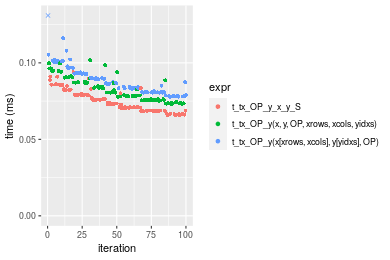
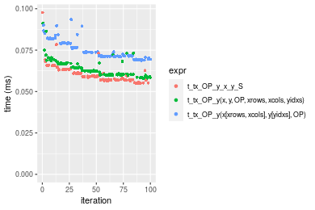
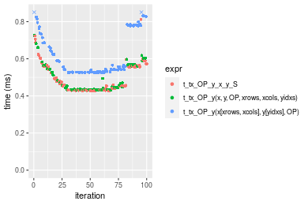

[matrixStats]: Benchmark report

---------------------------------------


# t_tx_OP_y() benchmarks on subsetted computation

This report benchmark the performance of t_tx_OP_y() on subsetted computation.


## Data type "integer"
### Data
```r
> rmatrix <- function(nrow, ncol, mode = c("logical", "double", "integer", "index"), range = c(-100, 
+     +100), na_prob = 0) {
+     mode <- match.arg(mode)
+     n <- nrow * ncol
+     if (mode == "logical") {
+         x <- sample(c(FALSE, TRUE), size = n, replace = TRUE)
+     }     else if (mode == "index") {
+         x <- seq_len(n)
+         mode <- "integer"
+     }     else {
+         x <- runif(n, min = range[1], max = range[2])
+     }
+     storage.mode(x) <- mode
+     if (na_prob > 0) 
+         x[sample(n, size = na_prob * n)] <- NA
+     dim(x) <- c(nrow, ncol)
+     x
+ }
> rmatrices <- function(scale = 10, seed = 1, ...) {
+     set.seed(seed)
+     data <- list()
+     data[[1]] <- rmatrix(nrow = scale * 1, ncol = scale * 1, ...)
+     data[[2]] <- rmatrix(nrow = scale * 10, ncol = scale * 10, ...)
+     data[[3]] <- rmatrix(nrow = scale * 100, ncol = scale * 1, ...)
+     data[[4]] <- t(data[[3]])
+     data[[5]] <- rmatrix(nrow = scale * 10, ncol = scale * 100, ...)
+     data[[6]] <- t(data[[5]])
+     names(data) <- sapply(data, FUN = function(x) paste(dim(x), collapse = "x"))
+     data
+ }
> data <- rmatrices(mode = mode)
```

### Results

### 10x10 vector


```r
> x <- data[["10x10"]]
> y <- x[, 1L]
> xrows <- sample.int(nrow(x), size = nrow(x) * 0.7)
> xcols <- sample.int(ncol(x), size = ncol(x) * 0.7)
> x_S <- x[xrows, xcols]
> yidxs <- xrows
> y_S <- y[yidxs]
```

```r
> OP
[1] "+"
> stats <- microbenchmark(t_tx_OP_y_x_y_S = t_tx_OP_y(x_S, y_S, OP = OP, na.rm = FALSE), `t_tx_OP_y(x, y, OP, xrows, xcols, yidxs)` = t_tx_OP_y(x, 
+     y, OP = OP, xrows = xrows, xcols = xcols, yidxs = yidxs, na.rm = FALSE), `t_tx_OP_y(x[xrows, xcols], y[yidxs], OP)` = t_tx_OP_y(x[xrows, 
+     xcols], y[yidxs], OP = OP, na.rm = FALSE), unit = "ms")
```

_Table: Benchmarking of t_tx_OP_y_x_y_S(), t_tx_OP_y(x, y, OP, xrows, xcols, yidxs)() and t_tx_OP_y(x[xrows, xcols], y[yidxs], OP)() on integer+10x10+add data. The top panel shows times in milliseconds and the bottom panel shows relative times._


|   |expr                                     |      min|        lq|      mean|    median|        uq|      max|
|:--|:----------------------------------------|--------:|---------:|---------:|---------:|---------:|--------:|
|1  |t_tx_OP_y_x_y_S                          | 0.004911| 0.0050985| 0.0055016| 0.0051885| 0.0053305| 0.026423|
|2  |t_tx_OP_y(x, y, OP, xrows, xcols, yidxs) | 0.005297| 0.0057365| 0.0059157| 0.0058325| 0.0059625| 0.009027|
|3  |t_tx_OP_y(x[xrows, xcols], y[yidxs], OP) | 0.006264| 0.0065995| 0.0068525| 0.0067905| 0.0069620| 0.012410|


|   |expr                                     |      min|       lq|     mean|   median|       uq|       max|
|:--|:----------------------------------------|--------:|--------:|--------:|--------:|--------:|---------:|
|1  |t_tx_OP_y_x_y_S                          | 1.000000| 1.000000| 1.000000| 1.000000| 1.000000| 1.0000000|
|2  |t_tx_OP_y(x, y, OP, xrows, xcols, yidxs) | 1.078599| 1.125135| 1.075268| 1.124121| 1.118563| 0.3416342|
|3  |t_tx_OP_y(x[xrows, xcols], y[yidxs], OP) | 1.275504| 1.294400| 1.245553| 1.308760| 1.306069| 0.4696666|

_Figure: Benchmarking of t_tx_OP_y_x_y_S(), t_tx_OP_y(x, y, OP, xrows, xcols, yidxs)() and t_tx_OP_y(x[xrows, xcols], y[yidxs], OP)() on integer+10x10+add data.  Outliers are displayed as crosses.  Times are in milliseconds._


```r
> OP
[1] "-"
> stats <- microbenchmark(t_tx_OP_y_x_y_S = t_tx_OP_y(x_S, y_S, OP = OP, na.rm = FALSE), `t_tx_OP_y(x, y, OP, xrows, xcols, yidxs)` = t_tx_OP_y(x, 
+     y, OP = OP, xrows = xrows, xcols = xcols, yidxs = yidxs, na.rm = FALSE), `t_tx_OP_y(x[xrows, xcols], y[yidxs], OP)` = t_tx_OP_y(x[xrows, 
+     xcols], y[yidxs], OP = OP, na.rm = FALSE), unit = "ms")
```

_Table: Benchmarking of t_tx_OP_y_x_y_S(), t_tx_OP_y(x, y, OP, xrows, xcols, yidxs)() and t_tx_OP_y(x[xrows, xcols], y[yidxs], OP)() on integer+10x10+sub data. The top panel shows times in milliseconds and the bottom panel shows relative times._


|   |expr                                     |      min|        lq|      mean|    median|        uq|      max|
|:--|:----------------------------------------|--------:|---------:|---------:|---------:|---------:|--------:|
|1  |t_tx_OP_y_x_y_S                          | 0.004673| 0.0050795| 0.0052498| 0.0052025| 0.0053160| 0.008081|
|2  |t_tx_OP_y(x, y, OP, xrows, xcols, yidxs) | 0.005412| 0.0057245| 0.0061555| 0.0058830| 0.0060565| 0.028287|
|3  |t_tx_OP_y(x[xrows, xcols], y[yidxs], OP) | 0.006196| 0.0066440| 0.0069132| 0.0067975| 0.0069710| 0.013067|


|   |expr                                     |      min|       lq|     mean|   median|       uq|      max|
|:--|:----------------------------------------|--------:|--------:|--------:|--------:|--------:|--------:|
|1  |t_tx_OP_y_x_y_S                          | 1.000000| 1.000000| 1.000000| 1.000000| 1.000000| 1.000000|
|2  |t_tx_OP_y(x, y, OP, xrows, xcols, yidxs) | 1.158143| 1.126981| 1.172516| 1.130802| 1.139296| 3.500433|
|3  |t_tx_OP_y(x[xrows, xcols], y[yidxs], OP) | 1.325915| 1.308003| 1.316862| 1.306583| 1.311324| 1.617003|

_Figure: Benchmarking of t_tx_OP_y_x_y_S(), t_tx_OP_y(x, y, OP, xrows, xcols, yidxs)() and t_tx_OP_y(x[xrows, xcols], y[yidxs], OP)() on integer+10x10+sub data.  Outliers are displayed as crosses.  Times are in milliseconds._


```r
> OP
[1] "*"
> stats <- microbenchmark(t_tx_OP_y_x_y_S = t_tx_OP_y(x_S, y_S, OP = OP, na.rm = FALSE), `t_tx_OP_y(x, y, OP, xrows, xcols, yidxs)` = t_tx_OP_y(x, 
+     y, OP = OP, xrows = xrows, xcols = xcols, yidxs = yidxs, na.rm = FALSE), `t_tx_OP_y(x[xrows, xcols], y[yidxs], OP)` = t_tx_OP_y(x[xrows, 
+     xcols], y[yidxs], OP = OP, na.rm = FALSE), unit = "ms")
```

_Table: Benchmarking of t_tx_OP_y_x_y_S(), t_tx_OP_y(x, y, OP, xrows, xcols, yidxs)() and t_tx_OP_y(x[xrows, xcols], y[yidxs], OP)() on integer+10x10+mul data. The top panel shows times in milliseconds and the bottom panel shows relative times._


|   |expr                                     |      min|        lq|      mean|    median|        uq|      max|
|:--|:----------------------------------------|--------:|---------:|---------:|---------:|---------:|--------:|
|1  |t_tx_OP_y_x_y_S                          | 0.004727| 0.0050210| 0.0051736| 0.0051425| 0.0052750| 0.006399|
|2  |t_tx_OP_y(x, y, OP, xrows, xcols, yidxs) | 0.005543| 0.0057435| 0.0059575| 0.0059220| 0.0060470| 0.010388|
|3  |t_tx_OP_y(x[xrows, xcols], y[yidxs], OP) | 0.006016| 0.0066240| 0.0070265| 0.0067420| 0.0068625| 0.031735|


|   |expr                                     |      min|       lq|     mean|   median|       uq|      max|
|:--|:----------------------------------------|--------:|--------:|--------:|--------:|--------:|--------:|
|1  |t_tx_OP_y_x_y_S                          | 1.000000| 1.000000| 1.000000| 1.000000| 1.000000| 1.000000|
|2  |t_tx_OP_y(x, y, OP, xrows, xcols, yidxs) | 1.172625| 1.143896| 1.151512| 1.151580| 1.146351| 1.623379|
|3  |t_tx_OP_y(x[xrows, xcols], y[yidxs], OP) | 1.272689| 1.319259| 1.358127| 1.311036| 1.300948| 4.959369|

_Figure: Benchmarking of t_tx_OP_y_x_y_S(), t_tx_OP_y(x, y, OP, xrows, xcols, yidxs)() and t_tx_OP_y(x[xrows, xcols], y[yidxs], OP)() on integer+10x10+mul data.  Outliers are displayed as crosses.  Times are in milliseconds._


```r
> OP
[1] "/"
> stats <- microbenchmark(t_tx_OP_y_x_y_S = t_tx_OP_y(x_S, y_S, OP = OP, na.rm = FALSE), `t_tx_OP_y(x, y, OP, xrows, xcols, yidxs)` = t_tx_OP_y(x, 
+     y, OP = OP, xrows = xrows, xcols = xcols, yidxs = yidxs, na.rm = FALSE), `t_tx_OP_y(x[xrows, xcols], y[yidxs], OP)` = t_tx_OP_y(x[xrows, 
+     xcols], y[yidxs], OP = OP, na.rm = FALSE), unit = "ms")
```

_Table: Benchmarking of t_tx_OP_y_x_y_S(), t_tx_OP_y(x, y, OP, xrows, xcols, yidxs)() and t_tx_OP_y(x[xrows, xcols], y[yidxs], OP)() on integer+10x10+div data. The top panel shows times in milliseconds and the bottom panel shows relative times._


|   |expr                                     |      min|        lq|      mean|    median|        uq|      max|
|:--|:----------------------------------------|--------:|---------:|---------:|---------:|---------:|--------:|
|1  |t_tx_OP_y_x_y_S                          | 0.004611| 0.0049545| 0.0053978| 0.0050680| 0.0052920| 0.030359|
|2  |t_tx_OP_y(x, y, OP, xrows, xcols, yidxs) | 0.005264| 0.0055990| 0.0058055| 0.0057405| 0.0058605| 0.011721|
|3  |t_tx_OP_y(x[xrows, xcols], y[yidxs], OP) | 0.005947| 0.0064740| 0.0069209| 0.0066915| 0.0068835| 0.021673|


|   |expr                                     |      min|       lq|     mean|   median|       uq|       max|
|:--|:----------------------------------------|--------:|--------:|--------:|--------:|--------:|---------:|
|1  |t_tx_OP_y_x_y_S                          | 1.000000| 1.000000| 1.000000| 1.000000| 1.000000| 1.0000000|
|2  |t_tx_OP_y(x, y, OP, xrows, xcols, yidxs) | 1.141618| 1.130084| 1.075538| 1.132695| 1.107426| 0.3860799|
|3  |t_tx_OP_y(x[xrows, xcols], y[yidxs], OP) | 1.289742| 1.306691| 1.282178| 1.320343| 1.300737| 0.7138904|

_Figure: Benchmarking of t_tx_OP_y_x_y_S(), t_tx_OP_y(x, y, OP, xrows, xcols, yidxs)() and t_tx_OP_y(x[xrows, xcols], y[yidxs], OP)() on integer+10x10+div data.  Outliers are displayed as crosses.  Times are in milliseconds._


### 100x100 vector


```r
> x <- data[["100x100"]]
> y <- x[, 1L]
> xrows <- sample.int(nrow(x), size = nrow(x) * 0.7)
> xcols <- sample.int(ncol(x), size = ncol(x) * 0.7)
> x_S <- x[xrows, xcols]
> yidxs <- xrows
> y_S <- y[yidxs]
```

```r
> OP
[1] "+"
> stats <- microbenchmark(t_tx_OP_y_x_y_S = t_tx_OP_y(x_S, y_S, OP = OP, na.rm = FALSE), `t_tx_OP_y(x, y, OP, xrows, xcols, yidxs)` = t_tx_OP_y(x, 
+     y, OP = OP, xrows = xrows, xcols = xcols, yidxs = yidxs, na.rm = FALSE), `t_tx_OP_y(x[xrows, xcols], y[yidxs], OP)` = t_tx_OP_y(x[xrows, 
+     xcols], y[yidxs], OP = OP, na.rm = FALSE), unit = "ms")
```

_Table: Benchmarking of t_tx_OP_y_x_y_S(), t_tx_OP_y(x, y, OP, xrows, xcols, yidxs)() and t_tx_OP_y(x[xrows, xcols], y[yidxs], OP)() on integer+100x100+add data. The top panel shows times in milliseconds and the bottom panel shows relative times._


|   |expr                                     |      min|        lq|      mean|   median|        uq|      max|
|:--|:----------------------------------------|--------:|---------:|---------:|--------:|---------:|--------:|
|1  |t_tx_OP_y_x_y_S                          | 0.064593| 0.0672770| 0.0928389| 0.080254| 0.1230620| 0.161883|
|2  |t_tx_OP_y(x, y, OP, xrows, xcols, yidxs) | 0.068202| 0.0709765| 0.0952899| 0.086948| 0.1121960| 0.167816|
|3  |t_tx_OP_y(x[xrows, xcols], y[yidxs], OP) | 0.074024| 0.0796075| 0.1088016| 0.093987| 0.1377695| 0.192671|


|   |expr                                     |      min|       lq|     mean|   median|       uq|      max|
|:--|:----------------------------------------|--------:|--------:|--------:|--------:|--------:|--------:|
|1  |t_tx_OP_y_x_y_S                          | 1.000000| 1.000000| 1.000000| 1.000000| 1.000000| 1.000000|
|2  |t_tx_OP_y(x, y, OP, xrows, xcols, yidxs) | 1.055873| 1.054989| 1.026401| 1.083410| 0.911703| 1.036650|
|3  |t_tx_OP_y(x[xrows, xcols], y[yidxs], OP) | 1.146006| 1.183280| 1.171940| 1.171119| 1.119513| 1.190187|

_Figure: Benchmarking of t_tx_OP_y_x_y_S(), t_tx_OP_y(x, y, OP, xrows, xcols, yidxs)() and t_tx_OP_y(x[xrows, xcols], y[yidxs], OP)() on integer+100x100+add data.  Outliers are displayed as crosses.  Times are in milliseconds._


```r
> OP
[1] "-"
> stats <- microbenchmark(t_tx_OP_y_x_y_S = t_tx_OP_y(x_S, y_S, OP = OP, na.rm = FALSE), `t_tx_OP_y(x, y, OP, xrows, xcols, yidxs)` = t_tx_OP_y(x, 
+     y, OP = OP, xrows = xrows, xcols = xcols, yidxs = yidxs, na.rm = FALSE), `t_tx_OP_y(x[xrows, xcols], y[yidxs], OP)` = t_tx_OP_y(x[xrows, 
+     xcols], y[yidxs], OP = OP, na.rm = FALSE), unit = "ms")
```

_Table: Benchmarking of t_tx_OP_y_x_y_S(), t_tx_OP_y(x, y, OP, xrows, xcols, yidxs)() and t_tx_OP_y(x[xrows, xcols], y[yidxs], OP)() on integer+100x100+sub data. The top panel shows times in milliseconds and the bottom panel shows relative times._


|   |expr                                     |      min|        lq|      mean|   median|        uq|      max|
|:--|:----------------------------------------|--------:|---------:|---------:|--------:|---------:|--------:|
|1  |t_tx_OP_y_x_y_S                          | 0.066553| 0.0693470| 0.0756728| 0.073852| 0.0817115| 0.102135|
|2  |t_tx_OP_y(x, y, OP, xrows, xcols, yidxs) | 0.072504| 0.0753545| 0.0815584| 0.080411| 0.0860155| 0.098465|
|3  |t_tx_OP_y(x[xrows, xcols], y[yidxs], OP) | 0.076475| 0.0796560| 0.0871711| 0.083049| 0.0926020| 0.149344|


|   |expr                                     |      min|       lq|     mean|   median|       uq|       max|
|:--|:----------------------------------------|--------:|--------:|--------:|--------:|--------:|---------:|
|1  |t_tx_OP_y_x_y_S                          | 1.000000| 1.000000| 1.000000| 1.000000| 1.000000| 1.0000000|
|2  |t_tx_OP_y(x, y, OP, xrows, xcols, yidxs) | 1.089417| 1.086630| 1.077778| 1.088813| 1.052673| 0.9640672|
|3  |t_tx_OP_y(x[xrows, xcols], y[yidxs], OP) | 1.149084| 1.148658| 1.151948| 1.124533| 1.133280| 1.4622216|

_Figure: Benchmarking of t_tx_OP_y_x_y_S(), t_tx_OP_y(x, y, OP, xrows, xcols, yidxs)() and t_tx_OP_y(x[xrows, xcols], y[yidxs], OP)() on integer+100x100+sub data.  Outliers are displayed as crosses.  Times are in milliseconds._


```r
> OP
[1] "*"
> stats <- microbenchmark(t_tx_OP_y_x_y_S = t_tx_OP_y(x_S, y_S, OP = OP, na.rm = FALSE), `t_tx_OP_y(x, y, OP, xrows, xcols, yidxs)` = t_tx_OP_y(x, 
+     y, OP = OP, xrows = xrows, xcols = xcols, yidxs = yidxs, na.rm = FALSE), `t_tx_OP_y(x[xrows, xcols], y[yidxs], OP)` = t_tx_OP_y(x[xrows, 
+     xcols], y[yidxs], OP = OP, na.rm = FALSE), unit = "ms")
```

_Table: Benchmarking of t_tx_OP_y_x_y_S(), t_tx_OP_y(x, y, OP, xrows, xcols, yidxs)() and t_tx_OP_y(x[xrows, xcols], y[yidxs], OP)() on integer+100x100+mul data. The top panel shows times in milliseconds and the bottom panel shows relative times._


|   |expr                                     |      min|        lq|      mean|    median|        uq|      max|
|:--|:----------------------------------------|--------:|---------:|---------:|---------:|---------:|--------:|
|1  |t_tx_OP_y_x_y_S                          | 0.062874| 0.0652740| 0.0712114| 0.0696615| 0.0749375| 0.121748|
|2  |t_tx_OP_y(x, y, OP, xrows, xcols, yidxs) | 0.071007| 0.0737555| 0.0805499| 0.0787715| 0.0852625| 0.105022|
|3  |t_tx_OP_y(x[xrows, xcols], y[yidxs], OP) | 0.072496| 0.0753425| 0.0834431| 0.0806135| 0.0900415| 0.125842|


|   |expr                                     |      min|       lq|     mean|   median|       uq|       max|
|:--|:----------------------------------------|--------:|--------:|--------:|--------:|--------:|---------:|
|1  |t_tx_OP_y_x_y_S                          | 1.000000| 1.000000| 1.000000| 1.000000| 1.000000| 1.0000000|
|2  |t_tx_OP_y(x, y, OP, xrows, xcols, yidxs) | 1.129354| 1.129937| 1.131138| 1.130775| 1.137782| 0.8626179|
|3  |t_tx_OP_y(x[xrows, xcols], y[yidxs], OP) | 1.153036| 1.154250| 1.171767| 1.157217| 1.201555| 1.0336268|

_Figure: Benchmarking of t_tx_OP_y_x_y_S(), t_tx_OP_y(x, y, OP, xrows, xcols, yidxs)() and t_tx_OP_y(x[xrows, xcols], y[yidxs], OP)() on integer+100x100+mul data.  Outliers are displayed as crosses.  Times are in milliseconds._


```r
> OP
[1] "/"
> stats <- microbenchmark(t_tx_OP_y_x_y_S = t_tx_OP_y(x_S, y_S, OP = OP, na.rm = FALSE), `t_tx_OP_y(x, y, OP, xrows, xcols, yidxs)` = t_tx_OP_y(x, 
+     y, OP = OP, xrows = xrows, xcols = xcols, yidxs = yidxs, na.rm = FALSE), `t_tx_OP_y(x[xrows, xcols], y[yidxs], OP)` = t_tx_OP_y(x[xrows, 
+     xcols], y[yidxs], OP = OP, na.rm = FALSE), unit = "ms")
```

_Table: Benchmarking of t_tx_OP_y_x_y_S(), t_tx_OP_y(x, y, OP, xrows, xcols, yidxs)() and t_tx_OP_y(x[xrows, xcols], y[yidxs], OP)() on integer+100x100+div data. The top panel shows times in milliseconds and the bottom panel shows relative times._


|   |expr                                     |      min|        lq|      mean|    median|       uq|      max|
|:--|:----------------------------------------|--------:|---------:|---------:|---------:|--------:|--------:|
|1  |t_tx_OP_y_x_y_S                          | 0.063890| 0.0659330| 0.0724290| 0.0706710| 0.078837| 0.087996|
|2  |t_tx_OP_y(x, y, OP, xrows, xcols, yidxs) | 0.066383| 0.0688025| 0.0750594| 0.0736895| 0.077353| 0.121443|
|3  |t_tx_OP_y(x[xrows, xcols], y[yidxs], OP) | 0.073415| 0.0784005| 0.0848675| 0.0844190| 0.090383| 0.115060|


|   |expr                                     |      min|       lq|     mean|   median|        uq|      max|
|:--|:----------------------------------------|--------:|--------:|--------:|--------:|---------:|--------:|
|1  |t_tx_OP_y_x_y_S                          | 1.000000| 1.000000| 1.000000| 1.000000| 1.0000000| 1.000000|
|2  |t_tx_OP_y(x, y, OP, xrows, xcols, yidxs) | 1.039020| 1.043521| 1.036317| 1.042712| 0.9811764| 1.380097|
|3  |t_tx_OP_y(x[xrows, xcols], y[yidxs], OP) | 1.149084| 1.189094| 1.171734| 1.194535| 1.1464541| 1.307559|

_Figure: Benchmarking of t_tx_OP_y_x_y_S(), t_tx_OP_y(x, y, OP, xrows, xcols, yidxs)() and t_tx_OP_y(x[xrows, xcols], y[yidxs], OP)() on integer+100x100+div data.  Outliers are displayed as crosses.  Times are in milliseconds._


### 1000x10 vector


```r
> x <- data[["1000x10"]]
> y <- x[, 1L]
> xrows <- sample.int(nrow(x), size = nrow(x) * 0.7)
> xcols <- sample.int(ncol(x), size = ncol(x) * 0.7)
> x_S <- x[xrows, xcols]
> yidxs <- xrows
> y_S <- y[yidxs]
```

```r
> OP
[1] "+"
> stats <- microbenchmark(t_tx_OP_y_x_y_S = t_tx_OP_y(x_S, y_S, OP = OP, na.rm = FALSE), `t_tx_OP_y(x, y, OP, xrows, xcols, yidxs)` = t_tx_OP_y(x, 
+     y, OP = OP, xrows = xrows, xcols = xcols, yidxs = yidxs, na.rm = FALSE), `t_tx_OP_y(x[xrows, xcols], y[yidxs], OP)` = t_tx_OP_y(x[xrows, 
+     xcols], y[yidxs], OP = OP, na.rm = FALSE), unit = "ms")
```

_Table: Benchmarking of t_tx_OP_y_x_y_S(), t_tx_OP_y(x, y, OP, xrows, xcols, yidxs)() and t_tx_OP_y(x[xrows, xcols], y[yidxs], OP)() on integer+1000x10+add data. The top panel shows times in milliseconds and the bottom panel shows relative times._


|   |expr                                     |      min|        lq|      mean|    median|        uq|      max|
|:--|:----------------------------------------|--------:|---------:|---------:|---------:|---------:|--------:|
|1  |t_tx_OP_y_x_y_S                          | 0.065952| 0.0696065| 0.0750269| 0.0733355| 0.0791815| 0.093884|
|2  |t_tx_OP_y(x, y, OP, xrows, xcols, yidxs) | 0.072891| 0.0756950| 0.0818737| 0.0785425| 0.0872430| 0.101691|
|3  |t_tx_OP_y(x[xrows, xcols], y[yidxs], OP) | 0.077885| 0.0808910| 0.0887842| 0.0865455| 0.0933175| 0.146272|


|   |expr                                     |      min|       lq|     mean|   median|       uq|      max|
|:--|:----------------------------------------|--------:|--------:|--------:|--------:|--------:|--------:|
|1  |t_tx_OP_y_x_y_S                          | 1.000000| 1.000000| 1.000000| 1.000000| 1.000000| 1.000000|
|2  |t_tx_OP_y(x, y, OP, xrows, xcols, yidxs) | 1.105213| 1.087470| 1.091258| 1.071002| 1.101810| 1.083156|
|3  |t_tx_OP_y(x[xrows, xcols], y[yidxs], OP) | 1.180935| 1.162119| 1.183366| 1.180131| 1.178527| 1.558008|

_Figure: Benchmarking of t_tx_OP_y_x_y_S(), t_tx_OP_y(x, y, OP, xrows, xcols, yidxs)() and t_tx_OP_y(x[xrows, xcols], y[yidxs], OP)() on integer+1000x10+add data.  Outliers are displayed as crosses.  Times are in milliseconds._



```r
> OP
[1] "-"
> stats <- microbenchmark(t_tx_OP_y_x_y_S = t_tx_OP_y(x_S, y_S, OP = OP, na.rm = FALSE), `t_tx_OP_y(x, y, OP, xrows, xcols, yidxs)` = t_tx_OP_y(x, 
+     y, OP = OP, xrows = xrows, xcols = xcols, yidxs = yidxs, na.rm = FALSE), `t_tx_OP_y(x[xrows, xcols], y[yidxs], OP)` = t_tx_OP_y(x[xrows, 
+     xcols], y[yidxs], OP = OP, na.rm = FALSE), unit = "ms")
```

_Table: Benchmarking of t_tx_OP_y_x_y_S(), t_tx_OP_y(x, y, OP, xrows, xcols, yidxs)() and t_tx_OP_y(x[xrows, xcols], y[yidxs], OP)() on integer+1000x10+sub data. The top panel shows times in milliseconds and the bottom panel shows relative times._


|   |expr                                     |      min|        lq|      mean|    median|        uq|      max|
|:--|:----------------------------------------|--------:|---------:|---------:|---------:|---------:|--------:|
|1  |t_tx_OP_y_x_y_S                          | 0.065977| 0.0682300| 0.0723349| 0.0707075| 0.0764955| 0.094287|
|2  |t_tx_OP_y(x, y, OP, xrows, xcols, yidxs) | 0.074584| 0.0766845| 0.0820846| 0.0797810| 0.0872845| 0.109148|
|3  |t_tx_OP_y(x[xrows, xcols], y[yidxs], OP) | 0.077819| 0.0788985| 0.0872126| 0.0835920| 0.0930130| 0.144983|


|   |expr                                     |      min|       lq|     mean|   median|       uq|      max|
|:--|:----------------------------------------|--------:|--------:|--------:|--------:|--------:|--------:|
|1  |t_tx_OP_y_x_y_S                          | 1.000000| 1.000000| 1.000000| 1.000000| 1.000000| 1.000000|
|2  |t_tx_OP_y(x, y, OP, xrows, xcols, yidxs) | 1.130455| 1.123912| 1.134786| 1.128324| 1.141041| 1.157614|
|3  |t_tx_OP_y(x[xrows, xcols], y[yidxs], OP) | 1.179487| 1.156361| 1.205677| 1.182222| 1.215928| 1.537678|

_Figure: Benchmarking of t_tx_OP_y_x_y_S(), t_tx_OP_y(x, y, OP, xrows, xcols, yidxs)() and t_tx_OP_y(x[xrows, xcols], y[yidxs], OP)() on integer+1000x10+sub data.  Outliers are displayed as crosses.  Times are in milliseconds._


```r
> OP
[1] "*"
> stats <- microbenchmark(t_tx_OP_y_x_y_S = t_tx_OP_y(x_S, y_S, OP = OP, na.rm = FALSE), `t_tx_OP_y(x, y, OP, xrows, xcols, yidxs)` = t_tx_OP_y(x, 
+     y, OP = OP, xrows = xrows, xcols = xcols, yidxs = yidxs, na.rm = FALSE), `t_tx_OP_y(x[xrows, xcols], y[yidxs], OP)` = t_tx_OP_y(x[xrows, 
+     xcols], y[yidxs], OP = OP, na.rm = FALSE), unit = "ms")
```

_Table: Benchmarking of t_tx_OP_y_x_y_S(), t_tx_OP_y(x, y, OP, xrows, xcols, yidxs)() and t_tx_OP_y(x[xrows, xcols], y[yidxs], OP)() on integer+1000x10+mul data. The top panel shows times in milliseconds and the bottom panel shows relative times._


|   |expr                                     |      min|        lq|      mean|    median|        uq|      max|
|:--|:----------------------------------------|--------:|---------:|---------:|---------:|---------:|--------:|
|1  |t_tx_OP_y_x_y_S                          | 0.061858| 0.0641300| 0.0676006| 0.0660810| 0.0703540| 0.085892|
|2  |t_tx_OP_y(x, y, OP, xrows, xcols, yidxs) | 0.073481| 0.0759535| 0.0817002| 0.0787340| 0.0875095| 0.100838|
|3  |t_tx_OP_y(x[xrows, xcols], y[yidxs], OP) | 0.073625| 0.0766810| 0.0856706| 0.0847605| 0.0918315| 0.140010|


|   |expr                                     |      min|       lq|     mean|   median|       uq|      max|
|:--|:----------------------------------------|--------:|--------:|--------:|--------:|--------:|--------:|
|1  |t_tx_OP_y_x_y_S                          | 1.000000| 1.000000| 1.000000| 1.000000| 1.000000| 1.000000|
|2  |t_tx_OP_y(x, y, OP, xrows, xcols, yidxs) | 1.187898| 1.184368| 1.208573| 1.191477| 1.243845| 1.174009|
|3  |t_tx_OP_y(x[xrows, xcols], y[yidxs], OP) | 1.190226| 1.195712| 1.267305| 1.282676| 1.305278| 1.630070|

_Figure: Benchmarking of t_tx_OP_y_x_y_S(), t_tx_OP_y(x, y, OP, xrows, xcols, yidxs)() and t_tx_OP_y(x[xrows, xcols], y[yidxs], OP)() on integer+1000x10+mul data.  Outliers are displayed as crosses.  Times are in milliseconds._


```r
> OP
[1] "/"
> stats <- microbenchmark(t_tx_OP_y_x_y_S = t_tx_OP_y(x_S, y_S, OP = OP, na.rm = FALSE), `t_tx_OP_y(x, y, OP, xrows, xcols, yidxs)` = t_tx_OP_y(x, 
+     y, OP = OP, xrows = xrows, xcols = xcols, yidxs = yidxs, na.rm = FALSE), `t_tx_OP_y(x[xrows, xcols], y[yidxs], OP)` = t_tx_OP_y(x[xrows, 
+     xcols], y[yidxs], OP = OP, na.rm = FALSE), unit = "ms")
```

_Table: Benchmarking of t_tx_OP_y_x_y_S(), t_tx_OP_y(x, y, OP, xrows, xcols, yidxs)() and t_tx_OP_y(x[xrows, xcols], y[yidxs], OP)() on integer+1000x10+div data. The top panel shows times in milliseconds and the bottom panel shows relative times._


|   |expr                                     |      min|        lq|      mean|    median|        uq|      max|
|:--|:----------------------------------------|--------:|---------:|---------:|---------:|---------:|--------:|
|1  |t_tx_OP_y_x_y_S                          | 0.062717| 0.0649745| 0.0704394| 0.0687505| 0.0751670| 0.083077|
|2  |t_tx_OP_y(x, y, OP, xrows, xcols, yidxs) | 0.068456| 0.0711720| 0.0776250| 0.0759825| 0.0817425| 0.122196|
|3  |t_tx_OP_y(x[xrows, xcols], y[yidxs], OP) | 0.074890| 0.0781185| 0.0863774| 0.0859270| 0.0929615| 0.115390|


|   |expr                                     |      min|       lq|     mean|   median|       uq|      max|
|:--|:----------------------------------------|--------:|--------:|--------:|--------:|--------:|--------:|
|1  |t_tx_OP_y_x_y_S                          | 1.000000| 1.000000| 1.000000| 1.000000| 1.000000| 1.000000|
|2  |t_tx_OP_y(x, y, OP, xrows, xcols, yidxs) | 1.091506| 1.095384| 1.102012| 1.105192| 1.087479| 1.470876|
|3  |t_tx_OP_y(x[xrows, xcols], y[yidxs], OP) | 1.194094| 1.202295| 1.226265| 1.249838| 1.236733| 1.388952|

_Figure: Benchmarking of t_tx_OP_y_x_y_S(), t_tx_OP_y(x, y, OP, xrows, xcols, yidxs)() and t_tx_OP_y(x[xrows, xcols], y[yidxs], OP)() on integer+1000x10+div data.  Outliers are displayed as crosses.  Times are in milliseconds._


### 10x1000 vector


```r
> x <- data[["10x1000"]]
> y <- x[, 1L]
> xrows <- sample.int(nrow(x), size = nrow(x) * 0.7)
> xcols <- sample.int(ncol(x), size = ncol(x) * 0.7)
> x_S <- x[xrows, xcols]
> yidxs <- xrows
> y_S <- y[yidxs]
```

```r
> OP
[1] "+"
> stats <- microbenchmark(t_tx_OP_y_x_y_S = t_tx_OP_y(x_S, y_S, OP = OP, na.rm = FALSE), `t_tx_OP_y(x, y, OP, xrows, xcols, yidxs)` = t_tx_OP_y(x, 
+     y, OP = OP, xrows = xrows, xcols = xcols, yidxs = yidxs, na.rm = FALSE), `t_tx_OP_y(x[xrows, xcols], y[yidxs], OP)` = t_tx_OP_y(x[xrows, 
+     xcols], y[yidxs], OP = OP, na.rm = FALSE), unit = "ms")
```

_Table: Benchmarking of t_tx_OP_y_x_y_S(), t_tx_OP_y(x, y, OP, xrows, xcols, yidxs)() and t_tx_OP_y(x[xrows, xcols], y[yidxs], OP)() on integer+10x1000+add data. The top panel shows times in milliseconds and the bottom panel shows relative times._


|   |expr                                     |      min|        lq|      mean|    median|        uq|      max|
|:--|:----------------------------------------|--------:|---------:|---------:|---------:|---------:|--------:|
|1  |t_tx_OP_y_x_y_S                          | 0.068445| 0.0711530| 0.0801386| 0.0766695| 0.0853285| 0.124725|
|2  |t_tx_OP_y(x, y, OP, xrows, xcols, yidxs) | 0.072365| 0.0750910| 0.0828734| 0.0781330| 0.0859925| 0.141465|
|3  |t_tx_OP_y(x[xrows, xcols], y[yidxs], OP) | 0.080201| 0.0832605| 0.0932571| 0.0861905| 0.0976950| 0.184607|


|   |expr                                     |      min|       lq|     mean|   median|       uq|      max|
|:--|:----------------------------------------|--------:|--------:|--------:|--------:|--------:|--------:|
|1  |t_tx_OP_y_x_y_S                          | 1.000000| 1.000000| 1.000000| 1.000000| 1.000000| 1.000000|
|2  |t_tx_OP_y(x, y, OP, xrows, xcols, yidxs) | 1.057272| 1.055346| 1.034126| 1.019088| 1.007782| 1.134215|
|3  |t_tx_OP_y(x[xrows, xcols], y[yidxs], OP) | 1.171758| 1.170162| 1.163699| 1.124182| 1.144928| 1.480112|

_Figure: Benchmarking of t_tx_OP_y_x_y_S(), t_tx_OP_y(x, y, OP, xrows, xcols, yidxs)() and t_tx_OP_y(x[xrows, xcols], y[yidxs], OP)() on integer+10x1000+add data.  Outliers are displayed as crosses.  Times are in milliseconds._


```r
> OP
[1] "-"
> stats <- microbenchmark(t_tx_OP_y_x_y_S = t_tx_OP_y(x_S, y_S, OP = OP, na.rm = FALSE), `t_tx_OP_y(x, y, OP, xrows, xcols, yidxs)` = t_tx_OP_y(x, 
+     y, OP = OP, xrows = xrows, xcols = xcols, yidxs = yidxs, na.rm = FALSE), `t_tx_OP_y(x[xrows, xcols], y[yidxs], OP)` = t_tx_OP_y(x[xrows, 
+     xcols], y[yidxs], OP = OP, na.rm = FALSE), unit = "ms")
```

_Table: Benchmarking of t_tx_OP_y_x_y_S(), t_tx_OP_y(x, y, OP, xrows, xcols, yidxs)() and t_tx_OP_y(x[xrows, xcols], y[yidxs], OP)() on integer+10x1000+sub data. The top panel shows times in milliseconds and the bottom panel shows relative times._


|   |expr                                     |      min|        lq|      mean|    median|        uq|      max|
|:--|:----------------------------------------|--------:|---------:|---------:|---------:|---------:|--------:|
|1  |t_tx_OP_y_x_y_S                          | 0.068305| 0.0710655| 0.0772954| 0.0756245| 0.0820210| 0.124076|
|2  |t_tx_OP_y(x, y, OP, xrows, xcols, yidxs) | 0.073972| 0.0769620| 0.0846702| 0.0825190| 0.0918890| 0.114923|
|3  |t_tx_OP_y(x[xrows, xcols], y[yidxs], OP) | 0.080050| 0.0819040| 0.0886485| 0.0860100| 0.0925465| 0.109364|


|   |expr                                     |      min|       lq|     mean|   median|       uq|       max|
|:--|:----------------------------------------|--------:|--------:|--------:|--------:|--------:|---------:|
|1  |t_tx_OP_y_x_y_S                          | 1.000000| 1.000000| 1.000000| 1.000000| 1.000000| 1.0000000|
|2  |t_tx_OP_y(x, y, OP, xrows, xcols, yidxs) | 1.082966| 1.082973| 1.095411| 1.091168| 1.120311| 0.9262307|
|3  |t_tx_OP_y(x[xrows, xcols], y[yidxs], OP) | 1.171949| 1.152514| 1.146879| 1.137330| 1.128327| 0.8814275|

_Figure: Benchmarking of t_tx_OP_y_x_y_S(), t_tx_OP_y(x, y, OP, xrows, xcols, yidxs)() and t_tx_OP_y(x[xrows, xcols], y[yidxs], OP)() on integer+10x1000+sub data.  Outliers are displayed as crosses.  Times are in milliseconds._


```r
> OP
[1] "*"
> stats <- microbenchmark(t_tx_OP_y_x_y_S = t_tx_OP_y(x_S, y_S, OP = OP, na.rm = FALSE), `t_tx_OP_y(x, y, OP, xrows, xcols, yidxs)` = t_tx_OP_y(x, 
+     y, OP = OP, xrows = xrows, xcols = xcols, yidxs = yidxs, na.rm = FALSE), `t_tx_OP_y(x[xrows, xcols], y[yidxs], OP)` = t_tx_OP_y(x[xrows, 
+     xcols], y[yidxs], OP = OP, na.rm = FALSE), unit = "ms")
```

_Table: Benchmarking of t_tx_OP_y_x_y_S(), t_tx_OP_y(x, y, OP, xrows, xcols, yidxs)() and t_tx_OP_y(x[xrows, xcols], y[yidxs], OP)() on integer+10x1000+mul data. The top panel shows times in milliseconds and the bottom panel shows relative times._


|   |expr                                     |      min|        lq|      mean|    median|        uq|      max|
|:--|:----------------------------------------|--------:|---------:|---------:|---------:|---------:|--------:|
|1  |t_tx_OP_y_x_y_S                          | 0.063874| 0.0661695| 0.0715888| 0.0686210| 0.0761780| 0.119731|
|2  |t_tx_OP_y(x, y, OP, xrows, xcols, yidxs) | 0.073419| 0.0764050| 0.0836234| 0.0820185| 0.0911090| 0.105865|
|3  |t_tx_OP_y(x[xrows, xcols], y[yidxs], OP) | 0.075606| 0.0784655| 0.0852512| 0.0839455| 0.0904535| 0.112838|


|   |expr                                     |      min|       lq|     mean|   median|       uq|       max|
|:--|:----------------------------------------|--------:|--------:|--------:|--------:|--------:|---------:|
|1  |t_tx_OP_y_x_y_S                          | 1.000000| 1.000000| 1.000000| 1.000000| 1.000000| 1.0000000|
|2  |t_tx_OP_y(x, y, OP, xrows, xcols, yidxs) | 1.149435| 1.154686| 1.168106| 1.195239| 1.196001| 0.8841904|
|3  |t_tx_OP_y(x[xrows, xcols], y[yidxs], OP) | 1.183674| 1.185826| 1.190845| 1.223321| 1.187397| 0.9424293|

_Figure: Benchmarking of t_tx_OP_y_x_y_S(), t_tx_OP_y(x, y, OP, xrows, xcols, yidxs)() and t_tx_OP_y(x[xrows, xcols], y[yidxs], OP)() on integer+10x1000+mul data.  Outliers are displayed as crosses.  Times are in milliseconds._


```r
> OP
[1] "/"
> stats <- microbenchmark(t_tx_OP_y_x_y_S = t_tx_OP_y(x_S, y_S, OP = OP, na.rm = FALSE), `t_tx_OP_y(x, y, OP, xrows, xcols, yidxs)` = t_tx_OP_y(x, 
+     y, OP = OP, xrows = xrows, xcols = xcols, yidxs = yidxs, na.rm = FALSE), `t_tx_OP_y(x[xrows, xcols], y[yidxs], OP)` = t_tx_OP_y(x[xrows, 
+     xcols], y[yidxs], OP = OP, na.rm = FALSE), unit = "ms")
```

_Table: Benchmarking of t_tx_OP_y_x_y_S(), t_tx_OP_y(x, y, OP, xrows, xcols, yidxs)() and t_tx_OP_y(x[xrows, xcols], y[yidxs], OP)() on integer+10x1000+div data. The top panel shows times in milliseconds and the bottom panel shows relative times._


|   |expr                                     |      min|        lq|      mean|   median|        uq|      max|
|:--|:----------------------------------------|--------:|---------:|---------:|--------:|---------:|--------:|
|1  |t_tx_OP_y_x_y_S                          | 0.065694| 0.0682945| 0.0731324| 0.072895| 0.0763015| 0.087690|
|2  |t_tx_OP_y(x, y, OP, xrows, xcols, yidxs) | 0.070197| 0.0731945| 0.0792346| 0.078157| 0.0840675| 0.105716|
|3  |t_tx_OP_y(x[xrows, xcols], y[yidxs], OP) | 0.077775| 0.0804720| 0.0882756| 0.086222| 0.0955190| 0.153314|


|   |expr                                     |      min|       lq|     mean|   median|       uq|      max|
|:--|:----------------------------------------|--------:|--------:|--------:|--------:|--------:|--------:|
|1  |t_tx_OP_y_x_y_S                          | 1.000000| 1.000000| 1.000000| 1.000000| 1.000000| 1.000000|
|2  |t_tx_OP_y(x, y, OP, xrows, xcols, yidxs) | 1.068545| 1.071748| 1.083440| 1.072186| 1.101780| 1.205565|
|3  |t_tx_OP_y(x[xrows, xcols], y[yidxs], OP) | 1.183898| 1.178309| 1.207065| 1.182825| 1.251863| 1.748364|

_Figure: Benchmarking of t_tx_OP_y_x_y_S(), t_tx_OP_y(x, y, OP, xrows, xcols, yidxs)() and t_tx_OP_y(x[xrows, xcols], y[yidxs], OP)() on integer+10x1000+div data.  Outliers are displayed as crosses.  Times are in milliseconds._


### 100x1000 vector


```r
> x <- data[["100x1000"]]
> y <- x[, 1L]
> xrows <- sample.int(nrow(x), size = nrow(x) * 0.7)
> xcols <- sample.int(ncol(x), size = ncol(x) * 0.7)
> x_S <- x[xrows, xcols]
> yidxs <- xrows
> y_S <- y[yidxs]
```

```r
> OP
[1] "+"
> stats <- microbenchmark(t_tx_OP_y_x_y_S = t_tx_OP_y(x_S, y_S, OP = OP, na.rm = FALSE), `t_tx_OP_y(x, y, OP, xrows, xcols, yidxs)` = t_tx_OP_y(x, 
+     y, OP = OP, xrows = xrows, xcols = xcols, yidxs = yidxs, na.rm = FALSE), `t_tx_OP_y(x[xrows, xcols], y[yidxs], OP)` = t_tx_OP_y(x[xrows, 
+     xcols], y[yidxs], OP = OP, na.rm = FALSE), unit = "ms")
```

_Table: Benchmarking of t_tx_OP_y_x_y_S(), t_tx_OP_y(x, y, OP, xrows, xcols, yidxs)() and t_tx_OP_y(x[xrows, xcols], y[yidxs], OP)() on integer+100x1000+add data. The top panel shows times in milliseconds and the bottom panel shows relative times._


|   |expr                                     |      min|        lq|      mean|    median|        uq|      max|
|:--|:----------------------------------------|--------:|---------:|---------:|---------:|---------:|--------:|
|1  |t_tx_OP_y_x_y_S                          | 0.502553| 0.5481970| 0.5795084| 0.5872245| 0.6019810| 0.734171|
|2  |t_tx_OP_y(x, y, OP, xrows, xcols, yidxs) | 0.520625| 0.5649410| 0.5955503| 0.6070515| 0.6216805| 0.763432|
|3  |t_tx_OP_y(x[xrows, xcols], y[yidxs], OP) | 0.570052| 0.6522005| 0.6973836| 0.7250875| 0.7334155| 0.956542|


|   |expr                                     |      min|       lq|     mean|   median|       uq|      max|
|:--|:----------------------------------------|--------:|--------:|--------:|--------:|--------:|--------:|
|1  |t_tx_OP_y_x_y_S                          | 1.000000| 1.000000| 1.000000| 1.000000| 1.000000| 1.000000|
|2  |t_tx_OP_y(x, y, OP, xrows, xcols, yidxs) | 1.035960| 1.030544| 1.027682| 1.033764| 1.032725| 1.039856|
|3  |t_tx_OP_y(x[xrows, xcols], y[yidxs], OP) | 1.134312| 1.189719| 1.203405| 1.234770| 1.218337| 1.302887|

_Figure: Benchmarking of t_tx_OP_y_x_y_S(), t_tx_OP_y(x, y, OP, xrows, xcols, yidxs)() and t_tx_OP_y(x[xrows, xcols], y[yidxs], OP)() on integer+100x1000+add data.  Outliers are displayed as crosses.  Times are in milliseconds._


```r
> OP
[1] "-"
> stats <- microbenchmark(t_tx_OP_y_x_y_S = t_tx_OP_y(x_S, y_S, OP = OP, na.rm = FALSE), `t_tx_OP_y(x, y, OP, xrows, xcols, yidxs)` = t_tx_OP_y(x, 
+     y, OP = OP, xrows = xrows, xcols = xcols, yidxs = yidxs, na.rm = FALSE), `t_tx_OP_y(x[xrows, xcols], y[yidxs], OP)` = t_tx_OP_y(x[xrows, 
+     xcols], y[yidxs], OP = OP, na.rm = FALSE), unit = "ms")
```

_Table: Benchmarking of t_tx_OP_y_x_y_S(), t_tx_OP_y(x, y, OP, xrows, xcols, yidxs)() and t_tx_OP_y(x[xrows, xcols], y[yidxs], OP)() on integer+100x1000+sub data. The top panel shows times in milliseconds and the bottom panel shows relative times._


|   |expr                                     |      min|        lq|      mean|    median|        uq|      max|
|:--|:----------------------------------------|--------:|---------:|---------:|---------:|---------:|--------:|
|1  |t_tx_OP_y_x_y_S                          | 0.502421| 0.5273565| 0.5540113| 0.5308925| 0.5528465| 0.828137|
|2  |t_tx_OP_y(x, y, OP, xrows, xcols, yidxs) | 0.531951| 0.5388495| 0.5799173| 0.5629075| 0.5805925| 0.802247|
|3  |t_tx_OP_y(x[xrows, xcols], y[yidxs], OP) | 0.569677| 0.5830425| 0.6258940| 0.6019585| 0.6189105| 1.035382|


|   |expr                                     |      min|       lq|     mean|   median|       uq|       max|
|:--|:----------------------------------------|--------:|--------:|--------:|--------:|--------:|---------:|
|1  |t_tx_OP_y_x_y_S                          | 1.000000| 1.000000| 1.000000| 1.000000| 1.000000| 1.0000000|
|2  |t_tx_OP_y(x, y, OP, xrows, xcols, yidxs) | 1.058775| 1.021794| 1.046761| 1.060304| 1.050188| 0.9687371|
|3  |t_tx_OP_y(x[xrows, xcols], y[yidxs], OP) | 1.133864| 1.105595| 1.129749| 1.133861| 1.119498| 1.2502545|

_Figure: Benchmarking of t_tx_OP_y_x_y_S(), t_tx_OP_y(x, y, OP, xrows, xcols, yidxs)() and t_tx_OP_y(x[xrows, xcols], y[yidxs], OP)() on integer+100x1000+sub data.  Outliers are displayed as crosses.  Times are in milliseconds._


```r
> OP
[1] "*"
> stats <- microbenchmark(t_tx_OP_y_x_y_S = t_tx_OP_y(x_S, y_S, OP = OP, na.rm = FALSE), `t_tx_OP_y(x, y, OP, xrows, xcols, yidxs)` = t_tx_OP_y(x, 
+     y, OP = OP, xrows = xrows, xcols = xcols, yidxs = yidxs, na.rm = FALSE), `t_tx_OP_y(x[xrows, xcols], y[yidxs], OP)` = t_tx_OP_y(x[xrows, 
+     xcols], y[yidxs], OP = OP, na.rm = FALSE), unit = "ms")
```

_Table: Benchmarking of t_tx_OP_y_x_y_S(), t_tx_OP_y(x, y, OP, xrows, xcols, yidxs)() and t_tx_OP_y(x[xrows, xcols], y[yidxs], OP)() on integer+100x1000+mul data. The top panel shows times in milliseconds and the bottom panel shows relative times._


|   |expr                                     |      min|        lq|      mean|    median|        uq|      max|
|:--|:----------------------------------------|--------:|---------:|---------:|---------:|---------:|--------:|
|1  |t_tx_OP_y_x_y_S                          | 0.470689| 0.4896950| 0.5173960| 0.4985005| 0.5246080| 0.794520|
|2  |t_tx_OP_y(x, y, OP, xrows, xcols, yidxs) | 0.525331| 0.5408170| 0.5878172| 0.5637245| 0.5928780| 0.929760|
|3  |t_tx_OP_y(x[xrows, xcols], y[yidxs], OP) | 0.537586| 0.5402145| 0.5865109| 0.5675465| 0.5846955| 0.869272|


|   |expr                                     |      min|       lq|     mean|   median|       uq|      max|
|:--|:----------------------------------------|--------:|--------:|--------:|--------:|--------:|--------:|
|1  |t_tx_OP_y_x_y_S                          | 1.000000| 1.000000| 1.000000| 1.000000| 1.000000| 1.000000|
|2  |t_tx_OP_y(x, y, OP, xrows, xcols, yidxs) | 1.116089| 1.104396| 1.136107| 1.130840| 1.130135| 1.170216|
|3  |t_tx_OP_y(x[xrows, xcols], y[yidxs], OP) | 1.142126| 1.103165| 1.133582| 1.138507| 1.114538| 1.094084|

_Figure: Benchmarking of t_tx_OP_y_x_y_S(), t_tx_OP_y(x, y, OP, xrows, xcols, yidxs)() and t_tx_OP_y(x[xrows, xcols], y[yidxs], OP)() on integer+100x1000+mul data.  Outliers are displayed as crosses.  Times are in milliseconds._


```r
> OP
[1] "/"
> stats <- microbenchmark(t_tx_OP_y_x_y_S = t_tx_OP_y(x_S, y_S, OP = OP, na.rm = FALSE), `t_tx_OP_y(x, y, OP, xrows, xcols, yidxs)` = t_tx_OP_y(x, 
+     y, OP = OP, xrows = xrows, xcols = xcols, yidxs = yidxs, na.rm = FALSE), `t_tx_OP_y(x[xrows, xcols], y[yidxs], OP)` = t_tx_OP_y(x[xrows, 
+     xcols], y[yidxs], OP = OP, na.rm = FALSE), unit = "ms")
```

_Table: Benchmarking of t_tx_OP_y_x_y_S(), t_tx_OP_y(x, y, OP, xrows, xcols, yidxs)() and t_tx_OP_y(x[xrows, xcols], y[yidxs], OP)() on integer+100x1000+div data. The top panel shows times in milliseconds and the bottom panel shows relative times._


|   |expr                                     |      min|        lq|      mean|    median|        uq|      max|
|:--|:----------------------------------------|--------:|---------:|---------:|---------:|---------:|--------:|
|2  |t_tx_OP_y(x, y, OP, xrows, xcols, yidxs) | 0.486663| 0.4892850| 0.6179594| 0.6162770| 0.6675785| 1.044738|
|1  |t_tx_OP_y_x_y_S                          | 0.474912| 0.4794250| 0.5975831| 0.6180765| 0.6436435| 1.036777|
|3  |t_tx_OP_y(x[xrows, xcols], y[yidxs], OP) | 0.542680| 0.5465945| 0.7154788| 0.7510140| 0.7981730| 1.219611|


|   |expr                                     |       min|        lq|      mean|   median|        uq|       max|
|:--|:----------------------------------------|---------:|---------:|---------:|--------:|---------:|---------:|
|2  |t_tx_OP_y(x, y, OP, xrows, xcols, yidxs) | 1.0000000| 1.0000000| 1.0000000| 1.000000| 1.0000000| 1.0000000|
|1  |t_tx_OP_y_x_y_S                          | 0.9758539| 0.9798481| 0.9670264| 1.002920| 0.9641465| 0.9923799|
|3  |t_tx_OP_y(x[xrows, xcols], y[yidxs], OP) | 1.1151043| 1.1171291| 1.1578086| 1.218631| 1.1956242| 1.1673846|

_Figure: Benchmarking of t_tx_OP_y_x_y_S(), t_tx_OP_y(x, y, OP, xrows, xcols, yidxs)() and t_tx_OP_y(x[xrows, xcols], y[yidxs], OP)() on integer+100x1000+div data.  Outliers are displayed as crosses.  Times are in milliseconds._


### 1000x100 vector


```r
> x <- data[["1000x100"]]
> y <- x[, 1L]
> xrows <- sample.int(nrow(x), size = nrow(x) * 0.7)
> xcols <- sample.int(ncol(x), size = ncol(x) * 0.7)
> x_S <- x[xrows, xcols]
> yidxs <- xrows
> y_S <- y[yidxs]
```

```r
> OP
[1] "+"
> stats <- microbenchmark(t_tx_OP_y_x_y_S = t_tx_OP_y(x_S, y_S, OP = OP, na.rm = FALSE), `t_tx_OP_y(x, y, OP, xrows, xcols, yidxs)` = t_tx_OP_y(x, 
+     y, OP = OP, xrows = xrows, xcols = xcols, yidxs = yidxs, na.rm = FALSE), `t_tx_OP_y(x[xrows, xcols], y[yidxs], OP)` = t_tx_OP_y(x[xrows, 
+     xcols], y[yidxs], OP = OP, na.rm = FALSE), unit = "ms")
```

_Table: Benchmarking of t_tx_OP_y_x_y_S(), t_tx_OP_y(x, y, OP, xrows, xcols, yidxs)() and t_tx_OP_y(x[xrows, xcols], y[yidxs], OP)() on integer+1000x100+add data. The top panel shows times in milliseconds and the bottom panel shows relative times._


|   |expr                                     |      min|        lq|      mean|    median|       uq|      max|
|:--|:----------------------------------------|--------:|---------:|---------:|---------:|--------:|--------:|
|1  |t_tx_OP_y_x_y_S                          | 0.496871| 0.5107015| 0.5504676| 0.5375150| 0.542363| 0.829805|
|2  |t_tx_OP_y(x, y, OP, xrows, xcols, yidxs) | 0.518045| 0.5361130| 0.5685213| 0.5594755| 0.566157| 0.816955|
|3  |t_tx_OP_y(x[xrows, xcols], y[yidxs], OP) | 0.562333| 0.5792775| 0.6259653| 0.6098635| 0.616763| 0.993108|


|   |expr                                     |      min|       lq|     mean|   median|       uq|       max|
|:--|:----------------------------------------|--------:|--------:|--------:|--------:|--------:|---------:|
|1  |t_tx_OP_y_x_y_S                          | 1.000000| 1.000000| 1.000000| 1.000000| 1.000000| 1.0000000|
|2  |t_tx_OP_y(x, y, OP, xrows, xcols, yidxs) | 1.042615| 1.049758| 1.032797| 1.040856| 1.043871| 0.9845144|
|3  |t_tx_OP_y(x[xrows, xcols], y[yidxs], OP) | 1.131749| 1.134278| 1.137152| 1.134598| 1.137177| 1.1967968|

_Figure: Benchmarking of t_tx_OP_y_x_y_S(), t_tx_OP_y(x, y, OP, xrows, xcols, yidxs)() and t_tx_OP_y(x[xrows, xcols], y[yidxs], OP)() on integer+1000x100+add data.  Outliers are displayed as crosses.  Times are in milliseconds._


```r
> OP
[1] "-"
> stats <- microbenchmark(t_tx_OP_y_x_y_S = t_tx_OP_y(x_S, y_S, OP = OP, na.rm = FALSE), `t_tx_OP_y(x, y, OP, xrows, xcols, yidxs)` = t_tx_OP_y(x, 
+     y, OP = OP, xrows = xrows, xcols = xcols, yidxs = yidxs, na.rm = FALSE), `t_tx_OP_y(x[xrows, xcols], y[yidxs], OP)` = t_tx_OP_y(x[xrows, 
+     xcols], y[yidxs], OP = OP, na.rm = FALSE), unit = "ms")
```

_Table: Benchmarking of t_tx_OP_y_x_y_S(), t_tx_OP_y(x, y, OP, xrows, xcols, yidxs)() and t_tx_OP_y(x[xrows, xcols], y[yidxs], OP)() on integer+1000x100+sub data. The top panel shows times in milliseconds and the bottom panel shows relative times._


|   |expr                                     |      min|        lq|      mean|    median|        uq|      max|
|:--|:----------------------------------------|--------:|---------:|---------:|---------:|---------:|--------:|
|1  |t_tx_OP_y_x_y_S                          | 0.497310| 0.5105515| 0.5518232| 0.5387120| 0.5450740| 0.873479|
|2  |t_tx_OP_y(x, y, OP, xrows, xcols, yidxs) | 0.526893| 0.5465015| 0.5812512| 0.5625190| 0.5797730| 0.940894|
|3  |t_tx_OP_y(x[xrows, xcols], y[yidxs], OP) | 0.563064| 0.5794595| 0.6197321| 0.5973305| 0.6115055| 0.945145|


|   |expr                                     |      min|       lq|     mean|   median|       uq|      max|
|:--|:----------------------------------------|--------:|--------:|--------:|--------:|--------:|--------:|
|1  |t_tx_OP_y_x_y_S                          | 1.000000| 1.000000| 1.000000| 1.000000| 1.000000| 1.000000|
|2  |t_tx_OP_y(x, y, OP, xrows, xcols, yidxs) | 1.059486| 1.070414| 1.053329| 1.044192| 1.063659| 1.077180|
|3  |t_tx_OP_y(x[xrows, xcols], y[yidxs], OP) | 1.132219| 1.134968| 1.123063| 1.108812| 1.121876| 1.082047|

_Figure: Benchmarking of t_tx_OP_y_x_y_S(), t_tx_OP_y(x, y, OP, xrows, xcols, yidxs)() and t_tx_OP_y(x[xrows, xcols], y[yidxs], OP)() on integer+1000x100+sub data.  Outliers are displayed as crosses.  Times are in milliseconds._


```r
> OP
[1] "*"
> stats <- microbenchmark(t_tx_OP_y_x_y_S = t_tx_OP_y(x_S, y_S, OP = OP, na.rm = FALSE), `t_tx_OP_y(x, y, OP, xrows, xcols, yidxs)` = t_tx_OP_y(x, 
+     y, OP = OP, xrows = xrows, xcols = xcols, yidxs = yidxs, na.rm = FALSE), `t_tx_OP_y(x[xrows, xcols], y[yidxs], OP)` = t_tx_OP_y(x[xrows, 
+     xcols], y[yidxs], OP = OP, na.rm = FALSE), unit = "ms")
```

_Table: Benchmarking of t_tx_OP_y_x_y_S(), t_tx_OP_y(x, y, OP, xrows, xcols, yidxs)() and t_tx_OP_y(x[xrows, xcols], y[yidxs], OP)() on integer+1000x100+mul data. The top panel shows times in milliseconds and the bottom panel shows relative times._


|   |expr                                     |      min|        lq|      mean|    median|       uq|      max|
|:--|:----------------------------------------|--------:|---------:|---------:|---------:|--------:|--------:|
|1  |t_tx_OP_y_x_y_S                          | 0.464990| 0.4669850| 0.5039689| 0.4910075| 0.506613| 0.693594|
|2  |t_tx_OP_y(x, y, OP, xrows, xcols, yidxs) | 0.521509| 0.5367710| 0.5630533| 0.5537350| 0.566767| 0.708988|
|3  |t_tx_OP_y(x[xrows, xcols], y[yidxs], OP) | 0.530922| 0.5460955| 0.5801975| 0.5749170| 0.576860| 0.845177|


|   |expr                                     |      min|       lq|     mean|   median|       uq|      max|
|:--|:----------------------------------------|--------:|--------:|--------:|--------:|--------:|--------:|
|1  |t_tx_OP_y_x_y_S                          | 1.000000| 1.000000| 1.000000| 1.000000| 1.000000| 1.000000|
|2  |t_tx_OP_y(x, y, OP, xrows, xcols, yidxs) | 1.121549| 1.149439| 1.117238| 1.127753| 1.118738| 1.022194|
|3  |t_tx_OP_y(x[xrows, xcols], y[yidxs], OP) | 1.141792| 1.169407| 1.151256| 1.170892| 1.138660| 1.218547|

_Figure: Benchmarking of t_tx_OP_y_x_y_S(), t_tx_OP_y(x, y, OP, xrows, xcols, yidxs)() and t_tx_OP_y(x[xrows, xcols], y[yidxs], OP)() on integer+1000x100+mul data.  Outliers are displayed as crosses.  Times are in milliseconds._


```r
> OP
[1] "/"
> stats <- microbenchmark(t_tx_OP_y_x_y_S = t_tx_OP_y(x_S, y_S, OP = OP, na.rm = FALSE), `t_tx_OP_y(x, y, OP, xrows, xcols, yidxs)` = t_tx_OP_y(x, 
+     y, OP = OP, xrows = xrows, xcols = xcols, yidxs = yidxs, na.rm = FALSE), `t_tx_OP_y(x[xrows, xcols], y[yidxs], OP)` = t_tx_OP_y(x[xrows, 
+     xcols], y[yidxs], OP = OP, na.rm = FALSE), unit = "ms")
```

_Table: Benchmarking of t_tx_OP_y_x_y_S(), t_tx_OP_y(x, y, OP, xrows, xcols, yidxs)() and t_tx_OP_y(x[xrows, xcols], y[yidxs], OP)() on integer+1000x100+div data. The top panel shows times in milliseconds and the bottom panel shows relative times._


|   |expr                                     |      min|        lq|      mean|    median|       uq|      max|
|:--|:----------------------------------------|--------:|---------:|---------:|---------:|--------:|--------:|
|1  |t_tx_OP_y_x_y_S                          | 0.468414| 0.4710075| 0.5078850| 0.4953475| 0.513311| 0.775550|
|2  |t_tx_OP_y(x, y, OP, xrows, xcols, yidxs) | 0.482084| 0.4845070| 0.5276593| 0.5093330| 0.526229| 0.847632|
|3  |t_tx_OP_y(x[xrows, xcols], y[yidxs], OP) | 0.535162| 0.5492025| 0.5943619| 0.5658035| 0.594231| 0.954705|


|   |expr                                     |      min|       lq|     mean|   median|       uq|      max|
|:--|:----------------------------------------|--------:|--------:|--------:|--------:|--------:|--------:|
|1  |t_tx_OP_y_x_y_S                          | 1.000000| 1.000000| 1.000000| 1.000000| 1.000000| 1.000000|
|2  |t_tx_OP_y(x, y, OP, xrows, xcols, yidxs) | 1.029184| 1.028661| 1.038935| 1.028234| 1.025166| 1.092943|
|3  |t_tx_OP_y(x[xrows, xcols], y[yidxs], OP) | 1.142498| 1.166017| 1.170269| 1.142235| 1.157643| 1.231004|

_Figure: Benchmarking of t_tx_OP_y_x_y_S(), t_tx_OP_y(x, y, OP, xrows, xcols, yidxs)() and t_tx_OP_y(x[xrows, xcols], y[yidxs], OP)() on integer+1000x100+div data.  Outliers are displayed as crosses.  Times are in milliseconds._


## Data type "double"
### Data
```r
> rmatrix <- function(nrow, ncol, mode = c("logical", "double", "integer", "index"), range = c(-100, 
+     +100), na_prob = 0) {
+     mode <- match.arg(mode)
+     n <- nrow * ncol
+     if (mode == "logical") {
+         x <- sample(c(FALSE, TRUE), size = n, replace = TRUE)
+     }     else if (mode == "index") {
+         x <- seq_len(n)
+         mode <- "integer"
+     }     else {
+         x <- runif(n, min = range[1], max = range[2])
+     }
+     storage.mode(x) <- mode
+     if (na_prob > 0) 
+         x[sample(n, size = na_prob * n)] <- NA
+     dim(x) <- c(nrow, ncol)
+     x
+ }
> rmatrices <- function(scale = 10, seed = 1, ...) {
+     set.seed(seed)
+     data <- list()
+     data[[1]] <- rmatrix(nrow = scale * 1, ncol = scale * 1, ...)
+     data[[2]] <- rmatrix(nrow = scale * 10, ncol = scale * 10, ...)
+     data[[3]] <- rmatrix(nrow = scale * 100, ncol = scale * 1, ...)
+     data[[4]] <- t(data[[3]])
+     data[[5]] <- rmatrix(nrow = scale * 10, ncol = scale * 100, ...)
+     data[[6]] <- t(data[[5]])
+     names(data) <- sapply(data, FUN = function(x) paste(dim(x), collapse = "x"))
+     data
+ }
> data <- rmatrices(mode = mode)
```

### Results

### 10x10 vector


```r
> x <- data[["10x10"]]
> y <- x[, 1L]
> xrows <- sample.int(nrow(x), size = nrow(x) * 0.7)
> xcols <- sample.int(ncol(x), size = ncol(x) * 0.7)
> x_S <- x[xrows, xcols]
> yidxs <- xrows
> y_S <- y[yidxs]
```

```r
> OP
[1] "+"
> stats <- microbenchmark(t_tx_OP_y_x_y_S = t_tx_OP_y(x_S, y_S, OP = OP, na.rm = FALSE), `t_tx_OP_y(x, y, OP, xrows, xcols, yidxs)` = t_tx_OP_y(x, 
+     y, OP = OP, xrows = xrows, xcols = xcols, yidxs = yidxs, na.rm = FALSE), `t_tx_OP_y(x[xrows, xcols], y[yidxs], OP)` = t_tx_OP_y(x[xrows, 
+     xcols], y[yidxs], OP = OP, na.rm = FALSE), unit = "ms")
```

_Table: Benchmarking of t_tx_OP_y_x_y_S(), t_tx_OP_y(x, y, OP, xrows, xcols, yidxs)() and t_tx_OP_y(x[xrows, xcols], y[yidxs], OP)() on double+10x10+add data. The top panel shows times in milliseconds and the bottom panel shows relative times._


|   |expr                                     |      min|        lq|      mean|    median|       uq|      max|
|:--|:----------------------------------------|--------:|---------:|---------:|---------:|--------:|--------:|
|1  |t_tx_OP_y_x_y_S                          | 0.004624| 0.0048890| 0.0053996| 0.0050240| 0.005171| 0.030812|
|2  |t_tx_OP_y(x, y, OP, xrows, xcols, yidxs) | 0.005147| 0.0055525| 0.0058197| 0.0056930| 0.005882| 0.012714|
|3  |t_tx_OP_y(x[xrows, xcols], y[yidxs], OP) | 0.005902| 0.0065100| 0.0069441| 0.0066435| 0.006833| 0.013183|


|   |expr                                     |      min|       lq|     mean|   median|       uq|       max|
|:--|:----------------------------------------|--------:|--------:|--------:|--------:|--------:|---------:|
|1  |t_tx_OP_y_x_y_S                          | 1.000000| 1.000000| 1.000000| 1.000000| 1.000000| 1.0000000|
|2  |t_tx_OP_y(x, y, OP, xrows, xcols, yidxs) | 1.113106| 1.135713| 1.077790| 1.133161| 1.137498| 0.4126314|
|3  |t_tx_OP_y(x[xrows, xcols], y[yidxs], OP) | 1.276384| 1.331561| 1.286018| 1.322353| 1.321408| 0.4278528|

_Figure: Benchmarking of t_tx_OP_y_x_y_S(), t_tx_OP_y(x, y, OP, xrows, xcols, yidxs)() and t_tx_OP_y(x[xrows, xcols], y[yidxs], OP)() on double+10x10+add data.  Outliers are displayed as crosses.  Times are in milliseconds._


```r
> OP
[1] "-"
> stats <- microbenchmark(t_tx_OP_y_x_y_S = t_tx_OP_y(x_S, y_S, OP = OP, na.rm = FALSE), `t_tx_OP_y(x, y, OP, xrows, xcols, yidxs)` = t_tx_OP_y(x, 
+     y, OP = OP, xrows = xrows, xcols = xcols, yidxs = yidxs, na.rm = FALSE), `t_tx_OP_y(x[xrows, xcols], y[yidxs], OP)` = t_tx_OP_y(x[xrows, 
+     xcols], y[yidxs], OP = OP, na.rm = FALSE), unit = "ms")
```

_Table: Benchmarking of t_tx_OP_y_x_y_S(), t_tx_OP_y(x, y, OP, xrows, xcols, yidxs)() and t_tx_OP_y(x[xrows, xcols], y[yidxs], OP)() on double+10x10+sub data. The top panel shows times in milliseconds and the bottom panel shows relative times._


|   |expr                                     |      min|        lq|      mean|    median|       uq|      max|
|:--|:----------------------------------------|--------:|---------:|---------:|---------:|--------:|--------:|
|1  |t_tx_OP_y_x_y_S                          | 0.004415| 0.0048675| 0.0050841| 0.0050180| 0.005193| 0.008295|
|2  |t_tx_OP_y(x, y, OP, xrows, xcols, yidxs) | 0.005248| 0.0055620| 0.0060498| 0.0056925| 0.005830| 0.034848|
|3  |t_tx_OP_y(x[xrows, xcols], y[yidxs], OP) | 0.005774| 0.0065550| 0.0067428| 0.0067010| 0.006843| 0.010171|


|   |expr                                     |      min|       lq|     mean|   median|       uq|      max|
|:--|:----------------------------------------|--------:|--------:|--------:|--------:|--------:|--------:|
|1  |t_tx_OP_y_x_y_S                          | 1.000000| 1.000000| 1.000000| 1.000000| 1.000000| 1.000000|
|2  |t_tx_OP_y(x, y, OP, xrows, xcols, yidxs) | 1.188675| 1.142681| 1.189946| 1.134416| 1.122665| 4.201085|
|3  |t_tx_OP_y(x[xrows, xcols], y[yidxs], OP) | 1.307814| 1.346687| 1.326261| 1.335393| 1.317735| 1.226160|

_Figure: Benchmarking of t_tx_OP_y_x_y_S(), t_tx_OP_y(x, y, OP, xrows, xcols, yidxs)() and t_tx_OP_y(x[xrows, xcols], y[yidxs], OP)() on double+10x10+sub data.  Outliers are displayed as crosses.  Times are in milliseconds._


```r
> OP
[1] "*"
> stats <- microbenchmark(t_tx_OP_y_x_y_S = t_tx_OP_y(x_S, y_S, OP = OP, na.rm = FALSE), `t_tx_OP_y(x, y, OP, xrows, xcols, yidxs)` = t_tx_OP_y(x, 
+     y, OP = OP, xrows = xrows, xcols = xcols, yidxs = yidxs, na.rm = FALSE), `t_tx_OP_y(x[xrows, xcols], y[yidxs], OP)` = t_tx_OP_y(x[xrows, 
+     xcols], y[yidxs], OP = OP, na.rm = FALSE), unit = "ms")
```

_Table: Benchmarking of t_tx_OP_y_x_y_S(), t_tx_OP_y(x, y, OP, xrows, xcols, yidxs)() and t_tx_OP_y(x[xrows, xcols], y[yidxs], OP)() on double+10x10+mul data. The top panel shows times in milliseconds and the bottom panel shows relative times._


|   |expr                                     |      min|        lq|      mean|    median|        uq|      max|
|:--|:----------------------------------------|--------:|---------:|---------:|---------:|---------:|--------:|
|1  |t_tx_OP_y_x_y_S                          | 0.004503| 0.0048770| 0.0053169| 0.0050230| 0.0051810| 0.017262|
|2  |t_tx_OP_y(x, y, OP, xrows, xcols, yidxs) | 0.005249| 0.0055505| 0.0058740| 0.0056745| 0.0058205| 0.013765|
|3  |t_tx_OP_y(x[xrows, xcols], y[yidxs], OP) | 0.006017| 0.0065555| 0.0073285| 0.0067370| 0.0069520| 0.037636|


|   |expr                                     |      min|       lq|     mean|   median|       uq|       max|
|:--|:----------------------------------------|--------:|--------:|--------:|--------:|--------:|---------:|
|1  |t_tx_OP_y_x_y_S                          | 1.000000| 1.000000| 1.000000| 1.000000| 1.000000| 1.0000000|
|2  |t_tx_OP_y(x, y, OP, xrows, xcols, yidxs) | 1.165667| 1.138097| 1.104795| 1.129703| 1.123432| 0.7974163|
|3  |t_tx_OP_y(x[xrows, xcols], y[yidxs], OP) | 1.336220| 1.344167| 1.378354| 1.341230| 1.341826| 2.1802804|

_Figure: Benchmarking of t_tx_OP_y_x_y_S(), t_tx_OP_y(x, y, OP, xrows, xcols, yidxs)() and t_tx_OP_y(x[xrows, xcols], y[yidxs], OP)() on double+10x10+mul data.  Outliers are displayed as crosses.  Times are in milliseconds._


```r
> OP
[1] "/"
> stats <- microbenchmark(t_tx_OP_y_x_y_S = t_tx_OP_y(x_S, y_S, OP = OP, na.rm = FALSE), `t_tx_OP_y(x, y, OP, xrows, xcols, yidxs)` = t_tx_OP_y(x, 
+     y, OP = OP, xrows = xrows, xcols = xcols, yidxs = yidxs, na.rm = FALSE), `t_tx_OP_y(x[xrows, xcols], y[yidxs], OP)` = t_tx_OP_y(x[xrows, 
+     xcols], y[yidxs], OP = OP, na.rm = FALSE), unit = "ms")
```

_Table: Benchmarking of t_tx_OP_y_x_y_S(), t_tx_OP_y(x, y, OP, xrows, xcols, yidxs)() and t_tx_OP_y(x[xrows, xcols], y[yidxs], OP)() on double+10x10+div data. The top panel shows times in milliseconds and the bottom panel shows relative times._


|   |expr                                     |      min|        lq|      mean|   median|        uq|      max|
|:--|:----------------------------------------|--------:|---------:|---------:|--------:|---------:|--------:|
|1  |t_tx_OP_y_x_y_S                          | 0.004483| 0.0048170| 0.0052456| 0.004911| 0.0050430| 0.031505|
|2  |t_tx_OP_y(x, y, OP, xrows, xcols, yidxs) | 0.005162| 0.0055635| 0.0057964| 0.005737| 0.0058435| 0.011685|
|3  |t_tx_OP_y(x[xrows, xcols], y[yidxs], OP) | 0.005816| 0.0064830| 0.0066423| 0.006596| 0.0067290| 0.011993|


|   |expr                                     |      min|       lq|     mean|   median|       uq|       max|
|:--|:----------------------------------------|--------:|--------:|--------:|--------:|--------:|---------:|
|1  |t_tx_OP_y_x_y_S                          | 1.000000| 1.000000| 1.000000| 1.000000| 1.000000| 1.0000000|
|2  |t_tx_OP_y(x, y, OP, xrows, xcols, yidxs) | 1.151461| 1.154972| 1.104990| 1.168194| 1.158735| 0.3708935|
|3  |t_tx_OP_y(x[xrows, xcols], y[yidxs], OP) | 1.297346| 1.345858| 1.266264| 1.343107| 1.334325| 0.3806697|

_Figure: Benchmarking of t_tx_OP_y_x_y_S(), t_tx_OP_y(x, y, OP, xrows, xcols, yidxs)() and t_tx_OP_y(x[xrows, xcols], y[yidxs], OP)() on double+10x10+div data.  Outliers are displayed as crosses.  Times are in milliseconds._


### 100x100 vector


```r
> x <- data[["100x100"]]
> y <- x[, 1L]
> xrows <- sample.int(nrow(x), size = nrow(x) * 0.7)
> xcols <- sample.int(ncol(x), size = ncol(x) * 0.7)
> x_S <- x[xrows, xcols]
> yidxs <- xrows
> y_S <- y[yidxs]
```

```r
> OP
[1] "+"
> stats <- microbenchmark(t_tx_OP_y_x_y_S = t_tx_OP_y(x_S, y_S, OP = OP, na.rm = FALSE), `t_tx_OP_y(x, y, OP, xrows, xcols, yidxs)` = t_tx_OP_y(x, 
+     y, OP = OP, xrows = xrows, xcols = xcols, yidxs = yidxs, na.rm = FALSE), `t_tx_OP_y(x[xrows, xcols], y[yidxs], OP)` = t_tx_OP_y(x[xrows, 
+     xcols], y[yidxs], OP = OP, na.rm = FALSE), unit = "ms")
```

_Table: Benchmarking of t_tx_OP_y_x_y_S(), t_tx_OP_y(x, y, OP, xrows, xcols, yidxs)() and t_tx_OP_y(x[xrows, xcols], y[yidxs], OP)() on double+100x100+add data. The top panel shows times in milliseconds and the bottom panel shows relative times._


|   |expr                                     |      min|        lq|      mean|    median|       uq|      max|
|:--|:----------------------------------------|--------:|---------:|---------:|---------:|--------:|--------:|
|1  |t_tx_OP_y_x_y_S                          | 0.059508| 0.0601835| 0.0656588| 0.0639825| 0.069348| 0.101355|
|2  |t_tx_OP_y(x, y, OP, xrows, xcols, yidxs) | 0.060849| 0.0620410| 0.0673868| 0.0660095| 0.071394| 0.094936|
|3  |t_tx_OP_y(x[xrows, xcols], y[yidxs], OP) | 0.073882| 0.0766960| 0.0822022| 0.0812835| 0.086033| 0.098995|


|   |expr                                     |      min|       lq|     mean|   median|       uq|       max|
|:--|:----------------------------------------|--------:|--------:|--------:|--------:|--------:|---------:|
|1  |t_tx_OP_y_x_y_S                          | 1.000000| 1.000000| 1.000000| 1.000000| 1.000000| 1.0000000|
|2  |t_tx_OP_y(x, y, OP, xrows, xcols, yidxs) | 1.022535| 1.030864| 1.026319| 1.031681| 1.029503| 0.9366681|
|3  |t_tx_OP_y(x[xrows, xcols], y[yidxs], OP) | 1.241547| 1.274369| 1.251961| 1.270402| 1.240598| 0.9767155|

_Figure: Benchmarking of t_tx_OP_y_x_y_S(), t_tx_OP_y(x, y, OP, xrows, xcols, yidxs)() and t_tx_OP_y(x[xrows, xcols], y[yidxs], OP)() on double+100x100+add data.  Outliers are displayed as crosses.  Times are in milliseconds._


```r
> OP
[1] "-"
> stats <- microbenchmark(t_tx_OP_y_x_y_S = t_tx_OP_y(x_S, y_S, OP = OP, na.rm = FALSE), `t_tx_OP_y(x, y, OP, xrows, xcols, yidxs)` = t_tx_OP_y(x, 
+     y, OP = OP, xrows = xrows, xcols = xcols, yidxs = yidxs, na.rm = FALSE), `t_tx_OP_y(x[xrows, xcols], y[yidxs], OP)` = t_tx_OP_y(x[xrows, 
+     xcols], y[yidxs], OP = OP, na.rm = FALSE), unit = "ms")
```

_Table: Benchmarking of t_tx_OP_y_x_y_S(), t_tx_OP_y(x, y, OP, xrows, xcols, yidxs)() and t_tx_OP_y(x[xrows, xcols], y[yidxs], OP)() on double+100x100+sub data. The top panel shows times in milliseconds and the bottom panel shows relative times._


|   |expr                                     |      min|       lq|      mean|    median|        uq|      max|
|:--|:----------------------------------------|--------:|--------:|---------:|---------:|---------:|--------:|
|1  |t_tx_OP_y_x_y_S                          | 0.059922| 0.060559| 0.0657413| 0.0643225| 0.0696200| 0.088168|
|2  |t_tx_OP_y(x, y, OP, xrows, xcols, yidxs) | 0.061476| 0.062238| 0.0675422| 0.0681295| 0.0707860| 0.091657|
|3  |t_tx_OP_y(x[xrows, xcols], y[yidxs], OP) | 0.072950| 0.074895| 0.0823362| 0.0804275| 0.0866065| 0.134026|


|   |expr                                     |      min|       lq|     mean|   median|       uq|      max|
|:--|:----------------------------------------|--------:|--------:|--------:|--------:|--------:|--------:|
|1  |t_tx_OP_y_x_y_S                          | 1.000000| 1.000000| 1.000000| 1.000000| 1.000000| 1.000000|
|2  |t_tx_OP_y(x, y, OP, xrows, xcols, yidxs) | 1.025934| 1.027725| 1.027394| 1.059186| 1.016748| 1.039572|
|3  |t_tx_OP_y(x[xrows, xcols], y[yidxs], OP) | 1.217416| 1.236728| 1.252428| 1.250379| 1.243989| 1.520121|

_Figure: Benchmarking of t_tx_OP_y_x_y_S(), t_tx_OP_y(x, y, OP, xrows, xcols, yidxs)() and t_tx_OP_y(x[xrows, xcols], y[yidxs], OP)() on double+100x100+sub data.  Outliers are displayed as crosses.  Times are in milliseconds._


```r
> OP
[1] "*"
> stats <- microbenchmark(t_tx_OP_y_x_y_S = t_tx_OP_y(x_S, y_S, OP = OP, na.rm = FALSE), `t_tx_OP_y(x, y, OP, xrows, xcols, yidxs)` = t_tx_OP_y(x, 
+     y, OP = OP, xrows = xrows, xcols = xcols, yidxs = yidxs, na.rm = FALSE), `t_tx_OP_y(x[xrows, xcols], y[yidxs], OP)` = t_tx_OP_y(x[xrows, 
+     xcols], y[yidxs], OP = OP, na.rm = FALSE), unit = "ms")
```

_Table: Benchmarking of t_tx_OP_y_x_y_S(), t_tx_OP_y(x, y, OP, xrows, xcols, yidxs)() and t_tx_OP_y(x[xrows, xcols], y[yidxs], OP)() on double+100x100+mul data. The top panel shows times in milliseconds and the bottom panel shows relative times._


|   |expr                                     |      min|        lq|      mean|    median|        uq|      max|
|:--|:----------------------------------------|--------:|---------:|---------:|---------:|---------:|--------:|
|1  |t_tx_OP_y_x_y_S                          | 0.054917| 0.0569915| 0.0602297| 0.0590275| 0.0628740| 0.097713|
|2  |t_tx_OP_y(x, y, OP, xrows, xcols, yidxs) | 0.057797| 0.0601815| 0.0639626| 0.0622975| 0.0669095| 0.091124|
|3  |t_tx_OP_y(x[xrows, xcols], y[yidxs], OP) | 0.068747| 0.0711845| 0.0751453| 0.0736690| 0.0791775| 0.093420|


|   |expr                                     |      min|       lq|     mean|   median|       uq|       max|
|:--|:----------------------------------------|--------:|--------:|--------:|--------:|--------:|---------:|
|1  |t_tx_OP_y_x_y_S                          | 1.000000| 1.000000| 1.000000| 1.000000| 1.000000| 1.0000000|
|2  |t_tx_OP_y(x, y, OP, xrows, xcols, yidxs) | 1.052443| 1.055973| 1.061979| 1.055398| 1.064184| 0.9325678|
|3  |t_tx_OP_y(x[xrows, xcols], y[yidxs], OP) | 1.251835| 1.249037| 1.247647| 1.248045| 1.259304| 0.9560652|

_Figure: Benchmarking of t_tx_OP_y_x_y_S(), t_tx_OP_y(x, y, OP, xrows, xcols, yidxs)() and t_tx_OP_y(x[xrows, xcols], y[yidxs], OP)() on double+100x100+mul data.  Outliers are displayed as crosses.  Times are in milliseconds._



```r
> OP
[1] "/"
> stats <- microbenchmark(t_tx_OP_y_x_y_S = t_tx_OP_y(x_S, y_S, OP = OP, na.rm = FALSE), `t_tx_OP_y(x, y, OP, xrows, xcols, yidxs)` = t_tx_OP_y(x, 
+     y, OP = OP, xrows = xrows, xcols = xcols, yidxs = yidxs, na.rm = FALSE), `t_tx_OP_y(x[xrows, xcols], y[yidxs], OP)` = t_tx_OP_y(x[xrows, 
+     xcols], y[yidxs], OP = OP, na.rm = FALSE), unit = "ms")
```

_Table: Benchmarking of t_tx_OP_y_x_y_S(), t_tx_OP_y(x, y, OP, xrows, xcols, yidxs)() and t_tx_OP_y(x[xrows, xcols], y[yidxs], OP)() on double+100x100+div data. The top panel shows times in milliseconds and the bottom panel shows relative times._


|   |expr                                     |      min|        lq|      mean|    median|        uq|      max|
|:--|:----------------------------------------|--------:|---------:|---------:|---------:|---------:|--------:|
|1  |t_tx_OP_y_x_y_S                          | 0.056813| 0.0573105| 0.0628275| 0.0612525| 0.0681695| 0.084557|
|2  |t_tx_OP_y(x, y, OP, xrows, xcols, yidxs) | 0.058737| 0.0595345| 0.0645207| 0.0634705| 0.0658750| 0.114753|
|3  |t_tx_OP_y(x[xrows, xcols], y[yidxs], OP) | 0.071096| 0.0721715| 0.0788499| 0.0782210| 0.0829085| 0.097907|


|   |expr                                     |      min|       lq|     mean|   median|        uq|      max|
|:--|:----------------------------------------|--------:|--------:|--------:|--------:|---------:|--------:|
|1  |t_tx_OP_y_x_y_S                          | 1.000000| 1.000000| 1.000000| 1.000000| 1.0000000| 1.000000|
|2  |t_tx_OP_y(x, y, OP, xrows, xcols, yidxs) | 1.033866| 1.038806| 1.026950| 1.036211| 0.9663413| 1.357108|
|3  |t_tx_OP_y(x[xrows, xcols], y[yidxs], OP) | 1.251404| 1.259307| 1.255022| 1.277025| 1.2162111| 1.157882|

_Figure: Benchmarking of t_tx_OP_y_x_y_S(), t_tx_OP_y(x, y, OP, xrows, xcols, yidxs)() and t_tx_OP_y(x[xrows, xcols], y[yidxs], OP)() on double+100x100+div data.  Outliers are displayed as crosses.  Times are in milliseconds._


### 1000x10 vector


```r
> x <- data[["1000x10"]]
> y <- x[, 1L]
> xrows <- sample.int(nrow(x), size = nrow(x) * 0.7)
> xcols <- sample.int(ncol(x), size = ncol(x) * 0.7)
> x_S <- x[xrows, xcols]
> yidxs <- xrows
> y_S <- y[yidxs]
```

```r
> OP
[1] "+"
> stats <- microbenchmark(t_tx_OP_y_x_y_S = t_tx_OP_y(x_S, y_S, OP = OP, na.rm = FALSE), `t_tx_OP_y(x, y, OP, xrows, xcols, yidxs)` = t_tx_OP_y(x, 
+     y, OP = OP, xrows = xrows, xcols = xcols, yidxs = yidxs, na.rm = FALSE), `t_tx_OP_y(x[xrows, xcols], y[yidxs], OP)` = t_tx_OP_y(x[xrows, 
+     xcols], y[yidxs], OP = OP, na.rm = FALSE), unit = "ms")
```

_Table: Benchmarking of t_tx_OP_y_x_y_S(), t_tx_OP_y(x, y, OP, xrows, xcols, yidxs)() and t_tx_OP_y(x[xrows, xcols], y[yidxs], OP)() on double+1000x10+add data. The top panel shows times in milliseconds and the bottom panel shows relative times._


|   |expr                                     |      min|        lq|      mean|    median|        uq|      max|
|:--|:----------------------------------------|--------:|---------:|---------:|---------:|---------:|--------:|
|1  |t_tx_OP_y_x_y_S                          | 0.059038| 0.0615365| 0.0663313| 0.0658225| 0.0710805| 0.078760|
|2  |t_tx_OP_y(x, y, OP, xrows, xcols, yidxs) | 0.064245| 0.0655685| 0.0725190| 0.0714655| 0.0793000| 0.095286|
|3  |t_tx_OP_y(x[xrows, xcols], y[yidxs], OP) | 0.075497| 0.0776365| 0.0860451| 0.0840250| 0.0941910| 0.143700|


|   |expr                                     |      min|       lq|     mean|   median|       uq|      max|
|:--|:----------------------------------------|--------:|--------:|--------:|--------:|--------:|--------:|
|1  |t_tx_OP_y_x_y_S                          | 1.000000| 1.000000| 1.000000| 1.000000| 1.000000| 1.000000|
|2  |t_tx_OP_y(x, y, OP, xrows, xcols, yidxs) | 1.088197| 1.065522| 1.093285| 1.085731| 1.115636| 1.209827|
|3  |t_tx_OP_y(x[xrows, xcols], y[yidxs], OP) | 1.278787| 1.261633| 1.297202| 1.276539| 1.325131| 1.824530|

_Figure: Benchmarking of t_tx_OP_y_x_y_S(), t_tx_OP_y(x, y, OP, xrows, xcols, yidxs)() and t_tx_OP_y(x[xrows, xcols], y[yidxs], OP)() on double+1000x10+add data.  Outliers are displayed as crosses.  Times are in milliseconds._


```r
> OP
[1] "-"
> stats <- microbenchmark(t_tx_OP_y_x_y_S = t_tx_OP_y(x_S, y_S, OP = OP, na.rm = FALSE), `t_tx_OP_y(x, y, OP, xrows, xcols, yidxs)` = t_tx_OP_y(x, 
+     y, OP = OP, xrows = xrows, xcols = xcols, yidxs = yidxs, na.rm = FALSE), `t_tx_OP_y(x[xrows, xcols], y[yidxs], OP)` = t_tx_OP_y(x[xrows, 
+     xcols], y[yidxs], OP = OP, na.rm = FALSE), unit = "ms")
```

_Table: Benchmarking of t_tx_OP_y_x_y_S(), t_tx_OP_y(x, y, OP, xrows, xcols, yidxs)() and t_tx_OP_y(x[xrows, xcols], y[yidxs], OP)() on double+1000x10+sub data. The top panel shows times in milliseconds and the bottom panel shows relative times._


|   |expr                                     |      min|        lq|      mean|    median|       uq|      max|
|:--|:----------------------------------------|--------:|---------:|---------:|---------:|--------:|--------:|
|1  |t_tx_OP_y_x_y_S                          | 0.059228| 0.0598645| 0.0649807| 0.0641725| 0.068873| 0.078915|
|2  |t_tx_OP_y(x, y, OP, xrows, xcols, yidxs) | 0.064350| 0.0649955| 0.0708463| 0.0690265| 0.074795| 0.091516|
|3  |t_tx_OP_y(x[xrows, xcols], y[yidxs], OP) | 0.075728| 0.0765950| 0.0843800| 0.0818830| 0.090994| 0.136567|


|   |expr                                     |      min|       lq|     mean|   median|       uq|      max|
|:--|:----------------------------------------|--------:|--------:|--------:|--------:|--------:|--------:|
|1  |t_tx_OP_y_x_y_S                          | 1.000000| 1.000000| 1.000000| 1.000000| 1.000000| 1.000000|
|2  |t_tx_OP_y(x, y, OP, xrows, xcols, yidxs) | 1.086479| 1.085710| 1.090267| 1.075640| 1.085984| 1.159678|
|3  |t_tx_OP_y(x[xrows, xcols], y[yidxs], OP) | 1.278585| 1.279473| 1.298540| 1.275983| 1.321185| 1.730558|

_Figure: Benchmarking of t_tx_OP_y_x_y_S(), t_tx_OP_y(x, y, OP, xrows, xcols, yidxs)() and t_tx_OP_y(x[xrows, xcols], y[yidxs], OP)() on double+1000x10+sub data.  Outliers are displayed as crosses.  Times are in milliseconds._


```r
> OP
[1] "*"
> stats <- microbenchmark(t_tx_OP_y_x_y_S = t_tx_OP_y(x_S, y_S, OP = OP, na.rm = FALSE), `t_tx_OP_y(x, y, OP, xrows, xcols, yidxs)` = t_tx_OP_y(x, 
+     y, OP = OP, xrows = xrows, xcols = xcols, yidxs = yidxs, na.rm = FALSE), `t_tx_OP_y(x[xrows, xcols], y[yidxs], OP)` = t_tx_OP_y(x[xrows, 
+     xcols], y[yidxs], OP = OP, na.rm = FALSE), unit = "ms")
```

_Table: Benchmarking of t_tx_OP_y_x_y_S(), t_tx_OP_y(x, y, OP, xrows, xcols, yidxs)() and t_tx_OP_y(x[xrows, xcols], y[yidxs], OP)() on double+1000x10+mul data. The top panel shows times in milliseconds and the bottom panel shows relative times._


|   |expr                                     |      min|        lq|      mean|    median|        uq|      max|
|:--|:----------------------------------------|--------:|---------:|---------:|---------:|---------:|--------:|
|1  |t_tx_OP_y_x_y_S                          | 0.055962| 0.0568115| 0.0611642| 0.0602015| 0.0629175| 0.077506|
|2  |t_tx_OP_y(x, y, OP, xrows, xcols, yidxs) | 0.062882| 0.0651200| 0.0696043| 0.0680950| 0.0752620| 0.085181|
|3  |t_tx_OP_y(x[xrows, xcols], y[yidxs], OP) | 0.072459| 0.0754655| 0.0829014| 0.0810030| 0.0873430| 0.133210|


|   |expr                                     |      min|       lq|     mean|   median|       uq|      max|
|:--|:----------------------------------------|--------:|--------:|--------:|--------:|--------:|--------:|
|1  |t_tx_OP_y_x_y_S                          | 1.000000| 1.000000| 1.000000| 1.000000| 1.000000| 1.000000|
|2  |t_tx_OP_y(x, y, OP, xrows, xcols, yidxs) | 1.123655| 1.146247| 1.137991| 1.131118| 1.196201| 1.099025|
|3  |t_tx_OP_y(x[xrows, xcols], y[yidxs], OP) | 1.294789| 1.328349| 1.355391| 1.345531| 1.388215| 1.718706|

_Figure: Benchmarking of t_tx_OP_y_x_y_S(), t_tx_OP_y(x, y, OP, xrows, xcols, yidxs)() and t_tx_OP_y(x[xrows, xcols], y[yidxs], OP)() on double+1000x10+mul data.  Outliers are displayed as crosses.  Times are in milliseconds._


```r
> OP
[1] "/"
> stats <- microbenchmark(t_tx_OP_y_x_y_S = t_tx_OP_y(x_S, y_S, OP = OP, na.rm = FALSE), `t_tx_OP_y(x, y, OP, xrows, xcols, yidxs)` = t_tx_OP_y(x, 
+     y, OP = OP, xrows = xrows, xcols = xcols, yidxs = yidxs, na.rm = FALSE), `t_tx_OP_y(x[xrows, xcols], y[yidxs], OP)` = t_tx_OP_y(x[xrows, 
+     xcols], y[yidxs], OP = OP, na.rm = FALSE), unit = "ms")
```

_Table: Benchmarking of t_tx_OP_y_x_y_S(), t_tx_OP_y(x, y, OP, xrows, xcols, yidxs)() and t_tx_OP_y(x[xrows, xcols], y[yidxs], OP)() on double+1000x10+div data. The top panel shows times in milliseconds and the bottom panel shows relative times._


|   |expr                                     |      min|       lq|      mean|    median|        uq|      max|
|:--|:----------------------------------------|--------:|--------:|---------:|---------:|---------:|--------:|
|1  |t_tx_OP_y_x_y_S                          | 0.056083| 0.057186| 0.0619743| 0.0606830| 0.0652860| 0.073883|
|2  |t_tx_OP_y(x, y, OP, xrows, xcols, yidxs) | 0.061928| 0.064326| 0.0689442| 0.0679410| 0.0719805| 0.121192|
|3  |t_tx_OP_y(x[xrows, xcols], y[yidxs], OP) | 0.072415| 0.075335| 0.0813453| 0.0805105| 0.0871115| 0.105159|


|   |expr                                     |      min|       lq|     mean|   median|       uq|      max|
|:--|:----------------------------------------|--------:|--------:|--------:|--------:|--------:|--------:|
|1  |t_tx_OP_y_x_y_S                          | 1.000000| 1.000000| 1.000000| 1.000000| 1.000000| 1.000000|
|2  |t_tx_OP_y(x, y, OP, xrows, xcols, yidxs) | 1.104221| 1.124856| 1.112465| 1.119605| 1.102541| 1.640323|
|3  |t_tx_OP_y(x[xrows, xcols], y[yidxs], OP) | 1.291211| 1.317368| 1.312566| 1.326739| 1.334306| 1.423318|

_Figure: Benchmarking of t_tx_OP_y_x_y_S(), t_tx_OP_y(x, y, OP, xrows, xcols, yidxs)() and t_tx_OP_y(x[xrows, xcols], y[yidxs], OP)() on double+1000x10+div data.  Outliers are displayed as crosses.  Times are in milliseconds._


### 10x1000 vector


```r
> x <- data[["10x1000"]]
> y <- x[, 1L]
> xrows <- sample.int(nrow(x), size = nrow(x) * 0.7)
> xcols <- sample.int(ncol(x), size = ncol(x) * 0.7)
> x_S <- x[xrows, xcols]
> yidxs <- xrows
> y_S <- y[yidxs]
```

```r
> OP
[1] "+"
> stats <- microbenchmark(t_tx_OP_y_x_y_S = t_tx_OP_y(x_S, y_S, OP = OP, na.rm = FALSE), `t_tx_OP_y(x, y, OP, xrows, xcols, yidxs)` = t_tx_OP_y(x, 
+     y, OP = OP, xrows = xrows, xcols = xcols, yidxs = yidxs, na.rm = FALSE), `t_tx_OP_y(x[xrows, xcols], y[yidxs], OP)` = t_tx_OP_y(x[xrows, 
+     xcols], y[yidxs], OP = OP, na.rm = FALSE), unit = "ms")
```

_Table: Benchmarking of t_tx_OP_y_x_y_S(), t_tx_OP_y(x, y, OP, xrows, xcols, yidxs)() and t_tx_OP_y(x[xrows, xcols], y[yidxs], OP)() on double+10x1000+add data. The top panel shows times in milliseconds and the bottom panel shows relative times._


|   |expr                                     |      min|        lq|      mean|    median|        uq|      max|
|:--|:----------------------------------------|--------:|---------:|---------:|---------:|---------:|--------:|
|1  |t_tx_OP_y_x_y_S                          | 0.059606| 0.0613795| 0.0677760| 0.0655905| 0.0733045| 0.087626|
|2  |t_tx_OP_y(x, y, OP, xrows, xcols, yidxs) | 0.062902| 0.0649165| 0.0701346| 0.0687695| 0.0736970| 0.090291|
|3  |t_tx_OP_y(x[xrows, xcols], y[yidxs], OP) | 0.076999| 0.0780325| 0.0863382| 0.0831485| 0.0929750| 0.141402|


|   |expr                                     |      min|       lq|     mean|   median|       uq|      max|
|:--|:----------------------------------------|--------:|--------:|--------:|--------:|--------:|--------:|
|1  |t_tx_OP_y_x_y_S                          | 1.000000| 1.000000| 1.000000| 1.000000| 1.000000| 1.000000|
|2  |t_tx_OP_y(x, y, OP, xrows, xcols, yidxs) | 1.055296| 1.057625| 1.034800| 1.048467| 1.005354| 1.030413|
|3  |t_tx_OP_y(x[xrows, xcols], y[yidxs], OP) | 1.291799| 1.271312| 1.273877| 1.267691| 1.268340| 1.613699|

_Figure: Benchmarking of t_tx_OP_y_x_y_S(), t_tx_OP_y(x, y, OP, xrows, xcols, yidxs)() and t_tx_OP_y(x[xrows, xcols], y[yidxs], OP)() on double+10x1000+add data.  Outliers are displayed as crosses.  Times are in milliseconds._


```r
> OP
[1] "-"
> stats <- microbenchmark(t_tx_OP_y_x_y_S = t_tx_OP_y(x_S, y_S, OP = OP, na.rm = FALSE), `t_tx_OP_y(x, y, OP, xrows, xcols, yidxs)` = t_tx_OP_y(x, 
+     y, OP = OP, xrows = xrows, xcols = xcols, yidxs = yidxs, na.rm = FALSE), `t_tx_OP_y(x[xrows, xcols], y[yidxs], OP)` = t_tx_OP_y(x[xrows, 
+     xcols], y[yidxs], OP = OP, na.rm = FALSE), unit = "ms")
```

_Table: Benchmarking of t_tx_OP_y_x_y_S(), t_tx_OP_y(x, y, OP, xrows, xcols, yidxs)() and t_tx_OP_y(x[xrows, xcols], y[yidxs], OP)() on double+10x1000+sub data. The top panel shows times in milliseconds and the bottom panel shows relative times._


|   |expr                                     |      min|        lq|      mean|    median|        uq|      max|
|:--|:----------------------------------------|--------:|---------:|---------:|---------:|---------:|--------:|
|1  |t_tx_OP_y_x_y_S                          | 0.059011| 0.0609475| 0.0668378| 0.0651445| 0.0713600| 0.102744|
|2  |t_tx_OP_y(x, y, OP, xrows, xcols, yidxs) | 0.062208| 0.0642925| 0.0714092| 0.0693600| 0.0770855| 0.100770|
|3  |t_tx_OP_y(x[xrows, xcols], y[yidxs], OP) | 0.075132| 0.0777145| 0.0836684| 0.0807885| 0.0889880| 0.109482|


|   |expr                                     |      min|       lq|     mean|   median|       uq|       max|
|:--|:----------------------------------------|--------:|--------:|--------:|--------:|--------:|---------:|
|1  |t_tx_OP_y_x_y_S                          | 1.000000| 1.000000| 1.000000| 1.000000| 1.000000| 1.0000000|
|2  |t_tx_OP_y(x, y, OP, xrows, xcols, yidxs) | 1.054176| 1.054883| 1.068396| 1.064710| 1.080234| 0.9807872|
|3  |t_tx_OP_y(x[xrows, xcols], y[yidxs], OP) | 1.273186| 1.275106| 1.251814| 1.240143| 1.247029| 1.0655805|

_Figure: Benchmarking of t_tx_OP_y_x_y_S(), t_tx_OP_y(x, y, OP, xrows, xcols, yidxs)() and t_tx_OP_y(x[xrows, xcols], y[yidxs], OP)() on double+10x1000+sub data.  Outliers are displayed as crosses.  Times are in milliseconds._


```r
> OP
[1] "*"
> stats <- microbenchmark(t_tx_OP_y_x_y_S = t_tx_OP_y(x_S, y_S, OP = OP, na.rm = FALSE), `t_tx_OP_y(x, y, OP, xrows, xcols, yidxs)` = t_tx_OP_y(x, 
+     y, OP = OP, xrows = xrows, xcols = xcols, yidxs = yidxs, na.rm = FALSE), `t_tx_OP_y(x[xrows, xcols], y[yidxs], OP)` = t_tx_OP_y(x[xrows, 
+     xcols], y[yidxs], OP = OP, na.rm = FALSE), unit = "ms")
```

_Table: Benchmarking of t_tx_OP_y_x_y_S(), t_tx_OP_y(x, y, OP, xrows, xcols, yidxs)() and t_tx_OP_y(x[xrows, xcols], y[yidxs], OP)() on double+10x1000+mul data. The top panel shows times in milliseconds and the bottom panel shows relative times._


|   |expr                                     |      min|        lq|      mean|   median|       uq|      max|
|:--|:----------------------------------------|--------:|---------:|---------:|--------:|--------:|--------:|
|1  |t_tx_OP_y_x_y_S                          | 0.056108| 0.0586685| 0.0634421| 0.062530| 0.067196| 0.095297|
|2  |t_tx_OP_y(x, y, OP, xrows, xcols, yidxs) | 0.060882| 0.0633910| 0.0688813| 0.069046| 0.072732| 0.087148|
|3  |t_tx_OP_y(x[xrows, xcols], y[yidxs], OP) | 0.073880| 0.0756665| 0.0817703| 0.080499| 0.085335| 0.106305|


|   |expr                                     |      min|       lq|     mean|   median|       uq|       max|
|:--|:----------------------------------------|--------:|--------:|--------:|--------:|--------:|---------:|
|1  |t_tx_OP_y_x_y_S                          | 1.000000| 1.000000| 1.000000| 1.000000| 1.000000| 1.0000000|
|2  |t_tx_OP_y(x, y, OP, xrows, xcols, yidxs) | 1.085086| 1.080495| 1.085735| 1.104206| 1.082386| 0.9144884|
|3  |t_tx_OP_y(x[xrows, xcols], y[yidxs], OP) | 1.316746| 1.289730| 1.288897| 1.287366| 1.269942| 1.1155126|

_Figure: Benchmarking of t_tx_OP_y_x_y_S(), t_tx_OP_y(x, y, OP, xrows, xcols, yidxs)() and t_tx_OP_y(x[xrows, xcols], y[yidxs], OP)() on double+10x1000+mul data.  Outliers are displayed as crosses.  Times are in milliseconds._


```r
> OP
[1] "/"
> stats <- microbenchmark(t_tx_OP_y_x_y_S = t_tx_OP_y(x_S, y_S, OP = OP, na.rm = FALSE), `t_tx_OP_y(x, y, OP, xrows, xcols, yidxs)` = t_tx_OP_y(x, 
+     y, OP = OP, xrows = xrows, xcols = xcols, yidxs = yidxs, na.rm = FALSE), `t_tx_OP_y(x[xrows, xcols], y[yidxs], OP)` = t_tx_OP_y(x[xrows, 
+     xcols], y[yidxs], OP = OP, na.rm = FALSE), unit = "ms")
```

_Table: Benchmarking of t_tx_OP_y_x_y_S(), t_tx_OP_y(x, y, OP, xrows, xcols, yidxs)() and t_tx_OP_y(x[xrows, xcols], y[yidxs], OP)() on double+10x1000+div data. The top panel shows times in milliseconds and the bottom panel shows relative times._


|   |expr                                     |      min|        lq|      mean|    median|       uq|      max|
|:--|:----------------------------------------|--------:|---------:|---------:|---------:|--------:|--------:|
|1  |t_tx_OP_y_x_y_S                          | 0.057475| 0.0582160| 0.0632429| 0.0620620| 0.067056| 0.087178|
|2  |t_tx_OP_y(x, y, OP, xrows, xcols, yidxs) | 0.060910| 0.0621890| 0.0676909| 0.0658350| 0.073160| 0.092189|
|3  |t_tx_OP_y(x[xrows, xcols], y[yidxs], OP) | 0.074434| 0.0748785| 0.0829847| 0.0801005| 0.089446| 0.131915|


|   |expr                                     |      min|       lq|     mean|   median|       uq|      max|
|:--|:----------------------------------------|--------:|--------:|--------:|--------:|--------:|--------:|
|1  |t_tx_OP_y_x_y_S                          | 1.000000| 1.000000| 1.000000| 1.000000| 1.000000| 1.000000|
|2  |t_tx_OP_y(x, y, OP, xrows, xcols, yidxs) | 1.059765| 1.068246| 1.070332| 1.060794| 1.091028| 1.057480|
|3  |t_tx_OP_y(x[xrows, xcols], y[yidxs], OP) | 1.295067| 1.286219| 1.312159| 1.290653| 1.333900| 1.513168|

_Figure: Benchmarking of t_tx_OP_y_x_y_S(), t_tx_OP_y(x, y, OP, xrows, xcols, yidxs)() and t_tx_OP_y(x[xrows, xcols], y[yidxs], OP)() on double+10x1000+div data.  Outliers are displayed as crosses.  Times are in milliseconds._


### 100x1000 vector


```r
> x <- data[["100x1000"]]
> y <- x[, 1L]
> xrows <- sample.int(nrow(x), size = nrow(x) * 0.7)
> xcols <- sample.int(ncol(x), size = ncol(x) * 0.7)
> x_S <- x[xrows, xcols]
> yidxs <- xrows
> y_S <- y[yidxs]
```

```r
> OP
[1] "+"
> stats <- microbenchmark(t_tx_OP_y_x_y_S = t_tx_OP_y(x_S, y_S, OP = OP, na.rm = FALSE), `t_tx_OP_y(x, y, OP, xrows, xcols, yidxs)` = t_tx_OP_y(x, 
+     y, OP = OP, xrows = xrows, xcols = xcols, yidxs = yidxs, na.rm = FALSE), `t_tx_OP_y(x[xrows, xcols], y[yidxs], OP)` = t_tx_OP_y(x[xrows, 
+     xcols], y[yidxs], OP = OP, na.rm = FALSE), unit = "ms")
```

_Table: Benchmarking of t_tx_OP_y_x_y_S(), t_tx_OP_y(x, y, OP, xrows, xcols, yidxs)() and t_tx_OP_y(x[xrows, xcols], y[yidxs], OP)() on double+100x1000+add data. The top panel shows times in milliseconds and the bottom panel shows relative times._


|   |expr                                     |      min|        lq|      mean|    median|        uq|      max|
|:--|:----------------------------------------|--------:|---------:|---------:|---------:|---------:|--------:|
|2  |t_tx_OP_y(x, y, OP, xrows, xcols, yidxs) | 0.432221| 0.4331780| 0.4859162| 0.4447705| 0.5527410| 0.725362|
|1  |t_tx_OP_y_x_y_S                          | 0.429027| 0.4305105| 0.4962862| 0.4597140| 0.5587230| 0.811883|
|3  |t_tx_OP_y(x[xrows, xcols], y[yidxs], OP) | 0.525638| 0.5284570| 0.6318311| 0.5567995| 0.7744025| 1.144917|


|   |expr                                     |       min|       lq|     mean|   median|       uq|      max|
|:--|:----------------------------------------|---------:|--------:|--------:|--------:|--------:|--------:|
|2  |t_tx_OP_y(x, y, OP, xrows, xcols, yidxs) | 1.0000000| 1.000000| 1.000000| 1.000000| 1.000000| 1.000000|
|1  |t_tx_OP_y_x_y_S                          | 0.9926103| 0.993842| 1.021341| 1.033598| 1.010822| 1.119280|
|3  |t_tx_OP_y(x[xrows, xcols], y[yidxs], OP) | 1.2161325| 1.219953| 1.300288| 1.251880| 1.401022| 1.578408|

_Figure: Benchmarking of t_tx_OP_y_x_y_S(), t_tx_OP_y(x, y, OP, xrows, xcols, yidxs)() and t_tx_OP_y(x[xrows, xcols], y[yidxs], OP)() on double+100x1000+add data.  Outliers are displayed as crosses.  Times are in milliseconds._



```r
> OP
[1] "-"
> stats <- microbenchmark(t_tx_OP_y_x_y_S = t_tx_OP_y(x_S, y_S, OP = OP, na.rm = FALSE), `t_tx_OP_y(x, y, OP, xrows, xcols, yidxs)` = t_tx_OP_y(x, 
+     y, OP = OP, xrows = xrows, xcols = xcols, yidxs = yidxs, na.rm = FALSE), `t_tx_OP_y(x[xrows, xcols], y[yidxs], OP)` = t_tx_OP_y(x[xrows, 
+     xcols], y[yidxs], OP = OP, na.rm = FALSE), unit = "ms")
```

_Table: Benchmarking of t_tx_OP_y_x_y_S(), t_tx_OP_y(x, y, OP, xrows, xcols, yidxs)() and t_tx_OP_y(x[xrows, xcols], y[yidxs], OP)() on double+100x1000+sub data. The top panel shows times in milliseconds and the bottom panel shows relative times._


|   |expr                                     |      min|        lq|      mean|    median|        uq|      max|
|:--|:----------------------------------------|--------:|---------:|---------:|---------:|---------:|--------:|
|2  |t_tx_OP_y(x, y, OP, xrows, xcols, yidxs) | 0.431991| 0.4334525| 0.4678405| 0.4450930| 0.4657790| 0.678674|
|1  |t_tx_OP_y_x_y_S                          | 0.431895| 0.4337600| 0.4751122| 0.4549865| 0.4820825| 0.722565|
|3  |t_tx_OP_y(x[xrows, xcols], y[yidxs], OP) | 0.528100| 0.5302835| 0.5815180| 0.5494905| 0.5891920| 0.997075|


|   |expr                                     |       min|       lq|     mean|   median|       uq|      max|
|:--|:----------------------------------------|---------:|--------:|--------:|--------:|--------:|--------:|
|2  |t_tx_OP_y(x, y, OP, xrows, xcols, yidxs) | 1.0000000| 1.000000| 1.000000| 1.000000| 1.000000| 1.000000|
|1  |t_tx_OP_y_x_y_S                          | 0.9997778| 1.000709| 1.015543| 1.022228| 1.035003| 1.064672|
|3  |t_tx_OP_y(x[xrows, xcols], y[yidxs], OP) | 1.2224792| 1.223395| 1.242984| 1.234552| 1.264960| 1.469152|

_Figure: Benchmarking of t_tx_OP_y_x_y_S(), t_tx_OP_y(x, y, OP, xrows, xcols, yidxs)() and t_tx_OP_y(x[xrows, xcols], y[yidxs], OP)() on double+100x1000+sub data.  Outliers are displayed as crosses.  Times are in milliseconds._


```r
> OP
[1] "*"
> stats <- microbenchmark(t_tx_OP_y_x_y_S = t_tx_OP_y(x_S, y_S, OP = OP, na.rm = FALSE), `t_tx_OP_y(x, y, OP, xrows, xcols, yidxs)` = t_tx_OP_y(x, 
+     y, OP = OP, xrows = xrows, xcols = xcols, yidxs = yidxs, na.rm = FALSE), `t_tx_OP_y(x[xrows, xcols], y[yidxs], OP)` = t_tx_OP_y(x[xrows, 
+     xcols], y[yidxs], OP = OP, na.rm = FALSE), unit = "ms")
```

_Table: Benchmarking of t_tx_OP_y_x_y_S(), t_tx_OP_y(x, y, OP, xrows, xcols, yidxs)() and t_tx_OP_y(x[xrows, xcols], y[yidxs], OP)() on double+100x1000+mul data. The top panel shows times in milliseconds and the bottom panel shows relative times._


|   |expr                                     |      min|        lq|      mean|    median|        uq|      max|
|:--|:----------------------------------------|--------:|---------:|---------:|---------:|---------:|--------:|
|1  |t_tx_OP_y_x_y_S                          | 0.406811| 0.4077105| 0.4417401| 0.4186460| 0.4444195| 0.695069|
|2  |t_tx_OP_y(x, y, OP, xrows, xcols, yidxs) | 0.421355| 0.4223775| 0.4695363| 0.4398145| 0.4978955| 0.842375|
|3  |t_tx_OP_y(x[xrows, xcols], y[yidxs], OP) | 0.502816| 0.5051065| 0.5462620| 0.5182465| 0.5370445| 0.835082|


|   |expr                                     |      min|       lq|     mean|   median|       uq|      max|
|:--|:----------------------------------------|--------:|--------:|--------:|--------:|--------:|--------:|
|1  |t_tx_OP_y_x_y_S                          | 1.000000| 1.000000| 1.000000| 1.000000| 1.000000| 1.000000|
|2  |t_tx_OP_y(x, y, OP, xrows, xcols, yidxs) | 1.035751| 1.035974| 1.062924| 1.050564| 1.120328| 1.211930|
|3  |t_tx_OP_y(x[xrows, xcols], y[yidxs], OP) | 1.235994| 1.238885| 1.236614| 1.237911| 1.208418| 1.201438|

_Figure: Benchmarking of t_tx_OP_y_x_y_S(), t_tx_OP_y(x, y, OP, xrows, xcols, yidxs)() and t_tx_OP_y(x[xrows, xcols], y[yidxs], OP)() on double+100x1000+mul data.  Outliers are displayed as crosses.  Times are in milliseconds._


```r
> OP
[1] "/"
> stats <- microbenchmark(t_tx_OP_y_x_y_S = t_tx_OP_y(x_S, y_S, OP = OP, na.rm = FALSE), `t_tx_OP_y(x, y, OP, xrows, xcols, yidxs)` = t_tx_OP_y(x, 
+     y, OP = OP, xrows = xrows, xcols = xcols, yidxs = yidxs, na.rm = FALSE), `t_tx_OP_y(x[xrows, xcols], y[yidxs], OP)` = t_tx_OP_y(x[xrows, 
+     xcols], y[yidxs], OP = OP, na.rm = FALSE), unit = "ms")
```

_Table: Benchmarking of t_tx_OP_y_x_y_S(), t_tx_OP_y(x, y, OP, xrows, xcols, yidxs)() and t_tx_OP_y(x[xrows, xcols], y[yidxs], OP)() on double+100x1000+div data. The top panel shows times in milliseconds and the bottom panel shows relative times._


|   |expr                                     |      min|        lq|      mean|    median|        uq|      max|
|:--|:----------------------------------------|--------:|---------:|---------:|---------:|---------:|--------:|
|1  |t_tx_OP_y_x_y_S                          | 0.407515| 0.4084225| 0.4458230| 0.4190375| 0.4424335| 0.704249|
|2  |t_tx_OP_y(x, y, OP, xrows, xcols, yidxs) | 0.412725| 0.4135280| 0.4567698| 0.4241845| 0.4817515| 0.824378|
|3  |t_tx_OP_y(x[xrows, xcols], y[yidxs], OP) | 0.503598| 0.5058600| 0.5456870| 0.5186030| 0.5414350| 0.799829|


|   |expr                                     |      min|       lq|     mean|   median|       uq|      max|
|:--|:----------------------------------------|--------:|--------:|--------:|--------:|--------:|--------:|
|1  |t_tx_OP_y_x_y_S                          | 1.000000| 1.000000| 1.000000| 1.000000| 1.000000| 1.000000|
|2  |t_tx_OP_y(x, y, OP, xrows, xcols, yidxs) | 1.012785| 1.012501| 1.024554| 1.012283| 1.088868| 1.170578|
|3  |t_tx_OP_y(x[xrows, xcols], y[yidxs], OP) | 1.235778| 1.238570| 1.223999| 1.237605| 1.223766| 1.135719|

_Figure: Benchmarking of t_tx_OP_y_x_y_S(), t_tx_OP_y(x, y, OP, xrows, xcols, yidxs)() and t_tx_OP_y(x[xrows, xcols], y[yidxs], OP)() on double+100x1000+div data.  Outliers are displayed as crosses.  Times are in milliseconds._


### 1000x100 vector


```r
> x <- data[["1000x100"]]
> y <- x[, 1L]
> xrows <- sample.int(nrow(x), size = nrow(x) * 0.7)
> xcols <- sample.int(ncol(x), size = ncol(x) * 0.7)
> x_S <- x[xrows, xcols]
> yidxs <- xrows
> y_S <- y[yidxs]
```

```r
> OP
[1] "+"
> stats <- microbenchmark(t_tx_OP_y_x_y_S = t_tx_OP_y(x_S, y_S, OP = OP, na.rm = FALSE), `t_tx_OP_y(x, y, OP, xrows, xcols, yidxs)` = t_tx_OP_y(x, 
+     y, OP = OP, xrows = xrows, xcols = xcols, yidxs = yidxs, na.rm = FALSE), `t_tx_OP_y(x[xrows, xcols], y[yidxs], OP)` = t_tx_OP_y(x[xrows, 
+     xcols], y[yidxs], OP = OP, na.rm = FALSE), unit = "ms")
```

_Table: Benchmarking of t_tx_OP_y_x_y_S(), t_tx_OP_y(x, y, OP, xrows, xcols, yidxs)() and t_tx_OP_y(x[xrows, xcols], y[yidxs], OP)() on double+1000x100+add data. The top panel shows times in milliseconds and the bottom panel shows relative times._


|   |expr                                     |      min|        lq|      mean|    median|        uq|      max|
|:--|:----------------------------------------|--------:|---------:|---------:|---------:|---------:|--------:|
|1  |t_tx_OP_y_x_y_S                          | 0.424874| 0.4261035| 0.4678281| 0.4482140| 0.4704355| 0.721817|
|2  |t_tx_OP_y(x, y, OP, xrows, xcols, yidxs) | 0.432010| 0.4337745| 0.4718006| 0.4568085| 0.4706765| 0.709753|
|3  |t_tx_OP_y(x[xrows, xcols], y[yidxs], OP) | 0.522133| 0.5258050| 0.5775212| 0.5504200| 0.5693520| 0.983722|


|   |expr                                     |      min|       lq|     mean|   median|       uq|       max|
|:--|:----------------------------------------|--------:|--------:|--------:|--------:|--------:|---------:|
|1  |t_tx_OP_y_x_y_S                          | 1.000000| 1.000000| 1.000000| 1.000000| 1.000000| 1.0000000|
|2  |t_tx_OP_y(x, y, OP, xrows, xcols, yidxs) | 1.016796| 1.018003| 1.008491| 1.019175| 1.000512| 0.9832866|
|3  |t_tx_OP_y(x[xrows, xcols], y[yidxs], OP) | 1.228913| 1.233984| 1.234473| 1.228030| 1.210266| 1.3628413|

_Figure: Benchmarking of t_tx_OP_y_x_y_S(), t_tx_OP_y(x, y, OP, xrows, xcols, yidxs)() and t_tx_OP_y(x[xrows, xcols], y[yidxs], OP)() on double+1000x100+add data.  Outliers are displayed as crosses.  Times are in milliseconds._


```r
> OP
[1] "-"
> stats <- microbenchmark(t_tx_OP_y_x_y_S = t_tx_OP_y(x_S, y_S, OP = OP, na.rm = FALSE), `t_tx_OP_y(x, y, OP, xrows, xcols, yidxs)` = t_tx_OP_y(x, 
+     y, OP = OP, xrows = xrows, xcols = xcols, yidxs = yidxs, na.rm = FALSE), `t_tx_OP_y(x[xrows, xcols], y[yidxs], OP)` = t_tx_OP_y(x[xrows, 
+     xcols], y[yidxs], OP = OP, na.rm = FALSE), unit = "ms")
```

_Table: Benchmarking of t_tx_OP_y_x_y_S(), t_tx_OP_y(x, y, OP, xrows, xcols, yidxs)() and t_tx_OP_y(x[xrows, xcols], y[yidxs], OP)() on double+1000x100+sub data. The top panel shows times in milliseconds and the bottom panel shows relative times._


|   |expr                                     |      min|        lq|      mean|    median|        uq|      max|
|:--|:----------------------------------------|--------:|---------:|---------:|---------:|---------:|--------:|
|2  |t_tx_OP_y(x, y, OP, xrows, xcols, yidxs) | 0.431993| 0.4334175| 0.4710698| 0.4446670| 0.4771835| 0.857190|
|1  |t_tx_OP_y_x_y_S                          | 0.427427| 0.4282345| 0.4700841| 0.4508320| 0.4645545| 0.732589|
|3  |t_tx_OP_y(x[xrows, xcols], y[yidxs], OP) | 0.524658| 0.5269585| 0.5716024| 0.5417935| 0.5689160| 0.920210|


|   |expr                                     |       min|        lq|      mean|   median|        uq|       max|
|:--|:----------------------------------------|---------:|---------:|---------:|--------:|---------:|---------:|
|2  |t_tx_OP_y(x, y, OP, xrows, xcols, yidxs) | 1.0000000| 1.0000000| 1.0000000| 1.000000| 1.0000000| 1.0000000|
|1  |t_tx_OP_y_x_y_S                          | 0.9894304| 0.9880416| 0.9979076| 1.013864| 0.9735343| 0.8546402|
|3  |t_tx_OP_y(x[xrows, xcols], y[yidxs], OP) | 1.2145058| 1.2158219| 1.2134135| 1.218425| 1.1922374| 1.0735193|

_Figure: Benchmarking of t_tx_OP_y_x_y_S(), t_tx_OP_y(x, y, OP, xrows, xcols, yidxs)() and t_tx_OP_y(x[xrows, xcols], y[yidxs], OP)() on double+1000x100+sub data.  Outliers are displayed as crosses.  Times are in milliseconds._


```r
> OP
[1] "*"
> stats <- microbenchmark(t_tx_OP_y_x_y_S = t_tx_OP_y(x_S, y_S, OP = OP, na.rm = FALSE), `t_tx_OP_y(x, y, OP, xrows, xcols, yidxs)` = t_tx_OP_y(x, 
+     y, OP = OP, xrows = xrows, xcols = xcols, yidxs = yidxs, na.rm = FALSE), `t_tx_OP_y(x[xrows, xcols], y[yidxs], OP)` = t_tx_OP_y(x[xrows, 
+     xcols], y[yidxs], OP = OP, na.rm = FALSE), unit = "ms")
```

_Table: Benchmarking of t_tx_OP_y_x_y_S(), t_tx_OP_y(x, y, OP, xrows, xcols, yidxs)() and t_tx_OP_y(x[xrows, xcols], y[yidxs], OP)() on double+1000x100+mul data. The top panel shows times in milliseconds and the bottom panel shows relative times._


|   |expr                                     |      min|        lq|      mean|    median|        uq|      max|
|:--|:----------------------------------------|--------:|---------:|---------:|---------:|---------:|--------:|
|1  |t_tx_OP_y_x_y_S                          | 0.402019| 0.4029475| 0.4456347| 0.4216400| 0.4599435| 0.674556|
|2  |t_tx_OP_y(x, y, OP, xrows, xcols, yidxs) | 0.421388| 0.4231520| 0.4569541| 0.4345605| 0.4494520| 0.669295|
|3  |t_tx_OP_y(x[xrows, xcols], y[yidxs], OP) | 0.499338| 0.5020015| 0.5513426| 0.5249100| 0.5438265| 0.953116|


|   |expr                                     |      min|       lq|     mean|   median|        uq|       max|
|:--|:----------------------------------------|--------:|--------:|--------:|--------:|---------:|---------:|
|1  |t_tx_OP_y_x_y_S                          | 1.000000| 1.000000| 1.000000| 1.000000| 1.0000000| 1.0000000|
|2  |t_tx_OP_y(x, y, OP, xrows, xcols, yidxs) | 1.048179| 1.050142| 1.025401| 1.030643| 0.9771896| 0.9922008|
|3  |t_tx_OP_y(x[xrows, xcols], y[yidxs], OP) | 1.242076| 1.245824| 1.237208| 1.244925| 1.1823767| 1.4129531|

_Figure: Benchmarking of t_tx_OP_y_x_y_S(), t_tx_OP_y(x, y, OP, xrows, xcols, yidxs)() and t_tx_OP_y(x[xrows, xcols], y[yidxs], OP)() on double+1000x100+mul data.  Outliers are displayed as crosses.  Times are in milliseconds._


```r
> OP
[1] "/"
> stats <- microbenchmark(t_tx_OP_y_x_y_S = t_tx_OP_y(x_S, y_S, OP = OP, na.rm = FALSE), `t_tx_OP_y(x, y, OP, xrows, xcols, yidxs)` = t_tx_OP_y(x, 
+     y, OP = OP, xrows = xrows, xcols = xcols, yidxs = yidxs, na.rm = FALSE), `t_tx_OP_y(x[xrows, xcols], y[yidxs], OP)` = t_tx_OP_y(x[xrows, 
+     xcols], y[yidxs], OP = OP, na.rm = FALSE), unit = "ms")
```

_Table: Benchmarking of t_tx_OP_y_x_y_S(), t_tx_OP_y(x, y, OP, xrows, xcols, yidxs)() and t_tx_OP_y(x[xrows, xcols], y[yidxs], OP)() on double+1000x100+div data. The top panel shows times in milliseconds and the bottom panel shows relative times._


|   |expr                                     |      min|       lq|      mean|    median|        uq|      max|
|:--|:----------------------------------------|--------:|--------:|---------:|---------:|---------:|--------:|
|1  |t_tx_OP_y_x_y_S                          | 0.403213| 0.403809| 0.4373454| 0.4142455| 0.4373505| 0.706317|
|2  |t_tx_OP_y(x, y, OP, xrows, xcols, yidxs) | 0.414026| 0.415880| 0.4526608| 0.4262785| 0.4461980| 0.789285|
|3  |t_tx_OP_y(x[xrows, xcols], y[yidxs], OP) | 0.500250| 0.502760| 0.5550496| 0.5176995| 0.5580395| 0.954433|


|   |expr                                     |      min|       lq|     mean|   median|       uq|      max|
|:--|:----------------------------------------|--------:|--------:|--------:|--------:|--------:|--------:|
|1  |t_tx_OP_y_x_y_S                          | 1.000000| 1.000000| 1.000000| 1.000000| 1.000000| 1.000000|
|2  |t_tx_OP_y(x, y, OP, xrows, xcols, yidxs) | 1.026817| 1.029893| 1.035019| 1.029048| 1.020230| 1.117466|
|3  |t_tx_OP_y(x[xrows, xcols], y[yidxs], OP) | 1.240659| 1.245044| 1.269133| 1.249741| 1.275955| 1.351281|

_Figure: Benchmarking of t_tx_OP_y_x_y_S(), t_tx_OP_y(x, y, OP, xrows, xcols, yidxs)() and t_tx_OP_y(x[xrows, xcols], y[yidxs], OP)() on double+1000x100+div data.  Outliers are displayed as crosses.  Times are in milliseconds._


## Appendix

### Session information
```r
R version 4.1.1 Patched (2021-08-10 r80727)
Platform: x86_64-pc-linux-gnu (64-bit)
Running under: Ubuntu 18.04.5 LTS

Matrix products: default
BLAS:   /home/hb/software/R-devel/R-4-1-branch/lib/R/lib/libRblas.so
LAPACK: /home/hb/software/R-devel/R-4-1-branch/lib/R/lib/libRlapack.so

locale:
 [1] LC_CTYPE=en_US.UTF-8       LC_NUMERIC=C              
 [3] LC_TIME=en_US.UTF-8        LC_COLLATE=en_US.UTF-8    
 [5] LC_MONETARY=en_US.UTF-8    LC_MESSAGES=en_US.UTF-8   
 [7] LC_PAPER=en_US.UTF-8       LC_NAME=C                 
 [9] LC_ADDRESS=C               LC_TELEPHONE=C            
[11] LC_MEASUREMENT=en_US.UTF-8 LC_IDENTIFICATION=C       

attached base packages:
[1] stats     graphics  grDevices utils     datasets  methods   base     

other attached packages:
[1] microbenchmark_1.4-7   matrixStats_0.60.1     ggplot2_3.3.5         
[4] knitr_1.33             R.devices_2.17.0       R.utils_2.10.1        
[7] R.oo_1.24.0            R.methodsS3_1.8.1-9001 history_0.0.1-9000    

loaded via a namespace (and not attached):
 [1] Biobase_2.52.0          httr_1.4.2              splines_4.1.1          
 [4] bit64_4.0.5             network_1.17.1          assertthat_0.2.1       
 [7] highr_0.9               stats4_4.1.1            blob_1.2.2             
[10] GenomeInfoDbData_1.2.6  robustbase_0.93-8       pillar_1.6.2           
[13] RSQLite_2.2.8           lattice_0.20-44         glue_1.4.2             
[16] digest_0.6.27           XVector_0.32.0          colorspace_2.0-2       
[19] Matrix_1.3-4            XML_3.99-0.7            pkgconfig_2.0.3        
[22] zlibbioc_1.38.0         genefilter_1.74.0       purrr_0.3.4            
[25] ergm_4.1.2              xtable_1.8-4            scales_1.1.1           
[28] tibble_3.1.4            annotate_1.70.0         KEGGREST_1.32.0        
[31] farver_2.1.0            generics_0.1.0          IRanges_2.26.0         
[34] ellipsis_0.3.2          cachem_1.0.6            withr_2.4.2            
[37] BiocGenerics_0.38.0     mime_0.11               survival_3.2-13        
[40] magrittr_2.0.1          crayon_1.4.1            statnet.common_4.5.0   
[43] memoise_2.0.0           laeken_0.5.1            fansi_0.5.0            
[46] R.cache_0.15.0          MASS_7.3-54             R.rsp_0.44.0           
[49] progressr_0.8.0         tools_4.1.1             lifecycle_1.0.0        
[52] S4Vectors_0.30.0        trust_0.1-8             munsell_0.5.0          
[55] tabby_0.0.1-9001        AnnotationDbi_1.54.1    Biostrings_2.60.2      
[58] compiler_4.1.1          GenomeInfoDb_1.28.1     rlang_0.4.11           
[61] grid_4.1.1              RCurl_1.98-1.4          cwhmisc_6.6            
[64] rappdirs_0.3.3          startup_0.15.0          labeling_0.4.2         
[67] bitops_1.0-7            base64enc_0.1-3         boot_1.3-28            
[70] gtable_0.3.0            DBI_1.1.1               markdown_1.1           
[73] R6_2.5.1                lpSolveAPI_5.5.2.0-17.7 rle_0.9.2              
[76] dplyr_1.0.7             fastmap_1.1.0           bit_4.0.4              
[79] utf8_1.2.2              parallel_4.1.1          Rcpp_1.0.7             
[82] vctrs_0.3.8             png_0.1-7               DEoptimR_1.0-9         
[85] tidyselect_1.1.1        xfun_0.25               coda_0.19-4            
```
Total processing time was 46.34 secs.


### Reproducibility
To reproduce this report, do:
```r
html <- matrixStats:::benchmark('t_tx_OP_y_subset')
```

[RSP]: https://cran.r-project.org/package=R.rsp
[matrixStats]: https://cran.r-project.org/package=matrixStats

[StackOverflow:colMins?]: https://stackoverflow.com/questions/13676878 "Stack Overflow: fastest way to get Min from every column in a matrix?"
[StackOverflow:colSds?]: https://stackoverflow.com/questions/17549762 "Stack Overflow: Is there such 'colsd' in R?"
[StackOverflow:rowProds?]: https://stackoverflow.com/questions/20198801/ "Stack Overflow: Row product of matrix and column sum of matrix"

---------------------------------------
Copyright Dongcan Jiang. Last updated on 2021-08-25 18:36:59 (+0200 UTC). Powered by [RSP].

<script>
 var link = document.createElement('link');
 link.rel = 'icon';
 link.href = "data:image/png;base64,iVBORw0KGgoAAAANSUhEUgAAACAAAAAgCAMAAABEpIrGAAAA21BMVEUAAAAAAP8AAP8AAP8AAP8AAP8AAP8AAP8AAP8AAP8AAP8AAP8AAP8AAP8AAP8AAP8AAP8AAP8AAP8AAP8AAP8AAP8AAP8AAP8AAP8AAP8AAP8AAP8AAP8AAP8AAP8AAP8AAP8AAP8AAP8AAP8AAP8AAP8AAP8AAP8AAP8AAP8BAf4CAv0DA/wdHeIeHuEfH+AgIN8hId4lJdomJtknJ9g+PsE/P8BAQL9yco10dIt1dYp3d4h4eIeVlWqWlmmXl2iYmGeZmWabm2Tn5xjo6Bfp6Rb39wj4+Af//wA2M9hbAAAASXRSTlMAAQIJCgsMJSYnKD4/QGRlZmhpamtsbautrrCxuru8y8zN5ebn6Pn6+///////////////////////////////////////////LsUNcQAAAS9JREFUOI29k21XgkAQhVcFytdSMqMETU26UVqGmpaiFbL//xc1cAhhwVNf6n5i5z67M2dmYOyfJZUqlVLhkKucG7cgmUZTybDz6g0iDeq51PUr37Ds2cy2/C9NeES5puDjxuUk1xnToZsg8pfA3avHQ3lLIi7iWRrkv/OYtkScxBIMgDee0ALoyxHQBJ68JLCjOtQIMIANF7QG9G9fNnHvisCHBVMKgSJgiz7nE+AoBKrAPA3MgepvgR9TSCasrCKH0eB1wBGBFdCO+nAGjMVGPcQb5bd6mQRegN6+1axOs9nGfYcCtfi4NQosdtH7dB+txFIpXQqN1p9B/asRHToyS0jRgpV7nk4nwcq1BJ+x3Gl/v7S9Wmpp/aGquum7w3ZDyrADFYrl8vHBH+ev9AUASW1dmU4h4wAAAABJRU5ErkJggg=="
 document.getElementsByTagName('head')[0].appendChild(link);
</script>


