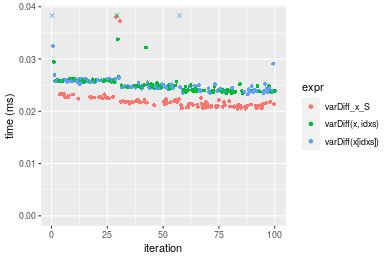
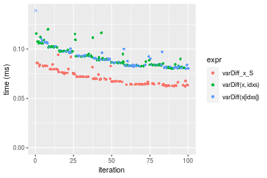
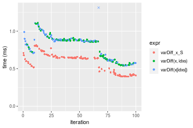
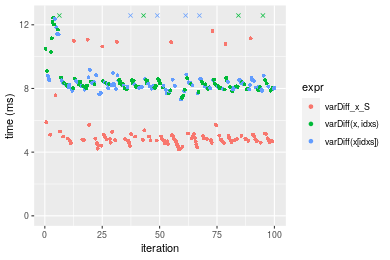
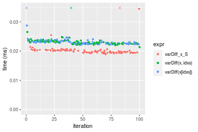
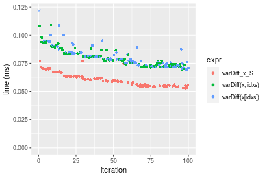
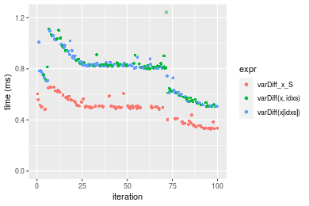
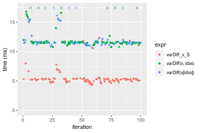

[matrixStats]: Benchmark report

---------------------------------------


# varDiff() benchmarks on subsetted computation

This report benchmark the performance of varDiff() on subsetted computation.


## Data type "integer"
### Data
```r
> rvector <- function(n, mode = c("logical", "double", "integer"), range = c(-100, +100), na_prob = 0) {
+     mode <- match.arg(mode)
+     if (mode == "logical") {
+         x <- sample(c(FALSE, TRUE), size = n, replace = TRUE)
+     }     else {
+         x <- runif(n, min = range[1], max = range[2])
+     }
+     storage.mode(x) <- mode
+     if (na_prob > 0) 
+         x[sample(n, size = na_prob * n)] <- NA
+     x
+ }
> rvectors <- function(scale = 10, seed = 1, ...) {
+     set.seed(seed)
+     data <- list()
+     data[[1]] <- rvector(n = scale * 100, ...)
+     data[[2]] <- rvector(n = scale * 1000, ...)
+     data[[3]] <- rvector(n = scale * 10000, ...)
+     data[[4]] <- rvector(n = scale * 1e+05, ...)
+     data[[5]] <- rvector(n = scale * 1e+06, ...)
+     names(data) <- sprintf("n = %d", sapply(data, FUN = length))
+     data
+ }
> data <- rvectors(mode = mode)
> data <- data[1:4]
```

### Results

### n = 1000 vector

#### All elements
```r
> x <- data[["n = 1000"]]
> idxs <- sample.int(length(x), size = length(x) * 0.7)
> x_S <- x[idxs]
> gc()
           used  (Mb) gc trigger  (Mb) max used  (Mb)
Ncells  5296199 282.9   10014072 534.9 10014072 534.9
Vcells 10679084  81.5   36267018 276.7 90959857 694.0
> stats <- microbenchmark(varDiff_x_S = varDiff(x_S), `varDiff(x, idxs)` = varDiff(x, idxs = idxs), 
+     `varDiff(x[idxs])` = varDiff(x[idxs]), unit = "ms")
```

_Table: Benchmarking of varDiff_x_S(), varDiff(x, idxs)() and varDiff(x[idxs])() on integer+n = 1000 data. The top panel shows times in milliseconds and the bottom panel shows relative times._


|   |expr             |      min|        lq|      mean|    median|        uq|      max|
|:--|:----------------|--------:|---------:|---------:|---------:|---------:|--------:|
|1  |varDiff_x_S      | 0.020509| 0.0209975| 0.0219535| 0.0215830| 0.0221995| 0.038077|
|3  |varDiff(x[idxs]) | 0.023265| 0.0242420| 0.0277240| 0.0248055| 0.0257845| 0.279807|
|2  |varDiff(x, idxs) | 0.023435| 0.0240220| 0.0253961| 0.0248935| 0.0258295| 0.055670|


|   |expr             |      min|       lq|     mean|   median|       uq|      max|
|:--|:----------------|--------:|--------:|--------:|--------:|--------:|--------:|
|1  |varDiff_x_S      | 1.000000| 1.000000| 1.000000| 1.000000| 1.000000| 1.000000|
|3  |varDiff(x[idxs]) | 1.134380| 1.154518| 1.262854| 1.149307| 1.161490| 7.348452|
|2  |varDiff(x, idxs) | 1.142669| 1.144041| 1.156815| 1.153385| 1.163517| 1.462038|

_Figure: Benchmarking of varDiff_x_S(), varDiff(x, idxs)() and varDiff(x[idxs])() on integer+n = 1000 data.  Outliers are displayed as crosses.  Times are in milliseconds._



### n = 10000 vector

#### All elements
```r
> x <- data[["n = 10000"]]
> idxs <- sample.int(length(x), size = length(x) * 0.7)
> x_S <- x[idxs]
> gc()
           used  (Mb) gc trigger  (Mb) max used  (Mb)
Ncells  5293424 282.7   10014072 534.9 10014072 534.9
Vcells 10425454  79.6   36267018 276.7 90959857 694.0
> stats <- microbenchmark(varDiff_x_S = varDiff(x_S), `varDiff(x, idxs)` = varDiff(x, idxs = idxs), 
+     `varDiff(x[idxs])` = varDiff(x[idxs]), unit = "ms")
```

_Table: Benchmarking of varDiff_x_S(), varDiff(x, idxs)() and varDiff(x[idxs])() on integer+n = 10000 data. The top panel shows times in milliseconds and the bottom panel shows relative times._


|   |expr             |      min|        lq|      mean|   median|        uq|      max|
|:--|:----------------|--------:|---------:|---------:|--------:|---------:|--------:|
|1  |varDiff_x_S      | 0.062275| 0.0645075| 0.0709465| 0.069039| 0.0758035| 0.094059|
|2  |varDiff(x, idxs) | 0.080415| 0.0838640| 0.0917455| 0.089034| 0.0977895| 0.119980|
|3  |varDiff(x[idxs]) | 0.080075| 0.0829730| 0.0905623| 0.089186| 0.0947095| 0.191540|


|   |expr             |      min|       lq|     mean|   median|       uq|      max|
|:--|:----------------|--------:|--------:|--------:|--------:|--------:|--------:|
|1  |varDiff_x_S      | 1.000000| 1.000000| 1.000000| 1.000000| 1.000000| 1.000000|
|2  |varDiff(x, idxs) | 1.291289| 1.300066| 1.293165| 1.289619| 1.290039| 1.275582|
|3  |varDiff(x[idxs]) | 1.285829| 1.286253| 1.276488| 1.291821| 1.249408| 2.036381|

_Figure: Benchmarking of varDiff_x_S(), varDiff(x, idxs)() and varDiff(x[idxs])() on integer+n = 10000 data.  Outliers are displayed as crosses.  Times are in milliseconds._



### n = 100000 vector

#### All elements
```r
> x <- data[["n = 100000"]]
> idxs <- sample.int(length(x), size = length(x) * 0.7)
> x_S <- x[idxs]
> gc()
           used  (Mb) gc trigger  (Mb) max used  (Mb)
Ncells  5293496 282.8   10014072 534.9 10014072 534.9
Vcells 10489014  80.1   36267018 276.7 90959857 694.0
> stats <- microbenchmark(varDiff_x_S = varDiff(x_S), `varDiff(x, idxs)` = varDiff(x, idxs = idxs), 
+     `varDiff(x[idxs])` = varDiff(x[idxs]), unit = "ms")
```

_Table: Benchmarking of varDiff_x_S(), varDiff(x, idxs)() and varDiff(x[idxs])() on integer+n = 100000 data. The top panel shows times in milliseconds and the bottom panel shows relative times._


|   |expr             |      min|        lq|      mean|    median|        uq|      max|
|:--|:----------------|--------:|---------:|---------:|---------:|---------:|--------:|
|1  |varDiff_x_S      | 0.395233| 0.4454115| 0.5855049| 0.6385485| 0.6592685| 0.813972|
|2  |varDiff(x, idxs) | 0.543839| 0.6095295| 0.7722526| 0.8577425| 0.8816000| 1.111210|
|3  |varDiff(x[idxs]) | 0.543154| 0.6954690| 0.8724052| 0.8695985| 0.8863880| 6.705216|


|   |expr             |      min|       lq|     mean|   median|       uq|      max|
|:--|:----------------|--------:|--------:|--------:|--------:|--------:|--------:|
|1  |varDiff_x_S      | 1.000000| 1.000000| 1.000000| 1.000000| 1.000000| 1.000000|
|2  |varDiff(x, idxs) | 1.375996| 1.368464| 1.318952| 1.343269| 1.337240| 1.365170|
|3  |varDiff(x[idxs]) | 1.374263| 1.561408| 1.490005| 1.361836| 1.344502| 8.237649|

_Figure: Benchmarking of varDiff_x_S(), varDiff(x, idxs)() and varDiff(x[idxs])() on integer+n = 100000 data.  Outliers are displayed as crosses.  Times are in milliseconds._



### n = 1000000 vector

#### All elements
```r
> x <- data[["n = 1000000"]]
> idxs <- sample.int(length(x), size = length(x) * 0.7)
> x_S <- x[idxs]
> gc()
           used  (Mb) gc trigger  (Mb) max used  (Mb)
Ncells  5293568 282.8   10014072 534.9 10014072 534.9
Vcells 11119063  84.9   36267018 276.7 90959857 694.0
> stats <- microbenchmark(varDiff_x_S = varDiff(x_S), `varDiff(x, idxs)` = varDiff(x, idxs = idxs), 
+     `varDiff(x[idxs])` = varDiff(x[idxs]), unit = "ms")
```

_Table: Benchmarking of varDiff_x_S(), varDiff(x, idxs)() and varDiff(x[idxs])() on integer+n = 1000000 data. The top panel shows times in milliseconds and the bottom panel shows relative times._


|   |expr             |      min|       lq|     mean|   median|       uq|      max|
|:--|:----------------|--------:|--------:|--------:|--------:|--------:|--------:|
|1  |varDiff_x_S      | 4.174903| 4.655493| 5.336827| 4.826992| 5.052267| 11.60798|
|3  |varDiff(x[idxs]) | 7.311236| 8.060641| 8.627136| 8.248974| 8.528911| 14.54669|
|2  |varDiff(x, idxs) | 7.411955| 8.066027| 8.735824| 8.259386| 8.496720| 17.20912|


|   |expr             |      min|       lq|     mean|   median|       uq|      max|
|:--|:----------------|--------:|--------:|--------:|--------:|--------:|--------:|
|1  |varDiff_x_S      | 1.000000| 1.000000| 1.000000| 1.000000| 1.000000| 1.000000|
|3  |varDiff(x[idxs]) | 1.751235| 1.731426| 1.616529| 1.708927| 1.688135| 1.253163|
|2  |varDiff(x, idxs) | 1.775360| 1.732583| 1.636895| 1.711084| 1.681764| 1.482525|

_Figure: Benchmarking of varDiff_x_S(), varDiff(x, idxs)() and varDiff(x[idxs])() on integer+n = 1000000 data.  Outliers are displayed as crosses.  Times are in milliseconds._




## Data type "double"
### Data
```r
> rvector <- function(n, mode = c("logical", "double", "integer"), range = c(-100, +100), na_prob = 0) {
+     mode <- match.arg(mode)
+     if (mode == "logical") {
+         x <- sample(c(FALSE, TRUE), size = n, replace = TRUE)
+     }     else {
+         x <- runif(n, min = range[1], max = range[2])
+     }
+     storage.mode(x) <- mode
+     if (na_prob > 0) 
+         x[sample(n, size = na_prob * n)] <- NA
+     x
+ }
> rvectors <- function(scale = 10, seed = 1, ...) {
+     set.seed(seed)
+     data <- list()
+     data[[1]] <- rvector(n = scale * 100, ...)
+     data[[2]] <- rvector(n = scale * 1000, ...)
+     data[[3]] <- rvector(n = scale * 10000, ...)
+     data[[4]] <- rvector(n = scale * 1e+05, ...)
+     data[[5]] <- rvector(n = scale * 1e+06, ...)
+     names(data) <- sprintf("n = %d", sapply(data, FUN = length))
+     data
+ }
> data <- rvectors(mode = mode)
> data <- data[1:4]
```

### Results

### n = 1000 vector

#### All elements
```r
> x <- data[["n = 1000"]]
> idxs <- sample.int(length(x), size = length(x) * 0.7)
> x_S <- x[idxs]
> gc()
           used  (Mb) gc trigger  (Mb) max used  (Mb)
Ncells  5293643 282.8   10014072 534.9 10014072 534.9
Vcells 10975877  83.8   36267018 276.7 90959857 694.0
> stats <- microbenchmark(varDiff_x_S = varDiff(x_S), `varDiff(x, idxs)` = varDiff(x, idxs = idxs), 
+     `varDiff(x[idxs])` = varDiff(x[idxs]), unit = "ms")
```

_Table: Benchmarking of varDiff_x_S(), varDiff(x, idxs)() and varDiff(x[idxs])() on double+n = 1000 data. The top panel shows times in milliseconds and the bottom panel shows relative times._


|   |expr             |      min|       lq|      mean|   median|        uq|      max|
|:--|:----------------|--------:|--------:|---------:|--------:|---------:|--------:|
|1  |varDiff_x_S      | 0.018944| 0.019472| 0.0202807| 0.019815| 0.0202755| 0.038001|
|2  |varDiff(x, idxs) | 0.021358| 0.022517| 0.0231609| 0.022911| 0.0234170| 0.038064|
|3  |varDiff(x[idxs]) | 0.022124| 0.022534| 0.0236383| 0.022927| 0.0234470| 0.081002|


|   |expr             |      min|       lq|     mean|   median|       uq|      max|
|:--|:----------------|--------:|--------:|--------:|--------:|--------:|--------:|
|1  |varDiff_x_S      | 1.000000| 1.000000| 1.000000| 1.000000| 1.000000| 1.000000|
|2  |varDiff(x, idxs) | 1.127428| 1.156378| 1.142016| 1.156245| 1.154941| 1.001658|
|3  |varDiff(x[idxs]) | 1.167863| 1.157251| 1.165556| 1.157053| 1.156420| 2.131575|

_Figure: Benchmarking of varDiff_x_S(), varDiff(x, idxs)() and varDiff(x[idxs])() on double+n = 1000 data.  Outliers are displayed as crosses.  Times are in milliseconds._



### n = 10000 vector

#### All elements
```r
> x <- data[["n = 10000"]]
> idxs <- sample.int(length(x), size = length(x) * 0.7)
> x_S <- x[idxs]
> gc()
           used  (Mb) gc trigger  (Mb) max used  (Mb)
Ncells  5293712 282.8   10014072 534.9 10014072 534.9
Vcells 10985627  83.9   36267018 276.7 90959857 694.0
> stats <- microbenchmark(varDiff_x_S = varDiff(x_S), `varDiff(x, idxs)` = varDiff(x, idxs = idxs), 
+     `varDiff(x[idxs])` = varDiff(x[idxs]), unit = "ms")
```

_Table: Benchmarking of varDiff_x_S(), varDiff(x, idxs)() and varDiff(x[idxs])() on double+n = 10000 data. The top panel shows times in milliseconds and the bottom panel shows relative times._


|   |expr             |      min|        lq|      mean|    median|        uq|      max|
|:--|:----------------|--------:|---------:|---------:|---------:|---------:|--------:|
|1  |varDiff_x_S      | 0.052934| 0.0552275| 0.0605207| 0.0593815| 0.0633180| 0.077216|
|3  |varDiff(x[idxs]) | 0.069586| 0.0743330| 0.0812365| 0.0786265| 0.0842850| 0.180938|
|2  |varDiff(x, idxs) | 0.069799| 0.0737955| 0.0804967| 0.0786970| 0.0853845| 0.108852|


|   |expr             |      min|       lq|     mean|   median|       uq|      max|
|:--|:----------------|--------:|--------:|--------:|--------:|--------:|--------:|
|1  |varDiff_x_S      | 1.000000| 1.000000| 1.000000| 1.000000| 1.000000| 1.000000|
|3  |varDiff(x[idxs]) | 1.314580| 1.345942| 1.342294| 1.324091| 1.331138| 2.343271|
|2  |varDiff(x, idxs) | 1.318604| 1.336209| 1.330070| 1.325278| 1.348503| 1.409708|

_Figure: Benchmarking of varDiff_x_S(), varDiff(x, idxs)() and varDiff(x[idxs])() on double+n = 10000 data.  Outliers are displayed as crosses.  Times are in milliseconds._



### n = 100000 vector

#### All elements
```r
> x <- data[["n = 100000"]]
> idxs <- sample.int(length(x), size = length(x) * 0.7)
> x_S <- x[idxs]
> gc()
           used  (Mb) gc trigger  (Mb) max used  (Mb)
Ncells  5293784 282.8   10014072 534.9 10014072 534.9
Vcells 11080478  84.6   36267018 276.7 90959857 694.0
> stats <- microbenchmark(varDiff_x_S = varDiff(x_S), `varDiff(x, idxs)` = varDiff(x, idxs = idxs), 
+     `varDiff(x[idxs])` = varDiff(x[idxs]), unit = "ms")
```

_Table: Benchmarking of varDiff_x_S(), varDiff(x, idxs)() and varDiff(x[idxs])() on double+n = 100000 data. The top panel shows times in milliseconds and the bottom panel shows relative times._


|   |expr             |      min|        lq|      mean|    median|        uq|      max|
|:--|:----------------|--------:|---------:|---------:|---------:|---------:|--------:|
|1  |varDiff_x_S      | 0.328229| 0.3897245| 0.4818524| 0.4988730| 0.5156460| 0.658200|
|2  |varDiff(x, idxs) | 0.506545| 0.6103270| 0.8265359| 0.8176980| 0.8369545| 6.858407|
|3  |varDiff(x[idxs]) | 0.505543| 0.7289950| 0.7888124| 0.8212155| 0.8428925| 1.096381|


|   |expr             |      min|       lq|     mean|   median|       uq|       max|
|:--|:----------------|--------:|--------:|--------:|--------:|--------:|---------:|
|1  |varDiff_x_S      | 1.000000| 1.000000| 1.000000| 1.000000| 1.000000|  1.000000|
|2  |varDiff(x, idxs) | 1.543267| 1.566047| 1.715330| 1.639091| 1.623118| 10.419944|
|3  |varDiff(x[idxs]) | 1.540214| 1.870539| 1.637042| 1.646141| 1.634634|  1.665726|

_Figure: Benchmarking of varDiff_x_S(), varDiff(x, idxs)() and varDiff(x[idxs])() on double+n = 100000 data.  Outliers are displayed as crosses.  Times are in milliseconds._



### n = 1000000 vector

#### All elements
```r
> x <- data[["n = 1000000"]]
> idxs <- sample.int(length(x), size = length(x) * 0.7)
> x_S <- x[idxs]
> gc()
           used  (Mb) gc trigger  (Mb) max used  (Mb)
Ncells  5293856 282.8   10014072 534.9 10014072 534.9
Vcells 12025896  91.8   36267018 276.7 90959857 694.0
> stats <- microbenchmark(varDiff_x_S = varDiff(x_S), `varDiff(x, idxs)` = varDiff(x, idxs = idxs), 
+     `varDiff(x[idxs])` = varDiff(x[idxs]), unit = "ms")
```

_Table: Benchmarking of varDiff_x_S(), varDiff(x, idxs)() and varDiff(x[idxs])() on double+n = 1000000 data. The top panel shows times in milliseconds and the bottom panel shows relative times._


|   |expr             |      min|        lq|      mean|    median|        uq|      max|
|:--|:----------------|--------:|---------:|---------:|---------:|---------:|--------:|
|1  |varDiff_x_S      |  4.30456|  4.959998|  5.515964|  5.240379|  5.384191| 12.37939|
|3  |varDiff(x[idxs]) | 10.59371| 11.457294| 12.457903| 11.542540| 11.721156| 31.98568|
|2  |varDiff(x, idxs) | 10.80408| 11.469357| 12.328250| 11.568504| 11.683411| 20.37290|


|   |expr             |      min|       lq|     mean|   median|       uq|      max|
|:--|:----------------|--------:|--------:|--------:|--------:|--------:|--------:|
|1  |varDiff_x_S      | 1.000000| 1.000000| 1.000000| 1.000000| 1.000000| 1.000000|
|3  |varDiff(x[idxs]) | 2.461044| 2.309940| 2.258518| 2.202616| 2.176958| 2.583784|
|2  |varDiff(x, idxs) | 2.509915| 2.312372| 2.235013| 2.207570| 2.169947| 1.645711|

_Figure: Benchmarking of varDiff_x_S(), varDiff(x, idxs)() and varDiff(x[idxs])() on double+n = 1000000 data.  Outliers are displayed as crosses.  Times are in milliseconds._




## Appendix

### Session information
```r
R version 4.1.1 Patched (2021-08-10 r80727)
Platform: x86_64-pc-linux-gnu (64-bit)
Running under: Ubuntu 18.04.5 LTS

Matrix products: default
BLAS:   /home/hb/software/R-devel/R-4-1-branch/lib/R/lib/libRblas.so
LAPACK: /home/hb/software/R-devel/R-4-1-branch/lib/R/lib/libRlapack.so

locale:
 [1] LC_CTYPE=en_US.UTF-8       LC_NUMERIC=C              
 [3] LC_TIME=en_US.UTF-8        LC_COLLATE=en_US.UTF-8    
 [5] LC_MONETARY=en_US.UTF-8    LC_MESSAGES=en_US.UTF-8   
 [7] LC_PAPER=en_US.UTF-8       LC_NAME=C                 
 [9] LC_ADDRESS=C               LC_TELEPHONE=C            
[11] LC_MEASUREMENT=en_US.UTF-8 LC_IDENTIFICATION=C       

attached base packages:
[1] stats     graphics  grDevices utils     datasets  methods   base     

other attached packages:
[1] microbenchmark_1.4-7   matrixStats_0.60.1     ggplot2_3.3.5         
[4] knitr_1.33             R.devices_2.17.0       R.utils_2.10.1        
[7] R.oo_1.24.0            R.methodsS3_1.8.1-9001 history_0.0.1-9000    

loaded via a namespace (and not attached):
 [1] Biobase_2.52.0          httr_1.4.2              splines_4.1.1          
 [4] bit64_4.0.5             network_1.17.1          assertthat_0.2.1       
 [7] highr_0.9               stats4_4.1.1            blob_1.2.2             
[10] GenomeInfoDbData_1.2.6  robustbase_0.93-8       pillar_1.6.2           
[13] RSQLite_2.2.8           lattice_0.20-44         glue_1.4.2             
[16] digest_0.6.27           XVector_0.32.0          colorspace_2.0-2       
[19] Matrix_1.3-4            XML_3.99-0.7            pkgconfig_2.0.3        
[22] zlibbioc_1.38.0         genefilter_1.74.0       purrr_0.3.4            
[25] ergm_4.1.2              xtable_1.8-4            scales_1.1.1           
[28] tibble_3.1.4            annotate_1.70.0         KEGGREST_1.32.0        
[31] farver_2.1.0            generics_0.1.0          IRanges_2.26.0         
[34] ellipsis_0.3.2          cachem_1.0.6            withr_2.4.2            
[37] BiocGenerics_0.38.0     mime_0.11               survival_3.2-13        
[40] magrittr_2.0.1          crayon_1.4.1            statnet.common_4.5.0   
[43] memoise_2.0.0           laeken_0.5.1            fansi_0.5.0            
[46] R.cache_0.15.0          MASS_7.3-54             R.rsp_0.44.0           
[49] progressr_0.8.0         tools_4.1.1             lifecycle_1.0.0        
[52] S4Vectors_0.30.0        trust_0.1-8             munsell_0.5.0          
[55] tabby_0.0.1-9001        AnnotationDbi_1.54.1    Biostrings_2.60.2      
[58] compiler_4.1.1          GenomeInfoDb_1.28.1     rlang_0.4.11           
[61] grid_4.1.1              RCurl_1.98-1.4          cwhmisc_6.6            
[64] rappdirs_0.3.3          startup_0.15.0          labeling_0.4.2         
[67] bitops_1.0-7            base64enc_0.1-3         boot_1.3-28            
[70] gtable_0.3.0            DBI_1.1.1               markdown_1.1           
[73] R6_2.5.1                lpSolveAPI_5.5.2.0-17.7 rle_0.9.2              
[76] dplyr_1.0.7             fastmap_1.1.0           bit_4.0.4              
[79] utf8_1.2.2              parallel_4.1.1          Rcpp_1.0.7             
[82] vctrs_0.3.8             png_0.1-7               DEoptimR_1.0-9         
[85] tidyselect_1.1.1        xfun_0.25               coda_0.19-4            
```
Total processing time was 13.77 secs.


### Reproducibility
To reproduce this report, do:
```r
html <- matrixStats:::benchmark('varDiff_subset')
```

[RSP]: https://cran.r-project.org/package=R.rsp
[matrixStats]: https://cran.r-project.org/package=matrixStats

[StackOverflow:colMins?]: https://stackoverflow.com/questions/13676878 "Stack Overflow: fastest way to get Min from every column in a matrix?"
[StackOverflow:colSds?]: https://stackoverflow.com/questions/17549762 "Stack Overflow: Is there such 'colsd' in R?"
[StackOverflow:rowProds?]: https://stackoverflow.com/questions/20198801/ "Stack Overflow: Row product of matrix and column sum of matrix"

---------------------------------------
Copyright Dongcan Jiang. Last updated on 2021-08-25 18:38:25 (+0200 UTC). Powered by [RSP].

<script>
 var link = document.createElement('link');
 link.rel = 'icon';
 link.href = "data:image/png;base64,iVBORw0KGgoAAAANSUhEUgAAACAAAAAgCAMAAABEpIrGAAAA21BMVEUAAAAAAP8AAP8AAP8AAP8AAP8AAP8AAP8AAP8AAP8AAP8AAP8AAP8AAP8AAP8AAP8AAP8AAP8AAP8AAP8AAP8AAP8AAP8AAP8AAP8AAP8AAP8AAP8AAP8AAP8AAP8AAP8AAP8AAP8AAP8AAP8AAP8AAP8AAP8AAP8AAP8AAP8BAf4CAv0DA/wdHeIeHuEfH+AgIN8hId4lJdomJtknJ9g+PsE/P8BAQL9yco10dIt1dYp3d4h4eIeVlWqWlmmXl2iYmGeZmWabm2Tn5xjo6Bfp6Rb39wj4+Af//wA2M9hbAAAASXRSTlMAAQIJCgsMJSYnKD4/QGRlZmhpamtsbautrrCxuru8y8zN5ebn6Pn6+///////////////////////////////////////////LsUNcQAAAS9JREFUOI29k21XgkAQhVcFytdSMqMETU26UVqGmpaiFbL//xc1cAhhwVNf6n5i5z67M2dmYOyfJZUqlVLhkKucG7cgmUZTybDz6g0iDeq51PUr37Ds2cy2/C9NeES5puDjxuUk1xnToZsg8pfA3avHQ3lLIi7iWRrkv/OYtkScxBIMgDee0ALoyxHQBJ68JLCjOtQIMIANF7QG9G9fNnHvisCHBVMKgSJgiz7nE+AoBKrAPA3MgepvgR9TSCasrCKH0eB1wBGBFdCO+nAGjMVGPcQb5bd6mQRegN6+1axOs9nGfYcCtfi4NQosdtH7dB+txFIpXQqN1p9B/asRHToyS0jRgpV7nk4nwcq1BJ+x3Gl/v7S9Wmpp/aGquum7w3ZDyrADFYrl8vHBH+ev9AUASW1dmU4h4wAAAABJRU5ErkJggg=="
 document.getElementsByTagName('head')[0].appendChild(link);
</script>


