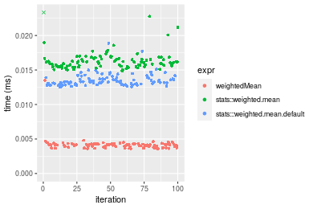
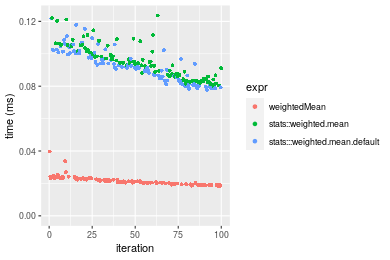
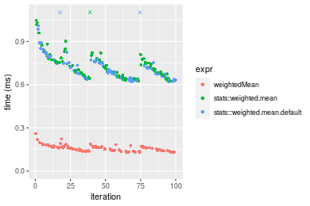
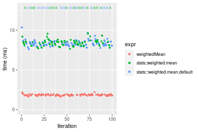
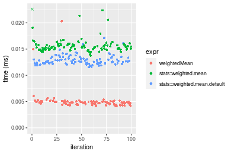
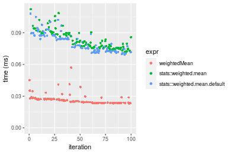
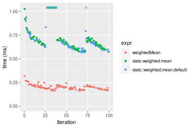
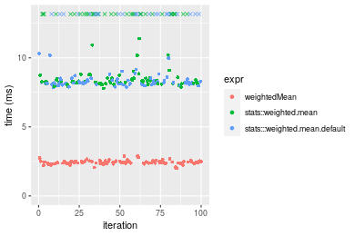

[matrixStats]: Benchmark report

---------------------------------------


# weightedMean() benchmarks

This report benchmark the performance of weightedMean() against alternative methods.

## Alternative methods

* stats::weighted.mean()
* stats:::weighted.mean.default()


## Data type "integer"
### Data
```r
> rvector <- function(n, mode = c("logical", "double", "integer"), range = c(-100, +100), na_prob = 0) {
+     mode <- match.arg(mode)
+     if (mode == "logical") {
+         x <- sample(c(FALSE, TRUE), size = n, replace = TRUE)
+     }     else {
+         x <- runif(n, min = range[1], max = range[2])
+     }
+     storage.mode(x) <- mode
+     if (na_prob > 0) 
+         x[sample(n, size = na_prob * n)] <- NA
+     x
+ }
> rvectors <- function(scale = 10, seed = 1, ...) {
+     set.seed(seed)
+     data <- list()
+     data[[1]] <- rvector(n = scale * 100, ...)
+     data[[2]] <- rvector(n = scale * 1000, ...)
+     data[[3]] <- rvector(n = scale * 10000, ...)
+     data[[4]] <- rvector(n = scale * 1e+05, ...)
+     data[[5]] <- rvector(n = scale * 1e+06, ...)
+     names(data) <- sprintf("n = %d", sapply(data, FUN = length))
+     data
+ }
> data <- rvectors(mode = mode)
> data <- data[1:4]
```

## Results

### n = 1000 vector

```r
> x <- data[["n = 1000"]]
> w <- runif(length(x))
> gc()
           used  (Mb) gc trigger  (Mb) max used  (Mb)
Ncells  5297686 283.0   10014072 534.9 10014072 534.9
Vcells 14307242 109.2   36267018 276.7 90959857 694.0
> stats <- microbenchmark(weightedMean = weightedMean(x, w = w, na.rm = FALSE), `stats::weighted.mean` = weighted.mean(x, 
+     w = w, na.rm = FALSE), `stats:::weighted.mean.default` = weighted.mean.default(x, w = w, na.rm = FALSE), 
+     unit = "ms")
```

_Table: Benchmarking of weightedMean(), stats::weighted.mean() and stats:::weighted.mean.default() on integer+n = 1000 data. The top panel shows times in milliseconds and the bottom panel shows relative times._


|   |expr                          |      min|        lq|      mean|    median|        uq|      max|
|:--|:-----------------------------|--------:|---------:|---------:|---------:|---------:|--------:|
|1  |weightedMean                  | 0.003559| 0.0037765| 0.0041382| 0.0040935| 0.0042395| 0.013496|
|3  |stats:::weighted.mean.default | 0.012524| 0.0129695| 0.0135288| 0.0133020| 0.0138505| 0.018873|
|2  |stats::weighted.mean          | 0.014844| 0.0155435| 0.0168462| 0.0160565| 0.0166470| 0.073591|


|   |expr                          |      min|       lq|     mean|   median|       uq|      max|
|:--|:-----------------------------|--------:|--------:|--------:|--------:|--------:|--------:|
|1  |weightedMean                  | 1.000000| 1.000000| 1.000000| 1.000000| 1.000000| 1.000000|
|3  |stats:::weighted.mean.default | 3.518966| 3.434264| 3.269299| 3.249542| 3.267013| 1.398414|
|2  |stats::weighted.mean          | 4.170834| 4.115848| 4.070952| 3.922438| 3.926642| 5.452801|

_Figure: Benchmarking of weightedMean(), stats::weighted.mean() and stats:::weighted.mean.default() on integer+n = 1000 data.  Outliers are displayed as crosses.  Times are in milliseconds._



### n = 10000 vector

```r
> x <- data[["n = 10000"]]
> w <- runif(length(x))
> gc()
           used  (Mb) gc trigger  (Mb) max used  (Mb)
Ncells  5295458 282.9   10014072 534.9 10014072 534.9
Vcells 10430878  79.6   36267018 276.7 90959857 694.0
> stats <- microbenchmark(weightedMean = weightedMean(x, w = w, na.rm = FALSE), `stats::weighted.mean` = weighted.mean(x, 
+     w = w, na.rm = FALSE), `stats:::weighted.mean.default` = weighted.mean.default(x, w = w, na.rm = FALSE), 
+     unit = "ms")
```

_Table: Benchmarking of weightedMean(), stats::weighted.mean() and stats:::weighted.mean.default() on integer+n = 10000 data. The top panel shows times in milliseconds and the bottom panel shows relative times._


|   |expr                          |      min|        lq|      mean|    median|        uq|      max|
|:--|:-----------------------------|--------:|---------:|---------:|---------:|---------:|--------:|
|1  |weightedMean                  | 0.018515| 0.0198685| 0.0215551| 0.0209310| 0.0229140| 0.039717|
|3  |stats:::weighted.mean.default | 0.077606| 0.0835750| 0.0925514| 0.0917400| 0.1003755| 0.121788|
|2  |stats::weighted.mean          | 0.079961| 0.0858775| 0.0948469| 0.0940715| 0.1018605| 0.123623|


|   |expr                          |      min|       lq|     mean|   median|       uq|      max|
|:--|:-----------------------------|--------:|--------:|--------:|--------:|--------:|--------:|
|1  |weightedMean                  | 1.000000| 1.000000| 1.000000| 1.000000| 1.000000| 1.000000|
|3  |stats:::weighted.mean.default | 4.191520| 4.206407| 4.293716| 4.382973| 4.380532| 3.066395|
|2  |stats::weighted.mean          | 4.318715| 4.322294| 4.400209| 4.494362| 4.445339| 3.112597|

_Figure: Benchmarking of weightedMean(), stats::weighted.mean() and stats:::weighted.mean.default() on integer+n = 10000 data.  Outliers are displayed as crosses.  Times are in milliseconds._



### n = 100000 vector

```r
> x <- data[["n = 100000"]]
> w <- runif(length(x))
> gc()
           used  (Mb) gc trigger  (Mb) max used  (Mb)
Ncells  5295530 282.9   10014072 534.9 10014072 534.9
Vcells 10521438  80.3   36267018 276.7 90959857 694.0
> stats <- microbenchmark(weightedMean = weightedMean(x, w = w, na.rm = FALSE), `stats::weighted.mean` = weighted.mean(x, 
+     w = w, na.rm = FALSE), `stats:::weighted.mean.default` = weighted.mean.default(x, w = w, na.rm = FALSE), 
+     unit = "ms")
```

_Table: Benchmarking of weightedMean(), stats::weighted.mean() and stats:::weighted.mean.default() on integer+n = 100000 data. The top panel shows times in milliseconds and the bottom panel shows relative times._


|   |expr                          |      min|        lq|      mean|    median|        uq|      max|
|:--|:-----------------------------|--------:|---------:|---------:|---------:|---------:|--------:|
|1  |weightedMean                  | 0.131134| 0.1404575| 0.1566883| 0.1545460| 0.1670885| 0.261077|
|3  |stats:::weighted.mean.default | 0.620419| 0.6507220| 0.7742044| 0.6980520| 0.7523465| 6.229942|
|2  |stats::weighted.mean          | 0.625575| 0.6631995| 0.7894811| 0.7129135| 0.7775395| 6.581240|


|   |expr                          |      min|       lq|     mean|   median|       uq|      max|
|:--|:-----------------------------|--------:|--------:|--------:|--------:|--------:|--------:|
|1  |weightedMean                  | 1.000000| 1.000000| 1.000000| 1.000000| 1.000000|  1.00000|
|3  |stats:::weighted.mean.default | 4.731183| 4.632875| 4.941047| 4.516791| 4.502683| 23.86247|
|2  |stats::weighted.mean          | 4.770502| 4.721709| 5.038544| 4.612953| 4.653459| 25.20804|

_Figure: Benchmarking of weightedMean(), stats::weighted.mean() and stats:::weighted.mean.default() on integer+n = 100000 data.  Outliers are displayed as crosses.  Times are in milliseconds._



### n = 1000000 vector

```r
> x <- data[["n = 1000000"]]
> w <- runif(length(x))
> gc()
           used  (Mb) gc trigger  (Mb) max used  (Mb)
Ncells  5295602 282.9   10014072 534.9 10014072 534.9
Vcells 11421487  87.2   36267018 276.7 90959857 694.0
> stats <- microbenchmark(weightedMean = weightedMean(x, w = w, na.rm = FALSE), `stats::weighted.mean` = weighted.mean(x, 
+     w = w, na.rm = FALSE), `stats:::weighted.mean.default` = weighted.mean.default(x, w = w, na.rm = FALSE), 
+     unit = "ms")
```

_Table: Benchmarking of weightedMean(), stats::weighted.mean() and stats:::weighted.mean.default() on integer+n = 1000000 data. The top panel shows times in milliseconds and the bottom panel shows relative times._


|   |expr                          |      min|       lq|     mean|   median|       uq|       max|
|:--|:-----------------------------|--------:|--------:|--------:|--------:|--------:|---------:|
|1  |weightedMean                  | 1.660896| 1.786048| 1.835808| 1.816459| 1.890478|  2.212887|
|3  |stats:::weighted.mean.default | 7.636246| 8.149544| 9.192913| 8.351570| 8.680095| 15.758206|
|2  |stats::weighted.mean          | 7.665300| 8.183319| 9.451367| 8.508696| 8.773578| 23.218481|


|   |expr                          |      min|       lq|     mean|   median|       uq|       max|
|:--|:-----------------------------|--------:|--------:|--------:|--------:|--------:|---------:|
|1  |weightedMean                  | 1.000000| 1.000000| 1.000000| 1.000000| 1.000000|  1.000000|
|3  |stats:::weighted.mean.default | 4.597667| 4.562892| 5.007558| 4.597719| 4.591482|  7.121107|
|2  |stats::weighted.mean          | 4.615159| 4.581803| 5.148343| 4.684220| 4.640931| 10.492393|

_Figure: Benchmarking of weightedMean(), stats::weighted.mean() and stats:::weighted.mean.default() on integer+n = 1000000 data.  Outliers are displayed as crosses.  Times are in milliseconds._




## Data type "double"
### Data
```r
> rvector <- function(n, mode = c("logical", "double", "integer"), range = c(-100, +100), na_prob = 0) {
+     mode <- match.arg(mode)
+     if (mode == "logical") {
+         x <- sample(c(FALSE, TRUE), size = n, replace = TRUE)
+     }     else {
+         x <- runif(n, min = range[1], max = range[2])
+     }
+     storage.mode(x) <- mode
+     if (na_prob > 0) 
+         x[sample(n, size = na_prob * n)] <- NA
+     x
+ }
> rvectors <- function(scale = 10, seed = 1, ...) {
+     set.seed(seed)
+     data <- list()
+     data[[1]] <- rvector(n = scale * 100, ...)
+     data[[2]] <- rvector(n = scale * 1000, ...)
+     data[[3]] <- rvector(n = scale * 10000, ...)
+     data[[4]] <- rvector(n = scale * 1e+05, ...)
+     data[[5]] <- rvector(n = scale * 1e+06, ...)
+     names(data) <- sprintf("n = %d", sapply(data, FUN = length))
+     data
+ }
> data <- rvectors(mode = mode)
> data <- data[1:4]
```

## Results

### n = 1000 vector

```r
> x <- data[["n = 1000"]]
> w <- runif(length(x))
> gc()
           used  (Mb) gc trigger  (Mb) max used  (Mb)
Ncells  5295674 282.9   10014072 534.9 10014072 534.9
Vcells 10978518  83.8   36267018 276.7 90959857 694.0
> stats <- microbenchmark(weightedMean = weightedMean(x, w = w, na.rm = FALSE), `stats::weighted.mean` = weighted.mean(x, 
+     w = w, na.rm = FALSE), `stats:::weighted.mean.default` = weighted.mean.default(x, w = w, na.rm = FALSE), 
+     unit = "ms")
```

_Table: Benchmarking of weightedMean(), stats::weighted.mean() and stats:::weighted.mean.default() on double+n = 1000 data. The top panel shows times in milliseconds and the bottom panel shows relative times._


|   |expr                          |      min|        lq|      mean|    median|        uq|      max|
|:--|:-----------------------------|--------:|---------:|---------:|---------:|---------:|--------:|
|1  |weightedMean                  | 0.004116| 0.0045120| 0.0050527| 0.0048290| 0.0050285| 0.020300|
|3  |stats:::weighted.mean.default | 0.011552| 0.0123095| 0.0129227| 0.0126615| 0.0133640| 0.017120|
|2  |stats::weighted.mean          | 0.013763| 0.0150240| 0.0160484| 0.0154735| 0.0159065| 0.054085|


|   |expr                          |      min|       lq|     mean|   median|       uq|       max|
|:--|:-----------------------------|--------:|--------:|--------:|--------:|--------:|---------:|
|1  |weightedMean                  | 1.000000| 1.000000| 1.000000| 1.000000| 1.000000| 1.0000000|
|3  |stats:::weighted.mean.default | 2.806608| 2.728169| 2.557603| 2.621971| 2.657651| 0.8433498|
|2  |stats::weighted.mean          | 3.343780| 3.329787| 3.176222| 3.204287| 3.163269| 2.6642857|

_Figure: Benchmarking of weightedMean(), stats::weighted.mean() and stats:::weighted.mean.default() on double+n = 1000 data.  Outliers are displayed as crosses.  Times are in milliseconds._



### n = 10000 vector

```r
> x <- data[["n = 10000"]]
> w <- runif(length(x))
> gc()
           used  (Mb) gc trigger  (Mb) max used  (Mb)
Ncells  5295746 282.9   10014072 534.9 10014072 534.9
Vcells 10987565  83.9   36267018 276.7 90959857 694.0
> stats <- microbenchmark(weightedMean = weightedMean(x, w = w, na.rm = FALSE), `stats::weighted.mean` = weighted.mean(x, 
+     w = w, na.rm = FALSE), `stats:::weighted.mean.default` = weighted.mean.default(x, w = w, na.rm = FALSE), 
+     unit = "ms")
```

_Table: Benchmarking of weightedMean(), stats::weighted.mean() and stats:::weighted.mean.default() on double+n = 10000 data. The top panel shows times in milliseconds and the bottom panel shows relative times._


|   |expr                          |      min|        lq|      mean|   median|        uq|      max|
|:--|:-----------------------------|--------:|---------:|---------:|--------:|---------:|--------:|
|1  |weightedMean                  | 0.023078| 0.0236075| 0.0267250| 0.025309| 0.0272555| 0.056999|
|3  |stats:::weighted.mean.default | 0.069371| 0.0730550| 0.0809800| 0.078131| 0.0872875| 0.108028|
|2  |stats::weighted.mean          | 0.071854| 0.0760945| 0.0834707| 0.080518| 0.0898335| 0.112304|


|   |expr                          |      min|       lq|     mean|   median|       uq|      max|
|:--|:-----------------------------|--------:|--------:|--------:|--------:|--------:|--------:|
|1  |weightedMean                  | 1.000000| 1.000000| 1.000000| 1.000000| 1.000000| 1.000000|
|3  |stats:::weighted.mean.default | 3.005936| 3.094567| 3.030128| 3.087084| 3.202565| 1.895261|
|2  |stats::weighted.mean          | 3.113528| 3.223319| 3.123324| 3.181398| 3.295977| 1.970280|

_Figure: Benchmarking of weightedMean(), stats::weighted.mean() and stats:::weighted.mean.default() on double+n = 10000 data.  Outliers are displayed as crosses.  Times are in milliseconds._



### n = 100000 vector

```r
> x <- data[["n = 100000"]]
> w <- runif(length(x))
> gc()
           used  (Mb) gc trigger  (Mb) max used  (Mb)
Ncells  5295818 282.9   10014072 534.9 10014072 534.9
Vcells 11077985  84.6   36267018 276.7 90959857 694.0
> stats <- microbenchmark(weightedMean = weightedMean(x, w = w, na.rm = FALSE), `stats::weighted.mean` = weighted.mean(x, 
+     w = w, na.rm = FALSE), `stats:::weighted.mean.default` = weighted.mean.default(x, w = w, na.rm = FALSE), 
+     unit = "ms")
```

_Table: Benchmarking of weightedMean(), stats::weighted.mean() and stats:::weighted.mean.default() on double+n = 100000 data. The top panel shows times in milliseconds and the bottom panel shows relative times._


|   |expr                          |      min|        lq|      mean|   median|        uq|      max|
|:--|:-----------------------------|--------:|---------:|---------:|--------:|---------:|--------:|
|1  |weightedMean                  | 0.164710| 0.1784335| 0.1982688| 0.195026| 0.2091485| 0.317886|
|3  |stats:::weighted.mean.default | 0.569791| 0.6117630| 0.7455784| 0.660867| 0.7132260| 1.447374|
|2  |stats::weighted.mean          | 0.571522| 0.6320330| 0.8647449| 0.678335| 0.7181500| 7.232735|


|   |expr                          |      min|       lq|     mean|   median|       uq|       max|
|:--|:-----------------------------|--------:|--------:|--------:|--------:|--------:|---------:|
|1  |weightedMean                  | 1.000000| 1.000000| 1.000000| 1.000000| 1.000000|  1.000000|
|3  |stats:::weighted.mean.default | 3.459359| 3.428521| 3.760442| 3.388610| 3.410142|  4.553123|
|2  |stats::weighted.mean          | 3.469868| 3.542121| 4.361477| 3.478177| 3.433685| 22.752606|

_Figure: Benchmarking of weightedMean(), stats::weighted.mean() and stats:::weighted.mean.default() on double+n = 100000 data.  Outliers are displayed as crosses.  Times are in milliseconds._



### n = 1000000 vector

```r
> x <- data[["n = 1000000"]]
> w <- runif(length(x))
> gc()
           used  (Mb) gc trigger  (Mb) max used  (Mb)
Ncells  5295890 282.9   10014072 534.9 10014072 534.9
Vcells 11978421  91.4   36267018 276.7 90959857 694.0
> stats <- microbenchmark(weightedMean = weightedMean(x, w = w, na.rm = FALSE), `stats::weighted.mean` = weighted.mean(x, 
+     w = w, na.rm = FALSE), `stats:::weighted.mean.default` = weighted.mean.default(x, w = w, na.rm = FALSE), 
+     unit = "ms")
```

_Table: Benchmarking of weightedMean(), stats::weighted.mean() and stats:::weighted.mean.default() on double+n = 1000000 data. The top panel shows times in milliseconds and the bottom panel shows relative times._


|   |expr                          |      min|       lq|     mean|   median|        uq|        max|
|:--|:-----------------------------|--------:|--------:|--------:|--------:|---------:|----------:|
|1  |weightedMean                  | 1.992646| 2.354086|  2.42092| 2.399554|  2.495577|   2.879984|
|3  |stats:::weighted.mean.default | 7.856080| 8.142919| 13.93657| 8.294887| 12.156408| 382.438572|
|2  |stats::weighted.mean          | 7.784512| 8.205177| 10.80027| 8.516225| 14.610947|  19.436951|


|   |expr                          |      min|       lq|     mean|   median|       uq|        max|
|:--|:-----------------------------|--------:|--------:|--------:|--------:|--------:|----------:|
|1  |weightedMean                  | 1.000000| 1.000000| 1.000000| 1.000000| 1.000000|   1.000000|
|3  |stats:::weighted.mean.default | 3.942537| 3.459058| 5.756724| 3.456845| 4.871181| 132.791909|
|2  |stats::weighted.mean          | 3.906621| 3.485505| 4.461225| 3.549087| 5.854737|   6.748979|

_Figure: Benchmarking of weightedMean(), stats::weighted.mean() and stats:::weighted.mean.default() on double+n = 1000000 data.  Outliers are displayed as crosses.  Times are in milliseconds._




## Appendix

### Session information
```r
R version 4.1.1 Patched (2021-08-10 r80727)
Platform: x86_64-pc-linux-gnu (64-bit)
Running under: Ubuntu 18.04.5 LTS

Matrix products: default
BLAS:   /home/hb/software/R-devel/R-4-1-branch/lib/R/lib/libRblas.so
LAPACK: /home/hb/software/R-devel/R-4-1-branch/lib/R/lib/libRlapack.so

locale:
 [1] LC_CTYPE=en_US.UTF-8       LC_NUMERIC=C              
 [3] LC_TIME=en_US.UTF-8        LC_COLLATE=en_US.UTF-8    
 [5] LC_MONETARY=en_US.UTF-8    LC_MESSAGES=en_US.UTF-8   
 [7] LC_PAPER=en_US.UTF-8       LC_NAME=C                 
 [9] LC_ADDRESS=C               LC_TELEPHONE=C            
[11] LC_MEASUREMENT=en_US.UTF-8 LC_IDENTIFICATION=C       

attached base packages:
[1] stats     graphics  grDevices utils     datasets  methods   base     

other attached packages:
[1] microbenchmark_1.4-7   matrixStats_0.60.1     ggplot2_3.3.5         
[4] knitr_1.33             R.devices_2.17.0       R.utils_2.10.1        
[7] R.oo_1.24.0            R.methodsS3_1.8.1-9001 history_0.0.1-9000    

loaded via a namespace (and not attached):
 [1] Biobase_2.52.0          httr_1.4.2              splines_4.1.1          
 [4] bit64_4.0.5             network_1.17.1          assertthat_0.2.1       
 [7] highr_0.9               stats4_4.1.1            blob_1.2.2             
[10] GenomeInfoDbData_1.2.6  robustbase_0.93-8       pillar_1.6.2           
[13] RSQLite_2.2.8           lattice_0.20-44         glue_1.4.2             
[16] digest_0.6.27           XVector_0.32.0          colorspace_2.0-2       
[19] Matrix_1.3-4            XML_3.99-0.7            pkgconfig_2.0.3        
[22] zlibbioc_1.38.0         genefilter_1.74.0       purrr_0.3.4            
[25] ergm_4.1.2              xtable_1.8-4            scales_1.1.1           
[28] tibble_3.1.4            annotate_1.70.0         KEGGREST_1.32.0        
[31] farver_2.1.0            generics_0.1.0          IRanges_2.26.0         
[34] ellipsis_0.3.2          cachem_1.0.6            withr_2.4.2            
[37] BiocGenerics_0.38.0     mime_0.11               survival_3.2-13        
[40] magrittr_2.0.1          crayon_1.4.1            statnet.common_4.5.0   
[43] memoise_2.0.0           laeken_0.5.1            fansi_0.5.0            
[46] R.cache_0.15.0          MASS_7.3-54             R.rsp_0.44.0           
[49] progressr_0.8.0         tools_4.1.1             lifecycle_1.0.0        
[52] S4Vectors_0.30.0        trust_0.1-8             munsell_0.5.0          
[55] tabby_0.0.1-9001        AnnotationDbi_1.54.1    Biostrings_2.60.2      
[58] compiler_4.1.1          GenomeInfoDb_1.28.1     rlang_0.4.11           
[61] grid_4.1.1              RCurl_1.98-1.4          cwhmisc_6.6            
[64] rappdirs_0.3.3          startup_0.15.0          labeling_0.4.2         
[67] bitops_1.0-7            base64enc_0.1-3         boot_1.3-28            
[70] gtable_0.3.0            DBI_1.1.1               markdown_1.1           
[73] R6_2.5.1                lpSolveAPI_5.5.2.0-17.7 rle_0.9.2              
[76] dplyr_1.0.7             fastmap_1.1.0           bit_4.0.4              
[79] utf8_1.2.2              parallel_4.1.1          Rcpp_1.0.7             
[82] vctrs_0.3.8             png_0.1-7               DEoptimR_1.0-9         
[85] tidyselect_1.1.1        xfun_0.25               coda_0.19-4            
```
Total processing time was 16.07 secs.


### Reproducibility
To reproduce this report, do:
```r
html <- matrixStats:::benchmark('weightedMean')
```

[RSP]: https://cran.r-project.org/package=R.rsp
[matrixStats]: https://cran.r-project.org/package=matrixStats

[StackOverflow:colMins?]: https://stackoverflow.com/questions/13676878 "Stack Overflow: fastest way to get Min from every column in a matrix?"
[StackOverflow:colSds?]: https://stackoverflow.com/questions/17549762 "Stack Overflow: Is there such 'colsd' in R?"
[StackOverflow:rowProds?]: https://stackoverflow.com/questions/20198801/ "Stack Overflow: Row product of matrix and column sum of matrix"

---------------------------------------
Copyright Henrik Bengtsson. Last updated on 2021-08-25 18:39:13 (+0200 UTC). Powered by [RSP].

<script>
 var link = document.createElement('link');
 link.rel = 'icon';
 link.href = "data:image/png;base64,iVBORw0KGgoAAAANSUhEUgAAACAAAAAgCAMAAABEpIrGAAAA21BMVEUAAAAAAP8AAP8AAP8AAP8AAP8AAP8AAP8AAP8AAP8AAP8AAP8AAP8AAP8AAP8AAP8AAP8AAP8AAP8AAP8AAP8AAP8AAP8AAP8AAP8AAP8AAP8AAP8AAP8AAP8AAP8AAP8AAP8AAP8AAP8AAP8AAP8AAP8AAP8AAP8AAP8AAP8BAf4CAv0DA/wdHeIeHuEfH+AgIN8hId4lJdomJtknJ9g+PsE/P8BAQL9yco10dIt1dYp3d4h4eIeVlWqWlmmXl2iYmGeZmWabm2Tn5xjo6Bfp6Rb39wj4+Af//wA2M9hbAAAASXRSTlMAAQIJCgsMJSYnKD4/QGRlZmhpamtsbautrrCxuru8y8zN5ebn6Pn6+///////////////////////////////////////////LsUNcQAAAS9JREFUOI29k21XgkAQhVcFytdSMqMETU26UVqGmpaiFbL//xc1cAhhwVNf6n5i5z67M2dmYOyfJZUqlVLhkKucG7cgmUZTybDz6g0iDeq51PUr37Ds2cy2/C9NeES5puDjxuUk1xnToZsg8pfA3avHQ3lLIi7iWRrkv/OYtkScxBIMgDee0ALoyxHQBJ68JLCjOtQIMIANF7QG9G9fNnHvisCHBVMKgSJgiz7nE+AoBKrAPA3MgepvgR9TSCasrCKH0eB1wBGBFdCO+nAGjMVGPcQb5bd6mQRegN6+1axOs9nGfYcCtfi4NQosdtH7dB+txFIpXQqN1p9B/asRHToyS0jRgpV7nk4nwcq1BJ+x3Gl/v7S9Wmpp/aGquum7w3ZDyrADFYrl8vHBH+ev9AUASW1dmU4h4wAAAABJRU5ErkJggg=="
 document.getElementsByTagName('head')[0].appendChild(link);
</script>


