[matrixStats]: Benchmark report

---------------------------------------


# x_OP_y() benchmarks

This report benchmark the performance of x_OP_y() against alternative methods.

## Alternative methods

* x_OP_y_R()

as below

```r
> x_OP_y_R <- function(x, y, OP, na.rm = FALSE) {
+     if (na.rm) {
+         xnok <- is.na(x)
+         ynok <- is.na(y)
+         anok <- xnok & ynok
+         unit <- switch(OP, `+` = 0, `-` = NA_real_, `*` = 1, `/` = NA_real_, stop("Unknown 'OP' operator: ", 
+             OP))
+         x[xnok] <- unit
+         y[ynok] <- unit
+     }
+     ans <- switch(OP, `+` = x + y, `-` = x - y, `*` = x * y, `/` = x/y, stop("Unknown 'OP' operator: ", 
+         OP))
+     if (na.rm) {
+         ans[anok] <- NA_real_
+     }
+     ans
+ }
```


## Data type "integer"
### Data
```r
> rmatrix <- function(nrow, ncol, mode = c("logical", "double", "integer", "index"), range = c(-100, 
+     +100), na_prob = 0) {
+     mode <- match.arg(mode)
+     n <- nrow * ncol
+     if (mode == "logical") {
+         x <- sample(c(FALSE, TRUE), size = n, replace = TRUE)
+     }     else if (mode == "index") {
+         x <- seq_len(n)
+         mode <- "integer"
+     }     else {
+         x <- runif(n, min = range[1], max = range[2])
+     }
+     storage.mode(x) <- mode
+     if (na_prob > 0) 
+         x[sample(n, size = na_prob * n)] <- NA
+     dim(x) <- c(nrow, ncol)
+     x
+ }
> rmatrices <- function(scale = 10, seed = 1, ...) {
+     set.seed(seed)
+     data <- list()
+     data[[1]] <- rmatrix(nrow = scale * 1, ncol = scale * 1, ...)
+     data[[2]] <- rmatrix(nrow = scale * 10, ncol = scale * 10, ...)
+     data[[3]] <- rmatrix(nrow = scale * 100, ncol = scale * 1, ...)
+     data[[4]] <- t(data[[3]])
+     data[[5]] <- rmatrix(nrow = scale * 10, ncol = scale * 100, ...)
+     data[[6]] <- t(data[[5]])
+     names(data) <- sapply(data, FUN = function(x) paste(dim(x), collapse = "x"))
+     data
+ }
> data <- rmatrices(mode = mode)
```

### Results

### 10x10 vector

#### All elements
```r
> x <- data[["10x10"]]
> y <- x[, 1L]
```

```r
> OP
[1] "+"
> stats <- microbenchmark(x_OP_y = x_OP_y(x, y, OP = OP, na.rm = FALSE), x_OP_y_R = x_OP_y_R(x, y, 
+     OP = OP, na.rm = FALSE), unit = "ms")
> gc()
           used  (Mb) gc trigger  (Mb) max used  (Mb)
Ncells  5350176 285.8   10014072 534.9 10014072 534.9
Vcells 10378312  79.2   36267018 276.7 90959857 694.0
```

_Table: Benchmarking of x_OP_y() and x_OP_y_R() on integer+10x10+add data. The top panel shows times in milliseconds and the bottom panel shows relative times._


|   |expr     |      min|        lq|      mean|   median|       uq|       max|
|:--|:--------|--------:|---------:|---------:|--------:|--------:|---------:|
|2  |x_OP_y_R | 0.001537| 0.0018340| 0.1105488| 0.001975| 0.002121| 10.837878|
|1  |x_OP_y   | 0.003982| 0.0042995| 0.0046387| 0.004408| 0.004572|  0.019423|


|   |expr     |      min|       lq|      mean|   median|       uq|       max|
|:--|:--------|--------:|--------:|---------:|--------:|--------:|---------:|
|2  |x_OP_y_R | 1.000000| 1.000000| 1.0000000| 1.000000| 1.000000| 1.0000000|
|1  |x_OP_y   | 2.590761| 2.344329| 0.0419608| 2.231899| 2.155587| 0.0017921|

_Figure: Benchmarking of x_OP_y() and x_OP_y_R() on integer+10x10+add data.  Outliers are displayed as crosses.  Times are in milliseconds._

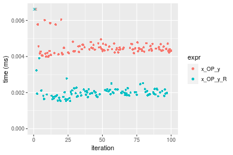

```r
> OP
[1] "-"
> stats <- microbenchmark(x_OP_y = x_OP_y(x, y, OP = OP, na.rm = FALSE), x_OP_y_R = x_OP_y_R(x, y, 
+     OP = OP, na.rm = FALSE), unit = "ms")
> gc()
           used  (Mb) gc trigger  (Mb) max used  (Mb)
Ncells  5347786 285.7   10014072 534.9 10014072 534.9
Vcells 10069449  76.9   36267018 276.7 90959857 694.0
```

_Table: Benchmarking of x_OP_y() and x_OP_y_R() on integer+10x10+sub data. The top panel shows times in milliseconds and the bottom panel shows relative times._


|   |expr     |      min|        lq|      mean|    median|        uq|      max|
|:--|:--------|--------:|---------:|---------:|---------:|---------:|--------:|
|2  |x_OP_y_R | 0.001890| 0.0021620| 0.0024241| 0.0022405| 0.0023710| 0.013430|
|1  |x_OP_y   | 0.004391| 0.0047615| 0.0051270| 0.0048935| 0.0050605| 0.023877|


|   |expr     |     min|       lq|    mean|   median|       uq|      max|
|:--|:--------|-------:|--------:|-------:|--------:|--------:|--------:|
|2  |x_OP_y_R | 1.00000| 1.000000| 1.00000| 1.000000| 1.000000| 1.000000|
|1  |x_OP_y   | 2.32328| 2.202359| 2.11499| 2.184111| 2.134332| 1.777885|

_Figure: Benchmarking of x_OP_y() and x_OP_y_R() on integer+10x10+sub data.  Outliers are displayed as crosses.  Times are in milliseconds._

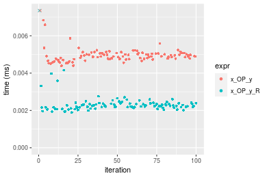

```r
> OP
[1] "*"
> stats <- microbenchmark(x_OP_y = x_OP_y(x, y, OP = OP, na.rm = FALSE), x_OP_y_R = x_OP_y_R(x, y, 
+     OP = OP, na.rm = FALSE), unit = "ms")
> gc()
           used  (Mb) gc trigger  (Mb) max used  (Mb)
Ncells  5347849 285.7   10014072 534.9 10014072 534.9
Vcells 10070003  76.9   36267018 276.7 90959857 694.0
```

_Table: Benchmarking of x_OP_y() and x_OP_y_R() on integer+10x10+mul data. The top panel shows times in milliseconds and the bottom panel shows relative times._


|   |expr     |      min|       lq|      mean|    median|       uq|      max|
|:--|:--------|--------:|--------:|---------:|---------:|--------:|--------:|
|2  |x_OP_y_R | 0.001966| 0.002262| 0.0026530| 0.0023955| 0.002566| 0.017876|
|1  |x_OP_y   | 0.004475| 0.004787| 0.0054388| 0.0049015| 0.005095| 0.025136|


|   |expr     |      min|       lq|     mean|   median|       uq|      max|
|:--|:--------|--------:|--------:|--------:|--------:|--------:|--------:|
|2  |x_OP_y_R | 1.000000| 1.000000| 1.000000| 1.000000| 1.000000| 1.000000|
|1  |x_OP_y   | 2.276195| 2.116269| 2.050087| 2.046128| 1.985581| 1.406131|

_Figure: Benchmarking of x_OP_y() and x_OP_y_R() on integer+10x10+mul data.  Outliers are displayed as crosses.  Times are in milliseconds._

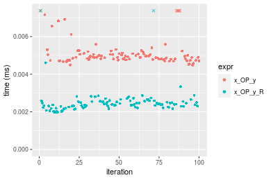

```r
> OP
[1] "/"
> stats <- microbenchmark(x_OP_y = x_OP_y(x, y, OP = OP, na.rm = FALSE), x_OP_y_R = x_OP_y_R(x, y, 
+     OP = OP, na.rm = FALSE), unit = "ms")
> gc()
           used  (Mb) gc trigger  (Mb) max used  (Mb)
Ncells  5347912 285.7   10014072 534.9 10014072 534.9
Vcells 10070045  76.9   36267018 276.7 90959857 694.0
```

_Table: Benchmarking of x_OP_y() and x_OP_y_R() on integer+10x10+div data. The top panel shows times in milliseconds and the bottom panel shows relative times._


|   |expr     |      min|        lq|      mean|    median|        uq|      max|
|:--|:--------|--------:|---------:|---------:|---------:|---------:|--------:|
|2  |x_OP_y_R | 0.001803| 0.0020755| 0.0023724| 0.0022145| 0.0023495| 0.013835|
|1  |x_OP_y   | 0.004429| 0.0047600| 0.0051106| 0.0049045| 0.0050715| 0.022852|


|   |expr     |      min|       lq|     mean|   median|       uq|      max|
|:--|:--------|--------:|--------:|--------:|--------:|--------:|--------:|
|2  |x_OP_y_R | 1.000000| 1.000000| 1.000000| 1.000000| 1.000000| 1.000000|
|1  |x_OP_y   | 2.456462| 2.293423| 2.154195| 2.214721| 2.158544| 1.651753|

_Figure: Benchmarking of x_OP_y() and x_OP_y_R() on integer+10x10+div data.  Outliers are displayed as crosses.  Times are in milliseconds._

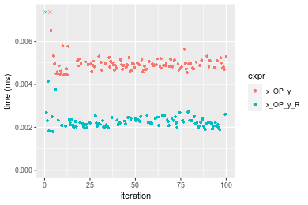


### 100x100 vector

#### All elements
```r
> x <- data[["100x100"]]
> y <- x[, 1L]
```

```r
> OP
[1] "+"
> stats <- microbenchmark(x_OP_y = x_OP_y(x, y, OP = OP, na.rm = FALSE), x_OP_y_R = x_OP_y_R(x, y, 
+     OP = OP, na.rm = FALSE), unit = "ms")
> gc()
           used  (Mb) gc trigger  (Mb) max used  (Mb)
Ncells  5347975 285.7   10014072 534.9 10014072 534.9
Vcells 10070129  76.9   36267018 276.7 90959857 694.0
```

_Table: Benchmarking of x_OP_y() and x_OP_y_R() on integer+100x100+add data. The top panel shows times in milliseconds and the bottom panel shows relative times._


|   |expr     |      min|        lq|      mean|    median|        uq|      max|
|:--|:--------|--------:|---------:|---------:|---------:|---------:|--------:|
|2  |x_OP_y_R | 0.030740| 0.0322435| 0.0338879| 0.0330155| 0.0353695| 0.047705|
|1  |x_OP_y   | 0.058096| 0.0603765| 0.0629508| 0.0612960| 0.0655840| 0.092930|


|   |expr     |      min|       lq|    mean|   median|       uq|      max|
|:--|:--------|--------:|--------:|-------:|--------:|--------:|--------:|
|2  |x_OP_y_R | 1.000000| 1.000000| 1.00000| 1.000000| 1.000000| 1.000000|
|1  |x_OP_y   | 1.889915| 1.872517| 1.85762| 1.856583| 1.854253| 1.948014|

_Figure: Benchmarking of x_OP_y() and x_OP_y_R() on integer+100x100+add data.  Outliers are displayed as crosses.  Times are in milliseconds._


```r
> OP
[1] "-"
> stats <- microbenchmark(x_OP_y = x_OP_y(x, y, OP = OP, na.rm = FALSE), x_OP_y_R = x_OP_y_R(x, y, 
+     OP = OP, na.rm = FALSE), unit = "ms")
> gc()
           used  (Mb) gc trigger  (Mb) max used  (Mb)
Ncells  5348038 285.7   10014072 534.9 10014072 534.9
Vcells 10070377  76.9   36267018 276.7 90959857 694.0
```

_Table: Benchmarking of x_OP_y() and x_OP_y_R() on integer+100x100+sub data. The top panel shows times in milliseconds and the bottom panel shows relative times._


|   |expr     |      min|        lq|      mean|    median|        uq|      max|
|:--|:--------|--------:|---------:|---------:|---------:|---------:|--------:|
|2  |x_OP_y_R | 0.030301| 0.0309450| 0.0329735| 0.0320995| 0.0342020| 0.047821|
|1  |x_OP_y   | 0.054410| 0.0566225| 0.0591763| 0.0573625| 0.0612765| 0.092431|


|   |expr     |     min|       lq|     mean|   median|       uq|      max|
|:--|:--------|-------:|--------:|--------:|--------:|--------:|--------:|
|2  |x_OP_y_R | 1.00000| 1.000000| 1.000000| 1.000000| 1.000000| 1.000000|
|1  |x_OP_y   | 1.79565| 1.829779| 1.794662| 1.787022| 1.791606| 1.932854|

_Figure: Benchmarking of x_OP_y() and x_OP_y_R() on integer+100x100+sub data.  Outliers are displayed as crosses.  Times are in milliseconds._

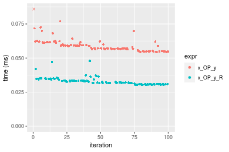

```r
> OP
[1] "*"
> stats <- microbenchmark(x_OP_y = x_OP_y(x, y, OP = OP, na.rm = FALSE), x_OP_y_R = x_OP_y_R(x, y, 
+     OP = OP, na.rm = FALSE), unit = "ms")
> gc()
           used  (Mb) gc trigger  (Mb) max used  (Mb)
Ncells  5348101 285.7   10014072 534.9 10014072 534.9
Vcells 10070675  76.9   36267018 276.7 90959857 694.0
```

_Table: Benchmarking of x_OP_y() and x_OP_y_R() on integer+100x100+mul data. The top panel shows times in milliseconds and the bottom panel shows relative times._


|   |expr     |      min|        lq|      mean|    median|        uq|      max|
|:--|:--------|--------:|---------:|---------:|---------:|---------:|--------:|
|2  |x_OP_y_R | 0.045139| 0.0473950| 0.0503183| 0.0492025| 0.0528305| 0.071638|
|1  |x_OP_y   | 0.052855| 0.0554855| 0.0587904| 0.0579455| 0.0618280| 0.084542|


|   |expr     |      min|       lq|     mean|   median|       uq|      max|
|:--|:--------|--------:|--------:|--------:|--------:|--------:|--------:|
|2  |x_OP_y_R | 1.000000| 1.000000| 1.000000| 1.000000| 1.000000| 1.000000|
|1  |x_OP_y   | 1.170939| 1.170704| 1.168369| 1.177694| 1.170309| 1.180128|

_Figure: Benchmarking of x_OP_y() and x_OP_y_R() on integer+100x100+mul data.  Outliers are displayed as crosses.  Times are in milliseconds._

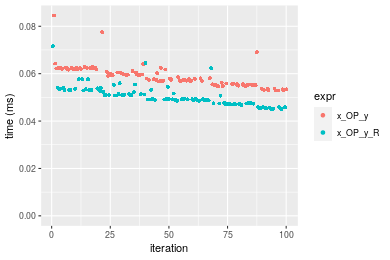

```r
> OP
[1] "/"
> stats <- microbenchmark(x_OP_y = x_OP_y(x, y, OP = OP, na.rm = FALSE), x_OP_y_R = x_OP_y_R(x, y, 
+     OP = OP, na.rm = FALSE), unit = "ms")
> gc()
           used  (Mb) gc trigger  (Mb) max used  (Mb)
Ncells  5348164 285.7   10014072 534.9 10014072 534.9
Vcells 10070717  76.9   36267018 276.7 90959857 694.0
```

_Table: Benchmarking of x_OP_y() and x_OP_y_R() on integer+100x100+div data. The top panel shows times in milliseconds and the bottom panel shows relative times._


|   |expr     |      min|       lq|      mean|    median|        uq|      max|
|:--|:--------|--------:|--------:|---------:|---------:|---------:|--------:|
|2  |x_OP_y_R | 0.019217| 0.020252| 0.0217968| 0.0211305| 0.0217700| 0.039852|
|1  |x_OP_y   | 0.048887| 0.051111| 0.0539126| 0.0530380| 0.0549215| 0.074484|


|   |expr     |      min|       lq|     mean|   median|       uq|      max|
|:--|:--------|--------:|--------:|--------:|--------:|--------:|--------:|
|2  |x_OP_y_R | 1.000000| 1.000000| 1.000000| 1.000000| 1.000000| 1.000000|
|1  |x_OP_y   | 2.543945| 2.523751| 2.473415| 2.510021| 2.522807| 1.869015|

_Figure: Benchmarking of x_OP_y() and x_OP_y_R() on integer+100x100+div data.  Outliers are displayed as crosses.  Times are in milliseconds._

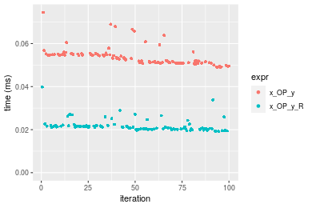


### 1000x10 vector

#### All elements
```r
> x <- data[["1000x10"]]
> y <- x[, 1L]
```

```r
> OP
[1] "+"
> stats <- microbenchmark(x_OP_y = x_OP_y(x, y, OP = OP, na.rm = FALSE), x_OP_y_R = x_OP_y_R(x, y, 
+     OP = OP, na.rm = FALSE), unit = "ms")
> gc()
           used  (Mb) gc trigger  (Mb) max used  (Mb)
Ncells  5348227 285.7   10014072 534.9 10014072 534.9
Vcells 10071513  76.9   36267018 276.7 90959857 694.0
```

_Table: Benchmarking of x_OP_y() and x_OP_y_R() on integer+1000x10+add data. The top panel shows times in milliseconds and the bottom panel shows relative times._


|   |expr     |      min|        lq|      mean|    median|        uq|      max|
|:--|:--------|--------:|---------:|---------:|---------:|---------:|--------:|
|2  |x_OP_y_R | 0.030640| 0.0321435| 0.0340990| 0.0332185| 0.0343725| 0.072899|
|1  |x_OP_y   | 0.055215| 0.0574605| 0.0610642| 0.0595235| 0.0620765| 0.098880|


|   |expr     |      min|       lq|     mean|   median|       uq|      max|
|:--|:--------|--------:|--------:|--------:|--------:|--------:|--------:|
|2  |x_OP_y_R | 1.000000| 1.000000| 1.000000| 1.000000| 1.000000| 1.000000|
|1  |x_OP_y   | 1.802056| 1.787624| 1.790792| 1.791878| 1.805993| 1.356397|

_Figure: Benchmarking of x_OP_y() and x_OP_y_R() on integer+1000x10+add data.  Outliers are displayed as crosses.  Times are in milliseconds._

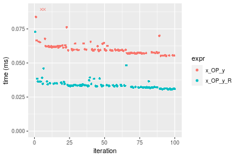

```r
> OP
[1] "-"
> stats <- microbenchmark(x_OP_y = x_OP_y(x, y, OP = OP, na.rm = FALSE), x_OP_y_R = x_OP_y_R(x, y, 
+     OP = OP, na.rm = FALSE), unit = "ms")
> gc()
           used  (Mb) gc trigger  (Mb) max used  (Mb)
Ncells  5348290 285.7   10014072 534.9 10014072 534.9
Vcells 10071555  76.9   36267018 276.7 90959857 694.0
```

_Table: Benchmarking of x_OP_y() and x_OP_y_R() on integer+1000x10+sub data. The top panel shows times in milliseconds and the bottom panel shows relative times._


|   |expr     |      min|        lq|      mean|    median|        uq|      max|
|:--|:--------|--------:|---------:|---------:|---------:|---------:|--------:|
|2  |x_OP_y_R | 0.031358| 0.0330815| 0.0359023| 0.0359345| 0.0366190| 0.070319|
|1  |x_OP_y   | 0.049506| 0.0523580| 0.0546984| 0.0542050| 0.0563695| 0.074503|


|   |expr     |      min|       lq|     mean|   median|       uq|    max|
|:--|:--------|--------:|--------:|--------:|--------:|--------:|------:|
|2  |x_OP_y_R | 1.000000| 1.000000| 1.000000| 1.000000| 1.000000| 1.0000|
|1  |x_OP_y   | 1.578736| 1.582697| 1.523532| 1.508439| 1.539351| 1.0595|

_Figure: Benchmarking of x_OP_y() and x_OP_y_R() on integer+1000x10+sub data.  Outliers are displayed as crosses.  Times are in milliseconds._

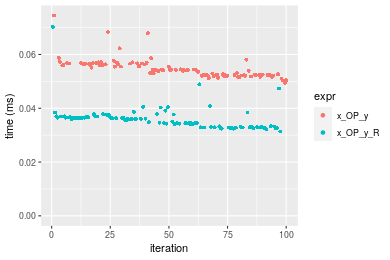

```r
> OP
[1] "*"
> stats <- microbenchmark(x_OP_y = x_OP_y(x, y, OP = OP, na.rm = FALSE), x_OP_y_R = x_OP_y_R(x, y, 
+     OP = OP, na.rm = FALSE), unit = "ms")
> gc()
           used  (Mb) gc trigger  (Mb) max used  (Mb)
Ncells  5348353 285.7   10014072 534.9 10014072 534.9
Vcells 10071983  76.9   36267018 276.7 90959857 694.0
```

_Table: Benchmarking of x_OP_y() and x_OP_y_R() on integer+1000x10+mul data. The top panel shows times in milliseconds and the bottom panel shows relative times._


|   |expr     |      min|        lq|      mean|    median|        uq|      max|
|:--|:--------|--------:|---------:|---------:|---------:|---------:|--------:|
|2  |x_OP_y_R | 0.045334| 0.0472720| 0.0496856| 0.0492085| 0.0513765| 0.060349|
|1  |x_OP_y   | 0.051785| 0.0542515| 0.0572929| 0.0561300| 0.0588195| 0.089114|


|   |expr     |      min|       lq|     mean|   median|       uq|      max|
|:--|:--------|--------:|--------:|--------:|--------:|--------:|--------:|
|2  |x_OP_y_R | 1.000000| 1.000000| 1.000000| 1.000000| 1.000000| 1.000000|
|1  |x_OP_y   | 1.142299| 1.147646| 1.153107| 1.140657| 1.144872| 1.476644|

_Figure: Benchmarking of x_OP_y() and x_OP_y_R() on integer+1000x10+mul data.  Outliers are displayed as crosses.  Times are in milliseconds._

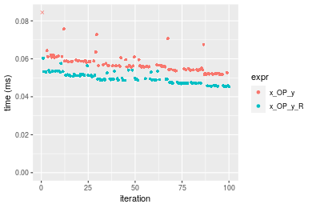

```r
> OP
[1] "/"
> stats <- microbenchmark(x_OP_y = x_OP_y(x, y, OP = OP, na.rm = FALSE), x_OP_y_R = x_OP_y_R(x, y, 
+     OP = OP, na.rm = FALSE), unit = "ms")
> gc()
           used  (Mb) gc trigger  (Mb) max used  (Mb)
Ncells  5348416 285.7   10014072 534.9 10014072 534.9
Vcells 10072025  76.9   36267018 276.7 90959857 694.0
```

_Table: Benchmarking of x_OP_y() and x_OP_y_R() on integer+1000x10+div data. The top panel shows times in milliseconds and the bottom panel shows relative times._


|   |expr     |      min|        lq|      mean|    median|        uq|      max|
|:--|:--------|--------:|---------:|---------:|---------:|---------:|--------:|
|2  |x_OP_y_R | 0.021581| 0.0226485| 0.0242090| 0.0236830| 0.0245510| 0.037548|
|1  |x_OP_y   | 0.055274| 0.0566605| 0.0597714| 0.0588525| 0.0606555| 0.076671|


|   |expr     |      min|       lq|     mean|  median|       uq|      max|
|:--|:--------|--------:|--------:|--------:|-------:|--------:|--------:|
|2  |x_OP_y_R | 1.000000| 1.000000| 1.000000| 1.00000| 1.000000| 1.000000|
|1  |x_OP_y   | 2.561234| 2.501733| 2.468978| 2.48501| 2.470592| 2.041946|

_Figure: Benchmarking of x_OP_y() and x_OP_y_R() on integer+1000x10+div data.  Outliers are displayed as crosses.  Times are in milliseconds._

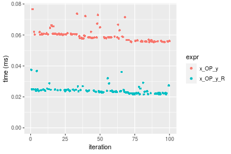


### 10x1000 vector

#### All elements
```r
> x <- data[["10x1000"]]
> y <- x[, 1L]
```

```r
> OP
[1] "+"
> stats <- microbenchmark(x_OP_y = x_OP_y(x, y, OP = OP, na.rm = FALSE), x_OP_y_R = x_OP_y_R(x, y, 
+     OP = OP, na.rm = FALSE), unit = "ms")
> gc()
           used  (Mb) gc trigger  (Mb) max used  (Mb)
Ncells  5348479 285.7   10014072 534.9 10014072 534.9
Vcells 10072010  76.9   36267018 276.7 90959857 694.0
```

_Table: Benchmarking of x_OP_y() and x_OP_y_R() on integer+10x1000+add data. The top panel shows times in milliseconds and the bottom panel shows relative times._


|   |expr     |      min|        lq|      mean|   median|        uq|      max|
|:--|:--------|--------:|---------:|---------:|--------:|---------:|--------:|
|2  |x_OP_y_R | 0.030805| 0.0317525| 0.0338801| 0.033139| 0.0348565| 0.049900|
|1  |x_OP_y   | 0.057153| 0.0596050| 0.0630557| 0.062468| 0.0647595| 0.095871|


|   |expr     |      min|       lq|     mean|  median|       uq|      max|
|:--|:--------|--------:|--------:|--------:|-------:|--------:|--------:|
|2  |x_OP_y_R | 1.000000| 1.000000| 1.000000| 1.00000| 1.000000| 1.000000|
|1  |x_OP_y   | 1.855316| 1.877175| 1.861144| 1.88503| 1.857889| 1.921263|

_Figure: Benchmarking of x_OP_y() and x_OP_y_R() on integer+10x1000+add data.  Outliers are displayed as crosses.  Times are in milliseconds._


```r
> OP
[1] "-"
> stats <- microbenchmark(x_OP_y = x_OP_y(x, y, OP = OP, na.rm = FALSE), x_OP_y_R = x_OP_y_R(x, y, 
+     OP = OP, na.rm = FALSE), unit = "ms")
> gc()
           used  (Mb) gc trigger  (Mb) max used  (Mb)
Ncells  5348542 285.7   10014072 534.9 10014072 534.9
Vcells 10072052  76.9   36267018 276.7 90959857 694.0
```

_Table: Benchmarking of x_OP_y() and x_OP_y_R() on integer+10x1000+sub data. The top panel shows times in milliseconds and the bottom panel shows relative times._


|   |expr     |      min|        lq|      mean|    median|       uq|      max|
|:--|:--------|--------:|---------:|---------:|---------:|--------:|--------:|
|2  |x_OP_y_R | 0.030495| 0.0309280| 0.0337407| 0.0322520| 0.033891| 0.062243|
|1  |x_OP_y   | 0.055286| 0.0568985| 0.0599171| 0.0596755| 0.060924| 0.085506|


|   |expr     |      min|       lq|     mean|   median|       uq|      max|
|:--|:--------|--------:|--------:|--------:|--------:|--------:|--------:|
|2  |x_OP_y_R | 1.000000| 1.000000| 1.000000| 1.000000| 1.000000| 1.000000|
|1  |x_OP_y   | 1.812953| 1.839708| 1.775812| 1.850288| 1.797645| 1.373745|

_Figure: Benchmarking of x_OP_y() and x_OP_y_R() on integer+10x1000+sub data.  Outliers are displayed as crosses.  Times are in milliseconds._

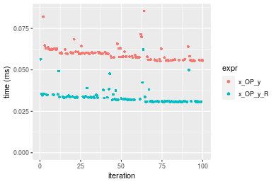

```r
> OP
[1] "*"
> stats <- microbenchmark(x_OP_y = x_OP_y(x, y, OP = OP, na.rm = FALSE), x_OP_y_R = x_OP_y_R(x, y, 
+     OP = OP, na.rm = FALSE), unit = "ms")
> gc()
           used  (Mb) gc trigger  (Mb) max used  (Mb)
Ncells  5348605 285.7   10014072 534.9 10014072 534.9
Vcells 10072616  76.9   36267018 276.7 90959857 694.0
```

_Table: Benchmarking of x_OP_y() and x_OP_y_R() on integer+10x1000+mul data. The top panel shows times in milliseconds and the bottom panel shows relative times._


|   |expr     |      min|       lq|      mean|    median|       uq|      max|
|:--|:--------|--------:|--------:|---------:|---------:|--------:|--------:|
|2  |x_OP_y_R | 0.045504| 0.048769| 0.0509615| 0.0508195| 0.052930| 0.069355|
|1  |x_OP_y   | 0.054706| 0.058915| 0.0613681| 0.0612675| 0.063792| 0.095293|


|   |expr     |      min|       lq|     mean|  median|       uq|      max|
|:--|:--------|--------:|--------:|--------:|-------:|--------:|--------:|
|2  |x_OP_y_R | 1.000000| 1.000000| 1.000000| 1.00000| 1.000000| 1.000000|
|1  |x_OP_y   | 1.202224| 1.208042| 1.204204| 1.20559| 1.205214| 1.373989|

_Figure: Benchmarking of x_OP_y() and x_OP_y_R() on integer+10x1000+mul data.  Outliers are displayed as crosses.  Times are in milliseconds._

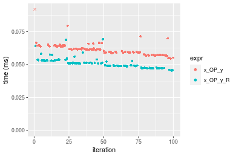

```r
> OP
[1] "/"
> stats <- microbenchmark(x_OP_y = x_OP_y(x, y, OP = OP, na.rm = FALSE), x_OP_y_R = x_OP_y_R(x, y, 
+     OP = OP, na.rm = FALSE), unit = "ms")
> gc()
           used  (Mb) gc trigger  (Mb) max used  (Mb)
Ncells  5348668 285.7   10014072 534.9 10014072 534.9
Vcells 10072658  76.9   36267018 276.7 90959857 694.0
```

_Table: Benchmarking of x_OP_y() and x_OP_y_R() on integer+10x1000+div data. The top panel shows times in milliseconds and the bottom panel shows relative times._


|   |expr     |      min|       lq|      mean|    median|        uq|      max|
|:--|:--------|--------:|--------:|---------:|---------:|---------:|--------:|
|2  |x_OP_y_R | 0.020956| 0.022160| 0.0234105| 0.0229805| 0.0238755| 0.035075|
|1  |x_OP_y   | 0.054923| 0.057421| 0.0601220| 0.0585070| 0.0617775| 0.084653|


|   |expr     |      min|     lq|    mean|   median|       uq|      max|
|:--|:--------|--------:|------:|-------:|--------:|--------:|--------:|
|2  |x_OP_y_R | 1.000000| 1.0000| 1.00000| 1.000000| 1.000000| 1.000000|
|1  |x_OP_y   | 2.620872| 2.5912| 2.56817| 2.545941| 2.587485| 2.413485|

_Figure: Benchmarking of x_OP_y() and x_OP_y_R() on integer+10x1000+div data.  Outliers are displayed as crosses.  Times are in milliseconds._

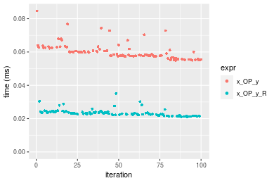


### 100x1000 vector

#### All elements
```r
> x <- data[["100x1000"]]
> y <- x[, 1L]
```

```r
> OP
[1] "+"
> stats <- microbenchmark(x_OP_y = x_OP_y(x, y, OP = OP, na.rm = FALSE), x_OP_y_R = x_OP_y_R(x, y, 
+     OP = OP, na.rm = FALSE), unit = "ms")
> gc()
           used  (Mb) gc trigger  (Mb) max used  (Mb)
Ncells  5348731 285.7   10014072 534.9 10014072 534.9
Vcells 10072742  76.9   36267018 276.7 90959857 694.0
```

_Table: Benchmarking of x_OP_y() and x_OP_y_R() on integer+100x1000+add data. The top panel shows times in milliseconds and the bottom panel shows relative times._


|   |expr     |      min|        lq|      mean|    median|        uq|      max|
|:--|:--------|--------:|---------:|---------:|---------:|---------:|--------:|
|2  |x_OP_y_R | 0.272405| 0.3163565| 0.3303714| 0.3224475| 0.3438365| 0.402515|
|1  |x_OP_y   | 0.485176| 0.4921530| 0.5236957| 0.5030515| 0.5492690| 0.625360|


|   |expr     |      min|       lq|     mean|   median|       uq|      max|
|:--|:--------|--------:|--------:|--------:|--------:|--------:|--------:|
|2  |x_OP_y_R | 1.000000| 1.000000| 1.000000| 1.000000| 1.000000| 1.000000|
|1  |x_OP_y   | 1.781083| 1.555691| 1.585172| 1.560104| 1.597471| 1.553632|

_Figure: Benchmarking of x_OP_y() and x_OP_y_R() on integer+100x1000+add data.  Outliers are displayed as crosses.  Times are in milliseconds._

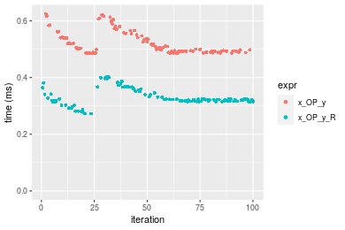

```r
> OP
[1] "-"
> stats <- microbenchmark(x_OP_y = x_OP_y(x, y, OP = OP, na.rm = FALSE), x_OP_y_R = x_OP_y_R(x, y, 
+     OP = OP, na.rm = FALSE), unit = "ms")
> gc()
           used  (Mb) gc trigger  (Mb) max used  (Mb)
Ncells  5348794 285.7   10014072 534.9 10014072 534.9
Vcells 10072784  76.9   36267018 276.7 90959857 694.0
```

_Table: Benchmarking of x_OP_y() and x_OP_y_R() on integer+100x1000+sub data. The top panel shows times in milliseconds and the bottom panel shows relative times._


|   |expr     |      min|        lq|      mean|    median|       uq|     max|
|:--|:--------|--------:|---------:|---------:|---------:|--------:|-------:|
|2  |x_OP_y_R | 0.194327| 0.1949845| 0.2297504| 0.2168935| 0.247345| 0.34896|
|1  |x_OP_y   | 0.347679| 0.3541165| 0.4132739| 0.3990610| 0.452306| 0.59901|


|   |expr     |      min|       lq|     mean|   median|       uq|      max|
|:--|:--------|--------:|--------:|--------:|--------:|--------:|--------:|
|2  |x_OP_y_R | 1.000000| 1.000000| 1.000000| 1.000000| 1.000000| 1.000000|
|1  |x_OP_y   | 1.789144| 1.816126| 1.798795| 1.839894| 1.828644| 1.716558|

_Figure: Benchmarking of x_OP_y() and x_OP_y_R() on integer+100x1000+sub data.  Outliers are displayed as crosses.  Times are in milliseconds._

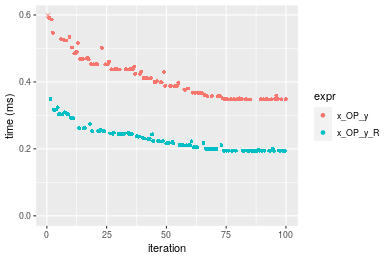

```r
> OP
[1] "*"
> stats <- microbenchmark(x_OP_y = x_OP_y(x, y, OP = OP, na.rm = FALSE), x_OP_y_R = x_OP_y_R(x, y, 
+     OP = OP, na.rm = FALSE), unit = "ms")
> gc()
           used  (Mb) gc trigger  (Mb) max used  (Mb)
Ncells  5348857 285.7   10014072 534.9 10014072 534.9
Vcells 10073482  76.9   36267018 276.7 90959857 694.0
```

_Table: Benchmarking of x_OP_y() and x_OP_y_R() on integer+100x1000+mul data. The top panel shows times in milliseconds and the bottom panel shows relative times._


|   |expr     |      min|        lq|      mean|    median|        uq|      max|
|:--|:--------|--------:|---------:|---------:|---------:|---------:|--------:|
|2  |x_OP_y_R | 0.310599| 0.3113010| 0.3686567| 0.3365975| 0.4043435| 0.650920|
|1  |x_OP_y   | 0.351273| 0.3519605| 0.4071710| 0.3806045| 0.4572300| 0.589233|


|   |expr     |      min|       lq|     mean|   median|       uq|       max|
|:--|:--------|--------:|--------:|--------:|--------:|--------:|---------:|
|2  |x_OP_y_R | 1.000000| 1.000000| 1.000000| 1.000000| 1.000000| 1.0000000|
|1  |x_OP_y   | 1.130953| 1.130612| 1.104472| 1.130741| 1.130796| 0.9052311|

_Figure: Benchmarking of x_OP_y() and x_OP_y_R() on integer+100x1000+mul data.  Outliers are displayed as crosses.  Times are in milliseconds._

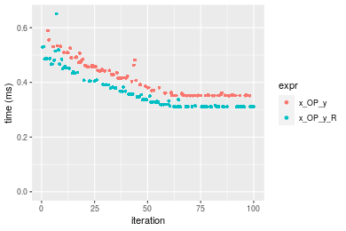

```r
> OP
[1] "/"
> stats <- microbenchmark(x_OP_y = x_OP_y(x, y, OP = OP, na.rm = FALSE), x_OP_y_R = x_OP_y_R(x, y, 
+     OP = OP, na.rm = FALSE), unit = "ms")
> gc()
           used  (Mb) gc trigger  (Mb) max used  (Mb)
Ncells  5348920 285.7   10014072 534.9 10014072 534.9
Vcells 10073524  76.9   36267018 276.7 90959857 694.0
```

_Table: Benchmarking of x_OP_y() and x_OP_y_R() on integer+100x1000+div data. The top panel shows times in milliseconds and the bottom panel shows relative times._


|   |expr     |      min|        lq|      mean|    median|        uq|      max|
|:--|:--------|--------:|---------:|---------:|---------:|---------:|--------:|
|2  |x_OP_y_R | 0.158337| 0.1791110| 0.2954767| 0.3582175| 0.3802295| 0.492017|
|1  |x_OP_y   | 0.409199| 0.4521825| 0.5487595| 0.5694260| 0.5971825| 0.961430|


|   |expr     |      min|       lq|   mean|  median|       uq|      max|
|:--|:--------|--------:|--------:|------:|-------:|--------:|--------:|
|2  |x_OP_y_R | 1.000000| 1.000000| 1.0000| 1.00000| 1.000000| 1.000000|
|1  |x_OP_y   | 2.584355| 2.524594| 1.8572| 1.58961| 1.570584| 1.954058|

_Figure: Benchmarking of x_OP_y() and x_OP_y_R() on integer+100x1000+div data.  Outliers are displayed as crosses.  Times are in milliseconds._

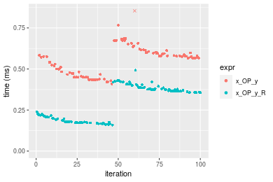


### 1000x100 vector

#### All elements
```r
> x <- data[["1000x100"]]
> y <- x[, 1L]
```

```r
> OP
[1] "+"
> stats <- microbenchmark(x_OP_y = x_OP_y(x, y, OP = OP, na.rm = FALSE), x_OP_y_R = x_OP_y_R(x, y, 
+     OP = OP, na.rm = FALSE), unit = "ms")
> gc()
           used  (Mb) gc trigger  (Mb) max used  (Mb)
Ncells  5348983 285.7   10014072 534.9 10014072 534.9
Vcells 10074016  76.9   36267018 276.7 90959857 694.0
```

_Table: Benchmarking of x_OP_y() and x_OP_y_R() on integer+1000x100+add data. The top panel shows times in milliseconds and the bottom panel shows relative times._


|   |expr     |      min|        lq|      mean|    median|       uq|      max|
|:--|:--------|--------:|---------:|---------:|---------:|--------:|--------:|
|2  |x_OP_y_R | 0.259968| 0.3237895| 0.3353871| 0.3314085| 0.356282| 0.413562|
|1  |x_OP_y   | 0.474361| 0.4840340| 0.5192371| 0.4979335| 0.551690| 0.630375|


|   |expr     |     min|       lq|     mean|   median|       uq|      max|
|:--|:--------|-------:|--------:|--------:|--------:|--------:|--------:|
|2  |x_OP_y_R | 1.00000| 1.000000| 1.000000| 1.000000| 1.000000| 1.000000|
|1  |x_OP_y   | 1.82469| 1.494903| 1.548173| 1.502477| 1.548464| 1.524258|

_Figure: Benchmarking of x_OP_y() and x_OP_y_R() on integer+1000x100+add data.  Outliers are displayed as crosses.  Times are in milliseconds._

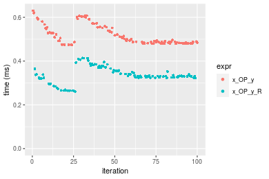

```r
> OP
[1] "-"
> stats <- microbenchmark(x_OP_y = x_OP_y(x, y, OP = OP, na.rm = FALSE), x_OP_y_R = x_OP_y_R(x, y, 
+     OP = OP, na.rm = FALSE), unit = "ms")
> gc()
           used  (Mb) gc trigger  (Mb) max used  (Mb)
Ncells  5349046 285.7   10014072 534.9 10014072 534.9
Vcells 10074817  76.9   36267018 276.7 90959857 694.0
```

_Table: Benchmarking of x_OP_y() and x_OP_y_R() on integer+1000x100+sub data. The top panel shows times in milliseconds and the bottom panel shows relative times._


|   |expr     |      min|        lq|      mean|    median|        uq|      max|
|:--|:--------|--------:|---------:|---------:|---------:|---------:|--------:|
|2  |x_OP_y_R | 0.236937| 0.2408225| 0.2803514| 0.2727265| 0.3052170| 0.474327|
|1  |x_OP_y   | 0.339646| 0.3440325| 0.4000211| 0.3797275| 0.4429895| 0.613672|


|   |expr     |      min|       lq|     mean|   median|       uq|      max|
|:--|:--------|--------:|--------:|--------:|--------:|--------:|--------:|
|2  |x_OP_y_R | 1.000000| 1.000000| 1.000000| 1.000000| 1.000000| 1.000000|
|1  |x_OP_y   | 1.433487| 1.428573| 1.426856| 1.392338| 1.451392| 1.293774|

_Figure: Benchmarking of x_OP_y() and x_OP_y_R() on integer+1000x100+sub data.  Outliers are displayed as crosses.  Times are in milliseconds._

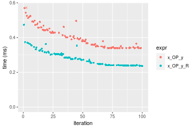

```r
> OP
[1] "*"
> stats <- microbenchmark(x_OP_y = x_OP_y(x, y, OP = OP, na.rm = FALSE), x_OP_y_R = x_OP_y_R(x, y, 
+     OP = OP, na.rm = FALSE), unit = "ms")
> gc()
           used  (Mb) gc trigger  (Mb) max used  (Mb)
Ncells  5349109 285.7   10014072 534.9 10014072 534.9
Vcells 10074859  76.9   36267018 276.7 90959857 694.0
```

_Table: Benchmarking of x_OP_y() and x_OP_y_R() on integer+1000x100+mul data. The top panel shows times in milliseconds and the bottom panel shows relative times._


|   |expr     |      min|        lq|      mean|   median|        uq|      max|
|:--|:--------|--------:|---------:|---------:|--------:|---------:|--------:|
|2  |x_OP_y_R | 0.310455| 0.3109865| 0.3606852| 0.333080| 0.3914650| 0.542960|
|1  |x_OP_y   | 0.343240| 0.3442655| 0.3975342| 0.374303| 0.4330615| 0.587176|


|   |expr     |      min|       lq|     mean|   median|       uq|      max|
|:--|:--------|--------:|--------:|--------:|--------:|--------:|--------:|
|2  |x_OP_y_R | 1.000000| 1.000000| 1.000000| 1.000000| 1.000000| 1.000000|
|1  |x_OP_y   | 1.105603| 1.107011| 1.102164| 1.123763| 1.106259| 1.081435|

_Figure: Benchmarking of x_OP_y() and x_OP_y_R() on integer+1000x100+mul data.  Outliers are displayed as crosses.  Times are in milliseconds._

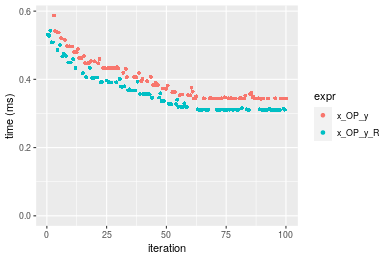

```r
> OP
[1] "/"
> stats <- microbenchmark(x_OP_y = x_OP_y(x, y, OP = OP, na.rm = FALSE), x_OP_y_R = x_OP_y_R(x, y, 
+     OP = OP, na.rm = FALSE), unit = "ms")
> gc()
           used  (Mb) gc trigger  (Mb) max used  (Mb)
Ncells  5349172 285.7   10014072 534.9 10014072 534.9
Vcells 10074901  76.9   36267018 276.7 90959857 694.0
```

_Table: Benchmarking of x_OP_y() and x_OP_y_R() on integer+1000x100+div data. The top panel shows times in milliseconds and the bottom panel shows relative times._


|   |expr     |      min|        lq|      mean|    median|        uq|      max|
|:--|:--------|--------:|---------:|---------:|---------:|---------:|--------:|
|2  |x_OP_y_R | 0.157131| 0.1789320| 0.2878814| 0.3603345| 0.3728455| 0.427058|
|1  |x_OP_y   | 0.401173| 0.4501595| 0.5330756| 0.5609090| 0.5839040| 0.684871|


|   |expr     |      min|       lq|     mean|   median|       uq|      max|
|:--|:--------|--------:|--------:|--------:|--------:|--------:|--------:|
|2  |x_OP_y_R | 1.000000| 1.000000| 1.000000| 1.000000| 1.000000| 1.000000|
|1  |x_OP_y   | 2.553112| 2.515813| 1.851719| 1.556634| 1.566075| 1.603695|

_Figure: Benchmarking of x_OP_y() and x_OP_y_R() on integer+1000x100+div data.  Outliers are displayed as crosses.  Times are in milliseconds._

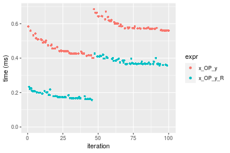


## Data type "double"
### Data
```r
> rmatrix <- function(nrow, ncol, mode = c("logical", "double", "integer", "index"), range = c(-100, 
+     +100), na_prob = 0) {
+     mode <- match.arg(mode)
+     n <- nrow * ncol
+     if (mode == "logical") {
+         x <- sample(c(FALSE, TRUE), size = n, replace = TRUE)
+     }     else if (mode == "index") {
+         x <- seq_len(n)
+         mode <- "integer"
+     }     else {
+         x <- runif(n, min = range[1], max = range[2])
+     }
+     storage.mode(x) <- mode
+     if (na_prob > 0) 
+         x[sample(n, size = na_prob * n)] <- NA
+     dim(x) <- c(nrow, ncol)
+     x
+ }
> rmatrices <- function(scale = 10, seed = 1, ...) {
+     set.seed(seed)
+     data <- list()
+     data[[1]] <- rmatrix(nrow = scale * 1, ncol = scale * 1, ...)
+     data[[2]] <- rmatrix(nrow = scale * 10, ncol = scale * 10, ...)
+     data[[3]] <- rmatrix(nrow = scale * 100, ncol = scale * 1, ...)
+     data[[4]] <- t(data[[3]])
+     data[[5]] <- rmatrix(nrow = scale * 10, ncol = scale * 100, ...)
+     data[[6]] <- t(data[[5]])
+     names(data) <- sapply(data, FUN = function(x) paste(dim(x), collapse = "x"))
+     data
+ }
> data <- rmatrices(mode = mode)
```

### Results

### 10x10 vector

#### All elements
```r
> x <- data[["10x10"]]
> y <- x[, 1L]
```

```r
> OP
[1] "+"
> stats <- microbenchmark(x_OP_y = x_OP_y(x, y, OP = OP, na.rm = FALSE), x_OP_y_R = x_OP_y_R(x, y, 
+     OP = OP, na.rm = FALSE), unit = "ms")
> gc()
           used  (Mb) gc trigger  (Mb) max used  (Mb)
Ncells  5349235 285.7   10014072 534.9 10014072 534.9
Vcells 10189509  77.8   36267018 276.7 90959857 694.0
```

_Table: Benchmarking of x_OP_y() and x_OP_y_R() on double+10x10+add data. The top panel shows times in milliseconds and the bottom panel shows relative times._


|   |expr     |      min|        lq|      mean|   median|       uq|      max|
|:--|:--------|--------:|---------:|---------:|--------:|--------:|--------:|
|2  |x_OP_y_R | 0.001623| 0.0018775| 0.0021400| 0.001998| 0.002138| 0.013756|
|1  |x_OP_y   | 0.004141| 0.0045135| 0.0048743| 0.004649| 0.004779| 0.023828|


|   |expr     |      min|       lq|     mean|   median|       uq|     max|
|:--|:--------|--------:|--------:|--------:|--------:|--------:|-------:|
|2  |x_OP_y_R | 1.000000| 1.000000| 1.000000| 1.000000| 1.000000| 1.00000|
|1  |x_OP_y   | 2.551448| 2.403995| 2.277697| 2.326827| 2.235267| 1.73219|

_Figure: Benchmarking of x_OP_y() and x_OP_y_R() on double+10x10+add data.  Outliers are displayed as crosses.  Times are in milliseconds._

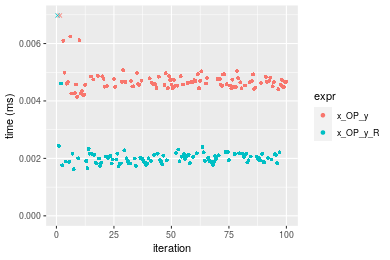

```r
> OP
[1] "-"
> stats <- microbenchmark(x_OP_y = x_OP_y(x, y, OP = OP, na.rm = FALSE), x_OP_y_R = x_OP_y_R(x, y, 
+     OP = OP, na.rm = FALSE), unit = "ms")
> gc()
           used  (Mb) gc trigger  (Mb) max used  (Mb)
Ncells  5349298 285.7   10014072 534.9 10014072 534.9
Vcells 10190468  77.8   36267018 276.7 90959857 694.0
```

_Table: Benchmarking of x_OP_y() and x_OP_y_R() on double+10x10+sub data. The top panel shows times in milliseconds and the bottom panel shows relative times._


|   |expr     |      min|        lq|      mean|    median|        uq|      max|
|:--|:--------|--------:|---------:|---------:|---------:|---------:|--------:|
|2  |x_OP_y_R | 0.001722| 0.0019680| 0.0022309| 0.0020855| 0.0022000| 0.014209|
|1  |x_OP_y   | 0.004285| 0.0045305| 0.0049194| 0.0046755| 0.0048565| 0.023073|


|   |expr     |      min|       lq|     mean|   median|     uq|     max|
|:--|:--------|--------:|--------:|--------:|--------:|------:|-------:|
|2  |x_OP_y_R | 1.000000| 1.000000| 1.000000| 1.000000| 1.0000| 1.00000|
|1  |x_OP_y   | 2.488386| 2.302083| 2.205136| 2.241908| 2.2075| 1.62383|

_Figure: Benchmarking of x_OP_y() and x_OP_y_R() on double+10x10+sub data.  Outliers are displayed as crosses.  Times are in milliseconds._

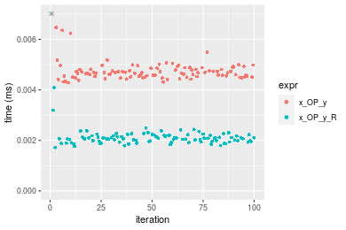

```r
> OP
[1] "*"
> stats <- microbenchmark(x_OP_y = x_OP_y(x, y, OP = OP, na.rm = FALSE), x_OP_y_R = x_OP_y_R(x, y, 
+     OP = OP, na.rm = FALSE), unit = "ms")
> gc()
           used  (Mb) gc trigger  (Mb) max used  (Mb)
Ncells  5349361 285.7   10014072 534.9 10014072 534.9
Vcells 10190510  77.8   36267018 276.7 90959857 694.0
```

_Table: Benchmarking of x_OP_y() and x_OP_y_R() on double+10x10+mul data. The top panel shows times in milliseconds and the bottom panel shows relative times._


|   |expr     |      min|        lq|      mean|    median|       uq|      max|
|:--|:--------|--------:|---------:|---------:|---------:|--------:|--------:|
|2  |x_OP_y_R | 0.001579| 0.0019385| 0.0021715| 0.0021080| 0.002194| 0.008696|
|1  |x_OP_y   | 0.004291| 0.0044825| 0.0049030| 0.0046295| 0.004780| 0.027721|


|   |expr     |      min|       lq|     mean|   median|       uq|      max|
|:--|:--------|--------:|--------:|--------:|--------:|--------:|--------:|
|2  |x_OP_y_R | 1.000000| 1.000000| 1.000000| 1.000000| 1.000000| 1.000000|
|1  |x_OP_y   | 2.717543| 2.312355| 2.257896| 2.196157| 2.178669| 3.187788|

_Figure: Benchmarking of x_OP_y() and x_OP_y_R() on double+10x10+mul data.  Outliers are displayed as crosses.  Times are in milliseconds._

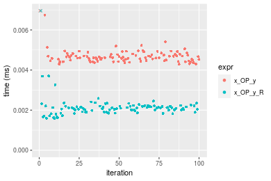

```r
> OP
[1] "/"
> stats <- microbenchmark(x_OP_y = x_OP_y(x, y, OP = OP, na.rm = FALSE), x_OP_y_R = x_OP_y_R(x, y, 
+     OP = OP, na.rm = FALSE), unit = "ms")
> gc()
           used  (Mb) gc trigger  (Mb) max used  (Mb)
Ncells  5349424 285.7   10014072 534.9 10014072 534.9
Vcells 10190552  77.8   36267018 276.7 90959857 694.0
```

_Table: Benchmarking of x_OP_y() and x_OP_y_R() on double+10x10+div data. The top panel shows times in milliseconds and the bottom panel shows relative times._


|   |expr     |      min|        lq|      mean|    median|        uq|      max|
|:--|:--------|--------:|---------:|---------:|---------:|---------:|--------:|
|2  |x_OP_y_R | 0.001687| 0.0019715| 0.0022436| 0.0021245| 0.0022325| 0.012961|
|1  |x_OP_y   | 0.004201| 0.0045640| 0.0049111| 0.0047055| 0.0048635| 0.022288|


|   |expr     |      min|       lq|     mean|   median|       uq|     max|
|:--|:--------|--------:|--------:|--------:|--------:|--------:|-------:|
|2  |x_OP_y_R | 1.000000| 1.000000| 1.000000| 1.000000| 1.000000| 1.00000|
|1  |x_OP_y   | 2.490219| 2.314989| 2.188928| 2.214874| 2.178499| 1.71962|

_Figure: Benchmarking of x_OP_y() and x_OP_y_R() on double+10x10+div data.  Outliers are displayed as crosses.  Times are in milliseconds._

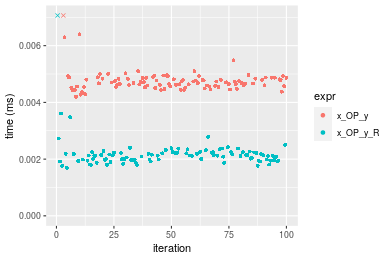


### 100x100 vector

#### All elements
```r
> x <- data[["100x100"]]
> y <- x[, 1L]
```

```r
> OP
[1] "+"
> stats <- microbenchmark(x_OP_y = x_OP_y(x, y, OP = OP, na.rm = FALSE), x_OP_y_R = x_OP_y_R(x, y, 
+     OP = OP, na.rm = FALSE), unit = "ms")
> gc()
           used  (Mb) gc trigger  (Mb) max used  (Mb)
Ncells  5349487 285.7   10014072 534.9 10014072 534.9
Vcells 10190678  77.8   36267018 276.7 90959857 694.0
```

_Table: Benchmarking of x_OP_y() and x_OP_y_R() on double+100x100+add data. The top panel shows times in milliseconds and the bottom panel shows relative times._


|   |expr     |      min|        lq|      mean|    median|        uq|      max|
|:--|:--------|--------:|---------:|---------:|---------:|---------:|--------:|
|2  |x_OP_y_R | 0.015719| 0.0170345| 0.0184104| 0.0177745| 0.0183055| 0.033125|
|1  |x_OP_y   | 0.033147| 0.0351520| 0.0371898| 0.0362635| 0.0369595| 0.067355|


|   |expr     |      min|       lq|     mean|   median|       uq|      max|
|:--|:--------|--------:|--------:|--------:|--------:|--------:|--------:|
|2  |x_OP_y_R | 1.000000| 1.000000| 1.000000| 1.000000| 1.000000| 1.000000|
|1  |x_OP_y   | 2.108722| 2.063577| 2.020048| 2.040198| 2.019038| 2.033358|

_Figure: Benchmarking of x_OP_y() and x_OP_y_R() on double+100x100+add data.  Outliers are displayed as crosses.  Times are in milliseconds._

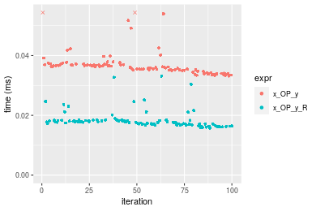

```r
> OP
[1] "-"
> stats <- microbenchmark(x_OP_y = x_OP_y(x, y, OP = OP, na.rm = FALSE), x_OP_y_R = x_OP_y_R(x, y, 
+     OP = OP, na.rm = FALSE), unit = "ms")
> gc()
           used  (Mb) gc trigger  (Mb) max used  (Mb)
Ncells  5349550 285.7   10014072 534.9 10014072 534.9
Vcells 10190720  77.8   36267018 276.7 90959857 694.0
```

_Table: Benchmarking of x_OP_y() and x_OP_y_R() on double+100x100+sub data. The top panel shows times in milliseconds and the bottom panel shows relative times._


|   |expr     |      min|        lq|      mean|    median|        uq|      max|
|:--|:--------|--------:|---------:|---------:|---------:|---------:|--------:|
|2  |x_OP_y_R | 0.016880| 0.0177155| 0.0193898| 0.0184270| 0.0190765| 0.036735|
|1  |x_OP_y   | 0.035634| 0.0361930| 0.0383148| 0.0373945| 0.0379810| 0.073671|


|   |expr     |      min|       lq|     mean|   median|       uq|      max|
|:--|:--------|--------:|--------:|--------:|--------:|--------:|--------:|
|2  |x_OP_y_R | 1.000000| 1.000000| 1.000000| 1.000000| 1.000000| 1.000000|
|1  |x_OP_y   | 2.111019| 2.043013| 1.976024| 2.029332| 1.990984| 2.005472|

_Figure: Benchmarking of x_OP_y() and x_OP_y_R() on double+100x100+sub data.  Outliers are displayed as crosses.  Times are in milliseconds._


```r
> OP
[1] "*"
> stats <- microbenchmark(x_OP_y = x_OP_y(x, y, OP = OP, na.rm = FALSE), x_OP_y_R = x_OP_y_R(x, y, 
+     OP = OP, na.rm = FALSE), unit = "ms")
> gc()
           used  (Mb) gc trigger  (Mb) max used  (Mb)
Ncells  5349613 285.8   10014072 534.9 10014072 534.9
Vcells 10190762  77.8   36267018 276.7 90959857 694.0
```

_Table: Benchmarking of x_OP_y() and x_OP_y_R() on double+100x100+mul data. The top panel shows times in milliseconds and the bottom panel shows relative times._


|   |expr     |      min|        lq|      mean|   median|        uq|      max|
|:--|:--------|--------:|---------:|---------:|--------:|---------:|--------:|
|2  |x_OP_y_R | 0.013489| 0.0143085| 0.0157961| 0.014733| 0.0151640| 0.046594|
|1  |x_OP_y   | 0.025436| 0.0259275| 0.0285322| 0.026373| 0.0294375| 0.051689|


|   |expr     |      min|       lq|     mean|   median|       uq|      max|
|:--|:--------|--------:|--------:|--------:|--------:|--------:|--------:|
|2  |x_OP_y_R | 1.000000| 1.000000| 1.000000| 1.000000| 1.000000| 1.000000|
|1  |x_OP_y   | 1.885685| 1.812035| 1.806285| 1.790063| 1.941275| 1.109349|

_Figure: Benchmarking of x_OP_y() and x_OP_y_R() on double+100x100+mul data.  Outliers are displayed as crosses.  Times are in milliseconds._

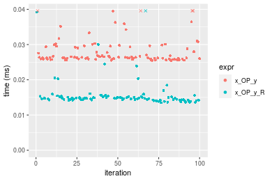

```r
> OP
[1] "/"
> stats <- microbenchmark(x_OP_y = x_OP_y(x, y, OP = OP, na.rm = FALSE), x_OP_y_R = x_OP_y_R(x, y, 
+     OP = OP, na.rm = FALSE), unit = "ms")
> gc()
           used  (Mb) gc trigger  (Mb) max used  (Mb)
Ncells  5349676 285.8   10014072 534.9 10014072 534.9
Vcells 10191929  77.8   36267018 276.7 90959857 694.0
```

_Table: Benchmarking of x_OP_y() and x_OP_y_R() on double+100x100+div data. The top panel shows times in milliseconds and the bottom panel shows relative times._


|   |expr     |      min|        lq|      mean|    median|        uq|      max|
|:--|:--------|--------:|---------:|---------:|---------:|---------:|--------:|
|2  |x_OP_y_R | 0.016460| 0.0177615| 0.0195727| 0.0184085| 0.0189330| 0.037223|
|1  |x_OP_y   | 0.034431| 0.0362465| 0.0388870| 0.0375160| 0.0385065| 0.072591|


|   |expr     |      min|       lq|     mean|   median|      uq|      max|
|:--|:--------|--------:|--------:|--------:|--------:|-------:|--------:|
|2  |x_OP_y_R | 1.000000| 1.000000| 1.000000| 1.000000| 1.00000| 1.000000|
|1  |x_OP_y   | 2.091798| 2.040734| 1.986795| 2.037972| 2.03383| 1.950165|

_Figure: Benchmarking of x_OP_y() and x_OP_y_R() on double+100x100+div data.  Outliers are displayed as crosses.  Times are in milliseconds._

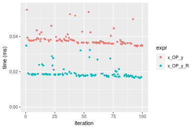


### 1000x10 vector

#### All elements
```r
> x <- data[["1000x10"]]
> y <- x[, 1L]
```

```r
> OP
[1] "+"
> stats <- microbenchmark(x_OP_y = x_OP_y(x, y, OP = OP, na.rm = FALSE), x_OP_y_R = x_OP_y_R(x, y, 
+     OP = OP, na.rm = FALSE), unit = "ms")
> gc()
           used  (Mb) gc trigger  (Mb) max used  (Mb)
Ncells  5349739 285.8   10014072 534.9 10014072 534.9
Vcells 10192871  77.8   36267018 276.7 90959857 694.0
```

_Table: Benchmarking of x_OP_y() and x_OP_y_R() on double+1000x10+add data. The top panel shows times in milliseconds and the bottom panel shows relative times._


|   |expr     |      min|       lq|      mean|   median|       uq|      max|
|:--|:--------|--------:|--------:|---------:|--------:|--------:|--------:|
|2  |x_OP_y_R | 0.013611| 0.014715| 0.0168680| 0.015136| 0.016178| 0.046787|
|1  |x_OP_y   | 0.028111| 0.028634| 0.0321155| 0.029328| 0.030053| 0.062657|


|   |expr     |      min|       lq|     mean|   median|       uq|      max|
|:--|:--------|--------:|--------:|--------:|--------:|--------:|--------:|
|2  |x_OP_y_R | 1.000000| 1.000000| 1.000000| 1.000000| 1.000000| 1.000000|
|1  |x_OP_y   | 2.065315| 1.945906| 1.903927| 1.937632| 1.857646| 1.339197|

_Figure: Benchmarking of x_OP_y() and x_OP_y_R() on double+1000x10+add data.  Outliers are displayed as crosses.  Times are in milliseconds._

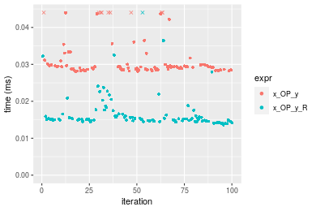

```r
> OP
[1] "-"
> stats <- microbenchmark(x_OP_y = x_OP_y(x, y, OP = OP, na.rm = FALSE), x_OP_y_R = x_OP_y_R(x, y, 
+     OP = OP, na.rm = FALSE), unit = "ms")
> gc()
           used  (Mb) gc trigger  (Mb) max used  (Mb)
Ncells  5349802 285.8   10014072 534.9 10014072 534.9
Vcells 10192913  77.8   36267018 276.7 90959857 694.0
```

_Table: Benchmarking of x_OP_y() and x_OP_y_R() on double+1000x10+sub data. The top panel shows times in milliseconds and the bottom panel shows relative times._


|   |expr     |      min|        lq|      mean|    median|        uq|      max|
|:--|:--------|--------:|---------:|---------:|---------:|---------:|--------:|
|2  |x_OP_y_R | 0.015233| 0.0160120| 0.0261187| 0.0273335| 0.0356400| 0.043568|
|1  |x_OP_y   | 0.031189| 0.0317265| 0.0454132| 0.0341300| 0.0628775| 0.075333|


|   |expr     |      min|      lq|    mean|   median|      uq|     max|
|:--|:--------|--------:|-------:|-------:|--------:|-------:|-------:|
|2  |x_OP_y_R | 1.000000| 1.00000| 1.00000| 1.000000| 1.00000| 1.00000|
|1  |x_OP_y   | 2.047463| 1.98142| 1.73872| 1.248651| 1.76424| 1.72909|

_Figure: Benchmarking of x_OP_y() and x_OP_y_R() on double+1000x10+sub data.  Outliers are displayed as crosses.  Times are in milliseconds._

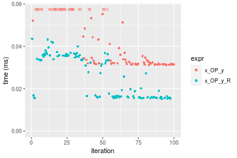

```r
> OP
[1] "*"
> stats <- microbenchmark(x_OP_y = x_OP_y(x, y, OP = OP, na.rm = FALSE), x_OP_y_R = x_OP_y_R(x, y, 
+     OP = OP, na.rm = FALSE), unit = "ms")
> gc()
           used  (Mb) gc trigger  (Mb) max used  (Mb)
Ncells  5349865 285.8   10014072 534.9 10014072 534.9
Vcells 10192955  77.8   36267018 276.7 90959857 694.0
```

_Table: Benchmarking of x_OP_y() and x_OP_y_R() on double+1000x10+mul data. The top panel shows times in milliseconds and the bottom panel shows relative times._


|   |expr     |      min|        lq|      mean|   median|        uq|      max|
|:--|:--------|--------:|---------:|---------:|--------:|---------:|--------:|
|2  |x_OP_y_R | 0.015540| 0.0167485| 0.0181830| 0.017432| 0.0181995| 0.034775|
|1  |x_OP_y   | 0.028494| 0.0305755| 0.0341685| 0.032008| 0.0348370| 0.077209|


|   |expr     |      min|       lq|     mean|   median|       uq|      max|
|:--|:--------|--------:|--------:|--------:|--------:|--------:|--------:|
|2  |x_OP_y_R | 1.000000| 1.000000| 1.000000| 1.000000| 1.000000| 1.000000|
|1  |x_OP_y   | 1.833591| 1.825567| 1.879141| 1.836163| 1.914173| 2.220244|

_Figure: Benchmarking of x_OP_y() and x_OP_y_R() on double+1000x10+mul data.  Outliers are displayed as crosses.  Times are in milliseconds._

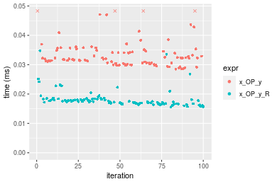

```r
> OP
[1] "/"
> stats <- microbenchmark(x_OP_y = x_OP_y(x, y, OP = OP, na.rm = FALSE), x_OP_y_R = x_OP_y_R(x, y, 
+     OP = OP, na.rm = FALSE), unit = "ms")
> gc()
           used  (Mb) gc trigger  (Mb) max used  (Mb)
Ncells  5349928 285.8   10014072 534.9 10014072 534.9
Vcells 10192997  77.8   36267018 276.7 90959857 694.0
```

_Table: Benchmarking of x_OP_y() and x_OP_y_R() on double+1000x10+div data. The top panel shows times in milliseconds and the bottom panel shows relative times._


|   |expr     |      min|       lq|      mean|    median|        uq|      max|
|:--|:--------|--------:|--------:|---------:|---------:|---------:|--------:|
|2  |x_OP_y_R | 0.018005| 0.019140| 0.0205125| 0.0196180| 0.0205260| 0.039790|
|1  |x_OP_y   | 0.036430| 0.038272| 0.0406146| 0.0397065| 0.0401775| 0.070359|


|   |expr     |      min|       lq|     mean|   median|       uq|      max|
|:--|:--------|--------:|--------:|--------:|--------:|--------:|--------:|
|2  |x_OP_y_R | 1.000000| 1.000000| 1.000000| 1.000000| 1.000000| 1.000000|
|1  |x_OP_y   | 2.023327| 1.999582| 1.979992| 2.023983| 1.957396| 1.768258|

_Figure: Benchmarking of x_OP_y() and x_OP_y_R() on double+1000x10+div data.  Outliers are displayed as crosses.  Times are in milliseconds._

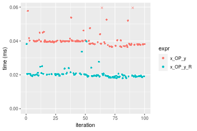


### 10x1000 vector

#### All elements
```r
> x <- data[["10x1000"]]
> y <- x[, 1L]
```

```r
> OP
[1] "+"
> stats <- microbenchmark(x_OP_y = x_OP_y(x, y, OP = OP, na.rm = FALSE), x_OP_y_R = x_OP_y_R(x, y, 
+     OP = OP, na.rm = FALSE), unit = "ms")
> gc()
           used  (Mb) gc trigger  (Mb) max used  (Mb)
Ncells  5349991 285.8   10014072 534.9 10014072 534.9
Vcells 10192055  77.8   36267018 276.7 90959857 694.0
```

_Table: Benchmarking of x_OP_y() and x_OP_y_R() on double+10x1000+add data. The top panel shows times in milliseconds and the bottom panel shows relative times._


|   |expr     |      min|       lq|      mean|    median|        uq|      max|
|:--|:--------|--------:|--------:|---------:|---------:|---------:|--------:|
|2  |x_OP_y_R | 0.016546| 0.017528| 0.0188231| 0.0180905| 0.0186395| 0.031963|
|1  |x_OP_y   | 0.036048| 0.036902| 0.0393472| 0.0381295| 0.0386665| 0.069424|


|   |expr     |      min|       lq|     mean|   median|       uq|      max|
|:--|:--------|--------:|--------:|--------:|--------:|--------:|--------:|
|2  |x_OP_y_R | 1.000000| 1.000000| 1.000000| 1.000000| 1.000000| 1.000000|
|1  |x_OP_y   | 2.178653| 2.105317| 2.090366| 2.107709| 2.074439| 2.172011|

_Figure: Benchmarking of x_OP_y() and x_OP_y_R() on double+10x1000+add data.  Outliers are displayed as crosses.  Times are in milliseconds._

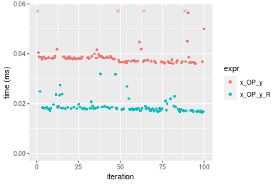

```r
> OP
[1] "-"
> stats <- microbenchmark(x_OP_y = x_OP_y(x, y, OP = OP, na.rm = FALSE), x_OP_y_R = x_OP_y_R(x, y, 
+     OP = OP, na.rm = FALSE), unit = "ms")
> gc()
           used  (Mb) gc trigger  (Mb) max used  (Mb)
Ncells  5350054 285.8   10014072 534.9 10014072 534.9
Vcells 10193417  77.8   36267018 276.7 90959857 694.0
```

_Table: Benchmarking of x_OP_y() and x_OP_y_R() on double+10x1000+sub data. The top panel shows times in milliseconds and the bottom panel shows relative times._


|   |expr     |      min|        lq|      mean|    median|        uq|      max|
|:--|:--------|--------:|---------:|---------:|---------:|---------:|--------:|
|2  |x_OP_y_R | 0.017592| 0.0187625| 0.0200561| 0.0193825| 0.0200055| 0.033273|
|1  |x_OP_y   | 0.038218| 0.0400670| 0.0419824| 0.0406180| 0.0419465| 0.071145|


|   |expr     |      min|       lq|     mean|   median|       uq|     max|
|:--|:--------|--------:|--------:|--------:|--------:|--------:|-------:|
|2  |x_OP_y_R | 1.000000| 1.000000| 1.000000| 1.000000| 1.000000| 1.00000|
|1  |x_OP_y   | 2.172465| 2.135483| 2.093251| 2.095602| 2.096748| 2.13822|

_Figure: Benchmarking of x_OP_y() and x_OP_y_R() on double+10x1000+sub data.  Outliers are displayed as crosses.  Times are in milliseconds._

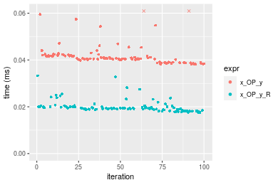

```r
> OP
[1] "*"
> stats <- microbenchmark(x_OP_y = x_OP_y(x, y, OP = OP, na.rm = FALSE), x_OP_y_R = x_OP_y_R(x, y, 
+     OP = OP, na.rm = FALSE), unit = "ms")
> gc()
           used  (Mb) gc trigger  (Mb) max used  (Mb)
Ncells  5350117 285.8   10014072 534.9 10014072 534.9
Vcells 10193459  77.8   36267018 276.7 90959857 694.0
```

_Table: Benchmarking of x_OP_y() and x_OP_y_R() on double+10x1000+mul data. The top panel shows times in milliseconds and the bottom panel shows relative times._


|   |expr     |      min|       lq|      mean|    median|        uq|      max|
|:--|:--------|--------:|--------:|---------:|---------:|---------:|--------:|
|2  |x_OP_y_R | 0.016140| 0.016899| 0.0184080| 0.0176830| 0.0183220| 0.030725|
|1  |x_OP_y   | 0.034028| 0.034759| 0.0374059| 0.0361375| 0.0377585| 0.068489|


|   |expr     |      min|       lq|     mean|  median|       uq|      max|
|:--|:--------|--------:|--------:|--------:|-------:|--------:|--------:|
|2  |x_OP_y_R | 1.000000| 1.000000| 1.000000| 1.00000| 1.000000| 1.000000|
|1  |x_OP_y   | 2.108302| 2.056867| 2.032041| 2.04363| 2.060828| 2.229097|

_Figure: Benchmarking of x_OP_y() and x_OP_y_R() on double+10x1000+mul data.  Outliers are displayed as crosses.  Times are in milliseconds._

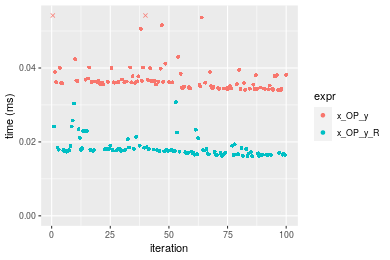

```r
> OP
[1] "/"
> stats <- microbenchmark(x_OP_y = x_OP_y(x, y, OP = OP, na.rm = FALSE), x_OP_y_R = x_OP_y_R(x, y, 
+     OP = OP, na.rm = FALSE), unit = "ms")
> gc()
           used  (Mb) gc trigger  (Mb) max used  (Mb)
Ncells  5350180 285.8   10014072 534.9 10014072 534.9
Vcells 10193501  77.8   36267018 276.7 90959857 694.0
```

_Table: Benchmarking of x_OP_y() and x_OP_y_R() on double+10x1000+div data. The top panel shows times in milliseconds and the bottom panel shows relative times._


|   |expr     |      min|        lq|      mean|    median|        uq|      max|
|:--|:--------|--------:|---------:|---------:|---------:|---------:|--------:|
|2  |x_OP_y_R | 0.017959| 0.0191865| 0.0206461| 0.0198145| 0.0202885| 0.043385|
|1  |x_OP_y   | 0.037922| 0.0399080| 0.0414031| 0.0406685| 0.0417695| 0.068863|


|   |expr     |      min|       lq|     mean|   median|       uq|      max|
|:--|:--------|--------:|--------:|--------:|--------:|--------:|--------:|
|2  |x_OP_y_R | 1.000000| 1.000000| 1.000000| 1.000000| 1.000000| 1.000000|
|1  |x_OP_y   | 2.111588| 2.080004| 2.005373| 2.052462| 2.058777| 1.587254|

_Figure: Benchmarking of x_OP_y() and x_OP_y_R() on double+10x1000+div data.  Outliers are displayed as crosses.  Times are in milliseconds._

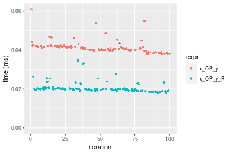


### 100x1000 vector

#### All elements
```r
> x <- data[["100x1000"]]
> y <- x[, 1L]
```

```r
> OP
[1] "+"
> stats <- microbenchmark(x_OP_y = x_OP_y(x, y, OP = OP, na.rm = FALSE), x_OP_y_R = x_OP_y_R(x, y, 
+     OP = OP, na.rm = FALSE), unit = "ms")
> gc()
           used  (Mb) gc trigger  (Mb) max used  (Mb)
Ncells  5350243 285.8   10014072 534.9 10014072 534.9
Vcells 10193627  77.8   36267018 276.7 90959857 694.0
```

_Table: Benchmarking of x_OP_y() and x_OP_y_R() on double+100x1000+add data. The top panel shows times in milliseconds and the bottom panel shows relative times._


|   |expr     |      min|        lq|      mean|    median|        uq|      max|
|:--|:--------|--------:|---------:|---------:|---------:|---------:|--------:|
|2  |x_OP_y_R | 0.144763| 0.3083995| 0.3313139| 0.3176285| 0.3698325| 0.939247|
|1  |x_OP_y   | 0.302595| 0.4105535| 0.4637066| 0.4456520| 0.5161370| 0.621752|


|   |expr     |      min|       lq|     mean|   median|       uq|       max|
|:--|:--------|--------:|--------:|--------:|--------:|--------:|---------:|
|2  |x_OP_y_R | 1.000000| 1.000000| 1.000000| 1.000000| 1.000000| 1.0000000|
|1  |x_OP_y   | 2.090279| 1.331239| 1.399599| 1.403061| 1.395597| 0.6619686|

_Figure: Benchmarking of x_OP_y() and x_OP_y_R() on double+100x1000+add data.  Outliers are displayed as crosses.  Times are in milliseconds._


```r
> OP
[1] "-"
> stats <- microbenchmark(x_OP_y = x_OP_y(x, y, OP = OP, na.rm = FALSE), x_OP_y_R = x_OP_y_R(x, y, 
+     OP = OP, na.rm = FALSE), unit = "ms")
> gc()
           used  (Mb) gc trigger  (Mb) max used  (Mb)
Ncells  5350306 285.8   10014072 534.9 10014072 534.9
Vcells 10193669  77.8   36267018 276.7 90959857 694.0
```

_Table: Benchmarking of x_OP_y() and x_OP_y_R() on double+100x1000+sub data. The top panel shows times in milliseconds and the bottom panel shows relative times._


|   |expr     |      min|        lq|      mean|    median|        uq|      max|
|:--|:--------|--------:|---------:|---------:|---------:|---------:|--------:|
|2  |x_OP_y_R | 0.164955| 0.3213385| 0.3683738| 0.3464090| 0.4147895| 0.615198|
|1  |x_OP_y   | 0.339357| 0.4365410| 0.5246037| 0.4904545| 0.5842420| 0.852817|


|   |expr     |     min|       lq|     mean|   median|       uq|      max|
|:--|:--------|-------:|--------:|--------:|--------:|--------:|--------:|
|2  |x_OP_y_R | 1.00000| 1.000000| 1.000000| 1.000000| 1.000000| 1.000000|
|1  |x_OP_y   | 2.05727| 1.358508| 1.424107| 1.415825| 1.408527| 1.386248|

_Figure: Benchmarking of x_OP_y() and x_OP_y_R() on double+100x1000+sub data.  Outliers are displayed as crosses.  Times are in milliseconds._

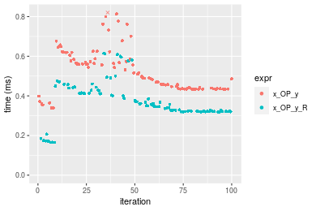

```r
> OP
[1] "*"
> stats <- microbenchmark(x_OP_y = x_OP_y(x, y, OP = OP, na.rm = FALSE), x_OP_y_R = x_OP_y_R(x, y, 
+     OP = OP, na.rm = FALSE), unit = "ms")
> gc()
           used  (Mb) gc trigger  (Mb) max used  (Mb)
Ncells  5350369 285.8   10014072 534.9 10014072 534.9
Vcells 10193711  77.8   36267018 276.7 90959857 694.0
```

_Table: Benchmarking of x_OP_y() and x_OP_y_R() on double+100x1000+mul data. The top panel shows times in milliseconds and the bottom panel shows relative times._


|   |expr     |      min|        lq|      mean|   median|       uq|      max|
|:--|:--------|--------:|---------:|---------:|--------:|--------:|--------:|
|2  |x_OP_y_R | 0.144207| 0.3090365| 0.3241946| 0.324480| 0.363608| 0.473435|
|1  |x_OP_y   | 0.293972| 0.3931230| 0.4417605| 0.413686| 0.494115| 0.597389|


|   |expr     |      min|       lq|    mean|  median|       uq|      max|
|:--|:--------|--------:|--------:|-------:|-------:|--------:|--------:|
|2  |x_OP_y_R | 1.000000| 1.000000| 1.00000| 1.00000| 1.000000| 1.000000|
|1  |x_OP_y   | 2.038542| 1.272093| 1.36264| 1.27492| 1.358922| 1.261818|

_Figure: Benchmarking of x_OP_y() and x_OP_y_R() on double+100x1000+mul data.  Outliers are displayed as crosses.  Times are in milliseconds._

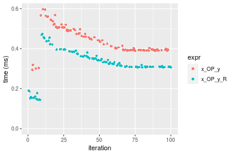

```r
> OP
[1] "/"
> stats <- microbenchmark(x_OP_y = x_OP_y(x, y, OP = OP, na.rm = FALSE), x_OP_y_R = x_OP_y_R(x, y, 
+     OP = OP, na.rm = FALSE), unit = "ms")
> gc()
           used  (Mb) gc trigger  (Mb) max used  (Mb)
Ncells  5350432 285.8   10014072 534.9 10014072 534.9
Vcells 10193753  77.8   36267018 276.7 90959857 694.0
```

_Table: Benchmarking of x_OP_y() and x_OP_y_R() on double+100x1000+div data. The top panel shows times in milliseconds and the bottom panel shows relative times._


|   |expr     |      min|        lq|      mean|    median|        uq|      max|
|:--|:--------|--------:|---------:|---------:|---------:|---------:|--------:|
|2  |x_OP_y_R | 0.164653| 0.3218685| 0.3402826| 0.3306960| 0.3813825| 0.480358|
|1  |x_OP_y   | 0.339729| 0.4356965| 0.4843611| 0.4569015| 0.5423775| 0.652258|


|   |expr     |      min|       lq|     mean|   median|       uq|      max|
|:--|:--------|--------:|--------:|--------:|--------:|--------:|--------:|
|2  |x_OP_y_R | 1.000000| 1.000000| 1.000000| 1.000000| 1.000000| 1.000000|
|1  |x_OP_y   | 2.063303| 1.353647| 1.423408| 1.381636| 1.422135| 1.357858|

_Figure: Benchmarking of x_OP_y() and x_OP_y_R() on double+100x1000+div data.  Outliers are displayed as crosses.  Times are in milliseconds._

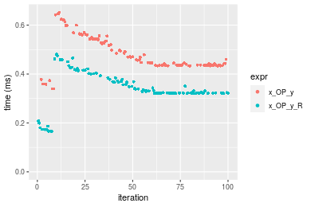


### 1000x100 vector

#### All elements
```r
> x <- data[["1000x100"]]
> y <- x[, 1L]
```

```r
> OP
[1] "+"
> stats <- microbenchmark(x_OP_y = x_OP_y(x, y, OP = OP, na.rm = FALSE), x_OP_y_R = x_OP_y_R(x, y, 
+     OP = OP, na.rm = FALSE), unit = "ms")
> gc()
           used  (Mb) gc trigger  (Mb) max used  (Mb)
Ncells  5350495 285.8   10014072 534.9 10014072 534.9
Vcells 10194695  77.8   36267018 276.7 90959857 694.0
```

_Table: Benchmarking of x_OP_y() and x_OP_y_R() on double+1000x100+add data. The top panel shows times in milliseconds and the bottom panel shows relative times._


|   |expr     |      min|        lq|      mean|    median|        uq|      max|
|:--|:--------|--------:|---------:|---------:|---------:|---------:|--------:|
|2  |x_OP_y_R | 0.144756| 0.3103565| 0.3367669| 0.3289825| 0.3864120| 0.490058|
|1  |x_OP_y   | 0.288813| 0.4012470| 0.4517341| 0.4337260| 0.5056755| 0.636178|


|   |expr     |      min|       lq|     mean|   median|       uq|      max|
|:--|:--------|--------:|--------:|--------:|--------:|--------:|--------:|
|2  |x_OP_y_R | 1.000000| 1.000000| 1.000000| 1.000000| 1.000000| 1.000000|
|1  |x_OP_y   | 1.995171| 1.292858| 1.341385| 1.318386| 1.308643| 1.298169|

_Figure: Benchmarking of x_OP_y() and x_OP_y_R() on double+1000x100+add data.  Outliers are displayed as crosses.  Times are in milliseconds._

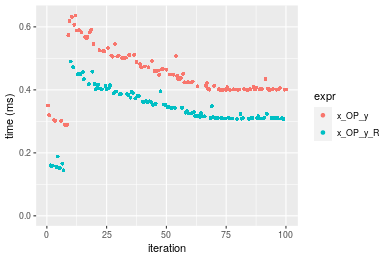

```r
> OP
[1] "-"
> stats <- microbenchmark(x_OP_y = x_OP_y(x, y, OP = OP, na.rm = FALSE), x_OP_y_R = x_OP_y_R(x, y, 
+     OP = OP, na.rm = FALSE), unit = "ms")
> gc()
           used  (Mb) gc trigger  (Mb) max used  (Mb)
Ncells  5350558 285.8   10014072 534.9 10014072 534.9
Vcells 10196329  77.8   36267018 276.7 90959857 694.0
```

_Table: Benchmarking of x_OP_y() and x_OP_y_R() on double+1000x100+sub data. The top panel shows times in milliseconds and the bottom panel shows relative times._


|   |expr     |      min|       lq|      mean|    median|        uq|      max|
|:--|:--------|--------:|--------:|---------:|---------:|---------:|--------:|
|2  |x_OP_y_R | 0.164633| 0.321633| 0.3507613| 0.3428310| 0.3955045| 0.486230|
|1  |x_OP_y   | 0.328470| 0.427562| 0.4703479| 0.4393535| 0.5177525| 0.648418|


|   |expr     |      min|       lq|     mean|   median|       uq|      max|
|:--|:--------|--------:|--------:|--------:|--------:|--------:|--------:|
|2  |x_OP_y_R | 1.000000| 1.000000| 1.000000| 1.000000| 1.000000| 1.000000|
|1  |x_OP_y   | 1.995165| 1.329347| 1.340934| 1.281545| 1.309094| 1.333562|

_Figure: Benchmarking of x_OP_y() and x_OP_y_R() on double+1000x100+sub data.  Outliers are displayed as crosses.  Times are in milliseconds._

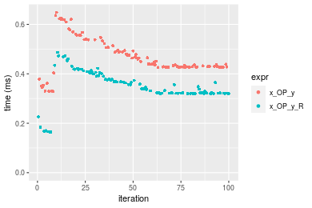

```r
> OP
[1] "*"
> stats <- microbenchmark(x_OP_y = x_OP_y(x, y, OP = OP, na.rm = FALSE), x_OP_y_R = x_OP_y_R(x, y, 
+     OP = OP, na.rm = FALSE), unit = "ms")
> gc()
           used  (Mb) gc trigger  (Mb) max used  (Mb)
Ncells  5350621 285.8   10014072 534.9 10014072 534.9
Vcells 10196371  77.8   36267018 276.7 90959857 694.0
```

_Table: Benchmarking of x_OP_y() and x_OP_y_R() on double+1000x100+mul data. The top panel shows times in milliseconds and the bottom panel shows relative times._


|   |expr     |      min|        lq|      mean|   median|       uq|      max|
|:--|:--------|--------:|---------:|---------:|--------:|--------:|--------:|
|2  |x_OP_y_R | 0.145343| 0.3098375| 0.3334421| 0.331356| 0.384423| 0.493688|
|1  |x_OP_y   | 0.249462| 0.3871015| 0.4331455| 0.418163| 0.485754| 0.597608|


|   |expr     |      min|       lq|     mean|   median|       uq|      max|
|:--|:--------|--------:|--------:|--------:|--------:|--------:|--------:|
|2  |x_OP_y_R | 1.000000| 1.000000| 1.000000| 1.000000| 1.000000| 1.000000|
|1  |x_OP_y   | 1.716368| 1.249369| 1.299012| 1.261975| 1.263592| 1.210497|

_Figure: Benchmarking of x_OP_y() and x_OP_y_R() on double+1000x100+mul data.  Outliers are displayed as crosses.  Times are in milliseconds._

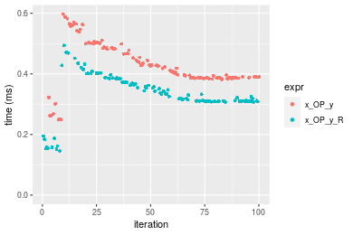

```r
> OP
[1] "/"
> stats <- microbenchmark(x_OP_y = x_OP_y(x, y, OP = OP, na.rm = FALSE), x_OP_y_R = x_OP_y_R(x, y, 
+     OP = OP, na.rm = FALSE), unit = "ms")
> gc()
           used  (Mb) gc trigger  (Mb) max used  (Mb)
Ncells  5350684 285.8   10014072 534.9 10014072 534.9
Vcells 10196413  77.8   36267018 276.7 90959857 694.0
```

_Table: Benchmarking of x_OP_y() and x_OP_y_R() on double+1000x100+div data. The top panel shows times in milliseconds and the bottom panel shows relative times._


|   |expr     |      min|        lq|      mean|    median|       uq|      max|
|:--|:--------|--------:|---------:|---------:|---------:|--------:|--------:|
|2  |x_OP_y_R | 0.165631| 0.3195440| 0.3590820| 0.3377795| 0.402101| 1.133268|
|1  |x_OP_y   | 0.328736| 0.4283845| 0.4796671| 0.4621275| 0.535362| 0.662927|


|   |expr     |      min|       lq|     mean|   median|       uq|       max|
|:--|:--------|--------:|--------:|--------:|--------:|--------:|---------:|
|2  |x_OP_y_R | 1.000000| 1.000000| 1.000000| 1.000000| 1.000000| 1.0000000|
|1  |x_OP_y   | 1.984749| 1.340612| 1.335815| 1.368134| 1.331412| 0.5849693|

_Figure: Benchmarking of x_OP_y() and x_OP_y_R() on double+1000x100+div data.  Outliers are displayed as crosses.  Times are in milliseconds._

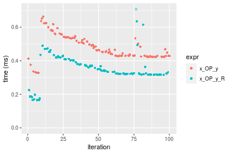


## Appendix

### Session information
```r
R version 4.1.1 Patched (2021-08-10 r80727)
Platform: x86_64-pc-linux-gnu (64-bit)
Running under: Ubuntu 18.04.5 LTS

Matrix products: default
BLAS:   /home/hb/software/R-devel/R-4-1-branch/lib/R/lib/libRblas.so
LAPACK: /home/hb/software/R-devel/R-4-1-branch/lib/R/lib/libRlapack.so

locale:
 [1] LC_CTYPE=en_US.UTF-8       LC_NUMERIC=C              
 [3] LC_TIME=en_US.UTF-8        LC_COLLATE=en_US.UTF-8    
 [5] LC_MONETARY=en_US.UTF-8    LC_MESSAGES=en_US.UTF-8   
 [7] LC_PAPER=en_US.UTF-8       LC_NAME=C                 
 [9] LC_ADDRESS=C               LC_TELEPHONE=C            
[11] LC_MEASUREMENT=en_US.UTF-8 LC_IDENTIFICATION=C       

attached base packages:
[1] stats     graphics  grDevices utils     datasets  methods   base     

other attached packages:
[1] microbenchmark_1.4-7   matrixStats_0.60.1     ggplot2_3.3.5         
[4] knitr_1.33             R.devices_2.17.0       R.utils_2.10.1        
[7] R.oo_1.24.0            R.methodsS3_1.8.1-9001 history_0.0.1-9000    

loaded via a namespace (and not attached):
 [1] Biobase_2.52.0          httr_1.4.2              splines_4.1.1          
 [4] bit64_4.0.5             network_1.17.1          assertthat_0.2.1       
 [7] highr_0.9               stats4_4.1.1            blob_1.2.2             
[10] GenomeInfoDbData_1.2.6  robustbase_0.93-8       pillar_1.6.2           
[13] RSQLite_2.2.8           lattice_0.20-44         limma_3.48.3           
[16] glue_1.4.2              digest_0.6.27           XVector_0.32.0         
[19] colorspace_2.0-2        Matrix_1.3-4            XML_3.99-0.7           
[22] pkgconfig_2.0.3         zlibbioc_1.38.0         genefilter_1.74.0      
[25] purrr_0.3.4             ergm_4.1.2              xtable_1.8-4           
[28] scales_1.1.1            tibble_3.1.4            annotate_1.70.0        
[31] KEGGREST_1.32.0         farver_2.1.0            generics_0.1.0         
[34] IRanges_2.26.0          ellipsis_0.3.2          cachem_1.0.6           
[37] withr_2.4.2             BiocGenerics_0.38.0     mime_0.11              
[40] survival_3.2-13         magrittr_2.0.1          crayon_1.4.1           
[43] statnet.common_4.5.0    memoise_2.0.0           laeken_0.5.1           
[46] fansi_0.5.0             R.cache_0.15.0          MASS_7.3-54            
[49] R.rsp_0.44.0            progressr_0.8.0         tools_4.1.1            
[52] lifecycle_1.0.0         S4Vectors_0.30.0        trust_0.1-8            
[55] munsell_0.5.0           tabby_0.0.1-9001        AnnotationDbi_1.54.1   
[58] Biostrings_2.60.2       compiler_4.1.1          GenomeInfoDb_1.28.1    
[61] rlang_0.4.11            grid_4.1.1              RCurl_1.98-1.4         
[64] cwhmisc_6.6             rappdirs_0.3.3          startup_0.15.0         
[67] labeling_0.4.2          bitops_1.0-7            base64enc_0.1-3        
[70] boot_1.3-28             gtable_0.3.0            DBI_1.1.1              
[73] markdown_1.1            R6_2.5.1                lpSolveAPI_5.5.2.0-17.7
[76] rle_0.9.2               dplyr_1.0.7             fastmap_1.1.0          
[79] bit_4.0.4               utf8_1.2.2              parallel_4.1.1         
[82] Rcpp_1.0.7              vctrs_0.3.8             png_0.1-7              
[85] DEoptimR_1.0-9          tidyselect_1.1.1        xfun_0.25              
[88] coda_0.19-4            
```
Total processing time was 1.13 mins.


### Reproducibility
To reproduce this report, do:
```r
html <- matrixStats:::benchmark('x_OP_y')
```

[RSP]: https://cran.r-project.org/package=R.rsp
[matrixStats]: https://cran.r-project.org/package=matrixStats

[StackOverflow:colMins?]: https://stackoverflow.com/questions/13676878 "Stack Overflow: fastest way to get Min from every column in a matrix?"
[StackOverflow:colSds?]: https://stackoverflow.com/questions/17549762 "Stack Overflow: Is there such 'colsd' in R?"
[StackOverflow:rowProds?]: https://stackoverflow.com/questions/20198801/ "Stack Overflow: Row product of matrix and column sum of matrix"

---------------------------------------
Copyright Henrik Bengtsson. Last updated on 2021-08-25 18:41:23 (+0200 UTC). Powered by [RSP].

<script>
 var link = document.createElement('link');
 link.rel = 'icon';
 link.href = "data:image/png;base64,iVBORw0KGgoAAAANSUhEUgAAACAAAAAgCAMAAABEpIrGAAAA21BMVEUAAAAAAP8AAP8AAP8AAP8AAP8AAP8AAP8AAP8AAP8AAP8AAP8AAP8AAP8AAP8AAP8AAP8AAP8AAP8AAP8AAP8AAP8AAP8AAP8AAP8AAP8AAP8AAP8AAP8AAP8AAP8AAP8AAP8AAP8AAP8AAP8AAP8AAP8AAP8AAP8AAP8AAP8BAf4CAv0DA/wdHeIeHuEfH+AgIN8hId4lJdomJtknJ9g+PsE/P8BAQL9yco10dIt1dYp3d4h4eIeVlWqWlmmXl2iYmGeZmWabm2Tn5xjo6Bfp6Rb39wj4+Af//wA2M9hbAAAASXRSTlMAAQIJCgsMJSYnKD4/QGRlZmhpamtsbautrrCxuru8y8zN5ebn6Pn6+///////////////////////////////////////////LsUNcQAAAS9JREFUOI29k21XgkAQhVcFytdSMqMETU26UVqGmpaiFbL//xc1cAhhwVNf6n5i5z67M2dmYOyfJZUqlVLhkKucG7cgmUZTybDz6g0iDeq51PUr37Ds2cy2/C9NeES5puDjxuUk1xnToZsg8pfA3avHQ3lLIi7iWRrkv/OYtkScxBIMgDee0ALoyxHQBJ68JLCjOtQIMIANF7QG9G9fNnHvisCHBVMKgSJgiz7nE+AoBKrAPA3MgepvgR9TSCasrCKH0eB1wBGBFdCO+nAGjMVGPcQb5bd6mQRegN6+1axOs9nGfYcCtfi4NQosdtH7dB+txFIpXQqN1p9B/asRHToyS0jRgpV7nk4nwcq1BJ+x3Gl/v7S9Wmpp/aGquum7w3ZDyrADFYrl8vHBH+ev9AUASW1dmU4h4wAAAABJRU5ErkJggg=="
 document.getElementsByTagName('head')[0].appendChild(link);
</script>


