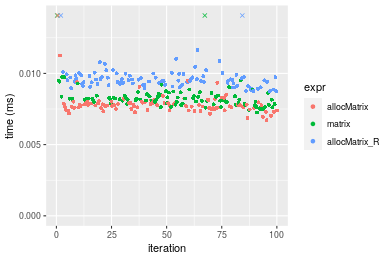
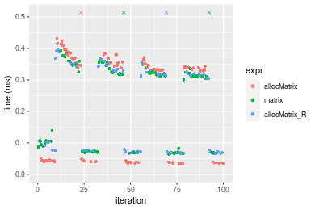

[matrixStats]: Benchmark report

---------------------------------------


# allocMatrix() benchmarks

This report benchmark the performance of allocMatrix() against alternative methods.

## Alternative methods

* matrix()
* matrix() special trick for NA

where
```r
> allocMatrix_R <- function(nrow, ncol, value = NA) {
+     if (is.na(value) && !is.nan(value)) {
+         matrix(data = value[c()], nrow = nrow, ncol = ncol)
+     }     else {
+         matrix(data = value, nrow = nrow, ncol = ncol)
+     }
+ }
```


## Data type "integer"
### Data
```r
> rmatrix <- function(nrow, ncol, mode = c("logical", "double", "integer", "index"), range = c(-100, 
+     +100), na_prob = 0) {
+     mode <- match.arg(mode)
+     n <- nrow * ncol
+     if (mode == "logical") {
+         x <- sample(c(FALSE, TRUE), size = n, replace = TRUE)
+     }     else if (mode == "index") {
+         x <- seq_len(n)
+         mode <- "integer"
+     }     else {
+         x <- runif(n, min = range[1], max = range[2])
+     }
+     storage.mode(x) <- mode
+     if (na_prob > 0) 
+         x[sample(n, size = na_prob * n)] <- NA
+     dim(x) <- c(nrow, ncol)
+     x
+ }
> rmatrices <- function(scale = 10, seed = 1, ...) {
+     set.seed(seed)
+     data <- list()
+     data[[1]] <- rmatrix(nrow = scale * 1, ncol = scale * 1, ...)
+     data[[2]] <- rmatrix(nrow = scale * 10, ncol = scale * 10, ...)
+     data[[3]] <- rmatrix(nrow = scale * 100, ncol = scale * 1, ...)
+     data[[4]] <- t(data[[3]])
+     data[[5]] <- rmatrix(nrow = scale * 10, ncol = scale * 100, ...)
+     data[[6]] <- t(data[[5]])
+     names(data) <- sapply(data, FUN = function(x) paste(dim(x), collapse = "x"))
+     data
+ }
> data <- rmatrices(mode = mode)
> values <- list(zero = 0, one = 1, `NA` = NA_real_)
> if (mode != "double") 
+     values <- lapply(values, FUN = function(x) {
+         storage.mode(x) <- mode
+         x
+     })
```

### Results

### 10x10 matrix


```r
> dim <- dim(data[["10x10"]])
> nrow <- dim[1L]
> ncol <- dim[2L]
> str(value)
 int 0
```

```r
> stats <- microbenchmark(allocMatrix = allocMatrix(nrow = nrow, ncol = ncol, value = value), matrix = matrix(data = value, 
+     nrow = nrow, ncol = ncol), allocMatrix_R = allocMatrix_R(nrow = nrow, ncol = ncol, value = value), 
+     unit = "ms")
```

_Table: Benchmarking of allocMatrix(), matrix() and allocMatrix_R() on integer+10x10+0 data. The top panel shows times in milliseconds and the bottom panel shows relative times._


|   |expr          |      min|        lq|      mean|    median|        uq|      max|
|:--|:-------------|--------:|---------:|---------:|---------:|---------:|--------:|
|1  |allocMatrix   | 0.001403| 0.0017410| 0.0025630| 0.0018325| 0.0019330| 0.072118|
|2  |matrix        | 0.002036| 0.0022760| 0.0024602| 0.0023705| 0.0025020| 0.006763|
|3  |allocMatrix_R | 0.003288| 0.0034535| 0.0037983| 0.0035560| 0.0036915| 0.023385|


|   |expr          |      min|       lq|      mean|   median|       uq|       max|
|:--|:-------------|--------:|--------:|---------:|--------:|--------:|---------:|
|1  |allocMatrix   | 1.000000| 1.000000| 1.0000000| 1.000000| 1.000000| 1.0000000|
|2  |matrix        | 1.451176| 1.307295| 0.9599062| 1.293588| 1.294361| 0.0937769|
|3  |allocMatrix_R | 2.343549| 1.983630| 1.4819644| 1.940518| 1.909726| 0.3242602|

_Figure: Benchmarking of allocMatrix(), matrix() and allocMatrix_R() on integer+10x10+0 data.  Outliers are displayed as crosses.  Times are in milliseconds._


```r
> dim <- dim(data[["10x10"]])
> nrow <- dim[1L]
> ncol <- dim[2L]
> str(value)
 int 1
```

```r
> stats <- microbenchmark(allocMatrix = allocMatrix(nrow = nrow, ncol = ncol, value = value), matrix = matrix(data = value, 
+     nrow = nrow, ncol = ncol), allocMatrix_R = allocMatrix_R(nrow = nrow, ncol = ncol, value = value), 
+     unit = "ms")
```

_Table: Benchmarking of allocMatrix(), matrix() and allocMatrix_R() on integer+10x10+1 data. The top panel shows times in milliseconds and the bottom panel shows relative times._


|   |expr          |      min|        lq|      mean|    median|        uq|      max|
|:--|:-------------|--------:|---------:|---------:|---------:|---------:|--------:|
|1  |allocMatrix   | 0.001446| 0.0016315| 0.0019682| 0.0017600| 0.0019810| 0.009461|
|2  |matrix        | 0.001969| 0.0021310| 0.0023482| 0.0022585| 0.0023890| 0.004058|
|3  |allocMatrix_R | 0.003129| 0.0033500| 0.0037179| 0.0034805| 0.0036485| 0.018515|


|   |expr          |      min|       lq|     mean|   median|       uq|       max|
|:--|:-------------|--------:|--------:|--------:|--------:|--------:|---------:|
|1  |allocMatrix   | 1.000000| 1.000000| 1.000000| 1.000000| 1.000000| 1.0000000|
|2  |matrix        | 1.361687| 1.306160| 1.193019| 1.283239| 1.205957| 0.4289187|
|3  |allocMatrix_R | 2.163900| 2.053325| 1.888932| 1.977557| 1.841747| 1.9569813|

_Figure: Benchmarking of allocMatrix(), matrix() and allocMatrix_R() on integer+10x10+1 data.  Outliers are displayed as crosses.  Times are in milliseconds._


```r
> dim <- dim(data[["10x10"]])
> nrow <- dim[1L]
> ncol <- dim[2L]
> str(value)
 int NA
```

```r
> stats <- microbenchmark(allocMatrix = allocMatrix(nrow = nrow, ncol = ncol, value = value), matrix = matrix(data = value, 
+     nrow = nrow, ncol = ncol), allocMatrix_R = allocMatrix_R(nrow = nrow, ncol = ncol, value = value), 
+     unit = "ms")
```

_Table: Benchmarking of allocMatrix(), matrix() and allocMatrix_R() on integer+10x10+NA data. The top panel shows times in milliseconds and the bottom panel shows relative times._


|   |expr          |      min|        lq|      mean|   median|        uq|      max|
|:--|:-------------|--------:|---------:|---------:|--------:|---------:|--------:|
|1  |allocMatrix   | 0.001471| 0.0016980| 0.0020451| 0.001829| 0.0019790| 0.015731|
|2  |matrix        | 0.001967| 0.0021820| 0.0024582| 0.002320| 0.0025265| 0.004353|
|3  |allocMatrix_R | 0.003835| 0.0041085| 0.0045412| 0.004230| 0.0044360| 0.023360|


|   |expr          |      min|       lq|     mean|   median|       uq|       max|
|:--|:-------------|--------:|--------:|--------:|--------:|--------:|---------:|
|1  |allocMatrix   | 1.000000| 1.000000| 1.000000| 1.000000| 1.000000| 1.0000000|
|2  |matrix        | 1.337186| 1.285041| 1.201974| 1.268453| 1.276655| 0.2767148|
|3  |allocMatrix_R | 2.607070| 2.419611| 2.220526| 2.312739| 2.241536| 1.4849660|

_Figure: Benchmarking of allocMatrix(), matrix() and allocMatrix_R() on integer+10x10+NA data.  Outliers are displayed as crosses.  Times are in milliseconds._


### 100x100 matrix


```r
> dim <- dim(data[["100x100"]])
> nrow <- dim[1L]
> ncol <- dim[2L]
> str(value)
 int 0
```

```r
> stats <- microbenchmark(allocMatrix = allocMatrix(nrow = nrow, ncol = ncol, value = value), matrix = matrix(data = value, 
+     nrow = nrow, ncol = ncol), allocMatrix_R = allocMatrix_R(nrow = nrow, ncol = ncol, value = value), 
+     unit = "ms")
```

_Table: Benchmarking of allocMatrix(), matrix() and allocMatrix_R() on integer+100x100+0 data. The top panel shows times in milliseconds and the bottom panel shows relative times._


|   |expr          |      min|        lq|      mean|    median|        uq|      max|
|:--|:-------------|--------:|---------:|---------:|---------:|---------:|--------:|
|1  |allocMatrix   | 0.003576| 0.0039695| 0.0045059| 0.0042055| 0.0045370| 0.012580|
|2  |matrix        | 0.007398| 0.0079255| 0.0083078| 0.0081305| 0.0085765| 0.010790|
|3  |allocMatrix_R | 0.008799| 0.0093135| 0.0099239| 0.0095415| 0.0099060| 0.025206|


|   |expr          |      min|       lq|     mean|   median|       uq|       max|
|:--|:-------------|--------:|--------:|--------:|--------:|--------:|---------:|
|1  |allocMatrix   | 1.000000| 1.000000| 1.000000| 1.000000| 1.000000| 1.0000000|
|2  |matrix        | 2.068792| 1.996599| 1.843743| 1.933302| 1.890346| 0.8577107|
|3  |allocMatrix_R | 2.460571| 2.346265| 2.202407| 2.268815| 2.183381| 2.0036566|

_Figure: Benchmarking of allocMatrix(), matrix() and allocMatrix_R() on integer+100x100+0 data.  Outliers are displayed as crosses.  Times are in milliseconds._


```r
> dim <- dim(data[["100x100"]])
> nrow <- dim[1L]
> ncol <- dim[2L]
> str(value)
 int 1
```

```r
> stats <- microbenchmark(allocMatrix = allocMatrix(nrow = nrow, ncol = ncol, value = value), matrix = matrix(data = value, 
+     nrow = nrow, ncol = ncol), allocMatrix_R = allocMatrix_R(nrow = nrow, ncol = ncol, value = value), 
+     unit = "ms")
```

_Table: Benchmarking of allocMatrix(), matrix() and allocMatrix_R() on integer+100x100+1 data. The top panel shows times in milliseconds and the bottom panel shows relative times._


|   |expr          |      min|        lq|      mean|    median|        uq|      max|
|:--|:-------------|--------:|---------:|---------:|---------:|---------:|--------:|
|1  |allocMatrix   | 0.006719| 0.0075425| 0.0078959| 0.0077560| 0.0079415| 0.016258|
|2  |matrix        | 0.007251| 0.0079055| 0.0084173| 0.0081805| 0.0084405| 0.018963|
|3  |allocMatrix_R | 0.008745| 0.0092130| 0.0099495| 0.0095025| 0.0098535| 0.040503|


|   |expr          |      min|       lq|     mean|   median|       uq|      max|
|:--|:-------------|--------:|--------:|--------:|--------:|--------:|--------:|
|1  |allocMatrix   | 1.000000| 1.000000| 1.000000| 1.000000| 1.000000| 1.000000|
|2  |matrix        | 1.079178| 1.048127| 1.066030| 1.054732| 1.062834| 1.166380|
|3  |allocMatrix_R | 1.301533| 1.221478| 1.260074| 1.225181| 1.240761| 2.491266|

_Figure: Benchmarking of allocMatrix(), matrix() and allocMatrix_R() on integer+100x100+1 data.  Outliers are displayed as crosses.  Times are in milliseconds._




```r
> dim <- dim(data[["100x100"]])
> nrow <- dim[1L]
> ncol <- dim[2L]
> str(value)
 int NA
```

```r
> stats <- microbenchmark(allocMatrix = allocMatrix(nrow = nrow, ncol = ncol, value = value), matrix = matrix(data = value, 
+     nrow = nrow, ncol = ncol), allocMatrix_R = allocMatrix_R(nrow = nrow, ncol = ncol, value = value), 
+     unit = "ms")
```

_Table: Benchmarking of allocMatrix(), matrix() and allocMatrix_R() on integer+100x100+NA data. The top panel shows times in milliseconds and the bottom panel shows relative times._


|   |expr          |      min|        lq|      mean|   median|        uq|      max|
|:--|:-------------|--------:|---------:|---------:|--------:|---------:|--------:|
|1  |allocMatrix   | 0.006866| 0.0074865| 0.0078684| 0.007757| 0.0080165| 0.015277|
|2  |matrix        | 0.007395| 0.0080830| 0.0085057| 0.008315| 0.0085690| 0.016088|
|3  |allocMatrix_R | 0.012749| 0.0132485| 0.0140350| 0.013534| 0.0137910| 0.045187|


|   |expr          |      min|       lq|     mean|   median|       uq|      max|
|:--|:-------------|--------:|--------:|--------:|--------:|--------:|--------:|
|1  |allocMatrix   | 1.000000| 1.000000| 1.000000| 1.000000| 1.000000| 1.000000|
|2  |matrix        | 1.077046| 1.079677| 1.080999| 1.071935| 1.068920| 1.053086|
|3  |allocMatrix_R | 1.856831| 1.769652| 1.783719| 1.744747| 1.720327| 2.957845|

_Figure: Benchmarking of allocMatrix(), matrix() and allocMatrix_R() on integer+100x100+NA data.  Outliers are displayed as crosses.  Times are in milliseconds._


### 1000x10 matrix


```r
> dim <- dim(data[["1000x10"]])
> nrow <- dim[1L]
> ncol <- dim[2L]
> str(value)
 int 0
```

```r
> stats <- microbenchmark(allocMatrix = allocMatrix(nrow = nrow, ncol = ncol, value = value), matrix = matrix(data = value, 
+     nrow = nrow, ncol = ncol), allocMatrix_R = allocMatrix_R(nrow = nrow, ncol = ncol, value = value), 
+     unit = "ms")
```

_Table: Benchmarking of allocMatrix(), matrix() and allocMatrix_R() on integer+1000x10+0 data. The top panel shows times in milliseconds and the bottom panel shows relative times._


|   |expr          |      min|        lq|      mean|    median|        uq|      max|
|:--|:-------------|--------:|---------:|---------:|---------:|---------:|--------:|
|1  |allocMatrix   | 0.003611| 0.0038825| 0.0042124| 0.0040705| 0.0042785| 0.012207|
|2  |matrix        | 0.007483| 0.0078825| 0.0083134| 0.0080945| 0.0082940| 0.017569|
|3  |allocMatrix_R | 0.008763| 0.0091745| 0.0095907| 0.0094425| 0.0097640| 0.014220|


|   |expr          |      min|       lq|     mean|   median|       uq|      max|
|:--|:-------------|--------:|--------:|--------:|--------:|--------:|--------:|
|1  |allocMatrix   | 1.000000| 1.000000| 1.000000| 1.000000| 1.000000| 1.000000|
|2  |matrix        | 2.072279| 2.030264| 1.973556| 1.988576| 1.938530| 1.439256|
|3  |allocMatrix_R | 2.426752| 2.363039| 2.276787| 2.319740| 2.282108| 1.164905|

_Figure: Benchmarking of allocMatrix(), matrix() and allocMatrix_R() on integer+1000x10+0 data.  Outliers are displayed as crosses.  Times are in milliseconds._


```r
> dim <- dim(data[["1000x10"]])
> nrow <- dim[1L]
> ncol <- dim[2L]
> str(value)
 int 1
```

```r
> stats <- microbenchmark(allocMatrix = allocMatrix(nrow = nrow, ncol = ncol, value = value), matrix = matrix(data = value, 
+     nrow = nrow, ncol = ncol), allocMatrix_R = allocMatrix_R(nrow = nrow, ncol = ncol, value = value), 
+     unit = "ms")
```

_Table: Benchmarking of allocMatrix(), matrix() and allocMatrix_R() on integer+1000x10+1 data. The top panel shows times in milliseconds and the bottom panel shows relative times._


|   |expr          |      min|       lq|      mean|    median|        uq|      max|
|:--|:-------------|--------:|--------:|---------:|---------:|---------:|--------:|
|1  |allocMatrix   | 0.007095| 0.007520| 0.0082978| 0.0077645| 0.0080380| 0.038775|
|2  |matrix        | 0.007393| 0.008021| 0.0083291| 0.0082040| 0.0084505| 0.012494|
|3  |allocMatrix_R | 0.008867| 0.009381| 0.0097328| 0.0096045| 0.0098520| 0.014879|


|   |expr          |      min|       lq|     mean|   median|       uq|       max|
|:--|:-------------|--------:|--------:|--------:|--------:|--------:|---------:|
|1  |allocMatrix   | 1.000000| 1.000000| 1.000000| 1.000000| 1.000000| 1.0000000|
|2  |matrix        | 1.042001| 1.066622| 1.003778| 1.056604| 1.051319| 0.3222179|
|3  |allocMatrix_R | 1.249753| 1.247473| 1.172942| 1.236976| 1.225678| 0.3837266|

_Figure: Benchmarking of allocMatrix(), matrix() and allocMatrix_R() on integer+1000x10+1 data.  Outliers are displayed as crosses.  Times are in milliseconds._


```r
> dim <- dim(data[["1000x10"]])
> nrow <- dim[1L]
> ncol <- dim[2L]
> str(value)
 int NA
```

```r
> stats <- microbenchmark(allocMatrix = allocMatrix(nrow = nrow, ncol = ncol, value = value), matrix = matrix(data = value, 
+     nrow = nrow, ncol = ncol), allocMatrix_R = allocMatrix_R(nrow = nrow, ncol = ncol, value = value), 
+     unit = "ms")
```

_Table: Benchmarking of allocMatrix(), matrix() and allocMatrix_R() on integer+1000x10+NA data. The top panel shows times in milliseconds and the bottom panel shows relative times._


|   |expr          |      min|        lq|      mean|    median|        uq|      max|
|:--|:-------------|--------:|---------:|---------:|---------:|---------:|--------:|
|1  |allocMatrix   | 0.006895| 0.0075045| 0.0078747| 0.0077585| 0.0079630| 0.017942|
|2  |matrix        | 0.007323| 0.0080470| 0.0084581| 0.0083185| 0.0085965| 0.017017|
|3  |allocMatrix_R | 0.012768| 0.0132595| 0.0140650| 0.0135825| 0.0138795| 0.044637|


|   |expr          |      min|       lq|     mean|   median|       uq|      max|
|:--|:-------------|--------:|--------:|--------:|--------:|--------:|--------:|
|1  |allocMatrix   | 1.000000| 1.000000| 1.000000| 1.000000| 1.000000| 1.000000|
|2  |matrix        | 1.062074| 1.072290| 1.074079| 1.072179| 1.079555| 0.948445|
|3  |allocMatrix_R | 1.851777| 1.766873| 1.786094| 1.750661| 1.742999| 2.487850|

_Figure: Benchmarking of allocMatrix(), matrix() and allocMatrix_R() on integer+1000x10+NA data.  Outliers are displayed as crosses.  Times are in milliseconds._


### 10x1000 matrix


```r
> dim <- dim(data[["10x1000"]])
> nrow <- dim[1L]
> ncol <- dim[2L]
> str(value)
 int 0
```

```r
> stats <- microbenchmark(allocMatrix = allocMatrix(nrow = nrow, ncol = ncol, value = value), matrix = matrix(data = value, 
+     nrow = nrow, ncol = ncol), allocMatrix_R = allocMatrix_R(nrow = nrow, ncol = ncol, value = value), 
+     unit = "ms")
```

_Table: Benchmarking of allocMatrix(), matrix() and allocMatrix_R() on integer+10x1000+0 data. The top panel shows times in milliseconds and the bottom panel shows relative times._


|   |expr          |      min|        lq|      mean|    median|        uq|      max|
|:--|:-------------|--------:|---------:|---------:|---------:|---------:|--------:|
|1  |allocMatrix   | 0.003541| 0.0037765| 0.0043114| 0.0040250| 0.0043450| 0.017992|
|2  |matrix        | 0.007560| 0.0078285| 0.0081639| 0.0080555| 0.0082505| 0.013302|
|3  |allocMatrix_R | 0.008847| 0.0092205| 0.0096187| 0.0094275| 0.0097150| 0.018680|


|   |expr          |      min|       lq|    mean|   median|       uq|       max|
|:--|:-------------|--------:|--------:|-------:|--------:|--------:|---------:|
|1  |allocMatrix   | 1.000000| 1.000000| 1.00000| 1.000000| 1.000000| 1.0000000|
|2  |matrix        | 2.134990| 2.072951| 1.89357| 2.001367| 1.898849| 0.7393286|
|3  |allocMatrix_R | 2.498447| 2.441546| 2.23099| 2.342236| 2.235903| 1.0382392|

_Figure: Benchmarking of allocMatrix(), matrix() and allocMatrix_R() on integer+10x1000+0 data.  Outliers are displayed as crosses.  Times are in milliseconds._


```r
> dim <- dim(data[["10x1000"]])
> nrow <- dim[1L]
> ncol <- dim[2L]
> str(value)
 int 1
```

```r
> stats <- microbenchmark(allocMatrix = allocMatrix(nrow = nrow, ncol = ncol, value = value), matrix = matrix(data = value, 
+     nrow = nrow, ncol = ncol), allocMatrix_R = allocMatrix_R(nrow = nrow, ncol = ncol, value = value), 
+     unit = "ms")
```

_Table: Benchmarking of allocMatrix(), matrix() and allocMatrix_R() on integer+10x1000+1 data. The top panel shows times in milliseconds and the bottom panel shows relative times._


|   |expr          |      min|        lq|      mean|    median|        uq|      max|
|:--|:-------------|--------:|---------:|---------:|---------:|---------:|--------:|
|1  |allocMatrix   | 0.007187| 0.0076485| 0.0082299| 0.0078915| 0.0081625| 0.020956|
|2  |matrix        | 0.007642| 0.0080320| 0.0087296| 0.0082480| 0.0084695| 0.050538|
|3  |allocMatrix_R | 0.008751| 0.0094105| 0.0099620| 0.0096840| 0.0099165| 0.025677|


|   |expr          |      min|       lq|     mean|   median|       uq|      max|
|:--|:-------------|--------:|--------:|--------:|--------:|--------:|--------:|
|1  |allocMatrix   | 1.000000| 1.000000| 1.000000| 1.000000| 1.000000| 1.000000|
|2  |matrix        | 1.063309| 1.050141| 1.060715| 1.045175| 1.037611| 2.411624|
|3  |allocMatrix_R | 1.217615| 1.230372| 1.210463| 1.227143| 1.214885| 1.225281|

_Figure: Benchmarking of allocMatrix(), matrix() and allocMatrix_R() on integer+10x1000+1 data.  Outliers are displayed as crosses.  Times are in milliseconds._


```r
> dim <- dim(data[["10x1000"]])
> nrow <- dim[1L]
> ncol <- dim[2L]
> str(value)
 int NA
```

```r
> stats <- microbenchmark(allocMatrix = allocMatrix(nrow = nrow, ncol = ncol, value = value), matrix = matrix(data = value, 
+     nrow = nrow, ncol = ncol), allocMatrix_R = allocMatrix_R(nrow = nrow, ncol = ncol, value = value), 
+     unit = "ms")
```

_Table: Benchmarking of allocMatrix(), matrix() and allocMatrix_R() on integer+10x1000+NA data. The top panel shows times in milliseconds and the bottom panel shows relative times._


|   |expr          |      min|        lq|      mean|    median|        uq|      max|
|:--|:-------------|--------:|---------:|---------:|---------:|---------:|--------:|
|1  |allocMatrix   | 0.006890| 0.0075445| 0.0079180| 0.0077800| 0.0080290| 0.015981|
|2  |matrix        | 0.007755| 0.0080400| 0.0087644| 0.0083505| 0.0086255| 0.039486|
|3  |allocMatrix_R | 0.012888| 0.0131770| 0.0137029| 0.0134680| 0.0137755| 0.023706|


|   |expr          |      min|       lq|     mean|   median|       uq|      max|
|:--|:-------------|--------:|--------:|--------:|--------:|--------:|--------:|
|1  |allocMatrix   | 1.000000| 1.000000| 1.000000| 1.000000| 1.000000| 1.000000|
|2  |matrix        | 1.125544| 1.065677| 1.106885| 1.073329| 1.074293| 2.470809|
|3  |allocMatrix_R | 1.870537| 1.746570| 1.730592| 1.731105| 1.715718| 1.483386|

_Figure: Benchmarking of allocMatrix(), matrix() and allocMatrix_R() on integer+10x1000+NA data.  Outliers are displayed as crosses.  Times are in milliseconds._


### 100x1000 matrix


```r
> dim <- dim(data[["100x1000"]])
> nrow <- dim[1L]
> ncol <- dim[2L]
> str(value)
 int 0
```

```r
> stats <- microbenchmark(allocMatrix = allocMatrix(nrow = nrow, ncol = ncol, value = value), matrix = matrix(data = value, 
+     nrow = nrow, ncol = ncol), allocMatrix_R = allocMatrix_R(nrow = nrow, ncol = ncol, value = value), 
+     unit = "ms")
```

_Table: Benchmarking of allocMatrix(), matrix() and allocMatrix_R() on integer+100x1000+0 data. The top panel shows times in milliseconds and the bottom panel shows relative times._


|   |expr          |      min|        lq|      mean|    median|        uq|      max|
|:--|:-------------|--------:|---------:|---------:|---------:|---------:|--------:|
|1  |allocMatrix   | 0.018588| 0.0212970| 0.0887237| 0.0244470| 0.1742655| 0.230347|
|3  |allocMatrix_R | 0.050364| 0.0539575| 0.1799226| 0.1763815| 0.1932760| 5.231037|
|2  |matrix        | 0.049377| 0.0586030| 0.1990730| 0.1793560| 0.1956190| 5.924084|


|   |expr          |      min|       lq|     mean|   median|       uq|      max|
|:--|:-------------|--------:|--------:|--------:|--------:|--------:|--------:|
|1  |allocMatrix   | 1.000000| 1.000000| 1.000000| 1.000000| 1.000000|  1.00000|
|3  |allocMatrix_R | 2.709490| 2.533573| 2.027897| 7.214853| 1.109089| 22.70938|
|2  |matrix        | 2.656391| 2.751702| 2.243740| 7.336524| 1.122534| 25.71809|

_Figure: Benchmarking of allocMatrix(), matrix() and allocMatrix_R() on integer+100x1000+0 data.  Outliers are displayed as crosses.  Times are in milliseconds._


```r
> dim <- dim(data[["100x1000"]])
> nrow <- dim[1L]
> ncol <- dim[2L]
> str(value)
 int 1
```

```r
> stats <- microbenchmark(allocMatrix = allocMatrix(nrow = nrow, ncol = ncol, value = value), matrix = matrix(data = value, 
+     nrow = nrow, ncol = ncol), allocMatrix_R = allocMatrix_R(nrow = nrow, ncol = ncol, value = value), 
+     unit = "ms")
```

_Table: Benchmarking of allocMatrix(), matrix() and allocMatrix_R() on integer+100x1000+1 data. The top panel shows times in milliseconds and the bottom panel shows relative times._


|   |expr          |      min|        lq|      mean|    median|        uq|      max|
|:--|:-------------|--------:|---------:|---------:|---------:|---------:|--------:|
|2  |matrix        | 0.046162| 0.0548485| 0.1755037| 0.0620535| 0.1851520| 5.776891|
|1  |allocMatrix   | 0.047385| 0.0543030| 0.1279802| 0.1727480| 0.1899695| 0.211541|
|3  |allocMatrix_R | 0.047786| 0.0563875| 0.1830705| 0.1788390| 0.1946830| 5.198910|


|   |expr          |      min|        lq|      mean|   median|       uq|       max|
|:--|:-------------|--------:|---------:|---------:|--------:|--------:|---------:|
|2  |matrix        | 1.000000| 1.0000000| 1.0000000| 1.000000| 1.000000| 1.0000000|
|1  |allocMatrix   | 1.026494| 0.9900544| 0.7292163| 2.783856| 1.026019| 0.0366185|
|3  |allocMatrix_R | 1.035181| 1.0280591| 1.0431146| 2.882013| 1.051477| 0.8999495|

_Figure: Benchmarking of allocMatrix(), matrix() and allocMatrix_R() on integer+100x1000+1 data.  Outliers are displayed as crosses.  Times are in milliseconds._


```r
> dim <- dim(data[["100x1000"]])
> nrow <- dim[1L]
> ncol <- dim[2L]
> str(value)
 int NA
```

```r
> stats <- microbenchmark(allocMatrix = allocMatrix(nrow = nrow, ncol = ncol, value = value), matrix = matrix(data = value, 
+     nrow = nrow, ncol = ncol), allocMatrix_R = allocMatrix_R(nrow = nrow, ncol = ncol, value = value), 
+     unit = "ms")
```

_Table: Benchmarking of allocMatrix(), matrix() and allocMatrix_R() on integer+100x1000+NA data. The top panel shows times in milliseconds and the bottom panel shows relative times._


|   |expr          |      min|        lq|      mean|    median|        uq|      max|
|:--|:-------------|--------:|---------:|---------:|---------:|---------:|--------:|
|1  |allocMatrix   | 0.046800| 0.0523670| 0.1693497| 0.1693800| 0.1774470| 5.119695|
|2  |matrix        | 0.047647| 0.0514110| 0.1202445| 0.1713940| 0.1771640| 0.208192|
|3  |allocMatrix_R | 0.077437| 0.0791445| 0.2072741| 0.2026275| 0.2152215| 5.639855|


|   |expr          |      min|        lq|      mean|   median|        uq|       max|
|:--|:-------------|--------:|---------:|---------:|--------:|---------:|---------:|
|1  |allocMatrix   | 1.000000| 1.0000000| 1.0000000| 1.000000| 1.0000000| 1.0000000|
|2  |matrix        | 1.018098| 0.9817442| 0.7100363| 1.011890| 0.9984052| 0.0406649|
|3  |allocMatrix_R | 1.654637| 1.5113430| 1.2239409| 1.196289| 1.2128776| 1.1015998|

_Figure: Benchmarking of allocMatrix(), matrix() and allocMatrix_R() on integer+100x1000+NA data.  Outliers are displayed as crosses.  Times are in milliseconds._


### 1000x100 matrix


```r
> dim <- dim(data[["1000x100"]])
> nrow <- dim[1L]
> ncol <- dim[2L]
> str(value)
 int 0
```

```r
> stats <- microbenchmark(allocMatrix = allocMatrix(nrow = nrow, ncol = ncol, value = value), matrix = matrix(data = value, 
+     nrow = nrow, ncol = ncol), allocMatrix_R = allocMatrix_R(nrow = nrow, ncol = ncol, value = value), 
+     unit = "ms")
```

_Table: Benchmarking of allocMatrix(), matrix() and allocMatrix_R() on integer+1000x100+0 data. The top panel shows times in milliseconds and the bottom panel shows relative times._


|   |expr          |      min|        lq|      mean|   median|        uq|      max|
|:--|:-------------|--------:|---------:|---------:|--------:|---------:|--------:|
|2  |matrix        | 0.048304| 0.0548940| 0.1791273| 0.124591| 0.1859915| 5.872833|
|1  |allocMatrix   | 0.017830| 0.0217105| 0.1665848| 0.167592| 0.1832160| 5.295121|
|3  |allocMatrix_R | 0.049379| 0.0530535| 0.1238245| 0.173495| 0.1861995| 0.227690|


|   |expr          |       min|        lq|      mean|   median|        uq|       max|
|:--|:-------------|---------:|---------:|---------:|--------:|---------:|---------:|
|2  |matrix        | 1.0000000| 1.0000000| 1.0000000| 1.000000| 1.0000000| 1.0000000|
|1  |allocMatrix   | 0.3691206| 0.3954986| 0.9299801| 1.345137| 0.9850773| 0.9016298|
|3  |allocMatrix_R | 1.0222549| 0.9664717| 0.6912653| 1.392516| 1.0011183| 0.0387700|

_Figure: Benchmarking of allocMatrix(), matrix() and allocMatrix_R() on integer+1000x100+0 data.  Outliers are displayed as crosses.  Times are in milliseconds._


```r
> dim <- dim(data[["1000x100"]])
> nrow <- dim[1L]
> ncol <- dim[2L]
> str(value)
 int 1
```

```r
> stats <- microbenchmark(allocMatrix = allocMatrix(nrow = nrow, ncol = ncol, value = value), matrix = matrix(data = value, 
+     nrow = nrow, ncol = ncol), allocMatrix_R = allocMatrix_R(nrow = nrow, ncol = ncol, value = value), 
+     unit = "ms")
```

_Table: Benchmarking of allocMatrix(), matrix() and allocMatrix_R() on integer+1000x100+1 data. The top panel shows times in milliseconds and the bottom panel shows relative times._


|   |expr          |      min|       lq|      mean|    median|        uq|      max|
|:--|:-------------|--------:|--------:|---------:|---------:|---------:|--------:|
|3  |allocMatrix_R | 0.049098| 0.052814| 0.1665685| 0.0629710| 0.1869610| 5.567611|
|1  |allocMatrix   | 0.046998| 0.055218| 0.1815716| 0.1750530| 0.1883275| 5.600804|
|2  |matrix        | 0.047537| 0.055501| 0.1361180| 0.1752905| 0.1868880| 0.240629|


|   |expr          |       min|       lq|      mean|   median|        uq|       max|
|:--|:-------------|---------:|--------:|---------:|--------:|---------:|---------:|
|3  |allocMatrix_R | 1.0000000| 1.000000| 1.0000000| 1.000000| 1.0000000| 1.0000000|
|1  |allocMatrix   | 0.9572284| 1.045518| 1.0900720| 2.779899| 1.0073090| 1.0059618|
|2  |matrix        | 0.9682064| 1.050877| 0.8171896| 2.783670| 0.9996095| 0.0432194|

_Figure: Benchmarking of allocMatrix(), matrix() and allocMatrix_R() on integer+1000x100+1 data.  Outliers are displayed as crosses.  Times are in milliseconds._


```r
> dim <- dim(data[["1000x100"]])
> nrow <- dim[1L]
> ncol <- dim[2L]
> str(value)
 int NA
```

```r
> stats <- microbenchmark(allocMatrix = allocMatrix(nrow = nrow, ncol = ncol, value = value), matrix = matrix(data = value, 
+     nrow = nrow, ncol = ncol), allocMatrix_R = allocMatrix_R(nrow = nrow, ncol = ncol, value = value), 
+     unit = "ms")
```

_Table: Benchmarking of allocMatrix(), matrix() and allocMatrix_R() on integer+1000x100+NA data. The top panel shows times in milliseconds and the bottom panel shows relative times._


|   |expr          |      min|        lq|      mean|   median|        uq|      max|
|:--|:-------------|--------:|---------:|---------:|--------:|---------:|--------:|
|3  |allocMatrix_R | 0.074961| 0.0823790| 0.1963554| 0.102550| 0.2160745| 4.985538|
|1  |allocMatrix   | 0.046138| 0.0512700| 0.1184074| 0.158090| 0.1785630| 0.206023|
|2  |matrix        | 0.046679| 0.0532165| 0.1822956| 0.171527| 0.1791335| 5.606220|


|   |expr          |       min|        lq|      mean|   median|        uq|       max|
|:--|:-------------|---------:|---------:|---------:|--------:|---------:|---------:|
|3  |allocMatrix_R | 1.0000000| 1.0000000| 1.0000000| 1.000000| 1.0000000| 1.0000000|
|1  |allocMatrix   | 0.6154934| 0.6223674| 0.6030259| 1.541589| 0.8263955| 0.0413241|
|2  |matrix        | 0.6227105| 0.6459959| 0.9283963| 1.672618| 0.8290358| 1.1244965|

_Figure: Benchmarking of allocMatrix(), matrix() and allocMatrix_R() on integer+1000x100+NA data.  Outliers are displayed as crosses.  Times are in milliseconds._


## Data type "double"
### Data
```r
> rmatrix <- function(nrow, ncol, mode = c("logical", "double", "integer", "index"), range = c(-100, 
+     +100), na_prob = 0) {
+     mode <- match.arg(mode)
+     n <- nrow * ncol
+     if (mode == "logical") {
+         x <- sample(c(FALSE, TRUE), size = n, replace = TRUE)
+     }     else if (mode == "index") {
+         x <- seq_len(n)
+         mode <- "integer"
+     }     else {
+         x <- runif(n, min = range[1], max = range[2])
+     }
+     storage.mode(x) <- mode
+     if (na_prob > 0) 
+         x[sample(n, size = na_prob * n)] <- NA
+     dim(x) <- c(nrow, ncol)
+     x
+ }
> rmatrices <- function(scale = 10, seed = 1, ...) {
+     set.seed(seed)
+     data <- list()
+     data[[1]] <- rmatrix(nrow = scale * 1, ncol = scale * 1, ...)
+     data[[2]] <- rmatrix(nrow = scale * 10, ncol = scale * 10, ...)
+     data[[3]] <- rmatrix(nrow = scale * 100, ncol = scale * 1, ...)
+     data[[4]] <- t(data[[3]])
+     data[[5]] <- rmatrix(nrow = scale * 10, ncol = scale * 100, ...)
+     data[[6]] <- t(data[[5]])
+     names(data) <- sapply(data, FUN = function(x) paste(dim(x), collapse = "x"))
+     data
+ }
> data <- rmatrices(mode = mode)
> values <- list(zero = 0, one = 1, `NA` = NA_real_)
> if (mode != "double") 
+     values <- lapply(values, FUN = function(x) {
+         storage.mode(x) <- mode
+         x
+     })
```

### Results

### 10x10 matrix


```r
> dim <- dim(data[["10x10"]])
> nrow <- dim[1L]
> ncol <- dim[2L]
> str(value)
 num 0
```

```r
> stats <- microbenchmark(allocMatrix = allocMatrix(nrow = nrow, ncol = ncol, value = value), matrix = matrix(data = value, 
+     nrow = nrow, ncol = ncol), allocMatrix_R = allocMatrix_R(nrow = nrow, ncol = ncol, value = value), 
+     unit = "ms")
```

_Table: Benchmarking of allocMatrix(), matrix() and allocMatrix_R() on double+10x10+0 data. The top panel shows times in milliseconds and the bottom panel shows relative times._


|   |expr          |      min|        lq|      mean|   median|        uq|      max|
|:--|:-------------|--------:|---------:|---------:|--------:|---------:|--------:|
|1  |allocMatrix   | 0.001422| 0.0017830| 0.0019980| 0.001896| 0.0019935| 0.010360|
|2  |matrix        | 0.002060| 0.0022980| 0.0024078| 0.002371| 0.0024810| 0.003756|
|3  |allocMatrix_R | 0.003328| 0.0034845| 0.0037590| 0.003573| 0.0036995| 0.018480|


|   |expr          |      min|       lq|     mean|   median|       uq|       max|
|:--|:-------------|--------:|--------:|--------:|--------:|--------:|---------:|
|1  |allocMatrix   | 1.000000| 1.000000| 1.000000| 1.000000| 1.000000| 1.0000000|
|2  |matrix        | 1.448664| 1.288839| 1.205148| 1.250527| 1.244545| 0.3625483|
|3  |allocMatrix_R | 2.340366| 1.954290| 1.881435| 1.884494| 1.855781| 1.7837838|

_Figure: Benchmarking of allocMatrix(), matrix() and allocMatrix_R() on double+10x10+0 data.  Outliers are displayed as crosses.  Times are in milliseconds._


```r
> dim <- dim(data[["10x10"]])
> nrow <- dim[1L]
> ncol <- dim[2L]
> str(value)
 num 1
```

```r
> stats <- microbenchmark(allocMatrix = allocMatrix(nrow = nrow, ncol = ncol, value = value), matrix = matrix(data = value, 
+     nrow = nrow, ncol = ncol), allocMatrix_R = allocMatrix_R(nrow = nrow, ncol = ncol, value = value), 
+     unit = "ms")
```

_Table: Benchmarking of allocMatrix(), matrix() and allocMatrix_R() on double+10x10+1 data. The top panel shows times in milliseconds and the bottom panel shows relative times._


|   |expr          |      min|        lq|      mean|    median|        uq|      max|
|:--|:-------------|--------:|---------:|---------:|---------:|---------:|--------:|
|1  |allocMatrix   | 0.001592| 0.0019120| 0.0020817| 0.0020150| 0.0020940| 0.009752|
|2  |matrix        | 0.002261| 0.0023825| 0.0024993| 0.0024835| 0.0025745| 0.003307|
|3  |allocMatrix_R | 0.003372| 0.0036555| 0.0039053| 0.0037490| 0.0038535| 0.016026|


|   |expr          |      min|       lq|     mean|   median|       uq|       max|
|:--|:-------------|--------:|--------:|--------:|--------:|--------:|---------:|
|1  |allocMatrix   | 1.000000| 1.000000| 1.000000| 1.000000| 1.000000| 1.0000000|
|2  |matrix        | 1.420226| 1.246077| 1.200592| 1.232506| 1.229465| 0.3391099|
|3  |allocMatrix_R | 2.118091| 1.911872| 1.876014| 1.860546| 1.840258| 1.6433552|

_Figure: Benchmarking of allocMatrix(), matrix() and allocMatrix_R() on double+10x10+1 data.  Outliers are displayed as crosses.  Times are in milliseconds._


```r
> dim <- dim(data[["10x10"]])
> nrow <- dim[1L]
> ncol <- dim[2L]
> str(value)
 num NA
```

```r
> stats <- microbenchmark(allocMatrix = allocMatrix(nrow = nrow, ncol = ncol, value = value), matrix = matrix(data = value, 
+     nrow = nrow, ncol = ncol), allocMatrix_R = allocMatrix_R(nrow = nrow, ncol = ncol, value = value), 
+     unit = "ms")
```

_Table: Benchmarking of allocMatrix(), matrix() and allocMatrix_R() on double+10x10+NA data. The top panel shows times in milliseconds and the bottom panel shows relative times._


|   |expr          |      min|        lq|      mean|   median|        uq|      max|
|:--|:-------------|--------:|---------:|---------:|--------:|---------:|--------:|
|1  |allocMatrix   | 0.001488| 0.0018585| 0.0021182| 0.002003| 0.0021005| 0.015879|
|2  |matrix        | 0.002147| 0.0023665| 0.0024914| 0.002446| 0.0025690| 0.004051|
|3  |allocMatrix_R | 0.003860| 0.0042415| 0.0045491| 0.004323| 0.0044880| 0.018544|


|   |expr          |      min|       lq|     mean|   median|       uq|       max|
|:--|:-------------|--------:|--------:|--------:|--------:|--------:|---------:|
|1  |allocMatrix   | 1.000000| 1.000000| 1.000000| 1.000000| 1.000000| 1.0000000|
|2  |matrix        | 1.442876| 1.273339| 1.176181| 1.221168| 1.223042| 0.2551168|
|3  |allocMatrix_R | 2.594086| 2.282217| 2.147605| 2.158263| 2.136634| 1.1678317|

_Figure: Benchmarking of allocMatrix(), matrix() and allocMatrix_R() on double+10x10+NA data.  Outliers are displayed as crosses.  Times are in milliseconds._


### 100x100 matrix


```r
> dim <- dim(data[["100x100"]])
> nrow <- dim[1L]
> ncol <- dim[2L]
> str(value)
 num 0
```

```r
> stats <- microbenchmark(allocMatrix = allocMatrix(nrow = nrow, ncol = ncol, value = value), matrix = matrix(data = value, 
+     nrow = nrow, ncol = ncol), allocMatrix_R = allocMatrix_R(nrow = nrow, ncol = ncol, value = value), 
+     unit = "ms")
```

_Table: Benchmarking of allocMatrix(), matrix() and allocMatrix_R() on double+100x100+0 data. The top panel shows times in milliseconds and the bottom panel shows relative times._


|   |expr          |      min|        lq|      mean|    median|        uq|      max|
|:--|:-------------|--------:|---------:|---------:|---------:|---------:|--------:|
|1  |allocMatrix   | 0.005604| 0.0059770| 0.0065320| 0.0063100| 0.0067715| 0.015798|
|2  |matrix        | 0.009098| 0.0100055| 0.0117181| 0.0116895| 0.0125010| 0.042903|
|3  |allocMatrix_R | 0.010554| 0.0116210| 0.0135207| 0.0134895| 0.0142200| 0.029162|


|   |expr          |      min|       lq|     mean|   median|       uq|      max|
|:--|:-------------|--------:|--------:|--------:|--------:|--------:|--------:|
|1  |allocMatrix   | 1.000000| 1.000000| 1.000000| 1.000000| 1.000000| 1.000000|
|2  |matrix        | 1.623483| 1.674000| 1.793951| 1.852536| 1.846120| 2.715724|
|3  |allocMatrix_R | 1.883298| 1.944286| 2.069925| 2.137797| 2.099978| 1.845930|

_Figure: Benchmarking of allocMatrix(), matrix() and allocMatrix_R() on double+100x100+0 data.  Outliers are displayed as crosses.  Times are in milliseconds._


```r
> dim <- dim(data[["100x100"]])
> nrow <- dim[1L]
> ncol <- dim[2L]
> str(value)
 num 1
```

```r
> stats <- microbenchmark(allocMatrix = allocMatrix(nrow = nrow, ncol = ncol, value = value), matrix = matrix(data = value, 
+     nrow = nrow, ncol = ncol), allocMatrix_R = allocMatrix_R(nrow = nrow, ncol = ncol, value = value), 
+     unit = "ms")
```

_Table: Benchmarking of allocMatrix(), matrix() and allocMatrix_R() on double+100x100+1 data. The top panel shows times in milliseconds and the bottom panel shows relative times._


|   |expr          |      min|        lq|      mean|    median|        uq|      max|
|:--|:-------------|--------:|---------:|---------:|---------:|---------:|--------:|
|1  |allocMatrix   | 0.008723| 0.0096925| 0.0117330| 0.0123575| 0.0130595| 0.018485|
|2  |matrix        | 0.009023| 0.0098670| 0.0119625| 0.0128210| 0.0133420| 0.021682|
|3  |allocMatrix_R | 0.010491| 0.0114655| 0.0138768| 0.0144455| 0.0150490| 0.042964|


|   |expr          |      min|       lq|     mean|   median|       uq|      max|
|:--|:-------------|--------:|--------:|--------:|--------:|--------:|--------:|
|1  |allocMatrix   | 1.000000| 1.000000| 1.000000| 1.000000| 1.000000| 1.000000|
|2  |matrix        | 1.034392| 1.018004| 1.019562| 1.037508| 1.021632| 1.172951|
|3  |allocMatrix_R | 1.202683| 1.182925| 1.182717| 1.168966| 1.152341| 2.324263|

_Figure: Benchmarking of allocMatrix(), matrix() and allocMatrix_R() on double+100x100+1 data.  Outliers are displayed as crosses.  Times are in milliseconds._


```r
> dim <- dim(data[["100x100"]])
> nrow <- dim[1L]
> ncol <- dim[2L]
> str(value)
 num NA
```

```r
> stats <- microbenchmark(allocMatrix = allocMatrix(nrow = nrow, ncol = ncol, value = value), matrix = matrix(data = value, 
+     nrow = nrow, ncol = ncol), allocMatrix_R = allocMatrix_R(nrow = nrow, ncol = ncol, value = value), 
+     unit = "ms")
```

_Table: Benchmarking of allocMatrix(), matrix() and allocMatrix_R() on double+100x100+NA data. The top panel shows times in milliseconds and the bottom panel shows relative times._


|   |expr          |      min|        lq|      mean|    median|        uq|      max|
|:--|:-------------|--------:|---------:|---------:|---------:|---------:|--------:|
|1  |allocMatrix   | 0.008616| 0.0096750| 0.0116776| 0.0122705| 0.0129730| 0.018305|
|2  |matrix        | 0.009147| 0.0099050| 0.0119369| 0.0128340| 0.0134750| 0.018859|
|3  |allocMatrix_R | 0.013078| 0.0138215| 0.0157661| 0.0148645| 0.0159485| 0.046917|


|   |expr          |      min|       lq|     mean|   median|       uq|      max|
|:--|:-------------|--------:|--------:|--------:|--------:|--------:|--------:|
|1  |allocMatrix   | 1.000000| 1.000000| 1.000000| 1.000000| 1.000000| 1.000000|
|2  |matrix        | 1.061630| 1.023773| 1.022210| 1.045923| 1.038696| 1.030265|
|3  |allocMatrix_R | 1.517874| 1.428579| 1.350117| 1.211401| 1.229361| 2.563070|

_Figure: Benchmarking of allocMatrix(), matrix() and allocMatrix_R() on double+100x100+NA data.  Outliers are displayed as crosses.  Times are in milliseconds._


### 1000x10 matrix


```r
> dim <- dim(data[["1000x10"]])
> nrow <- dim[1L]
> ncol <- dim[2L]
> str(value)
 num 0
```

```r
> stats <- microbenchmark(allocMatrix = allocMatrix(nrow = nrow, ncol = ncol, value = value), matrix = matrix(data = value, 
+     nrow = nrow, ncol = ncol), allocMatrix_R = allocMatrix_R(nrow = nrow, ncol = ncol, value = value), 
+     unit = "ms")
```

_Table: Benchmarking of allocMatrix(), matrix() and allocMatrix_R() on double+1000x10+0 data. The top panel shows times in milliseconds and the bottom panel shows relative times._


|   |expr          |      min|        lq|      mean|    median|        uq|      max|
|:--|:-------------|--------:|---------:|---------:|---------:|---------:|--------:|
|1  |allocMatrix   | 0.005495| 0.0059335| 0.0065574| 0.0062295| 0.0067820| 0.014168|
|2  |matrix        | 0.009270| 0.0109655| 0.0118771| 0.0121205| 0.0126560| 0.021973|
|3  |allocMatrix_R | 0.010485| 0.0117560| 0.0135457| 0.0136655| 0.0143055| 0.046155|


|   |expr          |      min|       lq|     mean|   median|       uq|      max|
|:--|:-------------|--------:|--------:|--------:|--------:|--------:|--------:|
|1  |allocMatrix   | 1.000000| 1.000000| 1.000000| 1.000000| 1.000000| 1.000000|
|2  |matrix        | 1.686988| 1.848066| 1.811246| 1.945662| 1.866116| 1.550889|
|3  |allocMatrix_R | 1.908098| 1.981293| 2.065700| 2.193675| 2.109333| 3.257693|

_Figure: Benchmarking of allocMatrix(), matrix() and allocMatrix_R() on double+1000x10+0 data.  Outliers are displayed as crosses.  Times are in milliseconds._


```r
> dim <- dim(data[["1000x10"]])
> nrow <- dim[1L]
> ncol <- dim[2L]
> str(value)
 num 1
```

```r
> stats <- microbenchmark(allocMatrix = allocMatrix(nrow = nrow, ncol = ncol, value = value), matrix = matrix(data = value, 
+     nrow = nrow, ncol = ncol), allocMatrix_R = allocMatrix_R(nrow = nrow, ncol = ncol, value = value), 
+     unit = "ms")
```

_Table: Benchmarking of allocMatrix(), matrix() and allocMatrix_R() on double+1000x10+1 data. The top panel shows times in milliseconds and the bottom panel shows relative times._


|   |expr          |      min|        lq|      mean|    median|       uq|      max|
|:--|:-------------|--------:|---------:|---------:|---------:|--------:|--------:|
|2  |matrix        | 0.009148| 0.0097495| 0.0115173| 0.0105080| 0.013336| 0.018449|
|1  |allocMatrix   | 0.008478| 0.0093105| 0.0115904| 0.0111815| 0.012600| 0.043249|
|3  |allocMatrix_R | 0.010590| 0.0111770| 0.0130357| 0.0120745| 0.014786| 0.018884|


|   |expr          |       min|       lq|     mean|   median|       uq|      max|
|:--|:-------------|---------:|--------:|--------:|--------:|--------:|--------:|
|2  |matrix        | 1.0000000| 1.000000| 1.000000| 1.000000| 1.000000| 1.000000|
|1  |allocMatrix   | 0.9267599| 0.954972| 1.006352| 1.064094| 0.944811| 2.344246|
|3  |allocMatrix_R | 1.1576301| 1.146418| 1.131838| 1.149077| 1.108728| 1.023578|

_Figure: Benchmarking of allocMatrix(), matrix() and allocMatrix_R() on double+1000x10+1 data.  Outliers are displayed as crosses.  Times are in milliseconds._


```r
> dim <- dim(data[["1000x10"]])
> nrow <- dim[1L]
> ncol <- dim[2L]
> str(value)
 num NA
```

```r
> stats <- microbenchmark(allocMatrix = allocMatrix(nrow = nrow, ncol = ncol, value = value), matrix = matrix(data = value, 
+     nrow = nrow, ncol = ncol), allocMatrix_R = allocMatrix_R(nrow = nrow, ncol = ncol, value = value), 
+     unit = "ms")
```

_Table: Benchmarking of allocMatrix(), matrix() and allocMatrix_R() on double+1000x10+NA data. The top panel shows times in milliseconds and the bottom panel shows relative times._


|   |expr          |      min|       lq|      mean|   median|        uq|      max|
|:--|:-------------|--------:|--------:|---------:|--------:|---------:|--------:|
|1  |allocMatrix   | 0.008061| 0.008955| 0.0097751| 0.009332| 0.0100405| 0.018595|
|2  |matrix        | 0.008657| 0.009389| 0.0101506| 0.009758| 0.0101795| 0.027767|
|3  |allocMatrix_R | 0.011833| 0.012960| 0.0141847| 0.013234| 0.0138375| 0.034754|


|   |expr          |      min|       lq|     mean|   median|       uq|      max|
|:--|:-------------|--------:|--------:|--------:|--------:|--------:|--------:|
|1  |allocMatrix   | 1.000000| 1.000000| 1.000000| 1.000000| 1.000000| 1.000000|
|2  |matrix        | 1.073936| 1.048464| 1.038418| 1.045649| 1.013844| 1.493251|
|3  |allocMatrix_R | 1.467932| 1.447236| 1.451109| 1.418131| 1.378168| 1.868997|

_Figure: Benchmarking of allocMatrix(), matrix() and allocMatrix_R() on double+1000x10+NA data.  Outliers are displayed as crosses.  Times are in milliseconds._


### 10x1000 matrix


```r
> dim <- dim(data[["10x1000"]])
> nrow <- dim[1L]
> ncol <- dim[2L]
> str(value)
 num 0
```

```r
> stats <- microbenchmark(allocMatrix = allocMatrix(nrow = nrow, ncol = ncol, value = value), matrix = matrix(data = value, 
+     nrow = nrow, ncol = ncol), allocMatrix_R = allocMatrix_R(nrow = nrow, ncol = ncol, value = value), 
+     unit = "ms")
```

_Table: Benchmarking of allocMatrix(), matrix() and allocMatrix_R() on double+10x1000+0 data. The top panel shows times in milliseconds and the bottom panel shows relative times._


|   |expr          |      min|        lq|      mean|    median|        uq|      max|
|:--|:-------------|--------:|---------:|---------:|---------:|---------:|--------:|
|1  |allocMatrix   | 0.005404| 0.0059795| 0.0068228| 0.0062590| 0.0066255| 0.037027|
|2  |matrix        | 0.009114| 0.0099605| 0.0116477| 0.0118795| 0.0126585| 0.018786|
|3  |allocMatrix_R | 0.010709| 0.0117740| 0.0135303| 0.0135435| 0.0141335| 0.036263|


|   |expr          |      min|       lq|     mean|   median|       uq|       max|
|:--|:-------------|--------:|--------:|--------:|--------:|--------:|---------:|
|1  |allocMatrix   | 1.000000| 1.000000| 1.000000| 1.000000| 1.000000| 1.0000000|
|2  |matrix        | 1.686529| 1.665775| 1.707173| 1.897987| 1.910573| 0.5073595|
|3  |allocMatrix_R | 1.981680| 1.969061| 1.983101| 2.163844| 2.133198| 0.9793664|

_Figure: Benchmarking of allocMatrix(), matrix() and allocMatrix_R() on double+10x1000+0 data.  Outliers are displayed as crosses.  Times are in milliseconds._


```r
> dim <- dim(data[["10x1000"]])
> nrow <- dim[1L]
> ncol <- dim[2L]
> str(value)
 num 1
```

```r
> stats <- microbenchmark(allocMatrix = allocMatrix(nrow = nrow, ncol = ncol, value = value), matrix = matrix(data = value, 
+     nrow = nrow, ncol = ncol), allocMatrix_R = allocMatrix_R(nrow = nrow, ncol = ncol, value = value), 
+     unit = "ms")
```

_Table: Benchmarking of allocMatrix(), matrix() and allocMatrix_R() on double+10x1000+1 data. The top panel shows times in milliseconds and the bottom panel shows relative times._


|   |expr          |      min|        lq|      mean|    median|        uq|      max|
|:--|:-------------|--------:|---------:|---------:|---------:|---------:|--------:|
|1  |allocMatrix   | 0.008593| 0.0094090| 0.0116040| 0.0119075| 0.0129940| 0.026036|
|2  |matrix        | 0.009300| 0.0100855| 0.0122054| 0.0130115| 0.0133415| 0.029948|
|3  |allocMatrix_R | 0.010545| 0.0113290| 0.0138526| 0.0142460| 0.0149430| 0.045729|


|   |expr          |      min|       lq|     mean|   median|       uq|      max|
|:--|:-------------|--------:|--------:|--------:|--------:|--------:|--------:|
|1  |allocMatrix   | 1.000000| 1.000000| 1.000000| 1.000000| 1.000000| 1.000000|
|2  |matrix        | 1.082276| 1.071899| 1.051828| 1.092715| 1.026743| 1.150254|
|3  |allocMatrix_R | 1.227162| 1.204060| 1.193786| 1.196389| 1.149992| 1.756376|

_Figure: Benchmarking of allocMatrix(), matrix() and allocMatrix_R() on double+10x1000+1 data.  Outliers are displayed as crosses.  Times are in milliseconds._


```r
> dim <- dim(data[["10x1000"]])
> nrow <- dim[1L]
> ncol <- dim[2L]
> str(value)
 num NA
```

```r
> stats <- microbenchmark(allocMatrix = allocMatrix(nrow = nrow, ncol = ncol, value = value), matrix = matrix(data = value, 
+     nrow = nrow, ncol = ncol), allocMatrix_R = allocMatrix_R(nrow = nrow, ncol = ncol, value = value), 
+     unit = "ms")
```

_Table: Benchmarking of allocMatrix(), matrix() and allocMatrix_R() on double+10x1000+NA data. The top panel shows times in milliseconds and the bottom panel shows relative times._


|   |expr          |      min|        lq|      mean|    median|        uq|      max|
|:--|:-------------|--------:|---------:|---------:|---------:|---------:|--------:|
|1  |allocMatrix   | 0.008344| 0.0091300| 0.0112733| 0.0103390| 0.0128935| 0.020623|
|2  |matrix        | 0.009146| 0.0099175| 0.0123330| 0.0111305| 0.0134160| 0.046179|
|3  |allocMatrix_R | 0.012582| 0.0136540| 0.0158130| 0.0152820| 0.0161665| 0.032673|


|   |expr          |      min|       lq|     mean|   median|       uq|      max|
|:--|:-------------|--------:|--------:|--------:|--------:|--------:|--------:|
|1  |allocMatrix   | 1.000000| 1.000000| 1.000000| 1.000000| 1.000000| 1.000000|
|2  |matrix        | 1.096117| 1.086254| 1.093999| 1.076555| 1.040524| 2.239199|
|3  |allocMatrix_R | 1.507910| 1.495509| 1.402695| 1.478093| 1.253849| 1.584299|

_Figure: Benchmarking of allocMatrix(), matrix() and allocMatrix_R() on double+10x1000+NA data.  Outliers are displayed as crosses.  Times are in milliseconds._


### 100x1000 matrix


```r
> dim <- dim(data[["100x1000"]])
> nrow <- dim[1L]
> ncol <- dim[2L]
> str(value)
 num 0
```

```r
> stats <- microbenchmark(allocMatrix = allocMatrix(nrow = nrow, ncol = ncol, value = value), matrix = matrix(data = value, 
+     nrow = nrow, ncol = ncol), allocMatrix_R = allocMatrix_R(nrow = nrow, ncol = ncol, value = value), 
+     unit = "ms")
```

_Table: Benchmarking of allocMatrix(), matrix() and allocMatrix_R() on double+100x1000+0 data. The top panel shows times in milliseconds and the bottom panel shows relative times._


|   |expr          |      min|        lq|      mean|    median|        uq|      max|
|:--|:-------------|--------:|---------:|---------:|---------:|---------:|--------:|
|3  |allocMatrix_R | 0.066000| 0.0712335| 0.2539688| 0.2060245| 0.3273995| 5.135573|
|2  |matrix        | 0.064473| 0.0717115| 0.3255174| 0.3126555| 0.3315425| 5.525349|
|1  |allocMatrix   | 0.034165| 0.0402525| 0.2864201| 0.3316545| 0.3537590| 6.013321|


|   |expr          |       min|        lq|     mean|   median|       uq|      max|
|:--|:-------------|---------:|---------:|--------:|--------:|--------:|--------:|
|3  |allocMatrix_R | 1.0000000| 1.0000000| 1.000000| 1.000000| 1.000000| 1.000000|
|2  |matrix        | 0.9768636| 1.0067103| 1.281722| 1.517565| 1.012654| 1.075897|
|1  |allocMatrix   | 0.5176515| 0.5650782| 1.127777| 1.609782| 1.080512| 1.170915|

_Figure: Benchmarking of allocMatrix(), matrix() and allocMatrix_R() on double+100x1000+0 data.  Outliers are displayed as crosses.  Times are in milliseconds._




```r
> dim <- dim(data[["100x1000"]])
> nrow <- dim[1L]
> ncol <- dim[2L]
> str(value)
 num 1
```

```r
> stats <- microbenchmark(allocMatrix = allocMatrix(nrow = nrow, ncol = ncol, value = value), matrix = matrix(data = value, 
+     nrow = nrow, ncol = ncol), allocMatrix_R = allocMatrix_R(nrow = nrow, ncol = ncol, value = value), 
+     unit = "ms")
```

_Table: Benchmarking of allocMatrix(), matrix() and allocMatrix_R() on double+100x1000+1 data. The top panel shows times in milliseconds and the bottom panel shows relative times._


|   |expr          |      min|        lq|      mean|    median|        uq|      max|
|:--|:-------------|--------:|---------:|---------:|---------:|---------:|--------:|
|2  |matrix        | 0.067710| 0.0723005| 0.2618119| 0.3053665| 0.3287630| 5.194707|
|1  |allocMatrix   | 0.068133| 0.0720770| 0.2763085| 0.3106775| 0.3246315| 5.206379|
|3  |allocMatrix_R | 0.068894| 0.0729995| 0.3293978| 0.3138990| 0.3364820| 5.696306|


|   |expr          |      min|        lq|     mean|   median|        uq|      max|
|:--|:-------------|--------:|---------:|--------:|--------:|---------:|--------:|
|2  |matrix        | 1.000000| 1.0000000| 1.000000| 1.000000| 1.0000000| 1.000000|
|1  |allocMatrix   | 1.006247| 0.9969087| 1.055370| 1.017392| 0.9874332| 1.002247|
|3  |allocMatrix_R | 1.017486| 1.0096680| 1.258147| 1.027942| 1.0234789| 1.096560|

_Figure: Benchmarking of allocMatrix(), matrix() and allocMatrix_R() on double+100x1000+1 data.  Outliers are displayed as crosses.  Times are in milliseconds._


```r
> dim <- dim(data[["100x1000"]])
> nrow <- dim[1L]
> ncol <- dim[2L]
> str(value)
 num NA
```

```r
> stats <- microbenchmark(allocMatrix = allocMatrix(nrow = nrow, ncol = ncol, value = value), matrix = matrix(data = value, 
+     nrow = nrow, ncol = ncol), allocMatrix_R = allocMatrix_R(nrow = nrow, ncol = ncol, value = value), 
+     unit = "ms")
```

_Table: Benchmarking of allocMatrix(), matrix() and allocMatrix_R() on double+100x1000+NA data. The top panel shows times in milliseconds and the bottom panel shows relative times._


|   |expr          |      min|        lq|      mean|    median|        uq|      max|
|:--|:-------------|--------:|---------:|---------:|---------:|---------:|--------:|
|1  |allocMatrix   | 0.067418| 0.0714845| 0.2603468| 0.3062970| 0.3270665| 5.650084|
|2  |matrix        | 0.068016| 0.0716390| 0.2821139| 0.3115355| 0.3376305| 5.808411|
|3  |allocMatrix_R | 0.081688| 0.0902545| 0.3573313| 0.3429810| 0.3702105| 5.902333|


|   |expr          |      min|       lq|     mean|   median|       uq|      max|
|:--|:-------------|--------:|--------:|--------:|--------:|--------:|--------:|
|1  |allocMatrix   | 1.000000| 1.000000| 1.000000| 1.000000| 1.000000| 1.000000|
|2  |matrix        | 1.008870| 1.002161| 1.083608| 1.017103| 1.032299| 1.028022|
|3  |allocMatrix_R | 1.211664| 1.262574| 1.372521| 1.119766| 1.131912| 1.044645|

_Figure: Benchmarking of allocMatrix(), matrix() and allocMatrix_R() on double+100x1000+NA data.  Outliers are displayed as crosses.  Times are in milliseconds._


### 1000x100 matrix


```r
> dim <- dim(data[["1000x100"]])
> nrow <- dim[1L]
> ncol <- dim[2L]
> str(value)
 num 0
```

```r
> stats <- microbenchmark(allocMatrix = allocMatrix(nrow = nrow, ncol = ncol, value = value), matrix = matrix(data = value, 
+     nrow = nrow, ncol = ncol), allocMatrix_R = allocMatrix_R(nrow = nrow, ncol = ncol, value = value), 
+     unit = "ms")
```

_Table: Benchmarking of allocMatrix(), matrix() and allocMatrix_R() on double+1000x100+0 data. The top panel shows times in milliseconds and the bottom panel shows relative times._


|   |expr          |      min|        lq|      mean|    median|        uq|      max|
|:--|:-------------|--------:|---------:|---------:|---------:|---------:|--------:|
|2  |matrix        | 0.066394| 0.0720645| 0.2161910| 0.3111450| 0.3333495| 0.388541|
|3  |allocMatrix_R | 0.069641| 0.0735630| 0.2780355| 0.3140955| 0.3403995| 5.219482|
|1  |allocMatrix   | 0.033830| 0.0398455| 0.3786113| 0.3293990| 0.3643695| 5.982206|


|   |expr          |      min|        lq|     mean|   median|       uq|      max|
|:--|:-------------|--------:|---------:|--------:|--------:|--------:|--------:|
|2  |matrix        | 1.000000| 1.0000000| 1.000000| 1.000000| 1.000000|  1.00000|
|3  |allocMatrix_R | 1.048905| 1.0207939| 1.286064| 1.009483| 1.021149| 13.43354|
|1  |allocMatrix   | 0.509534| 0.5529144| 1.751281| 1.058667| 1.093055| 15.39659|

_Figure: Benchmarking of allocMatrix(), matrix() and allocMatrix_R() on double+1000x100+0 data.  Outliers are displayed as crosses.  Times are in milliseconds._


```r
> dim <- dim(data[["1000x100"]])
> nrow <- dim[1L]
> ncol <- dim[2L]
> str(value)
 num 1
```

```r
> stats <- microbenchmark(allocMatrix = allocMatrix(nrow = nrow, ncol = ncol, value = value), matrix = matrix(data = value, 
+     nrow = nrow, ncol = ncol), allocMatrix_R = allocMatrix_R(nrow = nrow, ncol = ncol, value = value), 
+     unit = "ms")
```

_Table: Benchmarking of allocMatrix(), matrix() and allocMatrix_R() on double+1000x100+1 data. The top panel shows times in milliseconds and the bottom panel shows relative times._


|   |expr          |      min|       lq|      mean|    median|        uq|      max|
|:--|:-------------|--------:|--------:|---------:|---------:|---------:|--------:|
|2  |matrix        | 0.067829| 0.071992| 0.3240764| 0.3114670| 0.3277870| 6.026421|
|3  |allocMatrix_R | 0.069527| 0.074972| 0.2776584| 0.3133930| 0.3391130| 5.766016|
|1  |allocMatrix   | 0.067016| 0.072185| 0.2837553| 0.3134775| 0.3564695| 5.209411|


|   |expr          |      min|       lq|      mean|   median|       uq|       max|
|:--|:-------------|--------:|--------:|---------:|--------:|--------:|---------:|
|2  |matrix        | 1.000000| 1.000000| 1.0000000| 1.000000| 1.000000| 1.0000000|
|3  |allocMatrix_R | 1.025033| 1.041394| 0.8567682| 1.006184| 1.034553| 0.9567894|
|1  |allocMatrix   | 0.988014| 1.002681| 0.8755814| 1.006455| 1.087503| 0.8644287|

_Figure: Benchmarking of allocMatrix(), matrix() and allocMatrix_R() on double+1000x100+1 data.  Outliers are displayed as crosses.  Times are in milliseconds._


```r
> dim <- dim(data[["1000x100"]])
> nrow <- dim[1L]
> ncol <- dim[2L]
> str(value)
 num NA
```

```r
> stats <- microbenchmark(allocMatrix = allocMatrix(nrow = nrow, ncol = ncol, value = value), matrix = matrix(data = value, 
+     nrow = nrow, ncol = ncol), allocMatrix_R = allocMatrix_R(nrow = nrow, ncol = ncol, value = value), 
+     unit = "ms")
```

_Table: Benchmarking of allocMatrix(), matrix() and allocMatrix_R() on double+1000x100+NA data. The top panel shows times in milliseconds and the bottom panel shows relative times._


|   |expr          |      min|        lq|      mean|    median|       uq|      max|
|:--|:-------------|--------:|---------:|---------:|---------:|--------:|--------:|
|2  |matrix        | 0.068278| 0.0738680| 0.3210694| 0.3108995| 0.330711| 5.325094|
|1  |allocMatrix   | 0.068552| 0.0740710| 0.2225282| 0.3117630| 0.332891| 0.395910|
|3  |allocMatrix_R | 0.080048| 0.0909165| 0.3666173| 0.3456725| 0.387099| 6.170301|


|   |expr          |      min|       lq|      mean|   median|       uq|      max|
|:--|:-------------|--------:|--------:|---------:|--------:|--------:|--------:|
|2  |matrix        | 1.000000| 1.000000| 1.0000000| 1.000000| 1.000000| 1.000000|
|1  |allocMatrix   | 1.004013| 1.002748| 0.6930845| 1.002777| 1.006592| 0.074348|
|3  |allocMatrix_R | 1.172384| 1.230797| 1.1418632| 1.111846| 1.170505| 1.158721|

_Figure: Benchmarking of allocMatrix(), matrix() and allocMatrix_R() on double+1000x100+NA data.  Outliers are displayed as crosses.  Times are in milliseconds._


## Appendix

### Session information
```r
R version 4.1.1 Patched (2021-08-10 r80727)
Platform: x86_64-pc-linux-gnu (64-bit)
Running under: Ubuntu 18.04.5 LTS

Matrix products: default
BLAS:   /home/hb/software/R-devel/R-4-1-branch/lib/R/lib/libRblas.so
LAPACK: /home/hb/software/R-devel/R-4-1-branch/lib/R/lib/libRlapack.so

locale:
 [1] LC_CTYPE=en_US.UTF-8       LC_NUMERIC=C              
 [3] LC_TIME=en_US.UTF-8        LC_COLLATE=en_US.UTF-8    
 [5] LC_MONETARY=en_US.UTF-8    LC_MESSAGES=en_US.UTF-8   
 [7] LC_PAPER=en_US.UTF-8       LC_NAME=C                 
 [9] LC_ADDRESS=C               LC_TELEPHONE=C            
[11] LC_MEASUREMENT=en_US.UTF-8 LC_IDENTIFICATION=C       

attached base packages:
[1] stats     graphics  grDevices utils     datasets  methods   base     

other attached packages:
[1] microbenchmark_1.4-7   matrixStats_0.60.1     ggplot2_3.3.5         
[4] knitr_1.33             R.devices_2.17.0       R.utils_2.10.1        
[7] R.oo_1.24.0            R.methodsS3_1.8.1-9001 history_0.0.1-9000    

loaded via a namespace (and not attached):
 [1] Biobase_2.52.0          httr_1.4.2              splines_4.1.1          
 [4] bit64_4.0.5             network_1.17.1          assertthat_0.2.1       
 [7] highr_0.9               stats4_4.1.1            blob_1.2.2             
[10] GenomeInfoDbData_1.2.6  robustbase_0.93-8       pillar_1.6.2           
[13] RSQLite_2.2.8           lattice_0.20-44         glue_1.4.2             
[16] digest_0.6.27           XVector_0.32.0          colorspace_2.0-2       
[19] Matrix_1.3-4            XML_3.99-0.7            pkgconfig_2.0.3        
[22] zlibbioc_1.38.0         genefilter_1.74.0       purrr_0.3.4            
[25] ergm_4.1.2              xtable_1.8-4            scales_1.1.1           
[28] tibble_3.1.4            annotate_1.70.0         KEGGREST_1.32.0        
[31] farver_2.1.0            generics_0.1.0          IRanges_2.26.0         
[34] ellipsis_0.3.2          cachem_1.0.6            withr_2.4.2            
[37] BiocGenerics_0.38.0     survival_3.2-13         magrittr_2.0.1         
[40] crayon_1.4.1            statnet.common_4.5.0    memoise_2.0.0          
[43] laeken_0.5.1            fansi_0.5.0             R.cache_0.15.0         
[46] MASS_7.3-54             R.rsp_0.44.0            progressr_0.8.0        
[49] tools_4.1.1             lifecycle_1.0.0         S4Vectors_0.30.0       
[52] trust_0.1-8             munsell_0.5.0           tabby_0.0.1-9001       
[55] AnnotationDbi_1.54.1    Biostrings_2.60.2       compiler_4.1.1         
[58] GenomeInfoDb_1.28.1     rlang_0.4.11            grid_4.1.1             
[61] RCurl_1.98-1.4          cwhmisc_6.6             rappdirs_0.3.3         
[64] startup_0.15.0          labeling_0.4.2          bitops_1.0-7           
[67] base64enc_0.1-3         boot_1.3-28             gtable_0.3.0           
[70] DBI_1.1.1               R6_2.5.1                lpSolveAPI_5.5.2.0-17.7
[73] rle_0.9.2               dplyr_1.0.7             fastmap_1.1.0          
[76] bit_4.0.4               utf8_1.2.2              parallel_4.1.1         
[79] Rcpp_1.0.7              vctrs_0.3.8             png_0.1-7              
[82] DEoptimR_1.0-9          tidyselect_1.1.1        xfun_0.25              
[85] coda_0.19-4            
```
Total processing time was 36.06 secs.


### Reproducibility
To reproduce this report, do:
```r
html <- matrixStats:::benchmark('allocMatrix')
```

[RSP]: https://cran.r-project.org/package=R.rsp
[matrixStats]: https://cran.r-project.org/package=matrixStats

[StackOverflow:colMins?]: https://stackoverflow.com/questions/13676878 "Stack Overflow: fastest way to get Min from every column in a matrix?"
[StackOverflow:colSds?]: https://stackoverflow.com/questions/17549762 "Stack Overflow: Is there such 'colsd' in R?"
[StackOverflow:rowProds?]: https://stackoverflow.com/questions/20198801/ "Stack Overflow: Row product of matrix and column sum of matrix"

---------------------------------------
Copyright Henrik Bengtsson. Last updated on 2021-08-25 18:44:41 (+0200 UTC). Powered by [RSP].

<script>
 var link = document.createElement('link');
 link.rel = 'icon';
 link.href = "data:image/png;base64,iVBORw0KGgoAAAANSUhEUgAAACAAAAAgCAMAAABEpIrGAAAA21BMVEUAAAAAAP8AAP8AAP8AAP8AAP8AAP8AAP8AAP8AAP8AAP8AAP8AAP8AAP8AAP8AAP8AAP8AAP8AAP8AAP8AAP8AAP8AAP8AAP8AAP8AAP8AAP8AAP8AAP8AAP8AAP8AAP8AAP8AAP8AAP8AAP8AAP8AAP8AAP8AAP8AAP8AAP8BAf4CAv0DA/wdHeIeHuEfH+AgIN8hId4lJdomJtknJ9g+PsE/P8BAQL9yco10dIt1dYp3d4h4eIeVlWqWlmmXl2iYmGeZmWabm2Tn5xjo6Bfp6Rb39wj4+Af//wA2M9hbAAAASXRSTlMAAQIJCgsMJSYnKD4/QGRlZmhpamtsbautrrCxuru8y8zN5ebn6Pn6+///////////////////////////////////////////LsUNcQAAAS9JREFUOI29k21XgkAQhVcFytdSMqMETU26UVqGmpaiFbL//xc1cAhhwVNf6n5i5z67M2dmYOyfJZUqlVLhkKucG7cgmUZTybDz6g0iDeq51PUr37Ds2cy2/C9NeES5puDjxuUk1xnToZsg8pfA3avHQ3lLIi7iWRrkv/OYtkScxBIMgDee0ALoyxHQBJ68JLCjOtQIMIANF7QG9G9fNnHvisCHBVMKgSJgiz7nE+AoBKrAPA3MgepvgR9TSCasrCKH0eB1wBGBFdCO+nAGjMVGPcQb5bd6mQRegN6+1axOs9nGfYcCtfi4NQosdtH7dB+txFIpXQqN1p9B/asRHToyS0jRgpV7nk4nwcq1BJ+x3Gl/v7S9Wmpp/aGquum7w3ZDyrADFYrl8vHBH+ev9AUASW1dmU4h4wAAAABJRU5ErkJggg=="
 document.getElementsByTagName('head')[0].appendChild(link);
</script>


