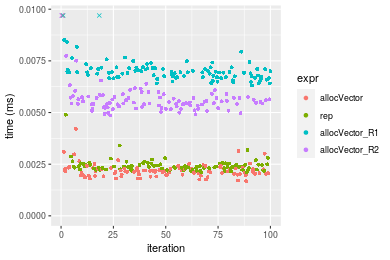

[matrixStats]: Benchmark report

---------------------------------------


# allocVector() benchmarks

This report benchmark the performance of allocVector() against alternative methods.

## Alternative methods

* vector() + assignment
* rep()
* matrix() + as.vector()

where
```r
> allocVector_R1 <- function(length, value = NA) {
+     x <- vector(mode = typeof(value), length = length)
+     if (!is.finite(value) || value != 0) 
+         x[] <- value
+     x
+ }
> allocVector_R2 <- function(length, value = NA) {
+     x <- matrix(data = value, nrow = length, ncol = 1L)
+     as.vector(x)
+ }
```


## Data type "integer"
### Data
```r
> rvector <- function(n, mode = c("logical", "double", "integer"), range = c(-100, +100), na_prob = 0) {
+     mode <- match.arg(mode)
+     if (mode == "logical") {
+         x <- sample(c(FALSE, TRUE), size = n, replace = TRUE)
+     }     else {
+         x <- runif(n, min = range[1], max = range[2])
+     }
+     storage.mode(x) <- mode
+     if (na_prob > 0) 
+         x[sample(n, size = na_prob * n)] <- NA
+     x
+ }
> rvectors <- function(scale = 10, seed = 1, ...) {
+     set.seed(seed)
+     data <- list()
+     data[[1]] <- rvector(n = scale * 100, ...)
+     data[[2]] <- rvector(n = scale * 1000, ...)
+     data[[3]] <- rvector(n = scale * 10000, ...)
+     data[[4]] <- rvector(n = scale * 1e+05, ...)
+     data[[5]] <- rvector(n = scale * 1e+06, ...)
+     names(data) <- sprintf("n = %d", sapply(data, FUN = length))
+     data
+ }
> data <- rvectors(mode = mode)
> values <- list(zero = 0, one = 1, `NA` = NA_real_)
> if (mode != "double") 
+     values <- lapply(values, FUN = function(x) {
+         storage.mode(x) <- mode
+         x
+     })
```

### Results

### n = 1000 matrix


```r
> n <- length(data[["n = 1000"]])
> str(value)
 int 0
```

```r
> stats <- microbenchmark(allocVector = allocVector(length = n, value = value), rep = rep(value, times = n), 
+     allocVector_R1 = allocVector_R1(length = n, value = value), allocVector_R2 = allocVector_R2(length = n, 
+         value = value), unit = "ms")
```

_Table: Benchmarking of allocVector(), rep(), allocVector_R1() and allocVector_R2() on integer+n = 1000+0 data. The top panel shows times in milliseconds and the bottom panel shows relative times._


|   |expr           |      min|        lq|      mean|    median|        uq|      max|
|:--|:--------------|--------:|---------:|---------:|---------:|---------:|--------:|
|1  |allocVector    | 0.001291| 0.0016485| 0.0025727| 0.0017720| 0.0019845| 0.077012|
|2  |rep            | 0.002220| 0.0023415| 0.0025900| 0.0024800| 0.0025825| 0.009392|
|3  |allocVector_R1 | 0.002845| 0.0032365| 0.0036185| 0.0034215| 0.0036040| 0.018481|
|4  |allocVector_R2 | 0.004760| 0.0051805| 0.0057465| 0.0054070| 0.0059185| 0.020808|


|   |expr           |      min|       lq|     mean|   median|       uq|       max|
|:--|:--------------|--------:|--------:|--------:|--------:|--------:|---------:|
|1  |allocVector    | 1.000000| 1.000000| 1.000000| 1.000000| 1.000000| 1.0000000|
|2  |rep            | 1.719597| 1.420382| 1.006705| 1.399549| 1.301335| 0.1219550|
|3  |allocVector_R1 | 2.203718| 1.963300| 1.406462| 1.930869| 1.816075| 0.2399756|
|4  |allocVector_R2 | 3.687064| 3.142554| 2.233603| 3.051354| 2.982363| 0.2701917|

_Figure: Benchmarking of allocVector(), rep(), allocVector_R1() and allocVector_R2() on integer+n = 1000+0 data.  Outliers are displayed as crosses.  Times are in milliseconds._


```r
> n <- length(data[["n = 1000"]])
> str(value)
 int 1
```

```r
> stats <- microbenchmark(allocVector = allocVector(length = n, value = value), rep = rep(value, times = n), 
+     allocVector_R1 = allocVector_R1(length = n, value = value), allocVector_R2 = allocVector_R2(length = n, 
+         value = value), unit = "ms")
```

_Table: Benchmarking of allocVector(), rep(), allocVector_R1() and allocVector_R2() on integer+n = 1000+1 data. The top panel shows times in milliseconds and the bottom panel shows relative times._


|   |expr           |      min|        lq|      mean|    median|        uq|      max|
|:--|:--------------|--------:|---------:|---------:|---------:|---------:|--------:|
|1  |allocVector    | 0.001608| 0.0019880| 0.0022513| 0.0021310| 0.0023155| 0.009959|
|2  |rep            | 0.002176| 0.0023925| 0.0025901| 0.0025400| 0.0026475| 0.004491|
|4  |allocVector_R2 | 0.004733| 0.0053460| 0.0059788| 0.0056220| 0.0059840| 0.029449|
|3  |allocVector_R1 | 0.006413| 0.0069215| 0.0074955| 0.0071845| 0.0076400| 0.021647|


|   |expr           |      min|       lq|     mean|   median|       uq|       max|
|:--|:--------------|--------:|--------:|--------:|--------:|--------:|---------:|
|1  |allocVector    | 1.000000| 1.000000| 1.000000| 1.000000| 1.000000| 1.0000000|
|2  |rep            | 1.353234| 1.203471| 1.150483| 1.191929| 1.143382| 0.4509489|
|4  |allocVector_R2 | 2.943408| 2.689135| 2.655747| 2.638198| 2.584323| 2.9570238|
|3  |allocVector_R1 | 3.988184| 3.481640| 3.329435| 3.371422| 3.299503| 2.1736118|

_Figure: Benchmarking of allocVector(), rep(), allocVector_R1() and allocVector_R2() on integer+n = 1000+1 data.  Outliers are displayed as crosses.  Times are in milliseconds._


```r
> n <- length(data[["n = 1000"]])
> str(value)
 int NA
```

```r
> stats <- microbenchmark(allocVector = allocVector(length = n, value = value), rep = rep(value, times = n), 
+     allocVector_R1 = allocVector_R1(length = n, value = value), allocVector_R2 = allocVector_R2(length = n, 
+         value = value), unit = "ms")
```

_Table: Benchmarking of allocVector(), rep(), allocVector_R1() and allocVector_R2() on integer+n = 1000+NA data. The top panel shows times in milliseconds and the bottom panel shows relative times._


|   |expr           |      min|        lq|      mean|    median|        uq|      max|
|:--|:--------------|--------:|---------:|---------:|---------:|---------:|--------:|
|1  |allocVector    | 0.001671| 0.0019900| 0.0023489| 0.0021735| 0.0023745| 0.013166|
|2  |rep            | 0.002120| 0.0024015| 0.0027203| 0.0024985| 0.0026735| 0.019697|
|4  |allocVector_R2 | 0.004969| 0.0054450| 0.0059545| 0.0057455| 0.0060480| 0.021023|
|3  |allocVector_R1 | 0.006471| 0.0068795| 0.0075014| 0.0070935| 0.0073740| 0.033466|


|   |expr           |      min|       lq|     mean|   median|       uq|      max|
|:--|:--------------|--------:|--------:|--------:|--------:|--------:|--------:|
|1  |allocVector    | 1.000000| 1.000000| 1.000000| 1.000000| 1.000000| 1.000000|
|2  |rep            | 1.268701| 1.206784| 1.158105| 1.149528| 1.125921| 1.496050|
|4  |allocVector_R2 | 2.973669| 2.736181| 2.534990| 2.643432| 2.547063| 1.596764|
|3  |allocVector_R1 | 3.872531| 3.457035| 3.193517| 3.263630| 3.105496| 2.541850|

_Figure: Benchmarking of allocVector(), rep(), allocVector_R1() and allocVector_R2() on integer+n = 1000+NA data.  Outliers are displayed as crosses.  Times are in milliseconds._


### n = 10000 matrix


```r
> n <- length(data[["n = 10000"]])
> str(value)
 int 0
```

```r
> stats <- microbenchmark(allocVector = allocVector(length = n, value = value), rep = rep(value, times = n), 
+     allocVector_R1 = allocVector_R1(length = n, value = value), allocVector_R2 = allocVector_R2(length = n, 
+         value = value), unit = "ms")
```

_Table: Benchmarking of allocVector(), rep(), allocVector_R1() and allocVector_R2() on integer+n = 10000+0 data. The top panel shows times in milliseconds and the bottom panel shows relative times._


|   |expr           |      min|        lq|      mean|    median|        uq|      max|
|:--|:--------------|--------:|---------:|---------:|---------:|---------:|--------:|
|1  |allocVector    | 0.003047| 0.0034870| 0.0038539| 0.0037400| 0.0039890| 0.011583|
|3  |allocVector_R1 | 0.004705| 0.0051640| 0.0055503| 0.0054305| 0.0057080| 0.013387|
|4  |allocVector_R2 | 0.011985| 0.0132340| 0.0143255| 0.0137170| 0.0143160| 0.045671|
|2  |rep            | 0.016343| 0.0164935| 0.0167819| 0.0166105| 0.0167905| 0.024313|


|   |expr           |      min|       lq|     mean|   median|       uq|      max|
|:--|:--------------|--------:|--------:|--------:|--------:|--------:|--------:|
|1  |allocVector    | 1.000000| 1.000000| 1.000000| 1.000000| 1.000000| 1.000000|
|3  |allocVector_R1 | 1.544142| 1.480929| 1.440160| 1.452005| 1.430935| 1.155746|
|4  |allocVector_R2 | 3.933377| 3.795240| 3.717135| 3.667647| 3.588869| 3.942934|
|2  |rep            | 5.363636| 4.729997| 4.354512| 4.441310| 4.209200| 2.099024|

_Figure: Benchmarking of allocVector(), rep(), allocVector_R1() and allocVector_R2() on integer+n = 10000+0 data.  Outliers are displayed as crosses.  Times are in milliseconds._


```r
> n <- length(data[["n = 10000"]])
> str(value)
 int 1
```

```r
> stats <- microbenchmark(allocVector = allocVector(length = n, value = value), rep = rep(value, times = n), 
+     allocVector_R1 = allocVector_R1(length = n, value = value), allocVector_R2 = allocVector_R2(length = n, 
+         value = value), unit = "ms")
```

_Table: Benchmarking of allocVector(), rep(), allocVector_R1() and allocVector_R2() on integer+n = 10000+1 data. The top panel shows times in milliseconds and the bottom panel shows relative times._


|   |expr           |      min|        lq|      mean|    median|        uq|      max|
|:--|:--------------|--------:|---------:|---------:|---------:|---------:|--------:|
|1  |allocVector    | 0.006401| 0.0072415| 0.0075306| 0.0074175| 0.0076965| 0.015085|
|4  |allocVector_R2 | 0.012174| 0.0135805| 0.0146636| 0.0141695| 0.0147865| 0.030900|
|2  |rep            | 0.016428| 0.0165950| 0.0169292| 0.0167140| 0.0169350| 0.021704|
|3  |allocVector_R1 | 0.031605| 0.0322645| 0.0331387| 0.0325395| 0.0328135| 0.064134|


|   |expr           |      min|       lq|     mean|   median|       uq|      max|
|:--|:--------------|--------:|--------:|--------:|--------:|--------:|--------:|
|1  |allocVector    | 1.000000| 1.000000| 1.000000| 1.000000| 1.000000| 1.000000|
|4  |allocVector_R2 | 1.901890| 1.875371| 1.947207| 1.910280| 1.921198| 2.048392|
|2  |rep            | 2.566474| 2.291652| 2.248073| 2.253320| 2.200351| 1.438780|
|3  |allocVector_R1 | 4.937510| 4.455500| 4.400568| 4.386855| 4.263431| 4.251508|

_Figure: Benchmarking of allocVector(), rep(), allocVector_R1() and allocVector_R2() on integer+n = 10000+1 data.  Outliers are displayed as crosses.  Times are in milliseconds._


```r
> n <- length(data[["n = 10000"]])
> str(value)
 int NA
```

```r
> stats <- microbenchmark(allocVector = allocVector(length = n, value = value), rep = rep(value, times = n), 
+     allocVector_R1 = allocVector_R1(length = n, value = value), allocVector_R2 = allocVector_R2(length = n, 
+         value = value), unit = "ms")
```

_Table: Benchmarking of allocVector(), rep(), allocVector_R1() and allocVector_R2() on integer+n = 10000+NA data. The top panel shows times in milliseconds and the bottom panel shows relative times._


|   |expr           |      min|        lq|      mean|    median|        uq|      max|
|:--|:--------------|--------:|---------:|---------:|---------:|---------:|--------:|
|1  |allocVector    | 0.006388| 0.0069675| 0.0074947| 0.0073320| 0.0077120| 0.015878|
|4  |allocVector_R2 | 0.012178| 0.0133495| 0.0143775| 0.0140195| 0.0147885| 0.030996|
|2  |rep            | 0.016430| 0.0165820| 0.0174405| 0.0167040| 0.0170115| 0.058788|
|3  |allocVector_R1 | 0.031339| 0.0321005| 0.0329580| 0.0325600| 0.0332745| 0.049945|


|   |expr           |      min|       lq|     mean|   median|       uq|      max|
|:--|:--------------|--------:|--------:|--------:|--------:|--------:|--------:|
|1  |allocVector    | 1.000000| 1.000000| 1.000000| 1.000000| 1.000000| 1.000000|
|4  |allocVector_R2 | 1.906387| 1.915967| 1.918352| 1.912098| 1.917596| 1.952135|
|2  |rep            | 2.572010| 2.379907| 2.327028| 2.278232| 2.205848| 3.702481|
|3  |allocVector_R1 | 4.905917| 4.607176| 4.397489| 4.440807| 4.314640| 3.145547|

_Figure: Benchmarking of allocVector(), rep(), allocVector_R1() and allocVector_R2() on integer+n = 10000+NA data.  Outliers are displayed as crosses.  Times are in milliseconds._


### n = 100000 matrix


```r
> n <- length(data[["n = 100000"]])
> str(value)
 int 0
```

```r
> stats <- microbenchmark(allocVector = allocVector(length = n, value = value), rep = rep(value, times = n), 
+     allocVector_R1 = allocVector_R1(length = n, value = value), allocVector_R2 = allocVector_R2(length = n, 
+         value = value), unit = "ms")
```

_Table: Benchmarking of allocVector(), rep(), allocVector_R1() and allocVector_R2() on integer+n = 100000+0 data. The top panel shows times in milliseconds and the bottom panel shows relative times._


|   |expr           |      min|        lq|      mean|    median|        uq|      max|
|:--|:--------------|--------:|---------:|---------:|---------:|---------:|--------:|
|1  |allocVector    | 0.017483| 0.0202825| 0.0758000| 0.0237475| 0.1618945| 0.183558|
|3  |allocVector_R1 | 0.018691| 0.0215060| 0.0726146| 0.0247675| 0.1617020| 0.211468|
|4  |allocVector_R2 | 0.076114| 0.0860500| 0.2589109| 0.1028640| 0.3474015| 5.896655|
|2  |rep            | 0.126403| 0.1339245| 0.2467912| 0.1584090| 0.2577160| 5.898492|


|   |expr           |      min|       lq|      mean|   median|       uq|      max|
|:--|:--------------|--------:|--------:|---------:|--------:|--------:|--------:|
|1  |allocVector    | 1.000000| 1.000000| 1.0000000| 1.000000| 1.000000|  1.00000|
|3  |allocVector_R1 | 1.069096| 1.060323| 0.9579765| 1.042952| 0.998811|  1.15205|
|4  |allocVector_R2 | 4.353601| 4.242574| 3.4157123| 4.331572| 2.145851| 32.12421|
|2  |rep            | 7.230052| 6.602958| 3.2558221| 6.670555| 1.591876| 32.13421|

_Figure: Benchmarking of allocVector(), rep(), allocVector_R1() and allocVector_R2() on integer+n = 100000+0 data.  Outliers are displayed as crosses.  Times are in milliseconds._


```r
> n <- length(data[["n = 100000"]])
> str(value)
 int 1
```

```r
> stats <- microbenchmark(allocVector = allocVector(length = n, value = value), rep = rep(value, times = n), 
+     allocVector_R1 = allocVector_R1(length = n, value = value), allocVector_R2 = allocVector_R2(length = n, 
+         value = value), unit = "ms")
```

_Table: Benchmarking of allocVector(), rep(), allocVector_R1() and allocVector_R2() on integer+n = 100000+1 data. The top panel shows times in milliseconds and the bottom panel shows relative times._


|   |expr           |      min|        lq|      mean|    median|        uq|      max|
|:--|:--------------|--------:|---------:|---------:|---------:|---------:|--------:|
|1  |allocVector    | 0.043691| 0.0456425| 0.1471062| 0.0535520| 0.1681350| 5.466483|
|4  |allocVector_R2 | 0.075244| 0.0849685| 0.2287936| 0.0977260| 0.3340995| 5.711340|
|2  |rep            | 0.123369| 0.1276035| 0.1793324| 0.1524165| 0.2520245| 0.293475|
|3  |allocVector_R1 | 0.216631| 0.2270355| 0.3464223| 0.2790740| 0.4904475| 0.571319|


|   |expr           |      min|       lq|     mean|   median|       uq|       max|
|:--|:--------------|--------:|--------:|--------:|--------:|--------:|---------:|
|1  |allocVector    | 1.000000| 1.000000| 1.000000| 1.000000| 1.000000| 1.0000000|
|4  |allocVector_R2 | 1.722185| 1.861609| 1.555295| 1.824880| 1.987091| 1.0447924|
|2  |rep            | 2.823671| 2.795717| 1.219067| 2.846140| 1.498941| 0.0536863|
|3  |allocVector_R1 | 4.958252| 4.974213| 2.354913| 5.211271| 2.916986| 0.1045131|

_Figure: Benchmarking of allocVector(), rep(), allocVector_R1() and allocVector_R2() on integer+n = 100000+1 data.  Outliers are displayed as crosses.  Times are in milliseconds._


```r
> n <- length(data[["n = 100000"]])
> str(value)
 int NA
```

```r
> stats <- microbenchmark(allocVector = allocVector(length = n, value = value), rep = rep(value, times = n), 
+     allocVector_R1 = allocVector_R1(length = n, value = value), allocVector_R2 = allocVector_R2(length = n, 
+         value = value), unit = "ms")
```

_Table: Benchmarking of allocVector(), rep(), allocVector_R1() and allocVector_R2() on integer+n = 100000+NA data. The top panel shows times in milliseconds and the bottom panel shows relative times._


|   |expr           |      min|        lq|      mean|    median|        uq|      max|
|:--|:--------------|--------:|---------:|---------:|---------:|---------:|--------:|
|1  |allocVector    | 0.043393| 0.0457640| 0.0841466| 0.0501390| 0.1605895| 0.201411|
|4  |allocVector_R2 | 0.074571| 0.0861125| 0.1791867| 0.1002435| 0.3397675| 0.395409|
|2  |rep            | 0.126574| 0.1321670| 0.2319547| 0.1524180| 0.2403570| 5.846479|
|3  |allocVector_R1 | 0.222513| 0.2309980| 0.3958427| 0.2737885| 0.4893180| 6.102523|


|   |expr           |      min|       lq|     mean|   median|       uq|       max|
|:--|:--------------|--------:|--------:|--------:|--------:|--------:|---------:|
|1  |allocVector    | 1.000000| 1.000000| 1.000000| 1.000000| 1.000000|  1.000000|
|4  |allocVector_R2 | 1.718503| 1.881665| 2.129459| 1.999312| 2.115752|  1.963195|
|2  |rep            | 2.916922| 2.888012| 2.756556| 3.039909| 1.496717| 29.027605|
|3  |allocVector_R1 | 5.127855| 5.047592| 4.704206| 5.460590| 3.047011| 30.298857|

_Figure: Benchmarking of allocVector(), rep(), allocVector_R1() and allocVector_R2() on integer+n = 100000+NA data.  Outliers are displayed as crosses.  Times are in milliseconds._


### n = 1000000 matrix


```r
> n <- length(data[["n = 1000000"]])
> str(value)
 int 0
```

```r
> stats <- microbenchmark(allocVector = allocVector(length = n, value = value), rep = rep(value, times = n), 
+     allocVector_R1 = allocVector_R1(length = n, value = value), allocVector_R2 = allocVector_R2(length = n, 
+         value = value), unit = "ms")
```

_Table: Benchmarking of allocVector(), rep(), allocVector_R1() and allocVector_R2() on integer+n = 1000000+0 data. The top panel shows times in milliseconds and the bottom panel shows relative times._


|   |expr           |      min|        lq|      mean|    median|        uq|      max|
|:--|:--------------|--------:|---------:|---------:|---------:|---------:|--------:|
|1  |allocVector    | 0.167854| 0.1932035| 0.6314815| 0.2049925| 0.2340575| 6.194362|
|3  |allocVector_R1 | 0.175405| 0.2003095| 0.6118296| 0.2158965| 0.2373765| 4.106948|
|4  |allocVector_R2 | 0.919935| 0.9767010| 1.5225728| 1.0038025| 1.0480050| 6.820040|
|2  |rep            | 1.218644| 1.3482700| 1.6845087| 1.4079745| 1.4658250| 7.524439|


|   |expr           |      min|       lq|      mean|   median|       uq|       max|
|:--|:--------------|--------:|--------:|---------:|--------:|--------:|---------:|
|1  |allocVector    | 1.000000| 1.000000| 1.0000000| 1.000000| 1.000000| 1.0000000|
|3  |allocVector_R1 | 1.044985| 1.036780| 0.9688796| 1.053192| 1.014180| 0.6630139|
|4  |allocVector_R2 | 5.480566| 5.055297| 2.4111122| 4.896777| 4.477554| 1.1010077|
|2  |rep            | 7.260143| 6.978497| 2.6675501| 6.868420| 6.262670| 1.2147238|

_Figure: Benchmarking of allocVector(), rep(), allocVector_R1() and allocVector_R2() on integer+n = 1000000+0 data.  Outliers are displayed as crosses.  Times are in milliseconds._


```r
> n <- length(data[["n = 1000000"]])
> str(value)
 int 1
```

```r
> stats <- microbenchmark(allocVector = allocVector(length = n, value = value), rep = rep(value, times = n), 
+     allocVector_R1 = allocVector_R1(length = n, value = value), allocVector_R2 = allocVector_R2(length = n, 
+         value = value), unit = "ms")
```

_Table: Benchmarking of allocVector(), rep(), allocVector_R1() and allocVector_R2() on integer+n = 1000000+1 data. The top panel shows times in milliseconds and the bottom panel shows relative times._


|   |expr           |      min|        lq|     mean|    median|        uq|      max|
|:--|:--------------|--------:|---------:|--------:|---------:|---------:|--------:|
|1  |allocVector    | 0.412375| 0.4283630| 0.891144| 0.4389290| 0.4659515| 5.902721|
|4  |allocVector_R2 | 0.872616| 0.9157895| 1.467150| 0.9277395| 0.9500330| 6.577447|
|2  |rep            | 1.167224| 1.2292450| 1.416293| 1.2601560| 1.2729535| 4.918317|
|3  |allocVector_R1 | 2.086407| 2.2512220| 2.935449| 2.2847845| 2.3412995| 7.085598|


|   |expr           |      min|       lq|     mean|   median|       uq|       max|
|:--|:--------------|--------:|--------:|--------:|--------:|--------:|---------:|
|1  |allocVector    | 1.000000| 1.000000| 1.000000| 1.000000| 1.000000| 1.0000000|
|4  |allocVector_R2 | 2.116074| 2.137882| 1.646367| 2.113644| 2.038910| 1.1143076|
|2  |rep            | 2.830492| 2.869634| 1.589298| 2.870979| 2.731944| 0.8332288|
|3  |allocVector_R1 | 5.059489| 5.255407| 3.294023| 5.205362| 5.024771| 1.2003952|

_Figure: Benchmarking of allocVector(), rep(), allocVector_R1() and allocVector_R2() on integer+n = 1000000+1 data.  Outliers are displayed as crosses.  Times are in milliseconds._


```r
> n <- length(data[["n = 1000000"]])
> str(value)
 int NA
```

```r
> stats <- microbenchmark(allocVector = allocVector(length = n, value = value), rep = rep(value, times = n), 
+     allocVector_R1 = allocVector_R1(length = n, value = value), allocVector_R2 = allocVector_R2(length = n, 
+         value = value), unit = "ms")
```

_Table: Benchmarking of allocVector(), rep(), allocVector_R1() and allocVector_R2() on integer+n = 1000000+NA data. The top panel shows times in milliseconds and the bottom panel shows relative times._


|   |expr           |      min|        lq|      mean|   median|        uq|        max|
|:--|:--------------|--------:|---------:|---------:|--------:|---------:|----------:|
|1  |allocVector    | 0.412432| 0.4321405| 0.8478479| 0.437984| 0.5387145|   6.619624|
|4  |allocVector_R2 | 0.889459| 0.9166540| 1.5997440| 0.930059| 1.0314850|   6.800204|
|2  |rep            | 1.183535| 1.2285340| 5.0905064| 1.260788| 1.3288735| 341.470976|
|3  |allocVector_R1 | 2.186592| 2.2412955| 3.0821365| 2.285582| 3.6176760|   8.634266|


|   |expr           |      min|       lq|     mean|   median|       uq|       max|
|:--|:--------------|--------:|--------:|--------:|--------:|--------:|---------:|
|1  |allocVector    | 1.000000| 1.000000| 1.000000| 1.000000| 1.000000|  1.000000|
|4  |allocVector_R2 | 2.156620| 2.121194| 1.886829| 2.123500| 1.914716|  1.027279|
|2  |rep            | 2.869649| 2.842904| 6.004033| 2.878617| 2.466749| 51.584648|
|3  |allocVector_R1 | 5.301703| 5.186497| 3.635247| 5.218414| 6.715386|  1.304344|

_Figure: Benchmarking of allocVector(), rep(), allocVector_R1() and allocVector_R2() on integer+n = 1000000+NA data.  Outliers are displayed as crosses.  Times are in milliseconds._


### n = 10000000 matrix


```r
> n <- length(data[["n = 10000000"]])
> str(value)
 int 0
```

```r
> stats <- microbenchmark(allocVector = allocVector(length = n, value = value), rep = rep(value, times = n), 
+     allocVector_R1 = allocVector_R1(length = n, value = value), allocVector_R2 = allocVector_R2(length = n, 
+         value = value), unit = "ms")
```

_Table: Benchmarking of allocVector(), rep(), allocVector_R1() and allocVector_R2() on integer+n = 10000000+0 data. The top panel shows times in milliseconds and the bottom panel shows relative times._


|   |expr           |      min|       lq|     mean|   median|       uq|       max|
|:--|:--------------|--------:|--------:|--------:|--------:|--------:|---------:|
|3  |allocVector_R1 | 12.63546| 13.02242| 20.16692| 13.65514| 21.85036| 351.92373|
|1  |allocVector    | 12.65063| 13.02751| 16.89038| 13.76262| 21.80091|  23.74778|
|2  |rep            | 20.45499| 20.86397| 32.21169| 22.45490| 30.39022| 366.81992|
|4  |allocVector_R2 | 29.58066| 36.67542| 40.33890| 38.04415| 39.47954| 377.51608|


|   |expr           |      min|       lq|     mean|   median|        uq|       max|
|:--|:--------------|--------:|--------:|--------:|--------:|---------:|---------:|
|3  |allocVector_R1 | 1.000000| 1.000000| 1.000000| 1.000000| 1.0000000| 1.0000000|
|1  |allocVector    | 1.001201| 1.000391| 0.837529| 1.007871| 0.9977372| 0.0674799|
|2  |rep            | 1.618856| 1.602157| 1.597254| 1.644428| 1.3908342| 1.0423279|
|4  |allocVector_R2 | 2.341082| 2.816329| 2.000251| 2.786068| 1.8068146| 1.0727213|

_Figure: Benchmarking of allocVector(), rep(), allocVector_R1() and allocVector_R2() on integer+n = 10000000+0 data.  Outliers are displayed as crosses.  Times are in milliseconds._


```r
> n <- length(data[["n = 10000000"]])
> str(value)
 int 1
```

```r
> stats <- microbenchmark(allocVector = allocVector(length = n, value = value), rep = rep(value, times = n), 
+     allocVector_R1 = allocVector_R1(length = n, value = value), allocVector_R2 = allocVector_R2(length = n, 
+         value = value), unit = "ms")
```

_Table: Benchmarking of allocVector(), rep(), allocVector_R1() and allocVector_R2() on integer+n = 10000000+1 data. The top panel shows times in milliseconds and the bottom panel shows relative times._


|   |expr           |      min|       lq|     mean|   median|       uq|      max|
|:--|:--------------|--------:|--------:|--------:|--------:|--------:|--------:|
|1  |allocVector    | 13.23932| 13.64579| 20.96921| 14.32506| 22.39856| 357.4252|
|2  |rep            | 20.34816| 21.12817| 28.70912| 22.76576| 29.92917| 357.9072|
|4  |allocVector_R2 | 29.65705| 36.88882| 51.00195| 38.35922| 39.49794| 372.1699|
|3  |allocVector_R1 | 40.42712| 47.83018| 55.29098| 48.88169| 50.40713| 394.9465|


|   |expr           |      min|       lq|     mean|   median|       uq|      max|
|:--|:--------------|--------:|--------:|--------:|--------:|--------:|--------:|
|1  |allocVector    | 1.000000| 1.000000| 1.000000| 1.000000| 1.000000| 1.000000|
|2  |rep            | 1.536948| 1.548329| 1.369109| 1.589226| 1.336210| 1.001348|
|4  |allocVector_R2 | 2.240073| 2.703312| 2.432230| 2.677771| 1.763414| 1.041252|
|3  |allocVector_R1 | 3.053564| 3.505124| 2.636770| 3.412321| 2.250463| 1.104977|

_Figure: Benchmarking of allocVector(), rep(), allocVector_R1() and allocVector_R2() on integer+n = 10000000+1 data.  Outliers are displayed as crosses.  Times are in milliseconds._


```r
> n <- length(data[["n = 10000000"]])
> str(value)
 int NA
```

```r
> stats <- microbenchmark(allocVector = allocVector(length = n, value = value), rep = rep(value, times = n), 
+     allocVector_R1 = allocVector_R1(length = n, value = value), allocVector_R2 = allocVector_R2(length = n, 
+         value = value), unit = "ms")
```

_Table: Benchmarking of allocVector(), rep(), allocVector_R1() and allocVector_R2() on integer+n = 10000000+NA data. The top panel shows times in milliseconds and the bottom panel shows relative times._


|   |expr           |      min|       lq|     mean|   median|       uq|      max|
|:--|:--------------|--------:|--------:|--------:|--------:|--------:|--------:|
|1  |allocVector    | 13.20015| 13.77348| 20.71589| 14.19909| 22.31642| 359.7546|
|2  |rep            | 20.41913| 21.61964| 35.40740| 22.77208| 30.07727| 357.6511|
|4  |allocVector_R2 | 29.49000| 36.33405| 43.83292| 38.06939| 39.66189| 368.1529|
|3  |allocVector_R1 | 40.62559| 48.08906| 58.71423| 49.56928| 50.75201| 387.2327|


|   |expr           |      min|       lq|     mean|   median|       uq|       max|
|:--|:--------------|--------:|--------:|--------:|--------:|--------:|---------:|
|1  |allocVector    | 1.000000| 1.000000| 1.000000| 1.000000| 1.000000| 1.0000000|
|2  |rep            | 1.546887| 1.569657| 1.709190| 1.603770| 1.347764| 0.9941532|
|4  |allocVector_R2 | 2.234066| 2.637972| 2.115908| 2.681114| 1.777252| 1.0233448|
|3  |allocVector_R1 | 3.077661| 3.491425| 2.834260| 3.491017| 2.274201| 1.0763802|

_Figure: Benchmarking of allocVector(), rep(), allocVector_R1() and allocVector_R2() on integer+n = 10000000+NA data.  Outliers are displayed as crosses.  Times are in milliseconds._


## Data type "double"
### Data
```r
> rvector <- function(n, mode = c("logical", "double", "integer"), range = c(-100, +100), na_prob = 0) {
+     mode <- match.arg(mode)
+     if (mode == "logical") {
+         x <- sample(c(FALSE, TRUE), size = n, replace = TRUE)
+     }     else {
+         x <- runif(n, min = range[1], max = range[2])
+     }
+     storage.mode(x) <- mode
+     if (na_prob > 0) 
+         x[sample(n, size = na_prob * n)] <- NA
+     x
+ }
> rvectors <- function(scale = 10, seed = 1, ...) {
+     set.seed(seed)
+     data <- list()
+     data[[1]] <- rvector(n = scale * 100, ...)
+     data[[2]] <- rvector(n = scale * 1000, ...)
+     data[[3]] <- rvector(n = scale * 10000, ...)
+     data[[4]] <- rvector(n = scale * 1e+05, ...)
+     data[[5]] <- rvector(n = scale * 1e+06, ...)
+     names(data) <- sprintf("n = %d", sapply(data, FUN = length))
+     data
+ }
> data <- rvectors(mode = mode)
> values <- list(zero = 0, one = 1, `NA` = NA_real_)
> if (mode != "double") 
+     values <- lapply(values, FUN = function(x) {
+         storage.mode(x) <- mode
+         x
+     })
```

### Results

### n = 1000 matrix


```r
> n <- length(data[["n = 1000"]])
> str(value)
 num 0
```

```r
> stats <- microbenchmark(allocVector = allocVector(length = n, value = value), rep = rep(value, times = n), 
+     allocVector_R1 = allocVector_R1(length = n, value = value), allocVector_R2 = allocVector_R2(length = n, 
+         value = value), unit = "ms")
```

_Table: Benchmarking of allocVector(), rep(), allocVector_R1() and allocVector_R2() on double+n = 1000+0 data. The top panel shows times in milliseconds and the bottom panel shows relative times._


|   |expr           |      min|        lq|      mean|    median|        uq|      max|
|:--|:--------------|--------:|---------:|---------:|---------:|---------:|--------:|
|1  |allocVector    | 0.001420| 0.0015895| 0.0019484| 0.0017310| 0.0018795| 0.015117|
|2  |rep            | 0.002024| 0.0021010| 0.0022897| 0.0021690| 0.0023630| 0.004466|
|3  |allocVector_R1 | 0.002876| 0.0030970| 0.0034427| 0.0033025| 0.0035025| 0.012204|
|4  |allocVector_R2 | 0.004793| 0.0050725| 0.0055243| 0.0052555| 0.0055090| 0.023478|


|   |expr           |      min|       lq|     mean|   median|       uq|      max|
|:--|:--------------|--------:|--------:|--------:|--------:|--------:|--------:|
|1  |allocVector    | 1.000000| 1.000000| 1.000000| 1.000000| 1.000000| 1.000000|
|2  |rep            | 1.425352| 1.321799| 1.175172| 1.253033| 1.257249| 0.295429|
|3  |allocVector_R1 | 2.025352| 1.948411| 1.766884| 1.907857| 1.863528| 0.807303|
|4  |allocVector_R2 | 3.375352| 3.191255| 2.835257| 3.036106| 2.931099| 1.553086|

_Figure: Benchmarking of allocVector(), rep(), allocVector_R1() and allocVector_R2() on double+n = 1000+0 data.  Outliers are displayed as crosses.  Times are in milliseconds._


```r
> n <- length(data[["n = 1000"]])
> str(value)
 num 1
```

```r
> stats <- microbenchmark(allocVector = allocVector(length = n, value = value), rep = rep(value, times = n), 
+     allocVector_R1 = allocVector_R1(length = n, value = value), allocVector_R2 = allocVector_R2(length = n, 
+         value = value), unit = "ms")
```

_Table: Benchmarking of allocVector(), rep(), allocVector_R1() and allocVector_R2() on double+n = 1000+1 data. The top panel shows times in milliseconds and the bottom panel shows relative times._


|   |expr           |      min|       lq|      mean|    median|        uq|      max|
|:--|:--------------|--------:|--------:|---------:|---------:|---------:|--------:|
|1  |allocVector    | 0.001681| 0.002004| 0.0023142| 0.0021520| 0.0022920| 0.014470|
|2  |rep            | 0.002105| 0.002248| 0.0024207| 0.0023670| 0.0024815| 0.004899|
|4  |allocVector_R2 | 0.004855| 0.005267| 0.0059615| 0.0054860| 0.0057430| 0.038419|
|3  |allocVector_R1 | 0.006310| 0.006711| 0.0072224| 0.0069395| 0.0071400| 0.028761|


|   |expr           |      min|       lq|     mean|   median|       uq|       max|
|:--|:--------------|--------:|--------:|--------:|--------:|--------:|---------:|
|1  |allocVector    | 1.000000| 1.000000| 1.000000| 1.000000| 1.000000| 1.0000000|
|2  |rep            | 1.252231| 1.121757| 1.046016| 1.099907| 1.082679| 0.3385625|
|4  |allocVector_R2 | 2.888162| 2.628243| 2.576061| 2.549256| 2.505672| 2.6550795|
|3  |allocVector_R1 | 3.753718| 3.348802| 3.120924| 3.224675| 3.115183| 1.9876296|

_Figure: Benchmarking of allocVector(), rep(), allocVector_R1() and allocVector_R2() on double+n = 1000+1 data.  Outliers are displayed as crosses.  Times are in milliseconds._




```r
> n <- length(data[["n = 1000"]])
> str(value)
 num NA
```

```r
> stats <- microbenchmark(allocVector = allocVector(length = n, value = value), rep = rep(value, times = n), 
+     allocVector_R1 = allocVector_R1(length = n, value = value), allocVector_R2 = allocVector_R2(length = n, 
+         value = value), unit = "ms")
```

_Table: Benchmarking of allocVector(), rep(), allocVector_R1() and allocVector_R2() on double+n = 1000+NA data. The top panel shows times in milliseconds and the bottom panel shows relative times._


|   |expr           |      min|        lq|      mean|   median|        uq|      max|
|:--|:--------------|--------:|---------:|---------:|--------:|---------:|--------:|
|1  |allocVector    | 0.001828| 0.0021695| 0.0024641| 0.002324| 0.0025125| 0.013616|
|2  |rep            | 0.002124| 0.0022440| 0.0024270| 0.002336| 0.0025085| 0.006572|
|4  |allocVector_R2 | 0.005172| 0.0054750| 0.0058928| 0.005744| 0.0059930| 0.014087|
|3  |allocVector_R1 | 0.006307| 0.0066490| 0.0072830| 0.006839| 0.0071050| 0.037852|


|   |expr           |      min|       lq|      mean|   median|       uq|       max|
|:--|:--------------|--------:|--------:|---------:|--------:|--------:|---------:|
|1  |allocVector    | 1.000000| 1.000000| 1.0000000| 1.000000| 1.000000| 1.0000000|
|2  |rep            | 1.161926| 1.034340| 0.9849598| 1.005164| 0.998408| 0.4826675|
|4  |allocVector_R2 | 2.829322| 2.523623| 2.3915083| 2.471601| 2.385274| 1.0345917|
|3  |allocVector_R1 | 3.450219| 3.064761| 2.9556748| 2.942771| 2.827861| 2.7799647|

_Figure: Benchmarking of allocVector(), rep(), allocVector_R1() and allocVector_R2() on double+n = 1000+NA data.  Outliers are displayed as crosses.  Times are in milliseconds._


### n = 10000 matrix


```r
> n <- length(data[["n = 10000"]])
> str(value)
 num 0
```

```r
> stats <- microbenchmark(allocVector = allocVector(length = n, value = value), rep = rep(value, times = n), 
+     allocVector_R1 = allocVector_R1(length = n, value = value), allocVector_R2 = allocVector_R2(length = n, 
+         value = value), unit = "ms")
```

_Table: Benchmarking of allocVector(), rep(), allocVector_R1() and allocVector_R2() on double+n = 10000+0 data. The top panel shows times in milliseconds and the bottom panel shows relative times._


|   |expr           |      min|        lq|      mean|    median|       uq|      max|
|:--|:--------------|--------:|---------:|---------:|---------:|--------:|--------:|
|1  |allocVector    | 0.005112| 0.0056390| 0.0073907| 0.0060030| 0.006675| 0.030509|
|3  |allocVector_R1 | 0.006537| 0.0072380| 0.0090508| 0.0077700| 0.008711| 0.029767|
|2  |rep            | 0.016425| 0.0167215| 0.0188860| 0.0168590| 0.017179| 0.041688|
|4  |allocVector_R2 | 0.016705| 0.0181205| 0.0247799| 0.0214445| 0.023861| 0.071965|


|   |expr           |      min|       lq|     mean|   median|       uq|       max|
|:--|:--------------|--------:|--------:|--------:|--------:|--------:|---------:|
|1  |allocVector    | 1.000000| 1.000000| 1.000000| 1.000000| 1.000000| 1.0000000|
|3  |allocVector_R1 | 1.278756| 1.283561| 1.224625| 1.294353| 1.305019| 0.9756793|
|2  |rep            | 3.213028| 2.965331| 2.555383| 2.808429| 2.573633| 1.3664165|
|4  |allocVector_R2 | 3.267801| 3.213424| 3.352864| 3.572297| 3.574682| 2.3588122|

_Figure: Benchmarking of allocVector(), rep(), allocVector_R1() and allocVector_R2() on double+n = 10000+0 data.  Outliers are displayed as crosses.  Times are in milliseconds._


```r
> n <- length(data[["n = 10000"]])
> str(value)
 num 1
```

```r
> stats <- microbenchmark(allocVector = allocVector(length = n, value = value), rep = rep(value, times = n), 
+     allocVector_R1 = allocVector_R1(length = n, value = value), allocVector_R2 = allocVector_R2(length = n, 
+         value = value), unit = "ms")
```

_Table: Benchmarking of allocVector(), rep(), allocVector_R1() and allocVector_R2() on double+n = 10000+1 data. The top panel shows times in milliseconds and the bottom panel shows relative times._


|   |expr           |      min|        lq|      mean|    median|        uq|      max|
|:--|:--------------|--------:|---------:|---------:|---------:|---------:|--------:|
|1  |allocVector    | 0.008087| 0.0087930| 0.0096728| 0.0091775| 0.0099930| 0.020400|
|2  |rep            | 0.015890| 0.0161675| 0.0169276| 0.0167310| 0.0170655| 0.030499|
|4  |allocVector_R2 | 0.016701| 0.0179160| 0.0194537| 0.0188615| 0.0205270| 0.030708|
|3  |allocVector_R1 | 0.029915| 0.0309650| 0.0323190| 0.0319640| 0.0324835| 0.064344|


|   |expr           |      min|       lq|     mean|   median|       uq|      max|
|:--|:--------------|--------:|--------:|--------:|--------:|--------:|--------:|
|1  |allocVector    | 1.000000| 1.000000| 1.000000| 1.000000| 1.000000| 1.000000|
|2  |rep            | 1.964882| 1.838679| 1.750012| 1.823046| 1.707745| 1.495049|
|4  |allocVector_R2 | 2.065166| 2.037530| 2.011165| 2.055189| 2.054138| 1.505294|
|3  |allocVector_R1 | 3.699147| 3.521551| 3.341218| 3.482866| 3.250625| 3.154118|

_Figure: Benchmarking of allocVector(), rep(), allocVector_R1() and allocVector_R2() on double+n = 10000+1 data.  Outliers are displayed as crosses.  Times are in milliseconds._


```r
> n <- length(data[["n = 10000"]])
> str(value)
 num NA
```

```r
> stats <- microbenchmark(allocVector = allocVector(length = n, value = value), rep = rep(value, times = n), 
+     allocVector_R1 = allocVector_R1(length = n, value = value), allocVector_R2 = allocVector_R2(length = n, 
+         value = value), unit = "ms")
```

_Table: Benchmarking of allocVector(), rep(), allocVector_R1() and allocVector_R2() on double+n = 10000+NA data. The top panel shows times in milliseconds and the bottom panel shows relative times._


|   |expr           |      min|        lq|      mean|    median|        uq|      max|
|:--|:--------------|--------:|---------:|---------:|---------:|---------:|--------:|
|1  |allocVector    | 0.008084| 0.0087125| 0.0097897| 0.0091590| 0.0110350| 0.016765|
|2  |rep            | 0.015933| 0.0165005| 0.0170365| 0.0168925| 0.0170990| 0.029958|
|4  |allocVector_R2 | 0.016285| 0.0180090| 0.0199812| 0.0191240| 0.0214535| 0.033657|
|3  |allocVector_R1 | 0.028315| 0.0310975| 0.0321950| 0.0317230| 0.0322925| 0.064343|


|   |expr           |      min|       lq|     mean|   median|       uq|      max|
|:--|:--------------|--------:|--------:|--------:|--------:|--------:|--------:|
|1  |allocVector    | 1.000000| 1.000000| 1.000000| 1.000000| 1.000000| 1.000000|
|2  |rep            | 1.970930| 1.893888| 1.740258| 1.844361| 1.549524| 1.786937|
|4  |allocVector_R2 | 2.014473| 2.067030| 2.041047| 2.088001| 1.944132| 2.007575|
|3  |allocVector_R1 | 3.502598| 3.569297| 3.288673| 3.463588| 2.926371| 3.837936|

_Figure: Benchmarking of allocVector(), rep(), allocVector_R1() and allocVector_R2() on double+n = 10000+NA data.  Outliers are displayed as crosses.  Times are in milliseconds._


### n = 100000 matrix


```r
> n <- length(data[["n = 100000"]])
> str(value)
 num 0
```

```r
> stats <- microbenchmark(allocVector = allocVector(length = n, value = value), rep = rep(value, times = n), 
+     allocVector_R1 = allocVector_R1(length = n, value = value), allocVector_R2 = allocVector_R2(length = n, 
+         value = value), unit = "ms")
```

_Table: Benchmarking of allocVector(), rep(), allocVector_R1() and allocVector_R2() on double+n = 100000+0 data. The top panel shows times in milliseconds and the bottom panel shows relative times._


|   |expr           |      min|        lq|      mean|    median|        uq|      max|
|:--|:--------------|--------:|---------:|---------:|---------:|---------:|--------:|
|3  |allocVector_R1 | 0.032641| 0.0449265| 0.2199961| 0.2854820| 0.3175340| 0.451317|
|1  |allocVector    | 0.033243| 0.0456940| 0.2229439| 0.2867635| 0.3176900| 0.411610|
|2  |rep            | 0.123580| 0.1597170| 0.4444608| 0.3618950| 0.3876625| 7.486867|
|4  |allocVector_R2 | 0.124075| 0.1720470| 0.4737744| 0.5797065| 0.6271285| 0.759641|


|   |expr           |      min|       lq|     mean|   median|       uq|        max|
|:--|:--------------|--------:|--------:|--------:|--------:|--------:|----------:|
|3  |allocVector_R1 | 1.000000| 1.000000| 1.000000| 1.000000| 1.000000|  1.0000000|
|1  |allocVector    | 1.018443| 1.017084| 1.013399| 1.004489| 1.000491|  0.9120197|
|2  |rep            | 3.786036| 3.555073| 2.020312| 1.267663| 1.220854| 16.5889319|
|4  |allocVector_R2 | 3.801201| 3.829522| 2.153558| 2.030624| 1.974996|  1.6831650|

_Figure: Benchmarking of allocVector(), rep(), allocVector_R1() and allocVector_R2() on double+n = 100000+0 data.  Outliers are displayed as crosses.  Times are in milliseconds._


```r
> n <- length(data[["n = 100000"]])
> str(value)
 num 1
```

```r
> stats <- microbenchmark(allocVector = allocVector(length = n, value = value), rep = rep(value, times = n), 
+     allocVector_R1 = allocVector_R1(length = n, value = value), allocVector_R2 = allocVector_R2(length = n, 
+         value = value), unit = "ms")
```

_Table: Benchmarking of allocVector(), rep(), allocVector_R1() and allocVector_R2() on double+n = 100000+1 data. The top panel shows times in milliseconds and the bottom panel shows relative times._


|   |expr           |      min|        lq|      mean|    median|        uq|      max|
|:--|:--------------|--------:|---------:|---------:|---------:|---------:|--------:|
|1  |allocVector    | 0.058183| 0.0675595| 0.1927077| 0.2527905| 0.2886095| 0.357557|
|2  |rep            | 0.120672| 0.1300380| 0.2791915| 0.3255000| 0.3699000| 0.492998|
|3  |allocVector_R1 | 0.210113| 0.2214615| 0.4975119| 0.5187295| 0.5849955| 7.302006|
|4  |allocVector_R2 | 0.125831| 0.1801910| 0.5903175| 0.5495205| 0.6041575| 7.363703|


|   |expr           |      min|       lq|     mean|   median|       uq|       max|
|:--|:--------------|--------:|--------:|--------:|--------:|--------:|---------:|
|1  |allocVector    | 1.000000| 1.000000| 1.000000| 1.000000| 1.000000|  1.000000|
|2  |rep            | 2.074008| 1.924792| 1.448782| 1.287627| 1.281663|  1.378796|
|3  |allocVector_R1 | 3.611244| 3.278022| 2.581692| 2.052013| 2.026945| 20.421936|
|4  |allocVector_R2 | 2.162676| 2.667145| 3.063280| 2.173818| 2.093339| 20.594487|

_Figure: Benchmarking of allocVector(), rep(), allocVector_R1() and allocVector_R2() on double+n = 100000+1 data.  Outliers are displayed as crosses.  Times are in milliseconds._


```r
> n <- length(data[["n = 100000"]])
> str(value)
 num NA
```

```r
> stats <- microbenchmark(allocVector = allocVector(length = n, value = value), rep = rep(value, times = n), 
+     allocVector_R1 = allocVector_R1(length = n, value = value), allocVector_R2 = allocVector_R2(length = n, 
+         value = value), unit = "ms")
```

_Table: Benchmarking of allocVector(), rep(), allocVector_R1() and allocVector_R2() on double+n = 100000+NA data. The top panel shows times in milliseconds and the bottom panel shows relative times._


|   |expr           |      min|        lq|      mean|    median|        uq|      max|
|:--|:--------------|--------:|---------:|---------:|---------:|---------:|--------:|
|1  |allocVector    | 0.056891| 0.0681750| 0.3266920| 0.2546510| 0.2715175| 7.396849|
|2  |rep            | 0.119781| 0.1594865| 0.2848875| 0.3340025| 0.3772695| 0.491985|
|3  |allocVector_R1 | 0.203552| 0.2210220| 0.4985277| 0.5216630| 0.5798600| 7.137726|
|4  |allocVector_R2 | 0.124222| 0.1666655| 0.4480961| 0.5427785| 0.6066960| 0.748163|


|   |expr           |      min|       lq|      mean|   median|       uq|       max|
|:--|:--------------|--------:|--------:|---------:|--------:|--------:|---------:|
|1  |allocVector    | 1.000000| 1.000000| 1.0000000| 1.000000| 1.000000| 1.0000000|
|2  |rep            | 2.105447| 2.339369| 0.8720372| 1.311609| 1.389485| 0.0665128|
|3  |allocVector_R1 | 3.577930| 3.241980| 1.5259872| 2.048541| 2.135627| 0.9649685|
|4  |allocVector_R2 | 2.183509| 2.444672| 1.3716166| 2.131460| 2.234464| 0.1011462|

_Figure: Benchmarking of allocVector(), rep(), allocVector_R1() and allocVector_R2() on double+n = 100000+NA data.  Outliers are displayed as crosses.  Times are in milliseconds._


### n = 1000000 matrix


```r
> n <- length(data[["n = 1000000"]])
> str(value)
 num 0
```

```r
> stats <- microbenchmark(allocVector = allocVector(length = n, value = value), rep = rep(value, times = n), 
+     allocVector_R1 = allocVector_R1(length = n, value = value), allocVector_R2 = allocVector_R2(length = n, 
+         value = value), unit = "ms")
```

_Table: Benchmarking of allocVector(), rep(), allocVector_R1() and allocVector_R2() on double+n = 1000000+0 data. The top panel shows times in milliseconds and the bottom panel shows relative times._


|   |expr           |      min|        lq|     mean|    median|        uq|       max|
|:--|:--------------|--------:|---------:|--------:|---------:|---------:|---------:|
|1  |allocVector    | 0.295625| 0.3784000| 1.051034| 0.4125735| 0.4669035|  7.638469|
|3  |allocVector_R1 | 0.308285| 0.3912355| 1.113137| 0.4248760| 0.4791795|  7.625590|
|2  |rep            | 1.126853| 1.3289500| 1.967328| 1.4070430| 1.5321590| 10.030630|
|4  |allocVector_R2 | 1.334786| 1.4031215| 2.820345| 1.4552420| 5.1149475|  9.890856|


|   |expr           |      min|       lq|     mean|   median|        uq|       max|
|:--|:--------------|--------:|--------:|--------:|--------:|---------:|---------:|
|1  |allocVector    | 1.000000| 1.000000| 1.000000| 1.000000|  1.000000| 1.0000000|
|3  |allocVector_R1 | 1.042825| 1.033921| 1.059088| 1.029819|  1.026292| 0.9983139|
|2  |rep            | 3.811765| 3.512024| 1.871802| 3.410406|  3.281532| 1.3131728|
|4  |allocVector_R2 | 4.515132| 3.708038| 2.683401| 3.527231| 10.955042| 1.2948741|

_Figure: Benchmarking of allocVector(), rep(), allocVector_R1() and allocVector_R2() on double+n = 1000000+0 data.  Outliers are displayed as crosses.  Times are in milliseconds._


```r
> n <- length(data[["n = 1000000"]])
> str(value)
 num 1
```

```r
> stats <- microbenchmark(allocVector = allocVector(length = n, value = value), rep = rep(value, times = n), 
+     allocVector_R1 = allocVector_R1(length = n, value = value), allocVector_R2 = allocVector_R2(length = n, 
+         value = value), unit = "ms")
```

_Table: Benchmarking of allocVector(), rep(), allocVector_R1() and allocVector_R2() on double+n = 1000000+1 data. The top panel shows times in milliseconds and the bottom panel shows relative times._


|   |expr           |      min|        lq|     mean|    median|       uq|      max|
|:--|:--------------|--------:|---------:|--------:|---------:|--------:|--------:|
|1  |allocVector    | 0.632168| 0.6591875| 1.486444| 0.6705945| 2.472943| 7.413477|
|2  |rep            | 1.095766| 1.2298460| 1.836087| 1.2723820| 1.362015| 7.886881|
|4  |allocVector_R2 | 1.327035| 1.3697150| 3.008941| 1.4180105| 5.045395| 8.010199|
|3  |allocVector_R1 | 1.986027| 2.2137430| 3.007227| 2.2749715| 2.473757| 9.414505|


|   |expr           |      min|       lq|     mean|   median|        uq|      max|
|:--|:--------------|--------:|--------:|--------:|--------:|---------:|--------:|
|1  |allocVector    | 1.000000| 1.000000| 1.000000| 1.000000| 1.0000000| 1.000000|
|2  |rep            | 1.733346| 1.865700| 1.235222| 1.897394| 0.5507667| 1.063857|
|4  |allocVector_R2 | 2.099181| 2.077884| 2.024255| 2.114557| 2.0402389| 1.080491|
|3  |allocVector_R1 | 3.141613| 3.358290| 2.023102| 3.392470| 1.0003290| 1.269918|

_Figure: Benchmarking of allocVector(), rep(), allocVector_R1() and allocVector_R2() on double+n = 1000000+1 data.  Outliers are displayed as crosses.  Times are in milliseconds._


```r
> n <- length(data[["n = 1000000"]])
> str(value)
 num NA
```

```r
> stats <- microbenchmark(allocVector = allocVector(length = n, value = value), rep = rep(value, times = n), 
+     allocVector_R1 = allocVector_R1(length = n, value = value), allocVector_R2 = allocVector_R2(length = n, 
+         value = value), unit = "ms")
```

_Table: Benchmarking of allocVector(), rep(), allocVector_R1() and allocVector_R2() on double+n = 1000000+NA data. The top panel shows times in milliseconds and the bottom panel shows relative times._


|   |expr           |      min|        lq|     mean|   median|        uq|        max|
|:--|:--------------|--------:|---------:|--------:|--------:|---------:|----------:|
|1  |allocVector    | 0.642240| 0.6611895| 1.286497| 0.671658| 0.7239615|   7.644119|
|2  |rep            | 1.113877| 1.2673480| 1.963661| 1.278311| 1.4059975|   9.011668|
|4  |allocVector_R2 | 1.322725| 1.3697685| 2.327147| 1.408396| 1.4762055|   8.902168|
|3  |allocVector_R1 | 2.007035| 2.2587050| 6.273910| 2.293862| 2.4749530| 333.149908|


|   |expr           |      min|       lq|     mean|   median|       uq|       max|
|:--|:--------------|--------:|--------:|--------:|--------:|--------:|---------:|
|1  |allocVector    | 1.000000| 1.000000| 1.000000| 1.000000| 1.000000|  1.000000|
|2  |rep            | 1.734363| 1.916770| 1.526362| 1.903217| 1.942089|  1.178902|
|4  |allocVector_R2 | 2.059549| 2.071673| 1.808901| 2.096895| 2.039066|  1.164577|
|3  |allocVector_R1 | 3.125055| 3.416123| 4.876738| 3.415224| 3.418625| 43.582512|

_Figure: Benchmarking of allocVector(), rep(), allocVector_R1() and allocVector_R2() on double+n = 1000000+NA data.  Outliers are displayed as crosses.  Times are in milliseconds._


### n = 10000000 matrix


```r
> n <- length(data[["n = 10000000"]])
> str(value)
 num 0
```

```r
> stats <- microbenchmark(allocVector = allocVector(length = n, value = value), rep = rep(value, times = n), 
+     allocVector_R1 = allocVector_R1(length = n, value = value), allocVector_R2 = allocVector_R2(length = n, 
+         value = value), unit = "ms")
```

_Table: Benchmarking of allocVector(), rep(), allocVector_R1() and allocVector_R2() on double+n = 10000000+0 data. The top panel shows times in milliseconds and the bottom panel shows relative times._


|   |expr           |      min|       lq|     mean|   median|       uq|       max|
|:--|:--------------|--------:|--------:|--------:|--------:|--------:|---------:|
|1  |allocVector    | 25.23340| 25.79592| 30.07851| 25.93894| 37.23915|  41.25383|
|3  |allocVector_R1 | 25.24707| 25.81174| 34.12057| 26.01175| 38.40659| 367.32780|
|2  |rep            | 31.19824| 32.17893| 44.82133| 34.71728| 44.19895| 382.63226|
|4  |allocVector_R2 | 56.31461| 57.69006| 68.05523| 66.64490| 69.04198| 396.01130|


|   |expr           |      min|       lq|     mean|   median|       uq|      max|
|:--|:--------------|--------:|--------:|--------:|--------:|--------:|--------:|
|1  |allocVector    | 1.000000| 1.000000| 1.000000| 1.000000| 1.000000| 1.000000|
|3  |allocVector_R1 | 1.000542| 1.000613| 1.134383| 1.002807| 1.031350| 8.904090|
|2  |rep            | 1.236387| 1.247443| 1.490144| 1.338423| 1.186895| 9.275073|
|4  |allocVector_R2 | 2.231749| 2.236403| 2.262586| 2.569299| 1.854016| 9.599383|

_Figure: Benchmarking of allocVector(), rep(), allocVector_R1() and allocVector_R2() on double+n = 10000000+0 data.  Outliers are displayed as crosses.  Times are in milliseconds._


```r
> n <- length(data[["n = 10000000"]])
> str(value)
 num 1
```

```r
> stats <- microbenchmark(allocVector = allocVector(length = n, value = value), rep = rep(value, times = n), 
+     allocVector_R1 = allocVector_R1(length = n, value = value), allocVector_R2 = allocVector_R2(length = n, 
+         value = value), unit = "ms")
```

_Table: Benchmarking of allocVector(), rep(), allocVector_R1() and allocVector_R2() on double+n = 10000000+1 data. The top panel shows times in milliseconds and the bottom panel shows relative times._


|   |expr           |      min|       lq|     mean|   median|       uq|       max|
|:--|:--------------|--------:|--------:|--------:|--------:|--------:|---------:|
|1  |allocVector    | 23.76478| 25.04440| 36.15933| 25.73830| 35.88860| 376.01751|
|2  |rep            | 31.52511| 33.11105| 44.20774| 34.20348| 42.48701| 385.53139|
|3  |allocVector_R1 | 52.29072| 54.85647| 64.46291| 63.58004| 66.20788| 391.70816|
|4  |allocVector_R2 | 56.47837| 63.21143| 65.77525| 66.77103| 69.58766|  74.25866|


|   |expr           |      min|       lq|     mean|   median|       uq|       max|
|:--|:--------------|--------:|--------:|--------:|--------:|--------:|---------:|
|1  |allocVector    | 1.000000| 1.000000| 1.000000| 1.000000| 1.000000| 1.0000000|
|2  |rep            | 1.326548| 1.322094| 1.222582| 1.328894| 1.183858| 1.0253017|
|3  |allocVector_R1 | 2.200346| 2.190369| 1.782746| 2.470250| 1.844816| 1.0417285|
|4  |allocVector_R2 | 2.376558| 2.523974| 1.819040| 2.594228| 1.938991| 0.1974872|

_Figure: Benchmarking of allocVector(), rep(), allocVector_R1() and allocVector_R2() on double+n = 10000000+1 data.  Outliers are displayed as crosses.  Times are in milliseconds._


```r
> n <- length(data[["n = 10000000"]])
> str(value)
 num NA
```

```r
> stats <- microbenchmark(allocVector = allocVector(length = n, value = value), rep = rep(value, times = n), 
+     allocVector_R1 = allocVector_R1(length = n, value = value), allocVector_R2 = allocVector_R2(length = n, 
+         value = value), unit = "ms")
```

_Table: Benchmarking of allocVector(), rep(), allocVector_R1() and allocVector_R2() on double+n = 10000000+NA data. The top panel shows times in milliseconds and the bottom panel shows relative times._


|   |expr           |      min|       lq|     mean|   median|       uq|       max|
|:--|:--------------|--------:|--------:|--------:|--------:|--------:|---------:|
|1  |allocVector    | 23.99955| 25.62834| 29.40072| 26.25675| 35.99857|  41.97127|
|2  |rep            | 31.14532| 34.46510| 42.75304| 35.15820| 46.00730| 381.78028|
|3  |allocVector_R1 | 52.27612| 54.96357| 66.91250| 56.73542| 66.76330| 395.68549|
|4  |allocVector_R2 | 56.58167| 59.60112| 66.55866| 68.39408| 71.06541|  79.10422|


|   |expr           |      min|       lq|     mean|   median|       uq|      max|
|:--|:--------------|--------:|--------:|--------:|--------:|--------:|--------:|
|1  |allocVector    | 1.000000| 1.000000| 1.000000| 1.000000| 1.000000| 1.000000|
|2  |rep            | 1.297746| 1.344804| 1.454149| 1.339016| 1.278031| 9.096228|
|3  |allocVector_R1 | 2.178213| 2.144641| 2.275880| 2.160794| 1.854610| 9.427531|
|4  |allocVector_R2 | 2.357614| 2.325594| 2.263845| 2.604819| 1.974117| 1.884723|

_Figure: Benchmarking of allocVector(), rep(), allocVector_R1() and allocVector_R2() on double+n = 10000000+NA data.  Outliers are displayed as crosses.  Times are in milliseconds._


## Appendix

### Session information
```r
R version 4.1.1 Patched (2021-08-10 r80727)
Platform: x86_64-pc-linux-gnu (64-bit)
Running under: Ubuntu 18.04.5 LTS

Matrix products: default
BLAS:   /home/hb/software/R-devel/R-4-1-branch/lib/R/lib/libRblas.so
LAPACK: /home/hb/software/R-devel/R-4-1-branch/lib/R/lib/libRlapack.so

locale:
 [1] LC_CTYPE=en_US.UTF-8       LC_NUMERIC=C              
 [3] LC_TIME=en_US.UTF-8        LC_COLLATE=en_US.UTF-8    
 [5] LC_MONETARY=en_US.UTF-8    LC_MESSAGES=en_US.UTF-8   
 [7] LC_PAPER=en_US.UTF-8       LC_NAME=C                 
 [9] LC_ADDRESS=C               LC_TELEPHONE=C            
[11] LC_MEASUREMENT=en_US.UTF-8 LC_IDENTIFICATION=C       

attached base packages:
[1] stats     graphics  grDevices utils     datasets  methods   base     

other attached packages:
[1] microbenchmark_1.4-7   matrixStats_0.60.1     ggplot2_3.3.5         
[4] knitr_1.33             R.devices_2.17.0       R.utils_2.10.1        
[7] R.oo_1.24.0            R.methodsS3_1.8.1-9001 history_0.0.1-9000    

loaded via a namespace (and not attached):
 [1] Biobase_2.52.0          httr_1.4.2              splines_4.1.1          
 [4] bit64_4.0.5             network_1.17.1          assertthat_0.2.1       
 [7] highr_0.9               stats4_4.1.1            blob_1.2.2             
[10] GenomeInfoDbData_1.2.6  robustbase_0.93-8       pillar_1.6.2           
[13] RSQLite_2.2.8           lattice_0.20-44         glue_1.4.2             
[16] digest_0.6.27           XVector_0.32.0          colorspace_2.0-2       
[19] Matrix_1.3-4            XML_3.99-0.7            pkgconfig_2.0.3        
[22] zlibbioc_1.38.0         genefilter_1.74.0       purrr_0.3.4            
[25] ergm_4.1.2              xtable_1.8-4            scales_1.1.1           
[28] tibble_3.1.4            annotate_1.70.0         KEGGREST_1.32.0        
[31] farver_2.1.0            generics_0.1.0          IRanges_2.26.0         
[34] ellipsis_0.3.2          cachem_1.0.6            withr_2.4.2            
[37] BiocGenerics_0.38.0     mime_0.11               survival_3.2-13        
[40] magrittr_2.0.1          crayon_1.4.1            statnet.common_4.5.0   
[43] memoise_2.0.0           laeken_0.5.1            fansi_0.5.0            
[46] R.cache_0.15.0          MASS_7.3-54             R.rsp_0.44.0           
[49] progressr_0.8.0         tools_4.1.1             lifecycle_1.0.0        
[52] S4Vectors_0.30.0        trust_0.1-8             munsell_0.5.0          
[55] tabby_0.0.1-9001        AnnotationDbi_1.54.1    Biostrings_2.60.2      
[58] compiler_4.1.1          GenomeInfoDb_1.28.1     rlang_0.4.11           
[61] grid_4.1.1              RCurl_1.98-1.4          cwhmisc_6.6            
[64] rappdirs_0.3.3          startup_0.15.0          labeling_0.4.2         
[67] bitops_1.0-7            base64enc_0.1-3         boot_1.3-28            
[70] gtable_0.3.0            DBI_1.1.1               markdown_1.1           
[73] R6_2.5.1                lpSolveAPI_5.5.2.0-17.7 rle_0.9.2              
[76] dplyr_1.0.7             fastmap_1.1.0           bit_4.0.4              
[79] utf8_1.2.2              parallel_4.1.1          Rcpp_1.0.7             
[82] vctrs_0.3.8             png_0.1-7               DEoptimR_1.0-9         
[85] tidyselect_1.1.1        xfun_0.25               coda_0.19-4            
```
Total processing time was 2.29 mins.


### Reproducibility
To reproduce this report, do:
```r
html <- matrixStats:::benchmark('allocVector')
```

[RSP]: https://cran.r-project.org/package=R.rsp
[matrixStats]: https://cran.r-project.org/package=matrixStats

[StackOverflow:colMins?]: https://stackoverflow.com/questions/13676878 "Stack Overflow: fastest way to get Min from every column in a matrix?"
[StackOverflow:colSds?]: https://stackoverflow.com/questions/17549762 "Stack Overflow: Is there such 'colsd' in R?"
[StackOverflow:rowProds?]: https://stackoverflow.com/questions/20198801/ "Stack Overflow: Row product of matrix and column sum of matrix"

---------------------------------------
Copyright Henrik Bengtsson. Last updated on 2021-08-25 18:47:00 (+0200 UTC). Powered by [RSP].

<script>
 var link = document.createElement('link');
 link.rel = 'icon';
 link.href = "data:image/png;base64,iVBORw0KGgoAAAANSUhEUgAAACAAAAAgCAMAAABEpIrGAAAA21BMVEUAAAAAAP8AAP8AAP8AAP8AAP8AAP8AAP8AAP8AAP8AAP8AAP8AAP8AAP8AAP8AAP8AAP8AAP8AAP8AAP8AAP8AAP8AAP8AAP8AAP8AAP8AAP8AAP8AAP8AAP8AAP8AAP8AAP8AAP8AAP8AAP8AAP8AAP8AAP8AAP8AAP8AAP8BAf4CAv0DA/wdHeIeHuEfH+AgIN8hId4lJdomJtknJ9g+PsE/P8BAQL9yco10dIt1dYp3d4h4eIeVlWqWlmmXl2iYmGeZmWabm2Tn5xjo6Bfp6Rb39wj4+Af//wA2M9hbAAAASXRSTlMAAQIJCgsMJSYnKD4/QGRlZmhpamtsbautrrCxuru8y8zN5ebn6Pn6+///////////////////////////////////////////LsUNcQAAAS9JREFUOI29k21XgkAQhVcFytdSMqMETU26UVqGmpaiFbL//xc1cAhhwVNf6n5i5z67M2dmYOyfJZUqlVLhkKucG7cgmUZTybDz6g0iDeq51PUr37Ds2cy2/C9NeES5puDjxuUk1xnToZsg8pfA3avHQ3lLIi7iWRrkv/OYtkScxBIMgDee0ALoyxHQBJ68JLCjOtQIMIANF7QG9G9fNnHvisCHBVMKgSJgiz7nE+AoBKrAPA3MgepvgR9TSCasrCKH0eB1wBGBFdCO+nAGjMVGPcQb5bd6mQRegN6+1axOs9nGfYcCtfi4NQosdtH7dB+txFIpXQqN1p9B/asRHToyS0jRgpV7nk4nwcq1BJ+x3Gl/v7S9Wmpp/aGquum7w3ZDyrADFYrl8vHBH+ev9AUASW1dmU4h4wAAAABJRU5ErkJggg=="
 document.getElementsByTagName('head')[0].appendChild(link);
</script>


