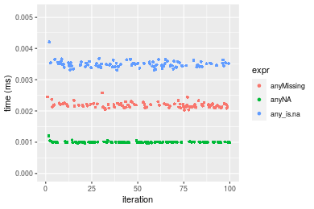
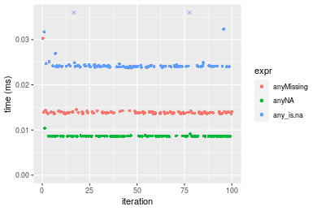
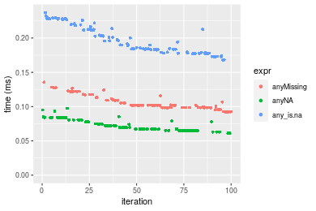
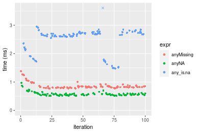
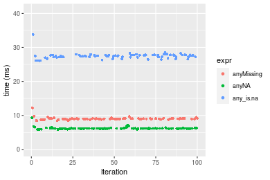
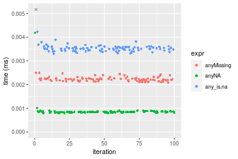
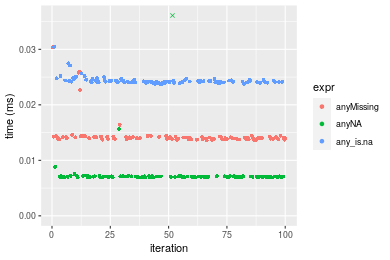
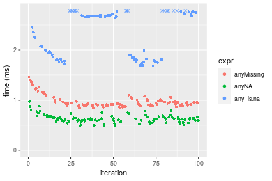
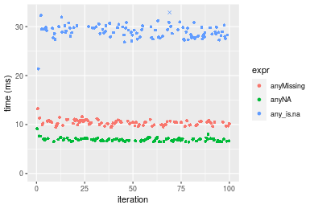

[matrixStats]: Benchmark report

---------------------------------------


# anyMissing() benchmarks

This report benchmark the performance of anyMissing() against alternative methods.

## Alternative methods

* anyNA()
* any() + is.na()

as below

```r
> any_is.na <- function(x) {
+     any(is.na(x))
+ }
```


## Data type "integer"
### Data
```r
> rvector <- function(n, mode = c("logical", "double", "integer"), range = c(-100, +100), na_prob = 0) {
+     mode <- match.arg(mode)
+     if (mode == "logical") {
+         x <- sample(c(FALSE, TRUE), size = n, replace = TRUE)
+     }     else {
+         x <- runif(n, min = range[1], max = range[2])
+     }
+     storage.mode(x) <- mode
+     if (na_prob > 0) 
+         x[sample(n, size = na_prob * n)] <- NA
+     x
+ }
> rvectors <- function(scale = 10, seed = 1, ...) {
+     set.seed(seed)
+     data <- list()
+     data[[1]] <- rvector(n = scale * 100, ...)
+     data[[2]] <- rvector(n = scale * 1000, ...)
+     data[[3]] <- rvector(n = scale * 10000, ...)
+     data[[4]] <- rvector(n = scale * 1e+05, ...)
+     data[[5]] <- rvector(n = scale * 1e+06, ...)
+     names(data) <- sprintf("n = %d", sapply(data, FUN = length))
+     data
+ }
> data <- rvectors(mode = mode)
```

### Results

### n = 1000 vector

```r
> x <- data[["n = 1000"]]
> gc()
           used  (Mb) gc trigger  (Mb) max used  (Mb)
Ncells  5152034 275.2    8529671 455.6  8529671 455.6
Vcells 36173384 276.0   62259153 475.0 60562128 462.1
> stats <- microbenchmark(anyMissing = anyMissing(x), anyNA = anyNA(x), any_is.na = any_is.na(x), unit = "ms")
```

_Table: Benchmarking of anyMissing(), anyNA() and any_is.na() on integer+n = 1000 data. The top panel shows times in milliseconds and the bottom panel shows relative times._


|   |expr       |      min|        lq|      mean|    median|        uq|      max|
|:--|:----------|--------:|---------:|---------:|---------:|---------:|--------:|
|2  |anyNA      | 0.000973| 0.0009920| 0.0010968| 0.0010000| 0.0010070| 0.010426|
|1  |anyMissing | 0.002027| 0.0021225| 0.0022675| 0.0021840| 0.0022205| 0.010378|
|3  |any_is.na  | 0.003302| 0.0034295| 0.0036184| 0.0034855| 0.0035370| 0.015873|


|   |expr       |      min|       lq|     mean| median|       uq|       max|
|:--|:----------|--------:|--------:|--------:|------:|--------:|---------:|
|2  |anyNA      | 1.000000| 1.000000| 1.000000| 1.0000| 1.000000| 1.0000000|
|1  |anyMissing | 2.083248| 2.139617| 2.067397| 2.1840| 2.205065| 0.9953961|
|3  |any_is.na  | 3.393628| 3.457157| 3.299073| 3.4855| 3.512413| 1.5224439|

_Figure: Benchmarking of anyMissing(), anyNA() and any_is.na() on integer+n = 1000 data.  Outliers are displayed as crosses.  Times are in milliseconds._



### n = 10000 vector

```r
> x <- data[["n = 10000"]]
> gc()
           used  (Mb) gc trigger  (Mb) max used  (Mb)
Ncells  5144160 274.8    8529671 455.6  8529671 455.6
Vcells 14517313 110.8   49807323 380.0 60562128 462.1
> stats <- microbenchmark(anyMissing = anyMissing(x), anyNA = anyNA(x), any_is.na = any_is.na(x), unit = "ms")
```

_Table: Benchmarking of anyMissing(), anyNA() and any_is.na() on integer+n = 10000 data. The top panel shows times in milliseconds and the bottom panel shows relative times._


|   |expr       |      min|        lq|      mean|    median|        uq|      max|
|:--|:----------|--------:|---------:|---------:|---------:|---------:|--------:|
|2  |anyNA      | 0.008576| 0.0086040| 0.0086537| 0.0086215| 0.0086595| 0.010408|
|1  |anyMissing | 0.013567| 0.0136870| 0.0140085| 0.0138075| 0.0139680| 0.030265|
|3  |any_is.na  | 0.023747| 0.0239925| 0.0247613| 0.0241095| 0.0242160| 0.056753|


|   |expr       |      min|       lq|     mean|   median|       uq|      max|
|:--|:----------|--------:|--------:|--------:|--------:|--------:|--------:|
|2  |anyNA      | 1.000000| 1.000000| 1.000000| 1.000000| 1.000000| 1.000000|
|1  |anyMissing | 1.581973| 1.590772| 1.618788| 1.601519| 1.613026| 2.907859|
|3  |any_is.na  | 2.769007| 2.788529| 2.861362| 2.796439| 2.796466| 5.452825|

_Figure: Benchmarking of anyMissing(), anyNA() and any_is.na() on integer+n = 10000 data.  Outliers are displayed as crosses.  Times are in milliseconds._



### n = 100000 vector

```r
> x <- data[["n = 100000"]]
> gc()
           used  (Mb) gc trigger  (Mb) max used  (Mb)
Ncells  5144232 274.8    8529671 455.6  8529671 455.6
Vcells 14517873 110.8   49807323 380.0 60562128 462.1
> stats <- microbenchmark(anyMissing = anyMissing(x), anyNA = anyNA(x), any_is.na = any_is.na(x), unit = "ms")
```

_Table: Benchmarking of anyMissing(), anyNA() and any_is.na() on integer+n = 100000 data. The top panel shows times in milliseconds and the bottom panel shows relative times._


|   |expr       |      min|        lq|      mean|    median|        uq|      max|
|:--|:----------|--------:|---------:|---------:|---------:|---------:|--------:|
|2  |anyNA      | 0.061100| 0.0650640| 0.0726624| 0.0695435| 0.0806350| 0.097477|
|1  |anyMissing | 0.092348| 0.0985975| 0.1055131| 0.1019005| 0.1105750| 0.135588|
|3  |any_is.na  | 0.168023| 0.1793765| 0.1980350| 0.1907250| 0.2174475| 0.237122|


|   |expr       |      min|       lq|     mean|   median|       uq|      max|
|:--|:----------|--------:|--------:|--------:|--------:|--------:|--------:|
|2  |anyNA      | 1.000000| 1.000000| 1.000000| 1.000000| 1.000000| 1.000000|
|1  |anyMissing | 1.511424| 1.515392| 1.452101| 1.465277| 1.371303| 1.390974|
|3  |any_is.na  | 2.749967| 2.756924| 2.725414| 2.742528| 2.696689| 2.432594|

_Figure: Benchmarking of anyMissing(), anyNA() and any_is.na() on integer+n = 100000 data.  Outliers are displayed as crosses.  Times are in milliseconds._



### n = 1000000 vector

```r
> x <- data[["n = 1000000"]]
> gc()
           used  (Mb) gc trigger  (Mb) max used  (Mb)
Ncells  5144304 274.8    8529671 455.6  8529671 455.6
Vcells 14517922 110.8   49807323 380.0 60562128 462.1
> stats <- microbenchmark(anyMissing = anyMissing(x), anyNA = anyNA(x), any_is.na = any_is.na(x), unit = "ms")
```

_Table: Benchmarking of anyMissing(), anyNA() and any_is.na() on integer+n = 1000000 data. The top panel shows times in milliseconds and the bottom panel shows relative times._


|   |expr       |      min|        lq|      mean|    median|        uq|       max|
|:--|:----------|--------:|---------:|---------:|---------:|---------:|---------:|
|2  |anyNA      | 0.514294| 0.5384355| 0.5798987| 0.5611415| 0.5893185|  0.968321|
|1  |anyMissing | 0.772282| 0.8070910| 0.8609053| 0.8199880| 0.8559225|  1.380374|
|3  |any_is.na  | 1.474060| 2.4530995| 2.5763802| 2.6654305| 2.7283590| 12.827137|


|   |expr       |      min|       lq|     mean|   median|       uq|       max|
|:--|:----------|--------:|--------:|--------:|--------:|--------:|---------:|
|2  |anyNA      | 1.000000| 1.000000| 1.000000| 1.000000| 1.000000|  1.000000|
|1  |anyMissing | 1.501635| 1.498956| 1.484579| 1.461286| 1.452394|  1.425534|
|3  |any_is.na  | 2.866182| 4.555976| 4.442811| 4.750015| 4.629685| 13.246782|

_Figure: Benchmarking of anyMissing(), anyNA() and any_is.na() on integer+n = 1000000 data.  Outliers are displayed as crosses.  Times are in milliseconds._



### n = 10000000 vector

```r
> x <- data[["n = 10000000"]]
> gc()
           used  (Mb) gc trigger  (Mb) max used  (Mb)
Ncells  5144376 274.8    8529671 455.6  8529671 455.6
Vcells 14517970 110.8   49807323 380.0 60562128 462.1
> stats <- microbenchmark(anyMissing = anyMissing(x), anyNA = anyNA(x), any_is.na = any_is.na(x), unit = "ms")
```

_Table: Benchmarking of anyMissing(), anyNA() and any_is.na() on integer+n = 10000000 data. The top panel shows times in milliseconds and the bottom panel shows relative times._


|   |expr       |       min|        lq|      mean|    median|       uq|       max|
|:--|:----------|---------:|---------:|---------:|---------:|--------:|---------:|
|2  |anyNA      |  5.861691|  6.135744|  6.230218|  6.160833|  6.20096|  9.261701|
|1  |anyMissing |  8.480076|  8.961927|  9.023018|  8.991722|  9.06896| 12.215810|
|3  |any_is.na  | 26.105978| 27.193877| 29.577854| 27.629778| 27.85750| 43.197121|


|   |expr       |      min|       lq|     mean|   median|       uq|      max|
|:--|:----------|--------:|--------:|--------:|--------:|--------:|--------:|
|2  |anyNA      | 1.000000| 1.000000| 1.000000| 1.000000| 1.000000| 1.000000|
|1  |anyMissing | 1.446694| 1.460610| 1.448267| 1.459498| 1.462509| 1.318960|
|3  |any_is.na  | 4.453660| 4.432042| 4.747483| 4.484747| 4.492449| 4.664059|

_Figure: Benchmarking of anyMissing(), anyNA() and any_is.na() on integer+n = 10000000 data.  Outliers are displayed as crosses.  Times are in milliseconds._




## Data type "double"
### Data
```r
> rvector <- function(n, mode = c("logical", "double", "integer"), range = c(-100, +100), na_prob = 0) {
+     mode <- match.arg(mode)
+     if (mode == "logical") {
+         x <- sample(c(FALSE, TRUE), size = n, replace = TRUE)
+     }     else {
+         x <- runif(n, min = range[1], max = range[2])
+     }
+     storage.mode(x) <- mode
+     if (na_prob > 0) 
+         x[sample(n, size = na_prob * n)] <- NA
+     x
+ }
> rvectors <- function(scale = 10, seed = 1, ...) {
+     set.seed(seed)
+     data <- list()
+     data[[1]] <- rvector(n = scale * 100, ...)
+     data[[2]] <- rvector(n = scale * 1000, ...)
+     data[[3]] <- rvector(n = scale * 10000, ...)
+     data[[4]] <- rvector(n = scale * 1e+05, ...)
+     data[[5]] <- rvector(n = scale * 1e+06, ...)
+     names(data) <- sprintf("n = %d", sapply(data, FUN = length))
+     data
+ }
> data <- rvectors(mode = mode)
```

### Results

### n = 1000 vector

```r
> x <- data[["n = 1000"]]
> gc()
           used  (Mb) gc trigger  (Mb) max used  (Mb)
Ncells  5144458 274.8    8529671 455.6  8529671 455.6
Vcells 20074006 153.2   49807323 380.0 60562128 462.1
> stats <- microbenchmark(anyMissing = anyMissing(x), anyNA = anyNA(x), any_is.na = any_is.na(x), unit = "ms")
```

_Table: Benchmarking of anyMissing(), anyNA() and any_is.na() on double+n = 1000 data. The top panel shows times in milliseconds and the bottom panel shows relative times._


|   |expr       |      min|        lq|      mean|    median|        uq|      max|
|:--|:----------|--------:|---------:|---------:|---------:|---------:|--------:|
|2  |anyNA      | 0.000791| 0.0008255| 0.0008796| 0.0008440| 0.0008605| 0.004191|
|1  |anyMissing | 0.002090| 0.0021595| 0.0023204| 0.0022165| 0.0022610| 0.011506|
|3  |any_is.na  | 0.003298| 0.0034420| 0.0036254| 0.0035160| 0.0035865| 0.013455|


|   |expr       |      min|       lq|     mean|   median|       uq|      max|
|:--|:----------|--------:|--------:|--------:|--------:|--------:|--------:|
|2  |anyNA      | 1.000000| 1.000000| 1.000000| 1.000000| 1.000000| 1.000000|
|1  |anyMissing | 2.642225| 2.615990| 2.638021| 2.626185| 2.627542| 2.745407|
|3  |any_is.na  | 4.169406| 4.169594| 4.121622| 4.165877| 4.167926| 3.210451|

_Figure: Benchmarking of anyMissing(), anyNA() and any_is.na() on double+n = 1000 data.  Outliers are displayed as crosses.  Times are in milliseconds._



### n = 10000 vector

```r
> x <- data[["n = 10000"]]
> gc()
           used  (Mb) gc trigger  (Mb) max used  (Mb)
Ncells  5144521 274.8    8529671 455.6  8529671 455.6
Vcells 20074038 153.2   49807323 380.0 60562128 462.1
> stats <- microbenchmark(anyMissing = anyMissing(x), anyNA = anyNA(x), any_is.na = any_is.na(x), unit = "ms")
```

_Table: Benchmarking of anyMissing(), anyNA() and any_is.na() on double+n = 10000 data. The top panel shows times in milliseconds and the bottom panel shows relative times._


|   |expr       |      min|       lq|      mean|    median|        uq|      max|
|:--|:----------|--------:|--------:|---------:|---------:|---------:|--------:|
|2  |anyNA      | 0.006894| 0.006966| 0.0074654| 0.0070265| 0.0071065| 0.039464|
|1  |anyMissing | 0.013586| 0.013850| 0.0145278| 0.0139975| 0.0141965| 0.030347|
|3  |any_is.na  | 0.023734| 0.024044| 0.0243733| 0.0241790| 0.0243850| 0.030438|


|   |expr       |      min|       lq|     mean|   median|       uq|       max|
|:--|:----------|--------:|--------:|--------:|--------:|--------:|---------:|
|2  |anyNA      | 1.000000| 1.000000| 1.000000| 1.000000| 1.000000| 1.0000000|
|1  |anyMissing | 1.970699| 1.988228| 1.946028| 1.992101| 1.997678| 0.7689793|
|3  |any_is.na  | 3.442704| 3.451622| 3.264858| 3.441116| 3.431366| 0.7712852|

_Figure: Benchmarking of anyMissing(), anyNA() and any_is.na() on double+n = 10000 data.  Outliers are displayed as crosses.  Times are in milliseconds._



### n = 100000 vector

```r
> x <- data[["n = 100000"]]
> gc()
           used  (Mb) gc trigger  (Mb) max used  (Mb)
Ncells  5144593 274.8    8529671 455.6  8529671 455.6
Vcells 20074387 153.2   49807323 380.0 60562128 462.1
> stats <- microbenchmark(anyMissing = anyMissing(x), anyNA = anyNA(x), any_is.na = any_is.na(x), unit = "ms")
```

_Table: Benchmarking of anyMissing(), anyNA() and any_is.na() on double+n = 100000 data. The top panel shows times in milliseconds and the bottom panel shows relative times._


|   |expr       |      min|        lq|      mean|    median|        uq|      max|
|:--|:----------|--------:|---------:|---------:|---------:|---------:|--------:|
|2  |anyNA      | 0.052764| 0.0546730| 0.0616280| 0.0603620| 0.0675770| 0.100950|
|1  |anyMissing | 0.092763| 0.0986535| 0.1066690| 0.1019185| 0.1154645| 0.137157|
|3  |any_is.na  | 0.172514| 0.1838365| 0.1995859| 0.1931575| 0.2137420| 0.276206|


|   |expr       |      min|       lq|     mean|   median|       uq|      max|
|:--|:----------|--------:|--------:|--------:|--------:|--------:|--------:|
|2  |anyNA      | 1.000000| 1.000000| 1.000000| 1.000000| 1.000000| 1.000000|
|1  |anyMissing | 1.758074| 1.804428| 1.730853| 1.688455| 1.708636| 1.358663|
|3  |any_is.na  | 3.269540| 3.362473| 3.238558| 3.199985| 3.162940| 2.736067|

_Figure: Benchmarking of anyMissing(), anyNA() and any_is.na() on double+n = 100000 data.  Outliers are displayed as crosses.  Times are in milliseconds._


### n = 1000000 vector

```r
> x <- data[["n = 1000000"]]
> gc()
           used  (Mb) gc trigger  (Mb) max used  (Mb)
Ncells  5144665 274.8    8529671 455.6  8529671 455.6
Vcells 20074796 153.2   49807323 380.0 60562128 462.1
> stats <- microbenchmark(anyMissing = anyMissing(x), anyNA = anyNA(x), any_is.na = any_is.na(x), unit = "ms")
```

_Table: Benchmarking of anyMissing(), anyNA() and any_is.na() on double+n = 1000000 data. The top panel shows times in milliseconds and the bottom panel shows relative times._


|   |expr       |      min|        lq|      mean|    median|       uq|       max|
|:--|:----------|--------:|---------:|---------:|---------:|--------:|---------:|
|2  |anyNA      | 0.488276| 0.5865935| 0.6339998| 0.6204725| 0.668281|  0.974961|
|1  |anyMissing | 0.837390| 0.8992895| 0.9717933| 0.9294225| 0.991114|  1.463979|
|3  |any_is.na  | 1.683921| 1.8573475| 2.4499314| 2.6679400| 2.756080| 10.234572|


|   |expr       |      min|       lq|     mean|   median|       uq|       max|
|:--|:----------|--------:|--------:|--------:|--------:|--------:|---------:|
|2  |anyNA      | 1.000000| 1.000000| 1.000000| 1.000000| 1.000000|  1.000000|
|1  |anyMissing | 1.714993| 1.533071| 1.532797| 1.497927| 1.483080|  1.501577|
|3  |any_is.na  | 3.448707| 3.166328| 3.864246| 4.299852| 4.124133| 10.497417|

_Figure: Benchmarking of anyMissing(), anyNA() and any_is.na() on double+n = 1000000 data.  Outliers are displayed as crosses.  Times are in milliseconds._



### n = 10000000 vector

```r
> x <- data[["n = 10000000"]]
> gc()
           used  (Mb) gc trigger  (Mb) max used  (Mb)
Ncells  5144737 274.8    8529671 455.6  8529671 455.6
Vcells 20074844 153.2   49807323 380.0 60562128 462.1
> stats <- microbenchmark(anyMissing = anyMissing(x), anyNA = anyNA(x), any_is.na = any_is.na(x), unit = "ms")
```

_Table: Benchmarking of anyMissing(), anyNA() and any_is.na() on double+n = 10000000 data. The top panel shows times in milliseconds and the bottom panel shows relative times._


|   |expr       |       min|        lq|      mean|    median|        uq|       max|
|:--|:----------|---------:|---------:|---------:|---------:|---------:|---------:|
|2  |anyNA      |  6.412402|  6.679305|  6.940353|  6.925208|  7.132852|  9.111181|
|1  |anyMissing |  9.418517|  9.970565| 10.386660| 10.412384| 10.694017| 13.219841|
|3  |any_is.na  | 21.378771| 28.010554| 28.979604| 28.919453| 29.831470| 32.894569|


|   |expr       |      min|       lq|     mean|   median|       uq|      max|
|:--|:----------|--------:|--------:|--------:|--------:|--------:|--------:|
|2  |anyNA      | 1.000000| 1.000000| 1.000000| 1.000000| 1.000000| 1.000000|
|1  |anyMissing | 1.468797| 1.492755| 1.496561| 1.503548| 1.499262| 1.450947|
|3  |any_is.na  | 3.333972| 4.193633| 4.175523| 4.175969| 4.182264| 3.610352|

_Figure: Benchmarking of anyMissing(), anyNA() and any_is.na() on double+n = 10000000 data.  Outliers are displayed as crosses.  Times are in milliseconds._




## Appendix

### Session information
```r
R version 4.1.1 Patched (2021-08-10 r80727)
Platform: x86_64-pc-linux-gnu (64-bit)
Running under: Ubuntu 18.04.5 LTS

Matrix products: default
BLAS:   /home/hb/software/R-devel/R-4-1-branch/lib/R/lib/libRblas.so
LAPACK: /home/hb/software/R-devel/R-4-1-branch/lib/R/lib/libRlapack.so

locale:
 [1] LC_CTYPE=en_US.UTF-8       LC_NUMERIC=C              
 [3] LC_TIME=en_US.UTF-8        LC_COLLATE=en_US.UTF-8    
 [5] LC_MONETARY=en_US.UTF-8    LC_MESSAGES=en_US.UTF-8   
 [7] LC_PAPER=en_US.UTF-8       LC_NAME=C                 
 [9] LC_ADDRESS=C               LC_TELEPHONE=C            
[11] LC_MEASUREMENT=en_US.UTF-8 LC_IDENTIFICATION=C       

attached base packages:
[1] stats     graphics  grDevices utils     datasets  methods   base     

other attached packages:
[1] microbenchmark_1.4-7   matrixStats_0.60.1     ggplot2_3.3.5         
[4] knitr_1.33             R.devices_2.17.0       R.utils_2.10.1        
[7] R.oo_1.24.0            R.methodsS3_1.8.1-9001 history_0.0.1-9000    

loaded via a namespace (and not attached):
 [1] Biobase_2.52.0          httr_1.4.2              splines_4.1.1          
 [4] bit64_4.0.5             network_1.17.1          assertthat_0.2.1       
 [7] highr_0.9               stats4_4.1.1            blob_1.2.2             
[10] GenomeInfoDbData_1.2.6  robustbase_0.93-8       pillar_1.6.2           
[13] RSQLite_2.2.8           lattice_0.20-44         glue_1.4.2             
[16] digest_0.6.27           XVector_0.32.0          colorspace_2.0-2       
[19] Matrix_1.3-4            XML_3.99-0.7            pkgconfig_2.0.3        
[22] zlibbioc_1.38.0         genefilter_1.74.0       purrr_0.3.4            
[25] ergm_4.1.2              xtable_1.8-4            scales_1.1.1           
[28] tibble_3.1.4            annotate_1.70.0         KEGGREST_1.32.0        
[31] farver_2.1.0            generics_0.1.0          IRanges_2.26.0         
[34] ellipsis_0.3.2          cachem_1.0.6            withr_2.4.2            
[37] BiocGenerics_0.38.0     mime_0.11               survival_3.2-13        
[40] magrittr_2.0.1          crayon_1.4.1            statnet.common_4.5.0   
[43] memoise_2.0.0           laeken_0.5.1            fansi_0.5.0            
[46] R.cache_0.15.0          MASS_7.3-54             R.rsp_0.44.0           
[49] progressr_0.8.0         tools_4.1.1             lifecycle_1.0.0        
[52] S4Vectors_0.30.0        trust_0.1-8             munsell_0.5.0          
[55] tabby_0.0.1-9001        AnnotationDbi_1.54.1    Biostrings_2.60.2      
[58] compiler_4.1.1          GenomeInfoDb_1.28.1     rlang_0.4.11           
[61] grid_4.1.1              RCurl_1.98-1.4          cwhmisc_6.6            
[64] rappdirs_0.3.3          startup_0.15.0          labeling_0.4.2         
[67] bitops_1.0-7            base64enc_0.1-3         boot_1.3-28            
[70] gtable_0.3.0            DBI_1.1.1               markdown_1.1           
[73] R6_2.5.1                lpSolveAPI_5.5.2.0-17.7 rle_0.9.2              
[76] dplyr_1.0.7             fastmap_1.1.0           bit_4.0.4              
[79] utf8_1.2.2              parallel_4.1.1          Rcpp_1.0.7             
[82] vctrs_0.3.8             png_0.1-7               DEoptimR_1.0-9         
[85] tidyselect_1.1.1        xfun_0.25               coda_0.19-4            
```
Total processing time was 18.95 secs.


### Reproducibility
To reproduce this report, do:
```r
html <- matrixStats:::benchmark('anyMissing')
```

[RSP]: https://cran.r-project.org/package=R.rsp
[matrixStats]: https://cran.r-project.org/package=matrixStats

[StackOverflow:colMins?]: https://stackoverflow.com/questions/13676878 "Stack Overflow: fastest way to get Min from every column in a matrix?"
[StackOverflow:colSds?]: https://stackoverflow.com/questions/17549762 "Stack Overflow: Is there such 'colsd' in R?"
[StackOverflow:rowProds?]: https://stackoverflow.com/questions/20198801/ "Stack Overflow: Row product of matrix and column sum of matrix"

---------------------------------------
Copyright Henrik Bengtsson. Last updated on 2021-08-25 18:48:43 (+0200 UTC). Powered by [RSP].

<script>
 var link = document.createElement('link');
 link.rel = 'icon';
 link.href = "data:image/png;base64,iVBORw0KGgoAAAANSUhEUgAAACAAAAAgCAMAAABEpIrGAAAA21BMVEUAAAAAAP8AAP8AAP8AAP8AAP8AAP8AAP8AAP8AAP8AAP8AAP8AAP8AAP8AAP8AAP8AAP8AAP8AAP8AAP8AAP8AAP8AAP8AAP8AAP8AAP8AAP8AAP8AAP8AAP8AAP8AAP8AAP8AAP8AAP8AAP8AAP8AAP8AAP8AAP8AAP8AAP8BAf4CAv0DA/wdHeIeHuEfH+AgIN8hId4lJdomJtknJ9g+PsE/P8BAQL9yco10dIt1dYp3d4h4eIeVlWqWlmmXl2iYmGeZmWabm2Tn5xjo6Bfp6Rb39wj4+Af//wA2M9hbAAAASXRSTlMAAQIJCgsMJSYnKD4/QGRlZmhpamtsbautrrCxuru8y8zN5ebn6Pn6+///////////////////////////////////////////LsUNcQAAAS9JREFUOI29k21XgkAQhVcFytdSMqMETU26UVqGmpaiFbL//xc1cAhhwVNf6n5i5z67M2dmYOyfJZUqlVLhkKucG7cgmUZTybDz6g0iDeq51PUr37Ds2cy2/C9NeES5puDjxuUk1xnToZsg8pfA3avHQ3lLIi7iWRrkv/OYtkScxBIMgDee0ALoyxHQBJ68JLCjOtQIMIANF7QG9G9fNnHvisCHBVMKgSJgiz7nE+AoBKrAPA3MgepvgR9TSCasrCKH0eB1wBGBFdCO+nAGjMVGPcQb5bd6mQRegN6+1axOs9nGfYcCtfi4NQosdtH7dB+txFIpXQqN1p9B/asRHToyS0jRgpV7nk4nwcq1BJ+x3Gl/v7S9Wmpp/aGquum7w3ZDyrADFYrl8vHBH+ev9AUASW1dmU4h4wAAAABJRU5ErkJggg=="
 document.getElementsByTagName('head')[0].appendChild(link);
</script>


