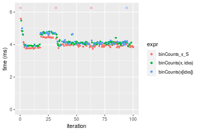
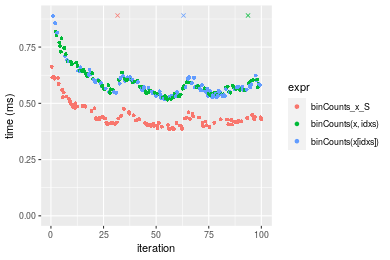
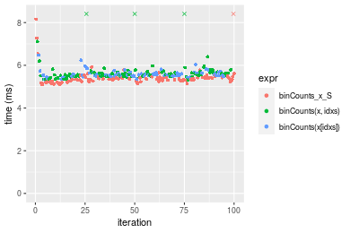
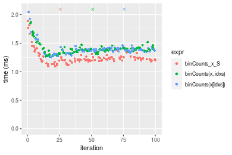

[matrixStats]: Benchmark report

---------------------------------------


# binCounts() benchmarks on subsetted computation

This report benchmark the performance of binCounts() on subsetted computation.


## Data type "integer"

### Non-sorted simulated data
```r
> set.seed(48879)
> nx <- 1e+05
> xmax <- 0.01 * nx
> x <- runif(nx, min = 0, max = xmax)
> storage.mode(x) <- mode
> str(x)
 int [1:100000] 722 285 591 3 349 509 216 91 150 383 ...
> nb <- 10000
> bx <- seq(from = 0, to = xmax, length.out = nb + 1L)
> bx <- c(-1, bx, xmax + 1)
> idxs <- sample.int(length(x), size = length(x) * 0.7)
```

### Results


```r
> x_S <- x[idxs]
> gc()
           used  (Mb) gc trigger  (Mb) max used  (Mb)
Ncells  5154501 275.3    8529671 455.6  8529671 455.6
Vcells 20249600 154.5   49807323 380.0 60562128 462.1
> stats <- microbenchmark(binCounts_x_S = binCounts(x_S, bx = bx), `binCounts(x, idxs)` = binCounts(x, 
+     idxs = idxs, bx = bx), `binCounts(x[idxs])` = binCounts(x[idxs], bx = bx), unit = "ms")
```

_Table: Benchmarking of binCounts_x_S(), binCounts(x, idxs)() and binCounts(x[idxs])() on integer+unsorted data. The top panel shows times in milliseconds and the bottom panel shows relative times._


|   |expr               |      min|       lq|     mean|   median|       uq|      max|
|:--|:------------------|--------:|--------:|--------:|--------:|--------:|--------:|
|1  |binCounts_x_S      | 3.743131| 3.848801| 4.127887| 3.922297| 4.027184| 8.920197|
|2  |binCounts(x, idxs) | 3.893024| 4.004293| 4.168872| 4.096316| 4.166940| 5.471601|
|3  |binCounts(x[idxs]) | 3.857521| 4.031572| 4.236317| 4.106948| 4.205989| 8.409583|


|   |expr               |      min|       lq|     mean|   median|       uq|       max|
|:--|:------------------|--------:|--------:|--------:|--------:|--------:|---------:|
|1  |binCounts_x_S      | 1.000000| 1.000000| 1.000000| 1.000000| 1.000000| 1.0000000|
|2  |binCounts(x, idxs) | 1.040045| 1.040400| 1.009929| 1.044367| 1.034703| 0.6133946|
|3  |binCounts(x[idxs]) | 1.030560| 1.047488| 1.026268| 1.047077| 1.044399| 0.9427575|

_Figure: Benchmarking of binCounts_x_S(), binCounts(x, idxs)() and binCounts(x[idxs])() on integer+unsorted data.  Outliers are displayed as crosses.  Times are in milliseconds._




### Sorted simulated data
```r
> x <- sort(x)
> idxs <- sort(idxs)
```
```r
> x_S <- x[idxs]
> gc()
          used  (Mb) gc trigger  (Mb) max used  (Mb)
Ncells 5144884 274.8    8529671 455.6  8529671 455.6
Vcells 9089908  69.4   39845859 304.0 60562128 462.1
> stats <- microbenchmark(binCounts_x_S = binCounts(x_S, bx = bx), `binCounts(x, idxs)` = binCounts(x, 
+     idxs = idxs, bx = bx), `binCounts(x[idxs])` = binCounts(x[idxs], bx = bx), unit = "ms")
```

_Table: Benchmarking of binCounts_x_S(), binCounts(x, idxs)() and binCounts(x[idxs])() on integer+sorted data. The top panel shows times in milliseconds and the bottom panel shows relative times._


|   |expr               |      min|        lq|      mean|    median|        uq|      max|
|:--|:------------------|--------:|---------:|---------:|---------:|---------:|--------:|
|1  |binCounts_x_S      | 0.385435| 0.4092300| 0.4817315| 0.4294950| 0.4709225| 3.929690|
|3  |binCounts(x[idxs]) | 0.518729| 0.5491750| 0.6191970| 0.5692775| 0.6047635| 4.079936|
|2  |binCounts(x, idxs) | 0.516765| 0.5495165| 0.6299195| 0.5742815| 0.6159210| 4.122084|


|   |expr               |      min|       lq|     mean|   median|       uq|      max|
|:--|:------------------|--------:|--------:|--------:|--------:|--------:|--------:|
|1  |binCounts_x_S      | 1.000000| 1.000000| 1.000000| 1.000000| 1.000000| 1.000000|
|3  |binCounts(x[idxs]) | 1.345827| 1.341972| 1.285357| 1.325458| 1.284210| 1.038234|
|2  |binCounts(x, idxs) | 1.340732| 1.342806| 1.307615| 1.337109| 1.307903| 1.048959|

_Figure: Benchmarking of binCounts_x_S(), binCounts(x, idxs)() and binCounts(x[idxs])() on integer+sorted data.  Outliers are displayed as crosses.  Times are in milliseconds._




## Data type "double"

### Non-sorted simulated data
```r
> set.seed(48879)
> nx <- 1e+05
> xmax <- 0.01 * nx
> x <- runif(nx, min = 0, max = xmax)
> storage.mode(x) <- mode
> str(x)
 num [1:100000] 722.11 285.54 591.33 3.42 349.14 ...
> nb <- 10000
> bx <- seq(from = 0, to = xmax, length.out = nb + 1L)
> bx <- c(-1, bx, xmax + 1)
> idxs <- sample.int(length(x), size = length(x) * 0.7)
```

### Results


```r
> x_S <- x[idxs]
> gc()
          used  (Mb) gc trigger  (Mb) max used  (Mb)
Ncells 5144954 274.8    8529671 455.6  8529671 455.6
Vcells 9175467  70.1   31876688 243.2 60562128 462.1
> stats <- microbenchmark(binCounts_x_S = binCounts(x_S, bx = bx), `binCounts(x, idxs)` = binCounts(x, 
+     idxs = idxs, bx = bx), `binCounts(x[idxs])` = binCounts(x[idxs], bx = bx), unit = "ms")
```

_Table: Benchmarking of binCounts_x_S(), binCounts(x, idxs)() and binCounts(x[idxs])() on double+unsorted data. The top panel shows times in milliseconds and the bottom panel shows relative times._


|   |expr               |      min|       lq|     mean|   median|       uq|      max|
|:--|:------------------|--------:|--------:|--------:|--------:|--------:|--------:|
|1  |binCounts_x_S      | 5.105216| 5.257010| 5.446426| 5.342236| 5.421011| 9.558161|
|3  |binCounts(x[idxs]) | 5.338782| 5.499212| 5.578754| 5.533915| 5.628005| 6.476944|
|2  |binCounts(x, idxs) | 5.312807| 5.492083| 5.723801| 5.556865| 5.667785| 9.995764|


|   |expr               |      min|       lq|     mean|   median|       uq|      max|
|:--|:------------------|--------:|--------:|--------:|--------:|--------:|--------:|
|1  |binCounts_x_S      | 1.000000| 1.000000| 1.000000| 1.000000| 1.000000| 1.000000|
|3  |binCounts(x[idxs]) | 1.045751| 1.046072| 1.024296| 1.035880| 1.038184| 0.677635|
|2  |binCounts(x, idxs) | 1.040663| 1.044716| 1.050928| 1.040176| 1.045522| 1.045783|

_Figure: Benchmarking of binCounts_x_S(), binCounts(x, idxs)() and binCounts(x[idxs])() on double+unsorted data.  Outliers are displayed as crosses.  Times are in milliseconds._




### Sorted simulated data
```r
> x <- sort(x)
> idxs <- sort(idxs)
```
```r
> x_S <- x[idxs]
> gc()
          used  (Mb) gc trigger  (Mb) max used  (Mb)
Ncells 5145028 274.8    8529671 455.6  8529671 455.6
Vcells 9175516  70.1   31876688 243.2 60562128 462.1
> stats <- microbenchmark(binCounts_x_S = binCounts(x_S, bx = bx), `binCounts(x, idxs)` = binCounts(x, 
+     idxs = idxs, bx = bx), `binCounts(x[idxs])` = binCounts(x[idxs], bx = bx), unit = "ms")
```

_Table: Benchmarking of binCounts_x_S(), binCounts(x, idxs)() and binCounts(x[idxs])() on double+sorted data. The top panel shows times in milliseconds and the bottom panel shows relative times._


|   |expr               |      min|       lq|     mean|   median|       uq|      max|
|:--|:------------------|--------:|--------:|--------:|--------:|--------:|--------:|
|1  |binCounts_x_S      | 1.093777| 1.187210| 1.283248| 1.216720| 1.255538| 4.833301|
|3  |binCounts(x[idxs]) | 1.256096| 1.349684| 1.423724| 1.376073| 1.399282| 4.866945|
|2  |binCounts(x, idxs) | 1.266017| 1.345908| 1.434421| 1.387024| 1.414468| 4.888036|


|   |expr               |      min|       lq|     mean|   median|       uq|      max|
|:--|:------------------|--------:|--------:|--------:|--------:|--------:|--------:|
|1  |binCounts_x_S      | 1.000000| 1.000000| 1.000000| 1.000000| 1.000000| 1.000000|
|3  |binCounts(x[idxs]) | 1.148402| 1.136854| 1.109469| 1.130969| 1.114488| 1.006961|
|2  |binCounts(x, idxs) | 1.157473| 1.133673| 1.117804| 1.139970| 1.126583| 1.011325|

_Figure: Benchmarking of binCounts_x_S(), binCounts(x, idxs)() and binCounts(x[idxs])() on double+sorted data.  Outliers are displayed as crosses.  Times are in milliseconds._




## Appendix

### Session information
```r
R version 4.1.1 Patched (2021-08-10 r80727)
Platform: x86_64-pc-linux-gnu (64-bit)
Running under: Ubuntu 18.04.5 LTS

Matrix products: default
BLAS:   /home/hb/software/R-devel/R-4-1-branch/lib/R/lib/libRblas.so
LAPACK: /home/hb/software/R-devel/R-4-1-branch/lib/R/lib/libRlapack.so

locale:
 [1] LC_CTYPE=en_US.UTF-8       LC_NUMERIC=C              
 [3] LC_TIME=en_US.UTF-8        LC_COLLATE=en_US.UTF-8    
 [5] LC_MONETARY=en_US.UTF-8    LC_MESSAGES=en_US.UTF-8   
 [7] LC_PAPER=en_US.UTF-8       LC_NAME=C                 
 [9] LC_ADDRESS=C               LC_TELEPHONE=C            
[11] LC_MEASUREMENT=en_US.UTF-8 LC_IDENTIFICATION=C       

attached base packages:
[1] stats     graphics  grDevices utils     datasets  methods   base     

other attached packages:
[1] microbenchmark_1.4-7   matrixStats_0.60.1     ggplot2_3.3.5         
[4] knitr_1.33             R.devices_2.17.0       R.utils_2.10.1        
[7] R.oo_1.24.0            R.methodsS3_1.8.1-9001 history_0.0.1-9000    

loaded via a namespace (and not attached):
 [1] Biobase_2.52.0          httr_1.4.2              splines_4.1.1          
 [4] bit64_4.0.5             network_1.17.1          assertthat_0.2.1       
 [7] highr_0.9               stats4_4.1.1            blob_1.2.2             
[10] GenomeInfoDbData_1.2.6  robustbase_0.93-8       pillar_1.6.2           
[13] RSQLite_2.2.8           lattice_0.20-44         glue_1.4.2             
[16] digest_0.6.27           XVector_0.32.0          colorspace_2.0-2       
[19] Matrix_1.3-4            XML_3.99-0.7            pkgconfig_2.0.3        
[22] zlibbioc_1.38.0         genefilter_1.74.0       purrr_0.3.4            
[25] ergm_4.1.2              xtable_1.8-4            scales_1.1.1           
[28] tibble_3.1.4            annotate_1.70.0         KEGGREST_1.32.0        
[31] farver_2.1.0            generics_0.1.0          IRanges_2.26.0         
[34] ellipsis_0.3.2          cachem_1.0.6            withr_2.4.2            
[37] BiocGenerics_0.38.0     mime_0.11               survival_3.2-13        
[40] magrittr_2.0.1          crayon_1.4.1            statnet.common_4.5.0   
[43] memoise_2.0.0           laeken_0.5.1            fansi_0.5.0            
[46] R.cache_0.15.0          MASS_7.3-54             R.rsp_0.44.0           
[49] progressr_0.8.0         tools_4.1.1             lifecycle_1.0.0        
[52] S4Vectors_0.30.0        trust_0.1-8             munsell_0.5.0          
[55] tabby_0.0.1-9001        AnnotationDbi_1.54.1    Biostrings_2.60.2      
[58] compiler_4.1.1          GenomeInfoDb_1.28.1     rlang_0.4.11           
[61] grid_4.1.1              RCurl_1.98-1.4          cwhmisc_6.6            
[64] rappdirs_0.3.3          startup_0.15.0          labeling_0.4.2         
[67] bitops_1.0-7            base64enc_0.1-3         boot_1.3-28            
[70] gtable_0.3.0            DBI_1.1.1               markdown_1.1           
[73] R6_2.5.1                lpSolveAPI_5.5.2.0-17.7 rle_0.9.2              
[76] dplyr_1.0.7             fastmap_1.1.0           bit_4.0.4              
[79] utf8_1.2.2              parallel_4.1.1          Rcpp_1.0.7             
[82] vctrs_0.3.8             png_0.1-7               DEoptimR_1.0-9         
[85] tidyselect_1.1.1        xfun_0.25               coda_0.19-4            
```
Total processing time was 6.89 secs.


### Reproducibility
To reproduce this report, do:
```r
html <- matrixStats:::benchmark('binCounts_subset')
```

[RSP]: https://cran.r-project.org/package=R.rsp
[matrixStats]: https://cran.r-project.org/package=matrixStats

[StackOverflow:colMins?]: https://stackoverflow.com/questions/13676878 "Stack Overflow: fastest way to get Min from every column in a matrix?"
[StackOverflow:colSds?]: https://stackoverflow.com/questions/17549762 "Stack Overflow: Is there such 'colsd' in R?"
[StackOverflow:rowProds?]: https://stackoverflow.com/questions/20198801/ "Stack Overflow: Row product of matrix and column sum of matrix"

---------------------------------------
Copyright Dongcan Jiang. Last updated on 2021-08-25 18:48:51 (+0200 UTC). Powered by [RSP].

<script>
 var link = document.createElement('link');
 link.rel = 'icon';
 link.href = "data:image/png;base64,iVBORw0KGgoAAAANSUhEUgAAACAAAAAgCAMAAABEpIrGAAAA21BMVEUAAAAAAP8AAP8AAP8AAP8AAP8AAP8AAP8AAP8AAP8AAP8AAP8AAP8AAP8AAP8AAP8AAP8AAP8AAP8AAP8AAP8AAP8AAP8AAP8AAP8AAP8AAP8AAP8AAP8AAP8AAP8AAP8AAP8AAP8AAP8AAP8AAP8AAP8AAP8AAP8AAP8AAP8BAf4CAv0DA/wdHeIeHuEfH+AgIN8hId4lJdomJtknJ9g+PsE/P8BAQL9yco10dIt1dYp3d4h4eIeVlWqWlmmXl2iYmGeZmWabm2Tn5xjo6Bfp6Rb39wj4+Af//wA2M9hbAAAASXRSTlMAAQIJCgsMJSYnKD4/QGRlZmhpamtsbautrrCxuru8y8zN5ebn6Pn6+///////////////////////////////////////////LsUNcQAAAS9JREFUOI29k21XgkAQhVcFytdSMqMETU26UVqGmpaiFbL//xc1cAhhwVNf6n5i5z67M2dmYOyfJZUqlVLhkKucG7cgmUZTybDz6g0iDeq51PUr37Ds2cy2/C9NeES5puDjxuUk1xnToZsg8pfA3avHQ3lLIi7iWRrkv/OYtkScxBIMgDee0ALoyxHQBJ68JLCjOtQIMIANF7QG9G9fNnHvisCHBVMKgSJgiz7nE+AoBKrAPA3MgepvgR9TSCasrCKH0eB1wBGBFdCO+nAGjMVGPcQb5bd6mQRegN6+1axOs9nGfYcCtfi4NQosdtH7dB+txFIpXQqN1p9B/asRHToyS0jRgpV7nk4nwcq1BJ+x3Gl/v7S9Wmpp/aGquum7w3ZDyrADFYrl8vHBH+ev9AUASW1dmU4h4wAAAABJRU5ErkJggg=="
 document.getElementsByTagName('head')[0].appendChild(link);
</script>


