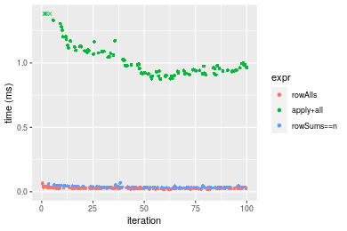

[matrixStats]: Benchmark report

---------------------------------------


# colAlls() and rowAlls() benchmarks

This report benchmark the performance of colAlls() and rowAlls() against alternative methods.

## Alternative methods

* apply() + all()
* colSums() == n or rowSums() == n


## Data
```r
> rmatrix <- function(nrow, ncol, mode = c("logical", "double", "integer", "index"), range = c(-100, 
+     +100), na_prob = 0) {
+     mode <- match.arg(mode)
+     n <- nrow * ncol
+     if (mode == "logical") {
+         x <- sample(c(FALSE, TRUE), size = n, replace = TRUE)
+     }     else if (mode == "index") {
+         x <- seq_len(n)
+         mode <- "integer"
+     }     else {
+         x <- runif(n, min = range[1], max = range[2])
+     }
+     storage.mode(x) <- mode
+     if (na_prob > 0) 
+         x[sample(n, size = na_prob * n)] <- NA
+     dim(x) <- c(nrow, ncol)
+     x
+ }
> rmatrices <- function(scale = 10, seed = 1, ...) {
+     set.seed(seed)
+     data <- list()
+     data[[1]] <- rmatrix(nrow = scale * 1, ncol = scale * 1, ...)
+     data[[2]] <- rmatrix(nrow = scale * 10, ncol = scale * 10, ...)
+     data[[3]] <- rmatrix(nrow = scale * 100, ncol = scale * 1, ...)
+     data[[4]] <- t(data[[3]])
+     data[[5]] <- rmatrix(nrow = scale * 10, ncol = scale * 100, ...)
+     data[[6]] <- t(data[[5]])
+     names(data) <- sapply(data, FUN = function(x) paste(dim(x), collapse = "x"))
+     data
+ }
> data <- rmatrices(mode = "logical")
```

## Results

### 10x10 matrix


```r
> X <- data[["10x10"]]
> gc()
          used  (Mb) gc trigger  (Mb) max used  (Mb)
Ncells 5165349 275.9    8529671 455.6  8529671 455.6
Vcells 9403025  71.8   31876688 243.2 60562128 462.1
> colStats <- microbenchmark(colAlls = colAlls(X), `apply+all` = apply(X, MARGIN = 2L, FUN = all), 
+     `colSums==n` = (colSums(X) == nrow(X)), unit = "ms")
> X <- t(X)
> gc()
          used  (Mb) gc trigger  (Mb) max used  (Mb)
Ncells 5156953 275.5    8529671 455.6  8529671 455.6
Vcells 9375641  71.6   31876688 243.2 60562128 462.1
> rowStats <- microbenchmark(rowAlls = rowAlls(X), `apply+all` = apply(X, MARGIN = 1L, FUN = all), 
+     `rowSums==n` = (rowSums(X) == ncol(X)), unit = "ms")
```

_Table: Benchmarking of colAlls(), apply+all() and colSums==n() on 10x10 data. The top panel shows times in milliseconds and the bottom panel shows relative times._


|   |expr       |      min|        lq|      mean|    median|        uq|      max|
|:--|:----------|--------:|---------:|---------:|---------:|---------:|--------:|
|1  |colAlls    | 0.003025| 0.0032665| 0.0040817| 0.0041145| 0.0043715| 0.016839|
|3  |colSums==n | 0.006548| 0.0069500| 0.0081327| 0.0078040| 0.0084610| 0.041586|
|2  |apply+all  | 0.033170| 0.0342715| 0.0357029| 0.0349825| 0.0356310| 0.084542|


|   |expr       |       min|       lq|     mean|   median|       uq|      max|
|:--|:----------|---------:|--------:|--------:|--------:|--------:|--------:|
|1  |colAlls    |  1.000000|  1.00000| 1.000000| 1.000000| 1.000000| 1.000000|
|3  |colSums==n |  2.164628|  2.12766| 1.992471| 1.896707| 1.935491| 2.469624|
|2  |apply+all  | 10.965289| 10.49181| 8.747059| 8.502248| 8.150749| 5.020607|

_Table: Benchmarking of rowAlls(), apply+all() and rowSums==n() on 10x10 data (transposed). The top panel shows times in milliseconds and the bottom panel shows relative times._


|   |expr       |      min|        lq|      mean|    median|       uq|      max|
|:--|:----------|--------:|---------:|---------:|---------:|--------:|--------:|
|1  |rowAlls    | 0.002932| 0.0032580| 0.0040104| 0.0040765| 0.004377| 0.015973|
|3  |rowSums==n | 0.007202| 0.0077930| 0.0087189| 0.0083520| 0.008922| 0.036586|
|2  |apply+all  | 0.032335| 0.0341245| 0.0354270| 0.0346300| 0.035332| 0.080404|


|   |expr       |       min|        lq|     mean|   median|       uq|      max|
|:--|:----------|---------:|---------:|--------:|--------:|--------:|--------:|
|1  |rowAlls    |  1.000000|  1.000000| 1.000000| 1.000000| 1.000000| 1.000000|
|3  |rowSums==n |  2.456344|  2.391958| 2.174094| 2.048816| 2.038382| 2.290490|
|2  |apply+all  | 11.028308| 10.474064| 8.833892| 8.495033| 8.072196| 5.033744|

_Figure: Benchmarking of colAlls(), apply+all() and colSums==n() on 10x10 data  as well as rowAlls(), apply+all() and rowSums==n() on the same data transposed.  Outliers are displayed as crosses.  Times are in milliseconds._


_Table: Benchmarking of colAlls() and rowAlls() on 10x10 data (original and transposed).  The top panel shows times in milliseconds and the bottom panel shows relative times._


|   |expr    |   min|     lq|    mean| median|     uq|    max|
|:--|:-------|-----:|------:|-------:|------:|------:|------:|
|2  |rowAlls | 2.932| 3.2580| 4.01035| 4.0765| 4.3770| 15.973|
|1  |colAlls | 3.025| 3.2665| 4.08170| 4.1145| 4.3715| 16.839|


|   |expr    |      min|       lq|     mean|   median|        uq|      max|
|:--|:-------|--------:|--------:|--------:|--------:|---------:|--------:|
|2  |rowAlls | 1.000000| 1.000000| 1.000000| 1.000000| 1.0000000| 1.000000|
|1  |colAlls | 1.031719| 1.002609| 1.017791| 1.009322| 0.9987434| 1.054216|

_Figure: Benchmarking of colAlls() and rowAlls() on 10x10 data (original and transposed).  Outliers are displayed as crosses. Times are in milliseconds._


### 100x100 matrix


```r
> X <- data[["100x100"]]
> gc()
          used  (Mb) gc trigger  (Mb) max used  (Mb)
Ncells 5155534 275.4    8529671 455.6  8529671 455.6
Vcells 9181870  70.1   31876688 243.2 60562128 462.1
> colStats <- microbenchmark(colAlls = colAlls(X), `apply+all` = apply(X, MARGIN = 2L, FUN = all), 
+     `colSums==n` = (colSums(X) == nrow(X)), unit = "ms")
> X <- t(X)
> gc()
          used  (Mb) gc trigger  (Mb) max used  (Mb)
Ncells 5155510 275.4    8529671 455.6  8529671 455.6
Vcells 9186883  70.1   31876688 243.2 60562128 462.1
> rowStats <- microbenchmark(rowAlls = rowAlls(X), `apply+all` = apply(X, MARGIN = 1L, FUN = all), 
+     `rowSums==n` = (rowSums(X) == ncol(X)), unit = "ms")
```

_Table: Benchmarking of colAlls(), apply+all() and colSums==n() on 100x100 data. The top panel shows times in milliseconds and the bottom panel shows relative times._


|   |expr       |      min|        lq|      mean|    median|        uq|      max|
|:--|:----------|--------:|---------:|---------:|---------:|---------:|--------:|
|1  |colAlls    | 0.003316| 0.0040280| 0.0050496| 0.0047005| 0.0052810| 0.023880|
|3  |colSums==n | 0.015972| 0.0174195| 0.0194266| 0.0187190| 0.0206390| 0.046336|
|2  |apply+all  | 0.194263| 0.1984080| 0.2214525| 0.2145185| 0.2345875| 0.329061|


|   |expr       |       min|        lq|      mean|    median|        uq|       max|
|:--|:----------|---------:|---------:|---------:|---------:|---------:|---------:|
|1  |colAlls    |  1.000000|  1.000000|  1.000000|  1.000000|  1.000000|  1.000000|
|3  |colSums==n |  4.816647|  4.324603|  3.847191|  3.982342|  3.908161|  1.940368|
|2  |apply+all  | 58.583534| 49.257200| 43.855795| 45.637379| 44.421038| 13.779774|

_Table: Benchmarking of rowAlls(), apply+all() and rowSums==n() on 100x100 data (transposed). The top panel shows times in milliseconds and the bottom panel shows relative times._


|   |expr       |      min|        lq|      mean|    median|        uq|      max|
|:--|:----------|--------:|---------:|---------:|---------:|---------:|--------:|
|1  |rowAlls    | 0.007901| 0.0091755| 0.0104472| 0.0099110| 0.0111075| 0.026171|
|3  |rowSums==n | 0.045504| 0.0479895| 0.0529970| 0.0502815| 0.0571440| 0.081814|
|2  |apply+all  | 0.189569| 0.1997645| 0.2229071| 0.2135790| 0.2412965| 0.329688|


|   |expr       |       min|        lq|      mean|    median|        uq|       max|
|:--|:----------|---------:|---------:|---------:|---------:|---------:|---------:|
|1  |rowAlls    |  1.000000|  1.000000|  1.000000|  1.000000|  1.000000|  1.000000|
|3  |rowSums==n |  5.759271|  5.230178|  5.072857|  5.073302|  5.144632|  3.126132|
|2  |apply+all  | 23.993039| 21.771511| 21.336619| 21.549692| 21.723745| 12.597455|

_Figure: Benchmarking of colAlls(), apply+all() and colSums==n() on 100x100 data  as well as rowAlls(), apply+all() and rowSums==n() on the same data transposed.  Outliers are displayed as crosses.  Times are in milliseconds._


_Table: Benchmarking of colAlls() and rowAlls() on 100x100 data (original and transposed).  The top panel shows times in milliseconds and the bottom panel shows relative times._


|   |expr    |   min|     lq|     mean| median|      uq|    max|
|:--|:-------|-----:|------:|--------:|------:|-------:|------:|
|1  |colAlls | 3.316| 4.0280|  5.04956| 4.7005|  5.2810| 23.880|
|2  |rowAlls | 7.901| 9.1755| 10.44716| 9.9110| 11.1075| 26.171|


|   |expr    |     min|       lq|     mean|   median|       uq|      max|
|:--|:-------|-------:|--------:|--------:|--------:|--------:|--------:|
|1  |colAlls | 1.00000| 1.000000| 1.000000| 1.000000| 1.000000| 1.000000|
|2  |rowAlls | 2.38269| 2.277929| 2.068925| 2.108499| 2.103295| 1.095938|

_Figure: Benchmarking of colAlls() and rowAlls() on 100x100 data (original and transposed).  Outliers are displayed as crosses. Times are in milliseconds._


### 1000x10 matrix


```r
> X <- data[["1000x10"]]
> gc()
          used  (Mb) gc trigger  (Mb) max used  (Mb)
Ncells 5156266 275.4    8529671 455.6  8529671 455.6
Vcells 9185359  70.1   31876688 243.2 60562128 462.1
> colStats <- microbenchmark(colAlls = colAlls(X), `apply+all` = apply(X, MARGIN = 2L, FUN = all), 
+     `colSums==n` = (colSums(X) == nrow(X)), unit = "ms")
> X <- t(X)
> gc()
          used  (Mb) gc trigger  (Mb) max used  (Mb)
Ncells 5156260 275.4    8529671 455.6  8529671 455.6
Vcells 9190402  70.2   31876688 243.2 60562128 462.1
> rowStats <- microbenchmark(rowAlls = rowAlls(X), `apply+all` = apply(X, MARGIN = 1L, FUN = all), 
+     `rowSums==n` = (rowSums(X) == ncol(X)), unit = "ms")
```

_Table: Benchmarking of colAlls(), apply+all() and colSums==n() on 1000x10 data. The top panel shows times in milliseconds and the bottom panel shows relative times._


|   |expr       |      min|        lq|      mean|    median|        uq|      max|
|:--|:----------|--------:|---------:|---------:|---------:|---------:|--------:|
|1  |colAlls    | 0.002794| 0.0034840| 0.0042300| 0.0041140| 0.0046325| 0.016881|
|3  |colSums==n | 0.017402| 0.0195220| 0.0204640| 0.0201180| 0.0213370| 0.038035|
|2  |apply+all  | 0.110305| 0.1125515| 0.1233028| 0.1228605| 0.1288965| 0.207250|


|   |expr       |       min|       lq|      mean|    median|        uq|       max|
|:--|:----------|---------:|--------:|---------:|---------:|---------:|---------:|
|1  |colAlls    |  1.000000|  1.00000|  1.000000|  1.000000|  1.000000|  1.000000|
|3  |colSums==n |  6.228346|  5.60333|  4.837852|  4.890131|  4.605936|  2.253125|
|2  |apply+all  | 39.479241| 32.30525| 29.149800| 29.864001| 27.824393| 12.277116|

_Table: Benchmarking of rowAlls(), apply+all() and rowSums==n() on 1000x10 data (transposed). The top panel shows times in milliseconds and the bottom panel shows relative times._


|   |expr       |      min|        lq|      mean|    median|        uq|      max|
|:--|:----------|--------:|---------:|---------:|---------:|---------:|--------:|
|1  |rowAlls    | 0.007931| 0.0092260| 0.0102171| 0.0100165| 0.0108175| 0.023882|
|2  |apply+all  | 0.096265| 0.1006470| 0.1124996| 0.1095850| 0.1262765| 0.194379|
|3  |rowSums==n | 0.168196| 0.1744085| 0.1890403| 0.1860320| 0.2027455| 0.232226|


|   |expr       |      min|       lq|     mean|   median|       uq|      max|
|:--|:----------|--------:|--------:|--------:|--------:|--------:|--------:|
|1  |rowAlls    |  1.00000|  1.00000|  1.00000|  1.00000|  1.00000| 1.000000|
|2  |apply+all  | 12.13781| 10.90906| 11.01093| 10.94045| 11.67335| 8.139143|
|3  |rowSums==n | 21.20741| 18.90402| 18.50238| 18.57256| 18.74236| 9.723892|

_Figure: Benchmarking of colAlls(), apply+all() and colSums==n() on 1000x10 data  as well as rowAlls(), apply+all() and rowSums==n() on the same data transposed.  Outliers are displayed as crosses.  Times are in milliseconds._


_Table: Benchmarking of colAlls() and rowAlls() on 1000x10 data (original and transposed).  The top panel shows times in milliseconds and the bottom panel shows relative times._


|   |expr    |   min|    lq|     mean|  median|      uq|    max|
|:--|:-------|-----:|-----:|--------:|-------:|-------:|------:|
|1  |colAlls | 2.794| 3.484|  4.22997|  4.1140|  4.6325| 16.881|
|2  |rowAlls | 7.931| 9.226| 10.21708| 10.0165| 10.8175| 23.882|


|   |expr    |      min|       lq|     mean|   median|       uq|      max|
|:--|:-------|--------:|--------:|--------:|--------:|--------:|--------:|
|1  |colAlls | 1.000000| 1.000000| 1.000000| 1.000000| 1.000000| 1.000000|
|2  |rowAlls | 2.838583| 2.648106| 2.415402| 2.434735| 2.335132| 1.414727|

_Figure: Benchmarking of colAlls() and rowAlls() on 1000x10 data (original and transposed).  Outliers are displayed as crosses. Times are in milliseconds._


### 10x1000 matrix


```r
> X <- data[["10x1000"]]
> gc()
          used  (Mb) gc trigger  (Mb) max used  (Mb)
Ncells 5156499 275.4    8529671 455.6  8529671 455.6
Vcells 9186143  70.1   31876688 243.2 60562128 462.1
> colStats <- microbenchmark(colAlls = colAlls(X), `apply+all` = apply(X, MARGIN = 2L, FUN = all), 
+     `colSums==n` = (colSums(X) == nrow(X)), unit = "ms")
> X <- t(X)
> gc()
          used  (Mb) gc trigger  (Mb) max used  (Mb)
Ncells 5156475 275.4    8529671 455.6  8529671 455.6
Vcells 9191156  70.2   31876688 243.2 60562128 462.1
> rowStats <- microbenchmark(rowAlls = rowAlls(X), `apply+all` = apply(X, MARGIN = 1L, FUN = all), 
+     `rowSums==n` = (rowSums(X) == ncol(X)), unit = "ms")
```

_Table: Benchmarking of colAlls(), apply+all() and colSums==n() on 10x1000 data. The top panel shows times in milliseconds and the bottom panel shows relative times._


|   |expr       |      min|        lq|      mean|    median|        uq|      max|
|:--|:----------|--------:|---------:|---------:|---------:|---------:|--------:|
|3  |colSums==n | 0.014091| 0.0152290| 0.0170517| 0.0161795| 0.0178900| 0.037235|
|1  |colAlls    | 0.014461| 0.0161340| 0.0179866| 0.0170280| 0.0182545| 0.039181|
|2  |apply+all  | 0.861692| 0.9203145| 1.0139202| 0.9529525| 1.0794300| 1.434210|


|   |expr       |       min|        lq|      mean|    median|        uq|       max|
|:--|:----------|---------:|---------:|---------:|---------:|---------:|---------:|
|3  |colSums==n |  1.000000|  1.000000|  1.000000|  1.000000|  1.000000|  1.000000|
|1  |colAlls    |  1.026258|  1.059426|  1.054825|  1.052443|  1.020374|  1.052263|
|2  |apply+all  | 61.151941| 60.431709| 59.461428| 58.898761| 60.337060| 38.517792|

_Table: Benchmarking of rowAlls(), apply+all() and rowSums==n() on 10x1000 data (transposed). The top panel shows times in milliseconds and the bottom panel shows relative times._


|   |expr       |      min|        lq|      mean|    median|        uq|      max|
|:--|:----------|--------:|---------:|---------:|---------:|---------:|--------:|
|1  |rowAlls    | 0.018529| 0.0234715| 0.0265038| 0.0254230| 0.0273330| 0.066533|
|3  |rowSums==n | 0.029118| 0.0315485| 0.0358700| 0.0335410| 0.0373885| 0.069098|
|2  |apply+all  | 0.873644| 0.9240285| 1.0197045| 0.9694025| 1.0901125| 1.423477|


|   |expr       |       min|        lq|      mean|    median|        uq|       max|
|:--|:----------|---------:|---------:|---------:|---------:|---------:|---------:|
|1  |rowAlls    |  1.000000|  1.000000|  1.000000|  1.000000|  1.000000|  1.000000|
|3  |rowSums==n |  1.571482|  1.344119|  1.353392|  1.319317|  1.367889|  1.038552|
|2  |apply+all  | 47.150089| 39.368106| 38.473955| 38.130925| 39.882651| 21.395052|

_Figure: Benchmarking of colAlls(), apply+all() and colSums==n() on 10x1000 data  as well as rowAlls(), apply+all() and rowSums==n() on the same data transposed.  Outliers are displayed as crosses.  Times are in milliseconds._



_Table: Benchmarking of colAlls() and rowAlls() on 10x1000 data (original and transposed).  The top panel shows times in milliseconds and the bottom panel shows relative times._


|   |expr    |    min|      lq|     mean| median|      uq|    max|
|:--|:-------|------:|-------:|--------:|------:|-------:|------:|
|1  |colAlls | 14.461| 16.1340| 17.98660| 17.028| 18.2545| 39.181|
|2  |rowAlls | 18.529| 23.4715| 26.50376| 25.423| 27.3330| 66.533|


|   |expr    |      min|       lq|     mean|   median|       uq|      max|
|:--|:-------|--------:|--------:|--------:|--------:|--------:|--------:|
|1  |colAlls | 1.000000| 1.000000| 1.000000| 1.000000| 1.000000| 1.000000|
|2  |rowAlls | 1.281308| 1.454785| 1.473528| 1.493011| 1.497329| 1.698093|

_Figure: Benchmarking of colAlls() and rowAlls() on 10x1000 data (original and transposed).  Outliers are displayed as crosses. Times are in milliseconds._


### 100x1000 matrix


```r
> X <- data[["100x1000"]]
> gc()
          used  (Mb) gc trigger  (Mb) max used  (Mb)
Ncells 5156690 275.4    8529671 455.6  8529671 455.6
Vcells 9186633  70.1   31876688 243.2 60562128 462.1
> colStats <- microbenchmark(colAlls = colAlls(X), `apply+all` = apply(X, MARGIN = 2L, FUN = all), 
+     `colSums==n` = (colSums(X) == nrow(X)), unit = "ms")
> X <- t(X)
> gc()
          used  (Mb) gc trigger  (Mb) max used  (Mb)
Ncells 5156678 275.4    8529671 455.6  8529671 455.6
Vcells 9236666  70.5   31876688 243.2 60562128 462.1
> rowStats <- microbenchmark(rowAlls = rowAlls(X), `apply+all` = apply(X, MARGIN = 1L, FUN = all), 
+     `rowSums==n` = (rowSums(X) == ncol(X)), unit = "ms")
```

_Table: Benchmarking of colAlls(), apply+all() and colSums==n() on 100x1000 data. The top panel shows times in milliseconds and the bottom panel shows relative times._


|   |expr       |      min|       lq|      mean|    median|        uq|      max|
|:--|:----------|--------:|--------:|---------:|---------:|---------:|--------:|
|1  |colAlls    | 0.016503| 0.018137| 0.0200962| 0.0194905| 0.0206635| 0.041491|
|3  |colSums==n | 0.081474| 0.088031| 0.0951526| 0.0916770| 0.0998565| 0.153938|
|2  |apply+all  | 1.367004| 1.506773| 1.5948512| 1.5471875| 1.6063595| 2.526367|


|   |expr       |       min|        lq|      mean|    median|        uq|       max|
|:--|:----------|---------:|---------:|---------:|---------:|---------:|---------:|
|1  |colAlls    |  1.000000|  1.000000|  1.000000|  1.000000|  1.000000|  1.000000|
|3  |colSums==n |  4.936921|  4.853669|  4.734855|  4.703676|  4.832507|  3.710154|
|2  |apply+all  | 82.833667| 83.077301| 79.360873| 79.381622| 77.738984| 60.889518|

_Table: Benchmarking of rowAlls(), apply+all() and rowSums==n() on 100x1000 data (transposed). The top panel shows times in milliseconds and the bottom panel shows relative times._


|   |expr       |      min|        lq|      mean|    median|        uq|      max|
|:--|:----------|--------:|---------:|---------:|---------:|---------:|--------:|
|1  |rowAlls    | 0.042957| 0.0492940| 0.0539950| 0.0518085| 0.0559535| 0.109683|
|3  |rowSums==n | 0.232280| 0.2505305| 0.2703589| 0.2580990| 0.2763755| 0.399680|
|2  |apply+all  | 1.364724| 1.4836375| 1.5768114| 1.5557460| 1.5938430| 2.508230|


|   |expr       |       min|        lq|      mean|    median|        uq|       max|
|:--|:----------|---------:|---------:|---------:|---------:|---------:|---------:|
|1  |rowAlls    |  1.000000|  1.000000|  1.000000|  1.000000|  1.000000|  1.000000|
|3  |rowSums==n |  5.407268|  5.082373|  5.007113|  4.981789|  4.939378|  3.643956|
|2  |apply+all  | 31.769537| 30.097730| 29.202932| 30.028779| 28.485135| 22.867992|

_Figure: Benchmarking of colAlls(), apply+all() and colSums==n() on 100x1000 data  as well as rowAlls(), apply+all() and rowSums==n() on the same data transposed.  Outliers are displayed as crosses.  Times are in milliseconds._


_Table: Benchmarking of colAlls() and rowAlls() on 100x1000 data (original and transposed).  The top panel shows times in milliseconds and the bottom panel shows relative times._


|   |expr    |    min|     lq|     mean|  median|      uq|     max|
|:--|:-------|------:|------:|--------:|-------:|-------:|-------:|
|1  |colAlls | 16.503| 18.137| 20.09619| 19.4905| 20.6635|  41.491|
|2  |rowAlls | 42.957| 49.294| 53.99497| 51.8085| 55.9535| 109.683|


|   |expr    |      min|       lq|     mean|   median|       uq|      max|
|:--|:-------|--------:|--------:|--------:|--------:|--------:|--------:|
|1  |colAlls | 1.000000| 1.000000| 1.000000| 1.000000| 1.000000| 1.000000|
|2  |rowAlls | 2.602981| 2.717869| 2.686826| 2.658141| 2.707842| 2.643537|

_Figure: Benchmarking of colAlls() and rowAlls() on 100x1000 data (original and transposed).  Outliers are displayed as crosses. Times are in milliseconds._


### 1000x100 matrix


```r
> X <- data[["1000x100"]]
> gc()
          used  (Mb) gc trigger  (Mb) max used  (Mb)
Ncells 5156896 275.5    8529671 455.6  8529671 455.6
Vcells 9187285  70.1   31876688 243.2 60562128 462.1
> colStats <- microbenchmark(colAlls = colAlls(X), `apply+all` = apply(X, MARGIN = 2L, FUN = all), 
+     `colSums==n` = (colSums(X) == nrow(X)), unit = "ms")
> X <- t(X)
> gc()
          used  (Mb) gc trigger  (Mb) max used  (Mb)
Ncells 5156884 275.5    8529671 455.6  8529671 455.6
Vcells 9237318  70.5   31876688 243.2 60562128 462.1
> rowStats <- microbenchmark(rowAlls = rowAlls(X), `apply+all` = apply(X, MARGIN = 1L, FUN = all), 
+     `rowSums==n` = (rowSums(X) == ncol(X)), unit = "ms")
```

_Table: Benchmarking of colAlls(), apply+all() and colSums==n() on 1000x100 data. The top panel shows times in milliseconds and the bottom panel shows relative times._


|   |expr       |      min|       lq|      mean|    median|        uq|      max|
|:--|:----------|--------:|--------:|---------:|---------:|---------:|--------:|
|1  |colAlls    | 0.003105| 0.004097| 0.0055423| 0.0049490| 0.0060700| 0.026122|
|3  |colSums==n | 0.084499| 0.088823| 0.1018254| 0.0935520| 0.1094800| 0.173184|
|2  |apply+all  | 0.635825| 0.671165| 0.7549770| 0.7020235| 0.8062205| 1.114587|


|   |expr       |       min|        lq|      mean|    median|        uq|       max|
|:--|:----------|---------:|---------:|---------:|---------:|---------:|---------:|
|1  |colAlls    |   1.00000|   1.00000|   1.00000|   1.00000|   1.00000|  1.000000|
|3  |colSums==n |  27.21385|  21.68001|  18.37235|  18.90321|  18.03624|  6.629814|
|2  |apply+all  | 204.77456| 163.81865| 136.22040| 141.85159| 132.82051| 42.668517|

_Table: Benchmarking of rowAlls(), apply+all() and rowSums==n() on 1000x100 data (transposed). The top panel shows times in milliseconds and the bottom panel shows relative times._


|   |expr       |      min|        lq|      mean|    median|        uq|      max|
|:--|:----------|--------:|---------:|---------:|---------:|---------:|--------:|
|1  |rowAlls    | 0.042237| 0.0455145| 0.0514634| 0.0478220| 0.0536615| 0.104833|
|3  |rowSums==n | 0.324287| 0.3433275| 0.3810341| 0.3621710| 0.4081510| 0.542330|
|2  |apply+all  | 0.636731| 0.6672355| 0.7344137| 0.6960165| 0.7531320| 1.165268|


|   |expr       |       min|        lq|     mean|    median|       uq|       max|
|:--|:----------|---------:|---------:|--------:|---------:|--------:|---------:|
|1  |rowAlls    |  1.000000|  1.000000|  1.00000|  1.000000|  1.00000|  1.000000|
|3  |rowSums==n |  7.677794|  7.543255|  7.40398|  7.573314|  7.60603|  5.173276|
|2  |apply+all  | 15.075195| 14.659845| 14.27060| 14.554316| 14.03487| 11.115469|

_Figure: Benchmarking of colAlls(), apply+all() and colSums==n() on 1000x100 data  as well as rowAlls(), apply+all() and rowSums==n() on the same data transposed.  Outliers are displayed as crosses.  Times are in milliseconds._


_Table: Benchmarking of colAlls() and rowAlls() on 1000x100 data (original and transposed).  The top panel shows times in milliseconds and the bottom panel shows relative times._


|   |expr    |    min|      lq|     mean| median|      uq|     max|
|:--|:-------|------:|-------:|--------:|------:|-------:|-------:|
|1  |colAlls |  3.105|  4.0970|  5.54232|  4.949|  6.0700|  26.122|
|2  |rowAlls | 42.237| 45.5145| 51.46341| 47.822| 53.6615| 104.833|


|   |expr    |     min|       lq|     mean|   median|       uq|      max|
|:--|:-------|-------:|--------:|--------:|--------:|--------:|--------:|
|1  |colAlls |  1.0000|  1.00000| 1.000000| 1.000000| 1.000000| 1.000000|
|2  |rowAlls | 13.6029| 11.10923| 9.285536| 9.662962| 8.840445| 4.013207|

_Figure: Benchmarking of colAlls() and rowAlls() on 1000x100 data (original and transposed).  Outliers are displayed as crosses. Times are in milliseconds._


## Appendix

### Session information
```r
R version 4.1.1 Patched (2021-08-10 r80727)
Platform: x86_64-pc-linux-gnu (64-bit)
Running under: Ubuntu 18.04.5 LTS

Matrix products: default
BLAS:   /home/hb/software/R-devel/R-4-1-branch/lib/R/lib/libRblas.so
LAPACK: /home/hb/software/R-devel/R-4-1-branch/lib/R/lib/libRlapack.so

locale:
 [1] LC_CTYPE=en_US.UTF-8       LC_NUMERIC=C              
 [3] LC_TIME=en_US.UTF-8        LC_COLLATE=en_US.UTF-8    
 [5] LC_MONETARY=en_US.UTF-8    LC_MESSAGES=en_US.UTF-8   
 [7] LC_PAPER=en_US.UTF-8       LC_NAME=C                 
 [9] LC_ADDRESS=C               LC_TELEPHONE=C            
[11] LC_MEASUREMENT=en_US.UTF-8 LC_IDENTIFICATION=C       

attached base packages:
[1] stats     graphics  grDevices utils     datasets  methods   base     

other attached packages:
[1] microbenchmark_1.4-7   matrixStats_0.60.1     ggplot2_3.3.5         
[4] knitr_1.33             R.devices_2.17.0       R.utils_2.10.1        
[7] R.oo_1.24.0            R.methodsS3_1.8.1-9001 history_0.0.1-9000    

loaded via a namespace (and not attached):
 [1] Biobase_2.52.0          httr_1.4.2              splines_4.1.1          
 [4] bit64_4.0.5             network_1.17.1          assertthat_0.2.1       
 [7] highr_0.9               stats4_4.1.1            blob_1.2.2             
[10] GenomeInfoDbData_1.2.6  robustbase_0.93-8       pillar_1.6.2           
[13] RSQLite_2.2.8           lattice_0.20-44         glue_1.4.2             
[16] digest_0.6.27           XVector_0.32.0          colorspace_2.0-2       
[19] Matrix_1.3-4            XML_3.99-0.7            pkgconfig_2.0.3        
[22] zlibbioc_1.38.0         genefilter_1.74.0       purrr_0.3.4            
[25] ergm_4.1.2              xtable_1.8-4            scales_1.1.1           
[28] tibble_3.1.4            annotate_1.70.0         KEGGREST_1.32.0        
[31] farver_2.1.0            generics_0.1.0          IRanges_2.26.0         
[34] ellipsis_0.3.2          cachem_1.0.6            withr_2.4.2            
[37] BiocGenerics_0.38.0     mime_0.11               survival_3.2-13        
[40] magrittr_2.0.1          crayon_1.4.1            statnet.common_4.5.0   
[43] memoise_2.0.0           laeken_0.5.1            fansi_0.5.0            
[46] R.cache_0.15.0          MASS_7.3-54             R.rsp_0.44.0           
[49] progressr_0.8.0         tools_4.1.1             lifecycle_1.0.0        
[52] S4Vectors_0.30.0        trust_0.1-8             munsell_0.5.0          
[55] tabby_0.0.1-9001        AnnotationDbi_1.54.1    Biostrings_2.60.2      
[58] compiler_4.1.1          GenomeInfoDb_1.28.1     rlang_0.4.11           
[61] grid_4.1.1              RCurl_1.98-1.4          cwhmisc_6.6            
[64] rappdirs_0.3.3          startup_0.15.0          labeling_0.4.2         
[67] bitops_1.0-7            base64enc_0.1-3         boot_1.3-28            
[70] gtable_0.3.0            DBI_1.1.1               markdown_1.1           
[73] R6_2.5.1                lpSolveAPI_5.5.2.0-17.7 rle_0.9.2              
[76] dplyr_1.0.7             fastmap_1.1.0           bit_4.0.4              
[79] utf8_1.2.2              parallel_4.1.1          Rcpp_1.0.7             
[82] vctrs_0.3.8             png_0.1-7               DEoptimR_1.0-9         
[85] tidyselect_1.1.1        xfun_0.25               coda_0.19-4            
```
Total processing time was 11.79 secs.


### Reproducibility
To reproduce this report, do:
```r
html <- matrixStats:::benchmark('colAlls')
```

[RSP]: https://cran.r-project.org/package=R.rsp
[matrixStats]: https://cran.r-project.org/package=matrixStats

[StackOverflow:colMins?]: https://stackoverflow.com/questions/13676878 "Stack Overflow: fastest way to get Min from every column in a matrix?"
[StackOverflow:colSds?]: https://stackoverflow.com/questions/17549762 "Stack Overflow: Is there such 'colsd' in R?"
[StackOverflow:rowProds?]: https://stackoverflow.com/questions/20198801/ "Stack Overflow: Row product of matrix and column sum of matrix"

---------------------------------------
Copyright Henrik Bengtsson. Last updated on 2021-08-25 18:49:49 (+0200 UTC). Powered by [RSP].

<script>
 var link = document.createElement('link');
 link.rel = 'icon';
 link.href = "data:image/png;base64,iVBORw0KGgoAAAANSUhEUgAAACAAAAAgCAMAAABEpIrGAAAA21BMVEUAAAAAAP8AAP8AAP8AAP8AAP8AAP8AAP8AAP8AAP8AAP8AAP8AAP8AAP8AAP8AAP8AAP8AAP8AAP8AAP8AAP8AAP8AAP8AAP8AAP8AAP8AAP8AAP8AAP8AAP8AAP8AAP8AAP8AAP8AAP8AAP8AAP8AAP8AAP8AAP8AAP8AAP8BAf4CAv0DA/wdHeIeHuEfH+AgIN8hId4lJdomJtknJ9g+PsE/P8BAQL9yco10dIt1dYp3d4h4eIeVlWqWlmmXl2iYmGeZmWabm2Tn5xjo6Bfp6Rb39wj4+Af//wA2M9hbAAAASXRSTlMAAQIJCgsMJSYnKD4/QGRlZmhpamtsbautrrCxuru8y8zN5ebn6Pn6+///////////////////////////////////////////LsUNcQAAAS9JREFUOI29k21XgkAQhVcFytdSMqMETU26UVqGmpaiFbL//xc1cAhhwVNf6n5i5z67M2dmYOyfJZUqlVLhkKucG7cgmUZTybDz6g0iDeq51PUr37Ds2cy2/C9NeES5puDjxuUk1xnToZsg8pfA3avHQ3lLIi7iWRrkv/OYtkScxBIMgDee0ALoyxHQBJ68JLCjOtQIMIANF7QG9G9fNnHvisCHBVMKgSJgiz7nE+AoBKrAPA3MgepvgR9TSCasrCKH0eB1wBGBFdCO+nAGjMVGPcQb5bd6mQRegN6+1axOs9nGfYcCtfi4NQosdtH7dB+txFIpXQqN1p9B/asRHToyS0jRgpV7nk4nwcq1BJ+x3Gl/v7S9Wmpp/aGquum7w3ZDyrADFYrl8vHBH+ev9AUASW1dmU4h4wAAAABJRU5ErkJggg=="
 document.getElementsByTagName('head')[0].appendChild(link);
</script>


