[matrixStats]: Benchmark report

---------------------------------------


# colAlls() and rowAlls() benchmarks on subsetted computation

This report benchmark the performance of colAlls() and rowAlls() on subsetted computation.


## Data
```r
> rmatrix <- function(nrow, ncol, mode = c("logical", "double", "integer", "index"), range = c(-100, 
+     +100), na_prob = 0) {
+     mode <- match.arg(mode)
+     n <- nrow * ncol
+     if (mode == "logical") {
+         x <- sample(c(FALSE, TRUE), size = n, replace = TRUE)
+     }     else if (mode == "index") {
+         x <- seq_len(n)
+         mode <- "integer"
+     }     else {
+         x <- runif(n, min = range[1], max = range[2])
+     }
+     storage.mode(x) <- mode
+     if (na_prob > 0) 
+         x[sample(n, size = na_prob * n)] <- NA
+     dim(x) <- c(nrow, ncol)
+     x
+ }
> rmatrices <- function(scale = 10, seed = 1, ...) {
+     set.seed(seed)
+     data <- list()
+     data[[1]] <- rmatrix(nrow = scale * 1, ncol = scale * 1, ...)
+     data[[2]] <- rmatrix(nrow = scale * 10, ncol = scale * 10, ...)
+     data[[3]] <- rmatrix(nrow = scale * 100, ncol = scale * 1, ...)
+     data[[4]] <- t(data[[3]])
+     data[[5]] <- rmatrix(nrow = scale * 10, ncol = scale * 100, ...)
+     data[[6]] <- t(data[[5]])
+     names(data) <- sapply(data, FUN = function(x) paste(dim(x), collapse = "x"))
+     data
+ }
> data <- rmatrices(mode = "logical")
```

## Results

### 10x10 matrix


```r
> X <- data[["10x10"]]
> rows <- sample.int(nrow(X), size = nrow(X) * 0.7)
> cols <- sample.int(ncol(X), size = ncol(X) * 0.7)
> X_S <- X[rows, cols]
> gc()
          used  (Mb) gc trigger  (Mb) max used  (Mb)
Ncells 5160636 275.7    8529671 455.6  8529671 455.6
Vcells 9219569  70.4   31876688 243.2 60562128 462.1
> colStats <- microbenchmark(colAlls_X_S = colAlls(X_S), `colAlls(X, rows, cols)` = colAlls(X, rows = rows, 
+     cols = cols), `colAlls(X[rows, cols])` = colAlls(X[rows, cols]), unit = "ms")
> X <- t(X)
> X_S <- t(X_S)
> gc()
          used  (Mb) gc trigger  (Mb) max used  (Mb)
Ncells 5152999 275.2    8529671 455.6  8529671 455.6
Vcells 9194177  70.2   31876688 243.2 60562128 462.1
> rowStats <- microbenchmark(rowAlls_X_S = rowAlls(X_S), `rowAlls(X, cols, rows)` = rowAlls(X, rows = cols, 
+     cols = rows), `rowAlls(X[cols, rows])` = rowAlls(X[cols, rows]), unit = "ms")
```

_Table: Benchmarking of colAlls_X_S(), colAlls(X, rows, cols)() and colAlls(X[rows, cols])() on 10x10 data. The top panel shows times in milliseconds and the bottom panel shows relative times._


|   |expr                   |      min|        lq|      mean|    median|        uq|      max|
|:--|:----------------------|--------:|---------:|---------:|---------:|---------:|--------:|
|1  |colAlls_X_S            | 0.002986| 0.0030440| 0.0059195| 0.0031130| 0.0032130| 0.278269|
|2  |colAlls(X, rows, cols) | 0.003362| 0.0034715| 0.0036577| 0.0035425| 0.0036075| 0.010617|
|3  |colAlls(X[rows, cols]) | 0.003821| 0.0040975| 0.0042836| 0.0042015| 0.0043075| 0.008599|


|   |expr                   |      min|       lq|      mean|   median|       uq|       max|
|:--|:----------------------|--------:|--------:|---------:|--------:|--------:|---------:|
|1  |colAlls_X_S            | 1.000000| 1.000000| 1.0000000| 1.000000| 1.000000| 1.0000000|
|2  |colAlls(X, rows, cols) | 1.125921| 1.140440| 0.6179130| 1.137970| 1.122782| 0.0381537|
|3  |colAlls(X[rows, cols]) | 1.279638| 1.346091| 0.7236434| 1.349663| 1.340647| 0.0309018|

_Table: Benchmarking of rowAlls_X_S(), rowAlls(X, cols, rows)() and rowAlls(X[cols, rows])() on 10x10 data (transposed). The top panel shows times in milliseconds and the bottom panel shows relative times._


|   |expr                   |      min|        lq|      mean|    median|       uq|      max|
|:--|:----------------------|--------:|---------:|---------:|---------:|--------:|--------:|
|1  |rowAlls_X_S            | 0.002893| 0.0029690| 0.0031030| 0.0030435| 0.003138| 0.005617|
|2  |rowAlls(X, cols, rows) | 0.003292| 0.0034080| 0.0063518| 0.0034860| 0.003609| 0.284589|
|3  |rowAlls(X[cols, rows]) | 0.003771| 0.0040265| 0.0042005| 0.0041450| 0.004269| 0.006579|


|   |expr                   |      min|       lq|     mean|   median|       uq|       max|
|:--|:----------------------|--------:|--------:|--------:|--------:|--------:|---------:|
|1  |rowAlls_X_S            | 1.000000| 1.000000| 1.000000| 1.000000| 1.000000|  1.000000|
|2  |rowAlls(X, cols, rows) | 1.137919| 1.147861| 2.046961| 1.145392| 1.150096| 50.665658|
|3  |rowAlls(X[cols, rows]) | 1.303491| 1.356181| 1.353672| 1.361919| 1.360421|  1.171266|

_Figure: Benchmarking of colAlls_X_S(), colAlls(X, rows, cols)() and colAlls(X[rows, cols])() on 10x10 data  as well as rowAlls_X_S(), rowAlls(X, cols, rows)() and rowAlls(X[cols, rows])() on the same data transposed.  Outliers are displayed as crosses.  Times are in milliseconds._


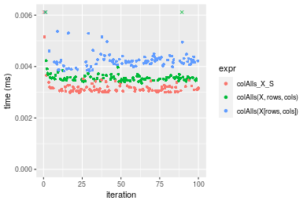

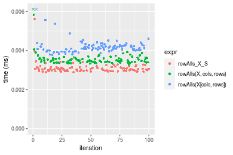
_Table: Benchmarking of colAlls_X_S() and rowAlls_X_S() on 10x10 data (original and transposed).  The top panel shows times in milliseconds and the bottom panel shows relative times._


|   |expr        |   min|    lq|    mean| median|    uq|     max|
|:--|:-----------|-----:|-----:|-------:|------:|-----:|-------:|
|2  |rowAlls_X_S | 2.893| 2.969| 3.10302| 3.0435| 3.138|   5.617|
|1  |colAlls_X_S | 2.986| 3.044| 5.91949| 3.1130| 3.213| 278.269|


|   |expr        |      min|       lq|     mean|   median|       uq|     max|
|:--|:-----------|--------:|--------:|--------:|--------:|--------:|-------:|
|2  |rowAlls_X_S | 1.000000| 1.000000| 1.000000| 1.000000| 1.000000|  1.0000|
|1  |colAlls_X_S | 1.032147| 1.025261| 1.907655| 1.022836| 1.023901| 49.5405|

_Figure: Benchmarking of colAlls_X_S() and rowAlls_X_S() on 10x10 data (original and transposed).  Outliers are displayed as crosses. Times are in milliseconds._


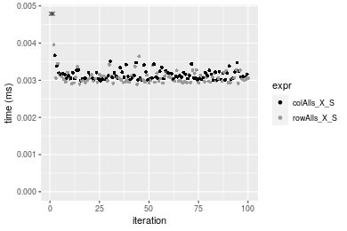

### 100x100 matrix


```r
> X <- data[["100x100"]]
> rows <- sample.int(nrow(X), size = nrow(X) * 0.7)
> cols <- sample.int(ncol(X), size = ncol(X) * 0.7)
> X_S <- X[rows, cols]
> gc()
          used  (Mb) gc trigger  (Mb) max used  (Mb)
Ncells 5152729 275.2    8529671 455.6  8529671 455.6
Vcells 9159001  69.9   31876688 243.2 60562128 462.1
> colStats <- microbenchmark(colAlls_X_S = colAlls(X_S), `colAlls(X, rows, cols)` = colAlls(X, rows = rows, 
+     cols = cols), `colAlls(X[rows, cols])` = colAlls(X[rows, cols]), unit = "ms")
> X <- t(X)
> X_S <- t(X_S)
> gc()
          used  (Mb) gc trigger  (Mb) max used  (Mb)
Ncells 5152705 275.2    8529671 455.6  8529671 455.6
Vcells 9164054  70.0   31876688 243.2 60562128 462.1
> rowStats <- microbenchmark(rowAlls_X_S = rowAlls(X_S), `rowAlls(X, cols, rows)` = rowAlls(X, rows = cols, 
+     cols = rows), `rowAlls(X[cols, rows])` = rowAlls(X[cols, rows]), unit = "ms")
```

_Table: Benchmarking of colAlls_X_S(), colAlls(X, rows, cols)() and colAlls(X[rows, cols])() on 100x100 data. The top panel shows times in milliseconds and the bottom panel shows relative times._


|   |expr                   |      min|        lq|      mean|    median|        uq|      max|
|:--|:----------------------|--------:|---------:|---------:|---------:|---------:|--------:|
|1  |colAlls_X_S            | 0.003892| 0.0042700| 0.0045061| 0.0044345| 0.0046165| 0.010616|
|2  |colAlls(X, rows, cols) | 0.005127| 0.0055205| 0.0058478| 0.0057885| 0.0059955| 0.010613|
|3  |colAlls(X[rows, cols]) | 0.020120| 0.0204070| 0.0211569| 0.0206730| 0.0209035| 0.050245|


|   |expr                   |      min|       lq|     mean|   median|       uq|       max|
|:--|:----------------------|--------:|--------:|--------:|--------:|--------:|---------:|
|1  |colAlls_X_S            | 1.000000| 1.000000| 1.000000| 1.000000| 1.000000| 1.0000000|
|2  |colAlls(X, rows, cols) | 1.317318| 1.292857| 1.297747| 1.305333| 1.298711| 0.9997174|
|3  |colAlls(X[rows, cols]) | 5.169579| 4.779157| 4.695123| 4.661856| 4.527997| 4.7329503|

_Table: Benchmarking of rowAlls_X_S(), rowAlls(X, cols, rows)() and rowAlls(X[cols, rows])() on 100x100 data (transposed). The top panel shows times in milliseconds and the bottom panel shows relative times._


|   |expr                   |      min|        lq|      mean|    median|        uq|      max|
|:--|:----------------------|--------:|---------:|---------:|---------:|---------:|--------:|
|1  |rowAlls_X_S            | 0.005586| 0.0060035| 0.0064399| 0.0062340| 0.0064625| 0.020485|
|2  |rowAlls(X, cols, rows) | 0.006963| 0.0075525| 0.0081366| 0.0078550| 0.0080790| 0.029651|
|3  |rowAlls(X[cols, rows]) | 0.021308| 0.0217170| 0.0225564| 0.0225345| 0.0227575| 0.031666|


|   |expr                   |      min|       lq|     mean|   median|       uq|      max|
|:--|:----------------------|--------:|--------:|--------:|--------:|--------:|--------:|
|1  |rowAlls_X_S            | 1.000000| 1.000000| 1.000000| 1.000000| 1.000000| 1.000000|
|2  |rowAlls(X, cols, rows) | 1.246509| 1.258016| 1.263477| 1.260026| 1.250135| 1.447449|
|3  |rowAlls(X[cols, rows]) | 3.814536| 3.617390| 3.502615| 3.614774| 3.521470| 1.545814|

_Figure: Benchmarking of colAlls_X_S(), colAlls(X, rows, cols)() and colAlls(X[rows, cols])() on 100x100 data  as well as rowAlls_X_S(), rowAlls(X, cols, rows)() and rowAlls(X[cols, rows])() on the same data transposed.  Outliers are displayed as crosses.  Times are in milliseconds._


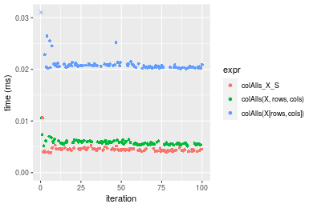

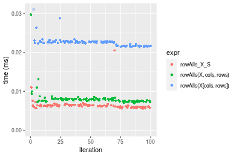
_Table: Benchmarking of colAlls_X_S() and rowAlls_X_S() on 100x100 data (original and transposed).  The top panel shows times in milliseconds and the bottom panel shows relative times._


|   |expr        |   min|     lq|    mean| median|     uq|    max|
|:--|:-----------|-----:|------:|-------:|------:|------:|------:|
|1  |colAlls_X_S | 3.892| 4.2700| 4.50614| 4.4345| 4.6165| 10.616|
|2  |rowAlls_X_S | 5.586| 6.0035| 6.43988| 6.2340| 6.4625| 20.485|


|   |expr        |      min|       lq|     mean|   median|      uq|      max|
|:--|:-----------|--------:|--------:|--------:|--------:|-------:|--------:|
|1  |colAlls_X_S | 1.000000| 1.000000| 1.000000| 1.000000| 1.00000| 1.000000|
|2  |rowAlls_X_S | 1.435252| 1.405972| 1.429134| 1.405795| 1.39987| 1.929634|

_Figure: Benchmarking of colAlls_X_S() and rowAlls_X_S() on 100x100 data (original and transposed).  Outliers are displayed as crosses. Times are in milliseconds._


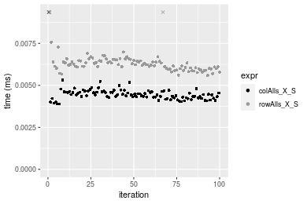

### 1000x10 matrix


```r
> X <- data[["1000x10"]]
> rows <- sample.int(nrow(X), size = nrow(X) * 0.7)
> cols <- sample.int(ncol(X), size = ncol(X) * 0.7)
> X_S <- X[rows, cols]
> gc()
          used  (Mb) gc trigger  (Mb) max used  (Mb)
Ncells 5153714 275.3    8529671 455.6  8529671 455.6
Vcells 9163506  70.0   31876688 243.2 60562128 462.1
> colStats <- microbenchmark(colAlls_X_S = colAlls(X_S), `colAlls(X, rows, cols)` = colAlls(X, rows = rows, 
+     cols = cols), `colAlls(X[rows, cols])` = colAlls(X[rows, cols]), unit = "ms")
> X <- t(X)
> X_S <- t(X_S)
> gc()
          used  (Mb) gc trigger  (Mb) max used  (Mb)
Ncells 5153690 275.3    8529671 455.6  8529671 455.6
Vcells 9168559  70.0   31876688 243.2 60562128 462.1
> rowStats <- microbenchmark(rowAlls_X_S = rowAlls(X_S), `rowAlls(X, cols, rows)` = rowAlls(X, rows = cols, 
+     cols = rows), `rowAlls(X[cols, rows])` = rowAlls(X[cols, rows]), unit = "ms")
```

_Table: Benchmarking of colAlls_X_S(), colAlls(X, rows, cols)() and colAlls(X[rows, cols])() on 1000x10 data. The top panel shows times in milliseconds and the bottom panel shows relative times._


|   |expr                   |      min|        lq|      mean|    median|        uq|      max|
|:--|:----------------------|--------:|---------:|---------:|---------:|---------:|--------:|
|1  |colAlls_X_S            | 0.002936| 0.0030405| 0.0031403| 0.0030970| 0.0031845| 0.004853|
|2  |colAlls(X, rows, cols) | 0.005964| 0.0063925| 0.0067599| 0.0066375| 0.0068835| 0.011604|
|3  |colAlls(X[rows, cols]) | 0.019520| 0.0198600| 0.0203276| 0.0200020| 0.0201410| 0.044120|


|   |expr                   |      min|      lq|     mean|   median|       uq|      max|
|:--|:----------------------|--------:|-------:|--------:|--------:|--------:|--------:|
|1  |colAlls_X_S            | 1.000000| 1.00000| 1.000000| 1.000000| 1.000000| 1.000000|
|2  |colAlls(X, rows, cols) | 2.031335| 2.10245| 2.152658| 2.143203| 2.161564| 2.391098|
|3  |colAlls(X[rows, cols]) | 6.648501| 6.53182| 6.473197| 6.458508| 6.324698| 9.091284|

_Table: Benchmarking of rowAlls_X_S(), rowAlls(X, cols, rows)() and rowAlls(X[cols, rows])() on 1000x10 data (transposed). The top panel shows times in milliseconds and the bottom panel shows relative times._


|   |expr                   |      min|       lq|      mean|    median|        uq|      max|
|:--|:----------------------|--------:|--------:|---------:|---------:|---------:|--------:|
|1  |rowAlls_X_S            | 0.006817| 0.007121| 0.0075415| 0.0072500| 0.0078400| 0.013378|
|2  |rowAlls(X, cols, rows) | 0.010039| 0.010575| 0.0109542| 0.0108300| 0.0111535| 0.015914|
|3  |rowAlls(X[cols, rows]) | 0.024129| 0.025382| 0.0260856| 0.0257075| 0.0258975| 0.052710|


|   |expr                   |      min|       lq|     mean|   median|       uq|      max|
|:--|:----------------------|--------:|--------:|--------:|--------:|--------:|--------:|
|1  |rowAlls_X_S            | 1.000000| 1.000000| 1.000000| 1.000000| 1.000000| 1.000000|
|2  |rowAlls(X, cols, rows) | 1.472642| 1.485044| 1.452521| 1.493793| 1.422640| 1.189565|
|3  |rowAlls(X[cols, rows]) | 3.539534| 3.564387| 3.458923| 3.545862| 3.303253| 3.940051|

_Figure: Benchmarking of colAlls_X_S(), colAlls(X, rows, cols)() and colAlls(X[rows, cols])() on 1000x10 data  as well as rowAlls_X_S(), rowAlls(X, cols, rows)() and rowAlls(X[cols, rows])() on the same data transposed.  Outliers are displayed as crosses.  Times are in milliseconds._


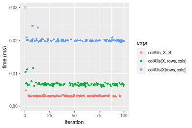

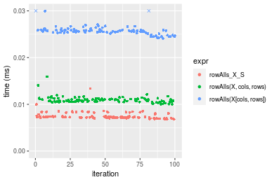
_Table: Benchmarking of colAlls_X_S() and rowAlls_X_S() on 1000x10 data (original and transposed).  The top panel shows times in milliseconds and the bottom panel shows relative times._


|   |expr        |   min|     lq|    mean| median|     uq|    max|
|:--|:-----------|-----:|------:|-------:|------:|------:|------:|
|1  |colAlls_X_S | 2.936| 3.0405| 3.14028|  3.097| 3.1845|  4.853|
|2  |rowAlls_X_S | 6.817| 7.1210| 7.54153|  7.250| 7.8400| 13.378|


|   |expr        |      min|       lq|     mean|   median|       uq|      max|
|:--|:-----------|--------:|--------:|--------:|--------:|--------:|--------:|
|1  |colAlls_X_S | 1.000000| 1.000000| 1.000000| 1.000000| 1.000000| 1.000000|
|2  |rowAlls_X_S | 2.321867| 2.342049| 2.401547| 2.340975| 2.461925| 2.756645|

_Figure: Benchmarking of colAlls_X_S() and rowAlls_X_S() on 1000x10 data (original and transposed).  Outliers are displayed as crosses. Times are in milliseconds._


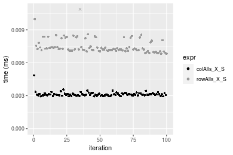

### 10x1000 matrix


```r
> X <- data[["10x1000"]]
> rows <- sample.int(nrow(X), size = nrow(X) * 0.7)
> cols <- sample.int(ncol(X), size = ncol(X) * 0.7)
> X_S <- X[rows, cols]
> gc()
          used  (Mb) gc trigger  (Mb) max used  (Mb)
Ncells 5153951 275.3    8529671 455.6  8529671 455.6
Vcells 9164338  70.0   31876688 243.2 60562128 462.1
> colStats <- microbenchmark(colAlls_X_S = colAlls(X_S), `colAlls(X, rows, cols)` = colAlls(X, rows = rows, 
+     cols = cols), `colAlls(X[rows, cols])` = colAlls(X[rows, cols]), unit = "ms")
> X <- t(X)
> X_S <- t(X_S)
> gc()
          used  (Mb) gc trigger  (Mb) max used  (Mb)
Ncells 5153927 275.3    8529671 455.6  8529671 455.6
Vcells 9169391  70.0   31876688 243.2 60562128 462.1
> rowStats <- microbenchmark(rowAlls_X_S = rowAlls(X_S), `rowAlls(X, cols, rows)` = rowAlls(X, rows = cols, 
+     cols = rows), `rowAlls(X[cols, rows])` = rowAlls(X[cols, rows]), unit = "ms")
```

_Table: Benchmarking of colAlls_X_S(), colAlls(X, rows, cols)() and colAlls(X[rows, cols])() on 10x1000 data. The top panel shows times in milliseconds and the bottom panel shows relative times._


|   |expr                   |      min|       lq|      mean|    median|        uq|      max|
|:--|:----------------------|--------:|--------:|---------:|---------:|---------:|--------:|
|1  |colAlls_X_S            | 0.014275| 0.014966| 0.0157981| 0.0155765| 0.0161020| 0.038946|
|2  |colAlls(X, rows, cols) | 0.015440| 0.018539| 0.0193727| 0.0193605| 0.0202080| 0.034012|
|3  |colAlls(X[rows, cols]) | 0.032465| 0.033170| 0.0340796| 0.0338510| 0.0346055| 0.040146|


|   |expr                   |      min|       lq|     mean|  median|       uq|       max|
|:--|:----------------------|--------:|--------:|--------:|-------:|--------:|---------:|
|1  |colAlls_X_S            | 1.000000| 1.000000| 1.000000| 1.00000| 1.000000| 1.0000000|
|2  |colAlls(X, rows, cols) | 1.081611| 1.238741| 1.226266| 1.24293| 1.254999| 0.8733118|
|3  |colAlls(X[rows, cols]) | 2.274256| 2.216357| 2.157193| 2.17321| 2.149143| 1.0308119|

_Table: Benchmarking of rowAlls_X_S(), rowAlls(X, cols, rows)() and rowAlls(X[cols, rows])() on 10x1000 data (transposed). The top panel shows times in milliseconds and the bottom panel shows relative times._


|   |expr                   |      min|        lq|      mean|    median|        uq|      max|
|:--|:----------------------|--------:|---------:|---------:|---------:|---------:|--------:|
|1  |rowAlls_X_S            | 0.011972| 0.0141355| 0.0159544| 0.0156340| 0.0173540| 0.032300|
|2  |rowAlls(X, cols, rows) | 0.015308| 0.0191515| 0.0215045| 0.0209420| 0.0227685| 0.058972|
|3  |rowAlls(X[cols, rows]) | 0.029147| 0.0310165| 0.0330767| 0.0325825| 0.0344510| 0.048933|


|   |expr                   |      min|       lq|     mean|   median|       uq|      max|
|:--|:----------------------|--------:|--------:|--------:|--------:|--------:|--------:|
|1  |rowAlls_X_S            | 1.000000| 1.000000| 1.000000| 1.000000| 1.000000| 1.000000|
|2  |rowAlls(X, cols, rows) | 1.278650| 1.354851| 1.347874| 1.339516| 1.312003| 1.825759|
|3  |rowAlls(X[cols, rows]) | 2.434597| 2.194227| 2.073209| 2.084080| 1.985191| 1.514954|

_Figure: Benchmarking of colAlls_X_S(), colAlls(X, rows, cols)() and colAlls(X[rows, cols])() on 10x1000 data  as well as rowAlls_X_S(), rowAlls(X, cols, rows)() and rowAlls(X[cols, rows])() on the same data transposed.  Outliers are displayed as crosses.  Times are in milliseconds._


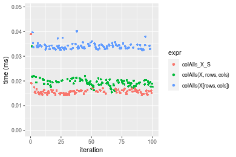


_Table: Benchmarking of colAlls_X_S() and rowAlls_X_S() on 10x1000 data (original and transposed).  The top panel shows times in milliseconds and the bottom panel shows relative times._


|   |expr        |    min|      lq|     mean|  median|     uq|    max|
|:--|:-----------|------:|-------:|--------:|-------:|------:|------:|
|1  |colAlls_X_S | 14.275| 14.9660| 15.79814| 15.5765| 16.102| 38.946|
|2  |rowAlls_X_S | 11.972| 14.1355| 15.95437| 15.6340| 17.354| 32.300|


|   |expr        |      min|        lq|     mean|   median|       uq|       max|
|:--|:-----------|--------:|---------:|--------:|--------:|--------:|---------:|
|1  |colAlls_X_S | 1.000000| 1.0000000| 1.000000| 1.000000| 1.000000| 1.0000000|
|2  |rowAlls_X_S | 0.838669| 0.9445076| 1.009889| 1.003691| 1.077754| 0.8293535|

_Figure: Benchmarking of colAlls_X_S() and rowAlls_X_S() on 10x1000 data (original and transposed).  Outliers are displayed as crosses. Times are in milliseconds._


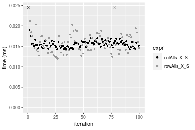

### 100x1000 matrix


```r
> X <- data[["100x1000"]]
> rows <- sample.int(nrow(X), size = nrow(X) * 0.7)
> cols <- sample.int(ncol(X), size = ncol(X) * 0.7)
> X_S <- X[rows, cols]
> gc()
          used  (Mb) gc trigger  (Mb) max used  (Mb)
Ncells 5154173 275.3    8529671 455.6  8529671 455.6
Vcells 9187005  70.1   31876688 243.2 60562128 462.1
> colStats <- microbenchmark(colAlls_X_S = colAlls(X_S), `colAlls(X, rows, cols)` = colAlls(X, rows = rows, 
+     cols = cols), `colAlls(X[rows, cols])` = colAlls(X[rows, cols]), unit = "ms")
> X <- t(X)
> X_S <- t(X_S)
> gc()
          used  (Mb) gc trigger  (Mb) max used  (Mb)
Ncells 5154149 275.3    8529671 455.6  8529671 455.6
Vcells 9237058  70.5   31876688 243.2 60562128 462.1
> rowStats <- microbenchmark(rowAlls_X_S = rowAlls(X_S), `rowAlls(X, cols, rows)` = rowAlls(X, rows = cols, 
+     cols = rows), `rowAlls(X[cols, rows])` = rowAlls(X[cols, rows]), unit = "ms")
```

_Table: Benchmarking of colAlls_X_S(), colAlls(X, rows, cols)() and colAlls(X[rows, cols])() on 100x1000 data. The top panel shows times in milliseconds and the bottom panel shows relative times._


|   |expr                   |      min|        lq|      mean|    median|        uq|      max|
|:--|:----------------------|--------:|---------:|---------:|---------:|---------:|--------:|
|1  |colAlls_X_S            | 0.013862| 0.0164300| 0.0179002| 0.0174005| 0.0185255| 0.054121|
|2  |colAlls(X, rows, cols) | 0.017819| 0.0215875| 0.0232370| 0.0227030| 0.0244085| 0.058309|
|3  |colAlls(X[rows, cols]) | 0.137943| 0.1502875| 0.1604234| 0.1617350| 0.1678650| 0.206960|


|   |expr                   |      min|       lq|     mean|   median|       uq|      max|
|:--|:----------------------|--------:|--------:|--------:|--------:|--------:|--------:|
|1  |colAlls_X_S            | 1.000000| 1.000000| 1.000000| 1.000000| 1.000000| 1.000000|
|2  |colAlls(X, rows, cols) | 1.285457| 1.313908| 1.298145| 1.304733| 1.317562| 1.077382|
|3  |colAlls(X[rows, cols]) | 9.951161| 9.147139| 8.962128| 9.294848| 9.061294| 3.824024|

_Table: Benchmarking of rowAlls_X_S(), rowAlls(X, cols, rows)() and rowAlls(X[cols, rows])() on 100x1000 data (transposed). The top panel shows times in milliseconds and the bottom panel shows relative times._


|   |expr                   |      min|        lq|      mean|    median|        uq|      max|
|:--|:----------------------|--------:|---------:|---------:|---------:|---------:|--------:|
|1  |rowAlls_X_S            | 0.033167| 0.0356275| 0.0384009| 0.0377135| 0.0398360| 0.071937|
|2  |rowAlls(X, cols, rows) | 0.039492| 0.0429860| 0.0465241| 0.0453340| 0.0474345| 0.086056|
|3  |rowAlls(X[cols, rows]) | 0.178062| 0.1850315| 0.1889066| 0.1878170| 0.1900360| 0.239919|


|   |expr                   |      min|       lq|     mean|   median|       uq|      max|
|:--|:----------------------|--------:|--------:|--------:|--------:|--------:|--------:|
|1  |rowAlls_X_S            | 1.000000| 1.000000| 1.000000| 1.000000| 1.000000| 1.000000|
|2  |rowAlls(X, cols, rows) | 1.190702| 1.206540| 1.211536| 1.202063| 1.190745| 1.196269|
|3  |rowAlls(X[cols, rows]) | 5.368650| 5.193502| 4.919325| 4.980100| 4.770459| 3.335127|

_Figure: Benchmarking of colAlls_X_S(), colAlls(X, rows, cols)() and colAlls(X[rows, cols])() on 100x1000 data  as well as rowAlls_X_S(), rowAlls(X, cols, rows)() and rowAlls(X[cols, rows])() on the same data transposed.  Outliers are displayed as crosses.  Times are in milliseconds._


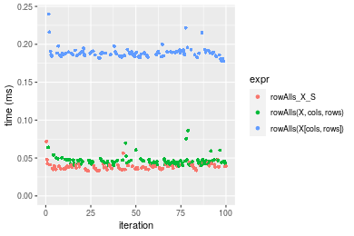
_Table: Benchmarking of colAlls_X_S() and rowAlls_X_S() on 100x1000 data (original and transposed).  The top panel shows times in milliseconds and the bottom panel shows relative times._


|   |expr        |    min|      lq|     mean|  median|      uq|    max|
|:--|:-----------|------:|-------:|--------:|-------:|-------:|------:|
|1  |colAlls_X_S | 13.862| 16.4300| 17.90015| 17.4005| 18.5255| 54.121|
|2  |rowAlls_X_S | 33.167| 35.6275| 38.40092| 37.7135| 39.8360| 71.937|


|   |expr        |      min|       lq|     mean|  median|       uq|      max|
|:--|:-----------|--------:|--------:|--------:|-------:|--------:|--------:|
|1  |colAlls_X_S | 1.000000| 1.000000| 1.000000| 1.00000| 1.000000| 1.000000|
|2  |rowAlls_X_S | 2.392656| 2.168442| 2.145285| 2.16738| 2.150333| 1.329188|

_Figure: Benchmarking of colAlls_X_S() and rowAlls_X_S() on 100x1000 data (original and transposed).  Outliers are displayed as crosses. Times are in milliseconds._


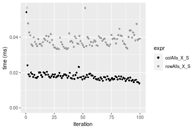

### 1000x100 matrix


```r
> X <- data[["1000x100"]]
> rows <- sample.int(nrow(X), size = nrow(X) * 0.7)
> cols <- sample.int(ncol(X), size = ncol(X) * 0.7)
> X_S <- X[rows, cols]
> gc()
          used  (Mb) gc trigger  (Mb) max used  (Mb)
Ncells 5154389 275.3    8529671 455.6  8529671 455.6
Vcells 9187674  70.1   31876688 243.2 60562128 462.1
> colStats <- microbenchmark(colAlls_X_S = colAlls(X_S), `colAlls(X, rows, cols)` = colAlls(X, rows = rows, 
+     cols = cols), `colAlls(X[rows, cols])` = colAlls(X[rows, cols]), unit = "ms")
> X <- t(X)
> X_S <- t(X_S)
> gc()
          used  (Mb) gc trigger  (Mb) max used  (Mb)
Ncells 5154365 275.3    8529671 455.6  8529671 455.6
Vcells 9237727  70.5   31876688 243.2 60562128 462.1
> rowStats <- microbenchmark(rowAlls_X_S = rowAlls(X_S), `rowAlls(X, cols, rows)` = rowAlls(X, rows = cols, 
+     cols = rows), `rowAlls(X[cols, rows])` = rowAlls(X[cols, rows]), unit = "ms")
```

_Table: Benchmarking of colAlls_X_S(), colAlls(X, rows, cols)() and colAlls(X[rows, cols])() on 1000x100 data. The top panel shows times in milliseconds and the bottom panel shows relative times._


|   |expr                   |      min|        lq|      mean|   median|        uq|      max|
|:--|:----------------------|--------:|---------:|---------:|--------:|---------:|--------:|
|1  |colAlls_X_S            | 0.003264| 0.0040010| 0.0045915| 0.004333| 0.0046710| 0.024459|
|2  |colAlls(X, rows, cols) | 0.006482| 0.0073745| 0.0081240| 0.007878| 0.0085775| 0.018071|
|3  |colAlls(X[rows, cols]) | 0.126256| 0.1358400| 0.1436834| 0.141249| 0.1529790| 0.204710|


|   |expr                   |       min|        lq|      mean|   median|        uq|       max|
|:--|:----------------------|---------:|---------:|---------:|--------:|---------:|---------:|
|1  |colAlls_X_S            |  1.000000|  1.000000|  1.000000|  1.00000|  1.000000| 1.0000000|
|2  |colAlls(X, rows, cols) |  1.985907|  1.843164|  1.769369|  1.81814|  1.836331| 0.7388282|
|3  |colAlls(X[rows, cols]) | 38.681373| 33.951512| 31.293683| 32.59843| 32.750803| 8.3695163|

_Table: Benchmarking of rowAlls_X_S(), rowAlls(X, cols, rows)() and rowAlls(X[cols, rows])() on 1000x100 data (transposed). The top panel shows times in milliseconds and the bottom panel shows relative times._


|   |expr                   |      min|        lq|      mean|    median|        uq|      max|
|:--|:----------------------|--------:|---------:|---------:|---------:|---------:|--------:|
|1  |rowAlls_X_S            | 0.021818| 0.0224805| 0.0250644| 0.0246440| 0.0263895| 0.048487|
|2  |rowAlls(X, cols, rows) | 0.025328| 0.0269640| 0.0297502| 0.0288350| 0.0307975| 0.056401|
|3  |rowAlls(X[cols, rows]) | 0.140504| 0.1419800| 0.1573729| 0.1565415| 0.1695720| 0.239202|


|   |expr                   |      min|       lq|     mean|   median|       uq|      max|
|:--|:----------------------|--------:|--------:|--------:|--------:|--------:|--------:|
|1  |rowAlls_X_S            | 1.000000| 1.000000| 1.000000| 1.000000| 1.000000| 1.000000|
|2  |rowAlls(X, cols, rows) | 1.160876| 1.199439| 1.186950| 1.170062| 1.167036| 1.163219|
|3  |rowAlls(X[cols, rows]) | 6.439820| 6.315696| 6.278739| 6.352114| 6.425738| 4.933322|

_Figure: Benchmarking of colAlls_X_S(), colAlls(X, rows, cols)() and colAlls(X[rows, cols])() on 1000x100 data  as well as rowAlls_X_S(), rowAlls(X, cols, rows)() and rowAlls(X[cols, rows])() on the same data transposed.  Outliers are displayed as crosses.  Times are in milliseconds._


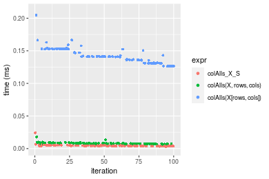

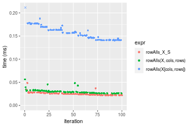
_Table: Benchmarking of colAlls_X_S() and rowAlls_X_S() on 1000x100 data (original and transposed).  The top panel shows times in milliseconds and the bottom panel shows relative times._


|   |expr        |    min|      lq|     mean| median|      uq|    max|
|:--|:-----------|------:|-------:|--------:|------:|-------:|------:|
|1  |colAlls_X_S |  3.264|  4.0010|  4.59145|  4.333|  4.6710| 24.459|
|2  |rowAlls_X_S | 21.818| 22.4805| 25.06442| 24.644| 26.3895| 48.487|


|   |expr        |      min|      lq|     mean|   median|       uq|      max|
|:--|:-----------|--------:|-------:|--------:|--------:|--------:|--------:|
|1  |colAlls_X_S | 1.000000| 1.00000| 1.000000| 1.000000| 1.000000| 1.000000|
|2  |rowAlls_X_S | 6.684436| 5.61872| 5.458933| 5.687514| 5.649647| 1.982379|

_Figure: Benchmarking of colAlls_X_S() and rowAlls_X_S() on 1000x100 data (original and transposed).  Outliers are displayed as crosses. Times are in milliseconds._


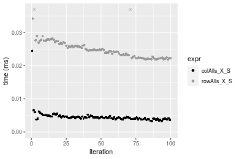


## Appendix

### Session information
```r
R version 4.1.1 Patched (2021-08-10 r80727)
Platform: x86_64-pc-linux-gnu (64-bit)
Running under: Ubuntu 18.04.5 LTS

Matrix products: default
BLAS:   /home/hb/software/R-devel/R-4-1-branch/lib/R/lib/libRblas.so
LAPACK: /home/hb/software/R-devel/R-4-1-branch/lib/R/lib/libRlapack.so

locale:
 [1] LC_CTYPE=en_US.UTF-8       LC_NUMERIC=C              
 [3] LC_TIME=en_US.UTF-8        LC_COLLATE=en_US.UTF-8    
 [5] LC_MONETARY=en_US.UTF-8    LC_MESSAGES=en_US.UTF-8   
 [7] LC_PAPER=en_US.UTF-8       LC_NAME=C                 
 [9] LC_ADDRESS=C               LC_TELEPHONE=C            
[11] LC_MEASUREMENT=en_US.UTF-8 LC_IDENTIFICATION=C       

attached base packages:
[1] stats     graphics  grDevices utils     datasets  methods   base     

other attached packages:
[1] microbenchmark_1.4-7   matrixStats_0.60.1     ggplot2_3.3.5         
[4] knitr_1.33             R.devices_2.17.0       R.utils_2.10.1        
[7] R.oo_1.24.0            R.methodsS3_1.8.1-9001 history_0.0.1-9000    

loaded via a namespace (and not attached):
 [1] Biobase_2.52.0          httr_1.4.2              splines_4.1.1          
 [4] bit64_4.0.5             network_1.17.1          assertthat_0.2.1       
 [7] highr_0.9               stats4_4.1.1            blob_1.2.2             
[10] GenomeInfoDbData_1.2.6  robustbase_0.93-8       pillar_1.6.2           
[13] RSQLite_2.2.8           lattice_0.20-44         glue_1.4.2             
[16] digest_0.6.27           XVector_0.32.0          colorspace_2.0-2       
[19] Matrix_1.3-4            XML_3.99-0.7            pkgconfig_2.0.3        
[22] zlibbioc_1.38.0         genefilter_1.74.0       purrr_0.3.4            
[25] ergm_4.1.2              xtable_1.8-4            scales_1.1.1           
[28] tibble_3.1.4            annotate_1.70.0         KEGGREST_1.32.0        
[31] farver_2.1.0            generics_0.1.0          IRanges_2.26.0         
[34] ellipsis_0.3.2          cachem_1.0.6            withr_2.4.2            
[37] BiocGenerics_0.38.0     mime_0.11               survival_3.2-13        
[40] magrittr_2.0.1          crayon_1.4.1            statnet.common_4.5.0   
[43] memoise_2.0.0           laeken_0.5.1            fansi_0.5.0            
[46] R.cache_0.15.0          MASS_7.3-54             R.rsp_0.44.0           
[49] progressr_0.8.0         tools_4.1.1             lifecycle_1.0.0        
[52] S4Vectors_0.30.0        trust_0.1-8             munsell_0.5.0          
[55] tabby_0.0.1-9001        AnnotationDbi_1.54.1    Biostrings_2.60.2      
[58] compiler_4.1.1          GenomeInfoDb_1.28.1     rlang_0.4.11           
[61] grid_4.1.1              RCurl_1.98-1.4          cwhmisc_6.6            
[64] rappdirs_0.3.3          startup_0.15.0          labeling_0.4.2         
[67] bitops_1.0-7            base64enc_0.1-3         boot_1.3-28            
[70] gtable_0.3.0            DBI_1.1.1               markdown_1.1           
[73] R6_2.5.1                lpSolveAPI_5.5.2.0-17.7 rle_0.9.2              
[76] dplyr_1.0.7             fastmap_1.1.0           bit_4.0.4              
[79] utf8_1.2.2              parallel_4.1.1          Rcpp_1.0.7             
[82] vctrs_0.3.8             png_0.1-7               DEoptimR_1.0-9         
[85] tidyselect_1.1.1        xfun_0.25               coda_0.19-4            
```
Total processing time was 11.09 secs.


### Reproducibility
To reproduce this report, do:
```r
html <- matrixStats:::benchmark('colRowAlls_subset')
```

[RSP]: https://cran.r-project.org/package=R.rsp
[matrixStats]: https://cran.r-project.org/package=matrixStats

[StackOverflow:colMins?]: https://stackoverflow.com/questions/13676878 "Stack Overflow: fastest way to get Min from every column in a matrix?"
[StackOverflow:colSds?]: https://stackoverflow.com/questions/17549762 "Stack Overflow: Is there such 'colsd' in R?"
[StackOverflow:rowProds?]: https://stackoverflow.com/questions/20198801/ "Stack Overflow: Row product of matrix and column sum of matrix"

---------------------------------------
Copyright Dongcan Jiang. Last updated on 2021-08-25 18:49:36 (+0200 UTC). Powered by [RSP].

<script>
 var link = document.createElement('link');
 link.rel = 'icon';
 link.href = "data:image/png;base64,iVBORw0KGgoAAAANSUhEUgAAACAAAAAgCAMAAABEpIrGAAAA21BMVEUAAAAAAP8AAP8AAP8AAP8AAP8AAP8AAP8AAP8AAP8AAP8AAP8AAP8AAP8AAP8AAP8AAP8AAP8AAP8AAP8AAP8AAP8AAP8AAP8AAP8AAP8AAP8AAP8AAP8AAP8AAP8AAP8AAP8AAP8AAP8AAP8AAP8AAP8AAP8AAP8AAP8AAP8BAf4CAv0DA/wdHeIeHuEfH+AgIN8hId4lJdomJtknJ9g+PsE/P8BAQL9yco10dIt1dYp3d4h4eIeVlWqWlmmXl2iYmGeZmWabm2Tn5xjo6Bfp6Rb39wj4+Af//wA2M9hbAAAASXRSTlMAAQIJCgsMJSYnKD4/QGRlZmhpamtsbautrrCxuru8y8zN5ebn6Pn6+///////////////////////////////////////////LsUNcQAAAS9JREFUOI29k21XgkAQhVcFytdSMqMETU26UVqGmpaiFbL//xc1cAhhwVNf6n5i5z67M2dmYOyfJZUqlVLhkKucG7cgmUZTybDz6g0iDeq51PUr37Ds2cy2/C9NeES5puDjxuUk1xnToZsg8pfA3avHQ3lLIi7iWRrkv/OYtkScxBIMgDee0ALoyxHQBJ68JLCjOtQIMIANF7QG9G9fNnHvisCHBVMKgSJgiz7nE+AoBKrAPA3MgepvgR9TSCasrCKH0eB1wBGBFdCO+nAGjMVGPcQb5bd6mQRegN6+1axOs9nGfYcCtfi4NQosdtH7dB+txFIpXQqN1p9B/asRHToyS0jRgpV7nk4nwcq1BJ+x3Gl/v7S9Wmpp/aGquum7w3ZDyrADFYrl8vHBH+ev9AUASW1dmU4h4wAAAABJRU5ErkJggg=="
 document.getElementsByTagName('head')[0].appendChild(link);
</script>


