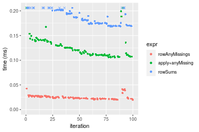
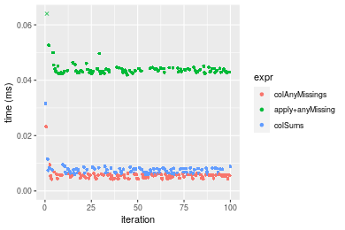

[matrixStats]: Benchmark report

---------------------------------------


# colAnyMissings() and rowAnyMissings() benchmarks

This report benchmark the performance of colAnyMissings() and rowAnyMissings() against alternative methods.

## Alternative methods

* colAnyMissings() and rowAnyMissings()
* apply() + anyMissing()
* colSums() + is.na() and rowSums() + is.na()

where

```r
> colAnyMissings <- function(x, ...) colAnys(x, value = NA)
```

and

```r
> rowAnyMissings <- function(x, ...) rowAnys(x, value = NA)
```


## Data type "integer"

### Data
```r
> rmatrix <- function(nrow, ncol, mode = c("logical", "double", "integer", "index"), range = c(-100, 
+     +100), na_prob = 0) {
+     mode <- match.arg(mode)
+     n <- nrow * ncol
+     if (mode == "logical") {
+         x <- sample(c(FALSE, TRUE), size = n, replace = TRUE)
+     }     else if (mode == "index") {
+         x <- seq_len(n)
+         mode <- "integer"
+     }     else {
+         x <- runif(n, min = range[1], max = range[2])
+     }
+     storage.mode(x) <- mode
+     if (na_prob > 0) 
+         x[sample(n, size = na_prob * n)] <- NA
+     dim(x) <- c(nrow, ncol)
+     x
+ }
> rmatrices <- function(scale = 10, seed = 1, ...) {
+     set.seed(seed)
+     data <- list()
+     data[[1]] <- rmatrix(nrow = scale * 1, ncol = scale * 1, ...)
+     data[[2]] <- rmatrix(nrow = scale * 10, ncol = scale * 10, ...)
+     data[[3]] <- rmatrix(nrow = scale * 100, ncol = scale * 1, ...)
+     data[[4]] <- t(data[[3]])
+     data[[5]] <- rmatrix(nrow = scale * 10, ncol = scale * 100, ...)
+     data[[6]] <- t(data[[5]])
+     names(data) <- sapply(data, FUN = function(x) paste(dim(x), collapse = "x"))
+     data
+ }
> data <- rmatrices(mode = mode)
```

## Results

### 10x10 matrix


```r
> X <- data[["10x10"]]
> gc()
          used  (Mb) gc trigger  (Mb) max used  (Mb)
Ncells 5173263 276.3    8529671 455.6  8529671 455.6
Vcells 9649620  73.7   31876688 243.2 60562128 462.1
> colStats <- microbenchmark(colAnyMissings = colAnyMissings(X), `apply+anyMissing` = apply(X, MARGIN = 2L, 
+     FUN = anyMissing), colSums = is.na(colSums(X, na.rm = FALSE)), unit = "ms")
> X <- t(X)
> gc()
          used  (Mb) gc trigger  (Mb) max used  (Mb)
Ncells 5164851 275.9    8529671 455.6  8529671 455.6
Vcells 9622208  73.5   31876688 243.2 60562128 462.1
> rowStats <- microbenchmark(rowAnyMissings = rowAnyMissings(X), `apply+anyMissing` = apply(X, MARGIN = 1L, 
+     FUN = anyMissing), rowSums = is.na(rowSums(X, na.rm = FALSE)), unit = "ms")
```

_Table: Benchmarking of colAnyMissings(), apply+anyMissing() and colSums() on integer+10x10 data. The top panel shows times in milliseconds and the bottom panel shows relative times._


|   |expr             |      min|        lq|      mean|    median|        uq|      max|
|:--|:----------------|--------:|---------:|---------:|---------:|---------:|--------:|
|1  |colAnyMissings   | 0.004152| 0.0045730| 0.0055188| 0.0055150| 0.0058835| 0.025830|
|3  |colSums          | 0.005915| 0.0063460| 0.0074479| 0.0069075| 0.0078875| 0.035323|
|2  |apply+anyMissing | 0.041145| 0.0421355| 0.0437230| 0.0428330| 0.0436395| 0.098740|


|   |expr             |      min|       lq|     mean|   median|       uq|      max|
|:--|:----------------|--------:|--------:|--------:|--------:|--------:|--------:|
|1  |colAnyMissings   | 1.000000| 1.000000| 1.000000| 1.000000| 1.000000| 1.000000|
|3  |colSums          | 1.424615| 1.387711| 1.349549| 1.252493| 1.340614| 1.367518|
|2  |apply+anyMissing | 9.909682| 9.213973| 7.922559| 7.766636| 7.417269| 3.822687|

_Table: Benchmarking of rowAnyMissings(), apply+anyMissing() and rowSums() on integer+10x10 data (transposed). The top panel shows times in milliseconds and the bottom panel shows relative times._


|   |expr             |      min|        lq|      mean|    median|        uq|      max|
|:--|:----------------|--------:|---------:|---------:|---------:|---------:|--------:|
|1  |rowAnyMissings   | 0.004328| 0.0046645| 0.0056704| 0.0057380| 0.0059540| 0.023656|
|3  |rowSums          | 0.006724| 0.0070750| 0.0080048| 0.0075205| 0.0083910| 0.031508|
|2  |apply+anyMissing | 0.041078| 0.0419675| 0.0433506| 0.0424490| 0.0432625| 0.095971|


|   |expr             |      min|       lq|     mean|   median|       uq|      max|
|:--|:----------------|--------:|--------:|--------:|--------:|--------:|--------:|
|1  |rowAnyMissings   | 1.000000| 1.000000| 1.000000| 1.000000| 1.000000| 1.000000|
|3  |rowSums          | 1.553604| 1.516776| 1.411692| 1.310648| 1.409305| 1.331924|
|2  |apply+anyMissing | 9.491220| 8.997213| 7.645142| 7.397874| 7.266124| 4.056941|

_Figure: Benchmarking of colAnyMissings(), apply+anyMissing() and colSums() on integer+10x10 data  as well as rowAnyMissings(), apply+anyMissing() and rowSums() on the same data transposed.  Outliers are displayed as crosses.  Times are in milliseconds._


_Table: Benchmarking of colAnyMissings() and rowAnyMissings() on integer+10x10 data (original and transposed).  The top panel shows times in milliseconds and the bottom panel shows relative times._


|   |expr           |   min|     lq|    mean| median|     uq|    max|
|:--|:--------------|-----:|------:|-------:|------:|------:|------:|
|1  |colAnyMissings | 4.152| 4.5730| 5.51880|  5.515| 5.8835| 25.830|
|2  |rowAnyMissings | 4.328| 4.6645| 5.67035|  5.738| 5.9540| 23.656|


|   |expr           |      min|       lq|     mean|   median|       uq|       max|
|:--|:--------------|--------:|--------:|--------:|--------:|--------:|---------:|
|1  |colAnyMissings | 1.000000| 1.000000| 1.000000| 1.000000| 1.000000| 1.0000000|
|2  |rowAnyMissings | 1.042389| 1.020009| 1.027461| 1.040435| 1.011983| 0.9158343|

_Figure: Benchmarking of colAnyMissings() and rowAnyMissings() on integer+10x10 data (original and transposed).  Outliers are displayed as crosses. Times are in milliseconds._


### 100x100 matrix


```r
> X <- data[["100x100"]]
> gc()
          used  (Mb) gc trigger  (Mb) max used  (Mb)
Ncells 5163428 275.8    8529671 455.6  8529671 455.6
Vcells 9238876  70.5   31876688 243.2 60562128 462.1
> colStats <- microbenchmark(colAnyMissings = colAnyMissings(X), `apply+anyMissing` = apply(X, MARGIN = 2L, 
+     FUN = anyMissing), colSums = is.na(colSums(X, na.rm = FALSE)), unit = "ms")
> X <- t(X)
> gc()
          used  (Mb) gc trigger  (Mb) max used  (Mb)
Ncells 5163404 275.8    8529671 455.6  8529671 455.6
Vcells 9243889  70.6   31876688 243.2 60562128 462.1
> rowStats <- microbenchmark(rowAnyMissings = rowAnyMissings(X), `apply+anyMissing` = apply(X, MARGIN = 1L, 
+     FUN = anyMissing), rowSums = is.na(rowSums(X, na.rm = FALSE)), unit = "ms")
```

_Table: Benchmarking of colAnyMissings(), apply+anyMissing() and colSums() on integer+100x100 data. The top panel shows times in milliseconds and the bottom panel shows relative times._


|   |expr             |      min|       lq|      mean|    median|        uq|      max|
|:--|:----------------|--------:|--------:|---------:|---------:|---------:|--------:|
|3  |colSums          | 0.016000| 0.017601| 0.0197373| 0.0184605| 0.0213410| 0.043355|
|1  |colAnyMissings   | 0.017705| 0.018906| 0.0215564| 0.0201235| 0.0233870| 0.047997|
|2  |apply+anyMissing | 0.246295| 0.253925| 0.2814964| 0.2724580| 0.2972355| 0.407821|


|   |expr             |       min|        lq|      mean|    median|        uq|      max|
|:--|:----------------|---------:|---------:|---------:|---------:|---------:|--------:|
|3  |colSums          |  1.000000|  1.000000|  1.000000|  1.000000|  1.000000| 1.000000|
|1  |colAnyMissings   |  1.106562|  1.074143|  1.092167|  1.090084|  1.095872| 1.107069|
|2  |apply+anyMissing | 15.393437| 14.426737| 14.262176| 14.758972| 13.927909| 9.406551|

_Table: Benchmarking of rowAnyMissings(), apply+anyMissing() and rowSums() on integer+100x100 data (transposed). The top panel shows times in milliseconds and the bottom panel shows relative times._


|   |expr             |      min|        lq|      mean|    median|        uq|      max|
|:--|:----------------|--------:|---------:|---------:|---------:|---------:|--------:|
|1  |rowAnyMissings   | 0.018271| 0.0210740| 0.0246279| 0.0233630| 0.0257595| 0.064017|
|3  |rowSums          | 0.044517| 0.0475015| 0.0555271| 0.0537035| 0.0587230| 0.097315|
|2  |apply+anyMissing | 0.245325| 0.2610140| 0.3120101| 0.2852185| 0.3253155| 0.709762|


|   |expr             |       min|        lq|      mean|    median|        uq|       max|
|:--|:----------------|---------:|---------:|---------:|---------:|---------:|---------:|
|1  |rowAnyMissings   |  1.000000|  1.000000|  1.000000|  1.000000|  1.000000|  1.000000|
|3  |rowSums          |  2.436484|  2.254033|  2.254641|  2.298656|  2.279664|  1.520143|
|2  |apply+anyMissing | 13.427015| 12.385594| 12.668957| 12.208128| 12.628952| 11.087086|

_Figure: Benchmarking of colAnyMissings(), apply+anyMissing() and colSums() on integer+100x100 data  as well as rowAnyMissings(), apply+anyMissing() and rowSums() on the same data transposed.  Outliers are displayed as crosses.  Times are in milliseconds._


_Table: Benchmarking of colAnyMissings() and rowAnyMissings() on integer+100x100 data (original and transposed).  The top panel shows times in milliseconds and the bottom panel shows relative times._


|   |expr           |    min|     lq|     mean|  median|      uq|    max|
|:--|:--------------|------:|------:|--------:|-------:|-------:|------:|
|1  |colAnyMissings | 17.705| 18.906| 21.55639| 20.1235| 23.3870| 47.997|
|2  |rowAnyMissings | 18.271| 21.074| 24.62792| 23.3630| 25.7595| 64.017|


|   |expr           |      min|       lq|     mean|   median|       uq|      max|
|:--|:--------------|--------:|--------:|--------:|--------:|--------:|--------:|
|1  |colAnyMissings | 1.000000| 1.000000| 1.000000| 1.000000| 1.000000| 1.000000|
|2  |rowAnyMissings | 1.031968| 1.114673| 1.142488| 1.160981| 1.101445| 1.333771|

_Figure: Benchmarking of colAnyMissings() and rowAnyMissings() on integer+100x100 data (original and transposed).  Outliers are displayed as crosses. Times are in milliseconds._


### 1000x10 matrix


```r
> X <- data[["1000x10"]]
> gc()
          used  (Mb) gc trigger  (Mb) max used  (Mb)
Ncells 5164163 275.8    8529671 455.6  8529671 455.6
Vcells 9242622  70.6   31876688 243.2 60562128 462.1
> colStats <- microbenchmark(colAnyMissings = colAnyMissings(X), `apply+anyMissing` = apply(X, MARGIN = 2L, 
+     FUN = anyMissing), colSums = is.na(colSums(X, na.rm = FALSE)), unit = "ms")
> X <- t(X)
> gc()
          used  (Mb) gc trigger  (Mb) max used  (Mb)
Ncells 5164157 275.8    8529671 455.6  8529671 455.6
Vcells 9247665  70.6   31876688 243.2 60562128 462.1
> rowStats <- microbenchmark(rowAnyMissings = rowAnyMissings(X), `apply+anyMissing` = apply(X, MARGIN = 1L, 
+     FUN = anyMissing), rowSums = is.na(rowSums(X, na.rm = FALSE)), unit = "ms")
```

_Table: Benchmarking of colAnyMissings(), apply+anyMissing() and colSums() on integer+1000x10 data. The top panel shows times in milliseconds and the bottom panel shows relative times._


|   |expr             |      min|       lq|      mean|    median|        uq|      max|
|:--|:----------------|--------:|--------:|---------:|---------:|---------:|--------:|
|3  |colSums          | 0.015642| 0.017862| 0.0192017| 0.0190945| 0.0199650| 0.034222|
|1  |colAnyMissings   | 0.018089| 0.019810| 0.0213207| 0.0212070| 0.0222605| 0.037839|
|2  |apply+anyMissing | 0.112795| 0.118537| 0.1295417| 0.1284490| 0.1384660| 0.214005|


|   |expr             |      min|       lq|     mean|   median|       uq|      max|
|:--|:----------------|--------:|--------:|--------:|--------:|--------:|--------:|
|3  |colSums          | 1.000000| 1.000000| 1.000000| 1.000000| 1.000000| 1.000000|
|1  |colAnyMissings   | 1.156438| 1.109058| 1.110352| 1.110634| 1.114976| 1.105692|
|2  |apply+anyMissing | 7.211034| 6.636267| 6.746361| 6.727016| 6.935437| 6.253433|

_Table: Benchmarking of rowAnyMissings(), apply+anyMissing() and rowSums() on integer+1000x10 data (transposed). The top panel shows times in milliseconds and the bottom panel shows relative times._


|   |expr             |      min|        lq|      mean|    median|        uq|      max|
|:--|:----------------|--------:|---------:|---------:|---------:|---------:|--------:|
|1  |rowAnyMissings   | 0.019821| 0.0220475| 0.0248644| 0.0238195| 0.0265080| 0.042560|
|2  |apply+anyMissing | 0.105758| 0.1103845| 0.1258374| 0.1200485| 0.1371815| 0.253293|
|3  |rowSums          | 0.168489| 0.1739700| 0.1900289| 0.1866410| 0.2024465| 0.230999|


|   |expr             |      min|       lq|     mean|   median|       uq|      max|
|:--|:----------------|--------:|--------:|--------:|--------:|--------:|--------:|
|1  |rowAnyMissings   | 1.000000| 1.000000| 1.000000| 1.000000| 1.000000| 1.000000|
|2  |apply+anyMissing | 5.335654| 5.006667| 5.060956| 5.039925| 5.175098| 5.951433|
|3  |rowSums          | 8.500530| 7.890691| 7.642626| 7.835639| 7.637185| 5.427608|

_Figure: Benchmarking of colAnyMissings(), apply+anyMissing() and colSums() on integer+1000x10 data  as well as rowAnyMissings(), apply+anyMissing() and rowSums() on the same data transposed.  Outliers are displayed as crosses.  Times are in milliseconds._



_Table: Benchmarking of colAnyMissings() and rowAnyMissings() on integer+1000x10 data (original and transposed).  The top panel shows times in milliseconds and the bottom panel shows relative times._


|   |expr           |    min|      lq|     mean|  median|      uq|    max|
|:--|:--------------|------:|-------:|--------:|-------:|-------:|------:|
|1  |colAnyMissings | 18.089| 19.8100| 21.32067| 21.2070| 22.2605| 37.839|
|2  |rowAnyMissings | 19.821| 22.0475| 24.86435| 23.8195| 26.5080| 42.560|


|   |expr           |      min|       lq|     mean|  median|       uq|      max|
|:--|:--------------|--------:|--------:|--------:|-------:|--------:|--------:|
|1  |colAnyMissings | 1.000000| 1.000000| 1.000000| 1.00000| 1.000000| 1.000000|
|2  |rowAnyMissings | 1.095749| 1.112948| 1.166209| 1.12319| 1.190809| 1.124766|

_Figure: Benchmarking of colAnyMissings() and rowAnyMissings() on integer+1000x10 data (original and transposed).  Outliers are displayed as crosses. Times are in milliseconds._


### 10x1000 matrix


```r
> X <- data[["10x1000"]]
> gc()
          used  (Mb) gc trigger  (Mb) max used  (Mb)
Ncells 5164395 275.9    8529671 455.6  8529671 455.6
Vcells 9243463  70.6   31876688 243.2 60562128 462.1
> colStats <- microbenchmark(colAnyMissings = colAnyMissings(X), `apply+anyMissing` = apply(X, MARGIN = 2L, 
+     FUN = anyMissing), colSums = is.na(colSums(X, na.rm = FALSE)), unit = "ms")
> X <- t(X)
> gc()
          used  (Mb) gc trigger  (Mb) max used  (Mb)
Ncells 5164371 275.9    8529671 455.6  8529671 455.6
Vcells 9248476  70.6   31876688 243.2 60562128 462.1
> rowStats <- microbenchmark(rowAnyMissings = rowAnyMissings(X), `apply+anyMissing` = apply(X, MARGIN = 1L, 
+     FUN = anyMissing), rowSums = is.na(rowSums(X, na.rm = FALSE)), unit = "ms")
```

_Table: Benchmarking of colAnyMissings(), apply+anyMissing() and colSums() on integer+10x1000 data. The top panel shows times in milliseconds and the bottom panel shows relative times._


|   |expr             |      min|        lq|      mean|    median|        uq|      max|
|:--|:----------------|--------:|---------:|---------:|---------:|---------:|--------:|
|3  |colSums          | 0.015172| 0.0167680| 0.0185027| 0.0178915| 0.0190845| 0.039948|
|1  |colAnyMissings   | 0.016558| 0.0180085| 0.0201090| 0.0193335| 0.0207530| 0.044990|
|2  |apply+anyMissing | 1.231870| 1.3360010| 1.4178813| 1.3889800| 1.4404045| 2.019945|


|   |expr             |       min|       lq|      mean|    median|        uq|       max|
|:--|:----------------|---------:|--------:|---------:|---------:|---------:|---------:|
|3  |colSums          |  1.000000|  1.00000|  1.000000|  1.000000|  1.000000|  1.000000|
|1  |colAnyMissings   |  1.091352|  1.07398|  1.086816|  1.080597|  1.087427|  1.126214|
|2  |apply+anyMissing | 81.193646| 79.67563| 76.631050| 77.633513| 75.475098| 50.564359|

_Table: Benchmarking of rowAnyMissings(), apply+anyMissing() and rowSums() on integer+10x1000 data (transposed). The top panel shows times in milliseconds and the bottom panel shows relative times._


|   |expr             |      min|       lq|      mean|   median|        uq|      max|
|:--|:----------------|--------:|--------:|---------:|--------:|---------:|--------:|
|1  |rowAnyMissings   | 0.015909| 0.018860| 0.0221714| 0.020855| 0.0233990| 0.057988|
|3  |rowSums          | 0.027829| 0.030573| 0.0340773| 0.031732| 0.0353285| 0.070356|
|2  |apply+anyMissing | 1.229049| 1.339528| 1.4923336| 1.402618| 1.5593800| 3.116060|


|   |expr             |       min|       lq|      mean|    median|        uq|       max|
|:--|:----------------|---------:|--------:|---------:|---------:|---------:|---------:|
|1  |rowAnyMissings   |  1.000000|  1.00000|  1.000000|  1.000000|  1.000000|  1.000000|
|3  |rowSums          |  1.749261|  1.62105|  1.536994|  1.521554|  1.509829|  1.213286|
|2  |apply+anyMissing | 77.254950| 71.02484| 67.308980| 67.255694| 66.643019| 53.736290|

_Figure: Benchmarking of colAnyMissings(), apply+anyMissing() and colSums() on integer+10x1000 data  as well as rowAnyMissings(), apply+anyMissing() and rowSums() on the same data transposed.  Outliers are displayed as crosses.  Times are in milliseconds._


_Table: Benchmarking of colAnyMissings() and rowAnyMissings() on integer+10x1000 data (original and transposed).  The top panel shows times in milliseconds and the bottom panel shows relative times._


|   |expr           |    min|      lq|     mean|  median|     uq|    max|
|:--|:--------------|------:|-------:|--------:|-------:|------:|------:|
|1  |colAnyMissings | 16.558| 18.0085| 20.10903| 19.3335| 20.753| 44.990|
|2  |rowAnyMissings | 15.909| 18.8600| 22.17139| 20.8550| 23.399| 57.988|


|   |expr           |       min|       lq|     mean|   median|     uq|      max|
|:--|:--------------|---------:|--------:|--------:|--------:|------:|--------:|
|1  |colAnyMissings | 1.0000000| 1.000000| 1.000000| 1.000000| 1.0000| 1.000000|
|2  |rowAnyMissings | 0.9608044| 1.047283| 1.102559| 1.078698| 1.1275| 1.288909|

_Figure: Benchmarking of colAnyMissings() and rowAnyMissings() on integer+10x1000 data (original and transposed).  Outliers are displayed as crosses. Times are in milliseconds._


### 100x1000 matrix


```r
> X <- data[["100x1000"]]
> gc()
          used  (Mb) gc trigger  (Mb) max used  (Mb)
Ncells 5164585 275.9    8529671 455.6  8529671 455.6
Vcells 9244012  70.6   31876688 243.2 60562128 462.1
> colStats <- microbenchmark(colAnyMissings = colAnyMissings(X), `apply+anyMissing` = apply(X, MARGIN = 2L, 
+     FUN = anyMissing), colSums = is.na(colSums(X, na.rm = FALSE)), unit = "ms")
> X <- t(X)
> gc()
          used  (Mb) gc trigger  (Mb) max used  (Mb)
Ncells 5164573 275.9    8529671 455.6  8529671 455.6
Vcells 9294045  71.0   31876688 243.2 60562128 462.1
> rowStats <- microbenchmark(rowAnyMissings = rowAnyMissings(X), `apply+anyMissing` = apply(X, MARGIN = 1L, 
+     FUN = anyMissing), rowSums = is.na(rowSums(X, na.rm = FALSE)), unit = "ms")
```

_Table: Benchmarking of colAnyMissings(), apply+anyMissing() and colSums() on integer+100x1000 data. The top panel shows times in milliseconds and the bottom panel shows relative times._


|   |expr             |      min|        lq|      mean|   median|        uq|      max|
|:--|:----------------|--------:|---------:|---------:|--------:|---------:|--------:|
|3  |colSums          | 0.090408| 0.0987670| 0.1038478| 0.101548| 0.1067305| 0.152955|
|1  |colAnyMissings   | 0.115819| 0.1254885| 0.1299807| 0.129344| 0.1322780| 0.187385|
|2  |apply+anyMissing | 1.826588| 1.9727960| 2.0741151| 2.022147| 2.0801860| 3.259332|


|   |expr             |      min|        lq|      mean|    median|        uq|       max|
|:--|:----------------|--------:|---------:|---------:|---------:|---------:|---------:|
|3  |colSums          |  1.00000|  1.000000|  1.000000|  1.000000|  1.000000|  1.000000|
|1  |colAnyMissings   |  1.28107|  1.270551|  1.251646|  1.273723|  1.239365|  1.225099|
|2  |apply+anyMissing | 20.20383| 19.974242| 19.972653| 19.913214| 19.490080| 21.309091|

_Table: Benchmarking of rowAnyMissings(), apply+anyMissing() and rowSums() on integer+100x1000 data (transposed). The top panel shows times in milliseconds and the bottom panel shows relative times._


|   |expr             |      min|        lq|      mean|    median|        uq|      max|
|:--|:----------------|--------:|---------:|---------:|---------:|---------:|--------:|
|1  |rowAnyMissings   | 0.110603| 0.1224845| 0.1278250| 0.1239075| 0.1271055| 0.224174|
|3  |rowSums          | 0.223137| 0.2488885| 0.2623729| 0.2505605| 0.2644200| 0.370899|
|2  |apply+anyMissing | 1.827371| 2.0025165| 2.0684907| 2.0354200| 2.0903510| 3.049776|


|   |expr             |       min|       lq|      mean|    median|        uq|       max|
|:--|:----------------|---------:|--------:|---------:|---------:|---------:|---------:|
|1  |rowAnyMissings   |  1.000000|  1.00000|  1.000000|  1.000000|  1.000000|  1.000000|
|3  |rowSums          |  2.017459|  2.03200|  2.052594|  2.022158|  2.080319|  1.654514|
|2  |apply+anyMissing | 16.521894| 16.34914| 16.182201| 16.426931| 16.445795| 13.604504|

_Figure: Benchmarking of colAnyMissings(), apply+anyMissing() and colSums() on integer+100x1000 data  as well as rowAnyMissings(), apply+anyMissing() and rowSums() on the same data transposed.  Outliers are displayed as crosses.  Times are in milliseconds._


_Table: Benchmarking of colAnyMissings() and rowAnyMissings() on integer+100x1000 data (original and transposed).  The top panel shows times in milliseconds and the bottom panel shows relative times._


|   |expr           |     min|       lq|     mean|   median|       uq|     max|
|:--|:--------------|-------:|--------:|--------:|--------:|--------:|-------:|
|2  |rowAnyMissings | 110.603| 122.4845| 127.8251| 123.9075| 127.1055| 224.174|
|1  |colAnyMissings | 115.819| 125.4885| 129.9807| 129.3440| 132.2780| 187.385|


|   |expr           |     min|       lq|     mean|   median|       uq|       max|
|:--|:--------------|-------:|--------:|--------:|--------:|--------:|---------:|
|2  |rowAnyMissings | 1.00000| 1.000000| 1.000000| 1.000000| 1.000000| 1.0000000|
|1  |colAnyMissings | 1.04716| 1.024526| 1.016864| 1.043875| 1.040695| 0.8358909|

_Figure: Benchmarking of colAnyMissings() and rowAnyMissings() on integer+100x1000 data (original and transposed).  Outliers are displayed as crosses. Times are in milliseconds._


### 1000x100 matrix


```r
> X <- data[["1000x100"]]
> gc()
          used  (Mb) gc trigger  (Mb) max used  (Mb)
Ncells 5164791 275.9    8529671 455.6  8529671 455.6
Vcells 9244673  70.6   31876688 243.2 60562128 462.1
> colStats <- microbenchmark(colAnyMissings = colAnyMissings(X), `apply+anyMissing` = apply(X, MARGIN = 2L, 
+     FUN = anyMissing), colSums = is.na(colSums(X, na.rm = FALSE)), unit = "ms")
> X <- t(X)
> gc()
          used  (Mb) gc trigger  (Mb) max used  (Mb)
Ncells 5164779 275.9    8529671 455.6  8529671 455.6
Vcells 9294706  71.0   31876688 243.2 60562128 462.1
> rowStats <- microbenchmark(rowAnyMissings = rowAnyMissings(X), `apply+anyMissing` = apply(X, MARGIN = 1L, 
+     FUN = anyMissing), rowSums = is.na(rowSums(X, na.rm = FALSE)), unit = "ms")
```

_Table: Benchmarking of colAnyMissings(), apply+anyMissing() and colSums() on integer+1000x100 data. The top panel shows times in milliseconds and the bottom panel shows relative times._


|   |expr             |      min|        lq|      mean|    median|        uq|      max|
|:--|:----------------|--------:|---------:|---------:|---------:|---------:|--------:|
|3  |colSums          | 0.083760| 0.0902095| 0.1012488| 0.0933785| 0.1096735| 0.170515|
|1  |colAnyMissings   | 0.107897| 0.1145115| 0.1322218| 0.1201660| 0.1503085| 0.209809|
|2  |apply+anyMissing | 0.691620| 0.7374295| 0.8200929| 0.7719145| 0.8877480| 1.238088|


|   |expr             |      min|       lq|    mean|   median|       uq|      max|
|:--|:----------------|--------:|--------:|-------:|--------:|--------:|--------:|
|3  |colSums          | 1.000000| 1.000000| 1.00000| 1.000000| 1.000000| 1.000000|
|1  |colAnyMissings   | 1.288169| 1.269395| 1.30591| 1.286870| 1.370509| 1.230443|
|2  |apply+anyMissing | 8.257163| 8.174632| 8.09978| 8.266512| 8.094462| 7.260874|

_Table: Benchmarking of rowAnyMissings(), apply+anyMissing() and rowSums() on integer+1000x100 data (transposed). The top panel shows times in milliseconds and the bottom panel shows relative times._


|   |expr             |      min|        lq|      mean|   median|       uq|      max|
|:--|:----------------|--------:|---------:|---------:|--------:|--------:|--------:|
|1  |rowAnyMissings   | 0.117486| 0.1240050| 0.1365120| 0.128367| 0.146813| 0.206941|
|3  |rowSums          | 0.323155| 0.3405910| 0.3718618| 0.352058| 0.393595| 0.537099|
|2  |apply+anyMissing | 0.705295| 0.7330845| 0.8019749| 0.761286| 0.794242| 1.287498|


|   |expr             |      min|       lq|     mean|   median|       uq|      max|
|:--|:----------------|--------:|--------:|--------:|--------:|--------:|--------:|
|1  |rowAnyMissings   | 1.000000| 1.000000| 1.000000| 1.000000| 1.000000| 1.000000|
|3  |rowSums          | 2.750583| 2.746591| 2.724023| 2.742590| 2.680927| 2.595421|
|2  |apply+anyMissing | 6.003226| 5.911733| 5.874758| 5.930543| 5.409889| 6.221570|

_Figure: Benchmarking of colAnyMissings(), apply+anyMissing() and colSums() on integer+1000x100 data  as well as rowAnyMissings(), apply+anyMissing() and rowSums() on the same data transposed.  Outliers are displayed as crosses.  Times are in milliseconds._


_Table: Benchmarking of colAnyMissings() and rowAnyMissings() on integer+1000x100 data (original and transposed).  The top panel shows times in milliseconds and the bottom panel shows relative times._


|   |expr           |     min|       lq|     mean|  median|       uq|     max|
|:--|:--------------|-------:|--------:|--------:|-------:|--------:|-------:|
|1  |colAnyMissings | 107.897| 114.5115| 132.2218| 120.166| 150.3085| 209.809|
|2  |rowAnyMissings | 117.486| 124.0050| 136.5120| 128.367| 146.8130| 206.941|


|   |expr           |      min|       lq|     mean|   median|        uq|       max|
|:--|:--------------|--------:|--------:|--------:|--------:|---------:|---------:|
|1  |colAnyMissings | 1.000000| 1.000000| 1.000000| 1.000000| 1.0000000| 1.0000000|
|2  |rowAnyMissings | 1.088872| 1.082904| 1.032447| 1.068247| 0.9767445| 0.9863304|

_Figure: Benchmarking of colAnyMissings() and rowAnyMissings() on integer+1000x100 data (original and transposed).  Outliers are displayed as crosses. Times are in milliseconds._


## Data type "double"

### Data
```r
> rmatrix <- function(nrow, ncol, mode = c("logical", "double", "integer", "index"), range = c(-100, 
+     +100), na_prob = 0) {
+     mode <- match.arg(mode)
+     n <- nrow * ncol
+     if (mode == "logical") {
+         x <- sample(c(FALSE, TRUE), size = n, replace = TRUE)
+     }     else if (mode == "index") {
+         x <- seq_len(n)
+         mode <- "integer"
+     }     else {
+         x <- runif(n, min = range[1], max = range[2])
+     }
+     storage.mode(x) <- mode
+     if (na_prob > 0) 
+         x[sample(n, size = na_prob * n)] <- NA
+     dim(x) <- c(nrow, ncol)
+     x
+ }
> rmatrices <- function(scale = 10, seed = 1, ...) {
+     set.seed(seed)
+     data <- list()
+     data[[1]] <- rmatrix(nrow = scale * 1, ncol = scale * 1, ...)
+     data[[2]] <- rmatrix(nrow = scale * 10, ncol = scale * 10, ...)
+     data[[3]] <- rmatrix(nrow = scale * 100, ncol = scale * 1, ...)
+     data[[4]] <- t(data[[3]])
+     data[[5]] <- rmatrix(nrow = scale * 10, ncol = scale * 100, ...)
+     data[[6]] <- t(data[[5]])
+     names(data) <- sapply(data, FUN = function(x) paste(dim(x), collapse = "x"))
+     data
+ }
> data <- rmatrices(mode = mode)
```

## Results

### 10x10 matrix


```r
> X <- data[["10x10"]]
> gc()
          used  (Mb) gc trigger  (Mb) max used  (Mb)
Ncells 5165019 275.9    8529671 455.6  8529671 455.6
Vcells 9360522  71.5   31876688 243.2 60562128 462.1
> colStats <- microbenchmark(colAnyMissings = colAnyMissings(X), `apply+anyMissing` = apply(X, MARGIN = 2L, 
+     FUN = anyMissing), colSums = is.na(colSums(X, na.rm = FALSE)), unit = "ms")
> X <- t(X)
> gc()
          used  (Mb) gc trigger  (Mb) max used  (Mb)
Ncells 5164986 275.9    8529671 455.6  8529671 455.6
Vcells 9360620  71.5   31876688 243.2 60562128 462.1
> rowStats <- microbenchmark(rowAnyMissings = rowAnyMissings(X), `apply+anyMissing` = apply(X, MARGIN = 1L, 
+     FUN = anyMissing), rowSums = is.na(rowSums(X, na.rm = FALSE)), unit = "ms")
```

_Table: Benchmarking of colAnyMissings(), apply+anyMissing() and colSums() on double+10x10 data. The top panel shows times in milliseconds and the bottom panel shows relative times._


|   |expr             |      min|        lq|      mean|    median|       uq|      max|
|:--|:----------------|--------:|---------:|---------:|---------:|--------:|--------:|
|1  |colAnyMissings   | 0.004183| 0.0045845| 0.0055005| 0.0055000| 0.005831| 0.023252|
|3  |colSums          | 0.005828| 0.0063930| 0.0074972| 0.0071465| 0.008012| 0.031594|
|2  |apply+anyMissing | 0.041914| 0.0428770| 0.0442545| 0.0434440| 0.044194| 0.094950|


|   |expr             |       min|       lq|     mean|   median|       uq|      max|
|:--|:----------------|---------:|--------:|--------:|--------:|--------:|--------:|
|1  |colAnyMissings   |  1.000000| 1.000000| 1.000000| 1.000000| 1.000000| 1.000000|
|3  |colSums          |  1.393258| 1.394481| 1.363010| 1.299364| 1.374035| 1.358765|
|2  |apply+anyMissing | 10.020081| 9.352601| 8.045609| 7.898909| 7.579146| 4.083520|

_Table: Benchmarking of rowAnyMissings(), apply+anyMissing() and rowSums() on double+10x10 data (transposed). The top panel shows times in milliseconds and the bottom panel shows relative times._


|   |expr             |      min|        lq|      mean|    median|        uq|      max|
|:--|:----------------|--------:|---------:|---------:|---------:|---------:|--------:|
|1  |rowAnyMissings   | 0.004364| 0.0048200| 0.0056987| 0.0056735| 0.0060610| 0.022892|
|3  |rowSums          | 0.004848| 0.0053185| 0.0062513| 0.0060010| 0.0066915| 0.027379|
|2  |apply+anyMissing | 0.041745| 0.0423780| 0.0438045| 0.0428670| 0.0434475| 0.095406|


|   |expr             |      min|       lq|     mean|   median|       uq|      max|
|:--|:----------------|--------:|--------:|--------:|--------:|--------:|--------:|
|1  |rowAnyMissings   | 1.000000| 1.000000| 1.000000| 1.000000| 1.000000| 1.000000|
|3  |rowSums          | 1.110907| 1.103423| 1.096983| 1.057724| 1.104026| 1.196007|
|2  |apply+anyMissing | 9.565765| 8.792116| 7.686824| 7.555654| 7.168372| 4.167657|

_Figure: Benchmarking of colAnyMissings(), apply+anyMissing() and colSums() on double+10x10 data  as well as rowAnyMissings(), apply+anyMissing() and rowSums() on the same data transposed.  Outliers are displayed as crosses.  Times are in milliseconds._





_Table: Benchmarking of colAnyMissings() and rowAnyMissings() on double+10x10 data (original and transposed).  The top panel shows times in milliseconds and the bottom panel shows relative times._


|   |expr           |   min|     lq|    mean| median|    uq|    max|
|:--|:--------------|-----:|------:|-------:|------:|-----:|------:|
|1  |colAnyMissings | 4.183| 4.5845| 5.50046| 5.5000| 5.831| 23.252|
|2  |rowAnyMissings | 4.364| 4.8200| 5.69865| 5.6735| 6.061| 22.892|


|   |expr           |     min|       lq|     mean|   median|       uq|       max|
|:--|:--------------|-------:|--------:|--------:|--------:|--------:|---------:|
|1  |colAnyMissings | 1.00000| 1.000000| 1.000000| 1.000000| 1.000000| 1.0000000|
|2  |rowAnyMissings | 1.04327| 1.051369| 1.036031| 1.031546| 1.039444| 0.9845175|

_Figure: Benchmarking of colAnyMissings() and rowAnyMissings() on double+10x10 data (original and transposed).  Outliers are displayed as crosses. Times are in milliseconds._


### 100x100 matrix


```r
> X <- data[["100x100"]]
> gc()
          used  (Mb) gc trigger  (Mb) max used  (Mb)
Ncells 5165212 275.9    8529671 455.6  8529671 455.6
Vcells 9361413  71.5   31876688 243.2 60562128 462.1
> colStats <- microbenchmark(colAnyMissings = colAnyMissings(X), `apply+anyMissing` = apply(X, MARGIN = 2L, 
+     FUN = anyMissing), colSums = is.na(colSums(X, na.rm = FALSE)), unit = "ms")
> X <- t(X)
> gc()
          used  (Mb) gc trigger  (Mb) max used  (Mb)
Ncells 5165188 275.9    8529671 455.6  8529671 455.6
Vcells 9371426  71.5   31876688 243.2 60562128 462.1
> rowStats <- microbenchmark(rowAnyMissings = rowAnyMissings(X), `apply+anyMissing` = apply(X, MARGIN = 1L, 
+     FUN = anyMissing), rowSums = is.na(rowSums(X, na.rm = FALSE)), unit = "ms")
```

_Table: Benchmarking of colAnyMissings(), apply+anyMissing() and colSums() on double+100x100 data. The top panel shows times in milliseconds and the bottom panel shows relative times._


|   |expr             |      min|        lq|      mean|    median|       uq|      max|
|:--|:----------------|--------:|---------:|---------:|---------:|--------:|--------:|
|3  |colSums          | 0.013272| 0.0147110| 0.0168459| 0.0156600| 0.018058| 0.038820|
|1  |colAnyMissings   | 0.017963| 0.0194415| 0.0220184| 0.0207050| 0.024018| 0.052582|
|2  |apply+anyMissing | 0.250737| 0.2616875| 0.2901419| 0.2775855| 0.315537| 0.410093|


|   |expr             |       min|        lq|      mean|    median|        uq|       max|
|:--|:----------------|---------:|---------:|---------:|---------:|---------:|---------:|
|3  |colSums          |  1.000000|  1.000000|  1.000000|  1.000000|  1.000000|  1.000000|
|1  |colAnyMissings   |  1.353451|  1.321562|  1.307046|  1.322158|  1.330048|  1.354508|
|2  |apply+anyMissing | 18.892179| 17.788560| 17.223292| 17.725766| 17.473530| 10.563962|

_Table: Benchmarking of rowAnyMissings(), apply+anyMissing() and rowSums() on double+100x100 data (transposed). The top panel shows times in milliseconds and the bottom panel shows relative times._


|   |expr             |      min|        lq|      mean|    median|        uq|      max|
|:--|:----------------|--------:|---------:|---------:|---------:|---------:|--------:|
|1  |rowAnyMissings   | 0.023835| 0.0261650| 0.0308886| 0.0278850| 0.0305080| 0.095873|
|3  |rowSums          | 0.031138| 0.0329495| 0.0375498| 0.0355995| 0.0392675| 0.111720|
|2  |apply+anyMissing | 0.242400| 0.2611820| 0.3028223| 0.2836630| 0.3106240| 0.720852|


|   |expr             |       min|       lq|     mean|    median|        uq|      max|
|:--|:----------------|---------:|--------:|--------:|---------:|---------:|--------:|
|1  |rowAnyMissings   |  1.000000| 1.000000| 1.000000|  1.000000|  1.000000| 1.000000|
|3  |rowSums          |  1.306398| 1.259297| 1.215650|  1.276654|  1.287121| 1.165292|
|2  |apply+anyMissing | 10.169918| 9.982114| 9.803689| 10.172602| 10.181723| 7.518822|

_Figure: Benchmarking of colAnyMissings(), apply+anyMissing() and colSums() on double+100x100 data  as well as rowAnyMissings(), apply+anyMissing() and rowSums() on the same data transposed.  Outliers are displayed as crosses.  Times are in milliseconds._


_Table: Benchmarking of colAnyMissings() and rowAnyMissings() on double+100x100 data (original and transposed).  The top panel shows times in milliseconds and the bottom panel shows relative times._


|   |expr           |    min|      lq|     mean| median|     uq|    max|
|:--|:--------------|------:|-------:|--------:|------:|------:|------:|
|1  |colAnyMissings | 17.963| 19.4415| 22.01837| 20.705| 24.018| 52.582|
|2  |rowAnyMissings | 23.835| 26.1650| 30.88861| 27.885| 30.508| 95.873|


|   |expr           |      min|       lq|     mean|   median|       uq|      max|
|:--|:--------------|--------:|--------:|--------:|--------:|--------:|--------:|
|1  |colAnyMissings | 1.000000| 1.000000| 1.000000| 1.000000| 1.000000| 1.000000|
|2  |rowAnyMissings | 1.326894| 1.345832| 1.402856| 1.346776| 1.270214| 1.823305|

_Figure: Benchmarking of colAnyMissings() and rowAnyMissings() on double+100x100 data (original and transposed).  Outliers are displayed as crosses. Times are in milliseconds._


### 1000x10 matrix


```r
> X <- data[["1000x10"]]
> gc()
          used  (Mb) gc trigger  (Mb) max used  (Mb)
Ncells 5165423 275.9    8529671 455.6  8529671 455.6
Vcells 9362461  71.5   31876688 243.2 60562128 462.1
> colStats <- microbenchmark(colAnyMissings = colAnyMissings(X), `apply+anyMissing` = apply(X, MARGIN = 2L, 
+     FUN = anyMissing), colSums = is.na(colSums(X, na.rm = FALSE)), unit = "ms")
> X <- t(X)
> gc()
          used  (Mb) gc trigger  (Mb) max used  (Mb)
Ncells 5165399 275.9    8529671 455.6  8529671 455.6
Vcells 9372474  71.6   31876688 243.2 60562128 462.1
> rowStats <- microbenchmark(rowAnyMissings = rowAnyMissings(X), `apply+anyMissing` = apply(X, MARGIN = 1L, 
+     FUN = anyMissing), rowSums = is.na(rowSums(X, na.rm = FALSE)), unit = "ms")
```

_Table: Benchmarking of colAnyMissings(), apply+anyMissing() and colSums() on double+1000x10 data. The top panel shows times in milliseconds and the bottom panel shows relative times._


|   |expr             |      min|        lq|      mean|    median|        uq|      max|
|:--|:----------------|--------:|---------:|---------:|---------:|---------:|--------:|
|3  |colSums          | 0.016003| 0.0177055| 0.0191410| 0.0189050| 0.0198145| 0.035648|
|1  |colAnyMissings   | 0.018330| 0.0202330| 0.0217923| 0.0215055| 0.0225825| 0.038811|
|2  |apply+anyMissing | 0.118946| 0.1284225| 0.1377918| 0.1365365| 0.1459090| 0.227962|


|   |expr             |      min|       lq|     mean|   median|       uq|      max|
|:--|:----------------|--------:|--------:|--------:|--------:|--------:|--------:|
|3  |colSums          | 1.000000| 1.000000| 1.000000| 1.000000| 1.000000| 1.000000|
|1  |colAnyMissings   | 1.145410| 1.142752| 1.138512| 1.137556| 1.139696| 1.088729|
|2  |apply+anyMissing | 7.432731| 7.253255| 7.198764| 7.222243| 7.363749| 6.394805|

_Table: Benchmarking of rowAnyMissings(), apply+anyMissing() and rowSums() on double+1000x10 data (transposed). The top panel shows times in milliseconds and the bottom panel shows relative times._


|   |expr             |      min|       lq|      mean|    median|        uq|      max|
|:--|:----------------|--------:|--------:|---------:|---------:|---------:|--------:|
|1  |rowAnyMissings   | 0.025614| 0.030294| 0.0327506| 0.0324670| 0.0338925| 0.053688|
|3  |rowSums          | 0.033268| 0.036110| 0.0388449| 0.0385370| 0.0413465| 0.053762|
|2  |apply+anyMissing | 0.114821| 0.123882| 0.1368627| 0.1382005| 0.1464095| 0.233176|


|   |expr             |      min|       lq|     mean|   median|       uq|      max|
|:--|:----------------|--------:|--------:|--------:|--------:|--------:|--------:|
|1  |rowAnyMissings   | 1.000000| 1.000000| 1.000000| 1.000000| 1.000000| 1.000000|
|3  |rowSums          | 1.298821| 1.191985| 1.186082| 1.186959| 1.219931| 1.001378|
|2  |apply+anyMissing | 4.482744| 4.089325| 4.178940| 4.256645| 4.319820| 4.343168|

_Figure: Benchmarking of colAnyMissings(), apply+anyMissing() and colSums() on double+1000x10 data  as well as rowAnyMissings(), apply+anyMissing() and rowSums() on the same data transposed.  Outliers are displayed as crosses.  Times are in milliseconds._


_Table: Benchmarking of colAnyMissings() and rowAnyMissings() on double+1000x10 data (original and transposed).  The top panel shows times in milliseconds and the bottom panel shows relative times._


|   |expr           |    min|     lq|     mean|  median|      uq|    max|
|:--|:--------------|------:|------:|--------:|-------:|-------:|------:|
|1  |colAnyMissings | 18.330| 20.233| 21.79230| 21.5055| 22.5825| 38.811|
|2  |rowAnyMissings | 25.614| 30.294| 32.75058| 32.4670| 33.8925| 53.688|


|   |expr           |      min|       lq|     mean|   median|      uq|      max|
|:--|:--------------|--------:|--------:|--------:|--------:|-------:|--------:|
|1  |colAnyMissings | 1.000000| 1.000000| 1.000000| 1.000000| 1.00000| 1.000000|
|2  |rowAnyMissings | 1.397381| 1.497257| 1.502851| 1.509707| 1.50083| 1.383319|

_Figure: Benchmarking of colAnyMissings() and rowAnyMissings() on double+1000x10 data (original and transposed).  Outliers are displayed as crosses. Times are in milliseconds._


### 10x1000 matrix


```r
> X <- data[["10x1000"]]
> gc()
          used  (Mb) gc trigger  (Mb) max used  (Mb)
Ncells 5165637 275.9    8529671 455.6  8529671 455.6
Vcells 9362606  71.5   31876688 243.2 60562128 462.1
> colStats <- microbenchmark(colAnyMissings = colAnyMissings(X), `apply+anyMissing` = apply(X, MARGIN = 2L, 
+     FUN = anyMissing), colSums = is.na(colSums(X, na.rm = FALSE)), unit = "ms")
> X <- t(X)
> gc()
          used  (Mb) gc trigger  (Mb) max used  (Mb)
Ncells 5165613 275.9    8529671 455.6  8529671 455.6
Vcells 9372619  71.6   31876688 243.2 60562128 462.1
> rowStats <- microbenchmark(rowAnyMissings = rowAnyMissings(X), `apply+anyMissing` = apply(X, MARGIN = 1L, 
+     FUN = anyMissing), rowSums = is.na(rowSums(X, na.rm = FALSE)), unit = "ms")
```

_Table: Benchmarking of colAnyMissings(), apply+anyMissing() and colSums() on double+10x1000 data. The top panel shows times in milliseconds and the bottom panel shows relative times._


|   |expr             |      min|        lq|      mean|    median|        uq|      max|
|:--|:----------------|--------:|---------:|---------:|---------:|---------:|--------:|
|3  |colSums          | 0.012113| 0.0133090| 0.0157057| 0.0144020| 0.0158420| 0.049407|
|1  |colAnyMissings   | 0.017947| 0.0199695| 0.0226568| 0.0213455| 0.0237925| 0.046400|
|2  |apply+anyMissing | 1.249203| 1.3442290| 1.4602180| 1.4036045| 1.5026120| 2.120474|


|   |expr             |        min|         lq|      mean|   median|        uq|        max|
|:--|:----------------|----------:|----------:|---------:|--------:|---------:|----------:|
|3  |colSums          |   1.000000|   1.000000|  1.000000|  1.00000|  1.000000|  1.0000000|
|1  |colAnyMissings   |   1.481631|   1.500451|  1.442589|  1.48212|  1.501862|  0.9391382|
|2  |apply+anyMissing | 103.129118| 101.001503| 92.973997| 97.45900| 94.849893| 42.9184933|

_Table: Benchmarking of rowAnyMissings(), apply+anyMissing() and rowSums() on double+10x1000 data (transposed). The top panel shows times in milliseconds and the bottom panel shows relative times._


|   |expr             |      min|       lq|      mean|    median|        uq|      max|
|:--|:----------------|--------:|--------:|---------:|---------:|---------:|--------:|
|1  |rowAnyMissings   | 0.020984| 0.023676| 0.0269468| 0.0250505| 0.0278775| 0.065245|
|3  |rowSums          | 0.026256| 0.028679| 0.0313051| 0.0299870| 0.0318135| 0.054268|
|2  |apply+anyMissing | 1.222901| 1.338548| 1.4503159| 1.3913760| 1.4882110| 2.238517|


|   |expr             |       min|        lq|      mean|    median|        uq|        max|
|:--|:----------------|---------:|---------:|---------:|---------:|---------:|----------:|
|1  |rowAnyMissings   |  1.000000|  1.000000|  1.000000|  1.000000|  1.000000|  1.0000000|
|3  |rowSums          |  1.251239|  1.211311|  1.161737|  1.197062|  1.141189|  0.8317572|
|2  |apply+anyMissing | 58.277783| 56.536049| 53.821412| 55.542843| 53.383948| 34.3094030|

_Figure: Benchmarking of colAnyMissings(), apply+anyMissing() and colSums() on double+10x1000 data  as well as rowAnyMissings(), apply+anyMissing() and rowSums() on the same data transposed.  Outliers are displayed as crosses.  Times are in milliseconds._


_Table: Benchmarking of colAnyMissings() and rowAnyMissings() on double+10x1000 data (original and transposed).  The top panel shows times in milliseconds and the bottom panel shows relative times._


|   |expr           |    min|      lq|     mean|  median|      uq|    max|
|:--|:--------------|------:|-------:|--------:|-------:|-------:|------:|
|1  |colAnyMissings | 17.947| 19.9695| 22.65681| 21.3455| 23.7925| 46.400|
|2  |rowAnyMissings | 20.984| 23.6760| 26.94682| 25.0505| 27.8775| 65.245|


|   |expr           |     min|       lq|     mean|   median|       uq|      max|
|:--|:--------------|-------:|--------:|--------:|--------:|--------:|--------:|
|1  |colAnyMissings | 1.00000| 1.000000| 1.000000| 1.000000| 1.000000| 1.000000|
|2  |rowAnyMissings | 1.16922| 1.185608| 1.189348| 1.173573| 1.171693| 1.406142|

_Figure: Benchmarking of colAnyMissings() and rowAnyMissings() on double+10x1000 data (original and transposed).  Outliers are displayed as crosses. Times are in milliseconds._


### 100x1000 matrix


```r
> X <- data[["100x1000"]]
> gc()
          used  (Mb) gc trigger  (Mb) max used  (Mb)
Ncells 5165827 275.9    8529671 455.6  8529671 455.6
Vcells 9363813  71.5   31876688 243.2 60562128 462.1
> colStats <- microbenchmark(colAnyMissings = colAnyMissings(X), `apply+anyMissing` = apply(X, MARGIN = 2L, 
+     FUN = anyMissing), colSums = is.na(colSums(X, na.rm = FALSE)), unit = "ms")
> X <- t(X)
> gc()
          used  (Mb) gc trigger  (Mb) max used  (Mb)
Ncells 5165815 275.9    8529671 455.6  8529671 455.6
Vcells 9463846  72.3   31876688 243.2 60562128 462.1
> rowStats <- microbenchmark(rowAnyMissings = rowAnyMissings(X), `apply+anyMissing` = apply(X, MARGIN = 1L, 
+     FUN = anyMissing), rowSums = is.na(rowSums(X, na.rm = FALSE)), unit = "ms")
```

_Table: Benchmarking of colAnyMissings(), apply+anyMissing() and colSums() on double+100x1000 data. The top panel shows times in milliseconds and the bottom panel shows relative times._


|   |expr             |      min|        lq|      mean|    median|        uq|       max|
|:--|:----------------|--------:|---------:|---------:|---------:|---------:|---------:|
|3  |colSums          | 0.066902| 0.0737645| 0.0800034| 0.0769425| 0.0845035|  0.124964|
|1  |colAnyMissings   | 0.117715| 0.1283685| 0.1376021| 0.1324485| 0.1425200|  0.206157|
|2  |apply+anyMissing | 1.858225| 2.0137385| 2.3072266| 2.0690435| 2.2104915| 17.597055|


|   |expr             |       min|        lq|      mean|    median|        uq|        max|
|:--|:----------------|---------:|---------:|---------:|---------:|---------:|----------:|
|3  |colSums          |  1.000000|  1.000000|  1.000000|  1.000000|  1.000000|   1.000000|
|1  |colAnyMissings   |  1.759514|  1.740248|  1.719953|  1.721396|  1.686557|   1.649731|
|2  |apply+anyMissing | 27.775328| 27.299561| 28.839096| 26.890776| 26.158579| 140.816995|

_Table: Benchmarking of rowAnyMissings(), apply+anyMissing() and rowSums() on double+100x1000 data (transposed). The top panel shows times in milliseconds and the bottom panel shows relative times._


|   |expr             |      min|        lq|      mean|    median|       uq|       max|
|:--|:----------------|--------:|---------:|---------:|---------:|--------:|---------:|
|1  |rowAnyMissings   | 0.161246| 0.1792265| 0.1899426| 0.1828285| 0.196273|  0.312658|
|3  |rowSums          | 0.213240| 0.2367400| 0.2534892| 0.2393485| 0.260552|  0.372628|
|2  |apply+anyMissing | 1.877465| 2.0376830| 2.3019401| 2.0778825| 2.179920| 17.639980|


|   |expr             |       min|        lq|      mean|    median|        uq|       max|
|:--|:----------------|---------:|---------:|---------:|---------:|---------:|---------:|
|1  |rowAnyMissings   |  1.000000|  1.000000|  1.000000|  1.000000|  1.000000|  1.000000|
|3  |rowSums          |  1.322451|  1.320898|  1.334557|  1.309142|  1.327498|  1.191807|
|2  |apply+anyMissing | 11.643483| 11.369318| 12.119136| 11.365200| 11.106571| 56.419410|

_Figure: Benchmarking of colAnyMissings(), apply+anyMissing() and colSums() on double+100x1000 data  as well as rowAnyMissings(), apply+anyMissing() and rowSums() on the same data transposed.  Outliers are displayed as crosses.  Times are in milliseconds._


_Table: Benchmarking of colAnyMissings() and rowAnyMissings() on double+100x1000 data (original and transposed).  The top panel shows times in milliseconds and the bottom panel shows relative times._


|   |expr           |     min|       lq|     mean|   median|      uq|     max|
|:--|:--------------|-------:|--------:|--------:|--------:|-------:|-------:|
|1  |colAnyMissings | 117.715| 128.3685| 137.6021| 132.4485| 142.520| 206.157|
|2  |rowAnyMissings | 161.246| 179.2265| 189.9426| 182.8285| 196.273| 312.658|


|   |expr           |    min|       lq|     mean|   median|       uq|      max|
|:--|:--------------|------:|--------:|--------:|--------:|--------:|--------:|
|1  |colAnyMissings | 1.0000| 1.000000| 1.000000| 1.000000| 1.000000| 1.000000|
|2  |rowAnyMissings | 1.3698| 1.396187| 1.380375| 1.380374| 1.377161| 1.516601|

_Figure: Benchmarking of colAnyMissings() and rowAnyMissings() on double+100x1000 data (original and transposed).  Outliers are displayed as crosses. Times are in milliseconds._


### 1000x100 matrix


```r
> X <- data[["1000x100"]]
> gc()
          used  (Mb) gc trigger  (Mb) max used  (Mb)
Ncells 5166045 275.9    8529671 455.6  8529671 455.6
Vcells 9363970  71.5   31876688 243.2 60562128 462.1
> colStats <- microbenchmark(colAnyMissings = colAnyMissings(X), `apply+anyMissing` = apply(X, MARGIN = 2L, 
+     FUN = anyMissing), colSums = is.na(colSums(X, na.rm = FALSE)), unit = "ms")
> X <- t(X)
> gc()
          used  (Mb) gc trigger  (Mb) max used  (Mb)
Ncells 5166021 275.9    8529671 455.6  8529671 455.6
Vcells 9463983  72.3   31876688 243.2 60562128 462.1
> rowStats <- microbenchmark(rowAnyMissings = rowAnyMissings(X), `apply+anyMissing` = apply(X, MARGIN = 1L, 
+     FUN = anyMissing), rowSums = is.na(rowSums(X, na.rm = FALSE)), unit = "ms")
```

_Table: Benchmarking of colAnyMissings(), apply+anyMissing() and colSums() on double+1000x100 data. The top panel shows times in milliseconds and the bottom panel shows relative times._


|   |expr             |      min|        lq|      mean|    median|        uq|      max|
|:--|:----------------|--------:|---------:|---------:|---------:|---------:|--------:|
|3  |colSums          | 0.080691| 0.0853730| 0.0991938| 0.0950485| 0.1066455| 0.161523|
|1  |colAnyMissings   | 0.108974| 0.1145825| 0.1381865| 0.1288255| 0.1514760| 0.272347|
|2  |apply+anyMissing | 0.727379| 0.7471060| 0.9229441| 0.8041740| 0.9356230| 6.545080|


|   |expr             |      min|       lq|     mean|   median|       uq|       max|
|:--|:----------------|--------:|--------:|--------:|--------:|--------:|---------:|
|3  |colSums          | 1.000000| 1.000000| 1.000000| 1.000000| 1.000000|  1.000000|
|1  |colAnyMissings   | 1.350510| 1.342140| 1.393097| 1.355366| 1.420369|  1.686119|
|2  |apply+anyMissing | 9.014376| 8.751081| 9.304458| 8.460670| 8.773207| 40.521040|

_Table: Benchmarking of rowAnyMissings(), apply+anyMissing() and rowSums() on double+1000x100 data (transposed). The top panel shows times in milliseconds and the bottom panel shows relative times._


|   |expr             |      min|        lq|      mean|    median|        uq|      max|
|:--|:----------------|--------:|---------:|---------:|---------:|---------:|--------:|
|1  |rowAnyMissings   | 0.166913| 0.1763320| 0.1953518| 0.1893330| 0.2064165| 0.290477|
|3  |rowSums          | 0.217193| 0.2299690| 0.2547578| 0.2494075| 0.2707735| 0.365161|
|2  |apply+anyMissing | 0.759895| 0.7800215| 0.9386052| 0.8212835| 0.9339740| 6.762341|


|   |expr             |      min|       lq|     mean|   median|       uq|       max|
|:--|:----------------|--------:|--------:|--------:|--------:|--------:|---------:|
|1  |rowAnyMissings   | 1.000000| 1.000000| 1.000000| 1.000000| 1.000000|  1.000000|
|3  |rowSums          | 1.301235| 1.304182| 1.304098| 1.317295| 1.311782|  1.257108|
|2  |apply+anyMissing | 4.552641| 4.423596| 4.804693| 4.337773| 4.524706| 23.280125|

_Figure: Benchmarking of colAnyMissings(), apply+anyMissing() and colSums() on double+1000x100 data  as well as rowAnyMissings(), apply+anyMissing() and rowSums() on the same data transposed.  Outliers are displayed as crosses.  Times are in milliseconds._


_Table: Benchmarking of colAnyMissings() and rowAnyMissings() on double+1000x100 data (original and transposed).  The top panel shows times in milliseconds and the bottom panel shows relative times._


|   |expr           |     min|       lq|     mean|   median|       uq|     max|
|:--|:--------------|-------:|--------:|--------:|--------:|--------:|-------:|
|1  |colAnyMissings | 108.974| 114.5825| 138.1865| 128.8255| 151.4760| 272.347|
|2  |rowAnyMissings | 166.913| 176.3320| 195.3518| 189.3330| 206.4165| 290.477|


|   |expr           |      min|       lq|     mean|   median|       uq|      max|
|:--|:--------------|--------:|--------:|--------:|--------:|--------:|--------:|
|1  |colAnyMissings | 1.000000| 1.000000| 1.000000| 1.000000| 1.000000| 1.000000|
|2  |rowAnyMissings | 1.531677| 1.538909| 1.413682| 1.469686| 1.362701| 1.066569|

_Figure: Benchmarking of colAnyMissings() and rowAnyMissings() on double+1000x100 data (original and transposed).  Outliers are displayed as crosses. Times are in milliseconds._


## Appendix

### Session information
```r
R version 4.1.1 Patched (2021-08-10 r80727)
Platform: x86_64-pc-linux-gnu (64-bit)
Running under: Ubuntu 18.04.5 LTS

Matrix products: default
BLAS:   /home/hb/software/R-devel/R-4-1-branch/lib/R/lib/libRblas.so
LAPACK: /home/hb/software/R-devel/R-4-1-branch/lib/R/lib/libRlapack.so

locale:
 [1] LC_CTYPE=en_US.UTF-8       LC_NUMERIC=C              
 [3] LC_TIME=en_US.UTF-8        LC_COLLATE=en_US.UTF-8    
 [5] LC_MONETARY=en_US.UTF-8    LC_MESSAGES=en_US.UTF-8   
 [7] LC_PAPER=en_US.UTF-8       LC_NAME=C                 
 [9] LC_ADDRESS=C               LC_TELEPHONE=C            
[11] LC_MEASUREMENT=en_US.UTF-8 LC_IDENTIFICATION=C       

attached base packages:
[1] stats     graphics  grDevices utils     datasets  methods   base     

other attached packages:
[1] microbenchmark_1.4-7   matrixStats_0.60.1     ggplot2_3.3.5         
[4] knitr_1.33             R.devices_2.17.0       R.utils_2.10.1        
[7] R.oo_1.24.0            R.methodsS3_1.8.1-9001 history_0.0.1-9000    

loaded via a namespace (and not attached):
 [1] Biobase_2.52.0          httr_1.4.2              splines_4.1.1          
 [4] bit64_4.0.5             network_1.17.1          assertthat_0.2.1       
 [7] highr_0.9               stats4_4.1.1            blob_1.2.2             
[10] GenomeInfoDbData_1.2.6  robustbase_0.93-8       pillar_1.6.2           
[13] RSQLite_2.2.8           lattice_0.20-44         glue_1.4.2             
[16] digest_0.6.27           XVector_0.32.0          colorspace_2.0-2       
[19] Matrix_1.3-4            XML_3.99-0.7            pkgconfig_2.0.3        
[22] zlibbioc_1.38.0         genefilter_1.74.0       purrr_0.3.4            
[25] ergm_4.1.2              xtable_1.8-4            scales_1.1.1           
[28] tibble_3.1.4            annotate_1.70.0         KEGGREST_1.32.0        
[31] farver_2.1.0            generics_0.1.0          IRanges_2.26.0         
[34] ellipsis_0.3.2          cachem_1.0.6            withr_2.4.2            
[37] BiocGenerics_0.38.0     mime_0.11               survival_3.2-13        
[40] magrittr_2.0.1          crayon_1.4.1            statnet.common_4.5.0   
[43] memoise_2.0.0           laeken_0.5.1            fansi_0.5.0            
[46] R.cache_0.15.0          MASS_7.3-54             R.rsp_0.44.0           
[49] progressr_0.8.0         tools_4.1.1             lifecycle_1.0.0        
[52] S4Vectors_0.30.0        trust_0.1-8             munsell_0.5.0          
[55] tabby_0.0.1-9001        AnnotationDbi_1.54.1    Biostrings_2.60.2      
[58] compiler_4.1.1          GenomeInfoDb_1.28.1     rlang_0.4.11           
[61] grid_4.1.1              RCurl_1.98-1.4          cwhmisc_6.6            
[64] rappdirs_0.3.3          startup_0.15.0          labeling_0.4.2         
[67] bitops_1.0-7            base64enc_0.1-3         boot_1.3-28            
[70] gtable_0.3.0            DBI_1.1.1               markdown_1.1           
[73] R6_2.5.1                lpSolveAPI_5.5.2.0-17.7 rle_0.9.2              
[76] dplyr_1.0.7             fastmap_1.1.0           bit_4.0.4              
[79] utf8_1.2.2              parallel_4.1.1          Rcpp_1.0.7             
[82] vctrs_0.3.8             png_0.1-7               DEoptimR_1.0-9         
[85] tidyselect_1.1.1        xfun_0.25               coda_0.19-4            
```
Total processing time was 24.17 secs.


### Reproducibility
To reproduce this report, do:
```r
html <- matrixStats:::benchmark('colAnyMissings')
```

[RSP]: https://cran.r-project.org/package=R.rsp
[matrixStats]: https://cran.r-project.org/package=matrixStats

[StackOverflow:colMins?]: https://stackoverflow.com/questions/13676878 "Stack Overflow: fastest way to get Min from every column in a matrix?"
[StackOverflow:colSds?]: https://stackoverflow.com/questions/17549762 "Stack Overflow: Is there such 'colsd' in R?"
[StackOverflow:rowProds?]: https://stackoverflow.com/questions/20198801/ "Stack Overflow: Row product of matrix and column sum of matrix"

---------------------------------------
Copyright Henrik Bengtsson. Last updated on 2021-08-25 18:50:38 (+0200 UTC). Powered by [RSP].

<script>
 var link = document.createElement('link');
 link.rel = 'icon';
 link.href = "data:image/png;base64,iVBORw0KGgoAAAANSUhEUgAAACAAAAAgCAMAAABEpIrGAAAA21BMVEUAAAAAAP8AAP8AAP8AAP8AAP8AAP8AAP8AAP8AAP8AAP8AAP8AAP8AAP8AAP8AAP8AAP8AAP8AAP8AAP8AAP8AAP8AAP8AAP8AAP8AAP8AAP8AAP8AAP8AAP8AAP8AAP8AAP8AAP8AAP8AAP8AAP8AAP8AAP8AAP8AAP8AAP8BAf4CAv0DA/wdHeIeHuEfH+AgIN8hId4lJdomJtknJ9g+PsE/P8BAQL9yco10dIt1dYp3d4h4eIeVlWqWlmmXl2iYmGeZmWabm2Tn5xjo6Bfp6Rb39wj4+Af//wA2M9hbAAAASXRSTlMAAQIJCgsMJSYnKD4/QGRlZmhpamtsbautrrCxuru8y8zN5ebn6Pn6+///////////////////////////////////////////LsUNcQAAAS9JREFUOI29k21XgkAQhVcFytdSMqMETU26UVqGmpaiFbL//xc1cAhhwVNf6n5i5z67M2dmYOyfJZUqlVLhkKucG7cgmUZTybDz6g0iDeq51PUr37Ds2cy2/C9NeES5puDjxuUk1xnToZsg8pfA3avHQ3lLIi7iWRrkv/OYtkScxBIMgDee0ALoyxHQBJ68JLCjOtQIMIANF7QG9G9fNnHvisCHBVMKgSJgiz7nE+AoBKrAPA3MgepvgR9TSCasrCKH0eB1wBGBFdCO+nAGjMVGPcQb5bd6mQRegN6+1axOs9nGfYcCtfi4NQosdtH7dB+txFIpXQqN1p9B/asRHToyS0jRgpV7nk4nwcq1BJ+x3Gl/v7S9Wmpp/aGquum7w3ZDyrADFYrl8vHBH+ev9AUASW1dmU4h4wAAAABJRU5ErkJggg=="
 document.getElementsByTagName('head')[0].appendChild(link);
</script>


