[matrixStats]: Benchmark report

---------------------------------------


# colCounts() and rowCounts() benchmarks on subsetted computation

This report benchmark the performance of colCounts() and rowCounts() on subsetted computation.


## Data type "logical"

### Data
```r
> rmatrix <- function(nrow, ncol, mode = c("logical", "double", "integer", "index"), range = c(-100, 
+     +100), na_prob = 0) {
+     mode <- match.arg(mode)
+     n <- nrow * ncol
+     if (mode == "logical") {
+         x <- sample(c(FALSE, TRUE), size = n, replace = TRUE)
+     }     else if (mode == "index") {
+         x <- seq_len(n)
+         mode <- "integer"
+     }     else {
+         x <- runif(n, min = range[1], max = range[2])
+     }
+     storage.mode(x) <- mode
+     if (na_prob > 0) 
+         x[sample(n, size = na_prob * n)] <- NA
+     dim(x) <- c(nrow, ncol)
+     x
+ }
> rmatrices <- function(scale = 10, seed = 1, ...) {
+     set.seed(seed)
+     data <- list()
+     data[[1]] <- rmatrix(nrow = scale * 1, ncol = scale * 1, ...)
+     data[[2]] <- rmatrix(nrow = scale * 10, ncol = scale * 10, ...)
+     data[[3]] <- rmatrix(nrow = scale * 100, ncol = scale * 1, ...)
+     data[[4]] <- t(data[[3]])
+     data[[5]] <- rmatrix(nrow = scale * 10, ncol = scale * 100, ...)
+     data[[6]] <- t(data[[5]])
+     names(data) <- sapply(data, FUN = function(x) paste(dim(x), collapse = "x"))
+     data
+ }
> data <- rmatrices(mode = mode)
```

### Results

#### 10x10 matrix


```r
> X <- data[["10x10"]]
> rows <- sample.int(nrow(X), size = nrow(X) * 0.7)
> cols <- sample.int(ncol(X), size = ncol(X) * 0.7)
> X_S <- X[rows, cols]
> value <- 42
```


```r
> colStats <- microbenchmark(colCounts_X_S = colCounts(X_S, value = value, na.rm = FALSE), `colCounts(X, rows, cols)` = colCounts(X, 
+     value = value, na.rm = FALSE, rows = rows, cols = cols), `colCounts(X[rows, cols])` = colCounts(X[rows, 
+     cols], value = value, na.rm = FALSE), unit = "ms")
```

```r
> X <- t(X)
> X_S <- t(X_S)
```


```r
> rowStats <- microbenchmark(rowCounts_X_S = rowCounts(X_S, value = value, na.rm = FALSE), `rowCounts(X, cols, rows)` = rowCounts(X, 
+     value = value, na.rm = FALSE, rows = cols, cols = rows), `rowCounts(X[cols, rows])` = rowCounts(X[cols, 
+     rows], value = value, na.rm = FALSE), unit = "ms")
```

_Table: Benchmarking of colCounts_X_S(), colCounts(X, rows, cols)() and colCounts(X[rows, cols])() on logical+10x10 data. The top panel shows times in milliseconds and the bottom panel shows relative times._


|   |expr                     |      min|        lq|      mean|   median|        uq|      max|
|:--|:------------------------|--------:|---------:|---------:|--------:|---------:|--------:|
|1  |colCounts_X_S            | 0.007861| 0.0080850| 0.0115681| 0.008181| 0.0082945| 0.339868|
|2  |colCounts(X, rows, cols) | 0.008249| 0.0085180| 0.0086985| 0.008649| 0.0087685| 0.012066|
|3  |colCounts(X[rows, cols]) | 0.009135| 0.0095735| 0.0098538| 0.009728| 0.0098950| 0.017209|


|   |expr                     |      min|       lq|      mean|   median|       uq|       max|
|:--|:------------------------|--------:|--------:|---------:|--------:|--------:|---------:|
|1  |colCounts_X_S            | 1.000000| 1.000000| 1.0000000| 1.000000| 1.000000| 1.0000000|
|2  |colCounts(X, rows, cols) | 1.049358| 1.053556| 0.7519428| 1.057206| 1.057146| 0.0355020|
|3  |colCounts(X[rows, cols]) | 1.162066| 1.184106| 0.8518080| 1.189097| 1.192959| 0.0506344|

_Table: Benchmarking of rowCounts_X_S(), rowCounts(X, cols, rows)() and rowCounts(X[cols, rows])() on logical+10x10 data (transposed). The top panel shows times in milliseconds and the bottom panel shows relative times._


|   |expr                     |      min|        lq|      mean|    median|        uq|      max|
|:--|:------------------------|--------:|---------:|---------:|---------:|---------:|--------:|
|1  |rowCounts_X_S            | 0.006790| 0.0070025| 0.0072210| 0.0071140| 0.0072720| 0.011651|
|2  |rowCounts(X, cols, rows) | 0.007319| 0.0074320| 0.0106515| 0.0075030| 0.0076460| 0.311765|
|3  |rowCounts(X[cols, rows]) | 0.007951| 0.0082750| 0.0084884| 0.0083995| 0.0085625| 0.011150|


|   |expr                     |      min|       lq|     mean|   median|       uq|        max|
|:--|:------------------------|--------:|--------:|--------:|--------:|--------:|----------:|
|1  |rowCounts_X_S            | 1.000000| 1.000000| 1.000000| 1.000000| 1.000000|  1.0000000|
|2  |rowCounts(X, cols, rows) | 1.077909| 1.061335| 1.475069| 1.054681| 1.051430| 26.7586473|
|3  |rowCounts(X[cols, rows]) | 1.170987| 1.181721| 1.175518| 1.180700| 1.177461|  0.9569994|

_Figure: Benchmarking of colCounts_X_S(), colCounts(X, rows, cols)() and colCounts(X[rows, cols])() on logical+10x10 data  as well as rowCounts_X_S(), rowCounts(X, cols, rows)() and rowCounts(X[cols, rows])() on the same data transposed.  Outliers are displayed as crosses.  Times are in milliseconds._


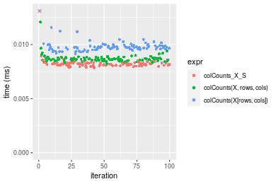

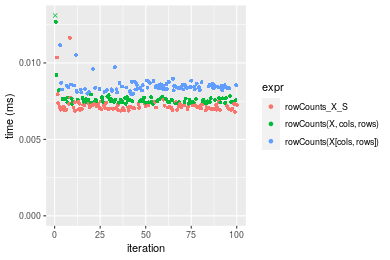
_Table: Benchmarking of colCounts_X_S() and rowCounts_X_S() on logical+10x10 data (original and transposed).  The top panel shows times in milliseconds and the bottom panel shows relative times._


|   |expr          |   min|     lq|     mean| median|     uq|     max|
|:--|:-------------|-----:|------:|--------:|------:|------:|-------:|
|2  |rowCounts_X_S | 6.790| 7.0025|  7.22102|  7.114| 7.2720|  11.651|
|1  |colCounts_X_S | 7.861| 8.0850| 11.56810|  8.181| 8.2945| 339.868|


|   |expr          |      min|       lq|     mean|   median|       uq|      max|
|:--|:-------------|--------:|--------:|--------:|--------:|--------:|--------:|
|2  |rowCounts_X_S | 1.000000| 1.000000| 1.000000| 1.000000| 1.000000|  1.00000|
|1  |colCounts_X_S | 1.157732| 1.154588| 1.602004| 1.149986| 1.140608| 29.17072|

_Figure: Benchmarking of colCounts_X_S() and rowCounts_X_S() on logical+10x10 data (original and transposed).  Outliers are displayed as crosses. Times are in milliseconds._


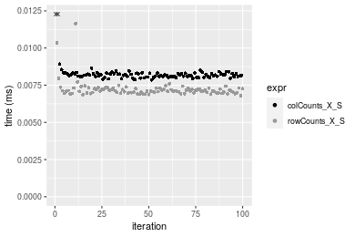

#### 100x100 matrix


```r
> X <- data[["100x100"]]
> rows <- sample.int(nrow(X), size = nrow(X) * 0.7)
> cols <- sample.int(ncol(X), size = ncol(X) * 0.7)
> X_S <- X[rows, cols]
> value <- 42
```


```r
> colStats <- microbenchmark(colCounts_X_S = colCounts(X_S, value = value, na.rm = FALSE), `colCounts(X, rows, cols)` = colCounts(X, 
+     value = value, na.rm = FALSE, rows = rows, cols = cols), `colCounts(X[rows, cols])` = colCounts(X[rows, 
+     cols], value = value, na.rm = FALSE), unit = "ms")
```

```r
> X <- t(X)
> X_S <- t(X_S)
```


```r
> rowStats <- microbenchmark(rowCounts_X_S = rowCounts(X_S, value = value, na.rm = FALSE), `rowCounts(X, cols, rows)` = rowCounts(X, 
+     value = value, na.rm = FALSE, rows = cols, cols = rows), `rowCounts(X[cols, rows])` = rowCounts(X[cols, 
+     rows], value = value, na.rm = FALSE), unit = "ms")
```

_Table: Benchmarking of colCounts_X_S(), colCounts(X, rows, cols)() and colCounts(X[rows, cols])() on logical+100x100 data. The top panel shows times in milliseconds and the bottom panel shows relative times._


|   |expr                     |      min|        lq|      mean|    median|       uq|      max|
|:--|:------------------------|--------:|---------:|---------:|---------:|--------:|--------:|
|2  |colCounts(X, rows, cols) | 0.046103| 0.0498330| 0.0553339| 0.0535885| 0.056785| 0.085855|
|1  |colCounts_X_S            | 0.046855| 0.0496065| 0.0559248| 0.0544480| 0.056445| 0.087820|
|3  |colCounts(X[rows, cols]) | 0.061274| 0.0651130| 0.0717809| 0.0704865| 0.073310| 0.124024|


|   |expr                     |      min|        lq|     mean|   median|        uq|      max|
|:--|:------------------------|--------:|---------:|--------:|--------:|---------:|--------:|
|2  |colCounts(X, rows, cols) | 1.000000| 1.0000000| 1.000000| 1.000000| 1.0000000| 1.000000|
|1  |colCounts_X_S            | 1.016311| 0.9954548| 1.010679| 1.016039| 0.9940125| 1.022887|
|3  |colCounts(X[rows, cols]) | 1.329068| 1.3066241| 1.297232| 1.315329| 1.2910099| 1.444575|

_Table: Benchmarking of rowCounts_X_S(), rowCounts(X, cols, rows)() and rowCounts(X[cols, rows])() on logical+100x100 data (transposed). The top panel shows times in milliseconds and the bottom panel shows relative times._


|   |expr                     |      min|        lq|      mean|    median|       uq|      max|
|:--|:------------------------|--------:|---------:|---------:|---------:|--------:|--------:|
|1  |rowCounts_X_S            | 0.042031| 0.0453435| 0.0486862| 0.0492505| 0.051206| 0.062865|
|2  |rowCounts(X, cols, rows) | 0.047862| 0.0507645| 0.0543945| 0.0538780| 0.056810| 0.101751|
|3  |rowCounts(X[cols, rows]) | 0.055873| 0.0609775| 0.0647972| 0.0643790| 0.068220| 0.083495|


|   |expr                     |      min|       lq|     mean|   median|       uq|      max|
|:--|:------------------------|--------:|--------:|--------:|--------:|--------:|--------:|
|1  |rowCounts_X_S            | 1.000000| 1.000000| 1.000000| 1.000000| 1.000000| 1.000000|
|2  |rowCounts(X, cols, rows) | 1.138731| 1.119554| 1.117246| 1.093958| 1.109440| 1.618564|
|3  |rowCounts(X[cols, rows]) | 1.329328| 1.344790| 1.330914| 1.307174| 1.332266| 1.328164|

_Figure: Benchmarking of colCounts_X_S(), colCounts(X, rows, cols)() and colCounts(X[rows, cols])() on logical+100x100 data  as well as rowCounts_X_S(), rowCounts(X, cols, rows)() and rowCounts(X[cols, rows])() on the same data transposed.  Outliers are displayed as crosses.  Times are in milliseconds._


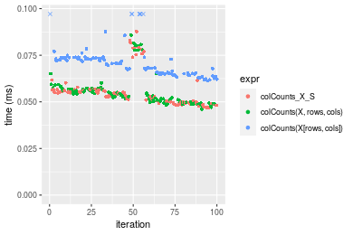

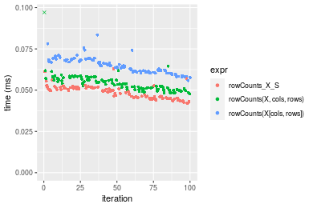
_Table: Benchmarking of colCounts_X_S() and rowCounts_X_S() on logical+100x100 data (original and transposed).  The top panel shows times in milliseconds and the bottom panel shows relative times._


|   |expr          |    min|      lq|     mean|  median|     uq|    max|
|:--|:-------------|------:|-------:|--------:|-------:|------:|------:|
|2  |rowCounts_X_S | 42.031| 45.3435| 48.68624| 49.2505| 51.206| 62.865|
|1  |colCounts_X_S | 46.855| 49.6065| 55.92485| 54.4480| 56.445| 87.820|


|   |expr          |      min|       lq|     mean|   median|       uq|      max|
|:--|:-------------|--------:|--------:|--------:|--------:|--------:|--------:|
|2  |rowCounts_X_S | 1.000000| 1.000000| 1.000000| 1.000000| 1.000000| 1.000000|
|1  |colCounts_X_S | 1.114772| 1.094016| 1.148679| 1.105532| 1.102312| 1.396962|

_Figure: Benchmarking of colCounts_X_S() and rowCounts_X_S() on logical+100x100 data (original and transposed).  Outliers are displayed as crosses. Times are in milliseconds._


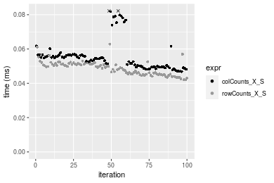

#### 1000x10 matrix


```r
> X <- data[["1000x10"]]
> rows <- sample.int(nrow(X), size = nrow(X) * 0.7)
> cols <- sample.int(ncol(X), size = ncol(X) * 0.7)
> X_S <- X[rows, cols]
> value <- 42
```


```r
> colStats <- microbenchmark(colCounts_X_S = colCounts(X_S, value = value, na.rm = FALSE), `colCounts(X, rows, cols)` = colCounts(X, 
+     value = value, na.rm = FALSE, rows = rows, cols = cols), `colCounts(X[rows, cols])` = colCounts(X[rows, 
+     cols], value = value, na.rm = FALSE), unit = "ms")
```

```r
> X <- t(X)
> X_S <- t(X_S)
```


```r
> rowStats <- microbenchmark(rowCounts_X_S = rowCounts(X_S, value = value, na.rm = FALSE), `rowCounts(X, cols, rows)` = rowCounts(X, 
+     value = value, na.rm = FALSE, rows = cols, cols = rows), `rowCounts(X[cols, rows])` = rowCounts(X[cols, 
+     rows], value = value, na.rm = FALSE), unit = "ms")
```

_Table: Benchmarking of colCounts_X_S(), colCounts(X, rows, cols)() and colCounts(X[rows, cols])() on logical+1000x10 data. The top panel shows times in milliseconds and the bottom panel shows relative times._


|   |expr                     |      min|        lq|      mean|   median|        uq|      max|
|:--|:------------------------|--------:|---------:|---------:|--------:|---------:|--------:|
|1  |colCounts_X_S            | 0.045959| 0.0501845| 0.0520615| 0.052198| 0.0542395| 0.062869|
|2  |colCounts(X, rows, cols) | 0.045529| 0.0494745| 0.0530975| 0.053281| 0.0558440| 0.067862|
|3  |colCounts(X[rows, cols]) | 0.059861| 0.0621925| 0.0680622| 0.067737| 0.0717325| 0.124888|


|   |expr                     |       min|        lq|     mean|   median|       uq|      max|
|:--|:------------------------|---------:|---------:|--------:|--------:|--------:|--------:|
|1  |colCounts_X_S            | 1.0000000| 1.0000000| 1.000000| 1.000000| 1.000000| 1.000000|
|2  |colCounts(X, rows, cols) | 0.9906438| 0.9858522| 1.019900| 1.020748| 1.029582| 1.079419|
|3  |colCounts(X[rows, cols]) | 1.3024870| 1.2392771| 1.307343| 1.297693| 1.322514| 1.986480|

_Table: Benchmarking of rowCounts_X_S(), rowCounts(X, cols, rows)() and rowCounts(X[cols, rows])() on logical+1000x10 data (transposed). The top panel shows times in milliseconds and the bottom panel shows relative times._


|   |expr                     |      min|        lq|      mean|    median|        uq|      max|
|:--|:------------------------|--------:|---------:|---------:|---------:|---------:|--------:|
|1  |rowCounts_X_S            | 0.043776| 0.0460805| 0.0500111| 0.0476390| 0.0527105| 0.083305|
|2  |rowCounts(X, cols, rows) | 0.050551| 0.0556310| 0.0592041| 0.0590905| 0.0624135| 0.072089|
|3  |rowCounts(X[cols, rows]) | 0.059092| 0.0629215| 0.0683959| 0.0673615| 0.0724645| 0.140307|


|   |expr                     |      min|       lq|     mean|   median|       uq|       max|
|:--|:------------------------|--------:|--------:|--------:|--------:|--------:|---------:|
|1  |rowCounts_X_S            | 1.000000| 1.000000| 1.000000| 1.000000| 1.000000| 1.0000000|
|2  |rowCounts(X, cols, rows) | 1.154765| 1.207257| 1.183818| 1.240381| 1.184081| 0.8653622|
|3  |rowCounts(X[cols, rows]) | 1.349872| 1.365469| 1.367614| 1.413999| 1.374764| 1.6842566|

_Figure: Benchmarking of colCounts_X_S(), colCounts(X, rows, cols)() and colCounts(X[rows, cols])() on logical+1000x10 data  as well as rowCounts_X_S(), rowCounts(X, cols, rows)() and rowCounts(X[cols, rows])() on the same data transposed.  Outliers are displayed as crosses.  Times are in milliseconds._


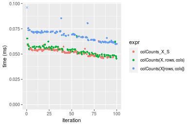

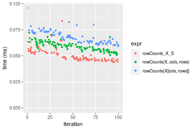
_Table: Benchmarking of colCounts_X_S() and rowCounts_X_S() on logical+1000x10 data (original and transposed).  The top panel shows times in milliseconds and the bottom panel shows relative times._


|   |expr          |    min|      lq|     mean| median|      uq|    max|
|:--|:-------------|------:|-------:|--------:|------:|-------:|------:|
|2  |rowCounts_X_S | 43.776| 46.0805| 50.01115| 47.639| 52.7105| 83.305|
|1  |colCounts_X_S | 45.959| 50.1845| 52.06151| 52.198| 54.2395| 62.869|


|   |expr          |      min|       lq|     mean|   median|       uq|       max|
|:--|:-------------|--------:|--------:|--------:|--------:|--------:|---------:|
|2  |rowCounts_X_S | 1.000000| 1.000000| 1.000000| 1.000000| 1.000000| 1.0000000|
|1  |colCounts_X_S | 1.049867| 1.089061| 1.040998| 1.095699| 1.029008| 0.7546846|

_Figure: Benchmarking of colCounts_X_S() and rowCounts_X_S() on logical+1000x10 data (original and transposed).  Outliers are displayed as crosses. Times are in milliseconds._


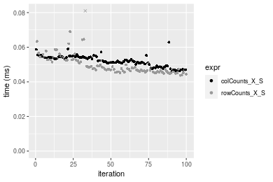

#### 10x1000 matrix


```r
> X <- data[["10x1000"]]
> rows <- sample.int(nrow(X), size = nrow(X) * 0.7)
> cols <- sample.int(ncol(X), size = ncol(X) * 0.7)
> X_S <- X[rows, cols]
> value <- 42
```


```r
> colStats <- microbenchmark(colCounts_X_S = colCounts(X_S, value = value, na.rm = FALSE), `colCounts(X, rows, cols)` = colCounts(X, 
+     value = value, na.rm = FALSE, rows = rows, cols = cols), `colCounts(X[rows, cols])` = colCounts(X[rows, 
+     cols], value = value, na.rm = FALSE), unit = "ms")
```

```r
> X <- t(X)
> X_S <- t(X_S)
```


```r
> rowStats <- microbenchmark(rowCounts_X_S = rowCounts(X_S, value = value, na.rm = FALSE), `rowCounts(X, cols, rows)` = rowCounts(X, 
+     value = value, na.rm = FALSE, rows = cols, cols = rows), `rowCounts(X[cols, rows])` = rowCounts(X[cols, 
+     rows], value = value, na.rm = FALSE), unit = "ms")
```

_Table: Benchmarking of colCounts_X_S(), colCounts(X, rows, cols)() and colCounts(X[rows, cols])() on logical+10x1000 data. The top panel shows times in milliseconds and the bottom panel shows relative times._


|   |expr                     |      min|        lq|      mean|    median|        uq|      max|
|:--|:------------------------|--------:|---------:|---------:|---------:|---------:|--------:|
|1  |colCounts_X_S            | 0.047879| 0.0531215| 0.0569036| 0.0566190| 0.0598395| 0.107495|
|2  |colCounts(X, rows, cols) | 0.052682| 0.0560680| 0.0610084| 0.0594745| 0.0654255| 0.097622|
|3  |colCounts(X[rows, cols]) | 0.063060| 0.0705530| 0.0742625| 0.0740445| 0.0785110| 0.091614|


|   |expr                     |      min|       lq|     mean|   median|       uq|       max|
|:--|:------------------------|--------:|--------:|--------:|--------:|--------:|---------:|
|1  |colCounts_X_S            | 1.000000| 1.000000| 1.000000| 1.000000| 1.000000| 1.0000000|
|2  |colCounts(X, rows, cols) | 1.100315| 1.055467| 1.072136| 1.050434| 1.093350| 0.9081539|
|3  |colCounts(X[rows, cols]) | 1.317070| 1.328144| 1.305057| 1.307768| 1.312026| 0.8522629|

_Table: Benchmarking of rowCounts_X_S(), rowCounts(X, cols, rows)() and rowCounts(X[cols, rows])() on logical+10x1000 data (transposed). The top panel shows times in milliseconds and the bottom panel shows relative times._


|   |expr                     |      min|        lq|      mean|    median|        uq|      max|
|:--|:------------------------|--------:|---------:|---------:|---------:|---------:|--------:|
|1  |rowCounts_X_S            | 0.042457| 0.0453510| 0.0484223| 0.0480365| 0.0507445| 0.071069|
|2  |rowCounts(X, cols, rows) | 0.044221| 0.0502810| 0.0539310| 0.0530740| 0.0569600| 0.107396|
|3  |rowCounts(X[cols, rows]) | 0.056435| 0.0605775| 0.0644457| 0.0640835| 0.0688170| 0.081165|


|   |expr                     |      min|       lq|     mean|   median|       uq|      max|
|:--|:------------------------|--------:|--------:|--------:|--------:|--------:|--------:|
|1  |rowCounts_X_S            | 1.000000| 1.000000| 1.000000| 1.000000| 1.000000| 1.000000|
|2  |rowCounts(X, cols, rows) | 1.041548| 1.108708| 1.113765| 1.104868| 1.122486| 1.511151|
|3  |rowCounts(X[cols, rows]) | 1.329227| 1.335748| 1.330909| 1.334059| 1.356147| 1.142059|

_Figure: Benchmarking of colCounts_X_S(), colCounts(X, rows, cols)() and colCounts(X[rows, cols])() on logical+10x1000 data  as well as rowCounts_X_S(), rowCounts(X, cols, rows)() and rowCounts(X[cols, rows])() on the same data transposed.  Outliers are displayed as crosses.  Times are in milliseconds._


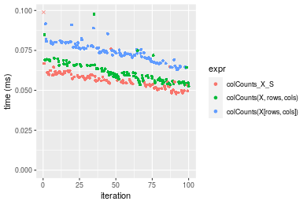

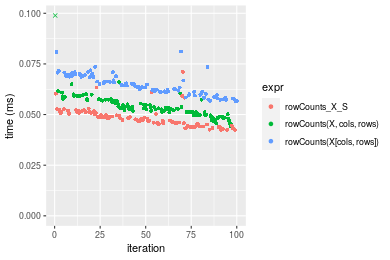
_Table: Benchmarking of colCounts_X_S() and rowCounts_X_S() on logical+10x1000 data (original and transposed).  The top panel shows times in milliseconds and the bottom panel shows relative times._


|   |expr          |    min|      lq|     mean|  median|      uq|     max|
|:--|:-------------|------:|-------:|--------:|-------:|-------:|-------:|
|2  |rowCounts_X_S | 42.457| 45.3510| 48.42229| 48.0365| 50.7445|  71.069|
|1  |colCounts_X_S | 47.879| 53.1215| 56.90362| 56.6190| 59.8395| 107.495|


|   |expr          |      min|       lq|     mean|   median|       uq|      max|
|:--|:-------------|--------:|--------:|--------:|--------:|--------:|--------:|
|2  |rowCounts_X_S | 1.000000| 1.000000| 1.000000| 1.000000| 1.000000| 1.000000|
|1  |colCounts_X_S | 1.127706| 1.171341| 1.175153| 1.178666| 1.179231| 1.512544|

_Figure: Benchmarking of colCounts_X_S() and rowCounts_X_S() on logical+10x1000 data (original and transposed).  Outliers are displayed as crosses. Times are in milliseconds._


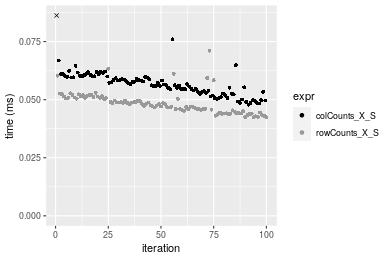

#### 100x1000 matrix


```r
> X <- data[["100x1000"]]
> rows <- sample.int(nrow(X), size = nrow(X) * 0.7)
> cols <- sample.int(ncol(X), size = ncol(X) * 0.7)
> X_S <- X[rows, cols]
> value <- 42
```


```r
> colStats <- microbenchmark(colCounts_X_S = colCounts(X_S, value = value, na.rm = FALSE), `colCounts(X, rows, cols)` = colCounts(X, 
+     value = value, na.rm = FALSE, rows = rows, cols = cols), `colCounts(X[rows, cols])` = colCounts(X[rows, 
+     cols], value = value, na.rm = FALSE), unit = "ms")
```

```r
> X <- t(X)
> X_S <- t(X_S)
```


```r
> rowStats <- microbenchmark(rowCounts_X_S = rowCounts(X_S, value = value, na.rm = FALSE), `rowCounts(X, cols, rows)` = rowCounts(X, 
+     value = value, na.rm = FALSE, rows = cols, cols = rows), `rowCounts(X[cols, rows])` = rowCounts(X[cols, 
+     rows], value = value, na.rm = FALSE), unit = "ms")
```

_Table: Benchmarking of colCounts_X_S(), colCounts(X, rows, cols)() and colCounts(X[rows, cols])() on logical+100x1000 data. The top panel shows times in milliseconds and the bottom panel shows relative times._


|   |expr                     |      min|        lq|      mean|    median|        uq|      max|
|:--|:------------------------|--------:|---------:|---------:|---------:|---------:|--------:|
|1  |colCounts_X_S            | 0.298485| 0.2996055| 0.3339752| 0.3009455| 0.3594510| 0.530982|
|2  |colCounts(X, rows, cols) | 0.299571| 0.3013045| 0.3356421| 0.3037735| 0.3708485| 0.558535|
|3  |colCounts(X[rows, cols]) | 0.390523| 0.3921000| 0.4410802| 0.3957280| 0.4719525| 0.646900|


|   |expr                     |      min|       lq|     mean|   median|       uq|      max|
|:--|:------------------------|--------:|--------:|--------:|--------:|--------:|--------:|
|1  |colCounts_X_S            | 1.000000| 1.000000| 1.000000| 1.000000| 1.000000| 1.000000|
|2  |colCounts(X, rows, cols) | 1.003638| 1.005671| 1.004991| 1.009397| 1.031708| 1.051891|
|3  |colCounts(X[rows, cols]) | 1.308350| 1.308721| 1.320697| 1.314949| 1.312982| 1.218309|

_Table: Benchmarking of rowCounts_X_S(), rowCounts(X, cols, rows)() and rowCounts(X[cols, rows])() on logical+100x1000 data (transposed). The top panel shows times in milliseconds and the bottom panel shows relative times._


|   |expr                     |      min|        lq|      mean|   median|        uq|      max|
|:--|:------------------------|--------:|---------:|---------:|--------:|---------:|--------:|
|1  |rowCounts_X_S            | 0.283070| 0.2850815| 0.3246799| 0.291610| 0.3480445| 0.501973|
|2  |rowCounts(X, cols, rows) | 0.308049| 0.3094795| 0.3364997| 0.310451| 0.3459055| 0.541672|
|3  |rowCounts(X[cols, rows]) | 0.374334| 0.3766000| 0.4194284| 0.379685| 0.4538615| 0.622969|


|   |expr                     |      min|       lq|     mean|  median|        uq|      max|
|:--|:------------------------|--------:|--------:|--------:|-------:|---------:|--------:|
|1  |rowCounts_X_S            | 1.000000| 1.000000| 1.000000| 1.00000| 1.0000000| 1.000000|
|2  |rowCounts(X, cols, rows) | 1.088243| 1.085582| 1.036404| 1.06461| 0.9938542| 1.079086|
|3  |rowCounts(X[cols, rows]) | 1.322408| 1.321026| 1.291821| 1.30203| 1.3040330| 1.241041|

_Figure: Benchmarking of colCounts_X_S(), colCounts(X, rows, cols)() and colCounts(X[rows, cols])() on logical+100x1000 data  as well as rowCounts_X_S(), rowCounts(X, cols, rows)() and rowCounts(X[cols, rows])() on the same data transposed.  Outliers are displayed as crosses.  Times are in milliseconds._


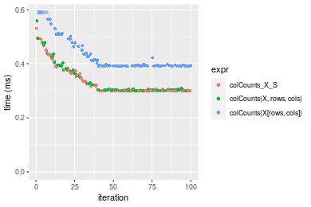

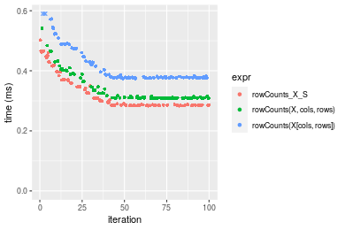
_Table: Benchmarking of colCounts_X_S() and rowCounts_X_S() on logical+100x1000 data (original and transposed).  The top panel shows times in milliseconds and the bottom panel shows relative times._


|   |expr          |     min|       lq|     mean|   median|       uq|     max|
|:--|:-------------|-------:|--------:|--------:|--------:|--------:|-------:|
|2  |rowCounts_X_S | 283.070| 285.0815| 324.6799| 291.6100| 348.0445| 501.973|
|1  |colCounts_X_S | 298.485| 299.6055| 333.9752| 300.9455| 359.4510| 530.982|


|   |expr          |      min|       lq|     mean|   median|       uq|     max|
|:--|:-------------|--------:|--------:|--------:|--------:|--------:|-------:|
|2  |rowCounts_X_S | 1.000000| 1.000000| 1.000000| 1.000000| 1.000000| 1.00000|
|1  |colCounts_X_S | 1.054456| 1.050947| 1.028629| 1.032014| 1.032773| 1.05779|

_Figure: Benchmarking of colCounts_X_S() and rowCounts_X_S() on logical+100x1000 data (original and transposed).  Outliers are displayed as crosses. Times are in milliseconds._


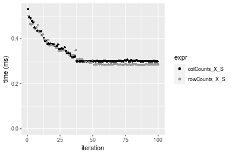

#### 1000x100 matrix


```r
> X <- data[["1000x100"]]
> rows <- sample.int(nrow(X), size = nrow(X) * 0.7)
> cols <- sample.int(ncol(X), size = ncol(X) * 0.7)
> X_S <- X[rows, cols]
> value <- 42
```


```r
> colStats <- microbenchmark(colCounts_X_S = colCounts(X_S, value = value, na.rm = FALSE), `colCounts(X, rows, cols)` = colCounts(X, 
+     value = value, na.rm = FALSE, rows = rows, cols = cols), `colCounts(X[rows, cols])` = colCounts(X[rows, 
+     cols], value = value, na.rm = FALSE), unit = "ms")
```

```r
> X <- t(X)
> X_S <- t(X_S)
```


```r
> rowStats <- microbenchmark(rowCounts_X_S = rowCounts(X_S, value = value, na.rm = FALSE), `rowCounts(X, cols, rows)` = rowCounts(X, 
+     value = value, na.rm = FALSE, rows = cols, cols = rows), `rowCounts(X[cols, rows])` = rowCounts(X[cols, 
+     rows], value = value, na.rm = FALSE), unit = "ms")
```

_Table: Benchmarking of colCounts_X_S(), colCounts(X, rows, cols)() and colCounts(X[rows, cols])() on logical+1000x100 data. The top panel shows times in milliseconds and the bottom panel shows relative times._


|   |expr                     |      min|        lq|      mean|    median|        uq|      max|
|:--|:------------------------|--------:|---------:|---------:|---------:|---------:|--------:|
|1  |colCounts_X_S            | 0.291383| 0.2924520| 0.3234710| 0.2935325| 0.3222405| 0.526776|
|2  |colCounts(X, rows, cols) | 0.291557| 0.2933380| 0.3328575| 0.3009670| 0.3535535| 0.484701|
|3  |colCounts(X[rows, cols]) | 0.383425| 0.3850015| 0.4350638| 0.3935370| 0.4842905| 0.678262|


|   |expr                     |      min|       lq|     mean|   median|       uq|       max|
|:--|:------------------------|--------:|--------:|--------:|--------:|--------:|---------:|
|1  |colCounts_X_S            | 1.000000| 1.000000| 1.000000| 1.000000| 1.000000| 1.0000000|
|2  |colCounts(X, rows, cols) | 1.000597| 1.003030| 1.029018| 1.025328| 1.097173| 0.9201273|
|3  |colCounts(X[rows, cols]) | 1.315880| 1.316461| 1.344985| 1.340693| 1.502885| 1.2875719|

_Table: Benchmarking of rowCounts_X_S(), rowCounts(X, cols, rows)() and rowCounts(X[cols, rows])() on logical+1000x100 data (transposed). The top panel shows times in milliseconds and the bottom panel shows relative times._


|   |expr                     |      min|        lq|      mean|    median|        uq|      max|
|:--|:------------------------|--------:|---------:|---------:|---------:|---------:|--------:|
|1  |rowCounts_X_S            | 0.286594| 0.2891705| 0.3219671| 0.2916335| 0.3501715| 0.481144|
|2  |rowCounts(X, cols, rows) | 0.315138| 0.3168990| 0.3534171| 0.3182890| 0.3746905| 0.604319|
|3  |rowCounts(X[cols, rows]) | 0.378691| 0.3820230| 0.4257085| 0.3867375| 0.4666055| 0.631997|


|   |expr                     |      min|      lq|     mean|   median|       uq|      max|
|:--|:------------------------|--------:|-------:|--------:|--------:|--------:|--------:|
|1  |rowCounts_X_S            | 1.000000| 1.00000| 1.000000| 1.000000| 1.000000| 1.000000|
|2  |rowCounts(X, cols, rows) | 1.099597| 1.09589| 1.097681| 1.091401| 1.070020| 1.256004|
|3  |rowCounts(X[cols, rows]) | 1.321350| 1.32110| 1.322211| 1.326108| 1.332506| 1.313530|

_Figure: Benchmarking of colCounts_X_S(), colCounts(X, rows, cols)() and colCounts(X[rows, cols])() on logical+1000x100 data  as well as rowCounts_X_S(), rowCounts(X, cols, rows)() and rowCounts(X[cols, rows])() on the same data transposed.  Outliers are displayed as crosses.  Times are in milliseconds._


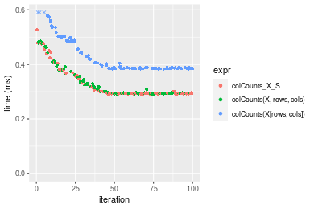

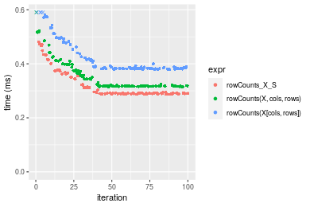
_Table: Benchmarking of colCounts_X_S() and rowCounts_X_S() on logical+1000x100 data (original and transposed).  The top panel shows times in milliseconds and the bottom panel shows relative times._


|   |expr          |     min|       lq|     mean|   median|       uq|     max|
|:--|:-------------|-------:|--------:|--------:|--------:|--------:|-------:|
|2  |rowCounts_X_S | 286.594| 289.1705| 321.9671| 291.6335| 350.1715| 481.144|
|1  |colCounts_X_S | 291.383| 292.4520| 323.4710| 293.5325| 322.2405| 526.776|


|   |expr          |     min|       lq|     mean|   median|        uq|      max|
|:--|:-------------|-------:|--------:|--------:|--------:|---------:|--------:|
|2  |rowCounts_X_S | 1.00000| 1.000000| 1.000000| 1.000000| 1.0000000| 1.000000|
|1  |colCounts_X_S | 1.01671| 1.011348| 1.004671| 1.006512| 0.9202362| 1.094841|

_Figure: Benchmarking of colCounts_X_S() and rowCounts_X_S() on logical+1000x100 data (original and transposed).  Outliers are displayed as crosses. Times are in milliseconds._


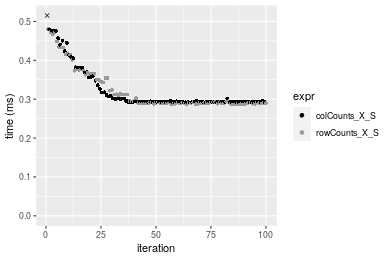


## Data type "integer"

### Data
```r
> rmatrix <- function(nrow, ncol, mode = c("logical", "double", "integer", "index"), range = c(-100, 
+     +100), na_prob = 0) {
+     mode <- match.arg(mode)
+     n <- nrow * ncol
+     if (mode == "logical") {
+         x <- sample(c(FALSE, TRUE), size = n, replace = TRUE)
+     }     else if (mode == "index") {
+         x <- seq_len(n)
+         mode <- "integer"
+     }     else {
+         x <- runif(n, min = range[1], max = range[2])
+     }
+     storage.mode(x) <- mode
+     if (na_prob > 0) 
+         x[sample(n, size = na_prob * n)] <- NA
+     dim(x) <- c(nrow, ncol)
+     x
+ }
> rmatrices <- function(scale = 10, seed = 1, ...) {
+     set.seed(seed)
+     data <- list()
+     data[[1]] <- rmatrix(nrow = scale * 1, ncol = scale * 1, ...)
+     data[[2]] <- rmatrix(nrow = scale * 10, ncol = scale * 10, ...)
+     data[[3]] <- rmatrix(nrow = scale * 100, ncol = scale * 1, ...)
+     data[[4]] <- t(data[[3]])
+     data[[5]] <- rmatrix(nrow = scale * 10, ncol = scale * 100, ...)
+     data[[6]] <- t(data[[5]])
+     names(data) <- sapply(data, FUN = function(x) paste(dim(x), collapse = "x"))
+     data
+ }
> data <- rmatrices(mode = mode)
```

### Results

#### 10x10 matrix


```r
> X <- data[["10x10"]]
> rows <- sample.int(nrow(X), size = nrow(X) * 0.7)
> cols <- sample.int(ncol(X), size = ncol(X) * 0.7)
> X_S <- X[rows, cols]
> value <- 42
```


```r
> colStats <- microbenchmark(colCounts_X_S = colCounts(X_S, value = value, na.rm = FALSE), `colCounts(X, rows, cols)` = colCounts(X, 
+     value = value, na.rm = FALSE, rows = rows, cols = cols), `colCounts(X[rows, cols])` = colCounts(X[rows, 
+     cols], value = value, na.rm = FALSE), unit = "ms")
```

```r
> X <- t(X)
> X_S <- t(X_S)
```


```r
> rowStats <- microbenchmark(rowCounts_X_S = rowCounts(X_S, value = value, na.rm = FALSE), `rowCounts(X, cols, rows)` = rowCounts(X, 
+     value = value, na.rm = FALSE, rows = cols, cols = rows), `rowCounts(X[cols, rows])` = rowCounts(X[cols, 
+     rows], value = value, na.rm = FALSE), unit = "ms")
```

_Table: Benchmarking of colCounts_X_S(), colCounts(X, rows, cols)() and colCounts(X[rows, cols])() on integer+10x10 data. The top panel shows times in milliseconds and the bottom panel shows relative times._


|   |expr                     |      min|        lq|      mean|    median|        uq|      max|
|:--|:------------------------|--------:|---------:|---------:|---------:|---------:|--------:|
|1  |colCounts_X_S            | 0.007935| 0.0082455| 0.0088977| 0.0083860| 0.0084945| 0.050990|
|2  |colCounts(X, rows, cols) | 0.008451| 0.0086965| 0.0088557| 0.0088080| 0.0089420| 0.011728|
|3  |colCounts(X[rows, cols]) | 0.009318| 0.0097190| 0.0100383| 0.0099555| 0.0101355| 0.016553|


|   |expr                     |      min|       lq|      mean|   median|       uq|       max|
|:--|:------------------------|--------:|--------:|---------:|--------:|--------:|---------:|
|1  |colCounts_X_S            | 1.000000| 1.000000| 1.0000000| 1.000000| 1.000000| 1.0000000|
|2  |colCounts(X, rows, cols) | 1.065028| 1.054696| 0.9952808| 1.050322| 1.052681| 0.2300059|
|3  |colCounts(X[rows, cols]) | 1.174291| 1.178703| 1.1281963| 1.187157| 1.193184| 0.3246323|

_Table: Benchmarking of rowCounts_X_S(), rowCounts(X, cols, rows)() and rowCounts(X[cols, rows])() on integer+10x10 data (transposed). The top panel shows times in milliseconds and the bottom panel shows relative times._


|   |expr                     |      min|        lq|      mean|    median|        uq|      max|
|:--|:------------------------|--------:|---------:|---------:|---------:|---------:|--------:|
|1  |rowCounts_X_S            | 0.006826| 0.0069965| 0.0071737| 0.0071190| 0.0072425| 0.010086|
|2  |rowCounts(X, cols, rows) | 0.007208| 0.0073815| 0.0080176| 0.0074885| 0.0076930| 0.048277|
|3  |rowCounts(X[cols, rows]) | 0.008005| 0.0083720| 0.0086312| 0.0085180| 0.0087065| 0.013023|


|   |expr                     |      min|       lq|     mean|   median|       uq|      max|
|:--|:------------------------|--------:|--------:|--------:|--------:|--------:|--------:|
|1  |rowCounts_X_S            | 1.000000| 1.000000| 1.000000| 1.000000| 1.000000| 1.000000|
|2  |rowCounts(X, cols, rows) | 1.055962| 1.055028| 1.117632| 1.051903| 1.062202| 4.786536|
|3  |rowCounts(X[cols, rows]) | 1.172722| 1.196598| 1.203177| 1.196516| 1.202140| 1.291196|

_Figure: Benchmarking of colCounts_X_S(), colCounts(X, rows, cols)() and colCounts(X[rows, cols])() on integer+10x10 data  as well as rowCounts_X_S(), rowCounts(X, cols, rows)() and rowCounts(X[cols, rows])() on the same data transposed.  Outliers are displayed as crosses.  Times are in milliseconds._


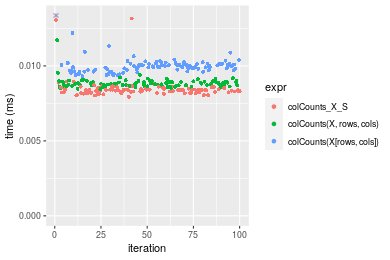

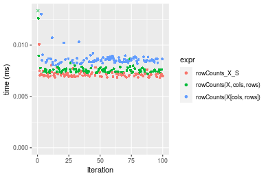
_Table: Benchmarking of colCounts_X_S() and rowCounts_X_S() on integer+10x10 data (original and transposed).  The top panel shows times in milliseconds and the bottom panel shows relative times._


|   |expr          |   min|     lq|    mean| median|     uq|    max|
|:--|:-------------|-----:|------:|-------:|------:|------:|------:|
|2  |rowCounts_X_S | 6.826| 6.9965| 7.17371|  7.119| 7.2425| 10.086|
|1  |colCounts_X_S | 7.935| 8.2455| 8.89768|  8.386| 8.4945| 50.990|


|   |expr          |      min|       lq|     mean|   median|       uq|      max|
|:--|:-------------|--------:|--------:|--------:|--------:|--------:|--------:|
|2  |rowCounts_X_S | 1.000000| 1.000000| 1.000000| 1.000000| 1.000000| 1.000000|
|1  |colCounts_X_S | 1.162467| 1.178518| 1.240318| 1.177974| 1.172869| 5.055523|

_Figure: Benchmarking of colCounts_X_S() and rowCounts_X_S() on integer+10x10 data (original and transposed).  Outliers are displayed as crosses. Times are in milliseconds._


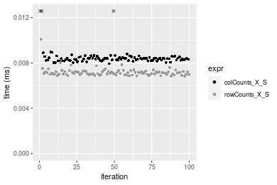

#### 100x100 matrix


```r
> X <- data[["100x100"]]
> rows <- sample.int(nrow(X), size = nrow(X) * 0.7)
> cols <- sample.int(ncol(X), size = ncol(X) * 0.7)
> X_S <- X[rows, cols]
> value <- 42
```


```r
> colStats <- microbenchmark(colCounts_X_S = colCounts(X_S, value = value, na.rm = FALSE), `colCounts(X, rows, cols)` = colCounts(X, 
+     value = value, na.rm = FALSE, rows = rows, cols = cols), `colCounts(X[rows, cols])` = colCounts(X[rows, 
+     cols], value = value, na.rm = FALSE), unit = "ms")
```

```r
> X <- t(X)
> X_S <- t(X_S)
```


```r
> rowStats <- microbenchmark(rowCounts_X_S = rowCounts(X_S, value = value, na.rm = FALSE), `rowCounts(X, cols, rows)` = rowCounts(X, 
+     value = value, na.rm = FALSE, rows = cols, cols = rows), `rowCounts(X[cols, rows])` = rowCounts(X[cols, 
+     rows], value = value, na.rm = FALSE), unit = "ms")
```

_Table: Benchmarking of colCounts_X_S(), colCounts(X, rows, cols)() and colCounts(X[rows, cols])() on integer+100x100 data. The top panel shows times in milliseconds and the bottom panel shows relative times._


|   |expr                     |      min|        lq|      mean|    median|       uq|      max|
|:--|:------------------------|--------:|---------:|---------:|---------:|--------:|--------:|
|2  |colCounts(X, rows, cols) | 0.026692| 0.0280625| 0.0292683| 0.0287570| 0.030393| 0.044949|
|1  |colCounts_X_S            | 0.029141| 0.0305555| 0.0318885| 0.0318105| 0.033061| 0.045509|
|3  |colCounts(X[rows, cols]) | 0.040022| 0.0416785| 0.0441608| 0.0433700| 0.045669| 0.106045|


|   |expr                     |      min|       lq|     mean|   median|       uq|      max|
|:--|:------------------------|--------:|--------:|--------:|--------:|--------:|--------:|
|2  |colCounts(X, rows, cols) | 1.000000| 1.000000| 1.000000| 1.000000| 1.000000| 1.000000|
|1  |colCounts_X_S            | 1.091750| 1.088837| 1.089525| 1.106183| 1.087783| 1.012459|
|3  |colCounts(X[rows, cols]) | 1.499401| 1.485203| 1.508830| 1.508155| 1.502616| 2.359229|

_Table: Benchmarking of rowCounts_X_S(), rowCounts(X, cols, rows)() and rowCounts(X[cols, rows])() on integer+100x100 data (transposed). The top panel shows times in milliseconds and the bottom panel shows relative times._


|   |expr                     |      min|        lq|      mean|    median|        uq|      max|
|:--|:------------------------|--------:|---------:|---------:|---------:|---------:|--------:|
|1  |rowCounts_X_S            | 0.022066| 0.0237195| 0.0251630| 0.0242375| 0.0249070| 0.046011|
|2  |rowCounts(X, cols, rows) | 0.023473| 0.0252140| 0.0276956| 0.0254965| 0.0265005| 0.074319|
|3  |rowCounts(X[cols, rows]) | 0.032393| 0.0348880| 0.0380130| 0.0357730| 0.0373220| 0.068968|


|   |expr                     |      min|       lq|     mean|   median|       uq|      max|
|:--|:------------------------|--------:|--------:|--------:|--------:|--------:|--------:|
|1  |rowCounts_X_S            | 1.000000| 1.000000| 1.000000| 1.000000| 1.000000| 1.000000|
|2  |rowCounts(X, cols, rows) | 1.063763| 1.063007| 1.100648| 1.051944| 1.063978| 1.615244|
|3  |rowCounts(X[cols, rows]) | 1.468005| 1.470857| 1.510668| 1.475936| 1.498454| 1.498946|

_Figure: Benchmarking of colCounts_X_S(), colCounts(X, rows, cols)() and colCounts(X[rows, cols])() on integer+100x100 data  as well as rowCounts_X_S(), rowCounts(X, cols, rows)() and rowCounts(X[cols, rows])() on the same data transposed.  Outliers are displayed as crosses.  Times are in milliseconds._


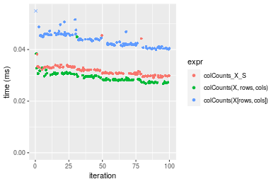

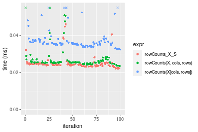
_Table: Benchmarking of colCounts_X_S() and rowCounts_X_S() on integer+100x100 data (original and transposed).  The top panel shows times in milliseconds and the bottom panel shows relative times._


|   |expr          |    min|      lq|     mean|  median|     uq|    max|
|:--|:-------------|------:|-------:|--------:|-------:|------:|------:|
|2  |rowCounts_X_S | 22.066| 23.7195| 25.16304| 24.2375| 24.907| 46.011|
|1  |colCounts_X_S | 29.141| 30.5555| 31.88851| 31.8105| 33.061| 45.509|


|   |expr          |      min|       lq|     mean|  median|       uq|       max|
|:--|:-------------|--------:|--------:|--------:|-------:|--------:|---------:|
|2  |rowCounts_X_S | 1.000000| 1.000000| 1.000000| 1.00000| 1.000000| 1.0000000|
|1  |colCounts_X_S | 1.320629| 1.288202| 1.267276| 1.31245| 1.327378| 0.9890896|

_Figure: Benchmarking of colCounts_X_S() and rowCounts_X_S() on integer+100x100 data (original and transposed).  Outliers are displayed as crosses. Times are in milliseconds._


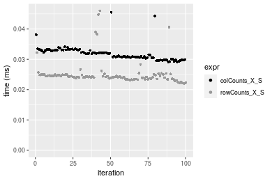

#### 1000x10 matrix


```r
> X <- data[["1000x10"]]
> rows <- sample.int(nrow(X), size = nrow(X) * 0.7)
> cols <- sample.int(ncol(X), size = ncol(X) * 0.7)
> X_S <- X[rows, cols]
> value <- 42
```


```r
> colStats <- microbenchmark(colCounts_X_S = colCounts(X_S, value = value, na.rm = FALSE), `colCounts(X, rows, cols)` = colCounts(X, 
+     value = value, na.rm = FALSE, rows = rows, cols = cols), `colCounts(X[rows, cols])` = colCounts(X[rows, 
+     cols], value = value, na.rm = FALSE), unit = "ms")
```

```r
> X <- t(X)
> X_S <- t(X_S)
```


```r
> rowStats <- microbenchmark(rowCounts_X_S = rowCounts(X_S, value = value, na.rm = FALSE), `rowCounts(X, cols, rows)` = rowCounts(X, 
+     value = value, na.rm = FALSE, rows = cols, cols = rows), `rowCounts(X[cols, rows])` = rowCounts(X[cols, 
+     rows], value = value, na.rm = FALSE), unit = "ms")
```

_Table: Benchmarking of colCounts_X_S(), colCounts(X, rows, cols)() and colCounts(X[rows, cols])() on integer+1000x10 data. The top panel shows times in milliseconds and the bottom panel shows relative times._


|   |expr                     |      min|       lq|      mean|    median|        uq|      max|
|:--|:------------------------|--------:|--------:|---------:|---------:|---------:|--------:|
|2  |colCounts(X, rows, cols) | 0.027454| 0.028800| 0.0304023| 0.0299545| 0.0313025| 0.043183|
|1  |colCounts_X_S            | 0.027870| 0.029747| 0.0309909| 0.0313055| 0.0316895| 0.045871|
|3  |colCounts(X[rows, cols]) | 0.039156| 0.041092| 0.0434713| 0.0428355| 0.0446275| 0.099119|


|   |expr                     |      min|       lq|     mean|   median|       uq|      max|
|:--|:------------------------|--------:|--------:|--------:|--------:|--------:|--------:|
|2  |colCounts(X, rows, cols) | 1.000000| 1.000000| 1.000000| 1.000000| 1.000000| 1.000000|
|1  |colCounts_X_S            | 1.015153| 1.032882| 1.019361| 1.045102| 1.012363| 1.062247|
|3  |colCounts(X[rows, cols]) | 1.426240| 1.426806| 1.429870| 1.430019| 1.425685| 2.295324|

_Table: Benchmarking of rowCounts_X_S(), rowCounts(X, cols, rows)() and rowCounts(X[cols, rows])() on integer+1000x10 data (transposed). The top panel shows times in milliseconds and the bottom panel shows relative times._


|   |expr                     |      min|        lq|      mean|    median|        uq|      max|
|:--|:------------------------|--------:|---------:|---------:|---------:|---------:|--------:|
|1  |rowCounts_X_S            | 0.026430| 0.0267475| 0.0297994| 0.0271785| 0.0278660| 0.075157|
|2  |rowCounts(X, cols, rows) | 0.029471| 0.0301460| 0.0349535| 0.0312645| 0.0339875| 0.070251|
|3  |rowCounts(X[cols, rows]) | 0.040792| 0.0415505| 0.0469084| 0.0423595| 0.0476420| 0.101546|


|   |expr                     |      min|       lq|     mean|   median|       uq|       max|
|:--|:------------------------|--------:|--------:|--------:|--------:|--------:|---------:|
|1  |rowCounts_X_S            | 1.000000| 1.000000| 1.000000| 1.000000| 1.000000| 1.0000000|
|2  |rowCounts(X, cols, rows) | 1.115059| 1.127059| 1.172960| 1.150339| 1.219676| 0.9347233|
|3  |rowCounts(X[cols, rows]) | 1.543398| 1.553435| 1.574139| 1.558566| 1.709682| 1.3511183|

_Figure: Benchmarking of colCounts_X_S(), colCounts(X, rows, cols)() and colCounts(X[rows, cols])() on integer+1000x10 data  as well as rowCounts_X_S(), rowCounts(X, cols, rows)() and rowCounts(X[cols, rows])() on the same data transposed.  Outliers are displayed as crosses.  Times are in milliseconds._


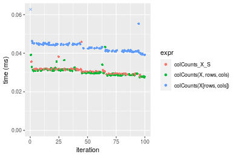

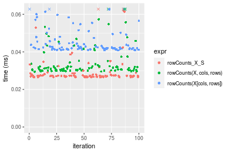
_Table: Benchmarking of colCounts_X_S() and rowCounts_X_S() on integer+1000x10 data (original and transposed).  The top panel shows times in milliseconds and the bottom panel shows relative times._


|   |expr          |   min|      lq|     mean|  median|      uq|    max|
|:--|:-------------|-----:|-------:|--------:|-------:|-------:|------:|
|2  |rowCounts_X_S | 26.43| 26.7475| 29.79937| 27.1785| 27.8660| 75.157|
|1  |colCounts_X_S | 27.87| 29.7470| 30.99093| 31.3055| 31.6895| 45.871|


|   |expr          |      min|       lq|     mean|   median|      uq|       max|
|:--|:-------------|--------:|--------:|--------:|--------:|-------:|---------:|
|2  |rowCounts_X_S | 1.000000| 1.000000| 1.000000| 1.000000| 1.00000| 1.0000000|
|1  |colCounts_X_S | 1.054483| 1.112141| 1.039986| 1.151848| 1.13721| 0.6103357|

_Figure: Benchmarking of colCounts_X_S() and rowCounts_X_S() on integer+1000x10 data (original and transposed).  Outliers are displayed as crosses. Times are in milliseconds._


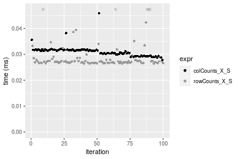

#### 10x1000 matrix


```r
> X <- data[["10x1000"]]
> rows <- sample.int(nrow(X), size = nrow(X) * 0.7)
> cols <- sample.int(ncol(X), size = ncol(X) * 0.7)
> X_S <- X[rows, cols]
> value <- 42
```


```r
> colStats <- microbenchmark(colCounts_X_S = colCounts(X_S, value = value, na.rm = FALSE), `colCounts(X, rows, cols)` = colCounts(X, 
+     value = value, na.rm = FALSE, rows = rows, cols = cols), `colCounts(X[rows, cols])` = colCounts(X[rows, 
+     cols], value = value, na.rm = FALSE), unit = "ms")
```

```r
> X <- t(X)
> X_S <- t(X_S)
```


```r
> rowStats <- microbenchmark(rowCounts_X_S = rowCounts(X_S, value = value, na.rm = FALSE), `rowCounts(X, cols, rows)` = rowCounts(X, 
+     value = value, na.rm = FALSE, rows = cols, cols = rows), `rowCounts(X[cols, rows])` = rowCounts(X[cols, 
+     rows], value = value, na.rm = FALSE), unit = "ms")
```

_Table: Benchmarking of colCounts_X_S(), colCounts(X, rows, cols)() and colCounts(X[rows, cols])() on integer+10x1000 data. The top panel shows times in milliseconds and the bottom panel shows relative times._


|   |expr                     |      min|        lq|      mean|    median|        uq|      max|
|:--|:------------------------|--------:|---------:|---------:|---------:|---------:|--------:|
|2  |colCounts(X, rows, cols) | 0.030790| 0.0317475| 0.0331242| 0.0328270| 0.0340955| 0.050668|
|1  |colCounts_X_S            | 0.032081| 0.0333615| 0.0353125| 0.0350675| 0.0364430| 0.078019|
|3  |colCounts(X[rows, cols]) | 0.045466| 0.0477120| 0.0499071| 0.0495685| 0.0515210| 0.064295|


|   |expr                     |      min|       lq|     mean|   median|       uq|      max|
|:--|:------------------------|--------:|--------:|--------:|--------:|--------:|--------:|
|2  |colCounts(X, rows, cols) | 1.000000| 1.000000| 1.000000| 1.000000| 1.000000| 1.000000|
|1  |colCounts_X_S            | 1.041929| 1.050839| 1.066062| 1.068252| 1.068851| 1.539808|
|3  |colCounts(X[rows, cols]) | 1.476648| 1.502859| 1.506663| 1.509992| 1.511079| 1.268947|

_Table: Benchmarking of rowCounts_X_S(), rowCounts(X, cols, rows)() and rowCounts(X[cols, rows])() on integer+10x1000 data (transposed). The top panel shows times in milliseconds and the bottom panel shows relative times._


|   |expr                     |      min|        lq|      mean|    median|        uq|      max|
|:--|:------------------------|--------:|---------:|---------:|---------:|---------:|--------:|
|1  |rowCounts_X_S            | 0.023672| 0.0253500| 0.0258507| 0.0256975| 0.0258715| 0.039292|
|2  |rowCounts(X, cols, rows) | 0.026869| 0.0276940| 0.0289910| 0.0284665| 0.0286935| 0.081112|
|3  |rowCounts(X[cols, rows]) | 0.035510| 0.0378125| 0.0387588| 0.0385730| 0.0389335| 0.053797|


|   |expr                     |      min|       lq|     mean|   median|       uq|      max|
|:--|:------------------------|--------:|--------:|--------:|--------:|--------:|--------:|
|1  |rowCounts_X_S            | 1.000000| 1.000000| 1.000000| 1.000000| 1.000000| 1.000000|
|2  |rowCounts(X, cols, rows) | 1.135054| 1.092466| 1.121477| 1.107754| 1.109078| 2.064339|
|3  |rowCounts(X[cols, rows]) | 1.500085| 1.491617| 1.499332| 1.501041| 1.504880| 1.369159|

_Figure: Benchmarking of colCounts_X_S(), colCounts(X, rows, cols)() and colCounts(X[rows, cols])() on integer+10x1000 data  as well as rowCounts_X_S(), rowCounts(X, cols, rows)() and rowCounts(X[cols, rows])() on the same data transposed.  Outliers are displayed as crosses.  Times are in milliseconds._


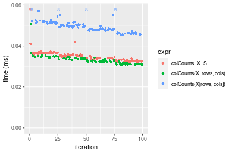

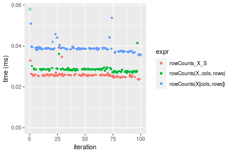
_Table: Benchmarking of colCounts_X_S() and rowCounts_X_S() on integer+10x1000 data (original and transposed).  The top panel shows times in milliseconds and the bottom panel shows relative times._


|   |expr          |    min|      lq|     mean|  median|      uq|    max|
|:--|:-------------|------:|-------:|--------:|-------:|-------:|------:|
|2  |rowCounts_X_S | 23.672| 25.3500| 25.85075| 25.6975| 25.8715| 39.292|
|1  |colCounts_X_S | 32.081| 33.3615| 35.31249| 35.0675| 36.4430| 78.019|


|   |expr          |     min|       lq|     mean|   median|       uq|      max|
|:--|:-------------|-------:|--------:|--------:|--------:|--------:|--------:|
|2  |rowCounts_X_S | 1.00000| 1.000000| 1.000000| 1.000000| 1.000000| 1.000000|
|1  |colCounts_X_S | 1.35523| 1.316035| 1.366014| 1.364627| 1.408616| 1.985621|

_Figure: Benchmarking of colCounts_X_S() and rowCounts_X_S() on integer+10x1000 data (original and transposed).  Outliers are displayed as crosses. Times are in milliseconds._


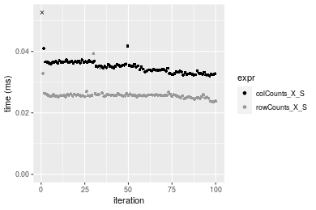

#### 100x1000 matrix


```r
> X <- data[["100x1000"]]
> rows <- sample.int(nrow(X), size = nrow(X) * 0.7)
> cols <- sample.int(ncol(X), size = ncol(X) * 0.7)
> X_S <- X[rows, cols]
> value <- 42
```


```r
> colStats <- microbenchmark(colCounts_X_S = colCounts(X_S, value = value, na.rm = FALSE), `colCounts(X, rows, cols)` = colCounts(X, 
+     value = value, na.rm = FALSE, rows = rows, cols = cols), `colCounts(X[rows, cols])` = colCounts(X[rows, 
+     cols], value = value, na.rm = FALSE), unit = "ms")
```

```r
> X <- t(X)
> X_S <- t(X_S)
```


```r
> rowStats <- microbenchmark(rowCounts_X_S = rowCounts(X_S, value = value, na.rm = FALSE), `rowCounts(X, cols, rows)` = rowCounts(X, 
+     value = value, na.rm = FALSE, rows = cols, cols = rows), `rowCounts(X[cols, rows])` = rowCounts(X[cols, 
+     rows], value = value, na.rm = FALSE), unit = "ms")
```

_Table: Benchmarking of colCounts_X_S(), colCounts(X, rows, cols)() and colCounts(X[rows, cols])() on integer+100x1000 data. The top panel shows times in milliseconds and the bottom panel shows relative times._


|   |expr                     |      min|        lq|      mean|    median|        uq|      max|
|:--|:------------------------|--------:|---------:|---------:|---------:|---------:|--------:|
|2  |colCounts(X, rows, cols) | 0.131224| 0.1425110| 0.1637071| 0.1606255| 0.1747210| 0.277656|
|1  |colCounts_X_S            | 0.154590| 0.1678500| 0.1918588| 0.1887955| 0.2040050| 0.293703|
|3  |colCounts(X[rows, cols]) | 0.221437| 0.2460625| 0.2817724| 0.2786320| 0.3082485| 0.370760|


|   |expr                     |      min|       lq|     mean|   median|       uq|      max|
|:--|:------------------------|--------:|--------:|--------:|--------:|--------:|--------:|
|2  |colCounts(X, rows, cols) | 1.000000| 1.000000| 1.000000| 1.000000| 1.000000| 1.000000|
|1  |colCounts_X_S            | 1.178062| 1.177804| 1.171963| 1.175377| 1.167604| 1.057794|
|3  |colCounts(X[rows, cols]) | 1.687473| 1.726621| 1.721198| 1.734668| 1.764233| 1.335321|

_Table: Benchmarking of rowCounts_X_S(), rowCounts(X, cols, rows)() and rowCounts(X[cols, rows])() on integer+100x1000 data (transposed). The top panel shows times in milliseconds and the bottom panel shows relative times._


|   |expr                     |      min|        lq|      mean|    median|        uq|      max|
|:--|:------------------------|--------:|---------:|---------:|---------:|---------:|--------:|
|2  |rowCounts(X, cols, rows) | 0.115860| 0.1252180| 0.1403696| 0.1370920| 0.1498630| 0.227246|
|1  |rowCounts_X_S            | 0.113468| 0.1332585| 0.1471171| 0.1458795| 0.1620725| 0.222371|
|3  |rowCounts(X[cols, rows]) | 0.180713| 0.2020355| 0.2273156| 0.2222070| 0.2457760| 0.298786|


|   |expr                     |       min|       lq|     mean|   median|       uq|       max|
|:--|:------------------------|---------:|--------:|--------:|--------:|--------:|---------:|
|2  |rowCounts(X, cols, rows) | 1.0000000| 1.000000| 1.000000| 1.000000| 1.000000| 1.0000000|
|1  |rowCounts_X_S            | 0.9793544| 1.064212| 1.048069| 1.064099| 1.081471| 0.9785475|
|3  |rowCounts(X[cols, rows]) | 1.5597532| 1.613470| 1.619407| 1.620860| 1.640005| 1.3148130|

_Figure: Benchmarking of colCounts_X_S(), colCounts(X, rows, cols)() and colCounts(X[rows, cols])() on integer+100x1000 data  as well as rowCounts_X_S(), rowCounts(X, cols, rows)() and rowCounts(X[cols, rows])() on the same data transposed.  Outliers are displayed as crosses.  Times are in milliseconds._


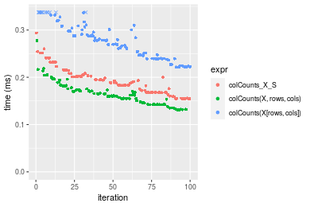

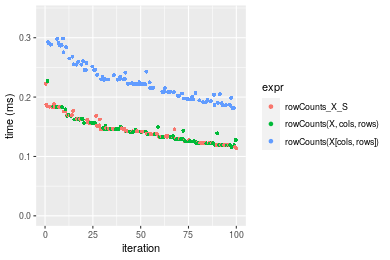
_Table: Benchmarking of colCounts_X_S() and rowCounts_X_S() on integer+100x1000 data (original and transposed).  The top panel shows times in milliseconds and the bottom panel shows relative times._


|   |expr          |     min|       lq|     mean|   median|       uq|     max|
|:--|:-------------|-------:|--------:|--------:|--------:|--------:|-------:|
|2  |rowCounts_X_S | 113.468| 133.2585| 147.1171| 145.8795| 162.0725| 222.371|
|1  |colCounts_X_S | 154.590| 167.8500| 191.8587| 188.7955| 204.0050| 293.703|


|   |expr          |     min|       lq|     mean|   median|       uq|      max|
|:--|:-------------|-------:|--------:|--------:|--------:|--------:|--------:|
|2  |rowCounts_X_S | 1.00000| 1.000000| 1.000000| 1.000000| 1.000000| 1.000000|
|1  |colCounts_X_S | 1.36241| 1.259582| 1.304123| 1.294188| 1.258727| 1.320779|

_Figure: Benchmarking of colCounts_X_S() and rowCounts_X_S() on integer+100x1000 data (original and transposed).  Outliers are displayed as crosses. Times are in milliseconds._


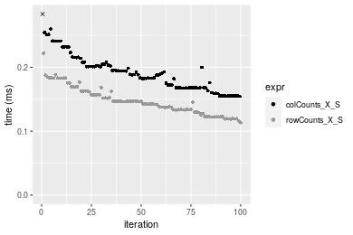

#### 1000x100 matrix


```r
> X <- data[["1000x100"]]
> rows <- sample.int(nrow(X), size = nrow(X) * 0.7)
> cols <- sample.int(ncol(X), size = ncol(X) * 0.7)
> X_S <- X[rows, cols]
> value <- 42
```


```r
> colStats <- microbenchmark(colCounts_X_S = colCounts(X_S, value = value, na.rm = FALSE), `colCounts(X, rows, cols)` = colCounts(X, 
+     value = value, na.rm = FALSE, rows = rows, cols = cols), `colCounts(X[rows, cols])` = colCounts(X[rows, 
+     cols], value = value, na.rm = FALSE), unit = "ms")
```

```r
> X <- t(X)
> X_S <- t(X_S)
```


```r
> rowStats <- microbenchmark(rowCounts_X_S = rowCounts(X_S, value = value, na.rm = FALSE), `rowCounts(X, cols, rows)` = rowCounts(X, 
+     value = value, na.rm = FALSE, rows = cols, cols = rows), `rowCounts(X[cols, rows])` = rowCounts(X[cols, 
+     rows], value = value, na.rm = FALSE), unit = "ms")
```

_Table: Benchmarking of colCounts_X_S(), colCounts(X, rows, cols)() and colCounts(X[rows, cols])() on integer+1000x100 data. The top panel shows times in milliseconds and the bottom panel shows relative times._


|   |expr                     |      min|        lq|      mean|    median|        uq|      max|
|:--|:------------------------|--------:|---------:|---------:|---------:|---------:|--------:|
|2  |colCounts(X, rows, cols) | 0.125200| 0.1359420| 0.1580321| 0.1578650| 0.1684815| 0.215864|
|1  |colCounts_X_S            | 0.147378| 0.1578085| 0.1820205| 0.1749135| 0.1922670| 0.279674|
|3  |colCounts(X[rows, cols]) | 0.211187| 0.2287370| 0.2672602| 0.2637755| 0.2949215| 0.400076|


|   |expr                     |      min|       lq|     mean|   median|       uq|      max|
|:--|:------------------------|--------:|--------:|--------:|--------:|--------:|--------:|
|2  |colCounts(X, rows, cols) | 1.000000| 1.000000| 1.000000| 1.000000| 1.000000| 1.000000|
|1  |colCounts_X_S            | 1.177141| 1.160852| 1.151795| 1.107994| 1.141176| 1.295603|
|3  |colCounts(X[rows, cols]) | 1.686797| 1.682607| 1.691177| 1.670893| 1.750468| 1.853371|

_Table: Benchmarking of rowCounts_X_S(), rowCounts(X, cols, rows)() and rowCounts(X[cols, rows])() on integer+1000x100 data (transposed). The top panel shows times in milliseconds and the bottom panel shows relative times._


|   |expr                     |      min|        lq|      mean|    median|        uq|      max|
|:--|:------------------------|--------:|---------:|---------:|---------:|---------:|--------:|
|1  |rowCounts_X_S            | 0.117146| 0.1287240| 0.1489846| 0.1472150| 0.1634295| 0.201448|
|2  |rowCounts(X, cols, rows) | 0.119126| 0.1363395| 0.1550906| 0.1500535| 0.1663200| 0.313826|
|3  |rowCounts(X[cols, rows]) | 0.183672| 0.2050615| 0.2351304| 0.2249520| 0.2611940| 0.368807|


|   |expr                     |      min|       lq|     mean|   median|       uq|      max|
|:--|:------------------------|--------:|--------:|--------:|--------:|--------:|--------:|
|1  |rowCounts_X_S            | 1.000000| 1.000000| 1.000000| 1.000000| 1.000000| 1.000000|
|2  |rowCounts(X, cols, rows) | 1.016902| 1.059162| 1.040984| 1.019281| 1.017686| 1.557851|
|3  |rowCounts(X[cols, rows]) | 1.567890| 1.593032| 1.578219| 1.528051| 1.598206| 1.830780|

_Figure: Benchmarking of colCounts_X_S(), colCounts(X, rows, cols)() and colCounts(X[rows, cols])() on integer+1000x100 data  as well as rowCounts_X_S(), rowCounts(X, cols, rows)() and rowCounts(X[cols, rows])() on the same data transposed.  Outliers are displayed as crosses.  Times are in milliseconds._


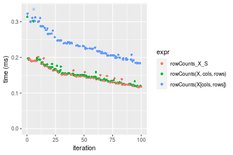
_Table: Benchmarking of colCounts_X_S() and rowCounts_X_S() on integer+1000x100 data (original and transposed).  The top panel shows times in milliseconds and the bottom panel shows relative times._


|   |expr          |     min|       lq|     mean|   median|       uq|     max|
|:--|:-------------|-------:|--------:|--------:|--------:|--------:|-------:|
|2  |rowCounts_X_S | 117.146| 128.7240| 148.9846| 147.2150| 163.4295| 201.448|
|1  |colCounts_X_S | 147.378| 157.8085| 182.0205| 174.9135| 192.2670| 279.674|


|   |expr          |      min|       lq|    mean|  median|       uq|      max|
|:--|:-------------|--------:|--------:|-------:|-------:|--------:|--------:|
|2  |rowCounts_X_S | 1.000000| 1.000000| 1.00000| 1.00000| 1.000000| 1.000000|
|1  |colCounts_X_S | 1.258071| 1.225945| 1.22174| 1.18815| 1.176452| 1.388319|

_Figure: Benchmarking of colCounts_X_S() and rowCounts_X_S() on integer+1000x100 data (original and transposed).  Outliers are displayed as crosses. Times are in milliseconds._


## Data type "double"

### Data
```r
> rmatrix <- function(nrow, ncol, mode = c("logical", "double", "integer", "index"), range = c(-100, 
+     +100), na_prob = 0) {
+     mode <- match.arg(mode)
+     n <- nrow * ncol
+     if (mode == "logical") {
+         x <- sample(c(FALSE, TRUE), size = n, replace = TRUE)
+     }     else if (mode == "index") {
+         x <- seq_len(n)
+         mode <- "integer"
+     }     else {
+         x <- runif(n, min = range[1], max = range[2])
+     }
+     storage.mode(x) <- mode
+     if (na_prob > 0) 
+         x[sample(n, size = na_prob * n)] <- NA
+     dim(x) <- c(nrow, ncol)
+     x
+ }
> rmatrices <- function(scale = 10, seed = 1, ...) {
+     set.seed(seed)
+     data <- list()
+     data[[1]] <- rmatrix(nrow = scale * 1, ncol = scale * 1, ...)
+     data[[2]] <- rmatrix(nrow = scale * 10, ncol = scale * 10, ...)
+     data[[3]] <- rmatrix(nrow = scale * 100, ncol = scale * 1, ...)
+     data[[4]] <- t(data[[3]])
+     data[[5]] <- rmatrix(nrow = scale * 10, ncol = scale * 100, ...)
+     data[[6]] <- t(data[[5]])
+     names(data) <- sapply(data, FUN = function(x) paste(dim(x), collapse = "x"))
+     data
+ }
> data <- rmatrices(mode = mode)
```

### Results

#### 10x10 matrix


```r
> X <- data[["10x10"]]
> rows <- sample.int(nrow(X), size = nrow(X) * 0.7)
> cols <- sample.int(ncol(X), size = ncol(X) * 0.7)
> X_S <- X[rows, cols]
> value <- 42
```


```r
> colStats <- microbenchmark(colCounts_X_S = colCounts(X_S, value = value, na.rm = FALSE), `colCounts(X, rows, cols)` = colCounts(X, 
+     value = value, na.rm = FALSE, rows = rows, cols = cols), `colCounts(X[rows, cols])` = colCounts(X[rows, 
+     cols], value = value, na.rm = FALSE), unit = "ms")
```

```r
> X <- t(X)
> X_S <- t(X_S)
```


```r
> rowStats <- microbenchmark(rowCounts_X_S = rowCounts(X_S, value = value, na.rm = FALSE), `rowCounts(X, cols, rows)` = rowCounts(X, 
+     value = value, na.rm = FALSE, rows = cols, cols = rows), `rowCounts(X[cols, rows])` = rowCounts(X[cols, 
+     rows], value = value, na.rm = FALSE), unit = "ms")
```

_Table: Benchmarking of colCounts_X_S(), colCounts(X, rows, cols)() and colCounts(X[rows, cols])() on double+10x10 data. The top panel shows times in milliseconds and the bottom panel shows relative times._


|   |expr                     |      min|        lq|      mean|    median|        uq|      max|
|:--|:------------------------|--------:|---------:|---------:|---------:|---------:|--------:|
|1  |colCounts_X_S            | 0.007918| 0.0081075| 0.0086928| 0.0082430| 0.0083740| 0.047964|
|2  |colCounts(X, rows, cols) | 0.008236| 0.0085070| 0.0086676| 0.0085965| 0.0087815| 0.011631|
|3  |colCounts(X[rows, cols]) | 0.009290| 0.0096635| 0.0099269| 0.0098130| 0.0100165| 0.015073|


|   |expr                     |      min|       lq|      mean|   median|       uq|       max|
|:--|:------------------------|--------:|--------:|---------:|--------:|--------:|---------:|
|1  |colCounts_X_S            | 1.000000| 1.000000| 1.0000000| 1.000000| 1.000000| 1.0000000|
|2  |colCounts(X, rows, cols) | 1.040162| 1.049275| 0.9970907| 1.042885| 1.048663| 0.2424944|
|3  |colCounts(X[rows, cols]) | 1.173276| 1.191921| 1.1419582| 1.190465| 1.196143| 0.3142565|

_Table: Benchmarking of rowCounts_X_S(), rowCounts(X, cols, rows)() and rowCounts(X[cols, rows])() on double+10x10 data (transposed). The top panel shows times in milliseconds and the bottom panel shows relative times._


|   |expr                     |      min|        lq|      mean|    median|        uq|      max|
|:--|:------------------------|--------:|---------:|---------:|---------:|---------:|--------:|
|1  |rowCounts_X_S            | 0.006889| 0.0070615| 0.0071825| 0.0071215| 0.0072670| 0.010077|
|2  |rowCounts(X, cols, rows) | 0.007300| 0.0074650| 0.0080202| 0.0075580| 0.0077195| 0.044605|
|3  |rowCounts(X[cols, rows]) | 0.008122| 0.0083415| 0.0085558| 0.0084855| 0.0086460| 0.011620|


|   |expr                     |      min|       lq|     mean|   median|       uq|      max|
|:--|:------------------------|--------:|--------:|--------:|--------:|--------:|--------:|
|1  |rowCounts_X_S            | 1.000000| 1.000000| 1.000000| 1.000000| 1.000000| 1.000000|
|2  |rowCounts(X, cols, rows) | 1.059660| 1.057141| 1.116631| 1.061293| 1.062268| 4.426417|
|3  |rowCounts(X[cols, rows]) | 1.178981| 1.181265| 1.191211| 1.191533| 1.189762| 1.153121|

_Figure: Benchmarking of colCounts_X_S(), colCounts(X, rows, cols)() and colCounts(X[rows, cols])() on double+10x10 data  as well as rowCounts_X_S(), rowCounts(X, cols, rows)() and rowCounts(X[cols, rows])() on the same data transposed.  Outliers are displayed as crosses.  Times are in milliseconds._


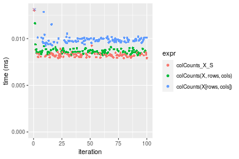

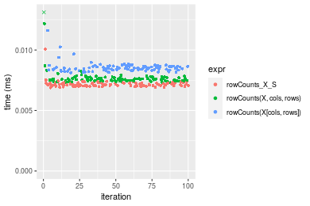
_Table: Benchmarking of colCounts_X_S() and rowCounts_X_S() on double+10x10 data (original and transposed).  The top panel shows times in milliseconds and the bottom panel shows relative times._


|   |expr          |   min|     lq|    mean| median|    uq|    max|
|:--|:-------------|-----:|------:|-------:|------:|-----:|------:|
|2  |rowCounts_X_S | 6.889| 7.0615| 7.18248| 7.1215| 7.267| 10.077|
|1  |colCounts_X_S | 7.918| 8.1075| 8.69284| 8.2430| 8.374| 47.964|


|   |expr          |      min|       lq|     mean|   median|       uq|     max|
|:--|:-------------|--------:|--------:|--------:|--------:|--------:|-------:|
|2  |rowCounts_X_S | 1.000000| 1.000000| 1.000000| 1.000000| 1.000000| 1.00000|
|1  |colCounts_X_S | 1.149369| 1.148127| 1.210284| 1.157481| 1.152332| 4.75975|

_Figure: Benchmarking of colCounts_X_S() and rowCounts_X_S() on double+10x10 data (original and transposed).  Outliers are displayed as crosses. Times are in milliseconds._


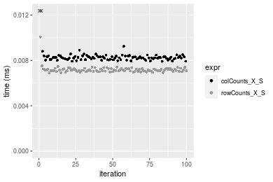

#### 100x100 matrix


```r
> X <- data[["100x100"]]
> rows <- sample.int(nrow(X), size = nrow(X) * 0.7)
> cols <- sample.int(ncol(X), size = ncol(X) * 0.7)
> X_S <- X[rows, cols]
> value <- 42
```


```r
> colStats <- microbenchmark(colCounts_X_S = colCounts(X_S, value = value, na.rm = FALSE), `colCounts(X, rows, cols)` = colCounts(X, 
+     value = value, na.rm = FALSE, rows = rows, cols = cols), `colCounts(X[rows, cols])` = colCounts(X[rows, 
+     cols], value = value, na.rm = FALSE), unit = "ms")
```

```r
> X <- t(X)
> X_S <- t(X_S)
```


```r
> rowStats <- microbenchmark(rowCounts_X_S = rowCounts(X_S, value = value, na.rm = FALSE), `rowCounts(X, cols, rows)` = rowCounts(X, 
+     value = value, na.rm = FALSE, rows = cols, cols = rows), `rowCounts(X[cols, rows])` = rowCounts(X[cols, 
+     rows], value = value, na.rm = FALSE), unit = "ms")
```

_Table: Benchmarking of colCounts_X_S(), colCounts(X, rows, cols)() and colCounts(X[rows, cols])() on double+100x100 data. The top panel shows times in milliseconds and the bottom panel shows relative times._


|   |expr                     |      min|        lq|      mean|    median|        uq|      max|
|:--|:------------------------|--------:|---------:|---------:|---------:|---------:|--------:|
|1  |colCounts_X_S            | 0.023562| 0.0245255| 0.0253463| 0.0251330| 0.0254070| 0.043858|
|2  |colCounts(X, rows, cols) | 0.024285| 0.0251340| 0.0259391| 0.0257295| 0.0260565| 0.035261|
|3  |colCounts(X[rows, cols]) | 0.040345| 0.0415790| 0.0428167| 0.0424410| 0.0427340| 0.093161|


|   |expr                     |      min|       lq|     mean|   median|       uq|      max|
|:--|:------------------------|--------:|--------:|--------:|--------:|--------:|--------:|
|1  |colCounts_X_S            | 1.000000| 1.000000| 1.000000| 1.000000| 1.000000| 1.000000|
|2  |colCounts(X, rows, cols) | 1.030685| 1.024811| 1.023386| 1.023734| 1.025564| 0.803981|
|3  |colCounts(X[rows, cols]) | 1.712291| 1.695337| 1.689267| 1.688656| 1.681977| 2.124151|

_Table: Benchmarking of rowCounts_X_S(), rowCounts(X, cols, rows)() and rowCounts(X[cols, rows])() on double+100x100 data (transposed). The top panel shows times in milliseconds and the bottom panel shows relative times._


|   |expr                     |      min|       lq|      mean|    median|        uq|      max|
|:--|:------------------------|--------:|--------:|---------:|---------:|---------:|--------:|
|2  |rowCounts(X, cols, rows) | 0.023852| 0.024922| 0.0261219| 0.0254115| 0.0261110| 0.071067|
|1  |rowCounts_X_S            | 0.024849| 0.026123| 0.0266888| 0.0268805| 0.0272565| 0.034776|
|3  |rowCounts(X[cols, rows]) | 0.040661| 0.042629| 0.0435185| 0.0430815| 0.0444645| 0.058944|


|   |expr                     |      min|       lq|     mean|   median|       uq|       max|
|:--|:------------------------|--------:|--------:|--------:|--------:|--------:|---------:|
|2  |rowCounts(X, cols, rows) | 1.000000| 1.000000| 1.000000| 1.000000| 1.000000| 1.0000000|
|1  |rowCounts_X_S            | 1.041799| 1.048190| 1.021701| 1.057808| 1.043870| 0.4893410|
|3  |rowCounts(X[cols, rows]) | 1.704721| 1.710497| 1.665978| 1.695355| 1.702903| 0.8294145|

_Figure: Benchmarking of colCounts_X_S(), colCounts(X, rows, cols)() and colCounts(X[rows, cols])() on double+100x100 data  as well as rowCounts_X_S(), rowCounts(X, cols, rows)() and rowCounts(X[cols, rows])() on the same data transposed.  Outliers are displayed as crosses.  Times are in milliseconds._


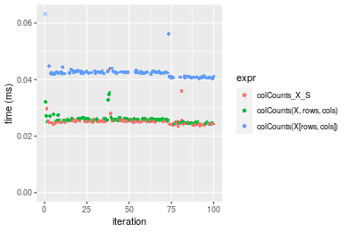

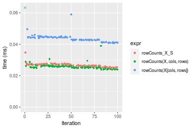
_Table: Benchmarking of colCounts_X_S() and rowCounts_X_S() on double+100x100 data (original and transposed).  The top panel shows times in milliseconds and the bottom panel shows relative times._


|   |expr          |    min|      lq|     mean|  median|      uq|    max|
|:--|:-------------|------:|-------:|--------:|-------:|-------:|------:|
|1  |colCounts_X_S | 23.562| 24.5255| 25.34633| 25.1330| 25.4070| 43.858|
|2  |rowCounts_X_S | 24.849| 26.1230| 26.68877| 26.8805| 27.2565| 34.776|


|   |expr          |      min|       lq|     mean|  median|       uq|       max|
|:--|:-------------|--------:|--------:|--------:|-------:|--------:|---------:|
|1  |colCounts_X_S | 1.000000| 1.000000| 1.000000| 1.00000| 1.000000| 1.0000000|
|2  |rowCounts_X_S | 1.054622| 1.065136| 1.052964| 1.06953| 1.072795| 0.7929226|

_Figure: Benchmarking of colCounts_X_S() and rowCounts_X_S() on double+100x100 data (original and transposed).  Outliers are displayed as crosses. Times are in milliseconds._


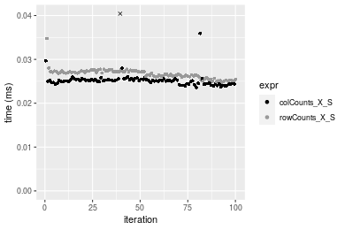

#### 1000x10 matrix


```r
> X <- data[["1000x10"]]
> rows <- sample.int(nrow(X), size = nrow(X) * 0.7)
> cols <- sample.int(ncol(X), size = ncol(X) * 0.7)
> X_S <- X[rows, cols]
> value <- 42
```


```r
> colStats <- microbenchmark(colCounts_X_S = colCounts(X_S, value = value, na.rm = FALSE), `colCounts(X, rows, cols)` = colCounts(X, 
+     value = value, na.rm = FALSE, rows = rows, cols = cols), `colCounts(X[rows, cols])` = colCounts(X[rows, 
+     cols], value = value, na.rm = FALSE), unit = "ms")
```

```r
> X <- t(X)
> X_S <- t(X_S)
```


```r
> rowStats <- microbenchmark(rowCounts_X_S = rowCounts(X_S, value = value, na.rm = FALSE), `rowCounts(X, cols, rows)` = rowCounts(X, 
+     value = value, na.rm = FALSE, rows = cols, cols = rows), `rowCounts(X[cols, rows])` = rowCounts(X[cols, 
+     rows], value = value, na.rm = FALSE), unit = "ms")
```

_Table: Benchmarking of colCounts_X_S(), colCounts(X, rows, cols)() and colCounts(X[rows, cols])() on double+1000x10 data. The top panel shows times in milliseconds and the bottom panel shows relative times._


|   |expr                     |      min|       lq|      mean|    median|        uq|      max|
|:--|:------------------------|--------:|--------:|---------:|---------:|---------:|--------:|
|1  |colCounts_X_S            | 0.021898| 0.022830| 0.0233296| 0.0232315| 0.0234805| 0.037775|
|2  |colCounts(X, rows, cols) | 0.025327| 0.025928| 0.0266916| 0.0266655| 0.0269225| 0.035321|
|3  |colCounts(X[rows, cols]) | 0.039135| 0.039871| 0.0415080| 0.0411200| 0.0413845| 0.093472|


|   |expr                     |      min|       lq|     mean|   median|       uq|       max|
|:--|:------------------------|--------:|--------:|--------:|--------:|--------:|---------:|
|1  |colCounts_X_S            | 1.000000| 1.000000| 1.000000| 1.000000| 1.000000| 1.0000000|
|2  |colCounts(X, rows, cols) | 1.156590| 1.135699| 1.144109| 1.147817| 1.146590| 0.9350364|
|3  |colCounts(X[rows, cols]) | 1.787149| 1.746430| 1.779199| 1.770010| 1.762505| 2.4744408|

_Table: Benchmarking of rowCounts_X_S(), rowCounts(X, cols, rows)() and rowCounts(X[cols, rows])() on double+1000x10 data (transposed). The top panel shows times in milliseconds and the bottom panel shows relative times._


|   |expr                     |      min|        lq|      mean|   median|        uq|      max|
|:--|:------------------------|--------:|---------:|---------:|--------:|---------:|--------:|
|1  |rowCounts_X_S            | 0.024659| 0.0256775| 0.0268400| 0.026423| 0.0273805| 0.041143|
|2  |rowCounts(X, cols, rows) | 0.026295| 0.0268980| 0.0283563| 0.028747| 0.0290340| 0.047225|
|3  |rowCounts(X[cols, rows]) | 0.043929| 0.0446115| 0.0473452| 0.047776| 0.0481285| 0.098369|


|   |expr                     |      min|       lq|     mean|   median|       uq|      max|
|:--|:------------------------|--------:|--------:|--------:|--------:|--------:|--------:|
|1  |rowCounts_X_S            | 1.000000| 1.000000| 1.000000| 1.000000| 1.000000| 1.000000|
|2  |rowCounts(X, cols, rows) | 1.066345| 1.047532| 1.056494| 1.087954| 1.060390| 1.147826|
|3  |rowCounts(X[cols, rows]) | 1.781459| 1.737377| 1.763981| 1.808122| 1.757766| 2.390905|

_Figure: Benchmarking of colCounts_X_S(), colCounts(X, rows, cols)() and colCounts(X[rows, cols])() on double+1000x10 data  as well as rowCounts_X_S(), rowCounts(X, cols, rows)() and rowCounts(X[cols, rows])() on the same data transposed.  Outliers are displayed as crosses.  Times are in milliseconds._


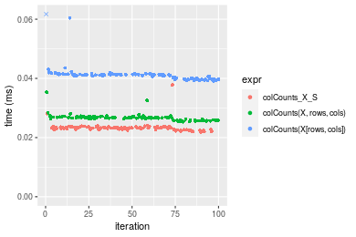

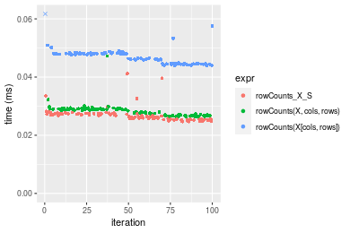
_Table: Benchmarking of colCounts_X_S() and rowCounts_X_S() on double+1000x10 data (original and transposed).  The top panel shows times in milliseconds and the bottom panel shows relative times._


|   |expr          |    min|      lq|     mean|  median|      uq|    max|
|:--|:-------------|------:|-------:|--------:|-------:|-------:|------:|
|1  |colCounts_X_S | 21.898| 22.8300| 23.32962| 23.2315| 23.4805| 37.775|
|2  |rowCounts_X_S | 24.659| 25.6775| 26.84000| 26.4230| 27.3805| 41.143|


|   |expr          |      min|       lq|     mean|   median|       uq|     max|
|:--|:-------------|--------:|--------:|--------:|--------:|--------:|-------:|
|1  |colCounts_X_S | 1.000000| 1.000000| 1.000000| 1.000000| 1.000000| 1.00000|
|2  |rowCounts_X_S | 1.126085| 1.124726| 1.150469| 1.137378| 1.166095| 1.08916|

_Figure: Benchmarking of colCounts_X_S() and rowCounts_X_S() on double+1000x10 data (original and transposed).  Outliers are displayed as crosses. Times are in milliseconds._


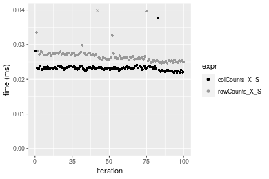

#### 10x1000 matrix


```r
> X <- data[["10x1000"]]
> rows <- sample.int(nrow(X), size = nrow(X) * 0.7)
> cols <- sample.int(ncol(X), size = ncol(X) * 0.7)
> X_S <- X[rows, cols]
> value <- 42
```


```r
> colStats <- microbenchmark(colCounts_X_S = colCounts(X_S, value = value, na.rm = FALSE), `colCounts(X, rows, cols)` = colCounts(X, 
+     value = value, na.rm = FALSE, rows = rows, cols = cols), `colCounts(X[rows, cols])` = colCounts(X[rows, 
+     cols], value = value, na.rm = FALSE), unit = "ms")
```

```r
> X <- t(X)
> X_S <- t(X_S)
```


```r
> rowStats <- microbenchmark(rowCounts_X_S = rowCounts(X_S, value = value, na.rm = FALSE), `rowCounts(X, cols, rows)` = rowCounts(X, 
+     value = value, na.rm = FALSE, rows = cols, cols = rows), `rowCounts(X[cols, rows])` = rowCounts(X[cols, 
+     rows], value = value, na.rm = FALSE), unit = "ms")
```

_Table: Benchmarking of colCounts_X_S(), colCounts(X, rows, cols)() and colCounts(X[rows, cols])() on double+10x1000 data. The top panel shows times in milliseconds and the bottom panel shows relative times._


|   |expr                     |      min|        lq|      mean|    median|        uq|      max|
|:--|:------------------------|--------:|---------:|---------:|---------:|---------:|--------:|
|1  |colCounts_X_S            | 0.022503| 0.0234300| 0.0251250| 0.0243615| 0.0249190| 0.089457|
|2  |colCounts(X, rows, cols) | 0.025854| 0.0265120| 0.0286491| 0.0272645| 0.0281910| 0.078877|
|3  |colCounts(X[rows, cols]) | 0.040596| 0.0420115| 0.0435707| 0.0427890| 0.0441665| 0.078030|


|   |expr                     |      min|       lq|     mean|   median|       uq|       max|
|:--|:------------------------|--------:|--------:|--------:|--------:|--------:|---------:|
|1  |colCounts_X_S            | 1.000000| 1.000000| 1.000000| 1.000000| 1.000000| 1.0000000|
|2  |colCounts(X, rows, cols) | 1.148913| 1.131541| 1.140262| 1.119163| 1.131305| 0.8817309|
|3  |colCounts(X[rows, cols]) | 1.804026| 1.793064| 1.734155| 1.756419| 1.772403| 0.8722627|

_Table: Benchmarking of rowCounts_X_S(), rowCounts(X, cols, rows)() and rowCounts(X[cols, rows])() on double+10x1000 data (transposed). The top panel shows times in milliseconds and the bottom panel shows relative times._


|   |expr                     |      min|        lq|      mean|    median|        uq|      max|
|:--|:------------------------|--------:|---------:|---------:|---------:|---------:|--------:|
|1  |rowCounts_X_S            | 0.024517| 0.0258940| 0.0267874| 0.0268080| 0.0272800| 0.040653|
|2  |rowCounts(X, cols, rows) | 0.025889| 0.0266410| 0.0282871| 0.0280125| 0.0285635| 0.075981|
|3  |rowCounts(X[cols, rows]) | 0.041282| 0.0422135| 0.0439394| 0.0447350| 0.0450755| 0.049755|


|   |expr                     |      min|       lq|     mean|   median|       uq|      max|
|:--|:------------------------|--------:|--------:|--------:|--------:|--------:|--------:|
|1  |rowCounts_X_S            | 1.000000| 1.000000| 1.000000| 1.000000| 1.000000| 1.000000|
|2  |rowCounts(X, cols, rows) | 1.055961| 1.028848| 1.055986| 1.044931| 1.047049| 1.869013|
|3  |rowCounts(X[cols, rows]) | 1.683811| 1.630243| 1.640302| 1.668718| 1.652328| 1.223895|

_Figure: Benchmarking of colCounts_X_S(), colCounts(X, rows, cols)() and colCounts(X[rows, cols])() on double+10x1000 data  as well as rowCounts_X_S(), rowCounts(X, cols, rows)() and rowCounts(X[cols, rows])() on the same data transposed.  Outliers are displayed as crosses.  Times are in milliseconds._


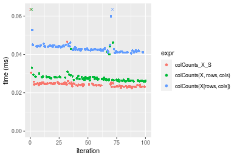

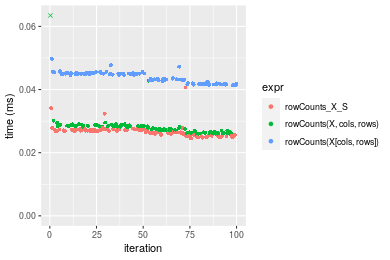
_Table: Benchmarking of colCounts_X_S() and rowCounts_X_S() on double+10x1000 data (original and transposed).  The top panel shows times in milliseconds and the bottom panel shows relative times._


|   |expr          |    min|     lq|     mean|  median|     uq|    max|
|:--|:-------------|------:|------:|--------:|-------:|------:|------:|
|1  |colCounts_X_S | 22.503| 23.430| 25.12503| 24.3615| 24.919| 89.457|
|2  |rowCounts_X_S | 24.517| 25.894| 26.78740| 26.8080| 27.280| 40.653|


|   |expr          |      min|       lq|     mean|   median|       uq|       max|
|:--|:-------------|--------:|--------:|--------:|--------:|--------:|---------:|
|1  |colCounts_X_S | 1.000000| 1.000000| 1.000000| 1.000000| 1.000000| 1.0000000|
|2  |rowCounts_X_S | 1.089499| 1.105164| 1.066164| 1.100425| 1.094747| 0.4544418|

_Figure: Benchmarking of colCounts_X_S() and rowCounts_X_S() on double+10x1000 data (original and transposed).  Outliers are displayed as crosses. Times are in milliseconds._


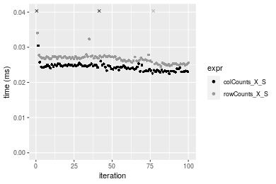

#### 100x1000 matrix


```r
> X <- data[["100x1000"]]
> rows <- sample.int(nrow(X), size = nrow(X) * 0.7)
> cols <- sample.int(ncol(X), size = ncol(X) * 0.7)
> X_S <- X[rows, cols]
> value <- 42
```


```r
> colStats <- microbenchmark(colCounts_X_S = colCounts(X_S, value = value, na.rm = FALSE), `colCounts(X, rows, cols)` = colCounts(X, 
+     value = value, na.rm = FALSE, rows = rows, cols = cols), `colCounts(X[rows, cols])` = colCounts(X[rows, 
+     cols], value = value, na.rm = FALSE), unit = "ms")
```

```r
> X <- t(X)
> X_S <- t(X_S)
```


```r
> rowStats <- microbenchmark(rowCounts_X_S = rowCounts(X_S, value = value, na.rm = FALSE), `rowCounts(X, cols, rows)` = rowCounts(X, 
+     value = value, na.rm = FALSE, rows = cols, cols = rows), `rowCounts(X[cols, rows])` = rowCounts(X[cols, 
+     rows], value = value, na.rm = FALSE), unit = "ms")
```

_Table: Benchmarking of colCounts_X_S(), colCounts(X, rows, cols)() and colCounts(X[rows, cols])() on double+100x1000 data. The top panel shows times in milliseconds and the bottom panel shows relative times._


|   |expr                     |      min|        lq|      mean|    median|        uq|      max|
|:--|:------------------------|--------:|---------:|---------:|---------:|---------:|--------:|
|2  |colCounts(X, rows, cols) | 0.105265| 0.1145630| 0.1307565| 0.1261115| 0.1394125| 0.272958|
|1  |colCounts_X_S            | 0.106458| 0.1133215| 0.1311436| 0.1270160| 0.1400905| 0.222013|
|3  |colCounts(X[rows, cols]) | 0.205337| 0.2245500| 0.2552749| 0.2516795| 0.2707955| 0.342214|


|   |expr                     |      min|        lq|     mean|   median|       uq|       max|
|:--|:------------------------|--------:|---------:|--------:|--------:|--------:|---------:|
|2  |colCounts(X, rows, cols) | 1.000000| 1.0000000| 1.000000| 1.000000| 1.000000| 1.0000000|
|1  |colCounts_X_S            | 1.011333| 0.9891632| 1.002960| 1.007172| 1.004863| 0.8133596|
|3  |colCounts(X[rows, cols]) | 1.950667| 1.9600569| 1.952293| 1.995690| 1.942405| 1.2537240|

_Table: Benchmarking of rowCounts_X_S(), rowCounts(X, cols, rows)() and rowCounts(X[cols, rows])() on double+100x1000 data (transposed). The top panel shows times in milliseconds and the bottom panel shows relative times._


|   |expr                     |      min|        lq|      mean|   median|       uq|      max|
|:--|:------------------------|--------:|---------:|---------:|--------:|--------:|--------:|
|2  |rowCounts(X, cols, rows) | 0.118166| 0.1270350| 0.1429773| 0.136608| 0.151287| 0.286464|
|1  |rowCounts_X_S            | 0.127269| 0.1444980| 0.1596030| 0.155822| 0.173422| 0.242767|
|3  |rowCounts(X[cols, rows]) | 0.230335| 0.2537255| 0.2770089| 0.269141| 0.295137| 0.364153|


|   |expr                     |      min|       lq|     mean|   median|       uq|       max|
|:--|:------------------------|--------:|--------:|--------:|--------:|--------:|---------:|
|2  |rowCounts(X, cols, rows) | 1.000000| 1.000000| 1.000000| 1.000000| 1.000000| 1.0000000|
|1  |rowCounts_X_S            | 1.077036| 1.137466| 1.116282| 1.140651| 1.146311| 0.8474608|
|3  |rowCounts(X[cols, rows]) | 1.949249| 1.997288| 1.937433| 1.970170| 1.950842| 1.2711999|

_Figure: Benchmarking of colCounts_X_S(), colCounts(X, rows, cols)() and colCounts(X[rows, cols])() on double+100x1000 data  as well as rowCounts_X_S(), rowCounts(X, cols, rows)() and rowCounts(X[cols, rows])() on the same data transposed.  Outliers are displayed as crosses.  Times are in milliseconds._


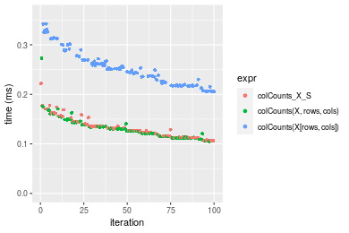

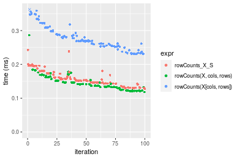
_Table: Benchmarking of colCounts_X_S() and rowCounts_X_S() on double+100x1000 data (original and transposed).  The top panel shows times in milliseconds and the bottom panel shows relative times._


|   |expr          |     min|       lq|     mean|  median|       uq|     max|
|:--|:-------------|-------:|--------:|--------:|-------:|--------:|-------:|
|1  |colCounts_X_S | 106.458| 113.3215| 131.1436| 127.016| 140.0905| 222.013|
|2  |rowCounts_X_S | 127.269| 144.4980| 159.6029| 155.822| 173.4220| 242.767|


|   |expr          |      min|       lq|     mean|  median|       uq|      max|
|:--|:-------------|--------:|--------:|--------:|-------:|--------:|--------:|
|1  |colCounts_X_S | 1.000000| 1.000000| 1.000000| 1.00000| 1.000000| 1.000000|
|2  |rowCounts_X_S | 1.195485| 1.275116| 1.217009| 1.22679| 1.237928| 1.093481|

_Figure: Benchmarking of colCounts_X_S() and rowCounts_X_S() on double+100x1000 data (original and transposed).  Outliers are displayed as crosses. Times are in milliseconds._


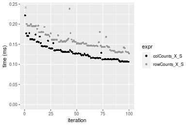

#### 1000x100 matrix


```r
> X <- data[["1000x100"]]
> rows <- sample.int(nrow(X), size = nrow(X) * 0.7)
> cols <- sample.int(ncol(X), size = ncol(X) * 0.7)
> X_S <- X[rows, cols]
> value <- 42
```


```r
> colStats <- microbenchmark(colCounts_X_S = colCounts(X_S, value = value, na.rm = FALSE), `colCounts(X, rows, cols)` = colCounts(X, 
+     value = value, na.rm = FALSE, rows = rows, cols = cols), `colCounts(X[rows, cols])` = colCounts(X[rows, 
+     cols], value = value, na.rm = FALSE), unit = "ms")
```

```r
> X <- t(X)
> X_S <- t(X_S)
```


```r
> rowStats <- microbenchmark(rowCounts_X_S = rowCounts(X_S, value = value, na.rm = FALSE), `rowCounts(X, cols, rows)` = rowCounts(X, 
+     value = value, na.rm = FALSE, rows = cols, cols = rows), `rowCounts(X[cols, rows])` = rowCounts(X[cols, 
+     rows], value = value, na.rm = FALSE), unit = "ms")
```

_Table: Benchmarking of colCounts_X_S(), colCounts(X, rows, cols)() and colCounts(X[rows, cols])() on double+1000x100 data. The top panel shows times in milliseconds and the bottom panel shows relative times._


|   |expr                     |      min|       lq|      mean|    median|        uq|      max|
|:--|:------------------------|--------:|--------:|---------:|---------:|---------:|--------:|
|1  |colCounts_X_S            | 0.098470| 0.112016| 0.1226457| 0.1197715| 0.1268565| 0.204858|
|2  |colCounts(X, rows, cols) | 0.103196| 0.118934| 0.1316289| 0.1272435| 0.1386230| 0.220735|
|3  |colCounts(X[rows, cols]) | 0.194508| 0.219782| 0.2492169| 0.2412725| 0.2593015| 0.418089|


|   |expr                     |      min|       lq|     mean|   median|       uq|      max|
|:--|:------------------------|--------:|--------:|--------:|--------:|--------:|--------:|
|1  |colCounts_X_S            | 1.000000| 1.000000| 1.000000| 1.000000| 1.000000| 1.000000|
|2  |colCounts(X, rows, cols) | 1.047994| 1.061759| 1.073245| 1.062385| 1.092754| 1.077503|
|3  |colCounts(X[rows, cols]) | 1.975302| 1.962059| 2.032007| 2.014440| 2.044054| 2.040872|

_Table: Benchmarking of rowCounts_X_S(), rowCounts(X, cols, rows)() and rowCounts(X[cols, rows])() on double+1000x100 data (transposed). The top panel shows times in milliseconds and the bottom panel shows relative times._


|   |expr                     |      min|        lq|      mean|    median|        uq|      max|
|:--|:------------------------|--------:|---------:|---------:|---------:|---------:|--------:|
|2  |rowCounts(X, cols, rows) | 0.112588| 0.1312890| 0.1470693| 0.1423215| 0.1570235| 0.330036|
|1  |rowCounts_X_S            | 0.123777| 0.1381475| 0.1605944| 0.1563945| 0.1759205| 0.248206|
|3  |rowCounts(X[cols, rows]) | 0.219814| 0.2511030| 0.2845926| 0.2783760| 0.3158320| 0.416945|


|   |expr                     |      min|       lq|     mean|   median|       uq|       max|
|:--|:------------------------|--------:|--------:|--------:|--------:|--------:|---------:|
|2  |rowCounts(X, cols, rows) | 1.000000| 1.000000| 1.000000| 1.000000| 1.000000| 1.0000000|
|1  |rowCounts_X_S            | 1.099380| 1.052240| 1.091964| 1.098882| 1.120345| 0.7520574|
|3  |rowCounts(X[cols, rows]) | 1.952375| 1.912597| 1.935092| 1.955966| 2.011368| 1.2633319|

_Figure: Benchmarking of colCounts_X_S(), colCounts(X, rows, cols)() and colCounts(X[rows, cols])() on double+1000x100 data  as well as rowCounts_X_S(), rowCounts(X, cols, rows)() and rowCounts(X[cols, rows])() on the same data transposed.  Outliers are displayed as crosses.  Times are in milliseconds._


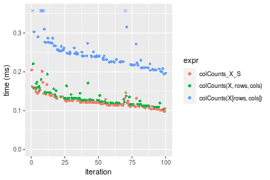


_Table: Benchmarking of colCounts_X_S() and rowCounts_X_S() on double+1000x100 data (original and transposed).  The top panel shows times in milliseconds and the bottom panel shows relative times._


|   |expr          |     min|       lq|     mean|   median|       uq|     max|
|:--|:-------------|-------:|--------:|--------:|--------:|--------:|-------:|
|1  |colCounts_X_S |  98.470| 112.0160| 122.6457| 119.7715| 126.8565| 204.858|
|2  |rowCounts_X_S | 123.777| 138.1475| 160.5944| 156.3945| 175.9205| 248.206|


|   |expr          |      min|       lq|     mean|   median|       uq|    max|
|:--|:-------------|--------:|--------:|--------:|--------:|--------:|------:|
|1  |colCounts_X_S | 1.000000| 1.000000| 1.000000| 1.000000| 1.000000| 1.0000|
|2  |rowCounts_X_S | 1.257002| 1.233284| 1.309417| 1.305774| 1.386768| 1.2116|

_Figure: Benchmarking of colCounts_X_S() and rowCounts_X_S() on double+1000x100 data (original and transposed).  Outliers are displayed as crosses. Times are in milliseconds._


## Appendix

### Session information
```r
R version 4.1.1 Patched (2021-08-10 r80727)
Platform: x86_64-pc-linux-gnu (64-bit)
Running under: Ubuntu 18.04.5 LTS

Matrix products: default
BLAS:   /home/hb/software/R-devel/R-4-1-branch/lib/R/lib/libRblas.so
LAPACK: /home/hb/software/R-devel/R-4-1-branch/lib/R/lib/libRlapack.so

locale:
 [1] LC_CTYPE=en_US.UTF-8       LC_NUMERIC=C              
 [3] LC_TIME=en_US.UTF-8        LC_COLLATE=en_US.UTF-8    
 [5] LC_MONETARY=en_US.UTF-8    LC_MESSAGES=en_US.UTF-8   
 [7] LC_PAPER=en_US.UTF-8       LC_NAME=C                 
 [9] LC_ADDRESS=C               LC_TELEPHONE=C            
[11] LC_MEASUREMENT=en_US.UTF-8 LC_IDENTIFICATION=C       

attached base packages:
[1] stats     graphics  grDevices utils     datasets  methods   base     

other attached packages:
[1] microbenchmark_1.4-7   matrixStats_0.60.1     ggplot2_3.3.5         
[4] knitr_1.33             R.devices_2.17.0       R.utils_2.10.1        
[7] R.oo_1.24.0            R.methodsS3_1.8.1-9001 history_0.0.1-9000    

loaded via a namespace (and not attached):
 [1] Biobase_2.52.0          httr_1.4.2              splines_4.1.1          
 [4] bit64_4.0.5             network_1.17.1          assertthat_0.2.1       
 [7] highr_0.9               stats4_4.1.1            blob_1.2.2             
[10] GenomeInfoDbData_1.2.6  robustbase_0.93-8       pillar_1.6.2           
[13] RSQLite_2.2.8           lattice_0.20-44         glue_1.4.2             
[16] digest_0.6.27           XVector_0.32.0          colorspace_2.0-2       
[19] Matrix_1.3-4            XML_3.99-0.7            pkgconfig_2.0.3        
[22] zlibbioc_1.38.0         genefilter_1.74.0       purrr_0.3.4            
[25] ergm_4.1.2              xtable_1.8-4            scales_1.1.1           
[28] tibble_3.1.4            annotate_1.70.0         KEGGREST_1.32.0        
[31] farver_2.1.0            generics_0.1.0          IRanges_2.26.0         
[34] ellipsis_0.3.2          cachem_1.0.6            withr_2.4.2            
[37] BiocGenerics_0.38.0     mime_0.11               survival_3.2-13        
[40] magrittr_2.0.1          crayon_1.4.1            statnet.common_4.5.0   
[43] memoise_2.0.0           laeken_0.5.1            fansi_0.5.0            
[46] R.cache_0.15.0          MASS_7.3-54             R.rsp_0.44.0           
[49] progressr_0.8.0         tools_4.1.1             lifecycle_1.0.0        
[52] S4Vectors_0.30.0        trust_0.1-8             munsell_0.5.0          
[55] tabby_0.0.1-9001        AnnotationDbi_1.54.1    Biostrings_2.60.2      
[58] compiler_4.1.1          GenomeInfoDb_1.28.1     rlang_0.4.11           
[61] grid_4.1.1              RCurl_1.98-1.4          cwhmisc_6.6            
[64] rappdirs_0.3.3          startup_0.15.0          labeling_0.4.2         
[67] bitops_1.0-7            base64enc_0.1-3         boot_1.3-28            
[70] gtable_0.3.0            DBI_1.1.1               markdown_1.1           
[73] R6_2.5.1                lpSolveAPI_5.5.2.0-17.7 rle_0.9.2              
[76] dplyr_1.0.7             fastmap_1.1.0           bit_4.0.4              
[79] utf8_1.2.2              parallel_4.1.1          Rcpp_1.0.7             
[82] vctrs_0.3.8             png_0.1-7               DEoptimR_1.0-9         
[85] tidyselect_1.1.1        xfun_0.25               coda_0.19-4            
```
Total processing time was 34.05 secs.


### Reproducibility
To reproduce this report, do:
```r
html <- matrixStats:::benchmark('colRowCounts_subset')
```

[RSP]: https://cran.r-project.org/package=R.rsp
[matrixStats]: https://cran.r-project.org/package=matrixStats

[StackOverflow:colMins?]: https://stackoverflow.com/questions/13676878 "Stack Overflow: fastest way to get Min from every column in a matrix?"
[StackOverflow:colSds?]: https://stackoverflow.com/questions/17549762 "Stack Overflow: Is there such 'colsd' in R?"
[StackOverflow:rowProds?]: https://stackoverflow.com/questions/20198801/ "Stack Overflow: Row product of matrix and column sum of matrix"

---------------------------------------
Copyright Dongcan Jiang. Last updated on 2021-08-25 18:51:38 (+0200 UTC). Powered by [RSP].

<script>
 var link = document.createElement('link');
 link.rel = 'icon';
 link.href = "data:image/png;base64,iVBORw0KGgoAAAANSUhEUgAAACAAAAAgCAMAAABEpIrGAAAA21BMVEUAAAAAAP8AAP8AAP8AAP8AAP8AAP8AAP8AAP8AAP8AAP8AAP8AAP8AAP8AAP8AAP8AAP8AAP8AAP8AAP8AAP8AAP8AAP8AAP8AAP8AAP8AAP8AAP8AAP8AAP8AAP8AAP8AAP8AAP8AAP8AAP8AAP8AAP8AAP8AAP8AAP8AAP8BAf4CAv0DA/wdHeIeHuEfH+AgIN8hId4lJdomJtknJ9g+PsE/P8BAQL9yco10dIt1dYp3d4h4eIeVlWqWlmmXl2iYmGeZmWabm2Tn5xjo6Bfp6Rb39wj4+Af//wA2M9hbAAAASXRSTlMAAQIJCgsMJSYnKD4/QGRlZmhpamtsbautrrCxuru8y8zN5ebn6Pn6+///////////////////////////////////////////LsUNcQAAAS9JREFUOI29k21XgkAQhVcFytdSMqMETU26UVqGmpaiFbL//xc1cAhhwVNf6n5i5z67M2dmYOyfJZUqlVLhkKucG7cgmUZTybDz6g0iDeq51PUr37Ds2cy2/C9NeES5puDjxuUk1xnToZsg8pfA3avHQ3lLIi7iWRrkv/OYtkScxBIMgDee0ALoyxHQBJ68JLCjOtQIMIANF7QG9G9fNnHvisCHBVMKgSJgiz7nE+AoBKrAPA3MgepvgR9TSCasrCKH0eB1wBGBFdCO+nAGjMVGPcQb5bd6mQRegN6+1axOs9nGfYcCtfi4NQosdtH7dB+txFIpXQqN1p9B/asRHToyS0jRgpV7nk4nwcq1BJ+x3Gl/v7S9Wmpp/aGquum7w3ZDyrADFYrl8vHBH+ev9AUASW1dmU4h4wAAAABJRU5ErkJggg=="
 document.getElementsByTagName('head')[0].appendChild(link);
</script>


