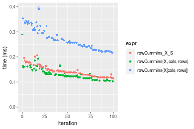

[matrixStats]: Benchmark report

---------------------------------------


# colCummins() and rowCummins() benchmarks on subsetted computation

This report benchmark the performance of colCummins() and rowCummins() on subsetted computation.


## Data type "integer"

### Data
```r
> rmatrix <- function(nrow, ncol, mode = c("logical", "double", "integer", "index"), range = c(-100, 
+     +100), na_prob = 0) {
+     mode <- match.arg(mode)
+     n <- nrow * ncol
+     if (mode == "logical") {
+         x <- sample(c(FALSE, TRUE), size = n, replace = TRUE)
+     }     else if (mode == "index") {
+         x <- seq_len(n)
+         mode <- "integer"
+     }     else {
+         x <- runif(n, min = range[1], max = range[2])
+     }
+     storage.mode(x) <- mode
+     if (na_prob > 0) 
+         x[sample(n, size = na_prob * n)] <- NA
+     dim(x) <- c(nrow, ncol)
+     x
+ }
> rmatrices <- function(scale = 10, seed = 1, ...) {
+     set.seed(seed)
+     data <- list()
+     data[[1]] <- rmatrix(nrow = scale * 1, ncol = scale * 1, ...)
+     data[[2]] <- rmatrix(nrow = scale * 10, ncol = scale * 10, ...)
+     data[[3]] <- rmatrix(nrow = scale * 100, ncol = scale * 1, ...)
+     data[[4]] <- t(data[[3]])
+     data[[5]] <- rmatrix(nrow = scale * 10, ncol = scale * 100, ...)
+     data[[6]] <- t(data[[5]])
+     names(data) <- sapply(data, FUN = function(x) paste(dim(x), collapse = "x"))
+     data
+ }
> data <- rmatrices(mode = mode)
```

### Results

#### 10x10 integer matrix

```r
> X <- data[["10x10"]]
> rows <- sample.int(nrow(X), size = nrow(X) * 0.7)
> cols <- sample.int(ncol(X), size = ncol(X) * 0.7)
> X_S <- X[rows, cols]
> gc()
          used  (Mb) gc trigger  (Mb) max used  (Mb)
Ncells 5193783 277.4    8529671 455.6  8529671 455.6
Vcells 9739225  74.4   31876688 243.2 60562128 462.1
> colStats <- microbenchmark(colCummins_X_S = colCummins(X_S), `colCummins(X, rows, cols)` = colCummins(X, 
+     rows = rows, cols = cols), `colCummins(X[rows, cols])` = colCummins(X[rows, cols]), unit = "ms")
> X <- t(X)
> X_S <- t(X_S)
> gc()
          used  (Mb) gc trigger  (Mb) max used  (Mb)
Ncells 5185420 277.0    8529671 455.6  8529671 455.6
Vcells 9711945  74.1   31876688 243.2 60562128 462.1
> rowStats <- microbenchmark(rowCummins_X_S = rowCummins(X_S), `rowCummins(X, cols, rows)` = rowCummins(X, 
+     rows = cols, cols = rows), `rowCummins(X[cols, rows])` = rowCummins(X[cols, rows]), unit = "ms")
```

_Table: Benchmarking of colCummins_X_S(), colCummins(X, rows, cols)() and colCummins(X[rows, cols])() on integer+10x10 data. The top panel shows times in milliseconds and the bottom panel shows relative times._


|   |expr                      |      min|        lq|      mean|    median|        uq|      max|
|:--|:-------------------------|--------:|---------:|---------:|---------:|---------:|--------:|
|1  |colCummins_X_S            | 0.001723| 0.0019105| 0.0029729| 0.0019780| 0.0020995| 0.097800|
|2  |colCummins(X, rows, cols) | 0.001967| 0.0022870| 0.0024131| 0.0023620| 0.0024365| 0.004847|
|3  |colCummins(X[rows, cols]) | 0.002574| 0.0029750| 0.0031610| 0.0030825| 0.0032120| 0.010422|


|   |expr                      |      min|       lq|     mean|   median|       uq|       max|
|:--|:-------------------------|--------:|--------:|--------:|--------:|--------:|---------:|
|1  |colCummins_X_S            | 1.000000| 1.000000| 1.000000| 1.000000| 1.000000| 1.0000000|
|2  |colCummins(X, rows, cols) | 1.141614| 1.197069| 0.811703| 1.194136| 1.160514| 0.0495603|
|3  |colCummins(X[rows, cols]) | 1.493906| 1.557184| 1.063268| 1.558392| 1.529888| 0.1065644|

_Table: Benchmarking of rowCummins_X_S(), rowCummins(X, cols, rows)() and rowCummins(X[cols, rows])() on integer+10x10 data (transposed). The top panel shows times in milliseconds and the bottom panel shows relative times._


|   |expr                      |      min|        lq|      mean|    median|        uq|      max|
|:--|:-------------------------|--------:|---------:|---------:|---------:|---------:|--------:|
|1  |rowCummins_X_S            | 0.001747| 0.0020055| 0.0021237| 0.0020825| 0.0021585| 0.004422|
|2  |rowCummins(X, cols, rows) | 0.002125| 0.0023695| 0.0033469| 0.0024725| 0.0025790| 0.085197|
|3  |rowCummins(X[cols, rows]) | 0.002817| 0.0030770| 0.0032745| 0.0031445| 0.0032790| 0.009464|


|   |expr                      |      min|       lq|     mean|   median|       uq|       max|
|:--|:-------------------------|--------:|--------:|--------:|--------:|--------:|---------:|
|1  |rowCummins_X_S            | 1.000000| 1.000000| 1.000000| 1.000000| 1.000000|  1.000000|
|2  |rowCummins(X, cols, rows) | 1.216371| 1.181501| 1.575995| 1.187275| 1.194811| 19.266621|
|3  |rowCummins(X[cols, rows]) | 1.612478| 1.534281| 1.541918| 1.509964| 1.519111|  2.140208|

_Figure: Benchmarking of colCummins_X_S(), colCummins(X, rows, cols)() and colCummins(X[rows, cols])() on integer+10x10 data  as well as rowCummins_X_S(), rowCummins(X, cols, rows)() and rowCummins(X[cols, rows])() on the same data transposed.  Outliers are displayed as crosses.  Times are in milliseconds._


_Table: Benchmarking of colCummins_X_S() and rowCummins_X_S() on integer+10x10 data (original and transposed).  The top panel shows times in milliseconds and the bottom panel shows relative times._


|   |expr           |   min|     lq|    mean| median|     uq|    max|
|:--|:--------------|-----:|------:|-------:|------:|------:|------:|
|1  |colCummins_X_S | 1.723| 1.9105| 2.97291| 1.9780| 2.0995| 97.800|
|2  |rowCummins_X_S | 1.747| 2.0055| 2.12368| 2.0825| 2.1585|  4.422|


|   |expr           |      min|       lq|      mean|   median|       uq|       max|
|:--|:--------------|--------:|--------:|---------:|--------:|--------:|---------:|
|1  |colCummins_X_S | 1.000000| 1.000000| 1.0000000| 1.000000| 1.000000| 1.0000000|
|2  |rowCummins_X_S | 1.013929| 1.049725| 0.7143439| 1.052831| 1.028102| 0.0452147|

_Figure: Benchmarking of colCummins_X_S() and rowCummins_X_S() on integer+10x10 data (original and transposed).  Outliers are displayed as crosses. Times are in milliseconds._


#### 100x100 integer matrix

```r
> X <- data[["100x100"]]
> rows <- sample.int(nrow(X), size = nrow(X) * 0.7)
> cols <- sample.int(ncol(X), size = ncol(X) * 0.7)
> X_S <- X[rows, cols]
> gc()
          used  (Mb) gc trigger  (Mb) max used  (Mb)
Ncells 5184048 276.9    8529671 455.6  8529671 455.6
Vcells 9380529  71.6   31876688 243.2 60562128 462.1
> colStats <- microbenchmark(colCummins_X_S = colCummins(X_S), `colCummins(X, rows, cols)` = colCummins(X, 
+     rows = rows, cols = cols), `colCummins(X[rows, cols])` = colCummins(X[rows, cols]), unit = "ms")
> X <- t(X)
> X_S <- t(X_S)
> gc()
          used  (Mb) gc trigger  (Mb) max used  (Mb)
Ncells 5184024 276.9    8529671 455.6  8529671 455.6
Vcells 9385582  71.7   31876688 243.2 60562128 462.1
> rowStats <- microbenchmark(rowCummins_X_S = rowCummins(X_S), `rowCummins(X, cols, rows)` = rowCummins(X, 
+     rows = cols, cols = rows), `rowCummins(X[cols, rows])` = rowCummins(X[cols, rows]), unit = "ms")
```

_Table: Benchmarking of colCummins_X_S(), colCummins(X, rows, cols)() and colCummins(X[rows, cols])() on integer+100x100 data. The top panel shows times in milliseconds and the bottom panel shows relative times._


|   |expr                      |      min|       lq|      mean|    median|        uq|      max|
|:--|:-------------------------|--------:|--------:|---------:|---------:|---------:|--------:|
|1  |colCummins_X_S            | 0.015989| 0.016298| 0.0165247| 0.0163960| 0.0165695| 0.021165|
|2  |colCummins(X, rows, cols) | 0.016327| 0.016922| 0.0172117| 0.0170985| 0.0172670| 0.021670|
|3  |colCummins(X[rows, cols]) | 0.027582| 0.027799| 0.0282629| 0.0278985| 0.0280635| 0.052871|


|   |expr                      |      min|       lq|     mean|   median|       uq|      max|
|:--|:-------------------------|--------:|--------:|--------:|--------:|--------:|--------:|
|1  |colCummins_X_S            | 1.000000| 1.000000| 1.000000| 1.000000| 1.000000| 1.000000|
|2  |colCummins(X, rows, cols) | 1.021140| 1.038287| 1.041576| 1.042846| 1.042095| 1.023860|
|3  |colCummins(X[rows, cols]) | 1.725061| 1.705669| 1.710340| 1.701543| 1.693684| 2.498039|

_Table: Benchmarking of rowCummins_X_S(), rowCummins(X, cols, rows)() and rowCummins(X[cols, rows])() on integer+100x100 data (transposed). The top panel shows times in milliseconds and the bottom panel shows relative times._


|   |expr                      |      min|        lq|      mean|    median|        uq|      max|
|:--|:-------------------------|--------:|---------:|---------:|---------:|---------:|--------:|
|1  |rowCummins_X_S            | 0.020410| 0.0214990| 0.0222479| 0.0223045| 0.0224610| 0.036251|
|2  |rowCummins(X, cols, rows) | 0.022831| 0.0237855| 0.0247767| 0.0244665| 0.0246990| 0.052317|
|3  |rowCummins(X[cols, rows]) | 0.030901| 0.0325430| 0.0333857| 0.0336010| 0.0338715| 0.038851|


|   |expr                      |      min|       lq|     mean|   median|       uq|      max|
|:--|:-------------------------|--------:|--------:|--------:|--------:|--------:|--------:|
|1  |rowCummins_X_S            | 1.000000| 1.000000| 1.000000| 1.000000| 1.000000| 1.000000|
|2  |rowCummins(X, cols, rows) | 1.118618| 1.106354| 1.113663| 1.096931| 1.099639| 1.443188|
|3  |rowCummins(X[cols, rows]) | 1.514013| 1.513698| 1.500623| 1.506467| 1.508014| 1.071722|

_Figure: Benchmarking of colCummins_X_S(), colCummins(X, rows, cols)() and colCummins(X[rows, cols])() on integer+100x100 data  as well as rowCummins_X_S(), rowCummins(X, cols, rows)() and rowCummins(X[cols, rows])() on the same data transposed.  Outliers are displayed as crosses.  Times are in milliseconds._


_Table: Benchmarking of colCummins_X_S() and rowCummins_X_S() on integer+100x100 data (original and transposed).  The top panel shows times in milliseconds and the bottom panel shows relative times._


|   |expr           |    min|     lq|     mean|  median|      uq|    max|
|:--|:--------------|------:|------:|--------:|-------:|-------:|------:|
|1  |colCummins_X_S | 15.989| 16.298| 16.52470| 16.3960| 16.5695| 21.165|
|2  |rowCummins_X_S | 20.410| 21.499| 22.24791| 22.3045| 22.4610| 36.251|


|   |expr           |      min|       lq|     mean|   median|       uq|      max|
|:--|:--------------|--------:|--------:|--------:|--------:|--------:|--------:|
|1  |colCummins_X_S | 1.000000| 1.000000| 1.000000| 1.000000| 1.000000| 1.000000|
|2  |rowCummins_X_S | 1.276503| 1.319119| 1.346343| 1.360362| 1.355563| 1.712781|

_Figure: Benchmarking of colCummins_X_S() and rowCummins_X_S() on integer+100x100 data (original and transposed).  Outliers are displayed as crosses. Times are in milliseconds._


#### 1000x10 integer matrix

```r
> X <- data[["1000x10"]]
> rows <- sample.int(nrow(X), size = nrow(X) * 0.7)
> cols <- sample.int(ncol(X), size = ncol(X) * 0.7)
> X_S <- X[rows, cols]
> gc()
          used  (Mb) gc trigger  (Mb) max used  (Mb)
Ncells 5184790 276.9    8529671 455.6  8529671 455.6
Vcells 9384580  71.6   31876688 243.2 60562128 462.1
> colStats <- microbenchmark(colCummins_X_S = colCummins(X_S), `colCummins(X, rows, cols)` = colCummins(X, 
+     rows = rows, cols = cols), `colCummins(X[rows, cols])` = colCummins(X[rows, cols]), unit = "ms")
> X <- t(X)
> X_S <- t(X_S)
> gc()
          used  (Mb) gc trigger  (Mb) max used  (Mb)
Ncells 5184766 276.9    8529671 455.6  8529671 455.6
Vcells 9389633  71.7   31876688 243.2 60562128 462.1
> rowStats <- microbenchmark(rowCummins_X_S = rowCummins(X_S), `rowCummins(X, cols, rows)` = rowCummins(X, 
+     rows = cols, cols = rows), `rowCummins(X[cols, rows])` = rowCummins(X[cols, rows]), unit = "ms")
```

_Table: Benchmarking of colCummins_X_S(), colCummins(X, rows, cols)() and colCummins(X[rows, cols])() on integer+1000x10 data. The top panel shows times in milliseconds and the bottom panel shows relative times._


|   |expr                      |      min|        lq|      mean|    median|        uq|      max|
|:--|:-------------------------|--------:|---------:|---------:|---------:|---------:|--------:|
|1  |colCummins_X_S            | 0.015677| 0.0160335| 0.0162090| 0.0161375| 0.0162595| 0.017855|
|2  |colCummins(X, rows, cols) | 0.017920| 0.0184930| 0.0187301| 0.0186485| 0.0189205| 0.023008|
|3  |colCummins(X[rows, cols]) | 0.027705| 0.0281665| 0.0287674| 0.0282615| 0.0285090| 0.054637|


|   |expr                      |      min|       lq|     mean|   median|       uq|      max|
|:--|:-------------------------|--------:|--------:|--------:|--------:|--------:|--------:|
|1  |colCummins_X_S            | 1.000000| 1.000000| 1.000000| 1.000000| 1.000000| 1.000000|
|2  |colCummins(X, rows, cols) | 1.143076| 1.153398| 1.155539| 1.155600| 1.163658| 1.288603|
|3  |colCummins(X[rows, cols]) | 1.767239| 1.756728| 1.774782| 1.751294| 1.753375| 3.060039|

_Table: Benchmarking of rowCummins_X_S(), rowCummins(X, cols, rows)() and rowCummins(X[cols, rows])() on integer+1000x10 data (transposed). The top panel shows times in milliseconds and the bottom panel shows relative times._


|   |expr                      |      min|        lq|      mean|    median|        uq|      max|
|:--|:-------------------------|--------:|---------:|---------:|---------:|---------:|--------:|
|1  |rowCummins_X_S            | 0.020951| 0.0219075| 0.0227796| 0.0221265| 0.0233110| 0.036048|
|2  |rowCummins(X, cols, rows) | 0.024800| 0.0259840| 0.0272776| 0.0269895| 0.0280640| 0.042307|
|3  |rowCummins(X[cols, rows]) | 0.033155| 0.0347335| 0.0361015| 0.0355385| 0.0370445| 0.070689|


|   |expr                      |      min|       lq|     mean|   median|       uq|      max|
|:--|:-------------------------|--------:|--------:|--------:|--------:|--------:|--------:|
|1  |rowCummins_X_S            | 1.000000| 1.000000| 1.000000| 1.000000| 1.000000| 1.000000|
|2  |rowCummins(X, cols, rows) | 1.183714| 1.186078| 1.197455| 1.219782| 1.203895| 1.173630|
|3  |rowCummins(X[cols, rows]) | 1.582502| 1.585462| 1.584816| 1.606151| 1.589142| 1.960969|

_Figure: Benchmarking of colCummins_X_S(), colCummins(X, rows, cols)() and colCummins(X[rows, cols])() on integer+1000x10 data  as well as rowCummins_X_S(), rowCummins(X, cols, rows)() and rowCummins(X[cols, rows])() on the same data transposed.  Outliers are displayed as crosses.  Times are in milliseconds._


_Table: Benchmarking of colCummins_X_S() and rowCummins_X_S() on integer+1000x10 data (original and transposed).  The top panel shows times in milliseconds and the bottom panel shows relative times._


|   |expr           |    min|      lq|     mean|  median|      uq|    max|
|:--|:--------------|------:|-------:|--------:|-------:|-------:|------:|
|1  |colCummins_X_S | 15.677| 16.0335| 16.20898| 16.1375| 16.2595| 17.855|
|2  |rowCummins_X_S | 20.951| 21.9075| 22.77964| 22.1265| 23.3110| 36.048|


|   |expr           |      min|       lq|     mean|   median|       uq|     max|
|:--|:--------------|--------:|--------:|--------:|--------:|--------:|-------:|
|1  |colCummins_X_S | 1.000000| 1.000000| 1.000000| 1.000000| 1.000000| 1.00000|
|2  |rowCummins_X_S | 1.336416| 1.366358| 1.405372| 1.371123| 1.433685| 2.01893|

_Figure: Benchmarking of colCummins_X_S() and rowCummins_X_S() on integer+1000x10 data (original and transposed).  Outliers are displayed as crosses. Times are in milliseconds._


#### 10x1000 integer matrix

```r
> X <- data[["10x1000"]]
> rows <- sample.int(nrow(X), size = nrow(X) * 0.7)
> cols <- sample.int(ncol(X), size = ncol(X) * 0.7)
> X_S <- X[rows, cols]
> gc()
          used  (Mb) gc trigger  (Mb) max used  (Mb)
Ncells 5184995 277.0    8529671 455.6  8529671 455.6
Vcells 9385410  71.7   31876688 243.2 60562128 462.1
> colStats <- microbenchmark(colCummins_X_S = colCummins(X_S), `colCummins(X, rows, cols)` = colCummins(X, 
+     rows = rows, cols = cols), `colCummins(X[rows, cols])` = colCummins(X[rows, cols]), unit = "ms")
> X <- t(X)
> X_S <- t(X_S)
> gc()
          used  (Mb) gc trigger  (Mb) max used  (Mb)
Ncells 5184971 277.0    8529671 455.6  8529671 455.6
Vcells 9390463  71.7   31876688 243.2 60562128 462.1
> rowStats <- microbenchmark(rowCummins_X_S = rowCummins(X_S), `rowCummins(X, cols, rows)` = rowCummins(X, 
+     rows = cols, cols = rows), `rowCummins(X[cols, rows])` = rowCummins(X[cols, rows]), unit = "ms")
```

_Table: Benchmarking of colCummins_X_S(), colCummins(X, rows, cols)() and colCummins(X[rows, cols])() on integer+10x1000 data. The top panel shows times in milliseconds and the bottom panel shows relative times._


|   |expr                      |      min|        lq|      mean|    median|        uq|      max|
|:--|:-------------------------|--------:|---------:|---------:|---------:|---------:|--------:|
|1  |colCummins_X_S            | 0.015699| 0.0165555| 0.0173917| 0.0171700| 0.0177065| 0.032679|
|2  |colCummins(X, rows, cols) | 0.018502| 0.0190995| 0.0199065| 0.0196435| 0.0203165| 0.036713|
|3  |colCummins(X[rows, cols]) | 0.028325| 0.0298230| 0.0311322| 0.0310330| 0.0315580| 0.046307|


|   |expr                      |      min|       lq|     mean|   median|       uq|      max|
|:--|:-------------------------|--------:|--------:|--------:|--------:|--------:|--------:|
|1  |colCummins_X_S            | 1.000000| 1.000000| 1.000000| 1.000000| 1.000000| 1.000000|
|2  |colCummins(X, rows, cols) | 1.178546| 1.153665| 1.144600| 1.144059| 1.147404| 1.123443|
|3  |colCummins(X[rows, cols]) | 1.804255| 1.801395| 1.790059| 1.807397| 1.782283| 1.417026|

_Table: Benchmarking of rowCummins_X_S(), rowCummins(X, cols, rows)() and rowCummins(X[cols, rows])() on integer+10x1000 data (transposed). The top panel shows times in milliseconds and the bottom panel shows relative times._


|   |expr                      |      min|        lq|      mean|    median|        uq|      max|
|:--|:-------------------------|--------:|---------:|---------:|---------:|---------:|--------:|
|1  |rowCummins_X_S            | 0.018412| 0.0193380| 0.0197912| 0.0199035| 0.0202200| 0.023383|
|2  |rowCummins(X, cols, rows) | 0.022895| 0.0238335| 0.0249646| 0.0245585| 0.0251085| 0.055176|
|3  |rowCummins(X[cols, rows]) | 0.029324| 0.0306865| 0.0316800| 0.0319300| 0.0323295| 0.045082|


|   |expr                      |      min|      lq|     mean|   median|       uq|      max|
|:--|:-------------------------|--------:|-------:|--------:|--------:|--------:|--------:|
|1  |rowCummins_X_S            | 1.000000| 1.00000| 1.000000| 1.000000| 1.000000| 1.000000|
|2  |rowCummins(X, cols, rows) | 1.243483| 1.23247| 1.261397| 1.233879| 1.241766| 2.359663|
|3  |rowCummins(X[cols, rows]) | 1.592657| 1.58685| 1.600711| 1.604240| 1.598887| 1.927982|

_Figure: Benchmarking of colCummins_X_S(), colCummins(X, rows, cols)() and colCummins(X[rows, cols])() on integer+10x1000 data  as well as rowCummins_X_S(), rowCummins(X, cols, rows)() and rowCummins(X[cols, rows])() on the same data transposed.  Outliers are displayed as crosses.  Times are in milliseconds._


_Table: Benchmarking of colCummins_X_S() and rowCummins_X_S() on integer+10x1000 data (original and transposed).  The top panel shows times in milliseconds and the bottom panel shows relative times._


|   |expr           |    min|      lq|     mean|  median|      uq|    max|
|:--|:--------------|------:|-------:|--------:|-------:|-------:|------:|
|1  |colCummins_X_S | 15.699| 16.5555| 17.39171| 17.1700| 17.7065| 32.679|
|2  |rowCummins_X_S | 18.412| 19.3380| 19.79123| 19.9035| 20.2200| 23.383|


|   |expr           |      min|       lq|     mean|   median|       uq|      max|
|:--|:--------------|--------:|--------:|--------:|--------:|--------:|--------:|
|1  |colCummins_X_S | 1.000000| 1.000000| 1.000000| 1.000000| 1.000000| 1.000000|
|2  |rowCummins_X_S | 1.172814| 1.168071| 1.137969| 1.159202| 1.141954| 0.715536|

_Figure: Benchmarking of colCummins_X_S() and rowCummins_X_S() on integer+10x1000 data (original and transposed).  Outliers are displayed as crosses. Times are in milliseconds._


#### 100x1000 integer matrix

```r
> X <- data[["100x1000"]]
> rows <- sample.int(nrow(X), size = nrow(X) * 0.7)
> cols <- sample.int(ncol(X), size = ncol(X) * 0.7)
> X_S <- X[rows, cols]
> gc()
          used  (Mb) gc trigger  (Mb) max used  (Mb)
Ncells 5185206 277.0    8529671 455.6  8529671 455.6
Vcells 9408082  71.8   31876688 243.2 60562128 462.1
> colStats <- microbenchmark(colCummins_X_S = colCummins(X_S), `colCummins(X, rows, cols)` = colCummins(X, 
+     rows = rows, cols = cols), `colCummins(X[rows, cols])` = colCummins(X[rows, cols]), unit = "ms")
> X <- t(X)
> X_S <- t(X_S)
> gc()
          used  (Mb) gc trigger  (Mb) max used  (Mb)
Ncells 5185182 277.0    8529671 455.6  8529671 455.6
Vcells 9458135  72.2   31876688 243.2 60562128 462.1
> rowStats <- microbenchmark(rowCummins_X_S = rowCummins(X_S), `rowCummins(X, cols, rows)` = rowCummins(X, 
+     rows = cols, cols = rows), `rowCummins(X[cols, rows])` = rowCummins(X[cols, rows]), unit = "ms")
```

_Table: Benchmarking of colCummins_X_S(), colCummins(X, rows, cols)() and colCummins(X[rows, cols])() on integer+100x1000 data. The top panel shows times in milliseconds and the bottom panel shows relative times._


|   |expr                      |      min|        lq|      mean|    median|        uq|      max|
|:--|:-------------------------|--------:|---------:|---------:|---------:|---------:|--------:|
|1  |colCummins_X_S            | 0.098381| 0.1102525| 0.1204229| 0.1144985| 0.1323645| 0.254618|
|2  |colCummins(X, rows, cols) | 0.100008| 0.1119840| 0.1238642| 0.1165325| 0.1336210| 0.310245|
|3  |colCummins(X[rows, cols]) | 0.171976| 0.1934190| 0.2130575| 0.2027355| 0.2365120| 0.317682|


|   |expr                      |      min|       lq|     mean|   median|       uq|      max|
|:--|:-------------------------|--------:|--------:|--------:|--------:|--------:|--------:|
|1  |colCummins_X_S            | 1.000000| 1.000000| 1.000000| 1.000000| 1.000000| 1.000000|
|2  |colCummins(X, rows, cols) | 1.016538| 1.015705| 1.028577| 1.017764| 1.009493| 1.218472|
|3  |colCummins(X[rows, cols]) | 1.748061| 1.754328| 1.769245| 1.770639| 1.786823| 1.247681|

_Table: Benchmarking of rowCummins_X_S(), rowCummins(X, cols, rows)() and rowCummins(X[cols, rows])() on integer+100x1000 data (transposed). The top panel shows times in milliseconds and the bottom panel shows relative times._


|   |expr                      |      min|        lq|      mean|    median|       uq|      max|
|:--|:-------------------------|--------:|---------:|---------:|---------:|--------:|--------:|
|1  |rowCummins_X_S            | 0.115840| 0.1361965| 0.1505212| 0.1457645| 0.163909| 0.206026|
|2  |rowCummins(X, cols, rows) | 0.130276| 0.1420105| 0.1625764| 0.1589730| 0.172125| 0.262708|
|3  |rowCummins(X[cols, rows]) | 0.178784| 0.2015465| 0.2292682| 0.2246175| 0.248731| 0.308502|


|   |expr                      |     min|       lq|     mean|   median|       uq|      max|
|:--|:-------------------------|-------:|--------:|--------:|--------:|--------:|--------:|
|1  |rowCummins_X_S            | 1.00000| 1.000000| 1.000000| 1.000000| 1.000000| 1.000000|
|2  |rowCummins(X, cols, rows) | 1.12462| 1.042688| 1.080090| 1.090615| 1.050125| 1.275121|
|3  |rowCummins(X[cols, rows]) | 1.54337| 1.479821| 1.523162| 1.540962| 1.517494| 1.497394|

_Figure: Benchmarking of colCummins_X_S(), colCummins(X, rows, cols)() and colCummins(X[rows, cols])() on integer+100x1000 data  as well as rowCummins_X_S(), rowCummins(X, cols, rows)() and rowCummins(X[cols, rows])() on the same data transposed.  Outliers are displayed as crosses.  Times are in milliseconds._


_Table: Benchmarking of colCummins_X_S() and rowCummins_X_S() on integer+100x1000 data (original and transposed).  The top panel shows times in milliseconds and the bottom panel shows relative times._


|   |expr           |     min|       lq|     mean|   median|       uq|     max|
|:--|:--------------|-------:|--------:|--------:|--------:|--------:|-------:|
|1  |colCummins_X_S |  98.381| 110.2525| 120.4229| 114.4985| 132.3645| 254.618|
|2  |rowCummins_X_S | 115.840| 136.1965| 150.5212| 145.7645| 163.9090| 206.026|


|   |expr           |      min|       lq|     mean|   median|       uq|       max|
|:--|:--------------|--------:|--------:|--------:|--------:|--------:|---------:|
|1  |colCummins_X_S | 1.000000| 1.000000| 1.000000| 1.000000| 1.000000| 1.0000000|
|2  |rowCummins_X_S | 1.177463| 1.235314| 1.249939| 1.273069| 1.238315| 0.8091572|

_Figure: Benchmarking of colCummins_X_S() and rowCummins_X_S() on integer+100x1000 data (original and transposed).  Outliers are displayed as crosses. Times are in milliseconds._


#### 1000x100 integer matrix

```r
> X <- data[["1000x100"]]
> rows <- sample.int(nrow(X), size = nrow(X) * 0.7)
> cols <- sample.int(ncol(X), size = ncol(X) * 0.7)
> X_S <- X[rows, cols]
> gc()
          used  (Mb) gc trigger  (Mb) max used  (Mb)
Ncells 5185416 277.0    8529671 455.6  8529671 455.6
Vcells 9408858  71.8   31876688 243.2 60562128 462.1
> colStats <- microbenchmark(colCummins_X_S = colCummins(X_S), `colCummins(X, rows, cols)` = colCummins(X, 
+     rows = rows, cols = cols), `colCummins(X[rows, cols])` = colCummins(X[rows, cols]), unit = "ms")
> X <- t(X)
> X_S <- t(X_S)
> gc()
          used  (Mb) gc trigger  (Mb) max used  (Mb)
Ncells 5185392 277.0    8529671 455.6  8529671 455.6
Vcells 9458911  72.2   31876688 243.2 60562128 462.1
> rowStats <- microbenchmark(rowCummins_X_S = rowCummins(X_S), `rowCummins(X, cols, rows)` = rowCummins(X, 
+     rows = cols, cols = rows), `rowCummins(X[cols, rows])` = rowCummins(X[cols, rows]), unit = "ms")
```

_Table: Benchmarking of colCummins_X_S(), colCummins(X, rows, cols)() and colCummins(X[rows, cols])() on integer+1000x100 data. The top panel shows times in milliseconds and the bottom panel shows relative times._


|   |expr                      |      min|        lq|      mean|    median|        uq|      max|
|:--|:-------------------------|--------:|---------:|---------:|---------:|---------:|--------:|
|1  |colCummins_X_S            | 0.096354| 0.1056810| 0.1136942| 0.1096075| 0.1164960| 0.160298|
|2  |colCummins(X, rows, cols) | 0.097761| 0.1065750| 0.1173395| 0.1132075| 0.1229335| 0.169410|
|3  |colCummins(X[rows, cols]) | 0.166799| 0.1833995| 0.2014776| 0.1953445| 0.2171025| 0.306536|


|   |expr                      |      min|       lq|     mean|   median|       uq|      max|
|:--|:-------------------------|--------:|--------:|--------:|--------:|--------:|--------:|
|1  |colCummins_X_S            | 1.000000| 1.000000| 1.000000| 1.000000| 1.000000| 1.000000|
|2  |colCummins(X, rows, cols) | 1.014602| 1.008459| 1.032063| 1.032844| 1.055259| 1.056844|
|3  |colCummins(X[rows, cols]) | 1.731106| 1.735407| 1.772101| 1.782218| 1.863605| 1.912288|

_Table: Benchmarking of rowCummins_X_S(), rowCummins(X, cols, rows)() and rowCummins(X[cols, rows])() on integer+1000x100 data (transposed). The top panel shows times in milliseconds and the bottom panel shows relative times._


|   |expr                      |      min|        lq|      mean|    median|        uq|      max|
|:--|:-------------------------|--------:|---------:|---------:|---------:|---------:|--------:|
|1  |rowCummins_X_S            | 0.123129| 0.1338415| 0.1548275| 0.1513005| 0.1657165| 0.211283|
|2  |rowCummins(X, cols, rows) | 0.131819| 0.1511770| 0.1683311| 0.1656555| 0.1793525| 0.282531|
|3  |rowCummins(X[cols, rows]) | 0.189457| 0.2080270| 0.2382065| 0.2308440| 0.2620870| 0.322832|


|   |expr                      |      min|       lq|     mean|   median|       uq|      max|
|:--|:-------------------------|--------:|--------:|--------:|--------:|--------:|--------:|
|1  |rowCummins_X_S            | 1.000000| 1.000000| 1.000000| 1.000000| 1.000000| 1.000000|
|2  |rowCummins(X, cols, rows) | 1.070576| 1.129523| 1.087217| 1.094877| 1.082285| 1.337216|
|3  |rowCummins(X[cols, rows]) | 1.538687| 1.554279| 1.538529| 1.525732| 1.581538| 1.527960|

_Figure: Benchmarking of colCummins_X_S(), colCummins(X, rows, cols)() and colCummins(X[rows, cols])() on integer+1000x100 data  as well as rowCummins_X_S(), rowCummins(X, cols, rows)() and rowCummins(X[cols, rows])() on the same data transposed.  Outliers are displayed as crosses.  Times are in milliseconds._


_Table: Benchmarking of colCummins_X_S() and rowCummins_X_S() on integer+1000x100 data (original and transposed).  The top panel shows times in milliseconds and the bottom panel shows relative times._


|   |expr           |     min|       lq|     mean|   median|       uq|     max|
|:--|:--------------|-------:|--------:|--------:|--------:|--------:|-------:|
|1  |colCummins_X_S |  96.354| 105.6810| 113.6942| 109.6075| 116.4960| 160.298|
|2  |rowCummins_X_S | 123.129| 133.8415| 154.8275| 151.3005| 165.7165| 211.283|


|   |expr           |      min|       lq|     mean|   median|       uq|      max|
|:--|:--------------|--------:|--------:|--------:|--------:|--------:|--------:|
|1  |colCummins_X_S | 1.000000| 1.000000| 1.000000| 1.000000| 1.000000| 1.000000|
|2  |rowCummins_X_S | 1.277882| 1.266467| 1.361788| 1.380385| 1.422508| 1.318064|

_Figure: Benchmarking of colCummins_X_S() and rowCummins_X_S() on integer+1000x100 data (original and transposed).  Outliers are displayed as crosses. Times are in milliseconds._


## Data type "double"

### Data
```r
> rmatrix <- function(nrow, ncol, mode = c("logical", "double", "integer", "index"), range = c(-100, 
+     +100), na_prob = 0) {
+     mode <- match.arg(mode)
+     n <- nrow * ncol
+     if (mode == "logical") {
+         x <- sample(c(FALSE, TRUE), size = n, replace = TRUE)
+     }     else if (mode == "index") {
+         x <- seq_len(n)
+         mode <- "integer"
+     }     else {
+         x <- runif(n, min = range[1], max = range[2])
+     }
+     storage.mode(x) <- mode
+     if (na_prob > 0) 
+         x[sample(n, size = na_prob * n)] <- NA
+     dim(x) <- c(nrow, ncol)
+     x
+ }
> rmatrices <- function(scale = 10, seed = 1, ...) {
+     set.seed(seed)
+     data <- list()
+     data[[1]] <- rmatrix(nrow = scale * 1, ncol = scale * 1, ...)
+     data[[2]] <- rmatrix(nrow = scale * 10, ncol = scale * 10, ...)
+     data[[3]] <- rmatrix(nrow = scale * 100, ncol = scale * 1, ...)
+     data[[4]] <- t(data[[3]])
+     data[[5]] <- rmatrix(nrow = scale * 10, ncol = scale * 100, ...)
+     data[[6]] <- t(data[[5]])
+     names(data) <- sapply(data, FUN = function(x) paste(dim(x), collapse = "x"))
+     data
+ }
> data <- rmatrices(mode = mode)
```

### Results

#### 10x10 double matrix

```r
> X <- data[["10x10"]]
> rows <- sample.int(nrow(X), size = nrow(X) * 0.7)
> cols <- sample.int(ncol(X), size = ncol(X) * 0.7)
> X_S <- X[rows, cols]
> gc()
          used  (Mb) gc trigger  (Mb) max used  (Mb)
Ncells 5185634 277.0    8529671 455.6  8529671 455.6
Vcells 9499964  72.5   31876688 243.2 60562128 462.1
> colStats <- microbenchmark(colCummins_X_S = colCummins(X_S), `colCummins(X, rows, cols)` = colCummins(X, 
+     rows = rows, cols = cols), `colCummins(X[rows, cols])` = colCummins(X[rows, cols]), unit = "ms")
> X <- t(X)
> X_S <- t(X_S)
> gc()
          used  (Mb) gc trigger  (Mb) max used  (Mb)
Ncells 5185601 277.0    8529671 455.6  8529671 455.6
Vcells 9500102  72.5   31876688 243.2 60562128 462.1
> rowStats <- microbenchmark(rowCummins_X_S = rowCummins(X_S), `rowCummins(X, cols, rows)` = rowCummins(X, 
+     rows = cols, cols = rows), `rowCummins(X[cols, rows])` = rowCummins(X[cols, rows]), unit = "ms")
```

_Table: Benchmarking of colCummins_X_S(), colCummins(X, rows, cols)() and colCummins(X[rows, cols])() on double+10x10 data. The top panel shows times in milliseconds and the bottom panel shows relative times._


|   |expr                      |      min|        lq|      mean|    median|        uq|      max|
|:--|:-------------------------|--------:|---------:|---------:|---------:|---------:|--------:|
|1  |colCummins_X_S            | 0.001894| 0.0020290| 0.0022981| 0.0020830| 0.0021460| 0.018771|
|2  |colCummins(X, rows, cols) | 0.002096| 0.0024145| 0.0026213| 0.0024590| 0.0025495| 0.011467|
|3  |colCummins(X[rows, cols]) | 0.002890| 0.0030955| 0.0033837| 0.0032215| 0.0033135| 0.013518|


|   |expr                      |      min|       lq|     mean|   median|       uq|       max|
|:--|:-------------------------|--------:|--------:|--------:|--------:|--------:|---------:|
|1  |colCummins_X_S            | 1.000000| 1.000000| 1.000000| 1.000000| 1.000000| 1.0000000|
|2  |colCummins(X, rows, cols) | 1.106653| 1.189995| 1.140662| 1.180509| 1.188024| 0.6108891|
|3  |colCummins(X[rows, cols]) | 1.525871| 1.525628| 1.472420| 1.546568| 1.544035| 0.7201534|

_Table: Benchmarking of rowCummins_X_S(), rowCummins(X, cols, rows)() and rowCummins(X[cols, rows])() on double+10x10 data (transposed). The top panel shows times in milliseconds and the bottom panel shows relative times._


|   |expr                      |      min|        lq|      mean|    median|        uq|      max|
|:--|:-------------------------|--------:|---------:|---------:|---------:|---------:|--------:|
|1  |rowCummins_X_S            | 0.001817| 0.0020125| 0.0021330| 0.0020940| 0.0021655| 0.004287|
|2  |rowCummins(X, cols, rows) | 0.002170| 0.0023525| 0.0026411| 0.0024175| 0.0025500| 0.019917|
|3  |rowCummins(X[cols, rows]) | 0.002758| 0.0030680| 0.0032030| 0.0031530| 0.0033130| 0.005159|


|   |expr                      |      min|       lq|     mean|   median|       uq|      max|
|:--|:-------------------------|--------:|--------:|--------:|--------:|--------:|--------:|
|1  |rowCummins_X_S            | 1.000000| 1.000000| 1.000000| 1.000000| 1.000000| 1.000000|
|2  |rowCummins(X, cols, rows) | 1.194276| 1.168944| 1.238203| 1.154489| 1.177557| 4.645906|
|3  |rowCummins(X[cols, rows]) | 1.517887| 1.524472| 1.501653| 1.505731| 1.529901| 1.203406|

_Figure: Benchmarking of colCummins_X_S(), colCummins(X, rows, cols)() and colCummins(X[rows, cols])() on double+10x10 data  as well as rowCummins_X_S(), rowCummins(X, cols, rows)() and rowCummins(X[cols, rows])() on the same data transposed.  Outliers are displayed as crosses.  Times are in milliseconds._


_Table: Benchmarking of colCummins_X_S() and rowCummins_X_S() on double+10x10 data (original and transposed).  The top panel shows times in milliseconds and the bottom panel shows relative times._


|   |expr           |   min|     lq|    mean| median|     uq|    max|
|:--|:--------------|-----:|------:|-------:|------:|------:|------:|
|1  |colCummins_X_S | 1.894| 2.0290| 2.29806|  2.083| 2.1460| 18.771|
|2  |rowCummins_X_S | 1.817| 2.0125| 2.13301|  2.094| 2.1655|  4.287|


|   |expr           |       min|        lq|      mean|   median|       uq|       max|
|:--|:--------------|---------:|---------:|---------:|--------:|--------:|---------:|
|1  |colCummins_X_S | 1.0000000| 1.0000000| 1.0000000| 1.000000| 1.000000| 1.0000000|
|2  |rowCummins_X_S | 0.9593453| 0.9918679| 0.9281786| 1.005281| 1.009087| 0.2283842|

_Figure: Benchmarking of colCummins_X_S() and rowCummins_X_S() on double+10x10 data (original and transposed).  Outliers are displayed as crosses. Times are in milliseconds._


#### 100x100 double matrix

```r
> X <- data[["100x100"]]
> rows <- sample.int(nrow(X), size = nrow(X) * 0.7)
> cols <- sample.int(ncol(X), size = ncol(X) * 0.7)
> X_S <- X[rows, cols]
> gc()
          used  (Mb) gc trigger  (Mb) max used  (Mb)
Ncells 5185833 277.0    8529671 455.6  8529671 455.6
Vcells 9505916  72.6   31876688 243.2 60562128 462.1
> colStats <- microbenchmark(colCummins_X_S = colCummins(X_S), `colCummins(X, rows, cols)` = colCummins(X, 
+     rows = rows, cols = cols), `colCummins(X[rows, cols])` = colCummins(X[rows, cols]), unit = "ms")
> X <- t(X)
> X_S <- t(X_S)
> gc()
          used  (Mb) gc trigger  (Mb) max used  (Mb)
Ncells 5185809 277.0    8529671 455.6  8529671 455.6
Vcells 9515969  72.7   31876688 243.2 60562128 462.1
> rowStats <- microbenchmark(rowCummins_X_S = rowCummins(X_S), `rowCummins(X, cols, rows)` = rowCummins(X, 
+     rows = cols, cols = rows), `rowCummins(X[cols, rows])` = rowCummins(X[cols, rows]), unit = "ms")
```

_Table: Benchmarking of colCummins_X_S(), colCummins(X, rows, cols)() and colCummins(X[rows, cols])() on double+100x100 data. The top panel shows times in milliseconds and the bottom panel shows relative times._


|   |expr                      |      min|        lq|      mean|    median|        uq|      max|
|:--|:-------------------------|--------:|---------:|---------:|---------:|---------:|--------:|
|2  |colCummins(X, rows, cols) | 0.030582| 0.0321045| 0.0329631| 0.0326850| 0.0331580| 0.047132|
|1  |colCummins_X_S            | 0.030731| 0.0318760| 0.0330078| 0.0330270| 0.0331895| 0.048927|
|3  |colCummins(X[rows, cols]) | 0.046103| 0.0490820| 0.0495816| 0.0494065| 0.0496925| 0.074218|


|   |expr                      |      min|        lq|     mean|   median|       uq|      max|
|:--|:-------------------------|--------:|---------:|--------:|--------:|--------:|--------:|
|2  |colCummins(X, rows, cols) | 1.000000| 1.0000000| 1.000000| 1.000000| 1.000000| 1.000000|
|1  |colCummins_X_S            | 1.004872| 0.9928826| 1.001354| 1.010463| 1.000950| 1.038085|
|3  |colCummins(X[rows, cols]) | 1.507521| 1.5288199| 1.504154| 1.511596| 1.498658| 1.574684|

_Table: Benchmarking of rowCummins_X_S(), rowCummins(X, cols, rows)() and rowCummins(X[cols, rows])() on double+100x100 data (transposed). The top panel shows times in milliseconds and the bottom panel shows relative times._


|   |expr                      |      min|        lq|      mean|    median|        uq|      max|
|:--|:-------------------------|--------:|---------:|---------:|---------:|---------:|--------:|
|2  |rowCummins(X, cols, rows) | 0.018296| 0.0187390| 0.0201161| 0.0189495| 0.0196400| 0.065204|
|1  |rowCummins_X_S            | 0.019914| 0.0202275| 0.0212950| 0.0204705| 0.0214050| 0.031559|
|3  |rowCummins(X[cols, rows]) | 0.036230| 0.0365095| 0.0384711| 0.0367665| 0.0377755| 0.072528|


|   |expr                      |      min|       lq|     mean|   median|       uq|      max|
|:--|:-------------------------|--------:|--------:|--------:|--------:|--------:|--------:|
|2  |rowCummins(X, cols, rows) | 1.000000| 1.000000| 1.000000| 1.000000| 1.000000| 1.000000|
|1  |rowCummins_X_S            | 1.088435| 1.079433| 1.058605| 1.080266| 1.089868| 0.484004|
|3  |rowCummins(X[cols, rows]) | 1.980214| 1.948316| 1.912458| 1.940236| 1.923396| 1.112324|

_Figure: Benchmarking of colCummins_X_S(), colCummins(X, rows, cols)() and colCummins(X[rows, cols])() on double+100x100 data  as well as rowCummins_X_S(), rowCummins(X, cols, rows)() and rowCummins(X[cols, rows])() on the same data transposed.  Outliers are displayed as crosses.  Times are in milliseconds._


_Table: Benchmarking of colCummins_X_S() and rowCummins_X_S() on double+100x100 data (original and transposed).  The top panel shows times in milliseconds and the bottom panel shows relative times._


|   |expr           |    min|      lq|     mean|  median|      uq|    max|
|:--|:--------------|------:|-------:|--------:|-------:|-------:|------:|
|2  |rowCummins_X_S | 19.914| 20.2275| 21.29496| 20.4705| 21.4050| 31.559|
|1  |colCummins_X_S | 30.731| 31.8760| 33.00777| 33.0270| 33.1895| 48.927|


|   |expr           |      min|       lq|     mean|   median|       uq|      max|
|:--|:--------------|--------:|--------:|--------:|--------:|--------:|--------:|
|2  |rowCummins_X_S | 1.000000| 1.000000| 1.000000| 1.000000| 1.000000| 1.000000|
|1  |colCummins_X_S | 1.543186| 1.575874| 1.550027| 1.613395| 1.550549| 1.550334|

_Figure: Benchmarking of colCummins_X_S() and rowCummins_X_S() on double+100x100 data (original and transposed).  Outliers are displayed as crosses. Times are in milliseconds._


#### 1000x10 double matrix

```r
> X <- data[["1000x10"]]
> rows <- sample.int(nrow(X), size = nrow(X) * 0.7)
> cols <- sample.int(ncol(X), size = ncol(X) * 0.7)
> X_S <- X[rows, cols]
> gc()
          used  (Mb) gc trigger  (Mb) max used  (Mb)
Ncells 5186032 277.0    8529671 455.6  8529671 455.6
Vcells 9507323  72.6   31876688 243.2 60562128 462.1
> colStats <- microbenchmark(colCummins_X_S = colCummins(X_S), `colCummins(X, rows, cols)` = colCummins(X, 
+     rows = rows, cols = cols), `colCummins(X[rows, cols])` = colCummins(X[rows, cols]), unit = "ms")
> X <- t(X)
> X_S <- t(X_S)
> gc()
          used  (Mb) gc trigger  (Mb) max used  (Mb)
Ncells 5186008 277.0    8529671 455.6  8529671 455.6
Vcells 9517376  72.7   31876688 243.2 60562128 462.1
> rowStats <- microbenchmark(rowCummins_X_S = rowCummins(X_S), `rowCummins(X, cols, rows)` = rowCummins(X, 
+     rows = cols, cols = rows), `rowCummins(X[cols, rows])` = rowCummins(X[cols, rows]), unit = "ms")
```

_Table: Benchmarking of colCummins_X_S(), colCummins(X, rows, cols)() and colCummins(X[rows, cols])() on double+1000x10 data. The top panel shows times in milliseconds and the bottom panel shows relative times._


|   |expr                      |      min|        lq|      mean|    median|        uq|      max|
|:--|:-------------------------|--------:|---------:|---------:|---------:|---------:|--------:|
|1  |colCummins_X_S            | 0.027322| 0.0286270| 0.0296818| 0.0296685| 0.0298270| 0.043600|
|2  |colCummins(X, rows, cols) | 0.028195| 0.0293805| 0.0304062| 0.0307565| 0.0310990| 0.036943|
|3  |colCummins(X[rows, cols]) | 0.042789| 0.0445085| 0.0458371| 0.0466285| 0.0468955| 0.072171|


|   |expr                      |      min|       lq|     mean|   median|       uq|       max|
|:--|:-------------------------|--------:|--------:|--------:|--------:|--------:|---------:|
|1  |colCummins_X_S            | 1.000000| 1.000000| 1.000000| 1.000000| 1.000000| 1.0000000|
|2  |colCummins(X, rows, cols) | 1.031952| 1.026321| 1.024405| 1.036672| 1.042646| 0.8473165|
|3  |colCummins(X[rows, cols]) | 1.566101| 1.554774| 1.544283| 1.571650| 1.572250| 1.6552982|

_Table: Benchmarking of rowCummins_X_S(), rowCummins(X, cols, rows)() and rowCummins(X[cols, rows])() on double+1000x10 data (transposed). The top panel shows times in milliseconds and the bottom panel shows relative times._


|   |expr                      |      min|        lq|      mean|    median|       uq|      max|
|:--|:-------------------------|--------:|---------:|---------:|---------:|--------:|--------:|
|1  |rowCummins_X_S            | 0.020104| 0.0211380| 0.0214802| 0.0214425| 0.021652| 0.026957|
|2  |rowCummins(X, cols, rows) | 0.020889| 0.0220675| 0.0226812| 0.0225090| 0.022817| 0.036190|
|3  |rowCummins(X[cols, rows]) | 0.038867| 0.0400180| 0.0416119| 0.0413045| 0.041519| 0.077111|


|   |expr                      |      min|       lq|     mean|   median|       uq|      max|
|:--|:-------------------------|--------:|--------:|--------:|--------:|--------:|--------:|
|1  |rowCummins_X_S            | 1.000000| 1.000000| 1.000000| 1.000000| 1.000000| 1.000000|
|2  |rowCummins(X, cols, rows) | 1.039047| 1.043973| 1.055914| 1.049738| 1.053806| 1.342508|
|3  |rowCummins(X[cols, rows]) | 1.933297| 1.893178| 1.937225| 1.926291| 1.917560| 2.860519|

_Figure: Benchmarking of colCummins_X_S(), colCummins(X, rows, cols)() and colCummins(X[rows, cols])() on double+1000x10 data  as well as rowCummins_X_S(), rowCummins(X, cols, rows)() and rowCummins(X[cols, rows])() on the same data transposed.  Outliers are displayed as crosses.  Times are in milliseconds._


_Table: Benchmarking of colCummins_X_S() and rowCummins_X_S() on double+1000x10 data (original and transposed).  The top panel shows times in milliseconds and the bottom panel shows relative times._


|   |expr           |    min|     lq|     mean|  median|     uq|    max|
|:--|:--------------|------:|------:|--------:|-------:|------:|------:|
|2  |rowCummins_X_S | 20.104| 21.138| 21.48018| 21.4425| 21.652| 26.957|
|1  |colCummins_X_S | 27.322| 28.627| 29.68183| 29.6685| 29.827| 43.600|


|   |expr           |      min|       lq|     mean|   median|       uq|      max|
|:--|:--------------|--------:|--------:|--------:|--------:|--------:|--------:|
|2  |rowCummins_X_S | 1.000000| 1.000000| 1.000000| 1.000000| 1.000000| 1.000000|
|1  |colCummins_X_S | 1.359033| 1.354291| 1.381824| 1.383631| 1.377563| 1.617391|

_Figure: Benchmarking of colCummins_X_S() and rowCummins_X_S() on double+1000x10 data (original and transposed).  Outliers are displayed as crosses. Times are in milliseconds._


#### 10x1000 double matrix

```r
> X <- data[["10x1000"]]
> rows <- sample.int(nrow(X), size = nrow(X) * 0.7)
> cols <- sample.int(ncol(X), size = ncol(X) * 0.7)
> X_S <- X[rows, cols]
> gc()
          used  (Mb) gc trigger  (Mb) max used  (Mb)
Ncells 5186237 277.0    8529671 455.6  8529671 455.6
Vcells 9507459  72.6   31876688 243.2 60562128 462.1
> colStats <- microbenchmark(colCummins_X_S = colCummins(X_S), `colCummins(X, rows, cols)` = colCummins(X, 
+     rows = rows, cols = cols), `colCummins(X[rows, cols])` = colCummins(X[rows, cols]), unit = "ms")
> X <- t(X)
> X_S <- t(X_S)
> gc()
          used  (Mb) gc trigger  (Mb) max used  (Mb)
Ncells 5186213 277.0    8529671 455.6  8529671 455.6
Vcells 9517512  72.7   31876688 243.2 60562128 462.1
> rowStats <- microbenchmark(rowCummins_X_S = rowCummins(X_S), `rowCummins(X, cols, rows)` = rowCummins(X, 
+     rows = cols, cols = rows), `rowCummins(X[cols, rows])` = rowCummins(X[cols, rows]), unit = "ms")
```

_Table: Benchmarking of colCummins_X_S(), colCummins(X, rows, cols)() and colCummins(X[rows, cols])() on double+10x1000 data. The top panel shows times in milliseconds and the bottom panel shows relative times._


|   |expr                      |      min|        lq|      mean|    median|       uq|      max|
|:--|:-------------------------|--------:|---------:|---------:|---------:|--------:|--------:|
|1  |colCummins_X_S            | 0.036557| 0.0395040| 0.0414634| 0.0414630| 0.042958| 0.062859|
|2  |colCummins(X, rows, cols) | 0.039742| 0.0434285| 0.0470496| 0.0466835| 0.049544| 0.076442|
|3  |colCummins(X[rows, cols]) | 0.055167| 0.0590315| 0.0610964| 0.0615955| 0.062958| 0.078570|


|   |expr                      |      min|       lq|     mean|   median|       uq|      max|
|:--|:-------------------------|--------:|--------:|--------:|--------:|--------:|--------:|
|1  |colCummins_X_S            | 1.000000| 1.000000| 1.000000| 1.000000| 1.000000| 1.000000|
|2  |colCummins(X, rows, cols) | 1.087124| 1.099344| 1.134726| 1.125907| 1.153312| 1.216087|
|3  |colCummins(X[rows, cols]) | 1.509068| 1.494317| 1.473502| 1.485553| 1.465571| 1.249940|

_Table: Benchmarking of rowCummins_X_S(), rowCummins(X, cols, rows)() and rowCummins(X[cols, rows])() on double+10x1000 data (transposed). The top panel shows times in milliseconds and the bottom panel shows relative times._


|   |expr                      |      min|        lq|      mean|   median|        uq|      max|
|:--|:-------------------------|--------:|---------:|---------:|--------:|---------:|--------:|
|1  |rowCummins_X_S            | 0.017213| 0.0182420| 0.0186094| 0.018473| 0.0186205| 0.032489|
|2  |rowCummins(X, cols, rows) | 0.018850| 0.0199065| 0.0208403| 0.020239| 0.0205645| 0.049414|
|3  |rowCummins(X[cols, rows]) | 0.033322| 0.0347830| 0.0355478| 0.035540| 0.0357255| 0.044009|


|   |expr                      |      min|       lq|     mean|   median|       uq|      max|
|:--|:-------------------------|--------:|--------:|--------:|--------:|--------:|--------:|
|1  |rowCummins_X_S            | 1.000000| 1.000000| 1.000000| 1.000000| 1.000000| 1.000000|
|2  |rowCummins(X, cols, rows) | 1.095103| 1.091246| 1.119880| 1.095599| 1.104401| 1.520946|
|3  |rowCummins(X[cols, rows]) | 1.935862| 1.906754| 1.910211| 1.923889| 1.918611| 1.354582|

_Figure: Benchmarking of colCummins_X_S(), colCummins(X, rows, cols)() and colCummins(X[rows, cols])() on double+10x1000 data  as well as rowCummins_X_S(), rowCummins(X, cols, rows)() and rowCummins(X[cols, rows])() on the same data transposed.  Outliers are displayed as crosses.  Times are in milliseconds._


_Table: Benchmarking of colCummins_X_S() and rowCummins_X_S() on double+10x1000 data (original and transposed).  The top panel shows times in milliseconds and the bottom panel shows relative times._


|   |expr           |    min|     lq|     mean| median|      uq|    max|
|:--|:--------------|------:|------:|--------:|------:|-------:|------:|
|2  |rowCummins_X_S | 17.213| 18.242| 18.60938| 18.473| 18.6205| 32.489|
|1  |colCummins_X_S | 36.557| 39.504| 41.46342| 41.463| 42.9580| 62.859|


|   |expr           |      min|       lq|     mean|   median|       uq|      max|
|:--|:--------------|--------:|--------:|--------:|--------:|--------:|--------:|
|2  |rowCummins_X_S | 1.000000| 1.000000| 1.000000| 1.000000| 1.000000| 1.000000|
|1  |colCummins_X_S | 2.123802| 2.165552| 2.228092| 2.244519| 2.307027| 1.934778|

_Figure: Benchmarking of colCummins_X_S() and rowCummins_X_S() on double+10x1000 data (original and transposed).  Outliers are displayed as crosses. Times are in milliseconds._


#### 100x1000 double matrix

```r
> X <- data[["100x1000"]]
> rows <- sample.int(nrow(X), size = nrow(X) * 0.7)
> cols <- sample.int(ncol(X), size = ncol(X) * 0.7)
> X_S <- X[rows, cols]
> gc()
          used  (Mb) gc trigger  (Mb) max used  (Mb)
Ncells 5186448 277.0    8529671 455.6  8529671 455.6
Vcells 9552913  72.9   31876688 243.2 60562128 462.1
> colStats <- microbenchmark(colCummins_X_S = colCummins(X_S), `colCummins(X, rows, cols)` = colCummins(X, 
+     rows = rows, cols = cols), `colCummins(X[rows, cols])` = colCummins(X[rows, cols]), unit = "ms")
> X <- t(X)
> X_S <- t(X_S)
> gc()
          used  (Mb) gc trigger  (Mb) max used  (Mb)
Ncells 5186424 277.0    8529671 455.6  8529671 455.6
Vcells 9652966  73.7   31876688 243.2 60562128 462.1
> rowStats <- microbenchmark(rowCummins_X_S = rowCummins(X_S), `rowCummins(X, cols, rows)` = rowCummins(X, 
+     rows = cols, cols = rows), `rowCummins(X[cols, rows])` = rowCummins(X[cols, rows]), unit = "ms")
```

_Table: Benchmarking of colCummins_X_S(), colCummins(X, rows, cols)() and colCummins(X[rows, cols])() on double+100x1000 data. The top panel shows times in milliseconds and the bottom panel shows relative times._


|   |expr                      |      min|        lq|      mean|    median|        uq|      max|
|:--|:-------------------------|--------:|---------:|---------:|---------:|---------:|--------:|
|1  |colCummins_X_S            | 0.192922| 0.1942375| 0.2320334| 0.2137830| 0.2517620| 0.338854|
|2  |colCummins(X, rows, cols) | 0.189785| 0.1913770| 0.2293150| 0.2188695| 0.2507695| 0.409263|
|3  |colCummins(X[rows, cols]) | 0.287755| 0.2975090| 0.3521140| 0.3477515| 0.3781630| 0.480243|


|   |expr                      |       min|        lq|      mean|   median|        uq|      max|
|:--|:-------------------------|---------:|---------:|---------:|--------:|---------:|--------:|
|1  |colCummins_X_S            | 1.0000000| 1.0000000| 1.0000000| 1.000000| 1.0000000| 1.000000|
|2  |colCummins(X, rows, cols) | 0.9837395| 0.9852732| 0.9882845| 1.023793| 0.9960578| 1.207786|
|3  |colCummins(X[rows, cols]) | 1.4915614| 1.5316764| 1.5175145| 1.626656| 1.5020654| 1.417256|

_Table: Benchmarking of rowCummins_X_S(), rowCummins(X, cols, rows)() and rowCummins(X[cols, rows])() on double+100x1000 data (transposed). The top panel shows times in milliseconds and the bottom panel shows relative times._


|   |expr                      |      min|        lq|      mean|    median|        uq|      max|
|:--|:-------------------------|--------:|---------:|---------:|---------:|---------:|--------:|
|2  |rowCummins(X, cols, rows) | 0.100402| 0.1087440| 0.1224488| 0.1178120| 0.1288175| 0.277172|
|1  |rowCummins_X_S            | 0.109549| 0.1238685| 0.1382438| 0.1340865| 0.1492380| 0.206046|
|3  |rowCummins(X[cols, rows]) | 0.209804| 0.2298560| 0.2583808| 0.2498130| 0.2828965| 0.377144|


|   |expr                      |      min|       lq|     mean|   median|       uq|       max|
|:--|:-------------------------|--------:|--------:|--------:|--------:|--------:|---------:|
|2  |rowCummins(X, cols, rows) | 1.000000| 1.000000| 1.000000| 1.000000| 1.000000| 1.0000000|
|1  |rowCummins_X_S            | 1.091104| 1.139083| 1.128993| 1.138140| 1.158523| 0.7433868|
|3  |rowCummins(X[cols, rows]) | 2.089640| 2.113735| 2.110114| 2.120438| 2.196103| 1.3606858|

_Figure: Benchmarking of colCummins_X_S(), colCummins(X, rows, cols)() and colCummins(X[rows, cols])() on double+100x1000 data  as well as rowCummins_X_S(), rowCummins(X, cols, rows)() and rowCummins(X[cols, rows])() on the same data transposed.  Outliers are displayed as crosses.  Times are in milliseconds._


_Table: Benchmarking of colCummins_X_S() and rowCummins_X_S() on double+100x1000 data (original and transposed).  The top panel shows times in milliseconds and the bottom panel shows relative times._


|   |expr           |     min|       lq|     mean|   median|      uq|     max|
|:--|:--------------|-------:|--------:|--------:|--------:|-------:|-------:|
|2  |rowCummins_X_S | 109.549| 123.8685| 138.2438| 134.0865| 149.238| 206.046|
|1  |colCummins_X_S | 192.922| 194.2375| 232.0334| 213.7830| 251.762| 338.854|


|   |expr           |      min|       lq|     mean|   median|       uq|      max|
|:--|:--------------|--------:|--------:|--------:|--------:|--------:|--------:|
|2  |rowCummins_X_S | 1.000000| 1.000000| 1.000000| 1.000000| 1.000000| 1.000000|
|1  |colCummins_X_S | 1.761057| 1.568094| 1.678435| 1.594366| 1.686983| 1.644555|

_Figure: Benchmarking of colCummins_X_S() and rowCummins_X_S() on double+100x1000 data (original and transposed).  Outliers are displayed as crosses. Times are in milliseconds._


#### 1000x100 double matrix

```r
> X <- data[["1000x100"]]
> rows <- sample.int(nrow(X), size = nrow(X) * 0.7)
> cols <- sample.int(ncol(X), size = ncol(X) * 0.7)
> X_S <- X[rows, cols]
> gc()
          used  (Mb) gc trigger  (Mb) max used  (Mb)
Ncells 5186658 277.0    8529671 455.6  8529671 455.6
Vcells 9553054  72.9   31876688 243.2 60562128 462.1
> colStats <- microbenchmark(colCummins_X_S = colCummins(X_S), `colCummins(X, rows, cols)` = colCummins(X, 
+     rows = rows, cols = cols), `colCummins(X[rows, cols])` = colCummins(X[rows, cols]), unit = "ms")
> X <- t(X)
> X_S <- t(X_S)
> gc()
          used  (Mb) gc trigger  (Mb) max used  (Mb)
Ncells 5186634 277.0    8529671 455.6  8529671 455.6
Vcells 9653107  73.7   31876688 243.2 60562128 462.1
> rowStats <- microbenchmark(rowCummins_X_S = rowCummins(X_S), `rowCummins(X, cols, rows)` = rowCummins(X, 
+     rows = cols, cols = rows), `rowCummins(X[cols, rows])` = rowCummins(X[cols, rows]), unit = "ms")
```

_Table: Benchmarking of colCummins_X_S(), colCummins(X, rows, cols)() and colCummins(X[rows, cols])() on double+1000x100 data. The top panel shows times in milliseconds and the bottom panel shows relative times._


|   |expr                      |      min|        lq|      mean|    median|        uq|      max|
|:--|:-------------------------|--------:|---------:|---------:|---------:|---------:|--------:|
|2  |colCummins(X, rows, cols) | 0.160836| 0.1699880| 0.1981516| 0.1933905| 0.2113140| 0.332304|
|1  |colCummins_X_S            | 0.169699| 0.1742625| 0.2035654| 0.1952975| 0.2206660| 0.299149|
|3  |colCummins(X[rows, cols]) | 0.262596| 0.2725995| 0.3240394| 0.3233140| 0.3543425| 0.536329|


|   |expr                      |      min|       lq|     mean|   median|       uq|       max|
|:--|:-------------------------|--------:|--------:|--------:|--------:|--------:|---------:|
|2  |colCummins(X, rows, cols) | 1.000000| 1.000000| 1.000000| 1.000000| 1.000000| 1.0000000|
|1  |colCummins_X_S            | 1.055106| 1.025146| 1.027321| 1.009861| 1.044256| 0.9002269|
|3  |colCummins(X[rows, cols]) | 1.632694| 1.603640| 1.635310| 1.671820| 1.676853| 1.6139709|

_Table: Benchmarking of rowCummins_X_S(), rowCummins(X, cols, rows)() and rowCummins(X[cols, rows])() on double+1000x100 data (transposed). The top panel shows times in milliseconds and the bottom panel shows relative times._


|   |expr                      |      min|       lq|      mean|   median|        uq|      max|
|:--|:-------------------------|--------:|--------:|---------:|--------:|---------:|--------:|
|2  |rowCummins(X, cols, rows) | 0.102477| 0.115312| 0.1314510| 0.126565| 0.1409870| 0.289618|
|1  |rowCummins_X_S            | 0.115118| 0.122562| 0.1427030| 0.138125| 0.1556825| 0.206438|
|3  |rowCummins(X[cols, rows]) | 0.216508| 0.232242| 0.2684032| 0.257272| 0.2953305| 0.456358|


|   |expr                      |      min|       lq|     mean|   median|       uq|       max|
|:--|:-------------------------|--------:|--------:|--------:|--------:|--------:|---------:|
|2  |rowCummins(X, cols, rows) | 1.000000| 1.000000| 1.000000| 1.000000| 1.000000| 1.0000000|
|1  |rowCummins_X_S            | 1.123355| 1.062873| 1.085598| 1.091336| 1.104233| 0.7127941|
|3  |rowCummins(X[cols, rows]) | 2.112747| 2.014032| 2.041850| 2.032726| 2.094736| 1.5757239|

_Figure: Benchmarking of colCummins_X_S(), colCummins(X, rows, cols)() and colCummins(X[rows, cols])() on double+1000x100 data  as well as rowCummins_X_S(), rowCummins(X, cols, rows)() and rowCummins(X[cols, rows])() on the same data transposed.  Outliers are displayed as crosses.  Times are in milliseconds._



_Table: Benchmarking of colCummins_X_S() and rowCummins_X_S() on double+1000x100 data (original and transposed).  The top panel shows times in milliseconds and the bottom panel shows relative times._


|   |expr           |     min|       lq|     mean|   median|       uq|     max|
|:--|:--------------|-------:|--------:|--------:|--------:|--------:|-------:|
|2  |rowCummins_X_S | 115.118| 122.5620| 142.7030| 138.1250| 155.6825| 206.438|
|1  |colCummins_X_S | 169.699| 174.2625| 203.5654| 195.2975| 220.6660| 299.149|


|   |expr           |      min|       lq|     mean|   median|      uq|      max|
|:--|:--------------|--------:|--------:|--------:|--------:|-------:|--------:|
|2  |rowCummins_X_S | 1.000000| 1.000000| 1.000000| 1.000000| 1.00000| 1.000000|
|1  |colCummins_X_S | 1.474131| 1.421831| 1.426497| 1.413919| 1.41741| 1.449099|

_Figure: Benchmarking of colCummins_X_S() and rowCummins_X_S() on double+1000x100 data (original and transposed).  Outliers are displayed as crosses. Times are in milliseconds._


## Appendix

### Session information
```r
R version 4.1.1 Patched (2021-08-10 r80727)
Platform: x86_64-pc-linux-gnu (64-bit)
Running under: Ubuntu 18.04.5 LTS

Matrix products: default
BLAS:   /home/hb/software/R-devel/R-4-1-branch/lib/R/lib/libRblas.so
LAPACK: /home/hb/software/R-devel/R-4-1-branch/lib/R/lib/libRlapack.so

locale:
 [1] LC_CTYPE=en_US.UTF-8       LC_NUMERIC=C              
 [3] LC_TIME=en_US.UTF-8        LC_COLLATE=en_US.UTF-8    
 [5] LC_MONETARY=en_US.UTF-8    LC_MESSAGES=en_US.UTF-8   
 [7] LC_PAPER=en_US.UTF-8       LC_NAME=C                 
 [9] LC_ADDRESS=C               LC_TELEPHONE=C            
[11] LC_MEASUREMENT=en_US.UTF-8 LC_IDENTIFICATION=C       

attached base packages:
[1] stats     graphics  grDevices utils     datasets  methods   base     

other attached packages:
[1] microbenchmark_1.4-7   matrixStats_0.60.1     ggplot2_3.3.5         
[4] knitr_1.33             R.devices_2.17.0       R.utils_2.10.1        
[7] R.oo_1.24.0            R.methodsS3_1.8.1-9001 history_0.0.1-9000    

loaded via a namespace (and not attached):
 [1] Biobase_2.52.0          httr_1.4.2              splines_4.1.1          
 [4] bit64_4.0.5             network_1.17.1          assertthat_0.2.1       
 [7] highr_0.9               stats4_4.1.1            blob_1.2.2             
[10] GenomeInfoDbData_1.2.6  robustbase_0.93-8       pillar_1.6.2           
[13] RSQLite_2.2.8           lattice_0.20-44         glue_1.4.2             
[16] digest_0.6.27           XVector_0.32.0          colorspace_2.0-2       
[19] Matrix_1.3-4            XML_3.99-0.7            pkgconfig_2.0.3        
[22] zlibbioc_1.38.0         genefilter_1.74.0       purrr_0.3.4            
[25] ergm_4.1.2              xtable_1.8-4            scales_1.1.1           
[28] tibble_3.1.4            annotate_1.70.0         KEGGREST_1.32.0        
[31] farver_2.1.0            generics_0.1.0          IRanges_2.26.0         
[34] ellipsis_0.3.2          cachem_1.0.6            withr_2.4.2            
[37] BiocGenerics_0.38.0     mime_0.11               survival_3.2-13        
[40] magrittr_2.0.1          crayon_1.4.1            statnet.common_4.5.0   
[43] memoise_2.0.0           laeken_0.5.1            fansi_0.5.0            
[46] R.cache_0.15.0          MASS_7.3-54             R.rsp_0.44.0           
[49] progressr_0.8.0         tools_4.1.1             lifecycle_1.0.0        
[52] S4Vectors_0.30.0        trust_0.1-8             munsell_0.5.0          
[55] tabby_0.0.1-9001        AnnotationDbi_1.54.1    Biostrings_2.60.2      
[58] compiler_4.1.1          GenomeInfoDb_1.28.1     rlang_0.4.11           
[61] grid_4.1.1              RCurl_1.98-1.4          cwhmisc_6.6            
[64] rappdirs_0.3.3          startup_0.15.0          labeling_0.4.2         
[67] bitops_1.0-7            base64enc_0.1-3         boot_1.3-28            
[70] gtable_0.3.0            DBI_1.1.1               markdown_1.1           
[73] R6_2.5.1                lpSolveAPI_5.5.2.0-17.7 rle_0.9.2              
[76] dplyr_1.0.7             fastmap_1.1.0           bit_4.0.4              
[79] utf8_1.2.2              parallel_4.1.1          Rcpp_1.0.7             
[82] vctrs_0.3.8             png_0.1-7               DEoptimR_1.0-9         
[85] tidyselect_1.1.1        xfun_0.25               coda_0.19-4            
```
Total processing time was 22.77 secs.


### Reproducibility
To reproduce this report, do:
```r
html <- matrixStats:::benchmark('colRowCummins_subset')
```

[RSP]: https://cran.r-project.org/package=R.rsp
[matrixStats]: https://cran.r-project.org/package=matrixStats

[StackOverflow:colMins?]: https://stackoverflow.com/questions/13676878 "Stack Overflow: fastest way to get Min from every column in a matrix?"
[StackOverflow:colSds?]: https://stackoverflow.com/questions/17549762 "Stack Overflow: Is there such 'colsd' in R?"
[StackOverflow:rowProds?]: https://stackoverflow.com/questions/20198801/ "Stack Overflow: Row product of matrix and column sum of matrix"

---------------------------------------
Copyright Dongcan Jiang. Last updated on 2021-08-25 18:52:42 (+0200 UTC). Powered by [RSP].

<script>
 var link = document.createElement('link');
 link.rel = 'icon';
 link.href = "data:image/png;base64,iVBORw0KGgoAAAANSUhEUgAAACAAAAAgCAMAAABEpIrGAAAA21BMVEUAAAAAAP8AAP8AAP8AAP8AAP8AAP8AAP8AAP8AAP8AAP8AAP8AAP8AAP8AAP8AAP8AAP8AAP8AAP8AAP8AAP8AAP8AAP8AAP8AAP8AAP8AAP8AAP8AAP8AAP8AAP8AAP8AAP8AAP8AAP8AAP8AAP8AAP8AAP8AAP8AAP8AAP8BAf4CAv0DA/wdHeIeHuEfH+AgIN8hId4lJdomJtknJ9g+PsE/P8BAQL9yco10dIt1dYp3d4h4eIeVlWqWlmmXl2iYmGeZmWabm2Tn5xjo6Bfp6Rb39wj4+Af//wA2M9hbAAAASXRSTlMAAQIJCgsMJSYnKD4/QGRlZmhpamtsbautrrCxuru8y8zN5ebn6Pn6+///////////////////////////////////////////LsUNcQAAAS9JREFUOI29k21XgkAQhVcFytdSMqMETU26UVqGmpaiFbL//xc1cAhhwVNf6n5i5z67M2dmYOyfJZUqlVLhkKucG7cgmUZTybDz6g0iDeq51PUr37Ds2cy2/C9NeES5puDjxuUk1xnToZsg8pfA3avHQ3lLIi7iWRrkv/OYtkScxBIMgDee0ALoyxHQBJ68JLCjOtQIMIANF7QG9G9fNnHvisCHBVMKgSJgiz7nE+AoBKrAPA3MgepvgR9TSCasrCKH0eB1wBGBFdCO+nAGjMVGPcQb5bd6mQRegN6+1axOs9nGfYcCtfi4NQosdtH7dB+txFIpXQqN1p9B/asRHToyS0jRgpV7nk4nwcq1BJ+x3Gl/v7S9Wmpp/aGquum7w3ZDyrADFYrl8vHBH+ev9AUASW1dmU4h4wAAAABJRU5ErkJggg=="
 document.getElementsByTagName('head')[0].appendChild(link);
</script>


