[matrixStats]: Benchmark report

---------------------------------------


# colCumprods() and rowCumprods() benchmarks  on subsetted computation

This report benchmark the performance of colCumprods() and rowCumprods() on subsetted computation.


## Data type "integer"

### Data
```r
> rmatrix <- function(nrow, ncol, mode = c("logical", "double", "integer", "index"), range = c(-100, 
+     +100), na_prob = 0) {
+     mode <- match.arg(mode)
+     n <- nrow * ncol
+     if (mode == "logical") {
+         x <- sample(c(FALSE, TRUE), size = n, replace = TRUE)
+     }     else if (mode == "index") {
+         x <- seq_len(n)
+         mode <- "integer"
+     }     else {
+         x <- runif(n, min = range[1], max = range[2])
+     }
+     storage.mode(x) <- mode
+     if (na_prob > 0) 
+         x[sample(n, size = na_prob * n)] <- NA
+     dim(x) <- c(nrow, ncol)
+     x
+ }
> rmatrices <- function(scale = 10, seed = 1, ...) {
+     set.seed(seed)
+     data <- list()
+     data[[1]] <- rmatrix(nrow = scale * 1, ncol = scale * 1, ...)
+     data[[2]] <- rmatrix(nrow = scale * 10, ncol = scale * 10, ...)
+     data[[3]] <- rmatrix(nrow = scale * 100, ncol = scale * 1, ...)
+     data[[4]] <- t(data[[3]])
+     data[[5]] <- rmatrix(nrow = scale * 10, ncol = scale * 100, ...)
+     data[[6]] <- t(data[[5]])
+     names(data) <- sapply(data, FUN = function(x) paste(dim(x), collapse = "x"))
+     data
+ }
> data <- rmatrices(mode = mode, range = c(-1, 1))
```

### Results

#### 10x10 integer matrix

```r
> X <- data[["10x10"]]
> rows <- sample.int(nrow(X), size = nrow(X) * 0.7)
> cols <- sample.int(ncol(X), size = ncol(X) * 0.7)
> X_S <- X[rows, cols]
> gc()
          used  (Mb) gc trigger  (Mb) max used  (Mb)
Ncells 5201463 277.8    8529671 455.6  8529671 455.6
Vcells 9793088  74.8   31876688 243.2 60562128 462.1
> colStats <- microbenchmark(colCumprods_X_S = colCumprods(X_S), `colCumprods(X, rows, cols)` = colCumprods(X, 
+     rows = rows, cols = cols), `colCumprods(X[rows, cols])` = colCumprods(X[rows, cols]), unit = "ms")
> X <- t(X)
> X_S <- t(X_S)
> gc()
          used  (Mb) gc trigger  (Mb) max used  (Mb)
Ncells 5193100 277.4    8529671 455.6  8529671 455.6
Vcells 9765808  74.6   31876688 243.2 60562128 462.1
> rowStats <- microbenchmark(rowCumprods_X_S = rowCumprods(X_S), `rowCumprods(X, cols, rows)` = rowCumprods(X, 
+     rows = cols, cols = rows), `rowCumprods(X[cols, rows])` = rowCumprods(X[cols, rows]), unit = "ms")
```

_Table: Benchmarking of colCumprods_X_S(), colCumprods(X, rows, cols)() and colCumprods(X[rows, cols])() on integer+10x10 data. The top panel shows times in milliseconds and the bottom panel shows relative times._


|   |expr                       |      min|        lq|      mean|    median|        uq|      max|
|:--|:--------------------------|--------:|---------:|---------:|---------:|---------:|--------:|
|1  |colCumprods_X_S            | 0.001822| 0.0020080| 0.0029606| 0.0020805| 0.0021580| 0.088577|
|2  |colCumprods(X, rows, cols) | 0.002079| 0.0023585| 0.0025110| 0.0024480| 0.0025580| 0.004649|
|3  |colCumprods(X[rows, cols]) | 0.002675| 0.0030345| 0.0032072| 0.0031215| 0.0032475| 0.007598|


|   |expr                       |      min|       lq|      mean|  median|       uq|       max|
|:--|:--------------------------|--------:|--------:|---------:|-------:|--------:|---------:|
|1  |colCumprods_X_S            | 1.000000| 1.000000| 1.0000000| 1.00000| 1.000000| 1.0000000|
|2  |colCumprods(X, rows, cols) | 1.141054| 1.174552| 0.8481371| 1.17664| 1.185357| 0.0524854|
|3  |colCumprods(X[rows, cols]) | 1.468167| 1.511205| 1.0832998| 1.50036| 1.504866| 0.0857785|

_Table: Benchmarking of rowCumprods_X_S(), rowCumprods(X, cols, rows)() and rowCumprods(X[cols, rows])() on integer+10x10 data (transposed). The top panel shows times in milliseconds and the bottom panel shows relative times._


|   |expr                       |      min|        lq|      mean|    median|        uq|      max|
|:--|:--------------------------|--------:|---------:|---------:|---------:|---------:|--------:|
|1  |rowCumprods_X_S            | 0.001758| 0.0020375| 0.0021567| 0.0021030| 0.0021980| 0.004234|
|2  |rowCumprods(X, cols, rows) | 0.002235| 0.0024510| 0.0034122| 0.0025235| 0.0026350| 0.087051|
|3  |rowCumprods(X[cols, rows]) | 0.002617| 0.0030700| 0.0032103| 0.0031590| 0.0032695| 0.005318|


|   |expr                       |      min|       lq|     mean|   median|       uq|       max|
|:--|:--------------------------|--------:|--------:|--------:|--------:|--------:|---------:|
|1  |rowCumprods_X_S            | 1.000000| 1.000000| 1.000000| 1.000000| 1.000000|  1.000000|
|2  |rowCumprods(X, cols, rows) | 1.271331| 1.202945| 1.582154| 1.199952| 1.198817| 20.559991|
|3  |rowCumprods(X[cols, rows]) | 1.488623| 1.506749| 1.488543| 1.502140| 1.487489|  1.256023|

_Figure: Benchmarking of colCumprods_X_S(), colCumprods(X, rows, cols)() and colCumprods(X[rows, cols])() on integer+10x10 data  as well as rowCumprods_X_S(), rowCumprods(X, cols, rows)() and rowCumprods(X[cols, rows])() on the same data transposed.  Outliers are displayed as crosses.  Times are in milliseconds._


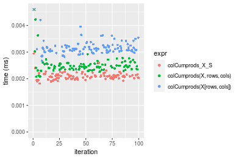

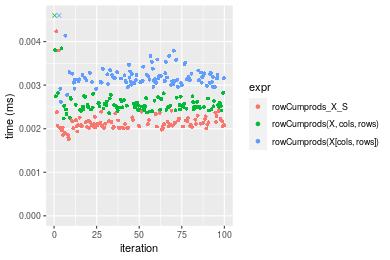
_Table: Benchmarking of colCumprods_X_S() and rowCumprods_X_S() on integer+10x10 data (original and transposed).  The top panel shows times in milliseconds and the bottom panel shows relative times._


|   |expr            |   min|     lq|    mean| median|    uq|    max|
|:--|:---------------|-----:|------:|-------:|------:|-----:|------:|
|1  |colCumprods_X_S | 1.822| 2.0080| 2.96063| 2.0805| 2.158| 88.577|
|2  |rowCumprods_X_S | 1.758| 2.0375| 2.15668| 2.1030| 2.198|  4.234|


|   |expr            |       min|       lq|      mean|   median|       uq|       max|
|:--|:---------------|---------:|--------:|---------:|--------:|--------:|---------:|
|1  |colCumprods_X_S | 1.0000000| 1.000000| 1.0000000| 1.000000| 1.000000| 1.0000000|
|2  |rowCumprods_X_S | 0.9648738| 1.014691| 0.7284531| 1.010815| 1.018536| 0.0478002|

_Figure: Benchmarking of colCumprods_X_S() and rowCumprods_X_S() on integer+10x10 data (original and transposed).  Outliers are displayed as crosses. Times are in milliseconds._


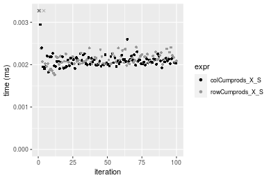

#### 100x100 integer matrix

```r
> X <- data[["100x100"]]
> rows <- sample.int(nrow(X), size = nrow(X) * 0.7)
> cols <- sample.int(ncol(X), size = ncol(X) * 0.7)
> X_S <- X[rows, cols]
> gc()
          used  (Mb) gc trigger  (Mb) max used  (Mb)
Ncells 5191708 277.3    8529671 455.6  8529671 455.6
Vcells 9434675  72.0   31876688 243.2 60562128 462.1
> colStats <- microbenchmark(colCumprods_X_S = colCumprods(X_S), `colCumprods(X, rows, cols)` = colCumprods(X, 
+     rows = rows, cols = cols), `colCumprods(X[rows, cols])` = colCumprods(X[rows, cols]), unit = "ms")
> X <- t(X)
> X_S <- t(X_S)
> gc()
          used  (Mb) gc trigger  (Mb) max used  (Mb)
Ncells 5191684 277.3    8529671 455.6  8529671 455.6
Vcells 9439728  72.1   31876688 243.2 60562128 462.1
> rowStats <- microbenchmark(rowCumprods_X_S = rowCumprods(X_S), `rowCumprods(X, cols, rows)` = rowCumprods(X, 
+     rows = cols, cols = rows), `rowCumprods(X[cols, rows])` = rowCumprods(X[cols, rows]), unit = "ms")
```

_Table: Benchmarking of colCumprods_X_S(), colCumprods(X, rows, cols)() and colCumprods(X[rows, cols])() on integer+100x100 data. The top panel shows times in milliseconds and the bottom panel shows relative times._


|   |expr                       |      min|        lq|      mean|    median|        uq|     max|
|:--|:--------------------------|--------:|---------:|---------:|---------:|---------:|-------:|
|2  |colCumprods(X, rows, cols) | 0.021441| 0.0223445| 0.0226823| 0.0226510| 0.0228050| 0.02858|
|1  |colCumprods_X_S            | 0.022804| 0.0238195| 0.0241365| 0.0239320| 0.0240325| 0.03798|
|3  |colCumprods(X[rows, cols]) | 0.033756| 0.0351225| 0.0356195| 0.0352965| 0.0354945| 0.05809|


|   |expr                       |      min|       lq|     mean|   median|       uq|      max|
|:--|:--------------------------|--------:|--------:|--------:|--------:|--------:|--------:|
|2  |colCumprods(X, rows, cols) | 1.000000| 1.000000| 1.000000| 1.000000| 1.000000| 1.000000|
|1  |colCumprods_X_S            | 1.063570| 1.066012| 1.064113| 1.056554| 1.053826| 1.328901|
|3  |colCumprods(X[rows, cols]) | 1.574367| 1.571863| 1.570367| 1.558276| 1.556435| 2.032540|

_Table: Benchmarking of rowCumprods_X_S(), rowCumprods(X, cols, rows)() and rowCumprods(X[cols, rows])() on integer+100x100 data (transposed). The top panel shows times in milliseconds and the bottom panel shows relative times._


|   |expr                       |      min|       lq|      mean|    median|        uq|      max|
|:--|:--------------------------|--------:|--------:|---------:|---------:|---------:|--------:|
|1  |rowCumprods_X_S            | 0.023088| 0.023602| 0.0241635| 0.0242950| 0.0244940| 0.027498|
|2  |rowCumprods(X, cols, rows) | 0.029301| 0.030197| 0.0310790| 0.0308155| 0.0309935| 0.060236|
|3  |rowCumprods(X[cols, rows]) | 0.034018| 0.034710| 0.0357621| 0.0357075| 0.0359090| 0.049497|


|   |expr                       |      min|       lq|     mean|   median|       uq|      max|
|:--|:--------------------------|--------:|--------:|--------:|--------:|--------:|--------:|
|1  |rowCumprods_X_S            | 1.000000| 1.000000| 1.000000| 1.000000| 1.000000| 1.000000|
|2  |rowCumprods(X, cols, rows) | 1.269101| 1.279426| 1.286195| 1.268389| 1.265351| 2.190559|
|3  |rowCumprods(X[cols, rows]) | 1.473406| 1.470638| 1.480001| 1.469747| 1.466033| 1.800022|

_Figure: Benchmarking of colCumprods_X_S(), colCumprods(X, rows, cols)() and colCumprods(X[rows, cols])() on integer+100x100 data  as well as rowCumprods_X_S(), rowCumprods(X, cols, rows)() and rowCumprods(X[cols, rows])() on the same data transposed.  Outliers are displayed as crosses.  Times are in milliseconds._


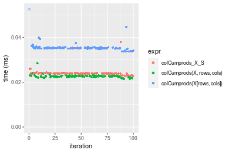

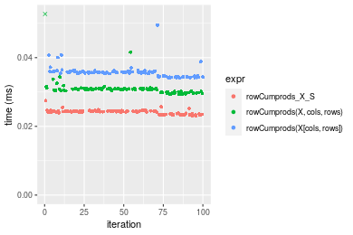
_Table: Benchmarking of colCumprods_X_S() and rowCumprods_X_S() on integer+100x100 data (original and transposed).  The top panel shows times in milliseconds and the bottom panel shows relative times._


|   |expr            |    min|      lq|     mean| median|      uq|    max|
|:--|:---------------|------:|-------:|--------:|------:|-------:|------:|
|1  |colCumprods_X_S | 22.804| 23.8195| 24.13649| 23.932| 24.0325| 37.980|
|2  |rowCumprods_X_S | 23.088| 23.6020| 24.16353| 24.295| 24.4940| 27.498|


|   |expr            |      min|        lq|    mean|   median|       uq|       max|
|:--|:---------------|--------:|---------:|-------:|--------:|--------:|---------:|
|1  |colCumprods_X_S | 1.000000| 1.0000000| 1.00000| 1.000000| 1.000000| 1.0000000|
|2  |rowCumprods_X_S | 1.012454| 0.9908688| 1.00112| 1.015168| 1.019203| 0.7240126|

_Figure: Benchmarking of colCumprods_X_S() and rowCumprods_X_S() on integer+100x100 data (original and transposed).  Outliers are displayed as crosses. Times are in milliseconds._


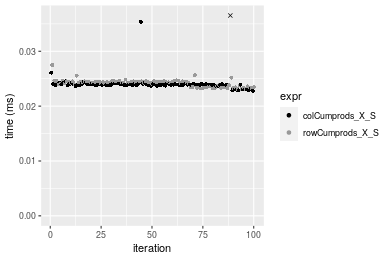

#### 1000x10 integer matrix

```r
> X <- data[["1000x10"]]
> rows <- sample.int(nrow(X), size = nrow(X) * 0.7)
> cols <- sample.int(ncol(X), size = ncol(X) * 0.7)
> X_S <- X[rows, cols]
> gc()
          used  (Mb) gc trigger  (Mb) max used  (Mb)
Ncells 5192450 277.4    8529671 455.6  8529671 455.6
Vcells 9438730  72.1   31876688 243.2 60562128 462.1
> colStats <- microbenchmark(colCumprods_X_S = colCumprods(X_S), `colCumprods(X, rows, cols)` = colCumprods(X, 
+     rows = rows, cols = cols), `colCumprods(X[rows, cols])` = colCumprods(X[rows, cols]), unit = "ms")
> X <- t(X)
> X_S <- t(X_S)
> gc()
          used  (Mb) gc trigger  (Mb) max used  (Mb)
Ncells 5192426 277.4    8529671 455.6  8529671 455.6
Vcells 9443783  72.1   31876688 243.2 60562128 462.1
> rowStats <- microbenchmark(rowCumprods_X_S = rowCumprods(X_S), `rowCumprods(X, cols, rows)` = rowCumprods(X, 
+     rows = cols, cols = rows), `rowCumprods(X[cols, rows])` = rowCumprods(X[cols, rows]), unit = "ms")
```

_Table: Benchmarking of colCumprods_X_S(), colCumprods(X, rows, cols)() and colCumprods(X[rows, cols])() on integer+1000x10 data. The top panel shows times in milliseconds and the bottom panel shows relative times._


|   |expr                       |      min|        lq|      mean|    median|       uq|      max|
|:--|:--------------------------|--------:|---------:|---------:|---------:|--------:|--------:|
|1  |colCumprods_X_S            | 0.021988| 0.0229230| 0.0230527| 0.0230720| 0.023194| 0.027323|
|2  |colCumprods(X, rows, cols) | 0.022796| 0.0238680| 0.0243033| 0.0242825| 0.024512| 0.038235|
|3  |colCumprods(X[rows, cols]) | 0.033491| 0.0339615| 0.0352297| 0.0351105| 0.035352| 0.060301|


|   |expr                       |      min|       lq|     mean|   median|       uq|      max|
|:--|:--------------------------|--------:|--------:|--------:|--------:|--------:|--------:|
|1  |colCumprods_X_S            | 1.000000| 1.000000| 1.000000| 1.000000| 1.000000| 1.000000|
|2  |colCumprods(X, rows, cols) | 1.036747| 1.041225| 1.054248| 1.052466| 1.056825| 1.399371|
|3  |colCumprods(X[rows, cols]) | 1.523149| 1.481547| 1.528226| 1.521780| 1.524187| 2.206968|

_Table: Benchmarking of rowCumprods_X_S(), rowCumprods(X, cols, rows)() and rowCumprods(X[cols, rows])() on integer+1000x10 data (transposed). The top panel shows times in milliseconds and the bottom panel shows relative times._


|   |expr                       |      min|        lq|      mean|    median|        uq|      max|
|:--|:--------------------------|--------:|---------:|---------:|---------:|---------:|--------:|
|1  |rowCumprods_X_S            | 0.023211| 0.0249755| 0.0255337| 0.0252190| 0.0262985| 0.028755|
|2  |rowCumprods(X, cols, rows) | 0.031612| 0.0339985| 0.0348458| 0.0352500| 0.0357070| 0.046902|
|3  |rowCumprods(X[cols, rows]) | 0.035556| 0.0381950| 0.0397198| 0.0388305| 0.0402595| 0.070345|


|   |expr                       |     min|       lq|     mean|   median|       uq|      max|
|:--|:--------------------------|-------:|--------:|--------:|--------:|--------:|--------:|
|1  |rowCumprods_X_S            | 1.00000| 1.000000| 1.000000| 1.000000| 1.000000| 1.000000|
|2  |rowCumprods(X, cols, rows) | 1.36194| 1.361274| 1.364701| 1.397756| 1.357758| 1.631090|
|3  |rowCumprods(X[cols, rows]) | 1.53186| 1.529299| 1.555584| 1.539732| 1.530867| 2.446357|

_Figure: Benchmarking of colCumprods_X_S(), colCumprods(X, rows, cols)() and colCumprods(X[rows, cols])() on integer+1000x10 data  as well as rowCumprods_X_S(), rowCumprods(X, cols, rows)() and rowCumprods(X[cols, rows])() on the same data transposed.  Outliers are displayed as crosses.  Times are in milliseconds._


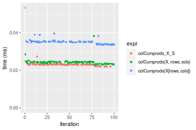

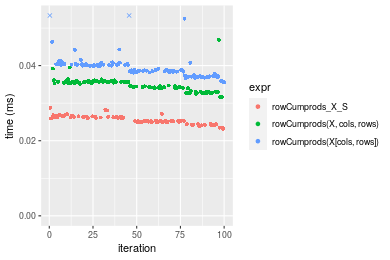
_Table: Benchmarking of colCumprods_X_S() and rowCumprods_X_S() on integer+1000x10 data (original and transposed).  The top panel shows times in milliseconds and the bottom panel shows relative times._


|   |expr            |    min|      lq|     mean| median|      uq|    max|
|:--|:---------------|------:|-------:|--------:|------:|-------:|------:|
|1  |colCumprods_X_S | 21.988| 22.9230| 23.05271| 23.072| 23.1940| 27.323|
|2  |rowCumprods_X_S | 23.211| 24.9755| 25.53368| 25.219| 26.2985| 28.755|


|   |expr            |      min|       lq|     mean|   median|       uq|     max|
|:--|:---------------|--------:|--------:|--------:|--------:|--------:|-------:|
|1  |colCumprods_X_S | 1.000000| 1.000000| 1.000000| 1.000000| 1.000000| 1.00000|
|2  |rowCumprods_X_S | 1.055621| 1.089539| 1.107622| 1.093057| 1.133849| 1.05241|

_Figure: Benchmarking of colCumprods_X_S() and rowCumprods_X_S() on integer+1000x10 data (original and transposed).  Outliers are displayed as crosses. Times are in milliseconds._


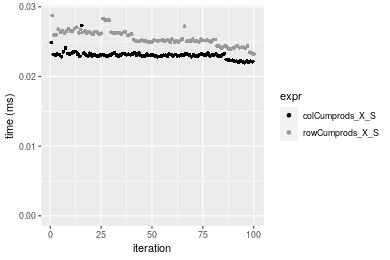

#### 10x1000 integer matrix

```r
> X <- data[["10x1000"]]
> rows <- sample.int(nrow(X), size = nrow(X) * 0.7)
> cols <- sample.int(ncol(X), size = ncol(X) * 0.7)
> X_S <- X[rows, cols]
> gc()
          used  (Mb) gc trigger  (Mb) max used  (Mb)
Ncells 5192655 277.4    8529671 455.6  8529671 455.6
Vcells 9439582  72.1   31876688 243.2 60562128 462.1
> colStats <- microbenchmark(colCumprods_X_S = colCumprods(X_S), `colCumprods(X, rows, cols)` = colCumprods(X, 
+     rows = rows, cols = cols), `colCumprods(X[rows, cols])` = colCumprods(X[rows, cols]), unit = "ms")
> X <- t(X)
> X_S <- t(X_S)
> gc()
          used  (Mb) gc trigger  (Mb) max used  (Mb)
Ncells 5192631 277.4    8529671 455.6  8529671 455.6
Vcells 9444635  72.1   31876688 243.2 60562128 462.1
> rowStats <- microbenchmark(rowCumprods_X_S = rowCumprods(X_S), `rowCumprods(X, cols, rows)` = rowCumprods(X, 
+     rows = cols, cols = rows), `rowCumprods(X[cols, rows])` = rowCumprods(X[cols, rows]), unit = "ms")
```

_Table: Benchmarking of colCumprods_X_S(), colCumprods(X, rows, cols)() and colCumprods(X[rows, cols])() on integer+10x1000 data. The top panel shows times in milliseconds and the bottom panel shows relative times._


|   |expr                       |      min|        lq|      mean|    median|        uq|      max|
|:--|:--------------------------|--------:|---------:|---------:|---------:|---------:|--------:|
|1  |colCumprods_X_S            | 0.025506| 0.0257285| 0.0262958| 0.0258245| 0.0260210| 0.041701|
|2  |colCumprods(X, rows, cols) | 0.026499| 0.0272175| 0.0277237| 0.0274540| 0.0276560| 0.045202|
|3  |colCumprods(X[rows, cols]) | 0.039103| 0.0395035| 0.0402056| 0.0397990| 0.0400215| 0.046300|


|   |expr                       |      min|       lq|     mean|   median|       uq|      max|
|:--|:--------------------------|--------:|--------:|--------:|--------:|--------:|--------:|
|1  |colCumprods_X_S            | 1.000000| 1.000000| 1.000000| 1.000000| 1.000000| 1.000000|
|2  |colCumprods(X, rows, cols) | 1.038932| 1.057874| 1.054303| 1.063099| 1.062834| 1.083955|
|3  |colCumprods(X[rows, cols]) | 1.533090| 1.535399| 1.528976| 1.541133| 1.538046| 1.110285|

_Table: Benchmarking of rowCumprods_X_S(), rowCumprods(X, cols, rows)() and rowCumprods(X[cols, rows])() on integer+10x1000 data (transposed). The top panel shows times in milliseconds and the bottom panel shows relative times._


|   |expr                       |      min|        lq|      mean|    median|        uq|      max|
|:--|:--------------------------|--------:|---------:|---------:|---------:|---------:|--------:|
|1  |rowCumprods_X_S            | 0.021406| 0.0218415| 0.0221303| 0.0219920| 0.0222470| 0.026927|
|2  |rowCumprods(X, cols, rows) | 0.029481| 0.0301780| 0.0310873| 0.0303385| 0.0306885| 0.057404|
|3  |rowCumprods(X[cols, rows]) | 0.033306| 0.0339000| 0.0346626| 0.0340470| 0.0345015| 0.049647|


|   |expr                       |      min|       lq|     mean|   median|       uq|      max|
|:--|:--------------------------|--------:|--------:|--------:|--------:|--------:|--------:|
|1  |rowCumprods_X_S            | 1.000000| 1.000000| 1.000000| 1.000000| 1.000000| 1.000000|
|2  |rowCumprods(X, cols, rows) | 1.377231| 1.381682| 1.404741| 1.379524| 1.379444| 2.131838|
|3  |rowCumprods(X[cols, rows]) | 1.555919| 1.552091| 1.566297| 1.548154| 1.550838| 1.843763|

_Figure: Benchmarking of colCumprods_X_S(), colCumprods(X, rows, cols)() and colCumprods(X[rows, cols])() on integer+10x1000 data  as well as rowCumprods_X_S(), rowCumprods(X, cols, rows)() and rowCumprods(X[cols, rows])() on the same data transposed.  Outliers are displayed as crosses.  Times are in milliseconds._


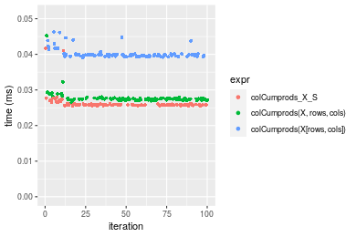

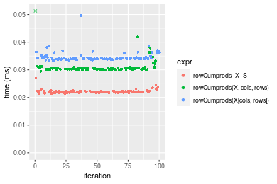
_Table: Benchmarking of colCumprods_X_S() and rowCumprods_X_S() on integer+10x1000 data (original and transposed).  The top panel shows times in milliseconds and the bottom panel shows relative times._


|   |expr            |    min|      lq|     mean|  median|     uq|    max|
|:--|:---------------|------:|-------:|--------:|-------:|------:|------:|
|2  |rowCumprods_X_S | 21.406| 21.8415| 22.13029| 21.9920| 22.247| 26.927|
|1  |colCumprods_X_S | 25.506| 25.7285| 26.29576| 25.8245| 26.021| 41.701|


|   |expr            |      min|       lq|     mean|   median|       uq|      max|
|:--|:---------------|--------:|--------:|--------:|--------:|--------:|--------:|
|2  |rowCumprods_X_S | 1.000000| 1.000000| 1.000000| 1.000000| 1.000000| 1.000000|
|1  |colCumprods_X_S | 1.191535| 1.177964| 1.188225| 1.174268| 1.169641| 1.548669|

_Figure: Benchmarking of colCumprods_X_S() and rowCumprods_X_S() on integer+10x1000 data (original and transposed).  Outliers are displayed as crosses. Times are in milliseconds._


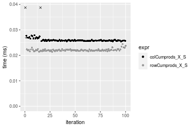

#### 100x1000 integer matrix

```r
> X <- data[["100x1000"]]
> rows <- sample.int(nrow(X), size = nrow(X) * 0.7)
> cols <- sample.int(ncol(X), size = ncol(X) * 0.7)
> X_S <- X[rows, cols]
> gc()
          used  (Mb) gc trigger  (Mb) max used  (Mb)
Ncells 5192866 277.4    8529671 455.6  8529671 455.6
Vcells 9462259  72.2   31876688 243.2 60562128 462.1
> colStats <- microbenchmark(colCumprods_X_S = colCumprods(X_S), `colCumprods(X, rows, cols)` = colCumprods(X, 
+     rows = rows, cols = cols), `colCumprods(X[rows, cols])` = colCumprods(X[rows, cols]), unit = "ms")
> X <- t(X)
> X_S <- t(X_S)
> gc()
          used  (Mb) gc trigger  (Mb) max used  (Mb)
Ncells 5192842 277.4    8529671 455.6  8529671 455.6
Vcells 9512312  72.6   31876688 243.2 60562128 462.1
> rowStats <- microbenchmark(rowCumprods_X_S = rowCumprods(X_S), `rowCumprods(X, cols, rows)` = rowCumprods(X, 
+     rows = cols, cols = rows), `rowCumprods(X[cols, rows])` = rowCumprods(X[cols, rows]), unit = "ms")
```

_Table: Benchmarking of colCumprods_X_S(), colCumprods(X, rows, cols)() and colCumprods(X[rows, cols])() on integer+100x1000 data. The top panel shows times in milliseconds and the bottom panel shows relative times._


|   |expr                       |      min|        lq|      mean|    median|        uq|      max|
|:--|:--------------------------|--------:|---------:|---------:|---------:|---------:|--------:|
|2  |colCumprods(X, rows, cols) | 0.126896| 0.1387655| 0.1601597| 0.1555865| 0.1759090| 0.277073|
|1  |colCumprods_X_S            | 0.134134| 0.1492715| 0.1720807| 0.1678155| 0.1934280| 0.246906|
|3  |colCumprods(X[rows, cols]) | 0.200267| 0.2291715| 0.2606636| 0.2541380| 0.2841425| 0.356816|


|   |expr                       |      min|       lq|     mean|   median|       uq|       max|
|:--|:--------------------------|--------:|--------:|--------:|--------:|--------:|---------:|
|2  |colCumprods(X, rows, cols) | 1.000000| 1.000000| 1.000000| 1.000000| 1.000000| 1.0000000|
|1  |colCumprods_X_S            | 1.057039| 1.075711| 1.074432| 1.078599| 1.099591| 0.8911226|
|3  |colCumprods(X[rows, cols]) | 1.578198| 1.651502| 1.627524| 1.633419| 1.615281| 1.2878050|

_Table: Benchmarking of rowCumprods_X_S(), rowCumprods(X, cols, rows)() and rowCumprods(X[cols, rows])() on integer+100x1000 data (transposed). The top panel shows times in milliseconds and the bottom panel shows relative times._


|   |expr                       |      min|       lq|      mean|    median|       uq|      max|
|:--|:--------------------------|--------:|--------:|---------:|---------:|--------:|--------:|
|1  |rowCumprods_X_S            | 0.128142| 0.149196| 0.1677644| 0.1627060| 0.181955| 0.244547|
|2  |rowCumprods(X, cols, rows) | 0.167780| 0.182036| 0.2084298| 0.2041705| 0.219153| 0.327482|
|3  |rowCumprods(X[cols, rows]) | 0.191850| 0.221605| 0.2487560| 0.2418305| 0.277303| 0.325854|


|   |expr                       |      min|       lq|     mean|   median|       uq|      max|
|:--|:--------------------------|--------:|--------:|--------:|--------:|--------:|--------:|
|1  |rowCumprods_X_S            | 1.000000| 1.000000| 1.000000| 1.000000| 1.000000| 1.000000|
|2  |rowCumprods(X, cols, rows) | 1.309329| 1.220113| 1.242395| 1.254843| 1.204435| 1.339137|
|3  |rowCumprods(X[cols, rows]) | 1.497167| 1.485328| 1.482770| 1.486303| 1.524020| 1.332480|

_Figure: Benchmarking of colCumprods_X_S(), colCumprods(X, rows, cols)() and colCumprods(X[rows, cols])() on integer+100x1000 data  as well as rowCumprods_X_S(), rowCumprods(X, cols, rows)() and rowCumprods(X[cols, rows])() on the same data transposed.  Outliers are displayed as crosses.  Times are in milliseconds._


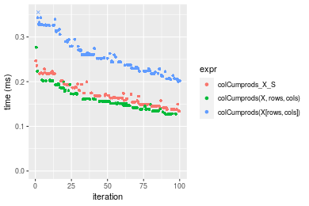

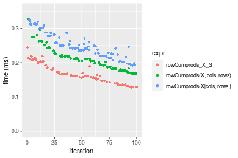
_Table: Benchmarking of colCumprods_X_S() and rowCumprods_X_S() on integer+100x1000 data (original and transposed).  The top panel shows times in milliseconds and the bottom panel shows relative times._


|   |expr            |     min|       lq|     mean|   median|      uq|     max|
|:--|:---------------|-------:|--------:|--------:|--------:|-------:|-------:|
|2  |rowCumprods_X_S | 128.142| 149.1960| 167.7644| 162.7060| 181.955| 244.547|
|1  |colCumprods_X_S | 134.134| 149.2715| 172.0807| 167.8155| 193.428| 246.906|


|   |expr            |      min|       lq|     mean|   median|       uq|      max|
|:--|:---------------|--------:|--------:|--------:|--------:|--------:|--------:|
|2  |rowCumprods_X_S | 1.000000| 1.000000| 1.000000| 1.000000| 1.000000| 1.000000|
|1  |colCumprods_X_S | 1.046761| 1.000506| 1.025728| 1.031403| 1.063054| 1.009646|

_Figure: Benchmarking of colCumprods_X_S() and rowCumprods_X_S() on integer+100x1000 data (original and transposed).  Outliers are displayed as crosses. Times are in milliseconds._


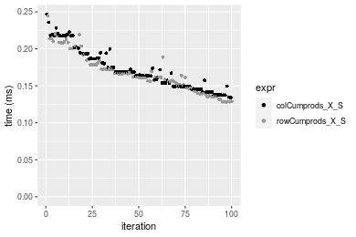

#### 1000x100 integer matrix

```r
> X <- data[["1000x100"]]
> rows <- sample.int(nrow(X), size = nrow(X) * 0.7)
> cols <- sample.int(ncol(X), size = ncol(X) * 0.7)
> X_S <- X[rows, cols]
> gc()
          used  (Mb) gc trigger  (Mb) max used  (Mb)
Ncells 5193076 277.4    8529671 455.6  8529671 455.6
Vcells 9463043  72.2   31876688 243.2 60562128 462.1
> colStats <- microbenchmark(colCumprods_X_S = colCumprods(X_S), `colCumprods(X, rows, cols)` = colCumprods(X, 
+     rows = rows, cols = cols), `colCumprods(X[rows, cols])` = colCumprods(X[rows, cols]), unit = "ms")
> X <- t(X)
> X_S <- t(X_S)
> gc()
          used  (Mb) gc trigger  (Mb) max used  (Mb)
Ncells 5193052 277.4    8529671 455.6  8529671 455.6
Vcells 9513096  72.6   31876688 243.2 60562128 462.1
> rowStats <- microbenchmark(rowCumprods_X_S = rowCumprods(X_S), `rowCumprods(X, cols, rows)` = rowCumprods(X, 
+     rows = cols, cols = rows), `rowCumprods(X[cols, rows])` = rowCumprods(X[cols, rows]), unit = "ms")
```

_Table: Benchmarking of colCumprods_X_S(), colCumprods(X, rows, cols)() and colCumprods(X[rows, cols])() on integer+1000x100 data. The top panel shows times in milliseconds and the bottom panel shows relative times._


|   |expr                       |      min|        lq|      mean|    median|        uq|      max|
|:--|:--------------------------|--------:|---------:|---------:|---------:|---------:|--------:|
|2  |colCumprods(X, rows, cols) | 0.121293| 0.1392520| 0.1606841| 0.1574875| 0.1692505| 0.237311|
|1  |colCumprods_X_S            | 0.128511| 0.1474575| 0.1661782| 0.1616625| 0.1711695| 0.251502|
|3  |colCumprods(X[rows, cols]) | 0.193243| 0.2196735| 0.2546033| 0.2427595| 0.2880905| 0.374580|


|   |expr                       |      min|       lq|     mean|   median|       uq|      max|
|:--|:--------------------------|--------:|--------:|--------:|--------:|--------:|--------:|
|2  |colCumprods(X, rows, cols) | 1.000000| 1.000000| 1.000000| 1.000000| 1.000000| 1.000000|
|1  |colCumprods_X_S            | 1.059509| 1.058925| 1.034192| 1.026510| 1.011338| 1.059799|
|3  |colCumprods(X[rows, cols]) | 1.593192| 1.577525| 1.584495| 1.541452| 1.702155| 1.578435|

_Table: Benchmarking of rowCumprods_X_S(), rowCumprods(X, cols, rows)() and rowCumprods(X[cols, rows])() on integer+1000x100 data (transposed). The top panel shows times in milliseconds and the bottom panel shows relative times._


|   |expr                       |      min|        lq|      mean|   median|        uq|      max|
|:--|:--------------------------|--------:|---------:|---------:|--------:|---------:|--------:|
|1  |rowCumprods_X_S            | 0.134418| 0.1417770| 0.1634373| 0.158983| 0.1761790| 0.232506|
|2  |rowCumprods(X, cols, rows) | 0.170420| 0.1795645| 0.2088120| 0.207295| 0.2220780| 0.350441|
|3  |rowCumprods(X[cols, rows]) | 0.201386| 0.2090830| 0.2436314| 0.231745| 0.2669365| 0.343087|


|   |expr                       |      min|       lq|     mean|   median|       uq|      max|
|:--|:--------------------------|--------:|--------:|--------:|--------:|--------:|--------:|
|1  |rowCumprods_X_S            | 1.000000| 1.000000| 1.000000| 1.000000| 1.000000| 1.000000|
|2  |rowCumprods(X, cols, rows) | 1.267836| 1.266528| 1.277628| 1.303881| 1.260525| 1.507234|
|3  |rowCumprods(X[cols, rows]) | 1.498207| 1.474731| 1.490673| 1.457672| 1.515144| 1.475605|

_Figure: Benchmarking of colCumprods_X_S(), colCumprods(X, rows, cols)() and colCumprods(X[rows, cols])() on integer+1000x100 data  as well as rowCumprods_X_S(), rowCumprods(X, cols, rows)() and rowCumprods(X[cols, rows])() on the same data transposed.  Outliers are displayed as crosses.  Times are in milliseconds._


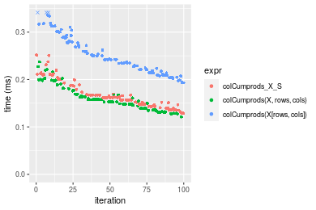

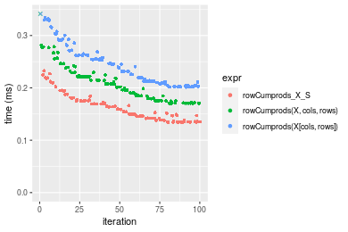
_Table: Benchmarking of colCumprods_X_S() and rowCumprods_X_S() on integer+1000x100 data (original and transposed).  The top panel shows times in milliseconds and the bottom panel shows relative times._


|   |expr            |     min|       lq|     mean|   median|       uq|     max|
|:--|:---------------|-------:|--------:|--------:|--------:|--------:|-------:|
|2  |rowCumprods_X_S | 134.418| 141.7770| 163.4373| 158.9830| 176.1790| 232.506|
|1  |colCumprods_X_S | 128.511| 147.4575| 166.1782| 161.6625| 171.1695| 251.502|


|   |expr            |      min|       lq|     mean|   median|        uq|      max|
|:--|:---------------|--------:|--------:|--------:|--------:|---------:|--------:|
|2  |rowCumprods_X_S | 1.000000| 1.000000| 1.000000| 1.000000| 1.0000000| 1.000000|
|1  |colCumprods_X_S | 0.956055| 1.040066| 1.016771| 1.016854| 0.9715659| 1.081701|

_Figure: Benchmarking of colCumprods_X_S() and rowCumprods_X_S() on integer+1000x100 data (original and transposed).  Outliers are displayed as crosses. Times are in milliseconds._


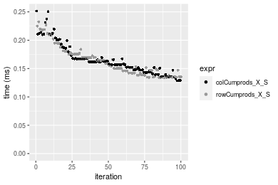


## Data type "double"

### Data
```r
> rmatrix <- function(nrow, ncol, mode = c("logical", "double", "integer", "index"), range = c(-100, 
+     +100), na_prob = 0) {
+     mode <- match.arg(mode)
+     n <- nrow * ncol
+     if (mode == "logical") {
+         x <- sample(c(FALSE, TRUE), size = n, replace = TRUE)
+     }     else if (mode == "index") {
+         x <- seq_len(n)
+         mode <- "integer"
+     }     else {
+         x <- runif(n, min = range[1], max = range[2])
+     }
+     storage.mode(x) <- mode
+     if (na_prob > 0) 
+         x[sample(n, size = na_prob * n)] <- NA
+     dim(x) <- c(nrow, ncol)
+     x
+ }
> rmatrices <- function(scale = 10, seed = 1, ...) {
+     set.seed(seed)
+     data <- list()
+     data[[1]] <- rmatrix(nrow = scale * 1, ncol = scale * 1, ...)
+     data[[2]] <- rmatrix(nrow = scale * 10, ncol = scale * 10, ...)
+     data[[3]] <- rmatrix(nrow = scale * 100, ncol = scale * 1, ...)
+     data[[4]] <- t(data[[3]])
+     data[[5]] <- rmatrix(nrow = scale * 10, ncol = scale * 100, ...)
+     data[[6]] <- t(data[[5]])
+     names(data) <- sapply(data, FUN = function(x) paste(dim(x), collapse = "x"))
+     data
+ }
> data <- rmatrices(mode = mode, range = c(-1, 1))
```

### Results

#### 10x10 double matrix

```r
> X <- data[["10x10"]]
> rows <- sample.int(nrow(X), size = nrow(X) * 0.7)
> cols <- sample.int(ncol(X), size = ncol(X) * 0.7)
> X_S <- X[rows, cols]
> gc()
          used  (Mb) gc trigger  (Mb) max used  (Mb)
Ncells 5193294 277.4    8529671 455.6  8529671 455.6
Vcells 9554158  72.9   31876688 243.2 60562128 462.1
> colStats <- microbenchmark(colCumprods_X_S = colCumprods(X_S), `colCumprods(X, rows, cols)` = colCumprods(X, 
+     rows = rows, cols = cols), `colCumprods(X[rows, cols])` = colCumprods(X[rows, cols]), unit = "ms")
> X <- t(X)
> X_S <- t(X_S)
> gc()
          used  (Mb) gc trigger  (Mb) max used  (Mb)
Ncells 5193261 277.4    8529671 455.6  8529671 455.6
Vcells 9554296  72.9   31876688 243.2 60562128 462.1
> rowStats <- microbenchmark(rowCumprods_X_S = rowCumprods(X_S), `rowCumprods(X, cols, rows)` = rowCumprods(X, 
+     rows = cols, cols = rows), `rowCumprods(X[cols, rows])` = rowCumprods(X[cols, rows]), unit = "ms")
```

_Table: Benchmarking of colCumprods_X_S(), colCumprods(X, rows, cols)() and colCumprods(X[rows, cols])() on double+10x10 data. The top panel shows times in milliseconds and the bottom panel shows relative times._


|   |expr                       |      min|        lq|      mean|    median|       uq|      max|
|:--|:--------------------------|--------:|---------:|---------:|---------:|--------:|--------:|
|1  |colCumprods_X_S            | 0.001723| 0.0018920| 0.0021445| 0.0019985| 0.002053| 0.016670|
|2  |colCumprods(X, rows, cols) | 0.001984| 0.0022735| 0.0023828| 0.0023190| 0.002411| 0.004820|
|3  |colCumprods(X[rows, cols]) | 0.002756| 0.0029670| 0.0031282| 0.0030700| 0.003185| 0.007519|


|   |expr                       |      min|       lq|     mean|   median|       uq|       max|
|:--|:--------------------------|--------:|--------:|--------:|--------:|--------:|---------:|
|1  |colCumprods_X_S            | 1.000000| 1.000000| 1.000000| 1.000000| 1.000000| 1.0000000|
|2  |colCumprods(X, rows, cols) | 1.151480| 1.201639| 1.111126| 1.160370| 1.174379| 0.2891422|
|3  |colCumprods(X[rows, cols]) | 1.599536| 1.568182| 1.458694| 1.536152| 1.551388| 0.4510498|

_Table: Benchmarking of rowCumprods_X_S(), rowCumprods(X, cols, rows)() and rowCumprods(X[cols, rows])() on double+10x10 data (transposed). The top panel shows times in milliseconds and the bottom panel shows relative times._


|   |expr                       |      min|        lq|      mean|    median|        uq|      max|
|:--|:--------------------------|--------:|---------:|---------:|---------:|---------:|--------:|
|1  |rowCumprods_X_S            | 0.001694| 0.0019545| 0.0022622| 0.0020285| 0.0021635| 0.012304|
|2  |rowCumprods(X, cols, rows) | 0.002157| 0.0023070| 0.0027454| 0.0023850| 0.0025010| 0.033352|
|3  |rowCumprods(X[cols, rows]) | 0.002732| 0.0030520| 0.0032582| 0.0031625| 0.0033055| 0.008278|


|   |expr                       |      min|       lq|     mean|   median|       uq|       max|
|:--|:--------------------------|--------:|--------:|--------:|--------:|--------:|---------:|
|1  |rowCumprods_X_S            | 1.000000| 1.000000| 1.000000| 1.000000| 1.000000| 1.0000000|
|2  |rowCumprods(X, cols, rows) | 1.273318| 1.180353| 1.213584| 1.175746| 1.155997| 2.7106632|
|3  |rowCumprods(X[cols, rows]) | 1.612751| 1.561525| 1.440225| 1.559034| 1.527848| 0.6727893|

_Figure: Benchmarking of colCumprods_X_S(), colCumprods(X, rows, cols)() and colCumprods(X[rows, cols])() on double+10x10 data  as well as rowCumprods_X_S(), rowCumprods(X, cols, rows)() and rowCumprods(X[cols, rows])() on the same data transposed.  Outliers are displayed as crosses.  Times are in milliseconds._


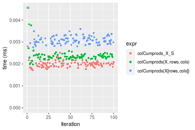

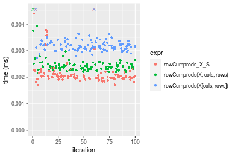
_Table: Benchmarking of colCumprods_X_S() and rowCumprods_X_S() on double+10x10 data (original and transposed).  The top panel shows times in milliseconds and the bottom panel shows relative times._


|   |expr            |   min|     lq|    mean| median|     uq|    max|
|:--|:---------------|-----:|------:|-------:|------:|------:|------:|
|1  |colCumprods_X_S | 1.723| 1.8920| 2.14450| 1.9985| 2.0530| 16.670|
|2  |rowCumprods_X_S | 1.694| 1.9545| 2.26225| 2.0285| 2.1635| 12.304|


|   |expr            |       min|       lq|     mean|   median|       uq|       max|
|:--|:---------------|---------:|--------:|--------:|--------:|--------:|---------:|
|1  |colCumprods_X_S | 1.0000000| 1.000000| 1.000000| 1.000000| 1.000000| 1.0000000|
|2  |rowCumprods_X_S | 0.9831689| 1.033034| 1.054908| 1.015011| 1.053824| 0.7380924|

_Figure: Benchmarking of colCumprods_X_S() and rowCumprods_X_S() on double+10x10 data (original and transposed).  Outliers are displayed as crosses. Times are in milliseconds._


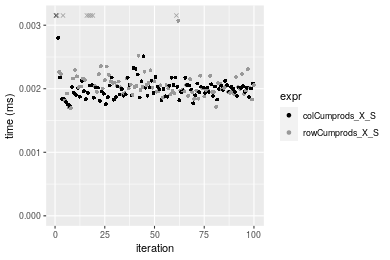

#### 100x100 double matrix

```r
> X <- data[["100x100"]]
> rows <- sample.int(nrow(X), size = nrow(X) * 0.7)
> cols <- sample.int(ncol(X), size = ncol(X) * 0.7)
> X_S <- X[rows, cols]
> gc()
          used  (Mb) gc trigger  (Mb) max used  (Mb)
Ncells 5193493 277.4    8529671 455.6  8529671 455.6
Vcells 9560122  73.0   31876688 243.2 60562128 462.1
> colStats <- microbenchmark(colCumprods_X_S = colCumprods(X_S), `colCumprods(X, rows, cols)` = colCumprods(X, 
+     rows = rows, cols = cols), `colCumprods(X[rows, cols])` = colCumprods(X[rows, cols]), unit = "ms")
> X <- t(X)
> X_S <- t(X_S)
> gc()
          used  (Mb) gc trigger  (Mb) max used  (Mb)
Ncells 5193469 277.4    8529671 455.6  8529671 455.6
Vcells 9570175  73.1   31876688 243.2 60562128 462.1
> rowStats <- microbenchmark(rowCumprods_X_S = rowCumprods(X_S), `rowCumprods(X, cols, rows)` = rowCumprods(X, 
+     rows = cols, cols = rows), `rowCumprods(X[cols, rows])` = rowCumprods(X[cols, rows]), unit = "ms")
```

_Table: Benchmarking of colCumprods_X_S(), colCumprods(X, rows, cols)() and colCumprods(X[rows, cols])() on double+100x100 data. The top panel shows times in milliseconds and the bottom panel shows relative times._


|   |expr                       |      min|        lq|      mean|    median|        uq|      max|
|:--|:--------------------------|--------:|---------:|---------:|---------:|---------:|--------:|
|1  |colCumprods_X_S            | 0.012336| 0.0128960| 0.0132486| 0.0131285| 0.0133315| 0.022399|
|2  |colCumprods(X, rows, cols) | 0.012199| 0.0130155| 0.0139613| 0.0134930| 0.0138705| 0.044148|
|3  |colCumprods(X[rows, cols]) | 0.028018| 0.0291685| 0.0299914| 0.0294915| 0.0296575| 0.054085|


|   |expr                       |       min|       lq|     mean|   median|       uq|      max|
|:--|:--------------------------|---------:|--------:|--------:|--------:|--------:|--------:|
|1  |colCumprods_X_S            | 1.0000000| 1.000000| 1.000000| 1.000000| 1.000000| 1.000000|
|2  |colCumprods(X, rows, cols) | 0.9888943| 1.009266| 1.053798| 1.027764| 1.040431| 1.970981|
|3  |colCumprods(X[rows, cols]) | 2.2712387| 2.261825| 2.263747| 2.246372| 2.224618| 2.414617|

_Table: Benchmarking of rowCumprods_X_S(), rowCumprods(X, cols, rows)() and rowCumprods(X[cols, rows])() on double+100x100 data (transposed). The top panel shows times in milliseconds and the bottom panel shows relative times._


|   |expr                       |      min|        lq|      mean|   median|        uq|      max|
|:--|:--------------------------|--------:|---------:|---------:|--------:|---------:|--------:|
|1  |rowCumprods_X_S            | 0.016491| 0.0171385| 0.0176957| 0.017725| 0.0180225| 0.023410|
|2  |rowCumprods(X, cols, rows) | 0.017039| 0.0177355| 0.0186849| 0.018173| 0.0187380| 0.043777|
|3  |rowCumprods(X[cols, rows]) | 0.031488| 0.0329055| 0.0340712| 0.033576| 0.0344720| 0.049186|


|   |expr                       |      min|       lq|     mean|   median|      uq|      max|
|:--|:--------------------------|--------:|--------:|--------:|--------:|-------:|--------:|
|1  |rowCumprods_X_S            | 1.000000| 1.000000| 1.000000| 1.000000| 1.00000| 1.000000|
|2  |rowCumprods(X, cols, rows) | 1.033230| 1.034834| 1.055899| 1.025275| 1.03970| 1.870013|
|3  |rowCumprods(X[cols, rows]) | 1.909405| 1.919976| 1.925396| 1.894274| 1.91272| 2.101068|

_Figure: Benchmarking of colCumprods_X_S(), colCumprods(X, rows, cols)() and colCumprods(X[rows, cols])() on double+100x100 data  as well as rowCumprods_X_S(), rowCumprods(X, cols, rows)() and rowCumprods(X[cols, rows])() on the same data transposed.  Outliers are displayed as crosses.  Times are in milliseconds._


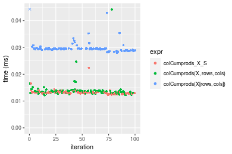

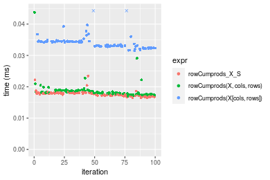
_Table: Benchmarking of colCumprods_X_S() and rowCumprods_X_S() on double+100x100 data (original and transposed).  The top panel shows times in milliseconds and the bottom panel shows relative times._


|   |expr            |    min|      lq|     mean|  median|      uq|    max|
|:--|:---------------|------:|-------:|--------:|-------:|-------:|------:|
|1  |colCumprods_X_S | 12.336| 12.8960| 13.24858| 13.1285| 13.3315| 22.399|
|2  |rowCumprods_X_S | 16.491| 17.1385| 17.69571| 17.7250| 18.0225| 23.410|


|   |expr            |      min|       lq|     mean|   median|       uq|      max|
|:--|:---------------|--------:|--------:|--------:|--------:|--------:|--------:|
|1  |colCumprods_X_S | 1.000000| 1.000000| 1.000000| 1.000000| 1.000000| 1.000000|
|2  |rowCumprods_X_S | 1.336819| 1.328978| 1.335668| 1.350116| 1.351873| 1.045136|

_Figure: Benchmarking of colCumprods_X_S() and rowCumprods_X_S() on double+100x100 data (original and transposed).  Outliers are displayed as crosses. Times are in milliseconds._


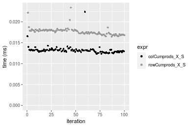

#### 1000x10 double matrix

```r
> X <- data[["1000x10"]]
> rows <- sample.int(nrow(X), size = nrow(X) * 0.7)
> cols <- sample.int(ncol(X), size = ncol(X) * 0.7)
> X_S <- X[rows, cols]
> gc()
          used  (Mb) gc trigger  (Mb) max used  (Mb)
Ncells 5193692 277.4    8529671 455.6  8529671 455.6
Vcells 9561538  73.0   31876688 243.2 60562128 462.1
> colStats <- microbenchmark(colCumprods_X_S = colCumprods(X_S), `colCumprods(X, rows, cols)` = colCumprods(X, 
+     rows = rows, cols = cols), `colCumprods(X[rows, cols])` = colCumprods(X[rows, cols]), unit = "ms")
> X <- t(X)
> X_S <- t(X_S)
> gc()
          used  (Mb) gc trigger  (Mb) max used  (Mb)
Ncells 5193668 277.4    8529671 455.6  8529671 455.6
Vcells 9571591  73.1   31876688 243.2 60562128 462.1
> rowStats <- microbenchmark(rowCumprods_X_S = rowCumprods(X_S), `rowCumprods(X, cols, rows)` = rowCumprods(X, 
+     rows = cols, cols = rows), `rowCumprods(X[cols, rows])` = rowCumprods(X[cols, rows]), unit = "ms")
```

_Table: Benchmarking of colCumprods_X_S(), colCumprods(X, rows, cols)() and colCumprods(X[rows, cols])() on double+1000x10 data. The top panel shows times in milliseconds and the bottom panel shows relative times._


|   |expr                       |      min|        lq|      mean|    median|        uq|      max|
|:--|:--------------------------|--------:|---------:|---------:|---------:|---------:|--------:|
|1  |colCumprods_X_S            | 0.013771| 0.0144340| 0.0155603| 0.0145785| 0.0149540| 0.028134|
|2  |colCumprods(X, rows, cols) | 0.015254| 0.0161860| 0.0175489| 0.0165900| 0.0168765| 0.033195|
|3  |colCumprods(X[rows, cols]) | 0.030178| 0.0313385| 0.0326032| 0.0315635| 0.0318470| 0.062813|


|   |expr                       |      min|       lq|     mean|   median|       uq|      max|
|:--|:--------------------------|--------:|--------:|--------:|--------:|--------:|--------:|
|1  |colCumprods_X_S            | 1.000000| 1.000000| 1.000000| 1.000000| 1.000000| 1.000000|
|2  |colCumprods(X, rows, cols) | 1.107690| 1.121380| 1.127797| 1.137977| 1.128561| 1.179889|
|3  |colCumprods(X[rows, cols]) | 2.191417| 2.171158| 2.095283| 2.165072| 2.129664| 2.232637|

_Table: Benchmarking of rowCumprods_X_S(), rowCumprods(X, cols, rows)() and rowCumprods(X[cols, rows])() on double+1000x10 data (transposed). The top panel shows times in milliseconds and the bottom panel shows relative times._


|   |expr                       |      min|        lq|      mean|    median|        uq|      max|
|:--|:--------------------------|--------:|---------:|---------:|---------:|---------:|--------:|
|1  |rowCumprods_X_S            | 0.018863| 0.0197505| 0.0208456| 0.0203745| 0.0211705| 0.035212|
|2  |rowCumprods(X, cols, rows) | 0.022238| 0.0233740| 0.0246005| 0.0243440| 0.0252385| 0.040047|
|3  |rowCumprods(X[cols, rows]) | 0.036841| 0.0380115| 0.0406848| 0.0395765| 0.0412700| 0.081365|


|   |expr                       |      min|       lq|     mean|   median|       uq|      max|
|:--|:--------------------------|--------:|--------:|--------:|--------:|--------:|--------:|
|1  |rowCumprods_X_S            | 1.000000| 1.000000| 1.000000| 1.000000| 1.000000| 1.000000|
|2  |rowCumprods(X, cols, rows) | 1.178922| 1.183464| 1.180129| 1.194827| 1.192154| 1.137311|
|3  |rowCumprods(X[cols, rows]) | 1.953083| 1.924584| 1.951724| 1.942453| 1.949411| 2.310718|

_Figure: Benchmarking of colCumprods_X_S(), colCumprods(X, rows, cols)() and colCumprods(X[rows, cols])() on double+1000x10 data  as well as rowCumprods_X_S(), rowCumprods(X, cols, rows)() and rowCumprods(X[cols, rows])() on the same data transposed.  Outliers are displayed as crosses.  Times are in milliseconds._


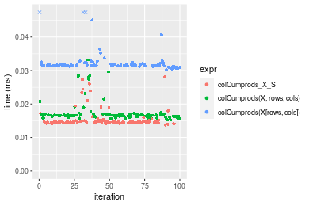

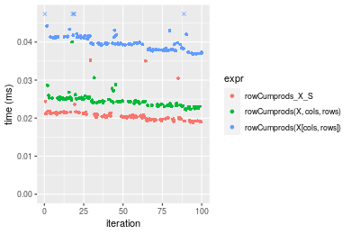
_Table: Benchmarking of colCumprods_X_S() and rowCumprods_X_S() on double+1000x10 data (original and transposed).  The top panel shows times in milliseconds and the bottom panel shows relative times._


|   |expr            |    min|      lq|     mean|  median|      uq|    max|
|:--|:---------------|------:|-------:|--------:|-------:|-------:|------:|
|1  |colCumprods_X_S | 13.771| 14.4340| 15.56029| 14.5785| 14.9540| 28.134|
|2  |rowCumprods_X_S | 18.863| 19.7505| 20.84560| 20.3745| 21.1705| 35.212|


|   |expr            |      min|       lq|     mean|   median|       uq|      max|
|:--|:---------------|--------:|--------:|--------:|--------:|--------:|--------:|
|1  |colCumprods_X_S | 1.000000| 1.000000| 1.000000| 1.000000| 1.000000| 1.000000|
|2  |rowCumprods_X_S | 1.369762| 1.368332| 1.339667| 1.397572| 1.415708| 1.251582|

_Figure: Benchmarking of colCumprods_X_S() and rowCumprods_X_S() on double+1000x10 data (original and transposed).  Outliers are displayed as crosses. Times are in milliseconds._


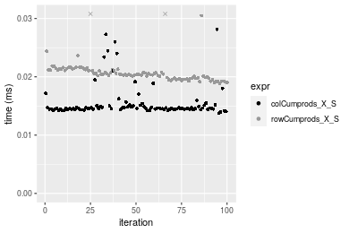

#### 10x1000 double matrix

```r
> X <- data[["10x1000"]]
> rows <- sample.int(nrow(X), size = nrow(X) * 0.7)
> cols <- sample.int(ncol(X), size = ncol(X) * 0.7)
> X_S <- X[rows, cols]
> gc()
          used  (Mb) gc trigger  (Mb) max used  (Mb)
Ncells 5193897 277.4    8529671 455.6  8529671 455.6
Vcells 9561674  73.0   31876688 243.2 60562128 462.1
> colStats <- microbenchmark(colCumprods_X_S = colCumprods(X_S), `colCumprods(X, rows, cols)` = colCumprods(X, 
+     rows = rows, cols = cols), `colCumprods(X[rows, cols])` = colCumprods(X[rows, cols]), unit = "ms")
> X <- t(X)
> X_S <- t(X_S)
> gc()
          used  (Mb) gc trigger  (Mb) max used  (Mb)
Ncells 5193873 277.4    8529671 455.6  8529671 455.6
Vcells 9571727  73.1   31876688 243.2 60562128 462.1
> rowStats <- microbenchmark(rowCumprods_X_S = rowCumprods(X_S), `rowCumprods(X, cols, rows)` = rowCumprods(X, 
+     rows = cols, cols = rows), `rowCumprods(X[cols, rows])` = rowCumprods(X[cols, rows]), unit = "ms")
```

_Table: Benchmarking of colCumprods_X_S(), colCumprods(X, rows, cols)() and colCumprods(X[rows, cols])() on double+10x1000 data. The top panel shows times in milliseconds and the bottom panel shows relative times._


|   |expr                       |      min|        lq|      mean|    median|        uq|      max|
|:--|:--------------------------|--------:|---------:|---------:|---------:|---------:|--------:|
|1  |colCumprods_X_S            | 0.014407| 0.0149005| 0.0154546| 0.0150870| 0.0152950| 0.040956|
|2  |colCumprods(X, rows, cols) | 0.015947| 0.0173390| 0.0186091| 0.0177910| 0.0181915| 0.050309|
|3  |colCumprods(X[rows, cols]) | 0.033177| 0.0347320| 0.0358207| 0.0350095| 0.0354080| 0.058166|


|   |expr                       |      min|       lq|     mean|   median|       uq|      max|
|:--|:--------------------------|--------:|--------:|--------:|--------:|--------:|--------:|
|1  |colCumprods_X_S            | 1.000000| 1.000000| 1.000000| 1.000000| 1.000000| 1.000000|
|2  |colCumprods(X, rows, cols) | 1.106893| 1.163652| 1.204115| 1.179227| 1.189376| 1.228367|
|3  |colCumprods(X[rows, cols]) | 2.302839| 2.330929| 2.317806| 2.320508| 2.315005| 1.420207|

_Table: Benchmarking of rowCumprods_X_S(), rowCumprods(X, cols, rows)() and rowCumprods(X[cols, rows])() on double+10x1000 data (transposed). The top panel shows times in milliseconds and the bottom panel shows relative times._


|   |expr                       |      min|        lq|      mean|    median|        uq|      max|
|:--|:--------------------------|--------:|---------:|---------:|---------:|---------:|--------:|
|1  |rowCumprods_X_S            | 0.015177| 0.0158065| 0.0161303| 0.0160155| 0.0163330| 0.020969|
|2  |rowCumprods(X, cols, rows) | 0.017840| 0.0186015| 0.0195433| 0.0189065| 0.0191330| 0.049796|
|3  |rowCumprods(X[cols, rows]) | 0.030701| 0.0319855| 0.0327561| 0.0323630| 0.0334105| 0.046895|


|   |expr                       |      min|       lq|     mean|   median|       uq|      max|
|:--|:--------------------------|--------:|--------:|--------:|--------:|--------:|--------:|
|1  |rowCumprods_X_S            | 1.000000| 1.000000| 1.000000| 1.000000| 1.000000| 1.000000|
|2  |rowCumprods(X, cols, rows) | 1.175463| 1.176826| 1.211587| 1.180513| 1.171432| 2.374744|
|3  |rowCumprods(X[cols, rows]) | 2.022864| 2.023566| 2.030715| 2.020730| 2.045583| 2.236397|

_Figure: Benchmarking of colCumprods_X_S(), colCumprods(X, rows, cols)() and colCumprods(X[rows, cols])() on double+10x1000 data  as well as rowCumprods_X_S(), rowCumprods(X, cols, rows)() and rowCumprods(X[cols, rows])() on the same data transposed.  Outliers are displayed as crosses.  Times are in milliseconds._


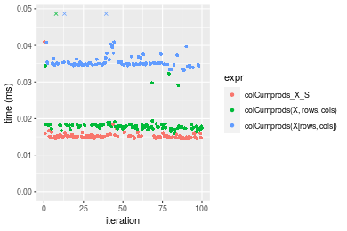

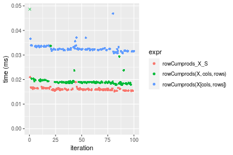
_Table: Benchmarking of colCumprods_X_S() and rowCumprods_X_S() on double+10x1000 data (original and transposed).  The top panel shows times in milliseconds and the bottom panel shows relative times._


|   |expr            |    min|      lq|     mean|  median|     uq|    max|
|:--|:---------------|------:|-------:|--------:|-------:|------:|------:|
|1  |colCumprods_X_S | 14.407| 14.9005| 15.45457| 15.0870| 15.295| 40.956|
|2  |rowCumprods_X_S | 15.177| 15.8065| 16.13031| 16.0155| 16.333| 20.969|


|   |expr            |      min|       lq|     mean|   median|       uq|       max|
|:--|:---------------|--------:|--------:|--------:|--------:|--------:|---------:|
|1  |colCumprods_X_S | 1.000000| 1.000000| 1.000000| 1.000000| 1.000000| 1.0000000|
|2  |rowCumprods_X_S | 1.053446| 1.060803| 1.043724| 1.061543| 1.067865| 0.5119885|

_Figure: Benchmarking of colCumprods_X_S() and rowCumprods_X_S() on double+10x1000 data (original and transposed).  Outliers are displayed as crosses. Times are in milliseconds._


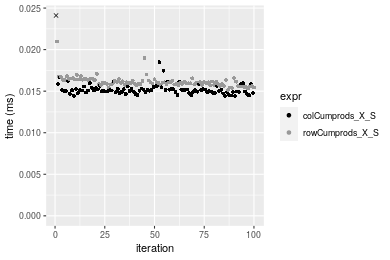

#### 100x1000 double matrix

```r
> X <- data[["100x1000"]]
> rows <- sample.int(nrow(X), size = nrow(X) * 0.7)
> cols <- sample.int(ncol(X), size = ncol(X) * 0.7)
> X_S <- X[rows, cols]
> gc()
          used  (Mb) gc trigger  (Mb) max used  (Mb)
Ncells 5194108 277.4    8529671 455.6  8529671 455.6
Vcells 9607144  73.3   31876688 243.2 60562128 462.1
> colStats <- microbenchmark(colCumprods_X_S = colCumprods(X_S), `colCumprods(X, rows, cols)` = colCumprods(X, 
+     rows = rows, cols = cols), `colCumprods(X[rows, cols])` = colCumprods(X[rows, cols]), unit = "ms")
> X <- t(X)
> X_S <- t(X_S)
> gc()
          used  (Mb) gc trigger  (Mb) max used  (Mb)
Ncells 5194084 277.4    8529671 455.6  8529671 455.6
Vcells 9707197  74.1   31876688 243.2 60562128 462.1
> rowStats <- microbenchmark(rowCumprods_X_S = rowCumprods(X_S), `rowCumprods(X, cols, rows)` = rowCumprods(X, 
+     rows = cols, cols = rows), `rowCumprods(X[cols, rows])` = rowCumprods(X[cols, rows]), unit = "ms")
```

_Table: Benchmarking of colCumprods_X_S(), colCumprods(X, rows, cols)() and colCumprods(X[rows, cols])() on double+100x1000 data. The top panel shows times in milliseconds and the bottom panel shows relative times._


|   |expr                       |      min|        lq|      mean|    median|        uq|      max|
|:--|:--------------------------|--------:|---------:|---------:|---------:|---------:|--------:|
|1  |colCumprods_X_S            | 0.077247| 0.0830300| 0.0924106| 0.0881235| 0.0994515| 0.138448|
|2  |colCumprods(X, rows, cols) | 0.080875| 0.0880115| 0.0962571| 0.0921245| 0.1035620| 0.217449|
|3  |colCumprods(X[rows, cols]) | 0.188139| 0.2061475| 0.2239854| 0.2153790| 0.2455685| 0.298529|


|   |expr                       |      min|       lq|     mean|   median|       uq|      max|
|:--|:--------------------------|--------:|--------:|--------:|--------:|--------:|--------:|
|1  |colCumprods_X_S            | 1.000000| 1.000000| 1.000000| 1.000000| 1.000000| 1.000000|
|2  |colCumprods(X, rows, cols) | 1.046966| 1.059996| 1.041624| 1.045402| 1.041332| 1.570619|
|3  |colCumprods(X[rows, cols]) | 2.435551| 2.482807| 2.423805| 2.444059| 2.469229| 2.156254|

_Table: Benchmarking of rowCumprods_X_S(), rowCumprods(X, cols, rows)() and rowCumprods(X[cols, rows])() on double+100x1000 data (transposed). The top panel shows times in milliseconds and the bottom panel shows relative times._


|   |expr                       |      min|        lq|      mean|    median|        uq|      max|
|:--|:--------------------------|--------:|---------:|---------:|---------:|---------:|--------:|
|2  |rowCumprods(X, cols, rows) | 0.099090| 0.1048165| 0.1187806| 0.1147640| 0.1244035| 0.250598|
|1  |rowCumprods_X_S            | 0.096603| 0.1103330| 0.1206186| 0.1180620| 0.1296205| 0.178054|
|3  |rowCumprods(X[cols, rows]) | 0.200336| 0.2136050| 0.2409966| 0.2345775| 0.2572995| 0.364135|


|   |expr                       |       min|       lq|     mean|   median|       uq|       max|
|:--|:--------------------------|---------:|--------:|--------:|--------:|--------:|---------:|
|2  |rowCumprods(X, cols, rows) | 1.0000000| 1.000000| 1.000000| 1.000000| 1.000000| 1.0000000|
|1  |rowCumprods_X_S            | 0.9749016| 1.052630| 1.015473| 1.028737| 1.041936| 0.7105164|
|3  |rowCumprods(X[cols, rows]) | 2.0217580| 2.037895| 2.028922| 2.043999| 2.068266| 1.4530643|

_Figure: Benchmarking of colCumprods_X_S(), colCumprods(X, rows, cols)() and colCumprods(X[rows, cols])() on double+100x1000 data  as well as rowCumprods_X_S(), rowCumprods(X, cols, rows)() and rowCumprods(X[cols, rows])() on the same data transposed.  Outliers are displayed as crosses.  Times are in milliseconds._


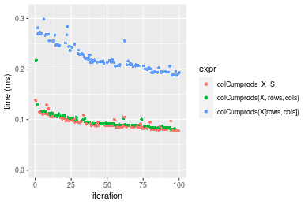

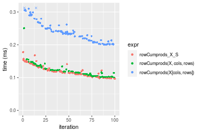
_Table: Benchmarking of colCumprods_X_S() and rowCumprods_X_S() on double+100x1000 data (original and transposed).  The top panel shows times in milliseconds and the bottom panel shows relative times._


|   |expr            |    min|      lq|      mean|   median|       uq|     max|
|:--|:---------------|------:|-------:|---------:|--------:|--------:|-------:|
|1  |colCumprods_X_S | 77.247|  83.030|  92.41065|  88.1235|  99.4515| 138.448|
|2  |rowCumprods_X_S | 96.603| 110.333| 120.61855| 118.0620| 129.6205| 178.054|


|   |expr            |      min|       lq|     mean|   median|       uq|      max|
|:--|:---------------|--------:|--------:|--------:|--------:|--------:|--------:|
|1  |colCumprods_X_S | 1.000000| 1.000000| 1.000000| 1.000000| 1.000000| 1.000000|
|2  |rowCumprods_X_S | 1.250573| 1.328833| 1.305245| 1.339733| 1.303354| 1.286071|

_Figure: Benchmarking of colCumprods_X_S() and rowCumprods_X_S() on double+100x1000 data (original and transposed).  Outliers are displayed as crosses. Times are in milliseconds._


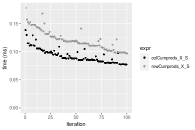

#### 1000x100 double matrix

```r
> X <- data[["1000x100"]]
> rows <- sample.int(nrow(X), size = nrow(X) * 0.7)
> cols <- sample.int(ncol(X), size = ncol(X) * 0.7)
> X_S <- X[rows, cols]
> gc()
          used  (Mb) gc trigger  (Mb) max used  (Mb)
Ncells 5194318 277.5    8529671 455.6  8529671 455.6
Vcells 9607285  73.3   31876688 243.2 60562128 462.1
> colStats <- microbenchmark(colCumprods_X_S = colCumprods(X_S), `colCumprods(X, rows, cols)` = colCumprods(X, 
+     rows = rows, cols = cols), `colCumprods(X[rows, cols])` = colCumprods(X[rows, cols]), unit = "ms")
> X <- t(X)
> X_S <- t(X_S)
> gc()
          used  (Mb) gc trigger  (Mb) max used  (Mb)
Ncells 5194294 277.5    8529671 455.6  8529671 455.6
Vcells 9707338  74.1   31876688 243.2 60562128 462.1
> rowStats <- microbenchmark(rowCumprods_X_S = rowCumprods(X_S), `rowCumprods(X, cols, rows)` = rowCumprods(X, 
+     rows = cols, cols = rows), `rowCumprods(X[cols, rows])` = rowCumprods(X[cols, rows]), unit = "ms")
```

_Table: Benchmarking of colCumprods_X_S(), colCumprods(X, rows, cols)() and colCumprods(X[rows, cols])() on double+1000x100 data. The top panel shows times in milliseconds and the bottom panel shows relative times._


|   |expr                       |      min|        lq|      mean|    median|        uq|      max|
|:--|:--------------------------|--------:|---------:|---------:|---------:|---------:|--------:|
|1  |colCumprods_X_S            | 0.085267| 0.0931515| 0.1010496| 0.0970570| 0.1044525| 0.153772|
|2  |colCumprods(X, rows, cols) | 0.085064| 0.0916330| 0.1016335| 0.0982665| 0.1060800| 0.196777|
|3  |colCumprods(X[rows, cols]) | 0.191793| 0.2081295| 0.2299603| 0.2231495| 0.2477090| 0.388096|


|   |expr                       |       min|        lq|     mean|   median|       uq|      max|
|:--|:--------------------------|---------:|---------:|--------:|--------:|--------:|--------:|
|1  |colCumprods_X_S            | 1.0000000| 1.0000000| 1.000000| 1.000000| 1.000000| 1.000000|
|2  |colCumprods(X, rows, cols) | 0.9976192| 0.9836986| 1.005779| 1.012462| 1.015581| 1.279667|
|3  |colCumprods(X[rows, cols]) | 2.2493227| 2.2343118| 2.275717| 2.299159| 2.371499| 2.523840|

_Table: Benchmarking of rowCumprods_X_S(), rowCumprods(X, cols, rows)() and rowCumprods(X[cols, rows])() on double+1000x100 data (transposed). The top panel shows times in milliseconds and the bottom panel shows relative times._


|   |expr                       |      min|        lq|      mean|    median|        uq|      max|
|:--|:--------------------------|--------:|---------:|---------:|---------:|---------:|--------:|
|1  |rowCumprods_X_S            | 0.108001| 0.1172790| 0.1363158| 0.1340380| 0.1458500| 0.187411|
|2  |rowCumprods(X, cols, rows) | 0.106519| 0.1212385| 0.1372090| 0.1343805| 0.1440325| 0.289116|
|3  |rowCumprods(X[cols, rows]) | 0.203520| 0.2234670| 0.2569952| 0.2501560| 0.2743865| 0.356161|


|   |expr                       |       min|       lq|     mean|   median|        uq|      max|
|:--|:--------------------------|---------:|--------:|--------:|--------:|---------:|--------:|
|1  |rowCumprods_X_S            | 1.0000000| 1.000000| 1.000000| 1.000000| 1.0000000| 1.000000|
|2  |rowCumprods(X, cols, rows) | 0.9862779| 1.033761| 1.006552| 1.002555| 0.9875386| 1.542684|
|3  |rowCumprods(X[cols, rows]) | 1.8844270| 1.905431| 1.885293| 1.866307| 1.8812924| 1.900427|

_Figure: Benchmarking of colCumprods_X_S(), colCumprods(X, rows, cols)() and colCumprods(X[rows, cols])() on double+1000x100 data  as well as rowCumprods_X_S(), rowCumprods(X, cols, rows)() and rowCumprods(X[cols, rows])() on the same data transposed.  Outliers are displayed as crosses.  Times are in milliseconds._


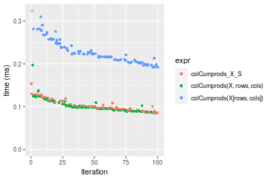

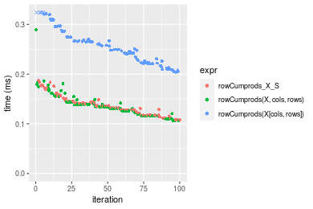
_Table: Benchmarking of colCumprods_X_S() and rowCumprods_X_S() on double+1000x100 data (original and transposed).  The top panel shows times in milliseconds and the bottom panel shows relative times._


|   |expr            |     min|       lq|     mean|  median|       uq|     max|
|:--|:---------------|-------:|--------:|--------:|-------:|--------:|-------:|
|1  |colCumprods_X_S |  85.267|  93.1515| 101.0496|  97.057| 104.4525| 153.772|
|2  |rowCumprods_X_S | 108.001| 117.2790| 136.3158| 134.038| 145.8500| 187.411|


|   |expr            |      min|       lq|     mean|   median|       uq|      max|
|:--|:---------------|--------:|--------:|--------:|--------:|--------:|--------:|
|1  |colCumprods_X_S | 1.000000| 1.000000| 1.000000| 1.000000| 1.000000| 1.000000|
|2  |rowCumprods_X_S | 1.266621| 1.259014| 1.348999| 1.381023| 1.396329| 1.218759|

_Figure: Benchmarking of colCumprods_X_S() and rowCumprods_X_S() on double+1000x100 data (original and transposed).  Outliers are displayed as crosses. Times are in milliseconds._


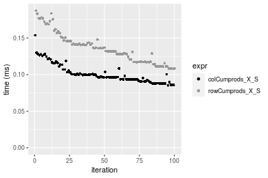


## Appendix

### Session information
```r
R version 4.1.1 Patched (2021-08-10 r80727)
Platform: x86_64-pc-linux-gnu (64-bit)
Running under: Ubuntu 18.04.5 LTS

Matrix products: default
BLAS:   /home/hb/software/R-devel/R-4-1-branch/lib/R/lib/libRblas.so
LAPACK: /home/hb/software/R-devel/R-4-1-branch/lib/R/lib/libRlapack.so

locale:
 [1] LC_CTYPE=en_US.UTF-8       LC_NUMERIC=C              
 [3] LC_TIME=en_US.UTF-8        LC_COLLATE=en_US.UTF-8    
 [5] LC_MONETARY=en_US.UTF-8    LC_MESSAGES=en_US.UTF-8   
 [7] LC_PAPER=en_US.UTF-8       LC_NAME=C                 
 [9] LC_ADDRESS=C               LC_TELEPHONE=C            
[11] LC_MEASUREMENT=en_US.UTF-8 LC_IDENTIFICATION=C       

attached base packages:
[1] stats     graphics  grDevices utils     datasets  methods   base     

other attached packages:
[1] microbenchmark_1.4-7   matrixStats_0.60.1     ggplot2_3.3.5         
[4] knitr_1.33             R.devices_2.17.0       R.utils_2.10.1        
[7] R.oo_1.24.0            R.methodsS3_1.8.1-9001 history_0.0.1-9000    

loaded via a namespace (and not attached):
 [1] Biobase_2.52.0          httr_1.4.2              splines_4.1.1          
 [4] bit64_4.0.5             network_1.17.1          assertthat_0.2.1       
 [7] highr_0.9               stats4_4.1.1            blob_1.2.2             
[10] GenomeInfoDbData_1.2.6  robustbase_0.93-8       pillar_1.6.2           
[13] RSQLite_2.2.8           lattice_0.20-44         glue_1.4.2             
[16] digest_0.6.27           XVector_0.32.0          colorspace_2.0-2       
[19] Matrix_1.3-4            XML_3.99-0.7            pkgconfig_2.0.3        
[22] zlibbioc_1.38.0         genefilter_1.74.0       purrr_0.3.4            
[25] ergm_4.1.2              xtable_1.8-4            scales_1.1.1           
[28] tibble_3.1.4            annotate_1.70.0         KEGGREST_1.32.0        
[31] farver_2.1.0            generics_0.1.0          IRanges_2.26.0         
[34] ellipsis_0.3.2          cachem_1.0.6            withr_2.4.2            
[37] BiocGenerics_0.38.0     mime_0.11               survival_3.2-13        
[40] magrittr_2.0.1          crayon_1.4.1            statnet.common_4.5.0   
[43] memoise_2.0.0           laeken_0.5.1            fansi_0.5.0            
[46] R.cache_0.15.0          MASS_7.3-54             R.rsp_0.44.0           
[49] progressr_0.8.0         tools_4.1.1             lifecycle_1.0.0        
[52] S4Vectors_0.30.0        trust_0.1-8             munsell_0.5.0          
[55] tabby_0.0.1-9001        AnnotationDbi_1.54.1    Biostrings_2.60.2      
[58] compiler_4.1.1          GenomeInfoDb_1.28.1     rlang_0.4.11           
[61] grid_4.1.1              RCurl_1.98-1.4          cwhmisc_6.6            
[64] rappdirs_0.3.3          startup_0.15.0          labeling_0.4.2         
[67] bitops_1.0-7            base64enc_0.1-3         boot_1.3-28            
[70] gtable_0.3.0            DBI_1.1.1               markdown_1.1           
[73] R6_2.5.1                lpSolveAPI_5.5.2.0-17.7 rle_0.9.2              
[76] dplyr_1.0.7             fastmap_1.1.0           bit_4.0.4              
[79] utf8_1.2.2              parallel_4.1.1          Rcpp_1.0.7             
[82] vctrs_0.3.8             png_0.1-7               DEoptimR_1.0-9         
[85] tidyselect_1.1.1        xfun_0.25               coda_0.19-4            
```
Total processing time was 22.71 secs.


### Reproducibility
To reproduce this report, do:
```r
html <- matrixStats:::benchmark('colRowCumprods_subset')
```

[RSP]: https://cran.r-project.org/package=R.rsp
[matrixStats]: https://cran.r-project.org/package=matrixStats

[StackOverflow:colMins?]: https://stackoverflow.com/questions/13676878 "Stack Overflow: fastest way to get Min from every column in a matrix?"
[StackOverflow:colSds?]: https://stackoverflow.com/questions/17549762 "Stack Overflow: Is there such 'colsd' in R?"
[StackOverflow:rowProds?]: https://stackoverflow.com/questions/20198801/ "Stack Overflow: Row product of matrix and column sum of matrix"

---------------------------------------
Copyright Dongcan Jiang. Last updated on 2021-08-25 18:53:31 (+0200 UTC). Powered by [RSP].

<script>
 var link = document.createElement('link');
 link.rel = 'icon';
 link.href = "data:image/png;base64,iVBORw0KGgoAAAANSUhEUgAAACAAAAAgCAMAAABEpIrGAAAA21BMVEUAAAAAAP8AAP8AAP8AAP8AAP8AAP8AAP8AAP8AAP8AAP8AAP8AAP8AAP8AAP8AAP8AAP8AAP8AAP8AAP8AAP8AAP8AAP8AAP8AAP8AAP8AAP8AAP8AAP8AAP8AAP8AAP8AAP8AAP8AAP8AAP8AAP8AAP8AAP8AAP8AAP8AAP8BAf4CAv0DA/wdHeIeHuEfH+AgIN8hId4lJdomJtknJ9g+PsE/P8BAQL9yco10dIt1dYp3d4h4eIeVlWqWlmmXl2iYmGeZmWabm2Tn5xjo6Bfp6Rb39wj4+Af//wA2M9hbAAAASXRSTlMAAQIJCgsMJSYnKD4/QGRlZmhpamtsbautrrCxuru8y8zN5ebn6Pn6+///////////////////////////////////////////LsUNcQAAAS9JREFUOI29k21XgkAQhVcFytdSMqMETU26UVqGmpaiFbL//xc1cAhhwVNf6n5i5z67M2dmYOyfJZUqlVLhkKucG7cgmUZTybDz6g0iDeq51PUr37Ds2cy2/C9NeES5puDjxuUk1xnToZsg8pfA3avHQ3lLIi7iWRrkv/OYtkScxBIMgDee0ALoyxHQBJ68JLCjOtQIMIANF7QG9G9fNnHvisCHBVMKgSJgiz7nE+AoBKrAPA3MgepvgR9TSCasrCKH0eB1wBGBFdCO+nAGjMVGPcQb5bd6mQRegN6+1axOs9nGfYcCtfi4NQosdtH7dB+txFIpXQqN1p9B/asRHToyS0jRgpV7nk4nwcq1BJ+x3Gl/v7S9Wmpp/aGquum7w3ZDyrADFYrl8vHBH+ev9AUASW1dmU4h4wAAAABJRU5ErkJggg=="
 document.getElementsByTagName('head')[0].appendChild(link);
</script>


