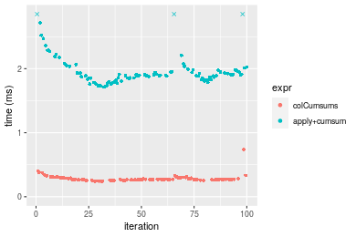
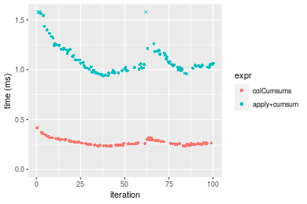
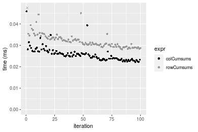

[matrixStats]: Benchmark report

---------------------------------------


# colCumsums() and rowCumsums() benchmarks

This report benchmark the performance of colCumsums() and rowCumsums() against alternative methods.

## Alternative methods

* apply() + cumsum()


## Data type "integer"

### Data
```r
> rmatrix <- function(nrow, ncol, mode = c("logical", "double", "integer", "index"), range = c(-100, 
+     +100), na_prob = 0) {
+     mode <- match.arg(mode)
+     n <- nrow * ncol
+     if (mode == "logical") {
+         x <- sample(c(FALSE, TRUE), size = n, replace = TRUE)
+     }     else if (mode == "index") {
+         x <- seq_len(n)
+         mode <- "integer"
+     }     else {
+         x <- runif(n, min = range[1], max = range[2])
+     }
+     storage.mode(x) <- mode
+     if (na_prob > 0) 
+         x[sample(n, size = na_prob * n)] <- NA
+     dim(x) <- c(nrow, ncol)
+     x
+ }
> rmatrices <- function(scale = 10, seed = 1, ...) {
+     set.seed(seed)
+     data <- list()
+     data[[1]] <- rmatrix(nrow = scale * 1, ncol = scale * 1, ...)
+     data[[2]] <- rmatrix(nrow = scale * 10, ncol = scale * 10, ...)
+     data[[3]] <- rmatrix(nrow = scale * 100, ncol = scale * 1, ...)
+     data[[4]] <- t(data[[3]])
+     data[[5]] <- rmatrix(nrow = scale * 10, ncol = scale * 100, ...)
+     data[[6]] <- t(data[[5]])
+     names(data) <- sapply(data, FUN = function(x) paste(dim(x), collapse = "x"))
+     data
+ }
> data <- rmatrices(mode = mode)
```

### Results

#### 10x10 integer matrix

```r
> X <- data[["10x10"]]
> gc()
          used  (Mb) gc trigger  (Mb) max used  (Mb)
Ncells 5213650 278.5    8529671 455.6  8529671 455.6
Vcells 9925088  75.8   31876688 243.2 60562128 462.1
> colStats <- microbenchmark(colCumsums = colCumsums(X), `apply+cumsum` = apply(X, MARGIN = 2L, FUN = cumsum), 
+     unit = "ms")
> X <- t(X)
> gc()
          used  (Mb) gc trigger  (Mb) max used  (Mb)
Ncells 5204441 278.0    8529671 455.6  8529671 455.6
Vcells 9894840  75.5   31876688 243.2 60562128 462.1
> rowStats <- microbenchmark(rowCumsums = rowCumsums(X), `apply+cumsum` = apply(X, MARGIN = 1L, FUN = cumsum), 
+     unit = "ms")
```

_Table: Benchmarking of colCumsums() and apply+cumsum() on integer+10x10 data. The top panel shows times in milliseconds and the bottom panel shows relative times._


|   |expr         |      min|        lq|      mean|    median|        uq|      max|
|:--|:------------|--------:|---------:|---------:|---------:|---------:|--------:|
|1  |colCumsums   | 0.001911| 0.0022615| 0.0028634| 0.0026425| 0.0032065| 0.011830|
|2  |apply+cumsum | 0.040984| 0.0430095| 0.0450429| 0.0436840| 0.0443830| 0.134853|


|   |expr         |      min|       lq|     mean|   median|       uq|      max|
|:--|:------------|--------:|--------:|--------:|--------:|--------:|--------:|
|1  |colCumsums   |  1.00000|  1.00000|  1.00000|  1.00000|  1.00000|  1.00000|
|2  |apply+cumsum | 21.44636| 19.01813| 15.73078| 16.53131| 13.84157| 11.39924|

_Table: Benchmarking of rowCumsums() and apply+cumsum() on integer+10x10 data (transposed). The top panel shows times in milliseconds and the bottom panel shows relative times._


|   |expr         |      min|        lq|      mean|    median|        uq|      max|
|:--|:------------|--------:|---------:|---------:|---------:|---------:|--------:|
|1  |rowCumsums   | 0.002019| 0.0023745| 0.0030955| 0.0031475| 0.0033615| 0.012904|
|2  |apply+cumsum | 0.041296| 0.0430055| 0.0453320| 0.0439765| 0.0448645| 0.127759|


|   |expr         |      min|       lq|     mean|   median|       uq|      max|
|:--|:------------|--------:|--------:|--------:|--------:|--------:|--------:|
|1  |rowCumsums   |  1.00000|  1.00000|  1.00000|  1.00000|  1.00000| 1.000000|
|2  |apply+cumsum | 20.45369| 18.11139| 14.64467| 13.97188| 13.34657| 9.900728|

_Figure: Benchmarking of colCumsums() and apply+cumsum() on integer+10x10 data  as well as rowCumsums() and apply+cumsum() on the same data transposed.  Outliers are displayed as crosses.  Times are in milliseconds._


_Table: Benchmarking of colCumsums() and rowCumsums() on integer+10x10 data (original and transposed).  The top panel shows times in milliseconds and the bottom panel shows relative times._


|   |expr       |   min|     lq|    mean| median|     uq|    max|
|:--|:----------|-----:|------:|-------:|------:|------:|------:|
|1  |colCumsums | 1.911| 2.2615| 2.86336| 2.6425| 3.2065| 11.830|
|2  |rowCumsums | 2.019| 2.3745| 3.09546| 3.1475| 3.3615| 12.904|


|   |expr       |      min|       lq|     mean|   median|       uq|      max|
|:--|:----------|--------:|--------:|--------:|--------:|--------:|--------:|
|1  |colCumsums | 1.000000| 1.000000| 1.000000| 1.000000| 1.000000| 1.000000|
|2  |rowCumsums | 1.056515| 1.049967| 1.081059| 1.191107| 1.048339| 1.090786|

_Figure: Benchmarking of colCumsums() and rowCumsums() on integer+10x10 data (original and transposed).  Outliers are displayed as crosses. Times are in milliseconds._


#### 100x100 integer matrix

```r
> X <- data[["100x100"]]
> gc()
          used  (Mb) gc trigger  (Mb) max used  (Mb)
Ncells 5203021 277.9    8529671 455.6  8529671 455.6
Vcells 9511362  72.6   31876688 243.2 60562128 462.1
> colStats <- microbenchmark(colCumsums = colCumsums(X), `apply+cumsum` = apply(X, MARGIN = 2L, FUN = cumsum), 
+     unit = "ms")
> X <- t(X)
> gc()
          used  (Mb) gc trigger  (Mb) max used  (Mb)
Ncells 5202997 277.9    8529671 455.6  8529671 455.6
Vcells 9516375  72.7   31876688 243.2 60562128 462.1
> rowStats <- microbenchmark(rowCumsums = rowCumsums(X), `apply+cumsum` = apply(X, MARGIN = 1L, FUN = cumsum), 
+     unit = "ms")
```

_Table: Benchmarking of colCumsums() and apply+cumsum() on integer+100x100 data. The top panel shows times in milliseconds and the bottom panel shows relative times._


|   |expr         |      min|        lq|      mean|    median|        uq|     max|
|:--|:------------|--------:|---------:|---------:|---------:|---------:|-------:|
|1  |colCumsums   | 0.030985| 0.0331105| 0.0356015| 0.0341035| 0.0369750| 0.07321|
|2  |apply+cumsum | 0.233731| 0.2475550| 0.2683101| 0.2554475| 0.2792505| 0.42647|


|   |expr         |     min|       lq|     mean|  median|       uq|      max|
|:--|:------------|-------:|--------:|--------:|-------:|--------:|--------:|
|1  |colCumsums   | 1.00000| 1.000000| 1.000000| 1.00000| 1.000000| 1.000000|
|2  |apply+cumsum | 7.54336| 7.476631| 7.536484| 7.49036| 7.552414| 5.825297|

_Table: Benchmarking of rowCumsums() and apply+cumsum() on integer+100x100 data (transposed). The top panel shows times in milliseconds and the bottom panel shows relative times._


|   |expr         |      min|        lq|      mean|   median|        uq|      max|
|:--|:------------|--------:|---------:|---------:|--------:|---------:|--------:|
|1  |rowCumsums   | 0.034552| 0.0367395| 0.0400708| 0.038110| 0.0411165| 0.075774|
|2  |apply+cumsum | 0.231944| 0.2421085| 0.2662760| 0.255937| 0.2775260| 0.437345|


|   |expr         |      min|       lq|     mean|   median|       uq|      max|
|:--|:------------|--------:|--------:|--------:|--------:|--------:|--------:|
|1  |rowCumsums   | 1.000000| 1.000000| 1.000000| 1.000000| 1.000000| 1.000000|
|2  |apply+cumsum | 6.712897| 6.589869| 6.645136| 6.715744| 6.749748| 5.771703|

_Figure: Benchmarking of colCumsums() and apply+cumsum() on integer+100x100 data  as well as rowCumsums() and apply+cumsum() on the same data transposed.  Outliers are displayed as crosses.  Times are in milliseconds._


_Table: Benchmarking of colCumsums() and rowCumsums() on integer+100x100 data (original and transposed).  The top panel shows times in milliseconds and the bottom panel shows relative times._


|   |expr       |    min|      lq|     mean|  median|      uq|    max|
|:--|:----------|------:|-------:|--------:|-------:|-------:|------:|
|1  |colCumsums | 30.985| 33.1105| 35.60150| 34.1035| 36.9750| 73.210|
|2  |rowCumsums | 34.552| 36.7395| 40.07081| 38.1100| 41.1165| 75.774|


|   |expr       |     min|       lq|     mean|   median|       uq|      max|
|:--|:----------|-------:|--------:|--------:|--------:|--------:|--------:|
|1  |colCumsums | 1.00000| 1.000000| 1.000000| 1.000000| 1.000000| 1.000000|
|2  |rowCumsums | 1.11512| 1.109603| 1.125537| 1.117481| 1.112008| 1.035022|

_Figure: Benchmarking of colCumsums() and rowCumsums() on integer+100x100 data (original and transposed).  Outliers are displayed as crosses. Times are in milliseconds._


#### 1000x10 integer matrix

```r
> X <- data[["1000x10"]]
> gc()
          used  (Mb) gc trigger  (Mb) max used  (Mb)
Ncells 5203753 278.0    8529671 455.6  8529671 455.6
Vcells 9514872  72.6   31876688 243.2 60562128 462.1
> colStats <- microbenchmark(colCumsums = colCumsums(X), `apply+cumsum` = apply(X, MARGIN = 2L, FUN = cumsum), 
+     unit = "ms")
> X <- t(X)
> gc()
          used  (Mb) gc trigger  (Mb) max used  (Mb)
Ncells 5203729 278.0    8529671 455.6  8529671 455.6
Vcells 9519885  72.7   31876688 243.2 60562128 462.1
> rowStats <- microbenchmark(rowCumsums = rowCumsums(X), `apply+cumsum` = apply(X, MARGIN = 1L, FUN = cumsum), 
+     unit = "ms")
```

_Table: Benchmarking of colCumsums() and apply+cumsum() on integer+1000x10 data. The top panel shows times in milliseconds and the bottom panel shows relative times._


|   |expr         |      min|        lq|      mean|    median|        uq|      max|
|:--|:------------|--------:|---------:|---------:|---------:|---------:|--------:|
|1  |colCumsums   | 0.031286| 0.0334150| 0.0412783| 0.0358795| 0.0393105| 0.383971|
|2  |apply+cumsum | 0.145744| 0.1545035| 0.1875465| 0.1641285| 0.1866940| 0.641418|


|   |expr         |      min|       lq|     mean|   median|       uq|      max|
|:--|:------------|--------:|--------:|--------:|--------:|--------:|--------:|
|1  |colCumsums   | 1.000000| 1.000000| 1.000000| 1.000000| 1.000000| 1.000000|
|2  |apply+cumsum | 4.658442| 4.623777| 4.543462| 4.574437| 4.749215| 1.670486|

_Table: Benchmarking of rowCumsums() and apply+cumsum() on integer+1000x10 data (transposed). The top panel shows times in milliseconds and the bottom panel shows relative times._


|   |expr         |      min|        lq|      mean|   median|        uq|      max|
|:--|:------------|--------:|---------:|---------:|--------:|---------:|--------:|
|1  |rowCumsums   | 0.039003| 0.0403455| 0.0440631| 0.043102| 0.0463195| 0.065613|
|2  |apply+cumsum | 0.150331| 0.1564150| 0.1698952| 0.167528| 0.1779855| 0.270237|


|   |expr         |      min|       lq|     mean|  median|       uq|     max|
|:--|:------------|--------:|--------:|--------:|-------:|--------:|-------:|
|1  |rowCumsums   | 1.000000| 1.000000| 1.000000| 1.00000| 1.000000| 1.00000|
|2  |apply+cumsum | 3.854344| 3.876888| 3.855721| 3.88678| 3.842561| 4.11865|

_Figure: Benchmarking of colCumsums() and apply+cumsum() on integer+1000x10 data  as well as rowCumsums() and apply+cumsum() on the same data transposed.  Outliers are displayed as crosses.  Times are in milliseconds._


_Table: Benchmarking of colCumsums() and rowCumsums() on integer+1000x10 data (original and transposed).  The top panel shows times in milliseconds and the bottom panel shows relative times._


|   |expr       |    min|      lq|     mean|  median|      uq|     max|
|:--|:----------|------:|-------:|--------:|-------:|-------:|-------:|
|1  |colCumsums | 31.286| 33.4150| 41.27832| 35.8795| 39.3105| 383.971|
|2  |rowCumsums | 39.003| 40.3455| 44.06314| 43.1020| 46.3195|  65.613|


|   |expr       |     min|       lq|     mean|   median|       uq|       max|
|:--|:----------|-------:|--------:|--------:|--------:|--------:|---------:|
|1  |colCumsums | 1.00000| 1.000000| 1.000000| 1.000000| 1.000000| 1.0000000|
|2  |rowCumsums | 1.24666| 1.207407| 1.067465| 1.201299| 1.178298| 0.1708801|

_Figure: Benchmarking of colCumsums() and rowCumsums() on integer+1000x10 data (original and transposed).  Outliers are displayed as crosses. Times are in milliseconds._


#### 10x1000 integer matrix

```r
> X <- data[["10x1000"]]
> gc()
          used  (Mb) gc trigger  (Mb) max used  (Mb)
Ncells 5203941 278.0    8529671 455.6  8529671 455.6
Vcells 9515562  72.6   31876688 243.2 60562128 462.1
> colStats <- microbenchmark(colCumsums = colCumsums(X), `apply+cumsum` = apply(X, MARGIN = 2L, FUN = cumsum), 
+     unit = "ms")
> X <- t(X)
> gc()
          used  (Mb) gc trigger  (Mb) max used  (Mb)
Ncells 5203917 278.0    8529671 455.6  8529671 455.6
Vcells 9520575  72.7   31876688 243.2 60562128 462.1
> rowStats <- microbenchmark(rowCumsums = rowCumsums(X), `apply+cumsum` = apply(X, MARGIN = 1L, FUN = cumsum), 
+     unit = "ms")
```

_Table: Benchmarking of colCumsums() and apply+cumsum() on integer+10x1000 data. The top panel shows times in milliseconds and the bottom panel shows relative times._


|   |expr         |      min|        lq|      mean|    median|        uq|      max|
|:--|:------------|--------:|---------:|---------:|---------:|---------:|--------:|
|1  |colCumsums   | 0.026868| 0.0285480| 0.0320503| 0.0299965| 0.0349415| 0.052815|
|2  |apply+cumsum | 0.900702| 0.9357485| 1.0189601| 0.9755480| 1.0908195| 1.451818|


|   |expr         |      min|       lq|     mean|   median|       uq|      max|
|:--|:------------|--------:|--------:|--------:|--------:|--------:|--------:|
|1  |colCumsums   |  1.00000|  1.00000|  1.00000|  1.00000|  1.00000|  1.00000|
|2  |apply+cumsum | 33.52322| 32.77808| 31.79257| 32.52206| 31.21845| 27.48874|

_Table: Benchmarking of rowCumsums() and apply+cumsum() on integer+10x1000 data (transposed). The top panel shows times in milliseconds and the bottom panel shows relative times._


|   |expr         |      min|        lq|      mean|    median|       uq|      max|
|:--|:------------|--------:|---------:|---------:|---------:|--------:|--------:|
|1  |rowCumsums   | 0.027042| 0.0281790| 0.0317528| 0.0298610| 0.033192| 0.052271|
|2  |apply+cumsum | 0.896643| 0.9348615| 1.0179929| 0.9697105| 1.096916| 1.433608|


|   |expr         |      min|       lq|     mean|   median|      uq|      max|
|:--|:------------|--------:|--------:|--------:|--------:|-------:|--------:|
|1  |rowCumsums   |  1.00000|  1.00000|  1.00000|  1.00000|  1.0000|  1.00000|
|2  |apply+cumsum | 33.15742| 33.17582| 32.05995| 32.47415| 33.0476| 27.42645|

_Figure: Benchmarking of colCumsums() and apply+cumsum() on integer+10x1000 data  as well as rowCumsums() and apply+cumsum() on the same data transposed.  Outliers are displayed as crosses.  Times are in milliseconds._


_Table: Benchmarking of colCumsums() and rowCumsums() on integer+10x1000 data (original and transposed).  The top panel shows times in milliseconds and the bottom panel shows relative times._


|   |expr       |    min|     lq|     mean|  median|      uq|    max|
|:--|:----------|------:|------:|--------:|-------:|-------:|------:|
|2  |rowCumsums | 27.042| 28.179| 31.75279| 29.8610| 33.1920| 52.271|
|1  |colCumsums | 26.868| 28.548| 32.05026| 29.9965| 34.9415| 52.815|


|   |expr       |       min|       lq|     mean|   median|       uq|      max|
|:--|:----------|---------:|--------:|--------:|--------:|--------:|--------:|
|2  |rowCumsums | 1.0000000| 1.000000| 1.000000| 1.000000| 1.000000| 1.000000|
|1  |colCumsums | 0.9935656| 1.013095| 1.009368| 1.004538| 1.052709| 1.010407|

_Figure: Benchmarking of colCumsums() and rowCumsums() on integer+10x1000 data (original and transposed).  Outliers are displayed as crosses. Times are in milliseconds._


#### 100x1000 integer matrix

```r
> X <- data[["100x1000"]]
> gc()
          used  (Mb) gc trigger  (Mb) max used  (Mb)
Ncells 5204103 278.0    8529671 455.6  8529671 455.6
Vcells 9516010  72.7   31876688 243.2 60562128 462.1
> colStats <- microbenchmark(colCumsums = colCumsums(X), `apply+cumsum` = apply(X, MARGIN = 2L, FUN = cumsum), 
+     unit = "ms")
> X <- t(X)
> gc()
          used (Mb) gc trigger  (Mb) max used  (Mb)
Ncells 5204097  278    8529671 455.6  8529671 455.6
Vcells 9566053   73   31876688 243.2 60562128 462.1
> rowStats <- microbenchmark(rowCumsums = rowCumsums(X), `apply+cumsum` = apply(X, MARGIN = 1L, FUN = cumsum), 
+     unit = "ms")
```

_Table: Benchmarking of colCumsums() and apply+cumsum() on integer+100x1000 data. The top panel shows times in milliseconds and the bottom panel shows relative times._


|   |expr         |      min|       lq|      mean|    median|        uq|       max|
|:--|:------------|--------:|--------:|---------:|---------:|---------:|---------:|
|1  |colCumsums   | 0.242814| 0.264977| 0.2843808| 0.2699675| 0.2952235|  0.737059|
|2  |apply+cumsum | 1.713847| 1.839176| 2.1032246| 1.8978890| 1.9780215| 16.359792|


|   |expr         |      min|       lq|     mean|   median|       uq|      max|
|:--|:------------|--------:|--------:|--------:|--------:|--------:|--------:|
|1  |colCumsums   | 1.000000| 1.000000| 1.000000| 1.000000| 1.000000|  1.00000|
|2  |apply+cumsum | 7.058271| 6.940889| 7.395804| 7.030065| 6.700081| 22.19604|

_Table: Benchmarking of rowCumsums() and apply+cumsum() on integer+100x1000 data (transposed). The top panel shows times in milliseconds and the bottom panel shows relative times._


|   |expr         |      min|       lq|      mean|   median|       uq|       max|
|:--|:------------|--------:|--------:|---------:|--------:|--------:|---------:|
|1  |rowCumsums   | 0.260093| 0.279325| 0.2935745| 0.289555| 0.298858|  0.432349|
|2  |apply+cumsum | 1.699208| 1.849131| 2.1100754| 1.905066| 1.987033| 16.991866|


|   |expr         |      min|       lq|     mean|   median|       uq|      max|
|:--|:------------|--------:|--------:|--------:|--------:|--------:|--------:|
|1  |rowCumsums   | 1.000000| 1.000000| 1.000000| 1.000000| 1.000000|  1.00000|
|2  |apply+cumsum | 6.533079| 6.619996| 7.187531| 6.579287| 6.648755| 39.30127|

_Figure: Benchmarking of colCumsums() and apply+cumsum() on integer+100x1000 data  as well as rowCumsums() and apply+cumsum() on the same data transposed.  Outliers are displayed as crosses.  Times are in milliseconds._





_Table: Benchmarking of colCumsums() and rowCumsums() on integer+100x1000 data (original and transposed).  The top panel shows times in milliseconds and the bottom panel shows relative times._


|   |expr       |     min|      lq|     mean|   median|       uq|     max|
|:--|:----------|-------:|-------:|--------:|--------:|--------:|-------:|
|1  |colCumsums | 242.814| 264.977| 284.3808| 269.9675| 295.2235| 737.059|
|2  |rowCumsums | 260.093| 279.325| 293.5745| 289.5550| 298.8580| 432.349|


|   |expr       |      min|       lq|     mean|   median|       uq|       max|
|:--|:----------|--------:|--------:|--------:|--------:|--------:|---------:|
|1  |colCumsums | 1.000000| 1.000000| 1.000000| 1.000000| 1.000000| 1.0000000|
|2  |rowCumsums | 1.071162| 1.054148| 1.032329| 1.072555| 1.012311| 0.5865867|

_Figure: Benchmarking of colCumsums() and rowCumsums() on integer+100x1000 data (original and transposed).  Outliers are displayed as crosses. Times are in milliseconds._


#### 1000x100 integer matrix

```r
> X <- data[["1000x100"]]
> gc()
          used  (Mb) gc trigger  (Mb) max used  (Mb)
Ncells 5204320 278.0    8529671 455.6  8529671 455.6
Vcells 9516617  72.7   31876688 243.2 60562128 462.1
> colStats <- microbenchmark(colCumsums = colCumsums(X), `apply+cumsum` = apply(X, MARGIN = 2L, FUN = cumsum), 
+     unit = "ms")
> X <- t(X)
> gc()
          used (Mb) gc trigger  (Mb) max used  (Mb)
Ncells 5204296  278    8529671 455.6  8529671 455.6
Vcells 9566630   73   31876688 243.2 60562128 462.1
> rowStats <- microbenchmark(rowCumsums = rowCumsums(X), `apply+cumsum` = apply(X, MARGIN = 1L, FUN = cumsum), 
+     unit = "ms")
```

_Table: Benchmarking of colCumsums() and apply+cumsum() on integer+1000x100 data. The top panel shows times in milliseconds and the bottom panel shows relative times._


|   |expr         |      min|       lq|      mean|   median|       uq|      max|
|:--|:------------|--------:|--------:|---------:|--------:|--------:|--------:|
|1  |colCumsums   | 0.234917| 0.247979| 0.2704248| 0.259225| 0.288763| 0.417261|
|2  |apply+cumsum | 0.938419| 1.001057| 1.1879427| 1.046571| 1.183283| 8.001552|


|   |expr         |      min|       lq|     mean|   median|       uq|      max|
|:--|:------------|--------:|--------:|--------:|--------:|--------:|--------:|
|1  |colCumsums   | 1.000000| 1.000000| 1.000000| 1.000000| 1.000000|  1.00000|
|2  |apply+cumsum | 3.994683| 4.036862| 4.392876| 4.037305| 4.097764| 19.17637|

_Table: Benchmarking of rowCumsums() and apply+cumsum() on integer+1000x100 data (transposed). The top panel shows times in milliseconds and the bottom panel shows relative times._


|   |expr         |      min|        lq|      mean|    median|        uq|      max|
|:--|:------------|--------:|---------:|---------:|---------:|---------:|--------:|
|1  |rowCumsums   | 0.268693| 0.2808735| 0.3055827| 0.2935385| 0.3265135| 0.417652|
|2  |apply+cumsum | 0.947420| 1.0135190| 1.1753059| 1.0573140| 1.1840970| 8.044296|


|   |expr         |      min|       lq|     mean|  median|       uq|      max|
|:--|:------------|--------:|--------:|--------:|-------:|--------:|--------:|
|1  |rowCumsums   | 1.000000| 1.000000| 1.000000| 1.00000| 1.000000|  1.00000|
|2  |apply+cumsum | 3.526032| 3.608454| 3.846114| 3.60196| 3.626487| 19.26076|

_Figure: Benchmarking of colCumsums() and apply+cumsum() on integer+1000x100 data  as well as rowCumsums() and apply+cumsum() on the same data transposed.  Outliers are displayed as crosses.  Times are in milliseconds._





_Table: Benchmarking of colCumsums() and rowCumsums() on integer+1000x100 data (original and transposed).  The top panel shows times in milliseconds and the bottom panel shows relative times._


|   |expr       |     min|       lq|     mean|   median|       uq|     max|
|:--|:----------|-------:|--------:|--------:|--------:|--------:|-------:|
|1  |colCumsums | 234.917| 247.9790| 270.4248| 259.2250| 288.7630| 417.261|
|2  |rowCumsums | 268.693| 280.8735| 305.5827| 293.5385| 326.5135| 417.652|


|   |expr       |      min|      lq|    mean|  median|       uq|      max|
|:--|:----------|--------:|-------:|-------:|-------:|--------:|--------:|
|1  |colCumsums | 1.000000| 1.00000| 1.00000| 1.00000| 1.000000| 1.000000|
|2  |rowCumsums | 1.143778| 1.13265| 1.13001| 1.13237| 1.130732| 1.000937|

_Figure: Benchmarking of colCumsums() and rowCumsums() on integer+1000x100 data (original and transposed).  Outliers are displayed as crosses. Times are in milliseconds._


## Data type "double"

### Data
```r
> rmatrix <- function(nrow, ncol, mode = c("logical", "double", "integer", "index"), range = c(-100, 
+     +100), na_prob = 0) {
+     mode <- match.arg(mode)
+     n <- nrow * ncol
+     if (mode == "logical") {
+         x <- sample(c(FALSE, TRUE), size = n, replace = TRUE)
+     }     else if (mode == "index") {
+         x <- seq_len(n)
+         mode <- "integer"
+     }     else {
+         x <- runif(n, min = range[1], max = range[2])
+     }
+     storage.mode(x) <- mode
+     if (na_prob > 0) 
+         x[sample(n, size = na_prob * n)] <- NA
+     dim(x) <- c(nrow, ncol)
+     x
+ }
> rmatrices <- function(scale = 10, seed = 1, ...) {
+     set.seed(seed)
+     data <- list()
+     data[[1]] <- rmatrix(nrow = scale * 1, ncol = scale * 1, ...)
+     data[[2]] <- rmatrix(nrow = scale * 10, ncol = scale * 10, ...)
+     data[[3]] <- rmatrix(nrow = scale * 100, ncol = scale * 1, ...)
+     data[[4]] <- t(data[[3]])
+     data[[5]] <- rmatrix(nrow = scale * 10, ncol = scale * 100, ...)
+     data[[6]] <- t(data[[5]])
+     names(data) <- sapply(data, FUN = function(x) paste(dim(x), collapse = "x"))
+     data
+ }
> data <- rmatrices(mode = mode)
```

### Results

#### 10x10 double matrix

```r
> X <- data[["10x10"]]
> gc()
          used  (Mb) gc trigger  (Mb) max used  (Mb)
Ncells 5204520 278.0    8529671 455.6  8529671 455.6
Vcells 9632330  73.5   31876688 243.2 60562128 462.1
> colStats <- microbenchmark(colCumsums = colCumsums(X), `apply+cumsum` = apply(X, MARGIN = 2L, FUN = cumsum), 
+     unit = "ms")
> X <- t(X)
> gc()
          used  (Mb) gc trigger  (Mb) max used  (Mb)
Ncells 5204487 278.0    8529671 455.6  8529671 455.6
Vcells 9632428  73.5   31876688 243.2 60562128 462.1
> rowStats <- microbenchmark(rowCumsums = rowCumsums(X), `apply+cumsum` = apply(X, MARGIN = 1L, FUN = cumsum), 
+     unit = "ms")
```

_Table: Benchmarking of colCumsums() and apply+cumsum() on double+10x10 data. The top panel shows times in milliseconds and the bottom panel shows relative times._


|   |expr         |      min|        lq|      mean|    median|        uq|      max|
|:--|:------------|--------:|---------:|---------:|---------:|---------:|--------:|
|1  |colCumsums   | 0.001778| 0.0021550| 0.0027174| 0.0024265| 0.0030855| 0.012622|
|2  |apply+cumsum | 0.041617| 0.0429945| 0.0451775| 0.0442875| 0.0447965| 0.121619|


|   |expr         |      min|       lq|     mean|  median|       uq|      max|
|:--|:------------|--------:|--------:|--------:|-------:|--------:|--------:|
|1  |colCumsums   |  1.00000|  1.00000|  1.00000|  1.0000|  1.00000| 1.000000|
|2  |apply+cumsum | 23.40664| 19.95104| 16.62504| 18.2516| 14.51839| 9.635478|

_Table: Benchmarking of rowCumsums() and apply+cumsum() on double+10x10 data (transposed). The top panel shows times in milliseconds and the bottom panel shows relative times._


|   |expr         |      min|        lq|      mean|    median|        uq|      max|
|:--|:------------|--------:|---------:|---------:|---------:|---------:|--------:|
|1  |rowCumsums   | 0.001775| 0.0021740| 0.0031530| 0.0029935| 0.0032695| 0.014764|
|2  |apply+cumsum | 0.040890| 0.0426805| 0.0476445| 0.0440535| 0.0451975| 0.131418|


|   |expr         |      min|       lq|     mean|   median|       uq|      max|
|:--|:------------|--------:|--------:|--------:|--------:|--------:|--------:|
|1  |rowCumsums   |  1.00000|  1.00000|  1.00000|  1.00000|  1.00000| 1.000000|
|2  |apply+cumsum | 23.03662| 19.63224| 15.11104| 14.71639| 13.82398| 8.901246|

_Figure: Benchmarking of colCumsums() and apply+cumsum() on double+10x10 data  as well as rowCumsums() and apply+cumsum() on the same data transposed.  Outliers are displayed as crosses.  Times are in milliseconds._


_Table: Benchmarking of colCumsums() and rowCumsums() on double+10x10 data (original and transposed).  The top panel shows times in milliseconds and the bottom panel shows relative times._


|   |expr       |   min|    lq|    mean| median|     uq|    max|
|:--|:----------|-----:|-----:|-------:|------:|------:|------:|
|1  |colCumsums | 1.778| 2.155| 2.71744| 2.4265| 3.0855| 12.622|
|2  |rowCumsums | 1.775| 2.174| 3.15296| 2.9935| 3.2695| 14.764|


|   |expr       |       min|       lq|     mean|  median|       uq|      max|
|:--|:----------|---------:|--------:|--------:|-------:|--------:|--------:|
|1  |colCumsums | 1.0000000| 1.000000| 1.000000| 1.00000| 1.000000| 1.000000|
|2  |rowCumsums | 0.9983127| 1.008817| 1.160268| 1.23367| 1.059634| 1.169704|

_Figure: Benchmarking of colCumsums() and rowCumsums() on double+10x10 data (original and transposed).  Outliers are displayed as crosses. Times are in milliseconds._


#### 100x100 double matrix

```r
> X <- data[["100x100"]]
> gc()
          used  (Mb) gc trigger  (Mb) max used  (Mb)
Ncells 5204695 278.0    8529671 455.6  8529671 455.6
Vcells 9633150  73.5   31876688 243.2 60562128 462.1
> colStats <- microbenchmark(colCumsums = colCumsums(X), `apply+cumsum` = apply(X, MARGIN = 2L, FUN = cumsum), 
+     unit = "ms")
> X <- t(X)
> gc()
          used  (Mb) gc trigger  (Mb) max used  (Mb)
Ncells 5204671 278.0    8529671 455.6  8529671 455.6
Vcells 9643163  73.6   31876688 243.2 60562128 462.1
> rowStats <- microbenchmark(rowCumsums = rowCumsums(X), `apply+cumsum` = apply(X, MARGIN = 1L, FUN = cumsum), 
+     unit = "ms")
```

_Table: Benchmarking of colCumsums() and apply+cumsum() on double+100x100 data. The top panel shows times in milliseconds and the bottom panel shows relative times._


|   |expr         |      min|        lq|      mean|   median|        uq|      max|
|:--|:------------|--------:|---------:|---------:|--------:|---------:|--------:|
|1  |colCumsums   | 0.022690| 0.0237980| 0.0258113| 0.024590| 0.0271775| 0.047038|
|2  |apply+cumsum | 0.230441| 0.2418455| 0.2624985| 0.251979| 0.2717825| 0.423725|


|   |expr         |      min|       lq|     mean|   median|       uq|      max|
|:--|:------------|--------:|--------:|--------:|--------:|--------:|--------:|
|1  |colCumsums   |  1.00000|  1.00000|  1.00000|  1.00000|  1.00000| 1.000000|
|2  |apply+cumsum | 10.15606| 10.16243| 10.16993| 10.24721| 10.00028| 9.008142|

_Table: Benchmarking of rowCumsums() and apply+cumsum() on double+100x100 data (transposed). The top panel shows times in milliseconds and the bottom panel shows relative times._


|   |expr         |      min|        lq|      mean|    median|       uq|      max|
|:--|:------------|--------:|---------:|---------:|---------:|--------:|--------:|
|1  |rowCumsums   | 0.025000| 0.0267900| 0.0289336| 0.0277845| 0.030582| 0.043531|
|2  |apply+cumsum | 0.220881| 0.2424455| 0.2613835| 0.2514460| 0.272351| 0.438277|


|   |expr         |     min|       lq|    mean|   median|       uq|      max|
|:--|:------------|-------:|--------:|-------:|--------:|--------:|--------:|
|1  |rowCumsums   | 1.00000| 1.000000| 1.00000| 1.000000| 1.000000|  1.00000|
|2  |apply+cumsum | 8.83524| 9.049851| 9.03391| 9.049866| 8.905598| 10.06816|

_Figure: Benchmarking of colCumsums() and apply+cumsum() on double+100x100 data  as well as rowCumsums() and apply+cumsum() on the same data transposed.  Outliers are displayed as crosses.  Times are in milliseconds._


_Table: Benchmarking of colCumsums() and rowCumsums() on double+100x100 data (original and transposed).  The top panel shows times in milliseconds and the bottom panel shows relative times._


|   |expr       |   min|     lq|     mean|  median|      uq|    max|
|:--|:----------|-----:|------:|--------:|-------:|-------:|------:|
|1  |colCumsums | 22.69| 23.798| 25.81125| 24.5900| 27.1775| 47.038|
|2  |rowCumsums | 25.00| 26.790| 28.93359| 27.7845| 30.5820| 43.531|


|   |expr       |      min|       lq|     mean|   median|       uq|       max|
|:--|:----------|--------:|--------:|--------:|--------:|--------:|---------:|
|1  |colCumsums | 1.000000| 1.000000| 1.000000| 1.000000| 1.000000| 1.0000000|
|2  |rowCumsums | 1.101807| 1.125725| 1.120968| 1.129911| 1.125269| 0.9254433|

_Figure: Benchmarking of colCumsums() and rowCumsums() on double+100x100 data (original and transposed).  Outliers are displayed as crosses. Times are in milliseconds._


#### 1000x10 double matrix

```r
> X <- data[["1000x10"]]
> gc()
          used  (Mb) gc trigger  (Mb) max used  (Mb)
Ncells 5204887 278.0    8529671 455.6  8529671 455.6
Vcells 9634052  73.6   31876688 243.2 60562128 462.1
> colStats <- microbenchmark(colCumsums = colCumsums(X), `apply+cumsum` = apply(X, MARGIN = 2L, FUN = cumsum), 
+     unit = "ms")
> X <- t(X)
> gc()
          used  (Mb) gc trigger  (Mb) max used  (Mb)
Ncells 5204863 278.0    8529671 455.6  8529671 455.6
Vcells 9644065  73.6   31876688 243.2 60562128 462.1
> rowStats <- microbenchmark(rowCumsums = rowCumsums(X), `apply+cumsum` = apply(X, MARGIN = 1L, FUN = cumsum), 
+     unit = "ms")
```

_Table: Benchmarking of colCumsums() and apply+cumsum() on double+1000x10 data. The top panel shows times in milliseconds and the bottom panel shows relative times._


|   |expr         |      min|        lq|      mean|    median|       uq|      max|
|:--|:------------|--------:|---------:|---------:|---------:|--------:|--------:|
|1  |colCumsums   | 0.022242| 0.0236490| 0.0258394| 0.0252725| 0.027014| 0.045889|
|2  |apply+cumsum | 0.142931| 0.1497305| 0.1635912| 0.1607945| 0.173429| 0.258434|


|   |expr         |      min|       lq|    mean|  median|       uq|     max|
|:--|:------------|--------:|--------:|-------:|-------:|--------:|-------:|
|1  |colCumsums   | 1.000000| 1.000000| 1.00000| 1.00000| 1.000000| 1.00000|
|2  |apply+cumsum | 6.426176| 6.331367| 6.33109| 6.36243| 6.419967| 5.63172|

_Table: Benchmarking of rowCumsums() and apply+cumsum() on double+1000x10 data (transposed). The top panel shows times in milliseconds and the bottom panel shows relative times._


|   |expr         |      min|       lq|      mean|    median|        uq|      max|
|:--|:------------|--------:|--------:|---------:|---------:|---------:|--------:|
|1  |rowCumsums   | 0.028172| 0.029650| 0.0322225| 0.0312810| 0.0336665| 0.050613|
|2  |apply+cumsum | 0.143565| 0.149054| 0.1639212| 0.1617185| 0.1730210| 0.271444|


|   |expr         |      min|       lq|     mean|   median|       uq|      max|
|:--|:------------|--------:|--------:|--------:|--------:|--------:|--------:|
|1  |rowCumsums   | 1.000000| 1.000000| 1.000000| 1.000000| 1.000000| 1.000000|
|2  |apply+cumsum | 5.096017| 5.027116| 5.087167| 5.169863| 5.139263| 5.363128|

_Figure: Benchmarking of colCumsums() and apply+cumsum() on double+1000x10 data  as well as rowCumsums() and apply+cumsum() on the same data transposed.  Outliers are displayed as crosses.  Times are in milliseconds._


_Table: Benchmarking of colCumsums() and rowCumsums() on double+1000x10 data (original and transposed).  The top panel shows times in milliseconds and the bottom panel shows relative times._


|   |expr       |    min|     lq|     mean|  median|      uq|    max|
|:--|:----------|------:|------:|--------:|-------:|-------:|------:|
|1  |colCumsums | 22.242| 23.649| 25.83935| 25.2725| 27.0140| 45.889|
|2  |rowCumsums | 28.172| 29.650| 32.22250| 31.2810| 33.6665| 50.613|


|   |expr       |      min|       lq|     mean|   median|       uq|      max|
|:--|:----------|--------:|--------:|--------:|--------:|--------:|--------:|
|1  |colCumsums | 1.000000| 1.000000| 1.000000| 1.000000| 1.000000| 1.000000|
|2  |rowCumsums | 1.266613| 1.253753| 1.247032| 1.237748| 1.246261| 1.102944|

_Figure: Benchmarking of colCumsums() and rowCumsums() on double+1000x10 data (original and transposed).  Outliers are displayed as crosses. Times are in milliseconds._




#### 10x1000 double matrix

```r
> X <- data[["10x1000"]]
> gc()
          used  (Mb) gc trigger  (Mb) max used  (Mb)
Ncells 5205075 278.0    8529671 455.6  8529671 455.6
Vcells 9634177  73.6   31876688 243.2 60562128 462.1
> colStats <- microbenchmark(colCumsums = colCumsums(X), `apply+cumsum` = apply(X, MARGIN = 2L, FUN = cumsum), 
+     unit = "ms")
> X <- t(X)
> gc()
          used  (Mb) gc trigger  (Mb) max used  (Mb)
Ncells 5205051 278.0    8529671 455.6  8529671 455.6
Vcells 9644190  73.6   31876688 243.2 60562128 462.1
> rowStats <- microbenchmark(rowCumsums = rowCumsums(X), `apply+cumsum` = apply(X, MARGIN = 1L, FUN = cumsum), 
+     unit = "ms")
```

_Table: Benchmarking of colCumsums() and apply+cumsum() on double+10x1000 data. The top panel shows times in milliseconds and the bottom panel shows relative times._


|   |expr         |      min|       lq|      mean|  median|       uq|      max|
|:--|:------------|--------:|--------:|---------:|-------:|--------:|--------:|
|1  |colCumsums   | 0.019951| 0.021407| 0.0249837| 0.02325| 0.028980| 0.041578|
|2  |apply+cumsum | 0.872224| 0.929991| 1.0234031| 0.97128| 1.098561| 1.619498|


|   |expr         |      min|       lq|     mean|   median|       uq|      max|
|:--|:------------|--------:|--------:|--------:|--------:|--------:|--------:|
|1  |colCumsums   |  1.00000|  1.00000|  1.00000|  1.00000|  1.00000|  1.00000|
|2  |apply+cumsum | 43.71831| 43.44331| 40.96288| 41.77548| 37.90754| 38.95084|

_Table: Benchmarking of rowCumsums() and apply+cumsum() on double+10x1000 data (transposed). The top panel shows times in milliseconds and the bottom panel shows relative times._


|   |expr         |      min|        lq|      mean|    median|       uq|      max|
|:--|:------------|--------:|---------:|---------:|---------:|--------:|--------:|
|1  |rowCumsums   | 0.019277| 0.0205675| 0.0232597| 0.0217955| 0.024536| 0.041653|
|2  |apply+cumsum | 0.899400| 0.9333850| 1.0144295| 0.9709405| 1.085459| 1.433657|


|   |expr         |      min|       lq|     mean|   median|       uq|      max|
|:--|:------------|--------:|--------:|--------:|--------:|--------:|--------:|
|1  |rowCumsums   |  1.00000|  1.00000|  1.00000|  1.00000|  1.00000|  1.00000|
|2  |apply+cumsum | 46.65664| 45.38155| 43.61312| 44.54775| 44.23944| 34.41906|

_Figure: Benchmarking of colCumsums() and apply+cumsum() on double+10x1000 data  as well as rowCumsums() and apply+cumsum() on the same data transposed.  Outliers are displayed as crosses.  Times are in milliseconds._


_Table: Benchmarking of colCumsums() and rowCumsums() on double+10x1000 data (original and transposed).  The top panel shows times in milliseconds and the bottom panel shows relative times._


|   |expr       |    min|      lq|     mean|  median|     uq|    max|
|:--|:----------|------:|-------:|--------:|-------:|------:|------:|
|2  |rowCumsums | 19.277| 20.5675| 23.25973| 21.7955| 24.536| 41.653|
|1  |colCumsums | 19.951| 21.4070| 24.98367| 23.2500| 28.980| 41.578|


|   |expr       |      min|       lq|     mean|   median|       uq|       max|
|:--|:----------|--------:|--------:|--------:|--------:|--------:|---------:|
|2  |rowCumsums | 1.000000| 1.000000| 1.000000| 1.000000| 1.000000| 1.0000000|
|1  |colCumsums | 1.034964| 1.040817| 1.074117| 1.066734| 1.181122| 0.9981994|

_Figure: Benchmarking of colCumsums() and rowCumsums() on double+10x1000 data (original and transposed).  Outliers are displayed as crosses. Times are in milliseconds._


#### 100x1000 double matrix

```r
> X <- data[["100x1000"]]
> gc()
          used  (Mb) gc trigger  (Mb) max used  (Mb)
Ncells 5205237 278.0    8529671 455.6  8529671 455.6
Vcells 9635191  73.6   31876688 243.2 60562128 462.1
> colStats <- microbenchmark(colCumsums = colCumsums(X), `apply+cumsum` = apply(X, MARGIN = 2L, FUN = cumsum), 
+     unit = "ms")
> X <- t(X)
> gc()
          used  (Mb) gc trigger  (Mb) max used  (Mb)
Ncells 5205231 278.0    8529671 455.6  8529671 455.6
Vcells 9735234  74.3   31876688 243.2 60562128 462.1
> rowStats <- microbenchmark(rowCumsums = rowCumsums(X), `apply+cumsum` = apply(X, MARGIN = 1L, FUN = cumsum), 
+     unit = "ms")
```

_Table: Benchmarking of colCumsums() and apply+cumsum() on double+100x1000 data. The top panel shows times in milliseconds and the bottom panel shows relative times._


|   |expr         |      min|        lq|     mean|    median|        uq|       max|
|:--|:------------|--------:|---------:|--------:|---------:|---------:|---------:|
|1  |colCumsums   | 0.169302| 0.1869715| 0.203835| 0.1982765| 0.2174725|  0.296995|
|2  |apply+cumsum | 1.622244| 1.7400535| 2.168069| 1.8591440| 2.0870160| 14.327352|


|   |expr         |      min|       lq|     mean|   median|       uq|      max|
|:--|:------------|--------:|--------:|--------:|--------:|--------:|--------:|
|1  |colCumsums   | 1.000000| 1.000000|  1.00000| 1.000000| 1.000000|  1.00000|
|2  |apply+cumsum | 9.581954| 9.306517| 10.63639| 9.376522| 9.596689| 48.24105|

_Table: Benchmarking of rowCumsums() and apply+cumsum() on double+100x1000 data (transposed). The top panel shows times in milliseconds and the bottom panel shows relative times._


|   |expr         |      min|       lq|      mean|    median|       uq|      max|
|:--|:------------|--------:|--------:|---------:|---------:|--------:|--------:|
|1  |rowCumsums   | 0.183713| 0.200637| 0.3437208| 0.2183715| 0.239217| 11.65280|
|2  |apply+cumsum | 1.644144| 1.752021| 2.1181943| 1.9403660| 2.160354| 13.20317|


|   |expr         |      min|       lq|     mean|   median|       uq|      max|
|:--|:------------|--------:|--------:|--------:|--------:|--------:|--------:|
|1  |rowCumsums   | 1.000000| 1.000000| 1.000000| 1.000000| 1.000000| 1.000000|
|2  |apply+cumsum | 8.949525| 8.732293| 6.162543| 8.885619| 9.030938| 1.133047|

_Figure: Benchmarking of colCumsums() and apply+cumsum() on double+100x1000 data  as well as rowCumsums() and apply+cumsum() on the same data transposed.  Outliers are displayed as crosses.  Times are in milliseconds._


_Table: Benchmarking of colCumsums() and rowCumsums() on double+100x1000 data (original and transposed).  The top panel shows times in milliseconds and the bottom panel shows relative times._


|   |expr       |     min|       lq|     mean|   median|       uq|       max|
|:--|:----------|-------:|--------:|--------:|--------:|--------:|---------:|
|1  |colCumsums | 169.302| 186.9715| 203.8350| 198.2765| 217.4725|   296.995|
|2  |rowCumsums | 183.713| 200.6370| 343.7208| 218.3715| 239.2170| 11652.801|


|   |expr       |     min|       lq|    mean|   median|       uq|      max|
|:--|:----------|-------:|--------:|-------:|--------:|--------:|--------:|
|1  |colCumsums | 1.00000| 1.000000| 1.00000| 1.000000| 1.000000|  1.00000|
|2  |rowCumsums | 1.08512| 1.073089| 1.68627| 1.101348| 1.099987| 39.23568|

_Figure: Benchmarking of colCumsums() and rowCumsums() on double+100x1000 data (original and transposed).  Outliers are displayed as crosses. Times are in milliseconds._


#### 1000x100 double matrix

```r
> X <- data[["1000x100"]]
> gc()
          used  (Mb) gc trigger  (Mb) max used  (Mb)
Ncells 5205442 278.1    8529671 455.6  8529671 455.6
Vcells 9635337  73.6   31876688 243.2 60562128 462.1
> colStats <- microbenchmark(colCumsums = colCumsums(X), `apply+cumsum` = apply(X, MARGIN = 2L, FUN = cumsum), 
+     unit = "ms")
> X <- t(X)
> gc()
          used  (Mb) gc trigger  (Mb) max used  (Mb)
Ncells 5205430 278.0    8529671 455.6  8529671 455.6
Vcells 9735370  74.3   31876688 243.2 60562128 462.1
> rowStats <- microbenchmark(rowCumsums = rowCumsums(X), `apply+cumsum` = apply(X, MARGIN = 1L, FUN = cumsum), 
+     unit = "ms")
```

_Table: Benchmarking of colCumsums() and apply+cumsum() on double+1000x100 data. The top panel shows times in milliseconds and the bottom panel shows relative times._


|   |expr         |      min|        lq|      mean|    median|        uq|      max|
|:--|:------------|--------:|---------:|---------:|---------:|---------:|--------:|
|1  |colCumsums   | 0.159095| 0.1759715| 0.1929168| 0.1885775| 0.2040345| 0.280967|
|2  |apply+cumsum | 0.938149| 1.0150880| 1.2239085| 1.0942785| 1.1882135| 6.904004|


|   |expr         |      min|      lq|     mean|   median|       uq|     max|
|:--|:------------|--------:|-------:|--------:|--------:|--------:|-------:|
|1  |colCumsums   | 1.000000| 1.00000| 1.000000| 1.000000| 1.000000|  1.0000|
|2  |apply+cumsum | 5.896785| 5.76848| 6.344231| 5.802805| 5.823591| 24.5723|

_Table: Benchmarking of rowCumsums() and apply+cumsum() on double+1000x100 data (transposed). The top panel shows times in milliseconds and the bottom panel shows relative times._


|   |expr         |      min|        lq|      mean|    median|        uq|      max|
|:--|:------------|--------:|---------:|---------:|---------:|---------:|--------:|
|1  |rowCumsums   | 0.193541| 0.2109785| 0.3366797| 0.2288495| 0.2427325| 5.595377|
|2  |apply+cumsum | 0.952226| 1.0191530| 1.1220076| 1.1013460| 1.1857660| 1.776875|


|   |expr         |      min|       lq|     mean|   median|       uq|       max|
|:--|:------------|--------:|--------:|--------:|--------:|--------:|---------:|
|1  |rowCumsums   | 1.000000| 1.000000| 1.000000| 1.000000| 1.000000| 1.0000000|
|2  |apply+cumsum | 4.920022| 4.830601| 3.332566| 4.812534| 4.885073| 0.3175613|

_Figure: Benchmarking of colCumsums() and apply+cumsum() on double+1000x100 data  as well as rowCumsums() and apply+cumsum() on the same data transposed.  Outliers are displayed as crosses.  Times are in milliseconds._


_Table: Benchmarking of colCumsums() and rowCumsums() on double+1000x100 data (original and transposed).  The top panel shows times in milliseconds and the bottom panel shows relative times._


|   |expr       |     min|       lq|     mean|   median|       uq|      max|
|:--|:----------|-------:|--------:|--------:|--------:|--------:|--------:|
|1  |colCumsums | 159.095| 175.9715| 192.9168| 188.5775| 204.0345|  280.967|
|2  |rowCumsums | 193.541| 210.9785| 336.6797| 228.8495| 242.7325| 5595.377|


|   |expr       |      min|       lq|     mean|   median|       uq|      max|
|:--|:----------|--------:|--------:|--------:|--------:|--------:|--------:|
|1  |colCumsums | 1.000000| 1.000000| 1.000000| 1.000000| 1.000000|  1.00000|
|2  |rowCumsums | 1.216512| 1.198936| 1.745207| 1.213557| 1.189664| 19.91471|

_Figure: Benchmarking of colCumsums() and rowCumsums() on double+1000x100 data (original and transposed).  Outliers are displayed as crosses. Times are in milliseconds._


## Appendix

### Session information
```r
R version 4.1.1 Patched (2021-08-10 r80727)
Platform: x86_64-pc-linux-gnu (64-bit)
Running under: Ubuntu 18.04.5 LTS

Matrix products: default
BLAS:   /home/hb/software/R-devel/R-4-1-branch/lib/R/lib/libRblas.so
LAPACK: /home/hb/software/R-devel/R-4-1-branch/lib/R/lib/libRlapack.so

locale:
 [1] LC_CTYPE=en_US.UTF-8       LC_NUMERIC=C              
 [3] LC_TIME=en_US.UTF-8        LC_COLLATE=en_US.UTF-8    
 [5] LC_MONETARY=en_US.UTF-8    LC_MESSAGES=en_US.UTF-8   
 [7] LC_PAPER=en_US.UTF-8       LC_NAME=C                 
 [9] LC_ADDRESS=C               LC_TELEPHONE=C            
[11] LC_MEASUREMENT=en_US.UTF-8 LC_IDENTIFICATION=C       

attached base packages:
[1] stats     graphics  grDevices utils     datasets  methods   base     

other attached packages:
[1] microbenchmark_1.4-7   matrixStats_0.60.1     ggplot2_3.3.5         
[4] knitr_1.33             R.devices_2.17.0       R.utils_2.10.1        
[7] R.oo_1.24.0            R.methodsS3_1.8.1-9001 history_0.0.1-9000    

loaded via a namespace (and not attached):
 [1] Biobase_2.52.0          httr_1.4.2              splines_4.1.1          
 [4] bit64_4.0.5             network_1.17.1          assertthat_0.2.1       
 [7] highr_0.9               stats4_4.1.1            blob_1.2.2             
[10] GenomeInfoDbData_1.2.6  robustbase_0.93-8       pillar_1.6.2           
[13] RSQLite_2.2.8           lattice_0.20-44         glue_1.4.2             
[16] digest_0.6.27           XVector_0.32.0          colorspace_2.0-2       
[19] Matrix_1.3-4            XML_3.99-0.7            pkgconfig_2.0.3        
[22] zlibbioc_1.38.0         genefilter_1.74.0       purrr_0.3.4            
[25] ergm_4.1.2              xtable_1.8-4            scales_1.1.1           
[28] tibble_3.1.4            annotate_1.70.0         KEGGREST_1.32.0        
[31] farver_2.1.0            generics_0.1.0          IRanges_2.26.0         
[34] ellipsis_0.3.2          cachem_1.0.6            withr_2.4.2            
[37] BiocGenerics_0.38.0     mime_0.11               survival_3.2-13        
[40] magrittr_2.0.1          crayon_1.4.1            statnet.common_4.5.0   
[43] memoise_2.0.0           laeken_0.5.1            fansi_0.5.0            
[46] R.cache_0.15.0          MASS_7.3-54             R.rsp_0.44.0           
[49] progressr_0.8.0         tools_4.1.1             lifecycle_1.0.0        
[52] S4Vectors_0.30.0        trust_0.1-8             munsell_0.5.0          
[55] tabby_0.0.1-9001        AnnotationDbi_1.54.1    Biostrings_2.60.2      
[58] compiler_4.1.1          GenomeInfoDb_1.28.1     rlang_0.4.11           
[61] grid_4.1.1              RCurl_1.98-1.4          cwhmisc_6.6            
[64] rappdirs_0.3.3          startup_0.15.0          labeling_0.4.2         
[67] bitops_1.0-7            base64enc_0.1-3         boot_1.3-28            
[70] gtable_0.3.0            DBI_1.1.1               markdown_1.1           
[73] R6_2.5.1                lpSolveAPI_5.5.2.0-17.7 rle_0.9.2              
[76] dplyr_1.0.7             fastmap_1.1.0           bit_4.0.4              
[79] utf8_1.2.2              parallel_4.1.1          Rcpp_1.0.7             
[82] vctrs_0.3.8             png_0.1-7               DEoptimR_1.0-9         
[85] tidyselect_1.1.1        xfun_0.25               coda_0.19-4            
```
Total processing time was 23.34 secs.


### Reproducibility
To reproduce this report, do:
```r
html <- matrixStats:::benchmark('colCumsums')
```

[RSP]: https://cran.r-project.org/package=R.rsp
[matrixStats]: https://cran.r-project.org/package=matrixStats

[StackOverflow:colMins?]: https://stackoverflow.com/questions/13676878 "Stack Overflow: fastest way to get Min from every column in a matrix?"
[StackOverflow:colSds?]: https://stackoverflow.com/questions/17549762 "Stack Overflow: Is there such 'colsd' in R?"
[StackOverflow:rowProds?]: https://stackoverflow.com/questions/20198801/ "Stack Overflow: Row product of matrix and column sum of matrix"

---------------------------------------
Copyright Henrik Bengtsson. Last updated on 2021-08-25 18:54:45 (+0200 UTC). Powered by [RSP].

<script>
 var link = document.createElement('link');
 link.rel = 'icon';
 link.href = "data:image/png;base64,iVBORw0KGgoAAAANSUhEUgAAACAAAAAgCAMAAABEpIrGAAAA21BMVEUAAAAAAP8AAP8AAP8AAP8AAP8AAP8AAP8AAP8AAP8AAP8AAP8AAP8AAP8AAP8AAP8AAP8AAP8AAP8AAP8AAP8AAP8AAP8AAP8AAP8AAP8AAP8AAP8AAP8AAP8AAP8AAP8AAP8AAP8AAP8AAP8AAP8AAP8AAP8AAP8AAP8AAP8BAf4CAv0DA/wdHeIeHuEfH+AgIN8hId4lJdomJtknJ9g+PsE/P8BAQL9yco10dIt1dYp3d4h4eIeVlWqWlmmXl2iYmGeZmWabm2Tn5xjo6Bfp6Rb39wj4+Af//wA2M9hbAAAASXRSTlMAAQIJCgsMJSYnKD4/QGRlZmhpamtsbautrrCxuru8y8zN5ebn6Pn6+///////////////////////////////////////////LsUNcQAAAS9JREFUOI29k21XgkAQhVcFytdSMqMETU26UVqGmpaiFbL//xc1cAhhwVNf6n5i5z67M2dmYOyfJZUqlVLhkKucG7cgmUZTybDz6g0iDeq51PUr37Ds2cy2/C9NeES5puDjxuUk1xnToZsg8pfA3avHQ3lLIi7iWRrkv/OYtkScxBIMgDee0ALoyxHQBJ68JLCjOtQIMIANF7QG9G9fNnHvisCHBVMKgSJgiz7nE+AoBKrAPA3MgepvgR9TSCasrCKH0eB1wBGBFdCO+nAGjMVGPcQb5bd6mQRegN6+1axOs9nGfYcCtfi4NQosdtH7dB+txFIpXQqN1p9B/asRHToyS0jRgpV7nk4nwcq1BJ+x3Gl/v7S9Wmpp/aGquum7w3ZDyrADFYrl8vHBH+ev9AUASW1dmU4h4wAAAABJRU5ErkJggg=="
 document.getElementsByTagName('head')[0].appendChild(link);
</script>


