[matrixStats]: Benchmark report

---------------------------------------


# colMads() and rowMads() benchmarks

This report benchmark the performance of colMads() and rowMads() against alternative methods.

## Alternative methods

* apply() + mad()
* colMads2() and rowMads2()

where `rowMads2()` and `colMads2()` are:

```r
> rowMads2 <- function(x, const = 1.4826, na.rm = FALSE) {
+     mu <- rowMedians(x, na.rm = na.rm)
+     x <- abs(x - mu)
+     mad <- rowMedians(x, na.rm = FALSE)
+     const * mad
+ }
> colMads2 <- function(x, const = 1.4826, na.rm = FALSE) {
+     mu <- colMedians(x, na.rm = na.rm)
+     x <- abs(x - mu)
+     mad <- colMedians(x, na.rm = FALSE)
+     const * mad
+ }
```


## Data type "integer"

### Data
```r
> rmatrix <- function(nrow, ncol, mode = c("logical", "double", "integer", "index"), range = c(-100, 
+     +100), na_prob = 0) {
+     mode <- match.arg(mode)
+     n <- nrow * ncol
+     if (mode == "logical") {
+         x <- sample(c(FALSE, TRUE), size = n, replace = TRUE)
+     }     else if (mode == "index") {
+         x <- seq_len(n)
+         mode <- "integer"
+     }     else {
+         x <- runif(n, min = range[1], max = range[2])
+     }
+     storage.mode(x) <- mode
+     if (na_prob > 0) 
+         x[sample(n, size = na_prob * n)] <- NA
+     dim(x) <- c(nrow, ncol)
+     x
+ }
> rmatrices <- function(scale = 10, seed = 1, ...) {
+     set.seed(seed)
+     data <- list()
+     data[[1]] <- rmatrix(nrow = scale * 1, ncol = scale * 1, ...)
+     data[[2]] <- rmatrix(nrow = scale * 10, ncol = scale * 10, ...)
+     data[[3]] <- rmatrix(nrow = scale * 100, ncol = scale * 1, ...)
+     data[[4]] <- t(data[[3]])
+     data[[5]] <- rmatrix(nrow = scale * 10, ncol = scale * 100, ...)
+     data[[6]] <- t(data[[5]])
+     names(data) <- sapply(data, FUN = function(x) paste(dim(x), collapse = "x"))
+     data
+ }
> data <- rmatrices(mode = mode)
```

### Results

#### 10x10 integer matrix

```r
> X <- data[["10x10"]]
> gc()
           used  (Mb) gc trigger  (Mb) max used  (Mb)
Ncells  5236834 279.7    8529671 455.6  8529671 455.6
Vcells 10094224  77.1   31876688 243.2 60562128 462.1
> colStats <- microbenchmark(colMads = colMads(X, na.rm = FALSE), colMads2 = colMads2(X, na.rm = FALSE), 
+     `apply+mad` = apply(X, MARGIN = 2L, FUN = mad, na.rm = FALSE), unit = "ms")
> X <- t(X)
> gc()
           used  (Mb) gc trigger  (Mb) max used  (Mb)
Ncells  5227378 279.2    8529671 455.6  8529671 455.6
Vcells 10063140  76.8   31876688 243.2 60562128 462.1
> rowStats <- microbenchmark(rowMads = rowMads(X, na.rm = FALSE), rowMads2 = rowMads2(X, na.rm = FALSE), 
+     `apply+mad` = apply(X, MARGIN = 1L, FUN = mad, na.rm = FALSE), unit = "ms")
```

_Table: Benchmarking of colMads(), colMads2() and apply+mad() on integer+10x10 data. The top panel shows times in milliseconds and the bottom panel shows relative times._


|   |expr      |      min|        lq|      mean|   median|        uq|      max|
|:--|:---------|--------:|---------:|---------:|--------:|---------:|--------:|
|1  |colMads   | 0.002911| 0.0043845| 0.0064869| 0.005844| 0.0076305| 0.023153|
|2  |colMads2  | 0.005850| 0.0081145| 0.0119110| 0.010377| 0.0133185| 0.083362|
|3  |apply+mad | 0.523131| 0.5753125| 0.6591002| 0.647018| 0.7109160| 1.168096|


|   |expr      |        min|         lq|       mean|     median|        uq|       max|
|:--|:---------|----------:|----------:|----------:|----------:|---------:|---------:|
|1  |colMads   |   1.000000|   1.000000|   1.000000|   1.000000|  1.000000|  1.000000|
|2  |colMads2  |   2.009619|   1.850724|   1.836173|   1.775667|  1.745429|  3.600484|
|3  |apply+mad | 179.708348| 131.215076| 101.605422| 110.714921| 93.167682| 50.451173|

_Table: Benchmarking of rowMads(), rowMads2() and apply+mad() on integer+10x10 data (transposed). The top panel shows times in milliseconds and the bottom panel shows relative times._


|   |expr      |      min|        lq|      mean|    median|       uq|      max|
|:--|:---------|--------:|---------:|---------:|---------:|--------:|--------:|
|1  |rowMads   | 0.003372| 0.0049500| 0.0066732| 0.0063460| 0.007798| 0.022042|
|2  |rowMads2  | 0.005950| 0.0079055| 0.0115473| 0.0103530| 0.012708| 0.093851|
|3  |apply+mad | 0.518819| 0.5595975| 0.6468266| 0.6272185| 0.692554| 1.020574|


|   |expr      |        min|         lq|     mean|    median|        uq|       max|
|:--|:---------|----------:|----------:|--------:|---------:|---------:|---------:|
|1  |rowMads   |   1.000000|   1.000000|  1.00000|  1.000000|  1.000000|  1.000000|
|2  |rowMads2  |   1.764531|   1.597071|  1.73041|  1.631421|  1.629649|  4.257826|
|3  |apply+mad | 153.860913| 113.050000| 96.92930| 98.836826| 88.811747| 46.301334|

_Figure: Benchmarking of colMads(), colMads2() and apply+mad() on integer+10x10 data  as well as rowMads(), rowMads2() and apply+mad() on the same data transposed.  Outliers are displayed as crosses.  Times are in milliseconds._


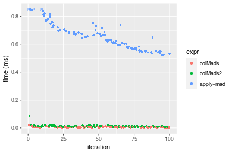

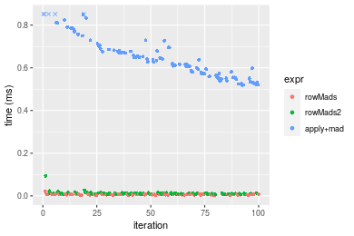
_Table: Benchmarking of colMads() and rowMads() on integer+10x10 data (original and transposed).  The top panel shows times in milliseconds and the bottom panel shows relative times._


|   |expr    |   min|     lq|    mean| median|     uq|    max|
|:--|:-------|-----:|------:|-------:|------:|------:|------:|
|1  |colMads | 2.911| 4.3845| 6.48686|  5.844| 7.6305| 23.153|
|2  |rowMads | 3.372| 4.9500| 6.67318|  6.346| 7.7980| 22.042|


|   |expr    |      min|       lq|     mean| median|       uq|       max|
|:--|:-------|--------:|--------:|--------:|------:|--------:|---------:|
|1  |colMads | 1.000000| 1.000000| 1.000000| 1.0000| 1.000000| 1.0000000|
|2  |rowMads | 1.158365| 1.128977| 1.028723| 1.0859| 1.021951| 0.9520149|

_Figure: Benchmarking of colMads() and rowMads() on integer+10x10 data (original and transposed).  Outliers are displayed as crosses. Times are in milliseconds._


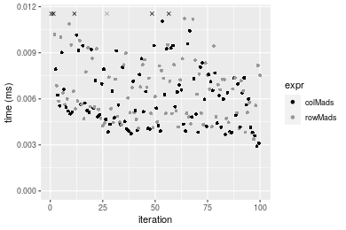

#### 100x100 integer matrix

```r
> X <- data[["100x100"]]
> gc()
          used  (Mb) gc trigger  (Mb) max used  (Mb)
Ncells 5225974 279.1    8529671 455.6  8529671 455.6
Vcells 9679850  73.9   31876688 243.2 60562128 462.1
> colStats <- microbenchmark(colMads = colMads(X, na.rm = FALSE), colMads2 = colMads2(X, na.rm = FALSE), 
+     `apply+mad` = apply(X, MARGIN = 2L, FUN = mad, na.rm = FALSE), unit = "ms")
> X <- t(X)
> gc()
          used  (Mb) gc trigger  (Mb) max used  (Mb)
Ncells 5225968 279.1    8529671 455.6  8529671 455.6
Vcells 9684893  73.9   31876688 243.2 60562128 462.1
> rowStats <- microbenchmark(rowMads = rowMads(X, na.rm = FALSE), rowMads2 = rowMads2(X, na.rm = FALSE), 
+     `apply+mad` = apply(X, MARGIN = 1L, FUN = mad, na.rm = FALSE), unit = "ms")
```

_Table: Benchmarking of colMads(), colMads2() and apply+mad() on integer+100x100 data. The top panel shows times in milliseconds and the bottom panel shows relative times._


|   |expr      |      min|        lq|      mean|    median|        uq|       max|
|:--|:---------|--------:|---------:|---------:|---------:|---------:|---------:|
|1  |colMads   | 0.280159| 0.3086925| 0.3192907| 0.3133360| 0.3226325|  0.482616|
|2  |colMads2  | 0.337539| 0.3668050| 0.3827254| 0.3758095| 0.3862170|  0.625727|
|3  |apply+mad | 5.557610| 6.0530400| 6.4049605| 6.2980390| 6.4710520| 15.261305|


|   |expr      |       min|        lq|      mean|    median|       uq|       max|
|:--|:---------|---------:|---------:|---------:|---------:|--------:|---------:|
|1  |colMads   |  1.000000|  1.000000|  1.000000|  1.000000|  1.00000|  1.000000|
|2  |colMads2  |  1.204812|  1.188254|  1.198674|  1.199382|  1.19708|  1.296532|
|3  |apply+mad | 19.837342| 19.608640| 20.059967| 20.099953| 20.05704| 31.622045|

_Table: Benchmarking of rowMads(), rowMads2() and apply+mad() on integer+100x100 data (transposed). The top panel shows times in milliseconds and the bottom panel shows relative times._


|   |expr      |      min|       lq|      mean|    median|        uq|       max|
|:--|:---------|--------:|--------:|---------:|---------:|---------:|---------:|
|1  |rowMads   | 0.288287| 0.317768| 0.3299942| 0.3220715| 0.3280665|  0.450206|
|2  |rowMads2  | 0.340417| 0.376679| 0.3899930| 0.3837420| 0.3938805|  0.521021|
|3  |apply+mad | 5.549613| 6.125216| 6.3968007| 6.2457055| 6.4645205| 15.384339|


|   |expr      |       min|       lq|      mean|    median|        uq|       max|
|:--|:---------|---------:|--------:|---------:|---------:|---------:|---------:|
|1  |rowMads   |  1.000000|  1.00000|  1.000000|  1.000000|  1.000000|  1.000000|
|2  |rowMads2  |  1.180827|  1.18539|  1.181818|  1.191481|  1.200612|  1.157295|
|3  |apply+mad | 19.250306| 19.27575| 19.384583| 19.392295| 19.704909| 34.171777|

_Figure: Benchmarking of colMads(), colMads2() and apply+mad() on integer+100x100 data  as well as rowMads(), rowMads2() and apply+mad() on the same data transposed.  Outliers are displayed as crosses.  Times are in milliseconds._


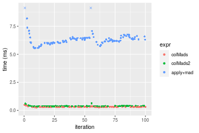

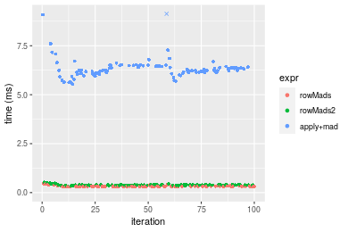
_Table: Benchmarking of colMads() and rowMads() on integer+100x100 data (original and transposed).  The top panel shows times in milliseconds and the bottom panel shows relative times._


|   |expr    |     min|       lq|     mean|   median|       uq|     max|
|:--|:-------|-------:|--------:|--------:|--------:|--------:|-------:|
|1  |colMads | 280.159| 308.6925| 319.2907| 313.3360| 322.6325| 482.616|
|2  |rowMads | 288.287| 317.7680| 329.9942| 322.0715| 328.0665| 450.206|


|   |expr    |      min|     lq|     mean|   median|       uq|       max|
|:--|:-------|--------:|------:|--------:|--------:|--------:|---------:|
|1  |colMads | 1.000000| 1.0000| 1.000000| 1.000000| 1.000000| 1.0000000|
|2  |rowMads | 1.029012| 1.0294| 1.033523| 1.027879| 1.016843| 0.9328452|

_Figure: Benchmarking of colMads() and rowMads() on integer+100x100 data (original and transposed).  Outliers are displayed as crosses. Times are in milliseconds._


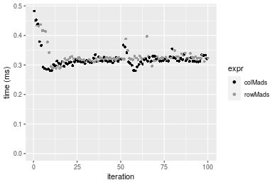

#### 1000x10 integer matrix

```r
> X <- data[["1000x10"]]
> gc()
          used  (Mb) gc trigger  (Mb) max used  (Mb)
Ncells 5226745 279.2    8529671 455.6  8529671 455.6
Vcells 9683659  73.9   31876688 243.2 60562128 462.1
> colStats <- microbenchmark(colMads = colMads(X, na.rm = FALSE), colMads2 = colMads2(X, na.rm = FALSE), 
+     `apply+mad` = apply(X, MARGIN = 2L, FUN = mad, na.rm = FALSE), unit = "ms")
> X <- t(X)
> gc()
          used  (Mb) gc trigger  (Mb) max used  (Mb)
Ncells 5226721 279.2    8529671 455.6  8529671 455.6
Vcells 9688672  74.0   31876688 243.2 60562128 462.1
> rowStats <- microbenchmark(rowMads = rowMads(X, na.rm = FALSE), rowMads2 = rowMads2(X, na.rm = FALSE), 
+     `apply+mad` = apply(X, MARGIN = 1L, FUN = mad, na.rm = FALSE), unit = "ms")
```

_Table: Benchmarking of colMads(), colMads2() and apply+mad() on integer+1000x10 data. The top panel shows times in milliseconds and the bottom panel shows relative times._


|   |expr      |      min|        lq|      mean|    median|        uq|      max|
|:--|:---------|--------:|---------:|---------:|---------:|---------:|--------:|
|1  |colMads   | 0.207184| 0.2181840| 0.2354643| 0.2263615| 0.2370005| 0.344432|
|2  |colMads2  | 0.302347| 0.3119515| 0.3411153| 0.3294780| 0.3426210| 0.533024|
|3  |apply+mad | 0.960231| 1.0187745| 1.0961040| 1.0614555| 1.1074695| 1.758757|


|   |expr      |      min|       lq|     mean|   median|       uq|      max|
|:--|:---------|--------:|--------:|--------:|--------:|--------:|--------:|
|1  |colMads   | 1.000000| 1.000000| 1.000000| 1.000000| 1.000000| 1.000000|
|2  |colMads2  | 1.459316| 1.429763| 1.448692| 1.455539| 1.445655| 1.547545|
|3  |apply+mad | 4.634677| 4.669336| 4.655074| 4.689205| 4.672857| 5.106253|

_Table: Benchmarking of rowMads(), rowMads2() and apply+mad() on integer+1000x10 data (transposed). The top panel shows times in milliseconds and the bottom panel shows relative times._


|   |expr      |      min|        lq|      mean|   median|       uq|      max|
|:--|:---------|--------:|---------:|---------:|--------:|--------:|--------:|
|1  |rowMads   | 0.214533| 0.2274505| 0.2468018| 0.235193| 0.263500| 0.356902|
|2  |rowMads2  | 0.313418| 0.3215165| 0.3523157| 0.341477| 0.359623| 0.557957|
|3  |apply+mad | 0.963733| 1.0034030| 1.0843441| 1.045441| 1.085357| 1.718455|


|   |expr      |      min|       lq|     mean|   median|       uq|      max|
|:--|:---------|--------:|--------:|--------:|--------:|--------:|--------:|
|1  |rowMads   | 1.000000| 1.000000| 1.000000| 1.000000| 1.000000| 1.000000|
|2  |rowMads2  | 1.460931| 1.413567| 1.427525| 1.451901| 1.364793| 1.563334|
|3  |apply+mad | 4.492237| 4.411523| 4.393582| 4.445035| 4.119000| 4.814921|

_Figure: Benchmarking of colMads(), colMads2() and apply+mad() on integer+1000x10 data  as well as rowMads(), rowMads2() and apply+mad() on the same data transposed.  Outliers are displayed as crosses.  Times are in milliseconds._


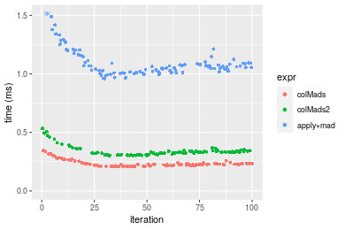

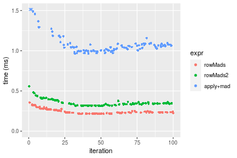
_Table: Benchmarking of colMads() and rowMads() on integer+1000x10 data (original and transposed).  The top panel shows times in milliseconds and the bottom panel shows relative times._


|   |expr    |     min|       lq|     mean|   median|       uq|     max|
|:--|:-------|-------:|--------:|--------:|--------:|--------:|-------:|
|1  |colMads | 207.184| 218.1840| 235.4643| 226.3615| 237.0005| 344.432|
|2  |rowMads | 214.533| 227.4505| 246.8018| 235.1930| 263.5000| 356.902|


|   |expr    |      min|       lq|    mean|   median|       uq|      max|
|:--|:-------|--------:|--------:|-------:|--------:|--------:|--------:|
|1  |colMads | 1.000000| 1.000000| 1.00000| 1.000000| 1.000000| 1.000000|
|2  |rowMads | 1.035471| 1.042471| 1.04815| 1.039015| 1.111812| 1.036204|

_Figure: Benchmarking of colMads() and rowMads() on integer+1000x10 data (original and transposed).  Outliers are displayed as crosses. Times are in milliseconds._


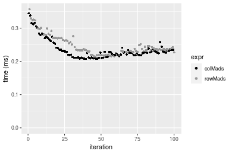

#### 10x1000 integer matrix

```r
> X <- data[["10x1000"]]
> gc()
          used  (Mb) gc trigger  (Mb) max used  (Mb)
Ncells 5226940 279.2    8529671 455.6  8529671 455.6
Vcells 9684074  73.9   31876688 243.2 60562128 462.1
> colStats <- microbenchmark(colMads = colMads(X, na.rm = FALSE), colMads2 = colMads2(X, na.rm = FALSE), 
+     `apply+mad` = apply(X, MARGIN = 2L, FUN = mad, na.rm = FALSE), unit = "ms")
> X <- t(X)
> gc()
          used  (Mb) gc trigger  (Mb) max used  (Mb)
Ncells 5226934 279.2    8529671 455.6  8529671 455.6
Vcells 9689117  74.0   31876688 243.2 60562128 462.1
> rowStats <- microbenchmark(rowMads = rowMads(X, na.rm = FALSE), rowMads2 = rowMads2(X, na.rm = FALSE), 
+     `apply+mad` = apply(X, MARGIN = 1L, FUN = mad, na.rm = FALSE), unit = "ms")
```

_Table: Benchmarking of colMads(), colMads2() and apply+mad() on integer+10x1000 data. The top panel shows times in milliseconds and the bottom panel shows relative times._


|   |expr      |       min|         lq|       mean|     median|        uq|        max|
|:--|:---------|---------:|----------:|----------:|----------:|---------:|----------:|
|1  |colMads   |  0.283539|  0.3228190|  0.3400543|  0.3320985|  0.352115|   0.476548|
|2  |colMads2  |  0.372100|  0.4230135|  0.4478625|  0.4414430|  0.458013|   0.642775|
|3  |apply+mad | 51.449480| 56.7547215| 61.5407343| 57.3257015| 58.492311| 416.270212|


|   |expr      |        min|         lq|       mean|     median|         uq|        max|
|:--|:---------|----------:|----------:|----------:|----------:|----------:|----------:|
|1  |colMads   |   1.000000|   1.000000|   1.000000|   1.000000|   1.000000|   1.000000|
|2  |colMads2  |   1.312342|   1.310374|   1.317032|   1.329253|   1.300748|   1.348815|
|3  |apply+mad | 181.454685| 175.809731| 180.973257| 172.616563| 166.117067| 873.511613|

_Table: Benchmarking of rowMads(), rowMads2() and apply+mad() on integer+10x1000 data (transposed). The top panel shows times in milliseconds and the bottom panel shows relative times._


|   |expr      |       min|         lq|       mean|     median|         uq|       max|
|:--|:---------|---------:|----------:|----------:|----------:|----------:|---------:|
|1  |rowMads   |  0.287380|  0.3372805|  0.3545651|  0.3490950|  0.3661025|  0.509743|
|2  |rowMads2  |  0.376702|  0.4239780|  0.4518364|  0.4408745|  0.4601415|  1.195377|
|3  |apply+mad | 53.628257| 56.8922530| 58.6950071| 58.1868010| 58.9637595| 73.106085|


|   |expr      |        min|         lq|      mean|     median|         uq|        max|
|:--|:---------|----------:|----------:|---------:|----------:|----------:|----------:|
|1  |rowMads   |   1.000000|   1.000000|   1.00000|   1.000000|   1.000000|   1.000000|
|2  |rowMads2  |   1.310815|   1.257049|   1.27434|   1.262907|   1.256865|   2.345058|
|3  |apply+mad | 186.610958| 168.679343| 165.54084| 166.678987| 161.058063| 143.417536|

_Figure: Benchmarking of colMads(), colMads2() and apply+mad() on integer+10x1000 data  as well as rowMads(), rowMads2() and apply+mad() on the same data transposed.  Outliers are displayed as crosses.  Times are in milliseconds._


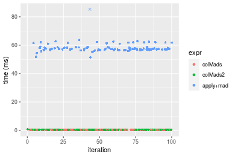

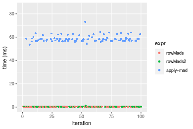
_Table: Benchmarking of colMads() and rowMads() on integer+10x1000 data (original and transposed).  The top panel shows times in milliseconds and the bottom panel shows relative times._


|   |expr    |     min|       lq|     mean|   median|       uq|     max|
|:--|:-------|-------:|--------:|--------:|--------:|--------:|-------:|
|1  |colMads | 283.539| 322.8190| 340.0543| 332.0985| 352.1150| 476.548|
|2  |rowMads | 287.380| 337.2805| 354.5651| 349.0950| 366.1025| 509.743|


|   |expr    |      min|       lq|     mean|   median|       uq|      max|
|:--|:-------|--------:|--------:|--------:|--------:|--------:|--------:|
|1  |colMads | 1.000000| 1.000000| 1.000000| 1.000000| 1.000000| 1.000000|
|2  |rowMads | 1.013547| 1.044798| 1.042672| 1.051179| 1.039724| 1.069657|

_Figure: Benchmarking of colMads() and rowMads() on integer+10x1000 data (original and transposed).  Outliers are displayed as crosses. Times are in milliseconds._


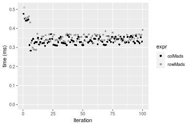

#### 100x1000 integer matrix

```r
> X <- data[["100x1000"]]
> gc()
          used  (Mb) gc trigger  (Mb) max used  (Mb)
Ncells 5227144 279.2    8529671 455.6  8529671 455.6
Vcells 9685124  73.9   31876688 243.2 60562128 462.1
> colStats <- microbenchmark(colMads = colMads(X, na.rm = FALSE), colMads2 = colMads2(X, na.rm = FALSE), 
+     `apply+mad` = apply(X, MARGIN = 2L, FUN = mad, na.rm = FALSE), unit = "ms")
> X <- t(X)
> gc()
          used  (Mb) gc trigger  (Mb) max used  (Mb)
Ncells 5227138 279.2    8529671 455.6  8529671 455.6
Vcells 9735167  74.3   31876688 243.2 60562128 462.1
> rowStats <- microbenchmark(rowMads = rowMads(X, na.rm = FALSE), rowMads2 = rowMads2(X, na.rm = FALSE), 
+     `apply+mad` = apply(X, MARGIN = 1L, FUN = mad, na.rm = FALSE), unit = "ms")
```

_Table: Benchmarking of colMads(), colMads2() and apply+mad() on integer+100x1000 data. The top panel shows times in milliseconds and the bottom panel shows relative times._


|   |expr      |       min|        lq|      mean|    median|        uq|       max|
|:--|:---------|---------:|---------:|---------:|---------:|---------:|---------:|
|1  |colMads   |  2.897207|  3.174434|  3.187247|  3.189120|  3.232470|  3.555109|
|2  |colMads2  |  3.427215|  3.786783|  3.821480|  3.807254|  3.866204|  4.937695|
|3  |apply+mad | 59.725124| 63.099864| 65.615657| 64.223503| 65.455270| 76.280149|


|   |expr      |       min|       lq|      mean|    median|        uq|       max|
|:--|:---------|---------:|--------:|---------:|---------:|---------:|---------:|
|1  |colMads   |  1.000000|  1.00000|  1.000000|  1.000000|  1.000000|  1.000000|
|2  |colMads2  |  1.182938|  1.19290|  1.198991|  1.193826|  1.196053|  1.388901|
|3  |apply+mad | 20.614725| 19.87752| 20.586939| 20.138315| 20.249308| 21.456487|

_Table: Benchmarking of rowMads(), rowMads2() and apply+mad() on integer+100x1000 data (transposed). The top panel shows times in milliseconds and the bottom panel shows relative times._


|   |expr      |       min|        lq|      mean|    median|        uq|       max|
|:--|:---------|---------:|---------:|---------:|---------:|---------:|---------:|
|1  |rowMads   |  2.869750|  3.266530|  3.348353|  3.307662|  3.382273|  5.142912|
|2  |rowMads2  |  3.573523|  3.840384|  3.916673|  3.932559|  3.988018|  4.423820|
|3  |apply+mad | 59.988647| 63.974414| 66.478240| 64.797894| 66.522702| 89.255271|


|   |expr      |       min|        lq|      mean|    median|        uq|       max|
|:--|:---------|---------:|---------:|---------:|---------:|---------:|---------:|
|1  |rowMads   |  1.000000|  1.000000|  1.000000|  1.000000|  1.000000|  1.000000|
|2  |rowMads2  |  1.245238|  1.175677|  1.169731|  1.188924|  1.179094|  0.860178|
|3  |apply+mad | 20.903789| 19.584824| 19.854012| 19.590243| 19.668049| 17.355006|

_Figure: Benchmarking of colMads(), colMads2() and apply+mad() on integer+100x1000 data  as well as rowMads(), rowMads2() and apply+mad() on the same data transposed.  Outliers are displayed as crosses.  Times are in milliseconds._


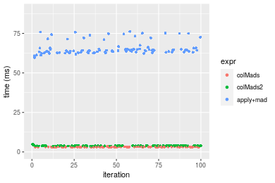

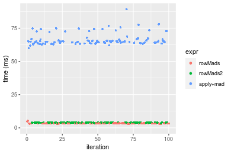
_Table: Benchmarking of colMads() and rowMads() on integer+100x1000 data (original and transposed).  The top panel shows times in milliseconds and the bottom panel shows relative times._


|   |expr    |      min|       lq|     mean|   median|       uq|      max|
|:--|:-------|--------:|--------:|--------:|--------:|--------:|--------:|
|1  |colMads | 2.897207| 3.174434| 3.187247| 3.189120| 3.232470| 3.555109|
|2  |rowMads | 2.869750| 3.266530| 3.348353| 3.307662| 3.382273| 5.142912|


|   |expr    |       min|       lq|     mean|   median|       uq|      max|
|:--|:-------|---------:|--------:|--------:|--------:|--------:|--------:|
|1  |colMads | 1.0000000| 1.000000| 1.000000| 1.000000| 1.000000| 1.000000|
|2  |rowMads | 0.9905229| 1.029012| 1.050547| 1.037171| 1.046343| 1.446626|

_Figure: Benchmarking of colMads() and rowMads() on integer+100x1000 data (original and transposed).  Outliers are displayed as crosses. Times are in milliseconds._


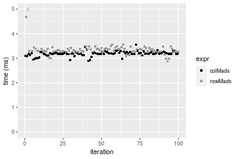

#### 1000x100 integer matrix

```r
> X <- data[["1000x100"]]
> gc()
          used  (Mb) gc trigger  (Mb) max used  (Mb)
Ncells 5227350 279.2    8529671 455.6  8529671 455.6
Vcells 9685802  73.9   31876688 243.2 60562128 462.1
> colStats <- microbenchmark(colMads = colMads(X, na.rm = FALSE), colMads2 = colMads2(X, na.rm = FALSE), 
+     `apply+mad` = apply(X, MARGIN = 2L, FUN = mad, na.rm = FALSE), unit = "ms")
> X <- t(X)
> gc()
          used  (Mb) gc trigger  (Mb) max used  (Mb)
Ncells 5227344 279.2    8529671 455.6  8529671 455.6
Vcells 9735845  74.3   31876688 243.2 60562128 462.1
> rowStats <- microbenchmark(rowMads = rowMads(X, na.rm = FALSE), rowMads2 = rowMads2(X, na.rm = FALSE), 
+     `apply+mad` = apply(X, MARGIN = 1L, FUN = mad, na.rm = FALSE), unit = "ms")
```

_Table: Benchmarking of colMads(), colMads2() and apply+mad() on integer+1000x100 data. The top panel shows times in milliseconds and the bottom panel shows relative times._


|   |expr      |      min|        lq|      mean|    median|        uq|       max|
|:--|:---------|--------:|---------:|---------:|---------:|---------:|---------:|
|1  |colMads   | 2.204126|  2.521503|  2.584057|  2.536456|  2.606876|  3.609728|
|2  |colMads2  | 3.021677|  3.420520|  3.550127|  3.441163|  3.503141| 12.308642|
|3  |apply+mad | 9.472349| 10.531190| 10.931617| 10.619740| 10.861638| 21.006739|


|   |expr      |      min|       lq|     mean|   median|       uq|      max|
|:--|:---------|--------:|--------:|--------:|--------:|--------:|--------:|
|1  |colMads   | 1.000000| 1.000000| 1.000000| 1.000000| 1.000000| 1.000000|
|2  |colMads2  | 1.370918| 1.356540| 1.373858| 1.356681| 1.343808| 3.409853|
|3  |apply+mad | 4.297553| 4.176553| 4.230409| 4.186841| 4.166534| 5.819480|

_Table: Benchmarking of rowMads(), rowMads2() and apply+mad() on integer+1000x100 data (transposed). The top panel shows times in milliseconds and the bottom panel shows relative times._


|   |expr      |      min|        lq|      mean|    median|        uq|       max|
|:--|:---------|--------:|---------:|---------:|---------:|---------:|---------:|
|1  |rowMads   | 2.281857|  2.614507|  2.662678|  2.624229|  2.664994|  3.561178|
|2  |rowMads2  | 3.064162|  3.471974|  3.561733|  3.499127|  3.551153|  4.948618|
|3  |apply+mad | 9.896669| 10.569337| 10.988476| 10.634806| 10.774353| 20.211581|


|   |expr      |      min|       lq|     mean|   median|       uq|      max|
|:--|:---------|--------:|--------:|--------:|--------:|--------:|--------:|
|1  |rowMads   | 1.000000| 1.000000| 1.000000| 1.000000| 1.000000| 1.000000|
|2  |rowMads2  | 1.342837| 1.327965| 1.337651| 1.333392| 1.332518| 1.389601|
|3  |apply+mad | 4.337112| 4.042573| 4.126851| 4.052546| 4.042918| 5.675532|

_Figure: Benchmarking of colMads(), colMads2() and apply+mad() on integer+1000x100 data  as well as rowMads(), rowMads2() and apply+mad() on the same data transposed.  Outliers are displayed as crosses.  Times are in milliseconds._


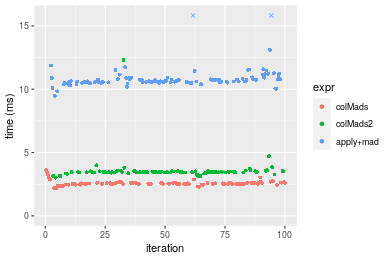

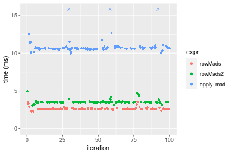
_Table: Benchmarking of colMads() and rowMads() on integer+1000x100 data (original and transposed).  The top panel shows times in milliseconds and the bottom panel shows relative times._


|   |expr    |      min|       lq|     mean|   median|       uq|      max|
|:--|:-------|--------:|--------:|--------:|--------:|--------:|--------:|
|1  |colMads | 2.204126| 2.521503| 2.584057| 2.536456| 2.606876| 3.609728|
|2  |rowMads | 2.281857| 2.614507| 2.662678| 2.624229| 2.664994| 3.561178|


|   |expr    |      min|       lq|     mean|   median|       uq|       max|
|:--|:-------|--------:|--------:|--------:|--------:|--------:|---------:|
|1  |colMads | 1.000000| 1.000000| 1.000000| 1.000000| 1.000000| 1.0000000|
|2  |rowMads | 1.035266| 1.036884| 1.030426| 1.034604| 1.022294| 0.9865502|

_Figure: Benchmarking of colMads() and rowMads() on integer+1000x100 data (original and transposed).  Outliers are displayed as crosses. Times are in milliseconds._


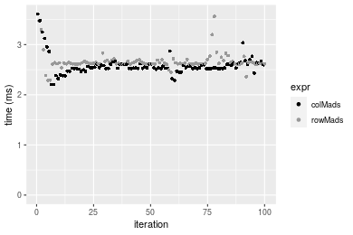


## Data type "double"

### Data
```r
> rmatrix <- function(nrow, ncol, mode = c("logical", "double", "integer", "index"), range = c(-100, 
+     +100), na_prob = 0) {
+     mode <- match.arg(mode)
+     n <- nrow * ncol
+     if (mode == "logical") {
+         x <- sample(c(FALSE, TRUE), size = n, replace = TRUE)
+     }     else if (mode == "index") {
+         x <- seq_len(n)
+         mode <- "integer"
+     }     else {
+         x <- runif(n, min = range[1], max = range[2])
+     }
+     storage.mode(x) <- mode
+     if (na_prob > 0) 
+         x[sample(n, size = na_prob * n)] <- NA
+     dim(x) <- c(nrow, ncol)
+     x
+ }
> rmatrices <- function(scale = 10, seed = 1, ...) {
+     set.seed(seed)
+     data <- list()
+     data[[1]] <- rmatrix(nrow = scale * 1, ncol = scale * 1, ...)
+     data[[2]] <- rmatrix(nrow = scale * 10, ncol = scale * 10, ...)
+     data[[3]] <- rmatrix(nrow = scale * 100, ncol = scale * 1, ...)
+     data[[4]] <- t(data[[3]])
+     data[[5]] <- rmatrix(nrow = scale * 10, ncol = scale * 100, ...)
+     data[[6]] <- t(data[[5]])
+     names(data) <- sapply(data, FUN = function(x) paste(dim(x), collapse = "x"))
+     data
+ }
> data <- rmatrices(mode = mode)
```

### Results

#### 10x10 double matrix

```r
> X <- data[["10x10"]]
> gc()
          used  (Mb) gc trigger  (Mb) max used  (Mb)
Ncells 5227564 279.2    8529671 455.6  8529671 455.6
Vcells 9801659  74.8   31876688 243.2 60562128 462.1
> colStats <- microbenchmark(colMads = colMads(X, na.rm = FALSE), colMads2 = colMads2(X, na.rm = FALSE), 
+     `apply+mad` = apply(X, MARGIN = 2L, FUN = mad, na.rm = FALSE), unit = "ms")
> X <- t(X)
> gc()
          used  (Mb) gc trigger  (Mb) max used  (Mb)
Ncells 5227549 279.2    8529671 455.6  8529671 455.6
Vcells 9801787  74.8   31876688 243.2 60562128 462.1
> rowStats <- microbenchmark(rowMads = rowMads(X, na.rm = FALSE), rowMads2 = rowMads2(X, na.rm = FALSE), 
+     `apply+mad` = apply(X, MARGIN = 1L, FUN = mad, na.rm = FALSE), unit = "ms")
```

_Table: Benchmarking of colMads(), colMads2() and apply+mad() on double+10x10 data. The top panel shows times in milliseconds and the bottom panel shows relative times._


|   |expr      |      min|        lq|      mean|    median|        uq|      max|
|:--|:---------|--------:|---------:|---------:|---------:|---------:|--------:|
|1  |colMads   | 0.004581| 0.0057935| 0.0075455| 0.0070780| 0.0084730| 0.023703|
|2  |colMads2  | 0.006717| 0.0090925| 0.0120188| 0.0108080| 0.0132355| 0.043478|
|3  |apply+mad | 0.515738| 0.5603135| 0.6544891| 0.6336655| 0.7132445| 1.163691|


|   |expr      |        min|        lq|      mean|    median|       uq|       max|
|:--|:---------|----------:|---------:|---------:|---------:|--------:|---------:|
|1  |colMads   |   1.000000|  1.000000|  1.000000|  1.000000|  1.00000|  1.000000|
|2  |colMads2  |   1.466274|  1.569431|  1.592853|  1.526985|  1.56208|  1.834283|
|3  |apply+mad | 112.581969| 96.714162| 86.739221| 89.526067| 84.17851| 49.094672|

_Table: Benchmarking of rowMads(), rowMads2() and apply+mad() on double+10x10 data (transposed). The top panel shows times in milliseconds and the bottom panel shows relative times._


|   |expr      |      min|        lq|      mean|    median|        uq|      max|
|:--|:---------|--------:|---------:|---------:|---------:|---------:|--------:|
|1  |rowMads   | 0.004459| 0.0060485| 0.0077281| 0.0075575| 0.0085845| 0.028484|
|2  |rowMads2  | 0.006522| 0.0088780| 0.0111525| 0.0107755| 0.0129125| 0.027046|
|3  |apply+mad | 0.509955| 0.5394140| 0.6248800| 0.6081865| 0.6704965| 1.007571|


|   |expr      |       min|        lq|      mean|    median|        uq|        max|
|:--|:---------|---------:|---------:|---------:|---------:|---------:|----------:|
|1  |rowMads   |   1.00000|  1.000000|  1.000000|  1.000000|  1.000000|  1.0000000|
|2  |rowMads2  |   1.46266|  1.467802|  1.443111|  1.425802|  1.504164|  0.9495155|
|3  |apply+mad | 114.36533| 89.181450| 80.858372| 80.474562| 78.105481| 35.3732271|

_Figure: Benchmarking of colMads(), colMads2() and apply+mad() on double+10x10 data  as well as rowMads(), rowMads2() and apply+mad() on the same data transposed.  Outliers are displayed as crosses.  Times are in milliseconds._


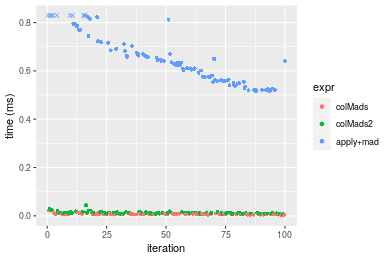

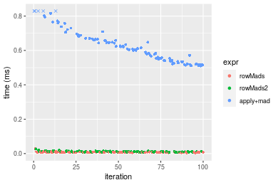
_Table: Benchmarking of colMads() and rowMads() on double+10x10 data (original and transposed).  The top panel shows times in milliseconds and the bottom panel shows relative times._


|   |expr    |   min|     lq|    mean| median|     uq|    max|
|:--|:-------|-----:|------:|-------:|------:|------:|------:|
|1  |colMads | 4.581| 5.7935| 7.54548| 7.0780| 8.4730| 23.703|
|2  |rowMads | 4.459| 6.0485| 7.72808| 7.5575| 8.5845| 28.484|


|   |expr    |       min|       lq|   mean|   median|       uq|      max|
|:--|:-------|---------:|--------:|------:|--------:|--------:|--------:|
|1  |colMads | 1.0000000| 1.000000| 1.0000| 1.000000| 1.000000| 1.000000|
|2  |rowMads | 0.9733683| 1.044015| 1.0242| 1.067745| 1.013159| 1.201704|

_Figure: Benchmarking of colMads() and rowMads() on double+10x10 data (original and transposed).  Outliers are displayed as crosses. Times are in milliseconds._


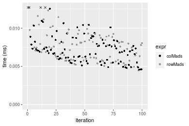

#### 100x100 double matrix

```r
> X <- data[["100x100"]]
> gc()
          used  (Mb) gc trigger  (Mb) max used  (Mb)
Ncells 5227760 279.2    8529671 455.6  8529671 455.6
Vcells 9802574  74.8   31876688 243.2 60562128 462.1
> colStats <- microbenchmark(colMads = colMads(X, na.rm = FALSE), colMads2 = colMads2(X, na.rm = FALSE), 
+     `apply+mad` = apply(X, MARGIN = 2L, FUN = mad, na.rm = FALSE), unit = "ms")
> X <- t(X)
> gc()
          used  (Mb) gc trigger  (Mb) max used  (Mb)
Ncells 5227754 279.2    8529671 455.6  8529671 455.6
Vcells 9812617  74.9   31876688 243.2 60562128 462.1
> rowStats <- microbenchmark(rowMads = rowMads(X, na.rm = FALSE), rowMads2 = rowMads2(X, na.rm = FALSE), 
+     `apply+mad` = apply(X, MARGIN = 1L, FUN = mad, na.rm = FALSE), unit = "ms")
```

_Table: Benchmarking of colMads(), colMads2() and apply+mad() on double+100x100 data. The top panel shows times in milliseconds and the bottom panel shows relative times._


|   |expr      |      min|        lq|      mean|    median|        uq|       max|
|:--|:---------|--------:|---------:|---------:|---------:|---------:|---------:|
|1  |colMads   | 0.365224| 0.4220775| 0.4516445| 0.4607165| 0.4767705|  0.660302|
|2  |colMads2  | 0.396440| 0.4572970| 0.4835784| 0.4871105| 0.5106065|  0.618663|
|3  |apply+mad | 5.544954| 6.5021910| 7.0000483| 7.0005265| 7.2346420| 16.753403|


|   |expr      |       min|        lq|      mean|    median|        uq|        max|
|:--|:---------|---------:|---------:|---------:|---------:|---------:|----------:|
|1  |colMads   |  1.000000|  1.000000|  1.000000|  1.000000|  1.000000|  1.0000000|
|2  |colMads2  |  1.085471|  1.083443|  1.070706|  1.057289|  1.070969|  0.9369395|
|3  |apply+mad | 15.182337| 15.405206| 15.499023| 15.194868| 15.174265| 25.3723342|

_Table: Benchmarking of rowMads(), rowMads2() and apply+mad() on double+100x100 data (transposed). The top panel shows times in milliseconds and the bottom panel shows relative times._


|   |expr      |      min|       lq|      mean|    median|        uq|       max|
|:--|:---------|--------:|--------:|---------:|---------:|---------:|---------:|
|1  |rowMads   | 0.394444| 0.420360| 0.4347465| 0.4279820| 0.4378975|  0.573436|
|2  |rowMads2  | 0.427857| 0.454976| 0.4708328| 0.4650805| 0.4803030|  0.611249|
|3  |apply+mad | 5.739571| 6.473420| 6.7375502| 6.6279680| 6.7521545| 16.327633|


|   |expr      |       min|        lq|      mean|    median|        uq|       max|
|:--|:---------|---------:|---------:|---------:|---------:|---------:|---------:|
|1  |rowMads   |  1.000000|  1.000000|  1.000000|  1.000000|  1.000000|  1.000000|
|2  |rowMads2  |  1.084709|  1.082348|  1.083006|  1.086682|  1.096839|  1.065941|
|3  |apply+mad | 14.551042| 15.399705| 15.497654| 15.486558| 15.419486| 28.473331|

_Figure: Benchmarking of colMads(), colMads2() and apply+mad() on double+100x100 data  as well as rowMads(), rowMads2() and apply+mad() on the same data transposed.  Outliers are displayed as crosses.  Times are in milliseconds._


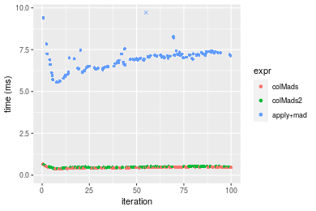

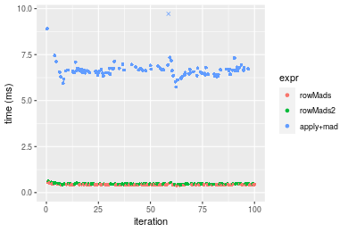
_Table: Benchmarking of colMads() and rowMads() on double+100x100 data (original and transposed).  The top panel shows times in milliseconds and the bottom panel shows relative times._


|   |expr    |     min|       lq|     mean|   median|       uq|     max|
|:--|:-------|-------:|--------:|--------:|--------:|--------:|-------:|
|2  |rowMads | 394.444| 420.3600| 434.7465| 427.9820| 437.8975| 573.436|
|1  |colMads | 365.224| 422.0775| 451.6445| 460.7165| 476.7705| 660.302|


|   |expr    |      min|       lq|     mean|   median|       uq|      max|
|:--|:-------|--------:|--------:|--------:|--------:|--------:|--------:|
|2  |rowMads | 1.000000| 1.000000| 1.000000| 1.000000| 1.000000| 1.000000|
|1  |colMads | 0.925921| 1.004086| 1.038869| 1.076486| 1.088772| 1.151483|

_Figure: Benchmarking of colMads() and rowMads() on double+100x100 data (original and transposed).  Outliers are displayed as crosses. Times are in milliseconds._


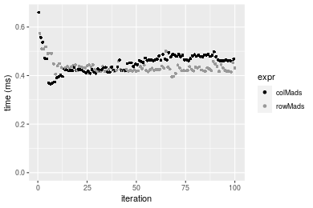

#### 1000x10 double matrix

```r
> X <- data[["1000x10"]]
> gc()
          used  (Mb) gc trigger  (Mb) max used  (Mb)
Ncells 5227981 279.3    8529671 455.6  8529671 455.6
Vcells 9802734  74.8   31876688 243.2 60562128 462.1
> colStats <- microbenchmark(colMads = colMads(X, na.rm = FALSE), colMads2 = colMads2(X, na.rm = FALSE), 
+     `apply+mad` = apply(X, MARGIN = 2L, FUN = mad, na.rm = FALSE), unit = "ms")
> X <- t(X)
> gc()
          used  (Mb) gc trigger  (Mb) max used  (Mb)
Ncells 5227963 279.3    8529671 455.6  8529671 455.6
Vcells 9812757  74.9   31876688 243.2 60562128 462.1
> rowStats <- microbenchmark(rowMads = rowMads(X, na.rm = FALSE), rowMads2 = rowMads2(X, na.rm = FALSE), 
+     `apply+mad` = apply(X, MARGIN = 1L, FUN = mad, na.rm = FALSE), unit = "ms")
```

_Table: Benchmarking of colMads(), colMads2() and apply+mad() on double+1000x10 data. The top panel shows times in milliseconds and the bottom panel shows relative times._


|   |expr      |      min|        lq|      mean|    median|        uq|      max|
|:--|:---------|--------:|---------:|---------:|---------:|---------:|--------:|
|1  |colMads   | 0.330291| 0.3593555| 0.3824990| 0.3708205| 0.3850245| 0.546655|
|2  |colMads2  | 0.364039| 0.3980275| 0.4216585| 0.4097920| 0.4221325| 0.629301|
|3  |apply+mad | 1.005330| 1.1020030| 1.1686173| 1.1468255| 1.1839375| 1.779101|


|   |expr      |      min|       lq|     mean|   median|       uq|      max|
|:--|:---------|--------:|--------:|--------:|--------:|--------:|--------:|
|1  |colMads   | 1.000000| 1.000000| 1.000000| 1.000000| 1.000000| 1.000000|
|2  |colMads2  | 1.102177| 1.107615| 1.102378| 1.105095| 1.096378| 1.151185|
|3  |apply+mad | 3.043770| 3.066610| 3.055216| 3.092670| 3.074967| 3.254523|

_Table: Benchmarking of rowMads(), rowMads2() and apply+mad() on double+1000x10 data (transposed). The top panel shows times in milliseconds and the bottom panel shows relative times._


|   |expr      |      min|        lq|      mean|    median|        uq|      max|
|:--|:---------|--------:|---------:|---------:|---------:|---------:|--------:|
|1  |rowMads   | 0.327958| 0.3568210| 0.3809122| 0.3698970| 0.3919385| 0.539816|
|2  |rowMads2  | 0.369916| 0.4044725| 0.4241505| 0.4166235| 0.4293825| 0.642681|
|3  |apply+mad | 1.014903| 1.0970550| 1.1561683| 1.1318380| 1.1593105| 1.784336|


|   |expr      |      min|       lq|     mean|   median|       uq|      max|
|:--|:---------|--------:|--------:|--------:|--------:|--------:|--------:|
|1  |rowMads   | 1.000000| 1.000000| 1.000000| 1.000000| 1.000000| 1.000000|
|2  |rowMads2  | 1.127937| 1.133545| 1.113513| 1.126323| 1.095535| 1.190556|
|3  |apply+mad | 3.094613| 3.074525| 3.035262| 3.059873| 2.957889| 3.305452|

_Figure: Benchmarking of colMads(), colMads2() and apply+mad() on double+1000x10 data  as well as rowMads(), rowMads2() and apply+mad() on the same data transposed.  Outliers are displayed as crosses.  Times are in milliseconds._


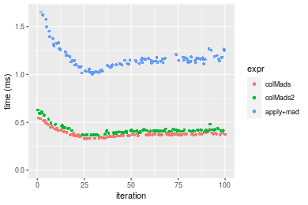

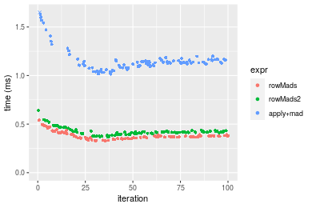
_Table: Benchmarking of colMads() and rowMads() on double+1000x10 data (original and transposed).  The top panel shows times in milliseconds and the bottom panel shows relative times._


|   |expr    |     min|       lq|     mean|   median|       uq|     max|
|:--|:-------|-------:|--------:|--------:|--------:|--------:|-------:|
|2  |rowMads | 327.958| 356.8210| 380.9122| 369.8970| 391.9385| 539.816|
|1  |colMads | 330.291| 359.3555| 382.4990| 370.8205| 385.0245| 546.655|


|   |expr    |      min|       lq|     mean|   median|        uq|      max|
|:--|:-------|--------:|--------:|--------:|--------:|---------:|--------:|
|2  |rowMads | 1.000000| 1.000000| 1.000000| 1.000000| 1.0000000| 1.000000|
|1  |colMads | 1.007114| 1.007103| 1.004166| 1.002497| 0.9823595| 1.012669|

_Figure: Benchmarking of colMads() and rowMads() on double+1000x10 data (original and transposed).  Outliers are displayed as crosses. Times are in milliseconds._


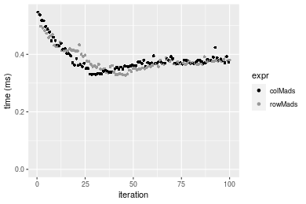

#### 10x1000 double matrix

```r
> X <- data[["10x1000"]]
> gc()
          used  (Mb) gc trigger  (Mb) max used  (Mb)
Ncells 5228182 279.3    8529671 455.6  8529671 455.6
Vcells 9803801  74.8   31876688 243.2 60562128 462.1
> colStats <- microbenchmark(colMads = colMads(X, na.rm = FALSE), colMads2 = colMads2(X, na.rm = FALSE), 
+     `apply+mad` = apply(X, MARGIN = 2L, FUN = mad, na.rm = FALSE), unit = "ms")
> X <- t(X)
> gc()
          used  (Mb) gc trigger  (Mb) max used  (Mb)
Ncells 5228176 279.3    8529671 455.6  8529671 455.6
Vcells 9813844  74.9   31876688 243.2 60562128 462.1
> rowStats <- microbenchmark(rowMads = rowMads(X, na.rm = FALSE), rowMads2 = rowMads2(X, na.rm = FALSE), 
+     `apply+mad` = apply(X, MARGIN = 1L, FUN = mad, na.rm = FALSE), unit = "ms")
```

_Table: Benchmarking of colMads(), colMads2() and apply+mad() on double+10x1000 data. The top panel shows times in milliseconds and the bottom panel shows relative times._


|   |expr      |       min|         lq|       mean|    median|         uq|       max|
|:--|:---------|---------:|----------:|----------:|---------:|----------:|---------:|
|1  |colMads   |  0.363888|  0.4209730|  0.4391614|  0.432610|  0.4420745|  0.604191|
|2  |colMads2  |  0.428136|  0.4918125|  0.5208620|  0.510509|  0.5270265|  0.728955|
|3  |apply+mad | 52.467798| 57.3641435| 59.0773159| 58.473685| 59.5960105| 73.978570|


|   |expr      |       min|         lq|       mean|     median|         uq|        max|
|:--|:---------|---------:|----------:|----------:|----------:|----------:|----------:|
|1  |colMads   |   1.00000|   1.000000|   1.000000|   1.000000|   1.000000|   1.000000|
|2  |colMads2  |   1.17656|   1.168276|   1.186038|   1.180068|   1.192167|   1.206498|
|3  |apply+mad | 144.18667| 136.265612| 134.523007| 135.164895| 134.809880| 122.442357|

_Table: Benchmarking of rowMads(), rowMads2() and apply+mad() on double+10x1000 data (transposed). The top panel shows times in milliseconds and the bottom panel shows relative times._


|   |expr      |       min|         lq|       mean|     median|        uq|       max|
|:--|:---------|---------:|----------:|----------:|----------:|---------:|---------:|
|1  |rowMads   |  0.359739|  0.4220620|  0.4412593|  0.4350155|  0.448377|  0.686357|
|2  |rowMads2  |  0.424041|  0.4981685|  0.5205947|  0.5077900|  0.518982|  1.316516|
|3  |apply+mad | 53.433170| 58.1170070| 59.8168121| 59.1039425| 60.135291| 82.647628|


|   |expr      |        min|         lq|       mean|     median|         uq|        max|
|:--|:---------|----------:|----------:|----------:|----------:|----------:|----------:|
|1  |rowMads   |   1.000000|   1.000000|   1.000000|   1.000000|   1.000000|   1.000000|
|2  |rowMads2  |   1.178746|   1.180321|   1.179793|   1.167292|   1.157468|   1.918121|
|3  |apply+mad | 148.533159| 137.697796| 135.559336| 135.866291| 134.117698| 120.414927|

_Figure: Benchmarking of colMads(), colMads2() and apply+mad() on double+10x1000 data  as well as rowMads(), rowMads2() and apply+mad() on the same data transposed.  Outliers are displayed as crosses.  Times are in milliseconds._


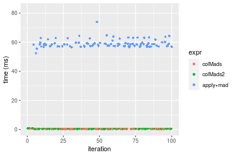

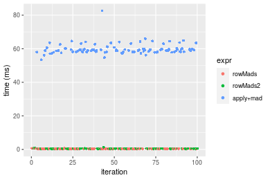
_Table: Benchmarking of colMads() and rowMads() on double+10x1000 data (original and transposed).  The top panel shows times in milliseconds and the bottom panel shows relative times._


|   |expr    |     min|      lq|     mean|   median|       uq|     max|
|:--|:-------|-------:|-------:|--------:|--------:|--------:|-------:|
|1  |colMads | 363.888| 420.973| 439.1614| 432.6100| 442.0745| 604.191|
|2  |rowMads | 359.739| 422.062| 441.2593| 435.0155| 448.3770| 686.357|


|   |expr    |       min|       lq|     mean|  median|       uq|      max|
|:--|:-------|---------:|--------:|--------:|-------:|--------:|--------:|
|1  |colMads | 1.0000000| 1.000000| 1.000000| 1.00000| 1.000000| 1.000000|
|2  |rowMads | 0.9885981| 1.002587| 1.004777| 1.00556| 1.014257| 1.135993|

_Figure: Benchmarking of colMads() and rowMads() on double+10x1000 data (original and transposed).  Outliers are displayed as crosses. Times are in milliseconds._


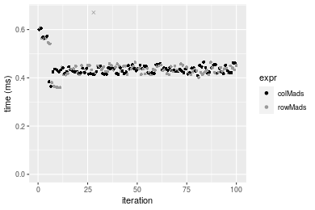

#### 100x1000 double matrix

```r
> X <- data[["100x1000"]]
> gc()
          used  (Mb) gc trigger  (Mb) max used  (Mb)
Ncells 5228386 279.3    8529671 455.6  8529671 455.6
Vcells 9803936  74.8   31876688 243.2 60562128 462.1
> colStats <- microbenchmark(colMads = colMads(X, na.rm = FALSE), colMads2 = colMads2(X, na.rm = FALSE), 
+     `apply+mad` = apply(X, MARGIN = 2L, FUN = mad, na.rm = FALSE), unit = "ms")
> X <- t(X)
> gc()
          used  (Mb) gc trigger  (Mb) max used  (Mb)
Ncells 5228380 279.3    8529671 455.6  8529671 455.6
Vcells 9903979  75.6   31876688 243.2 60562128 462.1
> rowStats <- microbenchmark(rowMads = rowMads(X, na.rm = FALSE), rowMads2 = rowMads2(X, na.rm = FALSE), 
+     `apply+mad` = apply(X, MARGIN = 1L, FUN = mad, na.rm = FALSE), unit = "ms")
```

_Table: Benchmarking of colMads(), colMads2() and apply+mad() on double+100x1000 data. The top panel shows times in milliseconds and the bottom panel shows relative times._


|   |expr      |       min|        lq|      mean|    median|        uq|        max|
|:--|:---------|---------:|---------:|---------:|---------:|---------:|----------:|
|1  |colMads   |  3.956343|  4.294430|  4.376776|  4.398336|  4.444208|   4.714913|
|2  |colMads2  |  4.097677|  4.488697|  4.619376|  4.609297|  4.680533|   6.337030|
|3  |apply+mad | 58.779160| 64.558275| 70.440677| 65.487746| 66.503474| 426.564833|


|   |expr      |       min|        lq|      mean|    median|        uq|      max|
|:--|:---------|---------:|---------:|---------:|---------:|---------:|--------:|
|1  |colMads   |  1.000000|  1.000000|  1.000000|  1.000000|  1.000000|  1.00000|
|2  |colMads2  |  1.035723|  1.045237|  1.055429|  1.047964|  1.053176|  1.34404|
|3  |apply+mad | 14.856942| 15.033024| 16.094192| 14.889209| 14.964080| 90.47141|

_Table: Benchmarking of rowMads(), rowMads2() and apply+mad() on double+100x1000 data (transposed). The top panel shows times in milliseconds and the bottom panel shows relative times._


|   |expr      |       min|        lq|      mean|    median|        uq|       max|
|:--|:---------|---------:|---------:|---------:|---------:|---------:|---------:|
|1  |rowMads   |  3.937613|  4.371682|  4.477499|  4.430325|  4.532702|  5.948798|
|2  |rowMads2  |  4.130020|  4.604520|  4.695753|  4.662670|  4.819568|  6.432425|
|3  |apply+mad | 61.579233| 64.934735| 67.588507| 65.759079| 66.908979| 91.575860|


|   |expr      |       min|        lq|      mean|    median|        uq|       max|
|:--|:---------|---------:|---------:|---------:|---------:|---------:|---------:|
|1  |rowMads   |  1.000000|  1.000000|  1.000000|  1.000000|  1.000000|  1.000000|
|2  |rowMads2  |  1.048864|  1.053261|  1.048745|  1.052444|  1.063288|  1.081298|
|3  |apply+mad | 15.638722| 14.853492| 15.095149| 14.842947| 14.761389| 15.394011|

_Figure: Benchmarking of colMads(), colMads2() and apply+mad() on double+100x1000 data  as well as rowMads(), rowMads2() and apply+mad() on the same data transposed.  Outliers are displayed as crosses.  Times are in milliseconds._


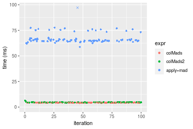

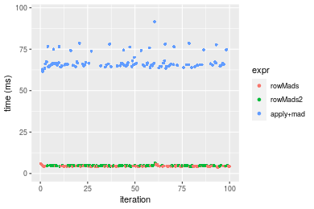
_Table: Benchmarking of colMads() and rowMads() on double+100x1000 data (original and transposed).  The top panel shows times in milliseconds and the bottom panel shows relative times._


|   |expr    |      min|       lq|     mean|   median|       uq|      max|
|:--|:-------|--------:|--------:|--------:|--------:|--------:|--------:|
|1  |colMads | 3.956343| 4.294430| 4.376776| 4.398336| 4.444208| 4.714913|
|2  |rowMads | 3.937613| 4.371682| 4.477499| 4.430325| 4.532702| 5.948798|


|   |expr    |       min|       lq|     mean|   median|       uq|      max|
|:--|:-------|---------:|--------:|--------:|--------:|--------:|--------:|
|1  |colMads | 1.0000000| 1.000000| 1.000000| 1.000000| 1.000000| 1.000000|
|2  |rowMads | 0.9952658| 1.017989| 1.023013| 1.007273| 1.019912| 1.261698|

_Figure: Benchmarking of colMads() and rowMads() on double+100x1000 data (original and transposed).  Outliers are displayed as crosses. Times are in milliseconds._


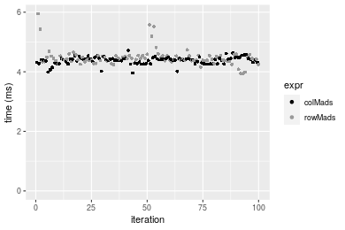

#### 1000x100 double matrix

```r
> X <- data[["1000x100"]]
> gc()
          used  (Mb) gc trigger  (Mb) max used  (Mb)
Ncells 5228592 279.3    8529671 455.6  8529671 455.6
Vcells 9805233  74.9   31876688 243.2 60562128 462.1
> colStats <- microbenchmark(colMads = colMads(X, na.rm = FALSE), colMads2 = colMads2(X, na.rm = FALSE), 
+     `apply+mad` = apply(X, MARGIN = 2L, FUN = mad, na.rm = FALSE), unit = "ms")
> X <- t(X)
> gc()
          used  (Mb) gc trigger  (Mb) max used  (Mb)
Ncells 5228586 279.3    8529671 455.6  8529671 455.6
Vcells 9905276  75.6   31876688 243.2 60562128 462.1
> rowStats <- microbenchmark(rowMads = rowMads(X, na.rm = FALSE), rowMads2 = rowMads2(X, na.rm = FALSE), 
+     `apply+mad` = apply(X, MARGIN = 1L, FUN = mad, na.rm = FALSE), unit = "ms")
```

_Table: Benchmarking of colMads(), colMads2() and apply+mad() on double+1000x100 data. The top panel shows times in milliseconds and the bottom panel shows relative times._


|   |expr      |       min|        lq|      mean|    median|        uq|       max|
|:--|:---------|---------:|---------:|---------:|---------:|---------:|---------:|
|1  |colMads   |  3.442158|  3.920787|  4.025222|  3.975932|  4.055993|  5.551028|
|2  |colMads2  |  3.849091|  4.211763|  4.293943|  4.283513|  4.360643|  4.712523|
|3  |apply+mad | 10.123288| 11.203198| 11.599529| 11.338291| 11.476510| 20.073749|


|   |expr      |      min|       lq|     mean|   median|       uq|      max|
|:--|:---------|--------:|--------:|--------:|--------:|--------:|--------:|
|1  |colMads   | 1.000000| 1.000000| 1.000000| 1.000000| 1.000000| 1.000000|
|2  |colMads2  | 1.118220| 1.074214| 1.066759| 1.077361| 1.075111| 0.848946|
|3  |apply+mad | 2.940971| 2.857385| 2.881712| 2.851732| 2.829519| 3.616222|

_Table: Benchmarking of rowMads(), rowMads2() and apply+mad() on double+1000x100 data (transposed). The top panel shows times in milliseconds and the bottom panel shows relative times._


|   |expr      |      min|        lq|      mean|    median|        uq|       max|
|:--|:---------|--------:|---------:|---------:|---------:|---------:|---------:|
|1  |rowMads   | 3.504217|  3.903222|  3.979249|  3.963858|  4.030054|  4.896801|
|2  |rowMads2  | 3.837550|  4.190633|  4.396986|  4.276613|  4.335335| 11.818425|
|3  |apply+mad | 9.987954| 11.275250| 11.559008| 11.384596| 11.506334| 20.089477|


|   |expr      |      min|       lq|     mean|   median|       uq|      max|
|:--|:---------|--------:|--------:|--------:|--------:|--------:|--------:|
|1  |rowMads   | 1.000000| 1.000000| 1.000000| 1.000000| 1.000000| 1.000000|
|2  |rowMads2  | 1.095123| 1.073634| 1.104979| 1.078902| 1.075751| 2.413499|
|3  |apply+mad | 2.850267| 2.888703| 2.904822| 2.872100| 2.855132| 4.102572|

_Figure: Benchmarking of colMads(), colMads2() and apply+mad() on double+1000x100 data  as well as rowMads(), rowMads2() and apply+mad() on the same data transposed.  Outliers are displayed as crosses.  Times are in milliseconds._


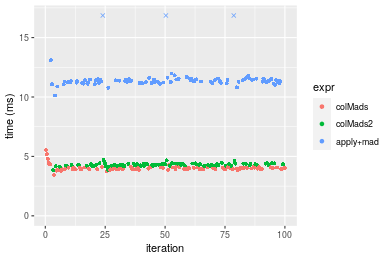

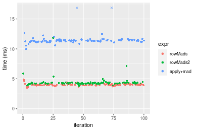
_Table: Benchmarking of colMads() and rowMads() on double+1000x100 data (original and transposed).  The top panel shows times in milliseconds and the bottom panel shows relative times._


|   |expr    |      min|       lq|     mean|   median|       uq|      max|
|:--|:-------|--------:|--------:|--------:|--------:|--------:|--------:|
|2  |rowMads | 3.504217| 3.903222| 3.979249| 3.963858| 4.030054| 4.896801|
|1  |colMads | 3.442158| 3.920787| 4.025222| 3.975932| 4.055993| 5.551028|


|   |expr    |       min|     lq|     mean|   median|       uq|      max|
|:--|:-------|---------:|------:|--------:|--------:|--------:|--------:|
|2  |rowMads | 1.0000000| 1.0000| 1.000000| 1.000000| 1.000000| 1.000000|
|1  |colMads | 0.9822902| 1.0045| 1.011553| 1.003046| 1.006436| 1.133603|

_Figure: Benchmarking of colMads() and rowMads() on double+1000x100 data (original and transposed).  Outliers are displayed as crosses. Times are in milliseconds._


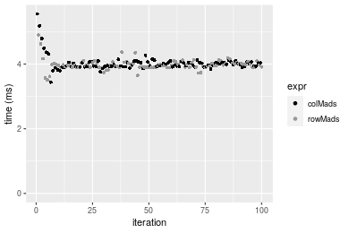


## Appendix

### Session information
```r
R version 4.1.1 Patched (2021-08-10 r80727)
Platform: x86_64-pc-linux-gnu (64-bit)
Running under: Ubuntu 18.04.5 LTS

Matrix products: default
BLAS:   /home/hb/software/R-devel/R-4-1-branch/lib/R/lib/libRblas.so
LAPACK: /home/hb/software/R-devel/R-4-1-branch/lib/R/lib/libRlapack.so

locale:
 [1] LC_CTYPE=en_US.UTF-8       LC_NUMERIC=C              
 [3] LC_TIME=en_US.UTF-8        LC_COLLATE=en_US.UTF-8    
 [5] LC_MONETARY=en_US.UTF-8    LC_MESSAGES=en_US.UTF-8   
 [7] LC_PAPER=en_US.UTF-8       LC_NAME=C                 
 [9] LC_ADDRESS=C               LC_TELEPHONE=C            
[11] LC_MEASUREMENT=en_US.UTF-8 LC_IDENTIFICATION=C       

attached base packages:
[1] stats     graphics  grDevices utils     datasets  methods   base     

other attached packages:
[1] microbenchmark_1.4-7   matrixStats_0.60.1     ggplot2_3.3.5         
[4] knitr_1.33             R.devices_2.17.0       R.utils_2.10.1        
[7] R.oo_1.24.0            R.methodsS3_1.8.1-9001 history_0.0.1-9000    

loaded via a namespace (and not attached):
 [1] Biobase_2.52.0          httr_1.4.2              splines_4.1.1          
 [4] bit64_4.0.5             network_1.17.1          assertthat_0.2.1       
 [7] highr_0.9               stats4_4.1.1            blob_1.2.2             
[10] GenomeInfoDbData_1.2.6  robustbase_0.93-8       pillar_1.6.2           
[13] RSQLite_2.2.8           lattice_0.20-44         glue_1.4.2             
[16] digest_0.6.27           XVector_0.32.0          colorspace_2.0-2       
[19] Matrix_1.3-4            XML_3.99-0.7            pkgconfig_2.0.3        
[22] zlibbioc_1.38.0         genefilter_1.74.0       purrr_0.3.4            
[25] ergm_4.1.2              xtable_1.8-4            scales_1.1.1           
[28] tibble_3.1.4            annotate_1.70.0         KEGGREST_1.32.0        
[31] farver_2.1.0            generics_0.1.0          IRanges_2.26.0         
[34] ellipsis_0.3.2          cachem_1.0.6            withr_2.4.2            
[37] BiocGenerics_0.38.0     mime_0.11               survival_3.2-13        
[40] magrittr_2.0.1          crayon_1.4.1            statnet.common_4.5.0   
[43] memoise_2.0.0           laeken_0.5.1            fansi_0.5.0            
[46] R.cache_0.15.0          MASS_7.3-54             R.rsp_0.44.0           
[49] progressr_0.8.0         tools_4.1.1             lifecycle_1.0.0        
[52] S4Vectors_0.30.0        trust_0.1-8             munsell_0.5.0          
[55] tabby_0.0.1-9001        AnnotationDbi_1.54.1    Biostrings_2.60.2      
[58] compiler_4.1.1          GenomeInfoDb_1.28.1     rlang_0.4.11           
[61] grid_4.1.1              RCurl_1.98-1.4          cwhmisc_6.6            
[64] rappdirs_0.3.3          startup_0.15.0          labeling_0.4.2         
[67] bitops_1.0-7            base64enc_0.1-3         boot_1.3-28            
[70] gtable_0.3.0            DBI_1.1.1               markdown_1.1           
[73] R6_2.5.1                lpSolveAPI_5.5.2.0-17.7 rle_0.9.2              
[76] dplyr_1.0.7             fastmap_1.1.0           bit_4.0.4              
[79] utf8_1.2.2              parallel_4.1.1          Rcpp_1.0.7             
[82] vctrs_0.3.8             png_0.1-7               DEoptimR_1.0-9         
[85] tidyselect_1.1.1        xfun_0.25               coda_0.19-4            
```
Total processing time was 1.48 mins.


### Reproducibility
To reproduce this report, do:
```r
html <- matrixStats:::benchmark('colMads')
```

[RSP]: https://cran.r-project.org/package=R.rsp
[matrixStats]: https://cran.r-project.org/package=matrixStats

[StackOverflow:colMins?]: https://stackoverflow.com/questions/13676878 "Stack Overflow: fastest way to get Min from every column in a matrix?"
[StackOverflow:colSds?]: https://stackoverflow.com/questions/17549762 "Stack Overflow: Is there such 'colsd' in R?"
[StackOverflow:rowProds?]: https://stackoverflow.com/questions/20198801/ "Stack Overflow: Row product of matrix and column sum of matrix"

---------------------------------------
Copyright Henrik Bengtsson. Last updated on 2021-08-25 18:58:11 (+0200 UTC). Powered by [RSP].

<script>
 var link = document.createElement('link');
 link.rel = 'icon';
 link.href = "data:image/png;base64,iVBORw0KGgoAAAANSUhEUgAAACAAAAAgCAMAAABEpIrGAAAA21BMVEUAAAAAAP8AAP8AAP8AAP8AAP8AAP8AAP8AAP8AAP8AAP8AAP8AAP8AAP8AAP8AAP8AAP8AAP8AAP8AAP8AAP8AAP8AAP8AAP8AAP8AAP8AAP8AAP8AAP8AAP8AAP8AAP8AAP8AAP8AAP8AAP8AAP8AAP8AAP8AAP8AAP8AAP8BAf4CAv0DA/wdHeIeHuEfH+AgIN8hId4lJdomJtknJ9g+PsE/P8BAQL9yco10dIt1dYp3d4h4eIeVlWqWlmmXl2iYmGeZmWabm2Tn5xjo6Bfp6Rb39wj4+Af//wA2M9hbAAAASXRSTlMAAQIJCgsMJSYnKD4/QGRlZmhpamtsbautrrCxuru8y8zN5ebn6Pn6+///////////////////////////////////////////LsUNcQAAAS9JREFUOI29k21XgkAQhVcFytdSMqMETU26UVqGmpaiFbL//xc1cAhhwVNf6n5i5z67M2dmYOyfJZUqlVLhkKucG7cgmUZTybDz6g0iDeq51PUr37Ds2cy2/C9NeES5puDjxuUk1xnToZsg8pfA3avHQ3lLIi7iWRrkv/OYtkScxBIMgDee0ALoyxHQBJ68JLCjOtQIMIANF7QG9G9fNnHvisCHBVMKgSJgiz7nE+AoBKrAPA3MgepvgR9TSCasrCKH0eB1wBGBFdCO+nAGjMVGPcQb5bd6mQRegN6+1axOs9nGfYcCtfi4NQosdtH7dB+txFIpXQqN1p9B/asRHToyS0jRgpV7nk4nwcq1BJ+x3Gl/v7S9Wmpp/aGquum7w3ZDyrADFYrl8vHBH+ev9AUASW1dmU4h4wAAAABJRU5ErkJggg=="
 document.getElementsByTagName('head')[0].appendChild(link);
</script>


