[matrixStats]: Benchmark report

---------------------------------------


# colMeans2() and rowMeans2() benchmarks  on subsetted computation

This report benchmark the performance of colMeans2() and rowMeans2() on subsetted computation.


## Data type "integer"

### Data
```r
> rmatrix <- function(nrow, ncol, mode = c("logical", "double", "integer", "index"), range = c(-100, 
+     +100), na_prob = 0) {
+     mode <- match.arg(mode)
+     n <- nrow * ncol
+     if (mode == "logical") {
+         x <- sample(c(FALSE, TRUE), size = n, replace = TRUE)
+     }     else if (mode == "index") {
+         x <- seq_len(n)
+         mode <- "integer"
+     }     else {
+         x <- runif(n, min = range[1], max = range[2])
+     }
+     storage.mode(x) <- mode
+     if (na_prob > 0) 
+         x[sample(n, size = na_prob * n)] <- NA
+     dim(x) <- c(nrow, ncol)
+     x
+ }
> rmatrices <- function(scale = 10, seed = 1, ...) {
+     set.seed(seed)
+     data <- list()
+     data[[1]] <- rmatrix(nrow = scale * 1, ncol = scale * 1, ...)
+     data[[2]] <- rmatrix(nrow = scale * 10, ncol = scale * 10, ...)
+     data[[3]] <- rmatrix(nrow = scale * 100, ncol = scale * 1, ...)
+     data[[4]] <- t(data[[3]])
+     data[[5]] <- rmatrix(nrow = scale * 10, ncol = scale * 100, ...)
+     data[[6]] <- t(data[[5]])
+     names(data) <- sapply(data, FUN = function(x) paste(dim(x), collapse = "x"))
+     data
+ }
> data <- rmatrices(mode = mode)
```

### Results

#### 10x10 integer matrix

```r
> X <- data[["10x10"]]
> rows <- sample.int(nrow(X), size = nrow(X) * 0.7)
> cols <- sample.int(ncol(X), size = ncol(X) * 0.7)
> X_S <- X[rows, cols]
> gc()
           used  (Mb) gc trigger  (Mb) max used  (Mb)
Ncells  5239254 279.9    8529671 455.6  8529671 455.6
Vcells 10067968  76.9   31876688 243.2 60562128 462.1
> colStats <- microbenchmark(colMeans2_X_S = colMeans2(X_S, na.rm = FALSE), `colMeans2(X, rows, cols)` = colMeans2(X, 
+     rows = rows, cols = cols, na.rm = FALSE), `colMeans2(X[rows, cols])` = colMeans2(X[rows, cols], 
+     na.rm = FALSE), unit = "ms")
> X <- t(X)
> X_S <- t(X_S)
> gc()
           used  (Mb) gc trigger  (Mb) max used  (Mb)
Ncells  5231316 279.4    8529671 455.6  8529671 455.6
Vcells 10042070  76.7   31876688 243.2 60562128 462.1
> rowStats <- microbenchmark(rowMeans2_X_S = rowMeans2(X_S, na.rm = FALSE), `rowMeans2(X, cols, rows)` = rowMeans2(X, 
+     rows = cols, cols = rows, na.rm = FALSE), `rowMeans2(X[cols, rows])` = rowMeans2(X[cols, rows], 
+     na.rm = FALSE), unit = "ms")
```

_Table: Benchmarking of colMeans2_X_S(), colMeans2(X, rows, cols)() and colMeans2(X[rows, cols])() on integer+10x10 data. The top panel shows times in milliseconds and the bottom panel shows relative times._


|   |expr                     |      min|        lq|      mean|    median|        uq|      max|
|:--|:------------------------|--------:|---------:|---------:|---------:|---------:|--------:|
|1  |colMeans2_X_S            | 0.001847| 0.0019260| 0.0029480| 0.0019790| 0.0020720| 0.090764|
|2  |colMeans2(X, rows, cols) | 0.002228| 0.0023255| 0.0024960| 0.0023960| 0.0024840| 0.004669|
|3  |colMeans2(X[rows, cols]) | 0.002640| 0.0028950| 0.0032197| 0.0030255| 0.0031415| 0.007819|


|   |expr                     |      min|       lq|      mean|   median|       uq|       max|
|:--|:------------------------|--------:|--------:|---------:|--------:|--------:|---------:|
|1  |colMeans2_X_S            | 1.000000| 1.000000| 1.0000000| 1.000000| 1.000000| 1.0000000|
|2  |colMeans2(X, rows, cols) | 1.206281| 1.207425| 0.8466872| 1.210713| 1.198842| 0.0514411|
|3  |colMeans2(X[rows, cols]) | 1.429345| 1.503115| 1.0921722| 1.528802| 1.516168| 0.0861465|

_Table: Benchmarking of rowMeans2_X_S(), rowMeans2(X, cols, rows)() and rowMeans2(X[cols, rows])() on integer+10x10 data (transposed). The top panel shows times in milliseconds and the bottom panel shows relative times._


|   |expr                     |      min|        lq|      mean|    median|        uq|      max|
|:--|:------------------------|--------:|---------:|---------:|---------:|---------:|--------:|
|1  |rowMeans2_X_S            | 0.001876| 0.0019715| 0.0020668| 0.0020075| 0.0020920| 0.004386|
|2  |rowMeans2(X, cols, rows) | 0.002286| 0.0023715| 0.0033519| 0.0024455| 0.0025430| 0.090527|
|3  |rowMeans2(X[cols, rows]) | 0.002684| 0.0029440| 0.0031055| 0.0030285| 0.0031615| 0.005362|


|   |expr                     |      min|       lq|     mean|   median|       uq|       max|
|:--|:------------------------|--------:|--------:|--------:|--------:|--------:|---------:|
|1  |rowMeans2_X_S            | 1.000000| 1.000000| 1.000000| 1.000000| 1.000000|  1.000000|
|2  |rowMeans2(X, cols, rows) | 1.218550| 1.202891| 1.621821| 1.218182| 1.215583| 20.639991|
|3  |rowMeans2(X[cols, rows]) | 1.430704| 1.493279| 1.502610| 1.508593| 1.511233|  1.222526|

_Figure: Benchmarking of colMeans2_X_S(), colMeans2(X, rows, cols)() and colMeans2(X[rows, cols])() on integer+10x10 data  as well as rowMeans2_X_S(), rowMeans2(X, cols, rows)() and rowMeans2(X[cols, rows])() on the same data transposed.  Outliers are displayed as crosses.  Times are in milliseconds._


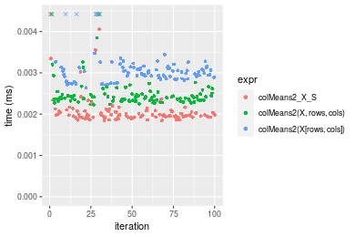

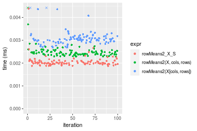
_Table: Benchmarking of colMeans2_X_S() and rowMeans2_X_S() on integer+10x10 data (original and transposed).  The top panel shows times in milliseconds and the bottom panel shows relative times._


|   |expr          |   min|     lq|    mean| median|    uq|    max|
|:--|:-------------|-----:|------:|-------:|------:|-----:|------:|
|1  |colMeans2_X_S | 1.847| 1.9260| 2.94796| 1.9790| 2.072| 90.764|
|2  |rowMeans2_X_S | 1.876| 1.9715| 2.06677| 2.0075| 2.092|  4.386|


|   |expr          |      min|       lq|      mean|   median|       uq|       max|
|:--|:-------------|--------:|--------:|---------:|--------:|--------:|---------:|
|1  |colMeans2_X_S | 1.000000| 1.000000| 1.0000000| 1.000000| 1.000000| 1.0000000|
|2  |rowMeans2_X_S | 1.015701| 1.023624| 0.7010848| 1.014401| 1.009653| 0.0483231|

_Figure: Benchmarking of colMeans2_X_S() and rowMeans2_X_S() on integer+10x10 data (original and transposed).  Outliers are displayed as crosses. Times are in milliseconds._


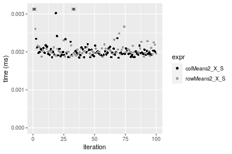

#### 100x100 integer matrix

```r
> X <- data[["100x100"]]
> rows <- sample.int(nrow(X), size = nrow(X) * 0.7)
> cols <- sample.int(ncol(X), size = ncol(X) * 0.7)
> X_S <- X[rows, cols]
> gc()
          used  (Mb) gc trigger  (Mb) max used  (Mb)
Ncells 5229718 279.3    8529671 455.6  8529671 455.6
Vcells 9709517  74.1   31876688 243.2 60562128 462.1
> colStats <- microbenchmark(colMeans2_X_S = colMeans2(X_S, na.rm = FALSE), `colMeans2(X, rows, cols)` = colMeans2(X, 
+     rows = rows, cols = cols, na.rm = FALSE), `colMeans2(X[rows, cols])` = colMeans2(X[rows, cols], 
+     na.rm = FALSE), unit = "ms")
> X <- t(X)
> X_S <- t(X_S)
> gc()
          used  (Mb) gc trigger  (Mb) max used  (Mb)
Ncells 5229694 279.3    8529671 455.6  8529671 455.6
Vcells 9714570  74.2   31876688 243.2 60562128 462.1
> rowStats <- microbenchmark(rowMeans2_X_S = rowMeans2(X_S, na.rm = FALSE), `rowMeans2(X, cols, rows)` = rowMeans2(X, 
+     rows = cols, cols = rows, na.rm = FALSE), `rowMeans2(X[cols, rows])` = rowMeans2(X[cols, rows], 
+     na.rm = FALSE), unit = "ms")
```

_Table: Benchmarking of colMeans2_X_S(), colMeans2(X, rows, cols)() and colMeans2(X[rows, cols])() on integer+100x100 data. The top panel shows times in milliseconds and the bottom panel shows relative times._


|   |expr                     |      min|        lq|      mean|    median|        uq|      max|
|:--|:------------------------|--------:|---------:|---------:|---------:|---------:|--------:|
|1  |colMeans2_X_S            | 0.011503| 0.0117600| 0.0119683| 0.0118845| 0.0120145| 0.014024|
|2  |colMeans2(X, rows, cols) | 0.013068| 0.0136855| 0.0138894| 0.0138315| 0.0140065| 0.017305|
|3  |colMeans2(X[rows, cols]) | 0.022900| 0.0232510| 0.0245251| 0.0234165| 0.0239040| 0.058453|


|   |expr                     |      min|       lq|     mean|   median|       uq|      max|
|:--|:------------------------|--------:|--------:|--------:|--------:|--------:|--------:|
|1  |colMeans2_X_S            | 1.000000| 1.000000| 1.000000| 1.000000| 1.000000| 1.000000|
|2  |colMeans2(X, rows, cols) | 1.136051| 1.163733| 1.160514| 1.163827| 1.165800| 1.233956|
|3  |colMeans2(X[rows, cols]) | 1.990785| 1.977126| 2.049174| 1.970339| 1.989596| 4.168069|

_Table: Benchmarking of rowMeans2_X_S(), rowMeans2(X, cols, rows)() and rowMeans2(X[cols, rows])() on integer+100x100 data (transposed). The top panel shows times in milliseconds and the bottom panel shows relative times._


|   |expr                     |      min|        lq|      mean|    median|        uq|      max|
|:--|:------------------------|--------:|---------:|---------:|---------:|---------:|--------:|
|2  |rowMeans2(X, cols, rows) | 0.012217| 0.0128180| 0.0137361| 0.0130705| 0.0132990| 0.065091|
|1  |rowMeans2_X_S            | 0.012601| 0.0131290| 0.0135982| 0.0133280| 0.0135975| 0.025668|
|3  |rowMeans2(X[cols, rows]) | 0.023290| 0.0243555| 0.0250001| 0.0246105| 0.0250065| 0.042236|


|   |expr                     |      min|       lq|      mean|   median|       uq|       max|
|:--|:------------------------|--------:|--------:|---------:|--------:|--------:|---------:|
|2  |rowMeans2(X, cols, rows) | 1.000000| 1.000000| 1.0000000| 1.000000| 1.000000| 1.0000000|
|1  |rowMeans2_X_S            | 1.031432| 1.024263| 0.9899586| 1.019701| 1.022445| 0.3943402|
|3  |rowMeans2(X[cols, rows]) | 1.906360| 1.900101| 1.8200274| 1.882904| 1.880329| 0.6488762|

_Figure: Benchmarking of colMeans2_X_S(), colMeans2(X, rows, cols)() and colMeans2(X[rows, cols])() on integer+100x100 data  as well as rowMeans2_X_S(), rowMeans2(X, cols, rows)() and rowMeans2(X[cols, rows])() on the same data transposed.  Outliers are displayed as crosses.  Times are in milliseconds._


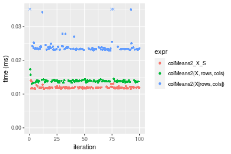

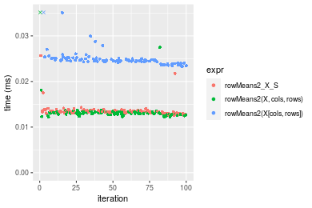
_Table: Benchmarking of colMeans2_X_S() and rowMeans2_X_S() on integer+100x100 data (original and transposed).  The top panel shows times in milliseconds and the bottom panel shows relative times._


|   |expr          |    min|     lq|     mean|  median|      uq|    max|
|:--|:-------------|------:|------:|--------:|-------:|-------:|------:|
|1  |colMeans2_X_S | 11.503| 11.760| 11.96829| 11.8845| 12.0145| 14.024|
|2  |rowMeans2_X_S | 12.601| 13.129| 13.59816| 13.3280| 13.5975| 25.668|


|   |expr          |      min|       lq|     mean|   median|       uq|      max|
|:--|:-------------|--------:|--------:|--------:|--------:|--------:|--------:|
|1  |colMeans2_X_S | 1.000000| 1.000000| 1.000000| 1.000000| 1.000000| 1.000000|
|2  |rowMeans2_X_S | 1.095453| 1.116412| 1.136182| 1.121461| 1.131757| 1.830291|

_Figure: Benchmarking of colMeans2_X_S() and rowMeans2_X_S() on integer+100x100 data (original and transposed).  Outliers are displayed as crosses. Times are in milliseconds._


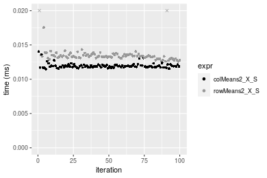

#### 1000x10 integer matrix

```r
> X <- data[["1000x10"]]
> rows <- sample.int(nrow(X), size = nrow(X) * 0.7)
> cols <- sample.int(ncol(X), size = ncol(X) * 0.7)
> X_S <- X[rows, cols]
> gc()
          used  (Mb) gc trigger  (Mb) max used  (Mb)
Ncells 5230460 279.4    8529671 455.6  8529671 455.6
Vcells 9713555  74.2   31876688 243.2 60562128 462.1
> colStats <- microbenchmark(colMeans2_X_S = colMeans2(X_S, na.rm = FALSE), `colMeans2(X, rows, cols)` = colMeans2(X, 
+     rows = rows, cols = cols, na.rm = FALSE), `colMeans2(X[rows, cols])` = colMeans2(X[rows, cols], 
+     na.rm = FALSE), unit = "ms")
> X <- t(X)
> X_S <- t(X_S)
> gc()
          used  (Mb) gc trigger  (Mb) max used  (Mb)
Ncells 5230436 279.4    8529671 455.6  8529671 455.6
Vcells 9718608  74.2   31876688 243.2 60562128 462.1
> rowStats <- microbenchmark(rowMeans2_X_S = rowMeans2(X_S, na.rm = FALSE), `rowMeans2(X, cols, rows)` = rowMeans2(X, 
+     rows = cols, cols = rows, na.rm = FALSE), `rowMeans2(X[cols, rows])` = rowMeans2(X[cols, rows], 
+     na.rm = FALSE), unit = "ms")
```

_Table: Benchmarking of colMeans2_X_S(), colMeans2(X, rows, cols)() and colMeans2(X[rows, cols])() on integer+1000x10 data. The top panel shows times in milliseconds and the bottom panel shows relative times._


|   |expr                     |      min|        lq|      mean|    median|       uq|      max|
|:--|:------------------------|--------:|---------:|---------:|---------:|--------:|--------:|
|1  |colMeans2_X_S            | 0.010211| 0.0103110| 0.0105182| 0.0104000| 0.010501| 0.018538|
|2  |colMeans2(X, rows, cols) | 0.014302| 0.0147365| 0.0152329| 0.0151135| 0.015476| 0.020525|
|3  |colMeans2(X[rows, cols]) | 0.022029| 0.0223415| 0.0231530| 0.0224825| 0.022771| 0.073242|


|   |expr                     |      min|       lq|     mean|   median|       uq|      max|
|:--|:------------------------|--------:|--------:|--------:|--------:|--------:|--------:|
|1  |colMeans2_X_S            | 1.000000| 1.000000| 1.000000| 1.000000| 1.000000| 1.000000|
|2  |colMeans2(X, rows, cols) | 1.400646| 1.429202| 1.448240| 1.453221| 1.473764| 1.107185|
|3  |colMeans2(X[rows, cols]) | 2.157379| 2.166764| 2.201224| 2.161779| 2.168460| 3.950912|

_Table: Benchmarking of rowMeans2_X_S(), rowMeans2(X, cols, rows)() and rowMeans2(X[cols, rows])() on integer+1000x10 data (transposed). The top panel shows times in milliseconds and the bottom panel shows relative times._


|   |expr                     |      min|       lq|      mean|    median|        uq|      max|
|:--|:------------------------|--------:|--------:|---------:|---------:|---------:|--------:|
|1  |rowMeans2_X_S            | 0.011739| 0.011967| 0.0124367| 0.0122410| 0.0124825| 0.026305|
|2  |rowMeans2(X, cols, rows) | 0.014218| 0.014746| 0.0151680| 0.0149640| 0.0154550| 0.020347|
|3  |rowMeans2(X[cols, rows]) | 0.024703| 0.025286| 0.0263237| 0.0259705| 0.0263695| 0.064014|


|   |expr                     |      min|       lq|     mean|   median|       uq|       max|
|:--|:------------------------|--------:|--------:|--------:|--------:|--------:|---------:|
|1  |rowMeans2_X_S            | 1.000000| 1.000000| 1.000000| 1.000000| 1.000000| 1.0000000|
|2  |rowMeans2(X, cols, rows) | 1.211176| 1.232222| 1.219617| 1.222449| 1.238133| 0.7735031|
|3  |rowMeans2(X[cols, rows]) | 2.104353| 2.112977| 2.116609| 2.121599| 2.112518| 2.4335297|

_Figure: Benchmarking of colMeans2_X_S(), colMeans2(X, rows, cols)() and colMeans2(X[rows, cols])() on integer+1000x10 data  as well as rowMeans2_X_S(), rowMeans2(X, cols, rows)() and rowMeans2(X[cols, rows])() on the same data transposed.  Outliers are displayed as crosses.  Times are in milliseconds._


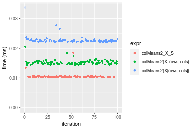

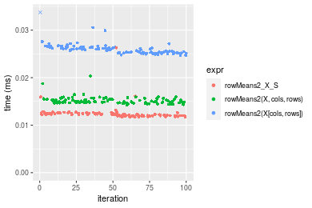
_Table: Benchmarking of colMeans2_X_S() and rowMeans2_X_S() on integer+1000x10 data (original and transposed).  The top panel shows times in milliseconds and the bottom panel shows relative times._


|   |expr          |    min|     lq|     mean| median|      uq|    max|
|:--|:-------------|------:|------:|--------:|------:|-------:|------:|
|1  |colMeans2_X_S | 10.211| 10.311| 10.51822| 10.400| 10.5010| 18.538|
|2  |rowMeans2_X_S | 11.739| 11.967| 12.43672| 12.241| 12.4825| 26.305|


|   |expr          |      min|       lq|     mean|   median|       uq|      max|
|:--|:-------------|--------:|--------:|--------:|--------:|--------:|--------:|
|1  |colMeans2_X_S | 1.000000| 1.000000| 1.000000| 1.000000| 1.000000| 1.000000|
|2  |rowMeans2_X_S | 1.149642| 1.160605| 1.182398| 1.177019| 1.188696| 1.418977|

_Figure: Benchmarking of colMeans2_X_S() and rowMeans2_X_S() on integer+1000x10 data (original and transposed).  Outliers are displayed as crosses. Times are in milliseconds._


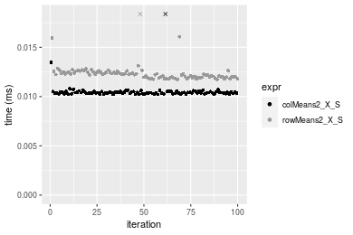

#### 10x1000 integer matrix

```r
> X <- data[["10x1000"]]
> rows <- sample.int(nrow(X), size = nrow(X) * 0.7)
> cols <- sample.int(ncol(X), size = ncol(X) * 0.7)
> X_S <- X[rows, cols]
> gc()
          used  (Mb) gc trigger  (Mb) max used  (Mb)
Ncells 5230664 279.4    8529671 455.6  8529671 455.6
Vcells 9714428  74.2   31876688 243.2 60562128 462.1
> colStats <- microbenchmark(colMeans2_X_S = colMeans2(X_S, na.rm = FALSE), `colMeans2(X, rows, cols)` = colMeans2(X, 
+     rows = rows, cols = cols, na.rm = FALSE), `colMeans2(X[rows, cols])` = colMeans2(X[rows, cols], 
+     na.rm = FALSE), unit = "ms")
> X <- t(X)
> X_S <- t(X_S)
> gc()
          used  (Mb) gc trigger  (Mb) max used  (Mb)
Ncells 5230640 279.4    8529671 455.6  8529671 455.6
Vcells 9719481  74.2   31876688 243.2 60562128 462.1
> rowStats <- microbenchmark(rowMeans2_X_S = rowMeans2(X_S, na.rm = FALSE), `rowMeans2(X, cols, rows)` = rowMeans2(X, 
+     rows = cols, cols = rows, na.rm = FALSE), `rowMeans2(X[cols, rows])` = rowMeans2(X[cols, rows], 
+     na.rm = FALSE), unit = "ms")
```

_Table: Benchmarking of colMeans2_X_S(), colMeans2(X, rows, cols)() and colMeans2(X[rows, cols])() on integer+10x1000 data. The top panel shows times in milliseconds and the bottom panel shows relative times._


|   |expr                     |      min|        lq|      mean|    median|        uq|      max|
|:--|:------------------------|--------:|---------:|---------:|---------:|---------:|--------:|
|1  |colMeans2_X_S            | 0.015216| 0.0154655| 0.0162802| 0.0158905| 0.0161560| 0.034637|
|2  |colMeans2(X, rows, cols) | 0.016921| 0.0173415| 0.0181420| 0.0176450| 0.0182960| 0.033459|
|3  |colMeans2(X[rows, cols]) | 0.028564| 0.0289960| 0.0300537| 0.0299655| 0.0305085| 0.042075|


|   |expr                     |      min|       lq|     mean|   median|       uq|       max|
|:--|:------------------------|--------:|--------:|--------:|--------:|--------:|---------:|
|1  |colMeans2_X_S            | 1.000000| 1.000000| 1.000000| 1.000000| 1.000000| 1.0000000|
|2  |colMeans2(X, rows, cols) | 1.112053| 1.121302| 1.114357| 1.110412| 1.132459| 0.9659901|
|3  |colMeans2(X[rows, cols]) | 1.877234| 1.874883| 1.846021| 1.885749| 1.888370| 1.2147415|

_Table: Benchmarking of rowMeans2_X_S(), rowMeans2(X, cols, rows)() and rowMeans2(X[cols, rows])() on integer+10x1000 data (transposed). The top panel shows times in milliseconds and the bottom panel shows relative times._


|   |expr                     |      min|        lq|      mean|    median|        uq|      max|
|:--|:------------------------|--------:|---------:|---------:|---------:|---------:|--------:|
|1  |rowMeans2_X_S            | 0.012894| 0.0132290| 0.0135355| 0.0134410| 0.0136680| 0.018662|
|2  |rowMeans2(X, cols, rows) | 0.015274| 0.0157130| 0.0164131| 0.0159680| 0.0162695| 0.039937|
|3  |rowMeans2(X[cols, rows]) | 0.023609| 0.0239345| 0.0248161| 0.0242625| 0.0249900| 0.039256|


|   |expr                     |      min|       lq|     mean|   median|       uq|      max|
|:--|:------------------------|--------:|--------:|--------:|--------:|--------:|--------:|
|1  |rowMeans2_X_S            | 1.000000| 1.000000| 1.000000| 1.000000| 1.000000| 1.000000|
|2  |rowMeans2(X, cols, rows) | 1.184582| 1.187769| 1.212594| 1.188007| 1.190335| 2.140017|
|3  |rowMeans2(X[cols, rows]) | 1.831007| 1.809245| 1.833409| 1.805111| 1.828358| 2.103526|

_Figure: Benchmarking of colMeans2_X_S(), colMeans2(X, rows, cols)() and colMeans2(X[rows, cols])() on integer+10x1000 data  as well as rowMeans2_X_S(), rowMeans2(X, cols, rows)() and rowMeans2(X[cols, rows])() on the same data transposed.  Outliers are displayed as crosses.  Times are in milliseconds._


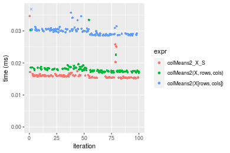

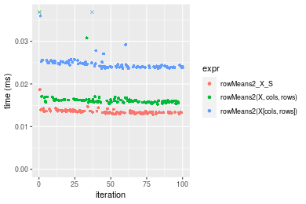
_Table: Benchmarking of colMeans2_X_S() and rowMeans2_X_S() on integer+10x1000 data (original and transposed).  The top panel shows times in milliseconds and the bottom panel shows relative times._


|   |expr          |    min|      lq|     mean|  median|     uq|    max|
|:--|:-------------|------:|-------:|--------:|-------:|------:|------:|
|2  |rowMeans2_X_S | 12.894| 13.2290| 13.53550| 13.4410| 13.668| 18.662|
|1  |colMeans2_X_S | 15.216| 15.4655| 16.28025| 15.8905| 16.156| 34.637|


|   |expr          |      min|      lq|     mean|   median|       uq|      max|
|:--|:-------------|--------:|-------:|--------:|--------:|--------:|--------:|
|2  |rowMeans2_X_S | 1.000000| 1.00000| 1.000000| 1.000000| 1.000000| 1.000000|
|1  |colMeans2_X_S | 1.180084| 1.16906| 1.202782| 1.182241| 1.182031| 1.856018|

_Figure: Benchmarking of colMeans2_X_S() and rowMeans2_X_S() on integer+10x1000 data (original and transposed).  Outliers are displayed as crosses. Times are in milliseconds._


#### 100x1000 integer matrix

```r
> X <- data[["100x1000"]]
> rows <- sample.int(nrow(X), size = nrow(X) * 0.7)
> cols <- sample.int(ncol(X), size = ncol(X) * 0.7)
> X_S <- X[rows, cols]
> gc()
          used  (Mb) gc trigger  (Mb) max used  (Mb)
Ncells 5230877 279.4    8529671 455.6  8529671 455.6
Vcells 9737105  74.3   31876688 243.2 60562128 462.1
> colStats <- microbenchmark(colMeans2_X_S = colMeans2(X_S, na.rm = FALSE), `colMeans2(X, rows, cols)` = colMeans2(X, 
+     rows = rows, cols = cols, na.rm = FALSE), `colMeans2(X[rows, cols])` = colMeans2(X[rows, cols], 
+     na.rm = FALSE), unit = "ms")
> X <- t(X)
> X_S <- t(X_S)
> gc()
          used  (Mb) gc trigger  (Mb) max used  (Mb)
Ncells 5230853 279.4    8529671 455.6  8529671 455.6
Vcells 9787158  74.7   31876688 243.2 60562128 462.1
> rowStats <- microbenchmark(rowMeans2_X_S = rowMeans2(X_S, na.rm = FALSE), `rowMeans2(X, cols, rows)` = rowMeans2(X, 
+     rows = cols, cols = rows, na.rm = FALSE), `rowMeans2(X[cols, rows])` = rowMeans2(X[cols, rows], 
+     na.rm = FALSE), unit = "ms")
```

_Table: Benchmarking of colMeans2_X_S(), colMeans2(X, rows, cols)() and colMeans2(X[rows, cols])() on integer+100x1000 data. The top panel shows times in milliseconds and the bottom panel shows relative times._


|   |expr                     |      min|       lq|      mean|    median|        uq|      max|
|:--|:------------------------|--------:|--------:|---------:|---------:|---------:|--------:|
|1  |colMeans2_X_S            | 0.072860| 0.076004| 0.0825173| 0.0791475| 0.0871470| 0.120449|
|2  |colMeans2(X, rows, cols) | 0.082647| 0.085856| 0.0943815| 0.0900305| 0.1017870| 0.172689|
|3  |colMeans2(X[rows, cols]) | 0.153570| 0.161455| 0.1768899| 0.1698555| 0.1904865| 0.219053|


|   |expr                     |      min|       lq|     mean|   median|       uq|      max|
|:--|:------------------------|--------:|--------:|--------:|--------:|--------:|--------:|
|1  |colMeans2_X_S            | 1.000000| 1.000000| 1.000000| 1.000000| 1.000000| 1.000000|
|2  |colMeans2(X, rows, cols) | 1.134326| 1.129625| 1.143778| 1.137503| 1.167992| 1.433711|
|3  |colMeans2(X[rows, cols]) | 2.107741| 2.124296| 2.143670| 2.146063| 2.185807| 1.818637|

_Table: Benchmarking of rowMeans2_X_S(), rowMeans2(X, cols, rows)() and rowMeans2(X[cols, rows])() on integer+100x1000 data (transposed). The top panel shows times in milliseconds and the bottom panel shows relative times._


|   |expr                     |      min|       lq|      mean|    median|        uq|      max|
|:--|:------------------------|--------:|--------:|---------:|---------:|---------:|--------:|
|1  |rowMeans2_X_S            | 0.081177| 0.089784| 0.0992917| 0.0962035| 0.1078760| 0.162566|
|2  |rowMeans2(X, cols, rows) | 0.100575| 0.107135| 0.1175959| 0.1116880| 0.1270455| 0.197445|
|3  |rowMeans2(X[cols, rows]) | 0.152274| 0.168322| 0.1830259| 0.1753465| 0.1962145| 0.230493|


|   |expr                     |      min|       lq|     mean|   median|       uq|      max|
|:--|:------------------------|--------:|--------:|--------:|--------:|--------:|--------:|
|1  |rowMeans2_X_S            | 1.000000| 1.000000| 1.000000| 1.000000| 1.000000| 1.000000|
|2  |rowMeans2(X, cols, rows) | 1.238959| 1.193253| 1.184348| 1.160956| 1.177699| 1.214553|
|3  |rowMeans2(X[cols, rows]) | 1.875827| 1.874744| 1.843315| 1.822662| 1.818889| 1.417843|

_Figure: Benchmarking of colMeans2_X_S(), colMeans2(X, rows, cols)() and colMeans2(X[rows, cols])() on integer+100x1000 data  as well as rowMeans2_X_S(), rowMeans2(X, cols, rows)() and rowMeans2(X[cols, rows])() on the same data transposed.  Outliers are displayed as crosses.  Times are in milliseconds._


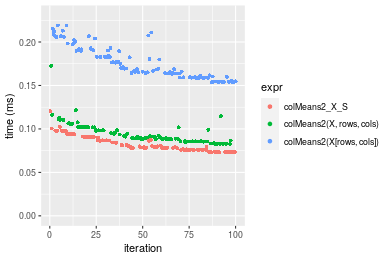

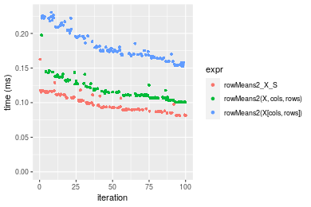
_Table: Benchmarking of colMeans2_X_S() and rowMeans2_X_S() on integer+100x1000 data (original and transposed).  The top panel shows times in milliseconds and the bottom panel shows relative times._


|   |expr          |    min|     lq|     mean|  median|      uq|     max|
|:--|:-------------|------:|------:|--------:|-------:|-------:|-------:|
|1  |colMeans2_X_S | 72.860| 76.004| 82.51728| 79.1475|  87.147| 120.449|
|2  |rowMeans2_X_S | 81.177| 89.784| 99.29170| 96.2035| 107.876| 162.566|


|   |expr          |     min|       lq|     mean|   median|       uq|      max|
|:--|:-------------|-------:|--------:|--------:|--------:|--------:|--------:|
|1  |colMeans2_X_S | 1.00000| 1.000000| 1.000000| 1.000000| 1.000000| 1.000000|
|2  |rowMeans2_X_S | 1.11415| 1.181306| 1.203284| 1.215496| 1.237863| 1.349667|

_Figure: Benchmarking of colMeans2_X_S() and rowMeans2_X_S() on integer+100x1000 data (original and transposed).  Outliers are displayed as crosses. Times are in milliseconds._


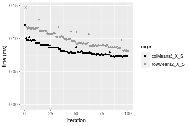

#### 1000x100 integer matrix

```r
> X <- data[["1000x100"]]
> rows <- sample.int(nrow(X), size = nrow(X) * 0.7)
> cols <- sample.int(ncol(X), size = ncol(X) * 0.7)
> X_S <- X[rows, cols]
> gc()
          used  (Mb) gc trigger  (Mb) max used  (Mb)
Ncells 5231087 279.4    8529671 455.6  8529671 455.6
Vcells 9737889  74.3   31876688 243.2 60562128 462.1
> colStats <- microbenchmark(colMeans2_X_S = colMeans2(X_S, na.rm = FALSE), `colMeans2(X, rows, cols)` = colMeans2(X, 
+     rows = rows, cols = cols, na.rm = FALSE), `colMeans2(X[rows, cols])` = colMeans2(X[rows, cols], 
+     na.rm = FALSE), unit = "ms")
> X <- t(X)
> X_S <- t(X_S)
> gc()
          used  (Mb) gc trigger  (Mb) max used  (Mb)
Ncells 5231063 279.4    8529671 455.6  8529671 455.6
Vcells 9787942  74.7   31876688 243.2 60562128 462.1
> rowStats <- microbenchmark(rowMeans2_X_S = rowMeans2(X_S, na.rm = FALSE), `rowMeans2(X, cols, rows)` = rowMeans2(X, 
+     rows = cols, cols = rows, na.rm = FALSE), `rowMeans2(X[cols, rows])` = rowMeans2(X[cols, rows], 
+     na.rm = FALSE), unit = "ms")
```

_Table: Benchmarking of colMeans2_X_S(), colMeans2(X, rows, cols)() and colMeans2(X[rows, cols])() on integer+1000x100 data. The top panel shows times in milliseconds and the bottom panel shows relative times._


|   |expr                     |      min|       lq|      mean|    median|        uq|      max|
|:--|:------------------------|--------:|--------:|---------:|---------:|---------:|--------:|
|1  |colMeans2_X_S            | 0.064757| 0.067414| 0.0741388| 0.0698780| 0.0782725| 0.113074|
|2  |colMeans2(X, rows, cols) | 0.073908| 0.077577| 0.0856458| 0.0837435| 0.0919200| 0.103769|
|3  |colMeans2(X[rows, cols]) | 0.142508| 0.151349| 0.1670202| 0.1629915| 0.1827705| 0.242255|


|   |expr                     |      min|       lq|     mean|   median|       uq|       max|
|:--|:------------------------|--------:|--------:|--------:|--------:|--------:|---------:|
|1  |colMeans2_X_S            | 1.000000| 1.000000| 1.000000| 1.000000| 1.000000| 1.0000000|
|2  |colMeans2(X, rows, cols) | 1.141313| 1.150755| 1.155210| 1.198424| 1.174359| 0.9177088|
|3  |colMeans2(X[rows, cols]) | 2.200658| 2.245068| 2.252804| 2.332515| 2.335054| 2.1424465|

_Table: Benchmarking of rowMeans2_X_S(), rowMeans2(X, cols, rows)() and rowMeans2(X[cols, rows])() on integer+1000x100 data (transposed). The top panel shows times in milliseconds and the bottom panel shows relative times._


|   |expr                     |      min|        lq|      mean|    median|        uq|      max|
|:--|:------------------------|--------:|---------:|---------:|---------:|---------:|--------:|
|1  |rowMeans2_X_S            | 0.073403| 0.0818965| 0.0904302| 0.0881815| 0.0957480| 0.122820|
|2  |rowMeans2(X, cols, rows) | 0.095182| 0.1109920| 0.1188638| 0.1152325| 0.1239635| 0.215424|
|3  |rowMeans2(X[cols, rows]) | 0.144924| 0.1677190| 0.1825400| 0.1752200| 0.1982145| 0.253458|


|   |expr                     |      min|       lq|     mean|   median|       uq|      max|
|:--|:------------------------|--------:|--------:|--------:|--------:|--------:|--------:|
|1  |rowMeans2_X_S            | 1.000000| 1.000000| 1.000000| 1.000000| 1.000000| 1.000000|
|2  |rowMeans2(X, cols, rows) | 1.296704| 1.355272| 1.314426| 1.306765| 1.294685| 1.753981|
|3  |rowMeans2(X[cols, rows]) | 1.974361| 2.047939| 2.018574| 1.987038| 2.070169| 2.063654|

_Figure: Benchmarking of colMeans2_X_S(), colMeans2(X, rows, cols)() and colMeans2(X[rows, cols])() on integer+1000x100 data  as well as rowMeans2_X_S(), rowMeans2(X, cols, rows)() and rowMeans2(X[cols, rows])() on the same data transposed.  Outliers are displayed as crosses.  Times are in milliseconds._


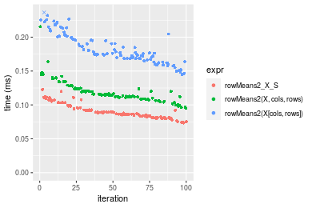
_Table: Benchmarking of colMeans2_X_S() and rowMeans2_X_S() on integer+1000x100 data (original and transposed).  The top panel shows times in milliseconds and the bottom panel shows relative times._


|   |expr          |    min|      lq|     mean|  median|      uq|     max|
|:--|:-------------|------:|-------:|--------:|-------:|-------:|-------:|
|1  |colMeans2_X_S | 64.757| 67.4140| 74.13878| 69.8780| 78.2725| 113.074|
|2  |rowMeans2_X_S | 73.403| 81.8965| 90.43019| 88.1815| 95.7480| 122.820|


|   |expr          |      min|       lq|     mean|   median|       uq|      max|
|:--|:-------------|--------:|--------:|--------:|--------:|--------:|--------:|
|1  |colMeans2_X_S | 1.000000| 1.000000| 1.000000| 1.000000| 1.000000| 1.000000|
|2  |rowMeans2_X_S | 1.133514| 1.214829| 1.219742| 1.261935| 1.223265| 1.086191|

_Figure: Benchmarking of colMeans2_X_S() and rowMeans2_X_S() on integer+1000x100 data (original and transposed).  Outliers are displayed as crosses. Times are in milliseconds._


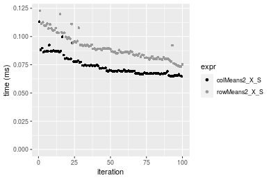


## Data type "double"

### Data
```r
> rmatrix <- function(nrow, ncol, mode = c("logical", "double", "integer", "index"), range = c(-100, 
+     +100), na_prob = 0) {
+     mode <- match.arg(mode)
+     n <- nrow * ncol
+     if (mode == "logical") {
+         x <- sample(c(FALSE, TRUE), size = n, replace = TRUE)
+     }     else if (mode == "index") {
+         x <- seq_len(n)
+         mode <- "integer"
+     }     else {
+         x <- runif(n, min = range[1], max = range[2])
+     }
+     storage.mode(x) <- mode
+     if (na_prob > 0) 
+         x[sample(n, size = na_prob * n)] <- NA
+     dim(x) <- c(nrow, ncol)
+     x
+ }
> rmatrices <- function(scale = 10, seed = 1, ...) {
+     set.seed(seed)
+     data <- list()
+     data[[1]] <- rmatrix(nrow = scale * 1, ncol = scale * 1, ...)
+     data[[2]] <- rmatrix(nrow = scale * 10, ncol = scale * 10, ...)
+     data[[3]] <- rmatrix(nrow = scale * 100, ncol = scale * 1, ...)
+     data[[4]] <- t(data[[3]])
+     data[[5]] <- rmatrix(nrow = scale * 10, ncol = scale * 100, ...)
+     data[[6]] <- t(data[[5]])
+     names(data) <- sapply(data, FUN = function(x) paste(dim(x), collapse = "x"))
+     data
+ }
> data <- rmatrices(mode = mode)
```

### Results

#### 10x10 double matrix

```r
> X <- data[["10x10"]]
> rows <- sample.int(nrow(X), size = nrow(X) * 0.7)
> cols <- sample.int(ncol(X), size = ncol(X) * 0.7)
> X_S <- X[rows, cols]
> gc()
          used  (Mb) gc trigger  (Mb) max used  (Mb)
Ncells 5231305 279.4    8529671 455.6  8529671 455.6
Vcells 9828998  75.0   31876688 243.2 60562128 462.1
> colStats <- microbenchmark(colMeans2_X_S = colMeans2(X_S, na.rm = FALSE), `colMeans2(X, rows, cols)` = colMeans2(X, 
+     rows = rows, cols = cols, na.rm = FALSE), `colMeans2(X[rows, cols])` = colMeans2(X[rows, cols], 
+     na.rm = FALSE), unit = "ms")
> X <- t(X)
> X_S <- t(X_S)
> gc()
          used  (Mb) gc trigger  (Mb) max used  (Mb)
Ncells 5231272 279.4    8529671 455.6  8529671 455.6
Vcells 9829136  75.0   31876688 243.2 60562128 462.1
> rowStats <- microbenchmark(rowMeans2_X_S = rowMeans2(X_S, na.rm = FALSE), `rowMeans2(X, cols, rows)` = rowMeans2(X, 
+     rows = cols, cols = rows, na.rm = FALSE), `rowMeans2(X[cols, rows])` = rowMeans2(X[cols, rows], 
+     na.rm = FALSE), unit = "ms")
```

_Table: Benchmarking of colMeans2_X_S(), colMeans2(X, rows, cols)() and colMeans2(X[rows, cols])() on double+10x10 data. The top panel shows times in milliseconds and the bottom panel shows relative times._


|   |expr                     |      min|        lq|      mean|    median|        uq|      max|
|:--|:------------------------|--------:|---------:|---------:|---------:|---------:|--------:|
|1  |colMeans2_X_S            | 0.001937| 0.0020190| 0.0022909| 0.0020575| 0.0021515| 0.019771|
|2  |colMeans2(X, rows, cols) | 0.002324| 0.0023885| 0.0025168| 0.0024235| 0.0025670| 0.004859|
|3  |colMeans2(X[rows, cols]) | 0.002773| 0.0030760| 0.0032504| 0.0031420| 0.0032655| 0.008533|


|   |expr                     |      min|       lq|     mean|   median|       uq|       max|
|:--|:------------------------|--------:|--------:|--------:|--------:|--------:|---------:|
|1  |colMeans2_X_S            | 1.000000| 1.000000| 1.000000| 1.000000| 1.000000| 1.0000000|
|2  |colMeans2(X, rows, cols) | 1.199793| 1.183011| 1.098594| 1.177886| 1.193121| 0.2457640|
|3  |colMeans2(X[rows, cols]) | 1.431595| 1.523527| 1.418821| 1.527096| 1.517778| 0.4315917|

_Table: Benchmarking of rowMeans2_X_S(), rowMeans2(X, cols, rows)() and rowMeans2(X[cols, rows])() on double+10x10 data (transposed). The top panel shows times in milliseconds and the bottom panel shows relative times._


|   |expr                     |      min|        lq|      mean|    median|        uq|      max|
|:--|:------------------------|--------:|---------:|---------:|---------:|---------:|--------:|
|1  |rowMeans2_X_S            | 0.001887| 0.0019690| 0.0020623| 0.0020050| 0.0020795| 0.004996|
|2  |rowMeans2(X, cols, rows) | 0.002290| 0.0023945| 0.0027032| 0.0024895| 0.0026095| 0.020400|
|3  |rowMeans2(X[cols, rows]) | 0.002780| 0.0030365| 0.0031873| 0.0030870| 0.0032415| 0.006183|


|   |expr                     |      min|       lq|     mean|   median|       uq|      max|
|:--|:------------------------|--------:|--------:|--------:|--------:|--------:|--------:|
|1  |rowMeans2_X_S            | 1.000000| 1.000000| 1.000000| 1.000000| 1.000000| 1.000000|
|2  |rowMeans2(X, cols, rows) | 1.213566| 1.216100| 1.310781| 1.241646| 1.254869| 4.083267|
|3  |rowMeans2(X[cols, rows]) | 1.473238| 1.542153| 1.545530| 1.539651| 1.558788| 1.237590|

_Figure: Benchmarking of colMeans2_X_S(), colMeans2(X, rows, cols)() and colMeans2(X[rows, cols])() on double+10x10 data  as well as rowMeans2_X_S(), rowMeans2(X, cols, rows)() and rowMeans2(X[cols, rows])() on the same data transposed.  Outliers are displayed as crosses.  Times are in milliseconds._


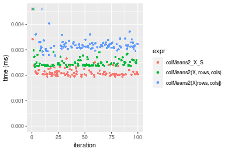

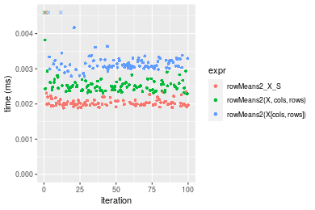
_Table: Benchmarking of colMeans2_X_S() and rowMeans2_X_S() on double+10x10 data (original and transposed).  The top panel shows times in milliseconds and the bottom panel shows relative times._


|   |expr          |   min|    lq|    mean| median|     uq|    max|
|:--|:-------------|-----:|-----:|-------:|------:|------:|------:|
|2  |rowMeans2_X_S | 1.887| 1.969| 2.06229| 2.0050| 2.0795|  4.996|
|1  |colMeans2_X_S | 1.937| 2.019| 2.29091| 2.0575| 2.1515| 19.771|


|   |expr          |      min|       lq|     mean|   median|       uq|      max|
|:--|:-------------|--------:|--------:|--------:|--------:|--------:|--------:|
|2  |rowMeans2_X_S | 1.000000| 1.000000| 1.000000| 1.000000| 1.000000| 1.000000|
|1  |colMeans2_X_S | 1.026497| 1.025394| 1.110857| 1.026185| 1.034624| 3.957366|

_Figure: Benchmarking of colMeans2_X_S() and rowMeans2_X_S() on double+10x10 data (original and transposed).  Outliers are displayed as crosses. Times are in milliseconds._


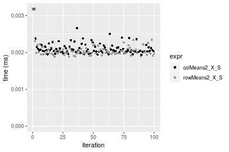

#### 100x100 double matrix

```r
> X <- data[["100x100"]]
> rows <- sample.int(nrow(X), size = nrow(X) * 0.7)
> cols <- sample.int(ncol(X), size = ncol(X) * 0.7)
> X_S <- X[rows, cols]
> gc()
          used  (Mb) gc trigger  (Mb) max used  (Mb)
Ncells 5231503 279.4    8529671 455.6  8529671 455.6
Vcells 9834953  75.1   31876688 243.2 60562128 462.1
> colStats <- microbenchmark(colMeans2_X_S = colMeans2(X_S, na.rm = FALSE), `colMeans2(X, rows, cols)` = colMeans2(X, 
+     rows = rows, cols = cols, na.rm = FALSE), `colMeans2(X[rows, cols])` = colMeans2(X[rows, cols], 
+     na.rm = FALSE), unit = "ms")
> X <- t(X)
> X_S <- t(X_S)
> gc()
          used  (Mb) gc trigger  (Mb) max used  (Mb)
Ncells 5231479 279.4    8529671 455.6  8529671 455.6
Vcells 9845006  75.2   31876688 243.2 60562128 462.1
> rowStats <- microbenchmark(rowMeans2_X_S = rowMeans2(X_S, na.rm = FALSE), `rowMeans2(X, cols, rows)` = rowMeans2(X, 
+     rows = cols, cols = rows, na.rm = FALSE), `rowMeans2(X[cols, rows])` = rowMeans2(X[cols, rows], 
+     na.rm = FALSE), unit = "ms")
```

_Table: Benchmarking of colMeans2_X_S(), colMeans2(X, rows, cols)() and colMeans2(X[rows, cols])() on double+100x100 data. The top panel shows times in milliseconds and the bottom panel shows relative times._


|   |expr                     |      min|        lq|      mean|    median|        uq|      max|
|:--|:------------------------|--------:|---------:|---------:|---------:|---------:|--------:|
|2  |colMeans2(X, rows, cols) | 0.016364| 0.0173960| 0.0179279| 0.0178595| 0.0182525| 0.026306|
|1  |colMeans2_X_S            | 0.020819| 0.0218145| 0.0224671| 0.0225680| 0.0227660| 0.037107|
|3  |colMeans2(X[rows, cols]) | 0.035665| 0.0374555| 0.0390382| 0.0388450| 0.0391190| 0.067728|


|   |expr                     |      min|       lq|     mean|   median|       uq|      max|
|:--|:------------------------|--------:|--------:|--------:|--------:|--------:|--------:|
|2  |colMeans2(X, rows, cols) | 1.000000| 1.000000| 1.000000| 1.000000| 1.000000| 1.000000|
|1  |colMeans2_X_S            | 1.272244| 1.253995| 1.253189| 1.263641| 1.247281| 1.410591|
|3  |colMeans2(X[rows, cols]) | 2.179479| 2.153110| 2.177510| 2.175033| 2.143213| 2.574622|

_Table: Benchmarking of rowMeans2_X_S(), rowMeans2(X, cols, rows)() and rowMeans2(X[cols, rows])() on double+100x100 data (transposed). The top panel shows times in milliseconds and the bottom panel shows relative times._


|   |expr                     |      min|        lq|      mean|    median|        uq|      max|
|:--|:------------------------|--------:|---------:|---------:|---------:|---------:|--------:|
|2  |rowMeans2(X, cols, rows) | 0.016692| 0.0173425| 0.0180302| 0.0178205| 0.0181035| 0.042894|
|1  |rowMeans2_X_S            | 0.016760| 0.0176815| 0.0181757| 0.0182380| 0.0185115| 0.024771|
|3  |rowMeans2(X[cols, rows]) | 0.031850| 0.0333835| 0.0345505| 0.0346645| 0.0349370| 0.049181|


|   |expr                     |      min|       lq|     mean|   median|       uq|       max|
|:--|:------------------------|--------:|--------:|--------:|--------:|--------:|---------:|
|2  |rowMeans2(X, cols, rows) | 1.000000| 1.000000| 1.000000| 1.000000| 1.000000| 1.0000000|
|1  |rowMeans2_X_S            | 1.004074| 1.019547| 1.008068| 1.023428| 1.022537| 0.5774934|
|3  |rowMeans2(X[cols, rows]) | 1.908100| 1.924953| 1.916252| 1.945204| 1.929848| 1.1465706|

_Figure: Benchmarking of colMeans2_X_S(), colMeans2(X, rows, cols)() and colMeans2(X[rows, cols])() on double+100x100 data  as well as rowMeans2_X_S(), rowMeans2(X, cols, rows)() and rowMeans2(X[cols, rows])() on the same data transposed.  Outliers are displayed as crosses.  Times are in milliseconds._


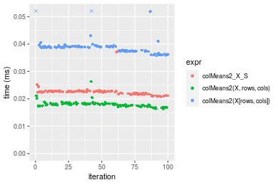

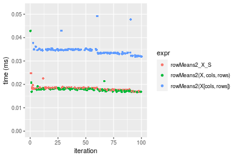
_Table: Benchmarking of colMeans2_X_S() and rowMeans2_X_S() on double+100x100 data (original and transposed).  The top panel shows times in milliseconds and the bottom panel shows relative times._


|   |expr          |    min|      lq|     mean| median|      uq|    max|
|:--|:-------------|------:|-------:|--------:|------:|-------:|------:|
|2  |rowMeans2_X_S | 16.760| 17.6815| 18.17570| 18.238| 18.5115| 24.771|
|1  |colMeans2_X_S | 20.819| 21.8145| 22.46708| 22.568| 22.7660| 37.107|


|   |expr          |      min|       lq|     mean|   median|      uq|      max|
|:--|:-------------|--------:|--------:|--------:|--------:|-------:|--------:|
|2  |rowMeans2_X_S | 1.000000| 1.000000| 1.000000| 1.000000| 1.00000| 1.000000|
|1  |colMeans2_X_S | 1.242184| 1.233747| 1.236105| 1.237416| 1.22983| 1.498002|

_Figure: Benchmarking of colMeans2_X_S() and rowMeans2_X_S() on double+100x100 data (original and transposed).  Outliers are displayed as crosses. Times are in milliseconds._


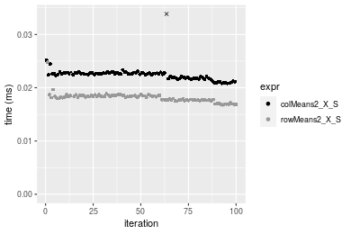

#### 1000x10 double matrix

```r
> X <- data[["1000x10"]]
> rows <- sample.int(nrow(X), size = nrow(X) * 0.7)
> cols <- sample.int(ncol(X), size = ncol(X) * 0.7)
> X_S <- X[rows, cols]
> gc()
          used  (Mb) gc trigger  (Mb) max used  (Mb)
Ncells 5231702 279.5    8529671 455.6  8529671 455.6
Vcells 9836359  75.1   31876688 243.2 60562128 462.1
> colStats <- microbenchmark(colMeans2_X_S = colMeans2(X_S, na.rm = FALSE), `colMeans2(X, rows, cols)` = colMeans2(X, 
+     rows = rows, cols = cols, na.rm = FALSE), `colMeans2(X[rows, cols])` = colMeans2(X[rows, cols], 
+     na.rm = FALSE), unit = "ms")
> X <- t(X)
> X_S <- t(X_S)
> gc()
          used  (Mb) gc trigger  (Mb) max used  (Mb)
Ncells 5231678 279.5    8529671 455.6  8529671 455.6
Vcells 9846412  75.2   31876688 243.2 60562128 462.1
> rowStats <- microbenchmark(rowMeans2_X_S = rowMeans2(X_S, na.rm = FALSE), `rowMeans2(X, cols, rows)` = rowMeans2(X, 
+     rows = cols, cols = rows, na.rm = FALSE), `rowMeans2(X[cols, rows])` = rowMeans2(X[cols, rows], 
+     na.rm = FALSE), unit = "ms")
```

_Table: Benchmarking of colMeans2_X_S(), colMeans2(X, rows, cols)() and colMeans2(X[rows, cols])() on double+1000x10 data. The top panel shows times in milliseconds and the bottom panel shows relative times._


|   |expr                     |      min|        lq|      mean|    median|       uq|      max|
|:--|:------------------------|--------:|---------:|---------:|---------:|--------:|--------:|
|2  |colMeans2(X, rows, cols) | 0.017148| 0.0183160| 0.0186735| 0.0187245| 0.018959| 0.022967|
|1  |colMeans2_X_S            | 0.019208| 0.0200920| 0.0206080| 0.0207725| 0.020959| 0.023622|
|3  |colMeans2(X[rows, cols]) | 0.034766| 0.0363295| 0.0375867| 0.0367140| 0.037854| 0.067148|


|   |expr                     |      min|       lq|     mean|   median|       uq|      max|
|:--|:------------------------|--------:|--------:|--------:|--------:|--------:|--------:|
|2  |colMeans2(X, rows, cols) | 1.000000| 1.000000| 1.000000| 1.000000| 1.000000| 1.000000|
|1  |colMeans2_X_S            | 1.120131| 1.096964| 1.103597| 1.109375| 1.105491| 1.028519|
|3  |colMeans2(X[rows, cols]) | 2.027408| 1.983484| 2.012834| 1.960747| 1.996624| 2.923673|

_Table: Benchmarking of rowMeans2_X_S(), rowMeans2(X, cols, rows)() and rowMeans2(X[cols, rows])() on double+1000x10 data (transposed). The top panel shows times in milliseconds and the bottom panel shows relative times._


|   |expr                     |      min|        lq|      mean|    median|        uq|      max|
|:--|:------------------------|--------:|---------:|---------:|---------:|---------:|--------:|
|1  |rowMeans2_X_S            | 0.015285| 0.0160695| 0.0167367| 0.0165120| 0.0168140| 0.031157|
|2  |rowMeans2(X, cols, rows) | 0.017499| 0.0184060| 0.0188089| 0.0188765| 0.0190935| 0.022353|
|3  |rowMeans2(X[cols, rows]) | 0.033629| 0.0352120| 0.0362132| 0.0364040| 0.0367485| 0.071494|


|   |expr                     |      min|       lq|     mean|   median|       uq|       max|
|:--|:------------------------|--------:|--------:|--------:|--------:|--------:|---------:|
|1  |rowMeans2_X_S            | 1.000000| 1.000000| 1.000000| 1.000000| 1.000000| 1.0000000|
|2  |rowMeans2(X, cols, rows) | 1.144848| 1.145400| 1.123811| 1.143199| 1.135571| 0.7174311|
|3  |rowMeans2(X[cols, rows]) | 2.200131| 2.191232| 2.163702| 2.204700| 2.185589| 2.2946368|

_Figure: Benchmarking of colMeans2_X_S(), colMeans2(X, rows, cols)() and colMeans2(X[rows, cols])() on double+1000x10 data  as well as rowMeans2_X_S(), rowMeans2(X, cols, rows)() and rowMeans2(X[cols, rows])() on the same data transposed.  Outliers are displayed as crosses.  Times are in milliseconds._


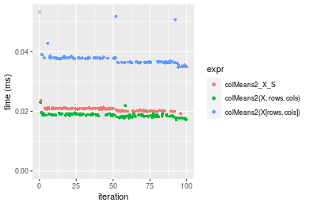

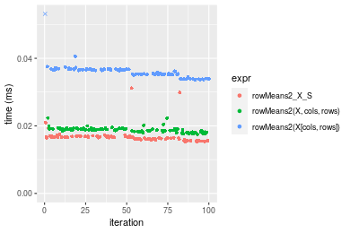
_Table: Benchmarking of colMeans2_X_S() and rowMeans2_X_S() on double+1000x10 data (original and transposed).  The top panel shows times in milliseconds and the bottom panel shows relative times._


|   |expr          |    min|      lq|     mean|  median|     uq|    max|
|:--|:-------------|------:|-------:|--------:|-------:|------:|------:|
|2  |rowMeans2_X_S | 15.285| 16.0695| 16.73669| 16.5120| 16.814| 31.157|
|1  |colMeans2_X_S | 19.208| 20.0920| 20.60805| 20.7725| 20.959| 23.622|


|   |expr          |      min|       lq|    mean|   median|       uq|       max|
|:--|:-------------|--------:|--------:|-------:|--------:|--------:|---------:|
|2  |rowMeans2_X_S | 1.000000| 1.000000| 1.00000| 1.000000| 1.000000| 1.0000000|
|1  |colMeans2_X_S | 1.256657| 1.250319| 1.23131| 1.258025| 1.246521| 0.7581603|

_Figure: Benchmarking of colMeans2_X_S() and rowMeans2_X_S() on double+1000x10 data (original and transposed).  Outliers are displayed as crosses. Times are in milliseconds._


#### 10x1000 double matrix

```r
> X <- data[["10x1000"]]
> rows <- sample.int(nrow(X), size = nrow(X) * 0.7)
> cols <- sample.int(ncol(X), size = ncol(X) * 0.7)
> X_S <- X[rows, cols]
> gc()
          used  (Mb) gc trigger  (Mb) max used  (Mb)
Ncells 5231906 279.5    8529671 455.6  8529671 455.6
Vcells 9836494  75.1   31876688 243.2 60562128 462.1
> colStats <- microbenchmark(colMeans2_X_S = colMeans2(X_S, na.rm = FALSE), `colMeans2(X, rows, cols)` = colMeans2(X, 
+     rows = rows, cols = cols, na.rm = FALSE), `colMeans2(X[rows, cols])` = colMeans2(X[rows, cols], 
+     na.rm = FALSE), unit = "ms")
> X <- t(X)
> X_S <- t(X_S)
> gc()
          used  (Mb) gc trigger  (Mb) max used  (Mb)
Ncells 5231882 279.5    8529671 455.6  8529671 455.6
Vcells 9846547  75.2   31876688 243.2 60562128 462.1
> rowStats <- microbenchmark(rowMeans2_X_S = rowMeans2(X_S, na.rm = FALSE), `rowMeans2(X, cols, rows)` = rowMeans2(X, 
+     rows = cols, cols = rows, na.rm = FALSE), `rowMeans2(X[cols, rows])` = rowMeans2(X[cols, rows], 
+     na.rm = FALSE), unit = "ms")
```

_Table: Benchmarking of colMeans2_X_S(), colMeans2(X, rows, cols)() and colMeans2(X[rows, cols])() on double+10x1000 data. The top panel shows times in milliseconds and the bottom panel shows relative times._


|   |expr                     |      min|       lq|      mean|    median|        uq|      max|
|:--|:------------------------|--------:|--------:|---------:|---------:|---------:|--------:|
|2  |colMeans2(X, rows, cols) | 0.023945| 0.024541| 0.0255356| 0.0253150| 0.0257285| 0.046420|
|1  |colMeans2_X_S            | 0.025012| 0.025952| 0.0266161| 0.0265230| 0.0269200| 0.042034|
|3  |colMeans2(X[rows, cols]) | 0.044219| 0.045548| 0.0463394| 0.0463295| 0.0469120| 0.052864|


|   |expr                     |      min|       lq|     mean|   median|       uq|       max|
|:--|:------------------------|--------:|--------:|--------:|--------:|--------:|---------:|
|2  |colMeans2(X, rows, cols) | 1.000000| 1.000000| 1.000000| 1.000000| 1.000000| 1.0000000|
|1  |colMeans2_X_S            | 1.044561| 1.057496| 1.042313| 1.047719| 1.046310| 0.9055149|
|3  |colMeans2(X[rows, cols]) | 1.846690| 1.855996| 1.814699| 1.830121| 1.823348| 1.1388195|

_Table: Benchmarking of rowMeans2_X_S(), rowMeans2(X, cols, rows)() and rowMeans2(X[cols, rows])() on double+10x1000 data (transposed). The top panel shows times in milliseconds and the bottom panel shows relative times._


|   |expr                     |      min|       lq|      mean|    median|       uq|      max|
|:--|:------------------------|--------:|--------:|---------:|---------:|--------:|--------:|
|1  |rowMeans2_X_S            | 0.020393| 0.021392| 0.0219239| 0.0219955| 0.022301| 0.027068|
|2  |rowMeans2(X, cols, rows) | 0.022744| 0.023988| 0.0249798| 0.0248580| 0.025115| 0.051117|
|3  |rowMeans2(X[cols, rows]) | 0.035782| 0.037693| 0.0389474| 0.0390735| 0.039362| 0.053669|


|   |expr                     |      min|       lq|     mean|   median|       uq|      max|
|:--|:------------------------|--------:|--------:|--------:|--------:|--------:|--------:|
|1  |rowMeans2_X_S            | 1.000000| 1.000000| 1.000000| 1.000000| 1.000000| 1.000000|
|2  |rowMeans2(X, cols, rows) | 1.115285| 1.121354| 1.139387| 1.130140| 1.126183| 1.888466|
|3  |rowMeans2(X[cols, rows]) | 1.754622| 1.762014| 1.776482| 1.776431| 1.765033| 1.982747|

_Figure: Benchmarking of colMeans2_X_S(), colMeans2(X, rows, cols)() and colMeans2(X[rows, cols])() on double+10x1000 data  as well as rowMeans2_X_S(), rowMeans2(X, cols, rows)() and rowMeans2(X[cols, rows])() on the same data transposed.  Outliers are displayed as crosses.  Times are in milliseconds._


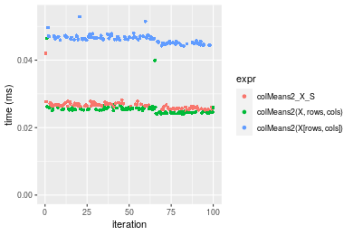

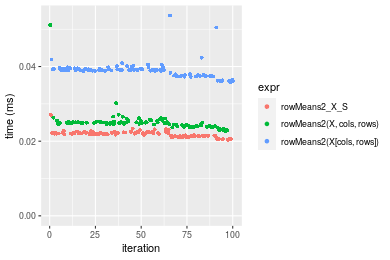
_Table: Benchmarking of colMeans2_X_S() and rowMeans2_X_S() on double+10x1000 data (original and transposed).  The top panel shows times in milliseconds and the bottom panel shows relative times._


|   |expr          |    min|     lq|     mean|  median|     uq|    max|
|:--|:-------------|------:|------:|--------:|-------:|------:|------:|
|2  |rowMeans2_X_S | 20.393| 21.392| 21.92387| 21.9955| 22.301| 27.068|
|1  |colMeans2_X_S | 25.012| 25.952| 26.61607| 26.5230| 26.920| 42.034|


|   |expr          |      min|       lq|     mean|   median|       uq|      max|
|:--|:-------------|--------:|--------:|--------:|--------:|--------:|--------:|
|2  |rowMeans2_X_S | 1.000000| 1.000000| 1.000000| 1.000000| 1.000000| 1.000000|
|1  |colMeans2_X_S | 1.226499| 1.213164| 1.214022| 1.205838| 1.207121| 1.552904|

_Figure: Benchmarking of colMeans2_X_S() and rowMeans2_X_S() on double+10x1000 data (original and transposed).  Outliers are displayed as crosses. Times are in milliseconds._


#### 100x1000 double matrix

```r
> X <- data[["100x1000"]]
> rows <- sample.int(nrow(X), size = nrow(X) * 0.7)
> cols <- sample.int(ncol(X), size = ncol(X) * 0.7)
> X_S <- X[rows, cols]
> gc()
          used  (Mb) gc trigger  (Mb) max used  (Mb)
Ncells 5232119 279.5    8529671 455.6  8529671 455.6
Vcells 9881967  75.4   31876688 243.2 60562128 462.1
> colStats <- microbenchmark(colMeans2_X_S = colMeans2(X_S, na.rm = FALSE), `colMeans2(X, rows, cols)` = colMeans2(X, 
+     rows = rows, cols = cols, na.rm = FALSE), `colMeans2(X[rows, cols])` = colMeans2(X[rows, cols], 
+     na.rm = FALSE), unit = "ms")
> X <- t(X)
> X_S <- t(X_S)
> gc()
          used  (Mb) gc trigger  (Mb) max used  (Mb)
Ncells 5232095 279.5    8529671 455.6  8529671 455.6
Vcells 9982020  76.2   31876688 243.2 60562128 462.1
> rowStats <- microbenchmark(rowMeans2_X_S = rowMeans2(X_S, na.rm = FALSE), `rowMeans2(X, cols, rows)` = rowMeans2(X, 
+     rows = cols, cols = rows, na.rm = FALSE), `rowMeans2(X[cols, rows])` = rowMeans2(X[cols, rows], 
+     na.rm = FALSE), unit = "ms")
```

_Table: Benchmarking of colMeans2_X_S(), colMeans2(X, rows, cols)() and colMeans2(X[rows, cols])() on double+100x1000 data. The top panel shows times in milliseconds and the bottom panel shows relative times._


|   |expr                     |      min|        lq|      mean|    median|        uq|      max|
|:--|:------------------------|--------:|---------:|---------:|---------:|---------:|--------:|
|2  |colMeans2(X, rows, cols) | 0.093012| 0.1019725| 0.1165956| 0.1137045| 0.1283545| 0.239620|
|1  |colMeans2_X_S            | 0.124963| 0.1393400| 0.1593735| 0.1571800| 0.1755740| 0.226523|
|3  |colMeans2(X[rows, cols]) | 0.224138| 0.2515870| 0.2842428| 0.2785885| 0.3118385| 0.374830|


|   |expr                     |      min|       lq|     mean|   median|       uq|       max|
|:--|:------------------------|--------:|--------:|--------:|--------:|--------:|---------:|
|2  |colMeans2(X, rows, cols) | 1.000000| 1.000000| 1.000000| 1.000000| 1.000000| 1.0000000|
|1  |colMeans2_X_S            | 1.343515| 1.366447| 1.366892| 1.382355| 1.367884| 0.9453426|
|3  |colMeans2(X[rows, cols]) | 2.409775| 2.467204| 2.437852| 2.450110| 2.429510| 1.5642684|

_Table: Benchmarking of rowMeans2_X_S(), rowMeans2(X, cols, rows)() and rowMeans2(X[cols, rows])() on double+100x1000 data (transposed). The top panel shows times in milliseconds and the bottom panel shows relative times._


|   |expr                     |      min|       lq|      mean|    median|        uq|      max|
|:--|:------------------------|--------:|--------:|---------:|---------:|---------:|--------:|
|1  |rowMeans2_X_S            | 0.107334| 0.124809| 0.1383345| 0.1290975| 0.1491210| 0.313997|
|2  |rowMeans2(X, cols, rows) | 0.112252| 0.124729| 0.1390577| 0.1324275| 0.1445240| 0.267007|
|3  |rowMeans2(X[cols, rows]) | 0.216403| 0.244320| 0.2705480| 0.2606555| 0.2951735| 0.447450|


|   |expr                     |      min|       lq|     mean|   median|        uq|       max|
|:--|:------------------------|--------:|--------:|--------:|--------:|---------:|---------:|
|1  |rowMeans2_X_S            | 1.000000| 1.000000| 1.000000| 1.000000| 1.0000000| 1.0000000|
|2  |rowMeans2(X, cols, rows) | 1.045820| 0.999359| 1.005228| 1.025794| 0.9691727| 0.8503489|
|3  |rowMeans2(X[cols, rows]) | 2.016164| 1.957551| 1.955752| 2.019059| 1.9794228| 1.4250136|

_Figure: Benchmarking of colMeans2_X_S(), colMeans2(X, rows, cols)() and colMeans2(X[rows, cols])() on double+100x1000 data  as well as rowMeans2_X_S(), rowMeans2(X, cols, rows)() and rowMeans2(X[cols, rows])() on the same data transposed.  Outliers are displayed as crosses.  Times are in milliseconds._


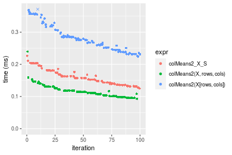

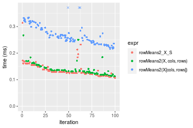
_Table: Benchmarking of colMeans2_X_S() and rowMeans2_X_S() on double+100x1000 data (original and transposed).  The top panel shows times in milliseconds and the bottom panel shows relative times._


|   |expr          |     min|      lq|     mean|   median|      uq|     max|
|:--|:-------------|-------:|-------:|--------:|--------:|-------:|-------:|
|2  |rowMeans2_X_S | 107.334| 124.809| 138.3345| 129.0975| 149.121| 313.997|
|1  |colMeans2_X_S | 124.963| 139.340| 159.3735| 157.1800| 175.574| 226.523|


|   |expr          |      min|       lq|     mean|   median|       uq|       max|
|:--|:-------------|--------:|--------:|--------:|--------:|--------:|---------:|
|2  |rowMeans2_X_S | 1.000000| 1.000000| 1.000000| 1.000000| 1.000000| 1.0000000|
|1  |colMeans2_X_S | 1.164244| 1.116426| 1.152088| 1.217529| 1.177393| 0.7214177|

_Figure: Benchmarking of colMeans2_X_S() and rowMeans2_X_S() on double+100x1000 data (original and transposed).  Outliers are displayed as crosses. Times are in milliseconds._


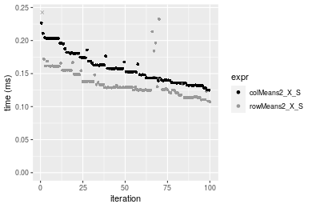

#### 1000x100 double matrix

```r
> X <- data[["1000x100"]]
> rows <- sample.int(nrow(X), size = nrow(X) * 0.7)
> cols <- sample.int(ncol(X), size = ncol(X) * 0.7)
> X_S <- X[rows, cols]
> gc()
          used  (Mb) gc trigger  (Mb) max used  (Mb)
Ncells 5232329 279.5    8529671 455.6  8529671 455.6
Vcells 9882108  75.4   31876688 243.2 60562128 462.1
> colStats <- microbenchmark(colMeans2_X_S = colMeans2(X_S, na.rm = FALSE), `colMeans2(X, rows, cols)` = colMeans2(X, 
+     rows = rows, cols = cols, na.rm = FALSE), `colMeans2(X[rows, cols])` = colMeans2(X[rows, cols], 
+     na.rm = FALSE), unit = "ms")
> X <- t(X)
> X_S <- t(X_S)
> gc()
          used  (Mb) gc trigger  (Mb) max used  (Mb)
Ncells 5232305 279.5    8529671 455.6  8529671 455.6
Vcells 9982161  76.2   31876688 243.2 60562128 462.1
> rowStats <- microbenchmark(rowMeans2_X_S = rowMeans2(X_S, na.rm = FALSE), `rowMeans2(X, cols, rows)` = rowMeans2(X, 
+     rows = cols, cols = rows, na.rm = FALSE), `rowMeans2(X[cols, rows])` = rowMeans2(X[cols, rows], 
+     na.rm = FALSE), unit = "ms")
```

_Table: Benchmarking of colMeans2_X_S(), colMeans2(X, rows, cols)() and colMeans2(X[rows, cols])() on double+1000x100 data. The top panel shows times in milliseconds and the bottom panel shows relative times._


|   |expr                     |      min|        lq|      mean|    median|        uq|      max|
|:--|:------------------------|--------:|---------:|---------:|---------:|---------:|--------:|
|2  |colMeans2(X, rows, cols) | 0.087341| 0.0955840| 0.1081725| 0.1041995| 0.1177120| 0.168556|
|1  |colMeans2_X_S            | 0.122635| 0.1336755| 0.1506216| 0.1463645| 0.1580090| 0.250562|
|3  |colMeans2(X[rows, cols]) | 0.219466| 0.2412715| 0.2736795| 0.2705760| 0.2947245| 0.434267|


|   |expr                     |      min|       lq|     mean|   median|       uq|      max|
|:--|:------------------------|--------:|--------:|--------:|--------:|--------:|--------:|
|2  |colMeans2(X, rows, cols) | 1.000000| 1.000000| 1.000000| 1.000000| 1.000000| 1.000000|
|1  |colMeans2_X_S            | 1.404094| 1.398513| 1.392421| 1.404656| 1.342335| 1.486521|
|3  |colMeans2(X[rows, cols]) | 2.512749| 2.524183| 2.530029| 2.596711| 2.503776| 2.576396|

_Table: Benchmarking of rowMeans2_X_S(), rowMeans2(X, cols, rows)() and rowMeans2(X[cols, rows])() on double+1000x100 data (transposed). The top panel shows times in milliseconds and the bottom panel shows relative times._


|   |expr                     |      min|        lq|      mean|    median|        uq|      max|
|:--|:------------------------|--------:|---------:|---------:|---------:|---------:|--------:|
|1  |rowMeans2_X_S            | 0.098873| 0.1072580| 0.1179329| 0.1155910| 0.1253360| 0.194452|
|2  |rowMeans2(X, cols, rows) | 0.106817| 0.1176845| 0.1293736| 0.1248245| 0.1341950| 0.304632|
|3  |rowMeans2(X[cols, rows]) | 0.202904| 0.2246740| 0.2468780| 0.2393140| 0.2738205| 0.323391|


|   |expr                     |      min|       lq|     mean|   median|       uq|      max|
|:--|:------------------------|--------:|--------:|--------:|--------:|--------:|--------:|
|1  |rowMeans2_X_S            | 1.000000| 1.000000| 1.000000| 1.000000| 1.000000| 1.000000|
|2  |rowMeans2(X, cols, rows) | 1.080345| 1.097209| 1.097011| 1.079881| 1.070682| 1.566618|
|3  |rowMeans2(X[cols, rows]) | 2.052168| 2.094706| 2.093377| 2.070352| 2.184692| 1.663089|

_Figure: Benchmarking of colMeans2_X_S(), colMeans2(X, rows, cols)() and colMeans2(X[rows, cols])() on double+1000x100 data  as well as rowMeans2_X_S(), rowMeans2(X, cols, rows)() and rowMeans2(X[cols, rows])() on the same data transposed.  Outliers are displayed as crosses.  Times are in milliseconds._


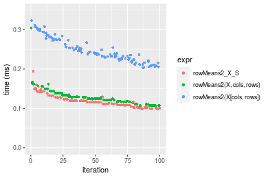
_Table: Benchmarking of colMeans2_X_S() and rowMeans2_X_S() on double+1000x100 data (original and transposed).  The top panel shows times in milliseconds and the bottom panel shows relative times._


|   |expr          |     min|       lq|     mean|   median|      uq|     max|
|:--|:-------------|-------:|--------:|--------:|--------:|-------:|-------:|
|2  |rowMeans2_X_S |  98.873| 107.2580| 117.9329| 115.5910| 125.336| 194.452|
|1  |colMeans2_X_S | 122.635| 133.6755| 150.6216| 146.3645| 158.009| 250.562|


|   |expr          |      min|       lq|     mean|   median|       uq|      max|
|:--|:-------------|--------:|--------:|--------:|--------:|--------:|--------:|
|2  |rowMeans2_X_S | 1.000000| 1.000000| 1.000000| 1.000000| 1.000000| 1.000000|
|1  |colMeans2_X_S | 1.240328| 1.246299| 1.277181| 1.266228| 1.260683| 1.288555|

_Figure: Benchmarking of colMeans2_X_S() and rowMeans2_X_S() on double+1000x100 data (original and transposed).  Outliers are displayed as crosses. Times are in milliseconds._


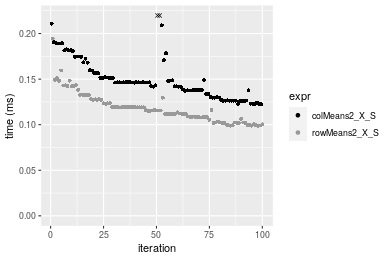


## Appendix

### Session information
```r
R version 4.1.1 Patched (2021-08-10 r80727)
Platform: x86_64-pc-linux-gnu (64-bit)
Running under: Ubuntu 18.04.5 LTS

Matrix products: default
BLAS:   /home/hb/software/R-devel/R-4-1-branch/lib/R/lib/libRblas.so
LAPACK: /home/hb/software/R-devel/R-4-1-branch/lib/R/lib/libRlapack.so

locale:
 [1] LC_CTYPE=en_US.UTF-8       LC_NUMERIC=C              
 [3] LC_TIME=en_US.UTF-8        LC_COLLATE=en_US.UTF-8    
 [5] LC_MONETARY=en_US.UTF-8    LC_MESSAGES=en_US.UTF-8   
 [7] LC_PAPER=en_US.UTF-8       LC_NAME=C                 
 [9] LC_ADDRESS=C               LC_TELEPHONE=C            
[11] LC_MEASUREMENT=en_US.UTF-8 LC_IDENTIFICATION=C       

attached base packages:
[1] stats     graphics  grDevices utils     datasets  methods   base     

other attached packages:
[1] microbenchmark_1.4-7   matrixStats_0.60.1     ggplot2_3.3.5         
[4] knitr_1.33             R.devices_2.17.0       R.utils_2.10.1        
[7] R.oo_1.24.0            R.methodsS3_1.8.1-9001 history_0.0.1-9000    

loaded via a namespace (and not attached):
 [1] Biobase_2.52.0          httr_1.4.2              splines_4.1.1          
 [4] bit64_4.0.5             network_1.17.1          assertthat_0.2.1       
 [7] highr_0.9               stats4_4.1.1            blob_1.2.2             
[10] GenomeInfoDbData_1.2.6  robustbase_0.93-8       pillar_1.6.2           
[13] RSQLite_2.2.8           lattice_0.20-44         glue_1.4.2             
[16] digest_0.6.27           XVector_0.32.0          colorspace_2.0-2       
[19] Matrix_1.3-4            XML_3.99-0.7            pkgconfig_2.0.3        
[22] zlibbioc_1.38.0         genefilter_1.74.0       purrr_0.3.4            
[25] ergm_4.1.2              xtable_1.8-4            scales_1.1.1           
[28] tibble_3.1.4            annotate_1.70.0         KEGGREST_1.32.0        
[31] farver_2.1.0            generics_0.1.0          IRanges_2.26.0         
[34] ellipsis_0.3.2          cachem_1.0.6            withr_2.4.2            
[37] BiocGenerics_0.38.0     mime_0.11               survival_3.2-13        
[40] magrittr_2.0.1          crayon_1.4.1            statnet.common_4.5.0   
[43] memoise_2.0.0           laeken_0.5.1            fansi_0.5.0            
[46] R.cache_0.15.0          MASS_7.3-54             R.rsp_0.44.0           
[49] progressr_0.8.0         tools_4.1.1             lifecycle_1.0.0        
[52] S4Vectors_0.30.0        trust_0.1-8             munsell_0.5.0          
[55] tabby_0.0.1-9001        AnnotationDbi_1.54.1    Biostrings_2.60.2      
[58] compiler_4.1.1          GenomeInfoDb_1.28.1     rlang_0.4.11           
[61] grid_4.1.1              RCurl_1.98-1.4          cwhmisc_6.6            
[64] rappdirs_0.3.3          startup_0.15.0          labeling_0.4.2         
[67] bitops_1.0-7            base64enc_0.1-3         boot_1.3-28            
[70] gtable_0.3.0            DBI_1.1.1               markdown_1.1           
[73] R6_2.5.1                lpSolveAPI_5.5.2.0-17.7 rle_0.9.2              
[76] dplyr_1.0.7             fastmap_1.1.0           bit_4.0.4              
[79] utf8_1.2.2              parallel_4.1.1          Rcpp_1.0.7             
[82] vctrs_0.3.8             png_0.1-7               DEoptimR_1.0-9         
[85] tidyselect_1.1.1        xfun_0.25               coda_0.19-4            
```
Total processing time was 23.28 secs.


### Reproducibility
To reproduce this report, do:
```r
html <- matrixStats:::benchmark('colRowMeans2_subset')
```

[RSP]: https://cran.r-project.org/package=R.rsp
[matrixStats]: https://cran.r-project.org/package=matrixStats

[StackOverflow:colMins?]: https://stackoverflow.com/questions/13676878 "Stack Overflow: fastest way to get Min from every column in a matrix?"
[StackOverflow:colSds?]: https://stackoverflow.com/questions/17549762 "Stack Overflow: Is there such 'colsd' in R?"
[StackOverflow:rowProds?]: https://stackoverflow.com/questions/20198801/ "Stack Overflow: Row product of matrix and column sum of matrix"

---------------------------------------
Copyright Henrik Bengtsson. Last updated on 2021-08-25 18:58:35 (+0200 UTC). Powered by [RSP].

<script>
 var link = document.createElement('link');
 link.rel = 'icon';
 link.href = "data:image/png;base64,iVBORw0KGgoAAAANSUhEUgAAACAAAAAgCAMAAABEpIrGAAAA21BMVEUAAAAAAP8AAP8AAP8AAP8AAP8AAP8AAP8AAP8AAP8AAP8AAP8AAP8AAP8AAP8AAP8AAP8AAP8AAP8AAP8AAP8AAP8AAP8AAP8AAP8AAP8AAP8AAP8AAP8AAP8AAP8AAP8AAP8AAP8AAP8AAP8AAP8AAP8AAP8AAP8AAP8AAP8BAf4CAv0DA/wdHeIeHuEfH+AgIN8hId4lJdomJtknJ9g+PsE/P8BAQL9yco10dIt1dYp3d4h4eIeVlWqWlmmXl2iYmGeZmWabm2Tn5xjo6Bfp6Rb39wj4+Af//wA2M9hbAAAASXRSTlMAAQIJCgsMJSYnKD4/QGRlZmhpamtsbautrrCxuru8y8zN5ebn6Pn6+///////////////////////////////////////////LsUNcQAAAS9JREFUOI29k21XgkAQhVcFytdSMqMETU26UVqGmpaiFbL//xc1cAhhwVNf6n5i5z67M2dmYOyfJZUqlVLhkKucG7cgmUZTybDz6g0iDeq51PUr37Ds2cy2/C9NeES5puDjxuUk1xnToZsg8pfA3avHQ3lLIi7iWRrkv/OYtkScxBIMgDee0ALoyxHQBJ68JLCjOtQIMIANF7QG9G9fNnHvisCHBVMKgSJgiz7nE+AoBKrAPA3MgepvgR9TSCasrCKH0eB1wBGBFdCO+nAGjMVGPcQb5bd6mQRegN6+1axOs9nGfYcCtfi4NQosdtH7dB+txFIpXQqN1p9B/asRHToyS0jRgpV7nk4nwcq1BJ+x3Gl/v7S9Wmpp/aGquum7w3ZDyrADFYrl8vHBH+ev9AUASW1dmU4h4wAAAABJRU5ErkJggg=="
 document.getElementsByTagName('head')[0].appendChild(link);
</script>

