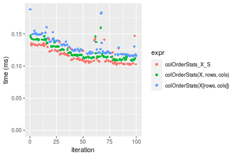

[matrixStats]: Benchmark report

---------------------------------------


# colOrderStats() and rowOrderStats() benchmarks on subsetted computation

This report benchmark the performance of colOrderStats() and rowOrderStats() on subsetted computation.


## Data type "integer"

### Data
```r
> rmatrix <- function(nrow, ncol, mode = c("logical", "double", "integer", "index"), range = c(-100, 
+     +100), na_prob = 0) {
+     mode <- match.arg(mode)
+     n <- nrow * ncol
+     if (mode == "logical") {
+         x <- sample(c(FALSE, TRUE), size = n, replace = TRUE)
+     }     else if (mode == "index") {
+         x <- seq_len(n)
+         mode <- "integer"
+     }     else {
+         x <- runif(n, min = range[1], max = range[2])
+     }
+     storage.mode(x) <- mode
+     if (na_prob > 0) 
+         x[sample(n, size = na_prob * n)] <- NA
+     dim(x) <- c(nrow, ncol)
+     x
+ }
> rmatrices <- function(scale = 10, seed = 1, ...) {
+     set.seed(seed)
+     data <- list()
+     data[[1]] <- rmatrix(nrow = scale * 1, ncol = scale * 1, ...)
+     data[[2]] <- rmatrix(nrow = scale * 10, ncol = scale * 10, ...)
+     data[[3]] <- rmatrix(nrow = scale * 100, ncol = scale * 1, ...)
+     data[[4]] <- t(data[[3]])
+     data[[5]] <- rmatrix(nrow = scale * 10, ncol = scale * 100, ...)
+     data[[6]] <- t(data[[5]])
+     names(data) <- sapply(data, FUN = function(x) paste(dim(x), collapse = "x"))
+     data
+ }
> data <- rmatrices(mode = mode)
```

### Results

#### 10x10 integer matrix


```r
> X <- data[["10x10"]]
> rows <- sample.int(nrow(X), size = nrow(X) * 0.7)
> cols <- sample.int(ncol(X), size = ncol(X) * 0.7)
> X_S <- X[rows, cols]
> gc()
           used  (Mb) gc trigger  (Mb) max used  (Mb)
Ncells  5263975 281.2    8529671 455.6  8529671 455.6
Vcells 10236773  78.2   31876688 243.2 60562128 462.1
> probs <- 0.3
> which <- round(probs * nrow(X))
> colStats <- microbenchmark(colOrderStats_X_S = colOrderStats(X_S, which = which, na.rm = FALSE), 
+     `colOrderStats(X, rows, cols)` = colOrderStats(X, rows = rows, cols = cols, which = which, na.rm = FALSE), 
+     `colOrderStats(X[rows, cols])` = colOrderStats(X[rows, cols], which = which, na.rm = FALSE), 
+     unit = "ms")
> X <- t(X)
> X_S <- t(X_S)
> gc()
           used  (Mb) gc trigger  (Mb) max used  (Mb)
Ncells  5255029 280.7    8529671 455.6  8529671 455.6
Vcells 10207528  77.9   31876688 243.2 60562128 462.1
> rowStats <- microbenchmark(rowOrderStats_X_S = rowOrderStats(X_S, which = which, na.rm = FALSE), 
+     `rowOrderStats(X, cols, rows)` = rowOrderStats(X, rows = cols, cols = rows, which = which, na.rm = FALSE), 
+     `rowOrderStats(X[cols, rows])` = rowOrderStats(X[cols, rows], which = which, na.rm = FALSE), 
+     unit = "ms")
```


_Table: Benchmarking of colOrderStats_X_S(), colOrderStats(X, rows, cols)() and colOrderStats(X[rows, cols])() on integer+10x10 data. The top panel shows times in milliseconds and the bottom panel shows relative times._


|   |expr                         |      min|        lq|      mean|    median|        uq|      max|
|:--|:----------------------------|--------:|---------:|---------:|---------:|---------:|--------:|
|1  |colOrderStats_X_S            | 0.003129| 0.0032170| 0.0047680| 0.0032730| 0.0033700| 0.132718|
|2  |colOrderStats(X, rows, cols) | 0.003543| 0.0036650| 0.0039469| 0.0037210| 0.0038385| 0.011956|
|3  |colOrderStats(X[rows, cols]) | 0.003902| 0.0042565| 0.0045577| 0.0043655| 0.0044990| 0.011916|


|   |expr                         |      min|       lq|      mean|   median|       uq|       max|
|:--|:----------------------------|--------:|--------:|---------:|--------:|--------:|---------:|
|1  |colOrderStats_X_S            | 1.000000| 1.000000| 1.0000000| 1.000000| 1.000000| 1.0000000|
|2  |colOrderStats(X, rows, cols) | 1.132311| 1.139260| 0.8277814| 1.136877| 1.139021| 0.0900857|
|3  |colOrderStats(X[rows, cols]) | 1.247044| 1.323127| 0.9558915| 1.333792| 1.335015| 0.0897844|

_Table: Benchmarking of rowOrderStats_X_S(), rowOrderStats(X, cols, rows)() and rowOrderStats(X[cols, rows])() on integer+10x10 data (transposed). The top panel shows times in milliseconds and the bottom panel shows relative times._


|   |expr                         |      min|        lq|      mean|    median|        uq|      max|
|:--|:----------------------------|--------:|---------:|---------:|---------:|---------:|--------:|
|1  |rowOrderStats_X_S            | 0.003206| 0.0032975| 0.0034111| 0.0033395| 0.0034290| 0.006321|
|2  |rowOrderStats(X, cols, rows) | 0.003675| 0.0038090| 0.0050754| 0.0038685| 0.0039845| 0.117801|
|3  |rowOrderStats(X[cols, rows]) | 0.004097| 0.0043385| 0.0045615| 0.0044550| 0.0046565| 0.007595|


|   |expr                         |      min|       lq|     mean|   median|       uq|      max|
|:--|:----------------------------|--------:|--------:|--------:|--------:|--------:|--------:|
|1  |rowOrderStats_X_S            | 1.000000| 1.000000| 1.000000| 1.000000| 1.000000|  1.00000|
|2  |rowOrderStats(X, cols, rows) | 1.146288| 1.155118| 1.487933| 1.158407| 1.162001| 18.63645|
|3  |rowOrderStats(X[cols, rows]) | 1.277916| 1.315694| 1.337276| 1.334032| 1.357976|  1.20155|

_Figure: Benchmarking of colOrderStats_X_S(), colOrderStats(X, rows, cols)() and colOrderStats(X[rows, cols])() on integer+10x10 data  as well as rowOrderStats_X_S(), rowOrderStats(X, cols, rows)() and rowOrderStats(X[cols, rows])() on the same data transposed.  Outliers are displayed as crosses.  Times are in milliseconds._


_Table: Benchmarking of colOrderStats_X_S() and rowOrderStats_X_S() on integer+10x10 data (original and transposed).  The top panel shows times in milliseconds and the bottom panel shows relative times._


|   |expr              |   min|     lq|    mean| median|    uq|     max|
|:--|:-----------------|-----:|------:|-------:|------:|-----:|-------:|
|1  |colOrderStats_X_S | 3.129| 3.2170| 4.76801| 3.2730| 3.370| 132.718|
|2  |rowOrderStats_X_S | 3.206| 3.2975| 3.41106| 3.3395| 3.429|   6.321|


|   |expr              |      min|       lq|      mean|   median|       uq|       max|
|:--|:-----------------|--------:|--------:|---------:|--------:|--------:|---------:|
|1  |colOrderStats_X_S | 1.000000| 1.000000| 1.0000000| 1.000000| 1.000000| 1.0000000|
|2  |rowOrderStats_X_S | 1.024609| 1.025023| 0.7154054| 1.020318| 1.017507| 0.0476273|

_Figure: Benchmarking of colOrderStats_X_S() and rowOrderStats_X_S() on integer+10x10 data (original and transposed).  Outliers are displayed as crosses. Times are in milliseconds._


#### 100x100 integer matrix


```r
> X <- data[["100x100"]]
> rows <- sample.int(nrow(X), size = nrow(X) * 0.7)
> cols <- sample.int(ncol(X), size = ncol(X) * 0.7)
> X_S <- X[rows, cols]
> gc()
          used  (Mb) gc trigger  (Mb) max used  (Mb)
Ncells 5253692 280.6    8529671 455.6  8529671 455.6
Vcells 9875894  75.4   31876688 243.2 60562128 462.1
> probs <- 0.3
> which <- round(probs * nrow(X))
> colStats <- microbenchmark(colOrderStats_X_S = colOrderStats(X_S, which = which, na.rm = FALSE), 
+     `colOrderStats(X, rows, cols)` = colOrderStats(X, rows = rows, cols = cols, which = which, na.rm = FALSE), 
+     `colOrderStats(X[rows, cols])` = colOrderStats(X[rows, cols], which = which, na.rm = FALSE), 
+     unit = "ms")
> X <- t(X)
> X_S <- t(X_S)
> gc()
          used  (Mb) gc trigger  (Mb) max used  (Mb)
Ncells 5253667 280.6    8529671 455.6  8529671 455.6
Vcells 9880946  75.4   31876688 243.2 60562128 462.1
> rowStats <- microbenchmark(rowOrderStats_X_S = rowOrderStats(X_S, which = which, na.rm = FALSE), 
+     `rowOrderStats(X, cols, rows)` = rowOrderStats(X, rows = cols, cols = rows, which = which, na.rm = FALSE), 
+     `rowOrderStats(X[cols, rows])` = rowOrderStats(X[cols, rows], which = which, na.rm = FALSE), 
+     unit = "ms")
```


_Table: Benchmarking of colOrderStats_X_S(), colOrderStats(X, rows, cols)() and colOrderStats(X[rows, cols])() on integer+100x100 data. The top panel shows times in milliseconds and the bottom panel shows relative times._


|   |expr                         |      min|        lq|      mean|    median|        uq|      max|
|:--|:----------------------------|--------:|---------:|---------:|---------:|---------:|--------:|
|1  |colOrderStats_X_S            | 0.066108| 0.0707340| 0.0770688| 0.0750445| 0.0815830| 0.096272|
|2  |colOrderStats(X, rows, cols) | 0.074029| 0.0783500| 0.0851521| 0.0832290| 0.0903345| 0.110941|
|3  |colOrderStats(X[rows, cols]) | 0.077098| 0.0809025| 0.0895003| 0.0860835| 0.0970160| 0.149868|


|   |expr                         |      min|       lq|     mean|   median|       uq|      max|
|:--|:----------------------------|--------:|--------:|--------:|--------:|--------:|--------:|
|1  |colOrderStats_X_S            | 1.000000| 1.000000| 1.000000| 1.000000| 1.000000| 1.000000|
|2  |colOrderStats(X, rows, cols) | 1.119819| 1.107671| 1.104883| 1.109062| 1.107271| 1.152370|
|3  |colOrderStats(X[rows, cols]) | 1.166243| 1.143757| 1.161303| 1.147099| 1.189169| 1.556714|

_Table: Benchmarking of rowOrderStats_X_S(), rowOrderStats(X, cols, rows)() and rowOrderStats(X[cols, rows])() on integer+100x100 data (transposed). The top panel shows times in milliseconds and the bottom panel shows relative times._


|   |expr                         |      min|        lq|      mean|    median|        uq|      max|
|:--|:----------------------------|--------:|---------:|---------:|---------:|---------:|--------:|
|1  |rowOrderStats_X_S            | 0.064871| 0.0686835| 0.0752604| 0.0740360| 0.0805175| 0.101112|
|2  |rowOrderStats(X, cols, rows) | 0.073535| 0.0769715| 0.0844522| 0.0827860| 0.0887010| 0.131338|
|3  |rowOrderStats(X[cols, rows]) | 0.075465| 0.0795395| 0.0861517| 0.0855185| 0.0912645| 0.112330|


|   |expr                         |      min|       lq|     mean|   median|       uq|      max|
|:--|:----------------------------|--------:|--------:|--------:|--------:|--------:|--------:|
|1  |rowOrderStats_X_S            | 1.000000| 1.000000| 1.000000| 1.000000| 1.000000| 1.000000|
|2  |rowOrderStats(X, cols, rows) | 1.133557| 1.120669| 1.122133| 1.118186| 1.101636| 1.298936|
|3  |rowOrderStats(X[cols, rows]) | 1.163309| 1.158058| 1.144714| 1.155093| 1.133474| 1.110946|

_Figure: Benchmarking of colOrderStats_X_S(), colOrderStats(X, rows, cols)() and colOrderStats(X[rows, cols])() on integer+100x100 data  as well as rowOrderStats_X_S(), rowOrderStats(X, cols, rows)() and rowOrderStats(X[cols, rows])() on the same data transposed.  Outliers are displayed as crosses.  Times are in milliseconds._


_Table: Benchmarking of colOrderStats_X_S() and rowOrderStats_X_S() on integer+100x100 data (original and transposed).  The top panel shows times in milliseconds and the bottom panel shows relative times._


|   |expr              |    min|      lq|     mean|  median|      uq|     max|
|:--|:-----------------|------:|-------:|--------:|-------:|-------:|-------:|
|2  |rowOrderStats_X_S | 64.871| 68.6835| 75.26044| 74.0360| 80.5175| 101.112|
|1  |colOrderStats_X_S | 66.108| 70.7340| 77.06882| 75.0445| 81.5830|  96.272|


|   |expr              |      min|       lq|     mean|   median|       uq|       max|
|:--|:-----------------|--------:|--------:|--------:|--------:|--------:|---------:|
|2  |rowOrderStats_X_S | 1.000000| 1.000000| 1.000000| 1.000000| 1.000000| 1.0000000|
|1  |colOrderStats_X_S | 1.019069| 1.029854| 1.024028| 1.013622| 1.013233| 0.9521323|

_Figure: Benchmarking of colOrderStats_X_S() and rowOrderStats_X_S() on integer+100x100 data (original and transposed).  Outliers are displayed as crosses. Times are in milliseconds._


#### 1000x10 integer matrix


```r
> X <- data[["1000x10"]]
> rows <- sample.int(nrow(X), size = nrow(X) * 0.7)
> cols <- sample.int(ncol(X), size = ncol(X) * 0.7)
> X_S <- X[rows, cols]
> gc()
          used  (Mb) gc trigger  (Mb) max used  (Mb)
Ncells 5254436 280.7    8529671 455.6  8529671 455.6
Vcells 9880250  75.4   31876688 243.2 60562128 462.1
> probs <- 0.3
> which <- round(probs * nrow(X))
> colStats <- microbenchmark(colOrderStats_X_S = colOrderStats(X_S, which = which, na.rm = FALSE), 
+     `colOrderStats(X, rows, cols)` = colOrderStats(X, rows = rows, cols = cols, which = which, na.rm = FALSE), 
+     `colOrderStats(X[rows, cols])` = colOrderStats(X[rows, cols], which = which, na.rm = FALSE), 
+     unit = "ms")
> X <- t(X)
> X_S <- t(X_S)
> gc()
          used  (Mb) gc trigger  (Mb) max used  (Mb)
Ncells 5254411 280.7    8529671 455.6  8529671 455.6
Vcells 9885302  75.5   31876688 243.2 60562128 462.1
> rowStats <- microbenchmark(rowOrderStats_X_S = rowOrderStats(X_S, which = which, na.rm = FALSE), 
+     `rowOrderStats(X, cols, rows)` = rowOrderStats(X, rows = cols, cols = rows, which = which, na.rm = FALSE), 
+     `rowOrderStats(X[cols, rows])` = rowOrderStats(X[cols, rows], which = which, na.rm = FALSE), 
+     unit = "ms")
```


_Table: Benchmarking of colOrderStats_X_S(), colOrderStats(X, rows, cols)() and colOrderStats(X[rows, cols])() on integer+1000x10 data. The top panel shows times in milliseconds and the bottom panel shows relative times._


|   |expr                         |      min|        lq|      mean|    median|        uq|      max|
|:--|:----------------------------|--------:|---------:|---------:|---------:|---------:|--------:|
|1  |colOrderStats_X_S            | 0.061762| 0.0660685| 0.0717479| 0.0706405| 0.0766410| 0.094011|
|2  |colOrderStats(X, rows, cols) | 0.069930| 0.0733140| 0.0799615| 0.0772010| 0.0862880| 0.106527|
|3  |colOrderStats(X[rows, cols]) | 0.071619| 0.0745230| 0.0820215| 0.0791005| 0.0889015| 0.145445|


|   |expr                         |      min|       lq|     mean|   median|       uq|      max|
|:--|:----------------------------|--------:|--------:|--------:|--------:|--------:|--------:|
|1  |colOrderStats_X_S            | 1.000000| 1.000000| 1.000000| 1.000000| 1.000000| 1.000000|
|2  |colOrderStats(X, rows, cols) | 1.132250| 1.109666| 1.114479| 1.092872| 1.125873| 1.133133|
|3  |colOrderStats(X[rows, cols]) | 1.159596| 1.127966| 1.143190| 1.119761| 1.159973| 1.547106|

_Table: Benchmarking of rowOrderStats_X_S(), rowOrderStats(X, cols, rows)() and rowOrderStats(X[cols, rows])() on integer+1000x10 data (transposed). The top panel shows times in milliseconds and the bottom panel shows relative times._


|   |expr                         |      min|        lq|      mean|    median|        uq|      max|
|:--|:----------------------------|--------:|---------:|---------:|---------:|---------:|--------:|
|1  |rowOrderStats_X_S            | 0.059928| 0.0631835| 0.0686435| 0.0657405| 0.0739390| 0.094360|
|2  |rowOrderStats(X, cols, rows) | 0.069760| 0.0736135| 0.0809133| 0.0793145| 0.0871755| 0.103094|
|3  |rowOrderStats(X[cols, rows]) | 0.070572| 0.0746240| 0.0821556| 0.0803925| 0.0874665| 0.148321|


|   |expr                         |      min|       lq|     mean|   median|       uq|      max|
|:--|:----------------------------|--------:|--------:|--------:|--------:|--------:|--------:|
|1  |rowOrderStats_X_S            | 1.000000| 1.000000| 1.000000| 1.000000| 1.000000| 1.000000|
|2  |rowOrderStats(X, cols, rows) | 1.164063| 1.165075| 1.178746| 1.206479| 1.179019| 1.092560|
|3  |rowOrderStats(X[cols, rows]) | 1.177613| 1.181068| 1.196844| 1.222876| 1.182955| 1.571863|

_Figure: Benchmarking of colOrderStats_X_S(), colOrderStats(X, rows, cols)() and colOrderStats(X[rows, cols])() on integer+1000x10 data  as well as rowOrderStats_X_S(), rowOrderStats(X, cols, rows)() and rowOrderStats(X[cols, rows])() on the same data transposed.  Outliers are displayed as crosses.  Times are in milliseconds._


_Table: Benchmarking of colOrderStats_X_S() and rowOrderStats_X_S() on integer+1000x10 data (original and transposed).  The top panel shows times in milliseconds and the bottom panel shows relative times._


|   |expr              |    min|      lq|     mean|  median|     uq|    max|
|:--|:-----------------|------:|-------:|--------:|-------:|------:|------:|
|2  |rowOrderStats_X_S | 59.928| 63.1835| 68.64352| 65.7405| 73.939| 94.360|
|1  |colOrderStats_X_S | 61.762| 66.0685| 71.74789| 70.6405| 76.641| 94.011|


|   |expr              |      min|       lq|     mean|   median|       uq|       max|
|:--|:-----------------|--------:|--------:|--------:|--------:|--------:|---------:|
|2  |rowOrderStats_X_S | 1.000000| 1.000000| 1.000000| 1.000000| 1.000000| 1.0000000|
|1  |colOrderStats_X_S | 1.030603| 1.045661| 1.045225| 1.074536| 1.036544| 0.9963014|

_Figure: Benchmarking of colOrderStats_X_S() and rowOrderStats_X_S() on integer+1000x10 data (original and transposed).  Outliers are displayed as crosses. Times are in milliseconds._


#### 10x1000 integer matrix


```r
> X <- data[["10x1000"]]
> rows <- sample.int(nrow(X), size = nrow(X) * 0.7)
> cols <- sample.int(ncol(X), size = ncol(X) * 0.7)
> X_S <- X[rows, cols]
> gc()
          used  (Mb) gc trigger  (Mb) max used  (Mb)
Ncells 5254640 280.7    8529671 455.6  8529671 455.6
Vcells 9881190  75.4   31876688 243.2 60562128 462.1
> probs <- 0.3
> which <- round(probs * nrow(X))
> colStats <- microbenchmark(colOrderStats_X_S = colOrderStats(X_S, which = which, na.rm = FALSE), 
+     `colOrderStats(X, rows, cols)` = colOrderStats(X, rows = rows, cols = cols, which = which, na.rm = FALSE), 
+     `colOrderStats(X[rows, cols])` = colOrderStats(X[rows, cols], which = which, na.rm = FALSE), 
+     unit = "ms")
> X <- t(X)
> X_S <- t(X_S)
> gc()
          used  (Mb) gc trigger  (Mb) max used  (Mb)
Ncells 5254615 280.7    8529671 455.6  8529671 455.6
Vcells 9886242  75.5   31876688 243.2 60562128 462.1
> rowStats <- microbenchmark(rowOrderStats_X_S = rowOrderStats(X_S, which = which, na.rm = FALSE), 
+     `rowOrderStats(X, cols, rows)` = rowOrderStats(X, rows = cols, cols = rows, which = which, na.rm = FALSE), 
+     `rowOrderStats(X[cols, rows])` = rowOrderStats(X[cols, rows], which = which, na.rm = FALSE), 
+     unit = "ms")
```


_Table: Benchmarking of colOrderStats_X_S(), colOrderStats(X, rows, cols)() and colOrderStats(X[rows, cols])() on integer+10x1000 data. The top panel shows times in milliseconds and the bottom panel shows relative times._


|   |expr                         |      min|        lq|      mean|    median|        uq|      max|
|:--|:----------------------------|--------:|---------:|---------:|---------:|---------:|--------:|
|1  |colOrderStats_X_S            | 0.059233| 0.0647800| 0.0707883| 0.0691295| 0.0750850| 0.120453|
|2  |colOrderStats(X, rows, cols) | 0.067620| 0.0717445| 0.0776411| 0.0755180| 0.0834125| 0.101483|
|3  |colOrderStats(X[rows, cols]) | 0.070892| 0.0775805| 0.0831609| 0.0825245| 0.0884600| 0.110625|


|   |expr                         |      min|      lq|     mean|   median|       uq|       max|
|:--|:----------------------------|--------:|-------:|--------:|--------:|--------:|---------:|
|1  |colOrderStats_X_S            | 1.000000| 1.00000| 1.000000| 1.000000| 1.000000| 1.0000000|
|2  |colOrderStats(X, rows, cols) | 1.141593| 1.10751| 1.096807| 1.092413| 1.110908| 0.8425112|
|3  |colOrderStats(X[rows, cols]) | 1.196833| 1.19760| 1.174783| 1.193767| 1.178132| 0.9184080|

_Table: Benchmarking of rowOrderStats_X_S(), rowOrderStats(X, cols, rows)() and rowOrderStats(X[cols, rows])() on integer+10x1000 data (transposed). The top panel shows times in milliseconds and the bottom panel shows relative times._


|   |expr                         |      min|        lq|      mean|    median|       uq|      max|
|:--|:----------------------------|--------:|---------:|---------:|---------:|--------:|--------:|
|1  |rowOrderStats_X_S            | 0.057303| 0.0618215| 0.0677530| 0.0667540| 0.072352| 0.092838|
|2  |rowOrderStats(X, cols, rows) | 0.061081| 0.0705800| 0.0758625| 0.0737585| 0.080763| 0.126372|
|3  |rowOrderStats(X[cols, rows]) | 0.066314| 0.0729140| 0.0797251| 0.0788650| 0.085175| 0.107101|


|   |expr                         |      min|       lq|     mean|   median|       uq|      max|
|:--|:----------------------------|--------:|--------:|--------:|--------:|--------:|--------:|
|1  |rowOrderStats_X_S            | 1.000000| 1.000000| 1.000000| 1.000000| 1.000000| 1.000000|
|2  |rowOrderStats(X, cols, rows) | 1.065930| 1.141674| 1.119691| 1.104930| 1.116251| 1.361210|
|3  |rowOrderStats(X[cols, rows]) | 1.157252| 1.179428| 1.176701| 1.181427| 1.177231| 1.153633|

_Figure: Benchmarking of colOrderStats_X_S(), colOrderStats(X, rows, cols)() and colOrderStats(X[rows, cols])() on integer+10x1000 data  as well as rowOrderStats_X_S(), rowOrderStats(X, cols, rows)() and rowOrderStats(X[cols, rows])() on the same data transposed.  Outliers are displayed as crosses.  Times are in milliseconds._


_Table: Benchmarking of colOrderStats_X_S() and rowOrderStats_X_S() on integer+10x1000 data (original and transposed).  The top panel shows times in milliseconds and the bottom panel shows relative times._


|   |expr              |    min|      lq|     mean|  median|     uq|     max|
|:--|:-----------------|------:|-------:|--------:|-------:|------:|-------:|
|2  |rowOrderStats_X_S | 57.303| 61.8215| 67.75303| 66.7540| 72.352|  92.838|
|1  |colOrderStats_X_S | 59.233| 64.7800| 70.78832| 69.1295| 75.085| 120.453|


|   |expr              |      min|       lq|     mean|   median|       uq|      max|
|:--|:-----------------|--------:|--------:|--------:|--------:|--------:|--------:|
|2  |rowOrderStats_X_S | 1.000000| 1.000000| 1.000000| 1.000000| 1.000000| 1.000000|
|1  |colOrderStats_X_S | 1.033681| 1.047856| 1.044799| 1.035586| 1.037774| 1.297454|

_Figure: Benchmarking of colOrderStats_X_S() and rowOrderStats_X_S() on integer+10x1000 data (original and transposed).  Outliers are displayed as crosses. Times are in milliseconds._


#### 100x1000 integer matrix


```r
> X <- data[["100x1000"]]
> rows <- sample.int(nrow(X), size = nrow(X) * 0.7)
> cols <- sample.int(ncol(X), size = ncol(X) * 0.7)
> X_S <- X[rows, cols]
> gc()
          used  (Mb) gc trigger  (Mb) max used  (Mb)
Ncells 5254853 280.7    8529671 455.6  8529671 455.6
Vcells 9903940  75.6   31876688 243.2 60562128 462.1
> probs <- 0.3
> which <- round(probs * nrow(X))
> colStats <- microbenchmark(colOrderStats_X_S = colOrderStats(X_S, which = which, na.rm = FALSE), 
+     `colOrderStats(X, rows, cols)` = colOrderStats(X, rows = rows, cols = cols, which = which, na.rm = FALSE), 
+     `colOrderStats(X[rows, cols])` = colOrderStats(X[rows, cols], which = which, na.rm = FALSE), 
+     unit = "ms")
> X <- t(X)
> X_S <- t(X_S)
> gc()
          used  (Mb) gc trigger  (Mb) max used  (Mb)
Ncells 5254828 280.7    8529671 455.6  8529671 455.6
Vcells 9953992  76.0   31876688 243.2 60562128 462.1
> rowStats <- microbenchmark(rowOrderStats_X_S = rowOrderStats(X_S, which = which, na.rm = FALSE), 
+     `rowOrderStats(X, cols, rows)` = rowOrderStats(X, rows = cols, cols = rows, which = which, na.rm = FALSE), 
+     `rowOrderStats(X[cols, rows])` = rowOrderStats(X[cols, rows], which = which, na.rm = FALSE), 
+     unit = "ms")
```


_Table: Benchmarking of colOrderStats_X_S(), colOrderStats(X, rows, cols)() and colOrderStats(X[rows, cols])() on integer+100x1000 data. The top panel shows times in milliseconds and the bottom panel shows relative times._


|   |expr                         |      min|       lq|      mean|    median|        uq|      max|
|:--|:----------------------------|--------:|--------:|---------:|---------:|---------:|--------:|
|1  |colOrderStats_X_S            | 0.609150| 0.636613| 0.6787558| 0.6551865| 0.6872975| 1.036877|
|2  |colOrderStats(X, rows, cols) | 0.651951| 0.681208| 0.7173971| 0.7046010| 0.7290600| 1.086975|
|3  |colOrderStats(X[rows, cols]) | 0.676854| 0.690296| 0.7556894| 0.7338745| 0.7620855| 1.069102|


|   |expr                         |      min|       lq|     mean|  median|       uq|      max|
|:--|:----------------------------|--------:|--------:|--------:|-------:|--------:|--------:|
|1  |colOrderStats_X_S            | 1.000000| 1.000000| 1.000000| 1.00000| 1.000000| 1.000000|
|2  |colOrderStats(X, rows, cols) | 1.070264| 1.070050| 1.056930| 1.07542| 1.060763| 1.048316|
|3  |colOrderStats(X[rows, cols]) | 1.111145| 1.084326| 1.113345| 1.12010| 1.108815| 1.031079|

_Table: Benchmarking of rowOrderStats_X_S(), rowOrderStats(X, cols, rows)() and rowOrderStats(X[cols, rows])() on integer+100x1000 data (transposed). The top panel shows times in milliseconds and the bottom panel shows relative times._


|   |expr                         |      min|        lq|      mean|    median|        uq|      max|
|:--|:----------------------------|--------:|---------:|---------:|---------:|---------:|--------:|
|1  |rowOrderStats_X_S            | 0.600200| 0.6044345| 0.6665140| 0.6365715| 0.6602375| 1.011850|
|2  |rowOrderStats(X, cols, rows) | 0.657676| 0.6873090| 0.7158833| 0.7108225| 0.7160060| 1.092446|
|3  |rowOrderStats(X[cols, rows]) | 0.664402| 0.6847415| 0.7365434| 0.7166075| 0.7361890| 1.080415|


|   |expr                         |      min|       lq|     mean|   median|       uq|      max|
|:--|:----------------------------|--------:|--------:|--------:|--------:|--------:|--------:|
|1  |rowOrderStats_X_S            | 1.000000| 1.000000| 1.000000| 1.000000| 1.000000| 1.000000|
|2  |rowOrderStats(X, cols, rows) | 1.095761| 1.137111| 1.074071| 1.116642| 1.084467| 1.079652|
|3  |rowOrderStats(X[cols, rows]) | 1.106968| 1.132863| 1.105068| 1.125730| 1.115037| 1.067762|

_Figure: Benchmarking of colOrderStats_X_S(), colOrderStats(X, rows, cols)() and colOrderStats(X[rows, cols])() on integer+100x1000 data  as well as rowOrderStats_X_S(), rowOrderStats(X, cols, rows)() and rowOrderStats(X[cols, rows])() on the same data transposed.  Outliers are displayed as crosses.  Times are in milliseconds._


_Table: Benchmarking of colOrderStats_X_S() and rowOrderStats_X_S() on integer+100x1000 data (original and transposed).  The top panel shows times in milliseconds and the bottom panel shows relative times._


|   |expr              |    min|       lq|     mean|   median|       uq|      max|
|:--|:-----------------|------:|--------:|--------:|--------:|--------:|--------:|
|2  |rowOrderStats_X_S | 600.20| 604.4345| 666.5140| 636.5715| 660.2375| 1011.850|
|1  |colOrderStats_X_S | 609.15| 636.6130| 678.7558| 655.1865| 687.2975| 1036.877|


|   |expr              |      min|       lq|     mean|   median|       uq|      max|
|:--|:-----------------|--------:|--------:|--------:|--------:|--------:|--------:|
|2  |rowOrderStats_X_S | 1.000000| 1.000000| 1.000000| 1.000000| 1.000000| 1.000000|
|1  |colOrderStats_X_S | 1.014912| 1.053237| 1.018367| 1.029243| 1.040985| 1.024734|

_Figure: Benchmarking of colOrderStats_X_S() and rowOrderStats_X_S() on integer+100x1000 data (original and transposed).  Outliers are displayed as crosses. Times are in milliseconds._


#### 1000x100 integer matrix


```r
> X <- data[["1000x100"]]
> rows <- sample.int(nrow(X), size = nrow(X) * 0.7)
> cols <- sample.int(ncol(X), size = ncol(X) * 0.7)
> X_S <- X[rows, cols]
> gc()
          used  (Mb) gc trigger  (Mb) max used  (Mb)
Ncells 5255063 280.7    8529671 455.6  8529671 455.6
Vcells 9904718  75.6   31876688 243.2 60562128 462.1
> probs <- 0.3
> which <- round(probs * nrow(X))
> colStats <- microbenchmark(colOrderStats_X_S = colOrderStats(X_S, which = which, na.rm = FALSE), 
+     `colOrderStats(X, rows, cols)` = colOrderStats(X, rows = rows, cols = cols, which = which, na.rm = FALSE), 
+     `colOrderStats(X[rows, cols])` = colOrderStats(X[rows, cols], which = which, na.rm = FALSE), 
+     unit = "ms")
> X <- t(X)
> X_S <- t(X_S)
> gc()
          used  (Mb) gc trigger  (Mb) max used  (Mb)
Ncells 5255038 280.7    8529671 455.6  8529671 455.6
Vcells 9954770  76.0   31876688 243.2 60562128 462.1
> rowStats <- microbenchmark(rowOrderStats_X_S = rowOrderStats(X_S, which = which, na.rm = FALSE), 
+     `rowOrderStats(X, cols, rows)` = rowOrderStats(X, rows = cols, cols = rows, which = which, na.rm = FALSE), 
+     `rowOrderStats(X[cols, rows])` = rowOrderStats(X[cols, rows], which = which, na.rm = FALSE), 
+     unit = "ms")
```


_Table: Benchmarking of colOrderStats_X_S(), colOrderStats(X, rows, cols)() and colOrderStats(X[rows, cols])() on integer+1000x100 data. The top panel shows times in milliseconds and the bottom panel shows relative times._


|   |expr                         |      min|        lq|      mean|   median|        uq|      max|
|:--|:----------------------------|--------:|---------:|---------:|--------:|---------:|--------:|
|1  |colOrderStats_X_S            | 0.552532| 0.5836405| 0.6159517| 0.599914| 0.6071355| 0.924861|
|2  |colOrderStats(X, rows, cols) | 0.595249| 0.6134970| 0.6669110| 0.646752| 0.6602835| 0.986095|
|3  |colOrderStats(X[rows, cols]) | 0.616151| 0.6388200| 0.6797717| 0.667968| 0.6744430| 1.059114|


|   |expr                         |      min|       lq|     mean|   median|       uq|      max|
|:--|:----------------------------|--------:|--------:|--------:|--------:|--------:|--------:|
|1  |colOrderStats_X_S            | 1.000000| 1.000000| 1.000000| 1.000000| 1.000000| 1.000000|
|2  |colOrderStats(X, rows, cols) | 1.077311| 1.051156| 1.082733| 1.078075| 1.087539| 1.066209|
|3  |colOrderStats(X[rows, cols]) | 1.115141| 1.094544| 1.103612| 1.113440| 1.110861| 1.145160|

_Table: Benchmarking of rowOrderStats_X_S(), rowOrderStats(X, cols, rows)() and rowOrderStats(X[cols, rows])() on integer+1000x100 data (transposed). The top panel shows times in milliseconds and the bottom panel shows relative times._


|   |expr                         |      min|        lq|      mean|    median|       uq|      max|
|:--|:----------------------------|--------:|---------:|---------:|---------:|--------:|--------:|
|1  |rowOrderStats_X_S            | 0.545425| 0.5756490| 0.6048663| 0.5925385| 0.595024| 0.865512|
|2  |rowOrderStats(X, cols, rows) | 0.604079| 0.6208395| 0.6651296| 0.6559925| 0.658834| 1.029439|
|3  |rowOrderStats(X[cols, rows]) | 0.612949| 0.6477925| 0.6813698| 0.6674090| 0.674064| 1.007780|


|   |expr                         |      min|       lq|     mean|   median|       uq|      max|
|:--|:----------------------------|--------:|--------:|--------:|--------:|--------:|--------:|
|1  |rowOrderStats_X_S            | 1.000000| 1.000000| 1.000000| 1.000000| 1.000000| 1.000000|
|2  |rowOrderStats(X, cols, rows) | 1.107538| 1.078504| 1.099631| 1.107088| 1.107239| 1.189399|
|3  |rowOrderStats(X[cols, rows]) | 1.123801| 1.125325| 1.126480| 1.126356| 1.132835| 1.164374|

_Figure: Benchmarking of colOrderStats_X_S(), colOrderStats(X, rows, cols)() and colOrderStats(X[rows, cols])() on integer+1000x100 data  as well as rowOrderStats_X_S(), rowOrderStats(X, cols, rows)() and rowOrderStats(X[cols, rows])() on the same data transposed.  Outliers are displayed as crosses.  Times are in milliseconds._


_Table: Benchmarking of colOrderStats_X_S() and rowOrderStats_X_S() on integer+1000x100 data (original and transposed).  The top panel shows times in milliseconds and the bottom panel shows relative times._


|   |expr              |     min|       lq|     mean|   median|       uq|     max|
|:--|:-----------------|-------:|--------:|--------:|--------:|--------:|-------:|
|2  |rowOrderStats_X_S | 545.425| 575.6490| 604.8663| 592.5385| 595.0240| 865.512|
|1  |colOrderStats_X_S | 552.532| 583.6405| 615.9517| 599.9140| 607.1355| 924.861|


|   |expr              |     min|       lq|     mean|   median|       uq|      max|
|:--|:-----------------|-------:|--------:|--------:|--------:|--------:|--------:|
|2  |rowOrderStats_X_S | 1.00000| 1.000000| 1.000000| 1.000000| 1.000000| 1.000000|
|1  |colOrderStats_X_S | 1.01303| 1.013883| 1.018327| 1.012447| 1.020355| 1.068571|

_Figure: Benchmarking of colOrderStats_X_S() and rowOrderStats_X_S() on integer+1000x100 data (original and transposed).  Outliers are displayed as crosses. Times are in milliseconds._


## Data type "double"

### Data
```r
> rmatrix <- function(nrow, ncol, mode = c("logical", "double", "integer", "index"), range = c(-100, 
+     +100), na_prob = 0) {
+     mode <- match.arg(mode)
+     n <- nrow * ncol
+     if (mode == "logical") {
+         x <- sample(c(FALSE, TRUE), size = n, replace = TRUE)
+     }     else if (mode == "index") {
+         x <- seq_len(n)
+         mode <- "integer"
+     }     else {
+         x <- runif(n, min = range[1], max = range[2])
+     }
+     storage.mode(x) <- mode
+     if (na_prob > 0) 
+         x[sample(n, size = na_prob * n)] <- NA
+     dim(x) <- c(nrow, ncol)
+     x
+ }
> rmatrices <- function(scale = 10, seed = 1, ...) {
+     set.seed(seed)
+     data <- list()
+     data[[1]] <- rmatrix(nrow = scale * 1, ncol = scale * 1, ...)
+     data[[2]] <- rmatrix(nrow = scale * 10, ncol = scale * 10, ...)
+     data[[3]] <- rmatrix(nrow = scale * 100, ncol = scale * 1, ...)
+     data[[4]] <- t(data[[3]])
+     data[[5]] <- rmatrix(nrow = scale * 10, ncol = scale * 100, ...)
+     data[[6]] <- t(data[[5]])
+     names(data) <- sapply(data, FUN = function(x) paste(dim(x), collapse = "x"))
+     data
+ }
> data <- rmatrices(mode = mode)
```

### Results

#### 10x10 double matrix


```r
> X <- data[["10x10"]]
> rows <- sample.int(nrow(X), size = nrow(X) * 0.7)
> cols <- sample.int(ncol(X), size = ncol(X) * 0.7)
> X_S <- X[rows, cols]
> gc()
          used  (Mb) gc trigger  (Mb) max used  (Mb)
Ncells 5255281 280.7    8529671 455.6  8529671 455.6
Vcells 9995847  76.3   31876688 243.2 60562128 462.1
> probs <- 0.3
> which <- round(probs * nrow(X))
> colStats <- microbenchmark(colOrderStats_X_S = colOrderStats(X_S, which = which, na.rm = FALSE), 
+     `colOrderStats(X, rows, cols)` = colOrderStats(X, rows = rows, cols = cols, which = which, na.rm = FALSE), 
+     `colOrderStats(X[rows, cols])` = colOrderStats(X[rows, cols], which = which, na.rm = FALSE), 
+     unit = "ms")
> X <- t(X)
> X_S <- t(X_S)
> gc()
          used  (Mb) gc trigger  (Mb) max used  (Mb)
Ncells 5255247 280.7    8529671 455.6  8529671 455.6
Vcells 9995984  76.3   31876688 243.2 60562128 462.1
> rowStats <- microbenchmark(rowOrderStats_X_S = rowOrderStats(X_S, which = which, na.rm = FALSE), 
+     `rowOrderStats(X, cols, rows)` = rowOrderStats(X, rows = cols, cols = rows, which = which, na.rm = FALSE), 
+     `rowOrderStats(X[cols, rows])` = rowOrderStats(X[cols, rows], which = which, na.rm = FALSE), 
+     unit = "ms")
```


_Table: Benchmarking of colOrderStats_X_S(), colOrderStats(X, rows, cols)() and colOrderStats(X[rows, cols])() on double+10x10 data. The top panel shows times in milliseconds and the bottom panel shows relative times._


|   |expr                         |      min|        lq|      mean|    median|        uq|      max|
|:--|:----------------------------|--------:|---------:|---------:|---------:|---------:|--------:|
|1  |colOrderStats_X_S            | 0.003474| 0.0035820| 0.0039555| 0.0036640| 0.0037865| 0.027975|
|2  |colOrderStats(X, rows, cols) | 0.003876| 0.0040705| 0.0042245| 0.0041505| 0.0042980| 0.007222|
|3  |colOrderStats(X[rows, cols]) | 0.004462| 0.0046795| 0.0048965| 0.0047725| 0.0049425| 0.010880|


|   |expr                         |      min|       lq|     mean|   median|       uq|       max|
|:--|:----------------------------|--------:|--------:|--------:|--------:|--------:|---------:|
|1  |colOrderStats_X_S            | 1.000000| 1.000000| 1.000000| 1.000000| 1.000000| 1.0000000|
|2  |colOrderStats(X, rows, cols) | 1.115717| 1.136376| 1.068009| 1.132778| 1.135085| 0.2581591|
|3  |colOrderStats(X[rows, cols]) | 1.284398| 1.306393| 1.237886| 1.302538| 1.305295| 0.3889187|

_Table: Benchmarking of rowOrderStats_X_S(), rowOrderStats(X, cols, rows)() and rowOrderStats(X[cols, rows])() on double+10x10 data (transposed). The top panel shows times in milliseconds and the bottom panel shows relative times._


|   |expr                         |      min|        lq|      mean|    median|        uq|      max|
|:--|:----------------------------|--------:|---------:|---------:|---------:|---------:|--------:|
|1  |rowOrderStats_X_S            | 0.003207| 0.0033640| 0.0034941| 0.0034100| 0.0035485| 0.006855|
|2  |rowOrderStats(X, cols, rows) | 0.003672| 0.0038470| 0.0043309| 0.0039245| 0.0040450| 0.038752|
|3  |rowOrderStats(X[cols, rows]) | 0.004214| 0.0044175| 0.0047575| 0.0045085| 0.0046585| 0.018309|


|   |expr                         |      min|       lq|     mean|   median|       uq|      max|
|:--|:----------------------------|--------:|--------:|--------:|--------:|--------:|--------:|
|1  |rowOrderStats_X_S            | 1.000000| 1.000000| 1.000000| 1.000000| 1.000000| 1.000000|
|2  |rowOrderStats(X, cols, rows) | 1.144995| 1.143579| 1.239489| 1.150880| 1.139918| 5.653100|
|3  |rowOrderStats(X[cols, rows]) | 1.314001| 1.313169| 1.361601| 1.322141| 1.312808| 2.670897|

_Figure: Benchmarking of colOrderStats_X_S(), colOrderStats(X, rows, cols)() and colOrderStats(X[rows, cols])() on double+10x10 data  as well as rowOrderStats_X_S(), rowOrderStats(X, cols, rows)() and rowOrderStats(X[cols, rows])() on the same data transposed.  Outliers are displayed as crosses.  Times are in milliseconds._


_Table: Benchmarking of colOrderStats_X_S() and rowOrderStats_X_S() on double+10x10 data (original and transposed).  The top panel shows times in milliseconds and the bottom panel shows relative times._


|   |expr              |   min|    lq|    mean| median|     uq|    max|
|:--|:-----------------|-----:|-----:|-------:|------:|------:|------:|
|2  |rowOrderStats_X_S | 3.207| 3.364| 3.49407|  3.410| 3.5485|  6.855|
|1  |colOrderStats_X_S | 3.474| 3.582| 3.95551|  3.664| 3.7865| 27.975|


|   |expr              |      min|       lq|     mean|   median|       uq|      max|
|:--|:-----------------|--------:|--------:|--------:|--------:|--------:|--------:|
|2  |rowOrderStats_X_S | 1.000000| 1.000000| 1.000000| 1.000000| 1.000000| 1.000000|
|1  |colOrderStats_X_S | 1.083255| 1.064804| 1.132064| 1.074487| 1.067071| 4.080963|

_Figure: Benchmarking of colOrderStats_X_S() and rowOrderStats_X_S() on double+10x10 data (original and transposed).  Outliers are displayed as crosses. Times are in milliseconds._


#### 100x100 double matrix


```r
> X <- data[["100x100"]]
> rows <- sample.int(nrow(X), size = nrow(X) * 0.7)
> cols <- sample.int(ncol(X), size = ncol(X) * 0.7)
> X_S <- X[rows, cols]
> gc()
           used  (Mb) gc trigger  (Mb) max used  (Mb)
Ncells  5255479 280.7    8529671 455.6  8529671 455.6
Vcells 10001788  76.4   31876688 243.2 60562128 462.1
> probs <- 0.3
> which <- round(probs * nrow(X))
> colStats <- microbenchmark(colOrderStats_X_S = colOrderStats(X_S, which = which, na.rm = FALSE), 
+     `colOrderStats(X, rows, cols)` = colOrderStats(X, rows = rows, cols = cols, which = which, na.rm = FALSE), 
+     `colOrderStats(X[rows, cols])` = colOrderStats(X[rows, cols], which = which, na.rm = FALSE), 
+     unit = "ms")
> X <- t(X)
> X_S <- t(X_S)
> gc()
           used  (Mb) gc trigger  (Mb) max used  (Mb)
Ncells  5255454 280.7    8529671 455.6  8529671 455.6
Vcells 10011840  76.4   31876688 243.2 60562128 462.1
> rowStats <- microbenchmark(rowOrderStats_X_S = rowOrderStats(X_S, which = which, na.rm = FALSE), 
+     `rowOrderStats(X, cols, rows)` = rowOrderStats(X, rows = cols, cols = rows, which = which, na.rm = FALSE), 
+     `rowOrderStats(X[cols, rows])` = rowOrderStats(X[cols, rows], which = which, na.rm = FALSE), 
+     unit = "ms")
```


_Table: Benchmarking of colOrderStats_X_S(), colOrderStats(X, rows, cols)() and colOrderStats(X[rows, cols])() on double+100x100 data. The top panel shows times in milliseconds and the bottom panel shows relative times._


|   |expr                         |      min|        lq|      mean|    median|       uq|      max|
|:--|:----------------------------|--------:|---------:|---------:|---------:|--------:|--------:|
|1  |colOrderStats_X_S            | 0.101784| 0.1066380| 0.1167510| 0.1114085| 0.126964| 0.146858|
|2  |colOrderStats(X, rows, cols) | 0.108795| 0.1129625| 0.1218075| 0.1166310| 0.130235| 0.159333|
|3  |colOrderStats(X[rows, cols]) | 0.115087| 0.1198455| 0.1314851| 0.1253960| 0.139898| 0.188071|


|   |expr                         |      min|       lq|     mean|   median|       uq|      max|
|:--|:----------------------------|--------:|--------:|--------:|--------:|--------:|--------:|
|1  |colOrderStats_X_S            | 1.000000| 1.000000| 1.000000| 1.000000| 1.000000| 1.000000|
|2  |colOrderStats(X, rows, cols) | 1.068881| 1.059308| 1.043311| 1.046877| 1.025763| 1.084946|
|3  |colOrderStats(X[rows, cols]) | 1.130698| 1.123854| 1.126202| 1.125552| 1.101871| 1.280632|

_Table: Benchmarking of rowOrderStats_X_S(), rowOrderStats(X, cols, rows)() and rowOrderStats(X[cols, rows])() on double+100x100 data (transposed). The top panel shows times in milliseconds and the bottom panel shows relative times._


|   |expr                         |      min|       lq|      mean|    median|        uq|      max|
|:--|:----------------------------|--------:|--------:|---------:|---------:|---------:|--------:|
|1  |rowOrderStats_X_S            | 0.096792| 0.103745| 0.1134835| 0.1080105| 0.1238705| 0.144627|
|2  |rowOrderStats(X, cols, rows) | 0.102990| 0.110213| 0.1196191| 0.1145410| 0.1290140| 0.173021|
|3  |rowOrderStats(X[cols, rows]) | 0.109369| 0.117146| 0.1264956| 0.1215265| 0.1359545| 0.156805|


|   |expr                         |      min|       lq|     mean|   median|       uq|      max|
|:--|:----------------------------|--------:|--------:|--------:|--------:|--------:|--------:|
|1  |rowOrderStats_X_S            | 1.000000| 1.000000| 1.000000| 1.000000| 1.000000| 1.000000|
|2  |rowOrderStats(X, cols, rows) | 1.064034| 1.062345| 1.054065| 1.060462| 1.041523| 1.196326|
|3  |rowOrderStats(X[cols, rows]) | 1.129938| 1.129172| 1.114661| 1.125136| 1.097554| 1.084203|

_Figure: Benchmarking of colOrderStats_X_S(), colOrderStats(X, rows, cols)() and colOrderStats(X[rows, cols])() on double+100x100 data  as well as rowOrderStats_X_S(), rowOrderStats(X, cols, rows)() and rowOrderStats(X[cols, rows])() on the same data transposed.  Outliers are displayed as crosses.  Times are in milliseconds._





_Table: Benchmarking of colOrderStats_X_S() and rowOrderStats_X_S() on double+100x100 data (original and transposed).  The top panel shows times in milliseconds and the bottom panel shows relative times._


|   |expr              |     min|      lq|     mean|   median|       uq|     max|
|:--|:-----------------|-------:|-------:|--------:|--------:|--------:|-------:|
|2  |rowOrderStats_X_S |  96.792| 103.745| 113.4835| 108.0105| 123.8705| 144.627|
|1  |colOrderStats_X_S | 101.784| 106.638| 116.7510| 111.4085| 126.9640| 146.858|


|   |expr              |      min|       lq|     mean|  median|       uq|      max|
|:--|:-----------------|--------:|--------:|--------:|-------:|--------:|--------:|
|2  |rowOrderStats_X_S | 1.000000| 1.000000| 1.000000| 1.00000| 1.000000| 1.000000|
|1  |colOrderStats_X_S | 1.051575| 1.027886| 1.028792| 1.03146| 1.024974| 1.015426|

_Figure: Benchmarking of colOrderStats_X_S() and rowOrderStats_X_S() on double+100x100 data (original and transposed).  Outliers are displayed as crosses. Times are in milliseconds._


#### 1000x10 double matrix


```r
> X <- data[["1000x10"]]
> rows <- sample.int(nrow(X), size = nrow(X) * 0.7)
> cols <- sample.int(ncol(X), size = ncol(X) * 0.7)
> X_S <- X[rows, cols]
> gc()
           used  (Mb) gc trigger  (Mb) max used  (Mb)
Ncells  5255678 280.7    8529671 455.6  8529671 455.6
Vcells 10003288  76.4   31876688 243.2 60562128 462.1
> probs <- 0.3
> which <- round(probs * nrow(X))
> colStats <- microbenchmark(colOrderStats_X_S = colOrderStats(X_S, which = which, na.rm = FALSE), 
+     `colOrderStats(X, rows, cols)` = colOrderStats(X, rows = rows, cols = cols, which = which, na.rm = FALSE), 
+     `colOrderStats(X[rows, cols])` = colOrderStats(X[rows, cols], which = which, na.rm = FALSE), 
+     unit = "ms")
> X <- t(X)
> X_S <- t(X_S)
> gc()
           used  (Mb) gc trigger  (Mb) max used  (Mb)
Ncells  5255653 280.7    8529671 455.6  8529671 455.6
Vcells 10013340  76.4   31876688 243.2 60562128 462.1
> rowStats <- microbenchmark(rowOrderStats_X_S = rowOrderStats(X_S, which = which, na.rm = FALSE), 
+     `rowOrderStats(X, cols, rows)` = rowOrderStats(X, rows = cols, cols = rows, which = which, na.rm = FALSE), 
+     `rowOrderStats(X[cols, rows])` = rowOrderStats(X[cols, rows], which = which, na.rm = FALSE), 
+     unit = "ms")
```


_Table: Benchmarking of colOrderStats_X_S(), colOrderStats(X, rows, cols)() and colOrderStats(X[rows, cols])() on double+1000x10 data. The top panel shows times in milliseconds and the bottom panel shows relative times._


|   |expr                         |      min|        lq|      mean|    median|        uq|      max|
|:--|:----------------------------|--------:|---------:|---------:|---------:|---------:|--------:|
|1  |colOrderStats_X_S            | 0.103595| 0.1116145| 0.1213058| 0.1154855| 0.1319685| 0.156049|
|2  |colOrderStats(X, rows, cols) | 0.109285| 0.1198715| 0.1283382| 0.1239655| 0.1372005| 0.159964|
|3  |colOrderStats(X[rows, cols]) | 0.113924| 0.1202325| 0.1328987| 0.1286290| 0.1430175| 0.203368|


|   |expr                         |      min|       lq|     mean|   median|       uq|      max|
|:--|:----------------------------|--------:|--------:|--------:|--------:|--------:|--------:|
|1  |colOrderStats_X_S            | 1.000000| 1.000000| 1.000000| 1.000000| 1.000000| 1.000000|
|2  |colOrderStats(X, rows, cols) | 1.054925| 1.073978| 1.057972| 1.073429| 1.039646| 1.025088|
|3  |colOrderStats(X[rows, cols]) | 1.099706| 1.077212| 1.095567| 1.113811| 1.083724| 1.303232|

_Table: Benchmarking of rowOrderStats_X_S(), rowOrderStats(X, cols, rows)() and rowOrderStats(X[cols, rows])() on double+1000x10 data (transposed). The top panel shows times in milliseconds and the bottom panel shows relative times._


|   |expr                         |      min|       lq|      mean|    median|       uq|      max|
|:--|:----------------------------|--------:|--------:|---------:|---------:|--------:|--------:|
|1  |rowOrderStats_X_S            | 0.096932| 0.109479| 0.1171596| 0.1129365| 0.118843| 0.158255|
|2  |rowOrderStats(X, cols, rows) | 0.107243| 0.115201| 0.1271652| 0.1257950| 0.135004| 0.165558|
|3  |rowOrderStats(X[cols, rows]) | 0.110565| 0.120895| 0.1333708| 0.1319235| 0.141502| 0.208647|


|   |expr                         |      min|       lq|     mean|   median|       uq|      max|
|:--|:----------------------------|--------:|--------:|--------:|--------:|--------:|--------:|
|1  |rowOrderStats_X_S            | 1.000000| 1.000000| 1.000000| 1.000000| 1.000000| 1.000000|
|2  |rowOrderStats(X, cols, rows) | 1.106373| 1.052266| 1.085401| 1.113856| 1.135986| 1.046147|
|3  |rowOrderStats(X[cols, rows]) | 1.140645| 1.104276| 1.138368| 1.168121| 1.190663| 1.318423|

_Figure: Benchmarking of colOrderStats_X_S(), colOrderStats(X, rows, cols)() and colOrderStats(X[rows, cols])() on double+1000x10 data  as well as rowOrderStats_X_S(), rowOrderStats(X, cols, rows)() and rowOrderStats(X[cols, rows])() on the same data transposed.  Outliers are displayed as crosses.  Times are in milliseconds._


_Table: Benchmarking of colOrderStats_X_S() and rowOrderStats_X_S() on double+1000x10 data (original and transposed).  The top panel shows times in milliseconds and the bottom panel shows relative times._


|   |expr              |     min|       lq|     mean|   median|       uq|     max|
|:--|:-----------------|-------:|--------:|--------:|--------:|--------:|-------:|
|2  |rowOrderStats_X_S |  96.932| 109.4790| 117.1596| 112.9365| 118.8430| 158.255|
|1  |colOrderStats_X_S | 103.595| 111.6145| 121.3059| 115.4855| 131.9685| 156.049|


|   |expr              |      min|       lq|    mean|  median|       uq|       max|
|:--|:-----------------|--------:|--------:|-------:|-------:|--------:|---------:|
|2  |rowOrderStats_X_S | 1.000000| 1.000000| 1.00000| 1.00000| 1.000000| 1.0000000|
|1  |colOrderStats_X_S | 1.068739| 1.019506| 1.03539| 1.02257| 1.110444| 0.9860605|

_Figure: Benchmarking of colOrderStats_X_S() and rowOrderStats_X_S() on double+1000x10 data (original and transposed).  Outliers are displayed as crosses. Times are in milliseconds._


#### 10x1000 double matrix


```r
> X <- data[["10x1000"]]
> rows <- sample.int(nrow(X), size = nrow(X) * 0.7)
> cols <- sample.int(ncol(X), size = ncol(X) * 0.7)
> X_S <- X[rows, cols]
> gc()
           used  (Mb) gc trigger  (Mb) max used  (Mb)
Ncells  5255882 280.7    8529671 455.6  8529671 455.6
Vcells 10003423  76.4   31876688 243.2 60562128 462.1
> probs <- 0.3
> which <- round(probs * nrow(X))
> colStats <- microbenchmark(colOrderStats_X_S = colOrderStats(X_S, which = which, na.rm = FALSE), 
+     `colOrderStats(X, rows, cols)` = colOrderStats(X, rows = rows, cols = cols, which = which, na.rm = FALSE), 
+     `colOrderStats(X[rows, cols])` = colOrderStats(X[rows, cols], which = which, na.rm = FALSE), 
+     unit = "ms")
> X <- t(X)
> X_S <- t(X_S)
> gc()
           used  (Mb) gc trigger  (Mb) max used  (Mb)
Ncells  5255857 280.7    8529671 455.6  8529671 455.6
Vcells 10013475  76.4   31876688 243.2 60562128 462.1
> rowStats <- microbenchmark(rowOrderStats_X_S = rowOrderStats(X_S, which = which, na.rm = FALSE), 
+     `rowOrderStats(X, cols, rows)` = rowOrderStats(X, rows = cols, cols = rows, which = which, na.rm = FALSE), 
+     `rowOrderStats(X[cols, rows])` = rowOrderStats(X[cols, rows], which = which, na.rm = FALSE), 
+     unit = "ms")
```


_Table: Benchmarking of colOrderStats_X_S(), colOrderStats(X, rows, cols)() and colOrderStats(X[rows, cols])() on double+10x1000 data. The top panel shows times in milliseconds and the bottom panel shows relative times._


|   |expr                         |      min|        lq|      mean|   median|        uq|      max|
|:--|:----------------------------|--------:|---------:|---------:|--------:|---------:|--------:|
|1  |colOrderStats_X_S            | 0.086610| 0.0917185| 0.1020895| 0.100990| 0.1133885| 0.147192|
|2  |colOrderStats(X, rows, cols) | 0.094552| 0.1003440| 0.1084901| 0.103856| 0.1148965| 0.137158|
|3  |colOrderStats(X[rows, cols]) | 0.102439| 0.1082535| 0.1181137| 0.115427| 0.1273390| 0.142336|


|   |expr                         |      min|       lq|     mean|   median|       uq|       max|
|:--|:----------------------------|--------:|--------:|--------:|--------:|--------:|---------:|
|1  |colOrderStats_X_S            | 1.000000| 1.000000| 1.000000| 1.000000| 1.000000| 1.0000000|
|2  |colOrderStats(X, rows, cols) | 1.091698| 1.094043| 1.062696| 1.028379| 1.013299| 0.9318305|
|3  |colOrderStats(X[rows, cols]) | 1.182762| 1.180280| 1.156962| 1.142955| 1.123033| 0.9670091|

_Table: Benchmarking of rowOrderStats_X_S(), rowOrderStats(X, cols, rows)() and rowOrderStats(X[cols, rows])() on double+10x1000 data (transposed). The top panel shows times in milliseconds and the bottom panel shows relative times._


|   |expr                         |      min|        lq|      mean|    median|        uq|      max|
|:--|:----------------------------|--------:|---------:|---------:|---------:|---------:|--------:|
|1  |rowOrderStats_X_S            | 0.086129| 0.0910005| 0.0997548| 0.0969575| 0.1063175| 0.124136|
|2  |rowOrderStats(X, cols, rows) | 0.094281| 0.1002510| 0.1090320| 0.1044765| 0.1148525| 0.160316|
|3  |rowOrderStats(X[cols, rows]) | 0.095218| 0.1040815| 0.1138991| 0.1096280| 0.1226695| 0.141255|


|   |expr                         |      min|       lq|    mean|   median|       uq|      max|
|:--|:----------------------------|--------:|--------:|-------:|--------:|--------:|--------:|
|1  |rowOrderStats_X_S            | 1.000000| 1.000000| 1.00000| 1.000000| 1.000000| 1.000000|
|2  |rowOrderStats(X, cols, rows) | 1.094649| 1.101653| 1.09300| 1.077549| 1.080278| 1.291454|
|3  |rowOrderStats(X[cols, rows]) | 1.105528| 1.143746| 1.14179| 1.130681| 1.153803| 1.137905|

_Figure: Benchmarking of colOrderStats_X_S(), colOrderStats(X, rows, cols)() and colOrderStats(X[rows, cols])() on double+10x1000 data  as well as rowOrderStats_X_S(), rowOrderStats(X, cols, rows)() and rowOrderStats(X[cols, rows])() on the same data transposed.  Outliers are displayed as crosses.  Times are in milliseconds._


_Table: Benchmarking of colOrderStats_X_S() and rowOrderStats_X_S() on double+10x1000 data (original and transposed).  The top panel shows times in milliseconds and the bottom panel shows relative times._


|   |expr              |    min|      lq|     mean|   median|       uq|     max|
|:--|:-----------------|------:|-------:|--------:|--------:|--------:|-------:|
|2  |rowOrderStats_X_S | 86.129| 91.0005|  99.7548|  96.9575| 106.3175| 124.136|
|1  |colOrderStats_X_S | 86.610| 91.7185| 102.0895| 100.9900| 113.3885| 147.192|


|   |expr              |      min|      lq|     mean|  median|       uq|      max|
|:--|:-----------------|--------:|-------:|--------:|-------:|--------:|--------:|
|2  |rowOrderStats_X_S | 1.000000| 1.00000| 1.000000| 1.00000| 1.000000| 1.000000|
|1  |colOrderStats_X_S | 1.005585| 1.00789| 1.023404| 1.04159| 1.066508| 1.185732|

_Figure: Benchmarking of colOrderStats_X_S() and rowOrderStats_X_S() on double+10x1000 data (original and transposed).  Outliers are displayed as crosses. Times are in milliseconds._


#### 100x1000 double matrix


```r
> X <- data[["100x1000"]]
> rows <- sample.int(nrow(X), size = nrow(X) * 0.7)
> cols <- sample.int(ncol(X), size = ncol(X) * 0.7)
> X_S <- X[rows, cols]
> gc()
           used  (Mb) gc trigger  (Mb) max used  (Mb)
Ncells  5256095 280.8    8529671 455.6  8529671 455.6
Vcells 10048999  76.7   31876688 243.2 60562128 462.1
> probs <- 0.3
> which <- round(probs * nrow(X))
> colStats <- microbenchmark(colOrderStats_X_S = colOrderStats(X_S, which = which, na.rm = FALSE), 
+     `colOrderStats(X, rows, cols)` = colOrderStats(X, rows = rows, cols = cols, which = which, na.rm = FALSE), 
+     `colOrderStats(X[rows, cols])` = colOrderStats(X[rows, cols], which = which, na.rm = FALSE), 
+     unit = "ms")
> X <- t(X)
> X_S <- t(X_S)
> gc()
           used  (Mb) gc trigger  (Mb) max used  (Mb)
Ncells  5256070 280.8    8529671 455.6  8529671 455.6
Vcells 10149051  77.5   31876688 243.2 60562128 462.1
> rowStats <- microbenchmark(rowOrderStats_X_S = rowOrderStats(X_S, which = which, na.rm = FALSE), 
+     `rowOrderStats(X, cols, rows)` = rowOrderStats(X, rows = cols, cols = rows, which = which, na.rm = FALSE), 
+     `rowOrderStats(X[cols, rows])` = rowOrderStats(X[cols, rows], which = which, na.rm = FALSE), 
+     unit = "ms")
```


_Table: Benchmarking of colOrderStats_X_S(), colOrderStats(X, rows, cols)() and colOrderStats(X[rows, cols])() on double+100x1000 data. The top panel shows times in milliseconds and the bottom panel shows relative times._


|   |expr                         |      min|       lq|      mean|    median|        uq|      max|
|:--|:----------------------------|--------:|--------:|---------:|---------:|---------:|--------:|
|1  |colOrderStats_X_S            | 0.835678| 0.896137| 0.9335153| 0.9173680| 0.9379235| 1.392036|
|2  |colOrderStats(X, rows, cols) | 0.883599| 0.935617| 0.9722624| 0.9593905| 0.9864415| 1.469212|
|3  |colOrderStats(X[rows, cols]) | 0.937055| 0.993524| 1.0438145| 1.0152320| 1.0429670| 1.485851|


|   |expr                         |      min|       lq|     mean|   median|       uq|      max|
|:--|:----------------------------|--------:|--------:|--------:|--------:|--------:|--------:|
|1  |colOrderStats_X_S            | 1.000000| 1.000000| 1.000000| 1.000000| 1.000000| 1.000000|
|2  |colOrderStats(X, rows, cols) | 1.057344| 1.044056| 1.041507| 1.045808| 1.051729| 1.055441|
|3  |colOrderStats(X[rows, cols]) | 1.121311| 1.108674| 1.118155| 1.106679| 1.111996| 1.067394|

_Table: Benchmarking of rowOrderStats_X_S(), rowOrderStats(X, cols, rows)() and rowOrderStats(X[cols, rows])() on double+100x1000 data (transposed). The top panel shows times in milliseconds and the bottom panel shows relative times._


|   |expr                         |      min|       lq|      mean|    median|        uq|      max|
|:--|:----------------------------|--------:|--------:|---------:|---------:|---------:|--------:|
|1  |rowOrderStats_X_S            | 0.845700| 0.892443| 0.9384381| 0.9193235| 0.9458535| 1.414871|
|2  |rowOrderStats(X, cols, rows) | 0.898562| 0.952768| 0.9829346| 0.9772265| 0.9901595| 1.463661|
|3  |rowOrderStats(X[cols, rows]) | 0.942543| 0.995193| 1.0435908| 1.0233440| 1.0528555| 1.438909|


|   |expr                         |      min|       lq|     mean|   median|       uq|      max|
|:--|:----------------------------|--------:|--------:|--------:|--------:|--------:|--------:|
|1  |rowOrderStats_X_S            | 1.000000| 1.000000| 1.000000| 1.000000| 1.000000| 1.000000|
|2  |rowOrderStats(X, cols, rows) | 1.062507| 1.067595| 1.047416| 1.062984| 1.046842| 1.034484|
|3  |rowOrderStats(X[cols, rows]) | 1.114512| 1.115133| 1.112051| 1.113149| 1.113128| 1.016989|

_Figure: Benchmarking of colOrderStats_X_S(), colOrderStats(X, rows, cols)() and colOrderStats(X[rows, cols])() on double+100x1000 data  as well as rowOrderStats_X_S(), rowOrderStats(X, cols, rows)() and rowOrderStats(X[cols, rows])() on the same data transposed.  Outliers are displayed as crosses.  Times are in milliseconds._


_Table: Benchmarking of colOrderStats_X_S() and rowOrderStats_X_S() on double+100x1000 data (original and transposed).  The top panel shows times in milliseconds and the bottom panel shows relative times._


|   |expr              |     min|      lq|     mean|   median|       uq|      max|
|:--|:-----------------|-------:|-------:|--------:|--------:|--------:|--------:|
|1  |colOrderStats_X_S | 835.678| 896.137| 933.5154| 917.3680| 937.9235| 1392.036|
|2  |rowOrderStats_X_S | 845.700| 892.443| 938.4381| 919.3235| 945.8535| 1414.871|


|   |expr              |      min|        lq|     mean|   median|       uq|      max|
|:--|:-----------------|--------:|---------:|--------:|--------:|--------:|--------:|
|1  |colOrderStats_X_S | 1.000000| 1.0000000| 1.000000| 1.000000| 1.000000| 1.000000|
|2  |rowOrderStats_X_S | 1.011993| 0.9958779| 1.005273| 1.002132| 1.008455| 1.016404|

_Figure: Benchmarking of colOrderStats_X_S() and rowOrderStats_X_S() on double+100x1000 data (original and transposed).  Outliers are displayed as crosses. Times are in milliseconds._


#### 1000x100 double matrix


```r
> X <- data[["1000x100"]]
> rows <- sample.int(nrow(X), size = nrow(X) * 0.7)
> cols <- sample.int(ncol(X), size = ncol(X) * 0.7)
> X_S <- X[rows, cols]
> gc()
           used  (Mb) gc trigger  (Mb) max used  (Mb)
Ncells  5256305 280.8    8529671 455.6  8529671 455.6
Vcells 10049140  76.7   31876688 243.2 60562128 462.1
> probs <- 0.3
> which <- round(probs * nrow(X))
> colStats <- microbenchmark(colOrderStats_X_S = colOrderStats(X_S, which = which, na.rm = FALSE), 
+     `colOrderStats(X, rows, cols)` = colOrderStats(X, rows = rows, cols = cols, which = which, na.rm = FALSE), 
+     `colOrderStats(X[rows, cols])` = colOrderStats(X[rows, cols], which = which, na.rm = FALSE), 
+     unit = "ms")
> X <- t(X)
> X_S <- t(X_S)
> gc()
           used  (Mb) gc trigger  (Mb) max used  (Mb)
Ncells  5256280 280.8    8529671 455.6  8529671 455.6
Vcells 10149192  77.5   31876688 243.2 60562128 462.1
> rowStats <- microbenchmark(rowOrderStats_X_S = rowOrderStats(X_S, which = which, na.rm = FALSE), 
+     `rowOrderStats(X, cols, rows)` = rowOrderStats(X, rows = cols, cols = rows, which = which, na.rm = FALSE), 
+     `rowOrderStats(X[cols, rows])` = rowOrderStats(X[cols, rows], which = which, na.rm = FALSE), 
+     unit = "ms")
```


_Table: Benchmarking of colOrderStats_X_S(), colOrderStats(X, rows, cols)() and colOrderStats(X[rows, cols])() on double+1000x100 data. The top panel shows times in milliseconds and the bottom panel shows relative times._


|   |expr                         |      min|        lq|      mean|   median|        uq|      max|
|:--|:----------------------------|--------:|---------:|---------:|--------:|---------:|--------:|
|1  |colOrderStats_X_S            | 0.783454| 0.8506020| 0.8879021| 0.862810| 0.8877890| 1.340953|
|2  |colOrderStats(X, rows, cols) | 0.831492| 0.8801045| 0.9451680| 0.906893| 0.9446670| 1.465697|
|3  |colOrderStats(X[rows, cols]) | 0.877424| 0.9275830| 0.9730777| 0.958752| 0.9853235| 1.524288|


|   |expr                         |      min|       lq|     mean|   median|       uq|      max|
|:--|:----------------------------|--------:|--------:|--------:|--------:|--------:|--------:|
|1  |colOrderStats_X_S            | 1.000000| 1.000000| 1.000000| 1.000000| 1.000000| 1.000000|
|2  |colOrderStats(X, rows, cols) | 1.061316| 1.034684| 1.064496| 1.051092| 1.064067| 1.093026|
|3  |colOrderStats(X[rows, cols]) | 1.119943| 1.090502| 1.095929| 1.111197| 1.109862| 1.136720|

_Table: Benchmarking of rowOrderStats_X_S(), rowOrderStats(X, cols, rows)() and rowOrderStats(X[cols, rows])() on double+1000x100 data (transposed). The top panel shows times in milliseconds and the bottom panel shows relative times._


|   |expr                         |      min|       lq|      mean|    median|        uq|      max|
|:--|:----------------------------|--------:|--------:|---------:|---------:|---------:|--------:|
|1  |rowOrderStats_X_S            | 0.796667| 0.848986| 0.8939137| 0.8741080| 0.9011475| 1.206986|
|2  |rowOrderStats(X, cols, rows) | 0.858375| 0.906867| 0.9590285| 0.9357470| 0.9666135| 1.492408|
|3  |rowOrderStats(X[cols, rows]) | 0.895784| 0.965499| 1.0027349| 0.9962755| 1.0237755| 1.412029|


|   |expr                         |      min|       lq|     mean|   median|       uq|      max|
|:--|:----------------------------|--------:|--------:|--------:|--------:|--------:|--------:|
|1  |rowOrderStats_X_S            | 1.000000| 1.000000| 1.000000| 1.000000| 1.000000| 1.000000|
|2  |rowOrderStats(X, cols, rows) | 1.077458| 1.068177| 1.072842| 1.070517| 1.072647| 1.236475|
|3  |rowOrderStats(X[cols, rows]) | 1.124415| 1.137238| 1.121736| 1.139763| 1.136080| 1.169880|

_Figure: Benchmarking of colOrderStats_X_S(), colOrderStats(X, rows, cols)() and colOrderStats(X[rows, cols])() on double+1000x100 data  as well as rowOrderStats_X_S(), rowOrderStats(X, cols, rows)() and rowOrderStats(X[cols, rows])() on the same data transposed.  Outliers are displayed as crosses.  Times are in milliseconds._


_Table: Benchmarking of colOrderStats_X_S() and rowOrderStats_X_S() on double+1000x100 data (original and transposed).  The top panel shows times in milliseconds and the bottom panel shows relative times._


|   |expr              |     min|      lq|     mean|  median|       uq|      max|
|:--|:-----------------|-------:|-------:|--------:|-------:|--------:|--------:|
|1  |colOrderStats_X_S | 783.454| 850.602| 887.9021| 862.810| 887.7890| 1340.953|
|2  |rowOrderStats_X_S | 796.667| 848.986| 893.9137| 874.108| 901.1475| 1206.986|


|   |expr              |      min|        lq|     mean|   median|       uq|       max|
|:--|:-----------------|--------:|---------:|--------:|--------:|--------:|---------:|
|1  |colOrderStats_X_S | 1.000000| 1.0000000| 1.000000| 1.000000| 1.000000| 1.0000000|
|2  |rowOrderStats_X_S | 1.016865| 0.9981002| 1.006771| 1.013094| 1.015047| 0.9000957|

_Figure: Benchmarking of colOrderStats_X_S() and rowOrderStats_X_S() on double+1000x100 data (original and transposed).  Outliers are displayed as crosses. Times are in milliseconds._


## Appendix

### Session information
```r
R version 4.1.1 Patched (2021-08-10 r80727)
Platform: x86_64-pc-linux-gnu (64-bit)
Running under: Ubuntu 18.04.5 LTS

Matrix products: default
BLAS:   /home/hb/software/R-devel/R-4-1-branch/lib/R/lib/libRblas.so
LAPACK: /home/hb/software/R-devel/R-4-1-branch/lib/R/lib/libRlapack.so

locale:
 [1] LC_CTYPE=en_US.UTF-8       LC_NUMERIC=C              
 [3] LC_TIME=en_US.UTF-8        LC_COLLATE=en_US.UTF-8    
 [5] LC_MONETARY=en_US.UTF-8    LC_MESSAGES=en_US.UTF-8   
 [7] LC_PAPER=en_US.UTF-8       LC_NAME=C                 
 [9] LC_ADDRESS=C               LC_TELEPHONE=C            
[11] LC_MEASUREMENT=en_US.UTF-8 LC_IDENTIFICATION=C       

attached base packages:
[1] stats     graphics  grDevices utils     datasets  methods   base     

other attached packages:
[1] microbenchmark_1.4-7   matrixStats_0.60.1     ggplot2_3.3.5         
[4] knitr_1.33             R.devices_2.17.0       R.utils_2.10.1        
[7] R.oo_1.24.0            R.methodsS3_1.8.1-9001 history_0.0.1-9000    

loaded via a namespace (and not attached):
 [1] Biobase_2.52.0          httr_1.4.2              splines_4.1.1          
 [4] bit64_4.0.5             network_1.17.1          assertthat_0.2.1       
 [7] highr_0.9               stats4_4.1.1            blob_1.2.2             
[10] GenomeInfoDbData_1.2.6  robustbase_0.93-8       pillar_1.6.2           
[13] RSQLite_2.2.8           lattice_0.20-44         glue_1.4.2             
[16] digest_0.6.27           XVector_0.32.0          colorspace_2.0-2       
[19] Matrix_1.3-4            XML_3.99-0.7            pkgconfig_2.0.3        
[22] zlibbioc_1.38.0         genefilter_1.74.0       purrr_0.3.4            
[25] ergm_4.1.2              xtable_1.8-4            scales_1.1.1           
[28] tibble_3.1.4            annotate_1.70.0         KEGGREST_1.32.0        
[31] farver_2.1.0            generics_0.1.0          IRanges_2.26.0         
[34] ellipsis_0.3.2          cachem_1.0.6            withr_2.4.2            
[37] BiocGenerics_0.38.0     mime_0.11               survival_3.2-13        
[40] magrittr_2.0.1          crayon_1.4.1            statnet.common_4.5.0   
[43] memoise_2.0.0           laeken_0.5.1            fansi_0.5.0            
[46] R.cache_0.15.0          MASS_7.3-54             R.rsp_0.44.0           
[49] progressr_0.8.0         tools_4.1.1             lifecycle_1.0.0        
[52] S4Vectors_0.30.0        trust_0.1-8             munsell_0.5.0          
[55] tabby_0.0.1-9001        AnnotationDbi_1.54.1    Biostrings_2.60.2      
[58] compiler_4.1.1          GenomeInfoDb_1.28.1     rlang_0.4.11           
[61] grid_4.1.1              RCurl_1.98-1.4          cwhmisc_6.6            
[64] rappdirs_0.3.3          startup_0.15.0          labeling_0.4.2         
[67] bitops_1.0-7            base64enc_0.1-3         boot_1.3-28            
[70] gtable_0.3.0            DBI_1.1.1               markdown_1.1           
[73] R6_2.5.1                lpSolveAPI_5.5.2.0-17.7 rle_0.9.2              
[76] dplyr_1.0.7             fastmap_1.1.0           bit_4.0.4              
[79] utf8_1.2.2              parallel_4.1.1          Rcpp_1.0.7             
[82] vctrs_0.3.8             png_0.1-7               DEoptimR_1.0-9         
[85] tidyselect_1.1.1        xfun_0.25               coda_0.19-4            
```
Total processing time was 25.35 secs.


### Reproducibility
To reproduce this report, do:
```r
html <- matrixStats:::benchmark('colRowOrderStats_subset')
```

[RSP]: https://cran.r-project.org/package=R.rsp
[matrixStats]: https://cran.r-project.org/package=matrixStats

[StackOverflow:colMins?]: https://stackoverflow.com/questions/13676878 "Stack Overflow: fastest way to get Min from every column in a matrix?"
[StackOverflow:colSds?]: https://stackoverflow.com/questions/17549762 "Stack Overflow: Is there such 'colsd' in R?"
[StackOverflow:rowProds?]: https://stackoverflow.com/questions/20198801/ "Stack Overflow: Row product of matrix and column sum of matrix"

---------------------------------------
Copyright Dongcan Jiang. Last updated on 2021-08-25 19:01:46 (+0200 UTC). Powered by [RSP].

<script>
 var link = document.createElement('link');
 link.rel = 'icon';
 link.href = "data:image/png;base64,iVBORw0KGgoAAAANSUhEUgAAACAAAAAgCAMAAABEpIrGAAAA21BMVEUAAAAAAP8AAP8AAP8AAP8AAP8AAP8AAP8AAP8AAP8AAP8AAP8AAP8AAP8AAP8AAP8AAP8AAP8AAP8AAP8AAP8AAP8AAP8AAP8AAP8AAP8AAP8AAP8AAP8AAP8AAP8AAP8AAP8AAP8AAP8AAP8AAP8AAP8AAP8AAP8AAP8AAP8BAf4CAv0DA/wdHeIeHuEfH+AgIN8hId4lJdomJtknJ9g+PsE/P8BAQL9yco10dIt1dYp3d4h4eIeVlWqWlmmXl2iYmGeZmWabm2Tn5xjo6Bfp6Rb39wj4+Af//wA2M9hbAAAASXRSTlMAAQIJCgsMJSYnKD4/QGRlZmhpamtsbautrrCxuru8y8zN5ebn6Pn6+///////////////////////////////////////////LsUNcQAAAS9JREFUOI29k21XgkAQhVcFytdSMqMETU26UVqGmpaiFbL//xc1cAhhwVNf6n5i5z67M2dmYOyfJZUqlVLhkKucG7cgmUZTybDz6g0iDeq51PUr37Ds2cy2/C9NeES5puDjxuUk1xnToZsg8pfA3avHQ3lLIi7iWRrkv/OYtkScxBIMgDee0ALoyxHQBJ68JLCjOtQIMIANF7QG9G9fNnHvisCHBVMKgSJgiz7nE+AoBKrAPA3MgepvgR9TSCasrCKH0eB1wBGBFdCO+nAGjMVGPcQb5bd6mQRegN6+1axOs9nGfYcCtfi4NQosdtH7dB+txFIpXQqN1p9B/asRHToyS0jRgpV7nk4nwcq1BJ+x3Gl/v7S9Wmpp/aGquum7w3ZDyrADFYrl8vHBH+ev9AUASW1dmU4h4wAAAABJRU5ErkJggg=="
 document.getElementsByTagName('head')[0].appendChild(link);
</script>


