[matrixStats]: Benchmark report

---------------------------------------


# colProds() and rowProds() benchmarks on subsetted computation

This report benchmark the performance of colProds() and rowProds() on subsetted computation.


## Data
```r
> rmatrix <- function(nrow, ncol, mode = c("logical", "double", "integer", "index"), range = c(-100, 
+     +100), na_prob = 0) {
+     mode <- match.arg(mode)
+     n <- nrow * ncol
+     if (mode == "logical") {
+         x <- sample(c(FALSE, TRUE), size = n, replace = TRUE)
+     }     else if (mode == "index") {
+         x <- seq_len(n)
+         mode <- "integer"
+     }     else {
+         x <- runif(n, min = range[1], max = range[2])
+     }
+     storage.mode(x) <- mode
+     if (na_prob > 0) 
+         x[sample(n, size = na_prob * n)] <- NA
+     dim(x) <- c(nrow, ncol)
+     x
+ }
> rmatrices <- function(scale = 10, seed = 1, ...) {
+     set.seed(seed)
+     data <- list()
+     data[[1]] <- rmatrix(nrow = scale * 1, ncol = scale * 1, ...)
+     data[[2]] <- rmatrix(nrow = scale * 10, ncol = scale * 10, ...)
+     data[[3]] <- rmatrix(nrow = scale * 100, ncol = scale * 1, ...)
+     data[[4]] <- t(data[[3]])
+     data[[5]] <- rmatrix(nrow = scale * 10, ncol = scale * 100, ...)
+     data[[6]] <- t(data[[5]])
+     names(data) <- sapply(data, FUN = function(x) paste(dim(x), collapse = "x"))
+     data
+ }
> data <- rmatrices(mode = "double")
```

## Results

### 10x10 matrix


```r
> X <- data[["10x10"]]
> rows <- sample.int(nrow(X), size = nrow(X) * 0.7)
> cols <- sample.int(ncol(X), size = ncol(X) * 0.7)
> X_S <- X[rows, cols]
> colStats <- microbenchmark(`colProds_X_S w/ direct` = colProds(X_S, method = "direct", na.rm = FALSE), 
+     `colProds_X_S w/ expSumLog` = colProds(X_S, method = "expSumLog", na.rm = FALSE), `colProds(X, rows, cols) w/ direct` = colProds(X, 
+         rows = rows, cols = cols, method = "direct", na.rm = FALSE), `colProds(X, rows, cols) w/ expSumLog` = colProds(X, 
+         rows = rows, cols = cols, method = "expSumLog", na.rm = FALSE), `colProds(X[rows, cols]) w/ direct` = colProds(X[rows, 
+         cols], method = "direct", na.rm = FALSE), `colProds(X[rows, cols]) w/ expSumLog` = colProds(X[rows, 
+         cols], method = "expSumLog", na.rm = FALSE), unit = "ms")
> X <- t(X)
> X_S <- t(X_S)
> rowStats <- microbenchmark(`rowProds_X_S w/ direct` = rowProds(X_S, method = "direct", na.rm = FALSE), 
+     `rowProds_X_S w/ expSumLog` = rowProds(X_S, method = "expSumLog", na.rm = FALSE), `rowProds(X, cols, rows) w/ direct` = rowProds(X, 
+         rows = cols, cols = rows, method = "direct", na.rm = FALSE), `rowProds(X, cols, rows) w/ expSumLog` = rowProds(X, 
+         rows = cols, cols = rows, method = "expSumLog", na.rm = FALSE), `rowProds(X[cols, rows]) w/ direct` = rowProds(X[cols, 
+         rows], method = "direct", na.rm = FALSE), `rowProds(X[cols, rows]) w/ expSumLog` = rowProds(X[cols, 
+         rows], method = "expSumLog", na.rm = FALSE), unit = "ms")
```

_Table: Benchmarking of colProds_X_S w/ direct(), colProds_X_S w/ expSumLog(), colProds(X, rows, cols) w/ direct(), colProds(X, rows, cols) w/ expSumLog(), colProds(X[rows, cols]) w/ direct() and colProds(X[rows, cols]) w/ expSumLog() on 10x10 data. The top panel shows times in milliseconds and the bottom panel shows relative times._


|   |expr                                 |      min|        lq|      mean|    median|        uq|      max|
|:--|:------------------------------------|--------:|---------:|---------:|---------:|---------:|--------:|
|1  |colProds_X_S w/ direct               | 0.012254| 0.0131940| 0.0137512| 0.0136505| 0.0141040| 0.028068|
|3  |colProds(X, rows, cols) w/ direct    | 0.013598| 0.0144145| 0.0150910| 0.0148880| 0.0153830| 0.023777|
|5  |colProds(X[rows, cols]) w/ direct    | 0.013447| 0.0143615| 0.0172449| 0.0149640| 0.0153810| 0.244130|
|2  |colProds_X_S w/ expSumLog            | 0.018376| 0.0195765| 0.0201663| 0.0202670| 0.0206985| 0.025475|
|4  |colProds(X, rows, cols) w/ expSumLog | 0.019651| 0.0210560| 0.0218898| 0.0216270| 0.0220575| 0.037553|
|6  |colProds(X[rows, cols]) w/ expSumLog | 0.019694| 0.0206145| 0.0219075| 0.0216335| 0.0220385| 0.073779|


|   |expr                                 |      min|       lq|     mean|   median|       uq|       max|
|:--|:------------------------------------|--------:|--------:|--------:|--------:|--------:|---------:|
|1  |colProds_X_S w/ direct               | 1.000000| 1.000000| 1.000000| 1.000000| 1.000000| 1.0000000|
|3  |colProds(X, rows, cols) w/ direct    | 1.109679| 1.092504| 1.097426| 1.090656| 1.090683| 0.8471213|
|5  |colProds(X[rows, cols]) w/ direct    | 1.097356| 1.088487| 1.254066| 1.096224| 1.090542| 8.6978053|
|2  |colProds_X_S w/ expSumLog            | 1.499592| 1.483743| 1.466509| 1.484708| 1.467562| 0.9076172|
|4  |colProds(X, rows, cols) w/ expSumLog | 1.603640| 1.595877| 1.591843| 1.584338| 1.563918| 1.3379293|
|6  |colProds(X[rows, cols]) w/ expSumLog | 1.607149| 1.562415| 1.593128| 1.584814| 1.562571| 2.6285806|

_Table: Benchmarking of rowProds_X_S w/ direct(), rowProds_X_S w/ expSumLog(), rowProds(X, cols, rows) w/ direct(), rowProds(X, cols, rows) w/ expSumLog(), rowProds(X[cols, rows]) w/ direct() and rowProds(X[cols, rows]) w/ expSumLog() on 10x10 data (transposed). The top panel shows times in milliseconds and the bottom panel shows relative times._


|   |expr                                 |      min|        lq|      mean|    median|        uq|      max|
|:--|:------------------------------------|--------:|---------:|---------:|---------:|---------:|--------:|
|1  |rowProds_X_S w/ direct               | 0.011913| 0.0129585| 0.0134311| 0.0134660| 0.0138490| 0.016012|
|5  |rowProds(X[cols, rows]) w/ direct    | 0.012962| 0.0139420| 0.0149132| 0.0145025| 0.0151025| 0.030446|
|3  |rowProds(X, cols, rows) w/ direct    | 0.013233| 0.0141825| 0.0147567| 0.0149220| 0.0152895| 0.018000|
|2  |rowProds_X_S w/ expSumLog            | 0.017616| 0.0191310| 0.0197504| 0.0198535| 0.0203420| 0.026931|
|6  |rowProds(X[cols, rows]) w/ expSumLog | 0.018928| 0.0203500| 0.0209340| 0.0210600| 0.0216765| 0.022522|
|4  |rowProds(X, cols, rows) w/ expSumLog | 0.018844| 0.0203900| 0.0237887| 0.0213275| 0.0218280| 0.261822|


|   |expr                                 |      min|       lq|     mean|   median|       uq|       max|
|:--|:------------------------------------|--------:|--------:|--------:|--------:|--------:|---------:|
|1  |rowProds_X_S w/ direct               | 1.000000| 1.000000| 1.000000| 1.000000| 1.000000|  1.000000|
|5  |rowProds(X[cols, rows]) w/ direct    | 1.088055| 1.075896| 1.110345| 1.076972| 1.090512|  1.901449|
|3  |rowProds(X, cols, rows) w/ direct    | 1.110803| 1.094455| 1.098699| 1.108124| 1.104015|  1.124157|
|2  |rowProds_X_S w/ expSumLog            | 1.478721| 1.476328| 1.470496| 1.474343| 1.468843|  1.681926|
|6  |rowProds(X[cols, rows]) w/ expSumLog | 1.588853| 1.570398| 1.558620| 1.563939| 1.565203|  1.406570|
|4  |rowProds(X, cols, rows) w/ expSumLog | 1.581801| 1.573485| 1.771162| 1.583804| 1.576143| 16.351611|

_Figure: Benchmarking of colProds_X_S w/ direct(), colProds_X_S w/ expSumLog(), colProds(X, rows, cols) w/ direct(), colProds(X, rows, cols) w/ expSumLog(), colProds(X[rows, cols]) w/ direct() and colProds(X[rows, cols]) w/ expSumLog() on 10x10 data  as well as rowProds_X_S w/ direct(), rowProds_X_S w/ expSumLog(), rowProds(X, cols, rows) w/ direct(), rowProds(X, cols, rows) w/ expSumLog(), rowProds(X[cols, rows]) w/ direct() and rowProds(X[cols, rows]) w/ expSumLog() on the same data transposed.  Outliers are displayed as crosses.  Times are in milliseconds._


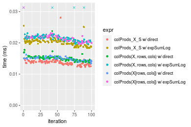


_Table: Benchmarking of colProds_X_S w/ direct() and rowProds_X_S w/ direct() on 10x10 data (original and transposed).  The top panel shows times in milliseconds and the bottom panel shows relative times._


|   |expr                   |    min|      lq|     mean|  median|     uq|    max|
|:--|:----------------------|------:|-------:|--------:|-------:|------:|------:|
|2  |rowProds_X_S w/ direct | 11.913| 12.9585| 13.43111| 13.4660| 13.849| 16.012|
|1  |colProds_X_S w/ direct | 12.254| 13.1940| 13.75122| 13.6505| 14.104| 28.068|


|   |expr                   |      min|       lq|     mean|   median|       uq|      max|
|:--|:----------------------|--------:|--------:|--------:|--------:|--------:|--------:|
|2  |rowProds_X_S w/ direct | 1.000000| 1.000000| 1.000000| 1.000000| 1.000000| 1.000000|
|1  |colProds_X_S w/ direct | 1.028624| 1.018173| 1.023834| 1.013701| 1.018413| 1.752935|

_Figure: Benchmarking of colProds_X_S w/ direct() and rowProds_X_S w/ direct() on 10x10 data (original and transposed).  Outliers are displayed as crosses. Times are in milliseconds._


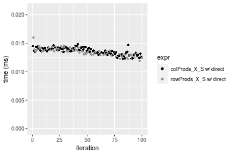

### 100x100 matrix


```r
> X <- data[["100x100"]]
> rows <- sample.int(nrow(X), size = nrow(X) * 0.7)
> cols <- sample.int(ncol(X), size = ncol(X) * 0.7)
> X_S <- X[rows, cols]
> colStats <- microbenchmark(`colProds_X_S w/ direct` = colProds(X_S, method = "direct", na.rm = FALSE), 
+     `colProds_X_S w/ expSumLog` = colProds(X_S, method = "expSumLog", na.rm = FALSE), `colProds(X, rows, cols) w/ direct` = colProds(X, 
+         rows = rows, cols = cols, method = "direct", na.rm = FALSE), `colProds(X, rows, cols) w/ expSumLog` = colProds(X, 
+         rows = rows, cols = cols, method = "expSumLog", na.rm = FALSE), `colProds(X[rows, cols]) w/ direct` = colProds(X[rows, 
+         cols], method = "direct", na.rm = FALSE), `colProds(X[rows, cols]) w/ expSumLog` = colProds(X[rows, 
+         cols], method = "expSumLog", na.rm = FALSE), unit = "ms")
> X <- t(X)
> X_S <- t(X_S)
> rowStats <- microbenchmark(`rowProds_X_S w/ direct` = rowProds(X_S, method = "direct", na.rm = FALSE), 
+     `rowProds_X_S w/ expSumLog` = rowProds(X_S, method = "expSumLog", na.rm = FALSE), `rowProds(X, cols, rows) w/ direct` = rowProds(X, 
+         rows = cols, cols = rows, method = "direct", na.rm = FALSE), `rowProds(X, cols, rows) w/ expSumLog` = rowProds(X, 
+         rows = cols, cols = rows, method = "expSumLog", na.rm = FALSE), `rowProds(X[cols, rows]) w/ direct` = rowProds(X[cols, 
+         rows], method = "direct", na.rm = FALSE), `rowProds(X[cols, rows]) w/ expSumLog` = rowProds(X[cols, 
+         rows], method = "expSumLog", na.rm = FALSE), unit = "ms")
```

_Table: Benchmarking of colProds_X_S w/ direct(), colProds_X_S w/ expSumLog(), colProds(X, rows, cols) w/ direct(), colProds(X, rows, cols) w/ expSumLog(), colProds(X[rows, cols]) w/ direct() and colProds(X[rows, cols]) w/ expSumLog() on 100x100 data. The top panel shows times in milliseconds and the bottom panel shows relative times._


|   |expr                                 |      min|       lq|      mean|    median|        uq|      max|
|:--|:------------------------------------|--------:|--------:|---------:|---------:|---------:|--------:|
|1  |colProds_X_S w/ direct               | 0.075356| 0.084892| 0.0912111| 0.0873035| 0.0955310| 0.170171|
|5  |colProds(X[rows, cols]) w/ direct    | 0.085624| 0.094628| 0.1028437| 0.0997975| 0.1070510| 0.178916|
|3  |colProds(X, rows, cols) w/ direct    | 0.085629| 0.094897| 0.1033043| 0.1000820| 0.1070860| 0.154112|
|2  |colProds_X_S w/ expSumLog            | 0.218350| 0.242647| 0.2648198| 0.2560175| 0.2707250| 0.408534|
|4  |colProds(X, rows, cols) w/ expSumLog | 0.229622| 0.249282| 0.2704413| 0.2660840| 0.2758485| 0.393942|
|6  |colProds(X[rows, cols]) w/ expSumLog | 0.228696| 0.249759| 0.2738163| 0.2682205| 0.2874275| 0.388222|


|   |expr                                 |      min|       lq|     mean|   median|       uq|       max|
|:--|:------------------------------------|--------:|--------:|--------:|--------:|--------:|---------:|
|1  |colProds_X_S w/ direct               | 1.000000| 1.000000| 1.000000| 1.000000| 1.000000| 1.0000000|
|5  |colProds(X[rows, cols]) w/ direct    | 1.136260| 1.114687| 1.127535| 1.143110| 1.120589| 1.0513895|
|3  |colProds(X, rows, cols) w/ direct    | 1.136326| 1.117856| 1.132586| 1.146369| 1.120955| 0.9056302|
|2  |colProds_X_S w/ expSumLog            | 2.897579| 2.858302| 2.903374| 2.932500| 2.833897| 2.4007263|
|4  |colProds(X, rows, cols) w/ expSumLog | 3.047163| 2.936460| 2.965006| 3.047804| 2.887529| 2.3149773|
|6  |colProds(X[rows, cols]) w/ expSumLog | 3.034874| 2.942079| 3.002008| 3.072277| 3.008735| 2.2813640|

_Table: Benchmarking of rowProds_X_S w/ direct(), rowProds_X_S w/ expSumLog(), rowProds(X, cols, rows) w/ direct(), rowProds(X, cols, rows) w/ expSumLog(), rowProds(X[cols, rows]) w/ direct() and rowProds(X[cols, rows]) w/ expSumLog() on 100x100 data (transposed). The top panel shows times in milliseconds and the bottom panel shows relative times._


|   |expr                                 |      min|        lq|      mean|    median|        uq|      max|
|:--|:------------------------------------|--------:|---------:|---------:|---------:|---------:|--------:|
|1  |rowProds_X_S w/ direct               | 0.088727| 0.0973980| 0.1051866| 0.1027635| 0.1091840| 0.157889|
|3  |rowProds(X, cols, rows) w/ direct    | 0.099244| 0.1074520| 0.1146477| 0.1123365| 0.1168475| 0.197033|
|5  |rowProds(X[cols, rows]) w/ direct    | 0.100435| 0.1103505| 0.1180430| 0.1158650| 0.1208215| 0.172637|
|2  |rowProds_X_S w/ expSumLog            | 0.233665| 0.2601110| 0.2832733| 0.2727490| 0.2879940| 0.441902|
|4  |rowProds(X, cols, rows) w/ expSumLog | 0.242296| 0.2695425| 0.2881091| 0.2842380| 0.2969920| 0.408022|
|6  |rowProds(X[cols, rows]) w/ expSumLog | 0.243808| 0.2691680| 0.2878549| 0.2845320| 0.2935565| 0.443428|


|   |expr                                 |      min|       lq|     mean|   median|       uq|      max|
|:--|:------------------------------------|--------:|--------:|--------:|--------:|--------:|--------:|
|1  |rowProds_X_S w/ direct               | 1.000000| 1.000000| 1.000000| 1.000000| 1.000000| 1.000000|
|3  |rowProds(X, cols, rows) w/ direct    | 1.118532| 1.103226| 1.089946| 1.093156| 1.070189| 1.247921|
|5  |rowProds(X[cols, rows]) w/ direct    | 1.131955| 1.132985| 1.122225| 1.127492| 1.106586| 1.093407|
|2  |rowProds_X_S w/ expSumLog            | 2.633528| 2.670599| 2.693056| 2.654143| 2.637694| 2.798814|
|4  |rowProds(X, cols, rows) w/ expSumLog | 2.730803| 2.767434| 2.739030| 2.765943| 2.720105| 2.584233|
|6  |rowProds(X[cols, rows]) w/ expSumLog | 2.747844| 2.763589| 2.736613| 2.768804| 2.688640| 2.808479|

_Figure: Benchmarking of colProds_X_S w/ direct(), colProds_X_S w/ expSumLog(), colProds(X, rows, cols) w/ direct(), colProds(X, rows, cols) w/ expSumLog(), colProds(X[rows, cols]) w/ direct() and colProds(X[rows, cols]) w/ expSumLog() on 100x100 data  as well as rowProds_X_S w/ direct(), rowProds_X_S w/ expSumLog(), rowProds(X, cols, rows) w/ direct(), rowProds(X, cols, rows) w/ expSumLog(), rowProds(X[cols, rows]) w/ direct() and rowProds(X[cols, rows]) w/ expSumLog() on the same data transposed.  Outliers are displayed as crosses.  Times are in milliseconds._


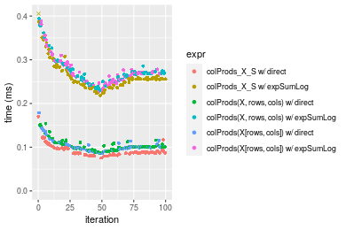

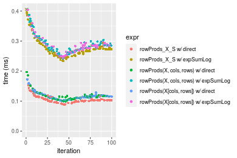
_Table: Benchmarking of colProds_X_S w/ direct() and rowProds_X_S w/ direct() on 100x100 data (original and transposed).  The top panel shows times in milliseconds and the bottom panel shows relative times._


|   |expr                   |    min|     lq|      mean|   median|      uq|     max|
|:--|:----------------------|------:|------:|---------:|--------:|-------:|-------:|
|1  |colProds_X_S w/ direct | 75.356| 84.892|  91.21106|  87.3035|  95.531| 170.171|
|2  |rowProds_X_S w/ direct | 88.727| 97.398| 105.18656| 102.7635| 109.184| 157.889|


|   |expr                   |      min|       lq|     mean|   median|       uq|       max|
|:--|:----------------------|--------:|--------:|--------:|--------:|--------:|---------:|
|1  |colProds_X_S w/ direct | 1.000000| 1.000000| 1.000000| 1.000000| 1.000000| 1.0000000|
|2  |rowProds_X_S w/ direct | 1.177438| 1.147317| 1.153222| 1.177083| 1.142917| 0.9278255|

_Figure: Benchmarking of colProds_X_S w/ direct() and rowProds_X_S w/ direct() on 100x100 data (original and transposed).  Outliers are displayed as crosses. Times are in milliseconds._


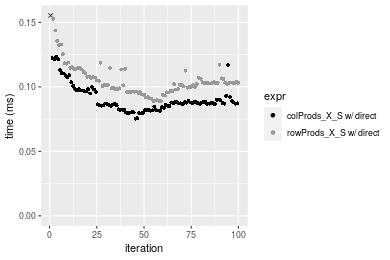

### 1000x10 matrix


```r
> X <- data[["1000x10"]]
> rows <- sample.int(nrow(X), size = nrow(X) * 0.7)
> cols <- sample.int(ncol(X), size = ncol(X) * 0.7)
> X_S <- X[rows, cols]
> colStats <- microbenchmark(`colProds_X_S w/ direct` = colProds(X_S, method = "direct", na.rm = FALSE), 
+     `colProds_X_S w/ expSumLog` = colProds(X_S, method = "expSumLog", na.rm = FALSE), `colProds(X, rows, cols) w/ direct` = colProds(X, 
+         rows = rows, cols = cols, method = "direct", na.rm = FALSE), `colProds(X, rows, cols) w/ expSumLog` = colProds(X, 
+         rows = rows, cols = cols, method = "expSumLog", na.rm = FALSE), `colProds(X[rows, cols]) w/ direct` = colProds(X[rows, 
+         cols], method = "direct", na.rm = FALSE), `colProds(X[rows, cols]) w/ expSumLog` = colProds(X[rows, 
+         cols], method = "expSumLog", na.rm = FALSE), unit = "ms")
> X <- t(X)
> X_S <- t(X_S)
> rowStats <- microbenchmark(`rowProds_X_S w/ direct` = rowProds(X_S, method = "direct", na.rm = FALSE), 
+     `rowProds_X_S w/ expSumLog` = rowProds(X_S, method = "expSumLog", na.rm = FALSE), `rowProds(X, cols, rows) w/ direct` = rowProds(X, 
+         rows = cols, cols = rows, method = "direct", na.rm = FALSE), `rowProds(X, cols, rows) w/ expSumLog` = rowProds(X, 
+         rows = cols, cols = rows, method = "expSumLog", na.rm = FALSE), `rowProds(X[cols, rows]) w/ direct` = rowProds(X[cols, 
+         rows], method = "direct", na.rm = FALSE), `rowProds(X[cols, rows]) w/ expSumLog` = rowProds(X[cols, 
+         rows], method = "expSumLog", na.rm = FALSE), unit = "ms")
```

_Table: Benchmarking of colProds_X_S w/ direct(), colProds_X_S w/ expSumLog(), colProds(X, rows, cols) w/ direct(), colProds(X, rows, cols) w/ expSumLog(), colProds(X[rows, cols]) w/ direct() and colProds(X[rows, cols]) w/ expSumLog() on 1000x10 data. The top panel shows times in milliseconds and the bottom panel shows relative times._


|   |expr                                 |      min|        lq|      mean|    median|        uq|      max|
|:--|:------------------------------------|--------:|---------:|---------:|---------:|---------:|--------:|
|1  |colProds_X_S w/ direct               | 0.028526| 0.0308240| 0.0360477| 0.0355155| 0.0382975| 0.052117|
|5  |colProds(X[rows, cols]) w/ direct    | 0.039119| 0.0415805| 0.0480739| 0.0453655| 0.0524895| 0.075894|
|3  |colProds(X, rows, cols) w/ direct    | 0.039761| 0.0426775| 0.0499539| 0.0499970| 0.0526570| 0.080116|
|2  |colProds_X_S w/ expSumLog            | 0.138421| 0.1477160| 0.1655872| 0.1563490| 0.1759780| 0.234236|
|6  |colProds(X[rows, cols]) w/ expSumLog | 0.149783| 0.1591435| 0.1806083| 0.1698540| 0.1959150| 0.302452|
|4  |colProds(X, rows, cols) w/ expSumLog | 0.150513| 0.1602845| 0.1831992| 0.1822420| 0.1964585| 0.246771|


|   |expr                                 |      min|       lq|     mean|   median|       uq|      max|
|:--|:------------------------------------|--------:|--------:|--------:|--------:|--------:|--------:|
|1  |colProds_X_S w/ direct               | 1.000000| 1.000000| 1.000000| 1.000000| 1.000000| 1.000000|
|5  |colProds(X[rows, cols]) w/ direct    | 1.371345| 1.348965| 1.333621| 1.277344| 1.370572| 1.456223|
|3  |colProds(X, rows, cols) w/ direct    | 1.393851| 1.384554| 1.385772| 1.407752| 1.374946| 1.537233|
|2  |colProds_X_S w/ expSumLog            | 4.852450| 4.792240| 4.593559| 4.402275| 4.595026| 4.494426|
|6  |colProds(X[rows, cols]) w/ expSumLog | 5.250754| 5.162974| 5.010261| 4.782532| 5.115608| 5.803327|
|4  |colProds(X, rows, cols) w/ expSumLog | 5.276344| 5.199990| 5.082135| 5.131337| 5.129800| 4.734942|

_Table: Benchmarking of rowProds_X_S w/ direct(), rowProds_X_S w/ expSumLog(), rowProds(X, cols, rows) w/ direct(), rowProds(X, cols, rows) w/ expSumLog(), rowProds(X[cols, rows]) w/ direct() and rowProds(X[cols, rows]) w/ expSumLog() on 1000x10 data (transposed). The top panel shows times in milliseconds and the bottom panel shows relative times._


|   |expr                                 |      min|        lq|      mean|    median|        uq|      max|
|:--|:------------------------------------|--------:|---------:|---------:|---------:|---------:|--------:|
|1  |rowProds_X_S w/ direct               | 0.041530| 0.0440780| 0.0501652| 0.0464435| 0.0537505| 0.070249|
|5  |rowProds(X[cols, rows]) w/ direct    | 0.053872| 0.0578740| 0.0650592| 0.0627805| 0.0709960| 0.090010|
|3  |rowProds(X, cols, rows) w/ direct    | 0.053912| 0.0589770| 0.0660756| 0.0647760| 0.0695765| 0.094357|
|2  |rowProds_X_S w/ expSumLog            | 0.153034| 0.1656715| 0.1876841| 0.1822315| 0.1993470| 0.290609|
|6  |rowProds(X[cols, rows]) w/ expSumLog | 0.164987| 0.1755245| 0.1970204| 0.1838890| 0.2130140| 0.296501|
|4  |rowProds(X, cols, rows) w/ expSumLog | 0.165902| 0.1765130| 0.2007746| 0.1866730| 0.2179445| 0.275991|


|   |expr                                 |      min|       lq|     mean|   median|       uq|      max|
|:--|:------------------------------------|--------:|--------:|--------:|--------:|--------:|--------:|
|1  |rowProds_X_S w/ direct               | 1.000000| 1.000000| 1.000000| 1.000000| 1.000000| 1.000000|
|5  |rowProds(X[cols, rows]) w/ direct    | 1.297183| 1.312991| 1.296898| 1.351761| 1.320844| 1.281299|
|3  |rowProds(X, cols, rows) w/ direct    | 1.298146| 1.338014| 1.317158| 1.394727| 1.294434| 1.343179|
|2  |rowProds_X_S w/ expSumLog            | 3.684903| 3.758598| 3.741317| 3.923725| 3.708747| 4.136842|
|6  |rowProds(X[cols, rows]) w/ expSumLog | 3.972719| 3.982134| 3.927428| 3.959413| 3.963014| 4.220715|
|4  |rowProds(X, cols, rows) w/ expSumLog | 3.994751| 4.004560| 4.002266| 4.019357| 4.054744| 3.928753|

_Figure: Benchmarking of colProds_X_S w/ direct(), colProds_X_S w/ expSumLog(), colProds(X, rows, cols) w/ direct(), colProds(X, rows, cols) w/ expSumLog(), colProds(X[rows, cols]) w/ direct() and colProds(X[rows, cols]) w/ expSumLog() on 1000x10 data  as well as rowProds_X_S w/ direct(), rowProds_X_S w/ expSumLog(), rowProds(X, cols, rows) w/ direct(), rowProds(X, cols, rows) w/ expSumLog(), rowProds(X[cols, rows]) w/ direct() and rowProds(X[cols, rows]) w/ expSumLog() on the same data transposed.  Outliers are displayed as crosses.  Times are in milliseconds._


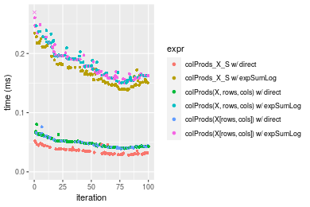

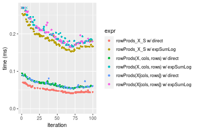
_Table: Benchmarking of colProds_X_S w/ direct() and rowProds_X_S w/ direct() on 1000x10 data (original and transposed).  The top panel shows times in milliseconds and the bottom panel shows relative times._


|   |expr                   |    min|     lq|     mean|  median|      uq|    max|
|:--|:----------------------|------:|------:|--------:|-------:|-------:|------:|
|1  |colProds_X_S w/ direct | 28.526| 30.824| 36.04769| 35.5155| 38.2975| 52.117|
|2  |rowProds_X_S w/ direct | 41.530| 44.078| 50.16525| 46.4435| 53.7505| 70.249|


|   |expr                   |      min|      lq|     mean|   median|       uq|     max|
|:--|:----------------------|--------:|-------:|--------:|--------:|--------:|-------:|
|1  |colProds_X_S w/ direct | 1.000000| 1.00000| 1.000000| 1.000000| 1.000000| 1.00000|
|2  |rowProds_X_S w/ direct | 1.455865| 1.42999| 1.391636| 1.307697| 1.403499| 1.34791|

_Figure: Benchmarking of colProds_X_S w/ direct() and rowProds_X_S w/ direct() on 1000x10 data (original and transposed).  Outliers are displayed as crosses. Times are in milliseconds._


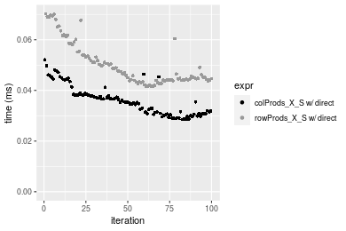

### 10x1000 matrix


```r
> X <- data[["10x1000"]]
> rows <- sample.int(nrow(X), size = nrow(X) * 0.7)
> cols <- sample.int(ncol(X), size = ncol(X) * 0.7)
> X_S <- X[rows, cols]
> colStats <- microbenchmark(`colProds_X_S w/ direct` = colProds(X_S, method = "direct", na.rm = FALSE), 
+     `colProds_X_S w/ expSumLog` = colProds(X_S, method = "expSumLog", na.rm = FALSE), `colProds(X, rows, cols) w/ direct` = colProds(X, 
+         rows = rows, cols = cols, method = "direct", na.rm = FALSE), `colProds(X, rows, cols) w/ expSumLog` = colProds(X, 
+         rows = rows, cols = cols, method = "expSumLog", na.rm = FALSE), `colProds(X[rows, cols]) w/ direct` = colProds(X[rows, 
+         cols], method = "direct", na.rm = FALSE), `colProds(X[rows, cols]) w/ expSumLog` = colProds(X[rows, 
+         cols], method = "expSumLog", na.rm = FALSE), unit = "ms")
> X <- t(X)
> X_S <- t(X_S)
> rowStats <- microbenchmark(`rowProds_X_S w/ direct` = rowProds(X_S, method = "direct", na.rm = FALSE), 
+     `rowProds_X_S w/ expSumLog` = rowProds(X_S, method = "expSumLog", na.rm = FALSE), `rowProds(X, cols, rows) w/ direct` = rowProds(X, 
+         rows = cols, cols = rows, method = "direct", na.rm = FALSE), `rowProds(X, cols, rows) w/ expSumLog` = rowProds(X, 
+         rows = cols, cols = rows, method = "expSumLog", na.rm = FALSE), `rowProds(X[cols, rows]) w/ direct` = rowProds(X[cols, 
+         rows], method = "direct", na.rm = FALSE), `rowProds(X[cols, rows]) w/ expSumLog` = rowProds(X[cols, 
+         rows], method = "expSumLog", na.rm = FALSE), unit = "ms")
```

_Table: Benchmarking of colProds_X_S w/ direct(), colProds_X_S w/ expSumLog(), colProds(X, rows, cols) w/ direct(), colProds(X, rows, cols) w/ expSumLog(), colProds(X[rows, cols]) w/ direct() and colProds(X[rows, cols]) w/ expSumLog() on 10x1000 data. The top panel shows times in milliseconds and the bottom panel shows relative times._


|   |expr                                 |      min|        lq|      mean|    median|        uq|      max|
|:--|:------------------------------------|--------:|---------:|---------:|---------:|---------:|--------:|
|1  |colProds_X_S w/ direct               | 0.525756| 0.6323360| 0.6559065| 0.6511925| 0.6745010| 0.896585|
|5  |colProds(X[rows, cols]) w/ direct    | 0.557986| 0.6459375| 0.7152804| 0.6643885| 0.6815345| 5.973052|
|3  |colProds(X, rows, cols) w/ direct    | 0.556517| 0.6539165| 0.6759455| 0.6697385| 0.6930740| 0.898400|
|2  |colProds_X_S w/ expSumLog            | 1.026312| 1.1686805| 1.2133229| 1.1991765| 1.2420445| 1.600904|
|6  |colProds(X[rows, cols]) w/ expSumLog | 1.044535| 1.1885215| 1.2693525| 1.2119165| 1.2469120| 6.639532|
|4  |colProds(X, rows, cols) w/ expSumLog | 0.974945| 1.1750930| 1.2145190| 1.2161365| 1.2562875| 1.622386|


|   |expr                                 |      min|       lq|     mean|   median|       uq|      max|
|:--|:------------------------------------|--------:|--------:|--------:|--------:|--------:|--------:|
|1  |colProds_X_S w/ direct               | 1.000000| 1.000000| 1.000000| 1.000000| 1.000000| 1.000000|
|5  |colProds(X[rows, cols]) w/ direct    | 1.061302| 1.021510| 1.090522| 1.020264| 1.010428| 6.662003|
|3  |colProds(X, rows, cols) w/ direct    | 1.058508| 1.034128| 1.030552| 1.028480| 1.027536| 1.002024|
|2  |colProds_X_S w/ expSumLog            | 1.952069| 1.848195| 1.849841| 1.841508| 1.841427| 1.785557|
|6  |colProds(X[rows, cols]) w/ expSumLog | 1.986730| 1.879573| 1.935264| 1.861073| 1.848644| 7.405357|
|4  |colProds(X, rows, cols) w/ expSumLog | 1.854368| 1.858336| 1.851665| 1.867553| 1.862544| 1.809517|

_Table: Benchmarking of rowProds_X_S w/ direct(), rowProds_X_S w/ expSumLog(), rowProds(X, cols, rows) w/ direct(), rowProds(X, cols, rows) w/ expSumLog(), rowProds(X[cols, rows]) w/ direct() and rowProds(X[cols, rows]) w/ expSumLog() on 10x1000 data (transposed). The top panel shows times in milliseconds and the bottom panel shows relative times._


|   |expr                                 |      min|        lq|      mean|    median|        uq|      max|
|:--|:------------------------------------|--------:|---------:|---------:|---------:|---------:|--------:|
|1  |rowProds_X_S w/ direct               | 0.557322| 0.6473255| 0.7267380| 0.6648705| 0.6913685| 6.163101|
|5  |rowProds(X[cols, rows]) w/ direct    | 0.555565| 0.6551515| 0.6781582| 0.6702035| 0.6895050| 0.873777|
|3  |rowProds(X, cols, rows) w/ direct    | 0.541358| 0.6549870| 0.7365054| 0.6732120| 0.6952990| 6.095395|
|2  |rowProds_X_S w/ expSumLog            | 1.008335| 1.1730865| 1.2041849| 1.1965245| 1.2347695| 1.582484|
|4  |rowProds(X, cols, rows) w/ expSumLog | 1.039314| 1.1907545| 1.2438429| 1.2149530| 1.2547920| 2.188572|
|6  |rowProds(X[cols, rows]) w/ expSumLog | 1.018895| 1.2001285| 1.2292273| 1.2224570| 1.2574410| 1.558981|


|   |expr                                 |       min|       lq|      mean|   median|        uq|       max|
|:--|:------------------------------------|---------:|--------:|---------:|--------:|---------:|---------:|
|1  |rowProds_X_S w/ direct               | 1.0000000| 1.000000| 1.0000000| 1.000000| 1.0000000| 1.0000000|
|5  |rowProds(X[cols, rows]) w/ direct    | 0.9968474| 1.012090| 0.9331536| 1.008021| 0.9973046| 0.1417755|
|3  |rowProds(X, cols, rows) w/ direct    | 0.9713559| 1.011836| 1.0134400| 1.012546| 1.0056851| 0.9890143|
|2  |rowProds_X_S w/ expSumLog            | 1.8092503| 1.812205| 1.6569725| 1.799635| 1.7859788| 0.2567675|
|4  |rowProds(X, cols, rows) w/ expSumLog | 1.8648358| 1.839499| 1.7115424| 1.827353| 1.8149395| 0.3551089|
|6  |rowProds(X[cols, rows]) w/ expSumLog | 1.8281981| 1.853980| 1.6914311| 1.838639| 1.8187710| 0.2529540|

_Figure: Benchmarking of colProds_X_S w/ direct(), colProds_X_S w/ expSumLog(), colProds(X, rows, cols) w/ direct(), colProds(X, rows, cols) w/ expSumLog(), colProds(X[rows, cols]) w/ direct() and colProds(X[rows, cols]) w/ expSumLog() on 10x1000 data  as well as rowProds_X_S w/ direct(), rowProds_X_S w/ expSumLog(), rowProds(X, cols, rows) w/ direct(), rowProds(X, cols, rows) w/ expSumLog(), rowProds(X[cols, rows]) w/ direct() and rowProds(X[cols, rows]) w/ expSumLog() on the same data transposed.  Outliers are displayed as crosses.  Times are in milliseconds._


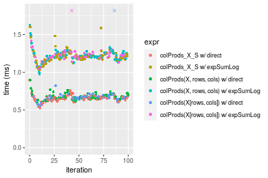

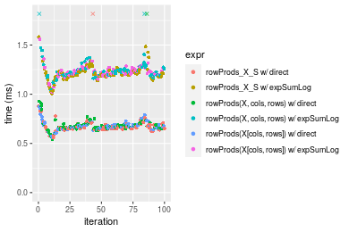
_Table: Benchmarking of colProds_X_S w/ direct() and rowProds_X_S w/ direct() on 10x1000 data (original and transposed).  The top panel shows times in milliseconds and the bottom panel shows relative times._


|   |expr                   |     min|       lq|     mean|   median|       uq|      max|
|:--|:----------------------|-------:|--------:|--------:|--------:|--------:|--------:|
|1  |colProds_X_S w/ direct | 525.756| 632.3360| 655.9065| 651.1925| 674.5010|  896.585|
|2  |rowProds_X_S w/ direct | 557.322| 647.3255| 726.7380| 664.8705| 691.3685| 6163.101|


|   |expr                   |      min|       lq|    mean|   median|       uq|      max|
|:--|:----------------------|--------:|--------:|-------:|--------:|--------:|--------:|
|1  |colProds_X_S w/ direct | 1.000000| 1.000000| 1.00000| 1.000000| 1.000000| 1.000000|
|2  |rowProds_X_S w/ direct | 1.060039| 1.023705| 1.10799| 1.021005| 1.025007| 6.873973|

_Figure: Benchmarking of colProds_X_S w/ direct() and rowProds_X_S w/ direct() on 10x1000 data (original and transposed).  Outliers are displayed as crosses. Times are in milliseconds._


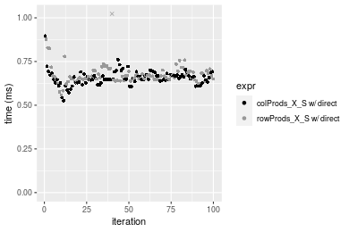

### 100x1000 matrix


```r
> X <- data[["100x1000"]]
> rows <- sample.int(nrow(X), size = nrow(X) * 0.7)
> cols <- sample.int(ncol(X), size = ncol(X) * 0.7)
> X_S <- X[rows, cols]
> colStats <- microbenchmark(`colProds_X_S w/ direct` = colProds(X_S, method = "direct", na.rm = FALSE), 
+     `colProds_X_S w/ expSumLog` = colProds(X_S, method = "expSumLog", na.rm = FALSE), `colProds(X, rows, cols) w/ direct` = colProds(X, 
+         rows = rows, cols = cols, method = "direct", na.rm = FALSE), `colProds(X, rows, cols) w/ expSumLog` = colProds(X, 
+         rows = rows, cols = cols, method = "expSumLog", na.rm = FALSE), `colProds(X[rows, cols]) w/ direct` = colProds(X[rows, 
+         cols], method = "direct", na.rm = FALSE), `colProds(X[rows, cols]) w/ expSumLog` = colProds(X[rows, 
+         cols], method = "expSumLog", na.rm = FALSE), unit = "ms")
> X <- t(X)
> X_S <- t(X_S)
> rowStats <- microbenchmark(`rowProds_X_S w/ direct` = rowProds(X_S, method = "direct", na.rm = FALSE), 
+     `rowProds_X_S w/ expSumLog` = rowProds(X_S, method = "expSumLog", na.rm = FALSE), `rowProds(X, cols, rows) w/ direct` = rowProds(X, 
+         rows = cols, cols = rows, method = "direct", na.rm = FALSE), `rowProds(X, cols, rows) w/ expSumLog` = rowProds(X, 
+         rows = cols, cols = rows, method = "expSumLog", na.rm = FALSE), `rowProds(X[cols, rows]) w/ direct` = rowProds(X[cols, 
+         rows], method = "direct", na.rm = FALSE), `rowProds(X[cols, rows]) w/ expSumLog` = rowProds(X[cols, 
+         rows], method = "expSumLog", na.rm = FALSE), unit = "ms")
```

_Table: Benchmarking of colProds_X_S w/ direct(), colProds_X_S w/ expSumLog(), colProds(X, rows, cols) w/ direct(), colProds(X, rows, cols) w/ expSumLog(), colProds(X[rows, cols]) w/ direct() and colProds(X[rows, cols]) w/ expSumLog() on 100x1000 data. The top panel shows times in milliseconds and the bottom panel shows relative times._


|   |expr                                 |      min|       lq|      mean|    median|        uq|       max|
|:--|:------------------------------------|--------:|--------:|---------:|---------:|---------:|---------:|
|1  |colProds_X_S w/ direct               | 0.774959| 0.844722| 0.8739614| 0.8539230| 0.8751675|  1.623594|
|3  |colProds(X, rows, cols) w/ direct    | 0.813472| 0.964379| 0.9896130| 0.9757085| 0.9969175|  1.469689|
|5  |colProds(X[rows, cols]) w/ direct    | 0.834291| 0.967196| 0.9962637| 0.9782095| 1.0019710|  1.786837|
|2  |colProds_X_S w/ expSumLog            | 2.246616| 2.570511| 2.6092187| 2.5963635| 2.6609010|  3.233377|
|6  |colProds(X[rows, cols]) w/ expSumLog | 2.285602| 2.697354| 2.9305741| 2.7201430| 2.7646495| 24.938368|
|4  |colProds(X, rows, cols) w/ expSumLog | 2.438107| 2.709574| 3.1867407| 2.7205825| 2.7718770| 24.639916|


|   |expr                                 |      min|       lq|     mean|   median|       uq|        max|
|:--|:------------------------------------|--------:|--------:|--------:|--------:|--------:|----------:|
|1  |colProds_X_S w/ direct               | 1.000000| 1.000000| 1.000000| 1.000000| 1.000000|  1.0000000|
|3  |colProds(X, rows, cols) w/ direct    | 1.049697| 1.141652| 1.132330| 1.142619| 1.139116|  0.9052072|
|5  |colProds(X[rows, cols]) w/ direct    | 1.076561| 1.144987| 1.139940| 1.145548| 1.144891|  1.1005442|
|2  |colProds_X_S w/ expSumLog            | 2.899013| 3.043026| 2.985508| 3.040512| 3.040448|  1.9914936|
|6  |colProds(X[rows, cols]) w/ expSumLog | 2.949320| 3.193185| 3.353208| 3.185466| 3.158995| 15.3599779|
|4  |colProds(X, rows, cols) w/ expSumLog | 3.146111| 3.207652| 3.646317| 3.185981| 3.167253| 15.1761561|

_Table: Benchmarking of rowProds_X_S w/ direct(), rowProds_X_S w/ expSumLog(), rowProds(X, cols, rows) w/ direct(), rowProds(X, cols, rows) w/ expSumLog(), rowProds(X[cols, rows]) w/ direct() and rowProds(X[cols, rows]) w/ expSumLog() on 100x1000 data (transposed). The top panel shows times in milliseconds and the bottom panel shows relative times._


|   |expr                                 |      min|       lq|     mean|   median|       uq|       max|
|:--|:------------------------------------|--------:|--------:|--------:|--------:|--------:|---------:|
|1  |rowProds_X_S w/ direct               | 0.913361| 1.016366| 1.059492| 1.042142| 1.086821|  1.563300|
|5  |rowProds(X[cols, rows]) w/ direct    | 1.042259| 1.194009| 1.227772| 1.218082| 1.237332|  1.593861|
|3  |rowProds(X, cols, rows) w/ direct    | 1.048832| 1.193943| 1.661884| 1.219029| 1.239256| 23.048014|
|2  |rowProds_X_S w/ expSumLog            | 2.401771| 2.740555| 2.997389| 2.781973| 2.824940| 23.381652|
|4  |rowProds(X, cols, rows) w/ expSumLog | 2.609489| 2.890916| 2.954931| 2.960818| 2.985603|  4.448444|
|6  |rowProds(X[cols, rows]) w/ expSumLog | 2.579001| 2.893291| 2.973974| 2.972091| 3.000861|  4.290152|


|   |expr                                 |      min|       lq|     mean|   median|       uq|       max|
|:--|:------------------------------------|--------:|--------:|--------:|--------:|--------:|---------:|
|1  |rowProds_X_S w/ direct               | 1.000000| 1.000000| 1.000000| 1.000000| 1.000000|  1.000000|
|5  |rowProds(X[cols, rows]) w/ direct    | 1.141125| 1.174784| 1.158831| 1.168825| 1.138488|  1.019549|
|3  |rowProds(X, cols, rows) w/ direct    | 1.148321| 1.174718| 1.568566| 1.169733| 1.140258| 14.743180|
|2  |rowProds_X_S w/ expSumLog            | 2.629597| 2.696426| 2.829081| 2.669475| 2.599269| 14.956599|
|4  |rowProds(X, cols, rows) w/ expSumLog | 2.857018| 2.844367| 2.789007| 2.841087| 2.747097|  2.845547|
|6  |rowProds(X[cols, rows]) w/ expSumLog | 2.823638| 2.846703| 2.806980| 2.851905| 2.761136|  2.744292|

_Figure: Benchmarking of colProds_X_S w/ direct(), colProds_X_S w/ expSumLog(), colProds(X, rows, cols) w/ direct(), colProds(X, rows, cols) w/ expSumLog(), colProds(X[rows, cols]) w/ direct() and colProds(X[rows, cols]) w/ expSumLog() on 100x1000 data  as well as rowProds_X_S w/ direct(), rowProds_X_S w/ expSumLog(), rowProds(X, cols, rows) w/ direct(), rowProds(X, cols, rows) w/ expSumLog(), rowProds(X[cols, rows]) w/ direct() and rowProds(X[cols, rows]) w/ expSumLog() on the same data transposed.  Outliers are displayed as crosses.  Times are in milliseconds._


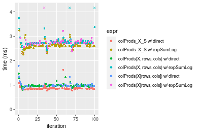

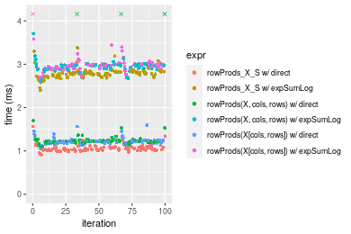
_Table: Benchmarking of colProds_X_S w/ direct() and rowProds_X_S w/ direct() on 100x1000 data (original and transposed).  The top panel shows times in milliseconds and the bottom panel shows relative times._


|   |expr                   |     min|       lq|      mean|   median|        uq|      max|
|:--|:----------------------|-------:|--------:|---------:|--------:|---------:|--------:|
|1  |colProds_X_S w/ direct | 774.959|  844.722|  873.9614|  853.923|  875.1675| 1623.594|
|2  |rowProds_X_S w/ direct | 913.361| 1016.365| 1059.4923| 1042.142| 1086.8210| 1563.300|


|   |expr                   |      min|       lq|     mean|   median|       uq|       max|
|:--|:----------------------|--------:|--------:|--------:|--------:|--------:|---------:|
|1  |colProds_X_S w/ direct | 1.000000| 1.000000| 1.000000| 1.000000| 1.000000| 1.0000000|
|2  |rowProds_X_S w/ direct | 1.178593| 1.203195| 1.212287| 1.220417| 1.241843| 0.9628639|

_Figure: Benchmarking of colProds_X_S w/ direct() and rowProds_X_S w/ direct() on 100x1000 data (original and transposed).  Outliers are displayed as crosses. Times are in milliseconds._


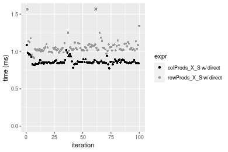

### 1000x100 matrix


```r
> X <- data[["1000x100"]]
> rows <- sample.int(nrow(X), size = nrow(X) * 0.7)
> cols <- sample.int(ncol(X), size = ncol(X) * 0.7)
> X_S <- X[rows, cols]
> colStats <- microbenchmark(`colProds_X_S w/ direct` = colProds(X_S, method = "direct", na.rm = FALSE), 
+     `colProds_X_S w/ expSumLog` = colProds(X_S, method = "expSumLog", na.rm = FALSE), `colProds(X, rows, cols) w/ direct` = colProds(X, 
+         rows = rows, cols = cols, method = "direct", na.rm = FALSE), `colProds(X, rows, cols) w/ expSumLog` = colProds(X, 
+         rows = rows, cols = cols, method = "expSumLog", na.rm = FALSE), `colProds(X[rows, cols]) w/ direct` = colProds(X[rows, 
+         cols], method = "direct", na.rm = FALSE), `colProds(X[rows, cols]) w/ expSumLog` = colProds(X[rows, 
+         cols], method = "expSumLog", na.rm = FALSE), unit = "ms")
> X <- t(X)
> X_S <- t(X_S)
> rowStats <- microbenchmark(`rowProds_X_S w/ direct` = rowProds(X_S, method = "direct", na.rm = FALSE), 
+     `rowProds_X_S w/ expSumLog` = rowProds(X_S, method = "expSumLog", na.rm = FALSE), `rowProds(X, cols, rows) w/ direct` = rowProds(X, 
+         rows = cols, cols = rows, method = "direct", na.rm = FALSE), `rowProds(X, cols, rows) w/ expSumLog` = rowProds(X, 
+         rows = cols, cols = rows, method = "expSumLog", na.rm = FALSE), `rowProds(X[cols, rows]) w/ direct` = rowProds(X[cols, 
+         rows], method = "direct", na.rm = FALSE), `rowProds(X[cols, rows]) w/ expSumLog` = rowProds(X[cols, 
+         rows], method = "expSumLog", na.rm = FALSE), unit = "ms")
```

_Table: Benchmarking of colProds_X_S w/ direct(), colProds_X_S w/ expSumLog(), colProds(X, rows, cols) w/ direct(), colProds(X, rows, cols) w/ expSumLog(), colProds(X[rows, cols]) w/ direct() and colProds(X[rows, cols]) w/ expSumLog() on 1000x100 data. The top panel shows times in milliseconds and the bottom panel shows relative times._


|   |expr                                 |      min|        lq|      mean|    median|        uq|       max|
|:--|:------------------------------------|--------:|---------:|---------:|---------:|---------:|---------:|
|1  |colProds_X_S w/ direct               | 0.247535| 0.2864045| 0.3006736| 0.2983275| 0.3055005|  0.429981|
|3  |colProds(X, rows, cols) w/ direct    | 0.342335| 0.4017270| 0.5006887| 0.4139185| 0.4224000|  8.813239|
|5  |colProds(X[rows, cols]) w/ direct    | 0.342518| 0.4034985| 0.4177472| 0.4147195| 0.4212925|  0.533589|
|2  |colProds_X_S w/ expSumLog            | 1.396613| 1.6018535| 1.6379117| 1.6374335| 1.6580245|  2.268643|
|6  |colProds(X[rows, cols]) w/ expSumLog | 1.448869| 1.7157955| 1.7562088| 1.7664835| 1.7812070|  2.511134|
|4  |colProds(X, rows, cols) w/ expSumLog | 1.476296| 1.7162295| 1.8439057| 1.7686895| 1.7886480| 10.177295|


|   |expr                                 |      min|       lq|     mean|   median|       uq|       max|
|:--|:------------------------------------|--------:|--------:|--------:|--------:|--------:|---------:|
|1  |colProds_X_S w/ direct               | 1.000000| 1.000000| 1.000000| 1.000000| 1.000000|  1.000000|
|3  |colProds(X, rows, cols) w/ direct    | 1.382976| 1.402656| 1.665224| 1.387463| 1.382649| 20.496810|
|5  |colProds(X[rows, cols]) w/ direct    | 1.383715| 1.408841| 1.389371| 1.390148| 1.379024|  1.240959|
|2  |colProds_X_S w/ expSumLog            | 5.642083| 5.592976| 5.447475| 5.488711| 5.427240|  5.276147|
|6  |colProds(X[rows, cols]) w/ expSumLog | 5.853188| 5.990812| 5.840915| 5.921290| 5.830455|  5.840105|
|4  |colProds(X, rows, cols) w/ expSumLog | 5.963989| 5.992327| 6.132583| 5.928684| 5.854812| 23.669174|

_Table: Benchmarking of rowProds_X_S w/ direct(), rowProds_X_S w/ expSumLog(), rowProds(X, cols, rows) w/ direct(), rowProds(X, cols, rows) w/ expSumLog(), rowProds(X[cols, rows]) w/ direct() and rowProds(X[cols, rows]) w/ expSumLog() on 1000x100 data (transposed). The top panel shows times in milliseconds and the bottom panel shows relative times._


|   |expr                                 |      min|       lq|      mean|    median|        uq|       max|
|:--|:------------------------------------|--------:|--------:|---------:|---------:|---------:|---------:|
|1  |rowProds_X_S w/ direct               | 0.390746| 0.444243| 0.4581356| 0.4504080| 0.4613310|  0.694193|
|5  |rowProds(X[cols, rows]) w/ direct    | 0.518946| 0.567984| 0.5842130| 0.5797555| 0.5949395|  0.768634|
|3  |rowProds(X, cols, rows) w/ direct    | 0.511310| 0.574356| 0.5860074| 0.5828950| 0.5970945|  0.780831|
|2  |rowProds_X_S w/ expSumLog            | 1.520620| 1.774465| 1.8033133| 1.7854080| 1.8323560|  2.430712|
|6  |rowProds(X[cols, rows]) w/ expSumLog | 1.670471| 1.900571| 2.0210632| 1.9154820| 1.9619530| 10.756083|
|4  |rowProds(X, cols, rows) w/ expSumLog | 1.616773| 1.897766| 2.0081928| 1.9326720| 1.9656200| 10.708158|


|   |expr                                 |      min|       lq|     mean|   median|       uq|       max|
|:--|:------------------------------------|--------:|--------:|--------:|--------:|--------:|---------:|
|1  |rowProds_X_S w/ direct               | 1.000000| 1.000000| 1.000000| 1.000000| 1.000000|  1.000000|
|5  |rowProds(X[cols, rows]) w/ direct    | 1.328090| 1.278544| 1.275197| 1.287179| 1.289615|  1.107234|
|3  |rowProds(X, cols, rows) w/ direct    | 1.308548| 1.292887| 1.279114| 1.294149| 1.294286|  1.124804|
|2  |rowProds_X_S w/ expSumLog            | 3.891582| 3.994357| 3.936200| 3.963979| 3.971890|  3.501493|
|6  |rowProds(X[cols, rows]) w/ expSumLog | 4.275081| 4.278224| 4.411496| 4.252771| 4.252810| 15.494370|
|4  |rowProds(X, cols, rows) w/ expSumLog | 4.137657| 4.271910| 4.383403| 4.290936| 4.260758| 15.425333|

_Figure: Benchmarking of colProds_X_S w/ direct(), colProds_X_S w/ expSumLog(), colProds(X, rows, cols) w/ direct(), colProds(X, rows, cols) w/ expSumLog(), colProds(X[rows, cols]) w/ direct() and colProds(X[rows, cols]) w/ expSumLog() on 1000x100 data  as well as rowProds_X_S w/ direct(), rowProds_X_S w/ expSumLog(), rowProds(X, cols, rows) w/ direct(), rowProds(X, cols, rows) w/ expSumLog(), rowProds(X[cols, rows]) w/ direct() and rowProds(X[cols, rows]) w/ expSumLog() on the same data transposed.  Outliers are displayed as crosses.  Times are in milliseconds._


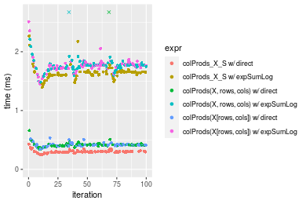

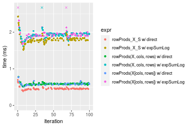
_Table: Benchmarking of colProds_X_S w/ direct() and rowProds_X_S w/ direct() on 1000x100 data (original and transposed).  The top panel shows times in milliseconds and the bottom panel shows relative times._


|   |expr                   |     min|       lq|     mean|   median|       uq|     max|
|:--|:----------------------|-------:|--------:|--------:|--------:|--------:|-------:|
|1  |colProds_X_S w/ direct | 247.535| 286.4045| 300.6736| 298.3275| 305.5005| 429.981|
|2  |rowProds_X_S w/ direct | 390.746| 444.2430| 458.1356| 450.4080| 461.3310| 694.193|


|   |expr                   |      min|       lq|     mean|   median|       uq|      max|
|:--|:----------------------|--------:|--------:|--------:|--------:|--------:|--------:|
|1  |colProds_X_S w/ direct | 1.000000| 1.000000| 1.000000| 1.000000| 1.000000| 1.000000|
|2  |rowProds_X_S w/ direct | 1.578548| 1.551103| 1.523698| 1.509777| 1.510083| 1.614474|

_Figure: Benchmarking of colProds_X_S w/ direct() and rowProds_X_S w/ direct() on 1000x100 data (original and transposed).  Outliers are displayed as crosses. Times are in milliseconds._


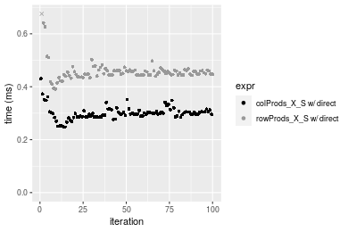


## Appendix

### Session information
```r
R version 4.1.1 Patched (2021-08-10 r80727)
Platform: x86_64-pc-linux-gnu (64-bit)
Running under: Ubuntu 18.04.5 LTS

Matrix products: default
BLAS:   /home/hb/software/R-devel/R-4-1-branch/lib/R/lib/libRblas.so
LAPACK: /home/hb/software/R-devel/R-4-1-branch/lib/R/lib/libRlapack.so

locale:
 [1] LC_CTYPE=en_US.UTF-8       LC_NUMERIC=C              
 [3] LC_TIME=en_US.UTF-8        LC_COLLATE=en_US.UTF-8    
 [5] LC_MONETARY=en_US.UTF-8    LC_MESSAGES=en_US.UTF-8   
 [7] LC_PAPER=en_US.UTF-8       LC_NAME=C                 
 [9] LC_ADDRESS=C               LC_TELEPHONE=C            
[11] LC_MEASUREMENT=en_US.UTF-8 LC_IDENTIFICATION=C       

attached base packages:
[1] stats     graphics  grDevices utils     datasets  methods   base     

other attached packages:
[1] microbenchmark_1.4-7   matrixStats_0.60.1     ggplot2_3.3.5         
[4] knitr_1.33             R.devices_2.17.0       R.utils_2.10.1        
[7] R.oo_1.24.0            R.methodsS3_1.8.1-9001 history_0.0.1-9000    

loaded via a namespace (and not attached):
 [1] Biobase_2.52.0          httr_1.4.2              splines_4.1.1          
 [4] bit64_4.0.5             network_1.17.1          assertthat_0.2.1       
 [7] highr_0.9               stats4_4.1.1            blob_1.2.2             
[10] GenomeInfoDbData_1.2.6  robustbase_0.93-8       pillar_1.6.2           
[13] RSQLite_2.2.8           lattice_0.20-44         glue_1.4.2             
[16] digest_0.6.27           XVector_0.32.0          colorspace_2.0-2       
[19] Matrix_1.3-4            XML_3.99-0.7            pkgconfig_2.0.3        
[22] zlibbioc_1.38.0         genefilter_1.74.0       purrr_0.3.4            
[25] ergm_4.1.2              xtable_1.8-4            scales_1.1.1           
[28] tibble_3.1.4            annotate_1.70.0         KEGGREST_1.32.0        
[31] farver_2.1.0            generics_0.1.0          IRanges_2.26.0         
[34] ellipsis_0.3.2          cachem_1.0.6            withr_2.4.2            
[37] BiocGenerics_0.38.0     mime_0.11               survival_3.2-13        
[40] magrittr_2.0.1          crayon_1.4.1            statnet.common_4.5.0   
[43] memoise_2.0.0           laeken_0.5.1            fansi_0.5.0            
[46] R.cache_0.15.0          MASS_7.3-54             R.rsp_0.44.0           
[49] progressr_0.8.0         tools_4.1.1             lifecycle_1.0.0        
[52] S4Vectors_0.30.0        trust_0.1-8             munsell_0.5.0          
[55] tabby_0.0.1-9001        AnnotationDbi_1.54.1    Biostrings_2.60.2      
[58] compiler_4.1.1          GenomeInfoDb_1.28.1     rlang_0.4.11           
[61] grid_4.1.1              RCurl_1.98-1.4          cwhmisc_6.6            
[64] rappdirs_0.3.3          startup_0.15.0          labeling_0.4.2         
[67] bitops_1.0-7            base64enc_0.1-3         boot_1.3-28            
[70] gtable_0.3.0            DBI_1.1.1               markdown_1.1           
[73] R6_2.5.1                lpSolveAPI_5.5.2.0-17.7 rle_0.9.2              
[76] dplyr_1.0.7             fastmap_1.1.0           bit_4.0.4              
[79] utf8_1.2.2              parallel_4.1.1          Rcpp_1.0.7             
[82] vctrs_0.3.8             png_0.1-7               DEoptimR_1.0-9         
[85] tidyselect_1.1.1        xfun_0.25               coda_0.19-4            
```
Total processing time was 17.37 secs.


### Reproducibility
To reproduce this report, do:
```r
html <- matrixStats:::benchmark('colRowProds_subset')
```

[RSP]: https://cran.r-project.org/package=R.rsp
[matrixStats]: https://cran.r-project.org/package=matrixStats

[StackOverflow:colMins?]: https://stackoverflow.com/questions/13676878 "Stack Overflow: fastest way to get Min from every column in a matrix?"
[StackOverflow:colSds?]: https://stackoverflow.com/questions/17549762 "Stack Overflow: Is there such 'colsd' in R?"
[StackOverflow:rowProds?]: https://stackoverflow.com/questions/20198801/ "Stack Overflow: Row product of matrix and column sum of matrix"

---------------------------------------
Copyright Dongcan Jiang. Last updated on 2021-08-25 19:04:19 (+0200 UTC). Powered by [RSP].

<script>
 var link = document.createElement('link');
 link.rel = 'icon';
 link.href = "data:image/png;base64,iVBORw0KGgoAAAANSUhEUgAAACAAAAAgCAMAAABEpIrGAAAA21BMVEUAAAAAAP8AAP8AAP8AAP8AAP8AAP8AAP8AAP8AAP8AAP8AAP8AAP8AAP8AAP8AAP8AAP8AAP8AAP8AAP8AAP8AAP8AAP8AAP8AAP8AAP8AAP8AAP8AAP8AAP8AAP8AAP8AAP8AAP8AAP8AAP8AAP8AAP8AAP8AAP8AAP8AAP8BAf4CAv0DA/wdHeIeHuEfH+AgIN8hId4lJdomJtknJ9g+PsE/P8BAQL9yco10dIt1dYp3d4h4eIeVlWqWlmmXl2iYmGeZmWabm2Tn5xjo6Bfp6Rb39wj4+Af//wA2M9hbAAAASXRSTlMAAQIJCgsMJSYnKD4/QGRlZmhpamtsbautrrCxuru8y8zN5ebn6Pn6+///////////////////////////////////////////LsUNcQAAAS9JREFUOI29k21XgkAQhVcFytdSMqMETU26UVqGmpaiFbL//xc1cAhhwVNf6n5i5z67M2dmYOyfJZUqlVLhkKucG7cgmUZTybDz6g0iDeq51PUr37Ds2cy2/C9NeES5puDjxuUk1xnToZsg8pfA3avHQ3lLIi7iWRrkv/OYtkScxBIMgDee0ALoyxHQBJ68JLCjOtQIMIANF7QG9G9fNnHvisCHBVMKgSJgiz7nE+AoBKrAPA3MgepvgR9TSCasrCKH0eB1wBGBFdCO+nAGjMVGPcQb5bd6mQRegN6+1axOs9nGfYcCtfi4NQosdtH7dB+txFIpXQqN1p9B/asRHToyS0jRgpV7nk4nwcq1BJ+x3Gl/v7S9Wmpp/aGquum7w3ZDyrADFYrl8vHBH+ev9AUASW1dmU4h4wAAAABJRU5ErkJggg=="
 document.getElementsByTagName('head')[0].appendChild(link);
</script>


