[matrixStats]: Benchmark report

---------------------------------------


# colQuantiles() and rowQuantiles() benchmarks

This report benchmark the performance of colQuantiles() and rowQuantiles() against alternative methods.

## Alternative methods

* apply() + quantile()


## Data
```r
> rmatrix <- function(nrow, ncol, mode = c("logical", "double", "integer", "index"), range = c(-100, 
+     +100), na_prob = 0) {
+     mode <- match.arg(mode)
+     n <- nrow * ncol
+     if (mode == "logical") {
+         x <- sample(c(FALSE, TRUE), size = n, replace = TRUE)
+     }     else if (mode == "index") {
+         x <- seq_len(n)
+         mode <- "integer"
+     }     else {
+         x <- runif(n, min = range[1], max = range[2])
+     }
+     storage.mode(x) <- mode
+     if (na_prob > 0) 
+         x[sample(n, size = na_prob * n)] <- NA
+     dim(x) <- c(nrow, ncol)
+     x
+ }
> rmatrices <- function(scale = 10, seed = 1, ...) {
+     set.seed(seed)
+     data <- list()
+     data[[1]] <- rmatrix(nrow = scale * 1, ncol = scale * 1, ...)
+     data[[2]] <- rmatrix(nrow = scale * 10, ncol = scale * 10, ...)
+     data[[3]] <- rmatrix(nrow = scale * 100, ncol = scale * 1, ...)
+     data[[4]] <- t(data[[3]])
+     data[[5]] <- rmatrix(nrow = scale * 10, ncol = scale * 100, ...)
+     data[[6]] <- t(data[[5]])
+     names(data) <- sapply(data, FUN = function(x) paste(dim(x), collapse = "x"))
+     data
+ }
> data <- rmatrices(mode = "double")
```

## Results

### 10x10 matrix


```r
> X <- data[["10x10"]]
> gc()
           used  (Mb) gc trigger  (Mb) max used  (Mb)
Ncells  5282673 282.2    8529671 455.6  8529671 455.6
Vcells 10520122  80.3   31876688 243.2 60562128 462.1
> probs <- seq(from = 0, to = 1, by = 0.25)
> colStats <- microbenchmark(colQuantiles = colQuantiles(X, probs = probs, na.rm = FALSE), `apply+quantile` = apply(X, 
+     MARGIN = 2L, FUN = quantile, probs = probs, na.rm = FALSE), unit = "ms")
> X <- t(X)
> gc()
           used  (Mb) gc trigger  (Mb) max used  (Mb)
Ncells  5272450 281.6    8529671 455.6  8529671 455.6
Vcells 10486542  80.1   31876688 243.2 60562128 462.1
> rowStats <- microbenchmark(rowQuantiles = rowQuantiles(X, probs = probs, na.rm = FALSE), `apply+quantile` = apply(X, 
+     MARGIN = 1L, FUN = quantile, probs = probs, na.rm = FALSE), unit = "ms")
```

_Table: Benchmarking of colQuantiles() and apply+quantile() on 10x10 data. The top panel shows times in milliseconds and the bottom panel shows relative times._


|   |expr           |      min|        lq|      mean|   median|        uq|      max|
|:--|:--------------|--------:|---------:|---------:|--------:|---------:|--------:|
|1  |colQuantiles   | 0.240633| 0.2628575| 0.2890274| 0.277496| 0.3025895| 0.479952|
|2  |apply+quantile | 1.060257| 1.1672905| 1.2570903| 1.212705| 1.2817150| 2.025870|


|   |expr           |      min|       lq|     mean|   median|       uq|      max|
|:--|:--------------|--------:|--------:|--------:|--------:|--------:|--------:|
|1  |colQuantiles   | 1.000000| 1.000000| 1.000000| 1.000000| 1.000000| 1.000000|
|2  |apply+quantile | 4.406116| 4.440773| 4.349382| 4.370173| 4.235821| 4.220985|

_Table: Benchmarking of rowQuantiles() and apply+quantile() on 10x10 data (transposed). The top panel shows times in milliseconds and the bottom panel shows relative times._


|   |expr           |      min|        lq|      mean|    median|       uq|      max|
|:--|:--------------|--------:|---------:|---------:|---------:|--------:|--------:|
|1  |rowQuantiles   | 0.235269| 0.2596625| 0.2863194| 0.2733315| 0.302111| 0.468712|
|2  |apply+quantile | 1.069531| 1.1232670| 1.2350757| 1.1880585| 1.277098| 2.041848|


|   |expr           |      min|       lq|     mean|   median|       uq|      max|
|:--|:--------------|--------:|--------:|--------:|--------:|--------:|--------:|
|1  |rowQuantiles   | 1.000000| 1.000000| 1.000000| 1.000000| 1.000000| 1.000000|
|2  |apply+quantile | 4.545992| 4.325873| 4.313629| 4.346585| 4.227248| 4.356296|

_Figure: Benchmarking of colQuantiles() and apply+quantile() on 10x10 data  as well as rowQuantiles() and apply+quantile() on the same data transposed.  Outliers are displayed as crosses.  Times are in milliseconds._


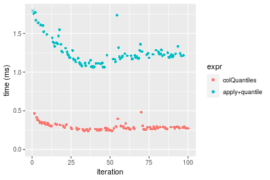

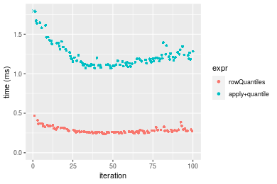
_Table: Benchmarking of colQuantiles() and rowQuantiles() on 10x10 data (original and transposed).  The top panel shows times in milliseconds and the bottom panel shows relative times._


|   |expr         |     min|       lq|     mean|   median|       uq|     max|
|:--|:------------|-------:|--------:|--------:|--------:|--------:|-------:|
|2  |rowQuantiles | 235.269| 259.6625| 286.3194| 273.3315| 302.1110| 468.712|
|1  |colQuantiles | 240.633| 262.8575| 289.0274| 277.4960| 302.5895| 479.952|


|   |expr         |      min|       lq|     mean|   median|       uq|      max|
|:--|:------------|--------:|--------:|--------:|--------:|--------:|--------:|
|2  |rowQuantiles | 1.000000| 1.000000| 1.000000| 1.000000| 1.000000| 1.000000|
|1  |colQuantiles | 1.022799| 1.012304| 1.009458| 1.015236| 1.001584| 1.023981|

_Figure: Benchmarking of colQuantiles() and rowQuantiles() on 10x10 data (original and transposed).  Outliers are displayed as crosses. Times are in milliseconds._


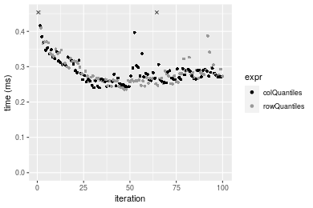

### 100x100 matrix


```r
> X <- data[["100x100"]]
> gc()
           used  (Mb) gc trigger  (Mb) max used  (Mb)
Ncells  5271016 281.6    8529671 455.6  8529671 455.6
Vcells 10102985  77.1   31876688 243.2 60562128 462.1
> probs <- seq(from = 0, to = 1, by = 0.25)
> colStats <- microbenchmark(colQuantiles = colQuantiles(X, probs = probs, na.rm = FALSE), `apply+quantile` = apply(X, 
+     MARGIN = 2L, FUN = quantile, probs = probs, na.rm = FALSE), unit = "ms")
> X <- t(X)
> gc()
           used  (Mb) gc trigger  (Mb) max used  (Mb)
Ncells  5271004 281.6    8529671 455.6  8529671 455.6
Vcells 10113018  77.2   31876688 243.2 60562128 462.1
> rowStats <- microbenchmark(rowQuantiles = rowQuantiles(X, probs = probs, na.rm = FALSE), `apply+quantile` = apply(X, 
+     MARGIN = 1L, FUN = quantile, probs = probs, na.rm = FALSE), unit = "ms")
```

_Table: Benchmarking of colQuantiles() and apply+quantile() on 100x100 data. The top panel shows times in milliseconds and the bottom panel shows relative times._


|   |expr           |       min|        lq|      mean|    median|        uq|      max|
|:--|:--------------|---------:|---------:|---------:|---------:|---------:|--------:|
|1  |colQuantiles   |  1.888284|  2.136058|  2.195115|  2.186279|  2.243244|  3.22735|
|2  |apply+quantile | 10.923141| 12.262892| 12.932966| 12.499504| 12.717576| 33.25679|


|   |expr           |      min|       lq|     mean|  median|       uq|      max|
|:--|:--------------|--------:|--------:|--------:|-------:|--------:|--------:|
|1  |colQuantiles   | 1.000000| 1.000000| 1.000000| 1.00000| 1.000000|  1.00000|
|2  |apply+quantile | 5.784692| 5.740897| 5.891703| 5.71725| 5.669279| 10.30467|

_Table: Benchmarking of rowQuantiles() and apply+quantile() on 100x100 data (transposed). The top panel shows times in milliseconds and the bottom panel shows relative times._


|   |expr           |       min|        lq|      mean|   median|        uq|      max|
|:--|:--------------|---------:|---------:|---------:|--------:|---------:|--------:|
|1  |rowQuantiles   |  1.947457|  2.172823|  2.370571|  2.23365|  2.274193| 10.16345|
|2  |apply+quantile | 10.936896| 12.217553| 12.536485| 12.40464| 12.653492| 21.03754|


|   |expr           |      min|       lq|     mean|   median|       uq|     max|
|:--|:--------------|--------:|--------:|--------:|--------:|--------:|-------:|
|1  |rowQuantiles   | 1.000000| 1.000000| 1.000000| 1.000000| 1.000000| 1.00000|
|2  |apply+quantile | 5.615988| 5.622895| 5.288382| 5.553526| 5.563948| 2.06992|

_Figure: Benchmarking of colQuantiles() and apply+quantile() on 100x100 data  as well as rowQuantiles() and apply+quantile() on the same data transposed.  Outliers are displayed as crosses.  Times are in milliseconds._


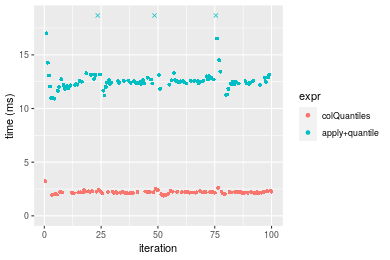

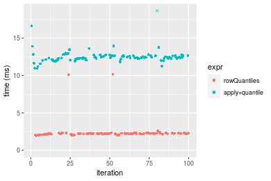
_Table: Benchmarking of colQuantiles() and rowQuantiles() on 100x100 data (original and transposed).  The top panel shows times in milliseconds and the bottom panel shows relative times._


|   |expr         |      min|       lq|     mean|   median|       uq|      max|
|:--|:------------|--------:|--------:|--------:|--------:|--------:|--------:|
|1  |colQuantiles | 1.888284| 2.136058| 2.195115| 2.186279| 2.243244|  3.22735|
|2  |rowQuantiles | 1.947457| 2.172823| 2.370571| 2.233650| 2.274193| 10.16345|


|   |expr         |      min|       lq|    mean|   median|       uq|      max|
|:--|:------------|--------:|--------:|-------:|--------:|--------:|--------:|
|1  |colQuantiles | 1.000000| 1.000000| 1.00000| 1.000000| 1.000000| 1.000000|
|2  |rowQuantiles | 1.031337| 1.017211| 1.07993| 1.021668| 1.013796| 3.149164|

_Figure: Benchmarking of colQuantiles() and rowQuantiles() on 100x100 data (original and transposed).  Outliers are displayed as crosses. Times are in milliseconds._


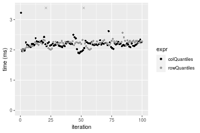

### 1000x10 matrix


```r
> X <- data[["1000x10"]]
> gc()
           used  (Mb) gc trigger  (Mb) max used  (Mb)
Ncells  5271758 281.6    8529671 455.6  8529671 455.6
Vcells 10106514  77.2   31876688 243.2 60562128 462.1
> probs <- seq(from = 0, to = 1, by = 0.25)
> colStats <- microbenchmark(colQuantiles = colQuantiles(X, probs = probs, na.rm = FALSE), `apply+quantile` = apply(X, 
+     MARGIN = 2L, FUN = quantile, probs = probs, na.rm = FALSE), unit = "ms")
> X <- t(X)
> gc()
           used  (Mb) gc trigger  (Mb) max used  (Mb)
Ncells  5271734 281.6    8529671 455.6  8529671 455.6
Vcells 10116527  77.2   31876688 243.2 60562128 462.1
> rowStats <- microbenchmark(rowQuantiles = rowQuantiles(X, probs = probs, na.rm = FALSE), `apply+quantile` = apply(X, 
+     MARGIN = 1L, FUN = quantile, probs = probs, na.rm = FALSE), unit = "ms")
```

_Table: Benchmarking of colQuantiles() and apply+quantile() on 1000x10 data. The top panel shows times in milliseconds and the bottom panel shows relative times._


|   |expr           |      min|        lq|      mean|    median|       uq|      max|
|:--|:--------------|--------:|---------:|---------:|---------:|--------:|--------:|
|1  |colQuantiles   | 0.601190| 0.6562685| 0.6981146| 0.6862355| 0.705663| 1.156208|
|2  |apply+quantile | 1.503947| 1.6398185| 1.7177534| 1.7044685| 1.746963| 2.498938|


|   |expr           |      min|       lq|     mean|   median|       uq|      max|
|:--|:--------------|--------:|--------:|--------:|--------:|--------:|--------:|
|1  |colQuantiles   | 1.000000| 1.000000| 1.000000| 1.000000| 1.000000| 1.000000|
|2  |apply+quantile | 2.501617| 2.498701| 2.460561| 2.483795| 2.475634| 2.161322|

_Table: Benchmarking of rowQuantiles() and apply+quantile() on 1000x10 data (transposed). The top panel shows times in milliseconds and the bottom panel shows relative times._


|   |expr           |      min|       lq|      mean|    median|        uq|      max|
|:--|:--------------|--------:|--------:|---------:|---------:|---------:|--------:|
|1  |rowQuantiles   | 0.643236| 0.694242| 0.7400125| 0.7194075| 0.7373645| 1.230742|
|2  |apply+quantile | 1.527078| 1.654772| 1.7342194| 1.7038935| 1.7511335| 2.642374|


|   |expr           |      min|       lq|   mean|   median|       uq|      max|
|:--|:--------------|--------:|--------:|------:|--------:|--------:|--------:|
|1  |rowQuantiles   | 1.000000| 1.000000| 1.0000| 1.000000| 1.000000| 1.000000|
|2  |apply+quantile | 2.374056| 2.383567| 2.3435| 2.368468| 2.374855| 2.146976|

_Figure: Benchmarking of colQuantiles() and apply+quantile() on 1000x10 data  as well as rowQuantiles() and apply+quantile() on the same data transposed.  Outliers are displayed as crosses.  Times are in milliseconds._


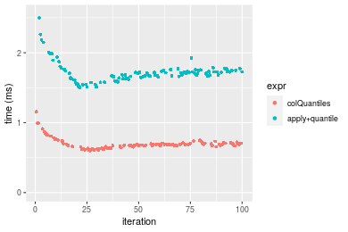

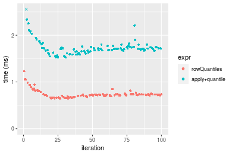
_Table: Benchmarking of colQuantiles() and rowQuantiles() on 1000x10 data (original and transposed).  The top panel shows times in milliseconds and the bottom panel shows relative times._


|   |expr         |     min|       lq|     mean|   median|       uq|      max|
|:--|:------------|-------:|--------:|--------:|--------:|--------:|--------:|
|1  |colQuantiles | 601.190| 656.2685| 698.1146| 686.2355| 705.6630| 1156.208|
|2  |rowQuantiles | 643.236| 694.2420| 740.0125| 719.4075| 737.3645| 1230.742|


|   |expr         |      min|       lq|     mean|   median|       uq|      max|
|:--|:------------|--------:|--------:|--------:|--------:|--------:|--------:|
|1  |colQuantiles | 1.000000| 1.000000| 1.000000| 1.000000| 1.000000| 1.000000|
|2  |rowQuantiles | 1.069938| 1.057863| 1.060016| 1.048339| 1.044924| 1.064464|

_Figure: Benchmarking of colQuantiles() and rowQuantiles() on 1000x10 data (original and transposed).  Outliers are displayed as crosses. Times are in milliseconds._


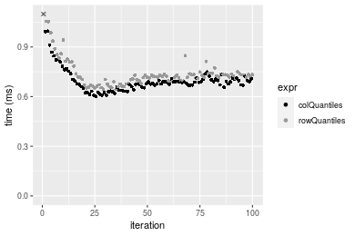

### 10x1000 matrix


```r
> X <- data[["10x1000"]]
> gc()
           used  (Mb) gc trigger  (Mb) max used  (Mb)
Ncells  5271934 281.6    8529671 455.6  8529671 455.6
Vcells 10107214  77.2   31876688 243.2 60562128 462.1
> probs <- seq(from = 0, to = 1, by = 0.25)
> colStats <- microbenchmark(colQuantiles = colQuantiles(X, probs = probs, na.rm = FALSE), `apply+quantile` = apply(X, 
+     MARGIN = 2L, FUN = quantile, probs = probs, na.rm = FALSE), unit = "ms")
> X <- t(X)
> gc()
           used  (Mb) gc trigger  (Mb) max used  (Mb)
Ncells  5271922 281.6    8529671 455.6  8529671 455.6
Vcells 10117247  77.2   31876688 243.2 60562128 462.1
> rowStats <- microbenchmark(rowQuantiles = rowQuantiles(X, probs = probs, na.rm = FALSE), `apply+quantile` = apply(X, 
+     MARGIN = 1L, FUN = quantile, probs = probs, na.rm = FALSE), unit = "ms")
```

_Table: Benchmarking of colQuantiles() and apply+quantile() on 10x1000 data. The top panel shows times in milliseconds and the bottom panel shows relative times._


|   |expr           |       min|        lq|      mean|    median|        uq|       max|
|:--|:--------------|---------:|---------:|---------:|---------:|---------:|---------:|
|1  |colQuantiles   |  14.45429|  15.83936|  16.89861|  16.25864|  16.82524|  46.84812|
|2  |apply+quantile | 112.81877| 116.21819| 123.35627| 119.25667| 127.25195| 161.59093|


|   |expr           |      min|       lq|     mean|   median|       uq|      max|
|:--|:--------------|--------:|--------:|--------:|--------:|--------:|--------:|
|1  |colQuantiles   | 1.000000| 1.000000| 1.000000| 1.000000| 1.000000| 1.000000|
|2  |apply+quantile | 7.805208| 7.337304| 7.299786| 7.334974| 7.563158| 3.449251|

_Table: Benchmarking of rowQuantiles() and apply+quantile() on 10x1000 data (transposed). The top panel shows times in milliseconds and the bottom panel shows relative times._


|   |expr           |       min|       lq|      mean|    median|        uq|      max|
|:--|:--------------|---------:|--------:|---------:|---------:|---------:|--------:|
|1  |rowQuantiles   |  14.45924|  15.9970|  20.28669|  16.20631|  16.56712| 381.9050|
|2  |apply+quantile | 110.53220| 118.0066| 121.22556| 119.13909| 125.02020| 144.3018|


|   |expr           |      min|       lq|    mean|   median|       uq|       max|
|:--|:--------------|--------:|--------:|-------:|--------:|--------:|---------:|
|1  |rowQuantiles   | 1.000000| 1.000000| 1.00000| 1.000000| 1.000000| 1.0000000|
|2  |apply+quantile | 7.644397| 7.376794| 5.97562| 7.351401| 7.546282| 0.3778473|

_Figure: Benchmarking of colQuantiles() and apply+quantile() on 10x1000 data  as well as rowQuantiles() and apply+quantile() on the same data transposed.  Outliers are displayed as crosses.  Times are in milliseconds._


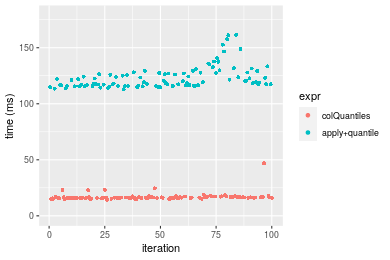

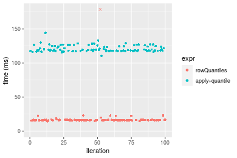
_Table: Benchmarking of colQuantiles() and rowQuantiles() on 10x1000 data (original and transposed).  The top panel shows times in milliseconds and the bottom panel shows relative times._


|   |expr         |      min|       lq|     mean|   median|       uq|       max|
|:--|:------------|--------:|--------:|--------:|--------:|--------:|---------:|
|2  |rowQuantiles | 14.45924| 15.99700| 20.28669| 16.20631| 16.56712| 381.90503|
|1  |colQuantiles | 14.45429| 15.83936| 16.89861| 16.25864| 16.82524|  46.84812|


|   |expr         |       min|        lq|      mean|   median|      uq|       max|
|:--|:------------|---------:|---------:|---------:|--------:|-------:|---------:|
|2  |rowQuantiles | 1.0000000| 1.0000000| 1.0000000| 1.000000| 1.00000| 1.0000000|
|1  |colQuantiles | 0.9996576| 0.9901455| 0.8329901| 1.003229| 1.01558| 0.1226696|

_Figure: Benchmarking of colQuantiles() and rowQuantiles() on 10x1000 data (original and transposed).  Outliers are displayed as crosses. Times are in milliseconds._


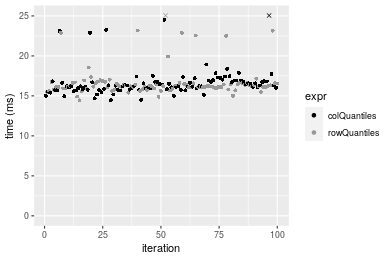

### 100x1000 matrix


```r
> X <- data[["100x1000"]]
> gc()
           used  (Mb) gc trigger  (Mb) max used  (Mb)
Ncells  5272118 281.6    8529671 455.6  8529671 455.6
Vcells 10107704  77.2   31876688 243.2 60562128 462.1
> probs <- seq(from = 0, to = 1, by = 0.25)
> colStats <- microbenchmark(colQuantiles = colQuantiles(X, probs = probs, na.rm = FALSE), `apply+quantile` = apply(X, 
+     MARGIN = 2L, FUN = quantile, probs = probs, na.rm = FALSE), unit = "ms")
> X <- t(X)
> gc()
           used  (Mb) gc trigger  (Mb) max used  (Mb)
Ncells  5272106 281.6    8529671 455.6  8529671 455.6
Vcells 10207737  77.9   31876688 243.2 60562128 462.1
> rowStats <- microbenchmark(rowQuantiles = rowQuantiles(X, probs = probs, na.rm = FALSE), `apply+quantile` = apply(X, 
+     MARGIN = 1L, FUN = quantile, probs = probs, na.rm = FALSE), unit = "ms")
```

_Table: Benchmarking of colQuantiles() and apply+quantile() on 100x1000 data. The top panel shows times in milliseconds and the bottom panel shows relative times._


|   |expr           |       min|        lq|      mean|    median|        uq|       max|
|:--|:--------------|---------:|---------:|---------:|---------:|---------:|---------:|
|1  |colQuantiles   |  19.78046|  21.08175|  21.71354|  21.32056|  21.61416|  32.44358|
|2  |apply+quantile | 124.22724| 127.17620| 131.48661| 128.56766| 136.34522| 150.63818|


|   |expr           |      min|       lq|     mean|   median|       uq|      max|
|:--|:--------------|--------:|--------:|--------:|--------:|--------:|--------:|
|1  |colQuantiles   | 1.000000| 1.000000| 1.000000| 1.000000| 1.000000| 1.000000|
|2  |apply+quantile | 6.280301| 6.032525| 6.055512| 6.030219| 6.308144| 4.643082|

_Table: Benchmarking of rowQuantiles() and apply+quantile() on 100x1000 data (transposed). The top panel shows times in milliseconds and the bottom panel shows relative times._


|   |expr           |       min|        lq|      mean|    median|        uq|       max|
|:--|:--------------|---------:|---------:|---------:|---------:|---------:|---------:|
|1  |rowQuantiles   |  20.02987|  21.71925|  22.67224|  21.97428|  22.16405|  44.66161|
|2  |apply+quantile | 123.55330| 127.41662| 131.43956| 128.76763| 136.82947| 146.98970|


|   |expr           |      min|       lq|     mean|   median|       uq|      max|
|:--|:--------------|--------:|--------:|--------:|--------:|--------:|--------:|
|1  |rowQuantiles   | 1.000000| 1.000000| 1.000000| 1.000000| 1.000000| 1.000000|
|2  |apply+quantile | 6.168454| 5.866531| 5.797378| 5.859925| 6.173487| 3.291187|

_Figure: Benchmarking of colQuantiles() and apply+quantile() on 100x1000 data  as well as rowQuantiles() and apply+quantile() on the same data transposed.  Outliers are displayed as crosses.  Times are in milliseconds._


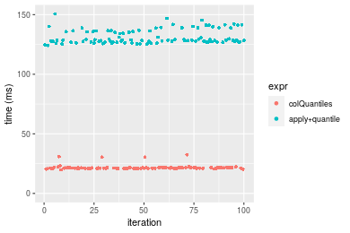

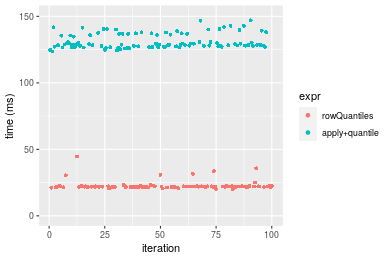
_Table: Benchmarking of colQuantiles() and rowQuantiles() on 100x1000 data (original and transposed).  The top panel shows times in milliseconds and the bottom panel shows relative times._


|   |expr         |      min|       lq|     mean|   median|       uq|      max|
|:--|:------------|--------:|--------:|--------:|--------:|--------:|--------:|
|1  |colQuantiles | 19.78046| 21.08175| 21.71354| 21.32056| 21.61416| 32.44358|
|2  |rowQuantiles | 20.02987| 21.71925| 22.67224| 21.97428| 22.16405| 44.66161|


|   |expr         |      min|       lq|     mean|   median|       uq|      max|
|:--|:------------|--------:|--------:|--------:|--------:|--------:|--------:|
|1  |colQuantiles | 1.000000| 1.000000| 1.000000| 1.000000| 1.000000| 1.000000|
|2  |rowQuantiles | 1.012609| 1.030239| 1.044152| 1.030661| 1.025441| 1.376593|

_Figure: Benchmarking of colQuantiles() and rowQuantiles() on 100x1000 data (original and transposed).  Outliers are displayed as crosses. Times are in milliseconds._


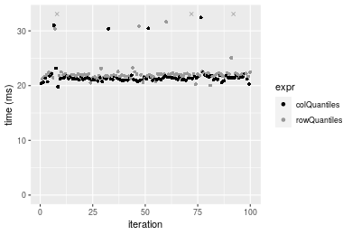

### 1000x100 matrix


```r
> X <- data[["1000x100"]]
> gc()
           used  (Mb) gc trigger  (Mb) max used  (Mb)
Ncells  5272310 281.6    8529671 455.6  8529671 455.6
Vcells 10108335  77.2   31876688 243.2 60562128 462.1
> probs <- seq(from = 0, to = 1, by = 0.25)
> colStats <- microbenchmark(colQuantiles = colQuantiles(X, probs = probs, na.rm = FALSE), `apply+quantile` = apply(X, 
+     MARGIN = 2L, FUN = quantile, probs = probs, na.rm = FALSE), unit = "ms")
> X <- t(X)
> gc()
           used  (Mb) gc trigger  (Mb) max used  (Mb)
Ncells  5272298 281.6    8529671 455.6  8529671 455.6
Vcells 10208368  77.9   31876688 243.2 60562128 462.1
> rowStats <- microbenchmark(rowQuantiles = rowQuantiles(X, probs = probs, na.rm = FALSE), `apply+quantile` = apply(X, 
+     MARGIN = 1L, FUN = quantile, probs = probs, na.rm = FALSE), unit = "ms")
```

_Table: Benchmarking of colQuantiles() and apply+quantile() on 1000x100 data. The top panel shows times in milliseconds and the bottom panel shows relative times._


|   |expr           |       min|        lq|      mean|    median|        uq|       max|
|:--|:--------------|---------:|---------:|---------:|---------:|---------:|---------:|
|1  |colQuantiles   |  5.636397|  6.027108|  6.135147|  6.116474|  6.188172|  8.237741|
|2  |apply+quantile | 15.165356| 17.037116| 17.544969| 17.240510| 17.492228| 28.635703|


|   |expr           |      min|       lq|     mean|   median|      uq|     max|
|:--|:--------------|--------:|--------:|--------:|--------:|-------:|-------:|
|1  |colQuantiles   | 1.000000| 1.000000| 1.000000| 1.000000| 1.00000| 1.00000|
|2  |apply+quantile | 2.690612| 2.826748| 2.859747| 2.818701| 2.82672| 3.47616|

_Table: Benchmarking of rowQuantiles() and apply+quantile() on 1000x100 data (transposed). The top panel shows times in milliseconds and the bottom panel shows relative times._


|   |expr           |       min|        lq|      mean|   median|        uq|       max|
|:--|:--------------|---------:|---------:|---------:|--------:|---------:|---------:|
|1  |rowQuantiles   |  5.665498|  6.479869|  6.509218|  6.53708|  6.612499|  7.358592|
|2  |apply+quantile | 15.444699| 17.088696| 17.574659| 17.28185| 17.448529| 28.096502|


|   |expr           |      min|       lq|     mean|   median|      uq|     max|
|:--|:--------------|--------:|--------:|--------:|--------:|-------:|-------:|
|1  |rowQuantiles   | 1.000000| 1.000000| 1.000000| 1.000000| 1.00000| 1.00000|
|2  |apply+quantile | 2.726097| 2.637198| 2.699965| 2.643664| 2.63872| 3.81819|

_Figure: Benchmarking of colQuantiles() and apply+quantile() on 1000x100 data  as well as rowQuantiles() and apply+quantile() on the same data transposed.  Outliers are displayed as crosses.  Times are in milliseconds._


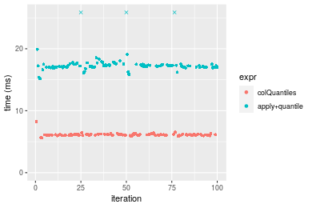

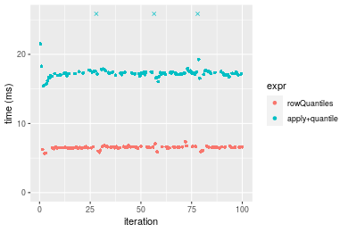
_Table: Benchmarking of colQuantiles() and rowQuantiles() on 1000x100 data (original and transposed).  The top panel shows times in milliseconds and the bottom panel shows relative times._


|   |expr         |      min|       lq|     mean|   median|       uq|      max|
|:--|:------------|--------:|--------:|--------:|--------:|--------:|--------:|
|1  |colQuantiles | 5.636397| 6.027108| 6.135147| 6.116474| 6.188172| 8.237741|
|2  |rowQuantiles | 5.665498| 6.479869| 6.509218| 6.537080| 6.612499| 7.358592|


|   |expr         |      min|       lq|     mean|   median|       uq|       max|
|:--|:------------|--------:|--------:|--------:|--------:|--------:|---------:|
|1  |colQuantiles | 1.000000| 1.000000| 1.000000| 1.000000| 1.000000| 1.0000000|
|2  |rowQuantiles | 1.005163| 1.075121| 1.060972| 1.068766| 1.068571| 0.8932779|

_Figure: Benchmarking of colQuantiles() and rowQuantiles() on 1000x100 data (original and transposed).  Outliers are displayed as crosses. Times are in milliseconds._


## Appendix

### Session information
```r
R version 4.1.1 Patched (2021-08-10 r80727)
Platform: x86_64-pc-linux-gnu (64-bit)
Running under: Ubuntu 18.04.5 LTS

Matrix products: default
BLAS:   /home/hb/software/R-devel/R-4-1-branch/lib/R/lib/libRblas.so
LAPACK: /home/hb/software/R-devel/R-4-1-branch/lib/R/lib/libRlapack.so

locale:
 [1] LC_CTYPE=en_US.UTF-8       LC_NUMERIC=C              
 [3] LC_TIME=en_US.UTF-8        LC_COLLATE=en_US.UTF-8    
 [5] LC_MONETARY=en_US.UTF-8    LC_MESSAGES=en_US.UTF-8   
 [7] LC_PAPER=en_US.UTF-8       LC_NAME=C                 
 [9] LC_ADDRESS=C               LC_TELEPHONE=C            
[11] LC_MEASUREMENT=en_US.UTF-8 LC_IDENTIFICATION=C       

attached base packages:
[1] stats     graphics  grDevices utils     datasets  methods   base     

other attached packages:
[1] microbenchmark_1.4-7   matrixStats_0.60.1     ggplot2_3.3.5         
[4] knitr_1.33             R.devices_2.17.0       R.utils_2.10.1        
[7] R.oo_1.24.0            R.methodsS3_1.8.1-9001 history_0.0.1-9000    

loaded via a namespace (and not attached):
 [1] Biobase_2.52.0          httr_1.4.2              splines_4.1.1          
 [4] bit64_4.0.5             network_1.17.1          assertthat_0.2.1       
 [7] highr_0.9               stats4_4.1.1            blob_1.2.2             
[10] GenomeInfoDbData_1.2.6  robustbase_0.93-8       pillar_1.6.2           
[13] RSQLite_2.2.8           lattice_0.20-44         glue_1.4.2             
[16] digest_0.6.27           XVector_0.32.0          colorspace_2.0-2       
[19] Matrix_1.3-4            XML_3.99-0.7            pkgconfig_2.0.3        
[22] zlibbioc_1.38.0         genefilter_1.74.0       purrr_0.3.4            
[25] ergm_4.1.2              xtable_1.8-4            scales_1.1.1           
[28] tibble_3.1.4            annotate_1.70.0         KEGGREST_1.32.0        
[31] farver_2.1.0            generics_0.1.0          IRanges_2.26.0         
[34] ellipsis_0.3.2          cachem_1.0.6            withr_2.4.2            
[37] BiocGenerics_0.38.0     mime_0.11               survival_3.2-13        
[40] magrittr_2.0.1          crayon_1.4.1            statnet.common_4.5.0   
[43] memoise_2.0.0           laeken_0.5.1            fansi_0.5.0            
[46] R.cache_0.15.0          MASS_7.3-54             R.rsp_0.44.0           
[49] progressr_0.8.0         tools_4.1.1             lifecycle_1.0.0        
[52] S4Vectors_0.30.0        trust_0.1-8             munsell_0.5.0          
[55] tabby_0.0.1-9001        AnnotationDbi_1.54.1    Biostrings_2.60.2      
[58] compiler_4.1.1          GenomeInfoDb_1.28.1     rlang_0.4.11           
[61] grid_4.1.1              RCurl_1.98-1.4          cwhmisc_6.6            
[64] rappdirs_0.3.3          startup_0.15.0          labeling_0.4.2         
[67] bitops_1.0-7            base64enc_0.1-3         boot_1.3-28            
[70] gtable_0.3.0            DBI_1.1.1               markdown_1.1           
[73] R6_2.5.1                lpSolveAPI_5.5.2.0-17.7 rle_0.9.2              
[76] dplyr_1.0.7             fastmap_1.1.0           bit_4.0.4              
[79] utf8_1.2.2              parallel_4.1.1          Rcpp_1.0.7             
[82] vctrs_0.3.8             png_0.1-7               DEoptimR_1.0-9         
[85] tidyselect_1.1.1        xfun_0.25               coda_0.19-4            
```
Total processing time was 1.32 mins.


### Reproducibility
To reproduce this report, do:
```r
html <- matrixStats:::benchmark('colQuantiles')
```

[RSP]: https://cran.r-project.org/package=R.rsp
[matrixStats]: https://cran.r-project.org/package=matrixStats

[StackOverflow:colMins?]: https://stackoverflow.com/questions/13676878 "Stack Overflow: fastest way to get Min from every column in a matrix?"
[StackOverflow:colSds?]: https://stackoverflow.com/questions/17549762 "Stack Overflow: Is there such 'colsd' in R?"
[StackOverflow:rowProds?]: https://stackoverflow.com/questions/20198801/ "Stack Overflow: Row product of matrix and column sum of matrix"

---------------------------------------
Copyright Henrik Bengtsson. Last updated on 2021-08-25 19:06:31 (+0200 UTC). Powered by [RSP].

<script>
 var link = document.createElement('link');
 link.rel = 'icon';
 link.href = "data:image/png;base64,iVBORw0KGgoAAAANSUhEUgAAACAAAAAgCAMAAABEpIrGAAAA21BMVEUAAAAAAP8AAP8AAP8AAP8AAP8AAP8AAP8AAP8AAP8AAP8AAP8AAP8AAP8AAP8AAP8AAP8AAP8AAP8AAP8AAP8AAP8AAP8AAP8AAP8AAP8AAP8AAP8AAP8AAP8AAP8AAP8AAP8AAP8AAP8AAP8AAP8AAP8AAP8AAP8AAP8AAP8BAf4CAv0DA/wdHeIeHuEfH+AgIN8hId4lJdomJtknJ9g+PsE/P8BAQL9yco10dIt1dYp3d4h4eIeVlWqWlmmXl2iYmGeZmWabm2Tn5xjo6Bfp6Rb39wj4+Af//wA2M9hbAAAASXRSTlMAAQIJCgsMJSYnKD4/QGRlZmhpamtsbautrrCxuru8y8zN5ebn6Pn6+///////////////////////////////////////////LsUNcQAAAS9JREFUOI29k21XgkAQhVcFytdSMqMETU26UVqGmpaiFbL//xc1cAhhwVNf6n5i5z67M2dmYOyfJZUqlVLhkKucG7cgmUZTybDz6g0iDeq51PUr37Ds2cy2/C9NeES5puDjxuUk1xnToZsg8pfA3avHQ3lLIi7iWRrkv/OYtkScxBIMgDee0ALoyxHQBJ68JLCjOtQIMIANF7QG9G9fNnHvisCHBVMKgSJgiz7nE+AoBKrAPA3MgepvgR9TSCasrCKH0eB1wBGBFdCO+nAGjMVGPcQb5bd6mQRegN6+1axOs9nGfYcCtfi4NQosdtH7dB+txFIpXQqN1p9B/asRHToyS0jRgpV7nk4nwcq1BJ+x3Gl/v7S9Wmpp/aGquum7w3ZDyrADFYrl8vHBH+ev9AUASW1dmU4h4wAAAABJRU5ErkJggg=="
 document.getElementsByTagName('head')[0].appendChild(link);
</script>


