[matrixStats]: Benchmark report

---------------------------------------


# colQuantiles() and rowQuantiles() benchmarks on subsetted computation

This report benchmark the performance of colQuantiles() and rowQuantiles() on subsetted computation.


## Data
```r
> rmatrix <- function(nrow, ncol, mode = c("logical", "double", "integer", "index"), range = c(-100, 
+     +100), na_prob = 0) {
+     mode <- match.arg(mode)
+     n <- nrow * ncol
+     if (mode == "logical") {
+         x <- sample(c(FALSE, TRUE), size = n, replace = TRUE)
+     }     else if (mode == "index") {
+         x <- seq_len(n)
+         mode <- "integer"
+     }     else {
+         x <- runif(n, min = range[1], max = range[2])
+     }
+     storage.mode(x) <- mode
+     if (na_prob > 0) 
+         x[sample(n, size = na_prob * n)] <- NA
+     dim(x) <- c(nrow, ncol)
+     x
+ }
> rmatrices <- function(scale = 10, seed = 1, ...) {
+     set.seed(seed)
+     data <- list()
+     data[[1]] <- rmatrix(nrow = scale * 1, ncol = scale * 1, ...)
+     data[[2]] <- rmatrix(nrow = scale * 10, ncol = scale * 10, ...)
+     data[[3]] <- rmatrix(nrow = scale * 100, ncol = scale * 1, ...)
+     data[[4]] <- t(data[[3]])
+     data[[5]] <- rmatrix(nrow = scale * 10, ncol = scale * 100, ...)
+     data[[6]] <- t(data[[5]])
+     names(data) <- sapply(data, FUN = function(x) paste(dim(x), collapse = "x"))
+     data
+ }
> data <- rmatrices(mode = "double")
```

## Results

### 10x10 matrix


```r
> X <- data[["10x10"]]
> rows <- sample.int(nrow(X), size = nrow(X) * 0.7)
> cols <- sample.int(ncol(X), size = ncol(X) * 0.7)
> X_S <- X[rows, cols]
> gc()
           used  (Mb) gc trigger  (Mb) max used  (Mb)
Ncells  5277191 281.9    8529671 455.6  8529671 455.6
Vcells 10438339  79.7   31876688 243.2 60562128 462.1
> probs <- seq(from = 0, to = 1, by = 0.25)
> colStats <- microbenchmark(colQuantiles_X_S = colQuantiles(X_S, probs = probs, na.rm = FALSE), `colQuantiles(X, rows, cols)` = colQuantiles(X, 
+     rows = rows, cols = cols, probs = probs, na.rm = FALSE), `colQuantiles(X[rows, cols])` = colQuantiles(X[rows, 
+     cols], probs = probs, na.rm = FALSE), unit = "ms")
> X <- t(X)
> X_S <- t(X_S)
> gc()
           used  (Mb) gc trigger  (Mb) max used  (Mb)
Ncells  5269002 281.4    8529671 455.6  8529671 455.6
Vcells 10410708  79.5   31876688 243.2 60562128 462.1
> rowStats <- microbenchmark(rowQuantiles_X_S = rowQuantiles(X_S, probs = probs, na.rm = FALSE), `rowQuantiles(X, cols, rows)` = rowQuantiles(X, 
+     rows = cols, cols = rows, probs = probs, na.rm = FALSE), `rowQuantiles(X[cols, rows])` = rowQuantiles(X[cols, 
+     rows], probs = probs, na.rm = FALSE), unit = "ms")
```

_Table: Benchmarking of colQuantiles_X_S(), colQuantiles(X, rows, cols)() and colQuantiles(X[rows, cols])() on 10x10 data. The top panel shows times in milliseconds and the bottom panel shows relative times._


|   |expr                        |      min|        lq|      mean|    median|        uq|      max|
|:--|:---------------------------|--------:|---------:|---------:|---------:|---------:|--------:|
|3  |colQuantiles(X[rows, cols]) | 0.189556| 0.2023435| 0.2312232| 0.2225175| 0.2461560| 0.325888|
|2  |colQuantiles(X, rows, cols) | 0.190022| 0.2017890| 0.2369091| 0.2291760| 0.2614565| 0.320707|
|1  |colQuantiles_X_S            | 0.188130| 0.2022575| 0.2423824| 0.2351850| 0.2569375| 0.975538|


|   |expr                        |       min|        lq|     mean|   median|       uq|       max|
|:--|:---------------------------|---------:|---------:|--------:|--------:|--------:|---------:|
|3  |colQuantiles(X[rows, cols]) | 1.0000000| 1.0000000| 1.000000| 1.000000| 1.000000| 1.0000000|
|2  |colQuantiles(X, rows, cols) | 1.0024584| 0.9972596| 1.024590| 1.029923| 1.062158| 0.9841019|
|1  |colQuantiles_X_S            | 0.9924772| 0.9995750| 1.048261| 1.056928| 1.043799| 2.9934763|

_Table: Benchmarking of rowQuantiles_X_S(), rowQuantiles(X, cols, rows)() and rowQuantiles(X[cols, rows])() on 10x10 data (transposed). The top panel shows times in milliseconds and the bottom panel shows relative times._


|   |expr                        |      min|        lq|      mean|    median|        uq|      max|
|:--|:---------------------------|--------:|---------:|---------:|---------:|---------:|--------:|
|3  |rowQuantiles(X[cols, rows]) | 0.190946| 0.2031980| 0.2336701| 0.2281225| 0.2493630| 0.332234|
|1  |rowQuantiles_X_S            | 0.187947| 0.2053835| 0.2429414| 0.2378675| 0.2673165| 0.334525|
|2  |rowQuantiles(X, cols, rows) | 0.190509| 0.2066295| 0.2489178| 0.2407855| 0.2598540| 1.031073|


|   |expr                        |       min|       lq|     mean|   median|       uq|      max|
|:--|:---------------------------|---------:|--------:|--------:|--------:|--------:|--------:|
|3  |rowQuantiles(X[cols, rows]) | 1.0000000| 1.000000| 1.000000| 1.000000| 1.000000| 1.000000|
|1  |rowQuantiles_X_S            | 0.9842940| 1.010755| 1.039677| 1.042718| 1.071997| 1.006896|
|2  |rowQuantiles(X, cols, rows) | 0.9977114| 1.016887| 1.065253| 1.055510| 1.042071| 3.103454|

_Figure: Benchmarking of colQuantiles_X_S(), colQuantiles(X, rows, cols)() and colQuantiles(X[rows, cols])() on 10x10 data  as well as rowQuantiles_X_S(), rowQuantiles(X, cols, rows)() and rowQuantiles(X[cols, rows])() on the same data transposed.  Outliers are displayed as crosses.  Times are in milliseconds._


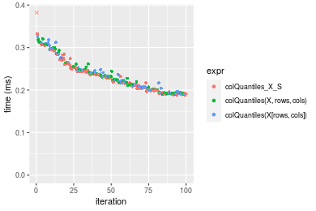

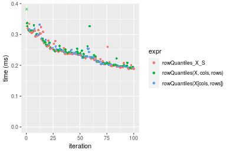
_Table: Benchmarking of colQuantiles_X_S() and rowQuantiles_X_S() on 10x10 data (original and transposed).  The top panel shows times in milliseconds and the bottom panel shows relative times._


|   |expr             |     min|       lq|     mean|   median|       uq|     max|
|:--|:----------------|-------:|--------:|--------:|--------:|--------:|-------:|
|1  |colQuantiles_X_S | 188.130| 202.2575| 242.3824| 235.1850| 256.9375| 975.538|
|2  |rowQuantiles_X_S | 187.947| 205.3835| 242.9414| 237.8675| 267.3165| 334.525|


|   |expr             |       min|       lq|     mean|   median|       uq|       max|
|:--|:----------------|---------:|--------:|--------:|--------:|--------:|---------:|
|1  |colQuantiles_X_S | 1.0000000| 1.000000| 1.000000| 1.000000| 1.000000| 1.0000000|
|2  |rowQuantiles_X_S | 0.9990273| 1.015456| 1.002306| 1.011406| 1.040395| 0.3429133|

_Figure: Benchmarking of colQuantiles_X_S() and rowQuantiles_X_S() on 10x10 data (original and transposed).  Outliers are displayed as crosses. Times are in milliseconds._


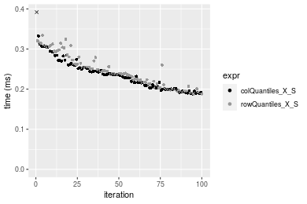

### 100x100 matrix


```r
> X <- data[["100x100"]]
> rows <- sample.int(nrow(X), size = nrow(X) * 0.7)
> cols <- sample.int(ncol(X), size = ncol(X) * 0.7)
> X_S <- X[rows, cols]
> gc()
           used  (Mb) gc trigger  (Mb) max used  (Mb)
Ncells  5268597 281.4    8529671 455.6  8529671 455.6
Vcells 10083645  77.0   31876688 243.2 60562128 462.1
> probs <- seq(from = 0, to = 1, by = 0.25)
> colStats <- microbenchmark(colQuantiles_X_S = colQuantiles(X_S, probs = probs, na.rm = FALSE), `colQuantiles(X, rows, cols)` = colQuantiles(X, 
+     rows = rows, cols = cols, probs = probs, na.rm = FALSE), `colQuantiles(X[rows, cols])` = colQuantiles(X[rows, 
+     cols], probs = probs, na.rm = FALSE), unit = "ms")
> X <- t(X)
> X_S <- t(X_S)
> gc()
           used  (Mb) gc trigger  (Mb) max used  (Mb)
Ncells  5268591 281.4    8529671 455.6  8529671 455.6
Vcells 10093728  77.1   31876688 243.2 60562128 462.1
> rowStats <- microbenchmark(rowQuantiles_X_S = rowQuantiles(X_S, probs = probs, na.rm = FALSE), `rowQuantiles(X, cols, rows)` = rowQuantiles(X, 
+     rows = cols, cols = rows, probs = probs, na.rm = FALSE), `rowQuantiles(X[cols, rows])` = rowQuantiles(X[cols, 
+     rows], probs = probs, na.rm = FALSE), unit = "ms")
```

_Table: Benchmarking of colQuantiles_X_S(), colQuantiles(X, rows, cols)() and colQuantiles(X[rows, cols])() on 100x100 data. The top panel shows times in milliseconds and the bottom panel shows relative times._


|   |expr                        |      min|       lq|     mean|   median|       uq|       max|
|:--|:---------------------------|--------:|--------:|--------:|--------:|--------:|---------:|
|1  |colQuantiles_X_S            | 1.259280| 1.393225| 1.472565| 1.441515| 1.513841|  2.013098|
|3  |colQuantiles(X[rows, cols]) | 1.263399| 1.407822| 1.587726| 1.452552| 1.540334| 11.213533|
|2  |colQuantiles(X, rows, cols) | 1.267753| 1.408001| 1.493309| 1.462292| 1.524339|  2.465260|


|   |expr                        |      min|       lq|     mean|   median|       uq|      max|
|:--|:---------------------------|--------:|--------:|--------:|--------:|--------:|--------:|
|1  |colQuantiles_X_S            | 1.000000| 1.000000| 1.000000| 1.000000| 1.000000| 1.000000|
|3  |colQuantiles(X[rows, cols]) | 1.003271| 1.010478| 1.078204| 1.007656| 1.017501| 5.570287|
|2  |colQuantiles(X, rows, cols) | 1.006728| 1.010606| 1.014087| 1.014413| 1.006935| 1.224610|

_Table: Benchmarking of rowQuantiles_X_S(), rowQuantiles(X, cols, rows)() and rowQuantiles(X[cols, rows])() on 100x100 data (transposed). The top panel shows times in milliseconds and the bottom panel shows relative times._


|   |expr                        |      min|       lq|     mean|   median|       uq|       max|
|:--|:---------------------------|--------:|--------:|--------:|--------:|--------:|---------:|
|1  |rowQuantiles_X_S            | 1.270278| 1.413137| 1.492121| 1.464138| 1.540313|  2.143832|
|3  |rowQuantiles(X[cols, rows]) | 1.282105| 1.426494| 1.484845| 1.484630| 1.549282|  1.837942|
|2  |rowQuantiles(X, cols, rows) | 1.296294| 1.440462| 1.619187| 1.485569| 1.549843| 12.371649|


|   |expr                        |      min|       lq|      mean|   median|       uq|       max|
|:--|:---------------------------|--------:|--------:|---------:|--------:|--------:|---------:|
|1  |rowQuantiles_X_S            | 1.000000| 1.000000| 1.0000000| 1.000000| 1.000000| 1.0000000|
|3  |rowQuantiles(X[cols, rows]) | 1.009311| 1.009452| 0.9951238| 1.013997| 1.005823| 0.8573162|
|2  |rowQuantiles(X, cols, rows) | 1.020481| 1.019336| 1.0851580| 1.014638| 1.006187| 5.7708109|

_Figure: Benchmarking of colQuantiles_X_S(), colQuantiles(X, rows, cols)() and colQuantiles(X[rows, cols])() on 100x100 data  as well as rowQuantiles_X_S(), rowQuantiles(X, cols, rows)() and rowQuantiles(X[cols, rows])() on the same data transposed.  Outliers are displayed as crosses.  Times are in milliseconds._


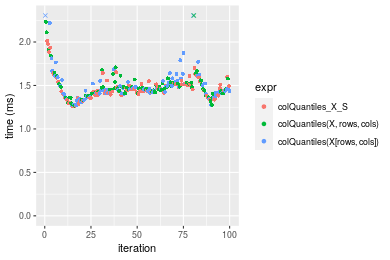

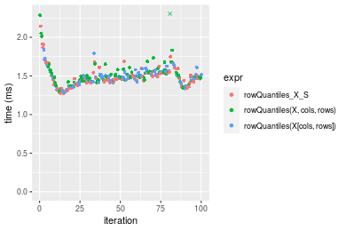
_Table: Benchmarking of colQuantiles_X_S() and rowQuantiles_X_S() on 100x100 data (original and transposed).  The top panel shows times in milliseconds and the bottom panel shows relative times._


|   |expr             |      min|       lq|     mean|   median|       uq|      max|
|:--|:----------------|--------:|--------:|--------:|--------:|--------:|--------:|
|1  |colQuantiles_X_S | 1.259280| 1.393225| 1.472565| 1.441515| 1.513841| 2.013098|
|2  |rowQuantiles_X_S | 1.270278| 1.413137| 1.492121| 1.464138| 1.540313| 2.143832|


|   |expr             |      min|       lq|    mean|   median|       uq|      max|
|:--|:----------------|--------:|--------:|-------:|--------:|--------:|--------:|
|1  |colQuantiles_X_S | 1.000000| 1.000000| 1.00000| 1.000000| 1.000000| 1.000000|
|2  |rowQuantiles_X_S | 1.008734| 1.014292| 1.01328| 1.015693| 1.017487| 1.064942|

_Figure: Benchmarking of colQuantiles_X_S() and rowQuantiles_X_S() on 100x100 data (original and transposed).  Outliers are displayed as crosses. Times are in milliseconds._


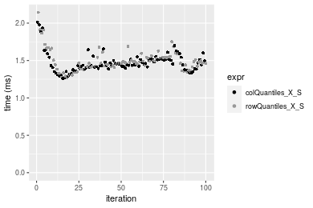

### 1000x10 matrix


```r
> X <- data[["1000x10"]]
> rows <- sample.int(nrow(X), size = nrow(X) * 0.7)
> cols <- sample.int(ncol(X), size = ncol(X) * 0.7)
> X_S <- X[rows, cols]
> gc()
           used  (Mb) gc trigger  (Mb) max used  (Mb)
Ncells  5269340 281.5    8529671 455.6  8529671 455.6
Vcells 10087697  77.0   31876688 243.2 60562128 462.1
> probs <- seq(from = 0, to = 1, by = 0.25)
> colStats <- microbenchmark(colQuantiles_X_S = colQuantiles(X_S, probs = probs, na.rm = FALSE), `colQuantiles(X, rows, cols)` = colQuantiles(X, 
+     rows = rows, cols = cols, probs = probs, na.rm = FALSE), `colQuantiles(X[rows, cols])` = colQuantiles(X[rows, 
+     cols], probs = probs, na.rm = FALSE), unit = "ms")
> X <- t(X)
> X_S <- t(X_S)
> gc()
           used  (Mb) gc trigger  (Mb) max used  (Mb)
Ncells  5269334 281.5    8529671 455.6  8529671 455.6
Vcells 10097780  77.1   31876688 243.2 60562128 462.1
> rowStats <- microbenchmark(rowQuantiles_X_S = rowQuantiles(X_S, probs = probs, na.rm = FALSE), `rowQuantiles(X, cols, rows)` = rowQuantiles(X, 
+     rows = cols, cols = rows, probs = probs, na.rm = FALSE), `rowQuantiles(X[cols, rows])` = rowQuantiles(X[cols, 
+     rows], probs = probs, na.rm = FALSE), unit = "ms")
```

_Table: Benchmarking of colQuantiles_X_S(), colQuantiles(X, rows, cols)() and colQuantiles(X[rows, cols])() on 1000x10 data. The top panel shows times in milliseconds and the bottom panel shows relative times._


|   |expr                        |      min|        lq|      mean|    median|        uq|      max|
|:--|:---------------------------|--------:|---------:|---------:|---------:|---------:|--------:|
|1  |colQuantiles_X_S            | 0.376902| 0.3857895| 0.4334700| 0.4091225| 0.4526740| 0.657567|
|2  |colQuantiles(X, rows, cols) | 0.391405| 0.4113425| 0.4483459| 0.4247020| 0.4662810| 0.671658|
|3  |colQuantiles(X[rows, cols]) | 0.389880| 0.4108325| 0.4526213| 0.4281940| 0.4662545| 0.831225|


|   |expr                        |      min|       lq|     mean|   median|       uq|      max|
|:--|:---------------------------|--------:|--------:|--------:|--------:|--------:|--------:|
|1  |colQuantiles_X_S            | 1.000000| 1.000000| 1.000000| 1.000000| 1.000000| 1.000000|
|2  |colQuantiles(X, rows, cols) | 1.038479| 1.066236| 1.034318| 1.038080| 1.030059| 1.021429|
|3  |colQuantiles(X[rows, cols]) | 1.034433| 1.064914| 1.044181| 1.046616| 1.030001| 1.264092|

_Table: Benchmarking of rowQuantiles_X_S(), rowQuantiles(X, cols, rows)() and rowQuantiles(X[cols, rows])() on 1000x10 data (transposed). The top panel shows times in milliseconds and the bottom panel shows relative times._


|   |expr                        |      min|        lq|      mean|   median|        uq|      max|
|:--|:---------------------------|--------:|---------:|---------:|--------:|---------:|--------:|
|1  |rowQuantiles_X_S            | 0.396712| 0.4071405| 0.4485341| 0.425961| 0.4533000| 0.675619|
|3  |rowQuantiles(X[cols, rows]) | 0.412020| 0.4235275| 0.4663508| 0.447727| 0.4664785| 0.871216|
|2  |rowQuantiles(X, cols, rows) | 0.412651| 0.4342215| 0.4690103| 0.449217| 0.4880695| 0.659716|


|   |expr                        |      min|       lq|     mean|   median|       uq|       max|
|:--|:---------------------------|--------:|--------:|--------:|--------:|--------:|---------:|
|1  |rowQuantiles_X_S            | 1.000000| 1.000000| 1.000000| 1.000000| 1.000000| 1.0000000|
|3  |rowQuantiles(X[cols, rows]) | 1.038587| 1.040249| 1.039722| 1.051099| 1.029072| 1.2895078|
|2  |rowQuantiles(X, cols, rows) | 1.040178| 1.066515| 1.045651| 1.054596| 1.076703| 0.9764616|

_Figure: Benchmarking of colQuantiles_X_S(), colQuantiles(X, rows, cols)() and colQuantiles(X[rows, cols])() on 1000x10 data  as well as rowQuantiles_X_S(), rowQuantiles(X, cols, rows)() and rowQuantiles(X[cols, rows])() on the same data transposed.  Outliers are displayed as crosses.  Times are in milliseconds._


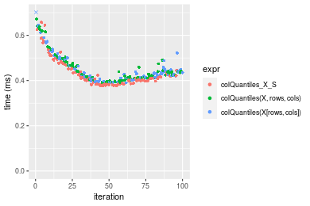

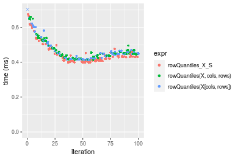
_Table: Benchmarking of colQuantiles_X_S() and rowQuantiles_X_S() on 1000x10 data (original and transposed).  The top panel shows times in milliseconds and the bottom panel shows relative times._


|   |expr             |     min|       lq|     mean|   median|      uq|     max|
|:--|:----------------|-------:|--------:|--------:|--------:|-------:|-------:|
|1  |colQuantiles_X_S | 376.902| 385.7895| 433.4700| 409.1225| 452.674| 657.567|
|2  |rowQuantiles_X_S | 396.712| 407.1405| 448.5341| 425.9610| 453.300| 675.619|


|   |expr             |     min|       lq|     mean|   median|       uq|      max|
|:--|:----------------|-------:|--------:|--------:|--------:|--------:|--------:|
|1  |colQuantiles_X_S | 1.00000| 1.000000| 1.000000| 1.000000| 1.000000| 1.000000|
|2  |rowQuantiles_X_S | 1.05256| 1.055344| 1.034752| 1.041158| 1.001383| 1.027453|

_Figure: Benchmarking of colQuantiles_X_S() and rowQuantiles_X_S() on 1000x10 data (original and transposed).  Outliers are displayed as crosses. Times are in milliseconds._


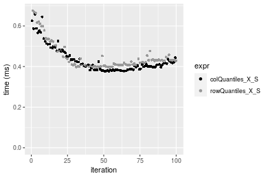

### 10x1000 matrix


```r
> X <- data[["10x1000"]]
> rows <- sample.int(nrow(X), size = nrow(X) * 0.7)
> cols <- sample.int(ncol(X), size = ncol(X) * 0.7)
> X_S <- X[rows, cols]
> gc()
           used  (Mb) gc trigger  (Mb) max used  (Mb)
Ncells  5269545 281.5    8529671 455.6  8529671 455.6
Vcells 10088684  77.0   31876688 243.2 60562128 462.1
> probs <- seq(from = 0, to = 1, by = 0.25)
> colStats <- microbenchmark(colQuantiles_X_S = colQuantiles(X_S, probs = probs, na.rm = FALSE), `colQuantiles(X, rows, cols)` = colQuantiles(X, 
+     rows = rows, cols = cols, probs = probs, na.rm = FALSE), `colQuantiles(X[rows, cols])` = colQuantiles(X[rows, 
+     cols], probs = probs, na.rm = FALSE), unit = "ms")
> X <- t(X)
> X_S <- t(X_S)
> gc()
           used  (Mb) gc trigger  (Mb) max used  (Mb)
Ncells  5269539 281.5    8529671 455.6  8529671 455.6
Vcells 10098767  77.1   31876688 243.2 60562128 462.1
> rowStats <- microbenchmark(rowQuantiles_X_S = rowQuantiles(X_S, probs = probs, na.rm = FALSE), `rowQuantiles(X, cols, rows)` = rowQuantiles(X, 
+     rows = cols, cols = rows, probs = probs, na.rm = FALSE), `rowQuantiles(X[cols, rows])` = rowQuantiles(X[cols, 
+     rows], probs = probs, na.rm = FALSE), unit = "ms")
```

_Table: Benchmarking of colQuantiles_X_S(), colQuantiles(X, rows, cols)() and colQuantiles(X[rows, cols])() on 10x1000 data. The top panel shows times in milliseconds and the bottom panel shows relative times._


|   |expr                        |      min|       lq|     mean|   median|       uq|      max|
|:--|:---------------------------|--------:|--------:|--------:|--------:|--------:|--------:|
|3  |colQuantiles(X[rows, cols]) | 9.442057| 10.70863| 11.20262| 10.88031| 11.17366| 17.73532|
|1  |colQuantiles_X_S            | 9.827438| 10.67614| 10.99559| 10.90096| 11.14681| 17.44323|
|2  |colQuantiles(X, rows, cols) | 9.605101| 10.75428| 11.30458| 10.94825| 11.16329| 22.75870|


|   |expr                        |      min|        lq|      mean|   median|        uq|       max|
|:--|:---------------------------|--------:|---------:|---------:|--------:|---------:|---------:|
|3  |colQuantiles(X[rows, cols]) | 1.000000| 1.0000000| 1.0000000| 1.000000| 1.0000000| 1.0000000|
|1  |colQuantiles_X_S            | 1.040815| 0.9969656| 0.9815187| 1.001898| 0.9975973| 0.9835305|
|2  |colQuantiles(X, rows, cols) | 1.017268| 1.0042629| 1.0091012| 1.006244| 0.9990723| 1.2832416|

_Table: Benchmarking of rowQuantiles_X_S(), rowQuantiles(X, cols, rows)() and rowQuantiles(X[cols, rows])() on 10x1000 data (transposed). The top panel shows times in milliseconds and the bottom panel shows relative times._


|   |expr                        |      min|       lq|     mean|   median|       uq|      max|
|:--|:---------------------------|--------:|--------:|--------:|--------:|--------:|--------:|
|2  |rowQuantiles(X, cols, rows) | 9.386004| 10.76202| 11.16303| 10.92739| 11.19759| 18.26512|
|1  |rowQuantiles_X_S            | 9.806843| 10.77164| 11.23187| 10.96238| 11.18627| 17.59954|
|3  |rowQuantiles(X[cols, rows]) | 9.317670| 10.81869| 11.21185| 10.99886| 11.19615| 17.79435|


|   |expr                        |       min|       lq|     mean|   median|        uq|       max|
|:--|:---------------------------|---------:|--------:|--------:|--------:|---------:|---------:|
|2  |rowQuantiles(X, cols, rows) | 1.0000000| 1.000000| 1.000000| 1.000000| 1.0000000| 1.0000000|
|1  |rowQuantiles_X_S            | 1.0448369| 1.000894| 1.006166| 1.003203| 0.9989891| 0.9635605|
|3  |rowQuantiles(X[cols, rows]) | 0.9927196| 1.005266| 1.004373| 1.006541| 0.9998717| 0.9742262|

_Figure: Benchmarking of colQuantiles_X_S(), colQuantiles(X, rows, cols)() and colQuantiles(X[rows, cols])() on 10x1000 data  as well as rowQuantiles_X_S(), rowQuantiles(X, cols, rows)() and rowQuantiles(X[cols, rows])() on the same data transposed.  Outliers are displayed as crosses.  Times are in milliseconds._


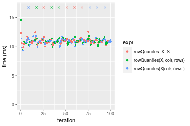
_Table: Benchmarking of colQuantiles_X_S() and rowQuantiles_X_S() on 10x1000 data (original and transposed).  The top panel shows times in milliseconds and the bottom panel shows relative times._


|   |expr             |      min|       lq|     mean|   median|       uq|      max|
|:--|:----------------|--------:|--------:|--------:|--------:|--------:|--------:|
|1  |colQuantiles_X_S | 9.827438| 10.67614| 10.99559| 10.90096| 11.14681| 17.44323|
|2  |rowQuantiles_X_S | 9.806843| 10.77164| 11.23187| 10.96238| 11.18627| 17.59954|


|   |expr             |       min|       lq|     mean|   median|      uq|      max|
|:--|:----------------|---------:|--------:|--------:|--------:|-------:|--------:|
|1  |colQuantiles_X_S | 1.0000000| 1.000000| 1.000000| 1.000000| 1.00000| 1.000000|
|2  |rowQuantiles_X_S | 0.9979043| 1.008945| 1.021489| 1.005635| 1.00354| 1.008961|

_Figure: Benchmarking of colQuantiles_X_S() and rowQuantiles_X_S() on 10x1000 data (original and transposed).  Outliers are displayed as crosses. Times are in milliseconds._


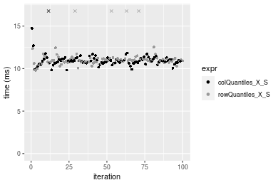

### 100x1000 matrix


```r
> X <- data[["100x1000"]]
> rows <- sample.int(nrow(X), size = nrow(X) * 0.7)
> cols <- sample.int(ncol(X), size = ncol(X) * 0.7)
> X_S <- X[rows, cols]
> gc()
           used  (Mb) gc trigger  (Mb) max used  (Mb)
Ncells  5269767 281.5    8529671 455.6  8529671 455.6
Vcells 10133447  77.4   31876688 243.2 60562128 462.1
> probs <- seq(from = 0, to = 1, by = 0.25)
> colStats <- microbenchmark(colQuantiles_X_S = colQuantiles(X_S, probs = probs, na.rm = FALSE), `colQuantiles(X, rows, cols)` = colQuantiles(X, 
+     rows = rows, cols = cols, probs = probs, na.rm = FALSE), `colQuantiles(X[rows, cols])` = colQuantiles(X[rows, 
+     cols], probs = probs, na.rm = FALSE), unit = "ms")
> X <- t(X)
> X_S <- t(X_S)
> gc()
           used  (Mb) gc trigger  (Mb) max used  (Mb)
Ncells  5269749 281.5    8529671 455.6  8529671 455.6
Vcells 10233510  78.1   31876688 243.2 60562128 462.1
> rowStats <- microbenchmark(rowQuantiles_X_S = rowQuantiles(X_S, probs = probs, na.rm = FALSE), `rowQuantiles(X, cols, rows)` = rowQuantiles(X, 
+     rows = cols, cols = rows, probs = probs, na.rm = FALSE), `rowQuantiles(X[cols, rows])` = rowQuantiles(X[cols, 
+     rows], probs = probs, na.rm = FALSE), unit = "ms")
```

_Table: Benchmarking of colQuantiles_X_S(), colQuantiles(X, rows, cols)() and colQuantiles(X[rows, cols])() on 100x1000 data. The top panel shows times in milliseconds and the bottom panel shows relative times._


|   |expr                        |      min|       lq|     mean|   median|       uq|      max|
|:--|:---------------------------|--------:|--------:|--------:|--------:|--------:|--------:|
|1  |colQuantiles_X_S            | 12.22300| 13.36760| 14.12116| 13.52681| 13.79721| 25.01684|
|2  |colQuantiles(X, rows, cols) | 12.28700| 13.54403| 14.38803| 13.70976| 13.98496| 25.88454|
|3  |colQuantiles(X[rows, cols]) | 11.75371| 13.51295| 13.68049| 13.73721| 13.94468| 14.99997|


|   |expr                        |       min|       lq|      mean|   median|       uq|       max|
|:--|:---------------------------|---------:|--------:|---------:|--------:|--------:|---------:|
|1  |colQuantiles_X_S            | 1.0000000| 1.000000| 1.0000000| 1.000000| 1.000000| 1.0000000|
|2  |colQuantiles(X, rows, cols) | 1.0052363| 1.013198| 1.0188987| 1.013524| 1.013608| 1.0346847|
|3  |colQuantiles(X[rows, cols]) | 0.9616057| 1.010873| 0.9687936| 1.015554| 1.010689| 0.5995949|

_Table: Benchmarking of rowQuantiles_X_S(), rowQuantiles(X, cols, rows)() and rowQuantiles(X[cols, rows])() on 100x1000 data (transposed). The top panel shows times in milliseconds and the bottom panel shows relative times._


|   |expr                        |      min|       lq|     mean|   median|       uq|      max|
|:--|:---------------------------|--------:|--------:|--------:|--------:|--------:|--------:|
|1  |rowQuantiles_X_S            | 12.49744| 13.70006| 14.27917| 13.92902| 14.22438| 25.77719|
|3  |rowQuantiles(X[cols, rows]) | 12.27313| 13.94419| 14.79305| 14.13867| 14.32470| 37.72975|
|2  |rowQuantiles(X, cols, rows) | 12.80339| 13.95292| 14.49924| 14.15657| 14.35943| 25.69399|


|   |expr                        |       min|       lq|     mean|   median|       uq|      max|
|:--|:---------------------------|---------:|--------:|--------:|--------:|--------:|--------:|
|1  |rowQuantiles_X_S            | 1.0000000| 1.000000| 1.000000| 1.000000| 1.000000| 1.000000|
|3  |rowQuantiles(X[cols, rows]) | 0.9820518| 1.017820| 1.035988| 1.015051| 1.007052| 1.463687|
|2  |rowQuantiles(X, cols, rows) | 1.0244810| 1.018457| 1.015412| 1.016337| 1.009494| 0.996772|

_Figure: Benchmarking of colQuantiles_X_S(), colQuantiles(X, rows, cols)() and colQuantiles(X[rows, cols])() on 100x1000 data  as well as rowQuantiles_X_S(), rowQuantiles(X, cols, rows)() and rowQuantiles(X[cols, rows])() on the same data transposed.  Outliers are displayed as crosses.  Times are in milliseconds._


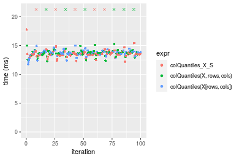

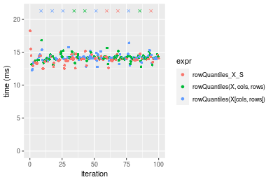
_Table: Benchmarking of colQuantiles_X_S() and rowQuantiles_X_S() on 100x1000 data (original and transposed).  The top panel shows times in milliseconds and the bottom panel shows relative times._


|   |expr             |      min|       lq|     mean|   median|       uq|      max|
|:--|:----------------|--------:|--------:|--------:|--------:|--------:|--------:|
|1  |colQuantiles_X_S | 12.22300| 13.36760| 14.12116| 13.52681| 13.79721| 25.01684|
|2  |rowQuantiles_X_S | 12.49744| 13.70006| 14.27917| 13.92902| 14.22438| 25.77719|


|   |expr             |      min|       lq|     mean|   median|       uq|      max|
|:--|:----------------|--------:|--------:|--------:|--------:|--------:|--------:|
|1  |colQuantiles_X_S | 1.000000| 1.000000| 1.000000| 1.000000| 1.000000| 1.000000|
|2  |rowQuantiles_X_S | 1.022453| 1.024871| 1.011189| 1.029734| 1.030961| 1.030394|

_Figure: Benchmarking of colQuantiles_X_S() and rowQuantiles_X_S() on 100x1000 data (original and transposed).  Outliers are displayed as crosses. Times are in milliseconds._


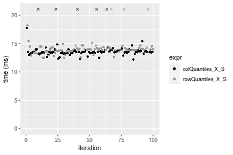

### 1000x100 matrix


```r
> X <- data[["1000x100"]]
> rows <- sample.int(nrow(X), size = nrow(X) * 0.7)
> cols <- sample.int(ncol(X), size = ncol(X) * 0.7)
> X_S <- X[rows, cols]
> gc()
           used  (Mb) gc trigger  (Mb) max used  (Mb)
Ncells  5269980 281.5    8529671 455.6  8529671 455.6
Vcells 10134275  77.4   31876688 243.2 60562128 462.1
> probs <- seq(from = 0, to = 1, by = 0.25)
> colStats <- microbenchmark(colQuantiles_X_S = colQuantiles(X_S, probs = probs, na.rm = FALSE), `colQuantiles(X, rows, cols)` = colQuantiles(X, 
+     rows = rows, cols = cols, probs = probs, na.rm = FALSE), `colQuantiles(X[rows, cols])` = colQuantiles(X[rows, 
+     cols], probs = probs, na.rm = FALSE), unit = "ms")
> X <- t(X)
> X_S <- t(X_S)
> gc()
           used  (Mb) gc trigger  (Mb) max used  (Mb)
Ncells  5269962 281.5    8529671 455.6  8529671 455.6
Vcells 10234338  78.1   31876688 243.2 60562128 462.1
> rowStats <- microbenchmark(rowQuantiles_X_S = rowQuantiles(X_S, probs = probs, na.rm = FALSE), `rowQuantiles(X, cols, rows)` = rowQuantiles(X, 
+     rows = cols, cols = rows, probs = probs, na.rm = FALSE), `rowQuantiles(X[cols, rows])` = rowQuantiles(X[cols, 
+     rows], probs = probs, na.rm = FALSE), unit = "ms")
```

_Table: Benchmarking of colQuantiles_X_S(), colQuantiles(X, rows, cols)() and colQuantiles(X[rows, cols])() on 1000x100 data. The top panel shows times in milliseconds and the bottom panel shows relative times._


|   |expr                        |      min|       lq|     mean|   median|       uq|       max|
|:--|:---------------------------|--------:|--------:|--------:|--------:|--------:|---------:|
|1  |colQuantiles_X_S            | 2.929666| 3.283390| 3.354438| 3.318930| 3.384416|  4.841613|
|3  |colQuantiles(X[rows, cols]) | 3.115852| 3.411503| 3.492563| 3.454354| 3.537214|  4.350086|
|2  |colQuantiles(X, rows, cols) | 2.992192| 3.412097| 3.678507| 3.462241| 3.532310| 13.599391|


|   |expr                        |      min|       lq|     mean|   median|       uq|       max|
|:--|:---------------------------|--------:|--------:|--------:|--------:|--------:|---------:|
|1  |colQuantiles_X_S            | 1.000000| 1.000000| 1.000000| 1.000000| 1.000000| 1.0000000|
|3  |colQuantiles(X[rows, cols]) | 1.063552| 1.039019| 1.041177| 1.040803| 1.045147| 0.8984787|
|2  |colQuantiles(X, rows, cols) | 1.021342| 1.039199| 1.096609| 1.043180| 1.043699| 2.8088554|

_Table: Benchmarking of rowQuantiles_X_S(), rowQuantiles(X, cols, rows)() and rowQuantiles(X[cols, rows])() on 1000x100 data (transposed). The top panel shows times in milliseconds and the bottom panel shows relative times._


|   |expr                        |      min|       lq|     mean|   median|       uq|       max|
|:--|:---------------------------|--------:|--------:|--------:|--------:|--------:|---------:|
|1  |rowQuantiles_X_S            | 3.194023| 3.519172| 3.576079| 3.554039| 3.629571|  4.048947|
|2  |rowQuantiles(X, cols, rows) | 3.286063| 3.665307| 3.776926| 3.728198| 3.805614|  5.454258|
|3  |rowQuantiles(X[cols, rows]) | 3.289315| 3.676176| 3.952174| 3.743796| 3.841694| 13.341035|


|   |expr                        |      min|       lq|     mean|   median|       uq|      max|
|:--|:---------------------------|--------:|--------:|--------:|--------:|--------:|--------:|
|1  |rowQuantiles_X_S            | 1.000000| 1.000000| 1.000000| 1.000000| 1.000000| 1.000000|
|2  |rowQuantiles(X, cols, rows) | 1.028816| 1.041525| 1.056164| 1.049003| 1.048502| 1.347081|
|3  |rowQuantiles(X[cols, rows]) | 1.029834| 1.044614| 1.105169| 1.053392| 1.058443| 3.294939|

_Figure: Benchmarking of colQuantiles_X_S(), colQuantiles(X, rows, cols)() and colQuantiles(X[rows, cols])() on 1000x100 data  as well as rowQuantiles_X_S(), rowQuantiles(X, cols, rows)() and rowQuantiles(X[cols, rows])() on the same data transposed.  Outliers are displayed as crosses.  Times are in milliseconds._


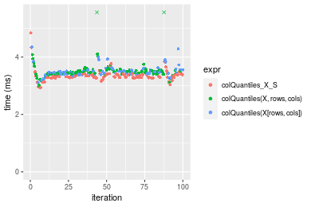

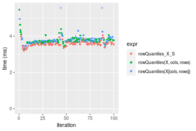
_Table: Benchmarking of colQuantiles_X_S() and rowQuantiles_X_S() on 1000x100 data (original and transposed).  The top panel shows times in milliseconds and the bottom panel shows relative times._


|   |expr             |      min|       lq|     mean|   median|       uq|      max|
|:--|:----------------|--------:|--------:|--------:|--------:|--------:|--------:|
|1  |colQuantiles_X_S | 2.929666| 3.283390| 3.354438| 3.318930| 3.384416| 4.841613|
|2  |rowQuantiles_X_S | 3.194023| 3.519172| 3.576079| 3.554039| 3.629571| 4.048947|


|   |expr             |      min|       lq|     mean|   median|       uq|       max|
|:--|:----------------|--------:|--------:|--------:|--------:|--------:|---------:|
|1  |colQuantiles_X_S | 1.000000| 1.000000| 1.000000| 1.000000| 1.000000| 1.0000000|
|2  |rowQuantiles_X_S | 1.090234| 1.071811| 1.066074| 1.070839| 1.072436| 0.8362806|

_Figure: Benchmarking of colQuantiles_X_S() and rowQuantiles_X_S() on 1000x100 data (original and transposed).  Outliers are displayed as crosses. Times are in milliseconds._


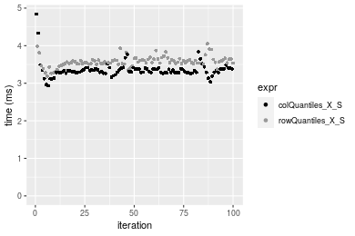


## Appendix

### Session information
```r
R version 4.1.1 Patched (2021-08-10 r80727)
Platform: x86_64-pc-linux-gnu (64-bit)
Running under: Ubuntu 18.04.5 LTS

Matrix products: default
BLAS:   /home/hb/software/R-devel/R-4-1-branch/lib/R/lib/libRblas.so
LAPACK: /home/hb/software/R-devel/R-4-1-branch/lib/R/lib/libRlapack.so

locale:
 [1] LC_CTYPE=en_US.UTF-8       LC_NUMERIC=C              
 [3] LC_TIME=en_US.UTF-8        LC_COLLATE=en_US.UTF-8    
 [5] LC_MONETARY=en_US.UTF-8    LC_MESSAGES=en_US.UTF-8   
 [7] LC_PAPER=en_US.UTF-8       LC_NAME=C                 
 [9] LC_ADDRESS=C               LC_TELEPHONE=C            
[11] LC_MEASUREMENT=en_US.UTF-8 LC_IDENTIFICATION=C       

attached base packages:
[1] stats     graphics  grDevices utils     datasets  methods   base     

other attached packages:
[1] microbenchmark_1.4-7   matrixStats_0.60.1     ggplot2_3.3.5         
[4] knitr_1.33             R.devices_2.17.0       R.utils_2.10.1        
[7] R.oo_1.24.0            R.methodsS3_1.8.1-9001 history_0.0.1-9000    

loaded via a namespace (and not attached):
 [1] Biobase_2.52.0          httr_1.4.2              splines_4.1.1          
 [4] bit64_4.0.5             network_1.17.1          assertthat_0.2.1       
 [7] highr_0.9               stats4_4.1.1            blob_1.2.2             
[10] GenomeInfoDbData_1.2.6  robustbase_0.93-8       pillar_1.6.2           
[13] RSQLite_2.2.8           lattice_0.20-44         glue_1.4.2             
[16] digest_0.6.27           XVector_0.32.0          colorspace_2.0-2       
[19] Matrix_1.3-4            XML_3.99-0.7            pkgconfig_2.0.3        
[22] zlibbioc_1.38.0         genefilter_1.74.0       purrr_0.3.4            
[25] ergm_4.1.2              xtable_1.8-4            scales_1.1.1           
[28] tibble_3.1.4            annotate_1.70.0         KEGGREST_1.32.0        
[31] farver_2.1.0            generics_0.1.0          IRanges_2.26.0         
[34] ellipsis_0.3.2          cachem_1.0.6            withr_2.4.2            
[37] BiocGenerics_0.38.0     mime_0.11               survival_3.2-13        
[40] magrittr_2.0.1          crayon_1.4.1            statnet.common_4.5.0   
[43] memoise_2.0.0           laeken_0.5.1            fansi_0.5.0            
[46] R.cache_0.15.0          MASS_7.3-54             R.rsp_0.44.0           
[49] progressr_0.8.0         tools_4.1.1             lifecycle_1.0.0        
[52] S4Vectors_0.30.0        trust_0.1-8             munsell_0.5.0          
[55] tabby_0.0.1-9001        AnnotationDbi_1.54.1    Biostrings_2.60.2      
[58] compiler_4.1.1          GenomeInfoDb_1.28.1     rlang_0.4.11           
[61] grid_4.1.1              RCurl_1.98-1.4          cwhmisc_6.6            
[64] rappdirs_0.3.3          startup_0.15.0          labeling_0.4.2         
[67] bitops_1.0-7            base64enc_0.1-3         boot_1.3-28            
[70] gtable_0.3.0            DBI_1.1.1               markdown_1.1           
[73] R6_2.5.1                lpSolveAPI_5.5.2.0-17.7 rle_0.9.2              
[76] dplyr_1.0.7             fastmap_1.1.0           bit_4.0.4              
[79] utf8_1.2.2              parallel_4.1.1          Rcpp_1.0.7             
[82] vctrs_0.3.8             png_0.1-7               DEoptimR_1.0-9         
[85] tidyselect_1.1.1        xfun_0.25               coda_0.19-4            
```
Total processing time was 30.55 secs.


### Reproducibility
To reproduce this report, do:
```r
html <- matrixStats:::benchmark('colRowQuantiles_subset')
```

[RSP]: https://cran.r-project.org/package=R.rsp
[matrixStats]: https://cran.r-project.org/package=matrixStats

[StackOverflow:colMins?]: https://stackoverflow.com/questions/13676878 "Stack Overflow: fastest way to get Min from every column in a matrix?"
[StackOverflow:colSds?]: https://stackoverflow.com/questions/17549762 "Stack Overflow: Is there such 'colsd' in R?"
[StackOverflow:rowProds?]: https://stackoverflow.com/questions/20198801/ "Stack Overflow: Row product of matrix and column sum of matrix"

---------------------------------------
Copyright Dongcan Jiang. Last updated on 2021-08-25 19:05:11 (+0200 UTC). Powered by [RSP].

<script>
 var link = document.createElement('link');
 link.rel = 'icon';
 link.href = "data:image/png;base64,iVBORw0KGgoAAAANSUhEUgAAACAAAAAgCAMAAABEpIrGAAAA21BMVEUAAAAAAP8AAP8AAP8AAP8AAP8AAP8AAP8AAP8AAP8AAP8AAP8AAP8AAP8AAP8AAP8AAP8AAP8AAP8AAP8AAP8AAP8AAP8AAP8AAP8AAP8AAP8AAP8AAP8AAP8AAP8AAP8AAP8AAP8AAP8AAP8AAP8AAP8AAP8AAP8AAP8AAP8BAf4CAv0DA/wdHeIeHuEfH+AgIN8hId4lJdomJtknJ9g+PsE/P8BAQL9yco10dIt1dYp3d4h4eIeVlWqWlmmXl2iYmGeZmWabm2Tn5xjo6Bfp6Rb39wj4+Af//wA2M9hbAAAASXRSTlMAAQIJCgsMJSYnKD4/QGRlZmhpamtsbautrrCxuru8y8zN5ebn6Pn6+///////////////////////////////////////////LsUNcQAAAS9JREFUOI29k21XgkAQhVcFytdSMqMETU26UVqGmpaiFbL//xc1cAhhwVNf6n5i5z67M2dmYOyfJZUqlVLhkKucG7cgmUZTybDz6g0iDeq51PUr37Ds2cy2/C9NeES5puDjxuUk1xnToZsg8pfA3avHQ3lLIi7iWRrkv/OYtkScxBIMgDee0ALoyxHQBJ68JLCjOtQIMIANF7QG9G9fNnHvisCHBVMKgSJgiz7nE+AoBKrAPA3MgepvgR9TSCasrCKH0eB1wBGBFdCO+nAGjMVGPcQb5bd6mQRegN6+1axOs9nGfYcCtfi4NQosdtH7dB+txFIpXQqN1p9B/asRHToyS0jRgpV7nk4nwcq1BJ+x3Gl/v7S9Wmpp/aGquum7w3ZDyrADFYrl8vHBH+ev9AUASW1dmU4h4wAAAABJRU5ErkJggg=="
 document.getElementsByTagName('head')[0].appendChild(link);
</script>


