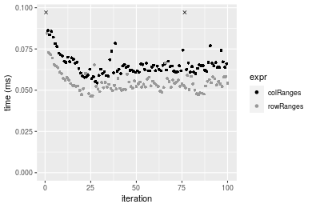

[matrixStats]: Benchmark report

---------------------------------------


# colRanges() and rowRanges() benchmarks

This report benchmark the performance of colRanges() and rowRanges() against alternative methods.

## Alternative methods

* apply() + range()


## Data type "integer"

### Data
```r
> rmatrix <- function(nrow, ncol, mode = c("logical", "double", "integer", "index"), range = c(-100, 
+     +100), na_prob = 0) {
+     mode <- match.arg(mode)
+     n <- nrow * ncol
+     if (mode == "logical") {
+         x <- sample(c(FALSE, TRUE), size = n, replace = TRUE)
+     }     else if (mode == "index") {
+         x <- seq_len(n)
+         mode <- "integer"
+     }     else {
+         x <- runif(n, min = range[1], max = range[2])
+     }
+     storage.mode(x) <- mode
+     if (na_prob > 0) 
+         x[sample(n, size = na_prob * n)] <- NA
+     dim(x) <- c(nrow, ncol)
+     x
+ }
> rmatrices <- function(scale = 10, seed = 1, ...) {
+     set.seed(seed)
+     data <- list()
+     data[[1]] <- rmatrix(nrow = scale * 1, ncol = scale * 1, ...)
+     data[[2]] <- rmatrix(nrow = scale * 10, ncol = scale * 10, ...)
+     data[[3]] <- rmatrix(nrow = scale * 100, ncol = scale * 1, ...)
+     data[[4]] <- t(data[[3]])
+     data[[5]] <- rmatrix(nrow = scale * 10, ncol = scale * 100, ...)
+     data[[6]] <- t(data[[5]])
+     names(data) <- sapply(data, FUN = function(x) paste(dim(x), collapse = "x"))
+     data
+ }
> data <- rmatrices(mode = mode)
```

### Results

#### 10x10 integer matrix

```r
> X <- data[["10x10"]]
> gc()
           used  (Mb) gc trigger  (Mb) max used  (Mb)
Ncells  5289264 282.5    8529671 455.6  8529671 455.6
Vcells 10458349  79.8   31876688 243.2 60562128 462.1
> colStats <- microbenchmark(colRanges = colRanges(X, na.rm = FALSE), `apply+range` = apply(X, MARGIN = 2L, 
+     FUN = range, na.rm = FALSE), unit = "ms")
> X <- t(X)
> gc()
           used  (Mb) gc trigger  (Mb) max used  (Mb)
Ncells  5279040 282.0    8529671 455.6  8529671 455.6
Vcells 10424711  79.6   31876688 243.2 60562128 462.1
> rowStats <- microbenchmark(rowRanges = rowRanges(X, na.rm = FALSE), `apply+range` = apply(X, MARGIN = 1L, 
+     FUN = range, na.rm = FALSE), unit = "ms")
```

_Table: Benchmarking of colRanges() and apply+range() on integer+10x10 data. The top panel shows times in milliseconds and the bottom panel shows relative times._


|   |expr        |      min|        lq|      mean|    median|        uq|      max|
|:--|:-----------|--------:|---------:|---------:|---------:|---------:|--------:|
|1  |colRanges   | 0.002045| 0.0022765| 0.0030860| 0.0026165| 0.0035735| 0.015707|
|2  |apply+range | 0.061176| 0.0633180| 0.0671895| 0.0648315| 0.0677135| 0.163632|


|   |expr        |      min|       lq|     mean|   median|       uq|      max|
|:--|:-----------|--------:|--------:|--------:|--------:|--------:|--------:|
|1  |colRanges   |  1.00000|  1.00000|  1.00000|  1.00000|  1.00000|  1.00000|
|2  |apply+range | 29.91491| 27.81375| 21.77228| 24.77795| 18.94879| 10.41778|

_Table: Benchmarking of rowRanges() and apply+range() on integer+10x10 data (transposed). The top panel shows times in milliseconds and the bottom panel shows relative times._


|   |expr        |      min|        lq|      mean|    median|        uq|      max|
|:--|:-----------|--------:|---------:|---------:|---------:|---------:|--------:|
|1  |rowRanges   | 0.002118| 0.0024495| 0.0034029| 0.0033835| 0.0036155| 0.017028|
|2  |apply+range | 0.061230| 0.0628170| 0.0667048| 0.0651310| 0.0667565| 0.156645|


|   |expr        |      min|       lq|     mean|   median|       uq|     max|
|:--|:-----------|--------:|--------:|--------:|--------:|--------:|-------:|
|1  |rowRanges   |  1.00000|  1.00000|  1.00000|  1.00000|  1.00000| 1.00000|
|2  |apply+range | 28.90935| 25.64483| 19.60211| 19.24959| 18.46397| 9.19926|

_Figure: Benchmarking of colRanges() and apply+range() on integer+10x10 data  as well as rowRanges() and apply+range() on the same data transposed.  Outliers are displayed as crosses.  Times are in milliseconds._


_Table: Benchmarking of colRanges() and rowRanges() on integer+10x10 data (original and transposed).  The top panel shows times in milliseconds and the bottom panel shows relative times._


|   |expr      |   min|     lq|    mean| median|     uq|    max|
|:--|:---------|-----:|------:|-------:|------:|------:|------:|
|1  |colRanges | 2.045| 2.2765| 3.08601| 2.6165| 3.5735| 15.707|
|2  |rowRanges | 2.118| 2.4495| 3.40294| 3.3835| 3.6155| 17.028|


|   |expr      |      min|       lq|     mean|  median|       uq|      max|
|:--|:---------|--------:|--------:|--------:|-------:|--------:|--------:|
|1  |colRanges | 1.000000| 1.000000| 1.000000| 1.00000| 1.000000| 1.000000|
|2  |rowRanges | 1.035697| 1.075994| 1.102699| 1.29314| 1.011753| 1.084103|

_Figure: Benchmarking of colRanges() and rowRanges() on integer+10x10 data (original and transposed).  Outliers are displayed as crosses. Times are in milliseconds._


#### 100x100 integer matrix

```r
> X <- data[["100x100"]]
> gc()
           used  (Mb) gc trigger  (Mb) max used  (Mb)
Ncells  5277618 281.9    8529671 455.6  8529671 455.6
Vcells 10041243  76.7   31876688 243.2 60562128 462.1
> colStats <- microbenchmark(colRanges = colRanges(X, na.rm = FALSE), `apply+range` = apply(X, MARGIN = 2L, 
+     FUN = range, na.rm = FALSE), unit = "ms")
> X <- t(X)
> gc()
           used  (Mb) gc trigger  (Mb) max used  (Mb)
Ncells  5277594 281.9    8529671 455.6  8529671 455.6
Vcells 10046256  76.7   31876688 243.2 60562128 462.1
> rowStats <- microbenchmark(rowRanges = rowRanges(X, na.rm = FALSE), `apply+range` = apply(X, MARGIN = 1L, 
+     FUN = range, na.rm = FALSE), unit = "ms")
```

_Table: Benchmarking of colRanges() and apply+range() on integer+100x100 data. The top panel shows times in milliseconds and the bottom panel shows relative times._


|   |expr        |      min|        lq|      mean|    median|        uq|      max|
|:--|:-----------|--------:|---------:|---------:|---------:|---------:|--------:|
|1  |colRanges   | 0.026781| 0.0303305| 0.0336904| 0.0322635| 0.0350315| 0.075468|
|2  |apply+range | 0.362779| 0.3908045| 0.4380096| 0.4222460| 0.4719190| 0.713652|


|   |expr        |      min|       lq|     mean|   median|       uq|      max|
|:--|:-----------|--------:|--------:|--------:|--------:|--------:|--------:|
|1  |colRanges   |  1.00000|  1.00000|  1.00000|  1.00000|  1.00000| 1.000000|
|2  |apply+range | 13.54613| 12.88487| 13.00103| 13.08742| 13.47128| 9.456352|

_Table: Benchmarking of rowRanges() and apply+range() on integer+100x100 data (transposed). The top panel shows times in milliseconds and the bottom panel shows relative times._


|   |expr        |      min|        lq|      mean|    median|       uq|      max|
|:--|:-----------|--------:|---------:|---------:|---------:|--------:|--------:|
|1  |rowRanges   | 0.027419| 0.0309615| 0.0338300| 0.0323500| 0.035481| 0.054192|
|2  |apply+range | 0.357456| 0.3869295| 0.4280655| 0.4106165| 0.454320| 0.675929|


|   |expr        |     min|       lq|     mean|   median|      uq|      max|
|:--|:-----------|-------:|--------:|--------:|--------:|-------:|--------:|
|1  |rowRanges   |  1.0000|  1.00000|  1.00000|  1.00000|  1.0000|  1.00000|
|2  |apply+range | 13.0368| 12.49712| 12.65341| 12.69294| 12.8046| 12.47286|

_Figure: Benchmarking of colRanges() and apply+range() on integer+100x100 data  as well as rowRanges() and apply+range() on the same data transposed.  Outliers are displayed as crosses.  Times are in milliseconds._


_Table: Benchmarking of colRanges() and rowRanges() on integer+100x100 data (original and transposed).  The top panel shows times in milliseconds and the bottom panel shows relative times._


|   |expr      |    min|      lq|     mean|  median|      uq|    max|
|:--|:---------|------:|-------:|--------:|-------:|-------:|------:|
|1  |colRanges | 26.781| 30.3305| 33.69038| 32.2635| 35.0315| 75.468|
|2  |rowRanges | 27.419| 30.9615| 33.83005| 32.3500| 35.4810| 54.192|


|   |expr      |      min|       lq|     mean|   median|       uq|       max|
|:--|:---------|--------:|--------:|--------:|--------:|--------:|---------:|
|1  |colRanges | 1.000000| 1.000000| 1.000000| 1.000000| 1.000000| 1.0000000|
|2  |rowRanges | 1.023823| 1.020804| 1.004146| 1.002681| 1.012831| 0.7180792|

_Figure: Benchmarking of colRanges() and rowRanges() on integer+100x100 data (original and transposed).  Outliers are displayed as crosses. Times are in milliseconds._


#### 1000x10 integer matrix

```r
> X <- data[["1000x10"]]
> gc()
           used  (Mb) gc trigger  (Mb) max used  (Mb)
Ncells  5276992 281.9    8529671 455.6  8529671 455.6
Vcells 10019001  76.5   31876688 243.2 60562128 462.1
> colStats <- microbenchmark(colRanges = colRanges(X, na.rm = FALSE), `apply+range` = apply(X, MARGIN = 2L, 
+     FUN = range, na.rm = FALSE), unit = "ms")
> X <- t(X)
> gc()
           used  (Mb) gc trigger  (Mb) max used  (Mb)
Ncells  5276986 281.9    8529671 455.6  8529671 455.6
Vcells 10024044  76.5   31876688 243.2 60562128 462.1
> rowStats <- microbenchmark(rowRanges = rowRanges(X, na.rm = FALSE), `apply+range` = apply(X, MARGIN = 1L, 
+     FUN = range, na.rm = FALSE), unit = "ms")
```

_Table: Benchmarking of colRanges() and apply+range() on integer+1000x10 data. The top panel shows times in milliseconds and the bottom panel shows relative times._


|   |expr        |      min|        lq|      mean|    median|       uq|      max|
|:--|:-----------|--------:|---------:|---------:|---------:|--------:|--------:|
|1  |colRanges   | 0.022732| 0.0248185| 0.0272224| 0.0266035| 0.028616| 0.056743|
|2  |apply+range | 0.157993| 0.1705790| 0.1863602| 0.1843510| 0.194982| 0.309690|


|   |expr        |      min|       lq|     mean|   median|       uq|      max|
|:--|:-----------|--------:|--------:|--------:|--------:|--------:|--------:|
|1  |colRanges   | 1.000000| 1.000000| 1.000000| 1.000000| 1.000000| 1.000000|
|2  |apply+range | 6.950246| 6.873058| 6.845842| 6.929577| 6.813741| 5.457766|

_Table: Benchmarking of rowRanges() and apply+range() on integer+1000x10 data (transposed). The top panel shows times in milliseconds and the bottom panel shows relative times._


|   |expr        |     min|        lq|      mean|    median|        uq|      max|
|:--|:-----------|-------:|---------:|---------:|---------:|---------:|--------:|
|1  |rowRanges   | 0.02983| 0.0316140| 0.0344927| 0.0334810| 0.0361975| 0.055681|
|2  |apply+range | 0.15799| 0.1682565| 0.1819805| 0.1794215| 0.1941095| 0.293861|


|   |expr        |      min|       lq|    mean|   median|       uq|      max|
|:--|:-----------|--------:|--------:|-------:|--------:|--------:|--------:|
|1  |rowRanges   | 1.000000| 1.000000| 1.00000| 1.000000| 1.000000| 1.000000|
|2  |apply+range | 5.296346| 5.322215| 5.27592| 5.358905| 5.362511| 5.277581|

_Figure: Benchmarking of colRanges() and apply+range() on integer+1000x10 data  as well as rowRanges() and apply+range() on the same data transposed.  Outliers are displayed as crosses.  Times are in milliseconds._


_Table: Benchmarking of colRanges() and rowRanges() on integer+1000x10 data (original and transposed).  The top panel shows times in milliseconds and the bottom panel shows relative times._


|   |expr      |    min|      lq|     mean|  median|      uq|    max|
|:--|:---------|------:|-------:|--------:|-------:|-------:|------:|
|1  |colRanges | 22.732| 24.8185| 27.22240| 26.6035| 28.6160| 56.743|
|2  |rowRanges | 29.830| 31.6140| 34.49266| 33.4810| 36.1975| 55.681|


|   |expr      |      min|       lq|     mean|   median|       uq|      max|
|:--|:---------|--------:|--------:|--------:|--------:|--------:|--------:|
|1  |colRanges | 1.000000| 1.000000| 1.000000| 1.000000| 1.000000| 1.000000|
|2  |rowRanges | 1.312247| 1.273808| 1.267069| 1.258519| 1.264939| 0.981284|

_Figure: Benchmarking of colRanges() and rowRanges() on integer+1000x10 data (original and transposed).  Outliers are displayed as crosses. Times are in milliseconds._


#### 10x1000 integer matrix

```r
> X <- data[["10x1000"]]
> gc()
           used  (Mb) gc trigger  (Mb) max used  (Mb)
Ncells  5277198 281.9    8529671 455.6  8529671 455.6
Vcells 10019703  76.5   31876688 243.2 60562128 462.1
> colStats <- microbenchmark(colRanges = colRanges(X, na.rm = FALSE), `apply+range` = apply(X, MARGIN = 2L, 
+     FUN = range, na.rm = FALSE), unit = "ms")
> X <- t(X)
> gc()
           used  (Mb) gc trigger  (Mb) max used  (Mb)
Ncells  5277174 281.9    8529671 455.6  8529671 455.6
Vcells 10024716  76.5   31876688 243.2 60562128 462.1
> rowStats <- microbenchmark(rowRanges = rowRanges(X, na.rm = FALSE), `apply+range` = apply(X, MARGIN = 1L, 
+     FUN = range, na.rm = FALSE), unit = "ms")
```

_Table: Benchmarking of colRanges() and apply+range() on integer+10x1000 data. The top panel shows times in milliseconds and the bottom panel shows relative times._


|   |expr        |      min|       lq|      mean|    median|       uq|      max|
|:--|:-----------|--------:|--------:|---------:|---------:|--------:|--------:|
|1  |colRanges   | 0.054437| 0.061474| 0.0658455| 0.0641575| 0.066908| 0.101347|
|2  |apply+range | 2.290327| 2.546572| 2.7292810| 2.6289990| 2.779084| 8.439234|


|   |expr        |      min|       lq|     mean|   median|       uq|      max|
|:--|:-----------|--------:|--------:|--------:|--------:|--------:|--------:|
|1  |colRanges   |  1.00000|  1.00000|  1.00000|  1.00000|  1.00000|  1.00000|
|2  |apply+range | 42.07298| 41.42519| 41.44977| 40.97727| 41.53589| 83.27068|

_Table: Benchmarking of rowRanges() and apply+range() on integer+10x1000 data (transposed). The top panel shows times in milliseconds and the bottom panel shows relative times._


|   |expr        |      min|       lq|     mean|   median|       uq|      max|
|:--|:-----------|--------:|--------:|--------:|--------:|--------:|--------:|
|1  |rowRanges   | 0.046342| 0.051257| 0.054780| 0.053720| 0.056809| 0.084516|
|2  |apply+range | 2.320344| 2.543288| 2.719282| 2.622218| 2.719834| 8.373839|


|   |expr        |   min|       lq|     mean|  median|       uq|      max|
|:--|:-----------|-----:|--------:|--------:|-------:|--------:|--------:|
|1  |rowRanges   |  1.00|  1.00000|  1.00000|  1.0000|  1.00000|  1.00000|
|2  |apply+range | 50.07| 49.61835| 49.64007| 48.8127| 47.87681| 99.07993|

_Figure: Benchmarking of colRanges() and apply+range() on integer+10x1000 data  as well as rowRanges() and apply+range() on the same data transposed.  Outliers are displayed as crosses.  Times are in milliseconds._


_Table: Benchmarking of colRanges() and rowRanges() on integer+10x1000 data (original and transposed).  The top panel shows times in milliseconds and the bottom panel shows relative times._


|   |expr      |    min|     lq|     mean|  median|     uq|     max|
|:--|:---------|------:|------:|--------:|-------:|------:|-------:|
|2  |rowRanges | 46.342| 51.257| 54.77998| 53.7200| 56.809|  84.516|
|1  |colRanges | 54.437| 61.474| 65.84551| 64.1575| 66.908| 101.347|


|   |expr      |     min|       lq|  mean|   median|       uq|      max|
|:--|:---------|-------:|--------:|-----:|--------:|--------:|--------:|
|2  |rowRanges | 1.00000| 1.000000| 1.000| 1.000000| 1.000000| 1.000000|
|1  |colRanges | 1.17468| 1.199329| 1.202| 1.194295| 1.177771| 1.199146|

_Figure: Benchmarking of colRanges() and rowRanges() on integer+10x1000 data (original and transposed).  Outliers are displayed as crosses. Times are in milliseconds._




#### 100x1000 integer matrix

```r
> X <- data[["100x1000"]]
> gc()
           used  (Mb) gc trigger  (Mb) max used  (Mb)
Ncells  5277364 281.9    8529671 455.6  8529671 455.6
Vcells 10020150  76.5   31876688 243.2 60562128 462.1
> colStats <- microbenchmark(colRanges = colRanges(X, na.rm = FALSE), `apply+range` = apply(X, MARGIN = 2L, 
+     FUN = range, na.rm = FALSE), unit = "ms")
> X <- t(X)
> gc()
           used  (Mb) gc trigger  (Mb) max used  (Mb)
Ncells  5277358 281.9    8529671 455.6  8529671 455.6
Vcells 10070193  76.9   31876688 243.2 60562128 462.1
> rowStats <- microbenchmark(rowRanges = rowRanges(X, na.rm = FALSE), `apply+range` = apply(X, MARGIN = 1L, 
+     FUN = range, na.rm = FALSE), unit = "ms")
```

_Table: Benchmarking of colRanges() and apply+range() on integer+100x1000 data. The top panel shows times in milliseconds and the bottom panel shows relative times._


|   |expr        |      min|       lq|      mean|   median|       uq|       max|
|:--|:-----------|--------:|--------:|---------:|--------:|--------:|---------:|
|1  |colRanges   | 0.249543| 0.280823| 0.2887335| 0.288383| 0.295516|  0.397379|
|2  |apply+range | 3.116081| 3.481004| 3.7826471| 3.574117| 3.703783| 21.547658|


|   |expr        |      min|       lq|     mean|   median|       uq|      max|
|:--|:-----------|--------:|--------:|--------:|--------:|--------:|--------:|
|1  |colRanges   |  1.00000|  1.00000|  1.00000|  1.00000|  1.00000|  1.00000|
|2  |apply+range | 12.48715| 12.39572| 13.10082| 12.39365| 12.53327| 54.22445|

_Table: Benchmarking of rowRanges() and apply+range() on integer+100x1000 data (transposed). The top panel shows times in milliseconds and the bottom panel shows relative times._


|   |expr        |      min|        lq|     mean|   median|       uq|       max|
|:--|:-----------|--------:|---------:|--------:|--------:|--------:|---------:|
|1  |rowRanges   | 0.243785| 0.2718925| 0.281692| 0.277003| 0.287962|  0.391929|
|2  |apply+range | 3.093743| 3.4926325| 3.814143| 3.597789| 3.734865| 21.692554|


|   |expr        |      min|       lq|     mean|   median|       uq|      max|
|:--|:-----------|--------:|--------:|--------:|--------:|--------:|--------:|
|1  |rowRanges   |  1.00000|  1.00000|  1.00000|  1.00000|  1.00000|  1.00000|
|2  |apply+range | 12.69046| 12.84564| 13.54012| 12.98827| 12.96999| 55.34817|

_Figure: Benchmarking of colRanges() and apply+range() on integer+100x1000 data  as well as rowRanges() and apply+range() on the same data transposed.  Outliers are displayed as crosses.  Times are in milliseconds._


_Table: Benchmarking of colRanges() and rowRanges() on integer+100x1000 data (original and transposed).  The top panel shows times in milliseconds and the bottom panel shows relative times._


|   |expr      |     min|       lq|     mean|  median|      uq|     max|
|:--|:---------|-------:|--------:|--------:|-------:|-------:|-------:|
|2  |rowRanges | 243.785| 271.8925| 281.6920| 277.003| 287.962| 391.929|
|1  |colRanges | 249.543| 280.8230| 288.7335| 288.383| 295.516| 397.379|


|   |expr      |      min|       lq|     mean|   median|       uq|      max|
|:--|:---------|--------:|--------:|--------:|--------:|--------:|--------:|
|2  |rowRanges | 1.000000| 1.000000| 1.000000| 1.000000| 1.000000| 1.000000|
|1  |colRanges | 1.023619| 1.032846| 1.024997| 1.041083| 1.026233| 1.013906|

_Figure: Benchmarking of colRanges() and rowRanges() on integer+100x1000 data (original and transposed).  Outliers are displayed as crosses. Times are in milliseconds._


#### 1000x100 integer matrix

```r
> X <- data[["1000x100"]]
> gc()
           used  (Mb) gc trigger  (Mb) max used  (Mb)
Ncells  5277556 281.9    8529671 455.6  8529671 455.6
Vcells 10020707  76.5   31876688 243.2 60562128 462.1
> colStats <- microbenchmark(colRanges = colRanges(X, na.rm = FALSE), `apply+range` = apply(X, MARGIN = 2L, 
+     FUN = range, na.rm = FALSE), unit = "ms")
> X <- t(X)
> gc()
           used  (Mb) gc trigger  (Mb) max used  (Mb)
Ncells  5277550 281.9    8529671 455.6  8529671 455.6
Vcells 10070750  76.9   31876688 243.2 60562128 462.1
> rowStats <- microbenchmark(rowRanges = rowRanges(X, na.rm = FALSE), `apply+range` = apply(X, MARGIN = 1L, 
+     FUN = range, na.rm = FALSE), unit = "ms")
```

_Table: Benchmarking of colRanges() and apply+range() on integer+1000x100 data. The top panel shows times in milliseconds and the bottom panel shows relative times._


|   |expr        |      min|       lq|      mean|    median|        uq|      max|
|:--|:-----------|--------:|--------:|---------:|---------:|---------:|--------:|
|1  |colRanges   | 0.177355| 0.198986| 0.2149122| 0.2100515| 0.2205075| 0.330149|
|2  |apply+range | 1.023167| 1.124735| 1.2023569| 1.1665490| 1.2148345| 1.797137|


|   |expr        |      min|       lq|     mean|   median|       uq|      max|
|:--|:-----------|--------:|--------:|--------:|--------:|--------:|--------:|
|1  |colRanges   | 1.000000| 1.000000| 1.000000| 1.000000| 1.000000| 1.000000|
|2  |apply+range | 5.769034| 5.652332| 5.594643| 5.553633| 5.509266| 5.443412|

_Table: Benchmarking of rowRanges() and apply+range() on integer+1000x100 data (transposed). The top panel shows times in milliseconds and the bottom panel shows relative times._


|   |expr        |      min|        lq|      mean|    median|        uq|      max|
|:--|:-----------|--------:|---------:|---------:|---------:|---------:|--------:|
|1  |rowRanges   | 0.200309| 0.2239275| 0.2363775| 0.2344545| 0.2448365| 0.328637|
|2  |apply+range | 1.031645| 1.1451460| 1.2352070| 1.1739475| 1.2419285| 2.397593|


|   |expr        |      min|       lq|     mean|   median|       uq|      max|
|:--|:-----------|--------:|--------:|--------:|--------:|--------:|--------:|
|1  |rowRanges   | 1.000000| 1.000000| 1.000000| 1.000000| 1.000000| 1.000000|
|2  |apply+range | 5.150268| 5.113914| 5.225569| 5.007144| 5.072481| 7.295566|

_Figure: Benchmarking of colRanges() and apply+range() on integer+1000x100 data  as well as rowRanges() and apply+range() on the same data transposed.  Outliers are displayed as crosses.  Times are in milliseconds._


_Table: Benchmarking of colRanges() and rowRanges() on integer+1000x100 data (original and transposed).  The top panel shows times in milliseconds and the bottom panel shows relative times._


|   |expr      |     min|       lq|     mean|   median|       uq|     max|
|:--|:---------|-------:|--------:|--------:|--------:|--------:|-------:|
|1  |colRanges | 177.355| 198.9860| 214.9122| 210.0515| 220.5075| 330.149|
|2  |rowRanges | 200.309| 223.9275| 236.3775| 234.4545| 244.8365| 328.637|


|   |expr      |      min|       lq|    mean|   median|       uq|       max|
|:--|:---------|--------:|--------:|-------:|--------:|--------:|---------:|
|1  |colRanges | 1.000000| 1.000000| 1.00000| 1.000000| 1.000000| 1.0000000|
|2  |rowRanges | 1.129424| 1.125343| 1.09988| 1.116176| 1.110332| 0.9954202|

_Figure: Benchmarking of colRanges() and rowRanges() on integer+1000x100 data (original and transposed).  Outliers are displayed as crosses. Times are in milliseconds._


## Data type "double"

### Data
```r
> rmatrix <- function(nrow, ncol, mode = c("logical", "double", "integer", "index"), range = c(-100, 
+     +100), na_prob = 0) {
+     mode <- match.arg(mode)
+     n <- nrow * ncol
+     if (mode == "logical") {
+         x <- sample(c(FALSE, TRUE), size = n, replace = TRUE)
+     }     else if (mode == "index") {
+         x <- seq_len(n)
+         mode <- "integer"
+     }     else {
+         x <- runif(n, min = range[1], max = range[2])
+     }
+     storage.mode(x) <- mode
+     if (na_prob > 0) 
+         x[sample(n, size = na_prob * n)] <- NA
+     dim(x) <- c(nrow, ncol)
+     x
+ }
> rmatrices <- function(scale = 10, seed = 1, ...) {
+     set.seed(seed)
+     data <- list()
+     data[[1]] <- rmatrix(nrow = scale * 1, ncol = scale * 1, ...)
+     data[[2]] <- rmatrix(nrow = scale * 10, ncol = scale * 10, ...)
+     data[[3]] <- rmatrix(nrow = scale * 100, ncol = scale * 1, ...)
+     data[[4]] <- t(data[[3]])
+     data[[5]] <- rmatrix(nrow = scale * 10, ncol = scale * 100, ...)
+     data[[6]] <- t(data[[5]])
+     names(data) <- sapply(data, FUN = function(x) paste(dim(x), collapse = "x"))
+     data
+ }
> data <- rmatrices(mode = mode)
```

### Results

#### 10x10 double matrix

```r
> X <- data[["10x10"]]
> gc()
           used  (Mb) gc trigger  (Mb) max used  (Mb)
Ncells  5277774 281.9    8529671 455.6  8529671 455.6
Vcells 10137112  77.4   31876688 243.2 60562128 462.1
> colStats <- microbenchmark(colRanges = colRanges(X, na.rm = FALSE), `apply+range` = apply(X, MARGIN = 2L, 
+     FUN = range, na.rm = FALSE), unit = "ms")
> X <- t(X)
> gc()
           used  (Mb) gc trigger  (Mb) max used  (Mb)
Ncells  5277741 281.9    8529671 455.6  8529671 455.6
Vcells 10137210  77.4   31876688 243.2 60562128 462.1
> rowStats <- microbenchmark(rowRanges = rowRanges(X, na.rm = FALSE), `apply+range` = apply(X, MARGIN = 1L, 
+     FUN = range, na.rm = FALSE), unit = "ms")
```

_Table: Benchmarking of colRanges() and apply+range() on double+10x10 data. The top panel shows times in milliseconds and the bottom panel shows relative times._


|   |expr        |      min|        lq|      mean|    median|        uq|      max|
|:--|:-----------|--------:|---------:|---------:|---------:|---------:|--------:|
|1  |colRanges   | 0.002259| 0.0025155| 0.0032496| 0.0029085| 0.0036680| 0.015910|
|2  |apply+range | 0.062972| 0.0655225| 0.0685291| 0.0670195| 0.0684135| 0.156534|


|   |expr        |      min|       lq|     mean|   median|       uq|      max|
|:--|:-----------|--------:|--------:|--------:|--------:|--------:|--------:|
|1  |colRanges   |  1.00000|  1.00000|  1.00000|  1.00000|  1.00000| 1.000000|
|2  |apply+range | 27.87605| 26.04751| 21.08828| 23.04263| 18.65144| 9.838718|

_Table: Benchmarking of rowRanges() and apply+range() on double+10x10 data (transposed). The top panel shows times in milliseconds and the bottom panel shows relative times._


|   |expr        |      min|       lq|      mean|    median|        uq|      max|
|:--|:-----------|--------:|--------:|---------:|---------:|---------:|--------:|
|1  |rowRanges   | 0.002354| 0.002694| 0.0036362| 0.0038170| 0.0039900| 0.015200|
|2  |apply+range | 0.062247| 0.064034| 0.0678588| 0.0660175| 0.0672285| 0.175182|


|   |expr        |      min|       lq|   mean|   median|       uq|      max|
|:--|:-----------|--------:|--------:|------:|--------:|--------:|--------:|
|1  |rowRanges   |  1.00000|  1.00000|  1.000|  1.00000|  1.00000|  1.00000|
|2  |apply+range | 26.44308| 23.76912| 18.662| 17.29565| 16.84925| 11.52513|

_Figure: Benchmarking of colRanges() and apply+range() on double+10x10 data  as well as rowRanges() and apply+range() on the same data transposed.  Outliers are displayed as crosses.  Times are in milliseconds._


_Table: Benchmarking of colRanges() and rowRanges() on double+10x10 data (original and transposed).  The top panel shows times in milliseconds and the bottom panel shows relative times._


|   |expr      |   min|     lq|    mean| median|    uq|   max|
|:--|:---------|-----:|------:|-------:|------:|-----:|-----:|
|1  |colRanges | 2.259| 2.5155| 3.24963| 2.9085| 3.668| 15.91|
|2  |rowRanges | 2.354| 2.6940| 3.63620| 3.8170| 3.990| 15.20|


|   |expr      |      min|      lq|     mean|  median|       uq|      max|
|:--|:---------|--------:|-------:|--------:|-------:|--------:|--------:|
|1  |colRanges | 1.000000| 1.00000| 1.000000| 1.00000| 1.000000| 1.000000|
|2  |rowRanges | 1.042054| 1.07096| 1.118958| 1.31236| 1.087786| 0.955374|

_Figure: Benchmarking of colRanges() and rowRanges() on double+10x10 data (original and transposed).  Outliers are displayed as crosses. Times are in milliseconds._


#### 100x100 double matrix

```r
> X <- data[["100x100"]]
> gc()
           used  (Mb) gc trigger  (Mb) max used  (Mb)
Ncells  5277954 281.9    8529671 455.6  8529671 455.6
Vcells 10137224  77.4   31876688 243.2 60562128 462.1
> colStats <- microbenchmark(colRanges = colRanges(X, na.rm = FALSE), `apply+range` = apply(X, MARGIN = 2L, 
+     FUN = range, na.rm = FALSE), unit = "ms")
> X <- t(X)
> gc()
           used  (Mb) gc trigger  (Mb) max used  (Mb)
Ncells  5277930 281.9    8529671 455.6  8529671 455.6
Vcells 10147237  77.5   31876688 243.2 60562128 462.1
> rowStats <- microbenchmark(rowRanges = rowRanges(X, na.rm = FALSE), `apply+range` = apply(X, MARGIN = 1L, 
+     FUN = range, na.rm = FALSE), unit = "ms")
```

_Table: Benchmarking of colRanges() and apply+range() on double+100x100 data. The top panel shows times in milliseconds and the bottom panel shows relative times._


|   |expr        |      min|        lq|      mean|    median|        uq|      max|
|:--|:-----------|--------:|---------:|---------:|---------:|---------:|--------:|
|1  |colRanges   | 0.030750| 0.0334665| 0.0365070| 0.0355485| 0.0377880| 0.065516|
|2  |apply+range | 0.363406| 0.3928520| 0.4364423| 0.4180270| 0.4584745| 0.668450|


|   |expr        |      min|       lq|     mean|   median|       uq|      max|
|:--|:-----------|--------:|--------:|--------:|--------:|--------:|--------:|
|1  |colRanges   |  1.00000|  1.00000|  1.00000|  1.00000|  1.00000|  1.00000|
|2  |apply+range | 11.81808| 11.73866| 11.95502| 11.75934| 12.13281| 10.20285|

_Table: Benchmarking of rowRanges() and apply+range() on double+100x100 data (transposed). The top panel shows times in milliseconds and the bottom panel shows relative times._


|   |expr        |      min|        lq|      mean|   median|        uq|      max|
|:--|:-----------|--------:|---------:|---------:|--------:|---------:|--------:|
|1  |rowRanges   | 0.037889| 0.0425985| 0.0460512| 0.044444| 0.0472870| 0.070815|
|2  |apply+range | 0.357126| 0.3903375| 0.4330396| 0.419954| 0.4560095| 0.704440|


|   |expr        |      min|       lq|     mean|  median|       uq|     max|
|:--|:-----------|--------:|--------:|--------:|-------:|--------:|-------:|
|1  |rowRanges   | 1.000000| 1.000000| 1.000000| 1.00000| 1.000000| 1.00000|
|2  |apply+range | 9.425585| 9.163175| 9.403437| 9.44906| 9.643443| 9.94761|

_Figure: Benchmarking of colRanges() and apply+range() on double+100x100 data  as well as rowRanges() and apply+range() on the same data transposed.  Outliers are displayed as crosses.  Times are in milliseconds._


_Table: Benchmarking of colRanges() and rowRanges() on double+100x100 data (original and transposed).  The top panel shows times in milliseconds and the bottom panel shows relative times._


|   |expr      |    min|      lq|     mean|  median|     uq|    max|
|:--|:---------|------:|-------:|--------:|-------:|------:|------:|
|1  |colRanges | 30.750| 33.4665| 36.50703| 35.5485| 37.788| 65.516|
|2  |rowRanges | 37.889| 42.5985| 46.05121| 44.4440| 47.287| 70.815|


|   |expr      |      min|      lq|     mean|   median|       uq|      max|
|:--|:---------|--------:|-------:|--------:|--------:|--------:|--------:|
|1  |colRanges | 1.000000| 1.00000| 1.000000| 1.000000| 1.000000| 1.000000|
|2  |rowRanges | 1.232163| 1.27287| 1.261434| 1.250236| 1.251376| 1.080881|

_Figure: Benchmarking of colRanges() and rowRanges() on double+100x100 data (original and transposed).  Outliers are displayed as crosses. Times are in milliseconds._


#### 1000x10 double matrix

```r
> X <- data[["1000x10"]]
> gc()
           used  (Mb) gc trigger  (Mb) max used  (Mb)
Ncells  5278144 281.9    8529671 455.6  8529671 455.6
Vcells 10138108  77.4   31876688 243.2 60562128 462.1
> colStats <- microbenchmark(colRanges = colRanges(X, na.rm = FALSE), `apply+range` = apply(X, MARGIN = 2L, 
+     FUN = range, na.rm = FALSE), unit = "ms")
> X <- t(X)
> gc()
           used  (Mb) gc trigger  (Mb) max used  (Mb)
Ncells  5278120 281.9    8529671 455.6  8529671 455.6
Vcells 10148121  77.5   31876688 243.2 60562128 462.1
> rowStats <- microbenchmark(rowRanges = rowRanges(X, na.rm = FALSE), `apply+range` = apply(X, MARGIN = 1L, 
+     FUN = range, na.rm = FALSE), unit = "ms")
```

_Table: Benchmarking of colRanges() and apply+range() on double+1000x10 data. The top panel shows times in milliseconds and the bottom panel shows relative times._


|   |expr        |      min|        lq|      mean|   median|        uq|      max|
|:--|:-----------|--------:|---------:|---------:|--------:|---------:|--------:|
|1  |colRanges   | 0.028562| 0.0308550| 0.0331219| 0.032685| 0.0344220| 0.055471|
|2  |apply+range | 0.167954| 0.1767545| 0.1925280| 0.189582| 0.2037205| 0.319261|


|   |expr        |      min|       lq|     mean|   median|       uq|      max|
|:--|:-----------|--------:|--------:|--------:|--------:|--------:|--------:|
|1  |colRanges   | 1.000000| 1.000000| 1.000000| 1.000000| 1.000000| 1.000000|
|2  |apply+range | 5.880331| 5.728553| 5.812704| 5.800275| 5.918323| 5.755458|

_Table: Benchmarking of rowRanges() and apply+range() on double+1000x10 data (transposed). The top panel shows times in milliseconds and the bottom panel shows relative times._


|   |expr        |      min|       lq|      mean|    median|       uq|      max|
|:--|:-----------|--------:|--------:|---------:|---------:|--------:|--------:|
|1  |rowRanges   | 0.040850| 0.043525| 0.0475016| 0.0467705| 0.050153| 0.071758|
|2  |apply+range | 0.168492| 0.176742| 0.1954258| 0.1936765| 0.207414| 0.313195|


|   |expr        |      min|       lq|     mean|   median|       uq|    max|
|:--|:-----------|--------:|--------:|--------:|--------:|--------:|------:|
|1  |rowRanges   | 1.000000| 1.000000| 1.000000| 1.000000| 1.000000| 1.0000|
|2  |apply+range | 4.124651| 4.060701| 4.114085| 4.140997| 4.135625| 4.3646|

_Figure: Benchmarking of colRanges() and apply+range() on double+1000x10 data  as well as rowRanges() and apply+range() on the same data transposed.  Outliers are displayed as crosses.  Times are in milliseconds._


_Table: Benchmarking of colRanges() and rowRanges() on double+1000x10 data (original and transposed).  The top panel shows times in milliseconds and the bottom panel shows relative times._


|   |expr      |    min|     lq|     mean|  median|     uq|    max|
|:--|:---------|------:|------:|--------:|-------:|------:|------:|
|1  |colRanges | 28.562| 30.855| 33.12193| 32.6850| 34.422| 55.471|
|2  |rowRanges | 40.850| 43.525| 47.50163| 46.7705| 50.153| 71.758|


|   |expr      |      min|      lq|     mean|   median|       uq|      max|
|:--|:---------|--------:|-------:|--------:|--------:|--------:|--------:|
|1  |colRanges | 1.000000| 1.00000| 1.000000| 1.000000| 1.000000| 1.000000|
|2  |rowRanges | 1.430222| 1.41063| 1.434144| 1.430947| 1.457004| 1.293613|

_Figure: Benchmarking of colRanges() and rowRanges() on double+1000x10 data (original and transposed).  Outliers are displayed as crosses. Times are in milliseconds._


#### 10x1000 double matrix

```r
> X <- data[["10x1000"]]
> gc()
           used  (Mb) gc trigger  (Mb) max used  (Mb)
Ncells  5278332 281.9    8529671 455.6  8529671 455.6
Vcells 10139134  77.4   31876688 243.2 60562128 462.1
> colStats <- microbenchmark(colRanges = colRanges(X, na.rm = FALSE), `apply+range` = apply(X, MARGIN = 2L, 
+     FUN = range, na.rm = FALSE), unit = "ms")
> X <- t(X)
> gc()
           used  (Mb) gc trigger  (Mb) max used  (Mb)
Ncells  5278308 281.9    8529671 455.6  8529671 455.6
Vcells 10149147  77.5   31876688 243.2 60562128 462.1
> rowStats <- microbenchmark(rowRanges = rowRanges(X, na.rm = FALSE), `apply+range` = apply(X, MARGIN = 1L, 
+     FUN = range, na.rm = FALSE), unit = "ms")
```

_Table: Benchmarking of colRanges() and apply+range() on double+10x1000 data. The top panel shows times in milliseconds and the bottom panel shows relative times._


|   |expr        |      min|       lq|     mean|    median|       uq|      max|
|:--|:-----------|--------:|--------:|--------:|---------:|--------:|--------:|
|1  |colRanges   | 0.057283| 0.064676| 0.069646| 0.0675615| 0.070842| 0.119783|
|2  |apply+range | 2.247675| 2.468546| 2.660573| 2.5749150| 2.682983| 8.522724|


|   |expr        |      min|       lq|     mean|   median|       uq|      max|
|:--|:-----------|--------:|--------:|--------:|--------:|--------:|--------:|
|1  |colRanges   |  1.00000|  1.00000|  1.00000|  1.00000|  1.00000|  1.00000|
|2  |apply+range | 39.23808| 38.16788| 38.20137| 38.11216| 37.87277| 71.15137|

_Table: Benchmarking of rowRanges() and apply+range() on double+10x1000 data (transposed). The top panel shows times in milliseconds and the bottom panel shows relative times._


|   |expr        |      min|       lq|      mean|    median|       uq|      max|
|:--|:-----------|--------:|--------:|---------:|---------:|--------:|--------:|
|1  |rowRanges   | 0.056377| 0.063584| 0.0692046| 0.0663985| 0.070420| 0.115403|
|2  |apply+range | 2.216160| 2.449838| 2.6963183| 2.5616395| 2.741758| 8.571219|


|   |expr        |      min|       lq|     mean|   median|       uq|      max|
|:--|:-----------|--------:|--------:|--------:|--------:|--------:|--------:|
|1  |rowRanges   |  1.00000|  1.00000|  1.00000|  1.00000|  1.00000|  1.00000|
|2  |apply+range | 39.30965| 38.52915| 38.96153| 38.57978| 38.93437| 74.27206|

_Figure: Benchmarking of colRanges() and apply+range() on double+10x1000 data  as well as rowRanges() and apply+range() on the same data transposed.  Outliers are displayed as crosses.  Times are in milliseconds._


_Table: Benchmarking of colRanges() and rowRanges() on double+10x1000 data (original and transposed).  The top panel shows times in milliseconds and the bottom panel shows relative times._


|   |expr      |    min|     lq|     mean|  median|     uq|     max|
|:--|:---------|------:|------:|--------:|-------:|------:|-------:|
|2  |rowRanges | 56.377| 63.584| 69.20463| 66.3985| 70.420| 115.403|
|1  |colRanges | 57.283| 64.676| 69.64601| 67.5615| 70.842| 119.783|


|   |expr      |     min|       lq|     mean|   median|       uq|      max|
|:--|:---------|-------:|--------:|--------:|--------:|--------:|--------:|
|2  |rowRanges | 1.00000| 1.000000| 1.000000| 1.000000| 1.000000| 1.000000|
|1  |colRanges | 1.01607| 1.017174| 1.006378| 1.017516| 1.005993| 1.037954|

_Figure: Benchmarking of colRanges() and rowRanges() on double+10x1000 data (original and transposed).  Outliers are displayed as crosses. Times are in milliseconds._


#### 100x1000 double matrix

```r
> X <- data[["100x1000"]]
> gc()
           used  (Mb) gc trigger  (Mb) max used  (Mb)
Ncells  5278498 282.0    8529671 455.6  8529671 455.6
Vcells 10139225  77.4   31876688 243.2 60562128 462.1
> colStats <- microbenchmark(colRanges = colRanges(X, na.rm = FALSE), `apply+range` = apply(X, MARGIN = 2L, 
+     FUN = range, na.rm = FALSE), unit = "ms")
> X <- t(X)
> gc()
           used  (Mb) gc trigger  (Mb) max used  (Mb)
Ncells  5278492 282.0    8529671 455.6  8529671 455.6
Vcells 10239268  78.2   31876688 243.2 60562128 462.1
> rowStats <- microbenchmark(rowRanges = rowRanges(X, na.rm = FALSE), `apply+range` = apply(X, MARGIN = 1L, 
+     FUN = range, na.rm = FALSE), unit = "ms")
```

_Table: Benchmarking of colRanges() and apply+range() on double+100x1000 data. The top panel shows times in milliseconds and the bottom panel shows relative times._


|   |expr        |      min|       lq|     mean|    median|       uq|       max|
|:--|:-----------|--------:|--------:|--------:|---------:|--------:|---------:|
|1  |colRanges   | 0.277662| 0.312648| 0.329746| 0.3238985| 0.338983|  0.449944|
|2  |apply+range | 3.073474| 3.489064| 3.793124| 3.5592790| 3.618731| 23.295720|


|   |expr        |      min|       lq|     mean|   median|       uq|      max|
|:--|:-----------|--------:|--------:|--------:|--------:|--------:|--------:|
|1  |colRanges   |  1.00000|  1.00000|  1.00000|  1.00000|  1.00000|  1.00000|
|2  |apply+range | 11.06912| 11.15972| 11.50317| 10.98887| 10.67526| 51.77471|

_Table: Benchmarking of rowRanges() and apply+range() on double+100x1000 data (transposed). The top panel shows times in milliseconds and the bottom panel shows relative times._


|   |expr        |      min|        lq|      mean|   median|       uq|       max|
|:--|:-----------|--------:|---------:|---------:|--------:|--------:|---------:|
|1  |rowRanges   | 0.353825| 0.3876175| 0.4041883| 0.400344| 0.412531|  0.583608|
|2  |apply+range | 3.140982| 3.4950920| 3.8241917| 3.560674| 3.664349| 23.747830|


|   |expr        |      min|       lq|     mean|   median|       uq|      max|
|:--|:-----------|--------:|--------:|--------:|--------:|--------:|--------:|
|1  |rowRanges   | 1.000000| 1.000000| 1.000000| 1.000000| 1.000000|  1.00000|
|2  |apply+range | 8.877219| 9.016858| 9.461411| 8.894035| 8.882603| 40.69141|

_Figure: Benchmarking of colRanges() and apply+range() on double+100x1000 data  as well as rowRanges() and apply+range() on the same data transposed.  Outliers are displayed as crosses.  Times are in milliseconds._


_Table: Benchmarking of colRanges() and rowRanges() on double+100x1000 data (original and transposed).  The top panel shows times in milliseconds and the bottom panel shows relative times._


|   |expr      |     min|       lq|     mean|   median|      uq|     max|
|:--|:---------|-------:|--------:|--------:|--------:|-------:|-------:|
|1  |colRanges | 277.662| 312.6480| 329.7460| 323.8985| 338.983| 449.944|
|2  |rowRanges | 353.825| 387.6175| 404.1883| 400.3440| 412.531| 583.608|


|   |expr      |      min|       lq|     mean|   median|       uq|      max|
|:--|:---------|--------:|--------:|--------:|--------:|--------:|--------:|
|1  |colRanges | 1.000000| 1.000000| 1.000000| 1.000000| 1.000000| 1.000000|
|2  |rowRanges | 1.274301| 1.239789| 1.225756| 1.236017| 1.216967| 1.297068|

_Figure: Benchmarking of colRanges() and rowRanges() on double+100x1000 data (original and transposed).  Outliers are displayed as crosses. Times are in milliseconds._


#### 1000x100 double matrix

```r
> X <- data[["1000x100"]]
> gc()
           used  (Mb) gc trigger  (Mb) max used  (Mb)
Ncells  5278696 282.0    8529671 455.6  8529671 455.6
Vcells 10140447  77.4   31876688 243.2 60562128 462.1
> colStats <- microbenchmark(colRanges = colRanges(X, na.rm = FALSE), `apply+range` = apply(X, MARGIN = 2L, 
+     FUN = range, na.rm = FALSE), unit = "ms")
> X <- t(X)
> gc()
           used  (Mb) gc trigger  (Mb) max used  (Mb)
Ncells  5278684 282.0    8529671 455.6  8529671 455.6
Vcells 10240480  78.2   31876688 243.2 60562128 462.1
> rowStats <- microbenchmark(rowRanges = rowRanges(X, na.rm = FALSE), `apply+range` = apply(X, MARGIN = 1L, 
+     FUN = range, na.rm = FALSE), unit = "ms")
```

_Table: Benchmarking of colRanges() and apply+range() on double+1000x100 data. The top panel shows times in milliseconds and the bottom panel shows relative times._


|   |expr        |      min|        lq|      mean|   median|        uq|      max|
|:--|:-----------|--------:|---------:|---------:|--------:|---------:|--------:|
|1  |colRanges   | 0.218963| 0.2317655| 0.2530273| 0.242969| 0.2717755| 0.390991|
|2  |apply+range | 1.110040| 1.1862190| 1.3785878| 1.243577| 1.3958095| 8.763839|


|   |expr        |      min|       lq|     mean|   median|       uq|      max|
|:--|:-----------|--------:|--------:|--------:|--------:|--------:|--------:|
|1  |colRanges   | 1.000000| 1.000000| 1.000000| 1.000000| 1.000000|  1.00000|
|2  |apply+range | 5.069532| 5.118186| 5.448377| 5.118252| 5.135892| 22.41443|

_Table: Benchmarking of rowRanges() and apply+range() on double+1000x100 data (transposed). The top panel shows times in milliseconds and the bottom panel shows relative times._


|   |expr        |      min|       lq|      mean|   median|        uq|      max|
|:--|:-----------|--------:|--------:|---------:|--------:|---------:|--------:|
|1  |rowRanges   | 0.301763| 0.316280| 0.3493902| 0.337249| 0.3681175| 0.672985|
|2  |apply+range | 1.152037| 1.230333| 1.4392455| 1.277540| 1.4329070| 8.812583|


|   |expr        |      min|       lq|     mean|  median|       uq|      max|
|:--|:-----------|--------:|--------:|--------:|-------:|--------:|--------:|
|1  |rowRanges   | 1.000000| 1.000000| 1.000000| 1.00000| 1.000000|  1.00000|
|2  |apply+range | 3.817688| 3.890014| 4.119307| 3.78812| 3.892526| 13.09477|

_Figure: Benchmarking of colRanges() and apply+range() on double+1000x100 data  as well as rowRanges() and apply+range() on the same data transposed.  Outliers are displayed as crosses.  Times are in milliseconds._


_Table: Benchmarking of colRanges() and rowRanges() on double+1000x100 data (original and transposed).  The top panel shows times in milliseconds and the bottom panel shows relative times._


|   |expr      |     min|       lq|     mean|  median|       uq|     max|
|:--|:---------|-------:|--------:|--------:|-------:|--------:|-------:|
|1  |colRanges | 218.963| 231.7655| 253.0273| 242.969| 271.7755| 390.991|
|2  |rowRanges | 301.763| 316.2800| 349.3902| 337.249| 368.1175| 672.985|


|   |expr      |      min|       lq|    mean|   median|       uq|      max|
|:--|:---------|--------:|--------:|-------:|--------:|--------:|--------:|
|1  |colRanges | 1.000000| 1.000000| 1.00000| 1.000000| 1.000000| 1.000000|
|2  |rowRanges | 1.378146| 1.364655| 1.38084| 1.388033| 1.354491| 1.721229|

_Figure: Benchmarking of colRanges() and rowRanges() on double+1000x100 data (original and transposed).  Outliers are displayed as crosses. Times are in milliseconds._


## Appendix

### Session information
```r
R version 4.1.1 Patched (2021-08-10 r80727)
Platform: x86_64-pc-linux-gnu (64-bit)
Running under: Ubuntu 18.04.5 LTS

Matrix products: default
BLAS:   /home/hb/software/R-devel/R-4-1-branch/lib/R/lib/libRblas.so
LAPACK: /home/hb/software/R-devel/R-4-1-branch/lib/R/lib/libRlapack.so

locale:
 [1] LC_CTYPE=en_US.UTF-8       LC_NUMERIC=C              
 [3] LC_TIME=en_US.UTF-8        LC_COLLATE=en_US.UTF-8    
 [5] LC_MONETARY=en_US.UTF-8    LC_MESSAGES=en_US.UTF-8   
 [7] LC_PAPER=en_US.UTF-8       LC_NAME=C                 
 [9] LC_ADDRESS=C               LC_TELEPHONE=C            
[11] LC_MEASUREMENT=en_US.UTF-8 LC_IDENTIFICATION=C       

attached base packages:
[1] stats     graphics  grDevices utils     datasets  methods   base     

other attached packages:
[1] microbenchmark_1.4-7   matrixStats_0.60.1     ggplot2_3.3.5         
[4] knitr_1.33             R.devices_2.17.0       R.utils_2.10.1        
[7] R.oo_1.24.0            R.methodsS3_1.8.1-9001 history_0.0.1-9000    

loaded via a namespace (and not attached):
 [1] Biobase_2.52.0          httr_1.4.2              splines_4.1.1          
 [4] bit64_4.0.5             network_1.17.1          assertthat_0.2.1       
 [7] highr_0.9               stats4_4.1.1            blob_1.2.2             
[10] GenomeInfoDbData_1.2.6  robustbase_0.93-8       pillar_1.6.2           
[13] RSQLite_2.2.8           lattice_0.20-44         glue_1.4.2             
[16] digest_0.6.27           XVector_0.32.0          colorspace_2.0-2       
[19] Matrix_1.3-4            XML_3.99-0.7            pkgconfig_2.0.3        
[22] zlibbioc_1.38.0         genefilter_1.74.0       purrr_0.3.4            
[25] ergm_4.1.2              xtable_1.8-4            scales_1.1.1           
[28] tibble_3.1.4            annotate_1.70.0         KEGGREST_1.32.0        
[31] farver_2.1.0            generics_0.1.0          IRanges_2.26.0         
[34] ellipsis_0.3.2          cachem_1.0.6            withr_2.4.2            
[37] BiocGenerics_0.38.0     mime_0.11               survival_3.2-13        
[40] magrittr_2.0.1          crayon_1.4.1            statnet.common_4.5.0   
[43] memoise_2.0.0           laeken_0.5.1            fansi_0.5.0            
[46] R.cache_0.15.0          MASS_7.3-54             R.rsp_0.44.0           
[49] progressr_0.8.0         tools_4.1.1             lifecycle_1.0.0        
[52] S4Vectors_0.30.0        trust_0.1-8             munsell_0.5.0          
[55] tabby_0.0.1-9001        AnnotationDbi_1.54.1    Biostrings_2.60.2      
[58] compiler_4.1.1          GenomeInfoDb_1.28.1     rlang_0.4.11           
[61] grid_4.1.1              RCurl_1.98-1.4          cwhmisc_6.6            
[64] rappdirs_0.3.3          startup_0.15.0          labeling_0.4.2         
[67] bitops_1.0-7            base64enc_0.1-3         boot_1.3-28            
[70] gtable_0.3.0            DBI_1.1.1               markdown_1.1           
[73] R6_2.5.1                lpSolveAPI_5.5.2.0-17.7 rle_0.9.2              
[76] dplyr_1.0.7             fastmap_1.1.0           bit_4.0.4              
[79] utf8_1.2.2              parallel_4.1.1          Rcpp_1.0.7             
[82] vctrs_0.3.8             png_0.1-7               DEoptimR_1.0-9         
[85] tidyselect_1.1.1        xfun_0.25               coda_0.19-4            
```
Total processing time was 26.2 secs.


### Reproducibility
To reproduce this report, do:
```r
html <- matrixStats:::benchmark('colRanges')
```

[RSP]: https://cran.r-project.org/package=R.rsp
[matrixStats]: https://cran.r-project.org/package=matrixStats

[StackOverflow:colMins?]: https://stackoverflow.com/questions/13676878 "Stack Overflow: fastest way to get Min from every column in a matrix?"
[StackOverflow:colSds?]: https://stackoverflow.com/questions/17549762 "Stack Overflow: Is there such 'colsd' in R?"
[StackOverflow:rowProds?]: https://stackoverflow.com/questions/20198801/ "Stack Overflow: Row product of matrix and column sum of matrix"

---------------------------------------
Copyright Henrik Bengtsson. Last updated on 2021-08-25 19:07:24 (+0200 UTC). Powered by [RSP].

<script>
 var link = document.createElement('link');
 link.rel = 'icon';
 link.href = "data:image/png;base64,iVBORw0KGgoAAAANSUhEUgAAACAAAAAgCAMAAABEpIrGAAAA21BMVEUAAAAAAP8AAP8AAP8AAP8AAP8AAP8AAP8AAP8AAP8AAP8AAP8AAP8AAP8AAP8AAP8AAP8AAP8AAP8AAP8AAP8AAP8AAP8AAP8AAP8AAP8AAP8AAP8AAP8AAP8AAP8AAP8AAP8AAP8AAP8AAP8AAP8AAP8AAP8AAP8AAP8AAP8BAf4CAv0DA/wdHeIeHuEfH+AgIN8hId4lJdomJtknJ9g+PsE/P8BAQL9yco10dIt1dYp3d4h4eIeVlWqWlmmXl2iYmGeZmWabm2Tn5xjo6Bfp6Rb39wj4+Af//wA2M9hbAAAASXRSTlMAAQIJCgsMJSYnKD4/QGRlZmhpamtsbautrrCxuru8y8zN5ebn6Pn6+///////////////////////////////////////////LsUNcQAAAS9JREFUOI29k21XgkAQhVcFytdSMqMETU26UVqGmpaiFbL//xc1cAhhwVNf6n5i5z67M2dmYOyfJZUqlVLhkKucG7cgmUZTybDz6g0iDeq51PUr37Ds2cy2/C9NeES5puDjxuUk1xnToZsg8pfA3avHQ3lLIi7iWRrkv/OYtkScxBIMgDee0ALoyxHQBJ68JLCjOtQIMIANF7QG9G9fNnHvisCHBVMKgSJgiz7nE+AoBKrAPA3MgepvgR9TSCasrCKH0eB1wBGBFdCO+nAGjMVGPcQb5bd6mQRegN6+1axOs9nGfYcCtfi4NQosdtH7dB+txFIpXQqN1p9B/asRHToyS0jRgpV7nk4nwcq1BJ+x3Gl/v7S9Wmpp/aGquum7w3ZDyrADFYrl8vHBH+ev9AUASW1dmU4h4wAAAABJRU5ErkJggg=="
 document.getElementsByTagName('head')[0].appendChild(link);
</script>


