[matrixStats]: Benchmark report

---------------------------------------


# colRanks() and rowRanks() benchmarks

This report benchmark the performance of colRanks() and rowRanks() against alternative methods.

## Alternative methods

* apply() + rank()


## Data type "integer"

### Data
```r
> rmatrix <- function(nrow, ncol, mode = c("logical", "double", "integer", "index"), range = c(-100, 
+     +100), na_prob = 0) {
+     mode <- match.arg(mode)
+     n <- nrow * ncol
+     if (mode == "logical") {
+         x <- sample(c(FALSE, TRUE), size = n, replace = TRUE)
+     }     else if (mode == "index") {
+         x <- seq_len(n)
+         mode <- "integer"
+     }     else {
+         x <- runif(n, min = range[1], max = range[2])
+     }
+     storage.mode(x) <- mode
+     if (na_prob > 0) 
+         x[sample(n, size = na_prob * n)] <- NA
+     dim(x) <- c(nrow, ncol)
+     x
+ }
> rmatrices <- function(scale = 10, seed = 1, ...) {
+     set.seed(seed)
+     data <- list()
+     data[[1]] <- rmatrix(nrow = scale * 1, ncol = scale * 1, ...)
+     data[[2]] <- rmatrix(nrow = scale * 10, ncol = scale * 10, ...)
+     data[[3]] <- rmatrix(nrow = scale * 100, ncol = scale * 1, ...)
+     data[[4]] <- t(data[[3]])
+     data[[5]] <- rmatrix(nrow = scale * 10, ncol = scale * 100, ...)
+     data[[6]] <- t(data[[5]])
+     names(data) <- sapply(data, FUN = function(x) paste(dim(x), collapse = "x"))
+     data
+ }
> data <- rmatrices(mode = mode)
```

### Results

#### 10x10 integer matrix

```r
> X <- data[["10x10"]]
> gc()
           used  (Mb) gc trigger  (Mb) max used  (Mb)
Ncells  5296043 282.9    8529671 455.6  8529671 455.6
Vcells 10488202  80.1   31876688 243.2 60562128 462.1
> colStats <- microbenchmark(colRanks = colRanks(X, na.rm = FALSE), `apply+rank` = apply(X, MARGIN = 2L, 
+     FUN = rank, na.last = "keep", ties.method = "max"), unit = "ms")
> X <- t(X)
> gc()
           used  (Mb) gc trigger  (Mb) max used  (Mb)
Ncells  5285616 282.3    8529671 455.6  8529671 455.6
Vcells 10453886  79.8   31876688 243.2 60562128 462.1
> rowStats <- microbenchmark(rowRanks = rowRanks(X, na.rm = FALSE), `apply+rank` = apply(X, MARGIN = 1L, 
+     FUN = rank, na.last = "keep", ties.method = "max"), unit = "ms")
```

_Table: Benchmarking of colRanks() and apply+rank() on integer+10x10 data. The top panel shows times in milliseconds and the bottom panel shows relative times._


|   |expr       |      min|       lq|      mean|    median|        uq|      max|
|:--|:----------|--------:|--------:|---------:|---------:|---------:|--------:|
|1  |colRanks   | 0.009014| 0.010537| 0.0133995| 0.0128095| 0.0146875| 0.052527|
|2  |apply+rank | 0.175517| 0.188254| 0.2033132| 0.1968395| 0.2118285| 0.363077|


|   |expr       |     min|     lq|     mean|   median|       uq|      max|
|:--|:----------|-------:|------:|--------:|--------:|--------:|--------:|
|1  |colRanks   |  1.0000|  1.000|  1.00000|  1.00000|  1.00000| 1.000000|
|2  |apply+rank | 19.4716| 17.866| 15.17316| 15.36668| 14.42237| 6.912198|

_Table: Benchmarking of rowRanks() and apply+rank() on integer+10x10 data (transposed). The top panel shows times in milliseconds and the bottom panel shows relative times._


|   |expr       |      min|        lq|      mean|    median|       uq|      max|
|:--|:----------|--------:|---------:|---------:|---------:|--------:|--------:|
|1  |rowRanks   | 0.004989| 0.0061185| 0.0080215| 0.0078220| 0.008808| 0.028234|
|2  |apply+rank | 0.183184| 0.1874655| 0.2053397| 0.2002645| 0.215099| 0.363796|


|   |expr       |      min|       lq|     mean|   median|       uq|      max|
|:--|:----------|--------:|--------:|--------:|--------:|--------:|--------:|
|1  |rowRanks   |  1.00000|  1.00000|  1.00000|  1.00000|  1.00000|  1.00000|
|2  |apply+rank | 36.71758| 30.63913| 25.59854| 25.60272| 24.42087| 12.88503|

_Figure: Benchmarking of colRanks() and apply+rank() on integer+10x10 data  as well as rowRanks() and apply+rank() on the same data transposed.  Outliers are displayed as crosses.  Times are in milliseconds._


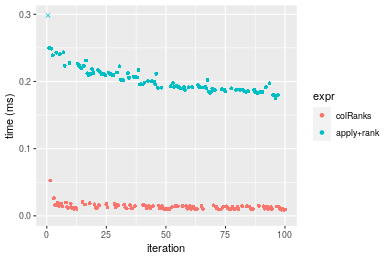

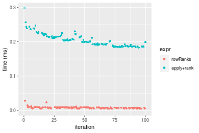
_Table: Benchmarking of colRanks() and rowRanks() on integer+10x10 data (original and transposed).  The top panel shows times in milliseconds and the bottom panel shows relative times._


|   |expr     |   min|      lq|     mean|  median|      uq|    max|
|:--|:--------|-----:|-------:|--------:|-------:|-------:|------:|
|2  |rowRanks | 4.989|  6.1185|  8.02154|  7.8220|  8.8080| 28.234|
|1  |colRanks | 9.014| 10.5370| 13.39953| 12.8095| 14.6875| 52.527|


|   |expr     |      min|       lq|     mean|   median|       uq|      max|
|:--|:--------|--------:|--------:|--------:|--------:|--------:|--------:|
|2  |rowRanks | 1.000000| 1.000000| 1.000000| 1.000000| 1.000000| 1.000000|
|1  |colRanks | 1.806775| 1.722154| 1.670444| 1.637625| 1.667518| 1.860416|

_Figure: Benchmarking of colRanks() and rowRanks() on integer+10x10 data (original and transposed).  Outliers are displayed as crosses. Times are in milliseconds._


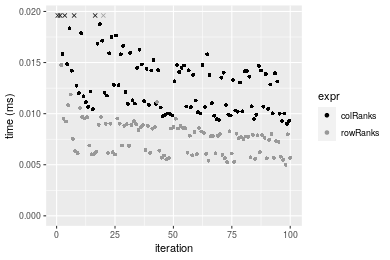

#### 100x100 integer matrix

```r
> X <- data[["100x100"]]
> gc()
           used  (Mb) gc trigger  (Mb) max used  (Mb)
Ncells  5284194 282.3    8529671 455.6  8529671 455.6
Vcells 10070418  76.9   31876688 243.2 60562128 462.1
> colStats <- microbenchmark(colRanks = colRanks(X, na.rm = FALSE), `apply+rank` = apply(X, MARGIN = 2L, 
+     FUN = rank, na.last = "keep", ties.method = "max"), unit = "ms")
> X <- t(X)
> gc()
           used  (Mb) gc trigger  (Mb) max used  (Mb)
Ncells  5284170 282.3    8529671 455.6  8529671 455.6
Vcells 10075431  76.9   31876688 243.2 60562128 462.1
> rowStats <- microbenchmark(rowRanks = rowRanks(X, na.rm = FALSE), `apply+rank` = apply(X, MARGIN = 1L, 
+     FUN = rank, na.last = "keep", ties.method = "max"), unit = "ms")
```

_Table: Benchmarking of colRanks() and apply+rank() on integer+100x100 data. The top panel shows times in milliseconds and the bottom panel shows relative times._


|   |expr       |      min|        lq|      mean|    median|        uq|      max|
|:--|:----------|--------:|---------:|---------:|---------:|---------:|--------:|
|1  |colRanks   | 0.325828| 0.3527675| 0.3651718| 0.3626235| 0.3707635| 0.581563|
|2  |apply+rank | 1.864600| 2.0197600| 2.1052778| 2.0485455| 2.0923125| 3.353820|


|   |expr       |      min|       lq|     mean|   median|       uq|      max|
|:--|:----------|--------:|--------:|--------:|--------:|--------:|--------:|
|1  |colRanks   | 1.000000| 1.000000| 1.000000| 1.000000| 1.000000| 1.000000|
|2  |apply+rank | 5.722651| 5.725471| 5.765171| 5.649235| 5.643254| 5.766908|

_Table: Benchmarking of rowRanks() and apply+rank() on integer+100x100 data (transposed). The top panel shows times in milliseconds and the bottom panel shows relative times._


|   |expr       |      min|        lq|      mean|   median|       uq|      max|
|:--|:----------|--------:|---------:|---------:|--------:|--------:|--------:|
|1  |rowRanks   | 0.312048| 0.3309755| 0.3471963| 0.341463| 0.349599| 0.448921|
|2  |apply+rank | 1.871260| 1.9599765| 2.0646226| 2.018016| 2.046404| 3.365877|


|   |expr       |      min|       lq|     mean|  median|       uq|      max|
|:--|:----------|--------:|--------:|--------:|-------:|--------:|--------:|
|1  |rowRanks   | 1.000000| 1.000000| 1.000000| 1.00000| 1.000000| 1.000000|
|2  |apply+rank | 5.996706| 5.921818| 5.946557| 5.90991| 5.853576| 7.497705|

_Figure: Benchmarking of colRanks() and apply+rank() on integer+100x100 data  as well as rowRanks() and apply+rank() on the same data transposed.  Outliers are displayed as crosses.  Times are in milliseconds._


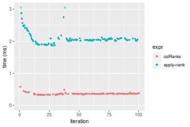

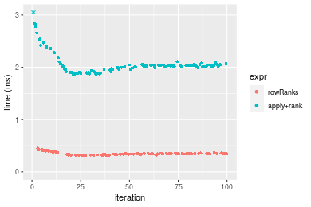
_Table: Benchmarking of colRanks() and rowRanks() on integer+100x100 data (original and transposed).  The top panel shows times in milliseconds and the bottom panel shows relative times._


|   |expr     |     min|       lq|     mean|   median|       uq|     max|
|:--|:--------|-------:|--------:|--------:|--------:|--------:|-------:|
|2  |rowRanks | 312.048| 330.9755| 347.1963| 341.4630| 349.5990| 448.921|
|1  |colRanks | 325.828| 352.7675| 365.1718| 362.6235| 370.7635| 581.563|


|   |expr     |     min|       lq|     mean|  median|       uq|      max|
|:--|:--------|-------:|--------:|--------:|-------:|--------:|--------:|
|2  |rowRanks | 1.00000| 1.000000| 1.000000| 1.00000| 1.000000| 1.000000|
|1  |colRanks | 1.04416| 1.065842| 1.051773| 1.06197| 1.060539| 1.295468|

_Figure: Benchmarking of colRanks() and rowRanks() on integer+100x100 data (original and transposed).  Outliers are displayed as crosses. Times are in milliseconds._


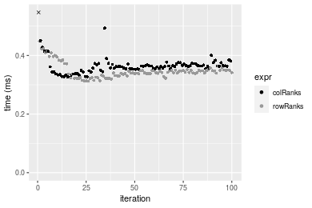

#### 1000x10 integer matrix

```r
> X <- data[["1000x10"]]
> gc()
           used  (Mb) gc trigger  (Mb) max used  (Mb)
Ncells  5284912 282.3    8529671 455.6  8529671 455.6
Vcells 10073904  76.9   31876688 243.2 60562128 462.1
> colStats <- microbenchmark(colRanks = colRanks(X, na.rm = FALSE), `apply+rank` = apply(X, MARGIN = 2L, 
+     FUN = rank, na.last = "keep", ties.method = "max"), unit = "ms")
> X <- t(X)
> gc()
           used  (Mb) gc trigger  (Mb) max used  (Mb)
Ncells  5284900 282.3    8529671 455.6  8529671 455.6
Vcells 10078937  76.9   31876688 243.2 60562128 462.1
> rowStats <- microbenchmark(rowRanks = rowRanks(X, na.rm = FALSE), `apply+rank` = apply(X, MARGIN = 1L, 
+     FUN = rank, na.last = "keep", ties.method = "max"), unit = "ms")
```

_Table: Benchmarking of colRanks() and apply+rank() on integer+1000x10 data. The top panel shows times in milliseconds and the bottom panel shows relative times._


|   |expr       |      min|       lq|      mean|    median|        uq|      max|
|:--|:----------|--------:|--------:|---------:|---------:|---------:|--------:|
|1  |colRanks   | 0.397505| 0.407839| 0.4404022| 0.4224085| 0.4402555| 0.695708|
|2  |apply+rank | 1.105536| 1.134754| 1.2163656| 1.1756700| 1.2188150| 1.784832|


|   |expr       |      min|       lq|     mean|   median|       uq|     max|
|:--|:----------|--------:|--------:|--------:|--------:|--------:|-------:|
|1  |colRanks   | 1.000000| 1.000000| 1.000000| 1.000000| 1.000000| 1.00000|
|2  |apply+rank | 2.781188| 2.782358| 2.761943| 2.783254| 2.768426| 2.56549|

_Table: Benchmarking of rowRanks() and apply+rank() on integer+1000x10 data (transposed). The top panel shows times in milliseconds and the bottom panel shows relative times._


|   |expr       |      min|       lq|      mean|    median|        uq|      max|
|:--|:----------|--------:|--------:|---------:|---------:|---------:|--------:|
|1  |rowRanks   | 0.383316| 0.394386| 0.4321836| 0.4079505| 0.4426085| 0.667490|
|2  |apply+rank | 1.108006| 1.129076| 1.2264912| 1.1675065| 1.2242945| 1.826586|


|   |expr       |      min|      lq|     mean|   median|       uq|      max|
|:--|:----------|--------:|-------:|--------:|--------:|--------:|--------:|
|1  |rowRanks   | 1.000000| 1.00000| 1.000000| 1.000000| 1.000000| 1.000000|
|2  |apply+rank | 2.890581| 2.86287| 2.837894| 2.861883| 2.766089| 2.736499|

_Figure: Benchmarking of colRanks() and apply+rank() on integer+1000x10 data  as well as rowRanks() and apply+rank() on the same data transposed.  Outliers are displayed as crosses.  Times are in milliseconds._


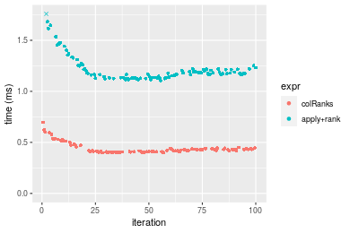

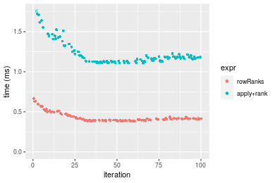
_Table: Benchmarking of colRanks() and rowRanks() on integer+1000x10 data (original and transposed).  The top panel shows times in milliseconds and the bottom panel shows relative times._


|   |expr     |     min|      lq|     mean|   median|       uq|     max|
|:--|:--------|-------:|-------:|--------:|--------:|--------:|-------:|
|2  |rowRanks | 383.316| 394.386| 432.1836| 407.9505| 442.6085| 667.490|
|1  |colRanks | 397.505| 407.839| 440.4022| 422.4085| 440.2555| 695.708|


|   |expr     |      min|       lq|     mean|   median|        uq|      max|
|:--|:--------|--------:|--------:|--------:|--------:|---------:|--------:|
|2  |rowRanks | 1.000000| 1.000000| 1.000000| 1.000000| 1.0000000| 1.000000|
|1  |colRanks | 1.037017| 1.034111| 1.019016| 1.035441| 0.9946838| 1.042275|

_Figure: Benchmarking of colRanks() and rowRanks() on integer+1000x10 data (original and transposed).  Outliers are displayed as crosses. Times are in milliseconds._


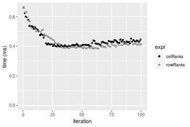

#### 10x1000 integer matrix

```r
> X <- data[["10x1000"]]
> gc()
           used  (Mb) gc trigger  (Mb) max used  (Mb)
Ncells  5285112 282.3    8529671 455.6  8529671 455.6
Vcells 10074607  76.9   31876688 243.2 60562128 462.1
> colStats <- microbenchmark(colRanks = colRanks(X, na.rm = FALSE), `apply+rank` = apply(X, MARGIN = 2L, 
+     FUN = rank, na.last = "keep", ties.method = "max"), unit = "ms")
> X <- t(X)
> gc()
           used  (Mb) gc trigger  (Mb) max used  (Mb)
Ncells  5285088 282.3    8529671 455.6  8529671 455.6
Vcells 10079620  77.0   31876688 243.2 60562128 462.1
> rowStats <- microbenchmark(rowRanks = rowRanks(X, na.rm = FALSE), `apply+rank` = apply(X, MARGIN = 1L, 
+     FUN = rank, na.last = "keep", ties.method = "max"), unit = "ms")
```

_Table: Benchmarking of colRanks() and apply+rank() on integer+10x1000 data. The top panel shows times in milliseconds and the bottom panel shows relative times._


|   |expr       |       min|         lq|       mean|    median|         uq|       max|
|:--|:----------|---------:|----------:|----------:|---------:|----------:|---------:|
|1  |colRanks   |  0.216078|  0.2409835|  0.2598046|  0.254758|  0.2749385|  0.425755|
|2  |apply+rank | 12.013302| 13.3925330| 13.9610522| 13.691698| 13.9690305| 20.377503|


|   |expr       |      min|       lq|     mean|   median|       uq|      max|
|:--|:----------|--------:|--------:|--------:|--------:|--------:|--------:|
|1  |colRanks   |  1.00000|  1.00000|  1.00000|  1.00000|  1.00000|  1.00000|
|2  |apply+rank | 55.59706| 55.57448| 53.73675| 53.74394| 50.80784| 47.86204|

_Table: Benchmarking of rowRanks() and apply+rank() on integer+10x1000 data (transposed). The top panel shows times in milliseconds and the bottom panel shows relative times._


|   |expr       |       min|        lq|       mean|    median|         uq|       max|
|:--|:----------|---------:|---------:|----------:|---------:|----------:|---------:|
|1  |rowRanks   |  0.203776|  0.223232|  0.2384098|  0.234122|  0.2514345|  0.314973|
|2  |apply+rank | 12.115854| 13.489060| 14.0031462| 13.754625| 13.9876730| 20.612579|


|   |expr       |      min|       lq|    mean|   median|       uq|      max|
|:--|:----------|--------:|--------:|-------:|--------:|--------:|--------:|
|1  |rowRanks   |  1.00000|  1.00000|  1.0000|  1.00000|  1.00000|  1.00000|
|2  |apply+rank | 59.45673| 60.42619| 58.7356| 58.74982| 55.63148| 65.44237|

_Figure: Benchmarking of colRanks() and apply+rank() on integer+10x1000 data  as well as rowRanks() and apply+rank() on the same data transposed.  Outliers are displayed as crosses.  Times are in milliseconds._


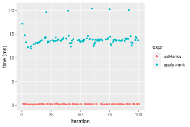


_Table: Benchmarking of colRanks() and rowRanks() on integer+10x1000 data (original and transposed).  The top panel shows times in milliseconds and the bottom panel shows relative times._


|   |expr     |     min|       lq|     mean|  median|       uq|     max|
|:--|:--------|-------:|--------:|--------:|-------:|--------:|-------:|
|2  |rowRanks | 203.776| 223.2320| 238.4099| 234.122| 251.4345| 314.973|
|1  |colRanks | 216.078| 240.9835| 259.8046| 254.758| 274.9385| 425.755|


|   |expr     |     min|      lq|     mean|   median|      uq|      max|
|:--|:--------|-------:|-------:|--------:|--------:|-------:|--------:|
|2  |rowRanks | 1.00000| 1.00000| 1.000000| 1.000000| 1.00000| 1.000000|
|1  |colRanks | 1.06037| 1.07952| 1.089739| 1.088142| 1.09348| 1.351719|

_Figure: Benchmarking of colRanks() and rowRanks() on integer+10x1000 data (original and transposed).  Outliers are displayed as crosses. Times are in milliseconds._


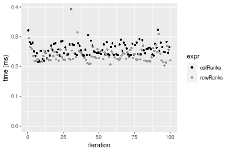

#### 100x1000 integer matrix

```r
> X <- data[["100x1000"]]
> gc()
           used  (Mb) gc trigger  (Mb) max used  (Mb)
Ncells  5285284 282.3    8529671 455.6  8529671 455.6
Vcells 10075078  76.9   31876688 243.2 60562128 462.1
> colStats <- microbenchmark(colRanks = colRanks(X, na.rm = FALSE), `apply+rank` = apply(X, MARGIN = 2L, 
+     FUN = rank, na.last = "keep", ties.method = "max"), unit = "ms")
> X <- t(X)
> gc()
           used  (Mb) gc trigger  (Mb) max used  (Mb)
Ncells  5285272 282.3    8529671 455.6  8529671 455.6
Vcells 10125111  77.3   31876688 243.2 60562128 462.1
> rowStats <- microbenchmark(rowRanks = rowRanks(X, na.rm = FALSE), `apply+rank` = apply(X, MARGIN = 1L, 
+     FUN = rank, na.last = "keep", ties.method = "max"), unit = "ms")
```

_Table: Benchmarking of colRanks() and apply+rank() on integer+100x1000 data. The top panel shows times in milliseconds and the bottom panel shows relative times._


|   |expr       |       min|        lq|      mean|    median|        uq|       max|
|:--|:----------|---------:|---------:|---------:|---------:|---------:|---------:|
|1  |colRanks   |  3.248488|  3.566107|  3.621077|  3.598609|  3.674085|  4.118365|
|2  |apply+rank | 18.941262| 20.733461| 21.804195| 20.894393| 21.177508| 39.260674|


|   |expr       |      min|       lq|     mean|   median|       uq|      max|
|:--|:----------|--------:|--------:|--------:|--------:|--------:|--------:|
|1  |colRanks   | 1.000000| 1.000000| 1.000000| 1.000000| 1.000000| 1.000000|
|2  |apply+rank | 5.830793| 5.814033| 6.021467| 5.806242| 5.764023| 9.533073|

_Table: Benchmarking of rowRanks() and apply+rank() on integer+100x1000 data (transposed). The top panel shows times in milliseconds and the bottom panel shows relative times._


|   |expr       |       min|        lq|      mean|    median|        uq|       max|
|:--|:----------|---------:|---------:|---------:|---------:|---------:|---------:|
|1  |rowRanks   |  3.104706|  3.446195|  3.516167|  3.516754|  3.584367|  4.058024|
|2  |apply+rank | 18.931283| 20.580648| 21.969310| 20.857215| 21.076720| 51.496457|


|   |expr       |      min|       lq|     mean|   median|       uq|      max|
|:--|:----------|--------:|--------:|--------:|--------:|--------:|--------:|
|1  |rowRanks   | 1.000000| 1.000000| 1.000000| 1.000000| 1.000000|  1.00000|
|2  |apply+rank | 6.097609| 5.971991| 6.248085| 5.930815| 5.880178| 12.69003|

_Figure: Benchmarking of colRanks() and apply+rank() on integer+100x1000 data  as well as rowRanks() and apply+rank() on the same data transposed.  Outliers are displayed as crosses.  Times are in milliseconds._


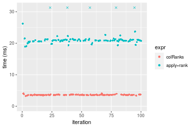

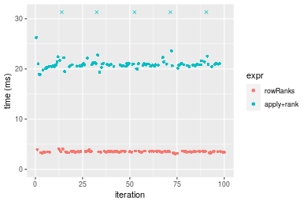
_Table: Benchmarking of colRanks() and rowRanks() on integer+100x1000 data (original and transposed).  The top panel shows times in milliseconds and the bottom panel shows relative times._


|   |expr     |      min|       lq|     mean|   median|       uq|      max|
|:--|:--------|--------:|--------:|--------:|--------:|--------:|--------:|
|2  |rowRanks | 3.104706| 3.446195| 3.516167| 3.516754| 3.584367| 4.058024|
|1  |colRanks | 3.248488| 3.566107| 3.621077| 3.598609| 3.674085| 4.118365|


|   |expr     |      min|       lq|     mean|   median|      uq|     max|
|:--|:--------|--------:|--------:|--------:|--------:|-------:|-------:|
|2  |rowRanks | 1.000000| 1.000000| 1.000000| 1.000000| 1.00000| 1.00000|
|1  |colRanks | 1.046311| 1.034795| 1.029836| 1.023276| 1.02503| 1.01487|

_Figure: Benchmarking of colRanks() and rowRanks() on integer+100x1000 data (original and transposed).  Outliers are displayed as crosses. Times are in milliseconds._


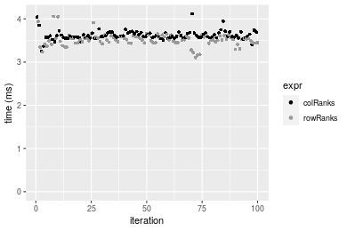

#### 1000x100 integer matrix

```r
> X <- data[["1000x100"]]
> gc()
           used  (Mb) gc trigger  (Mb) max used  (Mb)
Ncells  5285476 282.3    8529671 455.6  8529671 455.6
Vcells 10075645  76.9   31876688 243.2 60562128 462.1
> colStats <- microbenchmark(colRanks = colRanks(X, na.rm = FALSE), `apply+rank` = apply(X, MARGIN = 2L, 
+     FUN = rank, na.last = "keep", ties.method = "max"), unit = "ms")
> X <- t(X)
> gc()
           used  (Mb) gc trigger  (Mb) max used  (Mb)
Ncells  5285464 282.3    8529671 455.6  8529671 455.6
Vcells 10125678  77.3   31876688 243.2 60562128 462.1
> rowStats <- microbenchmark(rowRanks = rowRanks(X, na.rm = FALSE), `apply+rank` = apply(X, MARGIN = 1L, 
+     FUN = rank, na.last = "keep", ties.method = "max"), unit = "ms")
```

_Table: Benchmarking of colRanks() and apply+rank() on integer+1000x100 data. The top panel shows times in milliseconds and the bottom panel shows relative times._


|   |expr       |       min|        lq|      mean|    median|        uq|       max|
|:--|:----------|---------:|---------:|---------:|---------:|---------:|---------:|
|1  |colRanks   |  3.942987|  4.361862|  4.395244|  4.393266|  4.433484|  6.156542|
|2  |apply+rank | 10.887000| 11.634628| 12.117281| 11.822842| 11.887505| 22.256348|


|   |expr       |      min|       lq|     mean|   median|       uq|      max|
|:--|:----------|--------:|--------:|--------:|--------:|--------:|--------:|
|1  |colRanks   | 1.000000| 1.000000| 1.000000| 1.000000| 1.000000| 1.000000|
|2  |apply+rank | 2.761105| 2.667353| 2.756908| 2.691128| 2.681301| 3.615073|

_Table: Benchmarking of rowRanks() and apply+rank() on integer+1000x100 data (transposed). The top panel shows times in milliseconds and the bottom panel shows relative times._


|   |expr       |       min|        lq|      mean|    median|        uq|       max|
|:--|:----------|---------:|---------:|---------:|---------:|---------:|---------:|
|1  |rowRanks   |  3.833533|  4.201035|  4.252639|  4.265088|  4.285115|  4.674939|
|2  |apply+rank | 10.765966| 11.724815| 12.162356| 11.850800| 11.911581| 22.778089|


|   |expr       |      min|       lq|     mean|   median|       uq|      max|
|:--|:----------|--------:|--------:|--------:|--------:|--------:|--------:|
|1  |rowRanks   | 1.000000| 1.000000| 1.000000| 1.000000| 1.000000| 1.000000|
|2  |apply+rank | 2.808367| 2.790934| 2.859955| 2.778559| 2.779757| 4.872382|

_Figure: Benchmarking of colRanks() and apply+rank() on integer+1000x100 data  as well as rowRanks() and apply+rank() on the same data transposed.  Outliers are displayed as crosses.  Times are in milliseconds._


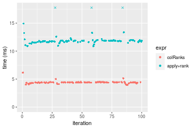

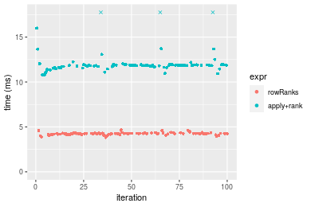
_Table: Benchmarking of colRanks() and rowRanks() on integer+1000x100 data (original and transposed).  The top panel shows times in milliseconds and the bottom panel shows relative times._


|   |expr     |      min|       lq|     mean|   median|       uq|      max|
|:--|:--------|--------:|--------:|--------:|--------:|--------:|--------:|
|2  |rowRanks | 3.833533| 4.201035| 4.252639| 4.265088| 4.285115| 4.674939|
|1  |colRanks | 3.942987| 4.361862| 4.395244| 4.393266| 4.433484| 6.156542|


|   |expr     |      min|       lq|     mean|   median|       uq|      max|
|:--|:--------|--------:|--------:|--------:|--------:|--------:|--------:|
|2  |rowRanks | 1.000000| 1.000000| 1.000000| 1.000000| 1.000000| 1.000000|
|1  |colRanks | 1.028552| 1.038283| 1.033533| 1.030053| 1.034624| 1.316925|

_Figure: Benchmarking of colRanks() and rowRanks() on integer+1000x100 data (original and transposed).  Outliers are displayed as crosses. Times are in milliseconds._


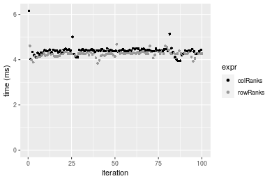


## Data type "double"

### Data
```r
> rmatrix <- function(nrow, ncol, mode = c("logical", "double", "integer", "index"), range = c(-100, 
+     +100), na_prob = 0) {
+     mode <- match.arg(mode)
+     n <- nrow * ncol
+     if (mode == "logical") {
+         x <- sample(c(FALSE, TRUE), size = n, replace = TRUE)
+     }     else if (mode == "index") {
+         x <- seq_len(n)
+         mode <- "integer"
+     }     else {
+         x <- runif(n, min = range[1], max = range[2])
+     }
+     storage.mode(x) <- mode
+     if (na_prob > 0) 
+         x[sample(n, size = na_prob * n)] <- NA
+     dim(x) <- c(nrow, ncol)
+     x
+ }
> rmatrices <- function(scale = 10, seed = 1, ...) {
+     set.seed(seed)
+     data <- list()
+     data[[1]] <- rmatrix(nrow = scale * 1, ncol = scale * 1, ...)
+     data[[2]] <- rmatrix(nrow = scale * 10, ncol = scale * 10, ...)
+     data[[3]] <- rmatrix(nrow = scale * 100, ncol = scale * 1, ...)
+     data[[4]] <- t(data[[3]])
+     data[[5]] <- rmatrix(nrow = scale * 10, ncol = scale * 100, ...)
+     data[[6]] <- t(data[[5]])
+     names(data) <- sapply(data, FUN = function(x) paste(dim(x), collapse = "x"))
+     data
+ }
> data <- rmatrices(mode = mode)
```

### Results

#### 10x10 double matrix

```r
> X <- data[["10x10"]]
> gc()
           used  (Mb) gc trigger  (Mb) max used  (Mb)
Ncells  5285688 282.3    8529671 455.6  8529671 455.6
Vcells 10192030  77.8   31876688 243.2 60562128 462.1
> colStats <- microbenchmark(colRanks = colRanks(X, na.rm = FALSE), `apply+rank` = apply(X, MARGIN = 2L, 
+     FUN = rank, na.last = "keep", ties.method = "max"), unit = "ms")
> X <- t(X)
> gc()
           used  (Mb) gc trigger  (Mb) max used  (Mb)
Ncells  5285655 282.3    8529671 455.6  8529671 455.6
Vcells 10192128  77.8   31876688 243.2 60562128 462.1
> rowStats <- microbenchmark(rowRanks = rowRanks(X, na.rm = FALSE), `apply+rank` = apply(X, MARGIN = 1L, 
+     FUN = rank, na.last = "keep", ties.method = "max"), unit = "ms")
```

_Table: Benchmarking of colRanks() and apply+rank() on double+10x10 data. The top panel shows times in milliseconds and the bottom panel shows relative times._


|   |expr       |      min|       lq|      mean|   median|        uq|      max|
|:--|:----------|--------:|--------:|---------:|--------:|---------:|--------:|
|1  |colRanks   | 0.009555| 0.010656| 0.0141985| 0.013300| 0.0152465| 0.047735|
|2  |apply+rank | 0.182566| 0.189651| 0.2079538| 0.205343| 0.2169530| 0.364796|


|   |expr       |      min|       lq|     mean|   median|       uq|      max|
|:--|:----------|--------:|--------:|--------:|--------:|--------:|--------:|
|1  |colRanks   |  1.00000|  1.00000|  1.00000|  1.00000|  1.00000| 1.000000|
|2  |apply+rank | 19.10685| 17.79758| 14.64621| 15.43932| 14.22969| 7.642107|

_Table: Benchmarking of rowRanks() and apply+rank() on double+10x10 data (transposed). The top panel shows times in milliseconds and the bottom panel shows relative times._


|   |expr       |      min|       lq|      mean|    median|       uq|      max|
|:--|:----------|--------:|--------:|---------:|---------:|--------:|--------:|
|1  |rowRanks   | 0.005091| 0.006504| 0.0082866| 0.0081635| 0.008798| 0.027020|
|2  |apply+rank | 0.185103| 0.193652| 0.2095009| 0.2054140| 0.217777| 0.362862|


|   |expr       |      min|       lq|     mean|   median|       uq|      max|
|:--|:----------|--------:|--------:|--------:|--------:|--------:|--------:|
|1  |rowRanks   |  1.00000|  1.00000|  1.00000|  1.00000|  1.00000|  1.00000|
|2  |apply+rank | 36.35887| 29.77429| 25.28198| 25.16249| 24.75301| 13.42939|

_Figure: Benchmarking of colRanks() and apply+rank() on double+10x10 data  as well as rowRanks() and apply+rank() on the same data transposed.  Outliers are displayed as crosses.  Times are in milliseconds._


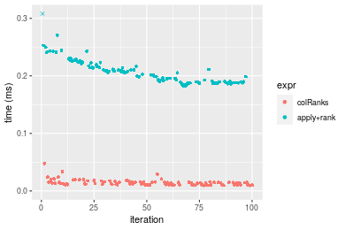

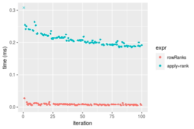
_Table: Benchmarking of colRanks() and rowRanks() on double+10x10 data (original and transposed).  The top panel shows times in milliseconds and the bottom panel shows relative times._


|   |expr     |   min|     lq|     mean|  median|      uq|    max|
|:--|:--------|-----:|------:|--------:|-------:|-------:|------:|
|2  |rowRanks | 5.091|  6.504|  8.28657|  8.1635|  8.7980| 27.020|
|1  |colRanks | 9.555| 10.656| 14.19847| 13.3000| 15.2465| 47.735|


|   |expr     |      min|       lq|     mean|   median|       uq|      max|
|:--|:--------|--------:|--------:|--------:|--------:|--------:|--------:|
|2  |rowRanks | 1.000000| 1.000000| 1.000000| 1.000000| 1.000000| 1.000000|
|1  |colRanks | 1.876842| 1.638376| 1.713431| 1.629203| 1.732951| 1.766654|

_Figure: Benchmarking of colRanks() and rowRanks() on double+10x10 data (original and transposed).  Outliers are displayed as crosses. Times are in milliseconds._


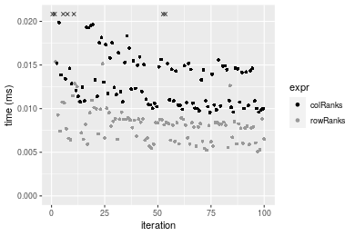

#### 100x100 double matrix

```r
> X <- data[["100x100"]]
> gc()
           used  (Mb) gc trigger  (Mb) max used  (Mb)
Ncells  5285868 282.3    8529671 455.6  8529671 455.6
Vcells 10192142  77.8   31876688 243.2 60562128 462.1
> colStats <- microbenchmark(colRanks = colRanks(X, na.rm = FALSE), `apply+rank` = apply(X, MARGIN = 2L, 
+     FUN = rank, na.last = "keep", ties.method = "max"), unit = "ms")
> X <- t(X)
> gc()
           used  (Mb) gc trigger  (Mb) max used  (Mb)
Ncells  5285844 282.3    8529671 455.6  8529671 455.6
Vcells 10202155  77.9   31876688 243.2 60562128 462.1
> rowStats <- microbenchmark(rowRanks = rowRanks(X, na.rm = FALSE), `apply+rank` = apply(X, MARGIN = 1L, 
+     FUN = rank, na.last = "keep", ties.method = "max"), unit = "ms")
```

_Table: Benchmarking of colRanks() and apply+rank() on double+100x100 data. The top panel shows times in milliseconds and the bottom panel shows relative times._


|   |expr       |      min|        lq|     mean|    median|        uq|      max|
|:--|:----------|--------:|---------:|--------:|---------:|---------:|--------:|
|1  |colRanks   | 0.343319| 0.3768595| 0.390581| 0.3842895| 0.3940605| 0.854856|
|2  |apply+rank | 1.849059| 2.0032120| 2.104805| 2.0542620| 2.0862225| 3.574331|


|   |expr       |      min|       lq|     mean|   median|       uq|      max|
|:--|:----------|--------:|--------:|--------:|--------:|--------:|--------:|
|1  |colRanks   | 1.000000| 1.000000| 1.000000| 1.000000| 1.000000| 1.000000|
|2  |apply+rank | 5.385834| 5.315541| 5.388908| 5.345611| 5.294168| 4.181208|

_Table: Benchmarking of rowRanks() and apply+rank() on double+100x100 data (transposed). The top panel shows times in milliseconds and the bottom panel shows relative times._


|   |expr       |      min|       lq|      mean|    median|       uq|      max|
|:--|:----------|--------:|--------:|---------:|---------:|--------:|--------:|
|1  |rowRanks   | 0.323700| 0.354027| 0.3697664| 0.3648245| 0.374326| 0.482087|
|2  |apply+rank | 1.858874| 2.003887| 2.1127440| 2.0533810| 2.090122| 4.298257|


|   |expr       |      min|       lq|     mean|   median|       uq|      max|
|:--|:----------|--------:|--------:|--------:|--------:|--------:|--------:|
|1  |rowRanks   | 1.000000| 1.000000| 1.000000| 1.000000| 1.000000| 1.000000|
|2  |apply+rank | 5.742583| 5.660267| 5.713726| 5.628408| 5.583694| 8.915936|

_Figure: Benchmarking of colRanks() and apply+rank() on double+100x100 data  as well as rowRanks() and apply+rank() on the same data transposed.  Outliers are displayed as crosses.  Times are in milliseconds._


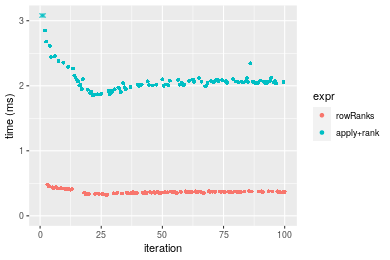
_Table: Benchmarking of colRanks() and rowRanks() on double+100x100 data (original and transposed).  The top panel shows times in milliseconds and the bottom panel shows relative times._


|   |expr     |     min|       lq|     mean|   median|       uq|     max|
|:--|:--------|-------:|--------:|--------:|--------:|--------:|-------:|
|2  |rowRanks | 323.700| 354.0270| 369.7664| 364.8245| 374.3260| 482.087|
|1  |colRanks | 343.319| 376.8595| 390.5810| 384.2895| 394.0605| 854.856|


|   |expr     |      min|       lq|     mean|   median|      uq|     max|
|:--|:--------|--------:|--------:|--------:|--------:|-------:|-------:|
|2  |rowRanks | 1.000000| 1.000000| 1.000000| 1.000000| 1.00000| 1.00000|
|1  |colRanks | 1.060609| 1.064494| 1.056291| 1.053354| 1.05272| 1.77324|

_Figure: Benchmarking of colRanks() and rowRanks() on double+100x100 data (original and transposed).  Outliers are displayed as crosses. Times are in milliseconds._


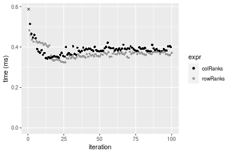

#### 1000x10 double matrix

```r
> X <- data[["1000x10"]]
> gc()
           used  (Mb) gc trigger  (Mb) max used  (Mb)
Ncells  5286046 282.4    8529671 455.6  8529671 455.6
Vcells 10193014  77.8   31876688 243.2 60562128 462.1
> colStats <- microbenchmark(colRanks = colRanks(X, na.rm = FALSE), `apply+rank` = apply(X, MARGIN = 2L, 
+     FUN = rank, na.last = "keep", ties.method = "max"), unit = "ms")
> X <- t(X)
> gc()
           used  (Mb) gc trigger  (Mb) max used  (Mb)
Ncells  5286034 282.4    8529671 455.6  8529671 455.6
Vcells 10203047  77.9   31876688 243.2 60562128 462.1
> rowStats <- microbenchmark(rowRanks = rowRanks(X, na.rm = FALSE), `apply+rank` = apply(X, MARGIN = 1L, 
+     FUN = rank, na.last = "keep", ties.method = "max"), unit = "ms")
```

_Table: Benchmarking of colRanks() and apply+rank() on double+1000x10 data. The top panel shows times in milliseconds and the bottom panel shows relative times._


|   |expr       |      min|       lq|      mean|    median|       uq|      max|
|:--|:----------|--------:|--------:|---------:|---------:|--------:|--------:|
|1  |colRanks   | 0.462211| 0.485145| 0.5259032| 0.5110025| 0.524363| 0.813817|
|2  |apply+rank | 1.021246| 1.080353| 1.1444088| 1.1102830| 1.142707| 1.667586|


|   |expr       |     min|       lq|     mean|   median|      uq|      max|
|:--|:----------|-------:|--------:|--------:|--------:|-------:|--------:|
|1  |colRanks   | 1.00000| 1.000000| 1.000000| 1.000000| 1.00000| 1.000000|
|2  |apply+rank | 2.20948| 2.226865| 2.176083| 2.172754| 2.17923| 2.049092|

_Table: Benchmarking of rowRanks() and apply+rank() on double+1000x10 data (transposed). The top panel shows times in milliseconds and the bottom panel shows relative times._


|   |expr       |      min|        lq|      mean|   median|       uq|      max|
|:--|:----------|--------:|---------:|---------:|--------:|--------:|--------:|
|1  |rowRanks   | 0.450571| 0.4714095| 0.5082708| 0.491185| 0.509915| 0.776035|
|2  |apply+rank | 1.023346| 1.0720225| 1.1379772| 1.103052| 1.125317| 1.683360|


|   |expr       |     min|       lq|     mean|   median|       uq|     max|
|:--|:----------|-------:|--------:|--------:|--------:|--------:|-------:|
|1  |rowRanks   | 1.00000| 1.000000| 1.000000| 1.000000| 1.000000| 1.00000|
|2  |apply+rank | 2.27122| 2.274079| 2.238919| 2.245696| 2.206873| 2.16918|

_Figure: Benchmarking of colRanks() and apply+rank() on double+1000x10 data  as well as rowRanks() and apply+rank() on the same data transposed.  Outliers are displayed as crosses.  Times are in milliseconds._


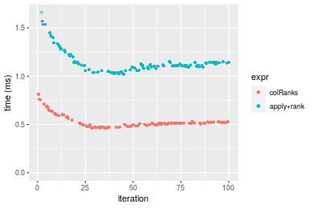

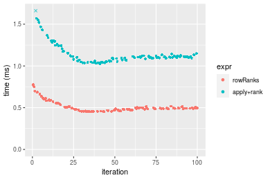
_Table: Benchmarking of colRanks() and rowRanks() on double+1000x10 data (original and transposed).  The top panel shows times in milliseconds and the bottom panel shows relative times._


|   |expr     |     min|       lq|     mean|   median|      uq|     max|
|:--|:--------|-------:|--------:|--------:|--------:|-------:|-------:|
|2  |rowRanks | 450.571| 471.4095| 508.2708| 491.1850| 509.915| 776.035|
|1  |colRanks | 462.211| 485.1450| 525.9032| 511.0025| 524.363| 813.817|


|   |expr     |      min|       lq|     mean|   median|       uq|      max|
|:--|:--------|--------:|--------:|--------:|--------:|--------:|--------:|
|2  |rowRanks | 1.000000| 1.000000| 1.000000| 1.000000| 1.000000| 1.000000|
|1  |colRanks | 1.025834| 1.029137| 1.034691| 1.040346| 1.028334| 1.048686|

_Figure: Benchmarking of colRanks() and rowRanks() on double+1000x10 data (original and transposed).  Outliers are displayed as crosses. Times are in milliseconds._


#### 10x1000 double matrix

```r
> X <- data[["10x1000"]]
> gc()
           used  (Mb) gc trigger  (Mb) max used  (Mb)
Ncells  5286246 282.4    8529671 455.6  8529671 455.6
Vcells 10193159  77.8   31876688 243.2 60562128 462.1
> colStats <- microbenchmark(colRanks = colRanks(X, na.rm = FALSE), `apply+rank` = apply(X, MARGIN = 2L, 
+     FUN = rank, na.last = "keep", ties.method = "max"), unit = "ms")
> X <- t(X)
> gc()
           used  (Mb) gc trigger  (Mb) max used  (Mb)
Ncells  5286222 282.4    8529671 455.6  8529671 455.6
Vcells 10203172  77.9   31876688 243.2 60562128 462.1
> rowStats <- microbenchmark(rowRanks = rowRanks(X, na.rm = FALSE), `apply+rank` = apply(X, MARGIN = 1L, 
+     FUN = rank, na.last = "keep", ties.method = "max"), unit = "ms")
```

_Table: Benchmarking of colRanks() and apply+rank() on double+10x1000 data. The top panel shows times in milliseconds and the bottom panel shows relative times._


|   |expr       |       min|        lq|      mean|    median|         uq|       max|
|:--|:----------|---------:|---------:|---------:|---------:|----------:|---------:|
|1  |colRanks   |  0.230283|  0.263288|  0.279568|  0.276878|  0.2959895|  0.338731|
|2  |apply+rank | 12.181609| 13.703907| 14.387166| 14.026328| 14.3931825| 20.739693|


|   |expr       |      min|       lq|     mean|   median|       uq|      max|
|:--|:----------|--------:|--------:|--------:|--------:|--------:|--------:|
|1  |colRanks   |  1.00000|  1.00000|  1.00000|  1.00000|  1.00000|  1.00000|
|2  |apply+rank | 52.89843| 52.04911| 51.46214| 50.65887| 48.62734| 61.22762|

_Table: Benchmarking of rowRanks() and apply+rank() on double+10x1000 data (transposed). The top panel shows times in milliseconds and the bottom panel shows relative times._


|   |expr       |       min|        lq|       mean|     median|        uq|       max|
|:--|:----------|---------:|---------:|----------:|----------:|---------:|---------:|
|1  |rowRanks   |  0.219818|  0.244094|  0.2615913|  0.2560935|  0.270608|  0.724304|
|2  |apply+rank | 12.066414| 13.535125| 14.1237460| 13.8348695| 14.177196| 20.985527|


|   |expr       |      min|       lq|     mean|   median|       uq|      max|
|:--|:----------|--------:|--------:|--------:|--------:|--------:|--------:|
|1  |rowRanks   |  1.00000|  1.00000|  1.00000|  1.00000|  1.00000|  1.00000|
|2  |apply+rank | 54.89275| 55.45046| 53.99166| 54.02273| 52.39016| 28.97337|

_Figure: Benchmarking of colRanks() and apply+rank() on double+10x1000 data  as well as rowRanks() and apply+rank() on the same data transposed.  Outliers are displayed as crosses.  Times are in milliseconds._


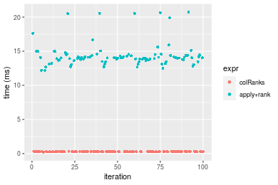

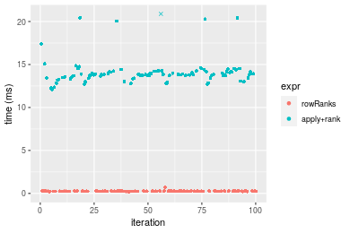
_Table: Benchmarking of colRanks() and rowRanks() on double+10x1000 data (original and transposed).  The top panel shows times in milliseconds and the bottom panel shows relative times._


|   |expr     |     min|      lq|     mean|   median|       uq|     max|
|:--|:--------|-------:|-------:|--------:|--------:|--------:|-------:|
|2  |rowRanks | 219.818| 244.094| 261.5913| 256.0935| 270.6080| 724.304|
|1  |colRanks | 230.283| 263.288| 279.5680| 276.8780| 295.9895| 338.731|


|   |expr     |      min|       lq|     mean|  median|       uq|       max|
|:--|:--------|--------:|--------:|--------:|-------:|--------:|---------:|
|2  |rowRanks | 1.000000| 1.000000| 1.000000| 1.00000| 1.000000| 1.0000000|
|1  |colRanks | 1.047608| 1.078634| 1.068721| 1.08116| 1.093794| 0.4676641|

_Figure: Benchmarking of colRanks() and rowRanks() on double+10x1000 data (original and transposed).  Outliers are displayed as crosses. Times are in milliseconds._


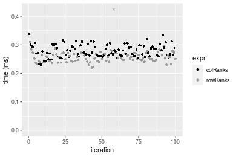

#### 100x1000 double matrix

```r
> X <- data[["100x1000"]]
> gc()
           used  (Mb) gc trigger  (Mb) max used  (Mb)
Ncells  5286418 282.4    8529671 455.6  8529671 455.6
Vcells 10194275  77.8   31876688 243.2 60562128 462.1
> colStats <- microbenchmark(colRanks = colRanks(X, na.rm = FALSE), `apply+rank` = apply(X, MARGIN = 2L, 
+     FUN = rank, na.last = "keep", ties.method = "max"), unit = "ms")
> X <- t(X)
> gc()
           used  (Mb) gc trigger  (Mb) max used  (Mb)
Ncells  5286406 282.4    8529671 455.6  8529671 455.6
Vcells 10294308  78.6   31876688 243.2 60562128 462.1
> rowStats <- microbenchmark(rowRanks = rowRanks(X, na.rm = FALSE), `apply+rank` = apply(X, MARGIN = 1L, 
+     FUN = rank, na.last = "keep", ties.method = "max"), unit = "ms")
```

_Table: Benchmarking of colRanks() and apply+rank() on double+100x1000 data. The top panel shows times in milliseconds and the bottom panel shows relative times._


|   |expr       |       min|        lq|      mean|   median|        uq|       max|
|:--|:----------|---------:|---------:|---------:|--------:|---------:|---------:|
|1  |colRanks   |  3.424245|  3.785846|  3.855124|  3.84398|  3.900854|  4.369634|
|2  |apply+rank | 18.444679| 20.476261| 21.679959| 20.73822| 20.973694| 40.490981|


|   |expr       |      min|       lq|     mean|   median|       uq|      max|
|:--|:----------|--------:|--------:|--------:|--------:|--------:|--------:|
|1  |colRanks   | 1.000000| 1.000000| 1.000000| 1.000000| 1.000000| 1.000000|
|2  |apply+rank | 5.386495| 5.408636| 5.623674| 5.394986| 5.376692| 9.266447|

_Table: Benchmarking of rowRanks() and apply+rank() on double+100x1000 data (transposed). The top panel shows times in milliseconds and the bottom panel shows relative times._


|   |expr       |       min|        lq|      mean|    median|        uq|      max|
|:--|:----------|---------:|---------:|---------:|---------:|---------:|--------:|
|1  |rowRanks   |  3.400866|  3.680077|  3.745937|  3.749219|  3.835295|  4.18335|
|2  |apply+rank | 18.868889| 20.590027| 21.827391| 20.867936| 21.153279| 40.97736|


|   |expr       |     min|       lq|     mean|   median|       uq|      max|
|:--|:----------|-------:|--------:|--------:|--------:|--------:|--------:|
|1  |rowRanks   | 1.00000| 1.000000| 1.000000| 1.000000| 1.000000| 1.000000|
|2  |apply+rank | 5.54826| 5.594999| 5.826951| 5.565943| 5.515423| 9.795345|

_Figure: Benchmarking of colRanks() and apply+rank() on double+100x1000 data  as well as rowRanks() and apply+rank() on the same data transposed.  Outliers are displayed as crosses.  Times are in milliseconds._


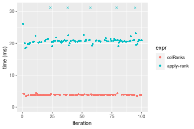

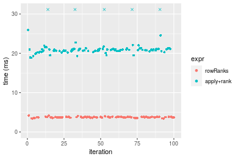
_Table: Benchmarking of colRanks() and rowRanks() on double+100x1000 data (original and transposed).  The top panel shows times in milliseconds and the bottom panel shows relative times._


|   |expr     |      min|       lq|     mean|   median|       uq|      max|
|:--|:--------|--------:|--------:|--------:|--------:|--------:|--------:|
|2  |rowRanks | 3.400866| 3.680077| 3.745937| 3.749219| 3.835295| 4.183350|
|1  |colRanks | 3.424245| 3.785846| 3.855124| 3.843980| 3.900854| 4.369634|


|   |expr     |      min|       lq|     mean|   median|       uq|     max|
|:--|:--------|--------:|--------:|--------:|--------:|--------:|-------:|
|2  |rowRanks | 1.000000| 1.000000| 1.000000| 1.000000| 1.000000| 1.00000|
|1  |colRanks | 1.006874| 1.028741| 1.029148| 1.025275| 1.017094| 1.04453|

_Figure: Benchmarking of colRanks() and rowRanks() on double+100x1000 data (original and transposed).  Outliers are displayed as crosses. Times are in milliseconds._


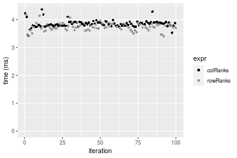

#### 1000x100 double matrix

```r
> X <- data[["1000x100"]]
> gc()
           used  (Mb) gc trigger  (Mb) max used  (Mb)
Ncells  5286610 282.4    8529671 455.6  8529671 455.6
Vcells 10194404  77.8   31876688 243.2 60562128 462.1
> colStats <- microbenchmark(colRanks = colRanks(X, na.rm = FALSE), `apply+rank` = apply(X, MARGIN = 2L, 
+     FUN = rank, na.last = "keep", ties.method = "max"), unit = "ms")
> X <- t(X)
> gc()
           used  (Mb) gc trigger  (Mb) max used  (Mb)
Ncells  5286598 282.4    8529671 455.6  8529671 455.6
Vcells 10294437  78.6   31876688 243.2 60562128 462.1
> rowStats <- microbenchmark(rowRanks = rowRanks(X, na.rm = FALSE), `apply+rank` = apply(X, MARGIN = 1L, 
+     FUN = rank, na.last = "keep", ties.method = "max"), unit = "ms")
```

_Table: Benchmarking of colRanks() and apply+rank() on double+1000x100 data. The top panel shows times in milliseconds and the bottom panel shows relative times._


|   |expr       |      min|        lq|      mean|    median|        uq|       max|
|:--|:----------|--------:|---------:|---------:|---------:|---------:|---------:|
|1  |colRanks   | 4.636599|  5.116938|  5.191458|  5.153241|  5.251645|  7.086629|
|2  |apply+rank | 9.938401| 10.928384| 11.522790| 11.024809| 11.201870| 22.739847|


|   |expr       |      min|       lq|     mean|   median|       uq|      max|
|:--|:----------|--------:|--------:|--------:|--------:|--------:|--------:|
|1  |colRanks   | 1.000000| 1.000000| 1.000000| 1.000000| 1.000000| 1.000000|
|2  |apply+rank | 2.143468| 2.135727| 2.219567| 2.139393| 2.133021| 3.208838|

_Table: Benchmarking of rowRanks() and apply+rank() on double+1000x100 data (transposed). The top panel shows times in milliseconds and the bottom panel shows relative times._


|   |expr       |       min|        lq|     mean|    median|        uq|       max|
|:--|:----------|---------:|---------:|--------:|---------:|---------:|---------:|
|1  |rowRanks   |  4.491859|  4.943079|  5.01660|  4.988339|  5.100483|  5.768094|
|2  |apply+rank | 10.005577| 10.977875| 11.50196| 11.076504| 11.251563| 20.954353|


|   |expr       |      min|       lq|    mean|  median|      uq|      max|
|:--|:----------|--------:|--------:|-------:|-------:|-------:|--------:|
|1  |rowRanks   | 1.000000| 1.000000| 1.00000| 1.00000| 1.00000| 1.000000|
|2  |apply+rank | 2.227491| 2.220858| 2.29278| 2.22048| 2.20598| 3.632804|

_Figure: Benchmarking of colRanks() and apply+rank() on double+1000x100 data  as well as rowRanks() and apply+rank() on the same data transposed.  Outliers are displayed as crosses.  Times are in milliseconds._


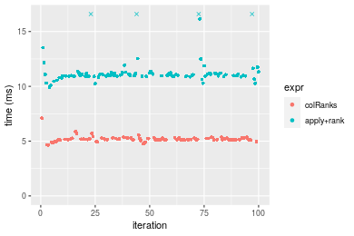

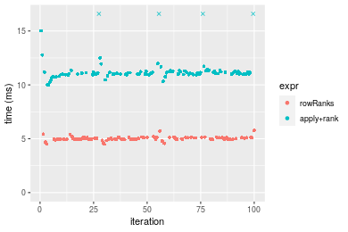
_Table: Benchmarking of colRanks() and rowRanks() on double+1000x100 data (original and transposed).  The top panel shows times in milliseconds and the bottom panel shows relative times._


|   |expr     |      min|       lq|     mean|   median|       uq|      max|
|:--|:--------|--------:|--------:|--------:|--------:|--------:|--------:|
|2  |rowRanks | 4.491859| 4.943079| 5.016600| 4.988339| 5.100483| 5.768094|
|1  |colRanks | 4.636599| 5.116938| 5.191458| 5.153241| 5.251645| 7.086629|


|   |expr     |      min|       lq|     mean|   median|       uq|      max|
|:--|:--------|--------:|--------:|--------:|--------:|--------:|--------:|
|2  |rowRanks | 1.000000| 1.000000| 1.000000| 1.000000| 1.000000| 1.000000|
|1  |colRanks | 1.032223| 1.035172| 1.034856| 1.033058| 1.029637| 1.228591|

_Figure: Benchmarking of colRanks() and rowRanks() on double+1000x100 data (original and transposed).  Outliers are displayed as crosses. Times are in milliseconds._


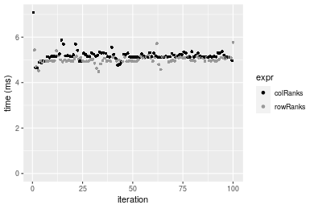


## Appendix

### Session information
```r
R version 4.1.1 Patched (2021-08-10 r80727)
Platform: x86_64-pc-linux-gnu (64-bit)
Running under: Ubuntu 18.04.5 LTS

Matrix products: default
BLAS:   /home/hb/software/R-devel/R-4-1-branch/lib/R/lib/libRblas.so
LAPACK: /home/hb/software/R-devel/R-4-1-branch/lib/R/lib/libRlapack.so

locale:
 [1] LC_CTYPE=en_US.UTF-8       LC_NUMERIC=C              
 [3] LC_TIME=en_US.UTF-8        LC_COLLATE=en_US.UTF-8    
 [5] LC_MONETARY=en_US.UTF-8    LC_MESSAGES=en_US.UTF-8   
 [7] LC_PAPER=en_US.UTF-8       LC_NAME=C                 
 [9] LC_ADDRESS=C               LC_TELEPHONE=C            
[11] LC_MEASUREMENT=en_US.UTF-8 LC_IDENTIFICATION=C       

attached base packages:
[1] stats     graphics  grDevices utils     datasets  methods   base     

other attached packages:
[1] microbenchmark_1.4-7   matrixStats_0.60.1     ggplot2_3.3.5         
[4] knitr_1.33             R.devices_2.17.0       R.utils_2.10.1        
[7] R.oo_1.24.0            R.methodsS3_1.8.1-9001 history_0.0.1-9000    

loaded via a namespace (and not attached):
 [1] Biobase_2.52.0          httr_1.4.2              splines_4.1.1          
 [4] bit64_4.0.5             network_1.17.1          assertthat_0.2.1       
 [7] highr_0.9               stats4_4.1.1            blob_1.2.2             
[10] GenomeInfoDbData_1.2.6  robustbase_0.93-8       pillar_1.6.2           
[13] RSQLite_2.2.8           lattice_0.20-44         glue_1.4.2             
[16] digest_0.6.27           XVector_0.32.0          colorspace_2.0-2       
[19] Matrix_1.3-4            XML_3.99-0.7            pkgconfig_2.0.3        
[22] zlibbioc_1.38.0         genefilter_1.74.0       purrr_0.3.4            
[25] ergm_4.1.2              xtable_1.8-4            scales_1.1.1           
[28] tibble_3.1.4            annotate_1.70.0         KEGGREST_1.32.0        
[31] farver_2.1.0            generics_0.1.0          IRanges_2.26.0         
[34] ellipsis_0.3.2          cachem_1.0.6            withr_2.4.2            
[37] BiocGenerics_0.38.0     mime_0.11               survival_3.2-13        
[40] magrittr_2.0.1          crayon_1.4.1            statnet.common_4.5.0   
[43] memoise_2.0.0           laeken_0.5.1            fansi_0.5.0            
[46] R.cache_0.15.0          MASS_7.3-54             R.rsp_0.44.0           
[49] progressr_0.8.0         tools_4.1.1             lifecycle_1.0.0        
[52] S4Vectors_0.30.0        trust_0.1-8             munsell_0.5.0          
[55] tabby_0.0.1-9001        AnnotationDbi_1.54.1    Biostrings_2.60.2      
[58] compiler_4.1.1          GenomeInfoDb_1.28.1     rlang_0.4.11           
[61] grid_4.1.1              RCurl_1.98-1.4          cwhmisc_6.6            
[64] rappdirs_0.3.3          startup_0.15.0          labeling_0.4.2         
[67] bitops_1.0-7            base64enc_0.1-3         boot_1.3-28            
[70] gtable_0.3.0            DBI_1.1.1               markdown_1.1           
[73] R6_2.5.1                lpSolveAPI_5.5.2.0-17.7 rle_0.9.2              
[76] dplyr_1.0.7             fastmap_1.1.0           bit_4.0.4              
[79] utf8_1.2.2              parallel_4.1.1          Rcpp_1.0.7             
[82] vctrs_0.3.8             png_0.1-7               DEoptimR_1.0-9         
[85] tidyselect_1.1.1        xfun_0.25               coda_0.19-4            
```
Total processing time was 46.85 secs.


### Reproducibility
To reproduce this report, do:
```r
html <- matrixStats:::benchmark('colRanks')
```

[RSP]: https://cran.r-project.org/package=R.rsp
[matrixStats]: https://cran.r-project.org/package=matrixStats

[StackOverflow:colMins?]: https://stackoverflow.com/questions/13676878 "Stack Overflow: fastest way to get Min from every column in a matrix?"
[StackOverflow:colSds?]: https://stackoverflow.com/questions/17549762 "Stack Overflow: Is there such 'colsd' in R?"
[StackOverflow:rowProds?]: https://stackoverflow.com/questions/20198801/ "Stack Overflow: Row product of matrix and column sum of matrix"

---------------------------------------
Copyright Henrik Bengtsson. Last updated on 2021-08-25 19:08:41 (+0200 UTC). Powered by [RSP].

<script>
 var link = document.createElement('link');
 link.rel = 'icon';
 link.href = "data:image/png;base64,iVBORw0KGgoAAAANSUhEUgAAACAAAAAgCAMAAABEpIrGAAAA21BMVEUAAAAAAP8AAP8AAP8AAP8AAP8AAP8AAP8AAP8AAP8AAP8AAP8AAP8AAP8AAP8AAP8AAP8AAP8AAP8AAP8AAP8AAP8AAP8AAP8AAP8AAP8AAP8AAP8AAP8AAP8AAP8AAP8AAP8AAP8AAP8AAP8AAP8AAP8AAP8AAP8AAP8AAP8BAf4CAv0DA/wdHeIeHuEfH+AgIN8hId4lJdomJtknJ9g+PsE/P8BAQL9yco10dIt1dYp3d4h4eIeVlWqWlmmXl2iYmGeZmWabm2Tn5xjo6Bfp6Rb39wj4+Af//wA2M9hbAAAASXRSTlMAAQIJCgsMJSYnKD4/QGRlZmhpamtsbautrrCxuru8y8zN5ebn6Pn6+///////////////////////////////////////////LsUNcQAAAS9JREFUOI29k21XgkAQhVcFytdSMqMETU26UVqGmpaiFbL//xc1cAhhwVNf6n5i5z67M2dmYOyfJZUqlVLhkKucG7cgmUZTybDz6g0iDeq51PUr37Ds2cy2/C9NeES5puDjxuUk1xnToZsg8pfA3avHQ3lLIi7iWRrkv/OYtkScxBIMgDee0ALoyxHQBJ68JLCjOtQIMIANF7QG9G9fNnHvisCHBVMKgSJgiz7nE+AoBKrAPA3MgepvgR9TSCasrCKH0eB1wBGBFdCO+nAGjMVGPcQb5bd6mQRegN6+1axOs9nGfYcCtfi4NQosdtH7dB+txFIpXQqN1p9B/asRHToyS0jRgpV7nk4nwcq1BJ+x3Gl/v7S9Wmpp/aGquum7w3ZDyrADFYrl8vHBH+ev9AUASW1dmU4h4wAAAABJRU5ErkJggg=="
 document.getElementsByTagName('head')[0].appendChild(link);
</script>


