[matrixStats]: Benchmark report

---------------------------------------


# colRanks() and rowRanks() benchmarks on subsetted computation

This report benchmark the performance of colRanks() and rowRanks() on subsetted computation.


## Data type "integer"

### Data
```r
> rmatrix <- function(nrow, ncol, mode = c("logical", "double", "integer", "index"), range = c(-100, 
+     +100), na_prob = 0) {
+     mode <- match.arg(mode)
+     n <- nrow * ncol
+     if (mode == "logical") {
+         x <- sample(c(FALSE, TRUE), size = n, replace = TRUE)
+     }     else if (mode == "index") {
+         x <- seq_len(n)
+         mode <- "integer"
+     }     else {
+         x <- runif(n, min = range[1], max = range[2])
+     }
+     storage.mode(x) <- mode
+     if (na_prob > 0) 
+         x[sample(n, size = na_prob * n)] <- NA
+     dim(x) <- c(nrow, ncol)
+     x
+ }
> rmatrices <- function(scale = 10, seed = 1, ...) {
+     set.seed(seed)
+     data <- list()
+     data[[1]] <- rmatrix(nrow = scale * 1, ncol = scale * 1, ...)
+     data[[2]] <- rmatrix(nrow = scale * 10, ncol = scale * 10, ...)
+     data[[3]] <- rmatrix(nrow = scale * 100, ncol = scale * 1, ...)
+     data[[4]] <- t(data[[3]])
+     data[[5]] <- rmatrix(nrow = scale * 10, ncol = scale * 100, ...)
+     data[[6]] <- t(data[[5]])
+     names(data) <- sapply(data, FUN = function(x) paste(dim(x), collapse = "x"))
+     data
+ }
> data <- rmatrices(mode = mode)
```

### Results

#### 10x10 integer matrix

```r
> X <- data[["10x10"]]
> rows <- sample.int(nrow(X), size = nrow(X) * 0.7)
> cols <- sample.int(ncol(X), size = ncol(X) * 0.7)
> X_S <- X[rows, cols]
> gc()
           used  (Mb) gc trigger  (Mb) max used  (Mb)
Ncells  5291033 282.6    8529671 455.6  8529671 455.6
Vcells 10408751  79.5   31876688 243.2 60562128 462.1
> colStats <- microbenchmark(colRanks_X_S = colRanks(X_S, na.rm = FALSE), `colRanks(X, rows, cols)` = colRanks(X, 
+     rows = rows, cols = cols, na.rm = FALSE), `colRanks(X[rows, cols])` = colRanks(X[rows, cols], 
+     na.rm = FALSE), unit = "ms")
> X <- t(X)
> X_S <- t(X_S)
> gc()
           used  (Mb) gc trigger  (Mb) max used  (Mb)
Ncells  5281804 282.1    8529671 455.6  8529671 455.6
Vcells 10378384  79.2   31876688 243.2 60562128 462.1
> rowStats <- microbenchmark(rowRanks_X_S = rowRanks(X_S, na.rm = FALSE), `rowRanks(X, cols, rows)` = rowRanks(X, 
+     rows = cols, cols = rows, na.rm = FALSE), `rowRanks(X[cols, rows])` = rowRanks(X[cols, rows], 
+     na.rm = FALSE), unit = "ms")
```

_Table: Benchmarking of colRanks_X_S(), colRanks(X, rows, cols)() and colRanks(X[rows, cols])() on integer+10x10 data. The top panel shows times in milliseconds and the bottom panel shows relative times._


|   |expr                    |      min|        lq|      mean|    median|        uq|      max|
|:--|:-----------------------|--------:|---------:|---------:|---------:|---------:|--------:|
|1  |colRanks_X_S            | 0.010045| 0.0104090| 0.0128028| 0.0106035| 0.0107815| 0.222945|
|2  |colRanks(X, rows, cols) | 0.010460| 0.0108710| 0.0110724| 0.0109905| 0.0111860| 0.014716|
|3  |colRanks(X[rows, cols]) | 0.011304| 0.0116975| 0.0119653| 0.0118630| 0.0120775| 0.019480|


|   |expr                    |      min|       lq|      mean|   median|       uq|       max|
|:--|:-----------------------|--------:|--------:|---------:|--------:|--------:|---------:|
|1  |colRanks_X_S            | 1.000000| 1.000000| 1.0000000| 1.000000| 1.000000| 1.0000000|
|2  |colRanks(X, rows, cols) | 1.041314| 1.044385| 0.8648400| 1.036497| 1.037518| 0.0660073|
|3  |colRanks(X[rows, cols]) | 1.125336| 1.123787| 0.9345809| 1.118782| 1.120206| 0.0873758|

_Table: Benchmarking of rowRanks_X_S(), rowRanks(X, cols, rows)() and rowRanks(X[cols, rows])() on integer+10x10 data (transposed). The top panel shows times in milliseconds and the bottom panel shows relative times._


|   |expr                    |      min|        lq|      mean|    median|        uq|      max|
|:--|:-----------------------|--------:|---------:|---------:|---------:|---------:|--------:|
|1  |rowRanks_X_S            | 0.004894| 0.0051295| 0.0053376| 0.0052715| 0.0054265| 0.008029|
|2  |rowRanks(X, cols, rows) | 0.005237| 0.0054905| 0.0074400| 0.0055780| 0.0058300| 0.178301|
|3  |rowRanks(X[cols, rows]) | 0.005874| 0.0062575| 0.0064235| 0.0063795| 0.0065030| 0.009244|


|   |expr                    |      min|       lq|     mean|   median|       uq|       max|
|:--|:-----------------------|--------:|--------:|--------:|--------:|--------:|---------:|
|1  |rowRanks_X_S            | 1.000000| 1.000000| 1.000000| 1.000000| 1.000000|  1.000000|
|2  |rowRanks(X, cols, rows) | 1.070086| 1.070377| 1.393895| 1.058143| 1.074357| 22.207124|
|3  |rowRanks(X[cols, rows]) | 1.200245| 1.219904| 1.203456| 1.210187| 1.198378|  1.151326|

_Figure: Benchmarking of colRanks_X_S(), colRanks(X, rows, cols)() and colRanks(X[rows, cols])() on integer+10x10 data  as well as rowRanks_X_S(), rowRanks(X, cols, rows)() and rowRanks(X[cols, rows])() on the same data transposed.  Outliers are displayed as crosses.  Times are in milliseconds._


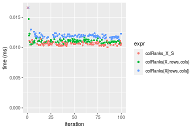


_Table: Benchmarking of colRanks_X_S() and rowRanks_X_S() on integer+10x10 data (original and transposed).  The top panel shows times in milliseconds and the bottom panel shows relative times._


|   |expr         |    min|      lq|     mean|  median|      uq|     max|
|:--|:------------|------:|-------:|--------:|-------:|-------:|-------:|
|2  |rowRanks_X_S |  4.894|  5.1295|  5.33757|  5.2715|  5.4265|   8.029|
|1  |colRanks_X_S | 10.045| 10.4090| 12.80283| 10.6035| 10.7815| 222.945|


|   |expr         |      min|       lq|     mean|   median|       uq|      max|
|:--|:------------|--------:|--------:|--------:|--------:|--------:|--------:|
|2  |rowRanks_X_S | 1.000000| 1.000000| 1.000000| 1.000000| 1.000000|  1.00000|
|1  |colRanks_X_S | 2.052513| 2.029243| 2.398625| 2.011477| 1.986824| 27.76747|

_Figure: Benchmarking of colRanks_X_S() and rowRanks_X_S() on integer+10x10 data (original and transposed).  Outliers are displayed as crosses. Times are in milliseconds._


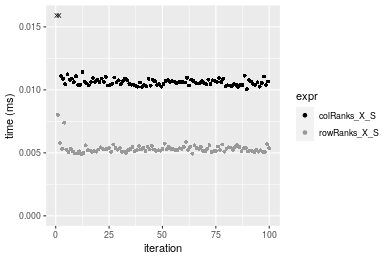

#### 100x100 integer matrix

```r
> X <- data[["100x100"]]
> rows <- sample.int(nrow(X), size = nrow(X) * 0.7)
> cols <- sample.int(ncol(X), size = ncol(X) * 0.7)
> X_S <- X[rows, cols]
> gc()
           used  (Mb) gc trigger  (Mb) max used  (Mb)
Ncells  5280515 282.1    8529671 455.6  8529671 455.6
Vcells 10047426  76.7   31876688 243.2 60562128 462.1
> colStats <- microbenchmark(colRanks_X_S = colRanks(X_S, na.rm = FALSE), `colRanks(X, rows, cols)` = colRanks(X, 
+     rows = rows, cols = cols, na.rm = FALSE), `colRanks(X[rows, cols])` = colRanks(X[rows, cols], 
+     na.rm = FALSE), unit = "ms")
> X <- t(X)
> X_S <- t(X_S)
> gc()
           used  (Mb) gc trigger  (Mb) max used  (Mb)
Ncells  5280491 282.1    8529671 455.6  8529671 455.6
Vcells 10052479  76.7   31876688 243.2 60562128 462.1
> rowStats <- microbenchmark(rowRanks_X_S = rowRanks(X_S, na.rm = FALSE), `rowRanks(X, cols, rows)` = rowRanks(X, 
+     rows = cols, cols = rows, na.rm = FALSE), `rowRanks(X[cols, rows])` = rowRanks(X[cols, rows], 
+     na.rm = FALSE), unit = "ms")
```

_Table: Benchmarking of colRanks_X_S(), colRanks(X, rows, cols)() and colRanks(X[rows, cols])() on integer+100x100 data. The top panel shows times in milliseconds and the bottom panel shows relative times._


|   |expr                    |      min|        lq|      mean|    median|        uq|      max|
|:--|:-----------------------|--------:|---------:|---------:|---------:|---------:|--------:|
|1  |colRanks_X_S            | 0.150295| 0.1586490| 0.1835278| 0.1793895| 0.1988485| 0.254387|
|2  |colRanks(X, rows, cols) | 0.152071| 0.1623015| 0.1849575| 0.1818660| 0.2003695| 0.272985|
|3  |colRanks(X[rows, cols]) | 0.158641| 0.1688090| 0.1939169| 0.1884575| 0.2098555| 0.337548|


|   |expr                    |      min|       lq|     mean|   median|       uq|      max|
|:--|:-----------------------|--------:|--------:|--------:|--------:|--------:|--------:|
|1  |colRanks_X_S            | 1.000000| 1.000000| 1.000000| 1.000000| 1.000000| 1.000000|
|2  |colRanks(X, rows, cols) | 1.011817| 1.023022| 1.007790| 1.013805| 1.007649| 1.073109|
|3  |colRanks(X[rows, cols]) | 1.055531| 1.064041| 1.056608| 1.050549| 1.055354| 1.326907|

_Table: Benchmarking of rowRanks_X_S(), rowRanks(X, cols, rows)() and rowRanks(X[cols, rows])() on integer+100x100 data (transposed). The top panel shows times in milliseconds and the bottom panel shows relative times._


|   |expr                    |      min|       lq|      mean|    median|        uq|      max|
|:--|:-----------------------|--------:|--------:|---------:|---------:|---------:|--------:|
|1  |rowRanks_X_S            | 0.141898| 0.155831| 0.1764304| 0.1726100| 0.1914505| 0.247824|
|2  |rowRanks(X, cols, rows) | 0.143292| 0.159793| 0.1791030| 0.1742860| 0.1918850| 0.289692|
|3  |rowRanks(X[cols, rows]) | 0.150126| 0.168037| 0.1869155| 0.1858995| 0.2006625| 0.262457|


|   |expr                    |      min|       lq|     mean|   median|       uq|      max|
|:--|:-----------------------|--------:|--------:|--------:|--------:|--------:|--------:|
|1  |rowRanks_X_S            | 1.000000| 1.000000| 1.000000| 1.000000| 1.000000| 1.000000|
|2  |rowRanks(X, cols, rows) | 1.009824| 1.025425| 1.015149| 1.009710| 1.002269| 1.168942|
|3  |rowRanks(X[cols, rows]) | 1.057985| 1.078328| 1.059429| 1.076992| 1.048117| 1.059046|

_Figure: Benchmarking of colRanks_X_S(), colRanks(X, rows, cols)() and colRanks(X[rows, cols])() on integer+100x100 data  as well as rowRanks_X_S(), rowRanks(X, cols, rows)() and rowRanks(X[cols, rows])() on the same data transposed.  Outliers are displayed as crosses.  Times are in milliseconds._


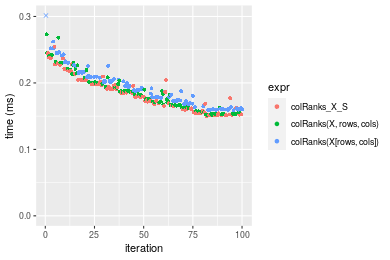

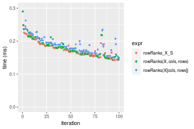
_Table: Benchmarking of colRanks_X_S() and rowRanks_X_S() on integer+100x100 data (original and transposed).  The top panel shows times in milliseconds and the bottom panel shows relative times._


|   |expr         |     min|      lq|     mean|   median|       uq|     max|
|:--|:------------|-------:|-------:|--------:|--------:|--------:|-------:|
|2  |rowRanks_X_S | 141.898| 155.831| 176.4304| 172.6100| 191.4505| 247.824|
|1  |colRanks_X_S | 150.295| 158.649| 183.5278| 179.3895| 198.8485| 254.387|


|   |expr         |      min|       lq|     mean|   median|       uq|      max|
|:--|:------------|--------:|--------:|--------:|--------:|--------:|--------:|
|2  |rowRanks_X_S | 1.000000| 1.000000| 1.000000| 1.000000| 1.000000| 1.000000|
|1  |colRanks_X_S | 1.059176| 1.018084| 1.040228| 1.039276| 1.038642| 1.026482|

_Figure: Benchmarking of colRanks_X_S() and rowRanks_X_S() on integer+100x100 data (original and transposed).  Outliers are displayed as crosses. Times are in milliseconds._


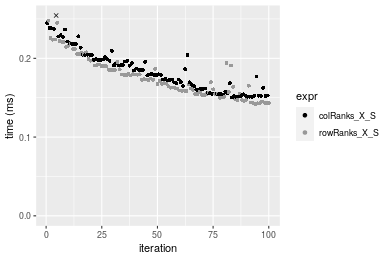

#### 1000x10 integer matrix

```r
> X <- data[["1000x10"]]
> rows <- sample.int(nrow(X), size = nrow(X) * 0.7)
> cols <- sample.int(ncol(X), size = ncol(X) * 0.7)
> X_S <- X[rows, cols]
> gc()
           used  (Mb) gc trigger  (Mb) max used  (Mb)
Ncells  5281240 282.1    8529671 455.6  8529671 455.6
Vcells 10051441  76.7   31876688 243.2 60562128 462.1
> colStats <- microbenchmark(colRanks_X_S = colRanks(X_S, na.rm = FALSE), `colRanks(X, rows, cols)` = colRanks(X, 
+     rows = rows, cols = cols, na.rm = FALSE), `colRanks(X[rows, cols])` = colRanks(X[rows, cols], 
+     na.rm = FALSE), unit = "ms")
> X <- t(X)
> X_S <- t(X_S)
> gc()
           used  (Mb) gc trigger  (Mb) max used  (Mb)
Ncells  5281234 282.1    8529671 455.6  8529671 455.6
Vcells 10056524  76.8   31876688 243.2 60562128 462.1
> rowStats <- microbenchmark(rowRanks_X_S = rowRanks(X_S, na.rm = FALSE), `rowRanks(X, cols, rows)` = rowRanks(X, 
+     rows = cols, cols = rows, na.rm = FALSE), `rowRanks(X[cols, rows])` = rowRanks(X[cols, rows], 
+     na.rm = FALSE), unit = "ms")
```

_Table: Benchmarking of colRanks_X_S(), colRanks(X, rows, cols)() and colRanks(X[rows, cols])() on integer+1000x10 data. The top panel shows times in milliseconds and the bottom panel shows relative times._


|   |expr                    |      min|        lq|      mean|    median|        uq|      max|
|:--|:-----------------------|--------:|---------:|---------:|---------:|---------:|--------:|
|3  |colRanks(X[rows, cols]) | 0.207244| 0.2091410| 0.2413682| 0.2221680| 0.2671150| 0.407985|
|2  |colRanks(X, rows, cols) | 0.200697| 0.2033600| 0.2343624| 0.2240790| 0.2557120| 0.343630|
|1  |colRanks_X_S            | 0.198479| 0.2046835| 0.2382378| 0.2296785| 0.2592915| 0.346835|


|   |expr                    |       min|        lq|      mean|   median|        uq|       max|
|:--|:-----------------------|---------:|---------:|---------:|--------:|---------:|---------:|
|3  |colRanks(X[rows, cols]) | 1.0000000| 1.0000000| 1.0000000| 1.000000| 1.0000000| 1.0000000|
|2  |colRanks(X, rows, cols) | 0.9684092| 0.9723584| 0.9709745| 1.008602| 0.9573105| 0.8422614|
|1  |colRanks_X_S            | 0.9577069| 0.9786866| 0.9870303| 1.033805| 0.9707111| 0.8501170|

_Table: Benchmarking of rowRanks_X_S(), rowRanks(X, cols, rows)() and rowRanks(X[cols, rows])() on integer+1000x10 data (transposed). The top panel shows times in milliseconds and the bottom panel shows relative times._


|   |expr                    |      min|        lq|      mean|    median|        uq|      max|
|:--|:-----------------------|--------:|---------:|---------:|---------:|---------:|--------:|
|1  |rowRanks_X_S            | 0.188780| 0.1913855| 0.2243023| 0.2063585| 0.2438725| 0.320750|
|2  |rowRanks(X, cols, rows) | 0.191312| 0.1939085| 0.2310270| 0.2260505| 0.2544410| 0.315402|
|3  |rowRanks(X[cols, rows]) | 0.198135| 0.2006595| 0.2371962| 0.2281725| 0.2592030| 0.401751|


|   |expr                    |      min|       lq|     mean|   median|       uq|       max|
|:--|:-----------------------|--------:|--------:|--------:|--------:|--------:|---------:|
|1  |rowRanks_X_S            | 1.000000| 1.000000| 1.000000| 1.000000| 1.000000| 1.0000000|
|2  |rowRanks(X, cols, rows) | 1.013412| 1.013183| 1.029981| 1.095426| 1.043336| 0.9833266|
|3  |rowRanks(X[cols, rows]) | 1.049555| 1.048457| 1.057485| 1.105709| 1.062863| 1.2525362|

_Figure: Benchmarking of colRanks_X_S(), colRanks(X, rows, cols)() and colRanks(X[rows, cols])() on integer+1000x10 data  as well as rowRanks_X_S(), rowRanks(X, cols, rows)() and rowRanks(X[cols, rows])() on the same data transposed.  Outliers are displayed as crosses.  Times are in milliseconds._


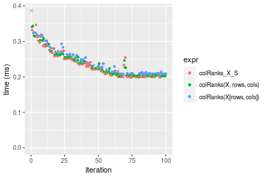

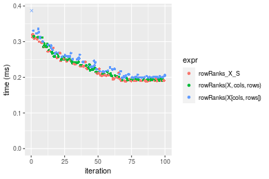
_Table: Benchmarking of colRanks_X_S() and rowRanks_X_S() on integer+1000x10 data (original and transposed).  The top panel shows times in milliseconds and the bottom panel shows relative times._


|   |expr         |     min|       lq|     mean|   median|       uq|     max|
|:--|:------------|-------:|--------:|--------:|--------:|--------:|-------:|
|2  |rowRanks_X_S | 188.780| 191.3855| 224.3023| 206.3585| 243.8725| 320.750|
|1  |colRanks_X_S | 198.479| 204.6835| 238.2378| 229.6785| 259.2915| 346.835|


|   |expr         |      min|       lq|     mean|   median|       uq|      max|
|:--|:------------|--------:|--------:|--------:|--------:|--------:|--------:|
|2  |rowRanks_X_S | 1.000000| 1.000000| 1.000000| 1.000000| 1.000000| 1.000000|
|1  |colRanks_X_S | 1.051377| 1.069483| 1.062128| 1.113007| 1.063226| 1.081325|

_Figure: Benchmarking of colRanks_X_S() and rowRanks_X_S() on integer+1000x10 data (original and transposed).  Outliers are displayed as crosses. Times are in milliseconds._


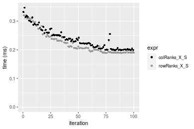

#### 10x1000 integer matrix

```r
> X <- data[["10x1000"]]
> rows <- sample.int(nrow(X), size = nrow(X) * 0.7)
> cols <- sample.int(ncol(X), size = ncol(X) * 0.7)
> X_S <- X[rows, cols]
> gc()
           used  (Mb) gc trigger  (Mb) max used  (Mb)
Ncells  5281463 282.1    8529671 455.6  8529671 455.6
Vcells 10052322  76.7   31876688 243.2 60562128 462.1
> colStats <- microbenchmark(colRanks_X_S = colRanks(X_S, na.rm = FALSE), `colRanks(X, rows, cols)` = colRanks(X, 
+     rows = rows, cols = cols, na.rm = FALSE), `colRanks(X[rows, cols])` = colRanks(X[rows, cols], 
+     na.rm = FALSE), unit = "ms")
> X <- t(X)
> X_S <- t(X_S)
> gc()
           used  (Mb) gc trigger  (Mb) max used  (Mb)
Ncells  5281439 282.1    8529671 455.6  8529671 455.6
Vcells 10057375  76.8   31876688 243.2 60562128 462.1
> rowStats <- microbenchmark(rowRanks_X_S = rowRanks(X_S, na.rm = FALSE), `rowRanks(X, cols, rows)` = rowRanks(X, 
+     rows = cols, cols = rows, na.rm = FALSE), `rowRanks(X[cols, rows])` = rowRanks(X[cols, rows], 
+     na.rm = FALSE), unit = "ms")
```

_Table: Benchmarking of colRanks_X_S(), colRanks(X, rows, cols)() and colRanks(X[rows, cols])() on integer+10x1000 data. The top panel shows times in milliseconds and the bottom panel shows relative times._


|   |expr                    |      min|        lq|      mean|   median|        uq|      max|
|:--|:-----------------------|--------:|---------:|---------:|--------:|---------:|--------:|
|1  |colRanks_X_S            | 0.095829| 0.1036630| 0.1162648| 0.112670| 0.1272660| 0.205064|
|2  |colRanks(X, rows, cols) | 0.098671| 0.1075995| 0.1161861| 0.113351| 0.1206080| 0.166406|
|3  |colRanks(X[rows, cols]) | 0.108334| 0.1184410| 0.1279909| 0.123494| 0.1362925| 0.168258|


|   |expr                    |      min|       lq|     mean|   median|        uq|       max|
|:--|:-----------------------|--------:|--------:|--------:|--------:|---------:|---------:|
|1  |colRanks_X_S            | 1.000000| 1.000000| 1.000000| 1.000000| 1.0000000| 1.0000000|
|2  |colRanks(X, rows, cols) | 1.029657| 1.037974| 0.999323| 1.006044| 0.9476844| 0.8114832|
|3  |colRanks(X[rows, cols]) | 1.130493| 1.142558| 1.100857| 1.096068| 1.0709262| 0.8205146|

_Table: Benchmarking of rowRanks_X_S(), rowRanks(X, cols, rows)() and rowRanks(X[cols, rows])() on integer+10x1000 data (transposed). The top panel shows times in milliseconds and the bottom panel shows relative times._


|   |expr                    |      min|        lq|      mean|    median|       uq|      max|
|:--|:-----------------------|--------:|---------:|---------:|---------:|--------:|--------:|
|2  |rowRanks(X, cols, rows) | 0.093307| 0.0992185| 0.1099324| 0.1038515| 0.116065| 0.182439|
|1  |rowRanks_X_S            | 0.091753| 0.0977660| 0.1083293| 0.1045810| 0.114656| 0.154599|
|3  |rowRanks(X[cols, rows]) | 0.099857| 0.1075825| 0.1185675| 0.1136840| 0.127422| 0.184145|


|   |expr                    |       min|        lq|      mean|   median|        uq|      max|
|:--|:-----------------------|---------:|---------:|---------:|--------:|---------:|--------:|
|2  |rowRanks(X, cols, rows) | 1.0000000| 1.0000000| 1.0000000| 1.000000| 1.0000000| 1.000000|
|1  |rowRanks_X_S            | 0.9833453| 0.9853606| 0.9854171| 1.007024| 0.9878603| 0.847401|
|3  |rowRanks(X[cols, rows]) | 1.0701984| 1.0842988| 1.0785488| 1.094679| 1.0978503| 1.009351|

_Figure: Benchmarking of colRanks_X_S(), colRanks(X, rows, cols)() and colRanks(X[rows, cols])() on integer+10x1000 data  as well as rowRanks_X_S(), rowRanks(X, cols, rows)() and rowRanks(X[cols, rows])() on the same data transposed.  Outliers are displayed as crosses.  Times are in milliseconds._


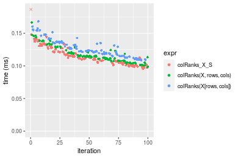

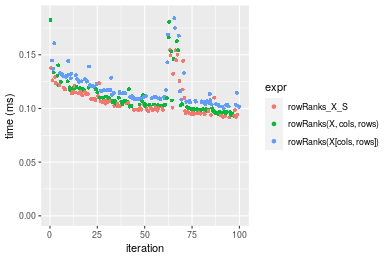
_Table: Benchmarking of colRanks_X_S() and rowRanks_X_S() on integer+10x1000 data (original and transposed).  The top panel shows times in milliseconds and the bottom panel shows relative times._


|   |expr         |    min|      lq|     mean|  median|      uq|     max|
|:--|:------------|------:|-------:|--------:|-------:|-------:|-------:|
|2  |rowRanks_X_S | 91.753|  97.766| 108.3293| 104.581| 114.656| 154.599|
|1  |colRanks_X_S | 95.829| 103.663| 116.2648| 112.670| 127.266| 205.064|


|   |expr         |      min|       lq|     mean|   median|       uq|      max|
|:--|:------------|--------:|--------:|--------:|--------:|--------:|--------:|
|2  |rowRanks_X_S | 1.000000| 1.000000| 1.000000| 1.000000| 1.000000| 1.000000|
|1  |colRanks_X_S | 1.044424| 1.060318| 1.073254| 1.077347| 1.109981| 1.326425|

_Figure: Benchmarking of colRanks_X_S() and rowRanks_X_S() on integer+10x1000 data (original and transposed).  Outliers are displayed as crosses. Times are in milliseconds._


#### 100x1000 integer matrix

```r
> X <- data[["100x1000"]]
> rows <- sample.int(nrow(X), size = nrow(X) * 0.7)
> cols <- sample.int(ncol(X), size = ncol(X) * 0.7)
> X_S <- X[rows, cols]
> gc()
           used  (Mb) gc trigger  (Mb) max used  (Mb)
Ncells  5281673 282.1    8529671 455.6  8529671 455.6
Vcells 10074984  76.9   31876688 243.2 60562128 462.1
> colStats <- microbenchmark(colRanks_X_S = colRanks(X_S, na.rm = FALSE), `colRanks(X, rows, cols)` = colRanks(X, 
+     rows = rows, cols = cols, na.rm = FALSE), `colRanks(X[rows, cols])` = colRanks(X[rows, cols], 
+     na.rm = FALSE), unit = "ms")
> X <- t(X)
> X_S <- t(X_S)
> gc()
           used  (Mb) gc trigger  (Mb) max used  (Mb)
Ncells  5281649 282.1    8529671 455.6  8529671 455.6
Vcells 10125037  77.3   31876688 243.2 60562128 462.1
> rowStats <- microbenchmark(rowRanks_X_S = rowRanks(X_S, na.rm = FALSE), `rowRanks(X, cols, rows)` = rowRanks(X, 
+     rows = cols, cols = rows, na.rm = FALSE), `rowRanks(X[cols, rows])` = rowRanks(X[cols, rows], 
+     na.rm = FALSE), unit = "ms")
```

_Table: Benchmarking of colRanks_X_S(), colRanks(X, rows, cols)() and colRanks(X[rows, cols])() on integer+100x1000 data. The top panel shows times in milliseconds and the bottom panel shows relative times._


|   |expr                    |      min|       lq|     mean|   median|       uq|      max|
|:--|:-----------------------|--------:|--------:|--------:|--------:|--------:|--------:|
|1  |colRanks_X_S            | 1.460714| 1.543330| 1.614133| 1.582775| 1.710147| 2.427528|
|2  |colRanks(X, rows, cols) | 1.463529| 1.546407| 1.611092| 1.589112| 1.666816| 2.333369|
|3  |colRanks(X[rows, cols]) | 1.525266| 1.612488| 1.695617| 1.654181| 1.812447| 2.213348|


|   |expr                    |      min|       lq|     mean|   median|       uq|       max|
|:--|:-----------------------|--------:|--------:|--------:|--------:|--------:|---------:|
|1  |colRanks_X_S            | 1.000000| 1.000000| 1.000000| 1.000000| 1.000000| 1.0000000|
|2  |colRanks(X, rows, cols) | 1.001927| 1.001994| 0.998116| 1.004003| 0.974663| 0.9612120|
|3  |colRanks(X[rows, cols]) | 1.044192| 1.044811| 1.050482| 1.045114| 1.059820| 0.9117703|

_Table: Benchmarking of rowRanks_X_S(), rowRanks(X, cols, rows)() and rowRanks(X[cols, rows])() on integer+100x1000 data (transposed). The top panel shows times in milliseconds and the bottom panel shows relative times._


|   |expr                    |      min|       lq|     mean|   median|       uq|      max|
|:--|:-----------------------|--------:|--------:|--------:|--------:|--------:|--------:|
|1  |rowRanks_X_S            | 1.418860| 1.497006| 1.563823| 1.538423| 1.555997| 2.317449|
|2  |rowRanks(X, cols, rows) | 1.427341| 1.507645| 1.552392| 1.547082| 1.550842| 2.095641|
|3  |rowRanks(X[cols, rows]) | 1.494656| 1.583282| 1.629205| 1.623316| 1.631626| 2.200605|


|   |expr                    |      min|       lq|      mean|   median|        uq|       max|
|:--|:-----------------------|--------:|--------:|---------:|--------:|---------:|---------:|
|1  |rowRanks_X_S            | 1.000000| 1.000000| 1.0000000| 1.000000| 1.0000000| 1.0000000|
|2  |rowRanks(X, cols, rows) | 1.005977| 1.007107| 0.9926903| 1.005629| 0.9966873| 0.9042879|
|3  |rowRanks(X[cols, rows]) | 1.053420| 1.057632| 1.0418091| 1.055182| 1.0486052| 0.9495808|

_Figure: Benchmarking of colRanks_X_S(), colRanks(X, rows, cols)() and colRanks(X[rows, cols])() on integer+100x1000 data  as well as rowRanks_X_S(), rowRanks(X, cols, rows)() and rowRanks(X[cols, rows])() on the same data transposed.  Outliers are displayed as crosses.  Times are in milliseconds._


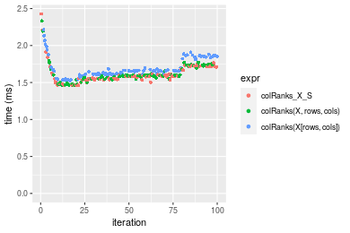

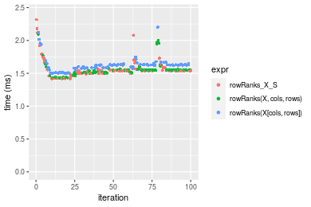
_Table: Benchmarking of colRanks_X_S() and rowRanks_X_S() on integer+100x1000 data (original and transposed).  The top panel shows times in milliseconds and the bottom panel shows relative times._


|   |expr         |      min|       lq|     mean|   median|       uq|      max|
|:--|:------------|--------:|--------:|--------:|--------:|--------:|--------:|
|2  |rowRanks_X_S | 1.418860| 1.497006| 1.563823| 1.538423| 1.555997| 2.317449|
|1  |colRanks_X_S | 1.460714| 1.543330| 1.614133| 1.582775| 1.710147| 2.427528|


|   |expr         |      min|       lq|     mean|  median|       uq|    max|
|:--|:------------|--------:|--------:|--------:|-------:|--------:|------:|
|2  |rowRanks_X_S | 1.000000| 1.000000| 1.000000| 1.00000| 1.000000| 1.0000|
|1  |colRanks_X_S | 1.029498| 1.030944| 1.032171| 1.02883| 1.099068| 1.0475|

_Figure: Benchmarking of colRanks_X_S() and rowRanks_X_S() on integer+100x1000 data (original and transposed).  Outliers are displayed as crosses. Times are in milliseconds._


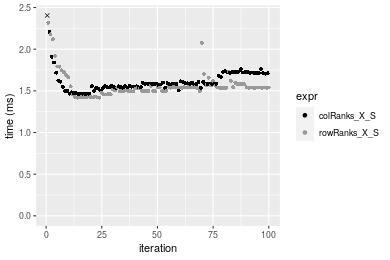

#### 1000x100 integer matrix

```r
> X <- data[["1000x100"]]
> rows <- sample.int(nrow(X), size = nrow(X) * 0.7)
> cols <- sample.int(ncol(X), size = ncol(X) * 0.7)
> X_S <- X[rows, cols]
> gc()
           used  (Mb) gc trigger  (Mb) max used  (Mb)
Ncells  5281886 282.1    8529671 455.6  8529671 455.6
Vcells 10075782  76.9   31876688 243.2 60562128 462.1
> colStats <- microbenchmark(colRanks_X_S = colRanks(X_S, na.rm = FALSE), `colRanks(X, rows, cols)` = colRanks(X, 
+     rows = rows, cols = cols, na.rm = FALSE), `colRanks(X[rows, cols])` = colRanks(X[rows, cols], 
+     na.rm = FALSE), unit = "ms")
> X <- t(X)
> X_S <- t(X_S)
> gc()
           used  (Mb) gc trigger  (Mb) max used  (Mb)
Ncells  5281862 282.1    8529671 455.6  8529671 455.6
Vcells 10125835  77.3   31876688 243.2 60562128 462.1
> rowStats <- microbenchmark(rowRanks_X_S = rowRanks(X_S, na.rm = FALSE), `rowRanks(X, cols, rows)` = rowRanks(X, 
+     rows = cols, cols = rows, na.rm = FALSE), `rowRanks(X[cols, rows])` = rowRanks(X[cols, rows], 
+     na.rm = FALSE), unit = "ms")
```

_Table: Benchmarking of colRanks_X_S(), colRanks(X, rows, cols)() and colRanks(X[rows, cols])() on integer+1000x100 data. The top panel shows times in milliseconds and the bottom panel shows relative times._


|   |expr                    |      min|       lq|     mean|   median|       uq|      max|
|:--|:-----------------------|--------:|--------:|--------:|--------:|--------:|--------:|
|1  |colRanks_X_S            | 1.899728| 2.011998| 2.070741| 2.060049| 2.069953| 3.085677|
|2  |colRanks(X, rows, cols) | 1.910097| 2.014720| 2.081040| 2.063831| 2.070780| 2.708117|
|3  |colRanks(X[rows, cols]) | 1.961788| 2.069022| 2.104722| 2.119623| 2.130853| 2.906828|


|   |expr                    |      min|       lq|     mean|   median|       uq|       max|
|:--|:-----------------------|--------:|--------:|--------:|--------:|--------:|---------:|
|1  |colRanks_X_S            | 1.000000| 1.000000| 1.000000| 1.000000| 1.000000| 1.0000000|
|2  |colRanks(X, rows, cols) | 1.005458| 1.001353| 1.004973| 1.001836| 1.000400| 0.8776411|
|3  |colRanks(X[rows, cols]) | 1.032668| 1.028342| 1.016410| 1.028918| 1.029421| 0.9420390|

_Table: Benchmarking of rowRanks_X_S(), rowRanks(X, cols, rows)() and rowRanks(X[cols, rows])() on integer+1000x100 data (transposed). The top panel shows times in milliseconds and the bottom panel shows relative times._


|   |expr                    |      min|       lq|     mean|   median|       uq|      max|
|:--|:-----------------------|--------:|--------:|--------:|--------:|--------:|--------:|
|1  |rowRanks_X_S            | 1.865247| 1.968962| 2.009408| 2.020777| 2.026666| 2.441963|
|2  |rowRanks(X, cols, rows) | 1.875188| 1.977621| 2.041434| 2.029410| 2.035922| 3.091483|
|3  |rowRanks(X[cols, rows]) | 1.938070| 2.051200| 2.091851| 2.102823| 2.117586| 2.970129|


|   |expr                    |      min|       lq|     mean|   median|       uq|      max|
|:--|:-----------------------|--------:|--------:|--------:|--------:|--------:|--------:|
|1  |rowRanks_X_S            | 1.000000| 1.000000| 1.000000| 1.000000| 1.000000| 1.000000|
|2  |rowRanks(X, cols, rows) | 1.005330| 1.004398| 1.015938| 1.004272| 1.004567| 1.265983|
|3  |rowRanks(X[cols, rows]) | 1.039042| 1.041767| 1.041029| 1.040601| 1.044862| 1.216287|

_Figure: Benchmarking of colRanks_X_S(), colRanks(X, rows, cols)() and colRanks(X[rows, cols])() on integer+1000x100 data  as well as rowRanks_X_S(), rowRanks(X, cols, rows)() and rowRanks(X[cols, rows])() on the same data transposed.  Outliers are displayed as crosses.  Times are in milliseconds._


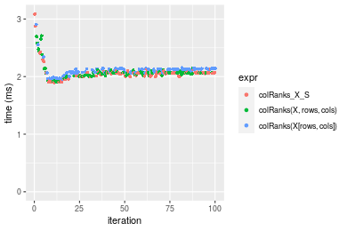

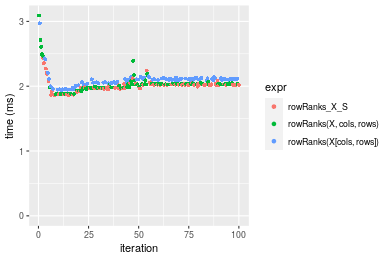
_Table: Benchmarking of colRanks_X_S() and rowRanks_X_S() on integer+1000x100 data (original and transposed).  The top panel shows times in milliseconds and the bottom panel shows relative times._


|   |expr         |      min|       lq|     mean|   median|       uq|      max|
|:--|:------------|--------:|--------:|--------:|--------:|--------:|--------:|
|2  |rowRanks_X_S | 1.865247| 1.968962| 2.009408| 2.020777| 2.026666| 2.441963|
|1  |colRanks_X_S | 1.899728| 2.011998| 2.070741| 2.060049| 2.069953| 3.085677|


|   |expr         |      min|       lq|     mean|   median|       uq|      max|
|:--|:------------|--------:|--------:|--------:|--------:|--------:|--------:|
|2  |rowRanks_X_S | 1.000000| 1.000000| 1.000000| 1.000000| 1.000000| 1.000000|
|1  |colRanks_X_S | 1.018486| 1.021857| 1.030523| 1.019434| 1.021359| 1.263605|

_Figure: Benchmarking of colRanks_X_S() and rowRanks_X_S() on integer+1000x100 data (original and transposed).  Outliers are displayed as crosses. Times are in milliseconds._


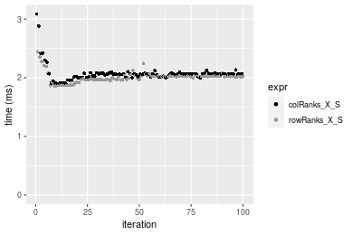


## Data type "double"

### Data
```r
> rmatrix <- function(nrow, ncol, mode = c("logical", "double", "integer", "index"), range = c(-100, 
+     +100), na_prob = 0) {
+     mode <- match.arg(mode)
+     n <- nrow * ncol
+     if (mode == "logical") {
+         x <- sample(c(FALSE, TRUE), size = n, replace = TRUE)
+     }     else if (mode == "index") {
+         x <- seq_len(n)
+         mode <- "integer"
+     }     else {
+         x <- runif(n, min = range[1], max = range[2])
+     }
+     storage.mode(x) <- mode
+     if (na_prob > 0) 
+         x[sample(n, size = na_prob * n)] <- NA
+     dim(x) <- c(nrow, ncol)
+     x
+ }
> rmatrices <- function(scale = 10, seed = 1, ...) {
+     set.seed(seed)
+     data <- list()
+     data[[1]] <- rmatrix(nrow = scale * 1, ncol = scale * 1, ...)
+     data[[2]] <- rmatrix(nrow = scale * 10, ncol = scale * 10, ...)
+     data[[3]] <- rmatrix(nrow = scale * 100, ncol = scale * 1, ...)
+     data[[4]] <- t(data[[3]])
+     data[[5]] <- rmatrix(nrow = scale * 10, ncol = scale * 100, ...)
+     data[[6]] <- t(data[[5]])
+     names(data) <- sapply(data, FUN = function(x) paste(dim(x), collapse = "x"))
+     data
+ }
> data <- rmatrices(mode = mode)
```

### Results

#### 10x10 double matrix

```r
> X <- data[["10x10"]]
> rows <- sample.int(nrow(X), size = nrow(X) * 0.7)
> cols <- sample.int(ncol(X), size = ncol(X) * 0.7)
> X_S <- X[rows, cols]
> gc()
           used  (Mb) gc trigger  (Mb) max used  (Mb)
Ncells  5282103 282.1    8529671 455.6  8529671 455.6
Vcells 10166883  77.6   31876688 243.2 60562128 462.1
> colStats <- microbenchmark(colRanks_X_S = colRanks(X_S, na.rm = FALSE), `colRanks(X, rows, cols)` = colRanks(X, 
+     rows = rows, cols = cols, na.rm = FALSE), `colRanks(X[rows, cols])` = colRanks(X[rows, cols], 
+     na.rm = FALSE), unit = "ms")
> X <- t(X)
> X_S <- t(X_S)
> gc()
           used  (Mb) gc trigger  (Mb) max used  (Mb)
Ncells  5282070 282.1    8529671 455.6  8529671 455.6
Vcells 10167021  77.6   31876688 243.2 60562128 462.1
> rowStats <- microbenchmark(rowRanks_X_S = rowRanks(X_S, na.rm = FALSE), `rowRanks(X, cols, rows)` = rowRanks(X, 
+     rows = cols, cols = rows, na.rm = FALSE), `rowRanks(X[cols, rows])` = rowRanks(X[cols, rows], 
+     na.rm = FALSE), unit = "ms")
```

_Table: Benchmarking of colRanks_X_S(), colRanks(X, rows, cols)() and colRanks(X[rows, cols])() on double+10x10 data. The top panel shows times in milliseconds and the bottom panel shows relative times._


|   |expr                    |      min|       lq|      mean|    median|        uq|      max|
|:--|:-----------------------|--------:|--------:|---------:|---------:|---------:|--------:|
|1  |colRanks_X_S            | 0.009751| 0.010362| 0.0112964| 0.0105985| 0.0108070| 0.062305|
|2  |colRanks(X, rows, cols) | 0.010260| 0.010843| 0.0111679| 0.0111210| 0.0113475| 0.015962|
|3  |colRanks(X[rows, cols]) | 0.010818| 0.011675| 0.0120948| 0.0118465| 0.0121015| 0.027480|


|   |expr                    |      min|       lq|     mean|   median|       uq|       max|
|:--|:-----------------------|--------:|--------:|--------:|--------:|--------:|---------:|
|1  |colRanks_X_S            | 1.000000| 1.000000| 1.000000| 1.000000| 1.000000| 1.0000000|
|2  |colRanks(X, rows, cols) | 1.052200| 1.046420| 0.988630| 1.049299| 1.050014| 0.2561913|
|3  |colRanks(X[rows, cols]) | 1.109425| 1.126713| 1.070679| 1.117752| 1.119784| 0.4410561|

_Table: Benchmarking of rowRanks_X_S(), rowRanks(X, cols, rows)() and rowRanks(X[cols, rows])() on double+10x10 data (transposed). The top panel shows times in milliseconds and the bottom panel shows relative times._


|   |expr                    |      min|        lq|      mean|    median|        uq|      max|
|:--|:-----------------------|--------:|---------:|---------:|---------:|---------:|--------:|
|1  |rowRanks_X_S            | 0.005247| 0.0055745| 0.0058052| 0.0056865| 0.0059020| 0.009326|
|2  |rowRanks(X, cols, rows) | 0.005811| 0.0059970| 0.0065303| 0.0061595| 0.0063700| 0.035639|
|3  |rowRanks(X[cols, rows]) | 0.006347| 0.0067040| 0.0068870| 0.0068480| 0.0070055| 0.009154|


|   |expr                    |      min|       lq|     mean|   median|       uq|       max|
|:--|:-----------------------|--------:|--------:|--------:|--------:|--------:|---------:|
|1  |rowRanks_X_S            | 1.000000| 1.000000| 1.000000| 1.000000| 1.000000| 1.0000000|
|2  |rowRanks(X, cols, rows) | 1.107490| 1.075792| 1.124909| 1.083179| 1.079295| 3.8214669|
|3  |rowRanks(X[cols, rows]) | 1.209644| 1.202619| 1.186347| 1.204256| 1.186970| 0.9815569|

_Figure: Benchmarking of colRanks_X_S(), colRanks(X, rows, cols)() and colRanks(X[rows, cols])() on double+10x10 data  as well as rowRanks_X_S(), rowRanks(X, cols, rows)() and rowRanks(X[cols, rows])() on the same data transposed.  Outliers are displayed as crosses.  Times are in milliseconds._


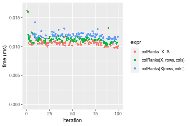

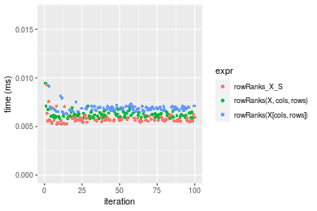
_Table: Benchmarking of colRanks_X_S() and rowRanks_X_S() on double+10x10 data (original and transposed).  The top panel shows times in milliseconds and the bottom panel shows relative times._


|   |expr         |   min|      lq|     mean|  median|     uq|    max|
|:--|:------------|-----:|-------:|--------:|-------:|------:|------:|
|2  |rowRanks_X_S | 5.247|  5.5745|  5.80520|  5.6865|  5.902|  9.326|
|1  |colRanks_X_S | 9.751| 10.3620| 11.29637| 10.5985| 10.807| 62.305|


|   |expr         |      min|       lq|     mean| median|       uq|      max|
|:--|:------------|--------:|--------:|--------:|------:|--------:|--------:|
|2  |rowRanks_X_S | 1.000000| 1.000000| 1.000000| 1.0000| 1.000000| 1.000000|
|1  |colRanks_X_S | 1.858395| 1.858821| 1.945905| 1.8638| 1.831074| 6.680785|

_Figure: Benchmarking of colRanks_X_S() and rowRanks_X_S() on double+10x10 data (original and transposed).  Outliers are displayed as crosses. Times are in milliseconds._


#### 100x100 double matrix

```r
> X <- data[["100x100"]]
> rows <- sample.int(nrow(X), size = nrow(X) * 0.7)
> cols <- sample.int(ncol(X), size = ncol(X) * 0.7)
> X_S <- X[rows, cols]
> gc()
           used  (Mb) gc trigger  (Mb) max used  (Mb)
Ncells  5282301 282.2    8529671 455.6  8529671 455.6
Vcells 10172836  77.7   31876688 243.2 60562128 462.1
> colStats <- microbenchmark(colRanks_X_S = colRanks(X_S, na.rm = FALSE), `colRanks(X, rows, cols)` = colRanks(X, 
+     rows = rows, cols = cols, na.rm = FALSE), `colRanks(X[rows, cols])` = colRanks(X[rows, cols], 
+     na.rm = FALSE), unit = "ms")
> X <- t(X)
> X_S <- t(X_S)
> gc()
           used  (Mb) gc trigger  (Mb) max used  (Mb)
Ncells  5282277 282.2    8529671 455.6  8529671 455.6
Vcells 10182889  77.7   31876688 243.2 60562128 462.1
> rowStats <- microbenchmark(rowRanks_X_S = rowRanks(X_S, na.rm = FALSE), `rowRanks(X, cols, rows)` = rowRanks(X, 
+     rows = cols, cols = rows, na.rm = FALSE), `rowRanks(X[cols, rows])` = rowRanks(X[cols, rows], 
+     na.rm = FALSE), unit = "ms")
```

_Table: Benchmarking of colRanks_X_S(), colRanks(X, rows, cols)() and colRanks(X[rows, cols])() on double+100x100 data. The top panel shows times in milliseconds and the bottom panel shows relative times._


|   |expr                    |      min|        lq|      mean|   median|        uq|      max|
|:--|:-----------------------|--------:|---------:|---------:|--------:|---------:|--------:|
|2  |colRanks(X, rows, cols) | 0.157793| 0.1706415| 0.1952590| 0.188473| 0.2122810| 0.312737|
|1  |colRanks_X_S            | 0.156409| 0.1670390| 0.1971071| 0.193650| 0.2153525| 0.303292|
|3  |colRanks(X[rows, cols]) | 0.167291| 0.1815095| 0.2084319| 0.204399| 0.2266885| 0.359424|


|   |expr                    |      min|        lq|     mean|   median|       uq|       max|
|:--|:-----------------------|--------:|---------:|--------:|--------:|--------:|---------:|
|2  |colRanks(X, rows, cols) | 1.000000| 1.0000000| 1.000000| 1.000000| 1.000000| 1.0000000|
|1  |colRanks_X_S            | 0.991229| 0.9788885| 1.009465| 1.027468| 1.014469| 0.9697989|
|3  |colRanks(X[rows, cols]) | 1.060193| 1.0636891| 1.067464| 1.084500| 1.067870| 1.1492852|

_Table: Benchmarking of rowRanks_X_S(), rowRanks(X, cols, rows)() and rowRanks(X[cols, rows])() on double+100x100 data (transposed). The top panel shows times in milliseconds and the bottom panel shows relative times._


|   |expr                    |      min|        lq|      mean|    median|        uq|      max|
|:--|:-----------------------|--------:|---------:|---------:|---------:|---------:|--------:|
|1  |rowRanks_X_S            | 0.143959| 0.1522625| 0.1777158| 0.1720695| 0.1958270| 0.259568|
|2  |rowRanks(X, cols, rows) | 0.144963| 0.1565980| 0.1780939| 0.1732365| 0.1907675| 0.298066|
|3  |rowRanks(X[cols, rows]) | 0.155006| 0.1689710| 0.1880969| 0.1841210| 0.2026895| 0.260504|


|   |expr                    |      min|       lq|     mean|   median|        uq|      max|
|:--|:-----------------------|--------:|--------:|--------:|--------:|---------:|--------:|
|1  |rowRanks_X_S            | 1.000000| 1.000000| 1.000000| 1.000000| 1.0000000| 1.000000|
|2  |rowRanks(X, cols, rows) | 1.006974| 1.028474| 1.002128| 1.006782| 0.9741634| 1.148316|
|3  |rowRanks(X[cols, rows]) | 1.076737| 1.109735| 1.058414| 1.070039| 1.0350437| 1.003606|

_Figure: Benchmarking of colRanks_X_S(), colRanks(X, rows, cols)() and colRanks(X[rows, cols])() on double+100x100 data  as well as rowRanks_X_S(), rowRanks(X, cols, rows)() and rowRanks(X[cols, rows])() on the same data transposed.  Outliers are displayed as crosses.  Times are in milliseconds._


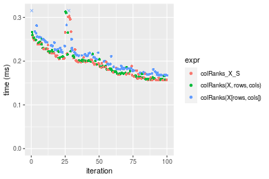

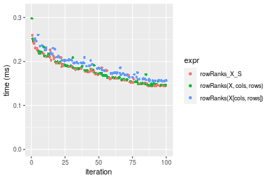
_Table: Benchmarking of colRanks_X_S() and rowRanks_X_S() on double+100x100 data (original and transposed).  The top panel shows times in milliseconds and the bottom panel shows relative times._


|   |expr         |     min|       lq|     mean|   median|       uq|     max|
|:--|:------------|-------:|--------:|--------:|--------:|--------:|-------:|
|2  |rowRanks_X_S | 143.959| 152.2625| 177.7158| 172.0695| 195.8270| 259.568|
|1  |colRanks_X_S | 156.409| 167.0390| 197.1071| 193.6500| 215.3525| 303.292|


|   |expr         |      min|       lq|     mean|   median|       uq|      max|
|:--|:------------|--------:|--------:|--------:|--------:|--------:|--------:|
|2  |rowRanks_X_S | 1.000000| 1.000000| 1.000000| 1.000000| 1.000000| 1.000000|
|1  |colRanks_X_S | 1.086483| 1.097046| 1.109114| 1.125417| 1.099708| 1.168449|

_Figure: Benchmarking of colRanks_X_S() and rowRanks_X_S() on double+100x100 data (original and transposed).  Outliers are displayed as crosses. Times are in milliseconds._


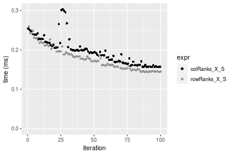

#### 1000x10 double matrix

```r
> X <- data[["1000x10"]]
> rows <- sample.int(nrow(X), size = nrow(X) * 0.7)
> cols <- sample.int(ncol(X), size = ncol(X) * 0.7)
> X_S <- X[rows, cols]
> gc()
           used  (Mb) gc trigger  (Mb) max used  (Mb)
Ncells  5282501 282.2    8529671 455.6  8529671 455.6
Vcells 10174248  77.7   31876688 243.2 60562128 462.1
> colStats <- microbenchmark(colRanks_X_S = colRanks(X_S, na.rm = FALSE), `colRanks(X, rows, cols)` = colRanks(X, 
+     rows = rows, cols = cols, na.rm = FALSE), `colRanks(X[rows, cols])` = colRanks(X[rows, cols], 
+     na.rm = FALSE), unit = "ms")
> X <- t(X)
> X_S <- t(X_S)
> gc()
           used  (Mb) gc trigger  (Mb) max used  (Mb)
Ncells  5282477 282.2    8529671 455.6  8529671 455.6
Vcells 10184301  77.8   31876688 243.2 60562128 462.1
> rowStats <- microbenchmark(rowRanks_X_S = rowRanks(X_S, na.rm = FALSE), `rowRanks(X, cols, rows)` = rowRanks(X, 
+     rows = cols, cols = rows, na.rm = FALSE), `rowRanks(X[cols, rows])` = rowRanks(X[cols, rows], 
+     na.rm = FALSE), unit = "ms")
```

_Table: Benchmarking of colRanks_X_S(), colRanks(X, rows, cols)() and colRanks(X[rows, cols])() on double+1000x10 data. The top panel shows times in milliseconds and the bottom panel shows relative times._


|   |expr                    |      min|       lq|      mean|    median|        uq|      max|
|:--|:-----------------------|--------:|--------:|---------:|---------:|---------:|--------:|
|2  |colRanks(X, rows, cols) | 0.219703| 0.222095| 0.2588177| 0.2431585| 0.2774785| 0.383786|
|3  |colRanks(X[rows, cols]) | 0.228932| 0.231082| 0.2674533| 0.2467775| 0.2945105| 0.453573|
|1  |colRanks_X_S            | 0.216946| 0.220667| 0.2593508| 0.2539770| 0.2825490| 0.389968|


|   |expr                    |       min|        lq|     mean|   median|       uq|      max|
|:--|:-----------------------|---------:|---------:|--------:|--------:|--------:|--------:|
|2  |colRanks(X, rows, cols) | 1.0000000| 1.0000000| 1.000000| 1.000000| 1.000000| 1.000000|
|3  |colRanks(X[rows, cols]) | 1.0420067| 1.0404647| 1.033365| 1.014883| 1.061381| 1.181838|
|1  |colRanks_X_S            | 0.9874512| 0.9935703| 1.002060| 1.044492| 1.018274| 1.016108|

_Table: Benchmarking of rowRanks_X_S(), rowRanks(X, cols, rows)() and rowRanks(X[cols, rows])() on double+1000x10 data (transposed). The top panel shows times in milliseconds and the bottom panel shows relative times._


|   |expr                    |      min|        lq|      mean|    median|        uq|      max|
|:--|:-----------------------|--------:|---------:|---------:|---------:|---------:|--------:|
|1  |rowRanks_X_S            | 0.205128| 0.2073270| 0.2367801| 0.2186765| 0.2590685| 0.354804|
|2  |rowRanks(X, cols, rows) | 0.208523| 0.2103955| 0.2431503| 0.2312000| 0.2647270| 0.334157|
|3  |rowRanks(X[cols, rows]) | 0.218719| 0.2208370| 0.2523473| 0.2386930| 0.2779100| 0.424637|


|   |expr                    |      min|       lq|     mean|   median|       uq|       max|
|:--|:-----------------------|--------:|--------:|--------:|--------:|--------:|---------:|
|1  |rowRanks_X_S            | 1.000000| 1.000000| 1.000000| 1.000000| 1.000000| 1.0000000|
|2  |rowRanks(X, cols, rows) | 1.016551| 1.014800| 1.026903| 1.057270| 1.021842| 0.9418073|
|3  |rowRanks(X[cols, rows]) | 1.066256| 1.065163| 1.065745| 1.091535| 1.072728| 1.1968213|

_Figure: Benchmarking of colRanks_X_S(), colRanks(X, rows, cols)() and colRanks(X[rows, cols])() on double+1000x10 data  as well as rowRanks_X_S(), rowRanks(X, cols, rows)() and rowRanks(X[cols, rows])() on the same data transposed.  Outliers are displayed as crosses.  Times are in milliseconds._


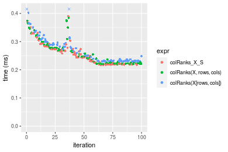

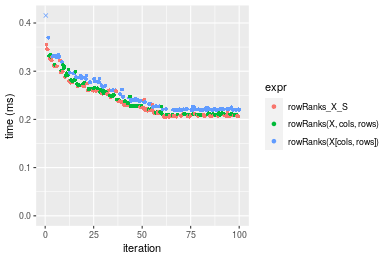
_Table: Benchmarking of colRanks_X_S() and rowRanks_X_S() on double+1000x10 data (original and transposed).  The top panel shows times in milliseconds and the bottom panel shows relative times._


|   |expr         |     min|      lq|     mean|   median|       uq|     max|
|:--|:------------|-------:|-------:|--------:|--------:|--------:|-------:|
|2  |rowRanks_X_S | 205.128| 207.327| 236.7801| 218.6765| 259.0685| 354.804|
|1  |colRanks_X_S | 216.946| 220.667| 259.3508| 253.9770| 282.5490| 389.968|


|   |expr         |      min|       lq|     mean|   median|       uq|      max|
|:--|:------------|--------:|--------:|--------:|--------:|--------:|--------:|
|2  |rowRanks_X_S | 1.000000| 1.000000| 1.000000| 1.000000| 1.000000| 1.000000|
|1  |colRanks_X_S | 1.057613| 1.064343| 1.095323| 1.161428| 1.090634| 1.099108|

_Figure: Benchmarking of colRanks_X_S() and rowRanks_X_S() on double+1000x10 data (original and transposed).  Outliers are displayed as crosses. Times are in milliseconds._


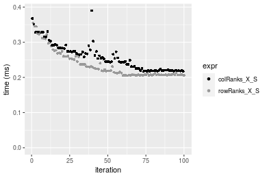

#### 10x1000 double matrix

```r
> X <- data[["10x1000"]]
> rows <- sample.int(nrow(X), size = nrow(X) * 0.7)
> cols <- sample.int(ncol(X), size = ncol(X) * 0.7)
> X_S <- X[rows, cols]
> gc()
           used  (Mb) gc trigger  (Mb) max used  (Mb)
Ncells  5282706 282.2    8529671 455.6  8529671 455.6
Vcells 10174384  77.7   31876688 243.2 60562128 462.1
> colStats <- microbenchmark(colRanks_X_S = colRanks(X_S, na.rm = FALSE), `colRanks(X, rows, cols)` = colRanks(X, 
+     rows = rows, cols = cols, na.rm = FALSE), `colRanks(X[rows, cols])` = colRanks(X[rows, cols], 
+     na.rm = FALSE), unit = "ms")
> X <- t(X)
> X_S <- t(X_S)
> gc()
           used  (Mb) gc trigger  (Mb) max used  (Mb)
Ncells  5282682 282.2    8529671 455.6  8529671 455.6
Vcells 10184437  77.8   31876688 243.2 60562128 462.1
> rowStats <- microbenchmark(rowRanks_X_S = rowRanks(X_S, na.rm = FALSE), `rowRanks(X, cols, rows)` = rowRanks(X, 
+     rows = cols, cols = rows, na.rm = FALSE), `rowRanks(X[cols, rows])` = rowRanks(X[cols, rows], 
+     na.rm = FALSE), unit = "ms")
```

_Table: Benchmarking of colRanks_X_S(), colRanks(X, rows, cols)() and colRanks(X[rows, cols])() on double+10x1000 data. The top panel shows times in milliseconds and the bottom panel shows relative times._


|   |expr                    |      min|        lq|      mean|    median|        uq|      max|
|:--|:-----------------------|--------:|---------:|---------:|---------:|---------:|--------:|
|2  |colRanks(X, rows, cols) | 0.107805| 0.1171945| 0.1271478| 0.1237850| 0.1329600| 0.210252|
|1  |colRanks_X_S            | 0.105226| 0.1138685| 0.1299248| 0.1253850| 0.1376795| 0.216747|
|3  |colRanks(X[rows, cols]) | 0.121109| 0.1329515| 0.1454440| 0.1387485| 0.1543040| 0.242364|


|   |expr                    |       min|        lq|     mean|   median|       uq|      max|
|:--|:-----------------------|---------:|---------:|--------:|--------:|--------:|--------:|
|2  |colRanks(X, rows, cols) | 1.0000000| 1.0000000| 1.000000| 1.000000| 1.000000| 1.000000|
|1  |colRanks_X_S            | 0.9760772| 0.9716198| 1.021841| 1.012926| 1.035496| 1.030892|
|3  |colRanks(X[rows, cols]) | 1.1234080| 1.1344517| 1.143897| 1.120883| 1.160529| 1.152731|

_Table: Benchmarking of rowRanks_X_S(), rowRanks(X, cols, rows)() and rowRanks(X[cols, rows])() on double+10x1000 data (transposed). The top panel shows times in milliseconds and the bottom panel shows relative times._


|   |expr                    |      min|        lq|      mean|    median|        uq|      max|
|:--|:-----------------------|--------:|---------:|---------:|---------:|---------:|--------:|
|1  |rowRanks_X_S            | 0.089888| 0.1005880| 0.1092712| 0.1064815| 0.1171740| 0.146230|
|2  |rowRanks(X, cols, rows) | 0.094083| 0.1013450| 0.1107924| 0.1070895| 0.1142800| 0.192828|
|3  |rowRanks(X[cols, rows]) | 0.102016| 0.1128115| 0.1231601| 0.1193580| 0.1343425| 0.160808|


|   |expr                    |      min|       lq|     mean|   median|        uq|      max|
|:--|:-----------------------|--------:|--------:|--------:|--------:|---------:|--------:|
|1  |rowRanks_X_S            | 1.000000| 1.000000| 1.000000| 1.000000| 1.0000000| 1.000000|
|2  |rowRanks(X, cols, rows) | 1.046669| 1.007526| 1.013921| 1.005710| 0.9753017| 1.318662|
|3  |rowRanks(X[cols, rows]) | 1.134923| 1.121520| 1.127104| 1.120927| 1.1465214| 1.099692|

_Figure: Benchmarking of colRanks_X_S(), colRanks(X, rows, cols)() and colRanks(X[rows, cols])() on double+10x1000 data  as well as rowRanks_X_S(), rowRanks(X, cols, rows)() and rowRanks(X[cols, rows])() on the same data transposed.  Outliers are displayed as crosses.  Times are in milliseconds._


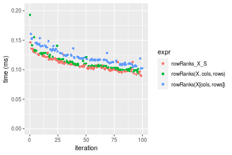
_Table: Benchmarking of colRanks_X_S() and rowRanks_X_S() on double+10x1000 data (original and transposed).  The top panel shows times in milliseconds and the bottom panel shows relative times._


|   |expr         |     min|       lq|     mean|   median|       uq|     max|
|:--|:------------|-------:|--------:|--------:|--------:|--------:|-------:|
|2  |rowRanks_X_S |  89.888| 100.5880| 109.2712| 106.4815| 117.1740| 146.230|
|1  |colRanks_X_S | 105.226| 113.8685| 129.9248| 125.3850| 137.6795| 216.747|


|   |expr         |      min|       lq|     mean|   median|    uq|      max|
|:--|:------------|--------:|--------:|--------:|--------:|-----:|--------:|
|2  |rowRanks_X_S | 1.000000| 1.000000| 1.000000| 1.000000| 1.000| 1.000000|
|1  |colRanks_X_S | 1.170635| 1.132029| 1.189012| 1.177528| 1.175| 1.482233|

_Figure: Benchmarking of colRanks_X_S() and rowRanks_X_S() on double+10x1000 data (original and transposed).  Outliers are displayed as crosses. Times are in milliseconds._


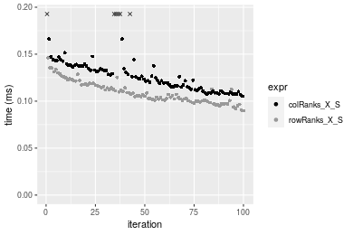

#### 100x1000 double matrix

```r
> X <- data[["100x1000"]]
> rows <- sample.int(nrow(X), size = nrow(X) * 0.7)
> cols <- sample.int(ncol(X), size = ncol(X) * 0.7)
> X_S <- X[rows, cols]
> gc()
           used  (Mb) gc trigger  (Mb) max used  (Mb)
Ncells  5282916 282.2    8529671 455.6  8529671 455.6
Vcells 10219850  78.0   31876688 243.2 60562128 462.1
> colStats <- microbenchmark(colRanks_X_S = colRanks(X_S, na.rm = FALSE), `colRanks(X, rows, cols)` = colRanks(X, 
+     rows = rows, cols = cols, na.rm = FALSE), `colRanks(X[rows, cols])` = colRanks(X[rows, cols], 
+     na.rm = FALSE), unit = "ms")
> X <- t(X)
> X_S <- t(X_S)
> gc()
           used  (Mb) gc trigger  (Mb) max used  (Mb)
Ncells  5282892 282.2    8529671 455.6  8529671 455.6
Vcells 10319903  78.8   31876688 243.2 60562128 462.1
> rowStats <- microbenchmark(rowRanks_X_S = rowRanks(X_S, na.rm = FALSE), `rowRanks(X, cols, rows)` = rowRanks(X, 
+     rows = cols, cols = rows, na.rm = FALSE), `rowRanks(X[cols, rows])` = rowRanks(X[cols, rows], 
+     na.rm = FALSE), unit = "ms")
```

_Table: Benchmarking of colRanks_X_S(), colRanks(X, rows, cols)() and colRanks(X[rows, cols])() on double+100x1000 data. The top panel shows times in milliseconds and the bottom panel shows relative times._


|   |expr                    |      min|       lq|     mean|   median|       uq|      max|
|:--|:-----------------------|--------:|--------:|--------:|--------:|--------:|--------:|
|1  |colRanks_X_S            | 1.560653| 1.686157| 1.735688| 1.698892| 1.741967| 2.577927|
|2  |colRanks(X, rows, cols) | 1.560967| 1.690041| 1.729855| 1.705023| 1.740768| 2.494924|
|3  |colRanks(X[rows, cols]) | 1.661799| 1.793497| 1.858614| 1.804922| 1.848437| 2.300170|


|   |expr                    |      min|       lq|      mean|   median|        uq|       max|
|:--|:-----------------------|--------:|--------:|---------:|--------:|---------:|---------:|
|1  |colRanks_X_S            | 1.000000| 1.000000| 1.0000000| 1.000000| 1.0000000| 1.0000000|
|2  |colRanks(X, rows, cols) | 1.000201| 1.002303| 0.9966395| 1.003608| 0.9993111| 0.9678024|
|3  |colRanks(X[rows, cols]) | 1.064810| 1.063660| 1.0708229| 1.062412| 1.0611205| 0.8922557|

_Table: Benchmarking of rowRanks_X_S(), rowRanks(X, cols, rows)() and rowRanks(X[cols, rows])() on double+100x1000 data (transposed). The top panel shows times in milliseconds and the bottom panel shows relative times._


|   |expr                    |      min|       lq|     mean|   median|       uq|      max|
|:--|:-----------------------|--------:|--------:|--------:|--------:|--------:|--------:|
|1  |rowRanks_X_S            | 1.495770| 1.592583| 1.652753| 1.618496| 1.649717| 2.525829|
|2  |rowRanks(X, cols, rows) | 1.497414| 1.619851| 1.637196| 1.627238| 1.660529| 2.308154|
|3  |rowRanks(X[cols, rows]) | 1.621047| 1.743577| 1.780409| 1.762746| 1.787400| 2.322907|


|   |expr                    |      min|       lq|      mean|   median|       uq|       max|
|:--|:-----------------------|--------:|--------:|---------:|--------:|--------:|---------:|
|1  |rowRanks_X_S            | 1.000000| 1.000000| 1.0000000| 1.000000| 1.000000| 1.0000000|
|2  |rowRanks(X, cols, rows) | 1.001099| 1.017122| 0.9905868| 1.005402| 1.006553| 0.9138204|
|3  |rowRanks(X[cols, rows]) | 1.083754| 1.094811| 1.0772382| 1.089127| 1.083458| 0.9196612|

_Figure: Benchmarking of colRanks_X_S(), colRanks(X, rows, cols)() and colRanks(X[rows, cols])() on double+100x1000 data  as well as rowRanks_X_S(), rowRanks(X, cols, rows)() and rowRanks(X[cols, rows])() on the same data transposed.  Outliers are displayed as crosses.  Times are in milliseconds._


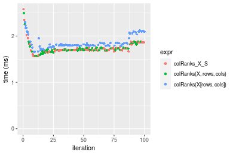

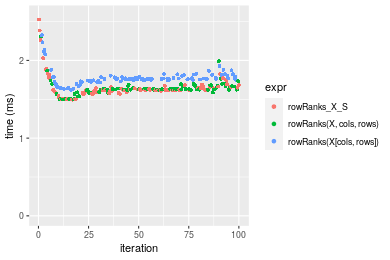
_Table: Benchmarking of colRanks_X_S() and rowRanks_X_S() on double+100x1000 data (original and transposed).  The top panel shows times in milliseconds and the bottom panel shows relative times._


|   |expr         |      min|       lq|     mean|   median|       uq|      max|
|:--|:------------|--------:|--------:|--------:|--------:|--------:|--------:|
|2  |rowRanks_X_S | 1.495770| 1.592583| 1.652753| 1.618496| 1.649717| 2.525829|
|1  |colRanks_X_S | 1.560653| 1.686157| 1.735688| 1.698892| 1.741967| 2.577927|


|   |expr         |      min|       lq|     mean|   median|       uq|      max|
|:--|:------------|--------:|--------:|--------:|--------:|--------:|--------:|
|2  |rowRanks_X_S | 1.000000| 1.000000| 1.000000| 1.000000| 1.000000| 1.000000|
|1  |colRanks_X_S | 1.043378| 1.058756| 1.050179| 1.049674| 1.055919| 1.020626|

_Figure: Benchmarking of colRanks_X_S() and rowRanks_X_S() on double+100x1000 data (original and transposed).  Outliers are displayed as crosses. Times are in milliseconds._


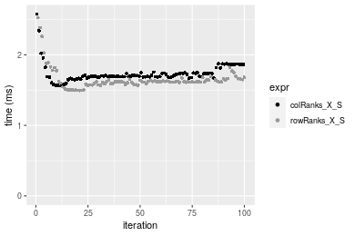

#### 1000x100 double matrix

```r
> X <- data[["1000x100"]]
> rows <- sample.int(nrow(X), size = nrow(X) * 0.7)
> cols <- sample.int(ncol(X), size = ncol(X) * 0.7)
> X_S <- X[rows, cols]
> gc()
           used  (Mb) gc trigger  (Mb) max used  (Mb)
Ncells  5283129 282.2    8529671 455.6  8529671 455.6
Vcells 10219994  78.0   31876688 243.2 60562128 462.1
> colStats <- microbenchmark(colRanks_X_S = colRanks(X_S, na.rm = FALSE), `colRanks(X, rows, cols)` = colRanks(X, 
+     rows = rows, cols = cols, na.rm = FALSE), `colRanks(X[rows, cols])` = colRanks(X[rows, cols], 
+     na.rm = FALSE), unit = "ms")
> X <- t(X)
> X_S <- t(X_S)
> gc()
           used  (Mb) gc trigger  (Mb) max used  (Mb)
Ncells  5283105 282.2    8529671 455.6  8529671 455.6
Vcells 10320047  78.8   31876688 243.2 60562128 462.1
> rowStats <- microbenchmark(rowRanks_X_S = rowRanks(X_S, na.rm = FALSE), `rowRanks(X, cols, rows)` = rowRanks(X, 
+     rows = cols, cols = rows, na.rm = FALSE), `rowRanks(X[cols, rows])` = rowRanks(X[cols, rows], 
+     na.rm = FALSE), unit = "ms")
```

_Table: Benchmarking of colRanks_X_S(), colRanks(X, rows, cols)() and colRanks(X[rows, cols])() on double+1000x100 data. The top panel shows times in milliseconds and the bottom panel shows relative times._


|   |expr                    |      min|       lq|     mean|   median|       uq|      max|
|:--|:-----------------------|--------:|--------:|--------:|--------:|--------:|--------:|
|2  |colRanks(X, rows, cols) | 2.141629| 2.321084| 2.403352| 2.369630| 2.514019| 2.984235|
|1  |colRanks_X_S            | 2.140986| 2.323867| 2.414664| 2.396863| 2.509381| 3.435969|
|3  |colRanks(X[rows, cols]) | 2.223409| 2.413083| 2.533625| 2.439485| 2.738247| 3.295286|


|   |expr                    |       min|       lq|     mean|   median|        uq|      max|
|:--|:-----------------------|---------:|--------:|--------:|--------:|---------:|--------:|
|2  |colRanks(X, rows, cols) | 1.0000000| 1.000000| 1.000000| 1.000000| 1.0000000| 1.000000|
|1  |colRanks_X_S            | 0.9996998| 1.001199| 1.004707| 1.011492| 0.9981553| 1.151374|
|3  |colRanks(X[rows, cols]) | 1.0381859| 1.039636| 1.054205| 1.029479| 1.0891913| 1.104231|

_Table: Benchmarking of rowRanks_X_S(), rowRanks(X, cols, rows)() and rowRanks(X[cols, rows])() on double+1000x100 data (transposed). The top panel shows times in milliseconds and the bottom panel shows relative times._


|   |expr                    |      min|       lq|     mean|   median|       uq|      max|
|:--|:-----------------------|--------:|--------:|--------:|--------:|--------:|--------:|
|1  |rowRanks_X_S            | 2.076805| 2.248443| 2.266023| 2.260276| 2.309429| 2.748058|
|2  |rowRanks(X, cols, rows) | 2.087850| 2.229965| 2.291291| 2.261569| 2.321666| 3.471563|
|3  |rowRanks(X[cols, rows]) | 2.191521| 2.355176| 2.388814| 2.379115| 2.432278| 3.290447|


|   |expr                    |      min|        lq|     mean|   median|       uq|      max|
|:--|:-----------------------|--------:|---------:|--------:|--------:|--------:|--------:|
|1  |rowRanks_X_S            | 1.000000| 1.0000000| 1.000000| 1.000000| 1.000000| 1.000000|
|2  |rowRanks(X, cols, rows) | 1.005318| 0.9917819| 1.011151| 1.000572| 1.005299| 1.263279|
|3  |rowRanks(X[cols, rows]) | 1.055237| 1.0474695| 1.054188| 1.052577| 1.053195| 1.197372|

_Figure: Benchmarking of colRanks_X_S(), colRanks(X, rows, cols)() and colRanks(X[rows, cols])() on double+1000x100 data  as well as rowRanks_X_S(), rowRanks(X, cols, rows)() and rowRanks(X[cols, rows])() on the same data transposed.  Outliers are displayed as crosses.  Times are in milliseconds._


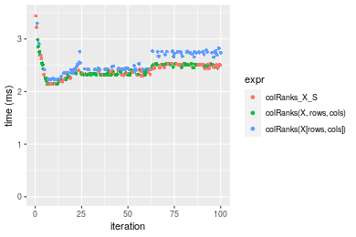

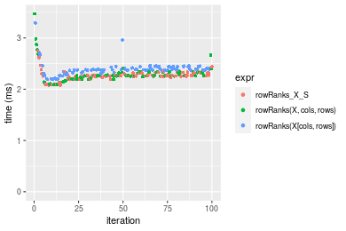
_Table: Benchmarking of colRanks_X_S() and rowRanks_X_S() on double+1000x100 data (original and transposed).  The top panel shows times in milliseconds and the bottom panel shows relative times._


|   |expr         |      min|       lq|     mean|   median|       uq|      max|
|:--|:------------|--------:|--------:|--------:|--------:|--------:|--------:|
|2  |rowRanks_X_S | 2.076805| 2.248443| 2.266023| 2.260276| 2.309429| 2.748058|
|1  |colRanks_X_S | 2.140986| 2.323867| 2.414664| 2.396863| 2.509381| 3.435969|


|   |expr         |      min|       lq|     mean|   median|       uq|      max|
|:--|:------------|--------:|--------:|--------:|--------:|--------:|--------:|
|2  |rowRanks_X_S | 1.000000| 1.000000| 1.000000| 1.000000| 1.000000| 1.000000|
|1  |colRanks_X_S | 1.030904| 1.033545| 1.065596| 1.060429| 1.086581| 1.250326|

_Figure: Benchmarking of colRanks_X_S() and rowRanks_X_S() on double+1000x100 data (original and transposed).  Outliers are displayed as crosses. Times are in milliseconds._


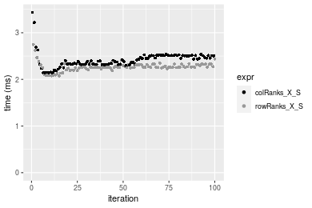


## Appendix

### Session information
```r
R version 4.1.1 Patched (2021-08-10 r80727)
Platform: x86_64-pc-linux-gnu (64-bit)
Running under: Ubuntu 18.04.5 LTS

Matrix products: default
BLAS:   /home/hb/software/R-devel/R-4-1-branch/lib/R/lib/libRblas.so
LAPACK: /home/hb/software/R-devel/R-4-1-branch/lib/R/lib/libRlapack.so

locale:
 [1] LC_CTYPE=en_US.UTF-8       LC_NUMERIC=C              
 [3] LC_TIME=en_US.UTF-8        LC_COLLATE=en_US.UTF-8    
 [5] LC_MONETARY=en_US.UTF-8    LC_MESSAGES=en_US.UTF-8   
 [7] LC_PAPER=en_US.UTF-8       LC_NAME=C                 
 [9] LC_ADDRESS=C               LC_TELEPHONE=C            
[11] LC_MEASUREMENT=en_US.UTF-8 LC_IDENTIFICATION=C       

attached base packages:
[1] stats     graphics  grDevices utils     datasets  methods   base     

other attached packages:
[1] microbenchmark_1.4-7   matrixStats_0.60.1     ggplot2_3.3.5         
[4] knitr_1.33             R.devices_2.17.0       R.utils_2.10.1        
[7] R.oo_1.24.0            R.methodsS3_1.8.1-9001 history_0.0.1-9000    

loaded via a namespace (and not attached):
 [1] Biobase_2.52.0          httr_1.4.2              splines_4.1.1          
 [4] bit64_4.0.5             network_1.17.1          assertthat_0.2.1       
 [7] highr_0.9               stats4_4.1.1            blob_1.2.2             
[10] GenomeInfoDbData_1.2.6  robustbase_0.93-8       pillar_1.6.2           
[13] RSQLite_2.2.8           lattice_0.20-44         glue_1.4.2             
[16] digest_0.6.27           XVector_0.32.0          colorspace_2.0-2       
[19] Matrix_1.3-4            XML_3.99-0.7            pkgconfig_2.0.3        
[22] zlibbioc_1.38.0         genefilter_1.74.0       purrr_0.3.4            
[25] ergm_4.1.2              xtable_1.8-4            scales_1.1.1           
[28] tibble_3.1.4            annotate_1.70.0         KEGGREST_1.32.0        
[31] farver_2.1.0            generics_0.1.0          IRanges_2.26.0         
[34] ellipsis_0.3.2          cachem_1.0.6            withr_2.4.2            
[37] BiocGenerics_0.38.0     mime_0.11               survival_3.2-13        
[40] magrittr_2.0.1          crayon_1.4.1            statnet.common_4.5.0   
[43] memoise_2.0.0           laeken_0.5.1            fansi_0.5.0            
[46] R.cache_0.15.0          MASS_7.3-54             R.rsp_0.44.0           
[49] progressr_0.8.0         tools_4.1.1             lifecycle_1.0.0        
[52] S4Vectors_0.30.0        trust_0.1-8             munsell_0.5.0          
[55] tabby_0.0.1-9001        AnnotationDbi_1.54.1    Biostrings_2.60.2      
[58] compiler_4.1.1          GenomeInfoDb_1.28.1     rlang_0.4.11           
[61] grid_4.1.1              RCurl_1.98-1.4          cwhmisc_6.6            
[64] rappdirs_0.3.3          startup_0.15.0          labeling_0.4.2         
[67] bitops_1.0-7            base64enc_0.1-3         boot_1.3-28            
[70] gtable_0.3.0            DBI_1.1.1               markdown_1.1           
[73] R6_2.5.1                lpSolveAPI_5.5.2.0-17.7 rle_0.9.2              
[76] dplyr_1.0.7             fastmap_1.1.0           bit_4.0.4              
[79] utf8_1.2.2              parallel_4.1.1          Rcpp_1.0.7             
[82] vctrs_0.3.8             png_0.1-7               DEoptimR_1.0-9         
[85] tidyselect_1.1.1        xfun_0.25               coda_0.19-4            
```
Total processing time was 27.94 secs.


### Reproducibility
To reproduce this report, do:
```r
html <- matrixStats:::benchmark('colRowRanks_subset')
```

[RSP]: https://cran.r-project.org/package=R.rsp
[matrixStats]: https://cran.r-project.org/package=matrixStats

[StackOverflow:colMins?]: https://stackoverflow.com/questions/13676878 "Stack Overflow: fastest way to get Min from every column in a matrix?"
[StackOverflow:colSds?]: https://stackoverflow.com/questions/17549762 "Stack Overflow: Is there such 'colsd' in R?"
[StackOverflow:rowProds?]: https://stackoverflow.com/questions/20198801/ "Stack Overflow: Row product of matrix and column sum of matrix"

---------------------------------------
Copyright Dongcan Jiang. Last updated on 2021-08-25 19:07:53 (+0200 UTC). Powered by [RSP].

<script>
 var link = document.createElement('link');
 link.rel = 'icon';
 link.href = "data:image/png;base64,iVBORw0KGgoAAAANSUhEUgAAACAAAAAgCAMAAABEpIrGAAAA21BMVEUAAAAAAP8AAP8AAP8AAP8AAP8AAP8AAP8AAP8AAP8AAP8AAP8AAP8AAP8AAP8AAP8AAP8AAP8AAP8AAP8AAP8AAP8AAP8AAP8AAP8AAP8AAP8AAP8AAP8AAP8AAP8AAP8AAP8AAP8AAP8AAP8AAP8AAP8AAP8AAP8AAP8AAP8BAf4CAv0DA/wdHeIeHuEfH+AgIN8hId4lJdomJtknJ9g+PsE/P8BAQL9yco10dIt1dYp3d4h4eIeVlWqWlmmXl2iYmGeZmWabm2Tn5xjo6Bfp6Rb39wj4+Af//wA2M9hbAAAASXRSTlMAAQIJCgsMJSYnKD4/QGRlZmhpamtsbautrrCxuru8y8zN5ebn6Pn6+///////////////////////////////////////////LsUNcQAAAS9JREFUOI29k21XgkAQhVcFytdSMqMETU26UVqGmpaiFbL//xc1cAhhwVNf6n5i5z67M2dmYOyfJZUqlVLhkKucG7cgmUZTybDz6g0iDeq51PUr37Ds2cy2/C9NeES5puDjxuUk1xnToZsg8pfA3avHQ3lLIi7iWRrkv/OYtkScxBIMgDee0ALoyxHQBJ68JLCjOtQIMIANF7QG9G9fNnHvisCHBVMKgSJgiz7nE+AoBKrAPA3MgepvgR9TSCasrCKH0eB1wBGBFdCO+nAGjMVGPcQb5bd6mQRegN6+1axOs9nGfYcCtfi4NQosdtH7dB+txFIpXQqN1p9B/asRHToyS0jRgpV7nk4nwcq1BJ+x3Gl/v7S9Wmpp/aGquum7w3ZDyrADFYrl8vHBH+ev9AUASW1dmU4h4wAAAABJRU5ErkJggg=="
 document.getElementsByTagName('head')[0].appendChild(link);
</script>


