[matrixStats]: Benchmark report

---------------------------------------


# colSums2() and rowSums2() benchmarks

This report benchmark the performance of colSums2() and rowSums2() against alternative methods.

## Alternative methods

* apply() + sum()
* colSums() and rowSums()
* .colSums() and .rowSums()


## Data type "integer"

### Data
```r
> rmatrix <- function(nrow, ncol, mode = c("logical", "double", "integer", "index"), range = c(-100, 
+     +100), na_prob = 0) {
+     mode <- match.arg(mode)
+     n <- nrow * ncol
+     if (mode == "logical") {
+         x <- sample(c(FALSE, TRUE), size = n, replace = TRUE)
+     }     else if (mode == "index") {
+         x <- seq_len(n)
+         mode <- "integer"
+     }     else {
+         x <- runif(n, min = range[1], max = range[2])
+     }
+     storage.mode(x) <- mode
+     if (na_prob > 0) 
+         x[sample(n, size = na_prob * n)] <- NA
+     dim(x) <- c(nrow, ncol)
+     x
+ }
> rmatrices <- function(scale = 10, seed = 1, ...) {
+     set.seed(seed)
+     data <- list()
+     data[[1]] <- rmatrix(nrow = scale * 1, ncol = scale * 1, ...)
+     data[[2]] <- rmatrix(nrow = scale * 10, ncol = scale * 10, ...)
+     data[[3]] <- rmatrix(nrow = scale * 100, ncol = scale * 1, ...)
+     data[[4]] <- t(data[[3]])
+     data[[5]] <- rmatrix(nrow = scale * 10, ncol = scale * 100, ...)
+     data[[6]] <- t(data[[5]])
+     names(data) <- sapply(data, FUN = function(x) paste(dim(x), collapse = "x"))
+     data
+ }
> data <- rmatrices(mode = mode)
```

### Results

#### 10x10 integer matrix

```r
> X <- data[["10x10"]]
> gc()
           used  (Mb) gc trigger  (Mb) max used  (Mb)
Ncells  5301799 283.2    8529671 455.6  8529671 455.6
Vcells 10537069  80.4   31876688 243.2 60562128 462.1
> colStats <- microbenchmark(colSums2 = colSums2(X, na.rm = FALSE), .colSums = .colSums(X, m = nrow(X), 
+     n = ncol(X), na.rm = FALSE), colSums = colSums(X, na.rm = FALSE), `apply+sum` = apply(X, MARGIN = 2L, 
+     FUN = sum, na.rm = FALSE), unit = "ms")
> X <- t(X)
> gc()
           used  (Mb) gc trigger  (Mb) max used  (Mb)
Ncells  5293402 282.7    8529671 455.6  8529671 455.6
Vcells 10509835  80.2   31876688 243.2 60562128 462.1
> rowStats <- microbenchmark(rowSums2 = rowSums2(X, na.rm = FALSE), .rowSums = .rowSums(X, m = nrow(X), 
+     n = ncol(X), na.rm = FALSE), rowSums = rowSums(X, na.rm = FALSE), `apply+sum` = apply(X, MARGIN = 1L, 
+     FUN = sum, na.rm = FALSE), unit = "ms")
```

_Table: Benchmarking of colSums2(), .colSums(), colSums() and apply+sum() on integer+10x10 data. The top panel shows times in milliseconds and the bottom panel shows relative times._


|   |expr      |      min|        lq|      mean|    median|        uq|      max|
|:--|:---------|--------:|---------:|---------:|---------:|---------:|--------:|
|1  |colSums2  | 0.002024| 0.0023590| 0.0029285| 0.0029400| 0.0032180| 0.013506|
|2  |.colSums  | 0.002832| 0.0032685| 0.0038752| 0.0036150| 0.0041135| 0.020128|
|3  |colSums   | 0.005209| 0.0058285| 0.0065548| 0.0063255| 0.0069795| 0.017134|
|4  |apply+sum | 0.033529| 0.0351655| 0.0374598| 0.0362565| 0.0373940| 0.105952|


|   |expr      |       min|        lq|      mean|    median|        uq|      max|
|:--|:---------|---------:|---------:|---------:|---------:|---------:|--------:|
|1  |colSums2  |  1.000000|  1.000000|  1.000000|  1.000000|  1.000000| 1.000000|
|2  |.colSums  |  1.399209|  1.385545|  1.323262|  1.229592|  1.278278| 1.490301|
|3  |colSums   |  2.573617|  2.470750|  2.238267|  2.151531|  2.168894| 1.268621|
|4  |apply+sum | 16.565711| 14.906952| 12.791366| 12.332143| 11.620261| 7.844810|

_Table: Benchmarking of rowSums2(), .rowSums(), rowSums() and apply+sum() on integer+10x10 data (transposed). The top panel shows times in milliseconds and the bottom panel shows relative times._


|   |expr      |      min|        lq|      mean|    median|        uq|      max|
|:--|:---------|--------:|---------:|---------:|---------:|---------:|--------:|
|1  |rowSums2  | 0.001982| 0.0022625| 0.0028599| 0.0028210| 0.0031610| 0.013250|
|2  |.rowSums  | 0.004119| 0.0044760| 0.0048506| 0.0047345| 0.0049525| 0.017034|
|3  |rowSums   | 0.006220| 0.0067815| 0.0075147| 0.0073010| 0.0076885| 0.030091|
|4  |apply+sum | 0.033936| 0.0355055| 0.0376751| 0.0365405| 0.0376265| 0.095222|


|   |expr      |       min|        lq|      mean|    median|        uq|      max|
|:--|:---------|---------:|---------:|---------:|---------:|---------:|--------:|
|1  |rowSums2  |  1.000000|  1.000000|  1.000000|  1.000000|  1.000000| 1.000000|
|2  |.rowSums  |  2.078204|  1.978342|  1.696050|  1.678306|  1.566751| 1.285585|
|3  |rowSums   |  3.138244|  2.997348|  2.627587|  2.588089|  2.432300| 2.271019|
|4  |apply+sum | 17.122099| 15.693039| 13.173392| 12.953031| 11.903353| 7.186566|

_Figure: Benchmarking of colSums2(), .colSums(), colSums() and apply+sum() on integer+10x10 data  as well as rowSums2(), .rowSums(), rowSums() and apply+sum() on the same data transposed.  Outliers are displayed as crosses.  Times are in milliseconds._


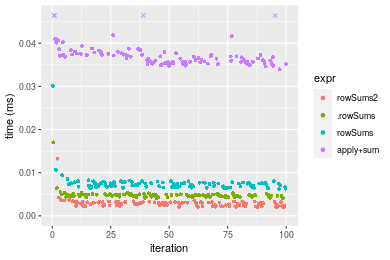
_Table: Benchmarking of colSums2() and rowSums2() on integer+10x10 data (original and transposed).  The top panel shows times in milliseconds and the bottom panel shows relative times._


|   |expr     |   min|     lq|    mean| median|    uq|    max|
|:--|:--------|-----:|------:|-------:|------:|-----:|------:|
|2  |rowSums2 | 1.982| 2.2625| 2.85994|  2.821| 3.161| 13.250|
|1  |colSums2 | 2.024| 2.3590| 2.92852|  2.940| 3.218| 13.506|


|   |expr     |      min|       lq|    mean|   median|       uq|      max|
|:--|:--------|--------:|--------:|-------:|--------:|--------:|--------:|
|2  |rowSums2 | 1.000000| 1.000000| 1.00000| 1.000000| 1.000000| 1.000000|
|1  |colSums2 | 1.021191| 1.042652| 1.02398| 1.042184| 1.018032| 1.019321|

_Figure: Benchmarking of colSums2() and rowSums2() on integer+10x10 data (original and transposed).  Outliers are displayed as crosses. Times are in milliseconds._


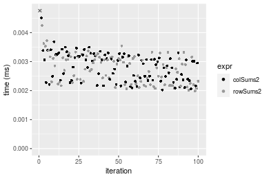

#### 100x100 integer matrix

```r
> X <- data[["100x100"]]
> gc()
           used  (Mb) gc trigger  (Mb) max used  (Mb)
Ncells  5292003 282.7    8529671 455.6  8529671 455.6
Vcells 10126681  77.3   31876688 243.2 60562128 462.1
> colStats <- microbenchmark(colSums2 = colSums2(X, na.rm = FALSE), .colSums = .colSums(X, m = nrow(X), 
+     n = ncol(X), na.rm = FALSE), colSums = colSums(X, na.rm = FALSE), `apply+sum` = apply(X, MARGIN = 2L, 
+     FUN = sum, na.rm = FALSE), unit = "ms")
> X <- t(X)
> gc()
           used  (Mb) gc trigger  (Mb) max used  (Mb)
Ncells  5291979 282.7    8529671 455.6  8529671 455.6
Vcells 10131694  77.3   31876688 243.2 60562128 462.1
> rowStats <- microbenchmark(rowSums2 = rowSums2(X, na.rm = FALSE), .rowSums = .rowSums(X, m = nrow(X), 
+     n = ncol(X), na.rm = FALSE), rowSums = rowSums(X, na.rm = FALSE), `apply+sum` = apply(X, MARGIN = 1L, 
+     FUN = sum, na.rm = FALSE), unit = "ms")
```

_Table: Benchmarking of colSums2(), .colSums(), colSums() and apply+sum() on integer+100x100 data. The top panel shows times in milliseconds and the bottom panel shows relative times._


|   |expr      |      min|        lq|      mean|    median|        uq|      max|
|:--|:---------|--------:|---------:|---------:|---------:|---------:|--------:|
|2  |.colSums  | 0.013267| 0.0143255| 0.0155111| 0.0148430| 0.0160555| 0.030816|
|3  |colSums   | 0.015436| 0.0169870| 0.0190825| 0.0179955| 0.0193405| 0.064016|
|1  |colSums2  | 0.025059| 0.0265480| 0.0281877| 0.0274060| 0.0284910| 0.044906|
|4  |apply+sum | 0.191798| 0.2036240| 0.2223822| 0.2116170| 0.2340260| 0.360976|


|   |expr      |       min|        lq|      mean|    median|        uq|       max|
|:--|:---------|---------:|---------:|---------:|---------:|---------:|---------:|
|2  |.colSums  |  1.000000|  1.000000|  1.000000|  1.000000|  1.000000|  1.000000|
|3  |colSums   |  1.163488|  1.185788|  1.230243|  1.212390|  1.204603|  2.077362|
|1  |colSums2  |  1.888822|  1.853199|  1.817256|  1.846392|  1.774532|  1.457230|
|4  |apply+sum | 14.456772| 14.214094| 14.336941| 14.257024| 14.576064| 11.713915|

_Table: Benchmarking of rowSums2(), .rowSums(), rowSums() and apply+sum() on integer+100x100 data (transposed). The top panel shows times in milliseconds and the bottom panel shows relative times._


|   |expr      |      min|        lq|      mean|    median|        uq|      max|
|:--|:---------|--------:|---------:|---------:|---------:|---------:|--------:|
|1  |rowSums2  | 0.023951| 0.0261330| 0.0290982| 0.0284265| 0.0316665| 0.047280|
|2  |.rowSums  | 0.039585| 0.0416140| 0.0459872| 0.0441170| 0.0500685| 0.065475|
|3  |rowSums   | 0.041789| 0.0447305| 0.0487430| 0.0465710| 0.0515080| 0.069365|
|4  |apply+sum | 0.185463| 0.1977110| 0.2203234| 0.2092150| 0.2359210| 0.362197|


|   |expr      |      min|       lq|     mean|   median|       uq|      max|
|:--|:---------|--------:|--------:|--------:|--------:|--------:|--------:|
|1  |rowSums2  | 1.000000| 1.000000| 1.000000| 1.000000| 1.000000| 1.000000|
|2  |.rowSums  | 1.652749| 1.592393| 1.580413| 1.551967| 1.581119| 1.384835|
|3  |rowSums   | 1.744771| 1.711648| 1.675117| 1.638295| 1.626577| 1.467111|
|4  |apply+sum | 7.743435| 7.565568| 7.571709| 7.359858| 7.450176| 7.660681|

_Figure: Benchmarking of colSums2(), .colSums(), colSums() and apply+sum() on integer+100x100 data  as well as rowSums2(), .rowSums(), rowSums() and apply+sum() on the same data transposed.  Outliers are displayed as crosses.  Times are in milliseconds._


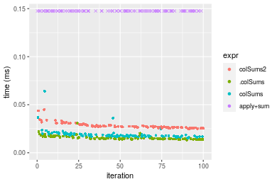

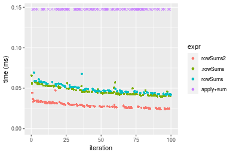
_Table: Benchmarking of colSums2() and rowSums2() on integer+100x100 data (original and transposed).  The top panel shows times in milliseconds and the bottom panel shows relative times._


|   |expr     |    min|     lq|     mean|  median|      uq|    max|
|:--|:--------|------:|------:|--------:|-------:|-------:|------:|
|1  |colSums2 | 25.059| 26.548| 28.18769| 27.4060| 28.4910| 44.906|
|2  |rowSums2 | 23.951| 26.133| 29.09824| 28.4265| 31.6665| 47.280|


|   |expr     |       min|        lq|     mean|   median|       uq|      max|
|:--|:--------|---------:|---------:|--------:|--------:|--------:|--------:|
|1  |colSums2 | 1.0000000| 1.0000000| 1.000000| 1.000000| 1.000000| 1.000000|
|2  |rowSums2 | 0.9557843| 0.9843679| 1.032303| 1.037236| 1.111456| 1.052866|

_Figure: Benchmarking of colSums2() and rowSums2() on integer+100x100 data (original and transposed).  Outliers are displayed as crosses. Times are in milliseconds._


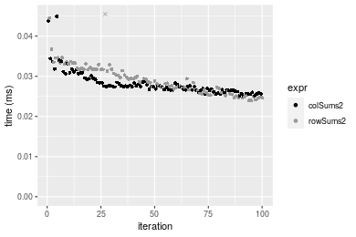

#### 1000x10 integer matrix

```r
> X <- data[["1000x10"]]
> gc()
           used  (Mb) gc trigger  (Mb) max used  (Mb)
Ncells  5292748 282.7    8529671 455.6  8529671 455.6
Vcells 10130440  77.3   31876688 243.2 60562128 462.1
> colStats <- microbenchmark(colSums2 = colSums2(X, na.rm = FALSE), .colSums = .colSums(X, m = nrow(X), 
+     n = ncol(X), na.rm = FALSE), colSums = colSums(X, na.rm = FALSE), `apply+sum` = apply(X, MARGIN = 2L, 
+     FUN = sum, na.rm = FALSE), unit = "ms")
> X <- t(X)
> gc()
           used  (Mb) gc trigger  (Mb) max used  (Mb)
Ncells  5292742 282.7    8529671 455.6  8529671 455.6
Vcells 10135483  77.4   31876688 243.2 60562128 462.1
> rowStats <- microbenchmark(rowSums2 = rowSums2(X, na.rm = FALSE), .rowSums = .rowSums(X, m = nrow(X), 
+     n = ncol(X), na.rm = FALSE), rowSums = rowSums(X, na.rm = FALSE), `apply+sum` = apply(X, MARGIN = 1L, 
+     FUN = sum, na.rm = FALSE), unit = "ms")
```

_Table: Benchmarking of colSums2(), .colSums(), colSums() and apply+sum() on integer+1000x10 data. The top panel shows times in milliseconds and the bottom panel shows relative times._


|   |expr      |      min|        lq|      mean|    median|        uq|      max|
|:--|:---------|--------:|---------:|---------:|---------:|---------:|--------:|
|2  |.colSums  | 0.012877| 0.0135665| 0.0145759| 0.0143975| 0.0152645| 0.021049|
|3  |colSums   | 0.015109| 0.0163470| 0.0178206| 0.0170805| 0.0185490| 0.041538|
|1  |colSums2  | 0.025325| 0.0264235| 0.0283863| 0.0283695| 0.0298660| 0.041995|
|4  |apply+sum | 0.102768| 0.1065335| 0.1145748| 0.1130425| 0.1193445| 0.200489|


|   |expr      |      min|       lq|     mean|   median|       uq|      max|
|:--|:---------|--------:|--------:|--------:|--------:|--------:|--------:|
|2  |.colSums  | 1.000000| 1.000000| 1.000000| 1.000000| 1.000000| 1.000000|
|3  |colSums   | 1.173332| 1.204953| 1.222605| 1.186352| 1.215172| 1.973395|
|1  |colSums2  | 1.966685| 1.947702| 1.947480| 1.970446| 1.956566| 1.995107|
|4  |apply+sum | 7.980741| 7.852689| 7.860550| 7.851537| 7.818435| 9.524871|

_Table: Benchmarking of rowSums2(), .rowSums(), rowSums() and apply+sum() on integer+1000x10 data (transposed). The top panel shows times in milliseconds and the bottom panel shows relative times._


|   |expr      |      min|        lq|      mean|    median|        uq|      max|
|:--|:---------|--------:|---------:|---------:|---------:|---------:|--------:|
|1  |rowSums2  | 0.020458| 0.0225050| 0.0250921| 0.0245700| 0.0265265| 0.047041|
|4  |apply+sum | 0.084019| 0.0930460| 0.1043740| 0.1011610| 0.1138445| 0.205897|
|2  |.rowSums  | 0.138914| 0.1472935| 0.1689857| 0.1663425| 0.1850230| 0.219647|
|3  |rowSums   | 0.140435| 0.1539695| 0.1707097| 0.1683390| 0.1811930| 0.229037|


|   |expr      |      min|       lq|     mean|   median|       uq|      max|
|:--|:---------|--------:|--------:|--------:|--------:|--------:|--------:|
|1  |rowSums2  | 1.000000| 1.000000| 1.000000| 1.000000| 1.000000| 1.000000|
|4  |apply+sum | 4.106902| 4.134459| 4.159634| 4.117257| 4.291727| 4.376969|
|2  |.rowSums  | 6.790204| 6.544923| 6.734613| 6.770147| 6.975025| 4.669267|
|3  |rowSums   | 6.864552| 6.841569| 6.803318| 6.851404| 6.830641| 4.868880|

_Figure: Benchmarking of colSums2(), .colSums(), colSums() and apply+sum() on integer+1000x10 data  as well as rowSums2(), .rowSums(), rowSums() and apply+sum() on the same data transposed.  Outliers are displayed as crosses.  Times are in milliseconds._


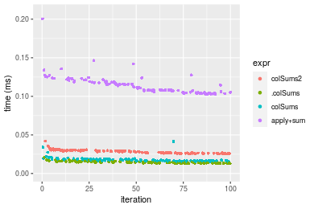

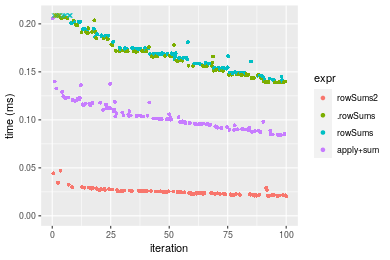
_Table: Benchmarking of colSums2() and rowSums2() on integer+1000x10 data (original and transposed).  The top panel shows times in milliseconds and the bottom panel shows relative times._


|   |expr     |    min|      lq|     mean|  median|      uq|    max|
|:--|:--------|------:|-------:|--------:|-------:|-------:|------:|
|2  |rowSums2 | 20.458| 22.5050| 25.09212| 24.5700| 26.5265| 47.041|
|1  |colSums2 | 25.325| 26.4235| 28.38634| 28.3695| 29.8660| 41.995|


|   |expr     |      min|       lq|     mean|  median|       uq|       max|
|:--|:--------|--------:|--------:|--------:|-------:|--------:|---------:|
|2  |rowSums2 | 1.000000| 1.000000| 1.000000| 1.00000| 1.000000| 1.0000000|
|1  |colSums2 | 1.237902| 1.174117| 1.131285| 1.15464| 1.125893| 0.8927319|

_Figure: Benchmarking of colSums2() and rowSums2() on integer+1000x10 data (original and transposed).  Outliers are displayed as crosses. Times are in milliseconds._


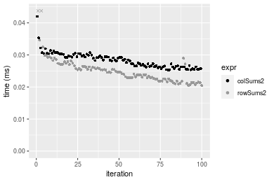

#### 10x1000 integer matrix

```r
> X <- data[["10x1000"]]
> gc()
           used  (Mb) gc trigger  (Mb) max used  (Mb)
Ncells  5292989 282.7    8529671 455.6  8529671 455.6
Vcells 10131283  77.3   31876688 243.2 60562128 462.1
> colStats <- microbenchmark(colSums2 = colSums2(X, na.rm = FALSE), .colSums = .colSums(X, m = nrow(X), 
+     n = ncol(X), na.rm = FALSE), colSums = colSums(X, na.rm = FALSE), `apply+sum` = apply(X, MARGIN = 2L, 
+     FUN = sum, na.rm = FALSE), unit = "ms")
> X <- t(X)
> gc()
           used  (Mb) gc trigger  (Mb) max used  (Mb)
Ncells  5292965 282.7    8529671 455.6  8529671 455.6
Vcells 10136296  77.4   31876688 243.2 60562128 462.1
> rowStats <- microbenchmark(rowSums2 = rowSums2(X, na.rm = FALSE), .rowSums = .rowSums(X, m = nrow(X), 
+     n = ncol(X), na.rm = FALSE), rowSums = rowSums(X, na.rm = FALSE), `apply+sum` = apply(X, MARGIN = 1L, 
+     FUN = sum, na.rm = FALSE), unit = "ms")
```

_Table: Benchmarking of colSums2(), .colSums(), colSums() and apply+sum() on integer+10x1000 data. The top panel shows times in milliseconds and the bottom panel shows relative times._


|   |expr      |      min|       lq|      mean|    median|        uq|      max|
|:--|:---------|--------:|--------:|---------:|---------:|---------:|--------:|
|2  |.colSums  | 0.012056| 0.012832| 0.0149051| 0.0139830| 0.0165545| 0.024744|
|3  |colSums   | 0.013839| 0.015257| 0.0184374| 0.0169405| 0.0196615| 0.074987|
|1  |colSums2  | 0.022568| 0.023974| 0.0274259| 0.0251180| 0.0291710| 0.050615|
|4  |apply+sum | 0.920811| 0.967966| 1.0634032| 1.0228625| 1.1259850| 1.525506|


|   |expr      |       min|        lq|      mean|    median|        uq|       max|
|:--|:---------|---------:|---------:|---------:|---------:|---------:|---------:|
|2  |.colSums  |  1.000000|  1.000000|  1.000000|  1.000000|  1.000000|  1.000000|
|3  |colSums   |  1.147893|  1.188981|  1.236990|  1.211507|  1.187683|  3.030512|
|1  |colSums2  |  1.871931|  1.868298|  1.840035|  1.796324|  1.762119|  2.045546|
|4  |apply+sum | 76.377820| 75.433759| 71.345066| 73.150433| 68.016853| 61.651552|

_Table: Benchmarking of rowSums2(), .rowSums(), rowSums() and apply+sum() on integer+10x1000 data (transposed). The top panel shows times in milliseconds and the bottom panel shows relative times._


|   |expr      |      min|        lq|      mean|    median|        uq|      max|
|:--|:---------|--------:|---------:|---------:|---------:|---------:|--------:|
|1  |rowSums2  | 0.021958| 0.0239985| 0.0264151| 0.0247900| 0.0266345| 0.059772|
|2  |.rowSums  | 0.024765| 0.0266265| 0.0285517| 0.0272280| 0.0284600| 0.047468|
|3  |rowSums   | 0.026245| 0.0286380| 0.0312012| 0.0297175| 0.0317650| 0.055039|
|4  |apply+sum | 0.925215| 0.9716065| 1.0564796| 1.0201945| 1.1103690| 1.496538|


|   |expr      |       min|        lq|      mean|    median|        uq|        max|
|:--|:---------|---------:|---------:|---------:|---------:|---------:|----------:|
|1  |rowSums2  |  1.000000|  1.000000|  1.000000|  1.000000|  1.000000|  1.0000000|
|2  |.rowSums  |  1.127835|  1.109507|  1.080886|  1.098346|  1.068539|  0.7941511|
|3  |rowSums   |  1.195236|  1.193325|  1.181189|  1.198770|  1.192626|  0.9208158|
|4  |apply+sum | 42.135668| 40.486135| 39.995306| 41.153469| 41.689125| 25.0374423|

_Figure: Benchmarking of colSums2(), .colSums(), colSums() and apply+sum() on integer+10x1000 data  as well as rowSums2(), .rowSums(), rowSums() and apply+sum() on the same data transposed.  Outliers are displayed as crosses.  Times are in milliseconds._


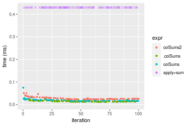

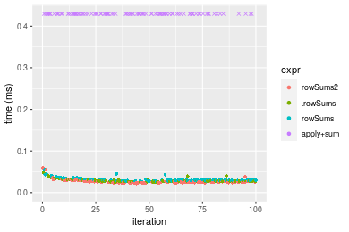
_Table: Benchmarking of colSums2() and rowSums2() on integer+10x1000 data (original and transposed).  The top panel shows times in milliseconds and the bottom panel shows relative times._


|   |expr     |    min|      lq|     mean| median|      uq|    max|
|:--|:--------|------:|-------:|--------:|------:|-------:|------:|
|2  |rowSums2 | 21.958| 23.9985| 26.41509| 24.790| 26.6345| 59.772|
|1  |colSums2 | 22.568| 23.9740| 27.42585| 25.118| 29.1710| 50.615|


|   |expr     |     min|        lq|     mean|   median|       uq|       max|
|:--|:--------|-------:|---------:|--------:|--------:|--------:|---------:|
|2  |rowSums2 | 1.00000| 1.0000000| 1.000000| 1.000000| 1.000000| 1.0000000|
|1  |colSums2 | 1.02778| 0.9989791| 1.038264| 1.013231| 1.095234| 0.8468012|

_Figure: Benchmarking of colSums2() and rowSums2() on integer+10x1000 data (original and transposed).  Outliers are displayed as crosses. Times are in milliseconds._


#### 100x1000 integer matrix

```r
> X <- data[["100x1000"]]
> gc()
           used  (Mb) gc trigger  (Mb) max used  (Mb)
Ncells  5293207 282.7    8529671 455.6  8529671 455.6
Vcells 10131856  77.3   31876688 243.2 60562128 462.1
> colStats <- microbenchmark(colSums2 = colSums2(X, na.rm = FALSE), .colSums = .colSums(X, m = nrow(X), 
+     n = ncol(X), na.rm = FALSE), colSums = colSums(X, na.rm = FALSE), `apply+sum` = apply(X, MARGIN = 2L, 
+     FUN = sum, na.rm = FALSE), unit = "ms")
> X <- t(X)
> gc()
           used  (Mb) gc trigger  (Mb) max used  (Mb)
Ncells  5293195 282.7    8529671 455.6  8529671 455.6
Vcells 10181889  77.7   31876688 243.2 60562128 462.1
> rowStats <- microbenchmark(rowSums2 = rowSums2(X, na.rm = FALSE), .rowSums = .rowSums(X, m = nrow(X), 
+     n = ncol(X), na.rm = FALSE), rowSums = rowSums(X, na.rm = FALSE), `apply+sum` = apply(X, MARGIN = 1L, 
+     FUN = sum, na.rm = FALSE), unit = "ms")
```

_Table: Benchmarking of colSums2(), .colSums(), colSums() and apply+sum() on integer+100x1000 data. The top panel shows times in milliseconds and the bottom panel shows relative times._


|   |expr      |      min|        lq|      mean|    median|        uq|      max|
|:--|:---------|--------:|---------:|---------:|---------:|---------:|--------:|
|2  |.colSums  | 0.087684| 0.0943470| 0.1008148| 0.0977915| 0.1020245| 0.178827|
|3  |colSums   | 0.089896| 0.0950085| 0.1019444| 0.1002585| 0.1049210| 0.146086|
|1  |colSums2  | 0.191433| 0.2071520| 0.2167812| 0.2134215| 0.2193430| 0.297765|
|4  |apply+sum | 1.428837| 1.5786385| 1.6531785| 1.6204870| 1.6569505| 2.598360|


|   |expr      |       min|        lq|      mean|    median|        uq|        max|
|:--|:---------|---------:|---------:|---------:|---------:|---------:|----------:|
|2  |.colSums  |  1.000000|  1.000000|  1.000000|  1.000000|  1.000000|  1.0000000|
|3  |colSums   |  1.025227|  1.007011|  1.011205|  1.025227|  1.028390|  0.8169124|
|1  |colSums2  |  2.183215|  2.195639|  2.150291|  2.182414|  2.149905|  1.6651009|
|4  |apply+sum | 16.295299| 16.732260| 16.398171| 16.570837| 16.240712| 14.5300206|

_Table: Benchmarking of rowSums2(), .rowSums(), rowSums() and apply+sum() on integer+100x1000 data (transposed). The top panel shows times in milliseconds and the bottom panel shows relative times._


|   |expr      |      min|        lq|      mean|    median|        uq|      max|
|:--|:---------|--------:|---------:|---------:|---------:|---------:|--------:|
|1  |rowSums2  | 0.191744| 0.2088630| 0.2179392| 0.2133365| 0.2204645| 0.309175|
|2  |.rowSums  | 0.220700| 0.2400595| 0.2532652| 0.2491540| 0.2536810| 0.379838|
|3  |rowSums   | 0.222796| 0.2470615| 0.2562721| 0.2548550| 0.2576245| 0.330766|
|4  |apply+sum | 1.439896| 1.5791325| 1.6386681| 1.6127200| 1.6362765| 2.669264|


|   |expr      |      min|       lq|     mean|   median|       uq|      max|
|:--|:---------|--------:|--------:|--------:|--------:|--------:|--------:|
|1  |rowSums2  | 1.000000| 1.000000| 1.000000| 1.000000| 1.000000| 1.000000|
|2  |.rowSums  | 1.151014| 1.149363| 1.162091| 1.167892| 1.150666| 1.228553|
|3  |rowSums   | 1.161945| 1.182888| 1.175888| 1.194615| 1.168553| 1.069834|
|4  |apply+sum | 7.509471| 7.560614| 7.518922| 7.559513| 7.421950| 8.633505|

_Figure: Benchmarking of colSums2(), .colSums(), colSums() and apply+sum() on integer+100x1000 data  as well as rowSums2(), .rowSums(), rowSums() and apply+sum() on the same data transposed.  Outliers are displayed as crosses.  Times are in milliseconds._


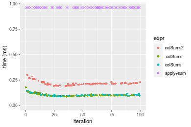

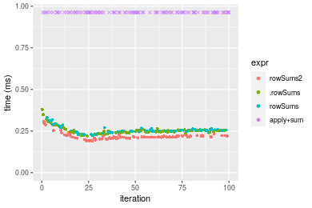
_Table: Benchmarking of colSums2() and rowSums2() on integer+100x1000 data (original and transposed).  The top panel shows times in milliseconds and the bottom panel shows relative times._


|   |expr     |     min|      lq|     mean|   median|       uq|     max|
|:--|:--------|-------:|-------:|--------:|--------:|--------:|-------:|
|2  |rowSums2 | 191.744| 208.863| 217.9392| 213.3365| 220.4645| 309.175|
|1  |colSums2 | 191.433| 207.152| 216.7811| 213.4215| 219.3430| 297.765|


|   |expr     |      min|       lq|      mean|   median|       uq|       max|
|:--|:--------|--------:|--------:|---------:|--------:|--------:|---------:|
|2  |rowSums2 | 1.000000| 1.000000| 1.0000000| 1.000000| 1.000000| 1.0000000|
|1  |colSums2 | 0.998378| 0.991808| 0.9946861| 1.000398| 0.994913| 0.9630953|

_Figure: Benchmarking of colSums2() and rowSums2() on integer+100x1000 data (original and transposed).  Outliers are displayed as crosses. Times are in milliseconds._


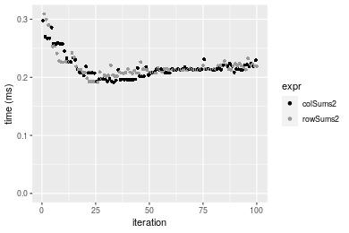

#### 1000x100 integer matrix

```r
> X <- data[["1000x100"]]
> gc()
           used  (Mb) gc trigger  (Mb) max used  (Mb)
Ncells  5293431 282.7    8529671 455.6  8529671 455.6
Vcells 10132554  77.4   31876688 243.2 60562128 462.1
> colStats <- microbenchmark(colSums2 = colSums2(X, na.rm = FALSE), .colSums = .colSums(X, m = nrow(X), 
+     n = ncol(X), na.rm = FALSE), colSums = colSums(X, na.rm = FALSE), `apply+sum` = apply(X, MARGIN = 2L, 
+     FUN = sum, na.rm = FALSE), unit = "ms")
> X <- t(X)
> gc()
           used  (Mb) gc trigger  (Mb) max used  (Mb)
Ncells  5293419 282.7    8529671 455.6  8529671 455.6
Vcells 10182587  77.7   31876688 243.2 60562128 462.1
> rowStats <- microbenchmark(rowSums2 = rowSums2(X, na.rm = FALSE), .rowSums = .rowSums(X, m = nrow(X), 
+     n = ncol(X), na.rm = FALSE), rowSums = rowSums(X, na.rm = FALSE), `apply+sum` = apply(X, MARGIN = 1L, 
+     FUN = sum, na.rm = FALSE), unit = "ms")
```

_Table: Benchmarking of colSums2(), .colSums(), colSums() and apply+sum() on integer+1000x100 data. The top panel shows times in milliseconds and the bottom panel shows relative times._


|   |expr      |      min|        lq|      mean|    median|        uq|      max|
|:--|:---------|--------:|---------:|---------:|---------:|---------:|--------:|
|2  |.colSums  | 0.080745| 0.0854250| 0.0962083| 0.0902415| 0.0983220| 0.188483|
|3  |colSums   | 0.083270| 0.0872815| 0.1002490| 0.0929945| 0.1059230| 0.225327|
|1  |colSums2  | 0.183159| 0.1911685| 0.2122587| 0.2039955| 0.2314095| 0.314580|
|4  |apply+sum | 0.631666| 0.6720135| 0.7621986| 0.7066705| 0.8105770| 1.694147|


|   |expr      |      min|       lq|     mean|   median|       uq|      max|
|:--|:---------|--------:|--------:|--------:|--------:|--------:|--------:|
|2  |.colSums  | 1.000000| 1.000000| 1.000000| 1.000000| 1.000000| 1.000000|
|3  |colSums   | 1.031271| 1.021732| 1.041999| 1.030507| 1.077307| 1.195477|
|1  |colSums2  | 2.268363| 2.237852| 2.206241| 2.260551| 2.353588| 1.669010|
|4  |apply+sum | 7.822974| 7.866708| 7.922378| 7.830882| 8.244106| 8.988328|

_Table: Benchmarking of rowSums2(), .rowSums(), rowSums() and apply+sum() on integer+1000x100 data (transposed). The top panel shows times in milliseconds and the bottom panel shows relative times._


|   |expr      |      min|        lq|      mean|    median|        uq|      max|
|:--|:---------|--------:|---------:|---------:|---------:|---------:|--------:|
|1  |rowSums2  | 0.185045| 0.1899330| 0.2064439| 0.2020740| 0.2082815| 0.300979|
|2  |.rowSums  | 0.319892| 0.3284885| 0.3629335| 0.3512650| 0.3600065| 0.813243|
|3  |rowSums   | 0.322223| 0.3401980| 0.3646800| 0.3600730| 0.3694095| 0.517022|
|4  |apply+sum | 0.643562| 0.6826685| 0.7342289| 0.7079275| 0.7289560| 1.131492|


|   |expr      |      min|       lq|     mean|   median|       uq|      max|
|:--|:---------|--------:|--------:|--------:|--------:|--------:|--------:|
|1  |rowSums2  | 1.000000| 1.000000| 1.000000| 1.000000| 1.000000| 1.000000|
|2  |.rowSums  | 1.728725| 1.729497| 1.758025| 1.738299| 1.728461| 2.701992|
|3  |rowSums   | 1.741322| 1.791147| 1.766485| 1.781887| 1.773607| 1.717801|
|4  |apply+sum | 3.477867| 3.594260| 3.556554| 3.503308| 3.499860| 3.759372|

_Figure: Benchmarking of colSums2(), .colSums(), colSums() and apply+sum() on integer+1000x100 data  as well as rowSums2(), .rowSums(), rowSums() and apply+sum() on the same data transposed.  Outliers are displayed as crosses.  Times are in milliseconds._


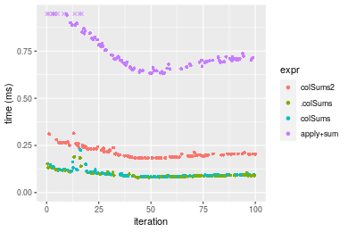

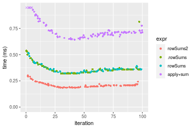
_Table: Benchmarking of colSums2() and rowSums2() on integer+1000x100 data (original and transposed).  The top panel shows times in milliseconds and the bottom panel shows relative times._


|   |expr     |     min|       lq|     mean|   median|       uq|     max|
|:--|:--------|-------:|--------:|--------:|--------:|--------:|-------:|
|2  |rowSums2 | 185.045| 189.9330| 206.4439| 202.0740| 208.2815| 300.979|
|1  |colSums2 | 183.159| 191.1685| 212.2587| 203.9955| 231.4095| 314.580|


|   |expr     |       min|       lq|     mean|   median|       uq|      max|
|:--|:--------|---------:|--------:|--------:|--------:|--------:|--------:|
|2  |rowSums2 | 1.0000000| 1.000000| 1.000000| 1.000000| 1.000000| 1.000000|
|1  |colSums2 | 0.9898079| 1.006505| 1.028167| 1.009509| 1.111042| 1.045189|

_Figure: Benchmarking of colSums2() and rowSums2() on integer+1000x100 data (original and transposed).  Outliers are displayed as crosses. Times are in milliseconds._


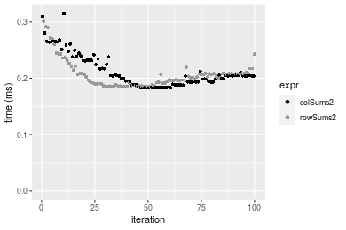


## Data type "double"

### Data
```r
> rmatrix <- function(nrow, ncol, mode = c("logical", "double", "integer", "index"), range = c(-100, 
+     +100), na_prob = 0) {
+     mode <- match.arg(mode)
+     n <- nrow * ncol
+     if (mode == "logical") {
+         x <- sample(c(FALSE, TRUE), size = n, replace = TRUE)
+     }     else if (mode == "index") {
+         x <- seq_len(n)
+         mode <- "integer"
+     }     else {
+         x <- runif(n, min = range[1], max = range[2])
+     }
+     storage.mode(x) <- mode
+     if (na_prob > 0) 
+         x[sample(n, size = na_prob * n)] <- NA
+     dim(x) <- c(nrow, ncol)
+     x
+ }
> rmatrices <- function(scale = 10, seed = 1, ...) {
+     set.seed(seed)
+     data <- list()
+     data[[1]] <- rmatrix(nrow = scale * 1, ncol = scale * 1, ...)
+     data[[2]] <- rmatrix(nrow = scale * 10, ncol = scale * 10, ...)
+     data[[3]] <- rmatrix(nrow = scale * 100, ncol = scale * 1, ...)
+     data[[4]] <- t(data[[3]])
+     data[[5]] <- rmatrix(nrow = scale * 10, ncol = scale * 100, ...)
+     data[[6]] <- t(data[[5]])
+     names(data) <- sapply(data, FUN = function(x) paste(dim(x), collapse = "x"))
+     data
+ }
> data <- rmatrices(mode = mode)
```

### Results

#### 10x10 double matrix

```r
> X <- data[["10x10"]]
> gc()
           used  (Mb) gc trigger  (Mb) max used  (Mb)
Ncells  5293674 282.8    8529671 455.6  8529671 455.6
Vcells 10248485  78.2   31876688 243.2 60562128 462.1
> colStats <- microbenchmark(colSums2 = colSums2(X, na.rm = FALSE), .colSums = .colSums(X, m = nrow(X), 
+     n = ncol(X), na.rm = FALSE), colSums = colSums(X, na.rm = FALSE), `apply+sum` = apply(X, MARGIN = 2L, 
+     FUN = sum, na.rm = FALSE), unit = "ms")
> X <- t(X)
> gc()
           used  (Mb) gc trigger  (Mb) max used  (Mb)
Ncells  5293641 282.8    8529671 455.6  8529671 455.6
Vcells 10248583  78.2   31876688 243.2 60562128 462.1
> rowStats <- microbenchmark(rowSums2 = rowSums2(X, na.rm = FALSE), .rowSums = .rowSums(X, m = nrow(X), 
+     n = ncol(X), na.rm = FALSE), rowSums = rowSums(X, na.rm = FALSE), `apply+sum` = apply(X, MARGIN = 1L, 
+     FUN = sum, na.rm = FALSE), unit = "ms")
```

_Table: Benchmarking of colSums2(), .colSums(), colSums() and apply+sum() on double+10x10 data. The top panel shows times in milliseconds and the bottom panel shows relative times._


|   |expr      |      min|        lq|      mean|    median|        uq|      max|
|:--|:---------|--------:|---------:|---------:|---------:|---------:|--------:|
|1  |colSums2  | 0.002102| 0.0024065| 0.0030994| 0.0029520| 0.0032165| 0.017842|
|2  |.colSums  | 0.002778| 0.0033325| 0.0038123| 0.0036850| 0.0040910| 0.013051|
|3  |colSums   | 0.005430| 0.0059150| 0.0066628| 0.0063655| 0.0072170| 0.015898|
|4  |apply+sum | 0.034034| 0.0365380| 0.0386263| 0.0374980| 0.0380990| 0.110486|


|   |expr      |       min|        lq|      mean|    median|        uq|       max|
|:--|:---------|---------:|---------:|---------:|---------:|---------:|---------:|
|1  |colSums2  |  1.000000|  1.000000|  1.000000|  1.000000|  1.000000| 1.0000000|
|2  |.colSums  |  1.321598|  1.384791|  1.230041|  1.248306|  1.271879| 0.7314763|
|3  |colSums   |  2.583254|  2.457926|  2.149721|  2.156335|  2.243743| 0.8910436|
|4  |apply+sum | 16.191246| 15.183046| 12.462676| 12.702575| 11.844862| 6.1924672|

_Table: Benchmarking of rowSums2(), .rowSums(), rowSums() and apply+sum() on double+10x10 data (transposed). The top panel shows times in milliseconds and the bottom panel shows relative times._


|   |expr      |      min|        lq|      mean|    median|        uq|      max|
|:--|:---------|--------:|---------:|---------:|---------:|---------:|--------:|
|1  |rowSums2  | 0.001940| 0.0022655| 0.0028561| 0.0028985| 0.0031365| 0.013258|
|2  |.rowSums  | 0.002398| 0.0026455| 0.0031198| 0.0029570| 0.0031550| 0.017511|
|3  |rowSums   | 0.004646| 0.0050370| 0.0058332| 0.0056080| 0.0060780| 0.028458|
|4  |apply+sum | 0.034348| 0.0353945| 0.0371595| 0.0359440| 0.0372065| 0.091068|


|   |expr      |       min|        lq|      mean|    median|        uq|      max|
|:--|:---------|---------:|---------:|---------:|---------:|---------:|--------:|
|1  |rowSums2  |  1.000000|  1.000000|  1.000000|  1.000000|  1.000000| 1.000000|
|2  |.rowSums  |  1.236082|  1.167733|  1.092327|  1.020183|  1.005898| 1.320787|
|3  |rowSums   |  2.394845|  2.223350|  2.042344|  1.934794|  1.937829| 2.146478|
|4  |apply+sum | 17.705155| 15.623262| 13.010378| 12.400897| 11.862426| 6.868909|

_Figure: Benchmarking of colSums2(), .colSums(), colSums() and apply+sum() on double+10x10 data  as well as rowSums2(), .rowSums(), rowSums() and apply+sum() on the same data transposed.  Outliers are displayed as crosses.  Times are in milliseconds._


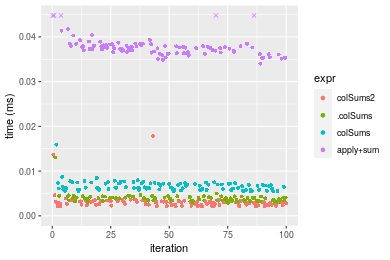

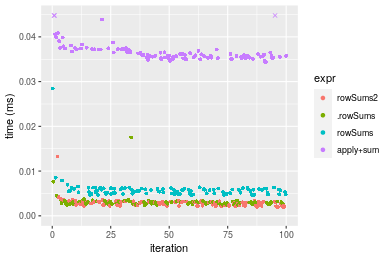
_Table: Benchmarking of colSums2() and rowSums2() on double+10x10 data (original and transposed).  The top panel shows times in milliseconds and the bottom panel shows relative times._


|   |expr     |   min|     lq|    mean| median|     uq|    max|
|:--|:--------|-----:|------:|-------:|------:|------:|------:|
|2  |rowSums2 | 1.940| 2.2655| 2.85614| 2.8985| 3.1365| 13.258|
|1  |colSums2 | 2.102| 2.4065| 3.09936| 2.9520| 3.2165| 17.842|


|   |expr     |      min|       lq|     mean|   median|       uq|      max|
|:--|:--------|--------:|--------:|--------:|--------:|--------:|--------:|
|2  |rowSums2 | 1.000000| 1.000000| 1.000000| 1.000000| 1.000000| 1.000000|
|1  |colSums2 | 1.083505| 1.062238| 1.085157| 1.018458| 1.025506| 1.345754|

_Figure: Benchmarking of colSums2() and rowSums2() on double+10x10 data (original and transposed).  Outliers are displayed as crosses. Times are in milliseconds._


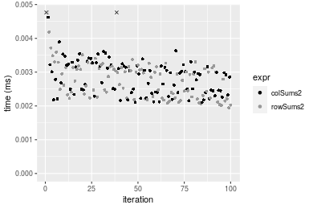

#### 100x100 double matrix

```r
> X <- data[["100x100"]]
> gc()
           used  (Mb) gc trigger  (Mb) max used  (Mb)
Ncells  5293893 282.8    8529671 455.6  8529671 455.6
Vcells 10249501  78.2   31876688 243.2 60562128 462.1
> colStats <- microbenchmark(colSums2 = colSums2(X, na.rm = FALSE), .colSums = .colSums(X, m = nrow(X), 
+     n = ncol(X), na.rm = FALSE), colSums = colSums(X, na.rm = FALSE), `apply+sum` = apply(X, MARGIN = 2L, 
+     FUN = sum, na.rm = FALSE), unit = "ms")
> X <- t(X)
> gc()
           used  (Mb) gc trigger  (Mb) max used  (Mb)
Ncells  5293869 282.8    8529671 455.6  8529671 455.6
Vcells 10259514  78.3   31876688 243.2 60562128 462.1
> rowStats <- microbenchmark(rowSums2 = rowSums2(X, na.rm = FALSE), .rowSums = .rowSums(X, m = nrow(X), 
+     n = ncol(X), na.rm = FALSE), rowSums = rowSums(X, na.rm = FALSE), `apply+sum` = apply(X, MARGIN = 1L, 
+     FUN = sum, na.rm = FALSE), unit = "ms")
```

_Table: Benchmarking of colSums2(), .colSums(), colSums() and apply+sum() on double+100x100 data. The top panel shows times in milliseconds and the bottom panel shows relative times._


|   |expr      |      min|        lq|      mean|    median|        uq|      max|
|:--|:---------|--------:|---------:|---------:|---------:|---------:|--------:|
|2  |.colSums  | 0.010384| 0.0115435| 0.0124507| 0.0119520| 0.0132230| 0.018895|
|3  |colSums   | 0.012993| 0.0142790| 0.0159926| 0.0150795| 0.0162580| 0.035340|
|1  |colSums2  | 0.020164| 0.0209950| 0.0226975| 0.0219650| 0.0235610| 0.037274|
|4  |apply+sum | 0.206727| 0.2129235| 0.2348531| 0.2243070| 0.2453505| 0.375133|


|   |expr      |       min|        lq|      mean|    median|        uq|       max|
|:--|:---------|---------:|---------:|---------:|---------:|---------:|---------:|
|2  |.colSums  |  1.000000|  1.000000|  1.000000|  1.000000|  1.000000|  1.000000|
|3  |colSums   |  1.251252|  1.236973|  1.284470|  1.261672|  1.229524|  1.870336|
|1  |colSums2  |  1.941834|  1.818772|  1.822985|  1.837768|  1.781820|  1.972691|
|4  |apply+sum | 19.908224| 18.445315| 18.862626| 18.767319| 18.554829| 19.853559|

_Table: Benchmarking of rowSums2(), .rowSums(), rowSums() and apply+sum() on double+100x100 data (transposed). The top panel shows times in milliseconds and the bottom panel shows relative times._


|   |expr      |      min|        lq|      mean|    median|        uq|      max|
|:--|:---------|--------:|---------:|---------:|---------:|---------:|--------:|
|1  |rowSums2  | 0.022182| 0.0242220| 0.0265808| 0.0259425| 0.0287055| 0.040805|
|2  |.rowSums  | 0.027795| 0.0291870| 0.0316074| 0.0304490| 0.0335525| 0.048271|
|3  |rowSums   | 0.029620| 0.0324980| 0.0350392| 0.0336310| 0.0364825| 0.054420|
|4  |apply+sum | 0.197381| 0.2095255| 0.2303125| 0.2213215| 0.2425360| 0.372191|


|   |expr      |      min|       lq|     mean|   median|       uq|      max|
|:--|:---------|--------:|--------:|--------:|--------:|--------:|--------:|
|1  |rowSums2  | 1.000000| 1.000000| 1.000000| 1.000000| 1.000000| 1.000000|
|2  |.rowSums  | 1.253043| 1.204979| 1.189107| 1.173711| 1.168853| 1.182968|
|3  |rowSums   | 1.335317| 1.341673| 1.318215| 1.296367| 1.270924| 1.333660|
|4  |apply+sum | 8.898251| 8.650215| 8.664615| 8.531232| 8.449113| 9.121211|

_Figure: Benchmarking of colSums2(), .colSums(), colSums() and apply+sum() on double+100x100 data  as well as rowSums2(), .rowSums(), rowSums() and apply+sum() on the same data transposed.  Outliers are displayed as crosses.  Times are in milliseconds._


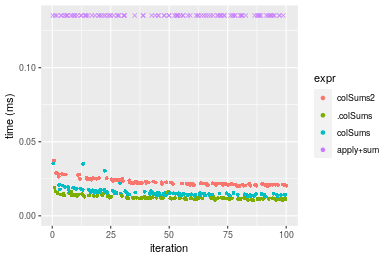

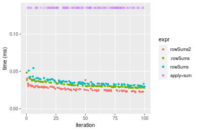
_Table: Benchmarking of colSums2() and rowSums2() on double+100x100 data (original and transposed).  The top panel shows times in milliseconds and the bottom panel shows relative times._


|   |expr     |    min|     lq|     mean|  median|      uq|    max|
|:--|:--------|------:|------:|--------:|-------:|-------:|------:|
|1  |colSums2 | 20.164| 20.995| 22.69746| 21.9650| 23.5610| 37.274|
|2  |rowSums2 | 22.182| 24.222| 26.58081| 25.9425| 28.7055| 40.805|


|   |expr     |      min|       lq|     mean|   median|       uq|      max|
|:--|:--------|--------:|--------:|--------:|--------:|--------:|--------:|
|1  |colSums2 | 1.000000| 1.000000| 1.000000| 1.000000| 1.000000| 1.000000|
|2  |rowSums2 | 1.100079| 1.153703| 1.171092| 1.181083| 1.218348| 1.094731|

_Figure: Benchmarking of colSums2() and rowSums2() on double+100x100 data (original and transposed).  Outliers are displayed as crosses. Times are in milliseconds._


#### 1000x10 double matrix

```r
> X <- data[["1000x10"]]
> gc()
           used  (Mb) gc trigger  (Mb) max used  (Mb)
Ncells  5294116 282.8    8529671 455.6  8529671 455.6
Vcells 10250597  78.3   31876688 243.2 60562128 462.1
> colStats <- microbenchmark(colSums2 = colSums2(X, na.rm = FALSE), .colSums = .colSums(X, m = nrow(X), 
+     n = ncol(X), na.rm = FALSE), colSums = colSums(X, na.rm = FALSE), `apply+sum` = apply(X, MARGIN = 2L, 
+     FUN = sum, na.rm = FALSE), unit = "ms")
> X <- t(X)
> gc()
           used  (Mb) gc trigger  (Mb) max used  (Mb)
Ncells  5294092 282.8    8529671 455.6  8529671 455.6
Vcells 10260610  78.3   31876688 243.2 60562128 462.1
> rowStats <- microbenchmark(rowSums2 = rowSums2(X, na.rm = FALSE), .rowSums = .rowSums(X, m = nrow(X), 
+     n = ncol(X), na.rm = FALSE), rowSums = rowSums(X, na.rm = FALSE), `apply+sum` = apply(X, MARGIN = 1L, 
+     FUN = sum, na.rm = FALSE), unit = "ms")
```

_Table: Benchmarking of colSums2(), .colSums(), colSums() and apply+sum() on double+1000x10 data. The top panel shows times in milliseconds and the bottom panel shows relative times._


|   |expr      |      min|        lq|      mean|    median|        uq|      max|
|:--|:---------|--------:|---------:|---------:|---------:|---------:|--------:|
|2  |.colSums  | 0.012371| 0.0134835| 0.0144271| 0.0141420| 0.0151645| 0.025370|
|3  |colSums   | 0.015010| 0.0162415| 0.0175628| 0.0171425| 0.0182715| 0.035068|
|1  |colSums2  | 0.018749| 0.0201340| 0.0219062| 0.0217815| 0.0228090| 0.034523|
|4  |apply+sum | 0.111090| 0.1168800| 0.1254827| 0.1231010| 0.1331115| 0.233988|


|   |expr      |      min|       lq|     mean|   median|       uq|      max|
|:--|:---------|--------:|--------:|--------:|--------:|--------:|--------:|
|2  |.colSums  | 1.000000| 1.000000| 1.000000| 1.000000| 1.000000| 1.000000|
|3  |colSums   | 1.213321| 1.204546| 1.217350| 1.212169| 1.204886| 1.382262|
|1  |colSums2  | 1.515561| 1.493232| 1.518406| 1.540199| 1.504105| 1.360780|
|4  |apply+sum | 8.979872| 8.668373| 8.697717| 8.704639| 8.777836| 9.223019|

_Table: Benchmarking of rowSums2(), .rowSums(), rowSums() and apply+sum() on double+1000x10 data (transposed). The top panel shows times in milliseconds and the bottom panel shows relative times._


|   |expr      |      min|        lq|      mean|    median|        uq|      max|
|:--|:---------|--------:|---------:|---------:|---------:|---------:|--------:|
|1  |rowSums2  | 0.022056| 0.0231260| 0.0248843| 0.0241820| 0.0261350| 0.041828|
|2  |.rowSums  | 0.030313| 0.0311025| 0.0345391| 0.0338760| 0.0367065| 0.051703|
|3  |rowSums   | 0.032743| 0.0340905| 0.0369900| 0.0362275| 0.0394180| 0.052757|
|4  |apply+sum | 0.110896| 0.1160200| 0.1261189| 0.1234515| 0.1337685| 0.223937|


|   |expr      |      min|       lq|     mean|   median|       uq|      max|
|:--|:---------|--------:|--------:|--------:|--------:|--------:|--------:|
|1  |rowSums2  | 1.000000| 1.000000| 1.000000| 1.000000| 1.000000| 1.000000|
|2  |.rowSums  | 1.374365| 1.344915| 1.387987| 1.400877| 1.404496| 1.236086|
|3  |rowSums   | 1.484539| 1.474120| 1.486478| 1.498118| 1.508246| 1.261284|
|4  |apply+sum | 5.027929| 5.016864| 5.068206| 5.105099| 5.118366| 5.353758|

_Figure: Benchmarking of colSums2(), .colSums(), colSums() and apply+sum() on double+1000x10 data  as well as rowSums2(), .rowSums(), rowSums() and apply+sum() on the same data transposed.  Outliers are displayed as crosses.  Times are in milliseconds._


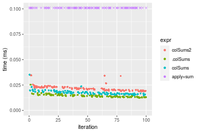

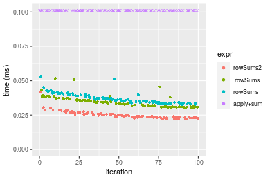
_Table: Benchmarking of colSums2() and rowSums2() on double+1000x10 data (original and transposed).  The top panel shows times in milliseconds and the bottom panel shows relative times._


|   |expr     |    min|     lq|     mean|  median|     uq|    max|
|:--|:--------|------:|------:|--------:|-------:|------:|------:|
|1  |colSums2 | 18.749| 20.134| 21.90617| 21.7815| 22.809| 34.523|
|2  |rowSums2 | 22.056| 23.126| 24.88433| 24.1820| 26.135| 41.828|


|   |expr     |      min|       lq|     mean|   median|      uq|      max|
|:--|:--------|--------:|--------:|--------:|--------:|-------:|--------:|
|1  |colSums2 | 1.000000| 1.000000| 1.000000| 1.000000| 1.00000| 1.000000|
|2  |rowSums2 | 1.176383| 1.148604| 1.135951| 1.110208| 1.14582| 1.211598|

_Figure: Benchmarking of colSums2() and rowSums2() on double+1000x10 data (original and transposed).  Outliers are displayed as crosses. Times are in milliseconds._


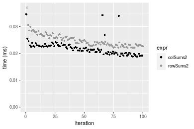

#### 10x1000 double matrix

```r
> X <- data[["10x1000"]]
> gc()
           used  (Mb) gc trigger  (Mb) max used  (Mb)
Ncells  5294339 282.8    8529671 455.6  8529671 455.6
Vcells 10250745  78.3   31876688 243.2 60562128 462.1
> colStats <- microbenchmark(colSums2 = colSums2(X, na.rm = FALSE), .colSums = .colSums(X, m = nrow(X), 
+     n = ncol(X), na.rm = FALSE), colSums = colSums(X, na.rm = FALSE), `apply+sum` = apply(X, MARGIN = 2L, 
+     FUN = sum, na.rm = FALSE), unit = "ms")
> X <- t(X)
> gc()
           used  (Mb) gc trigger  (Mb) max used  (Mb)
Ncells  5294315 282.8    8529671 455.6  8529671 455.6
Vcells 10260758  78.3   31876688 243.2 60562128 462.1
> rowStats <- microbenchmark(rowSums2 = rowSums2(X, na.rm = FALSE), .rowSums = .rowSums(X, m = nrow(X), 
+     n = ncol(X), na.rm = FALSE), rowSums = rowSums(X, na.rm = FALSE), `apply+sum` = apply(X, MARGIN = 1L, 
+     FUN = sum, na.rm = FALSE), unit = "ms")
```

_Table: Benchmarking of colSums2(), .colSums(), colSums() and apply+sum() on double+10x1000 data. The top panel shows times in milliseconds and the bottom panel shows relative times._


|   |expr      |      min|        lq|      mean|    median|        uq|      max|
|:--|:---------|--------:|---------:|---------:|---------:|---------:|--------:|
|2  |.colSums  | 0.008916| 0.0097405| 0.0114750| 0.0108600| 0.0124010| 0.024709|
|3  |colSums   | 0.010672| 0.0119185| 0.0155951| 0.0133570| 0.0158335| 0.097707|
|1  |colSums2  | 0.021120| 0.0222750| 0.0255460| 0.0232775| 0.0279855| 0.045889|
|4  |apply+sum | 0.927717| 0.9840360| 1.0874877| 1.0289875| 1.1331390| 1.933843|


|   |expr      |        min|         lq|      mean|    median|        uq|       max|
|:--|:---------|----------:|----------:|---------:|---------:|---------:|---------:|
|2  |.colSums  |   1.000000|   1.000000|  1.000000|  1.000000|  1.000000|  1.000000|
|3  |colSums   |   1.196949|   1.223602|  1.359048|  1.229926|  1.276792|  3.954308|
|1  |colSums2  |   2.368775|   2.286844|  2.226230|  2.143416|  2.256713|  1.857177|
|4  |apply+sum | 104.050808| 101.025204| 94.770169| 94.750230| 91.374809| 78.264721|

_Table: Benchmarking of rowSums2(), .rowSums(), rowSums() and apply+sum() on double+10x1000 data (transposed). The top panel shows times in milliseconds and the bottom panel shows relative times._


|   |expr      |      min|       lq|      mean|   median|        uq|      max|
|:--|:---------|--------:|--------:|---------:|--------:|---------:|--------:|
|1  |rowSums2  | 0.022778| 0.024432| 0.0266944| 0.025203| 0.0277680| 0.056972|
|2  |.rowSums  | 0.023898| 0.025582| 0.0272317| 0.026342| 0.0271710| 0.045543|
|3  |rowSums   | 0.025444| 0.027818| 0.0300013| 0.028727| 0.0306545| 0.053482|
|4  |apply+sum | 0.935441| 0.981507| 1.0554225| 1.028925| 1.0806680| 1.509979|


|   |expr      |       min|        lq|      mean|    median|         uq|        max|
|:--|:---------|---------:|---------:|---------:|---------:|----------:|----------:|
|1  |rowSums2  |  1.000000|  1.000000|  1.000000|  1.000000|  1.0000000|  1.0000000|
|2  |.rowSums  |  1.049170|  1.047069|  1.020128|  1.045193|  0.9785004|  0.7993927|
|3  |rowSums   |  1.117043|  1.138589|  1.123880|  1.139825|  1.1039506|  0.9387418|
|4  |apply+sum | 41.067741| 40.173011| 39.537255| 40.825517| 38.9177470| 26.5038791|

_Figure: Benchmarking of colSums2(), .colSums(), colSums() and apply+sum() on double+10x1000 data  as well as rowSums2(), .rowSums(), rowSums() and apply+sum() on the same data transposed.  Outliers are displayed as crosses.  Times are in milliseconds._


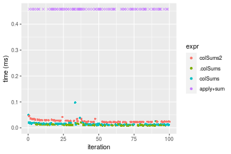

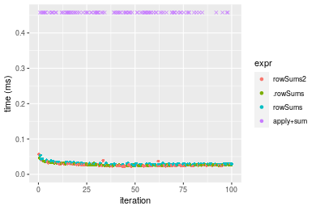
_Table: Benchmarking of colSums2() and rowSums2() on double+10x1000 data (original and transposed).  The top panel shows times in milliseconds and the bottom panel shows relative times._


|   |expr     |    min|     lq|     mean|  median|      uq|    max|
|:--|:--------|------:|------:|--------:|-------:|-------:|------:|
|1  |colSums2 | 21.120| 22.275| 25.54599| 23.2775| 27.9855| 45.889|
|2  |rowSums2 | 22.778| 24.432| 26.69438| 25.2030| 27.7680| 56.972|


|   |expr     |      min|       lq|     mean|   median|        uq|      max|
|:--|:--------|--------:|--------:|--------:|--------:|---------:|--------:|
|1  |colSums2 | 1.000000| 1.000000| 1.000000| 1.000000| 1.0000000| 1.000000|
|2  |rowSums2 | 1.078504| 1.096835| 1.044954| 1.082719| 0.9922281| 1.241518|

_Figure: Benchmarking of colSums2() and rowSums2() on double+10x1000 data (original and transposed).  Outliers are displayed as crosses. Times are in milliseconds._


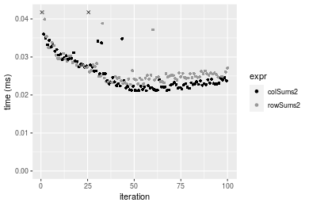

#### 100x1000 double matrix

```r
> X <- data[["100x1000"]]
> gc()
           used  (Mb) gc trigger  (Mb) max used  (Mb)
Ncells  5294557 282.8    8529671 455.6  8529671 455.6
Vcells 10252015  78.3   31876688 243.2 60562128 462.1
> colStats <- microbenchmark(colSums2 = colSums2(X, na.rm = FALSE), .colSums = .colSums(X, m = nrow(X), 
+     n = ncol(X), na.rm = FALSE), colSums = colSums(X, na.rm = FALSE), `apply+sum` = apply(X, MARGIN = 2L, 
+     FUN = sum, na.rm = FALSE), unit = "ms")
> X <- t(X)
> gc()
           used  (Mb) gc trigger  (Mb) max used  (Mb)
Ncells  5294545 282.8    8529671 455.6  8529671 455.6
Vcells 10352048  79.0   31876688 243.2 60562128 462.1
> rowStats <- microbenchmark(rowSums2 = rowSums2(X, na.rm = FALSE), .rowSums = .rowSums(X, m = nrow(X), 
+     n = ncol(X), na.rm = FALSE), rowSums = rowSums(X, na.rm = FALSE), `apply+sum` = apply(X, MARGIN = 1L, 
+     FUN = sum, na.rm = FALSE), unit = "ms")
```

_Table: Benchmarking of colSums2(), .colSums(), colSums() and apply+sum() on double+100x1000 data. The top panel shows times in milliseconds and the bottom panel shows relative times._


|   |expr      |      min|        lq|      mean|   median|        uq|       max|
|:--|:---------|--------:|---------:|---------:|--------:|---------:|---------:|
|2  |.colSums  | 0.063484| 0.0693695| 0.0772934| 0.072477| 0.0811175|  0.166440|
|3  |colSums   | 0.065582| 0.0714795| 0.0793142| 0.074465| 0.0833640|  0.156227|
|1  |colSums2  | 0.146856| 0.1590045| 0.1747343| 0.163916| 0.1797135|  0.491681|
|4  |apply+sum | 1.465818| 1.6159060| 1.9389410| 1.671202| 1.8663865| 19.263417|


|   |expr      |       min|        lq|      mean|    median|        uq|         max|
|:--|:---------|---------:|---------:|---------:|---------:|---------:|-----------:|
|2  |.colSums  |  1.000000|  1.000000|  1.000000|  1.000000|  1.000000|   1.0000000|
|3  |colSums   |  1.033048|  1.030417|  1.026144|  1.027429|  1.027694|   0.9386385|
|1  |colSums2  |  2.313276|  2.292139|  2.260663|  2.261628|  2.215471|   2.9541036|
|4  |apply+sum | 23.089566| 23.294186| 25.085470| 23.058377| 23.008432| 115.7379056|

_Table: Benchmarking of rowSums2(), .rowSums(), rowSums() and apply+sum() on double+100x1000 data (transposed). The top panel shows times in milliseconds and the bottom panel shows relative times._


|   |expr      |      min|        lq|      mean|    median|        uq|       max|
|:--|:---------|--------:|---------:|---------:|---------:|---------:|---------:|
|1  |rowSums2  | 0.175242| 0.1908420| 0.2015122| 0.1959230| 0.2029835|  0.286708|
|2  |.rowSums  | 0.209709| 0.2293750| 0.2414981| 0.2340870| 0.2414530|  0.369516|
|3  |rowSums   | 0.211997| 0.2359765| 0.2497697| 0.2390785| 0.2600210|  0.342801|
|4  |apply+sum | 1.496664| 1.6280940| 1.9198785| 1.6703115| 1.8006130| 19.846470|


|   |expr      |      min|       lq|     mean|   median|       uq|       max|
|:--|:---------|--------:|--------:|--------:|--------:|--------:|---------:|
|1  |rowSums2  | 1.000000| 1.000000| 1.000000| 1.000000| 1.000000|  1.000000|
|2  |.rowSums  | 1.196682| 1.201911| 1.198429| 1.194791| 1.189520|  1.288823|
|3  |rowSums   | 1.209739| 1.236502| 1.239477| 1.220268| 1.280996|  1.195645|
|4  |apply+sum | 8.540555| 8.531109| 9.527354| 8.525347| 8.870736| 69.221891|

_Figure: Benchmarking of colSums2(), .colSums(), colSums() and apply+sum() on double+100x1000 data  as well as rowSums2(), .rowSums(), rowSums() and apply+sum() on the same data transposed.  Outliers are displayed as crosses.  Times are in milliseconds._


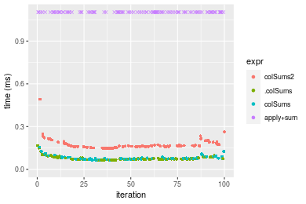


_Table: Benchmarking of colSums2() and rowSums2() on double+100x1000 data (original and transposed).  The top panel shows times in milliseconds and the bottom panel shows relative times._


|   |expr     |     min|       lq|     mean|  median|       uq|     max|
|:--|:--------|-------:|--------:|--------:|-------:|--------:|-------:|
|1  |colSums2 | 146.856| 159.0045| 174.7343| 163.916| 179.7135| 491.681|
|2  |rowSums2 | 175.242| 190.8420| 201.5122| 195.923| 202.9835| 286.708|


|   |expr     |      min|      lq|     mean|   median|       uq|       max|
|:--|:--------|--------:|-------:|--------:|--------:|--------:|---------:|
|1  |colSums2 | 1.000000| 1.00000| 1.000000| 1.000000| 1.000000| 1.0000000|
|2  |rowSums2 | 1.193291| 1.20023| 1.153249| 1.195265| 1.129484| 0.5831179|

_Figure: Benchmarking of colSums2() and rowSums2() on double+100x1000 data (original and transposed).  Outliers are displayed as crosses. Times are in milliseconds._


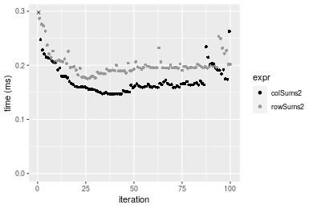

#### 1000x100 double matrix

```r
> X <- data[["1000x100"]]
> gc()
           used  (Mb) gc trigger  (Mb) max used  (Mb)
Ncells  5294793 282.8    8529671 455.6  8529671 455.6
Vcells 10252184  78.3   31876688 243.2 60562128 462.1
> colStats <- microbenchmark(colSums2 = colSums2(X, na.rm = FALSE), .colSums = .colSums(X, m = nrow(X), 
+     n = ncol(X), na.rm = FALSE), colSums = colSums(X, na.rm = FALSE), `apply+sum` = apply(X, MARGIN = 2L, 
+     FUN = sum, na.rm = FALSE), unit = "ms")
> X <- t(X)
> gc()
           used  (Mb) gc trigger  (Mb) max used  (Mb)
Ncells  5294769 282.8    8529671 455.6  8529671 455.6
Vcells 10352197  79.0   31876688 243.2 60562128 462.1
> rowStats <- microbenchmark(rowSums2 = rowSums2(X, na.rm = FALSE), .rowSums = .rowSums(X, m = nrow(X), 
+     n = ncol(X), na.rm = FALSE), rowSums = rowSums(X, na.rm = FALSE), `apply+sum` = apply(X, MARGIN = 1L, 
+     FUN = sum, na.rm = FALSE), unit = "ms")
```

_Table: Benchmarking of colSums2(), .colSums(), colSums() and apply+sum() on double+1000x100 data. The top panel shows times in milliseconds and the bottom panel shows relative times._


|   |expr      |      min|       lq|      mean|    median|       uq|      max|
|:--|:---------|--------:|--------:|---------:|---------:|--------:|--------:|
|2  |.colSums  | 0.077817| 0.080332| 0.0900894| 0.0831115| 0.095637| 0.154776|
|3  |colSums   | 0.080178| 0.083281| 0.0934385| 0.0883645| 0.100575| 0.138330|
|1  |colSums2  | 0.132999| 0.137269| 0.1531161| 0.1462835| 0.162858| 0.231035|
|4  |apply+sum | 0.687649| 0.720354| 0.9015292| 0.7735955| 0.906300| 8.450792|


|   |expr      |      min|       lq|      mean|   median|       uq|        max|
|:--|:---------|--------:|--------:|---------:|--------:|--------:|----------:|
|2  |.colSums  | 1.000000| 1.000000|  1.000000| 1.000000| 1.000000|  1.0000000|
|3  |colSums   | 1.030340| 1.036710|  1.037175| 1.063204| 1.051633|  0.8937432|
|1  |colSums2  | 1.709125| 1.708771|  1.699601| 1.760087| 1.702876|  1.4927056|
|4  |apply+sum | 8.836745| 8.967211| 10.007045| 9.307924| 9.476458| 54.6001447|

_Table: Benchmarking of rowSums2(), .rowSums(), rowSums() and apply+sum() on double+1000x100 data (transposed). The top panel shows times in milliseconds and the bottom panel shows relative times._


|   |expr      |      min|        lq|      mean|    median|        uq|      max|
|:--|:---------|--------:|---------:|---------:|---------:|---------:|--------:|
|1  |rowSums2  | 0.168968| 0.1741515| 0.1976026| 0.1851140| 0.2080825| 0.385057|
|2  |.rowSums  | 0.214875| 0.2209335| 0.2498737| 0.2349080| 0.2704140| 0.379430|
|3  |rowSums   | 0.216937| 0.2298130| 0.2508185| 0.2432355| 0.2649335| 0.354560|
|4  |apply+sum | 0.709047| 0.7667290| 0.9330494| 0.8030805| 0.9409255| 8.399390|


|   |expr      |      min|       lq|     mean|   median|       uq|        max|
|:--|:---------|--------:|--------:|--------:|--------:|--------:|----------:|
|1  |rowSums2  | 1.000000| 1.000000| 1.000000| 1.000000| 1.000000|  1.0000000|
|2  |.rowSums  | 1.271691| 1.268628| 1.264527| 1.268991| 1.299552|  0.9853866|
|3  |rowSums   | 1.283894| 1.319615| 1.269308| 1.313977| 1.273214|  0.9207987|
|4  |apply+sum | 4.196339| 4.402655| 4.721848| 4.338302| 4.521887| 21.8133679|

_Figure: Benchmarking of colSums2(), .colSums(), colSums() and apply+sum() on double+1000x100 data  as well as rowSums2(), .rowSums(), rowSums() and apply+sum() on the same data transposed.  Outliers are displayed as crosses.  Times are in milliseconds._


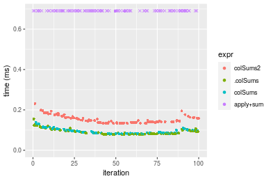

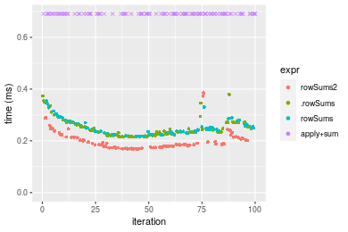
_Table: Benchmarking of colSums2() and rowSums2() on double+1000x100 data (original and transposed).  The top panel shows times in milliseconds and the bottom panel shows relative times._


|   |expr     |     min|       lq|     mean|   median|       uq|     max|
|:--|:--------|-------:|--------:|--------:|--------:|--------:|-------:|
|1  |colSums2 | 132.999| 137.2690| 153.1161| 146.2835| 162.8580| 231.035|
|2  |rowSums2 | 168.968| 174.1515| 197.6026| 185.1140| 208.0825| 385.057|


|   |expr     |      min|       lq|     mean|   median|       uq|      max|
|:--|:--------|--------:|--------:|--------:|--------:|--------:|--------:|
|1  |colSums2 | 1.000000| 1.000000| 1.000000| 1.000000| 1.000000| 1.000000|
|2  |rowSums2 | 1.270446| 1.268688| 1.290541| 1.265447| 1.277693| 1.666661|

_Figure: Benchmarking of colSums2() and rowSums2() on double+1000x100 data (original and transposed).  Outliers are displayed as crosses. Times are in milliseconds._


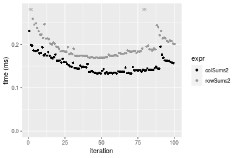


## Appendix

### Session information
```r
R version 4.1.1 Patched (2021-08-10 r80727)
Platform: x86_64-pc-linux-gnu (64-bit)
Running under: Ubuntu 18.04.5 LTS

Matrix products: default
BLAS:   /home/hb/software/R-devel/R-4-1-branch/lib/R/lib/libRblas.so
LAPACK: /home/hb/software/R-devel/R-4-1-branch/lib/R/lib/libRlapack.so

locale:
 [1] LC_CTYPE=en_US.UTF-8       LC_NUMERIC=C              
 [3] LC_TIME=en_US.UTF-8        LC_COLLATE=en_US.UTF-8    
 [5] LC_MONETARY=en_US.UTF-8    LC_MESSAGES=en_US.UTF-8   
 [7] LC_PAPER=en_US.UTF-8       LC_NAME=C                 
 [9] LC_ADDRESS=C               LC_TELEPHONE=C            
[11] LC_MEASUREMENT=en_US.UTF-8 LC_IDENTIFICATION=C       

attached base packages:
[1] stats     graphics  grDevices utils     datasets  methods   base     

other attached packages:
[1] microbenchmark_1.4-7   matrixStats_0.60.1     ggplot2_3.3.5         
[4] knitr_1.33             R.devices_2.17.0       R.utils_2.10.1        
[7] R.oo_1.24.0            R.methodsS3_1.8.1-9001 history_0.0.1-9000    

loaded via a namespace (and not attached):
 [1] Biobase_2.52.0          httr_1.4.2              splines_4.1.1          
 [4] bit64_4.0.5             network_1.17.1          assertthat_0.2.1       
 [7] highr_0.9               stats4_4.1.1            blob_1.2.2             
[10] GenomeInfoDbData_1.2.6  robustbase_0.93-8       pillar_1.6.2           
[13] RSQLite_2.2.8           lattice_0.20-44         glue_1.4.2             
[16] digest_0.6.27           XVector_0.32.0          colorspace_2.0-2       
[19] Matrix_1.3-4            XML_3.99-0.7            pkgconfig_2.0.3        
[22] zlibbioc_1.38.0         genefilter_1.74.0       purrr_0.3.4            
[25] ergm_4.1.2              xtable_1.8-4            scales_1.1.1           
[28] tibble_3.1.4            annotate_1.70.0         KEGGREST_1.32.0        
[31] farver_2.1.0            generics_0.1.0          IRanges_2.26.0         
[34] ellipsis_0.3.2          cachem_1.0.6            withr_2.4.2            
[37] BiocGenerics_0.38.0     mime_0.11               survival_3.2-13        
[40] magrittr_2.0.1          crayon_1.4.1            statnet.common_4.5.0   
[43] memoise_2.0.0           laeken_0.5.1            fansi_0.5.0            
[46] R.cache_0.15.0          MASS_7.3-54             R.rsp_0.44.0           
[49] progressr_0.8.0         tools_4.1.1             lifecycle_1.0.0        
[52] S4Vectors_0.30.0        trust_0.1-8             munsell_0.5.0          
[55] tabby_0.0.1-9001        AnnotationDbi_1.54.1    Biostrings_2.60.2      
[58] compiler_4.1.1          GenomeInfoDb_1.28.1     rlang_0.4.11           
[61] grid_4.1.1              RCurl_1.98-1.4          cwhmisc_6.6            
[64] rappdirs_0.3.3          startup_0.15.0          labeling_0.4.2         
[67] bitops_1.0-7            base64enc_0.1-3         boot_1.3-28            
[70] gtable_0.3.0            DBI_1.1.1               markdown_1.1           
[73] R6_2.5.1                lpSolveAPI_5.5.2.0-17.7 rle_0.9.2              
[76] dplyr_1.0.7             fastmap_1.1.0           bit_4.0.4              
[79] utf8_1.2.2              parallel_4.1.1          Rcpp_1.0.7             
[82] vctrs_0.3.8             png_0.1-7               DEoptimR_1.0-9         
[85] tidyselect_1.1.1        xfun_0.25               coda_0.19-4            
```
Total processing time was 25.15 secs.


### Reproducibility
To reproduce this report, do:
```r
html <- matrixStats:::benchmark('colSums2')
```

[RSP]: https://cran.r-project.org/package=R.rsp
[matrixStats]: https://cran.r-project.org/package=matrixStats

[StackOverflow:colMins?]: https://stackoverflow.com/questions/13676878 "Stack Overflow: fastest way to get Min from every column in a matrix?"
[StackOverflow:colSds?]: https://stackoverflow.com/questions/17549762 "Stack Overflow: Is there such 'colsd' in R?"
[StackOverflow:rowProds?]: https://stackoverflow.com/questions/20198801/ "Stack Overflow: Row product of matrix and column sum of matrix"

---------------------------------------
Copyright Henrik Bengtsson. Last updated on 2021-08-25 19:09:32 (+0200 UTC). Powered by [RSP].

<script>
 var link = document.createElement('link');
 link.rel = 'icon';
 link.href = "data:image/png;base64,iVBORw0KGgoAAAANSUhEUgAAACAAAAAgCAMAAABEpIrGAAAA21BMVEUAAAAAAP8AAP8AAP8AAP8AAP8AAP8AAP8AAP8AAP8AAP8AAP8AAP8AAP8AAP8AAP8AAP8AAP8AAP8AAP8AAP8AAP8AAP8AAP8AAP8AAP8AAP8AAP8AAP8AAP8AAP8AAP8AAP8AAP8AAP8AAP8AAP8AAP8AAP8AAP8AAP8AAP8BAf4CAv0DA/wdHeIeHuEfH+AgIN8hId4lJdomJtknJ9g+PsE/P8BAQL9yco10dIt1dYp3d4h4eIeVlWqWlmmXl2iYmGeZmWabm2Tn5xjo6Bfp6Rb39wj4+Af//wA2M9hbAAAASXRSTlMAAQIJCgsMJSYnKD4/QGRlZmhpamtsbautrrCxuru8y8zN5ebn6Pn6+///////////////////////////////////////////LsUNcQAAAS9JREFUOI29k21XgkAQhVcFytdSMqMETU26UVqGmpaiFbL//xc1cAhhwVNf6n5i5z67M2dmYOyfJZUqlVLhkKucG7cgmUZTybDz6g0iDeq51PUr37Ds2cy2/C9NeES5puDjxuUk1xnToZsg8pfA3avHQ3lLIi7iWRrkv/OYtkScxBIMgDee0ALoyxHQBJ68JLCjOtQIMIANF7QG9G9fNnHvisCHBVMKgSJgiz7nE+AoBKrAPA3MgepvgR9TSCasrCKH0eB1wBGBFdCO+nAGjMVGPcQb5bd6mQRegN6+1axOs9nGfYcCtfi4NQosdtH7dB+txFIpXQqN1p9B/asRHToyS0jRgpV7nk4nwcq1BJ+x3Gl/v7S9Wmpp/aGquum7w3ZDyrADFYrl8vHBH+ev9AUASW1dmU4h4wAAAABJRU5ErkJggg=="
 document.getElementsByTagName('head')[0].appendChild(link);
</script>

