[matrixStats]: Benchmark report

---------------------------------------


# colSums2() and rowSums2() benchmarks  on subsetted computation

This report benchmark the performance of colSums2() and rowSums2() on subsetted computation.


## Data type "integer"

### Data
```r
> rmatrix <- function(nrow, ncol, mode = c("logical", "double", "integer", "index"), range = c(-100, 
+     +100), na_prob = 0) {
+     mode <- match.arg(mode)
+     n <- nrow * ncol
+     if (mode == "logical") {
+         x <- sample(c(FALSE, TRUE), size = n, replace = TRUE)
+     }     else if (mode == "index") {
+         x <- seq_len(n)
+         mode <- "integer"
+     }     else {
+         x <- runif(n, min = range[1], max = range[2])
+     }
+     storage.mode(x) <- mode
+     if (na_prob > 0) 
+         x[sample(n, size = na_prob * n)] <- NA
+     dim(x) <- c(nrow, ncol)
+     x
+ }
> rmatrices <- function(scale = 10, seed = 1, ...) {
+     set.seed(seed)
+     data <- list()
+     data[[1]] <- rmatrix(nrow = scale * 1, ncol = scale * 1, ...)
+     data[[2]] <- rmatrix(nrow = scale * 10, ncol = scale * 10, ...)
+     data[[3]] <- rmatrix(nrow = scale * 100, ncol = scale * 1, ...)
+     data[[4]] <- t(data[[3]])
+     data[[5]] <- rmatrix(nrow = scale * 10, ncol = scale * 100, ...)
+     data[[6]] <- t(data[[5]])
+     names(data) <- sapply(data, FUN = function(x) paste(dim(x), collapse = "x"))
+     data
+ }
> data <- rmatrices(mode = mode)
```

### Results

#### 10x10 integer matrix

```r
> X <- data[["10x10"]]
> rows <- sample.int(nrow(X), size = nrow(X) * 0.7)
> cols <- sample.int(ncol(X), size = ncol(X) * 0.7)
> X_S <- X[rows, cols]
> gc()
           used  (Mb) gc trigger  (Mb) max used  (Mb)
Ncells  5297702 283.0    8529671 455.6  8529671 455.6
Vcells 10459475  79.8   31876688 243.2 60562128 462.1
> colStats <- microbenchmark(colSums2_X_S = colSums2(X_S, na.rm = FALSE), `colSums2(X, rows, cols)` = colSums2(X, 
+     rows = rows, cols = cols, na.rm = FALSE), `colSums2(X[rows, cols])` = colSums2(X[rows, cols], 
+     na.rm = FALSE), unit = "ms")
> X <- t(X)
> X_S <- t(X_S)
> gc()
           used  (Mb) gc trigger  (Mb) max used  (Mb)
Ncells  5289561 282.5    8529671 455.6  8529671 455.6
Vcells 10432899  79.6   31876688 243.2 60562128 462.1
> rowStats <- microbenchmark(rowSums2_X_S = rowSums2(X_S, na.rm = FALSE), `rowSums2(X, cols, rows)` = rowSums2(X, 
+     rows = cols, cols = rows, na.rm = FALSE), `rowSums2(X[cols, rows])` = rowSums2(X[cols, rows], 
+     na.rm = FALSE), unit = "ms")
```

_Table: Benchmarking of colSums2_X_S(), colSums2(X, rows, cols)() and colSums2(X[rows, cols])() on integer+10x10 data. The top panel shows times in milliseconds and the bottom panel shows relative times._


|   |expr                    |      min|        lq|      mean|    median|        uq|      max|
|:--|:-----------------------|--------:|---------:|---------:|---------:|---------:|--------:|
|1  |colSums2_X_S            | 0.001917| 0.0019960| 0.0029790| 0.0020690| 0.0021355| 0.090851|
|2  |colSums2(X, rows, cols) | 0.002327| 0.0024455| 0.0025583| 0.0025005| 0.0026000| 0.004799|
|3  |colSums2(X[rows, cols]) | 0.002805| 0.0029560| 0.0031580| 0.0030515| 0.0031725| 0.007481|


|   |expr                    |      min|       lq|      mean|   median|       uq|       max|
|:--|:-----------------------|--------:|--------:|---------:|--------:|--------:|---------:|
|1  |colSums2_X_S            | 1.000000| 1.000000| 1.0000000| 1.000000| 1.000000| 1.0000000|
|2  |colSums2(X, rows, cols) | 1.213876| 1.225200| 0.8587637| 1.208555| 1.217513| 0.0528228|
|3  |colSums2(X[rows, cols]) | 1.463224| 1.480962| 1.0600762| 1.474867| 1.485601| 0.0823436|

_Table: Benchmarking of rowSums2_X_S(), rowSums2(X, cols, rows)() and rowSums2(X[cols, rows])() on integer+10x10 data (transposed). The top panel shows times in milliseconds and the bottom panel shows relative times._


|   |expr                    |      min|        lq|      mean|    median|        uq|      max|
|:--|:-----------------------|--------:|---------:|---------:|---------:|---------:|--------:|
|1  |rowSums2_X_S            | 0.001868| 0.0019700| 0.0020646| 0.0020035| 0.0021170| 0.004339|
|2  |rowSums2(X, cols, rows) | 0.002282| 0.0023745| 0.0033643| 0.0024320| 0.0025395| 0.091039|
|3  |rowSums2(X[cols, rows]) | 0.002685| 0.0029045| 0.0031199| 0.0030495| 0.0031595| 0.005453|


|   |expr                    |      min|       lq|     mean|   median|       uq|       max|
|:--|:-----------------------|--------:|--------:|--------:|--------:|--------:|---------:|
|1  |rowSums2_X_S            | 1.000000| 1.000000| 1.000000| 1.000000| 1.000000|  1.000000|
|2  |rowSums2(X, cols, rows) | 1.221627| 1.205330| 1.629514| 1.213876| 1.199575| 20.981563|
|3  |rowSums2(X[cols, rows]) | 1.437366| 1.474365| 1.511133| 1.522086| 1.492442|  1.256741|

_Figure: Benchmarking of colSums2_X_S(), colSums2(X, rows, cols)() and colSums2(X[rows, cols])() on integer+10x10 data  as well as rowSums2_X_S(), rowSums2(X, cols, rows)() and rowSums2(X[cols, rows])() on the same data transposed.  Outliers are displayed as crosses.  Times are in milliseconds._


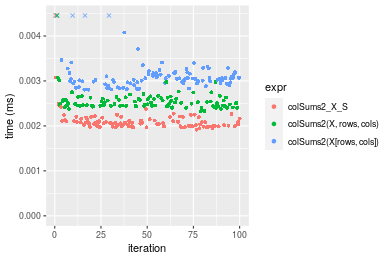

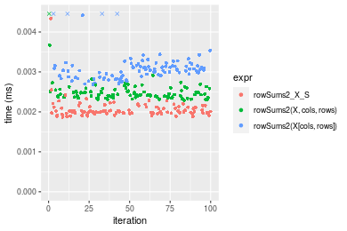
_Table: Benchmarking of colSums2_X_S() and rowSums2_X_S() on integer+10x10 data (original and transposed).  The top panel shows times in milliseconds and the bottom panel shows relative times._


|   |expr         |   min|    lq|    mean| median|     uq|    max|
|:--|:------------|-----:|-----:|-------:|------:|------:|------:|
|2  |rowSums2_X_S | 1.868| 1.970| 2.06461| 2.0035| 2.1170|  4.339|
|1  |colSums2_X_S | 1.917| 1.996| 2.97905| 2.0690| 2.1355| 90.851|


|   |expr         |      min|       lq|     mean|   median|       uq|      max|
|:--|:------------|--------:|--------:|--------:|--------:|--------:|--------:|
|2  |rowSums2_X_S | 1.000000| 1.000000| 1.000000| 1.000000| 1.000000|  1.00000|
|1  |colSums2_X_S | 1.026231| 1.013198| 1.442912| 1.032693| 1.008739| 20.93823|

_Figure: Benchmarking of colSums2_X_S() and rowSums2_X_S() on integer+10x10 data (original and transposed).  Outliers are displayed as crosses. Times are in milliseconds._


#### 100x100 integer matrix

```r
> X <- data[["100x100"]]
> rows <- sample.int(nrow(X), size = nrow(X) * 0.7)
> cols <- sample.int(ncol(X), size = ncol(X) * 0.7)
> X_S <- X[rows, cols]
> gc()
           used  (Mb) gc trigger  (Mb) max used  (Mb)
Ncells  5288183 282.5    8529671 455.6  8529671 455.6
Vcells 10101777  77.1   31876688 243.2 60562128 462.1
> colStats <- microbenchmark(colSums2_X_S = colSums2(X_S, na.rm = FALSE), `colSums2(X, rows, cols)` = colSums2(X, 
+     rows = rows, cols = cols, na.rm = FALSE), `colSums2(X[rows, cols])` = colSums2(X[rows, cols], 
+     na.rm = FALSE), unit = "ms")
> X <- t(X)
> X_S <- t(X_S)
> gc()
           used  (Mb) gc trigger  (Mb) max used  (Mb)
Ncells  5288159 282.5    8529671 455.6  8529671 455.6
Vcells 10106830  77.2   31876688 243.2 60562128 462.1
> rowStats <- microbenchmark(rowSums2_X_S = rowSums2(X_S, na.rm = FALSE), `rowSums2(X, cols, rows)` = rowSums2(X, 
+     rows = cols, cols = rows, na.rm = FALSE), `rowSums2(X[cols, rows])` = rowSums2(X[cols, rows], 
+     na.rm = FALSE), unit = "ms")
```

_Table: Benchmarking of colSums2_X_S(), colSums2(X, rows, cols)() and colSums2(X[rows, cols])() on integer+100x100 data. The top panel shows times in milliseconds and the bottom panel shows relative times._


|   |expr                    |      min|        lq|      mean|    median|        uq|      max|
|:--|:-----------------------|--------:|---------:|---------:|---------:|---------:|--------:|
|2  |colSums2(X, rows, cols) | 0.015154| 0.0158085| 0.0162980| 0.0160540| 0.0163710| 0.030804|
|1  |colSums2_X_S            | 0.016126| 0.0164790| 0.0170535| 0.0170285| 0.0172215| 0.021129|
|3  |colSums2(X[rows, cols]) | 0.026489| 0.0274090| 0.0286065| 0.0279745| 0.0289585| 0.057307|


|   |expr                    |      min|       lq|     mean|   median|       uq|       max|
|:--|:-----------------------|--------:|--------:|--------:|--------:|--------:|---------:|
|2  |colSums2(X, rows, cols) | 1.000000| 1.000000| 1.000000| 1.000000| 1.000000| 1.0000000|
|1  |colSums2_X_S            | 1.064142| 1.042414| 1.046356| 1.060701| 1.051952| 0.6859174|
|3  |colSums2(X[rows, cols]) | 1.747987| 1.733814| 1.755221| 1.742525| 1.768890| 1.8603753|

_Table: Benchmarking of rowSums2_X_S(), rowSums2(X, cols, rows)() and rowSums2(X[cols, rows])() on integer+100x100 data (transposed). The top panel shows times in milliseconds and the bottom panel shows relative times._


|   |expr                    |      min|        lq|      mean|    median|        uq|      max|
|:--|:-----------------------|--------:|---------:|---------:|---------:|---------:|--------:|
|2  |rowSums2(X, cols, rows) | 0.015200| 0.0159045| 0.0167424| 0.0161240| 0.0166115| 0.037784|
|1  |rowSums2_X_S            | 0.015452| 0.0162115| 0.0166356| 0.0164465| 0.0169220| 0.022989|
|3  |rowSums2(X[cols, rows]) | 0.025896| 0.0271610| 0.0279388| 0.0274740| 0.0284070| 0.036413|


|   |expr                    |      min|       lq|      mean|   median|       uq|       max|
|:--|:-----------------------|--------:|--------:|---------:|--------:|--------:|---------:|
|2  |rowSums2(X, cols, rows) | 1.000000| 1.000000| 1.0000000| 1.000000| 1.000000| 1.0000000|
|1  |rowSums2_X_S            | 1.016579| 1.019303| 0.9936192| 1.020001| 1.018692| 0.6084321|
|3  |rowSums2(X[cols, rows]) | 1.703684| 1.707756| 1.6687390| 1.703920| 1.710080| 0.9637148|

_Figure: Benchmarking of colSums2_X_S(), colSums2(X, rows, cols)() and colSums2(X[rows, cols])() on integer+100x100 data  as well as rowSums2_X_S(), rowSums2(X, cols, rows)() and rowSums2(X[cols, rows])() on the same data transposed.  Outliers are displayed as crosses.  Times are in milliseconds._


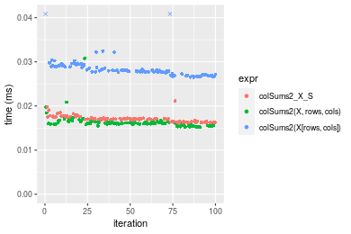

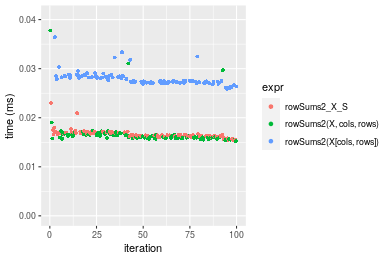
_Table: Benchmarking of colSums2_X_S() and rowSums2_X_S() on integer+100x100 data (original and transposed).  The top panel shows times in milliseconds and the bottom panel shows relative times._


|   |expr         |    min|      lq|     mean|  median|      uq|    max|
|:--|:------------|------:|-------:|--------:|-------:|-------:|------:|
|2  |rowSums2_X_S | 15.452| 16.2115| 16.63562| 16.4465| 16.9220| 22.989|
|1  |colSums2_X_S | 16.126| 16.4790| 17.05348| 17.0285| 17.2215| 21.129|


|   |expr         |      min|       lq|     mean|   median|       uq|       max|
|:--|:------------|--------:|--------:|--------:|--------:|--------:|---------:|
|2  |rowSums2_X_S | 1.000000| 1.000000| 1.000000| 1.000000| 1.000000| 1.0000000|
|1  |colSums2_X_S | 1.043619| 1.016501| 1.025118| 1.035387| 1.017699| 0.9190917|

_Figure: Benchmarking of colSums2_X_S() and rowSums2_X_S() on integer+100x100 data (original and transposed).  Outliers are displayed as crosses. Times are in milliseconds._


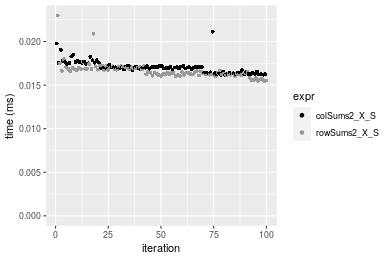

#### 1000x10 integer matrix

```r
> X <- data[["1000x10"]]
> rows <- sample.int(nrow(X), size = nrow(X) * 0.7)
> cols <- sample.int(ncol(X), size = ncol(X) * 0.7)
> X_S <- X[rows, cols]
> gc()
           used  (Mb) gc trigger  (Mb) max used  (Mb)
Ncells  5288926 282.5    8529671 455.6  8529671 455.6
Vcells 10105817  77.2   31876688 243.2 60562128 462.1
> colStats <- microbenchmark(colSums2_X_S = colSums2(X_S, na.rm = FALSE), `colSums2(X, rows, cols)` = colSums2(X, 
+     rows = rows, cols = cols, na.rm = FALSE), `colSums2(X[rows, cols])` = colSums2(X[rows, cols], 
+     na.rm = FALSE), unit = "ms")
> X <- t(X)
> X_S <- t(X_S)
> gc()
           used  (Mb) gc trigger  (Mb) max used  (Mb)
Ncells  5288902 282.5    8529671 455.6  8529671 455.6
Vcells 10110870  77.2   31876688 243.2 60562128 462.1
> rowStats <- microbenchmark(rowSums2_X_S = rowSums2(X_S, na.rm = FALSE), `rowSums2(X, cols, rows)` = rowSums2(X, 
+     rows = cols, cols = rows, na.rm = FALSE), `rowSums2(X[cols, rows])` = rowSums2(X[cols, rows], 
+     na.rm = FALSE), unit = "ms")
```

_Table: Benchmarking of colSums2_X_S(), colSums2(X, rows, cols)() and colSums2(X[rows, cols])() on integer+1000x10 data. The top panel shows times in milliseconds and the bottom panel shows relative times._


|   |expr                    |      min|        lq|      mean|    median|        uq|      max|
|:--|:-----------------------|--------:|---------:|---------:|---------:|---------:|--------:|
|1  |colSums2_X_S            | 0.015116| 0.0157575| 0.0160127| 0.0159035| 0.0163930| 0.019119|
|2  |colSums2(X, rows, cols) | 0.016825| 0.0177845| 0.0185554| 0.0181820| 0.0186565| 0.031995|
|3  |colSums2(X[rows, cols]) | 0.026027| 0.0266035| 0.0280549| 0.0273760| 0.0283605| 0.057529|


|   |expr                    |      min|       lq|     mean|   median|       uq|      max|
|:--|:-----------------------|--------:|--------:|--------:|--------:|--------:|--------:|
|1  |colSums2_X_S            | 1.000000| 1.000000| 1.000000| 1.000000| 1.000000| 1.000000|
|2  |colSums2(X, rows, cols) | 1.113059| 1.128637| 1.158789| 1.143270| 1.138077| 1.673466|
|3  |colSums2(X[rows, cols]) | 1.721818| 1.688307| 1.752043| 1.721382| 1.730037| 3.008996|

_Table: Benchmarking of rowSums2_X_S(), rowSums2(X, cols, rows)() and rowSums2(X[cols, rows])() on integer+1000x10 data (transposed). The top panel shows times in milliseconds and the bottom panel shows relative times._


|   |expr                    |      min|        lq|      mean|    median|        uq|      max|
|:--|:-----------------------|--------:|---------:|---------:|---------:|---------:|--------:|
|1  |rowSums2_X_S            | 0.015052| 0.0156505| 0.0159805| 0.0157925| 0.0163245| 0.022156|
|2  |rowSums2(X, cols, rows) | 0.016871| 0.0177090| 0.0184046| 0.0180600| 0.0186610| 0.033190|
|3  |rowSums2(X[cols, rows]) | 0.027499| 0.0285005| 0.0301481| 0.0292280| 0.0304665| 0.062600|


|   |expr                    |      min|       lq|     mean|   median|       uq|      max|
|:--|:-----------------------|--------:|--------:|--------:|--------:|--------:|--------:|
|1  |rowSums2_X_S            | 1.000000| 1.000000| 1.000000| 1.000000| 1.000000| 1.000000|
|2  |rowSums2(X, cols, rows) | 1.120848| 1.131529| 1.151692| 1.143581| 1.143128| 1.498014|
|3  |rowSums2(X[cols, rows]) | 1.826933| 1.821060| 1.886553| 1.850752| 1.866305| 2.825420|

_Figure: Benchmarking of colSums2_X_S(), colSums2(X, rows, cols)() and colSums2(X[rows, cols])() on integer+1000x10 data  as well as rowSums2_X_S(), rowSums2(X, cols, rows)() and rowSums2(X[cols, rows])() on the same data transposed.  Outliers are displayed as crosses.  Times are in milliseconds._


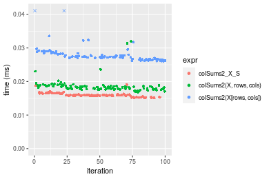

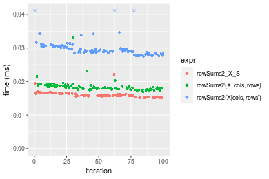
_Table: Benchmarking of colSums2_X_S() and rowSums2_X_S() on integer+1000x10 data (original and transposed).  The top panel shows times in milliseconds and the bottom panel shows relative times._


|   |expr         |    min|      lq|     mean|  median|      uq|    max|
|:--|:------------|------:|-------:|--------:|-------:|-------:|------:|
|2  |rowSums2_X_S | 15.052| 15.6505| 15.98053| 15.7925| 16.3245| 22.156|
|1  |colSums2_X_S | 15.116| 15.7575| 16.01271| 15.9035| 16.3930| 19.119|


|   |expr         |      min|       lq|     mean|   median|       uq|       max|
|:--|:------------|--------:|--------:|--------:|--------:|--------:|---------:|
|2  |rowSums2_X_S | 1.000000| 1.000000| 1.000000| 1.000000| 1.000000| 1.0000000|
|1  |colSums2_X_S | 1.004252| 1.006837| 1.002014| 1.007029| 1.004196| 0.8629265|

_Figure: Benchmarking of colSums2_X_S() and rowSums2_X_S() on integer+1000x10 data (original and transposed).  Outliers are displayed as crosses. Times are in milliseconds._


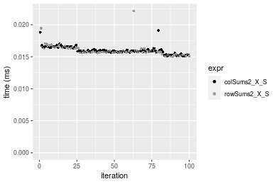

#### 10x1000 integer matrix

```r
> X <- data[["10x1000"]]
> rows <- sample.int(nrow(X), size = nrow(X) * 0.7)
> cols <- sample.int(ncol(X), size = ncol(X) * 0.7)
> X_S <- X[rows, cols]
> gc()
           used  (Mb) gc trigger  (Mb) max used  (Mb)
Ncells  5289131 282.5    8529671 455.6  8529671 455.6
Vcells 10106668  77.2   31876688 243.2 60562128 462.1
> colStats <- microbenchmark(colSums2_X_S = colSums2(X_S, na.rm = FALSE), `colSums2(X, rows, cols)` = colSums2(X, 
+     rows = rows, cols = cols, na.rm = FALSE), `colSums2(X[rows, cols])` = colSums2(X[rows, cols], 
+     na.rm = FALSE), unit = "ms")
> X <- t(X)
> X_S <- t(X_S)
> gc()
           used  (Mb) gc trigger  (Mb) max used  (Mb)
Ncells  5289107 282.5    8529671 455.6  8529671 455.6
Vcells 10111721  77.2   31876688 243.2 60562128 462.1
> rowStats <- microbenchmark(rowSums2_X_S = rowSums2(X_S, na.rm = FALSE), `rowSums2(X, cols, rows)` = rowSums2(X, 
+     rows = cols, cols = rows, na.rm = FALSE), `rowSums2(X[cols, rows])` = rowSums2(X[cols, rows], 
+     na.rm = FALSE), unit = "ms")
```

_Table: Benchmarking of colSums2_X_S(), colSums2(X, rows, cols)() and colSums2(X[rows, cols])() on integer+10x1000 data. The top panel shows times in milliseconds and the bottom panel shows relative times._


|   |expr                    |      min|        lq|      mean|    median|        uq|      max|
|:--|:-----------------------|--------:|---------:|---------:|---------:|---------:|--------:|
|1  |colSums2_X_S            | 0.018567| 0.0193270| 0.0200568| 0.0201125| 0.0203765| 0.037350|
|2  |colSums2(X, rows, cols) | 0.019119| 0.0201590| 0.0211767| 0.0208620| 0.0213490| 0.035923|
|3  |colSums2(X[rows, cols]) | 0.031058| 0.0328255| 0.0337760| 0.0334745| 0.0344865| 0.043080|


|   |expr                    |      min|       lq|     mean|   median|       uq|       max|
|:--|:-----------------------|--------:|--------:|--------:|--------:|--------:|---------:|
|1  |colSums2_X_S            | 1.000000| 1.000000| 1.000000| 1.000000| 1.000000| 1.0000000|
|2  |colSums2(X, rows, cols) | 1.029730| 1.043049| 1.055837| 1.037265| 1.047727| 0.9617938|
|3  |colSums2(X[rows, cols]) | 1.672753| 1.698427| 1.684017| 1.664363| 1.692464| 1.1534137|

_Table: Benchmarking of rowSums2_X_S(), rowSums2(X, cols, rows)() and rowSums2(X[cols, rows])() on integer+10x1000 data (transposed). The top panel shows times in milliseconds and the bottom panel shows relative times._


|   |expr                    |      min|        lq|      mean|    median|       uq|      max|
|:--|:-----------------------|--------:|---------:|---------:|---------:|--------:|--------:|
|1  |rowSums2_X_S            | 0.018112| 0.0188490| 0.0196013| 0.0194570| 0.020124| 0.028014|
|2  |rowSums2(X, cols, rows) | 0.018698| 0.0194175| 0.0204472| 0.0198375| 0.020475| 0.043371|
|3  |rowSums2(X[cols, rows]) | 0.029081| 0.0302220| 0.0316607| 0.0312250| 0.032506| 0.045241|


|   |expr                    |      min|       lq|     mean|   median|       uq|      max|
|:--|:-----------------------|--------:|--------:|--------:|--------:|--------:|--------:|
|1  |rowSums2_X_S            | 1.000000| 1.000000| 1.000000| 1.000000| 1.000000| 1.000000|
|2  |rowSums2(X, cols, rows) | 1.032354| 1.030161| 1.043157| 1.019556| 1.017442| 1.548190|
|3  |rowSums2(X[cols, rows]) | 1.605621| 1.603374| 1.615237| 1.604821| 1.615285| 1.614942|

_Figure: Benchmarking of colSums2_X_S(), colSums2(X, rows, cols)() and colSums2(X[rows, cols])() on integer+10x1000 data  as well as rowSums2_X_S(), rowSums2(X, cols, rows)() and rowSums2(X[cols, rows])() on the same data transposed.  Outliers are displayed as crosses.  Times are in milliseconds._


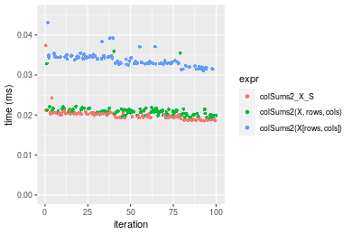

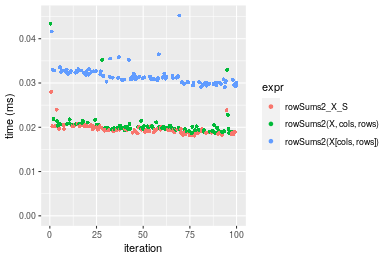
_Table: Benchmarking of colSums2_X_S() and rowSums2_X_S() on integer+10x1000 data (original and transposed).  The top panel shows times in milliseconds and the bottom panel shows relative times._


|   |expr         |    min|     lq|     mean|  median|      uq|    max|
|:--|:------------|------:|------:|--------:|-------:|-------:|------:|
|2  |rowSums2_X_S | 18.112| 18.849| 19.60130| 19.4570| 20.1240| 28.014|
|1  |colSums2_X_S | 18.567| 19.327| 20.05681| 20.1125| 20.3765| 37.350|


|   |expr         |      min|       lq|     mean|  median|       uq|      max|
|:--|:------------|--------:|--------:|--------:|-------:|--------:|--------:|
|2  |rowSums2_X_S | 1.000000| 1.000000| 1.000000| 1.00000| 1.000000| 1.000000|
|1  |colSums2_X_S | 1.025122| 1.025359| 1.023239| 1.03369| 1.012547| 1.333262|

_Figure: Benchmarking of colSums2_X_S() and rowSums2_X_S() on integer+10x1000 data (original and transposed).  Outliers are displayed as crosses. Times are in milliseconds._


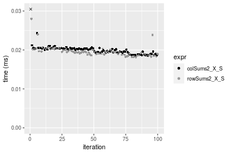

#### 100x1000 integer matrix

```r
> X <- data[["100x1000"]]
> rows <- sample.int(nrow(X), size = nrow(X) * 0.7)
> cols <- sample.int(ncol(X), size = ncol(X) * 0.7)
> X_S <- X[rows, cols]
> gc()
           used  (Mb) gc trigger  (Mb) max used  (Mb)
Ncells  5289341 282.5    8529671 455.6  8529671 455.6
Vcells 10129340  77.3   31876688 243.2 60562128 462.1
> colStats <- microbenchmark(colSums2_X_S = colSums2(X_S, na.rm = FALSE), `colSums2(X, rows, cols)` = colSums2(X, 
+     rows = rows, cols = cols, na.rm = FALSE), `colSums2(X[rows, cols])` = colSums2(X[rows, cols], 
+     na.rm = FALSE), unit = "ms")
> X <- t(X)
> X_S <- t(X_S)
> gc()
           used  (Mb) gc trigger  (Mb) max used  (Mb)
Ncells  5289317 282.5    8529671 455.6  8529671 455.6
Vcells 10179393  77.7   31876688 243.2 60562128 462.1
> rowStats <- microbenchmark(rowSums2_X_S = rowSums2(X_S, na.rm = FALSE), `rowSums2(X, cols, rows)` = rowSums2(X, 
+     rows = cols, cols = rows, na.rm = FALSE), `rowSums2(X[cols, rows])` = rowSums2(X[cols, rows], 
+     na.rm = FALSE), unit = "ms")
```

_Table: Benchmarking of colSums2_X_S(), colSums2(X, rows, cols)() and colSums2(X[rows, cols])() on integer+100x1000 data. The top panel shows times in milliseconds and the bottom panel shows relative times._


|   |expr                    |      min|       lq|      mean|    median|        uq|      max|
|:--|:-----------------------|--------:|--------:|---------:|---------:|---------:|--------:|
|2  |colSums2(X, rows, cols) | 0.087365| 0.095771| 0.1067721| 0.1043025| 0.1149665| 0.191974|
|1  |colSums2_X_S            | 0.098938| 0.111564| 0.1245812| 0.1217165| 0.1343105| 0.183901|
|3  |colSums2(X[rows, cols]) | 0.167719| 0.192112| 0.2119592| 0.2058850| 0.2274205| 0.323292|


|   |expr                    |      min|       lq|     mean|   median|       uq|       max|
|:--|:-----------------------|--------:|--------:|--------:|--------:|--------:|---------:|
|2  |colSums2(X, rows, cols) | 1.000000| 1.000000| 1.000000| 1.000000| 1.000000| 1.0000000|
|1  |colSums2_X_S            | 1.132467| 1.164904| 1.166796| 1.166957| 1.168258| 0.9579474|
|3  |colSums2(X[rows, cols]) | 1.919750| 2.005952| 1.985155| 1.973922| 1.978146| 1.6840405|

_Table: Benchmarking of rowSums2_X_S(), rowSums2(X, cols, rows)() and rowSums2(X[cols, rows])() on integer+100x1000 data (transposed). The top panel shows times in milliseconds and the bottom panel shows relative times._


|   |expr                    |      min|        lq|      mean|    median|        uq|      max|
|:--|:-----------------------|--------:|---------:|---------:|---------:|---------:|--------:|
|2  |rowSums2(X, cols, rows) | 0.093528| 0.0991485| 0.1119656| 0.1089325| 0.1198325| 0.201175|
|1  |rowSums2_X_S            | 0.097333| 0.1091325| 0.1213618| 0.1192595| 0.1308295| 0.199279|
|3  |rowSums2(X[cols, rows]) | 0.167777| 0.1828180| 0.2023512| 0.1965940| 0.2187180| 0.291069|


|   |expr                    |      min|       lq|     mean|   median|       uq|       max|
|:--|:-----------------------|--------:|--------:|--------:|--------:|--------:|---------:|
|2  |rowSums2(X, cols, rows) | 1.000000| 1.000000| 1.000000| 1.000000| 1.000000| 1.0000000|
|1  |rowSums2_X_S            | 1.040683| 1.100697| 1.083921| 1.094802| 1.091770| 0.9905754|
|3  |rowSums2(X[cols, rows]) | 1.793869| 1.843881| 1.807263| 1.804732| 1.825198| 1.4468448|

_Figure: Benchmarking of colSums2_X_S(), colSums2(X, rows, cols)() and colSums2(X[rows, cols])() on integer+100x1000 data  as well as rowSums2_X_S(), rowSums2(X, cols, rows)() and rowSums2(X[cols, rows])() on the same data transposed.  Outliers are displayed as crosses.  Times are in milliseconds._


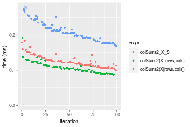

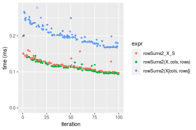
_Table: Benchmarking of colSums2_X_S() and rowSums2_X_S() on integer+100x1000 data (original and transposed).  The top panel shows times in milliseconds and the bottom panel shows relative times._


|   |expr         |    min|       lq|     mean|   median|       uq|     max|
|:--|:------------|------:|--------:|--------:|--------:|--------:|-------:|
|2  |rowSums2_X_S | 97.333| 109.1325| 121.3618| 119.2595| 130.8295| 199.279|
|1  |colSums2_X_S | 98.938| 111.5640| 124.5812| 121.7165| 134.3105| 183.901|


|   |expr         |     min|      lq|     mean|   median|       uq|       max|
|:--|:------------|-------:|-------:|--------:|--------:|--------:|---------:|
|2  |rowSums2_X_S | 1.00000| 1.00000| 1.000000| 1.000000| 1.000000| 1.0000000|
|1  |colSums2_X_S | 1.01649| 1.02228| 1.026528| 1.020602| 1.026607| 0.9228318|

_Figure: Benchmarking of colSums2_X_S() and rowSums2_X_S() on integer+100x1000 data (original and transposed).  Outliers are displayed as crosses. Times are in milliseconds._


#### 1000x100 integer matrix

```r
> X <- data[["1000x100"]]
> rows <- sample.int(nrow(X), size = nrow(X) * 0.7)
> cols <- sample.int(ncol(X), size = ncol(X) * 0.7)
> X_S <- X[rows, cols]
> gc()
           used  (Mb) gc trigger  (Mb) max used  (Mb)
Ncells  5289554 282.5    8529671 455.6  8529671 455.6
Vcells 10130119  77.3   31876688 243.2 60562128 462.1
> colStats <- microbenchmark(colSums2_X_S = colSums2(X_S, na.rm = FALSE), `colSums2(X, rows, cols)` = colSums2(X, 
+     rows = rows, cols = cols, na.rm = FALSE), `colSums2(X[rows, cols])` = colSums2(X[rows, cols], 
+     na.rm = FALSE), unit = "ms")
> X <- t(X)
> X_S <- t(X_S)
> gc()
           used  (Mb) gc trigger  (Mb) max used  (Mb)
Ncells  5289530 282.5    8529671 455.6  8529671 455.6
Vcells 10180172  77.7   31876688 243.2 60562128 462.1
> rowStats <- microbenchmark(rowSums2_X_S = rowSums2(X_S, na.rm = FALSE), `rowSums2(X, cols, rows)` = rowSums2(X, 
+     rows = cols, cols = rows, na.rm = FALSE), `rowSums2(X[cols, rows])` = rowSums2(X[cols, rows], 
+     na.rm = FALSE), unit = "ms")
```

_Table: Benchmarking of colSums2_X_S(), colSums2(X, rows, cols)() and colSums2(X[rows, cols])() on integer+1000x100 data. The top panel shows times in milliseconds and the bottom panel shows relative times._


|   |expr                    |      min|        lq|      mean|    median|        uq|      max|
|:--|:-----------------------|--------:|---------:|---------:|---------:|---------:|--------:|
|2  |colSums2(X, rows, cols) | 0.089190| 0.0971085| 0.1077117| 0.1063650| 0.1151745| 0.147362|
|1  |colSums2_X_S            | 0.098186| 0.1071025| 0.1158809| 0.1140255| 0.1221325| 0.165320|
|3  |colSums2(X[rows, cols]) | 0.166742| 0.1779460| 0.2024797| 0.1974365| 0.2228625| 0.305317|


|   |expr                    |      min|       lq|     mean|   median|       uq|      max|
|:--|:-----------------------|--------:|--------:|--------:|--------:|--------:|--------:|
|2  |colSums2(X, rows, cols) | 1.000000| 1.000000| 1.000000| 1.000000| 1.000000| 1.000000|
|1  |colSums2_X_S            | 1.100863| 1.102916| 1.075844| 1.072021| 1.060413| 1.121863|
|3  |colSums2(X[rows, cols]) | 1.869514| 1.832445| 1.879830| 1.856217| 1.934999| 2.071884|

_Table: Benchmarking of rowSums2_X_S(), rowSums2(X, cols, rows)() and rowSums2(X[cols, rows])() on integer+1000x100 data (transposed). The top panel shows times in milliseconds and the bottom panel shows relative times._


|   |expr                    |      min|       lq|      mean|    median|        uq|      max|
|:--|:-----------------------|--------:|--------:|---------:|---------:|---------:|--------:|
|2  |rowSums2(X, cols, rows) | 0.094610| 0.106023| 0.1165371| 0.1124645| 0.1242875| 0.214450|
|1  |rowSums2_X_S            | 0.101942| 0.110439| 0.1234676| 0.1217585| 0.1329315| 0.170933|
|3  |rowSums2(X[cols, rows]) | 0.170344| 0.183902| 0.2053379| 0.2025215| 0.2211970| 0.288600|


|   |expr                    |      min|       lq|     mean|   median|       uq|       max|
|:--|:-----------------------|--------:|--------:|--------:|--------:|--------:|---------:|
|2  |rowSums2(X, cols, rows) | 1.000000| 1.000000| 1.000000| 1.000000| 1.000000| 1.0000000|
|1  |rowSums2_X_S            | 1.077497| 1.041651| 1.059470| 1.082639| 1.069548| 0.7970762|
|3  |rowSums2(X[cols, rows]) | 1.800486| 1.734548| 1.761996| 1.800759| 1.779720| 1.3457682|

_Figure: Benchmarking of colSums2_X_S(), colSums2(X, rows, cols)() and colSums2(X[rows, cols])() on integer+1000x100 data  as well as rowSums2_X_S(), rowSums2(X, cols, rows)() and rowSums2(X[cols, rows])() on the same data transposed.  Outliers are displayed as crosses.  Times are in milliseconds._


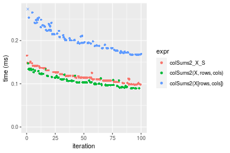

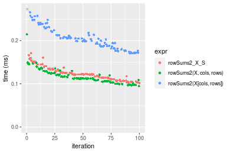
_Table: Benchmarking of colSums2_X_S() and rowSums2_X_S() on integer+1000x100 data (original and transposed).  The top panel shows times in milliseconds and the bottom panel shows relative times._


|   |expr         |     min|       lq|     mean|   median|       uq|     max|
|:--|:------------|-------:|--------:|--------:|--------:|--------:|-------:|
|1  |colSums2_X_S |  98.186| 107.1025| 115.8809| 114.0255| 122.1325| 165.320|
|2  |rowSums2_X_S | 101.942| 110.4390| 123.4677| 121.7585| 132.9315| 170.933|


|   |expr         |      min|       lq|    mean|   median|      uq|      max|
|:--|:------------|--------:|--------:|-------:|--------:|-------:|--------:|
|1  |colSums2_X_S | 1.000000| 1.000000| 1.00000| 1.000000| 1.00000| 1.000000|
|2  |rowSums2_X_S | 1.038254| 1.031152| 1.06547| 1.067818| 1.08842| 1.033952|

_Figure: Benchmarking of colSums2_X_S() and rowSums2_X_S() on integer+1000x100 data (original and transposed).  Outliers are displayed as crosses. Times are in milliseconds._


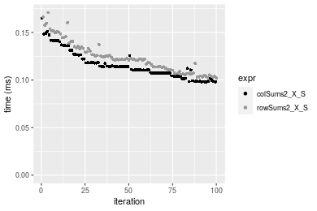


## Data type "double"

### Data
```r
> rmatrix <- function(nrow, ncol, mode = c("logical", "double", "integer", "index"), range = c(-100, 
+     +100), na_prob = 0) {
+     mode <- match.arg(mode)
+     n <- nrow * ncol
+     if (mode == "logical") {
+         x <- sample(c(FALSE, TRUE), size = n, replace = TRUE)
+     }     else if (mode == "index") {
+         x <- seq_len(n)
+         mode <- "integer"
+     }     else {
+         x <- runif(n, min = range[1], max = range[2])
+     }
+     storage.mode(x) <- mode
+     if (na_prob > 0) 
+         x[sample(n, size = na_prob * n)] <- NA
+     dim(x) <- c(nrow, ncol)
+     x
+ }
> rmatrices <- function(scale = 10, seed = 1, ...) {
+     set.seed(seed)
+     data <- list()
+     data[[1]] <- rmatrix(nrow = scale * 1, ncol = scale * 1, ...)
+     data[[2]] <- rmatrix(nrow = scale * 10, ncol = scale * 10, ...)
+     data[[3]] <- rmatrix(nrow = scale * 100, ncol = scale * 1, ...)
+     data[[4]] <- t(data[[3]])
+     data[[5]] <- rmatrix(nrow = scale * 10, ncol = scale * 100, ...)
+     data[[6]] <- t(data[[5]])
+     names(data) <- sapply(data, FUN = function(x) paste(dim(x), collapse = "x"))
+     data
+ }
> data <- rmatrices(mode = mode)
```

### Results

#### 10x10 double matrix

```r
> X <- data[["10x10"]]
> rows <- sample.int(nrow(X), size = nrow(X) * 0.7)
> cols <- sample.int(ncol(X), size = ncol(X) * 0.7)
> X_S <- X[rows, cols]
> gc()
           used  (Mb) gc trigger  (Mb) max used  (Mb)
Ncells  5289771 282.6    8529671 455.6  8529671 455.6
Vcells 10221223  78.0   31876688 243.2 60562128 462.1
> colStats <- microbenchmark(colSums2_X_S = colSums2(X_S, na.rm = FALSE), `colSums2(X, rows, cols)` = colSums2(X, 
+     rows = rows, cols = cols, na.rm = FALSE), `colSums2(X[rows, cols])` = colSums2(X[rows, cols], 
+     na.rm = FALSE), unit = "ms")
> X <- t(X)
> X_S <- t(X_S)
> gc()
           used  (Mb) gc trigger  (Mb) max used  (Mb)
Ncells  5289738 282.6    8529671 455.6  8529671 455.6
Vcells 10221361  78.0   31876688 243.2 60562128 462.1
> rowStats <- microbenchmark(rowSums2_X_S = rowSums2(X_S, na.rm = FALSE), `rowSums2(X, cols, rows)` = rowSums2(X, 
+     rows = cols, cols = rows, na.rm = FALSE), `rowSums2(X[cols, rows])` = rowSums2(X[cols, rows], 
+     na.rm = FALSE), unit = "ms")
```

_Table: Benchmarking of colSums2_X_S(), colSums2(X, rows, cols)() and colSums2(X[rows, cols])() on double+10x10 data. The top panel shows times in milliseconds and the bottom panel shows relative times._


|   |expr                    |      min|        lq|      mean|   median|        uq|      max|
|:--|:-----------------------|--------:|---------:|---------:|--------:|---------:|--------:|
|1  |colSums2_X_S            | 0.001904| 0.0019810| 0.0022126| 0.002029| 0.0021055| 0.017383|
|2  |colSums2(X, rows, cols) | 0.002305| 0.0023955| 0.0025080| 0.002454| 0.0025215| 0.004870|
|3  |colSums2(X[rows, cols]) | 0.002866| 0.0030730| 0.0032465| 0.003152| 0.0033060| 0.007907|


|   |expr                    |      min|       lq|     mean|   median|       uq|       max|
|:--|:-----------------------|--------:|--------:|--------:|--------:|--------:|---------:|
|1  |colSums2_X_S            | 1.000000| 1.000000| 1.000000| 1.000000| 1.000000| 1.0000000|
|2  |colSums2(X, rows, cols) | 1.210609| 1.209238| 1.133485| 1.209463| 1.197578| 0.2801588|
|3  |colSums2(X[rows, cols]) | 1.505252| 1.551237| 1.467254| 1.553475| 1.570173| 0.4548697|

_Table: Benchmarking of rowSums2_X_S(), rowSums2(X, cols, rows)() and rowSums2(X[cols, rows])() on double+10x10 data (transposed). The top panel shows times in milliseconds and the bottom panel shows relative times._


|   |expr                    |      min|        lq|      mean|    median|       uq|      max|
|:--|:-----------------------|--------:|---------:|---------:|---------:|--------:|--------:|
|1  |rowSums2_X_S            | 0.001906| 0.0020000| 0.0021061| 0.0020445| 0.002148| 0.004407|
|2  |rowSums2(X, cols, rows) | 0.002337| 0.0024335| 0.0027397| 0.0024790| 0.002594| 0.022945|
|3  |rowSums2(X[cols, rows]) | 0.002836| 0.0031030| 0.0032540| 0.0031650| 0.003266| 0.007526|


|   |expr                    |      min|      lq|     mean|   median|       uq|      max|
|:--|:-----------------------|--------:|-------:|--------:|--------:|--------:|--------:|
|1  |rowSums2_X_S            | 1.000000| 1.00000| 1.000000| 1.000000| 1.000000| 1.000000|
|2  |rowSums2(X, cols, rows) | 1.226128| 1.21675| 1.300821| 1.212521| 1.207635| 5.206490|
|3  |rowSums2(X[cols, rows]) | 1.487933| 1.55150| 1.545050| 1.548056| 1.520484| 1.707738|

_Figure: Benchmarking of colSums2_X_S(), colSums2(X, rows, cols)() and colSums2(X[rows, cols])() on double+10x10 data  as well as rowSums2_X_S(), rowSums2(X, cols, rows)() and rowSums2(X[cols, rows])() on the same data transposed.  Outliers are displayed as crosses.  Times are in milliseconds._


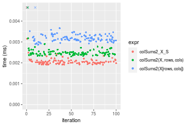

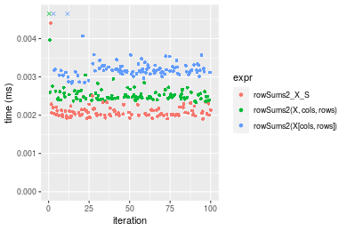
_Table: Benchmarking of colSums2_X_S() and rowSums2_X_S() on double+10x10 data (original and transposed).  The top panel shows times in milliseconds and the bottom panel shows relative times._


|   |expr         |   min|    lq|    mean| median|     uq|    max|
|:--|:------------|-----:|-----:|-------:|------:|------:|------:|
|1  |colSums2_X_S | 1.904| 1.981| 2.21261| 2.0290| 2.1055| 17.383|
|2  |rowSums2_X_S | 1.906| 2.000| 2.10610| 2.0445| 2.1480|  4.407|


|   |expr         |     min|       lq|      mean|   median|       uq|       max|
|:--|:------------|-------:|--------:|---------:|--------:|--------:|---------:|
|1  |colSums2_X_S | 1.00000| 1.000000| 1.0000000| 1.000000| 1.000000| 1.0000000|
|2  |rowSums2_X_S | 1.00105| 1.009591| 0.9518623| 1.007639| 1.020185| 0.2535236|

_Figure: Benchmarking of colSums2_X_S() and rowSums2_X_S() on double+10x10 data (original and transposed).  Outliers are displayed as crosses. Times are in milliseconds._


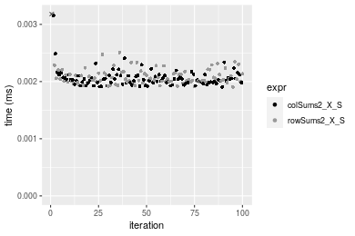

#### 100x100 double matrix

```r
> X <- data[["100x100"]]
> rows <- sample.int(nrow(X), size = nrow(X) * 0.7)
> cols <- sample.int(ncol(X), size = ncol(X) * 0.7)
> X_S <- X[rows, cols]
> gc()
           used  (Mb) gc trigger  (Mb) max used  (Mb)
Ncells  5289968 282.6    8529671 455.6  8529671 455.6
Vcells 10227171  78.1   31876688 243.2 60562128 462.1
> colStats <- microbenchmark(colSums2_X_S = colSums2(X_S, na.rm = FALSE), `colSums2(X, rows, cols)` = colSums2(X, 
+     rows = rows, cols = cols, na.rm = FALSE), `colSums2(X[rows, cols])` = colSums2(X[rows, cols], 
+     na.rm = FALSE), unit = "ms")
> X <- t(X)
> X_S <- t(X_S)
> gc()
           used  (Mb) gc trigger  (Mb) max used  (Mb)
Ncells  5289944 282.6    8529671 455.6  8529671 455.6
Vcells 10237224  78.2   31876688 243.2 60562128 462.1
> rowStats <- microbenchmark(rowSums2_X_S = rowSums2(X_S, na.rm = FALSE), `rowSums2(X, cols, rows)` = rowSums2(X, 
+     rows = cols, cols = rows, na.rm = FALSE), `rowSums2(X[cols, rows])` = rowSums2(X[cols, rows], 
+     na.rm = FALSE), unit = "ms")
```

_Table: Benchmarking of colSums2_X_S(), colSums2(X, rows, cols)() and colSums2(X[rows, cols])() on double+100x100 data. The top panel shows times in milliseconds and the bottom panel shows relative times._


|   |expr                    |      min|        lq|      mean|    median|        uq|      max|
|:--|:-----------------------|--------:|---------:|---------:|---------:|---------:|--------:|
|1  |colSums2_X_S            | 0.013410| 0.0139380| 0.0146905| 0.0142065| 0.0145895| 0.028955|
|2  |colSums2(X, rows, cols) | 0.016157| 0.0168385| 0.0173912| 0.0172440| 0.0176265| 0.023075|
|3  |colSums2(X[rows, cols]) | 0.028664| 0.0297690| 0.0311193| 0.0300710| 0.0310970| 0.063370|


|   |expr                    |      min|       lq|     mean|   median|       uq|       max|
|:--|:-----------------------|--------:|--------:|--------:|--------:|--------:|---------:|
|1  |colSums2_X_S            | 1.000000| 1.000000| 1.000000| 1.000000| 1.000000| 1.0000000|
|2  |colSums2(X, rows, cols) | 1.204847| 1.208100| 1.183840| 1.213811| 1.208163| 0.7969263|
|3  |colSums2(X[rows, cols]) | 2.137509| 2.135816| 2.118327| 2.116707| 2.131464| 2.1885685|

_Table: Benchmarking of rowSums2_X_S(), rowSums2(X, cols, rows)() and rowSums2(X[cols, rows])() on double+100x100 data (transposed). The top panel shows times in milliseconds and the bottom panel shows relative times._


|   |expr                    |      min|        lq|      mean|    median|        uq|      max|
|:--|:-----------------------|--------:|---------:|---------:|---------:|---------:|--------:|
|1  |rowSums2_X_S            | 0.014661| 0.0155850| 0.0164210| 0.0159010| 0.0163445| 0.035258|
|2  |rowSums2(X, cols, rows) | 0.016131| 0.0170090| 0.0178754| 0.0173925| 0.0178840| 0.044955|
|3  |rowSums2(X[cols, rows]) | 0.030101| 0.0314105| 0.0325872| 0.0316670| 0.0327950| 0.058305|


|   |expr                    |      min|       lq|     mean|   median|       uq|      max|
|:--|:-----------------------|--------:|--------:|--------:|--------:|--------:|--------:|
|1  |rowSums2_X_S            | 1.000000| 1.000000| 1.000000| 1.000000| 1.000000| 1.000000|
|2  |rowSums2(X, cols, rows) | 1.100266| 1.091370| 1.088567| 1.093799| 1.094191| 1.275030|
|3  |rowSums2(X[cols, rows]) | 2.053134| 2.015432| 1.984478| 1.991510| 2.006485| 1.653667|

_Figure: Benchmarking of colSums2_X_S(), colSums2(X, rows, cols)() and colSums2(X[rows, cols])() on double+100x100 data  as well as rowSums2_X_S(), rowSums2(X, cols, rows)() and rowSums2(X[cols, rows])() on the same data transposed.  Outliers are displayed as crosses.  Times are in milliseconds._


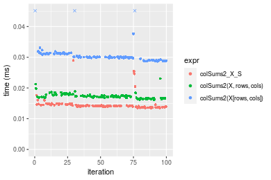

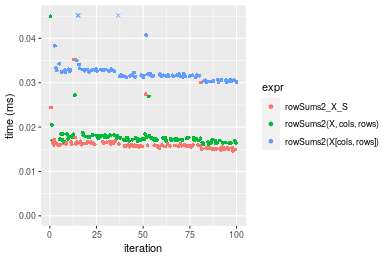
_Table: Benchmarking of colSums2_X_S() and rowSums2_X_S() on double+100x100 data (original and transposed).  The top panel shows times in milliseconds and the bottom panel shows relative times._


|   |expr         |    min|     lq|     mean|  median|      uq|    max|
|:--|:------------|------:|------:|--------:|-------:|-------:|------:|
|1  |colSums2_X_S | 13.410| 13.938| 14.69049| 14.2065| 14.5895| 28.955|
|2  |rowSums2_X_S | 14.661| 15.585| 16.42104| 15.9010| 16.3445| 35.258|


|   |expr         |      min|       lq|     mean|   median|       uq|      max|
|:--|:------------|--------:|--------:|--------:|--------:|--------:|--------:|
|1  |colSums2_X_S | 1.000000| 1.000000| 1.000000| 1.000000| 1.000000| 1.000000|
|2  |rowSums2_X_S | 1.093289| 1.118166| 1.117801| 1.119276| 1.120292| 1.217683|

_Figure: Benchmarking of colSums2_X_S() and rowSums2_X_S() on double+100x100 data (original and transposed).  Outliers are displayed as crosses. Times are in milliseconds._


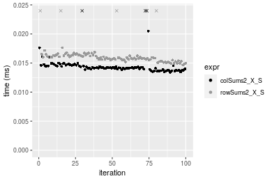

#### 1000x10 double matrix

```r
> X <- data[["1000x10"]]
> rows <- sample.int(nrow(X), size = nrow(X) * 0.7)
> cols <- sample.int(ncol(X), size = ncol(X) * 0.7)
> X_S <- X[rows, cols]
> gc()
           used  (Mb) gc trigger  (Mb) max used  (Mb)
Ncells  5290168 282.6    8529671 455.6  8529671 455.6
Vcells 10228580  78.1   31876688 243.2 60562128 462.1
> colStats <- microbenchmark(colSums2_X_S = colSums2(X_S, na.rm = FALSE), `colSums2(X, rows, cols)` = colSums2(X, 
+     rows = rows, cols = cols, na.rm = FALSE), `colSums2(X[rows, cols])` = colSums2(X[rows, cols], 
+     na.rm = FALSE), unit = "ms")
> X <- t(X)
> X_S <- t(X_S)
> gc()
           used  (Mb) gc trigger  (Mb) max used  (Mb)
Ncells  5290144 282.6    8529671 455.6  8529671 455.6
Vcells 10238633  78.2   31876688 243.2 60562128 462.1
> rowStats <- microbenchmark(rowSums2_X_S = rowSums2(X_S, na.rm = FALSE), `rowSums2(X, cols, rows)` = rowSums2(X, 
+     rows = cols, cols = rows, na.rm = FALSE), `rowSums2(X[cols, rows])` = rowSums2(X[cols, rows], 
+     na.rm = FALSE), unit = "ms")
```

_Table: Benchmarking of colSums2_X_S(), colSums2(X, rows, cols)() and colSums2(X[rows, cols])() on double+1000x10 data. The top panel shows times in milliseconds and the bottom panel shows relative times._


|   |expr                    |      min|        lq|      mean|    median|        uq|      max|
|:--|:-----------------------|--------:|---------:|---------:|---------:|---------:|--------:|
|1  |colSums2_X_S            | 0.011602| 0.0120325| 0.0123628| 0.0122770| 0.0126705| 0.016223|
|2  |colSums2(X, rows, cols) | 0.017080| 0.0177885| 0.0183413| 0.0181900| 0.0188215| 0.023480|
|3  |colSums2(X[rows, cols]) | 0.027325| 0.0277930| 0.0294417| 0.0287365| 0.0299745| 0.059768|


|   |expr                    |      min|       lq|     mean|   median|       uq|      max|
|:--|:-----------------------|--------:|--------:|--------:|--------:|--------:|--------:|
|1  |colSums2_X_S            | 1.000000| 1.000000| 1.000000| 1.000000| 1.000000| 1.000000|
|2  |colSums2(X, rows, cols) | 1.472160| 1.478371| 1.483591| 1.481632| 1.485458| 1.447328|
|3  |colSums2(X[rows, cols]) | 2.355197| 2.309828| 2.381478| 2.340678| 2.365692| 3.684152|

_Table: Benchmarking of rowSums2_X_S(), rowSums2(X, cols, rows)() and rowSums2(X[cols, rows])() on double+1000x10 data (transposed). The top panel shows times in milliseconds and the bottom panel shows relative times._


|   |expr                    |      min|        lq|      mean|   median|        uq|      max|
|:--|:-----------------------|--------:|---------:|---------:|--------:|---------:|--------:|
|1  |rowSums2_X_S            | 0.013388| 0.0138920| 0.0143209| 0.014225| 0.0147095| 0.020348|
|2  |rowSums2(X, cols, rows) | 0.017153| 0.0178305| 0.0184661| 0.018298| 0.0188890| 0.024655|
|3  |rowSums2(X[cols, rows]) | 0.031939| 0.0323180| 0.0343460| 0.033483| 0.0348500| 0.083655|


|   |expr                    |      min|       lq|     mean|   median|       uq|      max|
|:--|:-----------------------|--------:|--------:|--------:|--------:|--------:|--------:|
|1  |rowSums2_X_S            | 1.000000| 1.000000| 1.000000| 1.000000| 1.000000| 1.000000|
|2  |rowSums2(X, cols, rows) | 1.281222| 1.283508| 1.289454| 1.286327| 1.284136| 1.211667|
|3  |rowSums2(X[cols, rows]) | 2.385644| 2.326375| 2.398321| 2.353814| 2.369217| 4.111215|

_Figure: Benchmarking of colSums2_X_S(), colSums2(X, rows, cols)() and colSums2(X[rows, cols])() on double+1000x10 data  as well as rowSums2_X_S(), rowSums2(X, cols, rows)() and rowSums2(X[cols, rows])() on the same data transposed.  Outliers are displayed as crosses.  Times are in milliseconds._


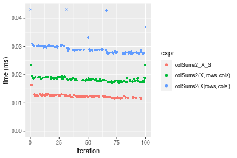

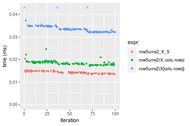
_Table: Benchmarking of colSums2_X_S() and rowSums2_X_S() on double+1000x10 data (original and transposed).  The top panel shows times in milliseconds and the bottom panel shows relative times._


|   |expr         |    min|      lq|     mean| median|      uq|    max|
|:--|:------------|------:|-------:|--------:|------:|-------:|------:|
|1  |colSums2_X_S | 11.602| 12.0325| 12.36277| 12.277| 12.6705| 16.223|
|2  |rowSums2_X_S | 13.388| 13.8920| 14.32086| 14.225| 14.7095| 20.348|


|   |expr         |      min|      lq|     mean|   median|       uq|      max|
|:--|:------------|--------:|-------:|--------:|--------:|--------:|--------:|
|1  |colSums2_X_S | 1.000000| 1.00000| 1.000000| 1.000000| 1.000000| 1.000000|
|2  |rowSums2_X_S | 1.153939| 1.15454| 1.158386| 1.158671| 1.160925| 1.254269|

_Figure: Benchmarking of colSums2_X_S() and rowSums2_X_S() on double+1000x10 data (original and transposed).  Outliers are displayed as crosses. Times are in milliseconds._


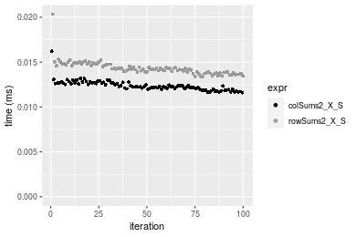

#### 10x1000 double matrix

```r
> X <- data[["10x1000"]]
> rows <- sample.int(nrow(X), size = nrow(X) * 0.7)
> cols <- sample.int(ncol(X), size = ncol(X) * 0.7)
> X_S <- X[rows, cols]
> gc()
           used  (Mb) gc trigger  (Mb) max used  (Mb)
Ncells  5290373 282.6    8529671 455.6  8529671 455.6
Vcells 10228716  78.1   31876688 243.2 60562128 462.1
> colStats <- microbenchmark(colSums2_X_S = colSums2(X_S, na.rm = FALSE), `colSums2(X, rows, cols)` = colSums2(X, 
+     rows = rows, cols = cols, na.rm = FALSE), `colSums2(X[rows, cols])` = colSums2(X[rows, cols], 
+     na.rm = FALSE), unit = "ms")
> X <- t(X)
> X_S <- t(X_S)
> gc()
           used  (Mb) gc trigger  (Mb) max used  (Mb)
Ncells  5290349 282.6    8529671 455.6  8529671 455.6
Vcells 10238769  78.2   31876688 243.2 60562128 462.1
> rowStats <- microbenchmark(rowSums2_X_S = rowSums2(X_S, na.rm = FALSE), `rowSums2(X, cols, rows)` = rowSums2(X, 
+     rows = cols, cols = rows, na.rm = FALSE), `rowSums2(X[cols, rows])` = rowSums2(X[cols, rows], 
+     na.rm = FALSE), unit = "ms")
```

_Table: Benchmarking of colSums2_X_S(), colSums2(X, rows, cols)() and colSums2(X[rows, cols])() on double+10x1000 data. The top panel shows times in milliseconds and the bottom panel shows relative times._


|   |expr                    |      min|        lq|      mean|    median|        uq|      max|
|:--|:-----------------------|--------:|---------:|---------:|---------:|---------:|--------:|
|1  |colSums2_X_S            | 0.017197| 0.0177610| 0.0187146| 0.0184275| 0.0188005| 0.039869|
|2  |colSums2(X, rows, cols) | 0.020360| 0.0209175| 0.0222504| 0.0215050| 0.0220520| 0.043881|
|3  |colSums2(X[rows, cols]) | 0.034517| 0.0356810| 0.0365928| 0.0361145| 0.0373210| 0.056217|


|   |expr                    |      min|       lq|     mean|   median|       uq|      max|
|:--|:-----------------------|--------:|--------:|--------:|--------:|--------:|--------:|
|1  |colSums2_X_S            | 1.000000| 1.000000| 1.000000| 1.000000| 1.000000| 1.000000|
|2  |colSums2(X, rows, cols) | 1.183927| 1.177721| 1.188936| 1.167006| 1.172948| 1.100630|
|3  |colSums2(X[rows, cols]) | 2.007152| 2.008952| 1.955312| 1.959815| 1.985107| 1.410043|

_Table: Benchmarking of rowSums2_X_S(), rowSums2(X, cols, rows)() and rowSums2(X[cols, rows])() on double+10x1000 data (transposed). The top panel shows times in milliseconds and the bottom panel shows relative times._


|   |expr                    |      min|        lq|      mean|    median|        uq|      max|
|:--|:-----------------------|--------:|---------:|---------:|---------:|---------:|--------:|
|1  |rowSums2_X_S            | 0.018653| 0.0195865| 0.0204666| 0.0202965| 0.0209870| 0.034385|
|2  |rowSums2(X, cols, rows) | 0.020486| 0.0221205| 0.0231509| 0.0228555| 0.0235615| 0.050862|
|3  |rowSums2(X[cols, rows]) | 0.033788| 0.0354585| 0.0372226| 0.0368025| 0.0381555| 0.052756|


|   |expr                    |      min|       lq|     mean|   median|       uq|      max|
|:--|:-----------------------|--------:|--------:|--------:|--------:|--------:|--------:|
|1  |rowSums2_X_S            | 1.000000| 1.000000| 1.000000| 1.000000| 1.000000| 1.000000|
|2  |rowSums2(X, cols, rows) | 1.098268| 1.129375| 1.131156| 1.126081| 1.122671| 1.479191|
|3  |rowSums2(X[cols, rows]) | 1.811398| 1.810354| 1.818703| 1.813244| 1.818054| 1.534274|

_Figure: Benchmarking of colSums2_X_S(), colSums2(X, rows, cols)() and colSums2(X[rows, cols])() on double+10x1000 data  as well as rowSums2_X_S(), rowSums2(X, cols, rows)() and rowSums2(X[cols, rows])() on the same data transposed.  Outliers are displayed as crosses.  Times are in milliseconds._


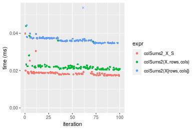

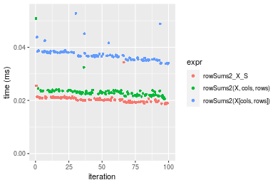
_Table: Benchmarking of colSums2_X_S() and rowSums2_X_S() on double+10x1000 data (original and transposed).  The top panel shows times in milliseconds and the bottom panel shows relative times._


|   |expr         |    min|      lq|     mean|  median|      uq|    max|
|:--|:------------|------:|-------:|--------:|-------:|-------:|------:|
|1  |colSums2_X_S | 17.197| 17.7610| 18.71455| 18.4275| 18.8005| 39.869|
|2  |rowSums2_X_S | 18.653| 19.5865| 20.46658| 20.2965| 20.9870| 34.385|


|   |expr         |      min|       lq|     mean|   median|     uq|       max|
|:--|:------------|--------:|--------:|--------:|--------:|------:|---------:|
|1  |colSums2_X_S | 1.000000| 1.000000| 1.000000| 1.000000| 1.0000| 1.0000000|
|2  |rowSums2_X_S | 1.084666| 1.102781| 1.093619| 1.101425| 1.1163| 0.8624495|

_Figure: Benchmarking of colSums2_X_S() and rowSums2_X_S() on double+10x1000 data (original and transposed).  Outliers are displayed as crosses. Times are in milliseconds._


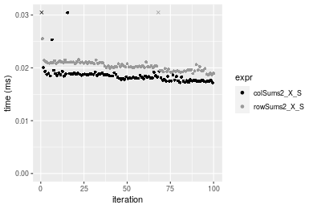

#### 100x1000 double matrix

```r
> X <- data[["100x1000"]]
> rows <- sample.int(nrow(X), size = nrow(X) * 0.7)
> cols <- sample.int(ncol(X), size = ncol(X) * 0.7)
> X_S <- X[rows, cols]
> gc()
           used  (Mb) gc trigger  (Mb) max used  (Mb)
Ncells  5290583 282.6    8529671 455.6  8529671 455.6
Vcells 10274172  78.4   31876688 243.2 60562128 462.1
> colStats <- microbenchmark(colSums2_X_S = colSums2(X_S, na.rm = FALSE), `colSums2(X, rows, cols)` = colSums2(X, 
+     rows = rows, cols = cols, na.rm = FALSE), `colSums2(X[rows, cols])` = colSums2(X[rows, cols], 
+     na.rm = FALSE), unit = "ms")
> X <- t(X)
> X_S <- t(X_S)
> gc()
           used  (Mb) gc trigger  (Mb) max used  (Mb)
Ncells  5290559 282.6    8529671 455.6  8529671 455.6
Vcells 10374225  79.2   31876688 243.2 60562128 462.1
> rowStats <- microbenchmark(rowSums2_X_S = rowSums2(X_S, na.rm = FALSE), `rowSums2(X, cols, rows)` = rowSums2(X, 
+     rows = cols, cols = rows, na.rm = FALSE), `rowSums2(X[cols, rows])` = rowSums2(X[cols, rows], 
+     na.rm = FALSE), unit = "ms")
```

_Table: Benchmarking of colSums2_X_S(), colSums2(X, rows, cols)() and colSums2(X[rows, cols])() on double+100x1000 data. The top panel shows times in milliseconds and the bottom panel shows relative times._


|   |expr                    |      min|        lq|      mean|    median|        uq|      max|
|:--|:-----------------------|--------:|---------:|---------:|---------:|---------:|--------:|
|1  |colSums2_X_S            | 0.082150| 0.0891475| 0.0984617| 0.0958520| 0.1064345| 0.151089|
|2  |colSums2(X, rows, cols) | 0.098723| 0.1078495| 0.1185189| 0.1152575| 0.1288060| 0.231682|
|3  |colSums2(X[rows, cols]) | 0.184326| 0.2030820| 0.2248919| 0.2203770| 0.2389465| 0.287071|


|   |expr                    |      min|       lq|     mean|   median|      uq|      max|
|:--|:-----------------------|--------:|--------:|--------:|--------:|-------:|--------:|
|1  |colSums2_X_S            | 1.000000| 1.000000| 1.000000| 1.000000| 1.00000| 1.000000|
|2  |colSums2(X, rows, cols) | 1.201741| 1.209787| 1.203705| 1.202453| 1.21019| 1.533414|
|3  |colSums2(X[rows, cols]) | 2.243774| 2.278045| 2.284054| 2.299138| 2.24501| 1.900013|

_Table: Benchmarking of rowSums2_X_S(), rowSums2(X, cols, rows)() and rowSums2(X[cols, rows])() on double+100x1000 data (transposed). The top panel shows times in milliseconds and the bottom panel shows relative times._


|   |expr                    |      min|        lq|      mean|    median|        uq|      max|
|:--|:-----------------------|--------:|---------:|---------:|---------:|---------:|--------:|
|1  |rowSums2_X_S            | 0.095770| 0.1044975| 0.1169481| 0.1134175| 0.1237400| 0.242178|
|2  |rowSums2(X, cols, rows) | 0.113031| 0.1197200| 0.1330936| 0.1284435| 0.1399495| 0.273980|
|3  |rowSums2(X[cols, rows]) | 0.197424| 0.2228225| 0.2452317| 0.2382315| 0.2621650| 0.347064|


|   |expr                    |      min|       lq|     mean|   median|       uq|      max|
|:--|:-----------------------|--------:|--------:|--------:|--------:|--------:|--------:|
|1  |rowSums2_X_S            | 1.000000| 1.000000| 1.000000| 1.000000| 1.000000| 1.000000|
|2  |rowSums2(X, cols, rows) | 1.180234| 1.145673| 1.138057| 1.132484| 1.130996| 1.131317|
|3  |rowSums2(X[cols, rows]) | 2.061439| 2.132324| 2.096928| 2.100483| 2.118676| 1.433095|

_Figure: Benchmarking of colSums2_X_S(), colSums2(X, rows, cols)() and colSums2(X[rows, cols])() on double+100x1000 data  as well as rowSums2_X_S(), rowSums2(X, cols, rows)() and rowSums2(X[cols, rows])() on the same data transposed.  Outliers are displayed as crosses.  Times are in milliseconds._


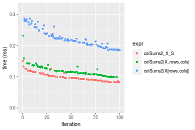

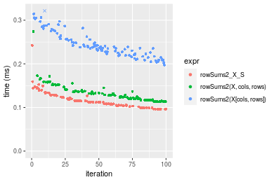
_Table: Benchmarking of colSums2_X_S() and rowSums2_X_S() on double+100x1000 data (original and transposed).  The top panel shows times in milliseconds and the bottom panel shows relative times._


|   |expr         |   min|       lq|      mean|   median|       uq|     max|
|:--|:------------|-----:|--------:|---------:|--------:|--------:|-------:|
|1  |colSums2_X_S | 82.15|  89.1475|  98.46174|  95.8520| 106.4345| 151.089|
|2  |rowSums2_X_S | 95.77| 104.4975| 116.94810| 113.4175| 123.7400| 242.178|


|   |expr         |      min|       lq|     mean|   median|       uq|      max|
|:--|:------------|--------:|--------:|--------:|--------:|--------:|--------:|
|1  |colSums2_X_S | 1.000000| 1.000000| 1.000000| 1.000000| 1.000000| 1.000000|
|2  |rowSums2_X_S | 1.165794| 1.172187| 1.187752| 1.183256| 1.162593| 1.602883|

_Figure: Benchmarking of colSums2_X_S() and rowSums2_X_S() on double+100x1000 data (original and transposed).  Outliers are displayed as crosses. Times are in milliseconds._


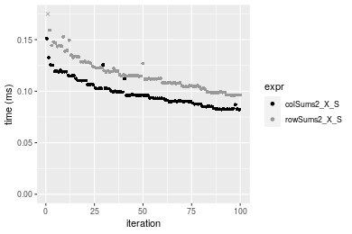

#### 1000x100 double matrix

```r
> X <- data[["1000x100"]]
> rows <- sample.int(nrow(X), size = nrow(X) * 0.7)
> cols <- sample.int(ncol(X), size = ncol(X) * 0.7)
> X_S <- X[rows, cols]
> gc()
           used  (Mb) gc trigger  (Mb) max used  (Mb)
Ncells  5290796 282.6    8529671 455.6  8529671 455.6
Vcells 10274316  78.4   31876688 243.2 60562128 462.1
> colStats <- microbenchmark(colSums2_X_S = colSums2(X_S, na.rm = FALSE), `colSums2(X, rows, cols)` = colSums2(X, 
+     rows = rows, cols = cols, na.rm = FALSE), `colSums2(X[rows, cols])` = colSums2(X[rows, cols], 
+     na.rm = FALSE), unit = "ms")
> X <- t(X)
> X_S <- t(X_S)
> gc()
           used  (Mb) gc trigger  (Mb) max used  (Mb)
Ncells  5290772 282.6    8529671 455.6  8529671 455.6
Vcells 10374369  79.2   31876688 243.2 60562128 462.1
> rowStats <- microbenchmark(rowSums2_X_S = rowSums2(X_S, na.rm = FALSE), `rowSums2(X, cols, rows)` = rowSums2(X, 
+     rows = cols, cols = rows, na.rm = FALSE), `rowSums2(X[cols, rows])` = rowSums2(X[cols, rows], 
+     na.rm = FALSE), unit = "ms")
```

_Table: Benchmarking of colSums2_X_S(), colSums2(X, rows, cols)() and colSums2(X[rows, cols])() on double+1000x100 data. The top panel shows times in milliseconds and the bottom panel shows relative times._


|   |expr                    |      min|        lq|      mean|    median|        uq|     max|
|:--|:-----------------------|--------:|---------:|---------:|---------:|---------:|-------:|
|1  |colSums2_X_S            | 0.071943| 0.0808235| 0.0862944| 0.0835675| 0.0902290| 0.13222|
|2  |colSums2(X, rows, cols) | 0.090710| 0.1012370| 0.1101146| 0.1069040| 0.1127460| 0.15762|
|3  |colSums2(X[rows, cols]) | 0.173366| 0.1920180| 0.2122097| 0.2074070| 0.2307825| 0.35383|


|   |expr                    |      min|       lq|     mean|   median|       uq|      max|
|:--|:-----------------------|--------:|--------:|--------:|--------:|--------:|--------:|
|1  |colSums2_X_S            | 1.000000| 1.000000| 1.000000| 1.000000| 1.000000| 1.000000|
|2  |colSums2(X, rows, cols) | 1.260859| 1.252569| 1.276035| 1.279253| 1.249554| 1.192104|
|3  |colSums2(X[rows, cols]) | 2.409769| 2.375769| 2.459138| 2.481910| 2.557742| 2.676070|

_Table: Benchmarking of rowSums2_X_S(), rowSums2(X, cols, rows)() and rowSums2(X[cols, rows])() on double+1000x100 data (transposed). The top panel shows times in milliseconds and the bottom panel shows relative times._


|   |expr                    |      min|        lq|      mean|   median|        uq|      max|
|:--|:-----------------------|--------:|---------:|---------:|--------:|---------:|--------:|
|1  |rowSums2_X_S            | 0.088471| 0.0950455| 0.1063684| 0.104245| 0.1147050| 0.193939|
|2  |rowSums2(X, cols, rows) | 0.108314| 0.1162975| 0.1309940| 0.126496| 0.1359865| 0.301330|
|3  |rowSums2(X[cols, rows]) | 0.193556| 0.2104240| 0.2348916| 0.231311| 0.2525090| 0.305308|


|   |expr                    |      min|       lq|     mean|   median|       uq|      max|
|:--|:-----------------------|--------:|--------:|--------:|--------:|--------:|--------:|
|1  |rowSums2_X_S            | 1.000000| 1.000000| 1.000000| 1.000000| 1.000000| 1.000000|
|2  |rowSums2(X, cols, rows) | 1.224288| 1.223598| 1.231512| 1.213449| 1.185533| 1.553736|
|3  |rowSums2(X[cols, rows]) | 2.187790| 2.213929| 2.208283| 2.218917| 2.201377| 1.574248|

_Figure: Benchmarking of colSums2_X_S(), colSums2(X, rows, cols)() and colSums2(X[rows, cols])() on double+1000x100 data  as well as rowSums2_X_S(), rowSums2(X, cols, rows)() and rowSums2(X[cols, rows])() on the same data transposed.  Outliers are displayed as crosses.  Times are in milliseconds._


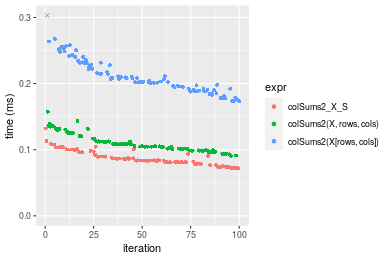

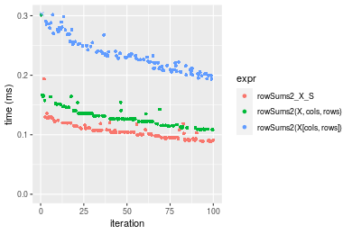
_Table: Benchmarking of colSums2_X_S() and rowSums2_X_S() on double+1000x100 data (original and transposed).  The top panel shows times in milliseconds and the bottom panel shows relative times._


|   |expr         |    min|      lq|      mean|   median|      uq|     max|
|:--|:------------|------:|-------:|---------:|--------:|-------:|-------:|
|1  |colSums2_X_S | 71.943| 80.8235|  86.29435|  83.5675|  90.229| 132.220|
|2  |rowSums2_X_S | 88.471| 95.0455| 106.36845| 104.2450| 114.705| 193.939|


|   |expr         |      min|       lq|     mean|   median|       uq|     max|
|:--|:------------|--------:|--------:|--------:|--------:|--------:|-------:|
|1  |colSums2_X_S | 1.000000| 1.000000| 1.000000| 1.000000| 1.000000| 1.00000|
|2  |rowSums2_X_S | 1.229737| 1.175964| 1.232624| 1.247435| 1.271265| 1.46679|

_Figure: Benchmarking of colSums2_X_S() and rowSums2_X_S() on double+1000x100 data (original and transposed).  Outliers are displayed as crosses. Times are in milliseconds._


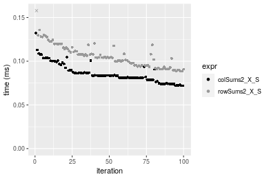


## Appendix

### Session information
```r
R version 4.1.1 Patched (2021-08-10 r80727)
Platform: x86_64-pc-linux-gnu (64-bit)
Running under: Ubuntu 18.04.5 LTS

Matrix products: default
BLAS:   /home/hb/software/R-devel/R-4-1-branch/lib/R/lib/libRblas.so
LAPACK: /home/hb/software/R-devel/R-4-1-branch/lib/R/lib/libRlapack.so

locale:
 [1] LC_CTYPE=en_US.UTF-8       LC_NUMERIC=C              
 [3] LC_TIME=en_US.UTF-8        LC_COLLATE=en_US.UTF-8    
 [5] LC_MONETARY=en_US.UTF-8    LC_MESSAGES=en_US.UTF-8   
 [7] LC_PAPER=en_US.UTF-8       LC_NAME=C                 
 [9] LC_ADDRESS=C               LC_TELEPHONE=C            
[11] LC_MEASUREMENT=en_US.UTF-8 LC_IDENTIFICATION=C       

attached base packages:
[1] stats     graphics  grDevices utils     datasets  methods   base     

other attached packages:
[1] microbenchmark_1.4-7   matrixStats_0.60.1     ggplot2_3.3.5         
[4] knitr_1.33             R.devices_2.17.0       R.utils_2.10.1        
[7] R.oo_1.24.0            R.methodsS3_1.8.1-9001 history_0.0.1-9000    

loaded via a namespace (and not attached):
 [1] Biobase_2.52.0          httr_1.4.2              splines_4.1.1          
 [4] bit64_4.0.5             network_1.17.1          assertthat_0.2.1       
 [7] highr_0.9               stats4_4.1.1            blob_1.2.2             
[10] GenomeInfoDbData_1.2.6  robustbase_0.93-8       pillar_1.6.2           
[13] RSQLite_2.2.8           lattice_0.20-44         glue_1.4.2             
[16] digest_0.6.27           XVector_0.32.0          colorspace_2.0-2       
[19] Matrix_1.3-4            XML_3.99-0.7            pkgconfig_2.0.3        
[22] zlibbioc_1.38.0         genefilter_1.74.0       purrr_0.3.4            
[25] ergm_4.1.2              xtable_1.8-4            scales_1.1.1           
[28] tibble_3.1.4            annotate_1.70.0         KEGGREST_1.32.0        
[31] farver_2.1.0            generics_0.1.0          IRanges_2.26.0         
[34] ellipsis_0.3.2          cachem_1.0.6            withr_2.4.2            
[37] BiocGenerics_0.38.0     mime_0.11               survival_3.2-13        
[40] magrittr_2.0.1          crayon_1.4.1            statnet.common_4.5.0   
[43] memoise_2.0.0           laeken_0.5.1            fansi_0.5.0            
[46] R.cache_0.15.0          MASS_7.3-54             R.rsp_0.44.0           
[49] progressr_0.8.0         tools_4.1.1             lifecycle_1.0.0        
[52] S4Vectors_0.30.0        trust_0.1-8             munsell_0.5.0          
[55] tabby_0.0.1-9001        AnnotationDbi_1.54.1    Biostrings_2.60.2      
[58] compiler_4.1.1          GenomeInfoDb_1.28.1     rlang_0.4.11           
[61] grid_4.1.1              RCurl_1.98-1.4          cwhmisc_6.6            
[64] rappdirs_0.3.3          startup_0.15.0          labeling_0.4.2         
[67] bitops_1.0-7            base64enc_0.1-3         boot_1.3-28            
[70] gtable_0.3.0            DBI_1.1.1               markdown_1.1           
[73] R6_2.5.1                lpSolveAPI_5.5.2.0-17.7 rle_0.9.2              
[76] dplyr_1.0.7             fastmap_1.1.0           bit_4.0.4              
[79] utf8_1.2.2              parallel_4.1.1          Rcpp_1.0.7             
[82] vctrs_0.3.8             png_0.1-7               DEoptimR_1.0-9         
[85] tidyselect_1.1.1        xfun_0.25               coda_0.19-4            
```
Total processing time was 23.11 secs.


### Reproducibility
To reproduce this report, do:
```r
html <- matrixStats:::benchmark('colRowSums2_subset')
```

[RSP]: https://cran.r-project.org/package=R.rsp
[matrixStats]: https://cran.r-project.org/package=matrixStats

[StackOverflow:colMins?]: https://stackoverflow.com/questions/13676878 "Stack Overflow: fastest way to get Min from every column in a matrix?"
[StackOverflow:colSds?]: https://stackoverflow.com/questions/17549762 "Stack Overflow: Is there such 'colsd' in R?"
[StackOverflow:rowProds?]: https://stackoverflow.com/questions/20198801/ "Stack Overflow: Row product of matrix and column sum of matrix"

---------------------------------------
Copyright Henrik Bengtsson. Last updated on 2021-08-25 19:09:06 (+0200 UTC). Powered by [RSP].

<script>
 var link = document.createElement('link');
 link.rel = 'icon';
 link.href = "data:image/png;base64,iVBORw0KGgoAAAANSUhEUgAAACAAAAAgCAMAAABEpIrGAAAA21BMVEUAAAAAAP8AAP8AAP8AAP8AAP8AAP8AAP8AAP8AAP8AAP8AAP8AAP8AAP8AAP8AAP8AAP8AAP8AAP8AAP8AAP8AAP8AAP8AAP8AAP8AAP8AAP8AAP8AAP8AAP8AAP8AAP8AAP8AAP8AAP8AAP8AAP8AAP8AAP8AAP8AAP8AAP8BAf4CAv0DA/wdHeIeHuEfH+AgIN8hId4lJdomJtknJ9g+PsE/P8BAQL9yco10dIt1dYp3d4h4eIeVlWqWlmmXl2iYmGeZmWabm2Tn5xjo6Bfp6Rb39wj4+Af//wA2M9hbAAAASXRSTlMAAQIJCgsMJSYnKD4/QGRlZmhpamtsbautrrCxuru8y8zN5ebn6Pn6+///////////////////////////////////////////LsUNcQAAAS9JREFUOI29k21XgkAQhVcFytdSMqMETU26UVqGmpaiFbL//xc1cAhhwVNf6n5i5z67M2dmYOyfJZUqlVLhkKucG7cgmUZTybDz6g0iDeq51PUr37Ds2cy2/C9NeES5puDjxuUk1xnToZsg8pfA3avHQ3lLIi7iWRrkv/OYtkScxBIMgDee0ALoyxHQBJ68JLCjOtQIMIANF7QG9G9fNnHvisCHBVMKgSJgiz7nE+AoBKrAPA3MgepvgR9TSCasrCKH0eB1wBGBFdCO+nAGjMVGPcQb5bd6mQRegN6+1axOs9nGfYcCtfi4NQosdtH7dB+txFIpXQqN1p9B/asRHToyS0jRgpV7nk4nwcq1BJ+x3Gl/v7S9Wmpp/aGquum7w3ZDyrADFYrl8vHBH+ev9AUASW1dmU4h4wAAAABJRU5ErkJggg=="
 document.getElementsByTagName('head')[0].appendChild(link);
</script>

