[matrixStats]: Benchmark report

---------------------------------------


# colTabulates() and rowTabulates() benchmarks on subsetted computation

This report benchmark the performance of colTabulates() and rowTabulates() on subsetted computation.


## Data
```r
> rmatrix <- function(nrow, ncol, mode = c("logical", "double", "integer", "index"), range = c(-100, 
+     +100), na_prob = 0) {
+     mode <- match.arg(mode)
+     n <- nrow * ncol
+     if (mode == "logical") {
+         x <- sample(c(FALSE, TRUE), size = n, replace = TRUE)
+     }     else if (mode == "index") {
+         x <- seq_len(n)
+         mode <- "integer"
+     }     else {
+         x <- runif(n, min = range[1], max = range[2])
+     }
+     storage.mode(x) <- mode
+     if (na_prob > 0) 
+         x[sample(n, size = na_prob * n)] <- NA
+     dim(x) <- c(nrow, ncol)
+     x
+ }
> rmatrices <- function(scale = 10, seed = 1, ...) {
+     set.seed(seed)
+     data <- list()
+     data[[1]] <- rmatrix(nrow = scale * 1, ncol = scale * 1, ...)
+     data[[2]] <- rmatrix(nrow = scale * 10, ncol = scale * 10, ...)
+     data[[3]] <- rmatrix(nrow = scale * 100, ncol = scale * 1, ...)
+     data[[4]] <- t(data[[3]])
+     data[[5]] <- rmatrix(nrow = scale * 10, ncol = scale * 100, ...)
+     data[[6]] <- t(data[[5]])
+     names(data) <- sapply(data, FUN = function(x) paste(dim(x), collapse = "x"))
+     data
+ }
> data <- rmatrices(mode = "integer", range = c(-10, 10))
```

## Results

### 10x10 matrix


```r
> X <- data[["10x10"]]
> rows <- sample.int(nrow(X), size = nrow(X) * 0.7)
> cols <- sample.int(ncol(X), size = ncol(X) * 0.7)
> X_S <- X[rows, cols]
> gc()
           used  (Mb) gc trigger  (Mb) max used  (Mb)
Ncells  5307356 283.5    8529671 455.6  8529671 455.6
Vcells 10520452  80.3   31876688 243.2 60562128 462.1
> colStats <- microbenchmark(colTabulates_X_S = colTabulates(X_S, na.rm = FALSE), `colTabulates(X, rows, cols)` = colTabulates(X, 
+     rows = rows, cols = cols, na.rm = FALSE), `colTabulates(X[rows, cols])` = colTabulates(X[rows, 
+     cols], na.rm = FALSE), unit = "ms")
> X <- t(X)
> X_S <- t(X_S)
> gc()
           used  (Mb) gc trigger  (Mb) max used  (Mb)
Ncells  5298014 283.0    8529671 455.6  8529671 455.6
Vcells 10489498  80.1   31876688 243.2 60562128 462.1
> rowStats <- microbenchmark(rowTabulates_X_S = rowTabulates(X_S, na.rm = FALSE), `rowTabulates(X, cols, rows)` = rowTabulates(X, 
+     rows = cols, cols = rows, na.rm = FALSE), `rowTabulates(X[cols, rows])` = rowTabulates(X[cols, 
+     rows], na.rm = FALSE), unit = "ms")
```

_Table: Benchmarking of colTabulates_X_S(), colTabulates(X, rows, cols)() and colTabulates(X[rows, cols])() on 10x10 data. The top panel shows times in milliseconds and the bottom panel shows relative times._


|   |expr                        |      min|        lq|      mean|   median|        uq|      max|
|:--|:---------------------------|--------:|---------:|---------:|--------:|---------:|--------:|
|3  |colTabulates(X[rows, cols]) | 0.146006| 0.1549780| 0.1743222| 0.169301| 0.1861495| 0.245342|
|2  |colTabulates(X, rows, cols) | 0.144400| 0.1566310| 0.1789456| 0.174054| 0.1905680| 0.252232|
|1  |colTabulates_X_S            | 0.145334| 0.1565155| 0.1817853| 0.177237| 0.1906800| 0.648597|


|   |expr                        |       min|       lq|     mean|   median|       uq|      max|
|:--|:---------------------------|---------:|--------:|--------:|--------:|--------:|--------:|
|3  |colTabulates(X[rows, cols]) | 1.0000000| 1.000000| 1.000000| 1.000000| 1.000000| 1.000000|
|2  |colTabulates(X, rows, cols) | 0.9890005| 1.010666| 1.026522| 1.028074| 1.023736| 1.028083|
|1  |colTabulates_X_S            | 0.9953974| 1.009921| 1.042812| 1.046875| 1.024338| 2.643644|

_Table: Benchmarking of rowTabulates_X_S(), rowTabulates(X, cols, rows)() and rowTabulates(X[cols, rows])() on 10x10 data (transposed). The top panel shows times in milliseconds and the bottom panel shows relative times._


|   |expr                        |      min|        lq|      mean|    median|        uq|      max|
|:--|:---------------------------|--------:|---------:|---------:|---------:|---------:|--------:|
|3  |rowTabulates(X[cols, rows]) | 0.133789| 0.1449595| 0.1585527| 0.1565320| 0.1667900| 0.206230|
|2  |rowTabulates(X, cols, rows) | 0.133759| 0.1442980| 0.1694581| 0.1612490| 0.1778005| 0.686733|
|1  |rowTabulates_X_S            | 0.132664| 0.1423310| 0.1640924| 0.1619795| 0.1810535| 0.236404|


|   |expr                        |       min|        lq|     mean|   median|       uq|      max|
|:--|:---------------------------|---------:|---------:|--------:|--------:|--------:|--------:|
|3  |rowTabulates(X[cols, rows]) | 1.0000000| 1.0000000| 1.000000| 1.000000| 1.000000| 1.000000|
|2  |rowTabulates(X, cols, rows) | 0.9997758| 0.9954367| 1.068781| 1.030134| 1.066014| 3.329937|
|1  |rowTabulates_X_S            | 0.9915912| 0.9818673| 1.034939| 1.034801| 1.085518| 1.146312|

_Figure: Benchmarking of colTabulates_X_S(), colTabulates(X, rows, cols)() and colTabulates(X[rows, cols])() on 10x10 data  as well as rowTabulates_X_S(), rowTabulates(X, cols, rows)() and rowTabulates(X[cols, rows])() on the same data transposed.  Outliers are displayed as crosses.  Times are in milliseconds._


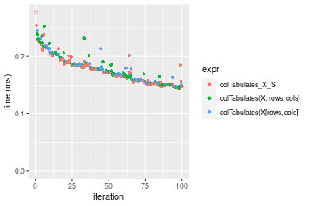

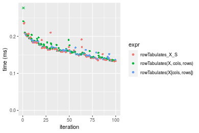
_Table: Benchmarking of colTabulates_X_S() and rowTabulates_X_S() on 10x10 data (original and transposed).  The top panel shows times in milliseconds and the bottom panel shows relative times._


|   |expr             |     min|       lq|     mean|   median|       uq|     max|
|:--|:----------------|-------:|--------:|--------:|--------:|--------:|-------:|
|2  |rowTabulates_X_S | 132.664| 142.3310| 164.0924| 161.9795| 181.0535| 236.404|
|1  |colTabulates_X_S | 145.334| 156.5155| 181.7853| 177.2370| 190.6800| 648.597|


|   |expr             |      min|       lq|     mean|   median|       uq|      max|
|:--|:----------------|--------:|--------:|--------:|--------:|--------:|--------:|
|2  |rowTabulates_X_S | 1.000000| 1.000000| 1.000000| 1.000000| 1.000000| 1.000000|
|1  |colTabulates_X_S | 1.095504| 1.099659| 1.107823| 1.094194| 1.053169| 2.743596|

_Figure: Benchmarking of colTabulates_X_S() and rowTabulates_X_S() on 10x10 data (original and transposed).  Outliers are displayed as crosses. Times are in milliseconds._


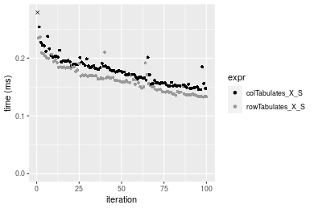

### 100x100 matrix


```r
> X <- data[["100x100"]]
> rows <- sample.int(nrow(X), size = nrow(X) * 0.7)
> cols <- sample.int(ncol(X), size = ncol(X) * 0.7)
> X_S <- X[rows, cols]
> gc()
           used  (Mb) gc trigger  (Mb) max used  (Mb)
Ncells  5297057 282.9    8529671 455.6  8529671 455.6
Vcells 10158796  77.6   31876688 243.2 60562128 462.1
> colStats <- microbenchmark(colTabulates_X_S = colTabulates(X_S, na.rm = FALSE), `colTabulates(X, rows, cols)` = colTabulates(X, 
+     rows = rows, cols = cols, na.rm = FALSE), `colTabulates(X[rows, cols])` = colTabulates(X[rows, 
+     cols], na.rm = FALSE), unit = "ms")
> X <- t(X)
> X_S <- t(X_S)
> gc()
           used  (Mb) gc trigger  (Mb) max used  (Mb)
Ncells  5297051 282.9    8529671 455.6  8529671 455.6
Vcells 10163879  77.6   31876688 243.2 60562128 462.1
> rowStats <- microbenchmark(rowTabulates_X_S = rowTabulates(X_S, na.rm = FALSE), `rowTabulates(X, cols, rows)` = rowTabulates(X, 
+     rows = cols, cols = rows, na.rm = FALSE), `rowTabulates(X[cols, rows])` = rowTabulates(X[cols, 
+     rows], na.rm = FALSE), unit = "ms")
```

_Table: Benchmarking of colTabulates_X_S(), colTabulates(X, rows, cols)() and colTabulates(X[rows, cols])() on 100x100 data. The top panel shows times in milliseconds and the bottom panel shows relative times._


|   |expr                        |      min|        lq|      mean|    median|        uq|      max|
|:--|:---------------------------|--------:|---------:|---------:|---------:|---------:|--------:|
|1  |colTabulates_X_S            | 0.528188| 0.5343465| 0.6145483| 0.5581070| 0.6305655| 1.308660|
|2  |colTabulates(X, rows, cols) | 0.533623| 0.5428890| 0.6091560| 0.5665730| 0.5977135| 1.226304|
|3  |colTabulates(X[rows, cols]) | 0.536044| 0.5494590| 0.6072853| 0.5683125| 0.6354870| 1.047434|


|   |expr                        |      min|       lq|      mean|   median|        uq|       max|
|:--|:---------------------------|--------:|--------:|---------:|--------:|---------:|---------:|
|1  |colTabulates_X_S            | 1.000000| 1.000000| 1.0000000| 1.000000| 1.0000000| 1.0000000|
|2  |colTabulates(X, rows, cols) | 1.010290| 1.015987| 0.9912256| 1.015169| 0.9479007| 0.9370685|
|3  |colTabulates(X[rows, cols]) | 1.014873| 1.028282| 0.9881816| 1.018286| 1.0078049| 0.8003867|

_Table: Benchmarking of rowTabulates_X_S(), rowTabulates(X, cols, rows)() and rowTabulates(X[cols, rows])() on 100x100 data (transposed). The top panel shows times in milliseconds and the bottom panel shows relative times._


|   |expr                        |      min|        lq|      mean|    median|        uq|      max|
|:--|:---------------------------|--------:|---------:|---------:|---------:|---------:|--------:|
|1  |rowTabulates_X_S            | 0.445811| 0.4591320| 0.5126705| 0.4844505| 0.5325675| 0.757621|
|3  |rowTabulates(X[cols, rows]) | 0.453302| 0.4667415| 0.5072105| 0.4896350| 0.5136450| 0.821060|
|2  |rowTabulates(X, cols, rows) | 0.454507| 0.4664980| 0.5144699| 0.4929205| 0.5136540| 0.908380|


|   |expr                        |      min|       lq|      mean|   median|        uq|      max|
|:--|:---------------------------|--------:|--------:|---------:|--------:|---------:|--------:|
|1  |rowTabulates_X_S            | 1.000000| 1.000000| 1.0000000| 1.000000| 1.0000000| 1.000000|
|3  |rowTabulates(X[cols, rows]) | 1.016803| 1.016574| 0.9893498| 1.010702| 0.9644693| 1.083735|
|2  |rowTabulates(X, cols, rows) | 1.019506| 1.016043| 1.0035098| 1.017484| 0.9644862| 1.198990|

_Figure: Benchmarking of colTabulates_X_S(), colTabulates(X, rows, cols)() and colTabulates(X[rows, cols])() on 100x100 data  as well as rowTabulates_X_S(), rowTabulates(X, cols, rows)() and rowTabulates(X[cols, rows])() on the same data transposed.  Outliers are displayed as crosses.  Times are in milliseconds._


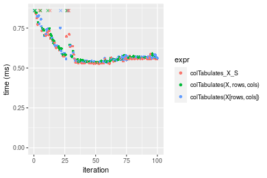

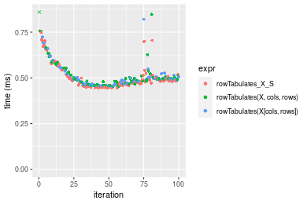
_Table: Benchmarking of colTabulates_X_S() and rowTabulates_X_S() on 100x100 data (original and transposed).  The top panel shows times in milliseconds and the bottom panel shows relative times._


|   |expr             |     min|       lq|     mean|   median|       uq|      max|
|:--|:----------------|-------:|--------:|--------:|--------:|--------:|--------:|
|2  |rowTabulates_X_S | 445.811| 459.1320| 512.6705| 484.4505| 532.5675|  757.621|
|1  |colTabulates_X_S | 528.188| 534.3465| 614.5483| 558.1070| 630.5655| 1308.660|


|   |expr             |     min|       lq|    mean|   median|       uq|      max|
|:--|:----------------|-------:|--------:|-------:|--------:|--------:|--------:|
|2  |rowTabulates_X_S | 1.00000| 1.000000| 1.00000| 1.000000| 1.000000| 1.000000|
|1  |colTabulates_X_S | 1.18478| 1.163819| 1.19872| 1.152041| 1.184011| 1.727328|

_Figure: Benchmarking of colTabulates_X_S() and rowTabulates_X_S() on 100x100 data (original and transposed).  Outliers are displayed as crosses. Times are in milliseconds._


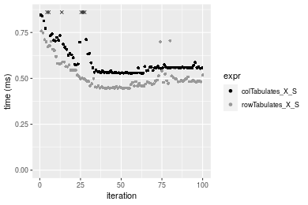

### 1000x10 matrix


```r
> X <- data[["1000x10"]]
> rows <- sample.int(nrow(X), size = nrow(X) * 0.7)
> cols <- sample.int(ncol(X), size = ncol(X) * 0.7)
> X_S <- X[rows, cols]
> gc()
           used  (Mb) gc trigger  (Mb) max used  (Mb)
Ncells  5297799 283.0    8529671 455.6  8529671 455.6
Vcells 10162844  77.6   31876688 243.2 60562128 462.1
> colStats <- microbenchmark(colTabulates_X_S = colTabulates(X_S, na.rm = FALSE), `colTabulates(X, rows, cols)` = colTabulates(X, 
+     rows = rows, cols = cols, na.rm = FALSE), `colTabulates(X[rows, cols])` = colTabulates(X[rows, 
+     cols], na.rm = FALSE), unit = "ms")
> X <- t(X)
> X_S <- t(X_S)
> gc()
           used  (Mb) gc trigger  (Mb) max used  (Mb)
Ncells  5297793 283.0    8529671 455.6  8529671 455.6
Vcells 10167927  77.6   31876688 243.2 60562128 462.1
> rowStats <- microbenchmark(rowTabulates_X_S = rowTabulates(X_S, na.rm = FALSE), `rowTabulates(X, cols, rows)` = rowTabulates(X, 
+     rows = cols, cols = rows, na.rm = FALSE), `rowTabulates(X[cols, rows])` = rowTabulates(X[cols, 
+     rows], na.rm = FALSE), unit = "ms")
```

_Table: Benchmarking of colTabulates_X_S(), colTabulates(X, rows, cols)() and colTabulates(X[rows, cols])() on 1000x10 data. The top panel shows times in milliseconds and the bottom panel shows relative times._


|   |expr                        |      min|        lq|      mean|    median|       uq|      max|
|:--|:---------------------------|--------:|---------:|---------:|---------:|--------:|--------:|
|1  |colTabulates_X_S            | 0.501483| 0.5066535| 0.5491016| 0.5190530| 0.551030| 0.848530|
|2  |colTabulates(X, rows, cols) | 0.510913| 0.5170600| 0.5570209| 0.5354355| 0.555112| 0.861095|
|3  |colTabulates(X[rows, cols]) | 0.511303| 0.5180255| 0.5610530| 0.5410255| 0.556660| 0.992129|


|   |expr                        |      min|       lq|     mean|   median|       uq|      max|
|:--|:---------------------------|--------:|--------:|--------:|--------:|--------:|--------:|
|1  |colTabulates_X_S            | 1.000000| 1.000000| 1.000000| 1.000000| 1.000000| 1.000000|
|2  |colTabulates(X, rows, cols) | 1.018804| 1.020540| 1.014422| 1.031562| 1.007408| 1.014808|
|3  |colTabulates(X[rows, cols]) | 1.019582| 1.022445| 1.021765| 1.042332| 1.010217| 1.169233|

_Table: Benchmarking of rowTabulates_X_S(), rowTabulates(X, cols, rows)() and rowTabulates(X[cols, rows])() on 1000x10 data (transposed). The top panel shows times in milliseconds and the bottom panel shows relative times._


|   |expr                        |      min|       lq|      mean|    median|        uq|      max|
|:--|:---------------------------|--------:|--------:|---------:|---------:|---------:|--------:|
|1  |rowTabulates_X_S            | 0.453391| 0.468652| 0.5087078| 0.4862890| 0.5043310| 0.764466|
|3  |rowTabulates(X[cols, rows]) | 0.463655| 0.478666| 0.5153285| 0.5030950| 0.5172885| 0.913869|
|2  |rowTabulates(X, cols, rows) | 0.464519| 0.480394| 0.5176073| 0.5042245| 0.5305105| 0.735568|


|   |expr                        |      min|       lq|     mean|   median|       uq|       max|
|:--|:---------------------------|--------:|--------:|--------:|--------:|--------:|---------:|
|1  |rowTabulates_X_S            | 1.000000| 1.000000| 1.000000| 1.000000| 1.000000| 1.0000000|
|3  |rowTabulates(X[cols, rows]) | 1.022638| 1.021368| 1.013015| 1.034560| 1.025692| 1.1954345|
|2  |rowTabulates(X, cols, rows) | 1.024544| 1.025055| 1.017494| 1.036882| 1.051909| 0.9621984|

_Figure: Benchmarking of colTabulates_X_S(), colTabulates(X, rows, cols)() and colTabulates(X[rows, cols])() on 1000x10 data  as well as rowTabulates_X_S(), rowTabulates(X, cols, rows)() and rowTabulates(X[cols, rows])() on the same data transposed.  Outliers are displayed as crosses.  Times are in milliseconds._


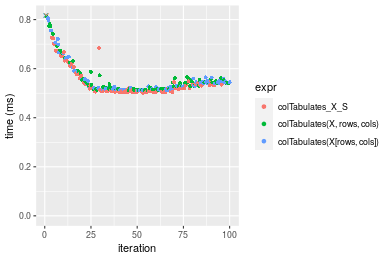

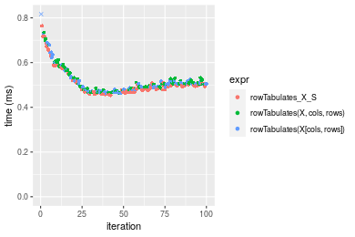
_Table: Benchmarking of colTabulates_X_S() and rowTabulates_X_S() on 1000x10 data (original and transposed).  The top panel shows times in milliseconds and the bottom panel shows relative times._


|   |expr             |     min|       lq|     mean|  median|      uq|     max|
|:--|:----------------|-------:|--------:|--------:|-------:|-------:|-------:|
|2  |rowTabulates_X_S | 453.391| 468.6520| 508.7078| 486.289| 504.331| 764.466|
|1  |colTabulates_X_S | 501.483| 506.6535| 549.1015| 519.053| 551.030| 848.530|


|   |expr             |      min|       lq|     mean|   median|       uq|      max|
|:--|:----------------|--------:|--------:|--------:|--------:|--------:|--------:|
|2  |rowTabulates_X_S | 1.000000| 1.000000| 1.000000| 1.000000| 1.000000| 1.000000|
|1  |colTabulates_X_S | 1.106072| 1.081087| 1.079405| 1.067376| 1.092596| 1.109964|

_Figure: Benchmarking of colTabulates_X_S() and rowTabulates_X_S() on 1000x10 data (original and transposed).  Outliers are displayed as crosses. Times are in milliseconds._


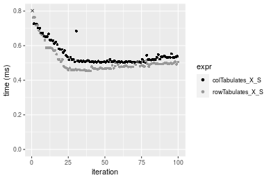

### 10x1000 matrix


```r
> X <- data[["10x1000"]]
> rows <- sample.int(nrow(X), size = nrow(X) * 0.7)
> cols <- sample.int(ncol(X), size = ncol(X) * 0.7)
> X_S <- X[rows, cols]
> gc()
           used  (Mb) gc trigger  (Mb) max used  (Mb)
Ncells  5298004 283.0    8529671 455.6  8529671 455.6
Vcells 10163780  77.6   31876688 243.2 60562128 462.1
> colStats <- microbenchmark(colTabulates_X_S = colTabulates(X_S, na.rm = FALSE), `colTabulates(X, rows, cols)` = colTabulates(X, 
+     rows = rows, cols = cols, na.rm = FALSE), `colTabulates(X[rows, cols])` = colTabulates(X[rows, 
+     cols], na.rm = FALSE), unit = "ms")
> X <- t(X)
> X_S <- t(X_S)
> gc()
           used  (Mb) gc trigger  (Mb) max used  (Mb)
Ncells  5297998 283.0    8529671 455.6  8529671 455.6
Vcells 10168863  77.6   31876688 243.2 60562128 462.1
> rowStats <- microbenchmark(rowTabulates_X_S = rowTabulates(X_S, na.rm = FALSE), `rowTabulates(X, cols, rows)` = rowTabulates(X, 
+     rows = cols, cols = rows, na.rm = FALSE), `rowTabulates(X[cols, rows])` = rowTabulates(X[cols, 
+     rows], na.rm = FALSE), unit = "ms")
```

_Table: Benchmarking of colTabulates_X_S(), colTabulates(X, rows, cols)() and colTabulates(X[rows, cols])() on 10x1000 data. The top panel shows times in milliseconds and the bottom panel shows relative times._


|   |expr                        |      min|        lq|      mean|    median|        uq|      max|
|:--|:---------------------------|--------:|---------:|---------:|---------:|---------:|--------:|
|1  |colTabulates_X_S            | 0.611864| 0.6200520| 0.6871486| 0.6483095| 0.6968915| 1.233566|
|3  |colTabulates(X[rows, cols]) | 0.622150| 0.6345035| 0.6781492| 0.6550675| 0.6753135| 0.984774|
|2  |colTabulates(X, rows, cols) | 0.622028| 0.6320235| 0.6826235| 0.6554835| 0.6736655| 1.017916|


|   |expr                        |      min|       lq|      mean|   median|        uq|       max|
|:--|:---------------------------|--------:|--------:|---------:|--------:|---------:|---------:|
|1  |colTabulates_X_S            | 1.000000| 1.000000| 1.0000000| 1.000000| 1.0000000| 1.0000000|
|3  |colTabulates(X[rows, cols]) | 1.016811| 1.023307| 0.9869032| 1.010424| 0.9690368| 0.7983148|
|2  |colTabulates(X, rows, cols) | 1.016612| 1.019307| 0.9934146| 1.011066| 0.9666720| 0.8251816|

_Table: Benchmarking of rowTabulates_X_S(), rowTabulates(X, cols, rows)() and rowTabulates(X[cols, rows])() on 10x1000 data (transposed). The top panel shows times in milliseconds and the bottom panel shows relative times._


|   |expr                        |      min|        lq|      mean|    median|        uq|      max|
|:--|:---------------------------|--------:|---------:|---------:|---------:|---------:|--------:|
|1  |rowTabulates_X_S            | 0.476349| 0.5000910| 0.5320341| 0.5115125| 0.5340450| 0.796945|
|2  |rowTabulates(X, cols, rows) | 0.485997| 0.5019740| 0.5366940| 0.5225305| 0.5386760| 0.946350|
|3  |rowTabulates(X[cols, rows]) | 0.487954| 0.5100865| 0.5507011| 0.5254880| 0.5615825| 0.845808|


|   |expr                        |      min|       lq|     mean|   median|       uq|      max|
|:--|:---------------------------|--------:|--------:|--------:|--------:|--------:|--------:|
|1  |rowTabulates_X_S            | 1.000000| 1.000000| 1.000000| 1.000000| 1.000000| 1.000000|
|2  |rowTabulates(X, cols, rows) | 1.020254| 1.003765| 1.008759| 1.021540| 1.008672| 1.187472|
|3  |rowTabulates(X[cols, rows]) | 1.024362| 1.019987| 1.035086| 1.027322| 1.051564| 1.061313|

_Figure: Benchmarking of colTabulates_X_S(), colTabulates(X, rows, cols)() and colTabulates(X[rows, cols])() on 10x1000 data  as well as rowTabulates_X_S(), rowTabulates(X, cols, rows)() and rowTabulates(X[cols, rows])() on the same data transposed.  Outliers are displayed as crosses.  Times are in milliseconds._


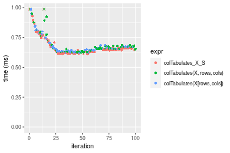

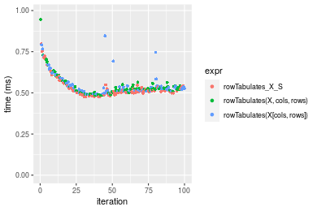
_Table: Benchmarking of colTabulates_X_S() and rowTabulates_X_S() on 10x1000 data (original and transposed).  The top panel shows times in milliseconds and the bottom panel shows relative times._


|   |expr             |     min|      lq|     mean|   median|       uq|      max|
|:--|:----------------|-------:|-------:|--------:|--------:|--------:|--------:|
|2  |rowTabulates_X_S | 476.349| 500.091| 532.0341| 511.5125| 534.0450|  796.945|
|1  |colTabulates_X_S | 611.864| 620.052| 687.1486| 648.3095| 696.8915| 1233.566|


|   |expr             |      min|       lq|    mean|   median|      uq|      max|
|:--|:----------------|--------:|--------:|-------:|--------:|-------:|--------:|
|2  |rowTabulates_X_S | 1.000000| 1.000000| 1.00000| 1.000000| 1.00000| 1.000000|
|1  |colTabulates_X_S | 1.284487| 1.239878| 1.29155| 1.267436| 1.30493| 1.547868|

_Figure: Benchmarking of colTabulates_X_S() and rowTabulates_X_S() on 10x1000 data (original and transposed).  Outliers are displayed as crosses. Times are in milliseconds._


### 100x1000 matrix


```r
> X <- data[["100x1000"]]
> rows <- sample.int(nrow(X), size = nrow(X) * 0.7)
> cols <- sample.int(ncol(X), size = ncol(X) * 0.7)
> X_S <- X[rows, cols]
> gc()
           used  (Mb) gc trigger  (Mb) max used  (Mb)
Ncells  5298214 283.0    8529671 455.6  8529671 455.6
Vcells 10186470  77.8   31876688 243.2 60562128 462.1
> colStats <- microbenchmark(colTabulates_X_S = colTabulates(X_S, na.rm = FALSE), `colTabulates(X, rows, cols)` = colTabulates(X, 
+     rows = rows, cols = cols, na.rm = FALSE), `colTabulates(X[rows, cols])` = colTabulates(X[rows, 
+     cols], na.rm = FALSE), unit = "ms")
> X <- t(X)
> X_S <- t(X_S)
> gc()
           used  (Mb) gc trigger  (Mb) max used  (Mb)
Ncells  5298208 283.0    8529671 455.6  8529671 455.6
Vcells 10236553  78.1   31876688 243.2 60562128 462.1
> rowStats <- microbenchmark(rowTabulates_X_S = rowTabulates(X_S, na.rm = FALSE), `rowTabulates(X, cols, rows)` = rowTabulates(X, 
+     rows = cols, cols = rows, na.rm = FALSE), `rowTabulates(X[cols, rows])` = rowTabulates(X[cols, 
+     rows], na.rm = FALSE), unit = "ms")
```

_Table: Benchmarking of colTabulates_X_S(), colTabulates(X, rows, cols)() and colTabulates(X[rows, cols])() on 100x1000 data. The top panel shows times in milliseconds and the bottom panel shows relative times._


|   |expr                        |      min|       lq|     mean|   median|       uq|       max|
|:--|:---------------------------|--------:|--------:|--------:|--------:|--------:|---------:|
|1  |colTabulates_X_S            | 3.762381| 3.985139| 4.100204| 4.073181| 4.099504|  5.993842|
|2  |colTabulates(X, rows, cols) | 3.850379| 4.058884| 4.182679| 4.157094| 4.210005|  5.607588|
|3  |colTabulates(X[rows, cols]) | 3.852800| 4.074469| 4.345094| 4.163357| 4.247120| 12.202858|


|   |expr                        |      min|       lq|     mean|   median|       uq|       max|
|:--|:---------------------------|--------:|--------:|--------:|--------:|--------:|---------:|
|1  |colTabulates_X_S            | 1.000000| 1.000000| 1.000000| 1.000000| 1.000000| 1.0000000|
|2  |colTabulates(X, rows, cols) | 1.023389| 1.018505| 1.020115| 1.020601| 1.026955| 0.9355582|
|3  |colTabulates(X[rows, cols]) | 1.024032| 1.022416| 1.059726| 1.022139| 1.036008| 2.0358992|

_Table: Benchmarking of rowTabulates_X_S(), rowTabulates(X, cols, rows)() and rowTabulates(X[cols, rows])() on 100x1000 data (transposed). The top panel shows times in milliseconds and the bottom panel shows relative times._


|   |expr                        |      min|       lq|     mean|   median|       uq|       max|
|:--|:---------------------------|--------:|--------:|--------:|--------:|--------:|---------:|
|1  |rowTabulates_X_S            | 3.018624| 3.341274| 3.391334| 3.357582| 3.420748|  4.855839|
|2  |rowTabulates(X, cols, rows) | 3.107347| 3.423090| 3.538556| 3.433946| 3.520802| 10.696302|
|3  |rowTabulates(X[cols, rows]) | 3.096200| 3.419147| 3.540977| 3.440817| 3.538847| 10.615653|


|   |expr                        |      min|       lq|     mean|   median|       uq|      max|
|:--|:---------------------------|--------:|--------:|--------:|--------:|--------:|--------:|
|1  |rowTabulates_X_S            | 1.000000| 1.000000| 1.000000| 1.000000| 1.000000| 1.000000|
|2  |rowTabulates(X, cols, rows) | 1.029392| 1.024487| 1.043411| 1.022744| 1.029249| 2.202771|
|3  |rowTabulates(X[cols, rows]) | 1.025699| 1.023306| 1.044125| 1.024790| 1.034524| 2.186163|

_Figure: Benchmarking of colTabulates_X_S(), colTabulates(X, rows, cols)() and colTabulates(X[rows, cols])() on 100x1000 data  as well as rowTabulates_X_S(), rowTabulates(X, cols, rows)() and rowTabulates(X[cols, rows])() on the same data transposed.  Outliers are displayed as crosses.  Times are in milliseconds._


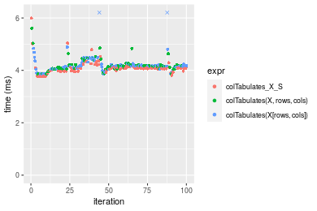

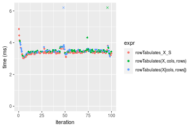
_Table: Benchmarking of colTabulates_X_S() and rowTabulates_X_S() on 100x1000 data (original and transposed).  The top panel shows times in milliseconds and the bottom panel shows relative times._


|   |expr             |      min|       lq|     mean|   median|       uq|      max|
|:--|:----------------|--------:|--------:|--------:|--------:|--------:|--------:|
|2  |rowTabulates_X_S | 3.018624| 3.341274| 3.391334| 3.357582| 3.420748| 4.855839|
|1  |colTabulates_X_S | 3.762381| 3.985139| 4.100204| 4.073181| 4.099504| 5.993842|


|   |expr             |      min|     lq|     mean|   median|       uq|      max|
|:--|:----------------|--------:|------:|--------:|--------:|--------:|--------:|
|2  |rowTabulates_X_S | 1.000000| 1.0000| 1.000000| 1.000000| 1.000000| 1.000000|
|1  |colTabulates_X_S | 1.246389| 1.1927| 1.209024| 1.213129| 1.198423| 1.234358|

_Figure: Benchmarking of colTabulates_X_S() and rowTabulates_X_S() on 100x1000 data (original and transposed).  Outliers are displayed as crosses. Times are in milliseconds._


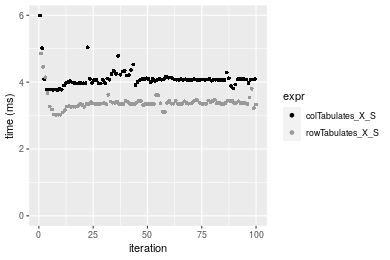

### 1000x100 matrix


```r
> X <- data[["1000x100"]]
> rows <- sample.int(nrow(X), size = nrow(X) * 0.7)
> cols <- sample.int(ncol(X), size = ncol(X) * 0.7)
> X_S <- X[rows, cols]
> gc()
           used  (Mb) gc trigger  (Mb) max used  (Mb)
Ncells  5298445 283.0    8529671 455.6  8529671 455.6
Vcells 10187291  77.8   31876688 243.2 60562128 462.1
> colStats <- microbenchmark(colTabulates_X_S = colTabulates(X_S, na.rm = FALSE), `colTabulates(X, rows, cols)` = colTabulates(X, 
+     rows = rows, cols = cols, na.rm = FALSE), `colTabulates(X[rows, cols])` = colTabulates(X[rows, 
+     cols], na.rm = FALSE), unit = "ms")
> X <- t(X)
> X_S <- t(X_S)
> gc()
           used  (Mb) gc trigger  (Mb) max used  (Mb)
Ncells  5298421 283.0    8529671 455.6  8529671 455.6
Vcells 10237344  78.2   31876688 243.2 60562128 462.1
> rowStats <- microbenchmark(rowTabulates_X_S = rowTabulates(X_S, na.rm = FALSE), `rowTabulates(X, cols, rows)` = rowTabulates(X, 
+     rows = cols, cols = rows, na.rm = FALSE), `rowTabulates(X[cols, rows])` = rowTabulates(X[cols, 
+     rows], na.rm = FALSE), unit = "ms")
```

_Table: Benchmarking of colTabulates_X_S(), colTabulates(X, rows, cols)() and colTabulates(X[rows, cols])() on 1000x100 data. The top panel shows times in milliseconds and the bottom panel shows relative times._


|   |expr                        |      min|       lq|     mean|   median|       uq|       max|
|:--|:---------------------------|--------:|--------:|--------:|--------:|--------:|---------:|
|1  |colTabulates_X_S            | 3.614829| 3.889721| 4.003826| 3.921835| 4.123614|  5.779987|
|2  |colTabulates(X, rows, cols) | 3.676167| 3.970611| 4.072485| 3.994089| 4.277508|  4.804207|
|3  |colTabulates(X[rows, cols]) | 3.685044| 3.966757| 4.142227| 3.999192| 4.250722| 11.539318|


|   |expr                        |      min|       lq|     mean|   median|       uq|       max|
|:--|:---------------------------|--------:|--------:|--------:|--------:|--------:|---------:|
|1  |colTabulates_X_S            | 1.000000| 1.000000| 1.000000| 1.000000| 1.000000| 1.0000000|
|2  |colTabulates(X, rows, cols) | 1.016968| 1.020796| 1.017149| 1.018424| 1.037320| 0.8311796|
|3  |colTabulates(X[rows, cols]) | 1.019424| 1.019805| 1.034567| 1.019725| 1.030824| 1.9964263|

_Table: Benchmarking of rowTabulates_X_S(), rowTabulates(X, cols, rows)() and rowTabulates(X[cols, rows])() on 1000x100 data (transposed). The top panel shows times in milliseconds and the bottom panel shows relative times._


|   |expr                        |      min|       lq|     mean|   median|       uq|       max|
|:--|:---------------------------|--------:|--------:|--------:|--------:|--------:|---------:|
|1  |rowTabulates_X_S            | 3.090231| 3.403376| 3.443224| 3.427148| 3.502330|  4.016663|
|3  |rowTabulates(X[cols, rows]) | 3.144443| 3.490527| 3.558763| 3.525844| 3.593609|  4.628401|
|2  |rowTabulates(X, cols, rows) | 3.144768| 3.491172| 3.742986| 3.552449| 3.598092| 18.289934|


|   |expr                        |      min|       lq|     mean|   median|       uq|      max|
|:--|:---------------------------|--------:|--------:|--------:|--------:|--------:|--------:|
|1  |rowTabulates_X_S            | 1.000000| 1.000000| 1.000000| 1.000000| 1.000000| 1.000000|
|3  |rowTabulates(X[cols, rows]) | 1.017543| 1.025607| 1.033555| 1.028798| 1.026062| 1.152300|
|2  |rowTabulates(X, cols, rows) | 1.017648| 1.025797| 1.087059| 1.036561| 1.027342| 4.553515|

_Figure: Benchmarking of colTabulates_X_S(), colTabulates(X, rows, cols)() and colTabulates(X[rows, cols])() on 1000x100 data  as well as rowTabulates_X_S(), rowTabulates(X, cols, rows)() and rowTabulates(X[cols, rows])() on the same data transposed.  Outliers are displayed as crosses.  Times are in milliseconds._


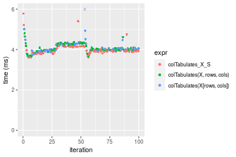

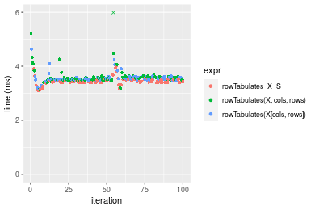
_Table: Benchmarking of colTabulates_X_S() and rowTabulates_X_S() on 1000x100 data (original and transposed).  The top panel shows times in milliseconds and the bottom panel shows relative times._


|   |expr             |      min|       lq|     mean|   median|       uq|      max|
|:--|:----------------|--------:|--------:|--------:|--------:|--------:|--------:|
|2  |rowTabulates_X_S | 3.090231| 3.403376| 3.443224| 3.427148| 3.502330| 4.016663|
|1  |colTabulates_X_S | 3.614829| 3.889721| 4.003826| 3.921835| 4.123614| 5.779987|


|   |expr             |     min|       lq|     mean|   median|       uq|      max|
|:--|:----------------|-------:|--------:|--------:|--------:|--------:|--------:|
|2  |rowTabulates_X_S | 1.00000| 1.000000| 1.000000| 1.000000| 1.000000| 1.000000|
|1  |colTabulates_X_S | 1.16976| 1.142901| 1.162813| 1.144343| 1.177391| 1.439002|

_Figure: Benchmarking of colTabulates_X_S() and rowTabulates_X_S() on 1000x100 data (original and transposed).  Outliers are displayed as crosses. Times are in milliseconds._


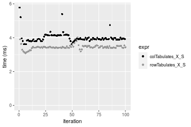


## Appendix

### Session information
```r
R version 4.1.1 Patched (2021-08-10 r80727)
Platform: x86_64-pc-linux-gnu (64-bit)
Running under: Ubuntu 18.04.5 LTS

Matrix products: default
BLAS:   /home/hb/software/R-devel/R-4-1-branch/lib/R/lib/libRblas.so
LAPACK: /home/hb/software/R-devel/R-4-1-branch/lib/R/lib/libRlapack.so

locale:
 [1] LC_CTYPE=en_US.UTF-8       LC_NUMERIC=C              
 [3] LC_TIME=en_US.UTF-8        LC_COLLATE=en_US.UTF-8    
 [5] LC_MONETARY=en_US.UTF-8    LC_MESSAGES=en_US.UTF-8   
 [7] LC_PAPER=en_US.UTF-8       LC_NAME=C                 
 [9] LC_ADDRESS=C               LC_TELEPHONE=C            
[11] LC_MEASUREMENT=en_US.UTF-8 LC_IDENTIFICATION=C       

attached base packages:
[1] stats     graphics  grDevices utils     datasets  methods   base     

other attached packages:
[1] microbenchmark_1.4-7   matrixStats_0.60.1     ggplot2_3.3.5         
[4] knitr_1.33             R.devices_2.17.0       R.utils_2.10.1        
[7] R.oo_1.24.0            R.methodsS3_1.8.1-9001 history_0.0.1-9000    

loaded via a namespace (and not attached):
 [1] Biobase_2.52.0          httr_1.4.2              splines_4.1.1          
 [4] bit64_4.0.5             network_1.17.1          assertthat_0.2.1       
 [7] highr_0.9               stats4_4.1.1            blob_1.2.2             
[10] GenomeInfoDbData_1.2.6  robustbase_0.93-8       pillar_1.6.2           
[13] RSQLite_2.2.8           lattice_0.20-44         glue_1.4.2             
[16] digest_0.6.27           XVector_0.32.0          colorspace_2.0-2       
[19] Matrix_1.3-4            XML_3.99-0.7            pkgconfig_2.0.3        
[22] zlibbioc_1.38.0         genefilter_1.74.0       purrr_0.3.4            
[25] ergm_4.1.2              xtable_1.8-4            scales_1.1.1           
[28] tibble_3.1.4            annotate_1.70.0         KEGGREST_1.32.0        
[31] farver_2.1.0            generics_0.1.0          IRanges_2.26.0         
[34] ellipsis_0.3.2          cachem_1.0.6            withr_2.4.2            
[37] BiocGenerics_0.38.0     mime_0.11               survival_3.2-13        
[40] magrittr_2.0.1          crayon_1.4.1            statnet.common_4.5.0   
[43] memoise_2.0.0           laeken_0.5.1            fansi_0.5.0            
[46] R.cache_0.15.0          MASS_7.3-54             R.rsp_0.44.0           
[49] progressr_0.8.0         tools_4.1.1             lifecycle_1.0.0        
[52] S4Vectors_0.30.0        trust_0.1-8             munsell_0.5.0          
[55] tabby_0.0.1-9001        AnnotationDbi_1.54.1    Biostrings_2.60.2      
[58] compiler_4.1.1          GenomeInfoDb_1.28.1     rlang_0.4.11           
[61] grid_4.1.1              RCurl_1.98-1.4          cwhmisc_6.6            
[64] rappdirs_0.3.3          startup_0.15.0          labeling_0.4.2         
[67] bitops_1.0-7            base64enc_0.1-3         boot_1.3-28            
[70] gtable_0.3.0            DBI_1.1.1               markdown_1.1           
[73] R6_2.5.1                lpSolveAPI_5.5.2.0-17.7 rle_0.9.2              
[76] dplyr_1.0.7             fastmap_1.1.0           bit_4.0.4              
[79] utf8_1.2.2              parallel_4.1.1          Rcpp_1.0.7             
[82] vctrs_0.3.8             png_0.1-7               DEoptimR_1.0-9         
[85] tidyselect_1.1.1        xfun_0.25               coda_0.19-4            
```
Total processing time was 17.19 secs.


### Reproducibility
To reproduce this report, do:
```r
html <- matrixStats:::benchmark('colRowTabulates_subset')
```

[RSP]: https://cran.r-project.org/package=R.rsp
[matrixStats]: https://cran.r-project.org/package=matrixStats

[StackOverflow:colMins?]: https://stackoverflow.com/questions/13676878 "Stack Overflow: fastest way to get Min from every column in a matrix?"
[StackOverflow:colSds?]: https://stackoverflow.com/questions/17549762 "Stack Overflow: Is there such 'colsd' in R?"
[StackOverflow:rowProds?]: https://stackoverflow.com/questions/20198801/ "Stack Overflow: Row product of matrix and column sum of matrix"

---------------------------------------
Copyright Dongcan Jiang. Last updated on 2021-08-25 19:09:50 (+0200 UTC). Powered by [RSP].

<script>
 var link = document.createElement('link');
 link.rel = 'icon';
 link.href = "data:image/png;base64,iVBORw0KGgoAAAANSUhEUgAAACAAAAAgCAMAAABEpIrGAAAA21BMVEUAAAAAAP8AAP8AAP8AAP8AAP8AAP8AAP8AAP8AAP8AAP8AAP8AAP8AAP8AAP8AAP8AAP8AAP8AAP8AAP8AAP8AAP8AAP8AAP8AAP8AAP8AAP8AAP8AAP8AAP8AAP8AAP8AAP8AAP8AAP8AAP8AAP8AAP8AAP8AAP8AAP8AAP8BAf4CAv0DA/wdHeIeHuEfH+AgIN8hId4lJdomJtknJ9g+PsE/P8BAQL9yco10dIt1dYp3d4h4eIeVlWqWlmmXl2iYmGeZmWabm2Tn5xjo6Bfp6Rb39wj4+Af//wA2M9hbAAAASXRSTlMAAQIJCgsMJSYnKD4/QGRlZmhpamtsbautrrCxuru8y8zN5ebn6Pn6+///////////////////////////////////////////LsUNcQAAAS9JREFUOI29k21XgkAQhVcFytdSMqMETU26UVqGmpaiFbL//xc1cAhhwVNf6n5i5z67M2dmYOyfJZUqlVLhkKucG7cgmUZTybDz6g0iDeq51PUr37Ds2cy2/C9NeES5puDjxuUk1xnToZsg8pfA3avHQ3lLIi7iWRrkv/OYtkScxBIMgDee0ALoyxHQBJ68JLCjOtQIMIANF7QG9G9fNnHvisCHBVMKgSJgiz7nE+AoBKrAPA3MgepvgR9TSCasrCKH0eB1wBGBFdCO+nAGjMVGPcQb5bd6mQRegN6+1axOs9nGfYcCtfi4NQosdtH7dB+txFIpXQqN1p9B/asRHToyS0jRgpV7nk4nwcq1BJ+x3Gl/v7S9Wmpp/aGquum7w3ZDyrADFYrl8vHBH+ev9AUASW1dmU4h4wAAAABJRU5ErkJggg=="
 document.getElementsByTagName('head')[0].appendChild(link);
</script>


