[matrixStats]: Benchmark report

---------------------------------------


# colWeightedMeans() and rowWeightedMeans() benchmarks on subsetted computation

This report benchmark the performance of colWeightedMeans() and rowWeightedMeans() on subsetted computation.


## Data
```r
> rmatrix <- function(nrow, ncol, mode = c("logical", "double", "integer", "index"), range = c(-100, 
+     +100), na_prob = 0) {
+     mode <- match.arg(mode)
+     n <- nrow * ncol
+     if (mode == "logical") {
+         x <- sample(c(FALSE, TRUE), size = n, replace = TRUE)
+     }     else if (mode == "index") {
+         x <- seq_len(n)
+         mode <- "integer"
+     }     else {
+         x <- runif(n, min = range[1], max = range[2])
+     }
+     storage.mode(x) <- mode
+     if (na_prob > 0) 
+         x[sample(n, size = na_prob * n)] <- NA
+     dim(x) <- c(nrow, ncol)
+     x
+ }
> rmatrices <- function(scale = 10, seed = 1, ...) {
+     set.seed(seed)
+     data <- list()
+     data[[1]] <- rmatrix(nrow = scale * 1, ncol = scale * 1, ...)
+     data[[2]] <- rmatrix(nrow = scale * 10, ncol = scale * 10, ...)
+     data[[3]] <- rmatrix(nrow = scale * 100, ncol = scale * 1, ...)
+     data[[4]] <- t(data[[3]])
+     data[[5]] <- rmatrix(nrow = scale * 10, ncol = scale * 100, ...)
+     data[[6]] <- t(data[[5]])
+     names(data) <- sapply(data, FUN = function(x) paste(dim(x), collapse = "x"))
+     data
+ }
> data <- rmatrices(mode = "double")
```

## Results

### 10x10 matrix


```r
> X <- data[["10x10"]]
> rows <- sample.int(nrow(X), size = nrow(X) * 0.7)
> cols <- sample.int(ncol(X), size = ncol(X) * 0.7)
> X_S <- X[rows, cols]
> w <- runif(nrow(X))
> w_S <- w[rows]
> gc()
           used  (Mb) gc trigger  (Mb) max used  (Mb)
Ncells  5325256 284.4    8529671 455.6  8529671 455.6
Vcells 10757231  82.1   31876688 243.2 60562128 462.1
> colStats <- microbenchmark(colWeightedMeans_X_w_S = colWeightedMeans(X_S, w = w_S, na.rm = FALSE), 
+     `colWeightedMeans(X, w, rows, cols)` = colWeightedMeans(X, w = w, rows = rows, cols = cols, na.rm = FALSE), 
+     `colWeightedMeans(X[rows, cols], w[rows])` = colWeightedMeans(X[rows, cols], w = w[rows], na.rm = FALSE), 
+     unit = "ms")
> X <- t(X)
> X_S <- t(X_S)
> gc()
           used  (Mb) gc trigger  (Mb) max used  (Mb)
Ncells  5315960 284.0    8529671 455.6  8529671 455.6
Vcells 10726254  81.9   31876688 243.2 60562128 462.1
> rowStats <- microbenchmark(rowWeightedMeans_X_w_S = rowWeightedMeans(X_S, w = w_S, na.rm = FALSE), 
+     `rowWeightedMeans(X, w, cols, rows)` = rowWeightedMeans(X, w = w, rows = cols, cols = rows, na.rm = FALSE), 
+     `rowWeightedMeans(X[cols, rows], w[rows])` = rowWeightedMeans(X[cols, rows], w = w[rows], na.rm = FALSE), 
+     unit = "ms")
```

_Table: Benchmarking of colWeightedMeans_X_w_S(), colWeightedMeans(X, w, rows, cols)() and colWeightedMeans(X[rows, cols], w[rows])() on 10x10 data. The top panel shows times in milliseconds and the bottom panel shows relative times._


|   |expr                                     |      min|       lq|      mean|   median|        uq|      max|
|:--|:----------------------------------------|--------:|--------:|---------:|--------:|---------:|--------:|
|1  |colWeightedMeans_X_w_S                   | 0.014470| 0.014981| 0.0155045| 0.015280| 0.0158510| 0.027004|
|3  |colWeightedMeans(X[rows, cols], w[rows]) | 0.016255| 0.016827| 0.0177645| 0.017344| 0.0179600| 0.032018|
|2  |colWeightedMeans(X, w, rows, cols)       | 0.017700| 0.018331| 0.0230068| 0.018772| 0.0191295| 0.435820|


|   |expr                                     |      min|       lq|     mean|   median|       uq|       max|
|:--|:----------------------------------------|--------:|--------:|--------:|--------:|--------:|---------:|
|1  |colWeightedMeans_X_w_S                   | 1.000000| 1.000000| 1.000000| 1.000000| 1.000000|  1.000000|
|3  |colWeightedMeans(X[rows, cols], w[rows]) | 1.123359| 1.123223| 1.145763| 1.135079| 1.133052|  1.185676|
|2  |colWeightedMeans(X, w, rows, cols)       | 1.223221| 1.223617| 1.483880| 1.228534| 1.206832| 16.139090|

_Table: Benchmarking of rowWeightedMeans_X_w_S(), rowWeightedMeans(X, w, cols, rows)() and rowWeightedMeans(X[cols, rows], w[rows])() on 10x10 data (transposed). The top panel shows times in milliseconds and the bottom panel shows relative times._


|   |expr                                     |      min|        lq|      mean|    median|        uq|      max|
|:--|:----------------------------------------|--------:|---------:|---------:|---------:|---------:|--------:|
|1  |rowWeightedMeans_X_w_S                   | 0.018896| 0.0194165| 0.0202958| 0.0198445| 0.0206840| 0.035495|
|3  |rowWeightedMeans(X[cols, rows], w[rows]) | 0.020614| 0.0212005| 0.0219963| 0.0216765| 0.0224660| 0.032308|
|2  |rowWeightedMeans(X, w, cols, rows)       | 0.022414| 0.0231110| 0.0296008| 0.0235790| 0.0243585| 0.566980|


|   |expr                                     |      min|       lq|     mean|   median|       uq|        max|
|:--|:----------------------------------------|--------:|--------:|--------:|--------:|--------:|----------:|
|1  |rowWeightedMeans_X_w_S                   | 1.000000| 1.000000| 1.000000| 1.000000| 1.000000|  1.0000000|
|3  |rowWeightedMeans(X[cols, rows], w[rows]) | 1.090919| 1.091881| 1.083784| 1.092318| 1.086153|  0.9102127|
|2  |rowWeightedMeans(X, w, cols, rows)       | 1.186177| 1.190276| 1.458466| 1.188188| 1.177649| 15.9735174|

_Figure: Benchmarking of colWeightedMeans_X_w_S(), colWeightedMeans(X, w, rows, cols)() and colWeightedMeans(X[rows, cols], w[rows])() on 10x10 data  as well as rowWeightedMeans_X_w_S(), rowWeightedMeans(X, w, cols, rows)() and rowWeightedMeans(X[cols, rows], w[rows])() on the same data transposed.  Outliers are displayed as crosses.  Times are in milliseconds._


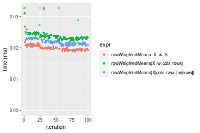
_Table: Benchmarking of colWeightedMeans_X_w_S() and rowWeightedMeans_X_w_S() on 10x10 data (original and transposed).  The top panel shows times in milliseconds and the bottom panel shows relative times._


|   |expr                   |    min|      lq|     mean|  median|     uq|    max|
|:--|:----------------------|------:|-------:|--------:|-------:|------:|------:|
|1  |colWeightedMeans_X_w_S | 14.470| 14.9810| 15.50451| 15.2800| 15.851| 27.004|
|2  |rowWeightedMeans_X_w_S | 18.896| 19.4165| 20.29581| 19.8445| 20.684| 35.495|


|   |expr                   |      min|       lq|     mean|   median|       uq|      max|
|:--|:----------------------|--------:|--------:|--------:|--------:|--------:|--------:|
|1  |colWeightedMeans_X_w_S | 1.000000| 1.000000| 1.000000| 1.000000| 1.000000| 1.000000|
|2  |rowWeightedMeans_X_w_S | 1.305874| 1.296075| 1.309026| 1.298724| 1.304902| 1.314435|

_Figure: Benchmarking of colWeightedMeans_X_w_S() and rowWeightedMeans_X_w_S() on 10x10 data (original and transposed).  Outliers are displayed as crosses. Times are in milliseconds._


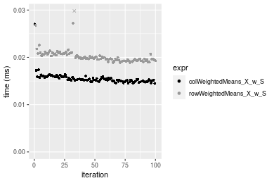

### 100x100 matrix


```r
> X <- data[["100x100"]]
> rows <- sample.int(nrow(X), size = nrow(X) * 0.7)
> cols <- sample.int(ncol(X), size = ncol(X) * 0.7)
> X_S <- X[rows, cols]
> w <- runif(nrow(X))
> w_S <- w[rows]
> gc()
           used  (Mb) gc trigger  (Mb) max used  (Mb)
Ncells  5315147 283.9    8529671 455.6  8529671 455.6
Vcells 10397059  79.4   31876688 243.2 60562128 462.1
> colStats <- microbenchmark(colWeightedMeans_X_w_S = colWeightedMeans(X_S, w = w_S, na.rm = FALSE), 
+     `colWeightedMeans(X, w, rows, cols)` = colWeightedMeans(X, w = w, rows = rows, cols = cols, na.rm = FALSE), 
+     `colWeightedMeans(X[rows, cols], w[rows])` = colWeightedMeans(X[rows, cols], w = w[rows], na.rm = FALSE), 
+     unit = "ms")
> X <- t(X)
> X_S <- t(X_S)
> gc()
           used  (Mb) gc trigger  (Mb) max used  (Mb)
Ncells  5315123 283.9    8529671 455.6  8529671 455.6
Vcells 10407112  79.4   31876688 243.2 60562128 462.1
> rowStats <- microbenchmark(rowWeightedMeans_X_w_S = rowWeightedMeans(X_S, w = w_S, na.rm = FALSE), 
+     `rowWeightedMeans(X, w, cols, rows)` = rowWeightedMeans(X, w = w, rows = cols, cols = rows, na.rm = FALSE), 
+     `rowWeightedMeans(X[cols, rows], w[rows])` = rowWeightedMeans(X[cols, rows], w = w[rows], na.rm = FALSE), 
+     unit = "ms")
```

_Table: Benchmarking of colWeightedMeans_X_w_S(), colWeightedMeans(X, w, rows, cols)() and colWeightedMeans(X[rows, cols], w[rows])() on 100x100 data. The top panel shows times in milliseconds and the bottom panel shows relative times._


|   |expr                                     |      min|        lq|      mean|    median|        uq|      max|
|:--|:----------------------------------------|--------:|---------:|---------:|---------:|---------:|--------:|
|1  |colWeightedMeans_X_w_S                   | 0.026212| 0.0279685| 0.0303416| 0.0292475| 0.0329180| 0.041039|
|3  |colWeightedMeans(X[rows, cols], w[rows]) | 0.040471| 0.0444045| 0.0482202| 0.0474340| 0.0500500| 0.079303|
|2  |colWeightedMeans(X, w, rows, cols)       | 0.055636| 0.0601385| 0.0655575| 0.0638050| 0.0689055| 0.192947|


|   |expr                                     |      min|       lq|     mean|   median|       uq|      max|
|:--|:----------------------------------------|--------:|--------:|--------:|--------:|--------:|--------:|
|1  |colWeightedMeans_X_w_S                   | 1.000000| 1.000000| 1.000000| 1.000000| 1.000000| 1.000000|
|3  |colWeightedMeans(X[rows, cols], w[rows]) | 1.543988| 1.587661| 1.589245| 1.621814| 1.520445| 1.932381|
|2  |colWeightedMeans(X, w, rows, cols)       | 2.122539| 2.150223| 2.160647| 2.181554| 2.093247| 4.701552|

_Table: Benchmarking of rowWeightedMeans_X_w_S(), rowWeightedMeans(X, w, cols, rows)() and rowWeightedMeans(X[cols, rows], w[rows])() on 100x100 data (transposed). The top panel shows times in milliseconds and the bottom panel shows relative times._


|   |expr                                     |      min|        lq|      mean|    median|        uq|      max|
|:--|:----------------------------------------|--------:|---------:|---------:|---------:|---------:|--------:|
|1  |rowWeightedMeans_X_w_S                   | 0.077298| 0.0829720| 0.0913286| 0.0888450| 0.0999010| 0.125572|
|3  |rowWeightedMeans(X[cols, rows], w[rows]) | 0.090650| 0.0975855| 0.1055107| 0.1011425| 0.1098525| 0.198671|
|2  |rowWeightedMeans(X, w, cols, rows)       | 0.103670| 0.1111375| 0.1192483| 0.1155785| 0.1276455| 0.148688|


|   |expr                                     |      min|       lq|     mean|   median|       uq|      max|
|:--|:----------------------------------------|--------:|--------:|--------:|--------:|--------:|--------:|
|1  |rowWeightedMeans_X_w_S                   | 1.000000| 1.000000| 1.000000| 1.000000| 1.000000| 1.000000|
|3  |rowWeightedMeans(X[cols, rows], w[rows]) | 1.172734| 1.176126| 1.155286| 1.138415| 1.099614| 1.582128|
|2  |rowWeightedMeans(X, w, cols, rows)       | 1.341173| 1.339458| 1.305707| 1.300900| 1.277720| 1.184086|

_Figure: Benchmarking of colWeightedMeans_X_w_S(), colWeightedMeans(X, w, rows, cols)() and colWeightedMeans(X[rows, cols], w[rows])() on 100x100 data  as well as rowWeightedMeans_X_w_S(), rowWeightedMeans(X, w, cols, rows)() and rowWeightedMeans(X[cols, rows], w[rows])() on the same data transposed.  Outliers are displayed as crosses.  Times are in milliseconds._


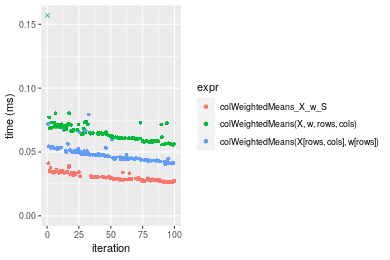

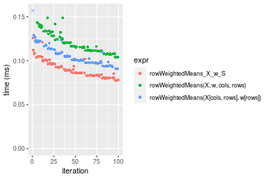
_Table: Benchmarking of colWeightedMeans_X_w_S() and rowWeightedMeans_X_w_S() on 100x100 data (original and transposed).  The top panel shows times in milliseconds and the bottom panel shows relative times._


|   |expr                   |    min|      lq|     mean|  median|     uq|     max|
|:--|:----------------------|------:|-------:|--------:|-------:|------:|-------:|
|1  |colWeightedMeans_X_w_S | 26.212| 27.9685| 30.34161| 29.2475| 32.918|  41.039|
|2  |rowWeightedMeans_X_w_S | 77.298| 82.9720| 91.32858| 88.8450| 99.901| 125.572|


|   |expr                   |      min|       lq|     mean|   median|       uq|      max|
|:--|:----------------------|--------:|--------:|--------:|--------:|--------:|--------:|
|1  |colWeightedMeans_X_w_S | 1.000000| 1.000000| 1.000000| 1.000000| 1.000000| 1.000000|
|2  |rowWeightedMeans_X_w_S | 2.948955| 2.966623| 3.010011| 3.037695| 3.034844| 3.059821|

_Figure: Benchmarking of colWeightedMeans_X_w_S() and rowWeightedMeans_X_w_S() on 100x100 data (original and transposed).  Outliers are displayed as crosses. Times are in milliseconds._


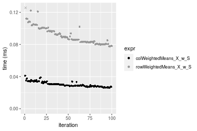

### 1000x10 matrix


```r
> X <- data[["1000x10"]]
> rows <- sample.int(nrow(X), size = nrow(X) * 0.7)
> cols <- sample.int(ncol(X), size = ncol(X) * 0.7)
> X_S <- X[rows, cols]
> w <- runif(nrow(X))
> w_S <- w[rows]
> gc()
           used  (Mb) gc trigger  (Mb) max used  (Mb)
Ncells  5315879 283.9    8529671 455.6  8529671 455.6
Vcells 10402945  79.4   31876688 243.2 60562128 462.1
> colStats <- microbenchmark(colWeightedMeans_X_w_S = colWeightedMeans(X_S, w = w_S, na.rm = FALSE), 
+     `colWeightedMeans(X, w, rows, cols)` = colWeightedMeans(X, w = w, rows = rows, cols = cols, na.rm = FALSE), 
+     `colWeightedMeans(X[rows, cols], w[rows])` = colWeightedMeans(X[rows, cols], w = w[rows], na.rm = FALSE), 
+     unit = "ms")
> X <- t(X)
> X_S <- t(X_S)
> gc()
           used  (Mb) gc trigger  (Mb) max used  (Mb)
Ncells  5315873 283.9    8529671 455.6  8529671 455.6
Vcells 10413028  79.5   31876688 243.2 60562128 462.1
> rowStats <- microbenchmark(rowWeightedMeans_X_w_S = rowWeightedMeans(X_S, w = w_S, na.rm = FALSE), 
+     `rowWeightedMeans(X, w, cols, rows)` = rowWeightedMeans(X, w = w, rows = cols, cols = rows, na.rm = FALSE), 
+     `rowWeightedMeans(X[cols, rows], w[rows])` = rowWeightedMeans(X[cols, rows], w = w[rows], na.rm = FALSE), 
+     unit = "ms")
```

_Table: Benchmarking of colWeightedMeans_X_w_S(), colWeightedMeans(X, w, rows, cols)() and colWeightedMeans(X[rows, cols], w[rows])() on 1000x10 data. The top panel shows times in milliseconds and the bottom panel shows relative times._


|   |expr                                     |      min|        lq|      mean|    median|        uq|      max|
|:--|:----------------------------------------|--------:|---------:|---------:|---------:|---------:|--------:|
|1  |colWeightedMeans_X_w_S                   | 0.038104| 0.0408960| 0.0442664| 0.0436305| 0.0461355| 0.072222|
|3  |colWeightedMeans(X[rows, cols], w[rows]) | 0.054300| 0.0577795| 0.0626517| 0.0612850| 0.0664535| 0.103451|
|2  |colWeightedMeans(X, w, rows, cols)       | 0.070953| 0.0768015| 0.0828859| 0.0809855| 0.0866975| 0.172090|


|   |expr                                     |      min|       lq|     mean|   median|       uq|      max|
|:--|:----------------------------------------|--------:|--------:|--------:|--------:|--------:|--------:|
|1  |colWeightedMeans_X_w_S                   | 1.000000| 1.000000| 1.000000| 1.000000| 1.000000| 1.000000|
|3  |colWeightedMeans(X[rows, cols], w[rows]) | 1.425047| 1.412840| 1.415334| 1.404637| 1.440398| 1.432403|
|2  |colWeightedMeans(X, w, rows, cols)       | 1.862088| 1.877971| 1.872435| 1.856167| 1.879193| 2.382792|

_Table: Benchmarking of rowWeightedMeans_X_w_S(), rowWeightedMeans(X, w, cols, rows)() and rowWeightedMeans(X[cols, rows], w[rows])() on 1000x10 data (transposed). The top panel shows times in milliseconds and the bottom panel shows relative times._


|   |expr                                     |      min|        lq|      mean|    median|       uq|      max|
|:--|:----------------------------------------|--------:|---------:|---------:|---------:|--------:|--------:|
|1  |rowWeightedMeans_X_w_S                   | 0.086664| 0.0923950| 0.0995987| 0.0959575| 0.104999| 0.131020|
|3  |rowWeightedMeans(X[cols, rows], w[rows]) | 0.103605| 0.1104925| 0.1208998| 0.1180840| 0.129648| 0.160354|
|2  |rowWeightedMeans(X, w, cols, rows)       | 0.121188| 0.1300625| 0.1422750| 0.1386305| 0.148343| 0.248344|


|   |expr                                     |      min|       lq|     mean|   median|       uq|      max|
|:--|:----------------------------------------|--------:|--------:|--------:|--------:|--------:|--------:|
|1  |rowWeightedMeans_X_w_S                   | 1.000000| 1.000000| 1.000000| 1.000000| 1.000000| 1.000000|
|3  |rowWeightedMeans(X[cols, rows], w[rows]) | 1.195479| 1.195871| 1.213870| 1.230587| 1.234755| 1.223890|
|2  |rowWeightedMeans(X, w, cols, rows)       | 1.398366| 1.407679| 1.428483| 1.444707| 1.412804| 1.895466|

_Figure: Benchmarking of colWeightedMeans_X_w_S(), colWeightedMeans(X, w, rows, cols)() and colWeightedMeans(X[rows, cols], w[rows])() on 1000x10 data  as well as rowWeightedMeans_X_w_S(), rowWeightedMeans(X, w, cols, rows)() and rowWeightedMeans(X[cols, rows], w[rows])() on the same data transposed.  Outliers are displayed as crosses.  Times are in milliseconds._


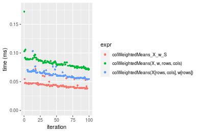

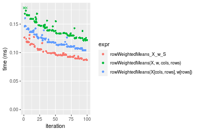
_Table: Benchmarking of colWeightedMeans_X_w_S() and rowWeightedMeans_X_w_S() on 1000x10 data (original and transposed).  The top panel shows times in milliseconds and the bottom panel shows relative times._


|   |expr                   |    min|     lq|     mean|  median|       uq|     max|
|:--|:----------------------|------:|------:|--------:|-------:|--------:|-------:|
|1  |colWeightedMeans_X_w_S | 38.104| 40.896| 44.26638| 43.6305|  46.1355|  72.222|
|2  |rowWeightedMeans_X_w_S | 86.664| 92.395| 99.59866| 95.9575| 104.9990| 131.020|


|   |expr                   |      min|       lq|     mean|   median|       uq|      max|
|:--|:----------------------|--------:|--------:|--------:|--------:|--------:|--------:|
|1  |colWeightedMeans_X_w_S | 1.000000| 1.000000| 1.000000| 1.000000| 1.000000| 1.000000|
|2  |rowWeightedMeans_X_w_S | 2.274407| 2.259267| 2.249984| 2.199322| 2.275883| 1.814129|

_Figure: Benchmarking of colWeightedMeans_X_w_S() and rowWeightedMeans_X_w_S() on 1000x10 data (original and transposed).  Outliers are displayed as crosses. Times are in milliseconds._


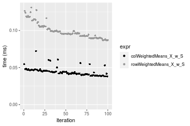

### 10x1000 matrix


```r
> X <- data[["10x1000"]]
> rows <- sample.int(nrow(X), size = nrow(X) * 0.7)
> cols <- sample.int(ncol(X), size = ncol(X) * 0.7)
> X_S <- X[rows, cols]
> w <- runif(nrow(X))
> w_S <- w[rows]
> gc()
           used  (Mb) gc trigger  (Mb) max used  (Mb)
Ncells  5316109 284.0    8529671 455.6  8529671 455.6
Vcells 10402265  79.4   31876688 243.2 60562128 462.1
> colStats <- microbenchmark(colWeightedMeans_X_w_S = colWeightedMeans(X_S, w = w_S, na.rm = FALSE), 
+     `colWeightedMeans(X, w, rows, cols)` = colWeightedMeans(X, w = w, rows = rows, cols = cols, na.rm = FALSE), 
+     `colWeightedMeans(X[rows, cols], w[rows])` = colWeightedMeans(X[rows, cols], w = w[rows], na.rm = FALSE), 
+     unit = "ms")
> X <- t(X)
> X_S <- t(X_S)
> gc()
           used  (Mb) gc trigger  (Mb) max used  (Mb)
Ncells  5316085 284.0    8529671 455.6  8529671 455.6
Vcells 10412318  79.5   31876688 243.2 60562128 462.1
> rowStats <- microbenchmark(rowWeightedMeans_X_w_S = rowWeightedMeans(X_S, w = w_S, na.rm = FALSE), 
+     `rowWeightedMeans(X, w, cols, rows)` = rowWeightedMeans(X, w = w, rows = cols, cols = rows, na.rm = FALSE), 
+     `rowWeightedMeans(X[cols, rows], w[rows])` = rowWeightedMeans(X[cols, rows], w = w[rows], na.rm = FALSE), 
+     unit = "ms")
```

_Table: Benchmarking of colWeightedMeans_X_w_S(), colWeightedMeans(X, w, rows, cols)() and colWeightedMeans(X[rows, cols], w[rows])() on 10x1000 data. The top panel shows times in milliseconds and the bottom panel shows relative times._


|   |expr                                     |      min|        lq|      mean|    median|        uq|      max|
|:--|:----------------------------------------|--------:|---------:|---------:|---------:|---------:|--------:|
|1  |colWeightedMeans_X_w_S                   | 0.025434| 0.0276360| 0.0298427| 0.0286650| 0.0304655| 0.087633|
|3  |colWeightedMeans(X[rows, cols], w[rows]) | 0.042692| 0.0460385| 0.0489926| 0.0482035| 0.0507950| 0.071571|
|2  |colWeightedMeans(X, w, rows, cols)       | 0.059721| 0.0629235| 0.0670458| 0.0659185| 0.0704320| 0.082601|


|   |expr                                     |      min|       lq|     mean|   median|       uq|       max|
|:--|:----------------------------------------|--------:|--------:|--------:|--------:|--------:|---------:|
|1  |colWeightedMeans_X_w_S                   | 1.000000| 1.000000| 1.000000| 1.000000| 1.000000| 1.0000000|
|3  |colWeightedMeans(X[rows, cols], w[rows]) | 1.678540| 1.665889| 1.641693| 1.681615| 1.667296| 0.8167129|
|2  |colWeightedMeans(X, w, rows, cols)       | 2.348077| 2.276867| 2.246636| 2.299616| 2.311861| 0.9425787|

_Table: Benchmarking of rowWeightedMeans_X_w_S(), rowWeightedMeans(X, w, cols, rows)() and rowWeightedMeans(X[cols, rows], w[rows])() on 10x1000 data (transposed). The top panel shows times in milliseconds and the bottom panel shows relative times._


|   |expr                                     |      min|        lq|      mean|    median|        uq|      max|
|:--|:----------------------------------------|--------:|---------:|---------:|---------:|---------:|--------:|
|1  |rowWeightedMeans_X_w_S                   | 0.076745| 0.0814795| 0.0895641| 0.0873135| 0.0987510| 0.111963|
|3  |rowWeightedMeans(X[cols, rows], w[rows]) | 0.089764| 0.0956705| 0.1036479| 0.0999265| 0.1101905| 0.146547|
|2  |rowWeightedMeans(X, w, cols, rows)       | 0.102693| 0.1097590| 0.1194334| 0.1141985| 0.1261720| 0.217841|


|   |expr                                     |      min|       lq|     mean|   median|       uq|      max|
|:--|:----------------------------------------|--------:|--------:|--------:|--------:|--------:|--------:|
|1  |rowWeightedMeans_X_w_S                   | 1.000000| 1.000000| 1.000000| 1.000000| 1.000000| 1.000000|
|3  |rowWeightedMeans(X[cols, rows], w[rows]) | 1.169640| 1.174166| 1.157248| 1.144456| 1.115842| 1.308888|
|2  |rowWeightedMeans(X, w, cols, rows)       | 1.338107| 1.347075| 1.333496| 1.307913| 1.277678| 1.945652|

_Figure: Benchmarking of colWeightedMeans_X_w_S(), colWeightedMeans(X, w, rows, cols)() and colWeightedMeans(X[rows, cols], w[rows])() on 10x1000 data  as well as rowWeightedMeans_X_w_S(), rowWeightedMeans(X, w, cols, rows)() and rowWeightedMeans(X[cols, rows], w[rows])() on the same data transposed.  Outliers are displayed as crosses.  Times are in milliseconds._


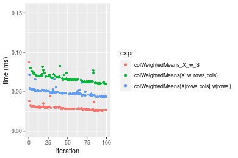

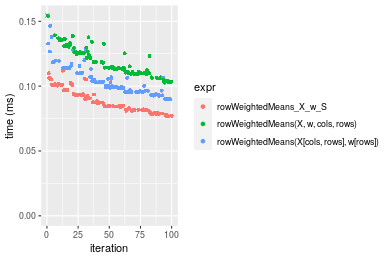
_Table: Benchmarking of colWeightedMeans_X_w_S() and rowWeightedMeans_X_w_S() on 10x1000 data (original and transposed).  The top panel shows times in milliseconds and the bottom panel shows relative times._


|   |expr                   |    min|      lq|     mean|  median|      uq|     max|
|:--|:----------------------|------:|-------:|--------:|-------:|-------:|-------:|
|1  |colWeightedMeans_X_w_S | 25.434| 27.6360| 29.84274| 28.6650| 30.4655|  87.633|
|2  |rowWeightedMeans_X_w_S | 76.745| 81.4795| 89.56411| 87.3135| 98.7510| 111.963|


|   |expr                   |      min|      lq|     mean|   median|       uq|      max|
|:--|:----------------------|--------:|-------:|--------:|--------:|--------:|--------:|
|1  |colWeightedMeans_X_w_S | 1.000000| 1.00000| 1.000000| 1.000000| 1.000000| 1.000000|
|2  |rowWeightedMeans_X_w_S | 3.017418| 2.94831| 3.001203| 3.045997| 3.241404| 1.277635|

_Figure: Benchmarking of colWeightedMeans_X_w_S() and rowWeightedMeans_X_w_S() on 10x1000 data (original and transposed).  Outliers are displayed as crosses. Times are in milliseconds._


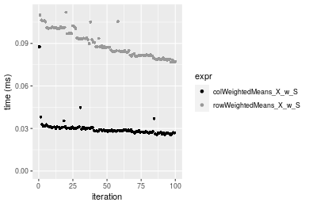

### 100x1000 matrix


```r
> X <- data[["100x1000"]]
> rows <- sample.int(nrow(X), size = nrow(X) * 0.7)
> cols <- sample.int(ncol(X), size = ncol(X) * 0.7)
> X_S <- X[rows, cols]
> w <- runif(nrow(X))
> w_S <- w[rows]
> gc()
           used  (Mb) gc trigger  (Mb) max used  (Mb)
Ncells  5316317 284.0    8529671 455.6  8529671 455.6
Vcells 10447216  79.8   31876688 243.2 60562128 462.1
> colStats <- microbenchmark(colWeightedMeans_X_w_S = colWeightedMeans(X_S, w = w_S, na.rm = FALSE), 
+     `colWeightedMeans(X, w, rows, cols)` = colWeightedMeans(X, w = w, rows = rows, cols = cols, na.rm = FALSE), 
+     `colWeightedMeans(X[rows, cols], w[rows])` = colWeightedMeans(X[rows, cols], w = w[rows], na.rm = FALSE), 
+     unit = "ms")
> X <- t(X)
> X_S <- t(X_S)
> gc()
           used  (Mb) gc trigger  (Mb) max used  (Mb)
Ncells  5316293 284.0    8529671 455.6  8529671 455.6
Vcells 10547269  80.5   31876688 243.2 60562128 462.1
> rowStats <- microbenchmark(rowWeightedMeans_X_w_S = rowWeightedMeans(X_S, w = w_S, na.rm = FALSE), 
+     `rowWeightedMeans(X, w, cols, rows)` = rowWeightedMeans(X, w = w, rows = cols, cols = rows, na.rm = FALSE), 
+     `rowWeightedMeans(X[cols, rows], w[rows])` = rowWeightedMeans(X[cols, rows], w = w[rows], na.rm = FALSE), 
+     unit = "ms")
```

_Table: Benchmarking of colWeightedMeans_X_w_S(), colWeightedMeans(X, w, rows, cols)() and colWeightedMeans(X[rows, cols], w[rows])() on 100x1000 data. The top panel shows times in milliseconds and the bottom panel shows relative times._


|   |expr                                     |      min|        lq|      mean|    median|       uq|      max|
|:--|:----------------------------------------|--------:|---------:|---------:|---------:|--------:|--------:|
|1  |colWeightedMeans_X_w_S                   | 0.106340| 0.1185155| 0.1612415| 0.1333310| 0.209307| 0.255349|
|3  |colWeightedMeans(X[rows, cols], w[rows]) | 0.217438| 0.2423745| 0.3942446| 0.2772740| 0.407768| 7.571224|
|2  |colWeightedMeans(X, w, rows, cols)       | 0.327660| 0.3694830| 0.4984764| 0.4426665| 0.623788| 0.753719|


|   |expr                                     |      min|       lq|     mean|   median|       uq|       max|
|:--|:----------------------------------------|--------:|--------:|--------:|--------:|--------:|---------:|
|1  |colWeightedMeans_X_w_S                   | 1.000000| 1.000000| 1.000000| 1.000000| 1.000000|  1.000000|
|3  |colWeightedMeans(X[rows, cols], w[rows]) | 2.044743| 2.045087| 2.445056| 2.079591| 1.948181| 29.650494|
|2  |colWeightedMeans(X, w, rows, cols)       | 3.081249| 3.117592| 3.091489| 3.320057| 2.980254|  2.951721|

_Table: Benchmarking of rowWeightedMeans_X_w_S(), rowWeightedMeans(X, w, cols, rows)() and rowWeightedMeans(X[cols, rows], w[rows])() on 100x1000 data (transposed). The top panel shows times in milliseconds and the bottom panel shows relative times._


|   |expr                                     |      min|        lq|      mean|    median|       uq|      max|
|:--|:----------------------------------------|--------:|---------:|---------:|---------:|--------:|--------:|
|1  |rowWeightedMeans_X_w_S                   | 0.520571| 0.5660945| 0.6241448| 0.6404850| 0.662353| 0.914939|
|3  |rowWeightedMeans(X[cols, rows], w[rows]) | 0.615246| 0.6881895| 0.8508142| 0.8335270| 0.873567| 7.374503|
|2  |rowWeightedMeans(X, w, cols, rows)       | 0.708871| 0.7555170| 0.9091993| 0.8707455| 1.063113| 1.679352|


|   |expr                                     |      min|       lq|     mean|  median|       uq|      max|
|:--|:----------------------------------------|--------:|--------:|--------:|-------:|--------:|--------:|
|1  |rowWeightedMeans_X_w_S                   | 1.000000| 1.000000| 1.000000| 1.00000| 1.000000| 1.000000|
|3  |rowWeightedMeans(X[cols, rows], w[rows]) | 1.181868| 1.215680| 1.363168| 1.30140| 1.318884| 8.060104|
|2  |rowWeightedMeans(X, w, cols, rows)       | 1.361718| 1.334613| 1.456712| 1.35951| 1.605055| 1.835480|

_Figure: Benchmarking of colWeightedMeans_X_w_S(), colWeightedMeans(X, w, rows, cols)() and colWeightedMeans(X[rows, cols], w[rows])() on 100x1000 data  as well as rowWeightedMeans_X_w_S(), rowWeightedMeans(X, w, cols, rows)() and rowWeightedMeans(X[cols, rows], w[rows])() on the same data transposed.  Outliers are displayed as crosses.  Times are in milliseconds._


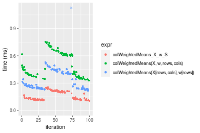

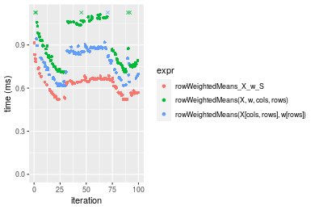
_Table: Benchmarking of colWeightedMeans_X_w_S() and rowWeightedMeans_X_w_S() on 100x1000 data (original and transposed).  The top panel shows times in milliseconds and the bottom panel shows relative times._


|   |expr                   |     min|       lq|     mean|  median|      uq|     max|
|:--|:----------------------|-------:|--------:|--------:|-------:|-------:|-------:|
|1  |colWeightedMeans_X_w_S | 106.340| 118.5155| 161.2415| 133.331| 209.307| 255.349|
|2  |rowWeightedMeans_X_w_S | 520.571| 566.0945| 624.1448| 640.485| 662.353| 914.939|


|   |expr                   |      min|       lq|     mean|   median|       uq|      max|
|:--|:----------------------|--------:|--------:|--------:|--------:|--------:|--------:|
|1  |colWeightedMeans_X_w_S | 1.000000| 1.000000| 1.000000| 1.000000| 1.000000| 1.000000|
|2  |rowWeightedMeans_X_w_S | 4.895345| 4.776544| 3.870869| 4.803722| 3.164505| 3.583092|

_Figure: Benchmarking of colWeightedMeans_X_w_S() and rowWeightedMeans_X_w_S() on 100x1000 data (original and transposed).  Outliers are displayed as crosses. Times are in milliseconds._


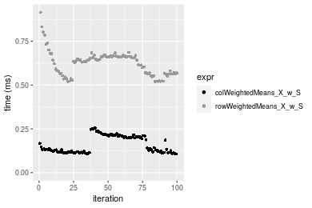

### 1000x100 matrix


```r
> X <- data[["1000x100"]]
> rows <- sample.int(nrow(X), size = nrow(X) * 0.7)
> cols <- sample.int(ncol(X), size = ncol(X) * 0.7)
> X_S <- X[rows, cols]
> w <- runif(nrow(X))
> w_S <- w[rows]
> gc()
           used  (Mb) gc trigger  (Mb) max used  (Mb)
Ncells  5316523 284.0    8529671 455.6  8529671 455.6
Vcells 10449530  79.8   31876688 243.2 60562128 462.1
> colStats <- microbenchmark(colWeightedMeans_X_w_S = colWeightedMeans(X_S, w = w_S, na.rm = FALSE), 
+     `colWeightedMeans(X, w, rows, cols)` = colWeightedMeans(X, w = w, rows = rows, cols = cols, na.rm = FALSE), 
+     `colWeightedMeans(X[rows, cols], w[rows])` = colWeightedMeans(X[rows, cols], w = w[rows], na.rm = FALSE), 
+     unit = "ms")
> X <- t(X)
> X_S <- t(X_S)
> gc()
           used  (Mb) gc trigger  (Mb) max used  (Mb)
Ncells  5316499 284.0    8529671 455.6  8529671 455.6
Vcells 10549583  80.5   31876688 243.2 60562128 462.1
> rowStats <- microbenchmark(rowWeightedMeans_X_w_S = rowWeightedMeans(X_S, w = w_S, na.rm = FALSE), 
+     `rowWeightedMeans(X, w, cols, rows)` = rowWeightedMeans(X, w = w, rows = cols, cols = rows, na.rm = FALSE), 
+     `rowWeightedMeans(X[cols, rows], w[rows])` = rowWeightedMeans(X[cols, rows], w = w[rows], na.rm = FALSE), 
+     unit = "ms")
```

_Table: Benchmarking of colWeightedMeans_X_w_S(), colWeightedMeans(X, w, rows, cols)() and colWeightedMeans(X[rows, cols], w[rows])() on 1000x100 data. The top panel shows times in milliseconds and the bottom panel shows relative times._


|   |expr                                     |      min|        lq|      mean|    median|        uq|      max|
|:--|:----------------------------------------|--------:|---------:|---------:|---------:|---------:|--------:|
|1  |colWeightedMeans_X_w_S                   | 0.120831| 0.1370030| 0.2733699| 0.1560125| 0.2223970| 9.749359|
|3  |colWeightedMeans(X[rows, cols], w[rows]) | 0.225285| 0.2533300| 0.3292349| 0.2750685| 0.4232845| 0.506218|
|2  |colWeightedMeans(X, w, rows, cols)       | 0.340978| 0.3814945| 0.4961101| 0.4280290| 0.6227120| 0.774496|


|   |expr                                     |      min|       lq|     mean|   median|       uq|       max|
|:--|:----------------------------------------|--------:|--------:|--------:|--------:|--------:|---------:|
|1  |colWeightedMeans_X_w_S                   | 1.000000| 1.000000| 1.000000| 1.000000| 1.000000| 1.0000000|
|3  |colWeightedMeans(X[rows, cols], w[rows]) | 1.864464| 1.849084| 1.204357| 1.763118| 1.903283| 0.0519232|
|2  |colWeightedMeans(X, w, rows, cols)       | 2.821941| 2.784570| 1.814794| 2.743556| 2.800002| 0.0794407|

_Table: Benchmarking of rowWeightedMeans_X_w_S(), rowWeightedMeans(X, w, cols, rows)() and rowWeightedMeans(X[cols, rows], w[rows])() on 1000x100 data (transposed). The top panel shows times in milliseconds and the bottom panel shows relative times._


|   |expr                                     |      min|       lq|      mean|    median|       uq|      max|
|:--|:----------------------------------------|--------:|--------:|---------:|---------:|--------:|--------:|
|1  |rowWeightedMeans_X_w_S                   | 0.531949| 0.581315| 0.6366792| 0.6513065| 0.678086| 0.858844|
|3  |rowWeightedMeans(X[cols, rows], w[rows]) | 0.630222| 0.666732| 0.7631659| 0.7252330| 0.870224| 0.973034|
|2  |rowWeightedMeans(X, w, cols, rows)       | 0.729379| 0.784328| 1.0072290| 0.9201865| 1.107291| 7.697569|


|   |expr                                     |      min|       lq|     mean|   median|       uq|      max|
|:--|:----------------------------------------|--------:|--------:|--------:|--------:|--------:|--------:|
|1  |rowWeightedMeans_X_w_S                   | 1.000000| 1.000000| 1.000000| 1.000000| 1.000000| 1.000000|
|3  |rowWeightedMeans(X[cols, rows], w[rows]) | 1.184741| 1.146937| 1.198666| 1.113505| 1.283353| 1.132958|
|2  |rowWeightedMeans(X, w, cols, rows)       | 1.371145| 1.349231| 1.582004| 1.412832| 1.632965| 8.962709|

_Figure: Benchmarking of colWeightedMeans_X_w_S(), colWeightedMeans(X, w, rows, cols)() and colWeightedMeans(X[rows, cols], w[rows])() on 1000x100 data  as well as rowWeightedMeans_X_w_S(), rowWeightedMeans(X, w, cols, rows)() and rowWeightedMeans(X[cols, rows], w[rows])() on the same data transposed.  Outliers are displayed as crosses.  Times are in milliseconds._


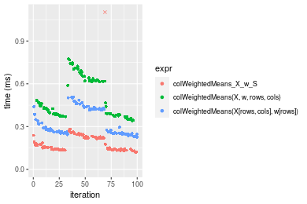


_Table: Benchmarking of colWeightedMeans_X_w_S() and rowWeightedMeans_X_w_S() on 1000x100 data (original and transposed).  The top panel shows times in milliseconds and the bottom panel shows relative times._


|   |expr                   |     min|      lq|     mean|   median|      uq|      max|
|:--|:----------------------|-------:|-------:|--------:|--------:|-------:|--------:|
|1  |colWeightedMeans_X_w_S | 120.831| 137.003| 273.3699| 156.0125| 222.397| 9749.359|
|2  |rowWeightedMeans_X_w_S | 531.949| 581.315| 636.6792| 651.3065| 678.086|  858.844|


|   |expr                   |      min|       lq|     mean|   median|       uq|       max|
|:--|:----------------------|--------:|--------:|--------:|--------:|--------:|---------:|
|1  |colWeightedMeans_X_w_S | 1.000000| 1.000000| 1.000000| 1.000000| 1.000000| 1.0000000|
|2  |rowWeightedMeans_X_w_S | 4.402422| 4.243082| 2.329002| 4.174707| 3.048989| 0.0880924|

_Figure: Benchmarking of colWeightedMeans_X_w_S() and rowWeightedMeans_X_w_S() on 1000x100 data (original and transposed).  Outliers are displayed as crosses. Times are in milliseconds._


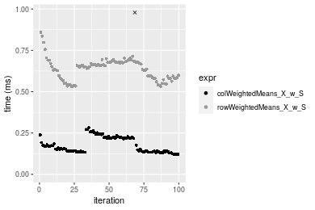


## Appendix

### Session information
```r
R version 4.1.1 Patched (2021-08-10 r80727)
Platform: x86_64-pc-linux-gnu (64-bit)
Running under: Ubuntu 18.04.5 LTS

Matrix products: default
BLAS:   /home/hb/software/R-devel/R-4-1-branch/lib/R/lib/libRblas.so
LAPACK: /home/hb/software/R-devel/R-4-1-branch/lib/R/lib/libRlapack.so

locale:
 [1] LC_CTYPE=en_US.UTF-8       LC_NUMERIC=C              
 [3] LC_TIME=en_US.UTF-8        LC_COLLATE=en_US.UTF-8    
 [5] LC_MONETARY=en_US.UTF-8    LC_MESSAGES=en_US.UTF-8   
 [7] LC_PAPER=en_US.UTF-8       LC_NAME=C                 
 [9] LC_ADDRESS=C               LC_TELEPHONE=C            
[11] LC_MEASUREMENT=en_US.UTF-8 LC_IDENTIFICATION=C       

attached base packages:
[1] stats     graphics  grDevices utils     datasets  methods   base     

other attached packages:
[1] microbenchmark_1.4-7   matrixStats_0.60.1     ggplot2_3.3.5         
[4] knitr_1.33             R.devices_2.17.0       R.utils_2.10.1        
[7] R.oo_1.24.0            R.methodsS3_1.8.1-9001 history_0.0.1-9000    

loaded via a namespace (and not attached):
 [1] Biobase_2.52.0          httr_1.4.2              splines_4.1.1          
 [4] bit64_4.0.5             network_1.17.1          assertthat_0.2.1       
 [7] highr_0.9               stats4_4.1.1            blob_1.2.2             
[10] GenomeInfoDbData_1.2.6  robustbase_0.93-8       pillar_1.6.2           
[13] RSQLite_2.2.8           lattice_0.20-44         glue_1.4.2             
[16] digest_0.6.27           XVector_0.32.0          colorspace_2.0-2       
[19] Matrix_1.3-4            XML_3.99-0.7            pkgconfig_2.0.3        
[22] zlibbioc_1.38.0         genefilter_1.74.0       purrr_0.3.4            
[25] ergm_4.1.2              xtable_1.8-4            scales_1.1.1           
[28] tibble_3.1.4            annotate_1.70.0         KEGGREST_1.32.0        
[31] farver_2.1.0            generics_0.1.0          IRanges_2.26.0         
[34] ellipsis_0.3.2          cachem_1.0.6            withr_2.4.2            
[37] BiocGenerics_0.38.0     mime_0.11               survival_3.2-13        
[40] magrittr_2.0.1          crayon_1.4.1            statnet.common_4.5.0   
[43] memoise_2.0.0           laeken_0.5.1            fansi_0.5.0            
[46] R.cache_0.15.0          MASS_7.3-54             R.rsp_0.44.0           
[49] progressr_0.8.0         tools_4.1.1             lifecycle_1.0.0        
[52] S4Vectors_0.30.0        trust_0.1-8             munsell_0.5.0          
[55] tabby_0.0.1-9001        AnnotationDbi_1.54.1    Biostrings_2.60.2      
[58] compiler_4.1.1          GenomeInfoDb_1.28.1     rlang_0.4.11           
[61] grid_4.1.1              RCurl_1.98-1.4          cwhmisc_6.6            
[64] rappdirs_0.3.3          startup_0.15.0          labeling_0.4.2         
[67] bitops_1.0-7            base64enc_0.1-3         boot_1.3-28            
[70] gtable_0.3.0            DBI_1.1.1               markdown_1.1           
[73] R6_2.5.1                lpSolveAPI_5.5.2.0-17.7 rle_0.9.2              
[76] dplyr_1.0.7             fastmap_1.1.0           bit_4.0.4              
[79] utf8_1.2.2              parallel_4.1.1          Rcpp_1.0.7             
[82] vctrs_0.3.8             png_0.1-7               DEoptimR_1.0-9         
[85] tidyselect_1.1.1        xfun_0.25               coda_0.19-4            
```
Total processing time was 12.35 secs.


### Reproducibility
To reproduce this report, do:
```r
html <- matrixStats:::benchmark('colRowWeightedMeans_subset')
```

[RSP]: https://cran.r-project.org/package=R.rsp
[matrixStats]: https://cran.r-project.org/package=matrixStats

[StackOverflow:colMins?]: https://stackoverflow.com/questions/13676878 "Stack Overflow: fastest way to get Min from every column in a matrix?"
[StackOverflow:colSds?]: https://stackoverflow.com/questions/17549762 "Stack Overflow: Is there such 'colsd' in R?"
[StackOverflow:rowProds?]: https://stackoverflow.com/questions/20198801/ "Stack Overflow: Row product of matrix and column sum of matrix"

---------------------------------------
Copyright Dongcan Jiang. Last updated on 2021-08-25 19:11:23 (+0200 UTC). Powered by [RSP].

<script>
 var link = document.createElement('link');
 link.rel = 'icon';
 link.href = "data:image/png;base64,iVBORw0KGgoAAAANSUhEUgAAACAAAAAgCAMAAABEpIrGAAAA21BMVEUAAAAAAP8AAP8AAP8AAP8AAP8AAP8AAP8AAP8AAP8AAP8AAP8AAP8AAP8AAP8AAP8AAP8AAP8AAP8AAP8AAP8AAP8AAP8AAP8AAP8AAP8AAP8AAP8AAP8AAP8AAP8AAP8AAP8AAP8AAP8AAP8AAP8AAP8AAP8AAP8AAP8AAP8BAf4CAv0DA/wdHeIeHuEfH+AgIN8hId4lJdomJtknJ9g+PsE/P8BAQL9yco10dIt1dYp3d4h4eIeVlWqWlmmXl2iYmGeZmWabm2Tn5xjo6Bfp6Rb39wj4+Af//wA2M9hbAAAASXRSTlMAAQIJCgsMJSYnKD4/QGRlZmhpamtsbautrrCxuru8y8zN5ebn6Pn6+///////////////////////////////////////////LsUNcQAAAS9JREFUOI29k21XgkAQhVcFytdSMqMETU26UVqGmpaiFbL//xc1cAhhwVNf6n5i5z67M2dmYOyfJZUqlVLhkKucG7cgmUZTybDz6g0iDeq51PUr37Ds2cy2/C9NeES5puDjxuUk1xnToZsg8pfA3avHQ3lLIi7iWRrkv/OYtkScxBIMgDee0ALoyxHQBJ68JLCjOtQIMIANF7QG9G9fNnHvisCHBVMKgSJgiz7nE+AoBKrAPA3MgepvgR9TSCasrCKH0eB1wBGBFdCO+nAGjMVGPcQb5bd6mQRegN6+1axOs9nGfYcCtfi4NQosdtH7dB+txFIpXQqN1p9B/asRHToyS0jRgpV7nk4nwcq1BJ+x3Gl/v7S9Wmpp/aGquum7w3ZDyrADFYrl8vHBH+ev9AUASW1dmU4h4wAAAABJRU5ErkJggg=="
 document.getElementsByTagName('head')[0].appendChild(link);
</script>


